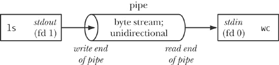
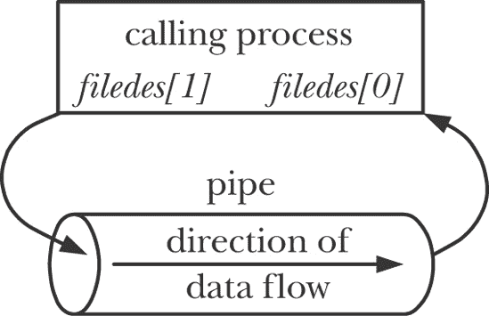
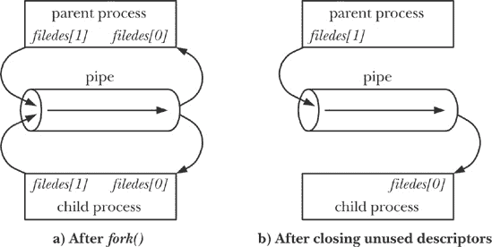
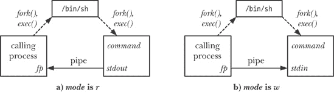
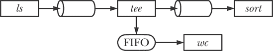
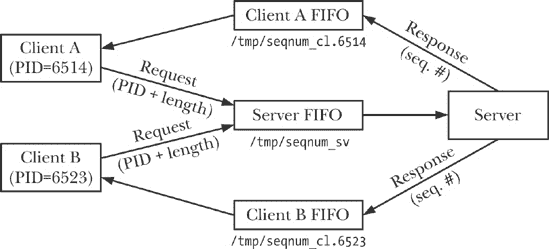
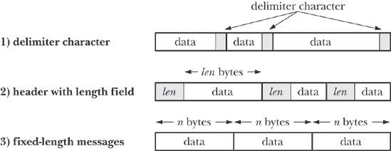
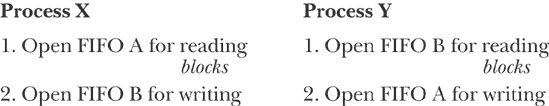

## 第四十四章. 管道和 FIFO

本章介绍了管道和 FIFO。管道是 UNIX 系统中最早的进程间通信方法，早在 1970 年代初的 UNIX 第三版中就已出现。管道为一个常见需求提供了优雅的解决方案：在创建了两个进程以运行不同程序（命令）后，shell 如何让一个进程产生的输出作为另一个进程的输入？管道可以用于在相关进程之间传递数据（*相关*的含义将在后面明确）。FIFO 是管道概念的变种。重要的区别是，FIFO 可以用于 *任何* 进程之间的通信。

## 概述

每个 shell 用户都熟悉使用管道的命令，例如下面的命令，用于计算目录中包含的文件数量：

```
$ `ls | wc -l`
```

为了执行上述命令，shell 创建了两个进程，分别执行 *ls* 和 *wc*。 （这是通过 *fork()* 和 *exec()* 完成的，相关内容在第二十四章和第二十七章中有介绍。）图 44-1 展示了这两个进程如何使用管道。

图 44-1 的目的之一是说明管道名称的由来。我们可以把管道想象成一段管道，它允许数据从一个进程流向另一个进程。

图 44-1. 使用管道连接两个进程

在图 44-1 中需要注意的一点是，两个进程通过管道连接，使得写入进程（*ls*）的标准输出（文件描述符 1）与管道的写入端相连接，而读取进程（*wc*）的标准输入（文件描述符 0）则与管道的读取端相连接。实际上，这两个进程并不知晓管道的存在；它们只不过是从标准文件描述符读取和写入数据而已。为了实现这种设置，shell 必须做一些工作，我们将在第 44.4 节看到如何实现这一点。

在接下来的段落中，我们将介绍管道的一些重要特性。

#### 管道是一个字节流

当我们说管道是一个字节流时，我们的意思是使用管道时并没有消息或消息边界的概念。读取管道的进程可以读取任意大小的数据块，而不考虑写入进程写入的数据块大小。此外，数据会按顺序通过管道——字节会按照它们写入的顺序从管道中读取。不能使用 *lseek()* 随机访问管道中的数据。

如果我们想在管道中实现离散消息的概念，必须在我们的应用程序中进行实现。虽然这是可行的（参考使用 FIFO 的客户端-服务器应用程序），但使用其他的 IPC 机制（如消息队列和数据报套接字）可能更为合适，我们将在后续章节中讨论这些。

#### 从管道中读取数据

如果尝试从当前为空的管道读取数据，读取操作会阻塞，直到至少有一个字节被写入管道。如果管道的写入端已关闭，则在进程读取完管道中的所有剩余数据后，会看到文件结束（即，*read()*返回 0）。

#### 管道是单向的

数据只能在管道中单向传输。管道的一端用于写入，另一端用于读取。

在一些其他 UNIX 实现中——特别是那些衍生自 System V Release 4 的实现——管道是双向的（即所谓的*流管道*）。双向管道并未被任何 UNIX 标准规定，因此即使在提供双向管道的实现中，也最好避免依赖其语义。作为替代，我们可以使用 UNIX 域流套接字对（通过*socketpair()*系统调用创建，详见创建一个连接的套接字对：*socketpair()*")），它提供了一种标准化的双向通信机制，其语义等同于流管道。

#### 写入不超过`PIPE_BUF`字节的数据保证是原子的

如果多个进程向同一个管道写入数据，则可以保证，如果它们每次写入的数据不超过`PIPE_BUF`字节，数据不会互相交错。

SUSv3 要求`PIPE_BUF`至少为`_POSIX_PIPE_BUF`（512）。一个实现应该在`<limits.h>`中定义`PIPE_BUF`，并/或允许调用*fpathconf(fd, _PC_PIPE_BUF)*来返回实际的原子写入上限。`PIPE_BUF`在不同的 UNIX 实现中有所不同；例如，在 FreeBSD 6.0 中为 512 字节，在 Tru64 5.1 中为 4096 字节，在 Solaris 8 中为 5120 字节。在 Linux 中，`PIPE_BUF`的值为 4096。

当向管道写入大于`PIPE_BUF`字节的数据块时，内核可能会将数据分成多个较小的部分进行传输，并在读取器从管道中移除字节时追加更多数据。（*write()* 调用会阻塞，直到所有数据都已写入管道。）当只有单个进程向管道写入数据时（即通常情况），这不会有问题。然而，如果有多个写入进程，则较大的数据块写入可能会被拆分成任意大小的段（这些段可能小于`PIPE_BUF`字节），并与其他进程的写入交织在一起。

`PIPE_BUF` 限制决定数据何时传输到管道。当写入不超过 `PIPE_BUF` 字节时，*write()* 会在必要时阻塞，直到管道中有足够的空间以便可以原子性地完成操作。当写入超过 `PIPE_BUF` 字节时，*write()* 会尽可能多地将数据写入管道，然后阻塞，直到有读取进程从管道中移除数据。如果这样的阻塞 *write()* 被信号处理程序中断，则该调用会解除阻塞并返回成功传输的字节数，这个字节数将小于请求的字节数（所谓的 *部分写入*）。

### 注意

在 Linux 2.2 上，*任何*大小的管道写入都是原子的，除非被信号处理程序中断。在 Linux 2.4 及更高版本中，任何大于 `PIPE_BUF` 字节的写入可能会与其他进程的写入交错进行。（在 2.2 和 2.4 版本之间，管道实现的内核代码经历了显著的变化。）

#### 管道有一个有限的容量

管道只是内核内存中维护的一个缓冲区。这个缓冲区有一个最大容量。一旦管道满了，进一步写入管道会阻塞，直到读取进程从管道中移除一些数据。

SUSv3 对管道容量没有要求。在 2.6.11 之前的 Linux 内核中，管道容量与系统页面大小相同（例如，x86-32 上为 4096 字节）；从 Linux 2.6.11 开始，管道容量为 65,536 字节。其他 UNIX 实现的管道容量各不相同。

一般来说，应用程序不需要知道管道的确切容量。如果我们想防止写入进程阻塞，则应设计读取管道的进程，以便在数据可用时立即读取。

### 注意

理论上，管道可以使用更小的容量来操作，甚至是一个字节的缓冲区。采用大缓冲区的原因是效率：每次写入进程填满管道时，内核必须执行上下文切换，以允许调度读取进程，从而让它能从管道中清除一些数据。使用更大的缓冲区意味着需要更少的上下文切换。

从 Linux 2.6.35 开始，管道的容量可以修改。Linux 特有的调用 *fcntl(fd, F_SETPIPE_SZ, size)* 将管道 *fd* 的容量更改为至少 *size* 字节。一个非特权进程可以将管道容量更改为从系统页面大小到 `/proc/sys/fs/pipe-max-size` 中的任何值。`pipe-max-size` 的默认值是 1,048,576 字节。具有特权的（`CAP_SYS_RESOURCE`）进程可以覆盖此限制。在为管道分配空间时，内核可能会将 *size* 向上舍入到某个方便实现的值。*fcntl(fd, F_GETPIPE_SZ)* 调用返回为管道分配的实际大小。

## 创建和使用管道

*pipe()* 系统调用创建一个新的管道。

```
#include <unistd.h>

int `pipe`(int *filedes*[2]);
```

### 注意

成功时返回 0，出错时返回 -1。

成功调用*pipe()*会返回一个包含两个打开文件描述符的数组*filedes*：一个用于管道的读端（*filedes[0]*），另一个用于写端（*filedes[1]*）。

与任何文件描述符一样，我们可以使用*read()*和*write()*系统调用对管道进行 I/O 操作。写入管道的写入端的数据会立即可供从读端读取。*read()*从管道读取时会获取请求的字节数和管道中当前可用字节数中的较小者（如果管道为空，则会阻塞）。

我们还可以通过首先使用*fdopen()*来获取与*filedes*中的一个描述符对应的文件流，进而使用*stdio*函数（*printf()*, *scanf()*等）与管道一起使用（混合库函数和系统调用进行文件 I/O）。然而，在这样做时，我们必须注意第 44.6 节中描述的*stdio*缓冲问题。

### 注意

调用*ioctl(fd, FIONREAD, &cnt)*返回管道或 FIFO 中未读取的字节数，该管道或 FIFO 由文件描述符*fd*引用。这个功能在一些其他实现中也可用，但在 SUSv3 中没有指定。

图 44-2 显示了通过*pipe()*创建管道后的情况，其中调用进程拥有指向每一端的文件描述符。

图 44-2. 创建管道后的进程文件描述符

在单个进程内，管道的用途很少（我们在自管道技巧中讨论了一个例子）。通常，我们使用管道来允许两个进程之间的通信。要使用管道连接两个进程，我们需要在*pipe()*调用后紧接着调用*fork()*。在*fork()*过程中，子进程会继承父进程的文件描述符副本（父子进程之间的文件共享），从而导致如图 44-3 左侧所示的情况。

图 44-3. 设置管道将数据从父进程传输到子进程

尽管父进程和子进程都可以读写管道，但这种情况并不常见。因此，在*fork()*调用后，一个进程会关闭管道写端的描述符，另一个则关闭管道读端的描述符。例如，如果父进程要向子进程发送数据，那么父进程会关闭管道的读描述符，*filedes[0]*，而子进程则会关闭管道的写描述符，*filedes[1]*，从而形成图 44-3 右侧所示的情况。创建该设置的代码见示例 44-1。

示例 44-1. 创建管道以将数据从父进程传输到子进程的步骤

```
int filedes[2];

    if (pipe(filedes) == -1)                    /* Create the pipe */
        errExit("pipe");

    switch (fork()) {                           /* Create a child process */
    case -1:
        errExit("fork");

    case 0:  /* Child */
        if (close(filedes[1]) == -1)            /* Close unused write end */
            errExit("close");

        /* Child now reads from pipe */
        break;

    default: /* Parent */
        if (close(filedes[0]) == -1)            /* Close unused read end */
            errExit("close");

        /* Parent now writes to pipe */
        break;
    }
```

父进程和子进程同时从单一管道中读取数据并不常见，原因之一是，如果两个进程试图同时读取管道中的数据，我们无法确定哪个进程会第一个成功——这两个进程争夺数据。为了防止这种竞争条件，通常需要使用某种同步机制。然而，如果我们需要双向通信，有一种更简单的方法：创建两个管道，每个方向一个，用于在两个进程之间传输数据。（如果采用这种方法，我们需要警惕死锁问题，尤其是当两个进程在尝试从空管道读取数据或尝试写入已满管道时发生阻塞。）

虽然多个进程可以向管道写入数据，但通常情况下只有一个写入者。（在第 44.3 节中，我们展示了一个多写入者的管道应用示例。）相反，在某些情况下，多个写入者对 FIFO 队列的使用是有益的，相关示例见第 44.8 节。

### 注意

从内核版本 2.6.27 开始，Linux 支持一个新的非标准系统调用，*pipe2()*。该系统调用执行与*pipe()*相同的任务，但支持一个额外的参数，*flags*，可以用来修改系统调用的行为。支持两种标志。`O_CLOEXEC`标志使内核为两个新的文件描述符启用执行时关闭标志（`FD_CLOEXEC`）。这个标志的用途与文件描述符号返回的*open()*")中的*open()* `O_CLOEXEC`标志相同。`O_NONBLOCK`标志使内核将两个底层打开的文件描述符标记为非阻塞，因此以后的 I/O 操作将是非阻塞的。这避免了额外调用*fcntl()*来实现相同的结果。

#### 管道允许相关进程之间的通信

到目前为止的讨论，我们谈到了使用管道进行父子进程之间的通信。然而，管道也可以用于任何两个（或更多）相关进程之间的通信，只要管道是在一系列*fork()* 调用之前由共同的祖先进程创建的。（这就是我们在本章开始时提到的*相关进程*的含义。）例如，管道可以用于进程与其孙子进程之间的通信。第一个进程创建管道，然后派生一个子进程，该子进程再派生出孙子进程。一个常见的场景是管道用于两个兄弟进程之间的通信——它们的父进程创建管道，然后创建这两个子进程。这正是 shell 在构建管道时所做的。

### 注意

有一个例外，关于管道只能在相关进程之间通信的说法。通过 UNIX 域套接字传递文件描述符（这是我们在传递文件描述符中简要描述的技术）使得可以将管道的文件描述符传递给一个不相关的进程。

#### 关闭未使用的管道文件描述符

关闭未使用的管道文件描述符不仅仅是确保进程不会耗尽其有限的文件描述符集的问题——它对管道的正确使用至关重要。我们现在来讨论为什么管道的读写端未使用的文件描述符必须被关闭。

从管道读取的进程会关闭其管道的写入描述符，这样，当另一个进程完成输出并关闭其写入描述符时，读取进程就会看到文件结束符（只要它读取了管道中所有未读的数据）。

如果读取进程没有关闭管道的写入端，那么，在另一个进程关闭其写入描述符后，读取进程即使已经从管道中读取了所有数据，仍然不会看到文件结束符。相反，*read()* 会阻塞，等待数据，因为内核知道管道仍然至少有一个写入描述符是打开的。该描述符由读取进程本身持有并不重要；理论上，即使读取进程被阻塞在读取操作上，它仍然可以向管道写入数据。例如，*read()* 可能会被一个信号处理程序中断，该信号处理程序会向管道写入数据。（这是一个现实的场景，正如我们在自管道技巧中将看到的那样。）

写入过程关闭管道的读描述符是出于不同的原因。当一个进程尝试向一个没有进程打开的读描述符的管道写入数据时，内核会向写入进程发送`SIGPIPE`信号。默认情况下，这个信号会终止进程。进程可以选择捕获或忽略这个信号，在这种情况下，管道上的*write()*调用会失败，并返回错误`EPIPE`（管道破裂）。接收到`SIGPIPE`信号或出现`EPIPE`错误是管道状态的有用指示，因此应该关闭未使用的管道读描述符。

### 注意

请注意，*write()*被`SIGPIPE`处理程序中断的处理方式是特殊的。通常，当*write()*（或其他“慢”系统调用）被信号处理程序中断时，调用会自动重新启动，或者会因错误`EINTR`而失败，具体取决于处理程序是否使用*sigaction()*的`SA_RESTART`标志安装（系统调用的中断与重启）。在`SIGPIPE`的情况下，行为有所不同，因为自动重启*write()*或仅仅表明*write()*被处理程序中断（从而暗示*write()*可以手动重启）没有任何意义。在这两种情况下，后续的*write()*尝试都无法成功，因为管道仍然是破损的。

如果写入进程没有关闭管道的读端，那么即使另一个进程关闭了管道的读端，写入进程仍然可以继续向管道写入数据。最终，写入进程会填满管道，进一步的写入尝试将会无限阻塞。

关闭未使用的文件描述符的另一个原因是，只有在所有引用管道的进程中的所有文件描述符都关闭后，管道才会被销毁，其资源会被释放以供其他进程重用。此时，管道中任何未读取的数据都会丢失。

#### 示例程序

示例 44-2 中的程序演示了使用管道在父进程和子进程之间进行通信。这个示例展示了之前提到的管道的字节流特性——父进程一次性写入数据，而子进程则从管道中小块读取数据。

主程序调用*pipe()*创建管道，然后调用*fork()*创建子进程。在*fork()*之后，父进程关闭管道的读取端文件描述符，并将作为程序命令行参数传入的字符串写入管道的写入端。然后，父进程关闭管道的读取端，并调用*wait()*等待子进程终止。子进程关闭管道的写入端文件描述符后，进入一个循环，从管道中读取最多`BUF_SIZE`字节的数据块，并将它们写入标准输出。当子进程在管道上遇到文件结束符时，它退出循环，写入一个尾随换行符，关闭读取端文件描述符，并终止。

这是我们运行程序时可能会看到的一个示例，来自示例 44-2：

```
$ `./simple_pipe 'It was a bright cold day in April, '\`
`'and the clocks were striking thirteen.'`
It was a bright cold day in April, and the clocks were striking thirteen.
```

示例 44-2. 使用管道在父进程和子进程之间进行通信

```
`pipes/simple_pipe.c`
    #include <sys/wait.h>
    #include "tlpi_hdr.h"

    #define BUF_SIZE 10

    int
    main(int argc, char *argv[])
    {
        int pfd[2];                             /* Pipe file descriptors */
        char buf[BUF_SIZE];
        ssize_t numRead;

        if (argc != 2 || strcmp(argv[1], "--help") == 0)
            usageErr("%s string\n", argv[0]);

    if (pipe(pfd) == -1)                    /* Create the pipe */
            errExit("pipe");

    switch (fork()) {xs
        case -1:
            errExit("fork");

        case 0:             /* Child  - reads from pipe */
        if (close(pfd[1]) == -1)            /* Write end is unused */
                errExit("close - child");

            for (;;) {              /* Read data from pipe, echo on stdout */
            numRead = read(pfd[0], buf, BUF_SIZE);
                if (numRead == -1)
                    errExit("read");
            if (numRead == 0)
                    break;                      /* End-of-file */
            if (write(STDOUT_FILENO, buf, numRead) != numRead)
                    fatal("child - partial/failed write");
            }

        write(STDOUT_FILENO, "\n", 1);
            if (close(pfd[0]) == -1)
                errExit("close");
            _exit(EXIT_SUCCESS);

        default:            /* Parent - writes to pipe */
        if (close(pfd[0]) == -1)            /* Read end is unused */
                errExit("close - parent");

if (write(pfd[1], argv[1], strlen(argv[1])) != strlen(argv[1]))
                fatal("parent - partial/failed write");

        if (close(pfd[1]) == -1)            /* Child will see EOF */
                errExit("close");
        wait(NULL);                         /* Wait for child to finish */
            exit(EXIT_SUCCESS);
        }
    }
         `pipes/simple_pipe.c`
```

## 管道作为进程同步的方法

在通过信号同步避免竞态条件中，我们探讨了如何利用信号来同步父子进程的操作，以避免竞态条件。管道也可以用来实现类似的结果，如示例 44-3 中的骨架程序所示。这个程序创建多个子进程（每个子进程对应一个命令行参数），每个子进程执行某些操作，在示例程序中通过睡眠一段时间来模拟。父进程会等待直到所有子进程完成其操作。

为了执行同步，父进程在创建子进程之前建立一个管道。每个子进程继承管道的写入端文件描述符，并在完成操作后关闭此描述符。当所有子进程都关闭了管道的写入端文件描述符后，父进程对管道的*read()*操作会完成，并返回文件结束符（0）。此时，父进程可以自由地继续执行其他工作。（请注意，父进程关闭管道中未使用的写入端对于此技术的正确操作至关重要，否则父进程在尝试从管道读取时会永远阻塞。）

以下是我们使用示例 44-3 中的程序创建三个子进程，它们分别睡眠 4、2 和 6 秒时的结果：

```
$ `./pipe_sync 4 2 6`
08:22:16  Parent started
08:22:18  Child 2 (PID=2445) closing pipe
08:22:20  Child 1 (PID=2444) closing pipe
08:22:22  Child 3 (PID=2446) closing pipe
08:22:22  Parent ready to go
```

示例 44-3. 使用管道同步多个进程

```
`pipes/pipe_sync.c`
    #include "curr_time.h"                      /* Declaration of currTime() */
    #include "tlpi_hdr.h"

    int
    main(int argc, char *argv[])
    {
        int pfd[2];                             /* Process synchronization pipe */
        int j, dummy;

            if (argc < 2 || strcmp(argv[1], "--help") == 0)
            usageErr("%s sleep-time...\n", argv[0]);

        setbuf(stdout, NULL);                   /* Make stdout unbuffered, since we
                                                   terminate child with _exit() */
        printf("%s  Parent started\n", currTime("%T"));

    if (pipe(pfd) == -1)
            errExit("pipe");

        for (j = 1; j < argc; j++) {
        switch (fork()) {
            case -1:
                errExit("fork %d", j);

            case 0: /* Child */
                if (close(pfd[0]) == -1)        /* Read end is unused */
                    errExit("close");

                /* Child does some work, and lets parent know it's done */

                sleep(getInt(argv[j], GN_NONNEG, "sleep-time"));
                                                /* Simulate processing */
                printf("%s  Child %d (PID=%ld) closing pipe\n",
                        currTime("%T"), j, (long) getpid());
            if (close(pfd[1]) == -1)
                    errExit("close");

                /* Child now carries on to do other things... */

                _exit(EXIT_SUCCESS);

            default: /* Parent loops to create next child */
                break;
            }
        }

        /* Parent comes here; close write end of pipe so we can see EOF */

    if (close(pfd[1]) == -1)                /* Write end is unused */
            errExit("close");

        /* Parent may do other work, then synchronizes with children */

    if (read(pfd[0], &dummy, 1) != 0)
            fatal("parent didn't get EOF");
        printf("%s  Parent ready to go\n", currTime("%T"));

        /* Parent can now carry on to do other things... */

        exit(EXIT_SUCCESS);
    }
          `pipes/pipe_sync.c`
```

使用管道进行同步相较于之前使用信号的同步方法有一个优势：它可以用来协调一个进程与多个其他（相关）进程的操作。由于多个（标准）信号不能排队，这使得信号在这种情况下不适用。（相反，信号的优势在于它们可以由一个进程广播到所有进程组成员。）

其他同步拓扑结构也是可能的（例如，使用多个管道）。此外，这种技术可以扩展，以便每个子进程在不关闭管道的情况下，向管道写入包含其进程 ID 和一些状态信息的消息。或者，每个子进程可能会向管道写入一个字节。父进程随后可以计算并分析这些消息。这种方法可以防止子进程意外终止，而不是显式地关闭管道。

## 使用管道连接过滤器

当创建一个管道时，用于管道两端的文件描述符是可用的下一个最低编号的描述符。由于在正常情况下，描述符 0、1 和 2 已经被进程占用，所以会为管道分配一些较高编号的描述符。那么，我们如何实现图 44-1 中所示的情况，其中两个过滤器（即从 *stdin* 读取并写入 *stdout* 的程序）通过管道连接，使得一个程序的标准输出被定向到管道，而另一个程序的标准输入则来自管道呢？尤其是，我们如何在不修改过滤器代码的情况下实现这一点？

答案是使用复制文件描述符中描述的技术来复制文件描述符。传统上，使用以下一系列调用来完成所需的结果：

```
int pfd[2];

pipe(pfd);          /* Allocates (say) file descriptors 3 and 4 for pipe */

/* Other steps here, e.g., fork() */

close(STDOUT_FILENO);           /* Free file descriptor 1 */
dup(pfd[1]);                    /* Duplication uses lowest free file
                                   descriptor, i.e., fd 1 */
```

上述步骤的最终结果是，进程的标准输出被绑定到管道的写端。可以使用一组相应的调用将进程的标准输入绑定到管道的读端。

请注意，这些步骤依赖于假设进程的文件描述符 0、1 和 2 已经打开。（shell 通常会为每个执行的程序确保这一点。）如果文件描述符 0 在上述步骤之前已被关闭，那么我们就会错误地将进程的标准*输入*绑定到管道的写端。为了避免这种可能性，我们可以将对*close()*和*dup()*的调用替换为以下*dup2()*调用，这允许我们明确指定要绑定到管道端的描述符：

```
dup2(pfd[1], STDOUT_FILENO);    /* Close descriptor 1, and reopen bound
                                   to write end of pipe */
```

在复制*pfd[1]*之后，我们现在有两个文件描述符指向管道的写端：描述符 1 和*pfd[1]*。由于未使用的管道文件描述符应当被关闭，因此在*dup2()*调用后，我们关闭多余的描述符：

```
close(pfd[1]);
```

到目前为止，我们展示的代码依赖于标准输出已经被打开。假设在调用*pipe()*之前，标准输入和标准输出都已关闭。在这种情况下，*pipe()*将这两个描述符分配给管道，可能是*pfd[0]*的值为 0，*pfd[1]*的值为 1。因此，之前的*dup2()*和*close()*调用将等同于以下代码：

```
dup2(1, 1);         /* Does nothing */
close(1);           /* Closes sole descriptor for write end of pipe */
```

因此，良好的防御性编程实践是将这些调用括起来，使用以下形式的`if`语句：

```
if (pfd[1] != STDOUT_FILENO) {
    dup2(pfd[1], STDOUT_FILENO);
    close(pfd[1]);
}
```

#### 示例程序

示例 44-4 中的程序使用了本节描述的技术，完成了在图 44-1 中显示的设置。构建管道后，该程序创建了两个子进程。第一个子进程将其标准输出绑定到管道的写端，然后执行*ls*。第二个子进程将其标准输入绑定到管道的读端，然后执行*wc*。

示例 44-4. 使用管道连接*ls*和*wc*

```
`pipes/pipe_ls_wc.c`
#include <sys/wait.h>
#include "tlpi_hdr.h"

int
main(int argc, char *argv[])
{
    int pfd[2];                                     /* Pipe file descriptors */

    if (pipe(pfd) == -1)                            /* Create pipe */
        errExit("pipe");

    switch (fork()) {
    case -1:
        errExit("fork");

    case 0:             /* First child: exec 'ls' to write to pipe */
        if (close(pfd[0]) == -1)                    /* Read end is unused */
            errExit("close 1");

        /* Duplicate stdout on write end of pipe; close duplicated descriptor */

        if (pfd[1] != STDOUT_FILENO) {              /* Defensive check */
            if (dup2(pfd[1], STDOUT_FILENO) == -1)
                errExit("dup2 1");
            if (close(pfd[1]) == -1)
                errExit("close 2");
        }

        execlp("ls", "ls", (char *) NULL);          /* Writes to pipe */
        errExit("execlp ls");

    default:            /* Parent falls through to create next child */
        break;
    }

    switch (fork()) {
    case -1:
        errExit("fork");

    case 0:             /* Second child: exec 'wc' to read from pipe */
        if (close(pfd[1]) == -1)                    /* Write end is unused */
            errExit("close 3");

        /* Duplicate stdin on read end of pipe; close duplicated descriptor */

        if (pfd[0] != STDIN_FILENO) {               /* Defensive check */
            if (dup2(pfd[0], STDIN_FILENO) == -1)
                errExit("dup2 2");
            if (close(pfd[0]) == -1)
                errExit("close 4");
        }

        execlp("wc", "wc", "-l", (char *) NULL);    /* Reads from pipe */
        errExit("execlp wc");

    default:            /* Parent falls through */
        break;
    }

    /* Parent closes unused file descriptors for pipe, and waits for children */

    if (close(pfd[0]) == -1)
        errExit("close 5");
    if (close(pfd[1]) == -1)
        errExit("close 6");
    if (wait(NULL) == -1)
        errExit("wait 1");
    if (wait(NULL) == -1)
        errExit("wait 2");

    exit(EXIT_SUCCESS);
}
     `pipes/pipe_ls_wc.c`
```

当我们运行示例 44-4 中的程序时，我们看到如下输出：

```
$ `./pipe_ls_wc`
     24
$ `ls | wc -l`                    *Verify the results using shell commands*
     24
```

## 通过管道与 Shell 命令交互：*popen()*

管道的一个常见用途是执行一个 shell 命令，并读取其输出或发送输入给它。*popen()* 和 *pclose()* 函数被提供来简化这一任务。

```
#include <stdio.h>

FILE *`popen`(const char **command*, const char **mode*);
```

### 注意

返回文件流，或在出错时返回`NULL`

```
int `pclose`(FILE **stream*);
```

### 注意

返回子进程的终止状态，或在出错时返回-1

*popen()* 函数创建一个管道，然后分叉一个子进程，该子进程执行一个 shell，进而创建一个子进程来执行 *command* 中给定的字符串。*mode* 参数是一个字符串，决定调用进程是从管道中读取（*mode* 为 *r*）还是向其写入（*mode* 为 *w*）。(由于管道是单向的，因此与执行的 *command* 进行双向通信是不可能的。) *mode* 的值决定了执行的命令的标准输出是否连接到管道的写端，或者其标准输入是否连接到管道的读端，如图 44-4* 的进程关系和管道使用概览")所示。

图 44-4. *popen()* 的进程关系和管道使用概览

在成功时，*popen()* 返回一个文件流指针，可以与 *stdio* 库函数一起使用。如果发生错误（例如，*mode* 不是 *r* 或 *w*，管道创建失败，或者 *fork()* 创建子进程失败），则 *popen()* 返回 `NULL` 并设置 *errno* 以指示错误的原因。

在 *popen()* 调用后，调用进程通过管道读取 *command* 的输出或向其发送输入。与使用 *pipe()* 创建的管道一样，当从管道读取时，一旦 *command* 关闭管道的写端，调用进程会遇到文件结束；当向管道写入时，如果 *command* 关闭了管道的读端，则会发送 `SIGPIPE` 信号，并返回 `EPIPE` 错误。

一旦 I/O 完成，使用 *pclose()* 函数关闭管道并等待子 shell 终止。（不应使用 *fclose()* 函数，因为它不会等待子进程。）成功时，*pclose()* 返回子 shell 的终止状态（终止状态值）（即 shell 执行的最后一个命令的终止状态，除非该 shell 被信号终止）。与 *system()* 一样（执行 shell 命令：*system()*")），如果无法执行 shell，则 *pclose()* 返回一个值，表示子 shell 已以 *_exit(127)* 调用终止。如果发生其他错误，*pclose()* 返回 -1。可能的错误之一是无法获得终止状态。我们将在稍后解释这种情况如何发生。

当执行等待以获取子 shell 的状态时，SUSv3 要求 *pclose()* 与 *system()* 一样，如果 *waitpid()* 调用被信号处理程序中断，应自动重新启动该调用。

通常，我们可以对*popen()*做出与在执行 Shell 命令：*system()*")中对*system()*所做的相同描述。使用*popen()*提供了便利，它会为我们建立管道、执行描述符复制、关闭未使用的描述符，并处理所有关于*fork()*和*exec()*的细节。此外，命令还会经过 Shell 处理。这种便利是以效率为代价的。至少必须创建两个额外的进程：一个用于 Shell，另一个或多个用于 Shell 执行的命令。与*system()*一样，*popen()*不应从特权程序中使用。

尽管*popen()*和*pclose()*与*system()*有许多相似之处，但也有显著的不同。这些不同源于这样的事实：在*system()*中，Shell 命令的执行被封装在一个单独的函数调用中，而在*popen()*中，调用进程与 Shell 命令并行运行，然后调用*pclose()*。这些差异如下：

+   由于调用进程和执行的命令并行运行，SUSv3 要求*popen()*不得忽略`SIGINT`和`SIGQUIT`信号。如果这些信号是从键盘生成的，它们会被发送到调用进程和执行的命令。这是因为这两个进程属于同一个进程组，终端生成的信号会发送到该（前台）进程组的所有成员，如第 34.5 节所述。

+   由于调用进程可能在执行*popen()*和*pclose()*之间创建其他子进程，SUSv3 要求*popen()*不得屏蔽`SIGCHLD`。这意味着如果调用进程在调用*pclose()*之前执行了等待操作，它可能会获取由*popen()*创建的子进程的状态。在这种情况下，当*pclose()*被调用时，它将返回-1，并且*errno*会被设置为`ECHILD`，表示*pclose()*无法获取子进程的状态。

#### 示例程序

示例 44-5 进行文件名模式的通配符匹配")演示了如何使用*popen()*和*pclose()*。该程序反复读取一个文件名通配符模式 ，然后使用*popen()*将该模式传递给*ls*命令，获取其结果 。(类似的技术曾在旧版 UNIX 实现中用于执行文件名生成，也称为*globbing*，在*glob()*库函数存在之前。)

示例 44-5. 使用*popen()*进行文件名模式的通配符匹配

```
`pipes/popen_glob.c`
    #include <ctype.h>
    #include <limits.h>
    #include "print_wait_status.h"          /* For printWaitStatus() */
    #include "tlpi_hdr.h"

#define POPEN_FMT "/bin/ls -d %s 2> /dev/null"
    #define PAT_SIZE 50
    #define PCMD_BUF_SIZE (sizeof(POPEN_FMT) + PAT_SIZE)

    int
    main(int argc, char *argv[])
    {
        char pat[PAT_SIZE];                 /* Pattern for globbing */
        char popenCmd[PCMD_BUF_SIZE];
        FILE *fp;                           /* File stream returned by popen() */
        Boolean badPattern;                 /* Invalid characters in 'pat'? */
        int len, status, fileCnt, j;
        char pathname[PATH_MAX];

        for (;;) {                  /* Read pattern, display results of globbing */
            printf("pattern: ");
            fflush(stdout);
        if (fgets(pat, PAT_SIZE, stdin) == NULL)
                break;                      /* EOF */
            len = strlen(pat);
            if (len <= 1)                   /* Empty line */
                continue;

            if (pat[len - 1] == '\n')       /* Strip trailing newline */
                pat[len - 1] = '\0';

            /* Ensure that the pattern contains only valid characters,
               i.e., letters, digits, underscore, dot, and the shell
               globbing characters. (Our definition of valid is more
               restrictive than the shell, which permits other characters
               to be included in a filename if they are quoted.) */

        for (j = 0, badPattern = FALSE; j < len && !badPattern; j++)
                if (!isalnum((unsigned char) pat[j]) &&
                        strchr("_*?[^-].", pat[j]) == NULL)
                    badPattern = TRUE;

            if (badPattern) {
                printf("Bad pattern character: %c\n", pat[j - 1]);
                continue;
            }

            /* Build and execute command to glob 'pat' */

        snprintf(popenCmd, PCMD_BUF_SIZE, POPEN_FMT, pat);
            popenCmd[PCMD_BUF_SIZE - 1] = '\0';     /* Ensure string is
                                                       null-terminated */
            fp = popen(popenCmd, "r");
            if (fp == NULL) {
                printf("popen() failed\n");
                continue;
            }

            /* Read resulting list of pathnames until EOF */

            fileCnt = 0;
            while (fgets(pathname, PATH_MAX, fp) != NULL) {
                printf("%s", pathname);
                fileCnt++;
            }

            /* Close pipe, fetch and display termination status */

            status = pclose(fp);
            printf("    %d matching file%s\n", fileCnt, (fileCnt != 1) ? "s" : "");
            printf("    pclose() status == %#x\n", (unsigned int) status);
            if (status != -1)
                printWaitStatus("\t", status);
        }

        exit(EXIT_SUCCESS);
    }
         `pipes/popen_glob.c`
```

以下 Shell 会话演示了示例 44-5 进行文件名模式的通配符匹配")程序的使用。在此示例中，我们首先提供一个匹配两个文件名的模式，然后提供一个不匹配任何文件名的模式：

```
$ `./popen_glob`
pattern: `popen_glob*`                          *Matches two filenames*
popen_glob
popen_glob.c
    2 matching files
    pclose() status = 0
        child exited, status=0
pattern: `x*`                                   *Matches no filename*
    0 matching files
    pclose() status = 0x100                   *ls(1)* *exits with status 1*
        child exited, status=1
pattern: `^D`$                                  *Type Control-D to terminate*
```

示例 44-5 进行文件名模式匹配") 中构建命令  进行文件名模式匹配需要一些解释。实际的模式匹配是由 shell 执行的。*ls* 命令仅用于列出匹配的文件名，每行一个。我们本可以尝试使用*echo*命令，但这样会导致不理想的结果：如果模式未匹配任何文件名，shell 会保持模式不变，*echo* 命令则会简单地显示该模式。相比之下，如果*ls*被给定一个不存在的文件名，它会在*stderr*上打印错误信息（我们通过将*stderr*重定向到`/dev/null`来处理），在*stdout*上不打印任何内容，并且以状态码 1 退出。

请注意在示例 44-5 进行文件名模式匹配")中执行的输入检查！[](figs/web/U003.png)。这是为了防止无效输入导致*popen()*执行意外的 shell 命令。假设这些检查被省略，用户输入了以下内容：

```
pattern: `; rm *`
```

然后程序将传递以下命令给*popen()*，并导致灾难性的结果：

```
/bin/ls -d ; rm * 2> /dev/null
```

在使用*popen()*（或*system()*)执行由用户输入构建的 shell 命令的程序中，始终需要进行此类输入检查。（另一种选择是让应用程序引用所有未检查的字符，以便这些字符不被 shell 进行特殊处理。）

## 管道和*stdio*缓冲

由于通过调用*popen()*返回的文件流指针不指向终端，*stdio*库对文件流应用了块缓冲（stdio 库中的缓冲）。这意味着当我们以*popen()*调用并指定模式为*w*时，默认情况下，输出只有在*stdio*缓冲区填满或我们使用*pclose()*关闭管道时，才会发送到管道另一端的子进程。在许多情况下，这不会造成问题。然而，如果我们需要确保子进程立即接收到管道上的数据，我们可以定期调用*fflush()*，或者使用*setbuf(fp, NULL)*禁用*stdio*缓冲。此技术还可以在我们使用*pipe()*系统调用创建管道，并使用*fdopen()*获取与管道写端对应的*stdio*流时使用。

如果调用 *popen()* 的进程正在从管道中读取（即 *mode* 为 *r*），情况可能并非如此简单。在这种情况下，如果子进程使用的是 *stdio* 库，则除非显式调用 *fflush()* 或 *setbuf()*，否则其输出只有在子进程填充 *stdio* 缓冲区或调用 *fclose()* 时才会传递给调用进程。（如果我们是从使用 *pipe()* 创建的管道读取，并且另一端的进程使用的是 *stdio* 库，情况也是如此。）如果这是一个问题，除非我们能够修改子进程中运行的程序的源代码并添加对 *setbuf()* 或 *fflush()* 的调用，否则几乎无能为力。

如果无法修改源代码，我们可以选择使用伪终端而不是管道。伪终端是一个 IPC 通道，在一端看起来像是一个终端。因此，*stdio* 库会对输出进行行缓冲。我们在第六十四章中描述了伪终端。

## FIFO

从语义上讲，FIFO 类似于管道。主要区别在于，FIFO 在文件系统中有一个名称，并且以与常规文件相同的方式打开。这使得 FIFO 可以用于不相关进程之间的通信（例如，客户端和服务器）。

一旦 FIFO 被打开，我们就可以像使用管道和其他文件一样使用相同的 I/O 系统调用（即 *read()*, *write()*, 和 *close()*）。就像管道一样，FIFO 也有写端和读端，数据按照写入的顺序从管道中读取。这个事实赋予了 FIFO 它们的名字：*先进先出*。FIFO 有时也被称为 *命名管道*。

与管道一样，当所有引用 FIFO 的描述符都已关闭时，任何未处理的数据都会被丢弃。

我们可以使用 *mkfifo* 命令从 shell 中创建 FIFO：

```
$ `mkfifo` [`-m` ``*`mode`*``] ``*`pathname`*``
```

*pathname* 是要创建的 FIFO 的名称，* -m * 选项用于指定权限 *mode*，与 *chmod* 命令的用法相同。

当应用于 FIFO（或管道）时，*fstat()* 和 *stat()* 会在 *stat* 结构的 *st_mode* 字段返回文件类型 `S_IFIFO`（检索文件信息：*stat()*")）。当使用 *ls -l* 列出时，FIFO 会在第一列显示类型 *p*，而 *ls -F* 会在 FIFO 路径名后附加管道符号（`|`）。

*mkfifo()* 函数创建一个新的 FIFO，并使用给定的 *pathname*。

```
#include <sys/stat.h>

int `mkfifo`(const char **pathname*, mode_t *mode*);
```

### 注意

成功时返回 0，出错时返回 -1

*mode* 参数指定了新 FIFO 的权限。这些权限通过将所需的常量组合从 表 15-4 与 目录权限 进行按位 OR 运算来指定。像往常一样，这些权限会与进程的 umask 值进行掩码操作（进程文件模式创建掩码：*umask()*")）。

### 注意

从历史上看，FIFO（先进先出队列）是通过系统调用 *mknod(pathname, S_IFIFO, 0)* 创建的。POSIX.1-1990 规范指定了 *mkfifo()*，它是一个更简单的 API，避免了 *mknod()* 的通用性，后者允许创建各种类型的文件，包括设备文件。（SUSv3 规范了 *mknod()*，但较为宽泛，仅定义了它用于创建 FIFO。）大多数 UNIX 实现将 *mkfifo()* 作为一个库函数，建立在 *mknod()* 之上。

一旦 FIFO 被创建，任何进程都可以打开它，前提是进行常规的文件权限检查（权限检查算法）。

打开 FIFO 具有一些不寻常的语义。通常，FIFO 的唯一合理用法是每端都有一个读进程和一个写进程。因此，默认情况下，打开 FIFO 以进行读取（*open()* 的 `O_RDONLY` 标志）会阻塞，直到另一个进程以写入模式打开 FIFO（*open()* 的 `O_WRONLY` 标志）。反之，打开 FIFO 以进行写入会阻塞，直到另一个进程以读取模式打开 FIFO。换句话说，打开 FIFO 会同步读写进程。如果 FIFO 的另一端已经打开（可能是因为一对进程已经打开了 FIFO 的两端），那么 *open()* 会立即成功。

在大多数 UNIX 实现中（包括 Linux），通过在打开 FIFO 时指定 `O_RDWR` 标志，可以绕过打开 FIFO 时的阻塞行为。在这种情况下，*open()* 会立即返回一个文件描述符，可以用于在 FIFO 上进行读写。这样做实际上破坏了 FIFO 的 I/O 模型，SUSv3 明确指出，使用 `O_RDWR` 标志打开 FIFO 是未指定的；因此，出于可移植性考虑，这种技术应该避免使用。在需要防止在打开 FIFO 时发生阻塞的情况下，*open()* 的 `O_NONBLOCK` 标志提供了一种标准化的做法（参见 非阻塞 I/O）。

### 注意

避免在打开 FIFO 时使用 `O_RDWR` 标志可能是出于另一个原因的考虑。经过这样的 *open()* 调用后，调用进程在从结果文件描述符读取时永远不会遇到文件结束标志，因为总会至少有一个描述符用于写入 FIFO——就是进程读取的同一个描述符。

#### 使用 FIFO 和*tee(1)*创建双重管道

Shell 管道的一个特点是它们是线性的；管道中的每个进程读取前一个进程生成的数据，并将数据发送给下一个进程。通过使用 FIFO，可以在管道中创建一个分支，使得一个进程的输出副本除了传递给管道中的下一个进程外，还发送给另一个进程。为了实现这一点，我们需要使用*tee*命令，它将从标准输入读取的内容写出两份：一份写到标准输出，另一份写到命令行参数指定的文件中。

将*tee*的*file*参数设置为 FIFO，允许我们让两个进程同时读取*tee*生成的重复输出。我们在下面的 Shell 会话中演示了这一点，首先创建一个名为`myfifo`的 FIFO，启动一个后台的*wc*命令，它打开 FIFO 进行读取（直到 FIFO 被打开进行写入时它才会继续），然后执行一个管道命令，将*ls*的输出发送到*tee*，*tee*既将输出传递到管道中进一步处理到*sort*，又将其发送到`myfifo` FIFO 中。（*sort*的*-k5n*选项会根据*ls*输出的第五个以空格分隔的字段对结果进行升序排序。）

```
$ `mkfifo myfifo`
$ `wc -l < myfifo &`
$ `ls -l | tee myfifo | sort -k5n`
*(Resulting output not shown)*
```

从图示来看，上述命令创建了图 44-5 创建双重管道")所示的情况。

### 注意

*tee*程序的名称来源于其形状。我们可以将*tee*视为类似管道的功能，但它有一个额外的分支来发送重复的输出。从图示来看，它的形状像大写字母*T*（见图 44-5 创建双重管道")）。除了这里描述的目的外，*tee*还用于调试管道和保存复杂管道中某个中间点生成的结果。

图 44-5. 使用 FIFO 和*tee(1)*创建双重管道

## 使用 FIFO 的客户端-服务器应用

本节中，我们展示了一个简单的客户端-服务器应用，它使用 FIFO 进行进程间通信（IPC）。服务器提供一个（简单的）服务，即为每个请求的客户端分配唯一的顺序号。在讨论这个应用的过程中，我们介绍了一些服务器设计中的概念和技术。

#### 应用概述

在示例应用程序中，所有客户端通过使用单个服务器 FIFO 向服务器发送请求。头文件 (示例 44-6) 定义了服务器用于其 FIFO 的著名名称 (`/tmp/seqnum_sv`)。这个名称是固定的，因此所有客户端都知道如何联系服务器。（在此示例应用程序中，我们将 FIFO 创建在 `/tmp` 目录中，因为这使得我们可以在大多数系统上便捷地运行程序而无需修改。然而，如在执行文件操作和文件 I/O 时的陷阱中所述，创建文件在公共可写目录（如 `/tmp`）中可能会导致各种安全漏洞，应在实际应用中避免。）

### 注意

在客户端-服务器应用中，我们会反复遇到 *著名地址* 或名称的概念，该概念由服务器使用以使其服务对客户端可见。使用著名地址是解决客户端如何知道在哪里联系服务器的一个方案。另一种可能的解决方案是提供某种名称服务器，服务器可以将其服务的名称注册到该服务器中。然后，每个客户端联系名称服务器以获取它所需服务的位置。这种解决方案允许服务器的位置灵活变化，但需要一些额外的编程工作。当然，客户端和服务器还需要知道如何联系名称服务器；通常，它位于一个著名地址。

然而，无法使用单个 FIFO 向所有客户端发送响应，因为多个客户端会竞争从 FIFO 中读取，并可能读取到其他客户端的响应消息，而不是自己的响应。因此，每个客户端都会创建一个唯一的 FIFO，服务器使用该 FIFO 来发送该客户端的响应，服务器需要知道如何找到每个客户端的 FIFO。一种可能的方法是客户端生成其 FIFO 路径名，然后将路径名作为请求消息的一部分传递。或者，客户端和服务器可以就构造客户端 FIFO 路径名的约定达成一致，客户端可以将构造该客户端特定路径名所需的信息作为请求的一部分传递给服务器。在我们的示例中使用了后一种解决方案。每个客户端的 FIFO 名称是从一个模板 (`CLIENT_FIFO_TEMPLATE`) 构建的，该模板包含一个包含客户端进程 ID 的路径名。进程 ID 的包含提供了一种生成对该客户端唯一名称的简便方法。

图 44-6 展示了该应用如何使用 FIFO 在客户端和服务器进程之间进行通信。

头文件（示例 44-6）定义了从客户端发送到服务器的请求消息格式，以及从服务器发送到客户端的响应消息格式。

图 44-6. 在单服务器多客户端应用中使用 FIFO

请记住，管道和 FIFO 中的数据是字节流；多个消息之间的边界不会被保留。这意味着当多个消息被传递到单个进程时（例如我们示例中的服务器），发送方和接收方必须就如何分隔消息达成某种约定。可以采用多种方法：

+   使用*定界符字符*结束每个消息，例如换行符。（有关此技术的示例，请参见示例 59-1，位于数据表示一节。）在这种情况下，定界符字符必须是消息中永远不会出现的字符，或者如果它确实出现在消息中，我们必须采用某种约定来转义该定界符。例如，如果我们使用换行符作为定界符，则可以使用字符 \ 加换行符来表示消息中的实际换行符，而 \\ 可以表示实际的 \。这种方法的一个缺点是，读取消息的进程必须从 FIFO 中逐字节扫描数据，直到找到定界符字符。

+   在每个消息中包含一个*固定大小的头部和长度字段*，该字段指定消息中剩余可变长度部分的字节数。在这种情况下，读取过程首先从 FIFO 中读取头部，然后使用头部的长度字段确定读取剩余消息所需的字节数。这种方法的优点是可以高效地处理任意大小的消息，但如果写入管道的是格式不正确的消息（例如，错误的*长度*字段），可能会导致问题。

+   使用*固定长度的消息*，并使服务器始终读取该固定大小的消息。这种方法的优点是编程简单。然而，它对消息的大小设置了上限，并且意味着某些通道容量将被浪费（因为短消息必须填充到固定长度）。此外，如果某个客户端意外或故意发送了长度不正确的消息，那么所有后续的消息都会不同步；在这种情况下，服务器很难恢复。

这三种技术在图 44-7 中进行了说明。请注意，对于每种技术，每个消息的总长度必须小于`PIPE_BUF`字节，以避免消息被内核分割并与其他写入者的消息交织。

### 注意

在主文中描述的三种技术中，所有客户端的所有消息都通过一个单一通道（FIFO）传输。另一种选择是为每个消息使用*单独连接*。发送方打开通信通道，发送消息，然后关闭通道。接收方在遇到文件结束符时知道消息已完整。如果多个写入者保持 FIFO 打开，那么这种方法不可行，因为当一个写入者关闭 FIFO 时，接收方无法看到文件结束符。然而，在使用流套接字时，这种方法是可行的，因为服务器进程为每个传入的客户端连接创建一个唯一的通信通道。

图 44-7. 在字节流中分离消息

在我们的示例应用中，我们使用上述技术中的第三种方法，每个客户端向服务器发送固定大小的消息。该消息由示例 44-6 中定义的*请求*结构定义。每个请求都包含客户端的进程 ID，这使得服务器能够构建客户端用于接收响应的 FIFO 名称。请求还包含一个字段（*seqLen*），指定应该为该客户端分配多少个序列号。服务器发送给客户端的响应消息由一个字段*seqNum*组成，它是分配给该客户端的序列号范围的起始值。

示例 44-6. `fifo_seqnum_server.c` 和 `fifo_seqnum_client.c` 的头文件

```
`pipes/fifo_seqnum.h`
#include <sys/types.h>
#include <sys/stat.h>
#include <fcntl.h>
#include "tlpi_hdr.h"

#define SERVER_FIFO "/tmp/seqnum_sv"
                                /* Well-known name for server's FIFO */
#define CLIENT_FIFO_TEMPLATE "/tmp/seqnum_cl.%ld"
                                /* Template for building client FIFO name */
#define CLIENT_FIFO_NAME_LEN (sizeof(CLIENT_FIFO_TEMPLATE) + 20)
                                /* Space required for client FIFO pathname
                                   (+20 as a generous allowance for the PID) */

struct request {                /* Request (client --> server) */
    pid_t pid;                  /* PID of client */
    int seqLen;                 /* Length of desired sequence */
};

struct response {               /* Response (server --> client) */
    int seqNum;                 /* Start of sequence */
};
     `pipes/fifo_seqnum.h`
```

#### 服务器程序

示例 44-7 是服务器的代码。服务器执行以下步骤：

+   创建服务器的知名 FIFO  并打开该 FIFO 进行读取 。服务器必须在任何客户端之前运行，以便当客户端尝试打开它时，服务器 FIFO 已存在。服务器的*open()*会阻塞，直到第一个客户端打开服务器 FIFO 的另一端进行写入。

+   再次打开服务器的 FIFO ，这次是用于写入。由于 FIFO 已经被打开用于读取，因此这不会阻塞。这个第二次打开是为了方便，确保当所有客户端关闭 FIFO 的写入端时，服务器不会看到文件结束符。

+   忽略 `SIGPIPE` 信号 ，这样如果服务器尝试写入一个没有读取器的客户端 FIFO，它不会收到 `SIGPIPE` 信号（默认情况下会终止进程），而是从 *write()* 系统调用中收到一个 `EPIPE` 错误。

+   进入一个循环，读取并响应每个传入的客户端请求 。为了发送响应，服务器构造客户端 FIFO 的名称 ，然后打开该 FIFO 。

+   如果服务器在打开客户端 FIFO 时遇到错误，它将放弃该客户端的请求 。

这是一个 *迭代服务器* 的示例，其中服务器在处理下一个客户端之前会先读取并处理每个客户端请求。迭代服务器设计适用于每个客户端请求都可以快速处理和响应的场景，这样其他客户端请求就不会被延迟。另一种设计是 *并发服务器*，其中主服务器进程使用一个独立的子进程（或线程）来处理每个客户端请求。我们将在 第六十章 中进一步讨论服务器设计。

示例 44-7. 使用 FIFO 的迭代服务器

```
`pipes/fifo_seqnum_server.c`
    #include <signal.h>
    #include "fifo_seqnum.h"

    int
    main(int argc, char *argv[])
    {
        int serverFd, dummyFd, clientFd;
        char clientFifo[CLIENT_FIFO_NAME_LEN];
        struct request req;
        struct response resp;
        int seqNum = 0;                     /* This is our "service" */

            /* Create well-known FIFO, and open it for reading */

        umask(0);                           /* So we get the permissions we want */
    if (mkfifo(SERVER_FIFO, S_IRUSR | S_IWUSR | S_IWGRP) == -1
                && errno != EEXIST)
            errExit("mkfifo %s", SERVER_FIFO);
    serverFd = open(SERVER_FIFO, O_RDONLY);
        if (serverFd == -1)
            errExit("open %s", SERVER_FIFO);

        /* Open an extra write descriptor, so that we never see EOF */

    dummyFd = open(SERVER_FIFO, O_WRONLY);
        if (dummyFd == -1)
            errExit("open %s", SERVER_FIFO);

    if (signal(SIGPIPE, SIG_IGN) == SIG_ERR)
            errExit("signal");

    for (;;) {                          /* Read requests and send responses */
            if (read(serverFd, &req, sizeof(struct request))
                    != sizeof(struct request)) {
                fprintf(stderr, "Error reading request; discarding\n");
                continue;                   /* Either partial read or error */
            }

            /* Open client FIFO (previously created by client) */

        snprintf(clientFifo, CLIENT_FIFO_NAME_LEN, CLIENT_FIFO_TEMPLATE,
                    (long) req.pid);
        clientFd = open(clientFifo, O_WRONLY);
            if (clientFd == -1) {           /* Open failed, give up on client */
                errMsg("open %s", clientFifo);
            continue;
            }

            /* Send response and close FIFO */

            resp.seqNum = seqNum;
            if (write(clientFd, &resp, sizeof(struct response))
                    != sizeof(struct response))
                fprintf(stderr, "Error writing to FIFO %s\n", clientFifo);
            if (close(clientFd) == -1)
                errMsg("close");

            seqNum += req.seqLen;           /* Update our sequence number */
        }
    }
         `pipes/fifo_seqnum_server.c`
```

#### 客户端程序

示例 44-8 是客户端的代码。客户端执行以下步骤：

+   创建一个 FIFO 用于接收来自服务器的响应 。在发送请求之前创建这个 FIFO，以确保当服务器尝试打开它并发送响应消息时，这个 FIFO 已经存在。

+   构造一条包含客户端进程 ID 和一个数字（该数字来自一个可选的命令行参数，用于指定客户端希望服务器分配给它的序列长度）的消息 。 （如果没有提供命令行参数，默认的序列长度为 1。）

+   打开服务器 FIFO ，并将消息发送到服务器 。

+   打开客户端 FIFO ，并读取和打印服务器的响应 。

另一个需要注意的细节是退出处理程序 ，它是通过 *atexit()*  实现的，确保当进程退出时，客户端的 FIFO 被删除。另一种选择是，我们可以在客户端 FIFO 的 *open()* 调用之后立即放置一个 *unlink()* 调用。这也是可行的，因为在那时，服务器和客户端都已经进行了阻塞的 *open()* 调用，且各自持有 FIFO 的打开文件描述符，删除文件系统中的 FIFO 名称并不会影响这些描述符或它们所指向的已打开文件描述。

这是运行客户端和服务器程序时我们看到的示例：

```
$ `./fifo_seqnum_server &`
[1] 5066
$ `./fifo_seqnum_client 3`                *Request a sequence of three numbers*
0                                       *Assigned sequence begins at 0*
$ `./fifo_seqnum_client 2`                *Request a sequence of two numbers*
3                                       *Assigned sequence begins at 3*
$ `./fifo_seqnum_client`                  *Request a single number*
5
```

示例 44-8. 序列号服务器的客户端

```
`pipes/fifo_seqnum_client.c`
    #include "fifo_seqnum.h"

    static char clientFifo[CLIENT_FIFO_NAME_LEN];

    static void             /* Invoked on exit to delete client FIFO */
removeFifo(void)
    {
        unlink(clientFifo);
    }

    int
    main(int argc, char *argv[])
    {
        int serverFd, clientFd;
        struct request req;
        struct response resp;

            if (argc > 1 && strcmp(argv[1], "--help") == 0)
            usageErr("%s [seq-len...]\n", argv[0]);

        /* Create our FIFO (before sending request, to avoid a race) */

        umask(0);                   /* So we get the permissions we want */
    snprintf(clientFifo, CLIENT_FIFO_NAME_LEN, CLIENT_FIFO_TEMPLATE,
                (long) getpid());
        if (mkfifo(clientFifo, S_IRUSR | S_IWUSR | S_IWGRP) == -1
                    && errno != EEXIST)
            errExit("mkfifo %s", clientFifo);

    if (atexit(removeFifo) != 0)
            errExit("atexit");

        /* Construct request message, open server FIFO, and send request */

    req.pid = getpid();
        req.seqLen = (argc > 1) ? getInt(argv[1], GN_GT_0, "seq-len") : 1;

    serverFd = open(SERVER_FIFO, O_WRONLY);
        if (serverFd == -1)
            errExit("open %s", SERVER_FIFO);

    if (write(serverFd, &req, sizeof(struct request)) !=
                sizeof(struct request))
            fatal("Can't write to server");

        /* Open our FIFO, read and display response */

    clientFd = open(clientFifo, O_RDONLY);
        if (clientFd == -1)
            errExit("open %s", clientFifo);

    if (read(clientFd, &resp, sizeof(struct response))
                != sizeof(struct response))
            fatal("Can't read response from server");

        printf("%d\n", resp.seqNum);
        exit(EXIT_SUCCESS);
    }
         `pipes/fifo_seqnum_client.c`
```

## 非阻塞 I/O

如前所述，当一个进程打开 FIFO 的一端时，如果另一端的 FIFO 尚未打开，它会阻塞。有时，我们希望避免阻塞，为此，调用*open()*时可以指定`O_NONBLOCK`标志：

```
fd = open("fifopath", O_RDONLY | O_NONBLOCK);
if (fd == -1)
    errExit("open");
```

如果 FIFO 的另一端已经打开，则`O_NONBLOCK`标志对*open()*调用没有影响——它会像往常一样立即成功地打开 FIFO。`O_NONBLOCK`标志仅在 FIFO 的另一端尚未打开时才会影响结果，具体效果取决于我们是以读模式还是写模式打开 FIFO：

+   如果 FIFO 以读模式打开，并且当前没有进程打开 FIFO 的写端，则*open()*调用会立即成功（就像 FIFO 的另一端已经打开一样）。

+   如果 FIFO 以写模式打开，并且 FIFO 的另一端尚未以读模式打开，则*open()*会失败，*errno*被设置为`ENXIO`。

`O_NONBLOCK`标志的非对称性，取决于 FIFO 是以读模式还是写模式打开，可以通过以下方式解释：当 FIFO 的另一端没有写入者时，以读模式打开 FIFO 是可以的，因为任何从 FIFO 读取的尝试都会返回没有数据。然而，尝试写入没有读取者的 FIFO 会导致生成`SIGPIPE`信号，并且*write()*返回`EPIPE`错误。

表 44-1*在 FIFO 中的语义")总结了打开 FIFO 的语义，包括上述`O_NONBLOCK`的影响。

表 44-1. *open()*在 FIFO 中的语义

| *open()*类型 | *open()*结果 |
| --- | --- |
| 打开方式 | 额外标志 | FIFO 的另一端已打开 | FIFO 的另一端已关闭 |
| --- | --- | --- | --- |
| 读取 | 无（阻塞） | 立即成功 | 阻塞 |
| `O_NONBLOCK` | 立即成功 | 立即成功 |
| 写入 | 无（阻塞） | 立即成功 | 阻塞 |
| `O_NONBLOCK` | 立即成功 | 失败（`ENXIO`） |

在打开 FIFO 时使用`O_NONBLOCK`标志有两个主要目的：

+   它允许一个进程同时打开 FIFO 的两个端。该进程首先以指定`O_NONBLOCK`标志的读模式打开 FIFO，然后再以写模式打开 FIFO。

+   它防止了在两个进程打开两个 FIFO 时发生死锁。

*死锁* 是指两种或更多进程被阻塞的情况，因为每个进程都在等待其他进程完成某些操作。图 44-8 中显示的两个进程发生了死锁。每个进程都在等待打开一个 FIFO 进行读取。如果每个进程都能执行第二步（打开另一个 FIFO 进行写入），则不会发生这种阻塞。这种死锁问题可以通过将进程 Y 中的步骤 1 和步骤 2 的顺序反转来解决，而不改变进程 X 中的顺序，或者反之。然而，在某些应用中，可能很难实现这种步骤的顺序。相反，我们可以通过让任一进程或两者在打开 FIFO 进行读取时指定 `O_NONBLOCK` 标志来解决这个问题。

图 44-8. 进程间打开两个 FIFO 的死锁

#### 非阻塞 *read()* 和 *write()*

`O_NONBLOCK` 标志不仅影响 *open()* 的语义，还会影响后续 *read()* 和 *write()* 调用的语义，因为该标志会持续存在于打开的文件描述符中。我们将在下一节中描述这些影响。

有时，我们需要更改一个已经打开的 FIFO（或其他类型的文件）上 `O_NONBLOCK` 标志的状态。这种需求可能出现在以下场景中：

+   我们使用 `O_NONBLOCK` 打开了一个 FIFO，但我们希望随后的 *read()* 和 *write()* 调用在阻塞模式下操作。

+   我们希望为通过 *pipe()* 返回的文件描述符启用非阻塞模式。更一般地说，我们可能希望改变任何非通过 *open()* 调用获得的文件描述符的非阻塞状态——例如，由 shell 为每个新程序运行自动打开的三个标准描述符之一，或由 *socket()* 返回的文件描述符。

+   对于某些特定应用的目的，我们需要切换文件描述符的 `O_NONBLOCK` 设置。

为了达到这个目的，我们可以使用 *fcntl()* 来启用或禁用 `O_NONBLOCK` 打开文件状态标志。要启用该标志，我们写下如下内容（省略错误检查）：

```
int flags;

flags = fcntl(fd, F_GETFL);       /* Fetch open files status flags */
flags |= O_NONBLOCK;              /* Enable O_NONBLOCK bit */
fcntl(fd, F_SETFL, flags);        /* Update open files status flags */
```

要禁用它，我们写下如下内容：

```
flags = fcntl(fd, F_GETFL);
flags &= ~O_NONBLOCK;             /* Disable O_NONBLOCK bit */
fcntl(fd, F_SETFL, flags);
```

## *read()* 和 *write()* 在管道和 FIFO 上的语义

表 44-2 总结了 *read()* 在管道和 FIFO 上的操作，并包括了 `O_NONBLOCK` 标志的影响。

阻塞和非阻塞读取之间唯一的区别发生在没有数据且写入端已打开时。在这种情况下，正常的 *read()* 会阻塞，而非阻塞的 *read()* 会因错误 `EAGAIN` 失败。

表 44-2. 从管道或 FIFO 中读取 *n* 字节的语义

| `O_NONBLOCK` 启用？ | 管道或 FIFO 中可用的数据字节（*p*） |
| --- | --- |
| *p = 0*，写入端打开 | *p = 0*，写入端关闭 | *p < n* | *p >= n* |
| --- | --- | --- | --- |
| 否 | 阻塞 | 返回 0（EOF） | 读取 *p* 字节 | 读取 *n* 字节 |
| 是 | 失败（`EAGAIN`） | 返回 0（EOF） | 读取 *p* 字节 | 读取 *n* 字节 |

在写入管道或 FIFO 时，`O_NONBLOCK` 标志的影响因与 `PIPE_BUF` 限制的交互而变得复杂。*write()* 的行为总结见 表 44-3。

表 44-3. 写入 *n* 字节到管道或 FIFO 的语义

| `O_NONBLOCK` 启用？ | 读取端打开 | 读取端关闭 |
| --- | --- | --- |
| *n <= PIPE_BUF* | *n > PIPE_BUF* |
| --- | --- |
| 否 | 原子性地写入 *n* 字节；可能会阻塞直到读取足够的数据以进行 *write()* | 写入 *n* 字节；可能会阻塞直到读取足够的数据以完成 *write()*；数据可能与其他进程的写入交错 | `SIGPIPE`+`EPIPE` |
| 是 | 如果有足够空间可以立即写入 *n* 字节，则 *write()* 会原子性成功；否则，失败（`EAGAIN`） | 如果有足够空间可以立即写入一些字节，则写入 1 到 *n* 字节（可能与其他进程写入的数据交错）；否则，*write()* 失败（`EAGAIN`） |

`O_NONBLOCK` 标志会导致管道或 FIFO 上的 *write()* 失败（错误 `EAGAIN`），只要无法立即传输数据。这意味着，如果我们写入的数据不超过 `PIPE_BUF` 字节，那么如果管道或 FIFO 中没有足够的空间，*write()* 将会失败，因为内核无法立即完成操作并且不能进行部分写入，因为这会破坏对写入不超过 `PIPE_BUF` 字节的原子性要求。

当一次写入超过`PIPE_BUF`字节时，写操作不要求是原子的。因此，*write()* 会尽可能多地传输字节（部分写入），以填满管道或 FIFO。在这种情况下，*write()* 的返回值是实际传输的字节数，调用者必须稍后重试以写入剩余的字节。然而，如果管道或 FIFO 已满，甚至无法传输一个字节，则 *write()* 会失败并返回错误 `EAGAIN`。

## 概述

管道是 UNIX 系统下最早的进程间通信（IPC）方法，并且被 shell 及其他应用程序频繁使用。管道是单向、有限容量的字节流，用于相关进程之间的通信。尽管可以将任意大小的数据块写入管道，但只有写入不超过 `PIPE_BUF` 字节的数据才会保证是原子的。除了作为进程间通信方法外，管道还可以用于进程同步。

使用管道时，我们必须小心关闭未使用的描述符，以确保读取进程能够检测到文件结束标志，而写入进程能够接收到 `SIGPIPE` 信号或 `EPIPE` 错误。（通常，最简单的方法是让写入管道的应用程序忽略 `SIGPIPE`，并通过 `EPIPE` 错误检测“断开的”管道。）

*popen()* 和 *pclose()* 函数允许程序将数据传输到标准 shell 命令中，或从中传输数据，而无需处理创建管道、执行 shell 和关闭未使用的文件描述符等细节。

FIFO 的工作方式与管道完全相同，只是它们是通过 *mkfifo()* 创建的，在文件系统中有一个名称，并且可以由任何具有适当权限的进程打开。默认情况下，打开 FIFO 进行读取时会阻塞，直到另一个进程打开该 FIFO 进行写入，反之亦然。

在本章的过程中，我们讨论了许多相关的主题。首先，我们了解了如何以一种方式复制文件描述符，使得过滤器的标准输入或输出可以绑定到管道上。在展示使用 FIFO 的客户端-服务器示例时，我们涉及了客户端-服务器设计中的多个主题，包括为服务器使用知名地址和迭代式与并发式服务器设计。在开发示例 FIFO 应用程序时，我们注意到，尽管通过管道传输的数据是字节流，但有时将数据打包成消息以便进程间通信是有用的，我们探讨了实现这一目的的各种方法。

最后，我们注意到 `O_NONBLOCK`（非阻塞 I/O）标志在打开和执行 FIFO 上的 I/O 操作时的效果。如果我们不希望在打开 FIFO 时发生阻塞，`O_NONBLOCK` 标志是有用的。如果我们不希望在没有数据可读时发生阻塞，或者在管道或 FIFO 内部空间不足时发生写入阻塞，这个标志也是有用的。

#### 进一步信息

管道的实现可以参考 [Bach, 1986] 和 [Bovet & Cesati, 2005]。有关管道和 FIFO 的有用细节也可以在 [Vahalia, 1996] 中找到。

## 练习

1.  编写一个程序，使用两个管道实现父子进程之间的双向通信。父进程应循环读取标准输入中的一块文本，并使用其中一个管道将文本发送给子进程，子进程将其转换为大写字母并通过另一个管道发送回父进程。父进程读取来自子进程的数据，并在标准输出上回显该数据，然后继续循环。

1.  实现 *popen()* 和 *pclose()*。尽管这些函数通过不需要在 *system()* 的实现中使用信号处理来简化（参见 实现 *system()*")），但你仍然需要小心正确地将管道端与每个进程中的文件流绑定，并确保所有未使用的描述符（指向管道端的）被关闭。由于通过多次调用 *popen()* 创建的子进程可能会同时运行，你需要维护一个数据结构，将 *popen()* 分配的文件流指针与相应的子进程 ID 关联起来。（如果使用数组来实现这一目的，可以利用 *fileno()* 函数返回的值，它获取与文件流对应的文件描述符，用于索引数组。）从该结构中获取正确的进程 ID 将使得 *pclose()* 可以选择要等待的子进程。这个结构还将有助于满足 SUSv3 要求，即必须关闭由先前调用 *popen()* 创建的任何仍然打开的文件流，这些文件流必须在新的子进程中关闭。

1.  示例 44-7 中的服务器（`fifo_seqnum_server.c`）每次启动时都会从 0 开始分配序列号。修改程序，使用一个备份文件，每次分配序列号时都更新此文件。（*open()* 中的 `O_SYNC` 标志，参见 *open()* 返回的文件描述符号")，可能会有用。）在启动时，程序应检查该文件是否存在，如果存在，使用其包含的值初始化序列号。如果启动时找不到备份文件，程序应创建一个新文件，并从 0 开始分配序列号。（这种技术的另一种替代方法是使用内存映射文件，详见 第四十九章。）

1.  向 示例 44-7 中的服务器（`fifo_seqnum_server.c`）添加代码，使得如果程序接收到 `SIGINT` 或 `SIGTERM` 信号时，它能删除服务器 FIFO 并终止。

1.  示例 44-7 中的服务器（`fifo_seqnum_server.c`）会对 FIFO 进行第二次 `O_WRONLY` 打开，以便在从 FIFO 的读取描述符（*serverFd*）读取时永远不会遇到文件结束符。你可以尝试一种替代方法：每当服务器在读取描述符上看到文件结束符时，它关闭该描述符，然后再次打开 FIFO 进行读取。（此打开操作会阻塞，直到下一个客户端打开 FIFO 进行写入。）这种方法有什么问题？

1.  示例 44-7 中的服务器（`fifo_seqnum_server.c`）假设客户端进程表现正常。如果一个不规范的客户端创建了客户端 FIFO 并向服务器发送请求，但没有打开其 FIFO，那么服务器尝试打开客户端 FIFO 时会阻塞，其他客户端的请求将被无限期延迟。（如果是恶意操作，这将构成*拒绝服务攻击*。）设计一种方案来解决此问题。相应地扩展服务器（并可能扩展示例 44-8 中的客户端）。

1.  编写程序验证 FIFO 上非阻塞打开和非阻塞 I/O 的操作（请参见非阻塞 I/O）。
