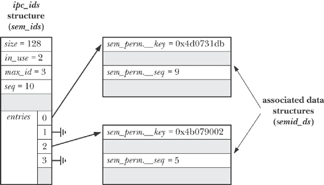

## 第四十五章. System V IPC 简介

System V IPC 是用于指代三种不同进程间通信机制的标签：

+   *消息队列*可用于在进程之间传递消息。消息队列有点像管道，但在两个重要方面有所不同。首先，消息边界被保留，因此读者和写者按消息单位进行通信，而不是通过没有分隔符的字节流进行通信。其次，每个消息包括一个整数*类型*字段，可以按类型选择消息，而不是按照它们写入的顺序读取消息。

+   *信号量*允许多个进程同步它们的操作。信号量是由内核维护的整数值，所有具有必要权限的进程都可以看到该值。一个进程通过适当修改信号量的值来向其同伴指示自己正在执行某个操作。

+   *共享内存*使得多个进程可以共享同一区域（称为*段*）的内存（即，相同的页面框架映射到多个进程的虚拟内存中）。由于访问用户空间内存是一个快速操作，共享内存是 IPC 中最快的方法之一：一旦一个进程更新了共享内存，其他共享相同段的进程就能立即看到该更改。

尽管这三种 IPC 机制在功能上各有不同，但有充分的理由将它们一起讨论。一个原因是它们是一起开发的，首次出现在 1970 年代末期的哥伦布 UNIX 中。这是贝尔公司内部用于数据库和事务处理系统的 UNIX 实现，用于电话公司记录保存和管理。大约在 1983 年，这些 IPC 机制通过出现在 System V 中进入了主流 UNIX——因此被称为 System V IPC。

讨论 System V IPC 机制的另一个重要原因是它们的编程接口共享许多共同特性，因此许多相同的概念适用于所有这些机制。

### 注意

因为系统 V IPC 是 SUSv3 为 XSI 兼容性所要求的，它有时被称为*XSI IPC*。

本章提供了 System V IPC 机制的概述，并详细介绍了所有三种机制共有的特性。接下来的章节将逐一讨论这三种机制。

### 注意

System V IPC 是一个内核选项，可以通过 CONFIG_SYSVIPC 选项进行配置。

## API 概述

表 45-1 总结了用于操作 System V IPC 对象的头文件和系统调用。

一些实现要求在包含表 45-1 中显示的头文件之前，先包含 `<sys/types.h>`。一些较旧的 UNIX 实现可能还要求包含 `<sys/ipc.h>`。（没有版本的单一 UNIX 规范要求这些头文件。）

### 注意

在大多数实现 Linux 的硬件架构上，一个系统调用（*ipc(2)*) 作为所有系统 V IPC 操作进入内核的入口点，表 45-1 中列出的所有调用，实际上都作为库函数实现，并层叠在此系统调用之上。（Alpha 和 IA-64 是两个例外，表中的函数实际上是作为单独的系统调用实现的。）这种略显不寻常的方法是系统 V IPC 最初作为可加载内核模块实现时的产物。尽管在大多数 Linux 架构上它们实际上是库函数，但在本章中，我们将表 45-1 中的函数称为系统调用。只有 C 库的实现者需要使用 *ipc(2)*；在应用程序中的任何其他用途都不是可移植的。

表 45-1. 系统 V IPC 对象的编程接口总结

| 接口 | 消息队列 | 信号量 | 共享内存 |
| --- | --- | --- | --- |
| 头文件 | `<sys/msg.h>` | `<sys/sem.h>` | `<sys/shm.h>` |
| 关联数据结构 | *msqid_ds* | *semid_ds* | *shmid_ds* |
| 创建/打开对象 | *msgget()* | *semget()* | *shmget()* + *shmat()* |
| 关闭对象 | （无） | （无） | *shmdt()* |
| 控制操作 | *msgctl()* | *semctl()* | *shmctl()* |
| 执行 IPC | *msgsnd()*—写消息 *msgrcv()*—读消息 | *semop()*—测试/调整信号量 | 在共享区域访问内存 |

#### 创建和打开一个系统 V IPC 对象

每种系统 V IPC 机制都有一个关联的 *get* 系统调用（*msgget()*、*semget()* 或 *shmget()*），它类似于用于文件的 *open()* 系统调用。给定一个整数 *key*（类似于文件名），*get* 调用要么：

+   使用给定的键创建一个新的 IPC 对象，并返回该对象的唯一标识符；或者

+   返回具有给定键的现有 IPC 对象的标识符。

我们（大致地）称第二种用法为“打开”现有的 IPC 对象。在这种情况下，*get* 调用所做的只是将一个数字（键）转换为另一个数字（标识符）。

### 注意

在 System V IPC 的上下文中，*对象*并不包含面向对象编程中的任何含义。这个术语仅用于区分 System V IPC 机制与文件。尽管文件和 System V IPC 对象之间有许多相似之处，但 IPC 对象的使用在几个重要方面与标准的 UNIX 文件 I/O 模型不同，这也是使用 System V IPC 机制时的一些复杂性来源。

IPC *标识符* 类似于文件描述符，因为它在所有后续的系统调用中用于引用 IPC 对象。然而，它们之间有一个重要的语义差异。文件描述符是进程属性，而 IPC 标识符是对象本身的属性，并且在系统范围内可见。所有访问同一对象的进程都使用相同的标识符。这意味着，如果我们知道某个 IPC 对象已经存在，并且有其他方式知道该对象的标识符，则可以跳过*get*调用。例如，创建该对象的进程可能会将标识符写入一个文件，其他进程可以读取该文件。

以下示例展示了如何创建一个 System V 消息队列：

```
id = msgget(key, IPC_CREAT | S_IRUSR | S_IWUSR);
if (id == -1)
    errExit("msgget");
```

与所有*get*调用一样，关键字是第一个参数，标识符作为函数结果返回。我们在*get*调用的最后一个（*flags*）参数中指定要放置在新对象上的权限，使用与文件相同的位掩码常量（表 15-4，常规文件权限）。在上面的例子中，只有对象的所有者被授予读取和写入队列消息的权限。

进程的 umask（进程文件模式创建掩码：*umask()*")）不适用于新创建的 IPC 对象的权限。

### 注意

一些 UNIX 实现定义了以下位掩码常量用于 IPC 权限：`MSG_R, MSG_W, SEM_R, SEM_A, SHM_R` 和 `SHM_W`。这些常量对应于每个 IPC 机制的所有者（用户）读写权限。要获得相应的组和其他权限位掩码，可以将这些常量右移 3 位和 6 位。这些常量并未被 SUSv3 指定，SUSv3 采用与文件相同的位掩码，并且在*glibc*头文件中没有定义。

每个希望访问同一 IPC 对象的进程都会执行一个*get*调用，指定相同的关键字，以便获得该对象的相同标识符。我们将在第 45.2 节中讨论如何为应用程序选择关键字。

如果当前没有与给定键对应的 IPC 对象，并且在*flags*参数中指定了`IPC_CREAT`（类似于*open()*的`O_CREAT`标志），则*get*调用会创建一个新的 IPC 对象。如果当前没有对应的 IPC 对象，并且没有指定`IPC_CREAT`（且键未指定为`IPC_PRIVATE`，参见 IPC Keys），则*get*调用会因错误`ENOENT`而失败。

进程可以通过指定`IPC_EXCL`标志（类似于*open()*的`O_EXCL`标志）来保证它是唯一创建 IPC 对象的进程。如果指定了`IPC_EXCL`，并且与给定键对应的 IPC 对象已经存在，则*get*调用会因错误`EEXIST`而失败。

#### IPC 对象删除与对象持久性

每个 System V IPC 机制的 ctl 系统调用（*msgctl(), semctl(), shmctl()*）执行一系列对对象的*控制操作*。其中许多操作是特定于 IPC 机制的，但也有一些是所有 IPC 机制通用的。例如，`IPC_RMID`就是一种通用的控制操作，用于删除对象。例如，我们可以使用以下调用来删除一个共享内存对象：

```
if (shmctl(id, IPC_RMID, NULL) == -1)
    errExit("shmctl");
```

对于消息队列和信号量，IPC 对象的删除是立即生效的，且对象中包含的任何信息都会被销毁，无论是否有其他进程仍在使用该对象。（这是 System IPC 对象的操作与文件操作不完全相同的一个例子。在创建和删除（硬）链接：*link*()和*unlink*()和 unlink()")中，我们看到如果删除文件的最后一个链接，只有在所有引用该文件的打开文件描述符关闭后，文件才会被真正删除。）

共享内存对象的删除方式不同。执行*shmctl(id, IPC_RMID, NULL)*调用后，只有在所有使用该段的进程分离该段（使用*shmdt()*）后，才会删除共享内存段。（这与文件删除的情况更为接近。）

System V IPC 对象具有内核持久性。一旦创建，对象会一直存在，直到显式删除或系统关闭。System V IPC 对象的这一特性可能带来优势。进程可以创建一个对象，修改其状态，然后退出，允许稍后启动的进程访问该对象。它也可能带来一些不利影响，原因如下：

+   每种类型的 IPC 对象都有系统设定的数量限制。如果我们未能移除未使用的对象，最终可能会因为达到这些限制而遇到应用程序错误。

+   在删除消息队列或信号量对象时，多进程应用程序可能无法轻松确定哪个进程是最后一个需要访问该对象的进程，从而确定何时可以安全地删除该对象。问题在于这些对象是*无连接的*——内核并不会记录哪些进程打开了该对象。（这个缺点对于共享内存段并不适用，因为它们具有不同的删除语义，如上所述。）

## IPC 键值

System V IPC 键值是整数类型，用*key_t*数据类型表示。IPC *get*调用将键值转换为相应的整数 IPC 标识符。这些调用保证，如果我们创建一个新的 IPC 对象，那么该对象将具有唯一标识符；如果我们指定一个已存在对象的键值，则始终会获得该对象的（相同）标识符。（在内部，内核维护着将键值映射到每个 IPC 机制标识符的数据结构，如第 45.5 节所述。）

那么，我们如何提供一个唯一的键值——确保我们不会意外获得某个其他应用程序使用的现有 IPC 对象的标识符呢？有三种可能性：

+   随机选择一个整数键值，通常将其放在一个所有使用 IPC 对象的程序都包含的头文件中。这个方法的难点在于，我们可能会不小心选择一个其他应用程序使用的值。

+   在创建 IPC 对象时，将`IPC_PRIVATE`常量作为*key*值传递给*get*调用，这样总是会创建一个具有唯一键值的新 IPC 对象。

+   使用*ftok()*函数生成一个（可能是唯一的）键值。

使用`IPC_PRIVATE`或*ftok()*是常用的技术。

#### 使用`IPC_PRIVATE`生成唯一键值

在创建新的 IPC 对象时，键可以指定为`IPC_PRIVATE`，如下所示：

```
id = msgget(IPC_PRIVATE, S_IRUSR | S_IWUSR);
```

在这种情况下，不需要指定`IPC_CREAT`或`IPC_EXCL`标志。

该技术在多进程应用程序中特别有用，其中父进程在执行*fork()*之前创建 IPC 对象，结果是子进程继承了 IPC 对象的标识符。我们还可以在客户端-服务器应用程序中使用此技术（即涉及不相关进程的应用程序），但客户端必须有一种方法来获取服务器创建的 IPC 对象的标识符（反之亦然）。例如，创建 IPC 对象后，服务器可以将其标识符写入一个文件，供客户端读取。

#### 使用*ftok()*生成唯一的键值。

*ftok()*（*文件到键值*）函数返回一个适用于随后的 System V IPC *get*系统调用的键值。

```
#include <sys/ipc.h>

key_t `ftok`(char **pathname*, int *proj*);
```

### 注意

成功时返回整数键值，出错时返回-1。

该键值是通过实现定义的算法，从提供的*路径名*和*proj*值生成的。SUSv3 提出了以下要求：

+   只有*proj*的最低有效 8 位会被算法使用。

+   应用程序必须确保*pathname*引用的是一个存在的文件，并且*stat()*可以应用于该文件（否则，*ftok()*将返回-1）。

+   如果不同的路径名（链接）引用同一个文件（即 i 节点），并且提供给*ftok()*时使用相同的*proj*值，则必须返回相同的键值。

换句话说，*ftok()*使用的是 i 节点号，而不是文件名来生成键值。（因为*ftok()*算法依赖于 i 节点号，所以在应用程序的生命周期内，文件不应被删除并重新创建，因为很可能重新创建的文件会有不同的 i 节点号。）*proj*值的目的是让我们能够从同一个文件生成多个键值，这在应用程序需要创建多个相同类型的 IPC 对象时非常有用。从历史上看，*proj*参数是*char*类型，并且在调用*ftok()*时，通常指定为这种类型。

### 注意

如果*proj*为 0，SUSv3 未指定*ftok()*的行为。在 AIX 5.1 中，如果*proj*指定为 0，*ftok()*将返回-1。在 Linux 上，这个值没有特殊含义。尽管如此，可移植的应用程序应该避免将*proj*指定为 0；不过仍然可以选择 255 个其他值。

通常，提供给*ftok()*的*pathname*是应用程序创建的文件或目录之一，且合作进程将相同的*pathname*传递给*ftok()*。

在 Linux 上，*ftok()*返回的键值是一个 32 位值，通过取*proj*参数的最低有效 8 位、包含文件系统的设备的设备号（即设备的次设备号）的最低有效 8 位，以及*pathname*所指向文件的 i 节点号的最低有效 16 位来创建。（后两部分信息是通过对*pathname*调用*stat()*获得的。）

*glibc ftok()*算法与其他 UNIX 实现上使用的算法类似，并且存在相似的限制：有（非常小的）可能性导致两个不同的文件生成相同的键值。这是因为有可能两个不同文件的 i 节点号最低有效位在不同文件系统上相同，再加上在具有多个磁盘控制器的系统上，两个不同的磁盘设备可能具有相同的次设备号。然而，实际上，不同应用程序发生键值冲突的可能性足够小，因此使用*ftok()*生成键值仍然是一种可行的技术。

*ftok()*的典型用法如下：

```
key_t key;
int id;

key = ftok("/mydir/myfile", 'x');
if (key == -1)
    errExit("ftok");
id = msgget(key, IPC_CREAT | S_IRUSR | S_IWUSR);
if (id == -1)
    errExit("msgget");
```

## 相关数据结构和对象权限

内核为每个系统 V IPC 对象实例维护一个相关的数据结构。这个数据结构的形式根据 IPC 机制（消息队列、信号量或共享内存）不同而有所变化，并在相应的 IPC 机制头文件中定义（见 表 45-1）。我们将在后续章节中讨论这些数据结构的机制特定细节。

IPC 对象的相关数据结构在通过适当的 *get* 系统调用创建对象时进行初始化。对象创建后，程序可以通过适当的 *ctl* 系统调用获取该数据结构的副本，并指定 `IPC_STAT` 操作类型。相反，可以使用 `IPC_SET` 操作修改数据结构的某些部分。

除了特定于 IPC 对象类型的数据外，所有三种 IPC 机制的相关数据结构都包括一个子结构 *ipc_perm*，该子结构包含用于确定对象上授予的权限的信息：

```
struct ipc_perm {
    key_t          __key;           /* Key, as supplied to 'get' call */
    uid_t          uid;             /* Owner's user ID */
    gid_t          gid;             /* Owner's group ID */
    uid_t          cuid;            /* Creator's user ID */
    gid_t          cgid;            /* Creator's group ID */
    unsigned short mode;            /* Permissions */
    unsigned short __seq;           /* Sequence number */
};
```

SUSv3 强制要求所有此处显示的 *ipc_perm* 字段，除了 *__key* 和 *__seq*。然而，大多数 UNIX 实现提供了这些字段的某些版本。

*uid* 和 *gid* 字段指定了 IPC 对象的所有权。*cuid* 和 *cgid* 字段包含创建该对象的进程的用户 ID 和组 ID。最初，相关的用户和创建者 ID 字段具有相同的值，这些值来自调用进程的有效 ID。创建者 ID 是不可变的，但所有者 ID 可以通过 `IPC_SET` 操作进行更改。以下代码演示了如何更改共享内存段的 uid 字段（相关的数据结构类型为 *shmid_ds*）：

```
struct shmid_ds shmds;

if (shmctl(id, IPC_STAT, &shmds) == -1)     /* Fetch from kernel */
    errExit("shmctl");
shmds.shm_perm.uid = newuid;                /* Change owner UID */
if (shmctl(id, IPC_SET, &shmds) == -1)      /* Update kernel copy */
    errExit("shmctl");
```

*ipc_perm* 子结构的 *mode* 字段包含 IPC 对象的权限掩码。这些权限使用 *get* 系统调用中指定的 *flags* 的低 9 位进行初始化，该调用用于创建对象，但随后可以使用 `IPC_SET` 操作进行更改。

与文件类似，权限分为三类——*所有者*（也称为 *用户*）、*组* 和 *其他*——并且可以为每一类指定不同的权限。然而，与用于文件的方案相比，有一些显著的差异：

+   仅读和写权限对于 IPC 对象是有意义的。（对于信号量，写权限通常被称为 *alter* 权限。）执行权限是无意义的，在进行大多数访问检查时会被忽略。

+   权限检查是根据进程的有效用户 ID、有效组 ID 和附加组 ID 进行的。（这与 Linux 上文件系统权限检查不同，后者是通过进程的文件系统 ID 来执行的，详见第 9.5 节。）

控制进程对 IPC 对象的权限的具体规则如下：

1.  如果进程具有特权（`CAP_IPC_OWNER`），则所有权限都会授予该 IPC 对象。

1.  如果进程的有效用户 ID 与 IPC 对象的所有者或创建者用户 ID 匹配，则该进程将被授予为该对象的 *owner* (*user*) 定义的权限。

1.  如果进程的有效组 ID 或任何附加组 ID 与 IPC 对象的所有者组 ID 或创建者组 ID 匹配，则该进程将被授予为该对象定义的 *group* 权限。

1.  否则，进程将获得为 *other* 定义的权限。

### 注意

在内核代码中，上述测试构建方式是，当进程没有通过其他测试获得所需的权限时，才会执行测试以判断进程是否具有特权。这样做是为了避免不必要地设置 `ASU` 进程会计标志，表示进程使用了超级用户权限（进程会计）。

请注意，`IPC_PRIVATE` 键值的使用或 `IPC_EXCL` 标志的存在与哪些进程可以访问 IPC 对象无关；此类访问完全由对象的所有权和权限决定。

读取和写入权限如何被解释以及是否需要，取决于对象的类型和正在执行的操作。

当执行 *get* 调用以获取现有 IPC 对象的标识符时，会进行初始权限检查，以确定 *flags* 参数中指定的权限是否与现有对象上的权限兼容。如果不兼容，则 *get* 调用失败，并返回错误 `EACCES`。（除非另有说明，否则在以下列出的每种情况下权限被拒绝时，也会返回此错误代码。）例如，考虑两个在同一组中的不同用户，其中一个用户使用以下调用创建一个消息队列：

```
msgget(key, IPC_CREAT | S_IRUSR | S_IWUSR | S_IRGRP);
                        /* rw-r----- */
```

第二个用户尝试使用以下调用获取该消息队列的标识符时会失败，因为该用户没有被授权写访问该消息队列：

```
msgget(key, S_IRUSR | S_IWUSR);
```

第二个用户可以通过为 *msgget()* 调用的第二个参数指定 0 来绕过此检查，在这种情况下，只有在程序尝试执行需要写权限的操作时（例如，使用 *msgsnd()* 写入消息）才会发生错误。

### 注意

*get* 调用表示执行权限未被忽略的情况。尽管对于 IPC 对象没有实际意义，但如果在对现有对象的 *get* 调用中请求执行权限，则会检查是否授予该权限。

其他常见操作所需的权限如下：

+   要从对象中检索信息（例如，从消息队列中读取消息、获取信号量的值或附加共享内存段以进行读访问）需要读取权限。

+   要更新对象中的信息（例如，向消息队列写入消息、更改信号量的值，或附加共享内存段进行写访问）需要写入权限。

+   获取与 IPC 对象关联的数据结构副本（`IPC_STAT` *ctl* 操作）需要读取权限。

+   移除 IPC 对象（`IPC_RMID` *ctl* 操作）或更改其关联的数据结构（`IPC_SET` *ctl* 操作）既不需要读取权限也不需要写入权限。相反，调用进程必须具有特权（`CAP_SYS_ADMIN`），或者其有效用户 ID 必须与对象的拥有者用户 ID 或创建者用户 ID 匹配（否则将返回错误`EPERM`）。

### 注意

可以设置 IPC 对象的权限，使得拥有者或创建者无法再使用`IPC_STAT`获取包含对象权限的关联数据结构（这意味着该对象不会被`*ipcs(1)*`命令显示，详见《*ipcs*和*ipcrm*命令》），尽管`IPC_SET`仍然可以用来更改它们。

其他各种特定机制的操作可能需要读取或写入权限，或`CAP_IPC_OWNER`能力。我们将在接下来的章节中根据操作的描述注明所需的权限。

## IPC 标识符与客户端-服务器应用

在客户端-服务器应用中，服务器通常创建 System V IPC 对象，而客户端则仅访问这些对象。换句话说，服务器执行 IPC *get*调用，指定标志`IPC_CREAT`，而客户端在其*get*调用中省略此标志。

假设客户端与服务器进行长时间的对话，每个进程执行多个 IPC 操作（例如，交换多条消息、一系列信号量操作，或者多次更新共享内存）。如果服务器进程崩溃或被故意停止然后重启，会发生什么？在这种情况下，盲目地重用由先前的服务器进程创建的现有 IPC 对象是没有意义的，因为新的服务器进程并不了解与当前 IPC 对象状态相关的历史信息。（例如，可能存在一个由客户端发送的次级请求，它是对旧服务器进程之前发送的消息的回应。）

在这种情况下，服务器可能唯一的选择是放弃所有现有客户端，删除由之前的服务器进程创建的 IPC 对象，并创建新的 IPC 对象实例。新启动的服务器通过首先尝试在*get*调用中同时指定`IPC_CREAT`和`IPC_EXCL`标志来处理服务器实例提前终止的可能性。如果*get*调用失败，因为具有指定键的对象已经存在，则服务器假设该对象是由旧服务器进程创建的；因此，它使用`IPC_RMID` *ctl*操作删除该对象，并再次执行 get 调用来创建该对象。（这可能与其他步骤结合使用，以确保没有其他服务器进程当前在运行，具体步骤可参见第 55.6 节。）对于消息队列，这些步骤可能如示例 45-1 所示。

示例 45-1. 清理服务器中的 IPC 对象

```
`svipc/svmsg_demo_server.c`
#include <sys/types.h>
#include <sys/ipc.h>
#include <sys/msg.h>
#include <sys/stat.h>
#include "tlpi_hdr.h"

#define KEY_FILE "/some-path/some-file"
                                /* Should be an existing file or one
                                   that this program creates */

int
main(int argc, char *argv[])
{
    int msqid;
    key_t key;
    const int MQ_PERMS = S_IRUSR | S_IWUSR | S_IWGRP;   /* rw--w---- */

    /* Optional code here to check if another server process is
       already running */

    /* Generate the key for the message queue */

    key = ftok(KEY_FILE, 1);
    if (key == -1)
        errExit("ftok");

    /* While msgget() fails, try creating the queue exclusively */

    while ((msqid = msgget(key, IPC_CREAT | IPC_EXCL | MQ_PERMS)) == -1) {
        if (errno == EEXIST) {          /* MQ with the same key already
                                           exists - remove it and try again */
            msqid = msgget(key, 0);
            if (msqid == -1)
                errExit("msgget() failed to retrieve old queue ID");
            if (msgctl(msqid, IPC_RMID, NULL) == -1)
                errExit("msgget() failed to delete old queue");
            printf("Removed old message queue (id=%d)\n", msqid);

        } else {                        /* Some other error --> give up */
            errExit("msgget() failed");
        }
    }

    /* Upon loop exit, we've successfully created the message queue,
       and we can then carry on to do other work... */

    exit(EXIT_SUCCESS);
}
     `svipc/svmsg_demo_server.c`
```

即使重启后的服务器重新创建了 IPC 对象，如果每次创建新的 IPC 对象时总是生成相同的标识符，问题依然存在。请从客户端的角度考虑刚刚概述的解决方案。如果服务器重新创建的 IPC 对象使用相同的标识符，那么客户端将无法意识到服务器已经重启，并且这些 IPC 对象不包含预期的历史信息。

为了解决这个问题，内核使用一种算法（将在下一节中描述），通常确保当创建新 IPC 对象时，即使提供相同的键，对象的标识符也会有所不同。因此，任何尝试使用旧标识符的旧服务器进程的客户端都会收到相关 IPC 系统调用的错误。

### 注意

如示例 45-1 所示的解决方案，并不能完全解决在使用 System V 共享内存时识别服务器重启的问题，因为只有当所有进程都将共享内存对象从其虚拟地址空间中分离时，才会删除共享内存对象。然而，共享内存对象通常与 System V 信号量一起使用，而信号量*会*在执行`IPC_RMID`操作时立即被删除。这意味着，当客户端进程尝试访问已删除的信号量对象时，它将意识到服务器已经重启。

## System V IPC *get*调用使用的算法

图 45-1 展示了内核用于表示 System V IPC 对象信息（此例为信号量，但其他 IPC 机制的细节类似）的一些数据结构，包括用于计算 IPC 键的字段。对于每种 IPC 机制（共享内存、消息队列或信号量），内核维护一个相关的*ipc_ids*结构，记录关于该 IPC 机制所有实例的各种全局信息。该信息包括一个动态大小的指针数组*entries*，指向每个对象实例的相关数据结构（在信号量的情况下是*semid_ds*结构）。*entries*数组的当前大小记录在*size*字段中，而*max_id*字段则保存当前正在使用的最大元素索引。

图 45-1. 用于表示 System V IPC（信号量）对象的内核数据结构

当进行 IPC 的*get*调用时，Linux 使用的算法大致如下（其他系统使用类似的算法）：

1.  将搜索与*entries*数组元素指向的相关数据结构列表，以查找其*key*字段与*get*调用中指定的匹配项。

    1.  如果未找到匹配项，并且未指定`IPC_CREAT`，则返回错误`ENOENT`。

    1.  如果找到匹配项，但同时指定了`IPC_CREAT`和`IPC_EXCL`，则返回错误`EEXIST`。

    1.  否则，如果找到匹配项，则跳过以下步骤。

1.  如果未找到匹配项，并且指定了`IPC_CREAT`，则分配并初始化一个新的机制特定的相关数据结构（在图 45-1 中为*semid_ds*）。这还涉及更新*ipc_ids*结构的各种字段，并可能会调整*entries*数组的大小。一个指向新结构的指针将放置在*entries*的第一个空闲元素中。此初始化过程包括以下两个子步骤：

    1.  在*get*调用中提供的*key*值被复制到新分配结构的*xxx_perm.__key*字段中。

    1.  *ipc_ids*结构的*seq*字段的当前值被复制到相关数据结构的*xxx_perm.__seq*字段中，并且*seq*字段递增 1。

1.  使用以下公式计算 IPC 对象的标识符：

    ```
    identifier = index + xxx_perm.__seq * SEQ_MULTIPLIER
    ```

在计算 IPC 标识符的公式中，*index*是该对象实例在*entries*数组中的索引，而`SEQ_MULTIPLIER`是一个常量，其值为 32,768（在内核源文件`include/linux/ipc.h`中的`IPCMNI`）。例如，在图 45-1 中，为具有*key*值`0x4b079002`的信号量生成的标识符将是(2 + 5 * 32,768) = 163,842。

请注意关于*get*调用所采用的算法的以下几点：

+   即使使用相同的键值创建一个新的 IPC 对象，它几乎肯定会有一个不同的标识符，因为该标识符是基于关联数据结构中保存的*seq*值计算的，并且该值在每个此类对象创建时都会增加 1。

### 注意

内核中采用的算法在*seq*值达到`(INT_MAX / IPCMNI)`时会将其重置为 0——即 2,147,483,647 / 32,768 = 65,535。因此，如果在此期间创建了 65,535 个对象，并且新对象重新使用与先前对象相同的*entries*数组元素（即该元素也必须在此期间被释放），则一个新的 IPC 对象可能会与先前的对象具有相同的标识符。但是，这种情况发生的概率较小。

+   该算法为*entries*数组的每个索引生成一个不同的标识符值。

+   由于常量`IPCMNI`定义了每种类型的 System V 对象的最大数量，因此该算法保证每个现有 IPC 对象都有一个唯一的标识符。

+   给定一个标识符值，可以使用以下公式快速计算对应的*entries*数组索引：

```
index = identifier % SEQ_MULTIPLIER
```

能够快速执行此计算对于那些需要 IPC 对象标识符的 IPC 系统调用的高效运行是必要的（即，表 45-1 中列出的除了*get*调用之外的那些调用）。

顺便提一下，如果一个进程执行 IPC 系统调用（例如，*msgctl()*, *semop()*, 或 *shmat()*），并指定一个与现有对象不对应的标识符，则可能会导致两种不同的错误。如果*entries*的对应索引为空，则会产生错误`EINVAL`。如果该索引指向一个关联的数据结构，但该结构中存储的序列号与标识符值不匹配，则假定该数组索引指向的旧对象已经被删除，并且该索引已被重新使用。此情况会通过错误`EIDRM`诊断出来。

## *ipcs*和*ipcrm*命令

*ipcs*和*ipcrm*命令是 System V IPC 的*ls*和*rm*文件命令的类比。使用*ipcs*，我们可以获取有关系统中 IPC 对象的信息。默认情况下，*ipcs*显示所有对象，如下例所示：

```
$ `ipcs`

------ Shared Memory Segments --------
key        shmid     owner     perms    bytes    nattch   status
0x6d0731db 262147    mtk       600      8192      2

------ Semaphore Arrays --------
key        semid     owner     perms    nsems
0x6107c0b8 0         cecilia   660      6
0x6107c0b6 32769     britta    660      1

------ Message Queues --------
key        msqid     owner     perms    used-bytes  messages
0x71075958 229376    cecilia   620      12          2
```

在 Linux 上，*ipcs(1)*仅显示我们具有读取权限的 IPC 对象的信息，而不管我们是否拥有这些对象。在一些 UNIX 实现中，*ipcs*表现得与 Linux 相同。然而，在其他实现中，*ipcs*会显示所有对象，无论是否授予用户读取权限。

默认情况下，对于每个对象，*ipcs*显示键、标识符、所有者和权限（以八进制数字表示），后跟与该对象相关的信息：

+   对于共享内存，*ipcs*显示共享内存区域的大小、当前附加到其虚拟地址空间的进程数，以及状态标志。状态标志指示该区域是否已被锁定到 RAM 中以防止交换（共享内存控制操作），以及该区域是否已标记为在所有进程分离时销毁。

+   对于信号量，*ipcs*显示信号量集的大小。

+   对于消息队列，*ipcs*显示队列中数据的总字节数和消息的数量。

*ipcs(1)*手册页记录了显示关于 IPC 对象的其他信息的各种选项。

*ipcrm*命令用于删除 IPC 对象。此命令的一般形式如下：

```
$ `ipcrm -```*`X key`*``

$ `ipcrm -```*`x id`*``
````

在上面的内容中，我们可以指定*key*作为 IPC 对象的键，或者*id*作为 IPC 对象的标识符，字母*x*会被大写或小写的*q*（表示消息队列）、*s*（表示信号量）或*m*（表示共享内存）替换。因此，我们可以使用以下命令删除标识符为 65538 的信号量集：

```
$ `ipcrm -s 65538`
```

## 获取所有 IPC 对象的列表

Linux 提供了两种非标准的方法来获取系统上所有 IPC 对象的列表：

+   `/proc/sysvipc`目录中的文件列出了所有 IPC 对象；以及

+   使用 Linux 特有的*ctl*调用。

我们在这里描述了`/proc/sysvipc`目录中的文件，并将*ctl*调用的讨论推迟到显示系统中的所有消息队列, 在那里我们提供了一个示例程序，列出了系统上的所有 System V 消息队列。

### 注意

一些其他 UNIX 实现有自己非标准的方法来获取所有 IPC 标识符的列表；例如，Solaris 提供了*msgids()*、*semids()*和*shmids()*系统调用用于此目的。

`/proc/sysvipc`目录中的三个只读文件提供了与通过*ipcs*获得的信息相同的信息：

+   `/proc/sysvipc/msg`列出了所有消息队列及其属性。

+   `/proc/sysvipc/sem` 列出了所有信号量集及其属性。

+   `/proc/sysvipc/shm` 列出了所有共享内存段及其属性。

与 *ipcs* 命令不同，这些文件始终会显示所有相应类型的对象，无论是否可以读取这些对象的权限。

`/proc/sysvipc/sem` 文件的一个示例如下（为了适应页面，去掉了一些空白字符）：

```
$ `cat /proc/sysvipc/sem`
key     semid perms   nsems   uid   gid   cuid  cgid     otime        ctime
  0  16646144   600       4  1000   100   1000   100         0   1010166460
```

三个 `/proc/sysvipc` 文件提供了一种（不可移植的）方法，供程序和脚本遍历给定类型的所有现有 IPC 对象的列表。

### 注意

我们能做到的最具移植性的方法是解析 *ipcs(1)* 命令的输出，从而获得所有给定类型 IPC 对象的列表。

## IPC 限制

由于 System V IPC 对象会消耗系统资源，内核对每类 IPC 对象设置了各种限制，以防止资源耗尽。System V IPC 对象的限制方法并未由 SUSv3 规定，但大多数 UNIX 实现（包括 Linux）遵循类似的框架来设置可施加的限制类型。我们将在接下来的章节中讨论每种 System V IPC 机制，并说明相关限制及与其他 UNIX 实现的差异。

尽管在各种 UNIX 实现中，可以对每类 IPC 对象设置的限制类型通常是相似的，但查看和修改这些限制的方法却并不相同。以下章节中描述的方法是 Linux 特有的（它们通常涉及使用 `/proc/sys/kernel` 目录中的文件）；在其他实现中，操作方式有所不同。

### 注意

在 Linux 上，可以使用 *ipcs -l* 命令列出每个 IPC 机制的限制。程序还可以使用 Linux 特有的 `IPC_INFO` *ctl* 操作来检索相同的信息。

## 总结

System V IPC 是指最初广泛出现在 System V 中的三种 IPC 机制，随后被移植到大多数 UNIX 实现中，并被纳入各种标准。这三种 IPC 机制分别是：消息队列，允许进程交换消息；信号量，允许进程同步对共享资源的访问；共享内存，允许两个或多个进程共享相同的内存页。

这三种 IPC 机制在其 API 和语义上有许多相似之处。对于每个 IPC 机制，*get* 系统调用用于创建或打开一个对象。给定一个整数 *key*，*get* 调用返回一个整数 *identifier*，用于在随后的系统调用中引用该对象。每个 IPC 机制还具有相应的 *ctl* 调用，用于删除对象，并在对象的相关数据结构中检索和修改各种属性（例如所有权和权限）。

用于为新 IPC 对象生成标识符的算法旨在最小化如果对象被删除后，使用相同的标识符（立即）被重用的可能性，即使使用相同的键来创建新对象。这使得客户端-服务器应用程序能够正常运行——重启的服务器进程能够检测并删除其前任创建的 IPC 对象，而这个操作会使之前服务器进程的任何客户端所持有的标识符失效。

*ipcs*命令列出了当前系统上存在的 System V IPC 对象。*ipcrm*命令用于删除 System V IPC 对象。

在 Linux 上，`/proc/sysvipc`目录中的文件可以用来获取系统上所有 System V IPC 对象的信息。

每个 IPC 机制都有一组关联的限制，用来防止通过限制创建任意数量的 IPC 对象来避免系统资源的耗尽。可以通过查看和修改`/proc/sys/kernel`目录下的各种文件来管理这些限制。

#### 进一步信息

关于 Linux 上 System V IPC 实现的信息可以在[Maxwell, 1999]和[Bovet & Cesati, 2005]中找到。[Goodheart & Cox, 1994]描述了 System V Release 4 中 System V IPC 的实现。

## 练习

1.  编写一个程序来验证*ftok()*所采用的算法是否使用了文件的 i 节点号、次设备号和*proj*值，如第 45.2 节所述。（只需打印出这些值，以及*ftok()*的返回值，以十六进制显示，并检查几个示例的结果即可。）

1.  实现*ftok()*。

1.  通过实验验证 System V IPC *get*调用所采用的算法中关于生成 System V IPC 标识符的算法的说法。
