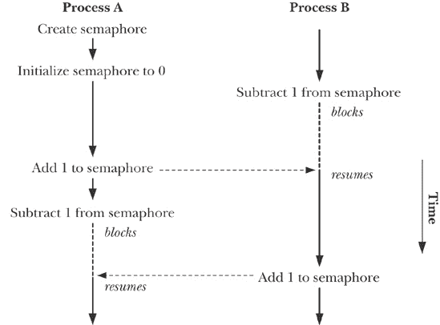
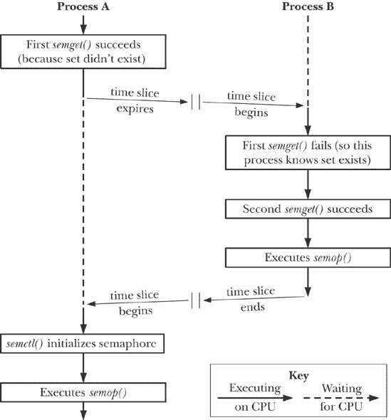

## 第四十七章 系统 V 信号量

本章介绍了系统 V 信号量。与前几章介绍的 IPC 机制不同，系统 V 信号量并不用于进程间数据传输。相反，它们允许进程同步其操作。信号量的一个常见用途是同步对共享内存块的访问，以防止一个进程在另一个进程更新共享内存时同时访问它。

信号量是一个由内核维护的整数，其值被限制为大于或等于 0。可以对信号量执行各种操作（即系统调用），包括以下操作：

+   将信号量设置为一个绝对值；

+   向当前信号量值中加上一个数；

+   从当前信号量值中减去一个数；

+   等待信号量值等于 0。

其中最后两个操作可能导致调用进程阻塞。当降低信号量的值时，内核会阻止任何尝试将其值降低到 0 以下的操作。同样，如果信号量的值当前不是 0，等待信号量等于 0 会阻塞调用进程。在这两种情况下，调用进程将保持阻塞状态，直到其他进程修改信号量为允许操作进行的值，此时内核会唤醒被阻塞的进程。图 47-1 展示了使用信号量同步两个进程的操作，它们交替将信号量值在 0 和 1 之间切换。

 图 47-1. 使用信号量同步两个进程

就控制进程的操作而言，信号量本身没有意义。其意义仅由使用信号量的进程赋予它的关联来决定。通常，进程会就某个约定达成一致，关联一个信号量与一个共享资源，如共享内存区域。信号量的其他用途也是可能的，例如在*fork()*之后实现父子进程之间的同步。（在通过信号同步避免竞争条件一章中，我们探讨了使用信号来实现相同任务的方式。）

## 概述

使用系统 V 信号量的基本步骤如下：

+   使用*semget()*创建或打开一个信号量集合。

+   使用*semctl()* `SETVAL`或`SETALL`操作初始化信号量集合。（通常只由一个进程执行此操作。）

+   使用*semop()*对信号量值执行操作。使用信号量的进程通常使用这些操作来指示共享资源的获取和释放。

+   当所有进程都完成使用信号量集时，使用 *semctl()* 的 `IPC_RMID` 操作删除该集。（只有一个进程应该执行此操作。）

大多数操作系统为应用程序提供某种类型的信号量原语。然而，System V 信号量由于以名为 *信号量集* 的组形式分配而变得异常复杂。信号量集中的信号量数量在使用 *semget()* 系统调用创建集时指定。尽管通常一次操作一个信号量，*semop()* 系统调用允许我们原子性地对同一信号量集中的多个信号量执行一组操作。

由于 System V 信号量是在不同步骤中创建和初始化的，如果两个进程尝试同时执行这些步骤，就会导致竞争条件。在描述这种竞争条件以及如何避免它时，需要先描述 *semctl()*，再描述 *semop()*，这意味着在完全理解信号量所需的所有细节之前，我们需要覆盖相当多的内容。

与此同时，我们提供 示例 47-1 作为使用各种信号量系统调用的简单示例。该程序有两种模式：

+   给定一个整数命令行参数，程序创建一个包含单个信号量的新信号量集，并将信号量初始化为命令行参数中提供的值。程序显示新信号量集的标识符。

+   给定两个命令行参数，程序将其解释为（按顺序）现有信号量集的标识符和要添加到该集中的第一个信号量（编号为 0）的值。程序对该信号量执行指定的操作。为了让我们能够监控信号量操作，程序在操作前后打印消息。每条消息的开头都有进程 ID，以便我们能够区分程序多个实例的输出。

以下是 示例 47-1 中程序使用的 shell 会话日志。我们首先创建一个信号量，并将其初始化为 0：

```
$ `./svsem_demo 0`
Semaphore ID = 98307                    *ID of new semaphore set*
```

然后，我们执行一个后台命令，尝试将信号量值减少 2：

```
$ `./svsem_demo 98307 -2 &`
23338: about to semop at  10:19:42
[1] 23338
```

这个命令被阻塞了，因为信号量的值不能低于 0。现在，我们执行一个命令，将信号量的值增加 3：

```
$ `./svsem_demo 98307 +3`
23339: about to semop at  10:19:55
23339: semop completed at 10:19:55
23338: semop completed at 10:19:55
[1]+  Done              ./svsem_demo 98307 -2
```

信号量增量操作立即成功，并导致后台命令中的信号量减量操作继续执行，因为该操作现在可以在不使信号量的值低于 0 的情况下执行。

示例 47-1. 创建和操作 System V 信号量

```
`svsem/svsem_demo.c`
#include <sys/types.h>
#include <sys/sem.h>
#include <sys/stat.h>
#include "curr_time.h"                  /* Declaration of currTime() */
#include "semun.h"                      /* Definition of semun union */
#include "tlpi_hdr.h"

int
main(int argc, char *argv[])
{
    int semid;

    if (argc < 2 || argc > 3 || strcmp(argv[1], "--help") == 0)
        usageErr("%s init-value\n"
                 "   or: %s semid operation\n", argv[0], argv[0]);

    if (argc == 2) {            /* Create and initialize semaphore */
        union semun arg;

        semid = semget(IPC_PRIVATE, 1, S_IRUSR | S_IWUSR);
        if (semid == -1)
            errExit("semid");

        arg.val = getInt(argv[1], 0, "init-value");
        if (semctl(semid, /* semnum= */ 0, SETVAL, arg) == -1)
            errExit("semctl");

        printf("Semaphore ID = %d\n", semid);

    } else {                    /* Perform an operation on first semaphore */

        struct sembuf sop;              /* Structure defining operation */

        semid = getInt(argv[1], 0, "semid");

        sop.sem_num = 0;                /* Specifies first semaphore in set */
        sop.sem_op = getInt(argv[2], 0, "operation");
                                        /* Add, subtract, or wait for 0 */
        sop.sem_flg = 0;                /* No special options for operation */

        printf("%ld: about to semop at  %s\n", (long) getpid(), currTime("%T"));
        if (semop(semid, &sop, 1) == -1)
            errExit("semop");

        printf("%ld: semop completed at %s\n", (long) getpid(), currTime("%T"));
    }

    exit(EXIT_SUCCESS);
}
     `svsem/svsem_demo.c`
```

## 创建或打开信号量集

*semget()* 系统调用用于创建新的信号量集或获取现有信号量集的标识符。

```
#include <sys/types.h>        /* For portability */
#include <sys/sem.h>

int `semget`(key_t *key*, int *nsems*, int *semflg*);
```

### 注意

成功时返回信号量集标识符，错误时返回 -1

*key* 参数是使用 IPC 密钥中描述的方法生成的密钥（通常是值 `IPC_PRIVATE` 或由 *ftok()* 返回的密钥）。

如果我们使用 *semget()* 创建一个新的信号量集，那么 *nsems* 指定该集中的信号量数量，并且必须大于 0。如果我们使用 *semget()* 获取现有集的标识符，那么 *nsems* 必须小于或等于该集的大小（否则将导致错误 `EINVAL`）。无法更改现有信号量集中的信号量数量。

*semflg* 参数是一个位掩码，用于指定新信号量集的权限，或用于检查现有信号量集的权限。这些权限的指定方式与文件相同（见表 15-4，以及常规文件的权限）。此外，*semflg* 中可以通过按位或（|）指定零个或多个以下标志，以控制 *semget()* 的操作：

`IPC_CREAT`

如果指定的 *key* 没有对应的信号量集，则创建一个新集。

`IPC_EXCL`

如果还指定了 `IPC_CREAT`，并且具有指定 *key* 的信号量集已经存在，则返回错误 `EEXIST`。

这些标志在第 45.1 节中有更详细的描述。

在成功时，*semget()* 返回新创建或已存在信号量集的标识符。后续的系统调用引用单个信号量时，必须同时指定信号量集标识符和该集内信号量的编号。信号量集中的信号量从 0 开始编号。

## 信号量控制操作

*semctl()* 系统调用执行各种信号量集或信号量集内单个信号量的控制操作。

```
#include <sys/types.h>        /* For portability */
#include <sys/sem.h>

int `semctl`(int *semid*, int *semnum*, int *cmd*, ... /* union semun *arg* */);
```

### 注意

成功时返回非负整数（参见正文）；错误时返回 -1

*semid* 参数是操作要执行的信号量集的标识符。对于在单个信号量上执行的操作，*semnum* 参数标识信号量集内的特定信号量。对于其他操作，此参数被忽略，可以将其指定为 0。*cmd* 参数指定要执行的操作。

某些操作需要给 *semctl()* 提供第四个参数，我们在本节余下部分中称其为 *arg*。该参数是一个联合体，定义如示例 47-2 所示。我们必须在程序中显式定义此联合体。在我们的示例程序中，我们通过包含示例 47-2 中的头文件来实现这一点。

### 注意

尽管将 *semun* 联合体的定义放在标准头文件中是明智的，但 SUSv3 要求程序员显式地定义它。然而，一些 UNIX 实现确实在 `<sys/sem.h>` 中提供了此定义。较旧版本的 *glibc*（包括 2.0 版本及之前）也提供了此定义。为了符合 SUSv3，*glibc* 的较新版本没有提供此定义，并且在 `<sys/sem.h>` 中定义了宏 `_SEM_SEMUN_UNDEFINED`，其值为 1，以表示这一事实（即，针对 *glibc* 编译的应用程序可以测试此宏，以确定程序是否需要自己定义 *semun* 联合体）。

示例 47-2. *semun* 联合体的定义

```
`svsem/semun.h`
#ifndef SEMUN_H
#define SEMUN_H                 /* Prevent accidental double inclusion */

#include <sys/types.h>          /* For portability */
#include <sys/sem.h>

union semun {                   /* Used in calls to semctl() */
    int                 val;
    struct semid_ds *   buf;
    unsigned short *    array;
#if defined(__linux__)
    struct seminfo *    __buf;
#endif
};

#endif
      `svsem/semun.h`
```

SUSv2 和 SUSv3 规定 *semctl()* 的最终参数是可选的。然而，一些（主要是较旧的）UNIX 实现（以及较旧版本的 *glibc*）的 *semctl()* 原型如下：

```
int semctl(int semid, int semnum, int cmd, union semun arg);
```

这意味着即使在实际上不使用的情况下（例如，下面描述的 `IPC_RMID` 和 `GETVAL` 操作），第四个参数也是必需的。为了完全兼容，我们在那些不需要的调用中为 *semctl()* 指定一个虚拟的最终参数。

在本节的其余部分，我们将讨论可以为 *cmd* 指定的各种控制操作。

#### 通用控制操作

以下操作与可以应用于其他类型的 System V IPC 对象的操作相同。在每种情况下，*semnum* 参数被忽略。关于这些操作的更多细节，包括调用进程所需的权限和权限，见第 45.3 节。

`IPC_RMID`

立即删除信号量集合及其相关的 *semid_ds* 数据结构。任何因等待该集合中的信号量而在 *semop()* 调用中被阻塞的进程将立即被唤醒，并且 *semop()* 会报告错误 `EIDRM`。*arg* 参数不是必需的。

`IPC_STAT`

将与此信号量集合相关的 *semid_ds* 数据结构的副本放入 *arg.buf* 指向的缓冲区中。我们将在第 47.4 节中描述 *semid_ds* 结构。

`IPC_SET`

使用 *arg.buf* 指向的缓冲区中的值更新与此信号量集合相关的 *semid_ds* 数据结构的选定字段。

#### 检索和初始化信号量值

以下操作用于检索或初始化单个信号量或集合中所有信号量的值。检索信号量值需要对该信号量的读取权限，而初始化值需要修改（写入）权限。

`GETVAL`

作为其功能结果，*semctl()* 返回由 *semid* 指定的信号量集合中第 *semnum* 个信号量的值。*arg* 参数不是必需的。

`SETVAL`

由 *semid* 引用的信号量集合中第 *semnum* 个信号量的值被初始化为 *arg.val* 中指定的值。

`GETALL`

检索由*semid*引用的信号量集中的所有信号量的值，并将它们放入`arg.array`指向的数组中。程序员必须确保该数组具有足够的大小。（信号量集中的信号量数量可以从通过`IPC_STAT`操作检索到的`semid_ds`数据结构中的`sem_nsems`字段获取。）`semnum`参数被忽略。示例 47-3 中提供了`GETALL`操作的使用示例。

`SETALL`

使用`arg.array`指向的数组中提供的值初始化由*semid*引用的信号量集中的所有信号量。`semnum`参数被忽略。示例 47-4 演示了`SETALL`操作的使用。

如果另一个进程正在等待对由`SETVAL`或`SETALL`操作修改的信号量执行某个操作，并且所做的更改允许该操作继续执行，那么内核将唤醒该进程。

使用`SETVAL`或`SETALL`更改信号量的值会清除所有进程中该信号量的撤销条目。我们在第 47.8 节中描述了信号量的撤销条目。

请注意，`GETVAL`和`GETALL`返回的信息在调用进程使用时可能已经过时。任何依赖于这些操作返回的信息不变的程序，可能会受到检查时与使用时的竞态条件影响（警惕信号和竞态条件）。

#### 检索每个信号量的信息

以下操作通过函数返回值返回关于由*semid*引用的信号量集中的*semnum*信号量的信息。对于所有这些操作，都需要对信号量集具有读取权限，并且不需要`*arg*`参数。

`GETPID`

返回最后一个执行`semop()`操作的进程的进程 ID；这被称为*sempid*值。如果没有进程执行过该信号量的`semop()`操作，则返回 0。

`GETNCNT`

返回当前等待该信号量值增加的进程数量；这被称为*semncnt*值。

`GETZCNT`

返回当前等待该信号量值变为 0 的进程数量；这被称为*semzcnt*值。

与上述描述的`GETVAL`和`GETALL`操作一样，`GETPID`、`GETNCNT`和`GETZCNT`操作返回的信息在调用进程使用时可能已经过时。

示例 47-3 演示了这三个操作的使用。

## 信号量相关数据结构

每个信号量集合都有一个与之关联的*semid_ds*数据结构，形式如下：

```
struct semid_ds {
    struct ipc_perm sem_perm;       /* Ownership and permissions */
    time_t          sem_otime;      /* Time of last semop() */
    time_t          sem_ctime;      /* Time of last change */
    unsigned long   sem_nsems;      /* Number of semaphores in set */
};
```

### 注意

SUSv3 要求我们在*semid_ds*结构中展示的所有字段。其他一些 UNIX 实现可能包括额外的非标准字段。在 Linux 2.4 及更高版本中，*sem_nsems*字段的类型为*unsigned long*。SUSv3 规定该字段的类型为*unsigned short*，并且在 Linux 2.2 及大多数其他 UNIX 实现中也如此定义。

*semid_ds*结构的字段通过各种信号量系统调用隐式更新，*sem_perm*字段的某些子字段可以通过*semctl()*的`IPC_SET`操作显式更新。具体细节如下：

*sem_perm*

当信号量集合创建时，该子结构的字段按照第 45.3 节所述初始化。*uid*、*gid*和*mode*子字段可以通过`IPC_SET`进行更新。

*sem_otime*

当信号量集合创建时，该字段被设置为 0，并在每次成功的*semop()*操作后，或在因`SEM_UNDO`操作（信号量撤销值）导致信号量值修改时，设置为当前时间。此字段和*sem_ctime*的类型为*time_t*，并存储自纪元以来的秒数。

*sem_ctime*

当信号量集合创建时，并在每次成功的`IPC_SET`、`SETALL`或`SETVAL`操作时，此字段被设置为当前时间。（在某些 UNIX 实现中，`SETALL`和`SETVAL`操作不会修改*sem_ctime*。）

*sem_nsems*

当集合被创建时，该字段被初始化为集合中信号量的数量。

本节的剩余部分展示了两个示例程序，这些程序利用了*semid_ds*数据结构和第 47.3 节中描述的部分*semctl()*操作。我们将在第 47.6 节中演示这两个程序的使用。

#### 监视一个信号量集合

示例 47-3 中的程序使用了各种*semctl()*操作来显示有关现有信号量集合的信息，其标识符作为命令行参数提供。程序首先显示*semid_ds*数据结构中的时间字段。然后，对于集合中的每个信号量，程序显示该信号量的当前值，以及其*sempid*、*semncnt*和*semzcnt*值。

示例 47-3。信号量监视程序

```
`svsem/svsem_mon.c`
#include <sys/types.h>
#include <sys/sem.h>
#include <time.h>
#include "semun.h"                      /* Definition of semun union */
#include "tlpi_hdr.h"

int
main(int argc, char *argv[])
{
    struct semid_ds ds;
    union semun arg, dummy;             /* Fourth argument for semctl() */
    int semid, j;

    if (argc != 2 || strcmp(argv[1], "--help") == 0)
        usageErr("%s semid\n", argv[0]);

    semid = getInt(argv[1], 0, "semid");

    arg.buf = &ds;
    if (semctl(semid, 0, IPC_STAT, arg) == -1)
        errExit("semctl");

    printf("Semaphore changed: %s", ctime(&ds.sem_ctime));
    printf("Last semop():      %s", ctime(&ds.sem_otime));

    /* Display per-semaphore information */

    arg.array = calloc(ds.sem_nsems, sizeof(arg.array[0]));
    if (arg.array == NULL)
        errExit("calloc");
    if (semctl(semid, 0, GETALL, arg) == -1)
        errExit("semctl-GETALL");

    printf("Sem #  Value  SEMPID  SEMNCNT  SEMZCNT\n");

    for (j = 0; j < ds.sem_nsems; j++)
        printf("%3d   %5d   %5d  %5d    %5d\n", j, arg.array[j],
                semctl(semid, j, GETPID, dummy),
                semctl(semid, j, GETNCNT, dummy),
                semctl(semid, j, GETZCNT, dummy));

    exit(EXIT_SUCCESS);
}
      `svsem/svsem_mon.c`
```

#### 初始化一个信号量集合中的所有信号量

示例 47-4 中的程序提供了一个命令行界面，用于初始化现有信号量集合中的所有信号量。第一个命令行参数是要初始化的信号量集合的标识符。其余的命令行参数指定信号量应初始化为的值（这些参数的数量必须与集合中的信号量数量相同）。

示例 47-4. 使用`SETALL`操作初始化 System V 信号量集合

```
`svsem/svsem_setall.c`
#include <sys/types.h>
#include <sys/sem.h>
#include "semun.h"                      /* Definition of semun union */
#include "tlpi_hdr.h"

int
main(int argc, char *argv[])
{
    struct semid_ds ds;
    union semun arg;                    /* Fourth argument for semctl() */
    int j, semid;

    if (argc < 3 || strcmp(argv[1], "--help") == 0)
        usageErr("%s semid val...\n", argv[0]);

    semid = getInt(argv[1], 0, "semid");

    /* Obtain size of semaphore set */

    arg.buf = &ds;
    if (semctl(semid, 0, IPC_STAT, arg) == -1)
        errExit("semctl");

    if (ds.sem_nsems != argc - 2)
        cmdLineErr("Set contains %ld semaphores, but %d values were supplied\n",
                (long) ds.sem_nsems, argc - 2);

    /* Set up array of values; perform semaphore initialization */

    arg.array = calloc(ds.sem_nsems, sizeof(arg.array[0]));
    if (arg.array == NULL)
        errExit("calloc");

    for (j = 2; j < argc; j++)
        arg.array[j - 2] = getInt(argv[j], 0, "val");

    if (semctl(semid, 0, SETALL, arg) == -1)
        errExit("semctl-SETALL");
    printf("Semaphore values changed (PID=%ld)\n", (long) getpid());

    exit(EXIT_SUCCESS);
}
     `svsem/svsem_setall.c`
```

## 信号量初始化

根据 SUSv3 的规定，*semget()*创建的信号量集合的值不需要初始化。相反，程序员必须通过*semctl()*系统调用显式初始化信号量。（在 Linux 中，*semget()*返回的信号量实际上会被初始化为 0，但我们不能依赖这一点来保证可移植性。）如前所述，信号量的创建和初始化必须通过单独的系统调用来完成，而不是通过单个原子操作，这就可能导致初始化信号量时出现竞争条件。在本节中，我们将详细说明竞争的性质，并根据[Stevens, 1999]中描述的一个方法，探讨避免这种问题的方案。

假设我们有一个由多个对等进程组成的应用程序，这些进程使用信号量来协调它们的操作。由于没有任何进程能够保证首先使用信号量（这就是*对等*一词的含义），每个进程必须准备好在信号量不存在时创建并初始化它。为此，我们可以考虑使用示例 47-5 中显示的代码。

示例 47-5. 错误地初始化 System V 信号量

```
*from* `svsem/svsem_bad_init.c`
    /* Create a set containing 1 semaphore */

    semid = semget(key, 1, IPC_CREAT | IPC_EXCL | perms);

    if (semid != -1) {                  /* Successfully created the semaphore */
        union semun arg;

        /* XXXX */

        arg.val = 0;                    /* Initialize semaphore */
        if (semctl(semid, 0, SETVAL, arg) == -1)
            errExit("semctl");

    } else {                            /* We didn't create the semaphore */
        if (errno != EEXIST) {          /* Unexpected error from semget() */
            errExit("semget");

        semid = semget(key, 1, perms);  /* Retrieve ID of existing set */
        if (semid == -1)
           errExit("semget");
    }

    /* Now perform some operation on the semaphore */

    sops[0].sem_op = 1;                 /* Add 1... */
    sops[0].sem_num = 0;                /* to semaphore 0 */
    sops[0].sem_flg = 0;
    if (semop(semid, sops, 1) == -1)
        errExit("semop");
      *from* `svsem/svsem_bad_init.c`
```

示例 47-5 中代码的问题在于，如果两个进程同时执行该代码，那么如果第一个进程的时间片恰好在代码中标记为`XXXX`的位置到期，就可能发生图 47-2 所示的序列。这个序列存在两个问题。首先，进程 B 在一个未初始化的信号量上执行*semop()*（即其值是任意的）。其次，进程 A 中的*semctl()*调用覆盖了进程 B 所做的更改。

这个问题的解决方案依赖于一种历史性的、现在已标准化的特性，即与信号量集关联的*semid_ds*数据结构中*sem_otime*字段的初始化。当信号量集首次创建时，*sem_otime*字段会被初始化为 0，并且仅通过后续的*semop()*调用进行更改。我们可以利用这一特性消除上面描述的竞态条件。我们通过插入额外的代码，迫使第二个进程（即未创建信号量的那个进程）等待，直到第一个进程既初始化了信号量*并且*执行了一个更新*sem_otime*字段的*semop()*调用，但不修改信号量的值。修改后的代码如示例 47-6 所示。

### 注意

不幸的是，主文中描述的初始化问题解决方案并不适用于所有 UNIX 实现。在一些现代 BSD 衍生版本中，*semop()*不会更新*sem_otime*字段。

示例 47-6. 初始化一个 System V 信号量

```
*from* `svsem/svsem_good_init.c`
    semid = semget(key, 1, IPC_CREAT | IPC_EXCL | perms);

    if (semid != -1) {                  /* Successfully created the semaphore */
        union semun arg;
        struct sembuf sop;

        arg.val = 0;                    /* So initialize it to 0 */
        if (semctl(semid, 0, SETVAL, arg) == -1)
            errExit("semctl");

        /* Perform a "no-op" semaphore operation - changes sem_otime
           so other processes can see we've initialized the set. */

        sop.sem_num = 0;                /* Operate on semaphore 0 */
        sop.sem_op = 0;                 /* Wait for value to equal 0 */
        sop.sem_flg = 0;
        if (semop(semid, &sop, 1) == -1)
            errExit("semop");

    } else {                            /* We didn't create the semaphore set */
        const int MAX_TRIES = 10;
        int j;
        union semun arg;
        struct semid_ds ds;

        if (errno != EEXIST) {          /* Unexpected error from semget() */
            errExit("semget");

        semid = semget(key, 1, perms);  /* Retrieve ID of existing set */
        if (semid == -1)
            errExit("semget");

        /* Wait until another process has called semop() */

        arg.buf = &ds;
        for (j = 0; j < MAX_TRIES; j++) {
            if (semctl(semid, 0, IPC_STAT, arg) == -1)
                errExit("semctl");
            if (ds.sem_otime != 0)      /* semop() performed? */
                break;                  /* Yes, quit loop */
            sleep(1);                   /* If not, wait and retry */
        }

        if (ds.sem_otime == 0)          /* Loop ran to completion! */
            fatal("Existing semaphore not initialized");
    }

    /* Now perform some operation on the semaphore */
      *from* `svsem/svsem_good_init.c`
```

我们可以使用示例 47-6 中展示的技术变体，确保信号量集中的多个信号量被正确初始化，或者确保某个信号量被初始化为非零值。

这种较为复杂的竞态问题解决方案并非所有应用都需要。如果可以确保一个进程能够在任何其他进程尝试使用信号量之前创建并初始化它，那么我们就不需要这个方案。例如，如果父进程在创建共享信号量的子进程之前创建并初始化了信号量，那么就是这种情况。在这种情况下，足够的做法是让第一个进程在*semget()*调用后执行一个*semctl()* `SETVAL`或`SETALL`操作。

图 47-2. 两个进程竞相初始化同一个信号量

## 信号量操作

*semop()*系统调用在由*semid*标识的信号量集中的一个或多个信号量上执行操作。

```
#include <sys/types.h>        /* For portability */
#include <sys/sem.h>

int `semop`(int *semid*, struct sembuf **sops*, unsigned int *nsops*);
```

### 注意

成功时返回 0，出错时返回-1

*sops*参数是一个指向包含要执行操作的数组的指针，*nsops*给出该数组的大小（必须至少包含一个元素）。操作是原子执行的，并按数组顺序执行。*sops*数组的元素是以下形式的结构：

```
struct sembuf {
    unsigned short sem_num;     /* Semaphore number */
    short          sem_op;      /* Operation to be performed */
    short          sem_flg;     /* Operation flags (IPC_NOWAIT and SEM_UNDO) */
};
```

*sem_num*字段标识将在信号量集内执行操作的信号量。*sem_op*字段指定要执行的操作：

+   如果 *sem_op* 大于 0，则将 *sem_op* 的值加到信号量的值上。结果，其他等待减少信号量值的进程可能会被唤醒并执行它们的操作。调用进程必须对信号量具有修改（写入）权限。

+   如果 *sem_op* 等于 0，则会检查信号量的值是否当前等于 0。如果是，操作将立即完成；否则，*semop()* 会阻塞，直到信号量的值变为 0。调用进程必须具有对该信号量的读取权限。

+   如果 *sem_op* 小于 0，则将信号量的值减少 *sem_op* 指定的数量。如果信号量的当前值大于或等于 *sem_op* 的绝对值，操作将立即完成。否则，*semop()* 将阻塞，直到信号量的值增加到一个允许操作执行的水平，而不会导致负值。调用进程必须对信号量具有修改权限。

从语义上讲，增加信号量的值对应于使一个资源可用，以便其他进程使用，而减少信号量的值对应于为（独占）使用该资源保留一个资源。当减少信号量的值时，如果信号量的值太低，操作将被阻塞——也就是说，如果其他进程已经预留了该资源。

当 *semop()* 调用被阻塞时，进程将保持阻塞状态，直到发生以下情况之一：

+   另一个进程修改了信号量的值，使得请求的操作能够继续。

+   一个信号中断了 *semop()* 调用。在这种情况下，会产生错误 `EINTR`。（正如在系统调用的中断与重启中所指出的，*semop()* 在被信号处理程序中断后不会自动重启。）

+   另一个进程删除了 *semid* 所指向的信号量。在这种情况下，*semop()* 会因错误 `EIDRM` 失败。

我们可以通过在相应的 *sem_flg* 字段中指定 `IPC_NOWAIT` 标志来防止 *semop()* 在执行某个信号量的操作时阻塞。在这种情况下，如果 *semop()* 本应阻塞，它将失败并返回错误 `EAGAIN`。

虽然通常一次只操作一个信号量，但也可以执行一个 *semop()* 调用，针对一个信号量集合中的多个信号量执行操作。需要注意的关键点是，这组操作是原子的；也就是说，*semop()* 要么立即执行所有操作（如果可能），要么阻塞，直到能够同时执行所有操作为止。

### 注意

很少有系统文档记录 *semop()* 按数组顺序执行操作，尽管作者已知的所有系统都这样做，而且一些应用依赖于这种行为。SUSv4 增加了明确要求此行为的文字。

示例 47-7 对多个 System V 信号量执行操作") 展示了如何使用 *semop()* 对信号量集中的三个信号量执行操作。信号量 0 和信号量 2 的操作可能无法立即进行，这取决于信号量的当前值。如果信号量 0 的操作不能立即执行，那么请求的所有操作都不会执行，且 *semop()* 会阻塞。另一方面，如果信号量 0 的操作可以立即执行，但信号量 2 的操作不能，那么——由于指定了 `IPC_NOWAIT` 标志——请求的所有操作都不会执行，且 *semop()* 会立即返回错误 `EAGAIN`。

*semtimedop()* 系统调用执行与 *semop()* 相同的任务，不同之处在于 *timeout* 参数指定了调用阻塞的最大时间限制。

```
#define _GNU_SOURCE
#include <sys/types.h>        /* For portability */
#include <sys/sem.h>

int `semtimedop`(int *semid*, struct sembuf **sops*, unsigned int *nsops*,
               struct timespec **timeout*);
```

### 注意

成功时返回 0，错误时返回 -1

*timeout* 参数是指向 *timespec* 结构的指针（高精度睡眠：*nanosleep()*")），该结构允许将时间间隔表示为秒和纳秒的数量。如果在信号量操作完成之前指定的时间间隔已过，*semtimedop()* 将失败并返回错误 `EAGAIN`。如果 *timeout* 被指定为 `NULL`，则 *semtimedop()* 的行为与 *semop()* 完全相同。

*semtimedop()* 系统调用提供了一种比使用 *setitimer()* 加 *semop()* 更高效的设置信号量操作超时的方法。这个小的性能提升对于某些需要频繁执行此类操作的应用（特别是一些数据库系统）来说非常重要。然而，*semtimedop()* 并没有在 SUSv3 中规定，仅在少数其他 UNIX 实现中存在。

### 注意

*semtimedop()* 系统调用作为 Linux 2.6 中的新特性出现，随后被回移植到 Linux 2.4，从内核 2.4.22 开始。

示例 47-7. 使用 *semop()* 对多个 System V 信号量执行操作

```
struct sembuf sops[3];

   sops[0].sem_num = 0;                 /* Subtract 1 from semaphore 0 */
   sops[0].sem_op = -1;
   sops[0].sem_flg = 0;

   sops[1].sem_num = 1;                 /* Add 2 to semaphore 1 */
   sops[1].sem_op = 2;
   sops[1].sem_flg = 0;

   sops[2].sem_num = 2;                 /* Wait for semaphore 2 to equal 0 */
   sops[2].sem_op = 0;
   sops[2].sem_flg = IPC_NOWAIT;        /* But don't block if operation
                                           can't be performed immediately */
   if (semop(semid, sops, 3) == -1) {
       if (errno == EAGAIN)             /* Semaphore 2 would have blocked */
           printf("Operation would have blocked\n");
       else
           errExit("semop");            /* Some other error */
   }
```

#### 示例程序

示例 47-8 执行 System V 信号量操作") 中的程序提供了一个命令行界面来调用 *semop()* 系统调用。该程序的第一个参数是要执行操作的信号量集的标识符。

其余每个命令行参数指定了在单个 *semop()* 调用中要执行的一组信号量操作。单个命令行参数中的操作由逗号分隔。每个操作具有以下形式之一：

+   *semnum*`+`*value*：将 *value* 添加到信号量 *semnum*。

+   *semnum*`-`*value*：从信号量 *semnum* 中减去 *value*。

+   *semnum*`=0`：测试信号量 *semnum* 是否等于 0。

在每次操作结束时，我们可以选择性地包括一个*n*、一个*u*，或两者。字母*n*表示在此操作的*sem_flg*值中包含`IPC_NOWAIT`。字母*u*表示在*sem_flg*中包含`SEM_UNDO`。（我们在第 47.8 节中描述了`SEM_UNDO`标志。）

以下命令行指定对信号量集的两个*semop()*调用，该信号量集的标识符为 0：

```
$ `./svsem_op 0 0=0 0-1,1-2n`
```

第一个命令行参数指定一个*semop()*调用，该调用会等待直到信号量 0 的值等于 0。第二个参数指定一个*semop()*调用，该调用会从信号量 0 中减去 1，并从信号量 1 中减去 2。对于信号量 0 的操作，*sem_flg*为 0；对于信号量 1 的操作，*sem_flg*为`IPC_NOWAIT`。

示例 47-8. 使用*semop()*执行 System V 信号量操作

```
`svsem/svsem_op.c`
#include <sys/types.h>
#include <sys/sem.h>
#include <ctype.h>
#include "curr_time.h"          /* Declaration of currTime() */
#include "tlpi_hdr.h"

#define MAX_SEMOPS 1000         /* Maximum operations that we permit for
                                   a single semop() */

static void
usageError(const char *progName)
{
    fprintf(stderr, "Usage: %s semid op[,op...] ...\n\n", progName);
    fprintf(stderr, "'op' is either: <sem#>{+|-}<value>[n][u]\n");
    fprintf(stderr, "            or: <sem#>=0[n]\n");
    fprintf(stderr, "       \"n\" means include IPC_NOWAIT in 'op'\n");
    fprintf(stderr, "       \"u\" means include SEM_UNDO in 'op'\n\n");
    fprintf(stderr, "The operations in each argument are "
                    "performed in a single semop() call\n\n");
    fprintf(stderr, "e.g.: %s 12345 0+1,1-2un\n", progName);
    fprintf(stderr, "      %s 12345 0=0n 1+1,2-1u 1=0\n", progName);
    exit(EXIT_FAILURE);
}

/* Parse comma-delimited operations in 'arg', returning them in the
   array 'sops'. Return number of operations as function result. */

static int
parseOps(char *arg, struct sembuf sops[])
{
    char *comma, *sign, *remaining, *flags;
    int numOps;                 /* Number of operations in 'arg' */

    for (numOps = 0, remaining = arg; ; numOps++) {
        if (numOps >= MAX_SEMOPS)
            cmdLineErr("Too many operations (maximum=%d): \"%s\"\n",
                        MAX_SEMOPS, arg);

        if (*remaining == '\0')
            fatal("Trailing comma or empty argument: \"%s\"", arg);
        if (!isdigit((unsigned char) *remaining))
            cmdLineErr("Expected initial digit: \"%s\"\n", arg);

        sops[numOps].sem_num = strtol(remaining, &sign, 10);

        if (*sign == '\0' || strchr("+-=", *sign) == NULL)
            cmdLineErr("Expected '+', '-', or '=' in \"%s\"\n", arg);
        if (!isdigit((unsigned char) *(sign + 1)))
            cmdLineErr("Expected digit after '%c' in \"%s\"\n", *sign, arg);

        sops[numOps].sem_op = strtol(sign + 1, &flags, 10);

        if (*sign == '-')                       /* Reverse sign of operation */
            sops[numOps].sem_op = - sops[numOps].sem_op;
        else if (*sign == '=')                  /* Should be '=0' */
            if (sops[numOps].sem_op != 0)
                cmdLineErr("Expected \"=0\" in \"%s\"\n", arg);

        sops[numOps].sem_flg = 0;
        for (;; flags++) {
            if (*flags == 'n')
                sops[numOps].sem_flg |= IPC_NOWAIT;
            else if (*flags == 'u')
                sops[numOps].sem_flg |= SEM_UNDO;
            else
                break;
        }

        if (*flags != ',' && *flags != '\0')
            cmdLineErr("Bad trailing character (%c) in \"%s\"\n", *flags, arg);

        comma = strchr(remaining, ',');
        if (comma == NULL)
            break;                              /* No comma --> no more ops */
        else
            remaining = comma + 1;
    }

    return numOps + 1;
}

int
main(int argc, char *argv[])
{
    struct sembuf sops[MAX_SEMOPS];
    int ind, nsops;

    if (argc < 2 || strcmp(argv[1], "--help") == 0)
        usageError(argv[0]);

    for (ind = 2; argv[ind] != NULL; ind++) {
        nsops = parseOps(argv[ind], sops);

        printf("%5ld, %s: about to semop()  [%s]\n", (long) getpid(),
                currTime("%T"), argv[ind]);

        if (semop(getInt(argv[1], 0, "semid"), sops, nsops) == -1)
            errExit("semop (PID=%ld)", (long) getpid());

        printf("%5ld, %s: semop() completed [%s]\n", (long) getpid(),
                currTime("%T"), argv[ind]);
    }

    exit(EXIT_SUCCESS);
}
      `svsem/svsem_op.c`
```

使用示例 47-8 执行 System V 信号量操作")中的程序，以及本章中展示的其他程序，我们可以研究 System V 信号量的操作，如下所示的 shell 会话。我们从使用一个创建包含两个信号量的信号量集的程序开始，这两个信号量被初始化为 1 和 0：

```
$ `./svsem_create -p 2`
32769                                               *ID of semaphore set*
$ `./svsem_setall 32769 1 0`
Semaphore values changed (PID=3658)
```

### 注意

本章未展示`svsem/svsem_create.c`程序的代码，但它已包含在本书的源代码分发中。该程序执行的功能与示例 46-1")（在创建或打开消息队列中）为消息队列执行的功能相同；也就是说，它创建一个信号量集。唯一显著的不同是，`svsem_create.c`接受一个额外的参数，用来指定要创建的信号量集的大小。

接下来，我们启动三个示例 47-8 执行 System V 信号量操作")程序的后台实例，以在信号量集上执行*semop()*操作。程序在每次信号量操作前后打印消息。这些消息包括时间，以便我们可以看到每个操作何时开始以及何时完成，还有进程 ID，以便我们可以追踪多个程序实例的操作。第一个命令请求将两个信号量都减少 1：

```
$ `./svsem_op 32769 0-1,1-1 &`                        *Operation 1*
 3659, 16:02:05: about to semop()  [0-1,1-1]
[1] 3659
```

在上面的输出中，我们看到程序打印了一条消息，说明即将执行*semop()*操作，但没有打印进一步的消息，因为*semop()*调用会阻塞。调用会阻塞，因为信号量 1 的值为 0。

接下来，我们执行一个命令，要求将信号量 1 减少 1：

```
$ `./svsem_op 32769 1-1 &`                            *Operation 2*
 3660, 16:02:22: about to semop()  [1-1]
[2] 3660
```

该命令也会阻塞。接下来，我们执行一个命令，等待信号量 0 的值等于 0：

```
$ `./svsem_op 32769 0=0 &`                            *Operation 3*
 3661, 16:02:27: about to semop()  [0=0]
[3] 3661
```

再次，这个命令会阻塞，这次是因为信号量 0 的值当前为 1。

现在，我们使用 示例 47-3 中的程序来检查信号量集：

```
$ `./svsem_mon 32769`
Semaphore changed: Sun Jul 25 16:01:53 2010
Last semop():      Thu Jan  1 01:00:00 1970
Sem #  Value  SEMPID  SEMNCNT  SEMZCNT
  0       1       0      1        1
  1       0       0      2        0
```

当信号量集被创建时，相关的 *semid_ds* 数据结构中的 *sem_otime* 字段会被初始化为 0。0 的日历时间值对应于纪元（日历时间），而 *ctime()* 将其显示为 1970 年 1 月 1 日上午 1 点，因为当地时区是中欧时间，比 UTC 快一个小时。

进一步检查输出，我们可以看到，对于信号量 0，*semncnt* 的值为 1，因为操作 1 正在等待减少信号量的值，*semzcnt* 的值为 1，因为操作 3 正在等待该信号量的值变为 0。对于信号量 1，*semncnt* 的值为 2，反映了操作 1 和操作 2 正在等待减少信号量的值。

接下来，我们尝试对信号量集进行非阻塞操作。该操作等待信号量 0 的值为 0。由于此操作无法立即执行，*semop()* 会返回错误 `EAGAIN`：

```
$ `./svsem_op 32769 0=0n`                             *Operation 4*
 3673, 16:03:13: about to semop()  [0=0n]
ERROR [EAGAIN/EWOULDBLOCK Resource temporarily unavailable] semop (PID=3673)
```

现在我们将 1 加到信号量 1。这会导致之前被阻塞的两个操作（操作 1 和操作 3）解除阻塞：

```
$ `./svsem_op 32769 1+1`                              *Operation 5*
 3674, 16:03:29: about to semop()  [1+1]
 3659, 16:03:29: semop() completed [0-1,1-1]        *Operation 1 completes*
 3661, 16:03:29: semop() completed [0=0]            *Operation 3 completes*
 3674, 16:03:29: semop() completed [1+1]            *Operation 5 completes*
[1]   Done              ./svsem_op 32769 0-1,1-1
[3]+  Done              ./svsem_op 32769 0=0
```

当我们使用我们的监控程序检查信号量集的状态时，我们看到相关的 *semid_ds* 数据结构中的 *sem_otime* 字段已被更新，并且两个信号量的 *sempid* 值也已更新。我们还看到信号量 1 的 *semncnt* 值为 1，因为操作 2 仍然被阻塞，等待减少该信号量的值：

```
$ `./svsem_mon 32769`
Semaphore changed: Sun Jul 25 16:01:53 2010
Last semop():      Sun Jul 25 16:03:29 2010
Sem #  Value  SEMPID  SEMNCNT  SEMZCNT
  0       0    3661      0        0
  1       0    3659      1        0
```

从上述输出中，我们可以看到 *sem_otime* 的值已经更新。我们还看到信号量 0 最后由进程 ID 3661（操作 3）操作，而信号量 1 最后由进程 ID 3659（操作 1）操作。

最后，我们移除信号量集。这会导致仍然被阻塞的操作 2 失败并返回错误 `EIDRM`：

```
$ `./svsem_rm 32769`
ERROR [EIDRM Identifier removed] semop (PID=3660)
```

### 注意

本章未展示 `svsem/svsem_rm.c` 程序的源代码，但该程序包含在本书的源代码分发中。该程序移除由命令行参数指定的信号量集。

## 处理多个阻塞的信号量操作

如果多个进程被阻塞，试图通过相同的量减少信号量的值，那么当条件允许时，哪个进程将被允许首先执行操作是不确定的（即，哪个进程能够执行操作将取决于内核进程调度算法的变化）。

另一方面，如果多个进程在试图减少信号量值时，减少的量不同，那么请求会按它们变得可能的顺序进行处理。假设当前信号量值为 0，进程 A 请求将信号量值减少 2，接着进程 B 请求将值减少 1。如果第三个进程然后增加 1 到信号量，那么进程 B 将是第一个解除阻塞并执行其操作的进程，即便进程 A 是第一个请求对信号量进行操作的进程。在设计不良的应用程序中，这种情况可能会导致*饥饿*，即某个进程永远被阻塞，因为信号量的状态从未达到能够执行请求的操作。继续我们的示例，我们可以想象出这样的情况：多个进程调整信号量，以至于它的值始终不超过 1，导致进程 A 永远被阻塞。

如果一个进程在试图对多个信号量执行操作时被阻塞，也可能发生饥饿现象。考虑以下场景，该场景在一对信号量上执行，这两个信号量最初的值均为 0：

1.  进程 A 请求从信号量 0 和 1 中各减去 1（*阻塞*）。

1.  进程 B 请求从信号量 0 中减去 1（*阻塞*）。

1.  进程 C 将 1 加到信号量 0。

此时，进程 B 解除阻塞并完成其请求，尽管它的请求比进程 A 晚。再次强调，我们可以设计出进程 A 被饥饿的场景，而其他进程则在个别信号量的值上进行调整和阻塞。

## 信号量撤销值

假设，在调整了信号量的值（例如，将信号量的值减少，使其变为 0）后，进程终止，无论是故意的还是意外的。默认情况下，信号量的值保持不变。这可能会对使用该信号量的其他进程造成问题，因为它们可能被阻塞，等待该信号量——即，等待现在已经终止的进程撤销其所做的更改。

为了避免此类问题，我们可以在通过*semop()*更改信号量值时使用`SEM_UNDO`标志。当指定该标志时，内核会记录信号量操作的效果，然后在进程终止时撤销该操作。无论进程是正常终止还是异常终止，撤销操作都会发生。

内核不需要记录所有使用`SEM_UNDO`执行的操作。只需记录每个信号量调整的*总和*，即每个信号量、每个进程的整数总和，称为*semadj*（信号量调整）值。当进程终止时，只需要从信号量的当前值中减去这个总和。

### 注意

自 Linux 2.6 以来，使用*clone()*创建的进程（线程）如果使用了`CLONE_SYSVSEM`标志，则共享*semadj*值。此类共享是符合 POSIX 线程实现要求的。NPTL 线程实现通过`CLONE_SYSVSEM`来实现*pthread_create()*。

当使用*semctl()*的`SETVAL`或`SETALL`操作设置信号量值时，所有使用该信号量的进程中相应的*semadj*值都会被清除（即设置为 0）。这是有道理的，因为绝对设置信号量的值会破坏与*semadj*总记录相关联的历史记录中的值。

通过*fork()*创建的子进程不会继承父进程的*semadj*值；让子进程撤销父进程的信号量操作是没有意义的。另一方面，*semadj*值会在*exec()*之间被保留。这允许我们使用`SEM_UNDO`调整信号量值，然后*exec()*一个不对信号量执行任何操作但会在进程终止时自动调整信号量的程序。（这可以作为一种技术，允许另一个进程发现该进程何时终止。）

#### `SEM_UNDO`的效果示例

以下的 Shell 会话日志显示了对两个信号量执行操作的效果：一个操作带有`SEM_UNDO`标志，另一个则没有。我们首先创建一个包含两个信号量的集合：

```
$ `./svsem_create -p 2`
131073
```

接下来，我们执行一个命令，该命令向两个信号量都加 1，然后终止。信号量 0 上的操作指定了`SEM_UNDO`标志：

```
$ `./svsem_op 131073 0+1u 1+1`
 2248, 06:41:56: about to semop()
 2248, 06:41:56: semop() completed
```

现在，我们使用示例 47-3 中的程序来检查信号量的状态：

```
$ `./svsem_mon 131073`
Semaphore changed: Sun Jul 25 06:41:34 2010
Last semop():      Sun Jul 25 06:41:56 2010
Sem #  Value  SEMPID  SEMNCNT  SEMZCNT
  0       0    2248      0        0
  1       1    2248      0        0
```

通过查看上述输出最后两行的信号量值，我们可以看到信号量 0 上的操作被撤销了，但信号量 1 上的操作没有被撤销。

#### `SEM_UNDO`的限制

最后我们总结到，`SEM_UNDO`标志比它最初看起来的效果要小，原因有两个。其一是，由于修改信号量通常对应于获取或释放某些共享资源，单独使用`SEM_UNDO`可能不足以让多进程应用在进程意外终止时恢复。除非进程终止时也自动将共享资源的状态恢复到一致状态（在许多场景下不太可能），否则撤销信号量操作可能不足以使应用恢复。

限制`SEM_UNDO`效用的第二个因素是，在某些情况下，当进程终止时，无法执行信号量调整。考虑以下场景，假设信号量的初始值为 0：

1.  进程 A 将信号量的值加 2，指定了`SEM_UNDO`标志。

1.  进程 B 将信号量的值减 1，使其值变为 1。

1.  进程 A 终止。

在此时，无法完全撤销步骤 1 中进程 A 操作的影响，因为信号量的值太低。有三种可能的解决方案：

+   强制进程阻塞，直到信号量调整变得可能。

+   尽可能减小信号量的值（即，降至 0）并退出。

+   在不进行任何信号量调整的情况下退出。

第一个解决方案是不可行的，因为它可能会强制一个终止的进程永久阻塞。Linux 采用了第二个解决方案，其他一些 UNIX 实现采用了第三个解决方案。SUSv3 没有说明在这种情况下实现应该如何操作。

### 注意

一种撤销操作，如果尝试将信号量的值提高到其允许的最大值 32,767 以上（即`SEMVMX`限制，详见信号量限制），也会导致异常行为。在这种情况下，内核总是会执行调整，从而（不合法地）将信号量的值提高到超过`SEMVMX`。

## 实现二进制信号量协议

System V 信号量的 API 非常复杂，既因为信号量的值可以调整任意数量，又因为信号量是以集合的形式分配和操作的。这两个特性提供了比应用程序通常需要的更多功能，因此在 System V 信号量之上实现一些更简单的协议（API）是有用的。

一种常用的协议是二进制信号量。二进制信号量有两个值：*可用*（空闲）和*已保留*（正在使用）。为二进制信号量定义了两种操作：

+   *保留*：尝试保留此信号量以供独占使用。如果信号量已被另一个进程保留，则阻塞直到信号量被释放。

+   *释放*：释放当前已保留的信号量，以便其他进程可以保留它。

    ### 注意

    在学术计算机科学中，这两种操作通常以*P*和*V*命名，这是这些操作的荷兰语术语的首字母。这个命名法是已故荷兰计算机科学家 Edsger Dijkstra 提出的，他进行了大量关于信号量的早期理论研究。也使用*down*（减少信号量）和*up*（增加信号量）这两个术语。POSIX 将这两个操作称为*wait*和*post*。

有时还定义了第三种操作：

+   *条件保留*：尝试非阻塞地保留此信号量以供独占使用。如果信号量已经被保留，则立即返回表示信号量不可用的状态。

在实现二进制信号量时，我们必须选择如何表示*可用*和*已保留*状态，以及如何实现上述操作。稍作反思，我们意识到表示这些状态的最佳方式是使用值 1 表示*空闲*，使用值 0 表示*已保留*，并且*保留*和*释放*操作分别使信号量的值递减和递增 1。

示例 47-9 和 示例 47-10 提供了使用 System V 信号量实现二进制信号量的示例。除了提供实现中的函数原型外，示例 47-9 中的头文件还声明了两个由实现暴露的全局布尔变量。*bsUseSemUndo* 变量控制实现是否在 *semop()* 调用中使用 `SEM_UNDO` 标志。*bsRetryOnEintr* 变量控制实现是否在信号中断时重新启动 *semop()* 调用。

示例 47-9. `binary_sems.c` 的头文件

```
`svsem/binary_sems.h`
#ifndef BINARY_SEMS_H           /* Prevent accidental double inclusion */
#define BINARY_SEMS_H

#include "tlpi_hdr.h"

/* Variables controlling operation of functions below */

extern Boolean bsUseSemUndo;            /* Use SEM_UNDO during semop()? */
extern Boolean bsRetryOnEintr;          /* Retry if semop() interrupted by
                                           signal handler? */

int initSemAvailable(int semId, int semNum);

int initSemInUse(int semId, int semNum);

int reserveSem(int semId, int semNum);

int releaseSem(int semId, int semNum);

#endif
     `svsem/binary_sems.h`
```

示例 47-10 显示了二进制信号量函数的实现。此实现中的每个函数都接受两个参数，用于标识一个信号量集以及该集中的一个信号量编号。（这些函数不处理信号量集的创建和删除，也不处理第 47.5 节中描述的竞态条件。）我们在第 48.4 节中展示的示例程序中使用了这些函数。

示例 47-10. 使用 System V 信号量实现二进制信号量

```
`svsem/binary_sems.c`
#include <sys/types.h>
#include <sys/sem.h>
#include "semun.h"                      /* Definition of semun union */
#include "binary_sems.h"

Boolean bsUseSemUndo = FALSE;
Boolean bsRetryOnEintr = TRUE;

int                     /* Initialize semaphore to 1 (i.e., "available") */
initSemAvailable(int semId, int semNum)
{
    union semun arg;

    arg.val = 1;
    return semctl(semId, semNum, SETVAL, arg);
}

int                     /* Initialize semaphore to 0 (i.e., "in use") */
initSemInUse(int semId, int semNum)
{
    union semun arg;

    arg.val = 0;
    return semctl(semId, semNum, SETVAL, arg);
}

/* Reserve semaphore (blocking), return 0 on success, or -1 with 'errno'
   set to EINTR if operation was interrupted by a signal handler */

int                     /* Reserve semaphore - decrement it by 1 */
reserveSem(int semId, int semNum)
{
    struct sembuf sops;

    sops.sem_num = semNum;
    sops.sem_op = -1;
    sops.sem_flg = bsUseSemUndo ? SEM_UNDO : 0;

    while (semop(semId, &sops, 1) == -1)
        if (errno != EINTR || !bsRetryOnEintr)
            return -1;

    return 0;
}

int                     /* Release semaphore - increment it by 1 */
releaseSem(int semId, int semNum)
{
    struct sembuf sops;

    sops.sem_num = semNum;
    sops.sem_op = 1;
    sops.sem_flg = bsUseSemUndo ? SEM_UNDO : 0;

    return semop(semId, &sops, 1);
}
     `svsem/binary_sems.c`
```

## 信号量限制

大多数 UNIX 实现对 System V 信号量的操作施加了各种限制。以下是 Linux 信号量的限制。受限制的系统调用及其达到限制时导致的错误在括号中注明。

`SEMAEM`

这是可以记录在 *semadj* 总数中的最大值。`SEMAEM` 被定义为与 `SEMVMX`（如下所述）具有相同的值。 (*semop()*, `ERANGE`)

`SEMMNI`

这是系统范围内对可创建的信号量标识符数量（换句话说，信号量集）的限制。 (*semget()*, `ENOSPC`)

`SEMMSL`

这是信号量集内可分配的信号量的最大数量。 (*semget()*, `EINVAL`)

`SEMMNS`

这是系统范围内对所有信号量集中的信号量数量的限制。系统中信号量的数量也受到 `SEMMNI` 和 `SEMMSL` 的限制；事实上，`SEMMNS` 的默认值是这两个限制默认值的乘积。 (*semget()*, `ENOSPC`)

`SEMOPM`

这是每次 *semop()* 调用的最大操作次数。 (*semop()*, `E2BIG`)

`SEMVMX`

这是信号量的最大值。 (*semop()*, `ERANGE`)

上述限制出现在大多数 UNIX 实现中。一些 UNIX 实现（但不是 Linux）施加了以下与信号量撤销操作相关的附加限制（信号量撤销值）：

`SEMMNU`

这是系统范围内的信号量撤销结构总数的限制。撤销结构用于存储*semadj*值。

`SEMUME`

这是每个信号量撤销结构的最大撤销条目数。

在系统启动时，信号量的限制会被设置为默认值。这些默认值可能因内核版本不同而有所变化。（一些发行版的内核设置的默认值与原生内核提供的不同。）这些限制中的一些可以通过修改存储在 Linux 特有的`/proc/sys/kernel/sem`文件中的值来进行修改。该文件包含四个由空格分隔的数字，按顺序定义`SEMMSL`、`SEMMNS`、`SEMOPM` 和 `SEMMNI` 的限制。（`SEMVMX` 和 `SEMAEM` 限制无法更改；它们的值固定为 32,767。）例如，以下是我们在一台 x86-32 系统上看到的 Linux 2.6.31 的默认限制：

```
$ `cd /proc/sys/kernel`
$ `cat sem`
250     32000   32      128
```

### 注意

在 Linux `/proc` 文件系统中，三个 System V IPC 机制所采用的格式不一致。对于消息队列和共享内存，每个可配置的限制由一个单独的文件控制。对于信号量，所有可配置的限制存储在一个文件中。这是开发这些 API 过程中发生的历史性事故，出于兼容性原因很难纠正。

表 47-1 展示了在 x86-32 架构上每个限制可以提升到的最大值。请注意以下对该表的补充说明：

+   可以将`SEMMSL`提升到大于 65,536 的值，并创建更大规模的信号量集。但是，无法使用*semop()*调整集中的信号量，超出第 65,536 个元素。

    ### 注意

    由于当前实现的某些限制，建议的信号量集大小的实际上限约为 8000。

+   `SEMMNS`限制的实际上限由系统中可用的 RAM 大小决定。

+   `SEMOPM`限制的上限值由内核中使用的内存分配原语决定。推荐的最大值为 1000。在实际使用中，很少需要在单个*semop()*调用中执行超过几次操作。

表 47-1. System V 信号量限制

| 限制 | 上限值（x86-32） |
| --- | --- |
| `SEMMNI` | `32768 (IPCMNI)` |
| `SEMMSL` | `65536` |
| `SEMMNS` | `2147483647 (INT_MAX)` |
| `SEMOPM` | 见正文 |

Linux 特有的*semctl()* `IPC_INFO`操作检索一个*seminfo*类型的结构，其中包含各种信号量限制的值：

```
union semun arg;
struct seminfo buf;

arg.__buf = &buf;
semctl(0, 0, IPC_INFO, arg);
```

一个与 Linux 特定的操作，`SEM_INFO`，检索一个包含有关实际用于信号量对象的资源信息的*seminfo*结构。`SEM_INFO`的使用示例可以在本书的源代码分发中的文件`svsem/svsem_info.c`中找到。

关于`IPC_INFO`、`SEM_INFO`和*seminfo*结构的详细信息可以在*semctl(2)*手册页中找到。

## System V 信号量的缺点

System V 信号量具有与消息队列相同的许多缺点（System V 消息队列的缺点），包括以下几点：

+   信号量是通过标识符来引用的，而不是像大多数其他 UNIX I/O 和 IPC 机制那样使用文件描述符。这使得执行诸如同时等待信号量和等待文件描述符输入等操作变得困难。（通过创建一个子进程或线程来操作信号量，并将消息写入一个由管道监控的文件描述符集合，可以解决这个问题，具体方法可参考第六十三章。）

+   使用键而不是文件名来标识信号量，会导致额外的编程复杂性。

+   使用单独的系统调用来创建和初始化信号量意味着，在某些情况下，我们必须做额外的编程工作，以避免在初始化信号量时发生竞争条件。

+   内核不会维护引用信号量集的进程数量。这使得确定何时删除信号量集变得复杂，并且难以确保未使用的信号量集被删除。

+   System V 提供的编程接口过于复杂。在常见情况下，一个程序只操作一个信号量。能够同时操作信号量集中的多个信号量是不必要的。

+   对信号量操作有各种限制。这些限制是可配置的，但如果应用程序的操作超出了默认限制范围，仍然需要在安装应用程序时额外处理。

然而，与消息队列的情况不同，System V 信号量的替代方案较少，因此在更多情况下我们可能选择使用它们。信号量的一种替代方案是记录锁定，我们在第五十五章中对此进行了描述。此外，从内核 2.6 开始，Linux 支持使用 POSIX 信号量进行进程同步。我们在第五十三章中描述了 POSIX 信号量。

## 摘要

System V 信号量允许进程同步其操作。这在进程必须获得对某些共享资源的独占访问时非常有用，例如共享内存区域。

信号量是以包含一个或多个信号量的集合形式创建和操作的。集合中的每个信号量都是一个整数，其值始终大于或等于 0。*semop()*系统调用允许调用者向信号量添加整数、从信号量中减去整数或等待信号量等于 0。这两种操作可能导致调用者阻塞。

信号量实现不要求初始化新信号量集的成员，因此应用程序在创建信号量集后必须进行初始化。当多个同行进程可能尝试创建并初始化信号量时，必须特别小心，避免因这两步操作是通过不同的系统调用执行而导致的竞态条件。

当多个进程尝试以相同的数量减少一个信号量时，无法确定哪个进程将首先被允许执行该操作。然而，当不同的进程尝试以不同的数量减少信号量时，操作按它们变得可能的顺序完成，我们可能需要小心避免某个进程因为信号量的值永远未达到可以让该进程的操作执行的水平而被饿死。

`SEM_UNDO`标志允许进程的信号量操作在进程终止时自动撤销。这在避免进程意外终止时非常有用，因为进程终止后信号量可能处于一种状态，导致其他进程无限期阻塞，等待该进程改变信号量的值。

System V 信号量是按集合分配和操作的，可以增加或减少任意数量。这提供了比大多数应用所需的更多功能。一个常见的需求是单个二进制信号量，它只取 0 和 1 两个值。我们展示了如何在 System V 信号量的基础上实现二进制信号量。

#### 进一步信息

[Bovet & Cesati, 2005] 和 [Maxwell, 1999] 提供了关于 Linux 上信号量实现的一些背景资料。[Dijkstra, 1968] 是一篇关于信号量理论的经典早期论文。

## 练习

1.  通过示例 47-8")（`svsem_op.c`）实验，确认你对*semop()*系统调用的理解。

1.  修改示例 24-6（`fork_sig_sync.c`，参见通过信号同步避免竞态条件）中的程序，使用信号量替代信号来同步父子进程。

1.  通过示例 47-8")（`svsem_op.c`）和本章提供的其他信号量程序进行实验，查看如果一个退出的进程对信号量执行`SEM_UNDO`调整时，*sempid*值会发生什么变化。

1.  在代码中添加一个 *reserveSemNB()* 函数，参考示例 47-10（`binary_sems.c`），实现 *有条件预留* 操作，使用 `IPC_NOWAIT` 标志。

1.  对于 VMS 操作系统，数字公司提供了一种类似于二进制信号量的同步方法，称为*事件标志*。事件标志有两个可能的值，*清除*和*设置*，并且可以执行以下四个操作：*setEventFlag*，设置标志；*clearEventFlag*，清除标志；*waitForEventFlag*，阻塞直到标志被设置；*getFlagState*，获取标志的当前状态。设计一个使用 System V 信号量实现事件标志的方法。此实现将需要上述每个函数的两个参数：一个信号量标识符和一个信号量编号。（考虑到 *waitForEventFlag* 操作，你会意识到为 *清除* 和 *设置* 选择的值并非显而易见的选择。）

1.  使用命名管道实现二进制信号量协议。提供函数来预留、释放以及有条件预留信号量。

1.  编写一个程序，类似于示例 46-6（`svmsg_ls.c`，参见使用消息队列的客户端-服务器编程），使用 *semctl()* `SEM_INFO` 和 `SEM_STAT` 操作来获取并显示系统上所有信号量集的列表。
