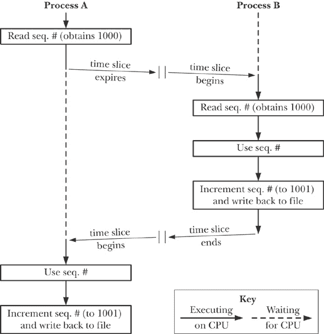
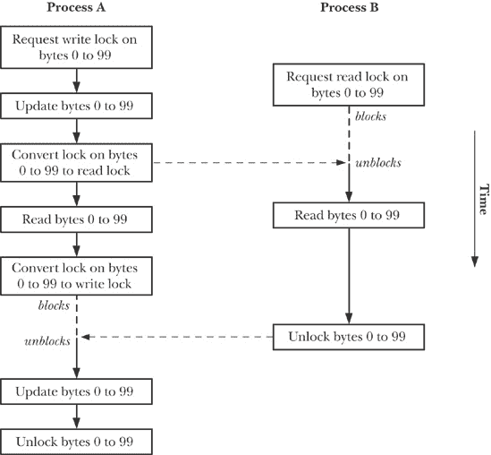
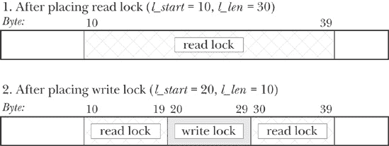
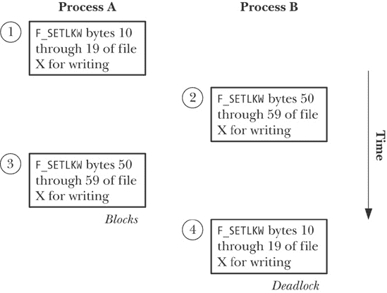
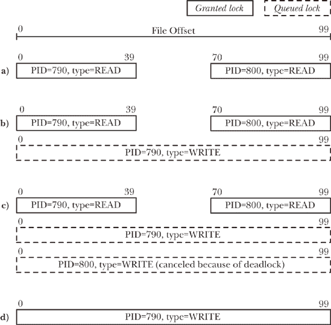
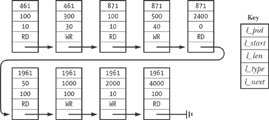
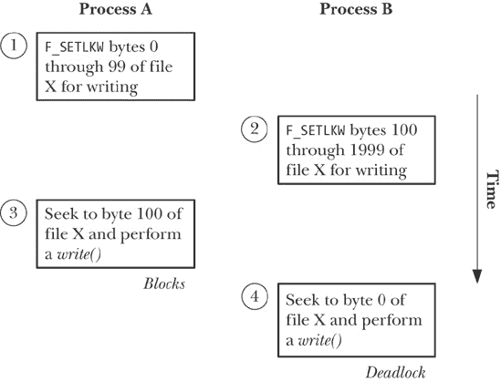

## 第五十五章. 文件锁定

之前的章节已经介绍了进程可以用来同步其操作的各种技术，包括信号（第二十章至第二十二章）和信号量（第四十七章和第五十三章）。本章将介绍更多专门用于文件的同步技术。

## 概述

一个常见的应用需求是从文件中读取数据，对数据进行一些修改，然后将其写回文件。只要每次只有一个进程以这种方式使用文件，就不会出现问题。然而，如果多个进程同时更新同一个文件，就可能会出现问题。假设例如，每个进程执行以下步骤来更新包含序列号的文件：

1.  从文件中读取序列号。

1.  将序列号用于某个应用定义的目的。

1.  增加序列号并将其写回文件。

这里的问题是，在没有任何同步技术的情况下，两个进程可能同时执行上述步骤，结果如图 55-1 所示（在这里，我们假设序列号的初始值为 1000）。

图 55-1. 两个进程在没有同步的情况下同时更新文件

问题很明显：在这些步骤结束时，文件中包含的值是 1001，而它应该包含的是 1002。（这就是竞态条件的一个例子。）为了防止这种情况的发生，我们需要某种形式的进程间同步。

虽然我们可以使用（例如）信号量来执行所需的同步操作，但通常更倾向于使用文件锁，因为内核会自动将锁与文件关联。

### 注

[Stevens & Rago, 2005]指出，UNIX 文件锁的首次实现可追溯到 1980 年，并提到我们在本章中主要关注的*fcntl()*锁出现在 1984 年发布的 System V 版本 2 中。

在本章中，我们描述了两种用于设置文件锁的不同 API：

+   *flock()*，它会对整个文件加锁；以及

+   *fcntl()*，它会对文件的某些区域加锁。

*flock()*系统调用起源于 BSD；*fcntl()*起源于 System V。

使用*flock()*和*fcntl()*的一般方法如下：

1.  对文件加锁。

1.  执行文件 I/O。

1.  解锁文件，以便另一个进程可以加锁它。

虽然文件锁定通常与文件 I/O 配合使用，但我们也可以将其作为一种更通用的同步技术。合作进程可以遵循一个约定，即锁定整个或部分文件表示进程访问除文件本身之外的某些共享资源（例如，共享内存区域）。

#### 混合使用锁定和*stdio*函数

由于*stdio*库执行的用户空间缓冲，我们在使用本章描述的锁定技术时应谨慎使用*stdio*函数。问题在于，在放置锁定之前，输入缓冲区可能已经被填充，或者在移除锁定之后，输出缓冲区可能会被刷新。可以通过几种方法避免这些问题：

+   使用*read()*和*write()*（以及相关的系统调用）代替*stdio*库进行文件 I/O 操作。

+   在文件上放置锁定后立即刷新*stdio*流，并在释放锁定之前再次刷新它。

+   可能以牺牲一些效率为代价，通过使用*setbuf()*（或类似函数）完全禁用*stdio*缓冲区。

#### 建议性锁定和强制性锁定

在本章的剩余部分，我们将区分建议性锁定和强制性锁定。默认情况下，文件锁定是*建议性*的。这意味着进程可以简单地忽略另一个进程放置的锁。为了使建议性锁定方案可行，每个访问文件的进程必须配合操作，在执行文件 I/O 之前放置锁。相反，*强制性*锁定系统强制执行进行 I/O 操作的进程遵守其他进程持有的锁。在 55.4 节中我们将进一步讨论这一区别。

## 使用*flock()*进行文件锁定

尽管*fcntl()*提供了比*flock()*更多的功能，但我们仍然描述*flock()*，因为它在一些应用程序中仍被使用，并且它在锁的继承和释放语义上与*fcntl()*有所不同。

```
#include <sys/file.h>

int `flock`(int *fd*, int *operation*);
```

### 注意

返回 0 表示成功，返回-1 表示出错

*flock()*系统调用对整个文件施加一个锁。要锁定的文件通过传入*fd*的打开文件描述符来指定。*operation*参数指定`LOCK_SH`、`LOCK_EX`或`LOCK_UN`中的一个值，这些值在表 55-1 操作参数的值")中进行了描述。

默认情况下，*flock()*会阻塞，如果另一个进程已经持有不兼容的文件锁。若要防止这种情况发生，可以将`LOCK_NB`值通过 OR（`|`）运算符添加到*operation*中。在这种情况下，如果另一个进程已经持有不兼容的锁，*flock()*不会阻塞，而是返回-1，并且*errno*会设置为`EWOULDBLOCK`。

表 55-1. *flock()*操作参数的值

| 值 | 描述 |
| --- | --- |
| `LOCK_SH` | 在由*fd*引用的文件上放置一个*共享*锁 |
| `LOCK_EX` | 在由*fd*引用的文件上放置一个*独占*锁 |
| `LOCK_UN` | 解锁由*fd*引用的文件 |
| `LOCK_NB` | 发起一个非阻塞锁请求 |

任意数量的进程可以同时持有文件的共享锁。然而，文件一次只能有一个进程持有排他锁。（换句话说，排他锁会拒绝其他进程的排他锁和共享锁。）表 55-2* 锁类型的兼容性") 总结了 *flock()* 锁的兼容性规则。在此，我们假设进程 A 是第一个设置锁的，表格中显示进程 B 是否可以设置锁。

表 55-2. *flock()* 锁类型的兼容性

| 进程 A | 进程 B |
| --- | --- |
| `LOCK_SH` | `LOCK_EX` |
| --- | --- |
| `LOCK_SH` | 是 | 否 |
| `LOCK_EX` | 否 | 否 |

无论文件的访问模式（读取、写入或读写）如何，进程都可以设置共享锁或排他锁。

已存在的共享锁可以通过再次调用 *flock()* 并指定适当的 *operation* 值来转换为排他锁（反之亦然）。如果其他进程对文件持有共享锁，转换共享锁为排他锁时将会阻塞，除非指定了 `LOCK_NB`。

锁的转换*不*保证是原子的。在转换过程中，现有的锁首先会被移除，然后再建立一个新的锁。在这两个步骤之间，另一个进程对不兼容锁的挂起请求可能会被授予。如果发生这种情况，转换将会阻塞，或者，如果指定了 `LOCK_NB`，转换将失败，进程将失去原来的锁。（这种行为发生在原始的 BSD *flock()* 实现中，也发生在许多其他 UNIX 实现中。）

### 注意

虽然它不是 SUSv3 的一部分，*flock()* 在大多数 UNIX 实现中都可以使用。一些实现要求包含 `<fcntl.h>` 或 `<sys/fcntl.h>`，而不是 `<sys/file.h>`。因为 *flock()* 起源于 BSD，它所设置的锁有时被称为 *BSD 文件锁*。

示例 55-1*) 演示了 *flock()* 的使用。该程序锁定一个文件，休眠指定的秒数，然后解锁文件。程序最多可以接受三个命令行参数。第一个参数是要锁定的文件。第二个参数指定锁类型（共享锁或排他锁）以及是否包括 `LOCK_NB`（非阻塞）标志。第三个参数指定获取和释放锁之间休眠的秒数；此参数是可选的，默认值为 10 秒。

示例 55-1. 使用 *flock()*

```
`filelock/t_flock.c`
#include <sys/file.h>
#include <fcntl.h>
#include "curr_time.h"                  /* Declaration of currTime() */
#include "tlpi_hdr.h"

int
main(int argc, char *argv[])
{
    int fd, lock;
    const char *lname;

    if (argc < 3 || strcmp(argv[1], "--help") == 0 ||
            strchr("sx", argv[2][0]) == NULL)
        usageErr("%s file lock [sleep-time]\n"
                 "    'lock' is 's' (shared) or 'x' (exclusive)\n"
                 "        optionally followed by 'n' (nonblocking)\n"
                 "    'secs' specifies time to hold lock\n", argv[0]);

    lock = (argv[2][0] == 's') ? LOCK_SH : LOCK_EX;
    if (argv[2][1] == 'n')
        lock |= LOCK_NB;

    fd = open(argv[1], O_RDONLY);               /* Open file to be locked */
    if (fd == -1)
        errExit("open");

    lname = (lock & LOCK_SH) ? "LOCK_SH" : "LOCK_EX";

    printf("PID %ld: requesting %s at %s\n", (long) getpid(), lname,
            currTime("%T"));

    if (flock(fd, lock) == -1) {
        if (errno == EWOULDBLOCK)
            fatal("PID %ld: already locked - bye!", (long) getpid());
        else
            errExit("flock (PID=%ld)", (long) getpid());
    }

    printf("PID %ld: granted    %s at %s\n", (long) getpid(), lname,
            currTime("%T"));

    sleep((argc > 3) ? getInt(argv[3], GN_NONNEG, "sleep-time") : 10);

    printf("PID %ld: releasing  %s at %s\n", (long) getpid(), lname,
            currTime("%T"));
    if (flock(fd, LOCK_UN) == -1)
        errExit("flock");

    exit(EXIT_SUCCESS);
}
    `filelock/t_flock.c`
```

使用示例 55-1")中的程序，我们可以进行一些实验来探索*flock()*的行为。以下的 shell 会话展示了几个示例。我们首先创建一个文件，然后启动我们的程序实例，该实例在后台运行并保持共享锁 60 秒：

```
$ `touch tfile`
$ `./t_flock tfile s 60 &`
[1] 9777
PID 9777: requesting LOCK_SH at 21:19:37
PID 9777: granted    LOCK_SH at 21:19:37
```

接下来，我们启动另一个程序实例，该实例成功请求了共享锁并随后释放它：

```
$ `./t_flock tfile s 2`
PID 9778: requesting LOCK_SH at 21:19:49
PID 9778: granted    LOCK_SH at 21:19:49
PID 9778: releasing  LOCK_SH at 21:19:51
```

然而，当我们启动程序的另一个实例，该实例发出非阻塞请求以获取独占锁时，请求会立即失败：

```
$ `./t_flock tfile xn`
PID 9779: requesting LOCK_EX at 21:20:03
PID 9779: already locked - bye!
```

当我们启动另一个实例的程序，该程序发出阻塞请求以获取独占锁时，程序会被阻塞。当在后台运行的进程释放其持有的共享锁（持续 60 秒）时，阻塞的请求会被授予：

```
$ `./t_flock tfile x`
PID 9780: requesting LOCK_EX at 21:20:21
PID 9777: releasing  LOCK_SH at 21:20:37
PID 9780: granted    LOCK_EX at 21:20:37
PID 9780: releasing  LOCK_EX at 21:20:47
```

### 锁继承和释放的语义

如表 55-1 操作参数的值")所示，我们可以通过指定*operation*为`LOCK_UN`的*flock()*调用释放文件锁。此外，当相应的文件描述符关闭时，锁会自动释放。然而，情况比这更复杂。通过*flock()*获取的文件锁是与打开文件描述（文件描述符与打开文件之间的关系）相关联的，而不是与文件描述符或文件（i-node）本身相关联。这意味着，当文件描述符被复制（通过*dup()*、*dup2()*或*fcntl()*的`F_DUPFD`操作）时，新的文件描述符会指向相同的文件锁。例如，如果我们已经在由*fd*引用的文件上获取了锁，那么以下代码（省略了错误检查）将释放该锁：

```
flock(fd, LOCK_EX);               /* Gain lock via 'fd' */
newfd = dup(fd);                  /* 'newfd' refers to same lock as 'fd' */
flock(newfd, LOCK_UN);            /* Frees lock acquired via 'fd' */
```

如果我们通过特定的文件描述符获取了一个锁，并且我们创建了一个或多个该描述符的副本，那么——如果我们没有显式地执行解锁操作——只有当所有副本描述符都被关闭时，锁才会被释放。

然而，如果我们使用*open()*获取一个指向同一文件的第二个文件描述符（及相关的打开文件描述），那么这个第二个描述符会被*flock()*独立处理。例如，执行以下代码的进程将在第二次*flock()*调用时被阻塞：

```
fd1 = open("a.txt", O_RDWR);
fd2 = open("a.txt", O_RDWR);
flock(fd1, LOCK_EX);
flock(fd2, LOCK_EX);              /* Locked out by lock on 'fd1' */
```

因此，进程可以通过*flock()*将自己锁定在文件之外。正如我们稍后会看到的，使用*fcntl()*获取的记录锁不能发生这种情况。

当我们使用*fork()*创建子进程时，子进程会获得父进程文件描述符的副本，正如通过*dup()*等复制的描述符一样，这些描述符指向相同的打开文件描述，因此也指向相同的锁。例如，以下代码会导致子进程删除父进程的锁：

```
flock(fd, LOCK_EX);               /* Parent obtains lock */
if (fork() == 0)                  /* If child... */
    flock(fd, LOCK_UN);           /* Release lock shared with parent */
```

这些语义有时可以被有效利用来（原子地）将文件锁从父进程转移到子进程：在*fork()*之后，父进程关闭其文件描述符，锁定便完全由子进程控制。正如我们稍后将看到的，这种做法无法通过*fcntl()*获取的记录锁来实现。

由*flock()*创建的锁在*exec()*中会被保留（除非文件描述符设置了关闭执行标志，并且该文件描述符是最后一个引用底层打开文件描述符的）。

上述 Linux 语义符合经典的 BSD 实现的*flock()*。在某些 UNIX 实现中，*flock()*是通过*fcntl()*实现的，稍后我们将看到，*fcntl()*锁的继承和释放语义与*flock()*锁有所不同。由于由*flock()*和*fcntl()*创建的锁之间的交互未定义，应用程序应当仅在文件上使用这两种锁方法中的一种。

### *flock()*的限制

使用*flock()*加锁有若干限制：

+   只能对整个文件加锁。这种粗粒度的加锁限制了合作进程之间的并发性。例如，如果我们有多个进程，每个进程都希望同时访问同一个文件的不同部分，那么使用*flock()*加锁将不必要地阻止这些进程并发操作。

+   我们只能使用*flock()*设置建议性锁。

+   许多 NFS 实现不识别*flock()*授予的锁。

所有这些限制都可以通过*fcntl()*实现的加锁方案来解决，我们将在下一节中描述该方案。

### 注意

历史上，Linux NFS 服务器不支持*flock()*锁。从内核版本 2.6.12 开始，Linux NFS 服务器通过将其实现为对整个文件的*fcntl()*锁来支持*flock()*锁。这会导致一些奇怪的效果，当服务器上和客户端上混合使用 BSD 锁时：客户端通常无法看到服务器的锁，反之亦然。

## 使用*fcntl()*进行记录加锁

使用*fcntl()*（文件控制操作：*fcntl()*")），我们可以对文件的任何部分加锁，从单个字节到整个文件。 这种文件加锁方式通常称为*记录加锁*。然而，这个术语并不准确，因为 UNIX 系统中的文件是字节序列，并没有记录边界的概念。文件中的任何记录概念完全是在应用程序内部定义的。

通常，*fcntl()* 用于锁定文件中与应用程序定义的记录边界相对应的字节范围；因此，产生了*记录锁*这一术语。术语*字节范围*、*文件区域*和*文件段*是较少使用但更为准确的对这种类型锁的描述。（因为这是原始 POSIX.1 标准和 SUSv3 中唯一规定的锁定类型，它有时也被称为 POSIX 文件锁定。）

### 注释

SUSv3 要求常规文件必须支持记录锁，并允许对其他文件类型支持记录锁。尽管通常只有对常规文件应用记录锁才有意义（因为对于大多数其他文件类型，讨论文件中数据的字节范围没有意义），但在 Linux 上，可以对任何类型的文件描述符应用记录锁。

图 55-2 显示了如何使用记录锁来同步两个进程对文件相同区域的访问。（在该图中，我们假设所有的锁请求都是阻塞的，因此如果锁被另一个进程占用，进程将等待。）

创建或移除文件锁的 *fcntl()* 调用的一般形式如下：

```
struct flock flockstr;

/* Set fields of 'flockstr' to describe lock to be placed or removed */

fcntl(fd, cmd, &flockstr);          /* Place lock defined by 'fl' */
```

*fd* 参数是一个打开的文件描述符，指向我们希望在其上设置锁的文件。

在讨论 *cmd* 参数之前，我们首先描述 *flock* 结构。

#### *flock* 结构

*flock* 结构定义了我们希望获取或移除的锁。其定义如下：

```
struct flock {
    short l_type;       /* Lock type: F_RDLCK, F_WRLCK, F_UNLCK */
    short l_whence;     /* How to interpret 'l_start': SEEK_SET,
                           SEEK_CUR, SEEK_END */
    off_t l_start;      /* Offset where the lock begins */
    off_t l_len;        /* Number of bytes to lock; 0 means "until EOF" */
    pid_t l_pid;        /* Process preventing our lock (F_GETLK only) */
};
```

*l_type* 字段指示我们希望设置的锁的类型。它被指定为 表 55-3 锁定类型") 中的一个值。

在语义上，读锁（`F_RDLCK`）和写锁（`F_WRLCK`）与 *flock()* 应用的共享锁和排他锁相对应，并遵循相同的兼容性规则（表 55-2 锁类型的兼容性")）：多个进程可以同时持有文件区域的读锁，但只有一个进程可以持有写锁，并且该锁会排除其他进程的读锁和写锁。将 *l_type* 指定为 `F_UNLCK` 类似于 *flock()* 的 `LOCK_UN` 操作。

表 55-3. *fcntl()* 锁定的锁类型

| 锁类型 | 描述 |
| --- | --- |
| `F_RDLCK` | 设置读锁 |
| `F_WRLCK` | 设置写锁 |
| `F_UNLCK` | 移除现有的锁 |

 图 55-2. 使用记录锁来同步访问文件的相同区域

为了在文件上放置读取锁，文件必须以读取模式打开。类似地，为了放置写入锁，文件必须以写入模式打开。要放置两种类型的锁，我们需要以读写模式打开文件（`O_RDWR`）。尝试放置与文件访问模式不兼容的锁会导致错误 `EBADF`。

*l_whence*、*l_start* 和 *l_len* 字段共同指定了要锁定的字节范围。这两个字段的前两个与 *lseek()* 的 *whence* 和 *offset* 参数类似（更改文件偏移：*lseek()*")）。*l_start* 字段指定一个文件中的偏移量，该偏移量相对于以下之一进行解释：

+   如果 *l_whence* 为 `SEEK_SET`，则是文件的开始。

+   如果 *l_whence* 为 `SEEK_CUR`，则为当前文件偏移量；或者

+   如果 *l_whence* 为 `SEEK_END`，则是文件的结尾。

在最后两种情况下，*l_start* 可以是负数，只要结果文件位置不在文件的起始位置之前（字节 0）。

*l_len* 字段包含一个整数，指定从 *l_whence* 和 *l_start* 定义的位置开始锁定的字节数。可以锁定文件末尾不存在的字节，但无法锁定文件起始位置之前的字节。

从内核 2.4.21 开始，Linux 允许在 *l_len* 中提供负值。这是一个请求，要求锁定从 *l_whence* 和 *l_start* 指定的位置之前的 *l_len* 字节（即范围为 *(l_start - abs(l_len))* 到 *(l_start - 1)* 的字节）。SUSv3 允许，但不强制要求使用此功能。其他一些 UNIX 实现也提供此功能。

一般来说，应用程序应锁定必要的最小字节范围。这可以让其他进程同时尝试锁定同一文件的不同区域时，提供更大的并发性。

### 注意

在某些情况下，*最小范围* 这一术语需要进一步说明。混合使用记录锁和对 *mmap()* 的调用可能会对网络文件系统（如 NFS 和 CIFS）产生不良后果。问题出在 *mmap()* 将文件映射为系统页面大小的单位。如果文件锁是页面对齐的，那么一切正常，因为锁会覆盖与脏页相对应的整个区域。然而，如果锁没有页面对齐，就会发生竞争条件——如果映射页面的任何部分已被修改，内核可能会写入未被锁定的区域。

在 *l_len* 中指定 0 具有特殊含义，即“锁定从 *l_start* 和 *l_whence* 指定的点到文件末尾的所有字节，无论文件增长多大”。如果我们事先不知道将要向文件添加多少字节，这将非常方便。要锁定整个文件，我们可以将 *l_whence* 指定为 `SEEK_SET`，并将 *l_start* 和 *l_len* 都指定为 0。

#### *cmd* 参数

在处理文件锁时，*fcntl()*的*cmd*参数可以指定三种可能的值。前两个用于获取和释放锁：

`F_SETLK`

获取（*l_type*为`F_RDLCK`或`F_WRLCK`）或释放（*l_type*为`F_UNLCK`）*flockstr*指定的字节上的锁。如果另一个进程在要锁定的区域的任何部分上持有不兼容的锁，*fcntl()*将失败并返回错误`EAGAIN`。在某些 UNIX 实现中，*fcntl()*在这种情况下会返回错误`EACCES`。SUSv3 允许这两种情况，便携式应用程序应该同时测试这两个值。

`F_SETLKW`

这与`F_SETLK`相同，只是如果另一个进程在要锁定的区域的任何部分上持有不兼容的锁，则该调用会阻塞，直到可以授予锁。如果我们正在处理信号并且没有指定`SA_RESTART`（系统调用的中断与重启），那么`F_SETLKW`操作可能会被中断（即，因错误`EINTR`失败）。我们可以利用这种行为，使用*alarm()*或*setitimer()*来为锁请求设置超时。

请注意，*fcntl()*锁定的是指定的整个区域或根本不锁定。没有锁定当前解锁的请求区域字节的概念。

剩余的*fcntl()*操作用于确定我们是否可以在给定区域放置锁：

`F_GETLK`

检查是否可以获取在*flockstr*中指定的锁，但不要实际获取它。*l_type*字段必须是`F_RDLCK`或`F_WRLCK`。*flockstr*结构被视为一个值-结果参数；返回时，它包含有关是否可以放置指定锁的信息。如果允许放置锁（即，指定文件区域上没有不兼容的锁），则在*l_type*字段中返回`F_UNLCK`，其余字段保持不变。如果区域上存在一个或多个不兼容的锁，则*flockstr*返回关于*其中一个*锁的信息（无法确定是哪一个），包括其类型（*l_type*）、字节范围（*l_start*和*l_len*；*l_whence*始终返回`SEEK_SET`），以及持有该锁的进程的进程 ID（*l_pid*）。

请注意，当将`F_GETLK`与随后的`F_SETLK`或`F_SETLKW`结合使用时，可能会出现竞争条件。到我们执行后续操作时，`F_GETLK`返回的信息可能已经过时。因此，`F_GETLK`的实际用途不如它看起来那么有用。即使`F_GETLK`表示可以放置锁，我们仍然需要为`F_SETLK`返回错误或`F_SETLKW`阻塞做好准备。

### 注意

GNU C 库还实现了*lockf()*函数，它只是一个简化接口，位于*fcntl()*之上。（SUSv3 指定了*lockf()*，但没有指定*lockf()*和*fcntl()*之间的关系。然而，大多数 UNIX 系统将*lockf()*实现为基于*fcntl()*的功能。）形式为*lockf(fd, operation, size)*的调用等同于调用*fcntl()*，其中* l_whence*设置为`SEEK_CUR`，*l_start*设置为 0，*l_len*设置为*size*；也就是说，*lockf()*会锁定从当前文件偏移量开始的一段字节。*lockf()*的*operation*参数类似于*fcntl()*的*cmd*参数，但使用不同的常量来获取、释放和测试锁的存在。*lockf()*函数只放置独占（即写）锁。有关详细信息，请参阅*lockf(3)*手册页。

#### 锁的获取和释放的详细信息

关于使用*fcntl()*获取和释放锁的以下几点需要注意：

+   解锁文件区域总是立即成功。如果我们当前没有持有锁，解锁该区域也不会视为错误。

+   在任何时候，一个进程只能对文件的特定区域持有一种类型的锁。对一个我们已经加锁的区域再次加锁，要么没有变化（如果锁的类型与现有锁相同），要么会原子地将现有锁转换为新模式。在后者的情况下，当将读锁转换为写锁时，我们需要做好准备，可能会遇到错误（`F_SETLK`）或阻塞（`F_SETLKW`）。 （这与*flock()*不同，*flock()*的锁转换不是原子的。）

+   即使通过多个指向同一文件的文件描述符加锁，进程也永远不会将自己锁定在文件区域之外。（这与*flock()*不同，关于这一点我们会在锁定限制和性能中进一步讨论。）

+   在我们已经持有的锁中间放置不同模式的锁会导致三个锁：在新锁的两侧会创建两个较小的锁，且锁的模式与之前的锁相同（参见图 55-3）。相反，获取与现有锁相邻或重叠的第二个相同模式的锁会导致一个合并的锁，覆盖两个锁的合并区域。其他的排列方式也是可能的。例如，解锁较大现有锁中间的区域会在解锁区域的两侧留下两个较小的锁定区域。如果一个新锁与现有的不同模式的锁重叠，那么现有的锁会缩小，因为重叠的字节被纳入到新锁中。

+   关闭文件描述符在文件区域锁方面有一些不寻常的语义。我们在锁定限制和性能中描述了这些语义。

图 55-3. 同一进程通过写锁拆分现有的读锁

### 死锁

使用`F_SETLKW`时，我们需要注意图 55-4 中展示的场景类型。在这个场景中，每个进程的第二个锁请求被另一个进程持有的锁所阻塞。这样的场景被称为*死锁*。如果内核没有加以检查，这将导致两个进程永远被阻塞。为了防止这种情况发生，内核会检查每一个通过`F_SETLKW`发出的新的锁请求，看看它是否会导致死锁。如果会，内核会选择其中一个被阻塞的进程，并使它的*fcntl()*调用解除阻塞，并返回`EDEADLK`错误。（在 Linux 中，会选择最近发出*fcntl()*调用的进程，但这并非 SUSv3 的要求，未来版本的 Linux 或其他 UNIX 实现上可能并不如此。任何使用`F_SETLKW`的进程都必须准备好处理`EDEADLK`错误。）

图 55-4. 两个进程互相拒绝对方锁请求时的死锁

即使是在多个不同文件上放置锁时，也能检测到死锁情况，圆形死锁也能被检测到，圆形死锁涉及多个进程。（*圆形死锁*指的是，例如，进程 A 等待获取进程 B 持有的区域锁，进程 B 等待获取进程 C 持有的锁，进程 C 等待获取进程 A 持有的锁。）

### 示例：一个交互式锁定程序

如示例 55-2 中所示的程序允许我们交互式地实验记录锁定。该程序接受一个命令行参数：我们希望在其上放置锁的文件名。通过这个程序，我们可以验证许多关于记录锁定操作的先前陈述。该程序设计为交互式使用，接受如下形式的命令：

```
*cmd lock start length*[*whence*]
```

对于*cmd*，我们可以指定*g*来执行`F_GETLK`，*s*来执行`F_SETLK`，或*w*来执行`F_SETLKW`。其余参数用于初始化传递给*fcntl()*的*flock*结构。*lock*参数指定*l_type*字段的值，*r*表示`F_RDLCK`，*w*表示`F_WRLCK`，或*u*表示`F_UNLCK`。*start*和*length*参数是整数，用于指定*l_start*和*l_len*字段的值。最后，可选的*whence*参数指定*l_whence*字段的值，可以是*s*表示`SEEK_SET`（默认值），*c*表示`SEEK_CUR`，或*e*表示`SEEK_END`。（有关为什么我们在示例 55-2 中的*printf()*调用中将*l_start*和*l_len*字段强制转换为*long long*，请参阅大文件 I/O。）

示例 55-2. 实验记录锁定

```
`filelock/i_fcntl_locking.c`
#include <sys/stat.h>
#include <fcntl.h>
#include "tlpi_hdr.h"

#define MAX_LINE 100

static void
displayCmdFmt(void)
{
    printf("\n    Format: cmd lock start length [whence]\n\n");
    printf("    'cmd' is 'g' (GETLK), 's' (SETLK), or 'w' (SETLKW)\n");
    printf("    'lock' is 'r' (READ), 'w' (WRITE), or 'u' (UNLOCK)\n");
    printf("    'start' and 'length' specify byte range to lock\n");
    printf("    'whence' is 's' (SEEK_SET, default), 'c' (SEEK_CUR), "
           "or 'e' (SEEK_END)\n\n");
}

int
main(int argc, char *argv[])
{
    int fd, numRead, cmd, status;
    char lock, cmdCh, whence, line[MAX_LINE];
    struct flock fl;
    long long len, st;

    if (argc != 2 || strcmp(argv[1], "--help") == 0)
        usageErr("%s file\n", argv[0]);

    fd = open(argv[1], O_RDWR);
    if (fd == -1)
        errExit("open (%s)", argv[1]);

    printf("Enter ? for help\n");

    for (;;) {          /* Prompt for locking command and carry it out */
        printf("PID=%ld> ", (long) getpid());
        fflush(stdout);

        if (fgets(line, MAX_LINE, stdin) == NULL)       /* EOF */
            exit(EXIT_SUCCESS);
        line[strlen(line) - 1] = '\0';          /* Remove trailing '\n' */

        if (*line == '\0')
            continue;                           /* Skip blank lines */

        if (line[0] == '?') {
            displayCmdFmt();
            continue;
        }

        whence = 's';                   /* In case not otherwise filled in */

        numRead = sscanf(line, "%c %c %lld %lld %c", &cmdCh, &lock,
                        &st, &len, &whence);
        fl.l_start = st;
        fl.l_len = len;

        if (numRead < 4 || strchr("gsw", cmdCh) == NULL ||
                strchr("rwu", lock) == NULL || strchr("sce", whence) == NULL) {
            printf("Invalid command!\n");
            continue;
        }

        cmd = (cmdCh == 'g') ? F_GETLK : (cmdCh == 's') ? F_SETLK : F_SETLKW;
        fl.l_type = (lock == 'r') ? F_RDLCK : (lock == 'w') ? F_WRLCK : F_UNLCK;
        fl.l_whence = (whence == 'c') ? SEEK_CUR :
                      (whence == 'e') ? SEEK_END : SEEK_SET;

        status = fcntl(fd, cmd, &fl);           /* Perform request... */

        if (cmd == F_GETLK) {                   /* ... and see what happened */
            if (status == -1) {
                errMsg("fcntl - F_GETLK");
            } else {
                if (fl.l_type == F_UNLCK)
                    printf("[PID=%ld] Lock can be placed\n", (long) getpid());
                else                            /* Locked out by someone else */
                    printf("[PID=%ld] Denied by %s lock on %lld:%lld "
                            "(held by PID %ld)\n", (long) getpid(),
                            (fl.l_type == F_RDLCK) ? "READ" : "WRITE",
                            (long long) fl.l_start,
                            (long long) fl.l_len, (long) fl.l_pid);
            }
        } else {                /* F_SETLK, F_SETLKW */
            if (status == 0)
                printf("[PID=%ld] %s\n", (long) getpid(),
                        (lock == 'u') ? "unlocked" : "got lock");
            else if (errno == EAGAIN || errno == EACCES)        /* F_SETLK */
                printf("[PID=%ld] failed (incompatible lock)\n",
                        (long) getpid());
            else if (errno == EDEADLK)                          /* F_SETLKW */
                printf("[PID=%ld] failed (deadlock)\n", (long) getpid());
            else
                errMsg("fcntl - F_SETLK(W)");
        }
    }
}
    `filelock/i_fcntl_locking.c`
```

在以下的 shell 会话日志中，我们通过运行两个实例来展示如何使用示例 55-2 中的程序，对同一个 100 字节的文件*(tfile)*加锁。图 55-5 展示了在这段 shell 会话日志中的不同时间点上，已授予和排队的锁请求的状态，如下面的评论所述。

我们在示例 55-2 中启动第一个实例（进程 A），对文件的第 0 到第 39 字节加上读锁：

```
`Terminal window 1`
$ `ls -l tfile`
-rw-r--r--    1 mtk      users         100 Apr 18 12:19 tfile
$ `./i_fcntl_locking tfile`
Enter ? for help
PID=790> `s r 0 40`
[PID=790] got lock
```

然后我们启动程序的第二个实例（进程 B），对文件的第 70 字节到文件末尾加读锁：

```
`Terminal window 2`
                                    $ `./i_fcntl_locking tfile`
                                    Enter ? for help
                                    PID=800> `s r -30 0 e`
                                    [PID=800] got lock
```

在这一点，事情如图 55-5 中*a*部分所示，进程 A（进程 ID 790）和进程 B（进程 ID 800）分别在文件的不同部分持有锁。

现在我们回到进程 A，尝试对整个文件加写锁。我们首先使用`F_GETLK`测试是否可以加锁，系统提示有冲突的锁。然后我们尝试用`F_SETLK`加锁，但也失败了。最后，我们尝试用`F_SETLKW`加锁，这时程序被阻塞。

```
PID=790> `g w 0 0`
[PID=790] Denied by READ lock on 70:0 (held by PID 800)
PID=790> `s w 0 0`
[PID=790] failed (incompatible lock)
PID=790> `w w 0 0`
```

在这一点，事情如图 55-5 中*b*部分所示，进程 A 和进程 B 分别在文件的不同部分持有锁，且进程 A 对整个文件有一个排队的锁请求。

我们在进程 B 中继续，通过尝试对整个文件设置写锁。我们首先测试是否可以使用 `F_GETLK` 设置锁，这会通知我们存在冲突锁。然后，我们尝试使用 `F_SETLKW` 设置锁。

```
PID=800> `g w 0 0`
                                    [PID=800] Denied by READ lock on 0:40
                                    (held by PID 790)
                                    PID=800> `w w 0 0`
                                    [PID=800] failed (deadlock)
```

图 55-5 的 *c* 部分展示了当进程 B 发出阻塞请求以在整个文件上设置写锁时发生的情况：死锁。在此时，内核选择了一个锁请求失败——在此情况下，是进程 B 的请求，然后它从 *fcntl()* 调用中收到 `EDEADLK` 错误。

我们在进程 B 中继续，通过移除它在文件上的所有锁：

```
PID=800> `s u 0 0`
                                    [PID=800] unlocked
[PID=790] got lock
```

正如我们从输出的最后一行所看到的，这使得进程 A 的被阻塞锁请求得以授予。

需要意识到的是，即使进程 B 的死锁请求被取消，它仍然持有其他锁，因此进程 A 的排队锁请求仍然被阻塞。只有当进程 B 移除其其他锁时，进程 A 的锁请求才会被授予，从而产生 图 55-5 *d* 部分所示的情况。

图 55-5. 运行 `i_fcntl_locking.c` 时已授予和排队的锁请求状态

### 示例：锁定函数库

示例 55-3 提供了一组锁定函数，我们可以在其他程序中使用。这些函数如下：

+   *lockRegion()* 函数使用 `F_SETLK` 在由文件描述符 *fd* 引用的打开文件上设置锁。*type* 参数指定锁的类型（`F_RDLCK` 或 `F_WRLCK`）。*whence*、*start* 和 *len* 参数指定要锁定的字节范围。这些参数提供了用于设置锁的 *flockstr* 结构中同名字段的值。

+   *lockRegionWait()* 函数类似于 *lockRegion()*，但它发出一个阻塞锁请求；也就是说，它使用 `F_SETLKW`，而不是 `F_SETLK`。

+   *regionIsLocked()* 函数测试是否可以在文件上设置锁。该函数的参数与 *lockRegion()* 相同。如果没有进程持有与调用中指定的锁冲突的锁，则此函数返回 0（假）。如果一个或多个进程持有冲突的锁，则此函数返回非零值（即真）——冲突锁的进程 ID。

示例 55-3. 文件区域锁定函数

```
`filelock/region_locking.c`
#include <fcntl.h>
#include "region_locking.h"             /* Declares functions defined here */

/* Lock a file region (private; public interfaces below) */

static int
lockReg(int fd, int cmd, int type, int whence, int start, off_t len)
{
    struct flock fl;

    fl.l_type = type;
    fl.l_whence = whence;
    fl.l_start = start;
    fl.l_len = len;

    return fcntl(fd, cmd, &fl);
}

int                     /* Lock a file region using nonblocking F_SETLK */
lockRegion(int fd, int type, int whence, int start, int len)
{
    return lockReg(fd, F_SETLK, type, whence, start, len);
}

int                     /* Lock a file region using blocking F_SETLKW */
lockRegionWait(int fd, int type, int whence, int start, int len)
{
    return lockReg(fd, F_SETLKW, type, whence, start, len);
}

/* Test if a file region is lockable. Return 0 if lockable, or
   PID of process holding incompatible lock, or -1 on error. */

pid_t
regionIsLocked(int fd, int type, int whence, int start, int len)
{
    struct flock fl;

    fl.l_type = type;
    fl.l_whence = whence;
    fl.l_start = start;
    fl.l_len = len;

    if (fcntl(fd, F_GETLK, &fl) == -1)
        return -1;

    return (fl.l_type == F_UNLCK) ? 0 : fl.l_pid;
}
    `filelock/region_locking.c`
```

### 锁定限制与性能

SUSv3 允许实现设置系统范围内的固定上限，限制可获得的记录锁数量。当达到此限制时，*fcntl()* 会因错误 `ENOLCK` 而失败。Linux 并未设置固定的记录锁数量上限；我们仅受限于内存的可用性。（许多其他 UNIX 实现也类似。）

记录锁的获取和释放速度有多快？这个问题没有固定答案，因为这些操作的速度取决于用来维护记录锁的内核数据结构及特定锁在该数据结构中的位置。我们稍后将研究这个结构，但首先我们考虑一些影响其设计的要求：

+   内核需要能够将新锁与任何现有的相同模式的锁（由同一进程持有）合并，这些锁可能位于新锁的两侧。

+   新锁可能完全替代调用进程持有的一个或多个现有锁。内核需要能够轻松地定位所有这些锁。

+   当在现有锁的中间创建一个不同模式的新锁时，拆分现有锁的工作（图 55-3）应该是简单的。

用于维护锁信息的内核数据结构旨在满足这些要求。每个打开的文件都有一个与之关联的锁链表。链表中的锁按进程 ID 排序，其次按起始偏移量排序。此类列表的示例如 图 55-6 中所示。

### 注

内核还在与打开文件关联的锁链表中维护 *flock()* 锁和文件租约。（我们将在讨论 `/proc/locks` 文件时简要描述文件租约，见第 55.5 节。）然而，这些类型的锁通常数量较少，因此不太可能影响性能，因此在本讨论中我们将忽略它们。

图 55-6. 单个文件的记录锁列表示例

每当向此数据结构中添加一个新锁时，内核必须检查是否与文件上的任何现有锁发生冲突。此搜索是顺序进行的，从列表头部开始。

假设有大量锁分布在多个进程之间，我们可以说，添加或删除一个锁所需的时间大致与文件上已持有的锁数量成线性增长关系。

### 锁继承和释放的语义

*fcntl()* 记录锁的继承和释放语义与使用 *flock()* 创建的锁有显著不同。请注意以下几点：

+   记录锁不会在子进程通过 *fork()* 继承。这与 *flock()* 不同，在 *flock()* 中，子进程继承对 *相同* 锁的引用，并可以释放此锁，导致父进程也失去该锁。

+   记录锁在 *exec()* 过程中会被保留。（不过请注意下面描述的 close-on-exec 标志的效果。）

+   进程中的所有线程共享同一组记录锁。

+   记录锁与进程和 i-node 都相关联（参见 文件描述符与打开文件之间的关系）。这种关联的一个不足为奇的结果是，当进程终止时，所有记录锁都会被释放。更意外的是，每当进程关闭一个文件描述符时，*所有*该进程在相应文件上持有的锁都会被释放，无论这些锁是通过哪些文件描述符获得的。例如，在以下代码中，*close(fd2)* 调用会释放调用进程在 `testfile` 上持有的锁，即使该锁是通过文件描述符 *fd1* 获得的：

```
struct flock fl;

fl.l_type = F_WRLCK;
fl.l_whence = SEEK_SET;
fl.l_start = 0;
fl.l_len = 0;

fd1 = open("testfile", O_RDWR);
fd2 = open("testfile", O_RDWR);

if (fcntl(fd1, cmd, &fl) == -1)
    errExit("fcntl");

close(fd2);
```

最后一条中描述的语义适用于无论是如何获得的指向同一文件的不同描述符，以及无论描述符是如何被关闭的。例如，*dup()*、*dup2()* 和 *fcntl()* 都可以用于获得一个打开文件描述符的副本。此外，除了显式调用 *close()* 外，如果设置了 close-on-exec 标志，描述符还可以通过 *exec()* 调用关闭，或者通过 *dup2()* 调用关闭第二个文件描述符参数（如果该描述符已经打开）。

*fcntl()* 锁的继承和释放语义是一个架构上的缺陷。例如，它们使得从库包中使用记录锁变得问题重重，因为库函数无法防止其调用者关闭一个指向已锁定文件的文件描述符，从而移除库代码获得的锁。一个可行的替代实现方案是将锁与文件描述符关联，而不是与 i-node 关联。然而，当前的语义是记录锁的历史行为，并且已经成为标准化的行为。不幸的是，这些语义大大限制了 *fcntl()* 锁的实用性。

### 注意

使用 *flock()* 时，锁仅与一个打开的文件描述符关联，并且一直有效，直到持有锁的任何进程显式释放该锁，或者所有指向该打开文件描述符的文件描述符被关闭。

### 锁饥饿和排队锁请求的优先级

当多个进程必须等待才能对当前被锁定的区域加锁时，出现了几个问题。

一个等待写锁的进程是否会被一系列在同一区域上放置读取锁的进程饿死？在 Linux（与许多其他 UNIX 实现一样）上，一系列的读取锁确实可能会饿死一个被阻塞的写锁，可能是无限期的。

当两个或多个进程等待获取锁时，是否有规则决定哪个进程在锁可用时获取锁？例如，锁请求是否按照 FIFO 顺序满足？规则是否取决于每个进程请求的锁类型（即，要求读取锁的进程是否优先于请求写入锁的进程，反之亦然，或者两者都不是）？在 Linux 上，规则如下：

+   排队的锁请求的满足顺序是不可预测的。如果多个进程在等待获取锁，那么它们满足的顺序取决于进程调度方式。

+   写入者并不优先于读取者，反之亦然。

这样的声明不一定适用于其他系统。在一些 UNIX 实现中，锁请求是按照 FIFO 顺序提供的，且读取器优先于写入器。

## 强制锁定

我们迄今为止描述的锁定种类是*建议性的*。这意味着进程可以自由地忽略使用*fcntl()*（或*flock()*)并直接对文件执行 I/O 操作。内核不会阻止这种行为。在使用建议性锁定时，由应用程序设计人员来：

+   为文件设置适当的所有权（或组所有权）和权限，以防止不合作的进程执行文件 I/O；

+   确保构成应用程序的进程通过在执行 I/O 操作之前获取适当的文件锁来协作。

Linux 与许多其他 UNIX 实现一样，也允许*fcntl()*记录锁定为*强制性*。这意味着每个文件 I/O 操作都会检查是否与其他进程在执行 I/O 的文件区域上持有的任何锁兼容。

### 注意

建议模式锁定有时被称为*任意锁定*，而强制锁定有时被称为*强制模式锁定*。SUSv3 没有指定强制锁定，但在大多数现代 UNIX 实现中它是可用的（尽管在细节上有所不同）。

为了在 Linux 上使用强制锁定，我们必须在包含要锁定文件的文件系统上启用它，并在每个要锁定的文件上启用强制锁定。我们通过使用(Linux 特有的)*-o mand*选项挂载文件系统来启用强制锁定：

```
# `mount -o mand /dev/sda10 /testfs`
```

从程序中，我们可以通过在调用*mount(2)*时指定`MS_MANDLOCK`标志来实现相同的结果（挂载文件系统：*mount()*")）。

我们可以通过查看不带选项的*mount(8)*命令的输出，检查挂载的文件系统是否启用了强制锁定：

```
# `mount | grep sda10`
/dev/sda10 on /testfs type ext3 (rw,mand)
```

强制锁定通过启用设置组 ID 权限位并关闭组执行权限的组合来启用。这个权限位组合在早期的 UNIX 实现中是没有意义且未被使用的。通过这种方式，后来的 UNIX 系统在不需要更改现有程序或添加新系统调用的情况下就实现了强制锁定。从 Shell 中，我们可以按如下方式在文件上启用强制锁定：

```
$ `chmod g+s,g-x /testfs/file`
```

在程序中，我们可以通过使用*chmod()*或*fchmod()*适当设置权限来启用文件的强制锁定（更改文件权限：*chmod()*和*fchmod()*和 fchmod()")）。

当显示具有强制锁定权限位的文件的权限时，*ls(1)*会在组执行权限栏中显示一个*S*：

```
$ `ls -l /testfs/file`
-rw-r-Sr--    1 mtk      users       0 Apr 22 14:11 /testfs/file
```

强制锁定支持所有本地的 Linux 和 UNIX 文件系统，但可能不支持某些网络文件系统或非 UNIX 文件系统。例如，Microsoft 的 VFAT 文件系统没有设置组 ID 权限位，因此无法在 VFAT 文件系统上使用强制锁定。

#### 强制锁定对文件 I/O 操作的影响

如果文件启用了强制锁定，当执行数据传输的系统调用（例如，*read()*或*write()*）遇到锁定冲突时会发生什么情况（即，尝试写入当前被读或写锁定的区域，或尝试从当前被写锁定的区域读取）？答案取决于文件是否以阻塞模式或非阻塞模式打开。如果文件是以阻塞模式打开的，系统调用将会阻塞。如果文件是以`O_NONBLOCK`标志打开的，系统调用会立即失败，并返回错误`EAGAIN`。对于*truncate()*和*ftruncate()*，如果它们尝试添加或删除的字节与当前被另一个进程锁定（用于读取或写入）的区域重叠，也适用类似规则。

如果我们以阻塞模式打开文件（即，*open()*调用中未指定`O_NONBLOCK`），那么 I/O 系统调用可能会导致死锁情况。考虑图 55-7 中的示例，涉及两个进程，它们以阻塞 I/O 模式打开同一个文件，并在文件的不同部分获取写锁，然后每个进程尝试写入另一个进程锁定的区域。内核以与两个*fcntl()*调用之间死锁解决方式相同的方式解决这种情况（*flock*结构）：它选择其中一个死锁进程，并导致其*write()*系统调用失败，错误为`EDEADLK`。

图 55-7. 强制锁定导致的死锁

如果有其他进程在文件的任何部分上持有读锁或写锁，尝试使用`O_TRUNC`标志*打开()*文件总是会立即失败（并返回错误`EAGAIN`）。

如果任何其他进程在文件的*任何*部分上持有强制读锁或写锁，则无法对文件创建共享内存映射（即使用`MAP_SHARED`标志的*mmap()*）。反过来，如果文件的*任何*部分当前参与了共享内存映射，则无法对其进行强制锁定。在这两种情况下，相关的系统调用会立即失败，并返回错误`EAGAIN`。当我们考虑内存映射的实现时，这些限制的原因变得清晰。在共享文件映射中，我们看到共享文件映射既会读取文件也会写入文件（特别是后者操作与文件上的任何类型的锁定冲突）。此外，文件 I/O 由内存管理子系统执行，而该子系统并不了解系统中任何文件锁的位置。因此，为了防止映射更新持有强制锁定的文件，内核进行了一项简单的检查——在*mmap()*调用时测试是否存在文件中任何部分的锁定（*fcntl()*也有类似的检查）。

#### 强制锁定的注意事项

强制锁定对我们而言的作用可能没有最初想象的那么大，并且存在一些潜在的缺点和问题：

+   持有文件的强制锁定并不会阻止其他进程删除该文件，因为删除文件所需的只是父目录上适当的权限。

+   在启用强制锁定之前，应该谨慎考虑，尤其是在公开可访问的文件上，因为即便是特权进程也无法覆盖强制锁定。恶意用户可能会持续持有文件的锁，从而造成拒绝服务攻击。（尽管在大多数情况下，我们可以通过关闭设置组 ID 位来重新使文件可访问，但如果强制文件锁定导致系统挂起，例如，这可能就不再可行。）

+   使用强制锁定会带来性能开销。每次对启用了强制锁定的文件进行 I/O 系统调用时，内核必须检查文件上的锁定冲突。如果文件有大量的锁定，这种检查可能会显著减慢 I/O 系统调用的速度。

+   强制锁定在应用设计中也会带来一定的成本。我们需要处理每个 I/O 系统调用可能返回 EAGAIN（对于非阻塞 I/O）或`EDEADLK`（对于阻塞 I/O）的情况。

+   由于当前 Linux 实现中的一些内核竞态条件，存在某些情况下，即便存在强制锁定应该拒绝这些操作，执行 I/O 操作的系统调用仍然会成功。

总之，最好避免使用强制锁定。

## `/proc/locks` 文件

我们可以通过查看 Linux 特有的 `/proc/locks` 文件的内容来查看系统中当前持有的锁集合。以下是我们可以在该文件中看到的信息示例（在此例中，涉及四个锁）：

```
$ `cat /proc/locks`
1: POSIX  ADVISORY  WRITE 458 03:07:133880 0 EOF
2: FLOCK  ADVISORY  WRITE 404 03:07:133875 0 EOF
3: POSIX  ADVISORY  WRITE 312 03:07:133853 0 EOF
4: FLOCK  ADVISORY  WRITE 274 03:07:81908 0 EOF
```

`/proc/locks` 文件显示了由 *flock()* 和 *fcntl()* 创建的锁的信息。每个锁的八个字段如下所示（从左到右）：

1.  在所有为该文件持有的锁中，锁的序号。请参见 示例：锁定函数库。

1.  锁的类型。这里，`FLOCK` 表示通过 *flock()* 创建的锁，`POSIX` 表示通过 *fcntl()* 创建的锁。

1.  锁的模式，可以是 `ADVISORY` 或 `MANDATORY`。

1.  锁的类型，可以是 `READ` 或 `WRITE`（对应于 *fcntl()* 的共享锁和独占锁）。

1.  持有锁的进程的进程 ID。

1.  三个用冒号分隔的数字，用来标识锁定的文件。这些数字是文件所在文件系统的主设备号和次设备号，后跟文件的 i-node 号。

1.  锁的起始字节。对于 *flock()* 锁来说，这个值总是 0。

1.  锁的结束字节。这里，`EOF` 表示锁一直延伸到文件末尾（即 *fcntl()* 创建的锁的 *l_len* 被指定为 0）。对于 *flock()* 锁来说，这一列总是 `EOF`。

### 注意

在 Linux 2.4 及更早版本中，`/proc/locks` 的每一行都会包括五个附加的十六进制值。这些是内核用来记录锁在各种列表中的指针地址。这些值对于应用程序没有用处。

使用 `/proc/locks` 中的信息，我们可以找出哪个进程持有锁，以及该锁对应的文件。下面的 Shell 会话展示了如何为上面列表中的锁号 3 找到相应的信息。该锁由进程 ID 312 持有，锁定的文件对应设备 ID 为 3 和次设备 ID 为 7 的设备上的 i-node 133853。我们首先使用 *ps(1)* 命令列出进程 ID 为 312 的进程信息：

```
$ `ps -p 312`
  PID TTY          TIME CMD
  312 ?        00:00:00 atd
```

上述输出显示，持有锁的程序是 *atd*，即执行计划批处理任务的守护进程。

为了找到被锁定的文件，我们首先搜索 `/dev` 目录下的文件，因此可以确定设备 ID 为 3:7 的设备是 `/dev/sda7`：

```
$ `ls -li /dev/sda7 | awk '$6 == "3," && $7 == 10'`
  1311 brw-rw----    1 root   disk    3,  7 May 12  2006 /dev/`sda`7
```

然后我们确定设备 `/dev/sda7` 的挂载点，并在该文件系统中查找 i-node 号为 133853 的文件：

```
$ `mount | grep sda7`
/dev/sda7 on / type reiserfs (rw)             *Device is mounted on* /
$ `su`                                          *So we can search all directories*
Password:
# `find / -mount -inum 133853`                  *Search for i-node 133853*
/var/run/atd.pid
```

*find -mount* 选项可以防止 *find* 命令进入 `/` 下的子目录，这些子目录是其他文件系统的挂载点。

最后，我们显示锁定文件的内容：

```
# `cat /var/run/atd.pid`
312
```

因此，我们可以看到 *atd* 守护进程正在持有文件 `/var/run/atd.pid` 的锁，并且该文件的内容是正在运行 *atd* 的进程 ID。这个守护进程采用了一种技术，确保在任何时候只有一个实例在运行。我们在 55.6 节中描述了这一技术。

我们还可以使用 `/proc/locks` 来获取关于被阻塞的锁请求的信息，如以下输出所示：

```
$ `cat /proc/locks`
1: POSIX  ADVISORY  WRITE 11073 03:07:436283 100 109
1: -> POSIX  ADVISORY  WRITE 11152 03:07:436283 100 109
2: POSIX  MANDATORY WRITE 11014 03:07:436283 0 9
2: -> POSIX  MANDATORY WRITE 11024 03:07:436283 0 9
2: -> POSIX  MANDATORY READ  11122 03:07:436283 0 19
3: FLOCK  ADVISORY  WRITE 10802 03:07:134447 0 EOF
3: -> FLOCK  ADVISORY  WRITE 10840 03:07:134447 0 EOF
```

显示为 `->` 字符的行紧跟在锁编号后面，表示被相应锁编号阻塞的锁请求。因此，我们可以看到一个请求被锁 1（通过 *fcntl()* 创建的建议性锁）阻塞，两个请求被锁 2（通过 *fcntl()* 创建的强制性锁）阻塞，一个请求被锁 3（通过 *flock()* 创建的锁）阻塞。

### 注意

`/proc/locks` 文件还显示系统中任何进程持有的文件租约信息。文件租约是一个特定于 Linux 的机制，适用于 Linux 2.4 及更高版本。如果一个进程对文件进行租约操作，那么如果另一个进程尝试 *open()* 或 *truncate()* 该文件，它将收到通知（通过信号传递）。之所以包含 *truncate()*，是因为它是唯一可以在不先打开文件的情况下改变文件内容的系统调用。文件租约的提供是为了支持 Samba 支持微软 SMB 协议中的 *opportunistic locks*（*oplocks*）功能，并且允许 NFS 版本 4 支持 *delegations*（类似于 SMB oplocks）。关于文件租约的更多详细信息可以在 *fcntl(2)* 手册页中找到 `F_SETLEASE` 操作的描述。

## 仅运行一个程序实例

一些程序——特别是许多守护进程——需要确保系统上同时只有一个程序实例在运行。实现这一目标的常见方法是让守护进程在标准目录中创建一个文件，并对其加写锁。守护进程在执行期间保持该文件锁，并在终止前删除该文件。如果启动了另一个守护进程实例，它将无法对该文件获取写锁。因此，它将意识到另一个守护进程实例可能已经在运行，并终止。

### 注意

许多网络服务器使用一种替代惯例，即假设如果服务器绑定的知名套接字端口已经在使用中，那么服务器实例已经在运行（*SO_REUSEADDR* 套接字选项）。

`/var/run` 目录通常是此类锁文件的存放位置。或者，也可以通过守护进程的配置文件中的一行指定文件的位置。

按惯例，守护进程会将其进程 ID 写入锁文件，因此该文件通常会以 `.pid` 作为扩展名（例如，*syslogd* 会创建 `/var/run/syslogd.pid` 文件）。如果某些应用程序需要查找守护进程的进程 ID，这非常有用。它还提供了一种额外的合理性检查——我们可以通过 *kill(pid, 0)* 来验证该进程 ID 是否存在，如第 20.5 节所述。（在一些不提供文件锁定的旧 UNIX 实现中，这被用作一种不完美但通常可行的方式来评估守护进程实例是否真的仍在运行，或者是早期实例在终止前未能删除文件。）

创建和锁定进程 ID 锁文件的代码有许多细微的变化。示例 55-4 基于 [Stevens, 1999] 中提出的思想，并提供了一个封装上述步骤的函数 *createPidFile()*。我们通常会使用类似以下的代码调用此函数：

```
if (createPidFile("mydaemon", "/var/run/mydaemon.pid", 0) == -1)
    errExit("createPidFile");
```

*createPidFile()* 函数中的一个细节是使用 *ftruncate()* 来删除锁文件中之前的任何字符串。这样做是因为上一个守护进程实例可能没有成功删除文件，可能是因为系统崩溃。在这种情况下，如果新守护进程实例的进程 ID 较小，我们可能无法完全覆盖文件中之前的内容。例如，如果我们的进程 ID 是 789，那么我们只会写入 `789\n` 到文件，但先前的守护进程实例可能写入了 `12345\n`。如果我们不截断文件，最终的内容可能是 `789\n5\n`。删除现有字符串可能不是严格必要的，但它更整洁，避免了潜在的混淆。

*flags* 参数可以指定常量 `CPF_CLOEXEC`，该常量使 *createPidFile()* 为文件描述符设置关闭执行标志（文件描述符和 *exec()*")）。这对于通过调用 *exec()* 重启自己的服务器非常有用。如果文件描述符在 *exec()* 期间未关闭，则重启的服务器会认为服务器的重复实例已经在运行。

示例 55-4. 创建 PID 锁文件以确保只启动一个程序实例

```
`filelock/create_pid_file.c`
#include <sys/stat.h>
#include <fcntl.h>
#include "region_locking.h"             /* For lockRegion() */
#include "create_pid_file.h"            /* Declares createPidFile() and
                                           defines CPF_CLOEXEC */
#include "tlpi_hdr.h"

#define BUF_SIZE 100            /* Large enough to hold maximum PID as string */

/* Open/create the file named in 'pidFile', lock it, optionally set the
   close-on-exec flag for the file descriptor, write our PID into the file,
   and (in case the caller is interested) return the file descriptor
   referring to the locked file. The caller is responsible for deleting
   'pidFile' file (just) before process termination. 'progName' should be the
   name of the calling program (i.e., argv[0] or similar), and is used only for
   diagnostic messages. If we can't open 'pidFile', or we encounter some other
   error, then we print an appropriate diagnostic and terminate. */

int
createPidFile(const char *progName, const char *pidFile, int flags)
{
    int fd;
    char buf[BUF_SIZE];

    fd = open(pidFile, O_RDWR | O_CREAT, S_IRUSR | S_IWUSR);
    if (fd == -1)
        errExit("Could not open PID file %s", pidFile);

    if (flags & CPF_CLOEXEC) {

        /* Set the close-on-exec file descriptor flag */

        flags = fcntl(fd, F_GETFD);                     /* Fetch flags */
        if (flags == -1)
            errExit("Could not get flags for PID file %s", pidFile);

        flags |= FD_CLOEXEC;                            /* Turn on FD_CLOEXEC */

        if (fcntl(fd, F_SETFD, flags) == -1)            /* Update flags */
            errExit("Could not set flags for PID file %s", pidFile);
    }

    if (lockRegion(fd, F_WRLCK, SEEK_SET, 0, 0) == -1) {
        if (errno  == EAGAIN || errno == EACCES)
            fatal("PID file '%s' is locked; probably "
                     "'%s' is already running", pidFile, progName);
        else
            errExit("Unable to lock PID file '%s'", pidFile);
    }

    if (ftruncate(fd, 0) == -1)
        errExit("Could not truncate PID file '%s'", pidFile);

    snprintf(buf, BUF_SIZE, "%ld\n", (long) getpid());
    if (write(fd, buf, strlen(buf)) != strlen(buf))
        fatal("Writing to PID file '%s'", pidFile);

    return fd;
}
    `filelock/create_pid_file.c`
```

## 旧的锁定技术

在较旧的 UNIX 实现中，由于缺乏文件锁定，采用了多种 *临时* 锁定技术。尽管这些技术都已经被 *fcntl()* 记录锁定所取代，但我们仍在此描述它们，因为它们在一些旧程序中仍然存在。这些技术本质上都是建议性的。

#### `open(file, O_CREAT | O_EXCL,...)` **加上** `unlink(file)`

SUSv3 要求具有 `O_CREAT` 和 `O_EXCL` 标志的 *open()* 调用必须执行检查文件是否存在并原子性地创建文件的步骤（原子性与竞争条件）。这意味着，如果两个进程尝试创建指定这些标志的文件，则保证只有一个会成功。（另一个进程将从 *open()* 中收到 `EEXIST` 错误。）与 *unlink()* 系统调用配合使用时，这为锁机制提供了基础。获取锁是通过使用 `O_CREAT` 和 `O_EXCL` 标志成功打开文件，然后立即执行 *close()* 完成的。释放锁则通过使用 *unlink()* 来执行。尽管这种方法可行，但它有几个限制：

+   如果 *open()* 失败，表示另一个进程已经持有锁，那么我们必须在某种循环中重试 *open()*，要么不断轮询（这会浪费 CPU 时间），要么在每次尝试之间有延迟（这意味着锁变得可用和我们实际获取锁之间可能会有一些延迟）。使用 *fcntl()* 时，我们可以使用 `F_SETLKW` 来阻塞直到锁释放。

+   使用 *open()* 和 *unlink()* 获取和释放锁涉及的文件系统操作比使用记录锁要慢得多。（在作者的一台运行 Linux 2.6.31 的 x86-32 系统上，使用此方法获取和释放 100 万个锁的时间为 44 秒。而在同一个文件的同一个字节上获取和释放 100 万个记录锁所需的时间仅为 2.5 秒。）

+   如果一个进程在没有删除锁文件的情况下意外退出，则锁不会被释放。处理这个问题有一些 *临时* 技巧，包括检查文件的最后修改时间，并让锁持有者将其进程 ID 写入文件，以便我们可以检查进程是否仍然存在，但这些技术都不是万无一失的。相比之下，记录锁在进程终止时会自动释放。

+   如果我们放置多个锁（即使用多个锁文件），则不会检测到死锁。如果发生死锁，参与死锁的进程将无限期地保持阻塞状态。（每个进程将处于旋转状态，检查是否能够获得所需的锁。）相比之下，内核为 *fcntl()* 记录锁提供了死锁检测。

+   NFS 版本 2 不支持 `O_EXCL` 语义。Linux 2.4 NFS 客户端即使在 NFS 版本 3 及以后的版本中，也未能正确实现 `O_EXCL`。

#### `link(file, lockfile)` **加上** `unlink(lockfile)`

*link()* 系统调用在新链接已存在时失败的事实也被用作锁机制，再次利用 *unlink()* 来执行解锁功能。通常的方法是让每个需要获取锁的进程创建一个唯一的临时文件名，通常包括进程 ID（如果锁文件是在网络文件系统上创建，可能还会包括主机名）。为了获取锁，这个临时文件被链接到一个预定的标准路径名。（硬链接的语义要求两个路径名必须在同一文件系统中。）如果 *link()* 调用成功，我们就获得了锁。如果失败（`EEXIST`），则表示另一个进程已持有锁，我们必须稍后重试。这种技术与上述的 *open(file*, *O_CREAT* | *O_EXCL*，...) 技术存在相同的限制。

#### `open(file, O_CREAT | O_TRUNC | O_WRONLY, 0)` 加上 `unlink(file)`

调用 *open()* 时，如果文件已存在并且指定了 `O_TRUNC` 并且没有写入权限，则会失败，这一事实可以作为一种锁定技术的基础。为了获取锁，我们使用以下代码（省略了错误检查）来创建一个新文件：

```
fd = open(file, O_CREAT | O_TRUNC | O_WRONLY, (mode_t) 0);
close(fd);
```

### 注释

关于为什么在上述 *open()* 调用中使用 *(mode_t)* 强制转换的解释，请参阅 附录 C。

如果 *open()* 调用成功（即文件之前不存在），则我们已获得锁。如果失败并且出现 `EACCES` 错误（即文件存在但没有任何权限），则表示另一个进程已持有锁，我们必须稍后重试。这种技术存在与之前相同的限制，额外的警告是，如果我们在具有超级用户权限的程序中使用它，由于 *open()* 调用总是成功的（无论文件权限如何设置），我们就无法使用此技术。

## 摘要

文件锁允许进程同步访问文件。Linux 提供了两种文件锁系统调用：源自 BSD 的 *flock()* 和源自 System V 的 *fcntl()*。尽管大多数 UNIX 实现都提供这两个系统调用，但只有 *fcntl()* 锁定在 SUSv3 中是标准化的。

*flock()* 系统调用锁定整个文件。可以放置两种类型的锁：共享锁，与其他进程持有的共享锁兼容；独占锁，防止其他进程放置任何类型的锁。

*fcntl()* 系统调用可以在文件的任意区域上放置锁（“记录锁”），这些区域可以是一个字节到整个文件。可以放置两种类型的锁：读锁和写锁，这两种锁的兼容性语义与通过 *flock()* 放置的共享锁和独占锁相似。如果一个阻塞的 (`F_SETLKW`) 锁请求会导致死锁情况，那么内核会使得 *fcntl()* 在受影响的进程之一中失败（错误为 `EDEADLK`）。

使用*flock()*和*fcntl()*放置的锁彼此之间是不可见的（除了在实现*flock()*的系统中，*flock()*是通过*fcntl()*实现的）。通过*flock()*和*fcntl()*放置的锁在*fork()*继承和文件描述符关闭时的释放方面具有不同的语义。

特定于 Linux 的`/proc/locks`文件显示当前系统中所有进程持有的文件锁。

#### 进一步信息

关于*fcntl()*记录锁的详细讨论可以参考[Stevens & Rago, 2005]和[Stevens, 1999]。关于 Linux 上*flock()*和*fcntl()*锁的实现的某些细节可以参考[Bovet & Cesati, 2005]。关于死锁概念的描述，包括死锁检测、避免和预防，可以参考[Tanenbaum, 2007]和[Deitel et al., 2004]。

## 练习

1.  通过运行示例 55-1") (`t_flock.c`)的多个实例来实验，以确定关于*flock()*操作的以下几点：

    1.  一系列进程对文件获取共享锁会不会饿死一个尝试对文件进行独占锁的进程？

    1.  假设文件被独占锁定，其他进程正在等待对文件进行共享锁和独占锁。当第一个锁释放时，是否有任何规则决定下一个获得锁的进程？例如，共享锁是否优先于独占锁，或者相反？锁是否按 FIFO 顺序授予？

    1.  如果您可以访问某些提供*flock()*的其他 UNIX 实现，尝试确定该实现的规则。

1.  编写一个程序来确定*flock()*是否检测到死锁情况，当它被用于在两个进程中锁定两个不同的文件时。

1.  编写一个程序来验证锁继承和释放的语义中关于*flock()*锁的继承和释放的语义的声明。

1.  通过运行示例 55-1") (`t_flock.c`)和示例 55-2 (`i_fcntl_locking.c`)的程序，查看*flock()*和*fcntl()*授予的锁是否会互相影响。如果您可以访问其他 UNIX 实现，尝试在这些实现上进行相同的实验。

1.  在示例：锁函数库中，我们提到，在 Linux 上，添加或检查锁是否存在所需的时间是文件上所有锁的位置的函数。编写两个程序来验证这一点：

    1.  第一个程序应该在文件上获取（假设）40,001 个写锁。这些锁将被放置在文件的交替字节上；即，锁定字节 0、2、4、6，以此类推，直到（假设）字节 80,000。获取这些锁后，进程将进入休眠状态。

    1.  当第一个程序处于休眠状态时，第二个程序循环（假设）10,000 次，使用`F_SETLK`尝试锁定前一个程序锁定的某个字节（这些锁定尝试总是失败）。在任何特定的执行中，程序总是尝试锁定文件的字节*N * 2*。

    使用 shell 内置的*time*命令，测量第二个程序在*N*等于 0、10,000、20,000、30,000 和 40,000 时所需的时间。结果是否符合预期的线性行为？

1.  使用示例 55-2（`i_fcntl_locking.c`）中的程序，验证锁继承和释放的语义中关于*fcntl()*记录锁的锁饿死和优先级的陈述。

1.  如果你可以访问其他 UNIX 实现，请使用示例 55-2（`i_fcntl_locking.c`）中的程序，看看是否能建立关于*fcntl()*记录锁的任何规则，特别是关于写操作的饿死情况以及多个排队锁请求的授予顺序。

1.  使用示例 55-2（`i_fcntl_locking.c`）中的程序，演示内核如何检测到涉及三个（或更多）进程锁定同一文件的循环死锁。

1.  编写一对程序（或使用子进程的单个程序）来引发第 55.4 节中描述的强制锁的死锁情况。

1.  阅读随*procmail*提供的*lockfile(1)*实用程序的手册页。编写该程序的简化版本。
