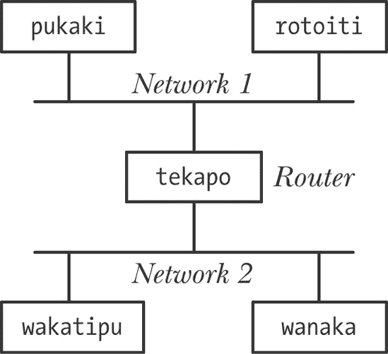
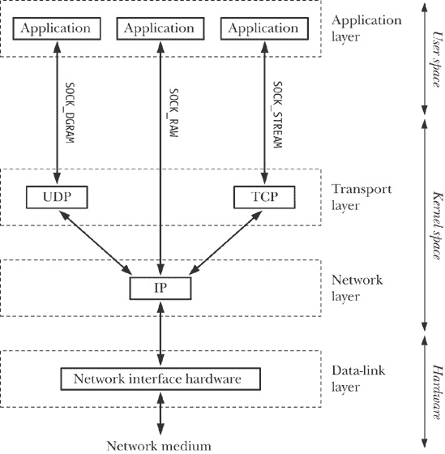
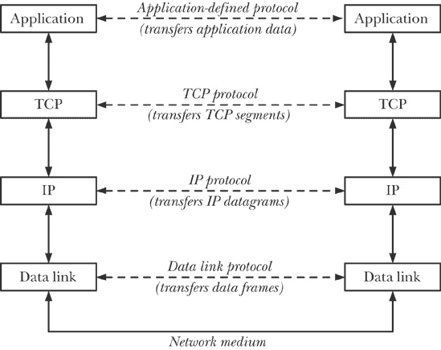
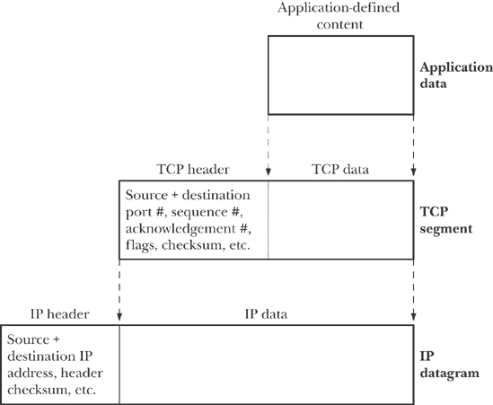
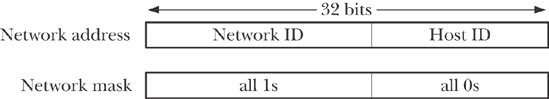
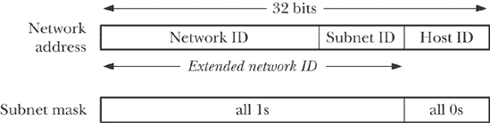
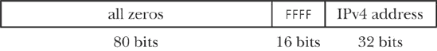
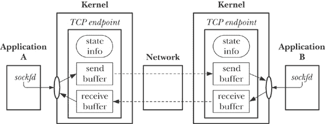

## 第五十八章：套接字：TCP/IP 网络基础

本章介绍了计算机网络概念和 TCP/IP 网络协议。理解这些内容是有效使用互联网域套接字所必需的，互联网域套接字将在下一章中描述。

从本章开始，我们将提到各种*请求评论*（RFC）文档。本书中讨论的每个网络协议都有一个正式描述的 RFC。我们将在第 58.7 节提供有关 RFC 的更多信息，以及与本书内容相关的 RFC 列表。

## 互联网

*Internetwork*（或更常见的*internet*，首字母小写的*i*）连接不同的计算机网络，使所有网络中的主机能够相互通信。换句话说，互联网是计算机网络的网络。术语*子网络*（或*subnet*）用于指代组成互联网的其中一个网络。互联网的目的是隐藏不同物理网络的细节，以便向连接网络上的所有主机呈现统一的网络架构。这意味着，例如，所有主机在互联网中的地址格式是统一的。

尽管已经制定了各种互联网络协议，但 TCP/IP 已成为主流协议套件，甚至取代了以前在局域网和广域网中常见的专有网络协议。术语*互联网*（首字母大写的*I*）用于指代连接全球数百万台计算机的 TCP/IP 互联网。

TCP/IP 的首次广泛实现出现在 1983 年的 4.2BSD 中。多个 TCP/IP 实现直接源自 BSD 代码；其他实现，包括 Linux 实现，是从头编写的，以 BSD 代码的操作为参考标准，定义 TCP/IP 的操作。

### 注意

TCP/IP 源自美国国防部高级研究计划局（ARPA，后来的 DARPA，*D*代表 Defense）资助的一个项目，旨在设计一种计算机网络架构，用于 ARPANET——一个早期的广域网。在 1970 年代，为 ARPANET 设计了一种新的协议族。准确地说，这些协议被称为 DARPA 互联网协议套件，但更常见的名称是 TCP/IP 协议套件，简称 TCP/IP。

网页[`www.isoc.org/internet/history/brief.shtml`](http://www.isoc.org/internet/history/brief.shtml)提供了互联网和 TCP/IP 的简要历史。

图 58-1 显示了一个简单的互联网。在此图中，机器 `tekapo` 是 *路由器* 的例子，一台计算机，其功能是将一个子网络连接到另一个子网络，传输数据。在理解所使用的互联网协议的同时，路由器还必须理解它所连接的每个子网上（可能不同的）数据链路层协议。

路由器具有多个网络接口，每个接口连接一个子网。更为通用的术语 *多宿主主机* 用来描述任何具有多个网络接口的主机——不仅限于路由器。（另一种描述路由器的方式是：它是一个多宿主主机，将数据包从一个子网转发到另一个子网。）多宿主主机的每个接口都有不同的网络地址（即，它连接的每个子网上都有一个不同的地址）。

图 58-1. 使用路由器连接两个网络的互联网

## 网络协议与层次结构

*网络协议* 是一组定义如何在网络中传输信息的规则。网络协议通常被组织为一系列 *层*，每一层都在其下层的基础上构建，添加可以供上层使用的功能。

*TCP/IP 协议套件* 是一个分层的网络协议（图 58-2）。它包括 *互联网协议*（IP）以及位于其之上的各种协议。（实现这些不同层的代码通常被称为 *协议栈*。）TCP/IP 这个名称来源于 *传输控制协议*（TCP），因为它是最广泛使用的传输层协议。

### 注意

我们已从 图 58-2 中省略了其他一些 TCP/IP 协议，因为它们与本章无关。*地址解析协议*（ARP）用于将互联网地址映射到硬件地址（例如以太网地址）。*互联网控制消息协议*（ICMP）用于在网络中传递错误和控制信息。（ICMP 被 *ping* 程序使用，常用于检查某一主机是否存活并在 TCP/IP 网络中可见，此外还被 *traceroute* 使用，用于追踪 IP 数据包在网络中的路径。）*互联网组管理协议*（IGMP）用于支持 IP 数据报多播的主机和路由器。

图 58-2. TCP/IP 协议套件中的协议

协议分层赋予协议强大灵活性的概念之一是*透明性*——每一层协议都将上层与下层的操作和复杂性隔离开来。因此，例如，使用 TCP 的应用程序只需使用标准的套接字 API，并知道它正在使用一个可靠的字节流传输服务。它不需要了解 TCP 操作的细节。（当我们查看套接字选项时，会看到这并不总是严格成立；有时，应用程序确实需要知道一些底层传输协议操作的细节。）应用程序也不需要了解 IP 或数据链路层操作的细节。从应用程序的角度来看，就像它们通过套接字 API 直接相互通信，如图 58-3 所示，其中虚线水平线表示两个主机上的应用程序、TCP 和 IP 实体之间的虚拟通信路径。

#### 封装

封装是分层网络协议的重要原则。图 58-4 展示了 TCP/IP 协议层中封装的一个例子。封装的关键思想是，传递给下层的信息（例如应用数据、TCP 段或 IP 数据报）被下层视为不透明数据。换句话说，下层不会尝试解释来自上层的信息，而只是将该信息放入下层使用的任何类型的数据包中，并在将数据包传递给下一层时添加其特有的头部。当数据从下层传递到上层时，会进行相反的解包过程。

### 注意

我们在图 58-4 中没有展示这一点，但封装的概念也延伸到数据链路层，在那里，IP 数据报被封装在网络帧中。封装也可能延伸到应用层，在那里应用程序可能会执行自己的数据打包。

## 数据链路层

图 58-2 中最底层是*数据链路层*，它由设备驱动程序和硬件接口（网络卡）组成，连接到底层的物理介质（例如电话线、同轴电缆或光纤电缆）。数据链路层负责在网络中的物理链路上传输数据。

为了传输数据，数据链路层将来自网络层的数据报封装成称为*帧*的单元。除了待传输的数据，每个帧还包括一个头部，头部中包含目的地址和帧大小等信息。数据链路层通过物理链路传输帧，并处理来自接收方的确认。 （并非所有的数据链路层都使用确认。）此层还可能执行错误检测、重传和流量控制。一些数据链路层还将大的网络数据包分割成多个帧，并在接收方重新组装。

从应用程序编程的角度来看，我们通常可以忽略数据链路层，因为所有通信细节都由驱动程序和硬件处理。

数据链路层的一个特点，对于我们讨论 IP 非常重要，即*最大传输单元*（MTU）。数据链路层的 MTU 是该层对帧大小的上限。不同的数据链路层有不同的 MTU。

### 注意

命令*netstat -i*显示系统的网络接口列表及其最大传输单元（MTU）。

图 58-3. 通过 TCP/IP 协议进行分层通信图 58-4. TCP/IP 协议层内的封装

## 网络层：IP

数据链路层之上是*网络层*，该层负责将数据包（数据）从源主机传输到目标主机。此层执行多种任务，包括：

+   将数据分割成足够小的碎片，以便通过数据链路层进行传输（如果需要）；

+   在互联网上路由数据；以及

+   向传输层提供服务。

在 TCP/IP 协议族中，网络层的主要协议是 IP。在 4.2BSD 实现中出现的 IP 版本是 IP 版本 4（IPv4）。在 1990 年代初期，制定了 IP 的修订版本：IP 版本 6（IPv6）。这两个版本之间最显著的区别是，IPv4 使用 32 位地址标识子网和主机，而 IPv6 使用 128 位地址，因此可以为主机分配更大的地址范围。尽管 IPv4 仍然是互联网中使用的主要 IP 版本，但在未来几年，IPv6 将取代它。IPv4 和 IPv6 都支持更高层次的 UDP 和 TCP 传输层协议（以及许多其他协议）。

### 注意

尽管理论上 32 位地址空间允许为 IPv4 网络地址分配数十亿个地址，但由于地址结构和分配方式，实际可用的地址数远低于此。IPv4 地址空间可能耗尽是创建 IPv6 的主要动机之一。

有关 IPv6 的简短历史可以在 [`www.laynetworks.com/IPv6.htm`](http://www.laynetworks.com/IPv6.htm) 查找。

IPv4 和 IPv6 的存在引发了一个问题，“那 IPv5 呢？” 事实上，根本没有所谓的 IPv5。每个 IP 数据报文头部包含一个 4 位的版本号字段（因此，IPv4 数据报文在该字段中始终为数字 4），版本号 5 被分配给一种实验性协议——*互联网流协议*（Internet Stream Protocol）。(该协议的版本 2，缩写为 ST-II，在 RFC 1819 中有描述。) 该协议最初于 1970 年代构思，是一种面向连接的协议，旨在支持语音和视频传输以及分布式仿真。由于 IP 数据报文的版本号 5 已被分配，IPv4 的继任者被分配了版本号 6。

图 58-2 显示了一个 *原始* 套接字类型（`SOCK_RAW`），它允许应用程序直接与 IP 层通信。我们不描述原始套接字的使用，因为大多数应用程序使用基于传输层协议（TCP 或 UDP）的套接字。原始套接字的描述可以参见 第二十八章，来自 [Stevens 等人，2004]。一个使用原始套接字的有教育意义的例子是 *sendip* 程序（[`www.earth.li/projectpurple/progs/sendip.html`](http://www.earth.li/projectpurple/progs/sendip.html)），这是一个基于命令行的工具，允许构建和传输具有任意内容的 IP 数据报文（包括构建 UDP 数据报文和 TCP 段的选项）。

#### IP 传输数据报文

IP 以数据报文（包）的形式传输数据。每个在两个主机之间发送的数据报文都独立地穿越网络，可能会选择不同的路径。一个 IP 数据报文包含一个头部，头部大小范围从 20 到 60 字节。头部包含目标主机的地址，以便数据报文能够通过网络被路由到目的地，还包含数据包的源地址，以便接收主机知道数据报文的来源。

### 注意

发送主机可能伪造数据包的源地址，这为一种 TCP 拒绝服务攻击——SYN 洪泛攻击（SYN-flooding）——提供了基础。 [Lemon, 2002] 描述了这种攻击的细节以及现代 TCP 实现中用来应对它的措施。

一个 IP 实现可能会限制它所支持的数据报文的最大大小。所有的 IP 实现必须至少允许数据报文的大小与 IP 的 *最小重组缓冲区大小* 相等。在 IPv4 中，这个限制是 576 字节；在 IPv6 中，它是 1500 字节。

#### IP 是无连接的且不可靠的

IP 被描述为一个 *无连接* 协议，因为它不提供连接两个主机的虚拟电路的概念。IP 也是一个 *不可靠* 协议：它尽力将数据报从发送方传输到接收方，但不能保证数据包按发送顺序到达，也不能保证数据包不会重复，甚至不能保证数据包一定会到达。IP 也不提供错误恢复（带有头部错误的数据包会被默默丢弃）。可靠性必须通过使用可靠的传输层协议（如 TCP）或在应用程序内部提供。

### 注意

IPv4 为 IP 头部提供了校验和，用于检测头部的错误，但不提供对数据包内传输数据的错误检测。IPv6 不提供 IP 头部的校验和，而是依赖更高层协议根据需要提供错误检查和可靠性。（在 IPv4 中，UDP 校验和是可选的，但通常启用；在 IPv6 中，UDP 校验和是强制的。TCP 校验和在 IPv4 和 IPv6 中都是强制的。）

由于一些数据链路层采用了确保可靠性的技术，或者当 IP 数据报通过某些非 TCP/IP 网络隧道传输并使用重传时，可能会发生 IP 数据报的重复。

#### IP 可能会对数据报进行分片。

IPv4 数据报可以最大为 65,535 字节。默认情况下，IPv6 允许最大为 65,575 字节的数据报（40 字节用于头部，65,535 字节用于数据），并提供了更大数据报的选项（所谓的 *jumbograms*）。

我们之前提到过，大多数数据链路层会对数据帧的大小施加上限（即 MTU）。例如，在常用的以太网网络架构中，这个上限为 1500 字节（即比 IP 数据报的最大大小要小得多）。IP 还定义了 *路径 MTU* 的概念。这是从源到目的地路径上所有数据链路层的最小 MTU。（实际上，以太网 MTU 通常是路径中最小的 MTU。）

当一个 IP 数据报大于 MTU 时，IP 会对数据报进行分片（将数据报分割为适当大小的单元，以便在网络上传输）。这些分片随后会在最终目的地重新组装，以重新创建原始数据报。

（每个 IP 分片本身就是一个 IP 数据报，包含一个偏移字段，表示该分片在原始数据报中的位置。）

IP 分片对更高层协议透明，但仍然通常被认为是不可取的（[Kent & Mogul, 1987]）。问题在于，由于 IP 不执行重传，并且只有在所有分片都到达时，数据报才能在目的地重新组装，如果任何一个分片丢失或包含传输错误，整个数据报都无法使用。在某些情况下，这可能导致数据丢失的比率显著增加（对于不执行重传的更高层协议，如 UDP）或传输速率降低（对于执行重传的更高层协议，如 TCP）。现代 TCP 实现使用算法（*路径 MTU 发现*）来确定主机之间路径的最大传输单元（MTU），并据此拆分它们传递给 IP 的数据，以便 IP 不会被要求传输超过此大小的数据报。UDP 没有提供类似的机制，我们在 用户数据报协议 (UDP)") 中讨论了基于 UDP 的应用程序如何处理 IP 分片的可能性。

## IP 地址

一个 IP 地址由两部分组成：网络 ID，指定主机所在的网络，以及主机 ID，用于标识该网络中的主机。

#### IPv4 地址

一个 IPv4 地址由 32 位组成（图 58-5）。当以人类可读的形式表示时，这些地址通常以 *点分十进制表示法* 编写，其中地址的 4 个字节作为十进制数字写出，并用点分隔，如 204.152.189.116。

图 58-5. 一个 IPv4 网络地址及相应的网络掩码

当一个组织为其主机申请一系列 IPv4 地址时，它会收到一个 32 位的网络地址和一个相应的 32 位 *网络掩码*。以二进制形式表示，这个掩码由最左边的一串 1 和后面的 0 组成，0 用来填补掩码的剩余部分。1 表示地址中哪部分包含分配的网络 ID，而 0 表示地址中哪部分可以分配给组织作为其网络中的唯一主机 ID。掩码中网络 ID 部分的大小是在分配地址时确定的。由于网络 ID 部分始终占据掩码的最左边，因此使用以下符号足以指定分配的地址范围：

```
204.152.189.0/24
```

`/24` 表示分配的地址的网络 ID 部分由最左边的 24 位组成，剩下的 8 位则指定主机 ID。或者，我们可以说，在这种情况下，网络掩码是 `255.255.255.0`，以点分十进制表示。

拥有此地址的组织可以为其计算机分配 254 个独特的互联网地址——`204.152.189.1`到`204.152.189.254`。有两个地址不能分配。其中一个是主机 ID 全为 0 位的地址，用于标识网络本身。另一个是主机 ID 全为 1 位的地址——在此示例中为`204.152.189.255`——它是*子网广播地址*。

某些 IPv4 地址具有特殊含义。特殊地址`127.0.0.1`通常被定义为*回环地址*，并习惯性地分配主机名`localhost`。（任何位于`127.0.0.0/8`网络中的地址都可以指定为 IPv4 回环地址，但通常选择`127.0.0.1`。）发送到该地址的数据报永远不会实际到达网络，而是自动回送并成为发送主机的输入。使用该地址在同一主机上测试客户端和服务器程序非常方便。在 C 程序中，定义了整数常量`INADDR_LOOPBACK`来表示该地址。

常量`INADDR_ANY`是所谓的 IPv4*通配符地址*。通配符 IP 地址对于在多网卡主机上绑定互联网域套接字的应用程序非常有用。如果一个应用程序在多网卡主机上仅绑定到其中一个 IP 地址的套接字，那么该套接字只能接收发送到该 IP 地址的 UDP 数据报或 TCP 连接请求。然而，我们通常希望多网卡主机上的应用程序能够接收指定任何主机 IP 地址的数据报或连接请求，绑定到通配符 IP 地址可以实现这一点。SUSv3 并未为`INADDR_ANY`指定任何特定值，但大多数实现将其定义为`0.0.0.0`（全零）。

通常，IPv4 地址是*子网划分*的。子网划分将 IPv4 地址中的主机 ID 部分分为两部分：子网 ID 和主机 ID（图 58-6）。 （如何划分主机 ID 的位由本地网络管理员决定。）子网划分的原理是，组织通常不会将所有主机连接到同一个网络。相反，组织可能会操作一组子网络（“内部互联网络”），每个子网络通过网络 ID 加子网 ID 的组合进行标识。这个组合通常被称为*扩展网络 ID*。在子网内，子网掩码与之前描述的网络掩码具有相同的作用，我们可以使用类似的表示法来指示分配给特定子网的地址范围。

例如，假设我们分配的网络 ID 是 `204.152.189.0/24`，并选择通过将主机 ID 的 8 位分割成 4 位子网 ID 和 4 位主机 ID 来对子网进行划分。在这种方案下，子网掩码将由 28 个前导 1 后跟 4 个 0 组成，ID 为 1 的子网将被指定为 `204.152.189.16/28`。

图 58-6. IPv4 子网划分

#### IPv6 地址

IPv6 地址的原理与 IPv4 地址类似。主要区别在于，IPv6 地址由 128 位组成，地址的前几位是一个*格式前缀*，用于指示地址类型。（我们不会详细介绍这些地址类型；请参阅 附录 A，以及 [Stevens 等人，2004] 和 RFC 3513 获取更多细节。）

IPv6 地址通常以一系列由冒号分隔的 16 位十六进制数字形式书写，如下所示：

```
F000:0:0:0:0:0:A:1
```

IPv6 地址通常包括一系列零，为了方便表示，可以使用两个冒号 (`::`) 来表示这种零序列。因此，上述地址可以重写为：

```
F000::A:1
```

IPv6 地址中只能出现一次双冒号表示法；出现多个实例会产生歧义。

IPv6 还提供了等同于 IPv4 回环地址（127 个零，后跟一个 1，即 ::1）和通配符地址（所有零，写作 0::0 或 ::）的地址。

为了使 IPv6 应用程序能够与仅支持 IPv4 的主机通信，IPv6 提供了所谓的*IPv4 映射 IPv6 地址*。这些地址的格式如 图 58-7 所示。

图 58-7. IPv4 映射 IPv6 地址格式

编写 IPv4 映射 IPv6 地址时，地址的 IPv4 部分（即最后 4 个字节）使用 IPv4 点分十进制表示法。因此，`204.152.189.116` 对应的 IPv4 映射 IPv6 地址是 `::FFFF:204.152.189.116`。

## 传输层

TCP/IP 协议栈中有两个广泛使用的传输层协议：

+   *用户数据报协议*（UDP）是用于数据报套接字的协议。

+   *传输控制协议*（TCP）是用于流套接字的协议。

在考虑这些协议之前，我们首先需要描述端口号，这是这两种协议都使用的概念。

### 端口号

传输协议的任务是为位于不同主机（或有时在同一主机上的）应用程序提供端到端的通信服务。为了做到这一点，传输层需要一种区分主机上应用程序的方法。在 TCP 和 UDP 中，这种区分是通过 16 位的*端口号*来实现的。

#### 知名端口、注册端口和特权端口

一些*知名端口号*被永久分配给特定应用程序（也称为*服务*）。例如，*ssh*（安全外壳）守护进程使用知名端口 22，HTTP（用于 Web 服务器和浏览器之间通信的协议）使用知名端口 80。知名端口的号码由中央管理机构——互联网号码分配局（IANA，[`www.iana.org/`](http://www.iana.org/)）分配，端口号的分配需要经过批准的网络规范（通常以 RFC 形式）。

IANA 还记录了*注册端口*，这些端口分配给应用程序开发者的条件较为宽松（这也意味着实现不需要保证这些端口用于注册目的时的可用性）。IANA 注册端口的范围是 1024 到 41951。（并非该范围内的所有端口号都已注册。）

IANA 最新的知名和注册端口分配列表可以通过在线访问[`www.iana.org/assignments/port-numbers`](http://www.iana.org/assignments/port-numbers)获得。

在大多数 TCP/IP 实现中（包括 Linux），范围从 0 到 1023 的端口号也是*特权*端口，这意味着只有特权的（`CAP_NET_BIND_SERVICE`）进程才能绑定到这些端口。这防止了普通用户实现恶意应用程序，例如伪装成*ssh*以获取密码。（有时，特权端口也被称为*保留*端口。）

尽管具有相同编号的 TCP 和 UDP 端口是两个不同的实体，但通常会为同一服务在 TCP 和 UDP 下分配相同的知名端口号，即使该服务通常仅在其中一个协议下可用。此约定避免了在两个协议之间端口号的混淆。

#### 短暂端口

如果应用程序没有选择特定的端口（即，在套接字术语中，它没有将套接字*绑定*到特定端口），那么 TCP 和 UDP 会为套接字分配一个唯一的*短暂端口*（即，短生命周期）号。在这种情况下，应用程序——通常是客户端——不在乎使用哪个端口号，但分配端口是必要的，以便传输层协议可以识别通信端点。这也意味着通信通道另一端的对等应用程序知道如何与该应用程序进行通信。如果我们将套接字绑定到端口 0，TCP 和 UDP 也会分配一个短暂端口号。

IANA 将 49152 到 65535 范围的端口指定为*动态*或*私有*端口，旨在使这些端口可以由本地应用程序使用并分配为短暂端口。然而，不同的实现从不同的范围分配短暂端口。在 Linux 上，这个范围由`/proc/sys/net/ipv4/ip_local_port_range`文件中的两个数字定义（并可以通过该文件进行修改）。

### 用户数据报协议（UDP）

UDP 仅向 IP 添加了两个特性：端口号和数据校验和，用于检测传输数据中的错误。

像 IP 一样，UDP 是无连接的。由于它没有为 IP 增加可靠性，因此 UDP 本身也是不可靠的。如果基于 UDP 的应用需要可靠性，那么必须在应用层实现这一功能。尽管存在这种不可靠性，有时我们仍然更倾向于使用 UDP 而非 TCP，具体原因可以参见 TCP 与 UDP 对比。

### 注意

UDP 和 TCP 使用的校验和仅为 16 位，是简单的“加和”校验和，可能无法检测某些类型的错误。因此，它们并未提供非常强的错误检测功能。繁忙的互联网服务器通常每几天就会遇到一个无法检测到的传输错误（[Stone & Partridge, 2000]）。需要更强数据完整性保障的应用可以使用安全套接字层（SSL）协议，该协议不仅提供安全通信，还能更严格地检测错误。或者，应用程序也可以实现自己的错误控制方案。

#### 选择 UDP 数据报文大小以避免 IP 分片

在网络层：IP 中，我们描述了 IP 分片机制，并指出通常最好避免 IP 分片。尽管 TCP 包含避免 IP 分片的机制，但 UDP 并没有。使用 UDP 时，我们可以通过传输超过本地数据链路 MTU 的数据报轻松引发 IP 分片。

基于 UDP 的应用通常不知道源主机和目标主机之间路径的最大传输单元（MTU）。为了避免 IP 分片，基于 UDP 的应用通常采取一种保守的方式，即确保传输的 IP 数据报小于 IPv4 最小重组缓冲区大小 576 字节。（这个值可能低于路径的 MTU。）在这 576 字节中，UDP 的头部需要 8 字节，IP 头部额外需要最少 20 字节，剩下的 548 字节用于 UDP 数据报本身。实际上，许多基于 UDP 的应用选择一个更低的限制值，即 512 字节用于它们的数据报（[Stevens, 1994]）。

### 传输控制协议（TCP）

TCP 提供了一种可靠的、面向连接的、双向的字节流通信通道，连接两个端点（即应用程序），如图 58-8 所示。为了提供这些特性，TCP 必须执行本节中描述的任务。（所有这些特性的详细描述可以参考[Stevens, 1994]。）

图 58-8. 已连接的 TCP 套接字

我们使用*TCP 端点*这个术语来表示内核为一个 TCP 连接的某一端所维护的信息。（通常，我们进一步简化这个术语，例如，写作“一个 TCP”，表示“一个 TCP 端点”，或者“客户端 TCP”表示“为客户端应用程序维护的 TCP 端点”。）这些信息包括该连接端点的发送和接收缓冲区，以及为同步两个连接端点的操作而维护的状态信息。（当我们讨论 TCP 状态转换图时，会详细描述这些状态信息，见 TCP 状态机与状态转换图。）在本书的其余部分，我们使用*接收 TCP*和*发送 TCP*这两个术语来表示分别用于接收和发送应用程序的 TCP 端点，这些端点位于一个用于在特定方向上传输数据的流套接字连接的两端。

#### 连接建立

在通信开始之前，TCP 会在两个端点之间建立通信通道。在连接建立过程中，发送方和接收方可以交换选项，以通告连接的参数。

#### 数据在段中的封装

数据被分割成段，每个段都包含一个校验和，用于检测端到端的传输错误。每个段都通过一个 IP 数据报进行传输。

#### 确认、重传和超时

当一个 TCP 段无误地到达目的地时，接收方的 TCP 会向发送方发送正向确认，告知其数据已成功传送。如果某个段到达时存在错误，则该段会被丢弃，并且不会发送任何确认。为了处理可能存在的丢失或被丢弃的段，发送方在每个段发送时会启动一个计时器。如果在计时器到期之前没有收到确认，该段将会被重新传输。

### 注释

由于传输一个段并接收其确认的时间会根据网络的范围和当前的流量负载有所变化，TCP 采用算法动态调整重传超时（RTO）的大小。

接收方的 TCP 可能不会立即发送确认，而是会等待片刻，看是否可以将确认信息打包到接收方可能直接发送回发送方的任何响应中。（每个 TCP 段都包括一个确认字段，允许进行这种打包。）这种技术叫做*延迟确认*，其目的是节省发送一个 TCP 段，从而减少网络中数据包的数量，并降低发送和接收主机的负载。

#### 序列化

每个通过 TCP 连接传输的字节都分配了一个逻辑序列号。这个序列号表示该字节在连接的数据流中的位置。（连接中的两个流各自有自己的序列号编号。）当 TCP 数据段被传输时，它会包含一个字段，表示该数据段中第一个字节的序列号。

为每个数据段附加序列号有多种目的：

+   序列号使得 TCP 数据段能够在目的地按正确顺序组装，然后作为字节流传递给应用层。（在任何时刻，可能有多个 TCP 数据段在发送方和接收方之间传输，这些数据段可能会乱序到达。）

+   从接收方返回到发送方的确认消息可以使用序列号来标识收到的 TCP 数据段。

+   接收方可以利用序列号来消除重复的数据段。重复数据段可能会发生，这可能是由于 IP 数据报的重复传输，或者由于 TCP 自身的重传算法——如果某个数据段的确认丢失或未能及时收到，TCP 可能会重传该数据段。

流的初始序列号（ISN）并不是从 0 开始的，而是通过一种算法生成的，该算法会使得分配给连续 TCP 连接的 ISN 逐渐增加（以防止来自连接之前的旧数据段与当前连接的数据段混淆）。此算法的设计还旨在使猜测 ISN 变得困难。序列号是一个 32 位的值，当达到最大值时会回绕到 0。

#### 流量控制

流量控制可以防止发送方过快地将数据传输给接收方，导致接收方超负荷。为了实现流量控制，接收方的 TCP 会为接收到的数据维护一个缓冲区。（每个 TCP 在建立连接时都会通告此缓冲区的大小。）数据在接收方的缓冲区中积累，直到应用程序读取数据时才会被移除。每次确认时，接收方都会通知发送方它的接收缓冲区中剩余的可用空间（即，发送方可以传输的字节数）。TCP 流量控制算法采用所谓的*滑动窗口*算法，这允许未确认的数据段（总共最多包含*N*字节，即提供的窗口大小）在发送方和接收方之间传输。如果接收方的接收缓冲区已满，那么窗口被视为关闭，发送方停止传输数据。

### 注意

接收方可以通过`SO_RCVBUF`套接字选项来覆盖接收缓冲区的默认大小（参见*socket(7)*手册页）。

#### 拥塞控制：慢启动和拥塞避免算法

TCP 的拥塞控制算法旨在防止快速发送方压垮网络。如果发送方的 TCP 以比中间路由器能转发的速度更快的速度传输数据包，路由器将开始丢包。如果发送方的 TCP 继续以相同的速率重传这些丢失的分段，就可能导致大量的丢包率，并因此引发严重的性能下降。TCP 的拥塞控制算法在以下两种情况下非常重要：

+   *连接建立后*：此时（或当一个连接在闲置一段时间后恢复传输时），发送方可以通过立即将尽可能多的分段注入网络，来利用接收方通告的窗口大小。（实际上，这就是早期 TCP 实现中的做法。）问题在于，如果网络无法处理这波分段洪流，发送方可能会立即使网络过载。

+   *当检测到拥塞时*：如果发送方的 TCP 检测到拥塞发生，那么它必须减少其传输速率。TCP 检测拥塞发生的假设是，传输错误导致的分段丢失非常低；因此，如果丢失了数据包，则认为是由于拥塞造成的。

TCP 的拥塞控制策略结合了两种算法：慢启动和拥塞避免。

*慢启动*算法使得发送方 TCP 最初以较慢的速率发送分段，但随着这些分段被接收方 TCP 确认，它允许传输速率呈指数增长。慢启动试图防止一个快速的 TCP 发送方压垮网络。然而，如果不加以控制，慢启动中的指数增长可能意味着发送方很快就会使网络过载。TCP 的*拥塞避免*算法通过限制速率增长，避免了这一点。

在拥塞避免阶段，连接开始时，发送方的 TCP 会从一个较小的*拥塞窗口*开始，这限制了它能够传输的未确认数据量。随着发送方收到来自对端 TCP 的确认，拥塞窗口最初会呈指数增长。然而，一旦拥塞窗口达到一个预定阈值，该阈值被认为接近网络的传输能力时，窗口的增长就会变为线性增长，而不是指数增长。（网络容量的估算来自于基于拥塞检测时的传输速率的计算，或者在连接建立后设置为一个固定值。）在任何时候，发送方 TCP 能够传输的数据量都会受到接收方 TCP 通告的窗口和本地 TCP 发送缓冲区的额外限制。

慢启动和拥塞避免算法相结合，使发送方能够迅速将其传输速度提高到网络的可用容量，而不会超出该容量。这些算法的作用是使数据传输迅速达到平衡状态，在此状态下，发送方以接收方确认的速率发送数据包。

## 意见请求（RFCs）

本书中讨论的每一个互联网协议都在 RFC 文档中定义—这是一份正式的协议规范。RFC 由*RFC 编辑器*发布（[`www.rfc-editor.org/`](http://www.rfc-editor.org/)），该编辑器由*互联网协会*资助（[`www.isoc.org/`](http://www.isoc.org/)）。描述互联网标准的 RFC 在*互联网工程任务组*（IETF，[`www.ietf.org/`](http://www.ietf.org/)）的支持下开发，IETF 是一个由网络设计师、操作员、供应商和研究人员组成的社区，致力于互联网的演进和顺畅运行。IETF 的成员资格对任何感兴趣的个人开放。

以下 RFC 与本书所涵盖的内容特别相关：

+   RFC 791，*互联网协议*。J. Postel（编），1981 年。

+   RFC 950，*互联网标准子网划分程序*。J. Mogul 和 J. Postel，1985 年。

+   RFC 793，*传输控制协议*。J. Postel（编），1981 年。

+   RFC 768，*用户数据报协议*。J. Postel（编），1980 年。

+   RFC 1122，*互联网主机要求—通信层*。R. Braden（编），1989 年。

### 注意

RFC 1122 扩展（并修正）了描述 TCP/IP 协议的多个早期 RFC。它是成对 RFC 中的一份，通常被称为*主机要求 RFCs*。这一对中的另一个成员是 RFC 1123，涵盖如*telnet*、FTP 和 SMTP 等应用层协议。

描述 IPv6 的 RFC 包括以下内容：

+   RFC 2460，*互联网协议*，*第 6 版*。S. Deering 和 R. Hinden，1998 年。

+   RFC 4291，*IP 第 6 版寻址架构*。R. Hinden 和 S. Deering，2006 年。

+   RFC 3493，*IPv6 的基本套接字接口扩展*。R. Gilligan，S. Thomson，J. Bound，J. McCann，W. Stevens，2003 年。

+   RFC 3542，*IPv6 的高级套接字 API*。W. Stevens，M. Thomas，E. Nordmark，T. Jinmei，2003 年。

一些 RFC 和论文提供了对原始 TCP 规范的改进和扩展，包括以下内容：

+   *拥塞避免与控制*。V. Jacobsen，1988 年。这是最初描述 TCP 拥塞控制和慢启动算法的论文。最初发表于*SIGCOMM ’88 会议录*，稍作修改的版本可在 ftp://ftp.ee.lbl.gov/papers/congavoid.ps.Z 找到。此论文在很大程度上已被以下一些 RFC 所取代。

+   RFC 1323，*TCP 高性能扩展*。V. Jacobson，R. Braden，D. Borman，1992 年。

+   RFC 2018，*TCP 选择确认选项*。M. Mathis，J. Mahdavi，S. Floyd，A. Romanow，1996 年。

+   RFC 2581, *TCP 拥塞控制*。M. Allman, V. Paxson 和 W. Stevens，1999 年。

+   RFC 2861, *TCP 拥塞窗口验证*。M. Handley, J. Padhye 和 S. Floyd，2000 年。

+   RFC 2883, *TCP 的选择性确认(SACK)选项扩展*。S. Floyd, J. Mahdavi, M. Mathis 和 M. Podolsky，2000 年。

+   RFC 2988, *计算 TCP 的重传定时器*。V. Paxson 和 M. Allman，2000 年。

+   RFC 3168, *将显式拥塞通知(ECN)添加到 IP 中*。K. Ramakrishnan, S. Floyd 和 D. Black，2001 年。

+   RFC 3390, *增加 TCP 的初始窗口*。M. Allman, S. Floyd 和 C. Partridge，2002 年。

## 摘要

TCP/IP 是一个分层的网络协议套件。TCP/IP 协议栈的底层是 IP 网络层协议。IP 以数据报的形式传输数据。IP 是无连接的，这意味着在源主机和目的主机之间传输的数据报可能会通过不同的路径跨越网络。IP 是不可靠的，因为它不能保证数据报按顺序到达、没有重复，甚至可能完全不到达。如果需要可靠性，则必须通过使用可靠的上层协议（例如 TCP）或在应用程序中提供来实现。

IP 的原始版本是 IPv4。在 1990 年代初，IPv6 作为 IP 的新版本被提出。IPv4 和 IPv6 之间最显著的区别在于，IPv4 使用 32 位表示主机地址，而 IPv6 使用 128 位，从而允许互联网上的主机数量大大增加。目前，IPv4 仍然是最广泛使用的 IP 版本，尽管在未来几年，IPv6 可能会取代它。

各种传输层协议被分层在 IP 之上，其中最常用的是 UDP 和 TCP。UDP 是一个不可靠的数据报协议。TCP 是一个可靠的、面向连接的字节流协议。TCP 处理连接建立和终止的所有细节。TCP 还将数据打包成段以便通过 IP 传输，并为这些段提供序列号，以便接收方能够确认并按正确顺序组装它们。此外，TCP 提供流量控制，以防止快速发送方压垮慢速接收方，并提供拥塞控制，以防止快速发送方压垮网络。

#### 进一步信息

请参考进一步信息中列出的更多资料来源。
