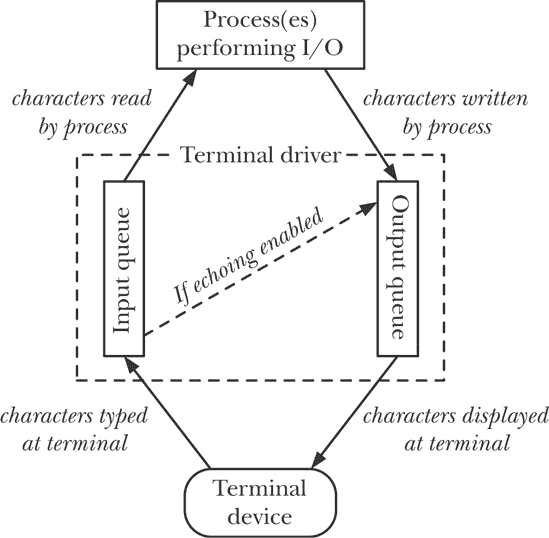

## 第六十二章 终端

从历史上看，用户通过串行线（RS-232 连接）连接终端来访问 UNIX 系统。终端是能够显示字符的阴极射线管（CRT），在某些情况下也能显示原始图形。通常，CRT 提供的是单色显示，分为 24 行、80 列。按今天的标准，这些 CRT 既小又贵。早期的终端有时是硬拷贝电传打字机设备。串行线还用于将其他设备（如打印机和调制解调器）连接到计算机，或将一台计算机连接到另一台计算机。

### 注意

在早期的 UNIX 系统中，连接到系统的终端线路表示为以 `/dev/tty`*n* 形式命名的字符设备。（在 Linux 上，/`dev/tty`*n* 设备是系统中的虚拟控制台。）常见的缩写 *tty*（源自电传打字机）常被用作 *terminal*（终端）的简写。

特别是在 UNIX 的早期阶段，终端设备并未标准化，这意味着执行操作（例如将光标移到行首或屏幕顶部）需要不同的字符序列。（最终，某些厂商实现的 *escape sequences*（转义序列）——例如 Digital 的 VT-100——成为事实上的标准，并最终成为 ANSI 标准，但各种终端类型仍然存在。）这种缺乏标准化导致编写使用终端功能的可移植程序变得困难。*vi* 编辑器就是一个具有此类要求的早期示例。为应对这种标准化的缺失，开发了 *termcap* 和 *terminfo* 数据库（参见 [Strang 等, 1988]），它们列出了如何为各种终端类型执行不同的屏幕控制操作，以及 *curses* 库（[Strang, 1986]）。

传统终端已经不常见。现代 UNIX 系统的常见接口是高性能位图图形显示器上的 X 窗口系统窗口管理器。（老式终端提供的功能大致相当于 X 窗口系统中的单个终端窗口——例如 *xterm* 或类似的终端。使用这种终端的用户仅能看到系统的单个“窗口”，这也是驱动第 34.7 节中描述的作业控制功能发展的原因。）类似地，许多曾经直接连接到计算机的设备（如打印机）现在通常是通过网络连接的智能设备。

上述内容作为引言，目的是说明编程终端设备的需求不再像以前那样频繁。因此，本章将重点介绍与软件终端模拟器（即 *xterm* 和类似的）特别相关的终端编程方面。对于串行线的内容，本章仅做简要介绍；关于串行编程的进一步参考资料将在本章末尾提供。

## 概述

常规终端和终端仿真器都有一个相关的终端驱动程序，负责处理设备的输入和输出。（对于终端仿真器，设备是伪终端。我们在第六十四章中描述了伪终端。）终端驱动程序的各种操作方面可以使用本章中描述的函数进行控制。

在执行输入时，驱动程序能够以以下模式之一进行操作：

+   *规范模式*：在这种模式下，终端输入按行处理，并启用了行编辑。每行以换行符结束，当用户按下*Enter*键时生成换行符。*read()* 从终端读取数据仅在完整的一行输入可用时才返回，并且最多返回一行。（如果*read()*请求的字节数少于当前行中的可用字节，则剩余的字节将在下次*read()*中可用。）这是默认的输入模式。

+   *非规范模式*：终端输入不按行收集。像*vi*、*more*和*less*这样的程序将终端置于非规范模式，以便它们能够读取单个字符，而无需用户按下*Enter*键。

终端驱动程序还会解释一系列特殊字符，如*中断*字符（通常是*Control-C*）和*文件结束*字符（通常是*Control-D*）。这种解释可能会导致为前台进程组生成信号，或者在程序从终端读取时发生某种输入条件。将终端置于非规范模式的程序通常还会禁用对某些或所有这些特殊字符的处理。

终端驱动程序操作两个队列（图 62-1）：一个用于将从终端设备传输到读取进程的输入字符，另一个用于将从进程传输到终端的输出字符。如果启用了终端回显，终端驱动程序会自动将任何输入字符的副本附加到输出队列的末尾，从而使输入字符也在终端上输出。

### 注意

SUSv3 规定了限制 `MAX_INPUT`，该限制可以被实现用来表示终端输入队列的最大长度。相关的限制 `MAX_CANON` 定义了规范模式下输入行的最大字节数。在 Linux 上，*sysconf(_SC_MAX_INPUT)* 和 *sysconf(_SC_MAX_CANON)* 都返回值 255。然而，内核实际上并没有使用这些限制，而是直接对输入队列施加了 4096 字节的限制。同时，输出队列的大小也有相应的限制。不过，应用程序无需关心这一点，因为如果进程产生的输出速度超过终端驱动程序处理的速度，内核会暂停写入进程的执行，直到输出队列中再次有足够空间。

在 Linux 上，我们可以调用 *ioctl(fd, FIONREAD, &cnt)* 来获取由文件描述符 *fd* 引用的终端输入队列中未读字节的数量。此功能在 SUSv3 中没有规定。

图 62-1. 终端设备的输入输出队列

## 获取和修改终端属性

*tcgetattr()* 和 *tcsetattr()* 函数用于检索和修改终端的属性。

```
#include <termios.h>

int `tcgetattr`(int *fd*, struct termios **termios_p*);
int `tcsetattr`(int *fd*, int *optional_actions*, const struct termios **termios_p*);
```

### 注意

成功时返回 0，出错时返回 -1。

*fd* 参数是指向终端的文件描述符。（如果 *fd* 不指向终端，这些函数将因错误 `ENOTTY` 而失败。）

*termios_p* 参数是指向 *termios* 结构的指针，该结构记录终端属性：

```
struct termios {
    tcflag_t c_iflag;           /* Input flags */
    tcflag_t c_oflag;           /* Output flags */
    tcflag_t c_cflag;           /* Control flags */
    tcflag_t c_lflag;           /* Local modes */
    cc_t     c_line;            /* Line discipline (nonstandard)*/
    cc_t     c_cc[NCCS];        /* Terminal special characters */
    speed_t  c_ispeed;          /* Input speed (nonstandard; unused) */
    speed_t  c_ospeed;          /* Output speed (nonstandard; unused) */
};
```

*termios* 结构的前四个字段是位掩码（*tcflag_t* 数据类型是适当大小的整数类型），包含控制终端驱动程序操作的各种标志：

+   *c_iflag* 包含控制终端输入的标志；

+   *c_oflag* 包含控制终端输出的标志；

+   *c_cflag* 包含与终端线路硬件控制相关的标志；

+   *c_lflag* 包含控制终端输入用户界面的标志。

上述字段中使用的所有标志列出了表 62-2（在终端标志中）。

*c_line* 字段指定了该终端的行规程。对于终端仿真器的编程，行规程将始终设置为 `N_TTY`，即所谓的 *新* 规程，这是内核终端处理代码的一个组成部分，用于实现规范模式的 I/O 处理。在编写串口程序时，设置行规程可能是相关的。

*c_cc* 数组包含终端特殊字符（*中断*、*挂起*等），以及控制非规范模式输入操作的字段。*cc_t* 数据类型是一个无符号整数类型，适合存储这些值，`NCCS` 常量指定该数组中的元素数量。我们将在第 62.4 节描述终端特殊字符。

在 Linux 上，*c_ispeed* 和 *c_ospeed* 字段未使用（且在 SUSv3 中未指定）。我们将在第 62.7 节中解释 Linux 如何存储终端行速。

### 注意

第七版和早期的 BSD 终端驱动程序（称为 *tty* 驱动程序）随着时间的推移，发展到使用不止四个不同的数据结构来表示等同于 *termios* 结构的信息。System V 用一个名为 *termio* 的单一结构取代了这种复杂的安排。最初的 POSIX 委员会几乎按照原样选择了 System V API，并在此过程中将其重命名为 *termios*。

在使用 *tcsetattr()* 更改终端属性时，*optional_actions* 参数决定了更改何时生效。此参数可以指定以下值之一：

`TCSANOW`

更改会立即生效。

`TCSADRAIN`

更改在所有当前排队的输出已传输到终端后生效。通常，在进行影响终端输出的更改时，应该指定此标志，以避免影响已排队但尚未显示的输出。

`TCSAFLUSH`

更改生效方式与 `TCSADRAIN` 相同，但此外，任何在更改生效时仍待处理的输入将被丢弃。例如，当读取密码时，我们希望禁用终端回显并防止用户提前输入。

更改终端属性的常用（且推荐）方法是使用 *tcgetattr()* 来获取一个包含当前设置副本的 *termios* 结构，修改所需的属性，然后使用 *tcsetattr()* 将更新后的结构推送回驱动程序。（这种方法确保我们向 *tcsetattr()* 传递一个完全初始化的结构。）例如，我们可以使用以下序列来关闭终端回显：

```
struct termios tp;

if (tcgetattr(STDIN_FILENO, &tp) == -1)
    errExit("tcgetattr");
tp.c_lflag &= ~ECHO;
if (tcsetattr(STDIN_FILENO, TCSAFLUSH, &tp) == -1)
    errExit("tcsetattr");
```

如果可以执行请求的任何终端属性更改，则 *tcsetattr()* 函数将成功返回；只有在无法进行任何请求的更改时才会失败。这意味着，在进行多个属性更改时，有时可能需要再次调用 *tcgetattr()* 来获取新的终端属性，并将其与请求的更改进行比较。

### 注意

在实现作业控制中，我们指出，如果从后台进程组中的进程调用 *tcsetattr()*，则终端驱动程序会通过发送 `SIGTTOU` 信号来暂停该进程组；如果从孤立的进程组调用，则 *tcsetattr()* 会因错误 EIO 而失败。对于本章中描述的其他各种函数，如 *tcflush()*、*tcflow()*、*tcsendbreak()* 和 *tcdrain()*，同样适用这些说明。

在早期的 UNIX 实现中，终端属性是通过*ioctl()*调用访问的。与本章中描述的其他几个函数一样，*tcgetattr()*和*tcsetattr()*函数是 POSIX 发明的，旨在解决*ioctl()*的第三个参数类型检查无法进行的问题。在 Linux 以及许多其他 UNIX 实现中，这些是基于*ioctl()*的库函数。

## *stty* 命令

*stty* 命令是*tcgetattr()*和*tcsetattr()*函数的命令行类比，允许我们从 shell 中查看和更改终端属性。这在尝试监控、调试或撤销修改终端属性的程序的效果时非常有用。

我们可以使用以下命令查看所有终端属性的当前设置（此命令在虚拟控制台上执行）：

```
$ `stty -a`
speed 38400 baud; rows 25; columns 80; line = 0;
intr = ^C; quit = ^\; erase = ^?; kill = ^U; eof = ^D; eol = <undef>;
eol2 = <undef>; start = ^Q; stop = ^S; susp = ^Z; rprnt = ^R;
werase = ^W; lnext = ^V; flush = ^O; min = 1; time = 0;
-parenb -parodd cs8 hupcl -cstopb cread -clocal -crtscts
-ignbrk brkint -ignpar -parmrk -inpck -istrip -inlcr -igncr
 icrnl ixon -ixoff -iuclc -ixany imaxbel -iutf8
opost -olcuc -ocrnl onlcr -onocr -onlret -ofill -ofdel nl0 cr0 tab0 bs0 vt0 ff0
isig icanon iexten echo echoe echok -echonl -noflsh
 -xcase -tostop -echoprt echoctl echoke
```

上述输出的第一行显示了终端的行速（每秒比特数）、终端窗口大小和行规程的数字表示形式（0 代表`N_TTY`，即新的行规程）。

接下来的三行显示了各种终端特殊字符的设置。符号`^C`表示*Control-C*，依此类推。字符串`<undef>`表示相应的终端特殊字符当前未定义。*min*和*time*值与非规范模式输入相关，详情请参见非规范模式。

剩余的几行展示了来自*termios*结构的各个标志的设置（按顺序为：*c_cflag*、*c_iflag*、*c_oflag*和*c_lflag*字段）。如果某个标志前有一个短横线（`-`），则表示该标志当前被禁用；否则，它是启用状态。

在没有命令行参数的情况下输入*stty*，它将只显示终端的行速、行规程以及任何偏离合理值的其他设置。

我们可以使用如下命令更改终端特殊字符的设置：

```
$ `stty intr ^L`                  *Make the interrupt character Control-L*
```

当指定控制字符作为最终参数时，我们可以采用多种方式：

+   作为由插入符号（`^`）后跟相应字符组成的两个字符序列（如上所示）；

+   作为八进制或十六进制数字（例如：`014`或`0xC`）；或者

+   通过输入实际字符本身。

如果我们使用最后一个选项，并且该字符是 shell 或终端驱动程序特别解释的字符，则必须在它前面加上*字面下一个*字符（通常是*Control-V*）：

```
$ `stty intr` *Control-V Control-L*
```

（尽管为了可读性，以上示例中*Control-V*和*Control-L*之间显示了一个空格，但在实际输入时，*Control-V*和目标字符之间不应输入任何空白字符。）

虽然不常见，但可以将终端特殊字符定义为非控制字符：

```
$ `stty intr q`                   *Make the interrupt character q*
```

当然，当我们这么做时，我们就无法再使用*q*键来执行其常规功能（即生成字母*q*）。

要更改终端标志，例如 `TOSTOP` 标志，我们可以使用以下命令：

```
$ `stty tostop`                   *Enable the* TOSTOP *flag*
$ `stty -tostop`                  *Disable the* TOSTOP *flag*
```

有时，在开发修改终端属性的程序时，程序可能会崩溃，导致终端进入一个几乎无法使用的状态。在终端仿真器上，我们可以轻松关闭终端窗口并启动另一个。或者，我们可以键入以下字符序列来恢复终端标志和特殊字符到一个合理的状态：

```
*Control-J* `stty sane` *Control-J*
```

*Control-J* 字符是真正的换行字符（ASCII 10 十进制）。我们使用这个字符，因为在某些模式下，终端驱动程序可能不再将 *Enter* 键（ASCII 13 十进制）映射为换行字符。我们输入一个初始的 *Control-J* 来确保我们有一个没有前导字符的新命令行。如果终端回显被禁用，这一点可能不容易验证。

*stty* 命令作用于标准输入指定的终端。使用 *-F* 选项，我们可以（在权限检查通过的情况下）监控和设置除了运行 *stty* 命令的终端以外的其他终端的属性：

```
$ `su`                            *Need privilege to access another user’s terminal*
Password:
# `stty -a -F /dev/tty3`          *Fetch attributes for terminal* /dev/tty3
*Output omitted for brevity*
```

*-F* 选项是 Linux 特有的扩展，用于 *stty* 命令。在许多其他 UNIX 实现中，*stty* 总是作用于标准输入指定的终端，我们必须使用以下替代形式（在 Linux 上也可使用）：

```
# `stty -a < /dev/tty3`
```

## 终端特殊字符

表格 62-1 列出了 Linux 终端驱动程序识别的特殊字符。前两列显示了字符的名称和对应的常量，可以作为 *c_cc* 数组的下标使用。（如所见，这些常量只是将字母 *V* 前缀加在字符名称前面。）CR 和 NL 字符没有对应的 *c_cc* 下标，因为这些字符的值无法更改。

表格中的 *默认设置* 列显示了特殊字符的通常默认值。除了能够将终端特殊字符设置为特定值外，还可以通过将字符设置为调用 *fpathconf(fd, _PC_VDISABLE)* 返回的值来禁用该字符，其中 *fd* 是指向终端的文件描述符。（在大多数 UNIX 实现中，这个调用返回值为 0。）

每个特殊字符的操作受到 *termios* 位掩码字段中各种标志设置的影响（详细描述见终端标志），如表格倒数第二列所示。

最后一列指示哪些字符是由 SUSv3 指定的。无论 SUSv3 规范如何，大多数这些字符在所有 UNIX 实现中都受支持。

表格 62-1. 终端特殊字符

| 字符 | *c_cc* 下标 | 描述 | 默认设置 | 相关位掩码标志 | SUSv3 |
| --- | --- | --- | --- | --- | --- |
| CR | (无) | 回车 | `^M` | `ICANON`, `IGNCR`, `ICRNL`, `OPOST`, `OCRNL`, `ONOCR` | • |
| DISCARD | `VDISCARD` | 丢弃输出 | `^O` | （未实现） |   |
| EOF | `VEOF` | 文件结束 | `^D` | `ICANON` | • |
| EOL | `VEOL` | 行尾 |   | `ICANON` | • |
| EOL2 | `VEOL2` | 备用行尾 |   | `ICANON`, `IEXTEN` |   |
| ERASE | `VERASE` | 擦除字符 | `^?` | `ICANON` | • |
| INTR | `VINTR` | 中断（`SIGINT`） | `^C` | `ISIG` | • |
| KILL | `VKILL` | 擦除行 | `^U` | `ICANON` | • |
| LNEXT | `VLNEXT` | 字面量下一个 | `^V` | `ICANON`, `IEXTEN` |   |
| NL | (无) | 换行 | `^J` | `ICANON`, `INLCR`, `ECHONL`, `OPOST`, `ONLCR`, `ONLRET` | • |
| QUIT | `VQUIT` | 退出（`SIGQUIT`） | `^\` | `ISIG` | • |
| REPRINT | `VREPRINT` | 重新打印输入行 | `^R` | `ICANON`, `IEXTEN`, `ECHO` |   |
| START | `VSTART` | 启动输出 | `^Q` | `IXON`, `IXOFF` | • |
| STOP | `VSTOP` | 停止输出 | `^S` | `IXON`, `IXOFF` | • |
| SUSP | `VSUSP` | 挂起（`SIGTSTP`） | `^Z` | `ISIG` | • |
| WERASE | `VWERASE` | 擦除单词 | `^W` | `ICANON`, `IEXTEN` |   |

以下段落将提供有关终端特殊字符的更详细解释。请注意，如果终端驱动程序对这些字符执行了特殊的输入解释，那么——除了 CR、EOL、EOL2 和 NL——该字符会被丢弃（即，不会传递给任何读取进程）。

#### CR

CR 是 *回车* 字符。这个字符会传递给读取进程。在规范模式下（`ICANON` 标志被设置），并且设置了 `ICRNL`（*将 CR 映射到 NL 进行输入*）标志（默认情况下），这个字符会首先转换为换行符（ASCII 10 十进制，`^J`），然后才会传递给读取进程。如果设置了 `IGNCR`（*忽略 CR*）标志，那么该字符在输入时会被忽略（在这种情况下，必须使用真正的换行符来终止一行输入）。输出的 CR 字符会使终端将光标移动到行首。

#### DISCARD

DISCARD 是 *丢弃输出* 字符。尽管该字符在 *c_cc* 数组中有定义，但在 Linux 上没有作用。在某些其他 UNIX 实现中，输入这个字符一次会导致程序输出被丢弃。这个字符是一个开关——再次输入它会重新启用输出显示。这在程序生成大量输出时很有用，可以跳过部分输出。（这在传统终端上更为有用，因为当时行速较慢，且没有其他“终端窗口”可用。）该字符不会传递给读取进程。

#### EOF

EOF 是规范模式下的*文件结束*字符（通常是*Control-D*）。在行的开头输入此字符会导致读取进程检测到文件结束条件（即，*read()*返回 0）。如果在行的其他位置输入此字符，则该字符会立即导致*read()*完成，返回到目前为止输入的字符。在这两种情况下，EOF 字符本身不会传递给读取进程。

#### EOL 和 EOL2

EOL 和 EOL2 是*附加行分隔符*字符，类似于规范模式输入中的标准换行（NL）字符，用于终止一行输入并将其提供给读取进程。默认情况下，这些字符未定义。如果定义了这些字符，它们将传递给读取进程。EOL2 字符仅在设置了`IEXTEN`（*扩展输入处理*）标志时才有效（默认情况下是如此）。

这些字符很少使用。有一个应用程序使用它们，那就是*telnet*。通过将 EOL 或 EOL2 设置为*telnet*的转义字符（通常是*Control-]*，或者在*rlogin*模式下，使用波浪号字符~），*telnet*能够立即捕捉到该字符，即使在规范模式下读取输入时也是如此。

#### ERASE

在规范模式下，输入 ERASE 字符会删除当前行上先前输入的字符。被删除的字符和 ERASE 字符本身不会传递给读取进程。

#### INTR

INTR 是*中断*字符。如果设置了`ISIG`（*启用信号*）标志（默认情况下），输入此字符会向终端的前台进程组发送一个*中断*信号（`SIGINT`）（参见进程组）。INTR 字符本身不会传递给读取进程。

#### KILL

KILL 是*清除行*（也叫*杀死行*）字符。在规范模式下，输入此字符会导致当前输入行被丢弃（即，已经输入的字符以及 KILL 字符本身不会传递给读取进程）。

#### LNEXT

LNEXT 是*字面上的下一个*字符。在某些情况下，我们可能希望将某些终端特殊字符视为普通字符来输入到读取进程中。输入字面下一个字符（通常是*Control-V*）会导致下一个字符被字面处理，忽略终端驱动程序通常对该字符的任何特殊解释。因此，我们可以输入两个字符序列*Control-V Control-C*，将真正的*Control-C*字符（ASCII 3）作为输入提供给读取进程。LNEXT 字符本身不会传递给读取进程。该字符仅在规范模式下并且设置了`IEXTEN`（*扩展输入处理*）标志时被解释（默认情况下就是如此）。

#### NL

NL 是*换行*字符。在规范模式下，该字符用于终止输入行。NL 字符本身包含在返回给读取进程的行中。（在规范模式下，CR 字符通常会转换为 NL。）输出的 NL 字符会使终端光标下移一行。如果设置了`OPOST`和`ONLCR`（*将 NL 映射为 CR-NL*）标志（默认设置），则在输出时，换行字符会被映射为两个字符的序列 CR 加 NL。（`ICRNL`和`ONLCR`标志的组合意味着输入的 CR 会被转换为 NL，然后作为 CR 加 NL 回显。）

#### QUIT

如果设置了`ISIG`标志（默认设置），输入 QUIT 字符会向终端的前台进程组发送一个*退出*信号（`SIGQUIT`）（进程组）。QUIT 字符本身不会传递给读取进程。

#### REPRINT

REPRINT 是*重新打印输入*字符。在设置了`IEXTEN`标志（默认设置）的规范模式下，输入该字符会在终端上重新显示当前（尚未完成的）输入行。如果其他程序（例如，*wall(1)*或*write(1)*)输出内容导致终端显示混乱，这个功能会很有用。REPRINT 字符本身不会传递给读取进程。

#### START 和 STOP

START 和 STOP 是*开始输出*和*停止输出*字符，当`IXON`（*启用开始/停止输出控制*）标志启用时会生效（默认设置）。(某些终端模拟器不支持 START 和 STOP 字符。)

输入 STOP 字符会暂停终端输出。STOP 字符本身不会传递给读取进程。如果设置了`IXOFF`标志且终端输入队列已满，则终端驱动程序会自动发送 STOP 字符以限制输入。

输入 START 字符会在之前被 STOP 字符暂停的终端输出后恢复。START 字符本身不会传递给读取进程。如果设置了`IXOFF`（*启用开始/停止输入控制*）标志（该标志默认禁用），且终端驱动程序之前由于输入队列已满而发送了 STOP 字符，当输入队列中再次有空间时，终端驱动程序会自动生成一个 START 字符。

如果设置了`IXANY`标志，那么任何字符，而不仅仅是`START`，都可以用来重新启动输出（且该字符同样不会传递给读取进程）。

START 和 STOP 字符用于在计算机和终端设备之间进行软件流控制，方向是双向的。这些字符的一个功能是允许用户停止和启动终端输出。这是输出流控制，由 `IXON` 启用。然而，另一方向的流控制（即从设备到计算机的输入流控制，由 `IXOFF` 启用）也很重要，特别是当设备是调制解调器或另一台计算机时。输入流控制确保在应用程序处理输入缓慢并且内核缓冲区已满时，不会丢失数据。

随着如今典型的更高线路速度，软件流控制已被硬件（RTS/CTS）流控制取代，数据流通过串口上单独的线路发送信号来启用和禁用。（RTS 代表*请求发送*，CTS 代表*清除发送*。）

#### SUSP

SUSP 是*暂停*字符。如果设置了 `ISIG` 标志（默认情况），输入此字符会向终端的前台进程组发送一个*终端暂停*信号（`SIGTSTP`）(进程组）。SUSP 字符本身不会传递给正在读取的进程。

#### WERASE

WERASE 是*删除词*字符。在规范模式下，当设置了 `IEXTEN` 标志（默认情况），输入此字符会删除从当前光标位置到前一个单词的所有字符。一个单词被认为是由字母、数字和下划线字符组成的序列。（在某些 UNIX 实现中，一个单词被认为是由空格分隔的。）

#### 其他终端特殊字符

其他 UNIX 实现除了 表 62-1 中列出的字符外，还提供了其他终端特殊字符。

BSD 提供了 DSUSP 和 STATUS 字符。DSUSP 字符（通常是*Control-Y*）的作用与 SUSP 字符相似，但仅当前台进程组尝试读取字符时才会暂停（即在读取完所有前面的输入之后）。一些非 BSD 衍生的实现也提供了 DSUSP 字符。

STATUS 字符（通常是*Control-T*）使内核在终端显示状态信息（包括前台进程的状态以及它消耗的 CPU 时间），并向前台进程组发送一个`SIGINFO`信号。如果需要，进程可以捕获这个信号并显示更多的状态信息。（Linux 提供了一个相似的功能，称为魔术 SysRq *键*；详情请参见内核源文件 `Documentation/sysrq.txt`。）

System V 衍生版本提供了 SWTCH 字符。这个字符用于在*shell 层*之间切换，这是 System V 的前身，用于作业控制。

#### 示例程序

示例 62-1 展示了使用*tcgetattr()*和*tcsetattr()*来更改终端*中断*字符。这个程序将*中断*字符设置为命令行参数中提供的数字值对应的字符，或者如果没有提供命令行参数，则禁用*中断*字符。

以下 shell 会话演示了此程序的使用。我们首先将*中断*字符设置为*Control-L*（ASCII 12），然后使用*stty*验证更改：

```
$ `./new_intr 12`
$ `stty`
speed 38400 baud; line = 0;
intr = ^L;
```

然后我们启动一个执行*sleep(1)*的进程。我们发现，按下*Control-C*不再像通常那样终止进程，但按下*Control-L*确实会终止该进程。

```
$ `sleep 10`
^C                              *Control-C has no effect; it is just echoed*
*Type Control-L to terminate sleep*
```

我们现在显示 shell 的$?变量值，该值显示最后一条命令的终止状态：

```
$ `echo $?`
130
```

我们看到进程的终止状态为 130。这表示进程被信号 130 - 128 = 2 杀死；信号 2 是`SIGINT`。

接下来，我们使用我们的程序禁用*中断*字符。

```
$ `./new_intr`
$ `stty`                          *Verify the change*
speed 38400 baud; line = 0;
intr = <undef>;
```

现在我们发现*Control-C*和*Control-L*都不会产生`SIGINT`信号，我们必须改用*Control-\*来终止程序：

```
$ `sleep 10`
^C^L                            *Control-C and Control-L are simply echoed*
*Type Control-\ to generate* SIGQUIT
Quit
$ `stty sane`                     *Return terminal to a sane state*
```

示例 62-1. 更改终端*中断*字符

```
`tty/new_intr.c`
#include <termios.h>
#include <ctype.h>
#include "tlpi_hdr.h"

int
main(int argc, char *argv[])
{
    struct termios tp;
    int intrChar;

    if (argc > 1 && strcmp(argv[1], "--help") == 0)
        usageErr("%s [intr-char]\n", argv[0]);

    /* Determine new INTR setting from command line */

    if (argc == 1) {                                     /* Disable */
        intrChar = fpathconf(STDIN_FILENO, _PC_VDISABLE);
        if (intrChar == -1)
            errExit("Couldn't determine VDISABLE");
    } else if (isdigit((unsigned char) argv[1][0])) {
        intrChar = strtoul(argv[1], NULL, 0);           /* Allows hex, octal */
    } else {                                            /* Literal character */
        intrChar = argv[1][0];
    }

    /* Fetch current terminal settings, modify INTR character, and
       push changes back to the terminal driver */

    if (tcgetattr(STDIN_FILENO, &tp) == -1)
        errExit("tcgetattr");
    tp.c_cc[VINTR] = intrChar;
    if (tcsetattr(STDIN_FILENO, TCSAFLUSH, &tp) == -1)
        errExit("tcsetattr");

    exit(EXIT_SUCCESS);
}
      `tty/new_intr.c`
```

## 终端标志

表 62-2 列出了由*termios*结构的四个标志字段控制的设置。此表中列出的常量对应单个位，除非是指定*掩码*的项，它们是跨越多个比特的值；这些值可能包含一个范围内的值，括号内列出了这些范围。标有*SUSv3*的列指示该标志是否在 SUSv3 中指定。*默认*列显示虚拟控制台登录的默认设置。

### 注

许多提供命令行编辑功能的 shell 会对表 62-2 中列出的标志进行自己的处理。这意味着，如果我们尝试使用*stty(1)*来实验这些设置，那么在输入 shell 命令时，修改可能不起作用。为了避免这种行为，我们必须禁用 shell 中的命令行编辑。例如，可以通过在调用*bash*时指定命令行选项—*noediting*来禁用命令行编辑。

表 62-2. 终端标志

| 字段/标志 | 描述 | 默认 | SUSv3 |
| --- | --- | --- | --- |
| *c_iflag* |
| `BRKINT` | 在 BREAK 条件下发送中断信号（`SIGINT`） | on | • |
| `ICRNL` | 将 CR 映射为 NL 输入 | on | • |
| `IGNBRK` | 忽略 BREAK 条件 | off | • |
| `IGNCR` | 忽略输入中的 CR | off | • |
| `IGNPAR` | 忽略具有奇偶校验错误的字符 | off | • |
| `IMAXBEL` | 当终端输入队列满时响铃（未使用） | (on) |   |
| `INLCR` | 将 NL 映射为 CR 输入 | off | • |
| `INPCK` | 启用输入奇偶校验检查 | off | • |
| `ISTRIP` | 从输入字符中去除高位（第 8 位） | 关 | • |
| `IUTF8` | 输入为 UTF-8（自 Linux 2.6.4 起） | 关 |   |
| `IUCLC` | 在输入时将大写字母映射为小写字母（如果同时设置了 `IEXTEN`） | 关 |   |
| `IXANY` | 允许任何字符重新启动停止的输出 | 关 | • |
| `IXOFF` | 启用输入流控制的开始/停止 | 关 | • |
| `IXON` | 启用开始/停止输出流控制 | 开 | • |
| `PARMRK` | 标记奇偶校验错误（前缀字节：0377 + 0） | 关 | • |
| *c_oflag* |   |   |   |
| `BSDLY` | 退格延迟掩码（`BS0`，`BS1`） | `BS0` | • |
| `CRDLY` | CR 延迟掩码（`CR0`，`CR1`，`CR2`，`CR3`） | `CR0` | • |
| `FFDLY` | 换页延迟掩码（`FF0`，`FF1`） | `FF0` | • |
| `NLDLY` | 换行延迟掩码（`NL0`，`NL1`） | `NL0` | • |
| `OCRNL` | 将 CR 映射为 NL 输出（参见 `ONOCR`） | 关 | • |
| `OFDEL` | 使用 DEL（0177）作为填充字符；否则使用 NUL（0） | 关 | • |
| `OFILL` | 使用填充字符进行延迟（而不是定时延迟） | 关 | • |
| `OLCUC` | 在输出时将小写字母映射为大写字母 | 关 |   |
| `ONLCR` | 在输出时将 NL 映射为 CR-NL | 开 | • |
| `ONLRET` | 假定 NL 执行 CR 功能（移动到行首） | 关 | • |
| `ONOCR` | 如果已经在第 0 列（行首），则不输出 CR | 关 | • |
| `OPOST` | 执行输出后处理 | 开 | • |
| `TABDLY` | 水平制表符延迟掩码（`TAB0`，`TAB1`，`TAB2`，`TAB3`） | `TAB0` | • |
| `VTDLY` | 垂直制表符延迟掩码（`VT0`，`VT1`） | `VT0` | • |
| *c_cflag* |   |   |   |
| `CBAUD` | 波特率掩码（`B0`，`B2400`，`B9600` 等） | `B38400` |   |
| `CBAUDEX` | 扩展波特率（大于 38,400 的速率）掩码 | 关 |   |
| `CIBAUD` | 输入波特率（如果与输出不同）（未使用） | （关） |   |
| `CLOCAL` | 忽略调制解调器状态行（不检查载波信号） | 关 | • |
| `CMSPAR` | 使用“标记” (mark/space) 奇偶校验 | 关 |   |
| `CREAD` | 允许接收输入 | 开 | • |
| `CRTSCTS` | 启用 RTS/CTS（硬件）流控制 | 关 |   |
| `CSIZE` | 字符大小掩码（5 到 8 位：`CS5`，`CS6`，`CS7`，`CS8`） | `CS8` | • |
| `CSTOPB` | 每个字符使用 2 个停止位；否则使用 1 个 | 关 | • |
| `HUPCL` | 在最后一次关闭时挂断（断开调制解调器连接） | 开 | • |
| `PARENB` | 启用奇偶校验 | 关 | • |
| `PARODD` | 使用奇校验；否则使用偶校验 | 关 | • |
| *c_lflag* |   |   |   |
| `ECHO` | 回显输入字符 | 开 | • |
| `ECHOCTL` | 以可视方式回显控制字符（例如，`^L`） | 开 |   |
| `ECHOE` | 执行可视化擦除 | 开 | • |
| `ECHOK` | 回显 KILL 字符 | 开 | • |
| `ECHOKE` | 回显 KILL 后不输出换行符 | 开 |   |
| `ECHONL` | 在规范模式下，即使回显被禁用，也回显 NL | 关 | • |
| `ECHOPRT` | 回显删除字符（在 `\` 和 `/` 之间） | 关 |   |
| `FLUSHO` | 输出正在刷新（未使用） | - |   |
| `ICANON` | 规范模式（逐行）输入 | 开 | • |
| `IEXTEN` | 启用输入字符的扩展处理 | 开 | • |
| `ISIG` | 启用生成信号的字符（INTR、QUIT、SUSP） | 开 | • |
| `NOFLSH` | 禁用在 INTR、QUIT 和 SUSP 信号下的刷新操作 | 关 | • |
| `PENDIN` | 在下一次读取时重新显示待处理输入（未实现） | （关） |   |
| `TOSTOP` | 为后台输出生成 `SIGTTOU` 信号 (在 Shell 中使用作业控制) | 关 | • |
| `XCASE` | 规范的大写/小写显示（未实现） | （关） |   |

表 62-2 中列出的一些标志是为历史上具有有限功能的终端提供的，这些标志在现代系统中几乎没有用处。例如，`IUCLC`、`OLCUC` 和 `XCASE` 标志曾用于只能显示大写字母的终端。在许多较老的 UNIX 系统上，如果用户尝试使用大写用户名登录，*login* 程序会假设用户正坐在此类终端上，并设置这些标志，接着会出现如下密码提示：

```
\PASSWORD:
```

从这一点开始，所有的小写字母都将以大写字母形式输出，真正的大写字母会前面加上反斜杠（\）。类似地，对于输入，真正的大写字母也可以通过前面加上反斜杠来指定。`ECHOPRT` 标志也是为有限功能的终端设计的。

各种延迟掩码也是历史遗留的，用于支持那些回显字符较慢的终端和打印机，例如回车符和换页符。相关的 `OFILL` 和 `OFDEL` 标志指定了如何执行这种延迟。大多数这些标志在 Linux 上未使用。一个例外是 `TAB3` 设置，它属于 `TABDLY` 掩码，会将制表符输出为（最多八个）空格。

以下段落提供了一些 *termios* 标志的更多细节。

#### BRKINT

如果设置了 `BRKINT` 标志，并且没有设置 `IGNBRK` 标志，则当发生 BREAK 条件时，会向前台进程组发送 `SIGINT` 信号。

### 注意

大多数传统的傻瓜终端提供了一个*BREAK*键。按下该键实际上不会生成字符，而是触发一个*BREAK 条件*，即向终端驱动程序发送一系列 0 位，持续指定时间，通常为 0.25 或 0.5 秒（即，比传输一个字节的时间要长）。(除非设置了 `IGNBRK` 标志，否则终端驱动程序会向读取进程传送一个 0 字节。）在许多 UNIX 系统上，BREAK 条件充当信号，通知远程主机将线路速度（波特率）调整为适合终端的速度。因此，用户会按下 *BREAK* 键，直到出现有效的登录提示，表明线路速度现在适合该终端。

在虚拟控制台上，我们可以通过按 *Control-Break* 来生成 BREAK 条件。

#### ECHO

设置`ECHO`标志启用输入字符的回显。禁用回显在读取密码时很有用。在*vi*的命令模式下，回显也会被禁用，因为键盘字符会被解释为编辑命令，而不是文本输入。`ECHO`标志在规范模式和非规范模式下都有效。

#### ECHOCTL

如果设置了`ECHO`，则启用`ECHOCTL`标志会导致除制表符、换行符、START 和 STOP 外的控制字符以`^A`（例如*Control-A*）的形式回显。如果禁用`ECHOCTL`，则不会回显控制字符。

### 注意

控制字符是那些 ASCII 码小于 32 的字符，加上 DEL 字符（十进制 127）。控制字符 x 使用插入符号（`^`）和通过表达式（*x ^ 64*）得出的字符回显。例如，*Control-A*（ASCII 1）会回显为插入符号加`A`（ASCII 65）。对于 DEL，表达式的效果是从 127 中减去 64，得到 63，这是问号的 ASCII 码，因此 DEL 会回显为`^?`。

#### ECHOE

在规范模式下，设置`ECHOE`标志会通过输出退格符-空格-退格符的序列，将删除操作可视化地执行。如果禁用`ECHOE`，则删除字符会被回显（例如，显示为`^?`），但仍然执行其删除字符的功能。

#### `ECHOK`和`ECHOKE`

`ECHOK`和`ECHOKE`标志控制在规范模式下使用 KILL（删除整行）字符时的可视显示。在默认情况下（两个标志都启用），一行会被可视化删除（参见`ECHOE`）。如果这两个标志中的任何一个被禁用，那么就不会执行可视删除（但输入行仍会被丢弃），KILL 字符会被回显（例如，显示为`^U`）。如果设置了`ECHOK`，但没有设置`ECHOKE`，则还会输出换行符。

#### ICANON

设置`ICANON`标志启用规范模式输入。输入会按行收集，并启用对 EOF、EOL、EOL2、ERASE、LNEXT、KILL、REPRINT 和 WERASE 字符的特殊解释（但请注意，下面描述的`IEXTEN`标志的效果）。

#### IEXTEN

设置`IEXTEN`标志启用对输入字符的扩展处理。必须同时设置此标志（以及`ICANON`），才能解释以下字符：EOL2、LNEXT、REPRINT 和 WERASE。`IEXTEN`标志还必须设置，`IUCLC`标志才会生效。SUSv3 仅表示`IEXTEN`标志启用扩展的（实现定义的）功能；其他 UNIX 实现的具体细节可能有所不同。

#### IMAXBEL

在 Linux 上，`IMAXBEL`标志的设置会被忽略。在控制台登录时，当输入队列已满时，铃声始终会响起。

#### IUTF8

设置`IUTF8`标志启用已处理模式（Cooked, Cbreak, and Raw Modes）以正确处理 UTF-8 输入，尤其是在执行行编辑时。

#### NOFLSH

默认情况下，当通过输入 INTR、QUIT 或 SUSP 字符生成信号时，终端输入和输出队列中任何待处理的数据都会被清除（丢弃）。设置 `NOFLSH` 标志会禁用这种清除。

#### OPOST

设置 `OPOST` 标志启用输出后处理。必须设置此标志才能使 *termios* 结构中的 *c_oflag* 字段中的任何标志生效。（换句话说，禁用 `OPOST` 标志会阻止所有输出后处理。）

#### PARENB、IGNPAR、INPCK、PARMRK 和 PARODD

`PARENB`、`IGNPAR`、`INPCK`、`PARMRK` 和 `PARODD` 标志涉及到奇偶校验的生成和检查。

`PARENB` 标志启用输出字符的奇偶校验位生成和输入字符的奇偶校验检查。如果只需要执行输出奇偶校验生成，可以通过关闭 `INPCK` 来禁用输入奇偶校验检查。如果设置了 `PARODD` 标志，则在两种情况下都使用奇数奇偶校验；否则，使用偶数奇偶校验。

剩余的标志指定了如何处理带有奇偶校验错误的输入字符。如果设置了 `IGNPAR` 标志，则丢弃该字符（不传递给读取进程）。否则，如果设置了 `PARMRK` 标志，则将该字符传递给读取进程，但前面会加上 2 字节的序列 0377 + 0。 （如果设置了 `PARMRK` 标志且 `ISTRIP` 未设置，则会将实际的 0377 字符加倍，变为 0377 + 0377。）如果未设置 `PARMRK`，但设置了 `INPCK`，则丢弃该字符，并传递一个 0 字节给读取进程。如果 `IGNPAR`、`PARMRK` 或 `INPCK` 均未设置，则直接将该字符传递给读取进程。

#### 示例程序

示例 62-2 演示了如何使用 *tcgetattr()* 和 *tcsetattr()* 关闭 `ECHO` 标志，从而使输入字符不被回显。以下是运行此程序时的示例输出：

```
$ `./no_echo`
Enter text:                           *We type some text, which is not echoed,*
Read: Knock, knock, Neo.              *but was nevertheless read*
```

示例 62-2：禁用终端回显

```
`tty/no_echo.c`
#include <termios.h>
#include "tlpi_hdr.h"

#define BUF_SIZE 100

int
main(int argc, char *argv[])
{
    struct termios tp, save;
    char buf[BUF_SIZE];

    /* Retrieve current terminal settings, turn echoing off */

    if (tcgetattr(STDIN_FILENO, &tp) == -1)
        errExit("tcgetattr");
    save = tp;                          /* So we can restore settings later */
    tp.c_lflag &= ~ECHO;                /* ECHO off, other bits unchanged */
    if (tcsetattr(STDIN_FILENO, TCSAFLUSH, &tp) == -1)
        errExit("tcsetattr");

    /* Read some input and then display it back to the user */

    printf("Enter text: ");
    fflush(stdout);
    if (fgets(buf, BUF_SIZE, stdin) == NULL)
        printf("Got end-of-file/error on fgets()\n");
    else
        printf("\nRead: %s", buf);

    /* Restore original terminal settings */

    if (tcsetattr(STDIN_FILENO, TCSANOW, &save) == -1)
        errExit("tcsetattr");

    exit(EXIT_SUCCESS);
}
      `tty/no_echo.c`
```

## 终端 I/O 模式

我们已经提到过，终端驱动程序能够根据 `ICANON` 标志的设置，处理规范模式或非规范模式的输入。接下来我们将详细描述这两种模式。然后，我们会介绍三种在第七版 UNIX 中可用的有用终端模式——cooked、cbreak 和 raw，并展示如何通过在 *termios* 结构中设置适当的值，在现代 UNIX 系统中模拟这些模式。

### 规范模式

通过设置 `ICANON` 标志启用规范模式输入。规范模式下的终端输入具有以下特点：

+   输入会被收集成行，并以以下行分隔符字符之一结束：NL、EOL、EOL2（如果设置了 `IEXTEN` 标志）、EOF（在行中的非初始位置处）、或 CR（如果启用了 `ICRNL` 标志）。除非是 EOF，否则行分隔符会作为行中的最后一个字符返回给读取进程。

+   启用行编辑，因此可以修改当前的输入行。因此，以下字符将启用：ERASE、KILL，如果设置了 `IEXTEN` 标志，则启用 WERASE。

+   如果设置了 `IEXTEN` 标志，则 REPRINT 和 LNEXT 字符也会启用。

在规范模式下，当一行完整的输入数据可用时，终端 *read()* 会返回。（如果请求的字节数较少，*read()* 可能只获取该行的一部分；剩余字节将在后续的 *read()* 调用中获取。）如果在信号处理程序中被中断且未启用该信号的系统调用重启功能，*read()* 也可能终止（信号的中断与系统调用的重启）。

### 注意

在描述 终端标志中的 `NOFLSH` 标志时，我们提到会生成信号的字符还会导致终端驱动程序刷新终端输入队列。这种刷新发生时，不管应用程序是否捕获或忽略了信号。我们可以通过启用 `NOFLSH` 标志来防止这种刷新。

### 非规范模式

一些应用程序（例如 *vi* 和 *less*）需要从终端读取字符，而不要求用户提供行定界符。为此提供了非规范模式。在非规范模式下（`ICANON` 未设置），不会执行特殊的输入处理。特别地，输入不再被聚集为行，而是可以立即获取。

在什么情况下，非规范的 *read()* 会完成？我们可以指定非规范 *read()* 在一定时间后完成，或者在读取一定数量的字节后完成，或者两者结合使用。*termios c_cc* 数组的两个元素决定了行为：TIME 和 MIN。TIME 元素（使用常量 `VTIME` 索引）指定以十分之一秒为单位的超时值。MIN 元素（使用 `VMIN` 索引）指定要读取的最小字节数。（MIN 和 TIME 设置对规范模式终端 I/O 没有影响。）

MIN 和 TIME 参数的精确操作和相互作用取决于它们是否具有非零值。下面描述了四种可能的情况。请注意，在所有情况下，如果在进行 *read()* 时，已经有足够的字节可用以满足 MIN 指定的要求，*read()* 会立即返回可用字节数和请求字节数中的较小值。

#### MIN == 0，TIME == 0（轮询读取）

如果在调用时数据可用，*read()* 会立即返回可用字节数和请求字节数中的较小值。如果没有可用字节，*read()* 会立即完成并返回 0。

这种情况满足了轮询的常见需求，允许应用程序在没有阻塞的情况下检查输入是否可用。如果不可用，则不会阻塞。这种模式与设置终端的 `O_NONBLOCK` 标志有些相似（非阻塞 I/O）。然而，使用 `O_NONBLOCK` 时，如果没有可读取的字节，则 *read()* 返回 -1，并且会出现 `EAGAIN` 错误。

#### MIN > 0，TIME == 0（阻塞读取）

*read()* 会阻塞（可能会无限期阻塞），直到请求的字节数或 MIN 字节的较小值可用，并返回这两个值中的较小者。

像 *less* 这样的程序通常将 MIN 设置为 1，TIME 设置为 0。这样，程序就可以等待单个按键输入，而无需通过忙循环轮询来浪费 CPU 时间。

如果终端处于非规范模式，并将 MIN 设置为 1，TIME 设置为 0，则可以使用 第六十三章 中描述的技术检查终端上是否输入了单个字符（而不是完整的一行）。

#### MIN == 0，TIME > 0（带超时读取）

在调用 *read()* 时，计时器开始计时。只要至少 1 个字节可用，或者 TIME 十分之一秒已经过去，调用就会返回。在后一种情况下，*read()* 返回 0。

这种情况对于与串行设备（例如调制解调器）通信的程序很有用。程序可以向设备发送数据，然后等待响应，使用超时来避免设备没有响应时程序永远挂起。

#### MIN > 0，TIME > 0（带字节间超时读取）

在输入的初始字节可用后，每当接收到更多字节时，计时器都会重新启动。当读取到 MIN 字节或者请求的字节数时，*read()* 返回，或者当接收到连续字节之间的时间超过 TIME 十分之一秒时返回。由于计时器仅在初始字节可用后启动，因此至少会返回 1 个字节。（对于这种情况，*read()* 可能会无限期阻塞。）

这种情况对于处理生成转义序列的终端键非常有用。例如，在许多终端上，左箭头键会生成由 *Escape* 后跟 `OD` 组成的 3 字符序列。这些字符是迅速连续传输的。处理此类序列的应用程序需要区分按下此类键与用户缓慢逐个输入字符的情况。这可以通过执行带有小字节间超时的 *read()* 来完成，例如 0.2 秒。某些版本的 *vi* 编辑器的命令模式中使用了这种技术。（根据超时的长度，在此类应用程序中，我们可能能够通过快速输入上述的 3 字符序列来模拟左箭头键的按下。）

#### 可移植地修改和恢复 MIN 和 TIME

为了与某些 UNIX 实现的历史兼容性，SUSv3 允许`VMIN`和`VTIME`常量的值与`VEOF`和`VEOL`分别相同，这意味着*termios c_cc*数组中的这些元素可能会重合。（在 Linux 上，这些常量的值是不同的。）这是可能的，因为`VEOF`和`VEOL`在非标准模式下未被使用。`VMIN`和`VEOF`可能具有相同的值，这意味着在进入非标准模式、设置 MIN（通常为 1）后再返回标准模式时需要小心。在返回标准模式时，EOF 将不再具有通常的 ASCII 4（*Control-D*）值。处理这个问题的可移植方法是，在切换到非标准模式之前保存*termios*设置的副本，然后使用保存的结构返回标准模式。

### 烹饪模式、半烹饪模式和原始模式

第七版 UNIX（以及早期的 BSD 版本）中的终端驱动程序能够处理三种模式下的输入：*烹饪模式*、*半烹饪模式*和*原始模式*。这三种模式的区别总结在表 62-3 中。

表 62-3. 烹饪模式、半烹饪模式和原始终端模式的区别

| 特性 | 模式 |
| --- | --- | --- |
| 烹饪模式 | 半烹饪模式 | 原始模式 |
| --- | --- | --- |
| 输入可用 | 按行 | 按字符 | 按字符 |
| 行编辑？ | 是 | 否 | 否 |
| 是否解释生成信号的字符？ | 是 | 是 | 否 |
| 是否解释开始/停止？ | 是 | 是 | 否 |
| 是否解释其他特殊字符？ | 是 | 否 | 否 |
| 是否进行其他输入处理？ | 是 | 是 | 否 |
| 是否进行其他输出处理？ | 是 | 是 | 否 |
| 输入回显？ | 是 | 可能 | 否 |

烹饪模式本质上是标准模式，只不过启用了所有默认的特殊字符处理（即：解释`CR`、`NL`和`EOF`；启用行编辑；处理生成信号的字符；`ICRNL`；`OCRNL`；等等）。

原始模式则相反：它是非标准模式，所有输入输出处理以及回显都被关闭。（一个需要确保终端驱动程序完全不对通过串行线路传输的数据进行任何更改的应用程序会使用这种模式。）

半烹饪模式介于烹饪模式和原始模式之间。输入是非标准的，但信号生成字符会被解释，并且各种输入输出转换仍然会发生（具体取决于各个标志设置）。半烹饪模式不会禁用回显，但采用这种模式的应用通常会禁用回显。半烹饪模式在处理屏幕的应用程序中很有用（例如*less*），它允许逐字符输入，但仍然需要允许解释像 INTR、QUIT 和 SUSP 这样的字符。

#### 示例：设置原始模式和半烹饪模式

在第七版和原始的 BSD 终端驱动程序中，可以通过调整终端驱动程序数据结构中的单个位（称为`RAW`和`CBREAK`）来切换到原始模式或 cbreak 模式。随着过渡到 POSIX *termios*接口（现在所有 UNIX 实现都支持），用于选择原始模式和 cbreak 模式的单个位不再可用，模拟这些模式的应用程序必须显式地更改*termios*结构中的相关字段。示例 62-3 提供了两个函数，*ttySetCbreak()*和*ttySetRaw()*，它们实现了这些终端模式的等效功能。

### 注意

使用*ncurses*库的应用程序可以调用*cbreak()*和*raw()*函数，这些函数执行与示例 62-3 中的函数类似的任务。

示例 62-3. 切换终端到 cbreak 和原始模式

```
`tty/tty_functions.c`
#include <termios.h>
#include <unistd.h>
#include "tty_functions.h"              /* Declares functions defined here */

/* Place terminal referred to by 'fd' in cbreak mode (noncanonical mode
   with echoing turned off). This function assumes that the terminal is
   currently in cooked mode (i.e., we shouldn't call it if the terminal
   is currently in raw mode, since it does not undo all of the changes
   made by the ttySetRaw() function below). Return 0 on success, or -1
   on error. If 'prevTermios' is non-NULL, then use the buffer to which
   it points to return the previous terminal settings. */

int
ttySetCbreak(int fd, struct termios *prevTermios)
{
    struct termios t;

    if (tcgetattr(fd, &t) == -1)
        return -1;

    if (prevTermios != NULL)
        *prevTermios = t;

    t.c_lflag &= ~(ICANON | ECHO);
    t.c_lflag |= ISIG;

    t.c_iflag &= ~ICRNL;

    t.c_cc[VMIN] = 1;                   /* Character-at-a-time input */
    t.c_cc[VTIME] = 0;                  /* with blocking */

    if (tcsetattr(fd, TCSAFLUSH, &t) == -1)
        return -1;

    return 0;
}

/* Place terminal referred to by 'fd' in raw mode (noncanonical mode
   with all input and output processing disabled). Return 0 on success,
   or -1 on error. If 'prevTermios' is non-NULL, then use the buffer to
   which it points to return the previous terminal settings. */

int
ttySetRaw(int fd, struct termios *prevTermios)
{
    struct termios t;

    if (tcgetattr(fd, &t) == -1)
        return -1;

    if (prevTermios != NULL)
        *prevTermios = t;

    t.c_lflag &= ~(ICANON | ISIG | IEXTEN | ECHO);
                        /* Noncanonical mode, disable signals, extended
                           input processing, and echoing */

    t.c_iflag &= ~(BRKINT | ICRNL | IGNBRK | IGNCR | INLCR |
                      INPCK | ISTRIP | IXON | PARMRK);
                        /* Disable special handling of CR, NL, and BREAK.
                           No 8th-bit stripping or parity error handling.
                           Disable START/STOP output flow control. */

    t.c_oflag &= ~OPOST;                /* Disable all output processing */

    t.c_cc[VMIN] = 1;                   /* Character-at-a-time input */
    t.c_cc[VTIME] = 0;                  /* with blocking */

    if (tcsetattr(fd, TCSAFLUSH, &t) == -1)
        return -1;

    return 0;
}
      `tty/tty_functions.c`
```

将终端置于原始模式或 cbreak 模式的程序必须小心，在终止时将终端恢复到可用模式。除其他任务外，这需要处理所有可能发送到程序的信号，以避免程序被提前终止。（在 cbreak 模式下，仍然可以从键盘生成作业控制信号。）

如何实现这一点的示例请参见示例 62-4。该程序执行以下步骤：

+   根据是否提供命令行参数（任何字符串），将终端设置为 cbreak 模式！[](figs/web/U009.png)或原始模式！[](figs/web/U012.png)。之前的终端设置保存在全局变量*userTermios*中！[](figs/web/U001.png)。

+   如果终端处于 cbreak 模式，则可以从终端生成信号。这些信号需要被处理，以便终止或挂起程序时，终端保持在用户期望的状态。程序为`SIGQUIT`和`SIGINT`安装相同的处理程序！[](figs/web/U010.png)。`SIGTSTP`信号需要特殊处理，因此为该信号安装了不同的处理程序！[](figs/web/U011.png)。

+   安装一个`SIGTERM`信号的处理程序，以捕获*kill*命令发送的默认信号！[](figs/web/U013.png)。

+   执行一个循环，从*stdin*中逐个读取字符，并在标准输出上回显它们！[](figs/web/U014.png)。程序在输出之前会特殊处理各种输入字符！[](figs/web/U015.png)：

    +   所有字母在输出之前都会被转换为小写字母。

    +   换行符（`\n`）和回车符（`\r`）字符会被原样回显。

    +   除了换行符和回车符之外，控制字符会被回显为 2 个字符的序列：插入符号（`^`）加上相应的大写字母（例如，*Control-A*回显为`^A`）。

    +   所有其他字符都会被回显为星号（`*`）。

    +   字母*q*会导致循环终止 。

+   循环退出时，将终端恢复到用户上次设置的状态，然后终止程序 。

程序为`SIGQUIT`、`SIGINT`和`SIGTERM`安装了相同的处理程序。该处理程序将终端恢复到用户上次设置的状态并终止程序 。

`SIGTSTP`信号的处理程序 按照处理作业控制信号中描述的方式处理信号。请注意以下信号处理程序的其他操作细节：

+   进入时，处理程序保存当前终端设置（在*ourTermios*中），然后将终端重置为程序启动时生效的设置（保存在*userTermios*中），然后再次引发`SIGTSTP`信号以实际停止进程。

+   在收到`SIGCONT`信号后恢复执行时，处理程序再次将当前终端设置保存在*userTermios*中 ，因为用户在程序停止期间可能已更改设置（例如使用*stty*命令）。然后，处理程序将终端恢复到程序所需的状态（*ourTermios*）。

示例 62-4：演示 cbreak 和原始模式

```
`tty/test_tty_functions.c`
    #include <termios.h>
    #include <signal.h>
    #include <ctype.h>
    #include "tty_functions.h"              /* Declarations of ttySetCbreak()
                                               and ttySetRaw() */
    #include "tlpi_hdr.h"

static struct termios userTermios;
                            /* Terminal settings as defined by user */

    static void             /* General handler: restore tty settings and exit */
    handler(int sig)
    {
    if (tcsetattr(STDIN_FILENO, TCSAFLUSH, &userTermios) == -1)
            errExit("tcsetattr");
        _exit(EXIT_SUCCESS);
    }

    static void             /* Handler for SIGTSTP */
tstpHandler(int sig)
    {
        struct termios ourTermios;          /* To save our tty settings */
        sigset_t tstpMask, prevMask;
        struct sigaction sa;
        int savedErrno;

        savedErrno = errno;                 /* We might change 'errno' here */

        /* Save current terminal settings, restore terminal to
           state at time of program startup */

    if (tcgetattr(STDIN_FILENO, &ourTermios) == -1)
            errExit("tcgetattr");
    if (tcsetattr(STDIN_FILENO, TCSAFLUSH, &userTermios) == -1)
            errExit("tcsetattr");

        /* Set the disposition of SIGTSTP to the default, raise the signal
           once more, and then unblock it so that we actually stop */

        if (signal(SIGTSTP, SIG_DFL) == SIG_ERR)
            errExit("signal");
        raise(SIGTSTP);

        sigemptyset(&tstpMask);
        sigaddset(&tstpMask, SIGTSTP);
        if (sigprocmask(SIG_UNBLOCK, &tstpMask, &prevMask) == -1)
            errExit("sigprocmask");

        /* Execution resumes here after SIGCONT */

        if (sigprocmask(SIG_SETMASK, &prevMask, NULL) == -1)
            errExit("sigprocmask");         /* Reblock SIGTSTP */

            sigemptyset(&sa.sa_mask);           /* Reestablish handler */
        sa.sa_flags = SA_RESTART;
        sa.sa_handler = tstpHandler;
        if (sigaction(SIGTSTP, &sa, NULL) == -1)
            errExit("sigaction");

        /* The user may have changed the terminal settings while we were
           stopped; save the settings so we can restore them later */

    if (tcgetattr(STDIN_FILENO, &userTermios) == -1)
            errExit("tcgetattr");

        /* Restore our terminal settings */

    if (tcsetattr(STDIN_FILENO, TCSAFLUSH, &ourTermios) == -1)
            errExit("tcsetattr");

        errno = savedErrno;
    }

    int
    main(int argc, char *argv[])
    {
        char ch;
        struct sigaction sa, prev;
        ssize_t n;

        sigemptyset(&sa.sa_mask);
        sa.sa_flags = SA_RESTART;

    if (argc > 1) {                     /* Use cbreak mode */
        if (ttySetCbreak(STDIN_FILENO, &userTermios) == -1)
                errExit("ttySetCbreak");

            /* Terminal special characters can generate signals in cbreak
               mode. Catch them so that we can adjust the terminal mode.
               We establish handlers only if the signals are not being ignored. */

        sa.sa_handler = handler;

            if (sigaction(SIGQUIT, NULL, &prev) == -1)
                errExit("sigaction");
            if (prev.sa_handler != SIG_IGN)
                if (sigaction(SIGQUIT, &sa, NULL) == -1)
                    errExit("sigaction");

            if (sigaction(SIGINT, NULL, &prev) == -1)
                errExit("sigaction");
            if (prev.sa_handler != SIG_IGN)
                if (sigaction(SIGINT, &sa, NULL) == -1)
                    errExit("sigaction");

        sa.sa_handler = tstpHandler;
                if (sigaction(SIGTSTP, NULL, &prev) == -1)
                errExit("sigaction");
            if (prev.sa_handler != SIG_IGN)
                if (sigaction(SIGTSTP, &sa, NULL) == -1)
                    errExit("sigaction");
        } else {                            /* Use raw mode */
        if (ttySetRaw(STDIN_FILENO, &userTermios) == -1)
                errExit("ttySetRaw");
        }

    sa.sa_handler = handler;
        if (sigaction(SIGTERM, &sa, NULL) == -1)
            errExit("sigaction");

        setbuf(stdout, NULL);               /* Disable stdout buffering */

    for (;;) {                          /* Read and echo stdin */
            n = read(STDIN_FILENO, &ch, 1);
            if (n == -1) {
                errMsg("read");
                break;
            }

            if (n == 0)                     /* Can occur after terminal disconnect */
                break;

        if (isalpha((unsigned char) ch))          /* Letters --> lowercase */
                putchar(tolower((unsigned char) ch));
            else if (ch == '\n' || ch == '\r')
                putchar(ch);
            else if (iscntrl((unsigned char) ch))
                printf("^%c", ch ^ 64);     /* Echo Control-A as ^A, etc. */
            else
                putchar('*');               /* All other chars as '*' */

        if (ch == 'q')                  /* Quit loop */
                break;
        }

    if (tcsetattr(STDIN_FILENO, TCSAFLUSH, &userTermios) == -1)
            errExit("tcsetattr");
        exit(EXIT_SUCCESS);
    }
          `tty/test_tty_functions.c`
```

这是我们在请求程序使用原始模式时看到的示例，参考示例 62-4：

```
$ `stty`                              *Initial terminal mode is sane (cooked)*
speed 38400 baud; line = 0;
$ `./test_tty_functions`
`abc`                                 *Type abc, and Control-J*
   `def`                              *Type DEF, Control-J, and Enter*
`^C^Z`                                *Type Control-C, Control-Z, and Control-J*
    `q`$                              *Type q to exit*
```

在前述 Shell 会话的最后一行，我们看到 Shell 在与程序终止的*q*字符同一行打印了提示符。

以下是使用 cbreak 模式的示例运行：

```
$ `./test_tty_functions x`
`XYZ`                                 *Type XYZ and Control-Z*
[1]+  Stopped       ./test_tty_functions x
$ `stty`                              *Verify that terminal mode was restored*
speed 38400 baud; line = 0;
$ `fg`                                *Resume in foreground*
./test_tty_functions x
***                                 *Type 123 and Control-J*
   $                                *Type Control-C to terminate program*
*Press Enter to get next shell prompt*
$ `stty`                              *Verify that terminal mode was restored*
speed 38400 baud; line = 0;
```

## 终端线路速度（比特率）

不同的终端（和串行线路）能够以不同的速度（比特每秒）进行传输和接收。*cfgetispeed()*和*cfsetispeed()*函数用于检索和修改输入线路速度。*cfgetospeed()*和*cfsetospeed()*函数用于检索和修改输出线路速度。

### 注意

*baud*一词通常用作终端行速（每秒比特数）的同义词，尽管这种用法在技术上不完全正确。严格来说，baud 是信号变化可以在每秒发生的速率，这不一定等同于每秒传输的比特数，因为后者取决于如何将比特编码为信号。然而，*baud*一词仍然与*比特率*（每秒比特数）同义使用。（*baud rate*一词也常常与*baud*同义使用，但这是冗余的；因为根据定义，baud 本身就是一种速率。）为了避免混淆，我们通常使用*行速*或*比特率*等术语。

```
#include <termios.h>

speed_t `cfgetispeed`(const struct termios **termios_p*);
speed_t `cfgetospeed`(const struct termios **termios_p*);
```

### 注意

两者从给定的*termios*结构返回行速

```
int `cfsetospeed`(struct termios **termios_p*, speed_t *speed*);
int `cfsetispeed`(struct termios **termios_p*, speed_t *speed*);
```

### 注意

两者成功时返回 0，失败时返回-1

每个这些函数都作用于一个*termios*结构，必须通过调用*tcgetattr()*来初始化。

例如，要查找当前终端输出行速，我们可以执行如下操作：

```
struct termios tp;
speed_t rate;

if (tcgetattr(fd, &tp) == -1)
    errExit("tcgetattr");
rate = cfgetospeed(&tp);
if (rate == -1)
    errExit("cfgetospeed");
```

如果我们想要改变这个行速，我们将继续如下操作：

```
if (cfsetospeed(&tp, B38400) == -1)
    errExit("cfsetospeed");
if (tcsetattr(fd, TCSAFLUSH, &tp) == -1)
    errExit("tcsetattr");
```

*speed_t*数据类型用于存储行速。为了避免直接为行速分配数值，使用了一组符号常量（在`<termios.h>`中定义）。这些常量定义了一系列离散的值。一些常见常量示例包括`B300`、`B2400`、`B9600`和`B38400`，分别对应于 300、2400、9600 和 38,400 比特每秒的行速。使用离散值集反映了终端通常设计为与一组有限的（标准化的）行速工作，这些行速是通过将某些基准速率（例如，115,200 在 PC 上很常见）除以整数值（例如，115,200 / 12 = 9600）得出的。

SUSv3 规定，终端行速存储在*termios*结构中，但（故意）没有指定存储位置。许多实现，包括 Linux，维护这些值在*c_cflag*字段中，使用`CBAUD`掩码和`CBAUDEX`标志。（在检索和修改终端属性中，我们提到 Linux 的*termios*结构中的非标准*c_ispeed*和*c_ospeed*字段未使用。）

尽管*cfsetispeed()*和*cfsetospeed()*函数允许分别指定输入和输出行速，但在许多终端上，这两个速率必须相同。此外，Linux 只使用一个字段来存储行速（即假定这两个速率始终相同），这意味着所有的输入和输出行速函数都访问相同的*termios*字段。

### 注意

在调用*cfsetispeed()*时，指定*speed*为 0 意味着“设置输入速率为稍后调用*tcsetattr()*时的输出速率。”这在输入和输出行速分别作为独立值的系统中非常有用。

## 终端行控制

*tcsendbreak()*、*tcdrain()*、*tcflush()* 和 *tcflow()* 函数执行的任务通常被统称为 *行控制*。（这些函数是 POSIX 发明的，旨在替代各种 *ioctl()* 操作。）

```
#include <termios.h>

int `tcsendbreak`(int *fd*, int *duration*);
int `tcdrain`(int *fd*);
int `tcflush`(int *fd*, int *queue_selector*);
int `tcflow`(int *fd*, int *action*);
```

### 注意

所有函数成功时返回 0，失败时返回 -1

在每个函数中，*fd* 是一个文件描述符，表示指向终端或其他串行线远程设备的描述符。

*tcsendbreak()* 函数通过传输连续的 0 比特流来生成一个 BREAK 条件。*duration* 参数指定传输的持续时间。如果 *duration* 为 0，则在 0.25 秒内传输 0 比特。（SUSv3 规定至少为 0.25 秒，且不超过 0.5 秒。）如果 *duration* 大于 0，则会在 *duration* 毫秒内传输 0 比特。SUSv3 对此情况没有做具体规定；在其他 UNIX 实现中，非零 *duration* 的处理方式差异较大（此处描述的细节适用于 *glibc*）。

*tcdrain()* 函数会阻塞，直到所有输出都已传输完成（即直到终端输出队列被清空）。

*tcflush()* 函数刷新（丢弃）终端输入队列、终端输出队列或两者的队列中的数据（参见 图 62-1）。刷新输入队列会丢弃终端驱动程序已接收但尚未被任何进程读取的数据。例如，应用程序可以在提示输入密码前使用 *tcflush()* 来丢弃终端的预输入缓存。刷新输出队列会丢弃已写入（传递给终端驱动程序）但尚未传输到设备的数据。*queue_selector* 参数指定 表 62-4 的 queue_selector 参数值") 中列出的其中一个值。

### 注意

注意，术语 *flush* 在 *tcflush()* 中的使用与文件 I/O 中有所不同。在文件 I/O 中，*flushing* 意味着强制将输出数据传输：在 *stdio fflush()* 的情况下，从用户空间内存到缓冲区缓存，或在 *fsync()*、*fdatasync()* 和 *sync()* 的情况下，从缓冲区缓存到磁盘。

表 62-4. *tcflush()* 函数中 *queue_selector* 参数的值

| 值 | 描述 |
| --- | --- |
| `TCIFLUSH` | 刷新输入队列 |
| `TCOFLUSH` | 刷新输出队列 |
| `TCIOFLUSH` | 刷新输入和输出队列 |

*tcflow()*函数控制计算机和终端（或其他远程设备）之间的双向数据流。*action*参数是表 62-5*操作参数的值")中显示的值之一。`TCIOFF`和`TCION`值仅在终端能够解释 STOP 和 START 字符的情况下有效，在这种情况下，这些操作分别会使终端暂停和恢复向计算机发送数据。

表 62-5。*tcflush()*操作参数的值

| 值 | 描述 |
| --- | --- |
| `TCOOFF` | 暂停输出到终端 |
| `TCOON` | 恢复输出到终端 |
| `TCIOFF` | 向终端传输 STOP 字符 |
| `TCION` | 向终端传输 START 字符 |

## 终端窗口大小

在一个窗口环境中，屏幕处理应用程序需要能够监控终端窗口的大小，以便在用户修改窗口大小时，屏幕可以适当重新绘制。内核提供了两项支持来实现这一点：

+   在终端窗口大小发生变化后，`SIGWINCH`信号会发送到前台进程组。默认情况下，这个信号会被忽略。

+   在任何时候—通常是在接收到`SIGWINCH`信号后—一个进程可以使用*ioctl()* `TIOCGWINSZ`操作来查找当前终端窗口的大小。

*ioctl()* `TIOCGWINSZ`操作的使用方式如下：

```
if (ioctl(fd, TIOCGWINSZ, &ws) == -1)
    errExit("ioctl");
```

*fd*参数是指向终端窗口的文件描述符。*ioctl()*的最终参数是指向*winsize*结构的指针（在`<sys/ioctl.h>`中定义），用于返回终端窗口的大小：

```
struct winsize {
    unsigned short ws_row;          /* Number of rows (characters) */
    unsigned short ws_col;          /* Number of columns (characters) */
    unsigned short ws_xpixel;       /* Horizontal size (pixels) */
    unsigned short ws_ypixel;       /* Vertical size (pixels) */
};
```

像许多其他实现一样，Linux 不使用*winsize*结构的像素大小字段。

示例 62-5 演示了`SIGWINCH`信号和*ioctl()* `TIOCGWINSZ`操作的使用。下面展示了在窗口管理器下运行该程序并且终端窗口大小变化三次时产生的输出示例：

```
$ `./demo_SIGWINCH`
Caught SIGWINCH, new window size: 35 rows * 80 columns
Caught SIGWINCH, new window size: 35 rows * 73 columns
Caught SIGWINCH, new window size: 22 rows * 73 columns
*Type Control-C to terminate program*
```

示例 62-5。监控终端窗口大小的变化

```
`tty/demo_SIGWINCH.c`
#include <signal.h>
#include <termios.h>
#include <sys/ioctl.h>
#include "tlpi_hdr.h"

static void
sigwinchHandler(int sig)
{
}

int
main(int argc, char *argv[])
{
    struct winsize ws;
    struct sigaction sa;

    sigemptyset(&sa.sa_mask);
    sa.sa_flags = 0;
    sa.sa_handler = sigwinchHandler;
    if (sigaction(SIGWINCH, &sa, NULL) == -1)
        errExit("sigaction");

    for (;;) {
        pause();                        /* Wait for SIGWINCH signal */

        if (ioctl(STDIN_FILENO, TIOCGWINSZ, &ws) == -1)
            errExit("ioctl");
        printf("Caught SIGWINCH, new window size: "
                "%d rows * %d columns\n", ws.ws_row, ws.ws_col);
    }
}
     `tty/demo_SIGWINCH.c`
```

也可以通过在*ioctl()* `TIOCSWINSZ`操作中传递一个初始化过的*winsize*结构来改变终端驱动程序对窗口大小的认知：

```
ws.ws_row = 40;
ws.ws_col = 100;
if (ioctl(fd, TIOCSWINSZ, &ws) == -1)
    errExit("ioctl");
```

如果*winsize*结构中的新值与终端驱动程序当前的终端窗口大小不一致，会发生两件事：

+   使用在*ws*参数中提供的值更新终端驱动程序的数据结构。

+   `SIGWINCH`信号会发送到终端的前台进程组。

然而需要注意的是，这些事件本身不足以改变显示窗口的实际尺寸，因为这些尺寸是由内核之外的软件（如窗口管理器或终端仿真程序）控制的。

尽管在 SUSv3 中没有标准化，大多数 UNIX 实现提供了通过本节描述的 *ioctl()* 操作来访问终端窗口大小的功能。

## 终端标识

在控制终端和控制进程中，我们描述了 *ctermid()* 函数，它返回进程的控制终端名称（通常是 UNIX 系统上的 `/dev/tty`）。本节描述的函数对于标识终端也很有用。

*isatty()* 函数使我们能够判断一个文件描述符 *fd* 是否与终端相关联（而不是与其他文件类型相关联）。

```
#include <unistd.h>

int `isatty`(int *fd*);
```

### 注意

如果 *fd* 与终端相关联，则返回真（1），否则返回假（0）

*isatty()* 函数在编辑器和其他需要判断标准输入输出是否指向终端的屏幕处理程序中非常有用。

给定一个文件描述符，*ttyname()* 函数返回与之关联的终端设备名称。

```
#include <unistd.h>

char *`ttyname`(int *fd*);
```

### 注意

返回指向（静态分配的）包含终端名称的字符串的指针，若出错则返回 `NULL`

为了查找终端的名称，*ttyname()* 使用 读取目录：*opendir()* 和 *readdir()* and readdir()") 中描述的 *opendir()* 和 *readdir()* 函数，遍历包含终端设备名称的目录，查看每个目录条目，直到找到一个其设备 ID（即 *stat* 结构的 *st_rdev* 字段）与文件描述符 *fd* 所引用的设备相匹配的条目。终端设备条目通常位于两个目录中：`/dev` 和 `/dev/pts`。`/dev` 目录包含虚拟控制台（例如，`/dev/tty1`）和 BSD 伪终端的条目。`/dev/pts` 目录包含（System V 风格的）伪终端从设备条目。（我们在第六十四章中描述了伪终端。）

### 注意

存在 *ttyname()* 的可重入版本，名为 *ttyname_r()*。

*tty(1)* 命令显示其标准输入所引用的终端名称，是 *ttyname()* 的命令行等效命令。

## 摘要

在早期的 UNIX 系统中，终端是通过串行线路连接到计算机的实际硬件设备。早期的终端没有标准化，这意味着不同厂商生产的终端需要使用不同的转义序列进行编程。在现代工作站中，这些终端已被运行 X Window 系统的位图显示器所取代。然而，在处理虚拟设备（如虚拟控制台和终端仿真器，它们使用伪终端）以及通过串行线路连接的实际设备时，编程终端的能力仍然是必要的。

终端设置（终端窗口大小除外）保存在类型为 *termios* 的结构体中，该结构体包含四个位掩码字段，用于控制各种终端设置，并包含一个数组，定义终端驱动程序解析的各种特殊字符。*tcgetattr()* 和 *tcsetattr()* 函数允许程序检索和修改终端设置。

在进行输入时，终端驱动程序可以在两种不同模式下工作。在规范模式下，输入被聚集成行（由其中一个行分隔符字符终止），并启用了行编辑。相比之下，非规范模式允许应用程序一次读取一个字符的终端输入，而无需等待用户输入行分隔符字符。在非规范模式下，禁用行编辑。非规范模式读取的完成由 *termios* 结构体中的 MIN 和 TIME 字段控制，分别决定要读取的最小字符数和应用于读取操作的超时。我们描述了非规范读取操作的四种不同情况。

历史上，第七版和 BSD 终端驱动程序提供了三种输入模式——已处理模式、cbreak 模式和原始模式——它们对终端输入输出进行了不同程度的处理。通过修改 *termios* 结构体中的不同字段，可以模拟 cbreak 和原始模式。

一系列函数执行各种其他终端操作。这些操作包括更改终端的行速率以及执行行控制操作（生成中断条件，暂停直到输出传输完毕，刷新终端输入输出队列，暂停或恢复终端和计算机之间的数据传输）。其他函数允许我们检查给定的文件描述符是否指向终端，并获取该终端的名称。*ioctl()* 系统调用可以用来检索和修改由内核记录的终端窗口大小，并执行一系列其他与终端相关的操作。

#### 进一步信息

[Stevens, 1992] 也描述了终端编程，并对串口编程进行了更详细的讨论。几个优秀的在线资源讨论了终端编程。LDP 网站上（[`www.tldp.org`](http://www.tldp.org)）托管着由 David S. Lawyer 编写的《*串口 HOWTO*》和《*文本终端 HOWTO*》。另一个有用的信息来源是 Michael R. Sweet 编写的《*POSIX 操作系统的串口编程指南*》，可以在线访问：[`www.easysw.com/~mike/serial/`](http://www.easysw.com/~mike/serial/)。

## 练习

1.  实现 *isatty()*。 （你可能会发现阅读第 62.2 节中 *tcgetattr()* 的描述很有用。）

1.  实现 *ttyname()*。

1.  实现第 8.5 节中描述的 *getpass()* 函数。(*getpass()* 函数可以通过打开 `/dev/tty` 获取控制终端的文件描述符。)

1.  编写一个程序，显示信息以指示标准输入所指的终端是处于规范模式还是非规范模式。如果是非规范模式，则显示 TIME 和 MIN 的值。
