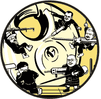
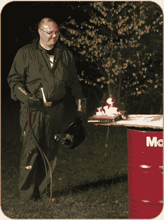
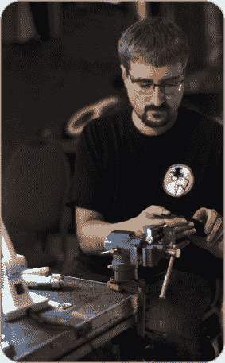
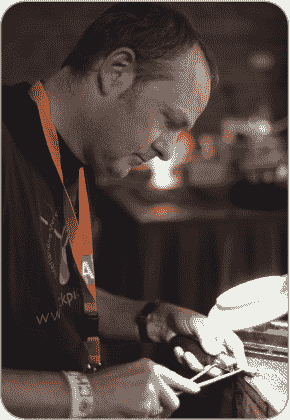
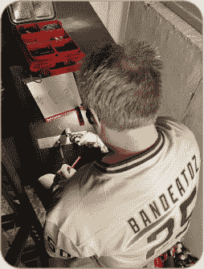

## **引言**

2011 年，在 DEF CON 的 No Starch 展位上，比尔·波洛克问我是否有兴趣写一本关于开锁的书。我深知我的自尊心会全心全意地同意让我的名字出现在书架上，但我仍然尊重地拒绝了。有什么是我能带到桌面上的，而这些东西之前没有被提到过呢？开锁方面已经有了几本书，其他相关的出版物也能在网上找到。

快进到隔离模式下的世界。在马特组织的跨越三个大洲（甚至更多时区）的虚拟开锁聚会上，我们开始讨论书籍。马特最近和 No Starch 出版了本书，《渗透测试 Azure 应用》，他们很乐意让他再写一本书——这次也许是关于开锁的？在我们非正式讨论的过程中，我们很快注意到我们的团队中有几位开锁领域的专家，关于章节的建议不断涌现。

但是，为什么还要写一本新书呢？当 BandEAtoZ 建议专门针对锁具运动做一个团队合作时，我突然明白了。是的，关于开锁和印模的信息已经有了，但并没有真正聚焦于*运动*的方面。关于开锁或秘密进入的书籍往往忽视了在锁具运动比赛中至关重要的信息。锁匠参考书通常关注于对爱好者无关的细节。

这就是本书的目的所在。我们从锁具运动的世界中汇聚了一群明星，每个人都有自己擅长的领域。

—Jos Weyers

### 锁具运动的起源故事

每个从事锁具运动的人都有不同的理由，为什么他们会对这个独特的爱好产生兴趣。你可能是在 YouTube 上看到过开锁，并觉得它看起来很有趣。也许你是个锁匠，决定看看自己是否是店里最快打开锁的人，或者也许你在某个会议上遇到过我们，花时间学习如何打开锁。开锁是一种超能力，就像漫画英雄一样，你加入这个社区的原因就是你的*起源故事*。我们希望与你分享我们的故事。

##### **Jos Weyers**

从小我就对所有机械事物充满好奇。在弄清楚闹钟内部构造的过程中，我弄坏了不少闹钟。最近，我甚至开始弄坏那些昂贵的手表。（显然，有些孩子永远也学不好。）

*Jos 照顾某人的浏览器历史记录。照片由 Dennis van Zuijlekom 提供（CC BY-SA 2.0）。*

因为我在信息技术领域接受了技术教育，所以我自然而然地开始学习如何保护所有的网络安全。带着这个兴趣，我访问了荷兰的几次露天黑客营，在那里我第一次接触到锁具运动的概念。这当然重新点燃了我对那些不应被干扰的物理物品的兴趣，因此它们必须被干扰。那时候，网购装备并不是一件普遍的事，所以能在这些活动中购买到实际的撬锁工具包，这个概念让我十分欢迎。

在开锁的过程中，我遇到了一把根本打不开的简单挂锁（那时我还没听说过安全销的神奇之处）。对这个小难题感到相当好奇，我决定参加 TOOOL 的会议，获取一些技巧和窍门。结果，他们根本赶不走我……而那几乎是 20 年前的事了。

在那个时间段，我被选为 TOOOL 的董事会成员和会长，赢得了十多次印象力钥匙比赛的冠军，组织了几次 LockCon 大会，曾尝试购买一座真正的全景监狱，频繁地讲授物理安全及其与网络领域的关系，并且想出了一种新颖且简单的方法，仅用一把钥匙就能绕过大多数主钥系统。

当我不在全球各地举办印象力工作坊时，我通常会出现在荷兰阿纳姆的 Hack42，这里被普遍认为是现存最棒的黑客空间。

是的，我确实很英俊。

##### **Matt Burrough**

在我成长的过程中，伊恩·弗莱明的小说是我心中的禁忌之乐。完成英语课的指定阅读后，我常常从背包底部拿出我从图书馆借来的詹姆斯·邦德小说，沉浸在间谍的世界中。虽然作为一个青少年男孩，一个冷静应对压力、令女性倾倒的间谍是显而易见且可能是陈词滥调的英雄选择，但我欣赏弗莱明作品的原因有两个：间谍技艺和那些高科技小玩意儿。

我喜欢在书中发现间谍技巧和方法—那些交易技巧。这些细节使我从单纯的小说垃圾中提炼出了一种新的思维方式，帮助我认识到世界上的事物并不总是表面上看到的那样。当然，我也对 007 依赖的那些高科技小玩意儿充满兴趣，并且很有趣地看到，这些虚构的工具在四五十年后变成了现实生活中的日常设备。这种好奇心与我对一切与技术相关的事物的兴趣自然融合在了一起。

尽管我喜爱这些书籍，但遗憾的是我并不具备成为间谍的天赋。相反，我专注于对技术的痴迷，并追求了信息技术领域的职业生涯。

大学毕业几年后，我受一个住在华盛顿特区的朋友邀请，参加了我的第一次 ShmooCon 大会，在那里我在 TOOOL 开锁村遇到了我人生中的第一把真正的开锁工具。虽然用这些工具打开我的第一个 Master Lock 并感到有点像詹姆斯·邦德一样有趣，但我还是把开锁工具留在了大会上，回到了我的典型技术工作生活中。

直到几年后，我将职业转向网络安全，我才真正跳进了锁匠运动的世界。在加入红队后不久，一位渗透测试员邀请我参加他在办公室组织的小型午餐演示。在这次活动中，来自荷兰的 Jos Weyers 和锁匠兼锁匠运动者 Holly Poer 一起为我们展示了如何开锁。正是那时，我从 Jos 那里购买了我的第一套开锁工具。那一周，我参加了由 Jos 和 Holly 在当地黑客空间开设的锁印刷课程，从此深深着迷。

这太棒了——作为渗透测试员，我的职业不仅允许而且鼓励我运用这些新获得的技能来访问那些被锁起来的房间或计算机。我终于得以使用我最钦佩的邦德技能。

*Matt 在 LockCon 比赛中印刷锁时的表现。照片由 Dennis van Zuijlekom 提供（CC BY-SA 2.0）*。

从那时起，我参加了每一次我能参加的锁匠运动聚会和大会。我喜欢参加竞赛并学习新的开锁技巧，了解以前从未见过的不同类型的锁。但更棒的是，我结识了一些我遇到过的最有才华、最有趣、最友善的人。我希望我们的爱好能带给你和我一样多的快乐。

##### **Walter Belgers**

我相信黑客天生就是那样的。我肯定是这样。我从记事起就想知道一切是如何运作的。科技一直是我感兴趣的东西，钥匙也是。在拜访我祖父母后，我们常接到电话问我是不是拿了些钥匙。我确实拿了。那时我才四岁。

*Walter 在印刷比赛中的表现。照片由 Dennis van Zuijlekom 提供（CC BY-SA 2.0）*。

1980 年，我与父亲从工作带回家的 Exidy Sorcerer 计算机度过了一次假期，与我的哥哥一起用 BASIC 编写程序。我学到的第一些英文单词就是 BASIC 命令。那台计算机对我来说就像是魔法一样，是一个极好的学习机会。三年后，我说服父母给我买了一台家用计算机。

我通过阅读和尝试各种方法学到了很多东西。当我上大学时，事情变得更加有趣，因为我接触到了 UNIX，并在当时仅有 100,000 台学术计算机连接上互联网。互联网为我打开了一个全新的世界。我成了一个计算机黑客。那时还没有计算机犯罪法律。

当时，有一些遵循“黑客精神”的黑客团体。我在这些团体中感到非常融入，并且阅读了尽可能多的资料。*Phrack*杂志是领先的黑客电子杂志，在荷兰，我们有*Hack-Tic*杂志。在这本杂志中，我第一次读到了关于撬锁的内容（如果你问我，撬锁就等于黑客破解锁具）。那时，网上商店或万维网还未出现，所以我无法购买工具。我尝试自己制作工具，但没有成功开锁。我沮丧至极，最终停止了尝试。

自那时起，我一直参加现实生活中的黑客大会，最初的大会是 1993 年在荷兰举行的《宇宙尽头的黑客》和 1995 年在伦敦举行的《全区域通行》。后来还有许多大会跟随其后。1997 年，我在荷兰举行的《黑客进行时》活动中第一次尝试撬锁。最终，我成功了，并且深陷其中！我成为了新成立的荷兰撬锁小组的成员，后来还在我的家乡成立了一个分会，并且 15 年后的今天，我依然在领导着这个分会。

与此同时，我开始从事一些 IT 安全工作。后来，我与朋友们共同创办了我们的渗透测试公司。我终于能够再次进行黑客攻击，目的是提升客户的安全防护。我还做了社会工程学和物理渗透测试的任务，其中包括撬锁破解保护关键基础设施的锁具。在真正的黑客精神下，我通过在会议上分享知识回馈社区，多年来我在数百场会议上发表过演讲。

自荷兰撬锁小组成立以来，我一直是该小组的成员，最终成为了会长。我参与组织了多次 LockCon 大会，并且非常自豪在几年前邀请到蒂姆·詹金，他曾通过撬锁逃脱南非监狱，来参加其中一次大会。在这些活动中，我学到了印象锁技术、杠杆锁撬锁技术以及开保险箱的技巧。如今，我很自豪地与我的朋友们一起，在这本书中与你分享我的撬锁知识。我希望你在你的旅程中，也能将你所获得的知识传递下去。

##### **BandEAtoZ**

我一直是一个长期的职业“破坏者”，而锁具在这其中始终占据着重要地位。有时候，精细的技巧比蛮力更加有效，而锁具常常为我提供了运用这种技巧的机会。汽车和重型机械是我开始接触撬锁的领域，但很快，我便将其他类型的锁具也加入到了我的技能库中。我最初开锁安全箱的尝试本身就值得讲述一番，但那是另一个故事。

在安全技术领域工作了超过 20 年后，我参加了一些必修的职业发展课程。正是在这时，我第一次听到一些讲师在互联网上贬低撬锁者。各种典型的抱怨涌现，包括泄露行业内幕、教唆犯罪和只使用假锁等。

事情是这样的，我早就看过很多非常有能力的锁匠轻松打开困难的锁，并且知道这些固执的家伙们的争论完全是空洞的。我感觉非锁匠想要搞锁的问题在他们的脑袋里完全无法理解。他们看不出锁本身就是那么精妙的工程难题。那是他们的损失。

*BandEAtoZ 在野外操控保险箱锁。小小的迹象使得这次开启变得缓慢而谨慎*。

虽然我很想详细描述多年来我与锁匠界的许多互动，但我现在是以化名在写这篇文章，试图避免失去进入安全技术圈子——这个圈子里仍然有很多人认为即使是未经授权盯着保险箱锁看一眼也等同于异端邪说，值得被火烧。在技术人员对安全问题的担忧上，这场争论依然如火如荼，尽管这 80 年来这些常见的保险箱开锁技巧已经在印刷品中广泛传播，成百上千的视频可以在线观看，更重要的是，锁的持续改进使得这些技巧几乎不可能再成功。

所以，经过几年的潜伏在锁匠会议的角落里，我现在终于开始偷偷溜出来了。稍微有一点。

##### **Nigel K. Tolley**

我第一次撬锁是什么时候？我不完全确定，但至少有三个童年时撬锁的记忆。

我爸爸的工作坊里有一台旧的热饮自动售货机。一天，我看到一个员工拿出一些工具，在锁里晃动了一下，然后打开了机器。他拿出了一枚 10 便士的硬币，把它插入投币口买了一杯饮料。我被他意识到我看到了他做的事情而有些惊慌的反应吸引了注意，于是我研究了一下那个锁，很快发现我也能用塑料咖啡搅拌棒做到同样的事。

我喜欢认为那是我第一次撬的锁，但在同一时期也有其他可能性。我有一个弟弟，所以我在我的卧室门上装了一个闩，并且在我的小屋上挂了一个挂锁。（是的，我有自己的小屋！这可能能解释很多事情。）那个挂锁很便宜，我又很懒，所以我很快养成了撬锁的习惯，而不是走到屋里拿钥匙。我记得我曾经撬开过很多很多次。用什么工具我不知道——可能是我在我爸的工作坊里做的某个东西。

*Nigel 在他的工作坊里。照片由 Morgan Tolley 拍摄，2021 年*。

大约在那个时候，我的学校换了新的计算机设备，存放在我们的课桌抽屉里。有一天，我看见一个修理工安装了我现在知道的只是用星型钥匙驱动螺栓的“小锁”，这设计用于窗户。当他完成在我桌子上安装锁具时，我问他在做什么，他告诉我他是在加锁，这样我们就不能乱玩设备了。我拿起他的十字螺丝刀，打开了抽屉。他的下巴掉了下来。回头看，我只能希望他真的是个修理工，而不是一名锁匠。

在接下来的二十多年里，我继续玩锁具，通过了大学，并短暂地在航空航天领域工作，最终于 2005 年创办了自己的锁匠业务。同年，我首次参加了 TOOOL 活动——在黑客营地举办的荷兰国家开锁锦标赛。从那时起，我再也没有回头过。

物理安全（PhySec）这个小众领域，一旦你仔细观察，就会发现它其实是一个庞大无比的领域，拥有上千个真正的小众学科。我很少看到两次完全相同的事物。除了锁具，我还涉及到报警系统、闭路电视（CCTV），以及一些信息安全（InfoSec）的内容——主要是测试物联网（IoT）设备的物理攻击面。我曾为书籍和电影提供建议，并出现在电视节目中。我还为复制最大型古董钥匙创造了新的计算机辅助设计（CAD）方法，并且为复制现代受限钥匙工作过摄影测量法。我设计并销售了几款锁匠工具，其中一款我特意申请了专利，还有几款成功卖给了其他公司。在我的日常工作中，我见过的远不止杠杆锁：人们为从汽车到保险箱、从城堡到房车等各种事物所制作和安装的所有东西，其中包括一些有抱负的锁具设计师、知名制造商，甚至是毒贩自制的锁具！

我最近搬了家；看看我新家所在的苏格兰爱丁堡的门会带来什么样的挑战，还是挺有意思的。

### 本书的组织结构

这本书分为几个部分，重点介绍了锁匠比赛中的各种类型。在每一部分，我们都描述了如何入门、需要哪些工具、如何从初学者进阶到高级水平，以及在比赛中可能遇到的情况。如果你是第一次接触开锁，我们建议按顺序阅读各部分，但对于更高级的锁匠爱好者，可以随意跳到他们最感兴趣的部分。

**第一部分：基础知识 (第一章–第五章)** 本部分将带你进入锁匠运动的世界，从开锁历史讲起，详细描述了全球各地的各种比赛、举办这些比赛的团体以及管理该项运动的法律。然后，你将了解各种类型的锁具、它们的内部机制和高安全性元素；以及如何拆卸、排查故障和维护练习用锁具。

**第二部分：针式锁挑选 (第六章–8 章)** 本书的第一部分着重介绍针式锁，这是最常见且经济实惠的锁具类型，因此是进入锁具运动的一个良好入门。你将看到几种不同的型号，并学习如何绕过各种安全元素。我们将在第七章简要介绍一些与标准针式锁不同的锁具，但挑锁的基本原理仍然大致相同。

**第三部分：模印 (第九章–11 章)** 在这一部分中，我们将转向模印技巧，即通过读取锁具留下的痕迹来制作一把有效的钥匙。这曾是锁匠常用的技能，虽然现在在行业中不常见，但自 2000 年代初期它出现在锁具运动领域以来，已经重新获得了人们的关注。

**第四部分：保险箱锁操作 (第十二章–14 章)** 本部分的重点是操作保险箱锁，这比间谍电影中所展现的要更为复杂和细致。你将学习如何从保险箱锁中获取反馈，绘制你找到的线索，并锁定锁具的组合。

**第五部分：杠杆锁挑选 (第十五章–17 章)** 在本书的最后一部分中，我们将探索杠杆锁，这是一种古老但复杂的锁具类型，主要见于英国和欧洲大陆。你将看到许多精密的钥匙和锁具设计，并将应用你在之前章节中获得的知识，操作杠杆而非针脚来打开这些锁具。

**附录** 书的结尾有两个附录。第一个涵盖了未在各自章节中提及的锁具运动游戏和活动，第二个则介绍了如何在你的地区获取锁匠工具的来源。

### 本书的适用人群

本书适用于对锁具运动感兴趣的任何人。刚入门的读者将学习基础知识，如使用的工具和技巧。经验丰富的锁匠如果还没有参加比赛，将会了解比赛的组织方式、举办地点以及如何在比赛中表现出色。经验更为丰富的锁具运动者也许能学到一些新东西，因为本书涵盖了锁具运动中的四个主要领域：开锁器的挑选、模印气缸、开启密码保险箱锁和开启杠杆锁。

无论你的经验水平如何，本书中描述的工具和技巧仅供锁具运动使用。我们将在第一章详细介绍与开锁相关的规则和法律，但现在值得声明的是，你应该只挑选自己拥有的锁，并且仅按照你所在地区的法律进行操作。

现在，废话不多说，让我们开始吧！
