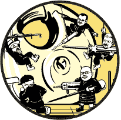
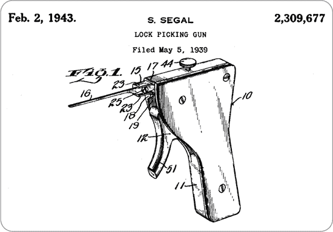
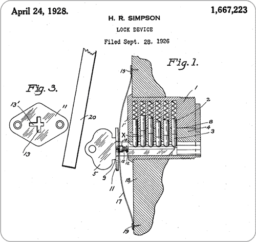
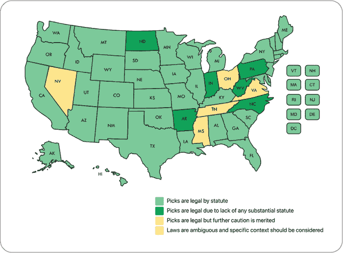

## 第一章：开锁运动的世界

你第一次看到有人撬锁是什么时候？也许是在间谍电影里，或者你偶然看到一个 YouTuber 讲解撬锁过程。又或者你在黑客大会上碰到了一个撬锁的“村庄”。无论是在哪里，你可能都会感到一阵激动、好奇，甚至怀疑。对我们中的一些人来说，这些情感促使我们开始尝试撬锁作为一种乐趣，最终变成了一个爱好，而这个爱好变成了一项运动。

*开锁运动*是以制造商未曾预见的方式非破坏性地开启锁具。我们使用这个术语来描述既包括开锁这一爱好，也包括看谁能以最快的速度打开锁具的竞赛。虽然*撬锁*是最为人熟知的开锁运动形式，但这一运动还包括其他类型的开锁，例如*压印*（在没有访问或了解原始钥匙的情况下，为锁具制作有效的钥匙）和*保险柜锁操控*，或称为*开保险柜*（通过从保险柜转盘的反馈来推测保险柜的密码）。

本书的目标是教你这些技术的基础，并逐步提升你的技能，直到你准备好参加开锁运动比赛。

### 开锁运动的历史

撬锁有着悠久的历史，但在万维网普及之前，获取关于它的信息是很困难的，更不用说找到合适的工具了。撬锁在锁匠界是有名的，但他们不愿意向外人提及此事。

当我开始学习撬锁时，我和我当地的锁匠 de Kok 先生聊过这个话题。他非常不愿意讨论这个话题。de Kok 先生销售的是他自己组装的 Mul-T-Lock 圆柱锁。有时他会犯错，导致圆柱锁无法使用。只有在我开始为他撬开这些锁，让他能够重复利用这些部件后，他才慢慢开始向我透露，他知道撬锁并且自己也尝试过。但他只会在店里没有其他顾客时才提起这些。

—沃尔特

在 1980 年代和 1990 年代，如果你知道去哪里找，你可以找到一些关于撬锁的资源。一个早期的例子是 Ted the Tool 于 1991 年发表的论文《MIT 撬锁指南》，这本插图精美的指南是许多人接触撬锁的入门读物，并且现在已被翻译成多种语言。也有一些关于撬锁的书籍，比如 Eddie the Wire 写的书（似乎你需要一个化名来写关于撬锁的书），由 Loompanics Unlimited 出版，这是一家美国书商，专门出版一些有争议的主题，如武器、无政府主义和性。Eddie 在《完全撬锁指南》（1981 年）中的介绍写道：“当 Eddie the Wire 十二岁时，他父亲给了他三个挂锁和没有钥匙。一个十二岁的孩子因此感到挫败，从而激发了 Eddie 对逃脱艺术、锁具和撬锁工具的早期兴趣。”Eddie 大概是在 1960 年代某个时候的年龄。我们只能猜测，如果他没有自己解决所有问题的话，他的这些信息是从哪里来的。

更早之前，撬锁就已经被麻省理工学院（MIT）成立于 1946 年的技术模型铁路俱乐部（TMRC）研究过。这个小组的兴趣不仅限于铁路，他们还研究计算机、无线电和电话系统。他们也喜欢*屋顶和隧道黑客技术*，有时这涉及到撬锁或绕过锁具。TMRC 的一个成员是理论物理学家理查德·费曼，后来在洛斯阿拉莫斯国家实验室工作时，他把开同事们的保险箱锁当做一种爱好。说实话，这更多的是一些聪明的技巧和社会工程，而不是实际的锁具操作。他在自传《你一定在开玩笑，费曼先生！》（W.W. Norton, 1985 年）中生动地描述了他的开锁冒险。

黑客文化是 TMRC 的遗产，撬锁可以被视为一种黑客技术：以制造商未曾预见的方式打开锁的智力挑战。黑客文化至今依然蓬勃发展，许多城市现在都有自己的黑客空间，那里聚集着对技术、艺术、科学等感兴趣的好奇人士。难怪很多拜访黑客空间的人也对撬锁感兴趣。

很难知道在这些早期文献之前，锁具行业的人们对于撬锁有多少了解，但旧的撬锁工具专利或许能给我们一些线索。比如*撬锁枪*：一种枪形工具，用于快速打开锁（我们将在第二部分中详细讨论这个工具）。图 1-1 展示了它 1943 年的专利。锁具行业的人们早就知道撬锁枪，但它花了几十年才成为公众知识。

*图 1-1：专利 2,309,677 号 “撬锁枪”*

另一个例子是*撞击钥匙*，这是一把经过切割或打磨的钥匙，可以通过用锤子轻轻敲击来打开某些锁。它的专利来源于 1928 年，如图 1-2 所示。撞击技术在开锁运动界一直不为人知，直到 2005 年 Barry Wels 和 Rop Gonggrijp 在《Bumping Locks》一文中描述了它，尽管在那时锁具行业的人们已经知道这一技术几十年了。

*图 1-2：专利号 1,667,223，名为“锁具装置”*

可能最古老且著名的开锁故事是*挑战锁*，由 Joseph Bramah 创造。1790 年，Bramah 在他的商店橱窗里展示了一把锁，并在一个板子上刻上了“任何能够制作出一种工具，打开这把锁的艺术家，将在工具制作完成后立即获得 200 吉尼”。1851 年，锁匠 Alfred C. Hobbs 成为第一个打开 Bramah 锁的人，他使用了一种自己制作的特殊工具。这种集开锁工具和张力工具于一体的工具至今在多种语言中仍被称为*霍布斯钩*。（我们将在第六章中解释开锁工具和张力工具。）

很明显，开锁技术可能和锁本身一样古老。但作为一项运动的开锁技术则要近得多。

#### *开锁团体与黑客*

德国开锁技术运动协会（Sportsfreunde der Sperrtechnik—Deutschland e.V.，简称 SSDeV）成立于 1997 年 2 月 9 日，是最古老的官方开锁运动团体。该名称在德语中意思是“开锁运动的朋友”；作为第一个开锁团体，成员们特意加入了*运动*一词，以表明他们不仅仅是一群讨论破锁的可疑人物。

SSDeV 起源于 1981 年成立的哈姆堡黑客团体——混乱计算机俱乐部（Chaos Computer Club，简称 CCC）。1994 年，CCC 创始人之一 Steffen Wernéry 参加了在纽约举办的首届地球上的黑客大会（HOPE），并购买了他的第一套开锁工具。回到德国后，他在 CCC 的图书馆里找到 Eddie the Wire 的书籍，并对开锁产生了浓厚的兴趣。两年后，在每年一次的 CCC 大会上，Wernéry 共同主持了一场开锁讲座和一些研讨会。这些活动取得了成功，几个月后，他与其他爱好者共同创立了 SSDeV。到 1999 年，德国已有 10 个本地开锁团体；截至目前，这一数字已增至 14 个。

SSDeV 启发了其他国家的锁匠运动组织。自 1994 年以来，荷兰黑客团体 Hack-Tic 每四年组织一次大型户外黑客营地。在 1998 年，SSDeV 在这个营地设立了一个帐篷，教授开锁技巧。一位与会者，荷兰黑客 Tim Matthews，正式注册了荷兰开锁组织 Nederlandse Vereniging van Hang en Sluitsport (NVHS)，该名称意为“荷兰门铰链与锁匠运动协会”，并于次年在阿姆斯特丹成立。（NVHS 这个缩写是开玩笑的选择：荷兰性改革协会的缩写是 NVSH。）这个与荷兰黑客社区紧密相连的锁匠运动组织，在阿姆斯特丹的 Hippie Hangout 碰面，这是由黑客团体 Hippies from Hell 租赁的一个空间，是现代黑客空间的先驱。

2002 年，NVHS 因内部分歧而解散，一个分裂的小组成立了 The Open Organisation of Lockpickers（TOOOL）。同年，TOOOL 的联合创始人 Barry Wels 启动了荷兰公开赛，这是一个每年举行的开锁锦标赛，包含讲座和工作坊。

每年一度的拉斯维加斯黑客大会 DEF CON 自 2003 年开始举办即兴开锁比赛，由科罗拉多斯普林斯 DC719 DEF CON 团体组织。*lockpick village*这一术语首次出现在 2005 年，当时 TOOOL 在“What The Hack”荷兰黑客大会上设立了专门的开锁帐篷。

同样在 2005 年，Josh Nekrep、Kim Bohnet 和 Devon McDormand，Lock Picking 101 网站的贡献者，成立了一个开锁爱好者俱乐部，并创造了“*locksport*”一词，以区别于传统的锁匠组织。他们的组织 Locksport International 在美国有多个分会。

2006 年，TOOOL 在荷兰埃因霍温开设了一个分会。Barry Wels 的个人博客 Blackbag（[*https://blackbag.nl*](https://blackbag.nl)）受到了广泛关注，使得 TOOOL 成为锁匠运动中的家喻户晓的名字。那时，Blackbag 是互联网上为数不多讨论开锁技巧的地方之一。

Blackbag 的受欢迎程度促使其他国家（如美国、英国、比利时、挪威和澳大利亚）的开锁团体采用 TOOOL 这个名称。这些团体是独立的实体，但遵循相同的基本规则，并共享 TOOOL 的标志和名称。荷兰的 TOOOL NL 控制 TOOOL 名称的使用，其网站（[*https://TOOOL.nl/Toool*](https://TOOOL.nl/Toool)）列出了全球范围内的 TOOOL 组织。

2006 年，TOOOL US 在第六届 HOPE 会议结束时正式成立，Wels 任命 HOPE 的开锁村组织者——Babak Javadi、Eric Michaud、Eric Schmiedl 和 Schuyler Towne——为董事会成员。

自从 SSDeV 和 TOOOL 成立以来，全球涌现了更多的锁具破解小组。例如，捷克锁匠协会（ACZ，[*http://lockpicking.team*](http://lockpicking.team)）成立于 2010 年。瑞士的 Schlösser Picken Als Schweizer Sport（SPASS，[*https://lockpicking.ch*](https://lockpicking.ch)），意为“将锁具破解作为瑞士运动”，于 2011 年开始运营。在一些国家，锁具破解的非法性使得成立运动小组变得困难。例如，在法国，虽然自 2006 年以来就有锁具破解论坛活跃，但直到八年后，法律才允许拥有锁具破解工具，法国锁匠协会（ACF，[*https://crocheteursdefrance.fr*](https://crocheteursdefrance.fr)）也在 2016 年两年后才成立。

如今，许多锁具破解运动小组存在，不论是作为国家性还是地方性小组。如果你住的地方锁具破解是合法的，但没有当地的锁具破解小组，可以考虑寻找一个当地的黑客空间小组（[*https://wiki.hackerspaces.org*](https://wiki.hackerspaces.org)）并介绍锁具破解。你可能会发现其他有兴趣的人，并因为引入锁具破解运动而获得当地的认可！

#### *竞赛*

如今，全球范围内举行了许多锁具破解竞赛。第一次竞赛早在 1997 年就已举办——不出所料，是由 SSDeV 举办的。该小组举办了三种风格的竞赛：*Handöffnung*，传统的锁具破解；自由风格，允许使用如开锁枪等工具；以及*Blitzöffnung*，一种淘汰制，每个锁的时间限制为一分钟。2000 年，SSDeV 新增了*Hangschlossöffnung*，挂锁破解。

在早期，印记破解仍然是一项谜题。印记破解是一种通过在锁中摆动空白钥匙，观察其上留下的微小痕迹，然后通过打磨这些痕迹来制作出一把适用的钥匙的技巧。那时，锁匠们尝试使用如马克笔和化学物质等方法来帮助更好地识别这些痕迹。（我们将在第三部分中解释如何掌握这一技能。）2005 年，SSDeV 将印记破解竞赛纳入其活动项目，SSDeV 的奥利弗·迪德里希森（Oliver Diederichsen）专心研究这一技巧，并将他的研究成果与精彩的图片整理成册，出版了《Impressioning》一书，使更多人能够掌握这一技术。TOOOL 于 2007 年举办了其印记破解锦标赛。

许多开锁团体每年都会举办比赛，具体规则因团体而异。有些团体可能只使用圆筒锁，而其他团体可能包括挂锁，或者有一个完全独立的挂锁比赛。锁具可能仅限于常规的销子锁，可能包括凹槽锁，或者仅为凹槽锁。（我们将在第二章、第三章和第四章中讨论锁具的种类。）在某些情况下，参赛者自带锁具；在其他情况下，锁具由主办方提供。有时所有参赛者同时开锁，而其他时候则是轮流连续开锁。

*杠杆锁开锁*是一种相对较新的比赛形式，正获得越来越多的关注。打开常规锁的基本技巧同样适用于杠杆锁，尽管存在一些差异，正如我们将在第三章中讨论的那样。一个显著的差异是，杠杆锁开锁需要昂贵的工具。锁本身也很贵，因此杠杆锁和工具通常由比赛主办方提供。

此外，破解保险箱锁已经从锁匠和保险箱技术员的领域扩展到了其他领域。由于组织上的难题，这类比赛较为罕见：打开保险箱锁需要相当长的时间，参赛者必须打开完全相同的锁，因为不同的锁开锁所需的时间差异巨大。因此，这些比赛通常不是在特定时间举行，而是持续一段时间，参赛者依次使用同一把保险箱锁。

还有其他比赛形式，比如逃脱室风格的比赛。这些比赛在黑客大会上尤其受欢迎。可以查看本地的锁具运动组织，看看它提供什么活动。

#### *规则*

大多数锁具运动大会——以及组织这些大会的机构——都有规则，参赛者必须遵守，否则可能会被要求离开。这些规则旨在保护锁具运动者、锁具、锁具所有者和锁具运动俱乐部。毕竟，少数不良成员很容易损害整个俱乐部的声誉。

虽然不同的锁具运动俱乐部和组织的规则有所不同，但一些规则在几乎所有的团体中是通用的：

+   仅挑选你拥有或已获得所有者许可的锁具。这个规则很简单；不遵守它就是非法闯入。

+   不要挑选正在使用的锁。尽管本书中讨论的技术一般是无损的，但始终存在锁具在开锁或打压过程中可能损坏且无法使用的风险。如果你把自己锁在外面，打电话给真正的锁匠。

+   不要自称为锁匠。许多地方对锁匠有具体的执照要求。在没有适当锁匠业务的情况下提供这些服务可能会惹上麻烦。

+   要注意你教授的人。不要向任何打算利用开锁技巧违法的人展示开锁技术。

确保你遵守这些规则以及你的俱乐部或比赛组织者设定的其他规则，否则你在锁匠运动中就走不远了！

### 合法性

当你第一次告诉别人你会开锁时，常见的初步反应是“这不是违法的吗？”虽然由于开锁在媒体中的表现方式，这个反应有些可以理解，但答案通常是否定的。在大部分国家，单纯持有开锁工具并不是犯罪。只有在工具被用来实施犯罪时，持有这些工具才成为法律问题。实际上，许多硬件商店出售的工具是合法拥有的，但用于不法目的则是非法的。开锁工具通常也不例外。

话虽如此，并非所有国家（甚至各州、省、县、市等）都以这种方式看待开锁工具。例如，在波兰和日本，这类工具是被禁止的。在本节中，我们将重点介绍一些定期举行锁匠运动比赛或会议的国家的法律。

**注意**

*我们不是律师！尽管锁匠运动社区已经对许多地区持有和使用开锁工具的合法性进行了广泛研究，但法律是会发生变化的。务必做足研究，确保你始终安全合法。*

#### *美国法律*

从联邦层面来看，美国没有一项全面禁止持有或使用开锁工具的法律。美国的法律禁止通过邮件或其他运输服务将这些工具发送给非锁匠（39 US Code § 3002A 和 18 US Code § 1716A），但据我们所知，这些法律并未得到执行。事实上，大多数制造商确实通过邮件发货他们的工具。

虽然没有联邦禁令是个好消息，但缺点是每个州都有自由制定自己的法律，导致全国各地的法规拼凑成一片。幸运的是，TOOOL US 创建了一个很棒的页面，详细列出了每个州的法律（[*https://TOOOL.us/lockpicking-laws.php*](https://TOOOL.us/lockpicking-laws.php)）。这个页面还包含了一个方便的参考地图，如图 1-3 所示。

*图 1-3：TOOOL 美国开锁法律地图*

如你从地图中所见，大多数州只要携带者没有表现出使用这些工具犯罪的意图，持有开锁工具是合法的。话虽如此，在弗吉尼亚州、俄亥俄州、密西西比州、田纳西州或内华达州携带或使用这些工具时，务必特别小心。这些州的法律通常要求你证明自己的清白，而不是由检察官证明你的罪行。田纳西州曾有类似的限制性法律，但它似乎已在 2021 年 6 月被废除（参见 *[`www.tn.gov/content/dam/tn/commerce/documents/regboards/lock/posts/Locksmith-Letter_6-7-2021.pdf`](https://www.tn.gov/content/dam/tn/commerce/documents/regboards/lock/posts/Locksmith-Letter_6-7-2021.pdf)*）。这一变化尚未由 TOOOL US 法律团队审核，因此尚未在其地图上反映出来。

**注意**

*本材料基于 TOOOL 法律团队在 2012 年的研究准备而成。尽管我们相对自信地认为所引用的法律条文在当时是准确的，但 TOOOL 自然无法保证这些引用或案例法中的示例的完整性。本图表及其中的任何注释均不构成法律建议，TOOOL 鼓励所有开锁运动爱好者咨询律师，以获得更为具体的法律知识和相关法规，以帮助参与此项爱好*。

[LockWiki.com](http://LockWiki.com)也有一份法律列表（[*https://lockwiki.com/index.php/Legal_issues*](https://lockwiki.com/index.php/Legal_issues)）。这两个来源是你了解影响美国开锁运动的法律信息的最佳途径。

#### *荷兰法律*

荷兰没有任何法律禁止持有开锁工具。然而，如果你在未经许可的情况下使用这些工具打开你不拥有的锁，那显然是非法的。

荷兰的部分城市有额外的市政法律，称为*Algemene Plaatselijke Verordening*（或*APV*）。在阿姆斯特丹和埃因霍温（TOOOL NL 所在地），第 2:77 条和第 2.44 条分别规定，除非当事人能够当场并令执法人员满意地证明他们无意使用这些工具进行非法入侵、非法打开或破坏封闭物，或掩盖或阻碍盗窃痕迹，否则不得在公共场所持有开锁工具。据我们所知，在荷兰任何地方你都可以携带开锁工具并使用它们进行开锁运动练习。

#### *英国法律*

英格兰和威尔士的法律体系与苏格兰不同，且两个体系都没有专门禁止开锁工具。根据 1968 年《盗窃法》第 25 条，仅仅携带这些工具可能构成“准备盗窃罪”。

如果你在家外携带开锁工具，且要被视为犯罪，警方必须证明你有意图使用这些工具进行盗窃或入室盗窃。这是一个相当高的门槛，因此只要你能向警方或法庭证明你对这个爱好感兴趣，并参与开锁运动团体或比赛，单纯持有工具应该不会带来问题。例如，若你同时拥有这本书的纸质版，那就表明你很可能是一个开锁运动爱好者。而如果你同时拥有面罩和撬棍，那就会让人产生相反的看法。如果你只是和几个其他人一起坐在当地的酒吧里安静地开锁，应该没问题。如果酒吧已经关门，而你被抓到还坐在酒吧里？那就糟糕了。

我们只知道有一起案件涉及此罪行被提交法庭，而被告最终被判无罪。

#### *德国法律*

德国没有一项普遍的法律禁止在公共或私人环境中持有或使用撬锁工具。如果你在未经允许的情况下使用它们打开自己不拥有的锁，这显然是非法的。

#### *澳大利亚法律*

澳大利亚的法律似乎规定，如果持有者有正当理由，持有“撬锁工具”是被允许的。具体而言，《预备犯罪最高刑罚审查报告》第 3.5 条规定：

没有合法理由而持有撬锁工具的人将构成犯罪。举证责任在于该人，必须证明持有该工具的合法理由。

我们没有听说过有任何人在澳大利亚因持有撬锁工具而遇到麻烦。

### 团体与如何寻找它们

你已经阅读了规则和法律，准备开始你的锁技运动之旅。最好的开始方式是加入一个本地的锁迷团体。不要急着订购工具！我们将在后面的章节中详细讲解如何选择合适的工具。

锁技运动更多的是关于社区，而非竞争或炫耀（尽管这方面也有充足的空间）。与朋友一起度过一个下午，使用一堆工具和一桌锁，最好是配上一些冰冷的饮品。只要你对开锁的挑战有真正的兴趣，锁技社区将是你能找到的最有帮助、最包容和最友好的团体之一。

#### *美国团体*

美国最大的、最知名的锁技团体是 TOOOL US（[*https://TOOOL.us/meetings.html*](https://TOOOL.us/meetings.html)）。它在二十多个城市设有分会，并在多个信息安全会议上举办锁技村活动，如 DEF CON 和 ShmooCon。TOOOL US 还主办了每年的 LockFest 大会和竞赛。

Locksport International，或 LI（[*http://locksport.com/index.php/discover-l-i/local-chapters*](http://locksport.com/index.php/discover-l-i/local-chapters)），是另一个在多个州设有分会的组织。它最受欢迎的分会之一是德克萨斯州奥斯汀的 Longhorn Lockpicking Club。

如果这些团体在你所在的地区没有分会，你可以检查其他一些地方。试着在 Meetup 网站（[*https://www.meetup.com*](https://www.meetup.com)）搜索*locksport*或*lockpicking*；大多数俱乐部会在这里列出他们的聚会信息。或者，你也可以联系当地的黑客空间，因为创客、黑客和撬锁者之间有很大的重叠。如果你在本地找不到任何相关活动，可以考虑自己组建一个团体。一旦找到一些有兴趣的人，访问全国组织的官网，了解如何成为官方分会。

#### *荷兰团体*

TOOOL NL（[*https://TOOOL.nl*](https://TOOOL.nl)）目前在阿姆斯特丹和埃因霍温设有分会，每两周举行一次会议。该小组自 2002 年以来举办荷兰公开开锁锦标赛。这些比赛已发展成一个为期三天的年度活动，名为*LockCon*，包括荷兰公开赛以及许多工作坊和讲座。LockCon 每年秋季在荷兰举行。

#### *英国小组*

TOOOL 英国小组（[*http://www.TOOOL.uk*](http://www.TOOOL.uk)）的开放会议已经在伯明翰的创客空间 fizzPOP 举办超过十年，每个月的第一个星期三定期举行。该小组还经营着一个名为*TOOOL UK*（[*https://discord.gg/mp2fhED*](https://discord.gg/mp2fhED)）的活跃 Discord 服务器，并且每周举行一次虚拟会议。

#### *德国小组*

SSDeV（[*https://blog.ssdev.org*](https://blog.ssdev.org)）在德国各地设有地方分会，还有一个专门研究水下开锁的兴趣小组。每个 SSDeV 分会都有自己的会议。其中一些是*lockpicknicks*，即开锁者的户外聚会，大家可以边吃边社交，当然也会进行开锁活动。开锁和印象法比赛每年举行一次。SSDeV 在其网站上列出了所有参赛的开锁者及其成绩——*Listung der Meister*，或*大师列表*。

#### *澳大利亚小组*

澳大利亚有自己的 TOOOL 组织，成立于 2019 年（[*https://www.TOOOL.com.au*](https://www.TOOOL.com.au)）。它定期在墨尔本、堪培拉、悉尼和纽卡斯尔举办聚会；请查看网站以找到下次聚会或加入该小组。

OzSecCon（[*https://www.ozseccon.com*](https://www.ozseccon.com)）是澳大利亚最早的专注于物理安全的会议，几乎每年都在墨尔本举办。除了讲座和工作坊外，它还包括开锁和印象法比赛。

### 总结

本章中，你了解了锁匠运动的历史、一些开锁规则和法律，以及如何找到资源，比如国家组织和本地小组。

在下一章中，我们将开始深入了解硬件，研究你可能遇到的各种锁具以及它们的工作原理。
