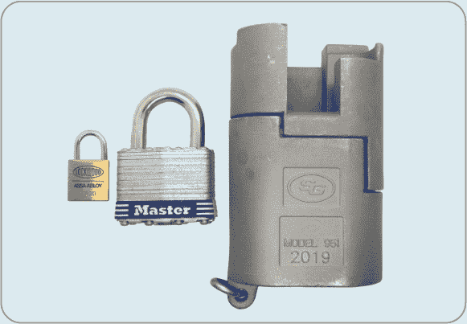
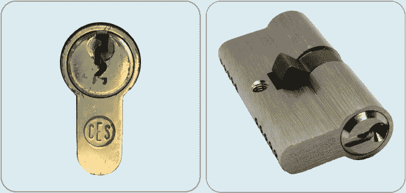
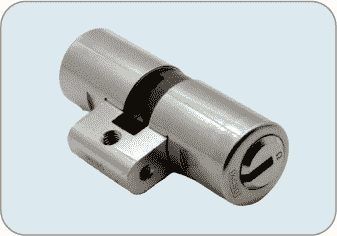
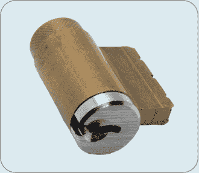
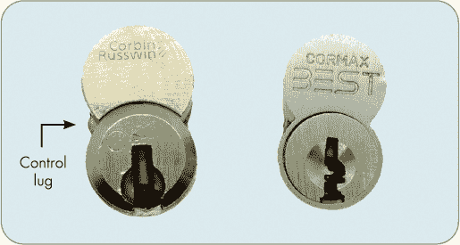
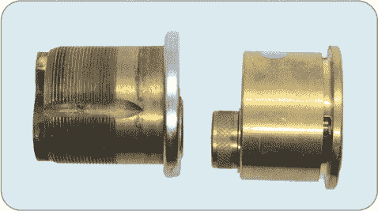
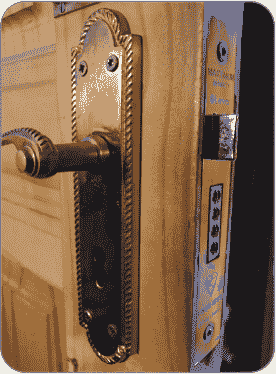

## **2

**锁和圆筒类型**

在我们深入讲解挑锁技巧之前，值得花时间来了解一下锁具本身。锁有着各种各样的设计，基于不同的因素，包括锁的用途、安装方式、安全要求，甚至使用的国家。这些标准对安装锁具的人来说非常重要，但对锁匠来说大多无关紧要。由于我们关心的是打开锁，锁匠通常会忽略任何附件，比如用来将锁固定到门上的硬件。事实上，锁匠通常只保留锁的圆筒部分，即通常需要用钥匙操作的部分。例外情况是一些圆筒不能从其余锁具硬件中取下的锁，比如某些挂锁。

尽管锁的形状或圆筒对锁匠来说不如锁的机械结构重要，但它仍然会影响挑锁的方式。熟悉各种类型的锁和圆筒，以及你可能需要的挑锁工具，对于你在购买、交易、研究或讨论锁具时也会有所帮助。

### 挂锁

最具代表性且最常见的锁是*挂锁*。在所有锁具类型中，挂锁是最为多样化的。它们包括从指甲盖大小的行李拉链锁到像 Sargent & Greenleaf（S&G）951 这样的巨型锁，后者重达几磅，能够抵御一阵子弹射击——这是用于保护军火库的锁具必须具备的重要特性。图 2-1 展示了各种挂锁。

*图 2-1：从左到右：一把 Lockwood 行李锁、一把 Master Lock #1、和一把 S&G 951*

挂锁是一个很好的挑锁起点，因为它们在五金店、大型商场，甚至超市和便利店中都很常见。大多数挂锁尺寸适中，挑锁时很容易握住。由于它们的锁定机制和安全功能差异很大，你可以找到各种难度的挂锁来挑战不同水平的挑锁者。而且，最棒的是，当你成功打开挂锁时，它通常会发出非常令人满意的*叮当*声。

关于挑锁，有几个要点需要了解。在大多数情况下，无论是用挑锁工具还是钥匙，打开挂锁时，你只能通过顺时针转动它的*插头*（即旋转部分）。此外，一旦你挑开了一个挂锁，打开它所需的力度会根据锁的品牌和型号有很大差异。只要有可能，先用钥匙测试一下挂锁，了解一下你需要的力度。最后，由于挂锁的大小和重量差异很大，最好手边准备一个台钳来固定挂锁，这样你在挑锁时会更加方便。

### 圆筒锁

如果你曾经锁过或解过任何门，那么很有可能你用过了*圆柱锁*。锁芯有多种形状和尺寸，以适应不同国家使用的各种门和门硬件（如门把手）。在本节中，我们将介绍一些最常见的门锁芯类型：欧式剖面锁芯、钥匙内旋钮锁芯、可互换核心锁芯、边框锁芯和埋入式锁芯。

#### *欧式剖面锁芯*

尽管在美国不常见，*欧式剖面锁芯*—通常简称为*欧式剖面*、*欧式锁芯*，甚至是*剖面锁芯*—正如其名所示，广泛分布于欧洲大部分地区，通常出现在门上。欧式剖面锁芯在长度和锁定机制上有很大的差异，但可以通过其独特的形状辨识出来，这种形状看起来有点像倒置的感叹号，如图 2-2 所示。

*图 2-2：欧式剖面锁芯安装在门上（左）和未安装的样子（右）*

许多欧式剖面锁芯是双面的，这意味着锁芯两侧都有*钥匙孔*（插入钥匙的孔）。然而，有些锁芯内侧只有*拇指转轮*（一个小旋钮，可以不使用钥匙就锁定或解锁锁），外侧则只有钥匙孔。在包含欧式剖面锁芯的挑锁比赛中，双面锁是常见的，参赛者通常可以选择挑任何一面。当未安装在门上时，许多类型的锁芯，包括欧式剖面锁芯，都可以顺时针或逆时针挑锁。

双面锁在美国并不常见，因为在美国，火灾安全通常优先于门锁安全。带有拇指转轮的单面锁可以迅速从内部打开，但这也使得窃贼更容易打破附近的窗户，通过伸手进来解锁门。

欧式剖面锁芯的形状适合大多数人的手掌，因此许多锁匠更喜欢用手持而不是使用台钳来挑锁。然而，对于较长时间的挑锁，像是长时间的比赛，使用台钳可以帮助防止手部抽筋。

我设计了一个支架，可以方便地用台钳或夹具固定欧式剖面锁芯；你可以在[*https://www.thingiverse.com/thing:3610868*](https://www.thingiverse.com/thing:3610868)下载 3D 模型。我在挑锁和印象比赛中使用了一个塑料的 3D 打印版支架。

—MATT

欧式剖面锁芯有几种变化形式。*瑞士圆柱*形式看起来与欧式剖面锁芯相似，不同之处在于锁芯底部安装门锁的地方是居中设计，而不是像欧式锁芯那样延伸至锁芯的整个宽度，如图 2-3 所示。

*图 2-3：瑞士圆柱锁*

存在几种 *椭圆形圆柱*，包括英国、澳大利亚和挪威的变体。每个圆柱都类似于单面或双面欧式轮廓圆柱，但锁的上下部分宽度相同。图 2-4 显示的是一款单面澳大利亚椭圆圆柱。

*图 2-4：椭圆格式的 BiLock 圆柱*

椭圆形变体的主要区别在于它们被螺丝固定到门上的方式，而这对锁匠来说并不重要。

#### *钥匙旋钮圆柱*

在美国，*钥匙旋钮（KIK）圆柱*，也叫 *钥匙杠杆圆柱*，非常受欢迎。这些小型锁具适合安装在门把手或杠杆把手内，因此得名。像欧式轮廓圆柱一样，未安装的 KIK 可以顺时针或逆时针挑开。

通常，KIK 圆柱看起来像是被一分为二并稍微缩小的欧式轮廓圆柱。然而，它们的形状稍微不太容易辨认，因为除了插头外，其他部分都隐藏在旋钮内部。例如，当锁安装时，图 2-5 中显示的 KIK 圆柱只有银色部分是可见的。

*图 2-5：未安装的 KIK 圆柱*

也有一些高端挂锁可以拆解并重新设置钥匙，它们通常包含一个看起来像稍微缩小的 KIK 圆柱。许多美国品牌的锁和它们的克隆锁就属于此类。

KIK 圆柱由于体积小且边缘锋利，可能很难在挑锁时握住，因此一些挑锁者更喜欢将它们固定在台钳中。还有一些人甚至打印一个塑料外壳，以使其更易于握住。如果你有 3D 打印机，可以在你喜欢的 3D 模型共享网站上搜索 *KIK holder*，应该会找到几个选择。

#### *可互换核心圆柱*

*可互换芯（IC）圆柱* 看起来像一个数字 8 或一个雪人，侧面有一根金属杆突出，称为 *控制凸耳*。IC 在办公楼和商业建筑中很常见，因为它们可以轻松地被拆卸和更换，只需使用 *控制钥匙*，这是一种特殊的钥匙，可以将控制凸耳缩回圆柱内。当有人丢失钥匙或离开公司时，重新设置办公室的钥匙只需 5 秒钟，而不是 30 分钟，因为只需使用控制钥匙交换新圆柱。旧圆柱通常会重新设置钥匙并放置一旁，以备下次需要时使用。

**注意**

*许多人，甚至是锁匠，都把* 圆柱 *和* 核心—*有时甚至是* 锁 *—当作同义词来使用。我们将在下一章解释这些术语之间的微妙区别，但如果你听到它们被交替使用，也不要感到惊讶*。

IC 芯片有多种尺寸和配置，例如*小型可互换核心（SFIC）*、*大型可互换核心（LFIC）*和*可拆卸核心（RC）*。SFIC 是一个行业标准术语，用于描述一种非常特定的大小和形状，最初由 BEST Lock 公司（现为 Dormakaba 的一部分）设计和制造，而 LFIC 有多种形状和尺寸。SFIC 由两个对称的圆形构成，比 LFIC 和 RC 小。LFIC 和 RC 的标准化程度较低，且因品牌而异，但它们通常由两个略微不同大小的圆形核心组成。图 2-6 展示了 LFIC（左）和 SFIC（右）。

*图 2-6：Corbin Russwin LFIC（左）和 BEST SFIC（右）*

拾取 IC 芯片可能很棘手，因为启用控制钥匙轻松拆卸锁的机制也可能干扰拾取过程。我们建议在成功拾取一些基础锁具后再尝试拾取 IC 芯片。

#### *边缘和榫头圆筒*

*边缘圆筒*常用于死锁，而*榫头圆筒*通常出现在商用门上。虽然它们的大小各异，但最常见的长宽大约为 3.5 厘米或 1.25 英寸。这两种类型从正面看起来相似，但在安装方式上有所不同，正如图 2-7 中所示的侧视图所示。

*图：2-7：榫头圆筒（左）和边缘圆筒（右）*

边缘圆筒是光滑的，但背面有两个螺纹孔，用来将锁固定到门的表面。而榫头圆筒则具有一个螺纹外壳，可以将整个圆筒螺旋安装到锁硬件中，然后将其插入门上的开槽中，这个开槽称为*榫头*。一旦榫头圆筒被螺旋安装到锁中，使用一个或多个固定螺丝来固定圆筒位置，以防其被拔出。

### 榫头锁套

最后，*榫头锁套*是一种带有集成于榫头硬件中的不可拆卸圆筒的榫头锁；也就是说，安全锁定功能被纳入到榫头锁体内。这种锁最常见于英格兰及其他地方的古董门中。如图 2-8 所示，这些锁是大型矩形盒子，适合安装在门边缘的榫头中。

*图 2-8：安装在门上的榫头锁套*

榫头锁套通常与杠杆锁和卡舌锁机制相关，我们将在下一章讨论这些机制。尽管在锁具开锁圈子中并不十分常见，但榫头锁套形式的杠杆锁已经成为荷兰公开赛的组成部分，并且在过去几年里一直参与其中。我们将在第五部分中详细介绍这些锁。

### 总结

本章探讨了各种常见的锁和锁芯类型，并讨论了它们的区别特征。我们还涉及了锁的部分术语，如*钥匙槽*、*插头*和*芯体*。在下一章，我们将更深入地探讨这些及其他锁的内部结构，并介绍常见的锁机制。
