## 锁具结构**

要想成功地开启或印模一个锁，首先你必须了解它是如何工作的。为此，在本章中我们将定义锁具的常用术语，然后探索各种锁定机制及其工作原理。

### 锁具的组成部分

在本节中，我们将讨论你在锁具上最常见的部件。即使你对这个话题相当熟悉，我们仍然建议浏览一下。人们往往把许多与锁具相关的术语互换使用，但它们之间有微妙的区别。掌握共享的词汇将帮助你更好地跟进接下来的内容。

#### *外壳或圆筒*

我们从任何锁具最显眼的部分开始：*外壳*，即锁的主体。术语 *圆筒* 也常用来指代外壳或整个锁，包括外壳。如图 3-1 所示，在挂锁上，你可以看到整个外壳，而安装在门上的边缘圆筒（如死锁）仅能看到外壳的正面。

*图 3-1：挂锁的外壳（左）和死锁（右）*

#### *栓环或插销*

用于固定锁的部件名称根据锁的类型不同而有所不同。在挂锁上，通常是一个 U 形的部件，称为*栓环*或*栓杆*（见图 3-2）。

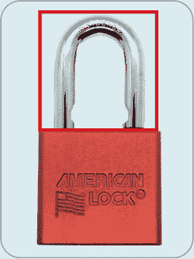

*图 3-2：挂锁的栓环*

在门锁或保险箱锁上，这部分从门的侧面突出并进入门框或保险箱（如图 3-3 所示），被称为*插销*。

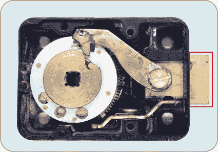

*图 3-3：保险箱锁的插销*

插销并不总是直接集成到锁具中。有时，它是安装在门上的硬件（称为*锁具套件*）的一部分，随后通过凸轮或尾部零件与锁圆筒连接，这将在本章后续部分介绍。

在挂锁或保险箱锁的开锁比赛中，释放栓环或收回插销即构成一次*开锁*——成功解锁。使用欧式外形圆筒的比赛通常不包括插销，因此参赛者通过旋转插芯来实现开锁，具体说明如下。

#### *插芯*

*插芯*是一个圆形的金属圆柱体，当插入正确的钥匙并转动时，它会旋转（见图 3-4）。当锁装配完成时，只能看到插芯的正面。正如我们稍后会讨论的，常见的使用插芯的锁具机制包括针锁、薄片锁和凹槽锁。在锁内部，插芯被一个金属套筒包围，称为*外壳*。

**注意**

*外壳*这个术语对于不同的锁具来说可以指不同的东西。例如，在欧式圆筒锁中，*外壳*仅指锁的实际外壳。在某些设计中，例如安装在挂锁内的 KIK 圆筒，外壳是一个完全独立的部件*。

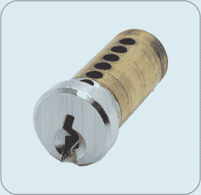

*图 3-4：从 KIK 圆筒中取出的插芯*

#### *核心*

你经常会听到有人把锁芯称作*核心*，但这并不完全正确。在大多数类型的锁中，锁芯和核心并不是独立的部件。然而，在可互换核心锁（如 SFIC）中，核心是锁内的 8 字形部分，适配于锁壳，而锁芯则适配到核心中（参见图 3-5）。IC 包含了大多数锁的内部机制，包括销钉和弹簧。

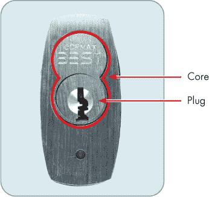

*图 3-5：挂锁中的 SFIC 核心*

#### *钥匙孔*

锁的*钥匙孔*是切割在锁芯上的槽，用于插入钥匙或开锁工具。钥匙孔的大小和形状会根据锁的品牌和型号而有所不同。一个典型的钥匙孔，最初由 Schlage 锁公司设计，见于图 3-6。

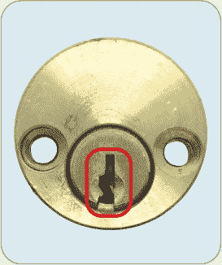

*图 3-6：典型的钥匙孔*

作为一种安全功能，一些钥匙孔被设计得特别紧或形状奇特，以限制开锁工具的空间。例如，图 3-7 所示的 IKON 锁的钥匙孔是偏心的，或者说是*偏心型*。我们将在第四章、第六章和第七章中进一步讨论钥匙孔。

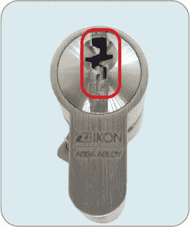

*图 3-7：一个偏心钥匙孔*

#### *销钉、垫片、圆盘和杠杆*

带钥匙的锁依赖于一系列与钥匙对齐的金属部件来打开锁。这些金属部件可以是*销钉*，即有尖端的小圆柱；*垫片*，即中央有孔的扁平椭圆形板；*圆盘*，即中央有孔且边缘带缺口的圆形板；或是*杠杆*，即长的可旋转臂（参见图 3-8 中的一些示例）。不管具体机制如何，这些部件是你用开锁工具操作的部分。

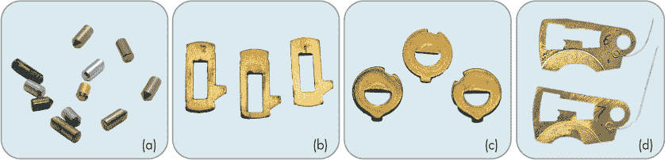

*图 3-8：各种钥匙和驱动销钉（a），垫片（b），圆盘（c），和杠杆（d）*

#### *弹簧*

大多数锁都包含*弹簧*，用于保持销钉、杠杆或垫片的位置。在销钉弹子锁和凹槽锁中，每个销钉堆栈上都有一个小弹簧，负责推动销钉向上或向下，具体取决于锁的朝向（参见图 3-9）。类似地，垫片锁使用弹簧来定位垫片，杠杆锁则使用较大的弹簧来加紧杠杆。

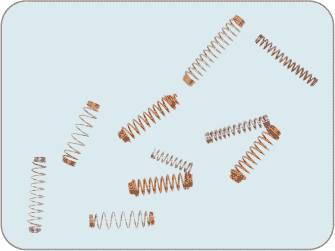

*图 3-9：各种销钉弹簧*

即使是那些锁定机制不使用弹簧的锁，也通常会包含弹簧用于其他目的。保险柜锁可能会有一个弹性弯曲的金属垫圈，用来给轮组加紧（参见后面的“轮组和驱动凸轮”部分）。无论锁定机制如何，挂锁通常都有弹簧，能够在解锁后弹开锁扣。由于这些弹簧的存在，如果你是第一次拆开锁，零件很容易飞出来！我们将在第五章中讲解如何避免这种情况。

#### *锁身*

*圣经*包含了用于容纳弹簧和驱动针的腔体，这是插芯锁中的一部分。在 KIK 或欧式型材圆柱锁上，圣经会突出在插芯的上方或下方，如图 3-10 所示。尽管严格来说它是外壳的一部分，但*圣经*这个术语已被广泛使用，值得一提。

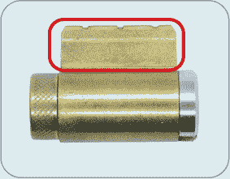

*图 3-10：KIK 圆柱锁的圣经部分*

#### *轮组和驱动凸轮*

组合锁，如保险箱上常见的锁，通常不使用钥匙。这些锁没有针、钥匙孔、插芯，甚至没有锁芯。相反，在外壳内有一个*轮组*，每个轮子代表组合中的一个数字。（组合锁比赛仅使用三轮锁。）在轮组的上方是*驱动凸轮*，它负责在有人转动旋钮时旋转轮子，并且在转动时缩回锁舌（见图 3-11）。

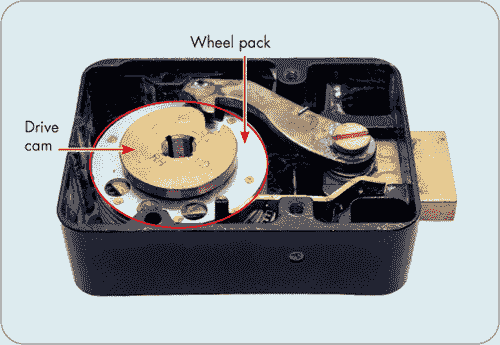

*图 3-11：保险箱锁中的轮组和驱动凸轮*

每个轮子都有一个凹槽，叫做*门*。当所有轮子的门与驱动凸轮的门对齐时，一根叫做*栅栏*的金属条会掉入它们所形成的凹槽中，允许锁舌缩回，从而打开锁。我们将在“组合锁”部分的第 38 页进一步讨论这个机制。

**注意**

*某些组合锁有钥匙可以更改组合，或完全绕过它（如酒店保险箱的管理员钥匙）。有些保险箱还需要钥匙*和*组合——物理世界中的双重认证*。

#### *凸轮、尾部、锁舌和滚珠轴承*

在大多数锁具中，钥匙（甚至插芯）并不会直接与锁舌或钢索互动。相反，旋转插芯会移动锁中的一个小元件，这个元件才是实际移动锁舌或释放钢索的部分。这个元件的名称取决于锁的类型。

在欧式型材圆柱锁或插芯锁上，这个部分叫做*凸轮*。在双面欧式型材圆柱锁上，凸轮位于锁芯的中间（如图 3-12 所示），而在插芯锁上，凸轮则位于后部。

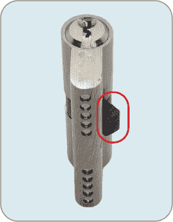

*图 3-12：欧式型材圆柱锁上的凸轮*

在边缘圆柱锁和 KIK 圆柱锁上，这个机制叫做*尾部*或*尾片*，它是一个长而扁平的金属片，安装在背面（见图 3-13）。

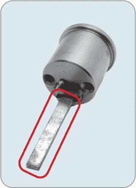

*图 3-13：边缘圆柱锁的尾部*

挂锁通常略有不同。较便宜的挂锁有一个或两个楔形的、弹簧加载的锁舌，它们会卡入钢索上的凹槽来锁住挂锁，然后当插芯转动时会缩回以解锁。高端挂锁则使用*滚珠轴承*，它们与钢索上的半圆形切口配合。图 3-14 突出了这一差异。使用正确的钥匙时，滚珠会滚入外壳，释放钢索。

*图 3-14：使用滚珠轴承来固定锁链的挂锁（左）与使用闩锁的挂锁（右）*

使用滚珠轴承的挂锁通常更为安全。闩锁的楔形设计容易受到*垫片攻击*，即将一片薄金属滑入锁链与锁体之间，从而压下并释放闩锁。但使用滚珠轴承机制时，这种攻击方法不可能实现。

### 锁定机制

世界各地使用了多种多样的锁具。某些类型的锁因其更安全而闻名，但通常每种锁具都有既安全又不安全的例子。在本节中，我们将研究最常见的锁具类型：销栓锁、插片锁、组合锁、杠杆锁、挡板锁和圆盘锁。

#### *基于销栓的锁*

多种锁具使用销栓作为其锁定机制，包括销栓锁、凹形锁和管形锁。我们将从销栓锁开始，这可能是世界上最常见的锁具类型。

##### **销栓锁**

你可能几乎每天都会使用几种销栓锁，因为世界各地的大多数家庭和企业都依赖这种锁。如今被称为*销栓锁*的机制自 19 世纪中期以来就已存在，而更原始的版本已经存在了数千年。

销栓锁的插头上有一系列与锁体中的孔对齐的孔。每个孔中包含两个或更多的销和一个弹簧。*钥匙销*接触插入插头钥匙孔的钥匙表面，通常有一个锥形尖端。*驱动销*位于钥匙销和弹簧之间，且两端平坦。通常，驱动销的长度相同，而钥匙销的长度则根据钥匙上不同的切割深度而有所不同。这些销和弹簧共同组成一个*销栓堆叠*，如图 3-15 所示。

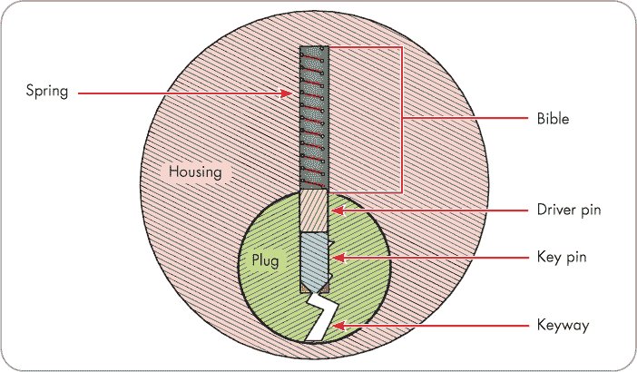

*图 3-15：销栓堆叠*

当钥匙插入时，如果其切割高度与销栓堆叠的位置相符，钥匙销将与插头的边缘齐平，驱动销和弹簧将完全位于锁体内。插头和锁体接触的地方叫做*剪切线*。图 3-16 展示了与剪切线对齐的单个销栓堆叠的横截面；注意钥匙销（蓝色）位于插头（绿色）的最边缘，而驱动销（黄色）位于锁体（粉色）内。

*图 3-16：与剪切线对齐的销栓堆叠*

**主钥匙系统**

销栓主钥匙系统中的锁的销栓设置方式略有不同。*主钥匙系统*是一组被设置为允许某些钥匙开启多个锁（例如，保安、经理或维修人员使用的钥匙），同时仍然允许用户拥有只能开启单个锁的钥匙，比如办公室门上的锁。

这些锁通常在一个或多个销栈中有三个销：驱动销和钥匙销之间由一个长度不同的第三个销隔开。这增加了销之间可能的接触面数量，从而可以打开锁。例如，原始钥匙可能会推动销，使得某个销栈的剪切线位于主销的上方，而主钥匙在该销栈位置的切割深度不同，可能会推动销，使得剪切线位于主销下方。无论哪种情况，锁都会打开。随着包含主销的销栈数量增加，能打开锁的钥匙组合数量呈指数级增长。

主钥匙系统是一个复杂的主题，完全解释需要一本书，而锁匠通常需要很长时间才能学会。幸运的是，这种锁通常不会出现在比赛中，因此我们在本书中不会详细讨论它们。

如果钥匙在某个销栈的位置切割过浅（即钥匙在此位置过高），钥匙销将被*过度设置*，意味着它的一部分被推过插头的边缘，现在突出到锁芯内（见图 3-17）。尝试转动插头会失败，因为钥匙销会阻碍插头的旋转。

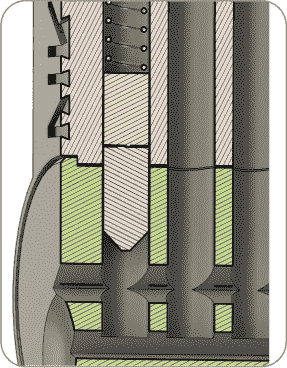

*图 3-17：钥匙销阻止插头旋转*

如果钥匙的切割过深（即钥匙在此位置过短），驱动销将会延伸并从锁芯外部出来，部分地坐落在插头里，如图 3-18 所示。这也是没有插入钥匙时锁的默认状态。在此状态下尝试转动插头会失败，因为驱动销阻止了插头的旋转。

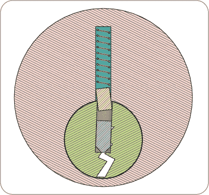

*图 3-18：驱动销阻止插头旋转*

如果钥匙的所有切割都与锁中每个销栈的钥匙销长度正确对应，那么所有的钥匙销和驱动销将在剪切线对齐。此时插头可以自由旋转，锁将打开。如图 3-19 所示。钥匙切割的深度统称为钥匙的*切割*。

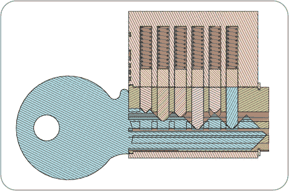

*图 3-19：正确的钥匙将所有六个销栈对准剪切线*

用于描述插销钥匙的钥匙切割的有两组数字：位置和深度。几乎所有插销品牌都将靠近钥匙*头部*或*弯头*（通常用来抓握钥匙的部分）的一次切割称为位置 1，下一个销栈称为位置 2，以此类推。因此，钥匙上的位置 1 对应锁面最靠近的销栈。我们在本书中将使用这种约定。

大多数品牌使用数字 0 来表示最浅的钥匙切割深度（对应最短的钥匙销），而像 5、6 或 9 这样的数字则表示最深的切割深度和最长的钥匙销。因此，像 2-5-3-1-3 这样的码值描述了一把包含五个销栓的锁的钥匙，其中靠近钥匙柄的切割深度为 2，靠近钥匙尖端的为 3。如你所见，一把钥匙可以在多个位置使用相同的切割深度（例如这个例子中的 3）。

图 3-20 展示了一把码值为 1-3-2-5-1-5 的钥匙；销栓堆叠的位置用紫色标注，切割深度用红色标注。

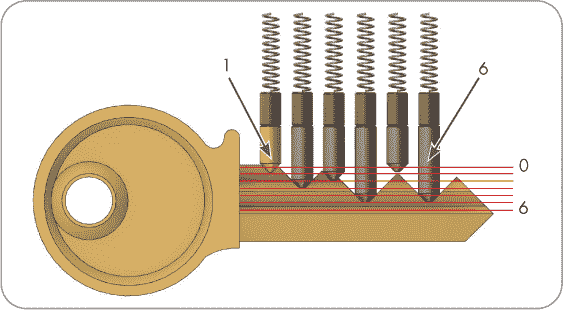

*图 3-20：一把码值为 1-3-2-5-1-5 的钥匙*

**注意**

*切割深度因品牌而异；Kwikset 上的 2 号切割深度不太可能和 ABUS 上的 2 号切割深度相同。切割之间的间距也有所不同。在进行印模、切割钥匙或重新装配锁芯之前，查阅锁具品牌的规格是非常重要的。我们将在第十一章中讨论用于印模比赛的锁具规格。*

插销锁的销栓堆叠数量有所不同。理论上，更多的销栓堆叠意味着更安全的锁，但一把做工精良的少堆栈锁可能比做工差的多堆栈锁更安全。更多的销栓堆叠还意味着你可以拥有更多的独特钥匙，这对于需要多把独立锁的*系统*（例如大型校园的多个锁具安装）尤为重要。通常，在美国，用于家庭的插销锁有五个销栓堆叠，而挂锁有四个，但不同品牌和型号的情况可能有很大差异。在英国，六销锁更为常见。

##### **凹槽锁**

*凹槽锁*的工作原理与插销锁类似，只不过切割是沿着钥匙的宽大平面而不是边缘进行的。这有其优点和缺点。由于平面侧的表面积较大，凹槽锁可以比插销锁拥有更多的销栓堆叠，而无需更长的钥匙。然而，切割深度的限制要大得多，因为这些钥匙通常和插销锁钥匙一样厚。图 3-21 展示了一把典型的凹槽锁和钥匙。

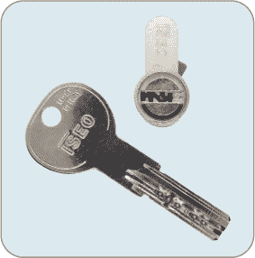

*图 3-21：一把六销凹槽锁和钥匙*

图 3-22 展示了一套具有超过十几个切割的更先进的锁具。

*图 3-22：一把高端欧式剖面圆柱凹槽锁和钥匙*

许多凹槽锁钥匙设计为可逆，意味着它们可以任意一面朝上插入，但这进一步限制了切割深度。因此，尽管许多插销锁有大约 7 到 10 个可能的切割深度，凹槽锁可能只有 2 到 4 个。

##### **管状锁**

*管状锁*的构造与销栓锁相同，只是排列方式不同。销栓堆呈圆形排列，钥匙销栓都指向锁的正面。管状锁的钥匙是一根金属管，钥匙的切口通常在尖端形成圆形槽，如图 3-23 右侧所示。左侧钥匙的切口位于管内。

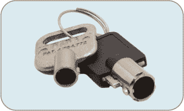

*图 3-23：两种风格的管状钥匙*

管状锁通常出现在自动售货机、加油机和游戏机上；自行车锁和笔记本电脑锁也常常是管状锁。销栓的数量因品牌而异，但像图 3-24 所示的七销栓锁是最常见的（该图中 3 点钟位置的第七个销栓可能不太容易看到）。管状锁有时被称为*Ace 锁*或*Chicago 锁*，因为芝加哥锁公司（现称 CompX）生产了一款名为 ACE（后来是 ACE II）的管状锁，已经流行了几十年。

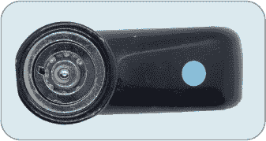

*图 3-24：一个有七个销栓的管状锁*

在 2000 年代初，管状锁因几段视频和新闻报道而声誉扫地，这些报道显示，低端的笔记本电脑和自行车锁只需用便宜的圆珠笔笔芯插入锁眼，就能轻松打开。像 ACE II 这样的优质管状锁不容易受到这种攻击，但“所有管状锁都不好”的观念仍然存在。

虽然管状锁可以用标准的撬锁工具打开，但过程很繁琐，因为你必须在旋转插头时多次撬动每个销栓堆。使用专用的管状撬锁工具，可以保持已撬动的销栓堆位于剪切线位置，操作起来更容易，但价格较贵，因为不同直径的管状锁需要不同的工具。

#### *薄片锁*

*薄片锁*的工作原理与销栓锁类似，但它使用的是扁平的弹簧加载薄片，而不是销栓，这些薄片上下移动，沿着钥匙的表面滑动。每个薄片的顶部和底部都有一小块金属突出物，如果薄片过高或过低，就会阻止插头旋转。图 3-25 展示了一个有五个薄片从顶部突出、并且有一个第六个薄片形状的卡子，后者将插头固定在外壳中的薄片插头。

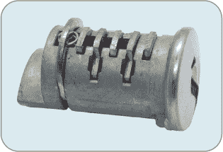

*图 3-25：一个薄片锁插头*

薄片锁通常出现在汽车上，或者在家具上，例如文件柜。低端的保险箱，如大卖场中常见的防火文件箱和现金箱，通常采用廉价的——因此极其不堪的——薄片锁。

比销钉更薄的片式锁可以容纳比同大小的销子锁更多的片片。常见的汽车锁有 10 片片式锁。然而，像凹槽锁一样，片式锁通常仅限于三到四个可能的钥匙切割深度。图 3-26 展示了片式锁芯和钥匙。

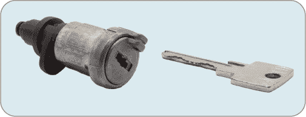

*图 3-26：DOM 片式锁芯和钥匙*

#### *组合锁*

不同于使用钥匙，拨号锁或*组合锁*是通过拨打一系列数字来解锁的。组合锁从常见的便宜挂锁，到用于保护机密政府文件和大型银行金库门的高端安全锁都有。输入组合的方式和内部机制因锁的不同而有所差异，因此我们将重点讨论安全锁——即那些用于防护的高品质保险柜锁，而非你在办公用品商店能买到的便宜、所谓的防火盒子。

安全锁的表盘上有一个旋转盘，你需要顺时针和逆时针旋转它来输入数字组合。这个旋转盘的背后是一个*转盘环*，上面有一个开口索引标记，通常位于 12 点钟位置，用来指示你在输入一个数字后，转动方向改变前应该停在哪里。转盘环通常还有一个更改索引，通常位于 11 点钟位置，如果锁处于组合更改状态，你可以在此输入新的组合。（你首先需要解锁锁，然后将一个特殊的*更改钥匙*插入背面。）图 3-27 展示了转盘和转盘环。

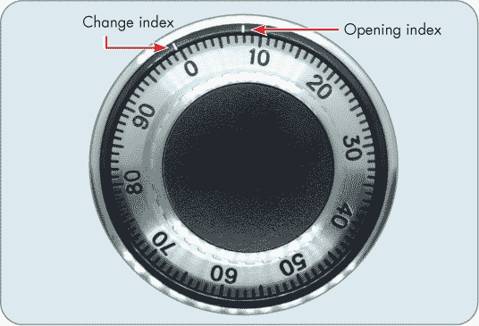

*图 3-27：安全锁的转盘和转盘环*

在锁内，转动表盘会旋转轮组中的轮子。当所有轮子对齐到正确位置时，栅栏会掉入它们的栅门形成的凹槽中。栅栏进入栅门后，继续旋转表盘会拉动与栅栏连接的杠杆，而杠杆又与锁舌连接，最终打开锁。图 3-28 展示了一个剖面安全锁的轮组和栅栏。我们将在第四部分讨论如何打开安全锁。

*图 3-28：展示轮组和栅栏的安全锁剖面*

#### *杠杆锁*

与使用销钉的锁不同，*杠杆锁*使用金属杠杆，这些杠杆通过钥匙来抬起并旋转。每个杠杆上都有一个槽和一个栅门，锁舌上的金属突出部分，叫做*堵头*，会在这些位置停留并通过。当每个杠杆上的槽对齐时，堵头就能穿过，从而解锁门。杠杆锁有挂锁形式，但如图 3-29 所示，插销锁套形式是最常见的类型。

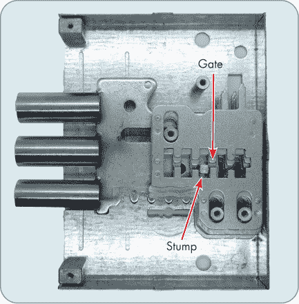

*图 3-29：拆开外壳的俄式插销杠杆锁*

通常，锁具的杠杆越多，它的抗撬性就越强。许多杠杆锁有五个杠杆，虽然也有常见的三杠杆或多达八杠杆的型号。图 3-30 展示了一把钥匙提升锁中的杠杆，如图 3-29 所示。这把锁通常包含八个杠杆，但这里移除了四个，以便更清晰地展示钥匙和杠杆的互动。

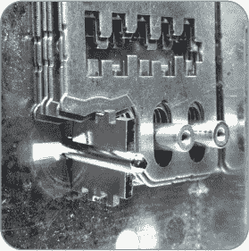

*图 3-30：钥匙提升杠杆的咬合情况*

我们将在第五部分中深入讨论杠杆锁。

#### *带障锁*

*带障锁*与杠杆锁相似，但它们只有一个杠杆用于打开锁。虽然这听起来似乎不太安全，但这些锁也依赖于*障碍物*——锁内的障碍物阻止非钥匙的金属部件激活杠杆。图 3-31 展示了一把带障锁和钥匙。

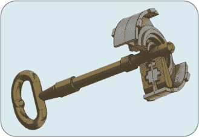

*图 3-31：带障锁及其钥匙*

*万能钥匙*起源于带障锁。万能钥匙的设计理念是尽可能去除材料（只留下钥匙的“骨架”），同时仍然能使钥匙与杠杆接触并打开锁。去除多余的材料增加了钥匙在其他带障锁中工作的可能性，因为可能卡住障碍物的金属已经被去除。

许多旧式带障锁非常精美，具有精细设计的障碍物和钥匙。带障锁至今仍在生产；Master Lock 销售一款带障挂锁，见图 3-32。

*图 3-32：现代带障锁*

尽管带障锁无法与更现代的机制竞争，但它们对于某些应用来说足够用，比如家具锁或者作为多层安全系统的一部分。而且，由于它们的活动部件比大多数其他锁具机制少，它们有时会被用于低安全性户外或工业用途，比如公共公园的照明控制。

由于打开这种简单的锁具不涉及太多技巧，带障锁通常不会出现在锁具竞技中。尽管如此，对带障锁的良好理解对于挑选杠杆锁是有帮助的。我们将在第十五章中进一步讨论它们。

#### *圆盘锁*

最后，*圆盘锁*是一种独特的锁具机制，使用薄的圆形圆盘，类似于薄片锁中的薄片。然而，它与使用弹簧并被抬起的薄片不同，这些圆盘是旋转到位置上的。每个圆盘的外缘有一个小门，类似于保险箱锁轮上的门。若每个圆盘上的门对齐，一个*侧栏*——通常阻止插头旋转的金属条，类似于栅栏——就会掉入凹槽中，插头随之旋转，打开锁（见第七章）。圆盘锁钥匙的咬合设计为一系列角度切割，旨在对齐圆盘。

由于其独特的设计，挑选圆盘锁需要使用专用工具。此外，由于锁具张力方式或钥匙孔形状的不同，不同型号的圆盘锁往往需要不同的工具。每个锁具中的圆盘数量从基础型号中的几个到高端型号中的十多个不等。

圆盘锁定机制出现在一些高质量的自行车锁中、德国 ABUS 公司的一些型号挂锁中，最常见的是 ABLOY 品牌的锁具产品。

**ASSA、ABLOY 和 ASSA ABLOY**

圆盘锁定器最早由芬兰的 ABLOY 锁具公司在 20 世纪初创制并销售。ABLOY 仍然是圆盘锁定器的领先制造商，其高端圆盘锁定器型号，如此处展示的 ABLOY Protec²，被认为是当前市场上最具抗挑选能力的锁具之一。

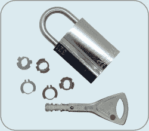

如果 ABLOY 这个名字听起来有点耳熟，那可能是因为瑞典锁具公司 ASSA 在 1990 年代中期与其合并，成立了 ASSA ABLOY 集团。从那时起，ASSA ABLOY 收购了许多其他锁具制造商，包括耶鲁、梅迪科、瓦谢特、联合、洛克伍德、KESO、科宾·拉斯温和 Mul-T-Lock，使其成为世界上最大的锁具制造商之一。

### 摘要

本章介绍了锁具各部分的基本术语，并探讨了这些部分如何在常见的锁定机制中协同工作。在下一章中，我们将研究使锁具具备高安全性或抗挑选能力的专业组件和机制。
