## **高安全性锁具元件**

几乎每个锁具制造商都宣传其锁具的强度和安全性，通常使用像 Master Lock 的“火力下也能坚固”这样的口号来形容普通锁具。但究竟是什么让锁具具备高安全性呢？本章将通过探讨制造商增加到锁具中的最常见元件，以提高其防撬抗性，来回答这个问题。

对于银行、政府、军事和其他有重要安全需求的机构来说，*高安全性*锁具是指在没有正确钥匙的情况下，打开它需要大量的时间和精力。这种锁具能抵抗切割、钻孔、敲击和锯切，甚至可能抵挡子弹、酸液、X 射线和极端温度。每一把锁最终都会在一系列攻击面前屈服；高安全性锁具必须能够抵抗足够长的时间，直到有人注意到漏洞并报警。

作为锁具运动爱好者，我们对锁体、锁栓或锁链的强度不太关心；相反，我们关注的是锁内部机制对撬锁、印痕和解码的抗性。幸运的是，一些锁具设计师在防止撬锁的努力上投入的精力，与他们抵挡钻孔的精力相当，这意味着我们有各种各样的具有挑战性的锁具和有趣的内部构造可以进行解锁。一般来说，锁具的元件越多，撬锁难度就越大。一把高端锁可能有两到三种锁定机制，必须全部破解才能打开。影响锁具防撬抗性的主要变量是*双向作用*（移动）元件——它的销钉、边条、交互元件等——以及锁内的障碍物或复杂的钥匙孔，这些将在第三章中介绍。我们将首先看看这些移动元件。

**注意**

*一些制造商为其高安全性锁具设计了混合电机械锁。这些锁具通常依赖标准的机械元件，再加上附加的电子组件，如射频识别（RFID）标签、蓝牙或红外信号。我们不会研究这些混合系统，因为它们超出了锁具运动的范围，而本书专注于纯机械锁具元件*。

### 偏轴销

决定防撬抗性最显著的因素是防止插芯旋转的部件数量，通常被称为*阻挡元件*。这些通常是销钉。过去，四销和五销锁是常见的。如今，即使是大多数低端门锁也至少有五个销钉，而在欧洲，六销锁更为普遍。一些制造商将销钉数量推向极限，比如瑞士品牌 Kaba；Kaba Penta 大约有 15 个销钉，Kaba 20 则有多达 20 个销钉，且这些销钉来自多个方向！

如果你是初学者，通常会在练习锁中去除一些销。你可能会选择一个一销或二销锁作为第一个挑战，然后随着经验的积累，逐步挑战更多的销（我们将在第五章讨论如何重新布销）。即使是最优秀的挑锁师，也常常在学习如何操作新目标锁时去除部分锁芯，逐渐练习到完整锁的操作。

然而，增加锁中销的数量是有实际限制的。首先，钥匙只能容纳有限数量的切割。你不能显著增加钥匙的长度，因为没人愿意携带超过约 6 厘米（约 2.5 英寸）长的钥匙。你也不能大幅减少销的尺寸以容纳更多切割，因为销变得太弱，无法防止*暴力攻击*——通常是用螺丝刀或钳子强行旋转锁芯。

**注意**

*并非所有制造商都回避长钥匙。Mauer 的 Redline 系列中的一些锁使用的钥匙大约是典型钥匙长度的两倍。这些锁是双面的欧洲型圆筒锁，但为了打开锁，钥匙必须同时作用于圆筒的内外部分！更多细节请参见 Barry Wels 的《Mauer Locking Systems Thinking Outside the Box》* ([`blackbag.toool.nl/?p=42`](https://blackbag.toool.nl/?p=42))。

为了绕过这些限制，制造商通过将销放置在锁芯的其他轴上来增加销，利用未使用的空间。这种方法有两种常见的做法：使用侧销和使用陷阱销。

#### *侧销*

*侧销*，有时称为*指销*，通常比标准销小，或形状与标准销不同（参见图 4-1）。

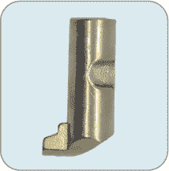

*图 4-1：Schlage Primus 锁的侧销*

正如其名称所示，侧销并不位于主切割线（12 点钟或 6 点钟位置）。图 4-2 展示了它们在某一型号锁中的位置。

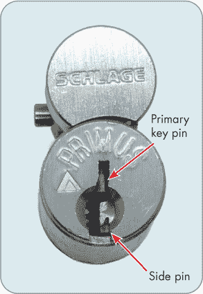

*图 4-2：一把 Primus 锁，突出显示了主钥匙销和侧销的位置*

与钥匙的主切割面互动不同，侧销检查额外的切割，通常位于针式锁的钥匙刀片的宽面，或凹槽锁的钥匙窄边上。图 4-3 展示了在图 4-2 中的 Primus 锁上，侧销检查的切割位置。

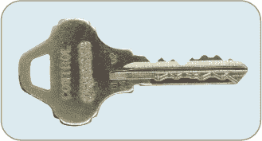

*图 4-3：Schlage Primus 钥匙刀片上的侧切割，突出显示为红色*

侧销几乎可以放置在锁的任何地方。BEST Cormax 系列在钥匙孔后面有一个侧销，钥匙的尖端上有相应的切割。澳大利亚锁具公司（Australian Lock Company）的 BiLock 品牌有一些型号在锁面上有两个侧销。最常见的带有侧销的锁包括 Schlage Primus（如图 4-1 至图 4-4 所示）和 ASSA Twin 系列。

图 4-4 显示了拆解的 Schlage Primus。

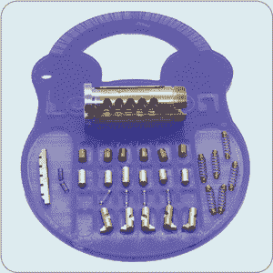

*图 4-4：拆解的 Schlage Primus，显示插头底部，五个侧销插入的地方*

这些销除了增加开锁的难度外，还有多种用途。它们可以增加大型锁系统中的可能锁和钥匙排列组合的数量，并且有助于为锁系统增加新的专利。它们还可以用于将一些高安全性的锁添加到现有的锁系统中，因为带有这些额外切割的钥匙通常仍然能在没有侧销的锁版本中使用。

**注意**

*许多高安全性锁依靠专利防止第三方制造钥匙空白，从而限制授权销售商可用钥匙的供应，直到专利过期。由于在锁的各种攻击中，如打击成像，需要使用空白钥匙，限制钥匙供应能增强锁的安全性。当专利即将到期时，通过对锁和钥匙做一些改动，例如增加侧销，可以让公司获得新的专利，并重新开始计算专利有效期*。

#### *陷阱销*

*陷阱销* 就是这样——一个锁匠的陷阱。它们是额外的一排驱动销，通常位于主销几度的位置。陷阱销会永久禁用已经被撬开的锁，即使之后有人尝试使用正确的钥匙，也会触发警报，提醒锁主有未经授权的访问尝试。带有陷阱销的锁在当对高安全性的需求超过更换锁的麻烦时非常有用。

陷阱销的工作原理很简单。当你用钥匙转动带有陷阱销的锁的插头时，钥匙会将钥匙销保持在剪切线位置。然而，当你使用开锁工具转动插头时，没有钥匙来固定钥匙销的位置，所以它们会在销孔内移动。与该销孔对齐的陷阱销可以射入其中，阻止插头旋转。

但为什么不能简单地撬开陷阱销，使插头旋转呢？与驱动销不同，在正常操作中，陷阱销永远不会进入插头中的销孔——它们始终静置在插头上，靠钥匙销支撑。这意味着制造商可以通过将它们放置在奇怪的角度、制作成不寻常的形状或尺寸，或给它们不同的弹簧重量，使它们比典型的驱动销更加难以处理。所有这些因素结合起来，使得陷阱销变得极难破解。

判断是否存在陷阱销可能很困难。锁具的正面甚至其钥匙通常不会给出任何提示。经验丰富的挑锁者可能通过经验或研究知道某个品牌和型号包含陷阱销，但否则，最好的方法是在锁具未安装时查看。如果存在陷阱销，你应该能看到锁具圣经两侧的附加销栈。与通常设置在与主销栈垂直的 90°位置的侧销不同，陷阱销通常只与主销栈相差几度，并且销栈较少，如图 4-5 所示。它们通常比标准驱动销小。

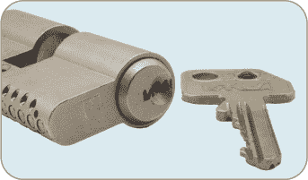

*图 4-5：一把带有一排陷阱销的 GTV 品牌锁，见于圣经中*

大多数人不希望在有人试图挑开他们的锁时被锁在外面，因此幸运的是，陷阱销并不常见。

### 安全销

制造商提高锁具防撬性的另一种方法是将标准销更换为*安全销*（也称为*防撬销*或*防挑销*）。这些销具有独特的形状，使它们更难以被撬开。销子价格便宜，通常设计为可更换，以便重新配钥匙，而且仅仅改变销子的形状就能大大增加挑锁的难度，而无需对锁具做其他改动。通过这种方式，锁具公司可以以仅需几分钱的制造成本，提供现有锁具的高安全版本。（尽管这些销子的材料稍少，但由于需要额外的制造步骤，它们的生产成本较高。）

安全销可以是驱动销、钥匙销，或者两者兼有。一些制造商将它们放置在一个或两个销栈中，而另一些则几乎在每个销栈中都使用它们。它们有多种形状，但我们将重点介绍通常使用的设计。

#### *线轴销*

最常见的安全销是*线轴销*，因其外形像一个小线轴：顶部和底部宽大，中间切有一个大凹槽，如图 4-6 所示。线轴销通常用作驱动销，已经变得非常普遍，甚至便宜的商店品牌的死锁中也常包含一到三个线轴销。

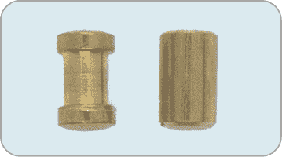

*图 4-6：一个线轴驱动销（左）与一个标准驱动销（右）*

线轴销能有效减缓初学者和中等技术水平的挑锁者。它们可以使销栈进入*假设*状态，在这种状态下，插芯会稍微转动，仿佛该销栈已经被正确挑开，实际上却没有。这发生在你将线轴销提起到剪切线的一部分，进入圣经中时，插芯正在施加张力，因为线轴销中的凹槽使它能稍微倾斜转动，且其更宽的顶部和底部会在插芯和圣经中*卡住*（被卡住或卡住），如图 4-7 所示。

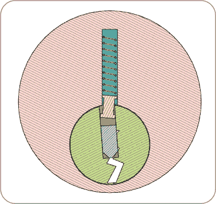

*图 4-7：假设设置中的线轴销*

初学者可能会把这种微小的旋转误认为是正确设置了销堆，但假设设置错误时发生的插头旋转远大于销堆正确设置时的旋转量。为了克服这种处于阻塞位置的线轴销，你必须减轻张力，允许插头*反向旋转*——稍微向锁定位置回转——同时继续提升线轴销并使其从卡住状态中释放出来。这是一个棘手的过程，因为反向旋转过多会重置所有销堆，意味着你必须重新开始。我们将在第七章进一步讲解这一技巧。

锁具中不应包含所有的线轴销。如果包含所有线轴销，插头就能在任一方向上旋转几个度数（如同线轴允许的旋转量），这可能会干扰钥匙的使用。因此，依赖于线轴的锁通常在至少一个销堆中使用标准驱动销。在高安全性锁具中，这种标准驱动销通常由硬化钢制成，而不是常见的黄铜，以提高防钻能力。

#### *锯齿形销*

几乎与线轴销一样常见的是*锯齿形销*，它上面有几个非常小的槽，比线轴销的中央槽要浅得多（如图 4-8 所示）。

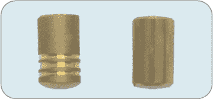

*图 4-8：一个锯齿形驱动销（左）和一个标准普通驱动销（右）*

锯齿形销不像线轴销那样会绑定，而是在被提升时反复卡住锁芯，产生你张力工具上的小“咔嗒”声，这可能会给你造成销已经设置好的错觉。这个卡住的过程让你感觉锁中有灰尘或颗粒，哪怕它是新的。

尽管锯齿形销通常用于驱动销，但一些美国品牌的挂锁以及一些较新的 ABUS 锁也将它们用于钥匙销。一些制造商将锯齿形销和线轴销结合使用，使开锁更加具有挑战性。

一些锁具制造商还会在锁芯的插销腔体中进行*反向铣削*（切割螺纹），尽管这种设计在商业锁具中并不常见。这些螺纹会卡住锯齿形销，使其更难提升。

#### *凿尖销*

一种比较有趣的安全销是*凿尖销*，它存在于大多数 Medeco 锁具中，如 Biaxial 和 M3。典型的钥匙销呈钝尖或细尖状，类似圆珠笔或铅笔的笔尖，沿着钥匙齿形表面滑动。在大多数 Medeco 锁中，钥匙销的尖端呈角度状，像凿子一样，如图 4-9 所示。

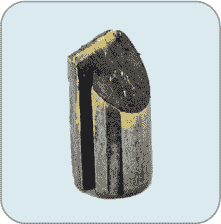

*图 4-9：Medeco 双轴销*

其目的正如名称所示 *双轴*：这些锁检查钥匙的两个维度，而不是一个。凿尖销钉不仅需要提升到正确的高度，还需要在锁内旋转到正确的方向。因此，钥匙上的切口并不是垂直于刀刃，而是以不同的角度制作，以便销钉的凿尖能够落入其中。图 4-10 显示了 Medeco 钥匙的侧面，从这个角度来看，它与许多其他钥匙相似。

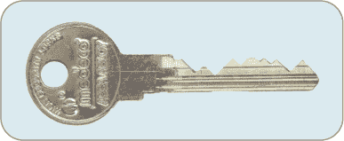

*图 4-10：Medeco 双轴钥匙的侧视图*

然而，当你从上方查看钥匙时，如图 4-11 所示，你可以看到一些切口的角度不同。

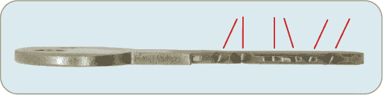

*图 4-11：Medeco 双轴钥匙的顶部视图*

这些销钉上刻有相应的垂直凹槽，用来检查旋转。当它们对齐时，插芯内会有一个侧条进入这些凹槽。我们将在本章稍后讨论侧条。

#### *销钉中的销钉*

最终需要介绍的安全销钉设计是*销钉中的销钉*，或称*伸缩销钉*。这些销钉可以替代典型的驱动销或钥匙销（或两者），由一个空心管状销钉包围一个更细的销钉。图 4-12 展示了一组伸缩驱动销和钥匙销。

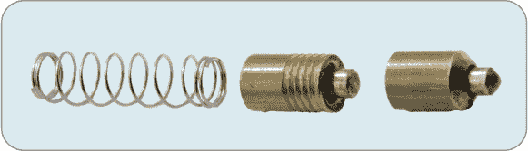

*图 4-12：来自 Mul-T-Lock 的一个销钉中的销钉堆叠；从左到右：弹簧、内外驱动销和内外钥匙销*

要设置这个销钉堆叠，必须将内外销钉都提升到正确的高度。销钉中的销钉几乎只出现在凹面锁上，如高端的 Mul-T-Lock 和 KESO 锁，在这些锁中，可以在较大的凹面中心钻一个第二个切口。你可以在图 4-13 中的 Mul-T-Lock 钥匙上看到典型的销钉中的销钉的同心圆形切口。

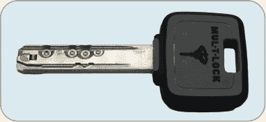

*图 4-13：Mul-T-Lock 凹面钥匙，带有甜甜圈形状的销钉中的销钉切口*

在图 4-14 中，这把钥匙插入其切割锁中并旋转，展示了插座和插芯中的嵌套销钉。

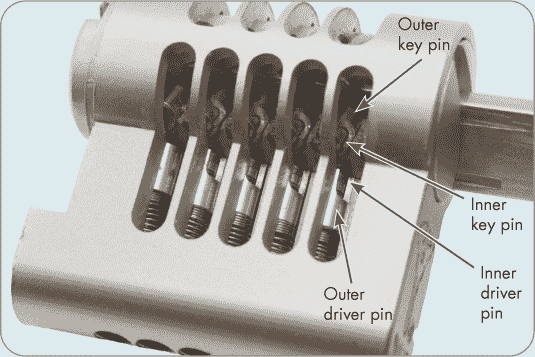

*图 4-14：Mul-T-Lock 的切割展示，显示销钉中的销钉*

#### *其他销钉形状*

蘑菇、炸弹、子弹、桶和酒瓶有什么共同点？它们的形状激发了各种安全销钉的设计。任何在挑锁过程中提供不寻常或不一致反馈，但在用钥匙操作时仍然表现良好的形状，都有可能增加锁的防挑阻力。

喜欢在锁具中添加一些奇思妙想的人可以在市场上找到新奇的销钉形状。SPARROWS 锁具挑选器销售的驱动销钉形状如棋子、弹药，甚至圣诞树和雪人，所有这些都是由著名的英国锁匠 Lock Noob 设计的。虽然这些销钉可能不适用于广泛使用，但它们确实达到了在开锁时提供不同反馈的目的！这些销钉的几个示例在图 4-15 中展示。

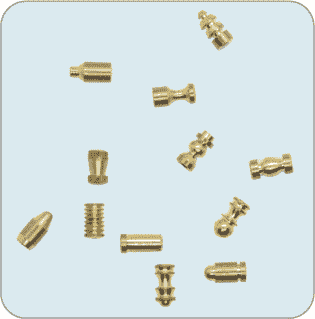

*图 4-15：各种特殊销钉*

### 边条

在典型的销钉锁中，驱动销钉和钥匙销钉共同阻止插芯旋转，从而防止锁具打开。许多高端锁具更进一步，增加了一个边条。如第三章所解释的，*边条*是一根贯穿插芯长度的金属条，放置在外壳的凹槽中。当插入正确的钥匙时，插芯上有一个相应的槽，边条可以掉入其中，从而允许插芯旋转。图 4-16 展示了一个在切割锁内部的已接入边条。

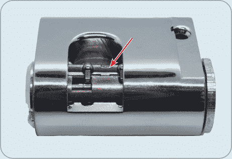

*图 4-16：BiLock 切割锁，显示已锁定的边条*

图 4-17 展示了插入钥匙后释放边条的相同锁。

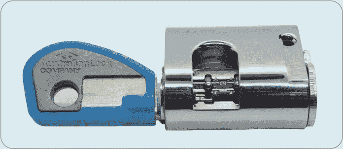

*图 4-17：与图 4-16 相同的锁，插入钥匙后，释放边条进入插芯*

阻止边条掉入插芯的机制取决于锁具。像前面展示的 Schlage Primus 这类带有侧销的锁具，通常由这些销钉阻止边条，直到它们被正确设置。在图 4-4 中拆解的 Primus 锁中，边条是插芯盘左侧的有缺口的金属条。这些缺口与图 4-1 中展示的侧销上的槽对接。边条安放在图 4-4 中，插芯顶部附近的长黑色缝隙中。

许多其他锁具也有边条。在 Medeco Biaxial 中，边条在所有销钉旋转到正确角度时被释放。一些锁具，如 BiLock 和 Medeco 品牌的凸轮锁，根本不使用驱动销钉。相反，钥匙销钉和弹簧完全包含在插芯内部，钥匙销钉侧面的凹槽与边条（或 BiLock 的两个边条）接口，作为主要的锁定机制。

另一种常见的边条机制是*滑块*。钥匙上的轨道操作本质上是一个微小的晶片锁，它会阻止边条，直到切口对齐。Mul-T-Lock MT5、M&C Condor 和 Yale Superior 都是带有滑块和边条的凹陷锁，而 M&C Matrix 则是一个五销钉五滑块的销钉锁。图 4-18 展示了一把带有滑块轨道的钥匙。

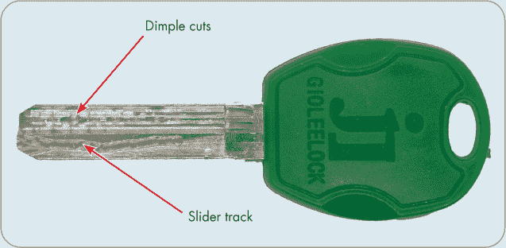

*图 4-18：带有滑块轨道的凹陷锁钥匙*

我们将在第七章中进一步讨论滑块。

### 斜槽和中心钥匙槽

向锁具中增加更多部件是提高防盗能力的有效方法，但它也增加了制造和维修的复杂性和成本。一个更简单的方法是让挑锁工具更难接触到锁芯的针脚。为此，制造商会在插芯上增加内齿，或制造形状独特的钥匙槽。

如第三章所述，*内齿*是为了防止非正常钥匙形状的物体插入或旋转锁具的金属突出物。内齿可以限制挑锁工具的空间。在一些特别不幸的情况下，挑锁工具可能会被卡在内齿中，难以取出而不损坏工具。

非均匀或旁心钥匙槽的内齿与槽的中心线交叉，呈现出锯齿状外观。虽然许多钥匙槽在技术上是旁心的，但高安全性的锁具中的旁心钥匙槽通常极为复杂，内齿间距狭窄且角度急剧。开锁时使用这种钥匙槽需要非常薄的挑锁工具（这些工具反馈较少，价格更高，且更容易断裂），并且需要多种张力工具来找到一个能完美匹配、不易弹出或填充有限空间的工具。

许多著名的锁具都使用旁心钥匙槽。Medeco KeyMark 锁具主要依靠它们的钥匙槽提供超越标准针状锁芯的额外安全性。它们的钥匙槽，其中一个如图 4-19 所示，形状异常，以至于乍一看，锁具就像是被人用手工具攻击过。

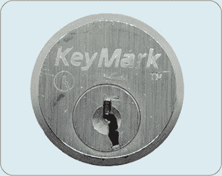

*图 4-19：KeyMark 锁具中的旁心钥匙槽*

ABUS 也制造复杂的钥匙槽，其中一个看起来像是在拼出*ABUS*（图 4-20）。许多主要品牌至少提供一个旁心钥匙槽，包括 ASSA、BEST、CISA 和 Lockwood。

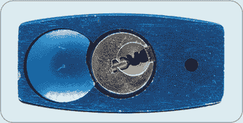

*图 4-20：一把带有 ABUS 钥匙槽的 ABUS 72 挂锁*

旁心钥匙槽的制造成本较高，因为插芯需要更多的加工工具通过加工。此外，钥匙空白的成本也更高，可能会因钥匙空白上铣出的槽口而变得更加锋利或脆弱。因此，旁心钥匙槽通常仅用于高端锁具。

### 互动式关键元素

锁具的内部机制并不是制造商可以改进的唯一安全因素。一些品牌已经开始在钥匙中加入互动式或可移动的元素，这些元素会在操作过程中被锁具检查。这些互动功能有多重目的。

首先，它们使非法的钥匙复制变得困难。如果你看过足够多的间谍电影，你可能见过特工将钥匙压入粘土中，然后通过将低熔点金属倒入模具中来复制钥匙。但使用这些互动元素时，这是不可能的。即使是 3D 打印机，也可能很难重新创建它们。

其次，这些元素可以使撬锁变得更加困难。根据设计，使用交互钥匙的锁可能只需用撬锁工具提升一个额外的销钉，或者可能需要在撬锁过程中进行几个操作。

最后，锁具制造商通常希望延长现有产品线的使用寿命。添加一个新的交互元素可以为新专利提供理由，使制造商能够继续限制钥匙空白的供应，从而继续将锁具销售为高安全性产品。

许多高端品牌使用交互元素，尤其是 ASSA ABLOY 拥有的品牌。其 Mul-T-Lock 品牌在 1994 年推出了带有活动凹坑元素的 Interactive 产品，该元素使得一个销钉堆栈比正常情况下更高。ABLOY 当前的顶级产品 Protec² 配备了一个位于钥匙头部旁边的滚珠轴承，随着钥匙的转动，滚珠轴承会移动（见 图 4-21）。

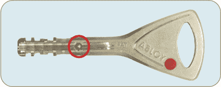

*图 4-21：带有可移动滚珠轴承的 ABLOY Protec² 钥匙*

ASSA ABLOY 的 KESO 品牌在其 8000Ω² 系统的钥匙内部有弹簧加载的销钉（见 图 4-22）。这些销钉从钥匙的两侧微微突出，并且已获得专利，专利有效期至 2034 年。

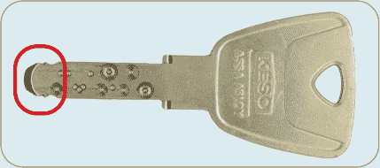

*图 4-22：带有活性销钉的 KESO 8000Ω² 钥匙*

除了 ASSA ABLOY 外，BiLock 品牌也在某些产品中加入了交互元素。其 NG 和 QC 系列在靠近钥匙头部的位置包含一个可 pivot 的杆。根据不同型号，这个部分会释放侧条或插芯保持机制。

### 磁铁

磁铁被多家锁具品牌使用，从 Avocet ABS（使用一个简单的磁铁拉动销钉而不是压下销钉）到 EVVA MCS（使用八个磁性转子，是目前最安全的锁具之一）。(想象一下你目前读到的几乎所有交互元素，再加上一个磁铁！)

在 MCS 系统中，每个钥匙上的磁铁“药丸”（见 图 4-23）在插入钥匙时旋转转子。每个转子都有一个门，一旦所有的门对齐，两个侧条会收回，从而允许插芯转动。

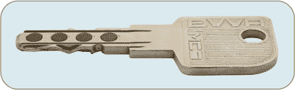

*图 4-23：带有四个圆形磁铁药丸的 EVVA MCS 钥匙*

图 4-24 展示了一个切割的 EVVA MCS 锁。

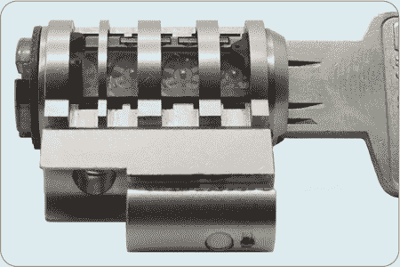

*图 4-24：插入钥匙的切割 EVVA MCS 锁。转子是带辐条的轮子*。

幸运的是，带有磁铁机制的锁具超出了你在比赛中通常会遇到的范围。

### 总结

在本章中，我们回顾了锁具制造商可以在锁具中添加的一些增强功能，以使其更难以被开启。这些功能包括形状奇特的销钉、旁边杆、偏心钥匙孔和带有互动元素的钥匙。在下一章中，我们将开始进行实际操作，讨论所有锁具运动爱好者应该了解的基本锁具维护程序——包括拆解、重装和重新装配销钉。

## 锁具运动爱好者的锁具维护**

尽管锁具运动爱好者对锁具的工作原理有很好的理解，但我们所做的和锁匠所做的之间还是有很大区别。锁匠需要担心如何正确安装锁具硬件、修理损坏的机制、计算主钥匙系统、复制钥匙、处理锁具故障和维护锁具。

我们应该把锁匠工作留给专业人士。然而，锁具维护的某些方面对锁具运动爱好者来说是有价值的，比如拆解锁具以更好地理解其机械原理、重新装配销钉使锁具更容易或更难被开启、拆解后重装锁具以及在锁具操作困难时进行润滑。锁具运动爱好者最终会积累相当数量的锁具，每次想尝试不同的钥匙形状或更换一些高安全性销钉时，专业服务显然不太实际。

**警告**

*就像我们建议你不要开锁你自己拥有的仍在使用中的锁具（例如家门锁），我们也建议你不要为自己正在使用的锁具进行维修。你不想冒险损坏任何重要的东西。专业的锁匠可以确保不仅是你的锁具，甚至它所附着的物体都能正常运作*。

本章重点介绍针式锁具，因为它们最常见，并且通常可以由用户自行维护。

### 拆解锁具

拆解锁具在锁具运动中有多种用途。你可能想要检查锁内使用的销钉类型，若锁具出现故障则更换部件，或重新装配销钉（在下一个章节中介绍）。许多锁具运动爱好者会在 YouTube 及其他视频平台上，在开锁后立即拆解锁具，以证明锁具没有被篡改。

锁具通常包含许多小部件，这些部件往往受到弹簧的压力。你拆解的第一把锁应该是便宜的，并且配有容易获取的备用零件，以防在拆解过程中丢失任何部件。

#### *有用工具*

在拆解锁具之前，你需要准备一些工具。某些工具可以在五金店找到，所有工具都可以在专门的锁匠网站上购买——不过有些网站不会向非专业人士销售。请参见附录 B，查看销售锁具工具给业余爱好者的供应商名单。

##### **螺丝刀**

锁具常常有一些通过螺丝固定的部件，比如凸轮。你需要一套合适的平头和十字螺丝刀，尺寸多样，以便拆卸这些部件。同时，购买一套六角扳手，因为一些厂家更倾向于使用六角螺丝，而非标准螺丝。

##### **镊子**

拥有一副不错的镊子非常适合拾取和放置小零件。我们建议投资一副*钉子镊子*，如图 5-1 所示，它的尖端有凹槽或弯曲，用于夹持圆柱形物体，如销钉和弹簧。

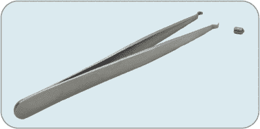

*图 5-1：钉子镊子*

##### **插销跟随器**

由于锁内部的零件承受弹簧张力，快速拔出插销可能会导致弹簧和销钉四处飞散。为了避免这种情况，使用*插销跟随器*（图 5-2），这是一种小的塑料或金属管，插入插销后方，以保持所有零件到你准备逐一取出销钉时都固定好。插销跟随器应该与要移除的插销大小相同，因此最好选择一个包含多个尺寸的套件。如果你有 3D 打印机，可以在线找到各种插销跟随器的设计，例如来自 Harley Ross（WestCoastPicks）的设计，网址为[*https://www.thingiverse.com/thing:2981544*](https://www.thingiverse.com/thing:2981544)。

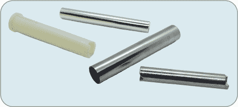

*图 5-2：各种尺寸和材质的插销跟随器*

##### **钉子鞋**

对于双面欧式轮廓的气缸锁，你不能使用插销跟随器，因为锁的另一半会挡住位置。相反，你可以使用一种钉子固定工具——通常被称为*钉子鞋*——来固定驱动销，在移除插销时防止它们松动。钉子鞋是一种长而薄的金属条，带有弹簧加载的底座，能适配锁体底部。这种工具在美国不容易找到，但你可以用坚硬的金属线（例如旧雨刮器片的一段）自制。图 5-3 展示了商业钉子鞋，以及 Thomas Wenzel 在 redcatimaging 制作的 3D 打印版本（[ *https://www.thingiverse.com/thing:2457469*](https://www.thingiverse.com/thing:2457469)）。

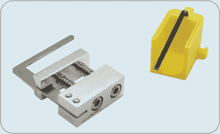

*图 5-3：一款商业钉子鞋（左）和一款 3D 打印钉子鞋（右）*

##### **钉子托盘或垫子**

在拆解锁具时，你需要组织好各个零件，以便记住它们的位置。你可以将每个零件放在*钉子托盘*或垫子上，这些托盘通常有编号的槽位，帮助你追踪每个销钉和弹簧来自哪个销钉堆。网上有许多适合 3D 打印或激光切割的小型钉子托盘设计。图 5-4 展示了由著名锁匠 Datagram 设计的激光雕刻托盘，它还在 2019 年作为 LockCon 大会的名牌。

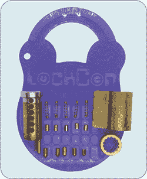

*图 5-4：激光雕刻的钉子托盘，内含拆解后的 KIK 气缸*

你也可以将一块瓦楞纸板的顶部层剥掉，利用其凹槽来固定销子，如图 5-5 所示。

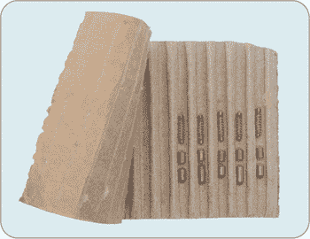

*图 5-5：瓦楞纸板：世界上最易获取的定销托盘*

如果你的工作台空间足够大，可以考虑购买一个大型商业定销垫，这样你就可以同时处理多个锁具。锁匠和锁具制造商的网站通常以 15 美元或更低的价格出售这种垫片。

##### **弯曲垫片**

*弯曲垫片* 是一片薄钢箔，你可以将其从圆筒后部滑入插芯和锁体之间，用来固定插芯中的钥匙销和锁体中的驱动销。这个工具帮助你开启那些你尚未能撬开的锁，因为你可以逐个设置销子。它还确保在拆解高安全性锁时不会发生卡顿。如果找不到专业的锁匠垫片，可以尝试撕开视频游戏盒上的小安全标签；它们里面有两小片金属箔，比锁匠的垫片稍微脆弱一些（见图 5-6）。

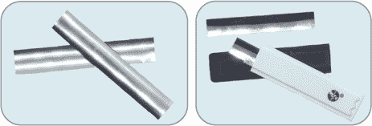

*图 5-6：两种专业垫片（左）和从安全标签中取出的临时垫片（右）*

##### **卡簧拆卸器**

一些品牌的锁——主要是欧式圆筒锁——使用*卡簧*或*C 型卡簧*（一种扁平的、C 形的金属片）来固定插芯。虽然你可以用平头螺丝刀或钳子将其撬开，但这样做通常会弯曲并损坏卡簧。相反，我们建议使用*卡簧拆卸器*，这是一种小型爪形刀片，可以在不扭曲卡簧的情况下移除它们（见图 5-7，上方）。SPARROWS Lock Picks 还销售一种多功能锁具工具，叫做 Gut Wrench，它有用于拆卸和安装 C 型卡簧的凹槽（见图 5-7，下方）。另外，一种用于从计算机键盘上拆卸按键的键帽拔取器，也可以用来拆卸 C 型卡簧。

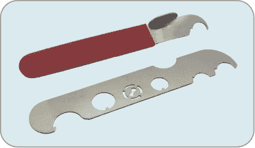

*图 5-7：卡簧拆卸器（上）和多功能 SPARROWS Gut Wrench（下）*

##### **台钳**

尽管并非绝对必要，将锁固定在台钳中可以让某些步骤更容易执行。台钳释放了你双手的工具使用空间；然而，由于有几个步骤需要翻转锁具，你可能会发现台钳不一定比它的价值更方便。

接下来，我们将讲解拆解锁具的步骤。当你拆解不熟悉的锁时，锁匠 Peter South (@yakMedic) 建议将锁放入一个大号塑料拉链袋中并在袋子里拆解。这样，任何松散的零件很可能留在袋子里，而不会丢失。

#### *步骤 1：解锁并移除锁芯*

如果你的锁当前安装在门上、挂锁本体或其他类型的安装架上，先将其拆下来，这样你就只剩下锁芯可供操作。这个过程因锁的不同而有所变化，但通常需要解锁并拆卸一个或多个固定圆筒的螺丝。如果你正在拆解一个可更换核心的锁（SFIC 或 LFIC），则使用提供的控制钥匙将核心从外壳中取出（或者挑锁，尽管将每个销钉堆调整到正确的高度以释放控制插头可能会非常棘手）。

**注意**

*大多数廉价的挂锁无法由用户重新配钥或维修。然而，一些高端挂锁具有可拆卸核心——通常使用 IC 圆筒，或包含一个微型 KIK 风格的圆筒，通过一个螺丝固定在挂锁的底部孔内*

要从外壳中取出插头，必须先解锁锁芯，可以通过使用钥匙或挑锁的方式。一般来说，方法无关紧要，唯一例外是：如果你正在处理一个双面欧洲型圆筒，并且想要*解码*锁芯——精确查看每根销钉所在的腔室——你需要挑开它，而不是使用钥匙。

如果你可以访问没有钥匙的圆筒的背面，可以通过垫片打开锁。使用挑锁工具将所有销钉完全抬起；然后从后方将垫片滑入插头与外壳之间，刚好位于锁体下方。保持对垫片施加一点压力，同时降低最远端的销钉堆，你会发现垫片滑入切割线——但要确保它没有被卡在安全销钉里（即确保垫片能完全滑入下一个销钉堆）。如果在挑锁时将垫片留在那里，那么七销锁实际上就变成了六销锁。如果继续进行此过程，你可以轻松地将一个非常难开的锁变成一个临时的五销锁，挑开它，然后将垫片推进一个位置，作为四销锁继续挑开，依此类推。

**注意**

*我们强烈建议在拆解挑战锁或带有特殊销钉的锁（例如 Mul-T-Lock Interactive 或带有陷阱销钉的锁）时，始终使用垫片。某些锁的销钉直径为 2.3 毫米，较薄，容易卡在插头背面的 C 型夹槽中。使用垫片可以避免这些卡住的问题！*

#### *步骤 2：定向插头*

一旦解锁后，需要注意如何旋转插头。当锁被解锁（或完全开启）时，钥匙销钉被固定在插头内，而驱动销钉和弹簧则位于锁体内。因此，如果你将插头旋转至钥匙销钉朝下然后取出，销钉会掉落并四散开来。

在拆解 KIK、边缘或门锁圆筒时，将插头旋转 90°，然后将圆筒侧卧，使插头朝上，如图 5-8 所示。

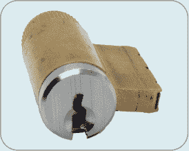

*图 5-8：一个 KIK 圆筒，插头已从锁定位置旋转 90°*

对于欧式圆筒锁，将插芯旋转 180°，使插芯底部位于 Bible 位置，如图 5-9 所示。

*图 5-9：一个欧式圆筒锁，插芯已从锁定位置旋转 180°*

#### *步骤 3：拆除插芯固定机构*

接下来，你需要拆除固定插芯在外壳内的部件。固定机构因锁的类型而异。在插芯式圆筒锁中，通常是一个通过小螺丝固定的凸轮。拆下这些螺丝即可释放插芯。

对于 KIK 和边缘圆筒锁，插芯的后部稍微复杂一些。它们的插芯端部有螺纹，并且配有一个相应的螺纹盖，像螺丝上的螺栓一样起作用。但插芯在锁定或解锁时的旋转会松动或过度拧紧盖子。为了防止这种情况并确保盖子与插芯同步移动，插芯后部有一个弹簧销，称为 *盖销*，它从插芯后端伸出并夹入盖子的凹槽中，如图 5-10 所示。

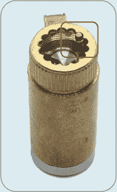

*图 5-10：KIK 圆筒锁后部，盖销突出显示*

要拆下盖子，使用挑选工具或小型螺丝刀按下盖销；然后，在防止插芯旋转的同时，逆时针旋转拧开盖子（参见图 5-11）。

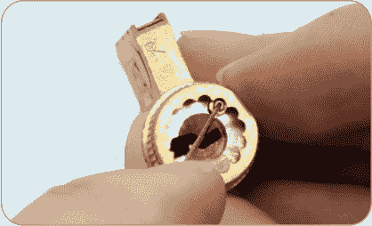

*图 5-11：用挑选工具按下 KIK 圆筒锁盖销，同时旋转盖子*

小心操作，因为如果盖销释放过快，它可能会飞出。专业的圆筒盖拆卸工具可以使这个过程稍微容易一些，但如果你不是频繁拆解这些圆筒，一般不值得购买。盖子拆下后，使用镊子取出盖销及其弹簧，并将它们放在一旁。你可能需要将锁上下翻转并轻轻敲打才能将弹簧从插芯中取出。

**注意**

*KIK 外壳的两侧可能看起来对称，但通常并不是。最外侧的一个销孔通常比另一个更靠近外壳的边缘。记住外壳的前面，以便重新组装时避免麻烦*。

对于双面欧式圆筒锁，通过小心地将 C 型卡簧拆卸器的爪子插入卡簧的缝隙，并撬动直到卡簧部分滑离插芯，如图 5-12 所示。

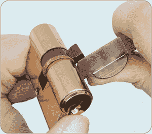

*图 5-12：使用卡簧拆卸器撬开 C 型卡簧*

然后使用卡簧拆卸器或一对钳子抓住卡簧暴露部分，将其完全拆除，如图 5-13 所示。

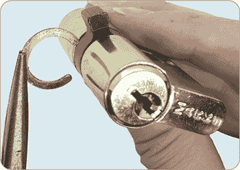

*图 5-13：用钳子移除松动的 C 型卡簧*

#### *步骤 4：安装定位鞋（仅适用于欧式圆筒锁）*

如前所述，你需要一个销钉鞋来保持驱动销在位置上，同时从双面欧式圆柱锁中取出插芯。如果插芯中有钥匙，你就无法将销钉鞋插入锁中，因此如果是这种情况，请将钥匙留在插芯中，并跳过到步骤 5。否则，将销钉鞋的刀片插入钥匙槽底部，按下所有驱动销进入插芯外壳。将销钉鞋的底部滑入锁体的底部，使其稳固地固定在位置上（见图 5-14）。

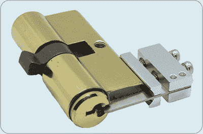

*图 5-14：带销钉鞋插入以保持驱动销的双面欧式圆柱锁*

#### *步骤 5：移除插芯*

现在你可以开始取出插芯及其钥匙销了；这个过程根据锁的格式不同而有所变化。我们从双面欧式圆柱锁开始。

##### **对于双面欧式圆柱锁**

如果你使用钥匙解锁了欧式圆柱锁，请将锁定位置调整为圣经朝下，然后缓慢地将钥匙从锁中拔出——插芯会随之一起拔出。由于没有销钉鞋固定销钉，驱动销和弹簧会从插芯外壳弹出并掉入插芯的腔室。一旦插芯从锁体中拔出一半，就换成直接用手指拉出，而不是继续用钥匙。小心插芯接近锁体末端时，因为驱动销和钥匙销会掉出来。对于双面欧式圆柱锁，你将使用插芯跟随器来移除第二个插芯，稍后会进行描述。

对于已经解锁的双面欧式圆柱锁并且安装了销钉鞋的情况，过程会有所不同。在第一侧，使用一个挑锁工具抓住一个钥匙销，或者将工具楔入插芯和凸轮之间的位置，即 C 形夹所在的地方。目标是将插芯从锁体中拉出足够的距离，以便抓住并将其拉出来（如图 5-15 所示）。

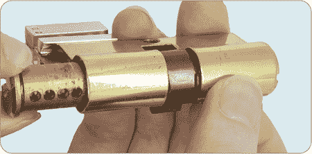

*图 5-15：从双面欧式圆柱锁的一侧拉出插芯的俯视图*

当你拉出插芯时，确保将其定位，使得钥匙销朝上，以免掉出来。与销钉鞋一起附带的跟随器有一个缺口，这样你可以在销钉鞋仍然到位时插入跟随器，然后再移除销钉鞋。跟随器比销钉鞋更安全，不容易被意外碰移。

一旦你完全从双面欧式圆柱锁的一侧取出插芯，就可以使用跟随器拆解第二侧，无论它是如何解锁的。将凸轮从锁的中心滑出，并移除第二个插芯的 C 形夹。将跟随器穿过锁的空侧，然后按照“对于其他圆柱锁”的说明继续。你也可以按照这些说明操作，如果你正在处理一个*断裂*的双面欧式圆柱锁（即在凸轮连接处断裂的圆柱锁）。

**注意事项**

*断裂的锁芯在一些锁匠收藏中很常见，因为锁匠通常有一桶废金属，里面装满了从更换旧锁时拆下的零件，他们通常很乐意以废金属的价格将这些零件卖给锁匠爱好者。这是一种廉价的方式来获得练习锁，并且可以为锁匠省去一趟回收中心的路程*。

##### **对于其他锁芯**

对于 KIK、圆环和门锁芯，你需要使用插头推动器将插头推出外壳。推动器会把驱动销和弹簧固定在锁芯内，以便你能逐个取出它们。在步骤 2 中描述的锁壳和插头的朝向下，将推动器放在插头的背面。如果你的推动器有切口，确保切口没有对着锁芯。用一只手保持插头前端的压力，另一只手推压推动器，直到插头从外壳前端冒出来（如图 5-16 所示）。

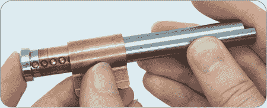

*图 5-16：插头推动器将插头推出其外壳*

继续操作，直到插头完全从锁内拔出，并且推动器稍微从锁壳的前端突出出来，如图 5-17 所示。不要立即取出推动器！

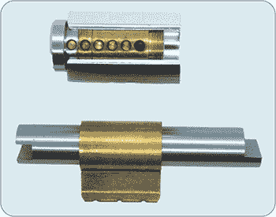

*图 5-17：锁壳中的插头推动器（底部）和插头上的钥匙销（顶部）。这个插头只有六个销孔中的五个被填充，这是使用与高安全性模型相同外壳的低安全性锁上很常见的情况*。

#### *步骤 6：倒出钥匙销*

现在你已经取出了插头，可以接触到钥匙销。将它们有序地倒出来最简单的方法是，将拇指放在销孔上，排除掉最远离插头前面的最后一个销孔。在销盘上将插头翻转过来，如果需要，可以轻轻拍打（旧锁可能需要稍微用力些）。销子应该掉入销盘中。用镊子将销子放入销盘的最后一个销孔位置。

将拇指向后滑动，暴露出插头上的第二个销孔，然后重复此过程。对插头中的每个销孔进行此操作，如图 5-18 所示。

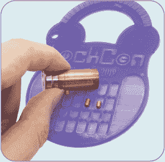

*图 5-18：将钥匙销从插头中倒出*

#### *步骤 7：释放驱动销和弹簧*

如果你打算重新配钥匙，可以在此停止拆卸过程，因为钥匙销必须与钥匙的齿形匹配，并且许多锁的每个销堆使用相同长度的驱动销。然而，如果你想看看驱动销长什么样（好奇制造商在给你带来麻烦的销堆里放了什么样的安全销？）或者需要更换弹簧，继续进行此步骤。

**平衡销堆**

虽然许多品牌的驱动销长度是一致的，但并非所有品牌都是如此。有些锁具使用*平衡销堆*，这意味着驱动销和钥匙销长度之间存在相关性：长钥匙销与短驱动销配对，反之亦然。重新配钥这些锁具需要同时更换驱动销。

平衡销堆有助于减少长钥匙销的销堆弹簧上的压力。想象一下，一把钥匙在尖端附近有一个非常浅的切口，而在锁头附近有一个非常深的切口。相应的锁具会在前部有一个长销，需要将其推到锁身内部，以允许浅切口更深入地进入插芯。这不仅会加速前端销堆弹簧的磨损，而且可能使钥匙很难插入。平衡销堆还可以阻止一些高级攻击，例如通过仔细测量销堆并将其推到锁身顶部来解码锁具。非平衡销堆中的驱动销长度一致，而平衡销堆中的不同驱动销长度则不会提供相同的线索。

平衡销堆锁具的驱动销长度通常不像钥匙销那样多样；通常它们会有短、中、长三种驱动销，每种驱动销会与两到三种钥匙销长度搭配使用。这使得锁具配件套件在价格和体积上都稍微减少了。

为了释放驱动销和弹簧，将锁定放置，使得锁身底部朝下。用主手持钳子，非主手慢慢开始拉出插芯跟随器或配销鞋，并开始暴露出锁身中第一个销孔，其中固定着驱动销和弹簧。当销孔几乎完全暴露时，用钳子按住销并逐渐释放，如图 5-19 所示。

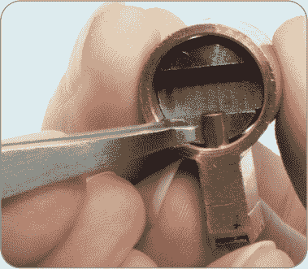

*图 5-19：释放驱动销*

一旦第一个驱动销被释放，用钳子将其放置在你的配销托盘上。如果弹簧从孔中突出，轻轻用钳子抓住它并将其取出。如果没有，仔细将锁翻转并轻敲桌面以松动弹簧。

重复这个过程，直到所有的销堆都被清空，并且跟随器或鞋子也从锁中取出。恭喜！你已经完全拆解了一个锁。

### 重配锁具

*重配销*，或称为*重新配钥*，是重新排列或更换销子，以使不同的钥匙能够打开锁。虽然锁匠可能因为钥匙丢失而进行重配销，但锁具运动爱好者出于其他原因进行此操作。

其中一个原因可能是构建一个*渐进锁具集合*，它包含几个同型号但难度逐渐增加的锁。例如，你可以购买五个每个都有五个销栈的 KIK 圆筒锁，然后从第一个锁中去掉四个销，从第二个去掉三个销，依此类推。这样，你可以先练习用只有一两个销的锁，逐步提升到五销锁。

另一个原因是改变锁具的齿形。改变销的排列方式可以显著改变锁的难度。例如，像 1-5-1-5-1 这样的交替高低齿形，比像 3-2-4-3-2 这样的逐渐变化齿形更具挑战性。即使你没有适用于该锁的备用销，你也可以重新排列现有的销。

你可能想要重新排销锁具，使其成为*挑战锁*：锁匠故意修改的锁，使其更难开启。挑战锁可能包含定制销、不标准的弹簧或反加工。它们并不被设计用于经常使用，因此可能包含像木头或玻璃这样的不寻常的销材料。

重新排销在锁的现有销或弹簧损坏时非常有用。随着某些部件的磨损，锁变得更难开启。虽然大多数锁具设计时考虑到可以承受成千上万次的开锁操作，但锁具设计师并没有考虑到在开锁过程中遭遇的重复性力量。

在重新排销一把锁之前，问问自己以下问题：

+   我是否有备用销用于这把锁？（如果没有，你只能重新排列旧的销，但这仍然是一个很好的练习。）

+   我是否想要让这把锁能用现有的钥匙打开？

+   我是否想要添加安全销？

+   我希望使用多少个销栈？

+   我是否想要特定的钥匙齿形（例如从高到低、从低到高，或交替排列）？

**注意**

*一个容易开启的锁应该包括标准销，使用较少的销栈，并避免使用非常长或非常短的钥匙销。而一个有挑战性的锁则应该使用各种类型的安全销，利用每个销栈，并采用高低高低交替的钥匙销模式*。

一旦你回答了这些问题，选择合适的销并将其按顺序排列在销盘中，准备放入锁体。如果你正在使用已有的钥匙，将它放在垫子上，直观地观察需要哪些销。你也可以使用卡尺或*钥匙量规*（一块带有凹槽和标签的金属片，用于快速识别钥匙上的切割）来确定正确的销尺寸，之后在重新组装的第 3 步中进行确认。

如果你要更换驱动销，请将新的驱动销按钥匙销子上方的顺序排列在销子托盘上。如果你正在组装的锁使用平衡销子堆，确保使用适当长度的驱动销，可以通过查阅该系列锁具的制造商规格表来确认这一点。一些特别有用的参考网站是密歇根州锁匠安全协会的技术手册库（[*https://lsamichigan.org/tech_manuals.html*](https://lsamichigan.org/tech_manuals.html)）。

如果使用弹簧驱动销，请确保至少有一个是标准的；否则，插头会漂移几个角度，并且当插入钥匙时，锁芯可能会卡住。最后，如果你要移除销子堆以制作一个渐进式锁芯，请移除与已移除钥匙销子相对应的任何驱动销和弹簧，否则当你重新插入插头时，驱动销会射入插头中。图 5-20 展示了一个选定的销子托盘，其中包含与现有钥匙匹配的钥匙销子和驱动销。

*图 5-20：一个选定的销子托盘，包含与钥匙匹配的钥匙销子和驱动销*

**MACS**

*最大相邻切割规格（MACS）*指的是制造商针对特定型号的锁和钥匙所制定的可接受切割规则。这些规则规定了钥匙上两个相邻位置的切割之间可以有多大的差距。MACS 可以防止制作或使用某些钥匙时出现潜在问题。特别深的切割可能会从钥匙中去除过多的材料，以至于两侧的切割不能很浅。所有的插销钥匙切割都是 V 形的，因此插销必须沿着一定的坡度滑动，坡度过陡时钥匙将无法插入，甚至更糟，无法取出。

如果你只是为了挑锁而重新排列锁具，MACS 不太重要。但是，如果你想为该锁制作一个可用的钥匙，请在重新排列之前确认该品牌的 MACS。并不是所有锁具制造商都有 MACS，因此某些品牌的锁允许任何形状的切割。

### 重新组装锁具

要重新组装锁具，你基本上是按照拆解步骤的反向操作进行的。幸运的是，大多数步骤比拆解时要容易。确保你拥有拆解时使用的相同工具。

#### *步骤 1：插入弹簧和驱动销*

要将弹簧和驱动销重新插入锁的圣经中，你需要外壳、弹簧和驱动销，以及插头引导器和销子镊子。一个好的光源，比如桌灯，会帮助你更清楚地看到锁体内的情况。

从靠近锁后端的销子堆开始，这与钥匙的尖端相对应。（如果在构建此锁时跳过了一些销子堆，你将需要跳过与省略的销子堆相等的腔室数，将插头引导器推过那些孔。）

**注意**

*KIK 锁的前后外壳不可互换；如果不确定，请确保插头上的孔与圣经中的腔室位置对齐*。

将插芯跟随器插入外壳的后部，滑入足够远以停止在填充最远销堆的腔体之前。如图 5-21 所示，使用镊子将弹簧放入腔体中。

*图 5-21：将弹簧插入插芯*

使用镊子夹住驱动销的一端；不要抓住中间部分。将其放入腔体中，压下弹簧，但不要松开镊子，否则销钉会从腔体中飞出。相反，推动插芯跟随器向前，将压力施加到销的背面，以将其固定到位。一旦固定，松开镊子，使用镊子的尖端推销的顶部，使插芯跟随器能够滑过销钉并将其卡在外壳中，如图 5-22 所示。

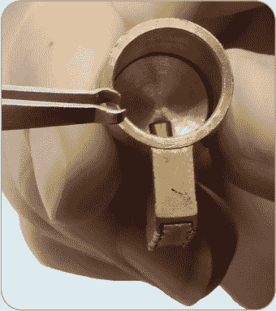

*图 5-22：在插芯中安装驱动销*

深呼吸！这一步是重新组装中最困难的部分。如果第一次没有做对也没关系；我们每个人都曾追过逃脱的销钉。一旦第一个驱动销到位，重复此过程，直到填充最前面的腔体。

#### *第 2 步：填充插芯*

拿起插芯、钥匙销和镊子。在每个你计划使用的腔体中，放入一个钥匙销（见图 5-23）。与大多数驱动销不同，钥匙销有顶部和底部，因此要确保将尖头或圆头的一面朝下放入插芯——这是帮助销钉沿钥匙的凹槽运行的。钥匙销的平面应该朝上，这样当正确的钥匙插入时，插芯表面才会平滑。

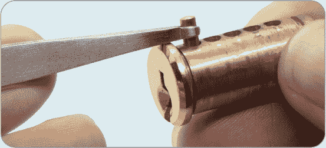

*图 5-23：将钥匙销放回插芯中*

如果你不是使用每个销堆，确保你正在填充第 1 步中放入驱动销的相同腔体。没有对应的钥匙销的驱动销几乎肯定会使锁无法工作。

#### *第 3 步：检查钥匙*

如果你有一把想在这个锁上使用的钥匙，现在是检查你工作成果的时候；如果没有，跳过此步骤。小心地将钥匙插入插芯，确保不要让任何销钉掉落。销钉会上下移动，但如果你将插芯销孔朝上并缓慢插入钥匙，它们不应该掉出来。为了确保销钉保持到位，你可以在插入钥匙时用手指轻轻覆盖销钉的顶部。

如果你已正确匹配钥匙销和钥匙，当钥匙完全插入时，每个销的顶部应该与插芯表面平齐（见图 5-24）。任何突出于插芯表面之上的销都是该腔体过长。任何位于表面下方的销则过短，你需要换一个大一号的销。一旦所有销钉看起来都正确，继续进行第 4 步。

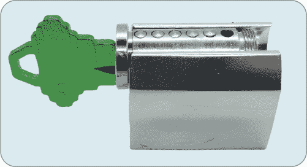

*图 5-24：带有匹配钥匙的插头中的钥匙销钉。此钥匙的切口并不完美——中间的销钉稍微偏低，靠近钥匙尖端的销钉稍高——但它们仍在锁具的公差范围内，因此锁和钥匙可以正常工作*。

#### *步骤 4：插入插头*

就像你在拆卸时使用插头跟随器推出插头一样，现在你将使用插头推出插头跟随器。小心地将锁体转到一侧，使得锁芯中的销钉与插头中的钥匙销钉旋转 90°。如果插头跟随器的末端有一个缺口，确保它旋转到一个位置，使得缺口不与锁芯相对，否则驱动销钉可能会掉出来。

慢慢地用插头的后端将插头跟随器推出锁芯，直到插头的前端靠在外壳前部。不要让插头和跟随器之间有任何间隙，否则驱动销钉可能会弹出。当驱动销钉从跟随器上滑动到插头上时，你可能会感觉到几次点击，但它们不应该卡住。如果有必要，你可以使用垫片来顺利地引导插头入位。对于 T 形驱动销钉或较薄的 2.3 毫米标准销钉，这尤其有帮助。

如果你使用的是双面欧式轮廓气缸，替换锁芯中间的凸轮，该凸轮位于两个插头之间。凸轮由两部分组成：凸轮本身和与两个插头背面配合并与凸轮连接的离合器。将离合器插入其中一个插头；然后将凸轮滑入锁芯中间的切口，并旋转凸轮，直到它与离合器对齐，两部分拼合在一起，如图 5-25 所示。（在锁定之前，再次确认凸轮没有旋转 180°—请参见下一部分。）

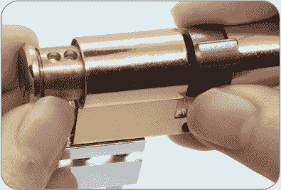

*图 5-25：将插头和凸轮重新插入欧式轮廓气缸*

#### *步骤 5：锁定锁具*

如果前面的步骤都顺利进行，你可以锁定锁具，这样更容易安装插头保持机构。将一个转动工具（任何锁具套件中都包括）或任何小型的平金属片插入插头的前部，旋转它直到钥匙和驱动销钉对齐。你应该能听到“咔哒”一声，表示插头已锁定到位。

对于双面欧式轮廓气缸，确保凸轮已旋转到正确的位置——凸轮的条形靠近锁芯，稍微偏离中心几度——然后再锁定两个插头。否则，凸轮可能会被卡在锁芯顶部的位置，距离应该的位置 180°，这就是所谓的*凸轮滑脱*。虽然对于用于锁具运动的锁来说，这并不是什么大问题，但凸轮滑脱会导致锁无法在门上使用。

#### *步骤 6：安装插头保持机构*

现在，锁具的主要部分已经组装完成，您可以将插芯固定机制重新安装到外壳中。此时，插芯被驱动销固定，但如果锁具用钥匙或挑锁工具打开，插芯将直接滑出。插芯锁是最简单的：只需重新安装后端凸轮，使用固定它的螺钉。

对于 KIK 或边缘圆柱锁，您需要重新安装盖子。确保弹簧和盖销位于插芯的后部。将盖子放在插芯的后部，并使用挑锁工具或一字螺丝刀，插入盖子中央的孔中，按下盖销。按下销钉后，将盖子旋转到插芯上。一旦盖子紧固，松开盖销并旋转盖子，直到销钉锁定到位。盖子可能会被拧得过紧或过松：过紧时，即使使用正确的钥匙，锁也无法顺畅转动；过松时，插芯将在外壳内前后移动。按下盖销并根据需要调整盖子。

对于欧式型材圆柱锁，您需要重新安装 C 型卡环（图 5-26）。确保它们仍然平整，并且在拆卸过程中没有被弯曲。如果它们受损，您可以用钳子重新塑形，或者购买替换件。找到锁背部的槽口，将卡环推回插芯上，直到它们卡入位置。

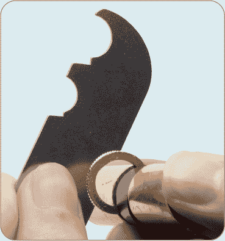

*图 5-26：使用 SPARROWS 固定扳手重新安装 C 型卡环*

#### *步骤 7：测试它*

所有部件重新组装完成后，进行最后的检查。如果您有钥匙，它是否能正常使用？如果是双面锁，钥匙是否能在两侧都使用？如果将挑锁工具插入锁具，您是否能感觉到已安装的销钉堆正确移动，并且感觉有弹性？如果是这样，太好了。

如果锁具感觉有点僵硬，检查插芯固定机制是否正确安装。如果一切看起来正常，但您在转动插芯时仍然感觉到某些销钉的阻力，可能需要添加润滑剂。

### 润滑应用

润滑是锁具维护的重要组成部分。锁具有很多部件，应该自由移动而不被卡住。由于锁具经常暴露在外界环境中，且钥匙可能带入灰尘和污垢，因此它们需要不时地添加一些润滑剂。

当锁具在使用钥匙时难以操作，销钉堆难以抬起或在挑锁时感觉粗糙，或者即使在挑锁后，扣环仍然卡住时，应随时添加润滑剂。首次将使用过的锁具添加到您的收藏时，给它们润滑也是一个好主意，尤其是当它们在户外使用过时。

关于锁具润滑剂的种类有很多争论。在选择润滑剂时，请记住以下几点：

+   尽量使用专门宣传用于锁具的润滑剂。

+   润滑剂可以是湿润型或干燥型的。两者都可以使用，但不能混合。一旦你为锁具选择了某种类型的润滑剂，就不要再反复更换（除非你完全拆解锁具并用溶剂浸泡以去除原有的润滑剂）。

+   基于石油的水 displacement 型润滑剂，例如 WD-40，永远不是锁具的好选择。它们会吸引和困住灰尘，并可能留下粘性残留物，从而需要反复使用，这会进一步妨碍锁的功能。

+   像椰子油或烹饪喷雾这样的有机/食用润滑剂会迅速降解，绝不应在锁具上使用。

+   石墨不是理想的润滑剂，因为它很脏乱。只有在锁具制造商推荐（且之前已经使用过）的情况下才使用它，例如 BiLocks 锁具。

+   永远不要混合石墨和油基润滑剂；它们会形成固体，堵塞锁具。

对于湿润型润滑剂，我们推荐 Houdini Lock Lube、GT85 和 Tri-Flow Superior Lubricant。对于干润滑剂，一个很好的选择是 PTFE 粉末，这种化合物用于制造特氟龙涂层。它具有很好的润滑特性，不会使锁具变粘。它还是 Tri-Flow 和 GT85 的主要成分。

你可以通过将锁具放置在书本侧下，喷洒或挤压润滑剂到钥匙孔中，并插入钥匙或耙式开锁工具多次，以便将润滑剂作用到锁具机制中。对于特别僵硬的锁具，可能需要拆解以彻底清洁和润滑难以接触的地方。

对于安全锁具，通常推荐少量类似脂肪的润滑剂，以保持所有活动部件的顺畅。S&G 使用并推荐在其机械安全锁的内部部件和锁栓上涂抹一层非常薄的 Shell AeroShell Grease 22。如果你使用的是其他类型的润滑脂，确保它与锁具中使用的所有材料（通常包括黄铜、锌、钢甚至一些塑料）兼容。如果涂抹后润滑脂明显可见，说明你使用了过多。

### 总结

在本章中，我们讨论了每个锁具工作者都应该知道的基本锁具维护知识：拆解、重新拼装、重新布置销钉以及正确润滑锁具。接下来我们将转到第二部分。为了让你了解开锁技巧，我们将讨论*为什么*锁具能被开锁，以及开锁过程的基本原理。

## 第二部分

## PIN TUMBLER 开锁技巧

要学习如何开锁，首先需要理解锁具的工作原理以及如何能成功开锁。我们在第一部分中介绍了锁具的工作原理，现在我们来讲第二个问题：锁具机制的漏洞，这些漏洞使得锁具可以被开锁。那么，究竟是什么让开锁成为可能呢？

如你所见，挑销锁包括将每个销堆与切割线对齐，以便插头能够旋转，锁得以打开。但你如何判断销堆是否已经与切割线对齐，并在继续操作其他销堆时如何保持它们在对齐位置？我们将在第二部分的介绍中回答这些问题，帮助你在第六章到第八章中应用这些知识。

### 元素绑定顺序原理

每个锁都有微小的、无意的制造缺陷。例如，考虑以下图像，它显示了销是如何从其原始状态，即*线材*，切割出来的。

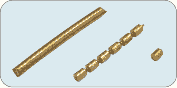

锁的线材厚度可能从上到下略有不同，或者锁壳和插头上钻孔的位置可能不完全直。无论制造缺陷的具体情况如何，总有一个销会稍微粗一些，或者稍微偏离中心，这样它会先与锁壳接触，从而阻止插头转动。这个销被称为*绑定*销，或*阻塞*销。挑锁需要找出哪个销当前正在绑定，并将其*设置*，或者将其与切割线对齐。设置第一个销会导致第二个销绑定，设置第二个销会导致第三个销绑定，依此类推，直到你设置所有销并打开锁。这被称为*元素绑定顺序原理*，它使得挑锁成为可能。

**注意**

*元素绑定顺序原理几乎适用于任何机械锁，包括凹槽锁和杠杆锁。元素可能是销、滑块、杠杆或圆盘。看起来似乎不可能每把锁中都有这些缺陷，但事实上它们确实存在。制造商之间的公差差异很大，但即使在最昂贵的锁中，销的厚度和位置也会有细微差异，这些差异会导致当你施加张力时，其中一个销会绑定。*

必须设置销的顺序取决于缺陷的位置。由于这些缺陷并非在制造时故意加入，它们在每把锁中都会不同，你无法事先知道这个顺序。除非你按特定顺序设置销，否则锁是无法打开的。你需要学会感受哪个销是第一个绑定的。

### 感觉绑定销

要体验绑定销的感觉，收集一个锁、一个张力工具（如图上方所示）和一个挑锁工具（图下方）。

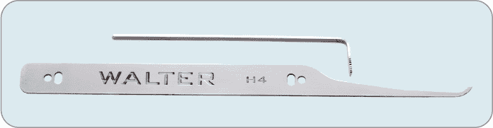

我们将在第六章中详细解释如何使用这些工具，但现在，只需将张力工具插入钥匙孔，并施加一点张力在锁芯上，尝试轻轻旋转插头。由于元素绑定顺序原理，一个销堆会开始绑定，但你还不知道是哪一个。

使用你的开锁工具推压第一个销钉堆，感受弹簧的张力。你是否感觉到销钉堆随着弹簧的力量被推回？还是你需要更大力气才能推动销钉？如果你对第二个问题的回答是肯定的，那么这种额外的摩擦是销钉与外壳之间的摩擦，表明你正在移动卡住的销钉。如果你只感觉到弹簧张力，那就继续移动到下一个销钉堆，直到你找到摩擦更大的那个。

### 固定销钉位置

在实际开锁时，一旦你找到第一个卡住的销钉并将其推到与剪切线对齐的位置，你必须保持对插芯的张力，以便将销钉固定在外壳中。如果你释放了张力，弹簧会使销钉弹回到默认位置，锁就会重置。

以下插图展示了一个正确位置的销钉堆；你可以看到驱动销已经无法弹回插芯。插芯尚未旋转打开，因为仍有更多销钉堆卡住，但只要你保持对插芯的张力，销钉就会保持在剪切线位置。

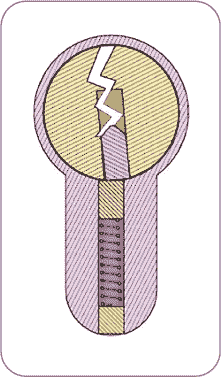

出于演示目的，这张插图故意夸大了开锁时插芯的旋转量。实际上，旋转非常微小，你可能看不见它，但当销钉到位时，你会在工具中感受到一种“咔哒”声。

第七章详细介绍了开锁过程以及当你正确设置销钉时所能感受到的反馈。然后，为了结束本书的第二部分，我们将在第八章中引导你准备参加开锁比赛。首先，然而，是时候熟悉各种开锁工具以及如何使用它们了。

## 针式锁开锁工具**

在本章中，你将了解基本的开锁工具以及用于非常规锁具的更专业工具。我们还将简要讨论开锁枪。你至少需要一个针式锁来进行练习；任何锁都可以，只要它不在使用中（以防损坏）。你还需要一个基础的开锁工具包，里面包含几把张力扳手、钩子和梳子。大多数初学者套件都包括这些工具。

### 张力扳手

*张力扳手*通常是一条金属条，一端弯成 90°角。你将弯曲的端插入插芯，并用手指按住长端，施加一点力使插芯略微旋转，以便在处理其他销钉时将已设置好的销钉固定在原位。当所有销钉都就位时，你可以使用张力扳手完全打开锁。

张力扳手有多种形态、尺寸和材质。不锈钢是最常见的材质，但有些扳手是用弹簧钢制成的，这种材质让它们更容易弯曲。弹簧钢扳手适用于那些需要较小张力即可开启的锁具，但可能不适用于更坚硬或重型的锁具。

图 6-1 展示了两种典型的张力扳手，都是由不锈钢制成的。

*图 6-1：基本的张力扳手*

选择张力扳手时需要考虑的一个因素是它提供的反馈量。例如，图 6-1 中的底部扳手有一个扭曲，当你施加压力时，长端会稍微弯曲。这可以让你清楚地感知自己使用的力量，因此在处理更精细的锁时非常有用。直线型扳手比较坚固，反馈较少，但对于需要较大张力的坚硬锁具来说是有帮助的。你选择哪种张力扳手通常取决于你自己感到舒适的类型，所以尝试两种不同的扳手来看看哪一种更适合你是值得的。

张力扳手还可以根据不同形状的钥匙孔，提供不同的长度、宽度和厚度。例如，欧洲的锁具通常比美国的锁具钥匙孔要小，因此它们需要更薄、更小的张力扳手。图 6-2 展示了两种尺寸差异较大的张力扳手。

*图 6-2：不同尺寸的张力扳手*

凹槽锁通常需要较厚的方形张力扳手，因为钥匙孔非常宽。图 6-3 展示了专门为凹槽锁设计的扳手，旁边是一个常规扳手。

*图 6-3：用于凹槽锁的张力扳手（上）*

*平面张力扳手*是一块金属片，末端呈弯曲形状，而不是像常规扳手那样与手柄呈 90°角。平面张力扳手的厚度决定了其刚性。一些插头需要比其他插头更多的力量才能转动，这时可能需要更硬的张力扳手。

图 6-4 中的平面张力扳手两端都有弯曲，实际上提供了两个张力扳手。两端还带有锯齿，以便扳手能更好地抓住插头。

*图 6-4：一款平面锯齿张力扳手*

虽然大多数张力扳手都很简单，但也有一些更专业的版本，如图 6-5 中展示的那样。左侧的张力扳手专为管状锁设计，这种锁常见于自动售货机中。右侧的张力扳手则用于薄片锁，如汽车上的锁；它能抓住钥匙孔的两端，中间留出空间用于撬锁工具。

*图 6-5：用于管状锁（左）和薄片锁（右）的张力扳手*

**注意**

*在写作时，管状锁和片锁并不包括在任何比赛项目中，尽管它们可以是一个有趣的个人挑战*。

在比赛中带上各种张力扳手是非常有用的。在从一个锁转换到另一个锁时，即使其他工具保持不变，换扳手也是很常见的。

**自制张力扳手**

你可以用一块平金属片制作自己的张力扳手。锁匠发现，汽车挡风玻璃雨刷的长钢条效果很好；你可以试着向汽车配件商店或汽车维修中心请求一些废弃的雨刷条。将金属切割成所需长度，使用两把钳子在末端弯曲成 90°角。如果你喜欢，也可以把长端扭转。如果金属太硬而无法弯曲，可以用火焰加热使其变软。形状调整好后，使用细砂纸抛光金属的边缘。

你可以利用其他废金属制作不同形状和厚度的张力扳手。例如，路边找到的破损扫街刷毛是锁匠们的另一个常用材料。

### 梳子工具

*梳子工具*通过快速来回滑动的动作，将销子推到正确的位置；有时甚至可以在一次梳动中将多个销子设置好。梳子大致有两种类型：*山形梳*，其顶部有锯齿状的尖峰，以及*蛇形梳*，其形状像圆弯的波浪。图 6-6 显示了左侧的两把山形梳和右侧的四把蛇形梳。这些形状旨在模仿钥匙的齿形。

*图 6-6：来自不同供应商的梳子*

**注意**

*出于比赛目的，我们建议你专注于掌握单销挑锁技巧，而不是梳子技巧（参见第 92 页的“挑锁工具”）*。单销挑锁是一种可重复操作的技巧，而梳子技巧通常涉及一定的运气。不过，掌握梳子技巧意味着有时你可以非常快速地打开锁，这可能是一个优势*。

像张力扳手一样，开锁梳也有多种材质。硬度和厚度不仅会影响价格，还会影响你使用工具的方式。较薄的梳子更贵，且容易弯曲，但在钥匙孔狭窄或弯曲的锁中效果很好。较厚的梳子更便宜且更坚固，但如果施加过大力度，可能会断裂。如果你的预算允许，建议选择较薄的梳子，因为它们适用于更多种类的锁。

梳子应配有某种手柄，以避免裸露的金属在使用时割伤手。图 6-7 展示了几种手柄。

*图 6-7：梳子手柄*

将梳形工具的齿和手柄从一块金属中切割出来，如图 6-7 中间的梳形工具，这在以前是常见的做法。然而，这种梳形工具使用起来不太舒适，现在已经比较罕见。为了提高舒适度，你可以将手柄包裹在胶带或橡胶管中，如电子产品中常用的热缩管，但直接购买一个带有合适手柄的梳形工具更为方便。

最后，我们简要提到两种你可能不会经常使用的工具：博哥塔挑锁工具和梳形工具，它们是由一位名为 Raimundo 的锁匠发明的。原始版本的工具有卷曲的手柄，如图 6-8 顶部所示，或者是作为张力扳手的直手柄，材料包括钢和钛合金。博哥塔挑锁工具有一个尖峰，而梳形工具有三个锋利的尖峰。现在，几家制造商也提供类似风格的梳形工具，例如图 6-8 底部所示的 Multipick 梳形工具，它有两个尖峰，并且在锁打不开、时间紧迫时，一些锁匠会将其作为最后的手段使用。

*图 6-8：原版博哥塔挑锁工具和梳形工具（分别位于顶部和中部），以及 Multipick 的博哥塔风格挑锁工具（底部）*

### 挑锁工具

*单针挑锁*，即一次对齐一个针脚的技巧，通常被认为是锁匠技艺的真正体现。为此，你需要使用像图 6-9 所示的挑锁工具；其中大多数是*钩形工具*，它是金属直条的一端弯曲或弯曲成钩形。你将工具插入钥匙孔内，推动每个针脚，直到它被推到足够深的位置，与剪切线对齐。当所有的针脚都设定到正确的位置时，锁就会打开。挑锁工具的材料、厚度和大小各不相同，以适应不同类型的锁。

*图 6-9：各种形状的单针挑锁工具*

工具的厚度影响其灵活性以及挑锁时通过狭窄钥匙孔的能力。在欧洲，常见的厚度为 0.6 毫米和 0.4 毫米，而在美国，常见的厚度为 0.025 英寸和 0.018 英寸。较薄的挑锁工具通常被称为*欧洲挑锁工具*，因为狭窄的钥匙孔在欧洲更为常见。图 6-10 展示了宽钥匙孔和窄钥匙孔的对比。

*图 6-10：宽钥匙孔（左）和窄钥匙孔（右）*

虽然这些锁的钥匙大致相同厚度，但右侧的钥匙孔有多个突出物，工具必须绕过这些突出物才能按下针脚。在这种情况下，较薄的挑锁工具适合狭窄的钥匙孔，而宽钥匙孔则可以用任何类型的工具打开。

挑锁工具的大小也有不同，以适应不同深度的针脚。你选择的钩形工具的大小取决于几个因素。对于特定类型的锁，你只有几种可能的针脚长度，它们与钥匙上的切口相对应。最长的针脚与钥匙上最深的切口匹配。

长钥匙销只需要稍微移动一点，所以小钩子就能胜任。另一方面，短钥匙销需要移动得更远，以便对应的驱动销能通过剪切线，可能需要一个更大的钩子来深入销堆。较大的钩子还可以推动后面的销，而稍微弯曲的挑锁工具则可能做不到这一点。然而，较大的钩子在钥匙孔中占据的空间较大，这使得在狭窄的钥匙孔中操作更加困难，或者无法绕过较长的销。

最大的钩子有时被称为*gonzo 钩子*，这个名字来源于木偶剧《大鸟贡佐》（Gonzo the Great）中的鸟喙（图 6-11）。

*图 6-11：一个 gonzo 钩子（上）与普通钩子（下）放在一起*

Gonzo 钩子非常大，只有在某些罕见的情况下才会派上用场，比如当一个需要深度推动的销位于一个不需要推动的销后面时；图 6-12 展示了一个正在使用中的例子。

*图 6-12：使用 gonzo 钩子移动短钥匙销*

一些挑锁工具是整根弯曲的，比如图 6-9 中最右边的两个工具。这个设计由 Falle-Safe 流行开来。由于其形状，这些工具在狭窄的钥匙孔中使用不太合适。它们价格昂贵，也不常被使用。

半钻石挑锁工具（图 6-9 中从右数第三、第四和第五个工具）因其独特的形状，既能作为挑钩，也能作为拔勾。你可以在从钥匙孔中移除它时使用半钻石进行拔勾，这是一种在第七章中会见到的有用技巧，但在插入时不适合使用。不过，大多数挑锁者很少使用半钻石，因为它在拔钩时不如拔钩工具有效，在挑锁时也不如挑钩工具好用。虽然大部分挑锁工具套件中都会包含半钻石工具，你可以试试它是否适合自己，但不建议单独购买。

我总是带着不同的挑锁工具参加比赛。例如，HPC 2000 系列工具既薄又有些灵活，而带 ABS 手柄的 SouthOrd MAX 非常坚固。我还拥有由 Storm、SPARROWS、Multipick、Peterson、Lockmasters 等品牌制造的工具；对于初学者或中级挑锁者来说，这些主要品牌的任何工具通常都能完成任务。

—WALTER

### 凹孔挑锁工具

*凹孔挑锁工具*专为凹孔锁设计，几乎与常规挑锁工具一样使用：将其插入并在轻轻旋转张力扳手的同时推动销。唯一的区别在于你使用的动作：旋转凹孔挑锁工具来推动销，而使用常规挑锁工具时则是上下推动销。图 6-13 展示了各种凹孔挑锁工具。

*图 6-13：各种凹孔挑锁工具*

如你在第三章中看到的，凹点锁与常规的针式锁相似，只是钥匙槽旋转了 90°，以适应凹点钥匙平面上的“凹点”。这些锁的钥匙槽通常比较宽，因此我们建议使用宽型张力扳手。

虽然凹点挑锁工具的手柄形状大多取决于个人偏好，但其尖端的形状和厚度会影响你使用工具的方式。尖端通常是一个小方形，可以是平的或弯曲的，选择的尺寸取决于针脚的大小和间距。较大的尖端适用于较大且间距较远的针脚，而较小的尖端则更适合较小且间距较近的针脚。一些便宜的凹点挑锁工具具有非常粗或甚至方形的杆身，这使得操作起来很困难，但你可以通过打磨去掉一些材料，使其变得更细。

凹点锁有一些针脚需要设置得比其他针脚更深，因此凹点挑锁工具的尖端可以是平的（适用于只需要轻微推动的针脚）或弯曲的（适用于需要更深设置的针脚）。因此，凹点挑锁工具套件通常包括平头挑锁工具，并至少有一个左侧和右侧变体的弯曲挑锁工具。图 6-14 展示了三种凹点挑锁工具，它们仅在弯曲程度上有所不同。

**注意**

*凹点挑锁工具有左侧和右侧变体（见图 6-13 顶部），因为凹点锁的针脚位于钥匙槽的最左侧或最右侧，为挑锁工具的另一侧留下空间。平头凹点挑锁工具不区分左右，因为工具可以简单地翻转过来，但带弯曲尖端的凹点挑锁工具则有所不同；请参见图 6-14 查看详细照片*。

*图 6-14：不同的凹点挑锁尖端形状*

*凹点梳（dimple rakes）*，如图 6-15 所示，是由带肋的金属片制成的，使用方式与标准梳子相同。大多数凹点挑锁工具套件不包括它们，因为它们的效果不佳；通常，只有便宜的凹点锁才能用它们打开。使用常规的蛇形或山形梳子（水平持握）会更有效。

*图 6-15：凹点梳*

一种类型的凹点挑锁工具专为 Mul-T-Lock 凹点锁设计，这些锁使用第四章中讨论的针中针系统。挑开这些锁时，首先设置外部空心针脚，然后设置内部实心针脚。图 6-16 展示了一个挑锁工具套件，其中包括一个能够按下外部针脚而不接触内部针脚的凹点挑锁工具。在大多数情况下，你可以使用常规的凹点挑锁工具同样成功地挑开针中针锁。

*图 6-16：用于针中针 Mul-T-Lock 的凹点挑锁工具；顶部的工具用于外部针脚，底部的工具用于内部针脚*

常规的钩子和扒杆也可以用来挑选凹槽锁。然而，由于锁芯与销钉呈垂直方向，导致销钉上方几乎没有空间让钩子适配，因此这会变得有些棘手，如图 6-17 左侧所示。如果你将钩子旋转 90°，通常会有足够的空间将挑锁器插到底部。然后，你可以通过旋转挑锁器来推动销钉，而不是直接按压它，如图 6-17 右侧所示。

*图 6-17：使用钩子挑选凹槽锁*

购买一套额外的廉价凹槽挑锁器，可以让你根据自己的需求把挑锁器打磨成更合适的形状。如果你喜欢冒险，可以继续使用标准的挑锁工具，并将它们用于挑选凹槽锁。

### 撬锁枪

*撬锁枪*（也叫做*快枪*）被认为更多是锁具运动中的一种炫技工具，而非实用工具（虽然对于锁匠来说，它们可能会派上用场）。撬锁枪通过在锁芯内提升或压下针状物，来同时撞击锁中的所有销钉，将钥匙销和驱动销分开，使你能够在销钉重新合并之前转动锁芯。我们将在第七章中更详细地解释这个过程。撬锁枪有手动和电动版本。

如图 6-18 所示的手动撬锁枪是为美国锁设计的，这种锁的销钉位于锁芯上方。要在欧洲方向的锁上使用它，需要将其倒置。

*图 6-18：只向上发射的手动撬锁枪*

针状物是可以更换的，两种类型的撬锁枪都有调节针头撞击力度的螺丝。手动撬锁枪有一个铜轮，标有*L*表示低压，*H*表示高压，而电动撬锁枪（见图 6-19）则在枪尖处有一个螺丝来调节力度。

*图 6-19：电动撬锁枪*

手动撬锁枪每次只撞击一次或两次。电动撬锁枪速度更快，只要你按住按钮，它会不断撞击，但它的声音要大得多，价格也更高。

大多数比赛不允许使用撬锁枪。唯一的例外是 SSDeV 自由式锦标赛，参赛者需要带上自己的锁供他人开启，因此通常会带上那些更难用撬锁枪打开的锁。

撬锁枪并不总是比用工具挑锁更快或更有效。有一次我参加了自由式比赛，忘了带撬锁枪，但使用标准工具，我比那些用撬锁枪的人开锁更快。

—WALTER

### 梳状挑锁器

一些锁具存在一个缺陷，即当所有销钉堆（包括钥匙销和驱动销）被推出插芯并进入锁体时，它们会自动打开。撬锁者可以通过使用*过度提升攻击*来利用这一缺陷。东德秘密警察曾利用这一技巧快速进入配有国家供应锁具的房屋，这些锁具故意存在这种缺陷。今天一些便宜的挂锁仍然有这种问题。

要撬开这样的锁，你需要使用*梳子形撬棒*，它之所以得名是因为它看起来像一个小发梳（图 6-20）。

*图 6-20：一套梳子形撬棒*

使用梳子形撬棒时，你只需将梳子完全插入钥匙槽，然后将整个撬棒直直地向上抬起。梳子的齿与销钉堆对齐，将它们推入锁体中。然后，你可以像使用钥匙一样转动撬棒来打开锁。由于不同品牌的锁具销钉堆的数量、它们之间的间距以及插芯的高度各不相同，梳子形撬棒通常是以套装形式出售，以适应这些差异。

梳形撬棒通常不用于撬锁比赛，因为它被认为是一种绕过方法，而非真正的撬锁技巧。

**用回形针撬锁**

你可能看过电影，其中的人们用各种工具撬锁，但没有使用扭力棒。这是行不通的。你需要扭力棒来保持钥匙槽的压力，以防销钉滑回原位并转动锁具。没有使用扭力棒就像插入钥匙却不转动一样。然而，人们*确实*曾成功地用弯曲的回形针作为扭力棒。

扭力棒只需要完成一个任务：使插芯转动。如果你能弯曲回形针使其适合钥匙槽，并且施加足够的压力使插芯转动，那么你就制作了一个功能性的扭力棒。为了让回形针工作，钥匙槽需要相当宽，因此这种方法在美国销售的锁具、挂锁和球形锁上效果较好，这些锁具通常有较宽的钥匙槽。

你仍然需要一个撬棒来操作单独的销钉。如果钥匙槽有足够的空间，你可以用第二根回形针来做这个。

### 工具购买建议

你开始撬锁所需的工具取决于你的预算以及你计划进行多少次撬锁操作。你需要的工具套件应该包含一些钩子、梳子形撬棒和扭力棒。钩子应该有不同的尺寸，从小到大。你还需要一根蛇形梳子、一两根山形梳子，以及可能的一根波哥大梳子。在厚度方面，在欧洲，最好选择由薄金属制成的工具，而在美国，厚度问题则不那么重要。

购买一套现成的开锁工具包通常是最好的起点，因为这会为你提供一系列的钩子和梳子工具以及一个便于携带的工具箱。一旦你变得更加熟练并了解最适合你的工具，你就可以开始添加一些不同硬度、形状和手柄的独立工具。开锁工具包通常不会包含足够种类的扳手，所以即使你购买了包装好的工具包，还是值得额外购买几种不同形状和大小的张力扳手。你也可以与其他开锁爱好者交流，了解他们对特定工具的使用经验。

在购买了基本工具后，可以考虑购买一套用于凹槽锁的开锁工具。多家制造商提供各种套件，最便宜的套件通常对于具有狭窄钥匙孔的锁来说太粗糙。我们建议购买一套知名制造商的工具，例如 Multipick。便宜的凹槽开锁工具集如果你想自己制作工具，仍然是有用的。你可以将它们打磨成自己最喜欢的形状，如果它们不起作用，也不会花费太多。

如果你计划参加比赛，请确保准备好这些开锁工具的备件。工具可能会损坏——而且通常是在你最需要它们的时候。

**注意**

*大多数比赛仅允许使用简单的开锁工具，如张力扳手和各种钩子与梳子工具。只有 SSDeV 自由风格比赛允许使用任何你喜欢的工具*。

如果你计划参加自由风格比赛，我们建议购买一把手动开锁枪；电动开锁枪虽然更贵，但不够灵活多用。最后，如果你能接受将锁固定在台钳中开锁，可以考虑购买一副台钳。

### 概述

本章你已经了解了各种开锁工具及其适用的锁种类，并获得了组建自己开锁工具收藏的一些建议。在下一章中，你将看到这些工具在开锁过程中的实际应用，跟随我们一步步完成开锁。让我们开始开锁吧！

## **插销锁开锁分步骤操作**

本章你将开始学习如何开锁插销锁。你将探索各种持工具和锁的方式，了解使用哪些工具以及何时使用，并练习一些技巧。

你需要一把锁来练习；任何插销锁都可以，只要它没有在使用中，并且你能承受它损坏的风险。我们建议使用普通的锁，而不是透明丙烯酸练习锁。虽然透明锁能让你看到里面的情况，但它们的制作方式与普通锁不同，在开锁时也没有相同的感觉，因此并不适合进行现实世界的练习。你还需要一套钩子和梳子工具，用于调整锁中的销钉并解锁插芯，以及一套张力扳手，用于旋转插芯并移动凸轮。

你将尝试几种技术，并且我们将按照一个初学者最可能掌握的顺序来逐一讲解：张力技术、刮锁、单针挑选和使用挑锁枪。

在本章后面，我们将讨论更稀少和更安全的锁，其中一些有专用工具。现在，不必担心获得这些特殊工具。大多数锁可以通过钩子和刮锁工具进行挑选，只要有足够的练习和耐心。

### 张力技术

*使用张力扳手*通过使用张力扳手来张紧锁芯，正如第六章所述，这会固定住已被挑起的锁芯并旋转插销以打开锁。这本身就是一项技能。在练习张力技术之前，你必须决定如何持锁：你可以将其放在台钳中或手持。这个决定会影响你使用张力扳手的方式，进而影响你的舒适度和耐力。

当使用台钳时，插入锁时应使钥匙孔朝向你。如果你有钥匙，请测试锁在台钳中是否仍能转动。过紧地夹紧台钳会阻止插销旋转，就像夹紧需要旋转的锁的某个部分（如凸轮或尾片）一样。

如果你发现使用台钳对你最有效，请确保在没有台钳的情况下练习开锁。关于台钳的更多信息，请参见第 106 页的“使用台钳”（ch7.xhtml#sec58）。

#### *使用张力扳手*

接下来，你将练习使用张力扳手的技巧。这些指导是在欧式筒形锁上演示的，但适用于任何类型的锁。如果你选择手持锁而不使用台钳，则需要用同一只手持住锁和张力扳手，这样你可以用另一只手拿捏挑选工具（见第七章图 1）。

假设你右手拿着撬锁工具；如果你是左撇子，请将我们的描述镜像。在开始撬锁之前，你应该先对准筒体施加张力。

*图 7-1：一手持筒体和张力扳手*

拿起你的锁并按照以下说明操作：

1.  将张力扳手插入插销边缘的钥匙孔中，这样扳手距离最远离钥匙。这样可以为你的挑选工具提供良好的杠杆作用和空间。这也是使你能够最佳地感受到来自你微小张力变化反馈的位置。确保张力扳手在插销旋转时不要刮擦壳体，否则额外的摩擦会使你更难感受到锁内发生的情况。最好将张力扳手位置调整到不与壳体接触的位置。

1.  使用小指和无名指，在扭力扳手手柄的末端顺时针施加一点压力。虽然有些锁允许逆时针施加压力，但我们建议你先适应顺时针施加压力，因为挂锁通常是顺时针打开的。

1.  在挑锁时，稍微改变施加的压力，以找到能够让你感受到扭力扳手最大反馈的压力水平。

**注意**

*在描述钥匙孔时，我们将使用*中心*和*边缘*来代替*上*和*下*，*以避免对水平钥匙孔的锁造成混淆。将扭力扳手放置在边缘的操作称为*钥匙孔底部（BOK）*施加扭力，而将其放置在中心则称为*钥匙孔顶部（TOK）*施加扭力。本章中的锁是以欧洲方向放置的，因此使用 BOK 施加扭力时，扭力扳手实际上是在锁的顶部*。

扭力扳手手柄从锁中出来的角度取决于钥匙孔和扭力扳手的形状，并可能影响你的舒适度。

图 7-2 显示了一种使用拇指施加压力的替代技巧。当像这样握住锁时，你基本上采用相同的操作程序：将扭力扳手插入锁边缘，并用拇指施加一些压力在手柄的末端。拇指通常不如指尖灵敏，因此这种方法可能提供较少的反馈，但值得尝试这种位置，以找到最适合自己的方式。

*图 7-2：另一种握住气缸和扭力扳手的方法*

现在你将尝试在中心而不是边缘施加扭力。将扭力扳手插入钥匙孔的中心，并用食指施加压力，如图 7-3 所示。这种方法允许你在插头的中心或边缘施加压力。

*图 7-3：在插头中心施加扭力*

锁具世界仍在争论是否最好在插头的中心或边缘施加扭力。在中心施加扭力有其优缺点。一个优点是它提供了更多空间来插入挑锁工具。一个缺点是，当你将工具拉回时，挑锁工具可能会带走扭力扳手，从而重置锁具。在中心施加扭力时，确保不要用扭力扳手碰到第一个销子；如果碰到了，由于该销子的额外摩擦力，将需要额外的力量将其推到位，使得更难判断接下来要挑哪个销子。

无论是在边缘还是中心，都要施加压力于离气缸最远的扭力扳手部分。施加的微小压力随着远离气缸的距离增加而放大，从而提供更精确的反馈。（在物理学中，这被称为增加*力矩臂*。）

**注意**

*一些圆柱体，比如 KIK 圆柱体，由于其大小和形状，很难舒适地握持。如果你想挑选 KIK 圆柱体，但更喜欢用手握住圆柱体而不是使用台钳，你可以在 Thingiverse 上找到 3D 打印的支架（*[`www.thingiverse.com`](https://www.thingiverse.com)*）。KIK 圆柱体紧密地适合在支架中，你可以将其舒适地握在手中。支架还使得在台钳中握住 KIK 圆柱体变得更容易*。

施加正确的张力是一个棘手但至关重要的技巧。并非每个锁都需要相同的张力，你需要施加的张力在挑锁过程中会有所变化。对于初学者，最好的建议是*施加比预期更少的张力*。从所需的最小张力开始；如果需要，稍后你可以增加一些张力。施加过多的张力可能会使你的手受力过大，工具也可能弯曲，并且会在销钉上产生过多的摩擦，使锁更难以开启。

在某些特定情况下需要更多的力量，例如当圆柱体被安装在门上，并且扳手还需要移动圆柱体外部的机械部件时。这种情况也会出现在一些有弹簧的挂锁中，弹簧用于将芯片转回锁定位置；这些锁通常需要更多的力量来克服弹簧压力并使芯片旋转，甚至让销钉复位。ABUS Diskus 挂锁，如图 7-4 所示，开锁所需的力量比大多数锁要大得多（即使使用钥匙也是如此），因为插芯需要移动一个较大的锁扣。最后，如果锁内充满了灰尘、油脂或生锈，或者长期受到严苛使用，可能还需要更多的力量才能开启。幸运的是，这类锁通常不会在比赛中使用。

*图 7-4：ABUS Diskus 挂锁*

然而，在大多数情况下，只需轻轻施力即可。你可以通过听销钉重新回到原位的声音来练习施加最小的张力。试着挑锁或刮锁，然后在锁靠近耳朵时释放所有张力。如果你没有听到任何爆裂声或咔嗒声，说明你施加的张力过小，销钉没有复位（尽管很难施加过少的张力）。相反，如果你听到了咔嗒声，说明你施加了足够的张力，你甚至可以尝试施加更少的张力。减少张力，再次尝试挑锁，然后释放张力。如果第二次你仍然听到咔嗒声，那么新的（较低的）张力仍然足够。

重复这个过程，直到你不再听到任何咔嗒声，此时你已经达到了所需的最小张力。这项有用的练习不仅展示了需要的张力有多小，还能帮助保护你的工具和手部力量。

#### *张紧凸轮*

对于一些欧式锁芯，你可以仅通过用手指推动凸轮来施加张力，而无需使用任何工具。大多数挂锁和美国锁芯没有凸轮，尽管它们可能有一个尾部件，你可以对其使用这种技巧。通过按压凸轮来开锁比使用张力扳手要困难，因为凸轮靠近锁芯，提供的反馈较少。尽管如此，在某些情况下，施加凸轮张力还是有帮助的，例如当你有一个狭窄的钥匙槽，妨碍使用张力扳手时。

欧式锁芯有不同的长度，通常由两个相同的锁在一个单独的块中，背靠背排列。图 7-5 展示了两个锁芯：一个常规的双面锁芯（左）和一个半锁芯（右），它只有一面。在这两个锁芯中，大凸轮突出。

*图 7-5：欧式锁芯*

要尝试这个技巧，拿着欧式锁芯，用同一只手的手指推压凸轮，如图 7-6 所示。

*图 7-6：在欧式锁芯上施加凸轮张力*

对于某些欧式锁芯，凸轮只连接到两个插头中的一个；而对于其他锁芯，它连接到两个插头。两个插头之间有一个机制，确保插入钥匙的插头操作凸轮。这个中心机制在完全插入的钥匙尖端接触到时激活。因此，推动凸轮仅在你正在开锁的那一面与中心机制连接时才有效。要判断哪一面与凸轮连接，晃动凸轮，看看哪个插头与它一起晃动。

我们不建议初学者在凸轮上施加张力。因为杠杆臂很短，感知反馈和压力水平比使用张力扳手时要困难得多。

如果你掌握了这个技巧并希望在比赛中使用，请确保凸轮正常工作并连接到你正在开锁的一侧，并且允许施加凸轮张力。施加凸轮张力有时被视为作弊，因为如果锁安装在门上，你就无法这样做。然而，开锁门锁是专业锁匠的工作，而不是从事锁具运动的人。

#### *使用台钳*

如本章前面提到的，台钳可以固定你正在开锁的锁，使你的双手更自由，并且给你更多的空间来握住张力扳手和开锁工具。特别是在使用开锁枪时，台钳尤其有用。由于锁在台钳中无法移动，你会在张力扳手中感觉到锁芯的每一次动作，从而提供更好的反馈。

然而，使用台钳也有缺点。首先，它笨重、体积大、难以运输。并非所有台钳都适合所有桌子，所以将台钳固定到比赛桌上可能会很麻烦。而且一旦你固定好台钳，改变锁芯的位置也可能需要费力。

你需要一个台钳来进行印象锁采集（见第九章），因此，如果你打算尝试其他锁具开锁方法，购买一个台钳并尝试常规开锁可能是值得的。

你通常可以通过夹具或吸盘将台钳安装到桌面上，尽管吸盘可能不太可靠。对于开锁来说，台钳需要将锁具夹紧，以限制它的移动。确保锁的凸轮能够自由旋转，否则即使你已经成功开锁，锁也不会打开。图 7-7 展示了一个被夹在台钳中的锁，注意到凸轮没有被夹住，且有足够的空间旋转。

*图 7-7：锁被夹在台钳中*

像 PanaVise 350 这样的通用台钳是大多数开锁者的热门选择。它可以在任何桌面上使用，且其大底座提供了稳固性。另一个流行的选择是 Bernstein Spannfix，它使用夹具并可以移动，以便在开锁时实现最佳位置。

我也曾用过一台便宜的机床台钳，它是我从柱钻上拆下来的，体积小且便于携带，尽管它没有可移动的部件来调整锁具位置。如果你想要一款轻便且便宜的台钳，Lishi 训练台钳/锁具支架是一个不错的选择。

—WALTER

### 撬锁

如第六章所解释，*撬锁*指的是迅速地将撬条在锁内进行前后、上下的移动，试图一次性将所有销钉击打到剪切线（见图 7-8）。

*图 7-8：撬锁的动作*

撬锁被认为是比单独挑锁更快速的替代方法，它通过迅速将多个销钉移动到不同的位置，并在施加扭力的同时希望它们能停留在剪切线上。由于撬条的形状，并非所有销钉都会被推至相同的深度，这模仿了随机钥匙的效果，因此，撬条的形状与锁钥匙的钥齿越接近，锁具开锁的速度和难度就越低。

由于你无法提前知道钥匙的钥齿，要找到与钥齿匹配的正确撬条需要一些运气。撬锁的最佳方法是在整个过程中不断调整撬条的位置以及张力扳手的扭力。

并非所有锁具都能用撬条进行开锁。一般来说，锁具越便宜，越容易被撬开。随着经验的积累，你会学会识别哪些锁具品牌和类型能被撬开。

#### *使用撬条*

由于存在多种类型的撬锁工具，因此无法提前确定哪种工具最适合特定的锁。这通常取决于锁本身和锁钥匙的钥齿，而在比赛中，你很可能无法提前知道这些信息。这里我们将提供关于蛇形撬、山脊撬和波哥大撬的使用说明。

##### **蛇形撬条**

稳定你的圆筒锁或挂锁，无论是用台钳还是手持。将张力扳手放在你习惯的位置。然后按照以下步骤操作：

1.  使用张力扳手轻轻施加扭力。

1.  将撬条插入钥匙孔，直至底部，避免碰到销钉。

1.  用快速但轻柔的动作拔出撬棍，确保触及到所有的销钉。这个动作应该只需要四分之一或半秒。

1.  重复步骤 2 和 3 大约 10 到 20 次，或者直到锁芯打开。在这个过程中，调整你施加在张力扳手上的张力和用撬棍推动销钉时施加的力量。

如果锁没有打开，可能有一个或多个销钉已经卡在剪切线的位置。你可以通过听当你去除张力时有多少个销钉被释放来检查。请注意，这是一个棘手的过程；掌握它需要实践。

轻轻释放张力，同时将锁贴在耳朵上，听销钉弹回的点击声。如果你听到与销钉数量相等的点击声，那么说明所有的销钉都卡住了。这种情况发生在销钉全部处于剪切线位置，或者至少有一个销钉被过度设置时。减少施加在销钉上的压力，重复步骤 1 直到锁打开。

一旦你成功撬开了锁，尝试反复打开它，学习哪些技巧最有效，并提高你的开锁速度。你有许多参数可以调整——张力、工具、施加的力量、速度等等——因此这个练习会提升你的撬锁技巧。

**过度设置**

你知道，销钉堆需要与剪切线对齐才能打开锁。但是，如果你施加了过多的力量，推动销钉堆*超越*了剪切线会怎样呢？这种情况称为*过度设置*，销钉堆中的关键销钉会阻止锁的打开，并且你将无法将销钉堆推回到与剪切线对齐的位置。唯一的解决办法是释放张力，这会导致所有销钉堆弹回到原位，然后重新开始。

##### **山形和波哥大**

对于山形和波哥大撬棍，只有前述过程的第 3 步有所不同。不断前后移动山形和波哥大撬棍，既触碰销钉进，也触碰销钉出。在这个过程中，调整施加在撬棍上的压力和持棍的角度，以交替推动前面的销钉和把后面的销钉推动得更深。

在进出两个方向推动销钉比只在一个方向推动更有效。小心调节撬棍的角度，避免其尖端卡在销钉之间。虽然蛇形撬棍也可以像山形和波哥大形撬棍一样使用，但它并非专为此设计，在推动销钉时，它会使撬棍更难进入锁芯。

#### *确定何时使用撬棍*

撬锁的主要优势在于，当它奏效时，可以很快打开锁。刚开始时，先尝试用撬棍开锁是有用的，如果不行，再开始用单个销钉拨动。

然而，一旦你掌握了单销挑锁技巧，使用拉锯法通常被认为是浪费时间，尤其是在竞赛环境中，每一秒钟都至关重要。如果你花了 30 秒钟拉锯，但锁没有打开，那就是浪费了 30 秒。拉锯的另一个缺点是，你很难知道何时推销过远并导致销钉过度设置，因为你不像单销挑锁那样能感觉到。

拉锯并不是真正的精细技巧。它是一种快速开锁或完全无法开锁的技术，应该仅在某些情况下使用：

+   你是一个初学者，尚未成功使用单销挑锁。

+   你只有几秒钟的时间来打开竞赛锁，并且知道这不足以逐个设置销钉。

+   你有（几乎）无限的时间打开一把锁，并希望在使用单销挑锁时改善你的开锁时间。

+   你有理由相信某个锁可以通过拉锯法打开——例如，它是一个廉价锁，或者你看到其他竞争者成功地拉锯过。

+   你已经练习单销挑锁很长时间，但没有成功，需要重新激励自己。

**注意**

*凹形锁也可以使用拉锯法打开，且需要特定工具。有关更多详细信息，请参见第 118 页的《拉锯凹形锁》*。

### 单销挑锁

现在是时候进行一些单销挑锁了。单销挑锁比拉锯法更可靠，能更好地打开锁。正如你所见，许多锁使用了安全销钉，专门用于抵抗拉锯法并使单销挑锁更加困难。使用单销挑锁，你可以设置安全销钉和标准销钉，而一般来说，拉锯法只能在标准销钉上使用。

#### *挑选标准销钉*

*单销挑锁*是一种可重复的、系统的方法，专注于寻找当前卡住的那个销钉，按照销钉卡住顺序的原则进行。为此，你使用钩子推压圆筒中的所有销钉堆，直到找到那个提供阻力的销钉，然后只需将该销钉推到足够的位置，直到达到剪切线。你应该能通过钩子和张力扳手感觉到销钉已经就位。然后你找到下一个卡住的销钉，将其推入正确位置，重复这个过程直到圆筒打开。

在你挑锁后，你将会在脑海中形成对锁内销钉样子的印象。你可能会发现销钉 3 需要深深地推进，而安全销钉位于 1 号和 2 号位置，需要最后设置。如果你犯了错误并需要重置锁，你可以通过释放张力迅速将锁恢复到原始状态。

要使用单销挑锁标准销钉，准备好你的销钉弹子锁或挂锁、一个张力扳手和一个钩子，然后按照以下步骤进行：

1.  插入张力扳手并施加一点张力。

1.  找到比其他销钉具有更大阻力的销钉。

1.  在使用扳手保持轻微张力的同时，推动销子，直到它达到剪切线。你会知道自己是否已经到达剪切线，因为你会感觉到插芯有轻微的旋转，通常你会感觉到（甚至听到）销子设置时的轻微“咔哒”声。此时销栈会被固定在原位。虽然你可能肉眼无法看到插芯已经旋转，但你应该能感觉到这个变化，因为这种微小的运动在你的钩子和张力扳手中被放大了。

1.  重复步骤 2 和 3，直到所有销子都设置到剪切线位置，此时锁应当打开。

大多数比赛中的锁都有安全销，所以接下来我们将讨论如何通过单销挑选来破解这些销。

**计数销子**

知道锁内有多少个销子是很有用的，这样如果锁没有打开，你就能判断它是否卡住，或者你只是还有更多的销子需要挑。你可以通过几种方法来确定销子的数量。有时，你可以从锁的品牌和类型（通过经验或查阅锁的规格）来找到这个数字。你还可能看到圣经顶部有销孔，这些销孔通常会被锥形塞子或螺丝堵住。然而，一些制造商会抛光他们的锁，使得很难看到这些塞住的孔（比如常见的挂锁）。此外，塞住孔的数量并不总是与销子的数量相符。

最可靠的方法是通过钩子来确定销子数量。将钩子插入锁芯的中央位置，在没有施加张力的情况下，直到钩子触及到第一个销子。抬起钩子，并将第一个销子推到底。将钩子进一步插入锁中，直到触及到第二个销子。将该销子推开，然后重复此过程，直到所有销子都被推开。现在，你就知道锁内有多少个销子了。

另外，你也可以使用半钻挑的平面来数销。将工具完全插入锁芯，将所有销子推入插芯中；然后慢慢地滑出挑具，同时保持挑具平行。销子会一个一个地弹回来，让你能够数清楚它们。

#### *挑选安全销*

设置安全销可能会很有挑战性，但如果你想在锁匠技巧上取得进展，这是一项关键技能，因为大多数有价值的锁都配有安全销。*安全销*具有独特的形状，使它们在锁内有一定的活动空间，即使你施加张力，也不会像标准销那样卡住。由于我们无法覆盖如何开启每种类型的安全销，接下来将以线轴销为例进行讲解。这里的指导对其他类型的安全销也适用。

回想一下第四章中提到的，*线轴销*有一个凹陷的中间部分，形状像一线轴，如图 7-9 所示。

*图 7-9：带线轴销的销栈*

线圈销的设计目的是为了防止成功的抓取攻击。假设你已经抓取了一个包含单个线圈销的锁，并成功将所有标准销设置到正确的高度，这时只剩下设置线圈销了。当你在施加张力的同时抓取时，线圈销会旋转，当其凹陷部分与切割线对齐时，如图 7-10 所示。此时线圈销被困在了阻挡位置，无法设置到切割线。

*图 7-10：一个被阻挡的线圈销*

你可以使用钩形工具来区分处于正确位置的标准销和被卡住的阻挡位置的线圈销。对于标准销，当销栈与切割线对齐时，如图 7-11 所示，进一步推动它是不可能的，因为销与外壳接触，不能再深入。请注意，此时你仍在施加张力。

*图 7-11：标准销处于正确位置*

然而，对于如图 7-10 所示处于阻挡状态的线圈销，钩形工具会将钥匙销推向线圈销。线圈销会试图恢复直线与钥匙销紧密贴合，这会导致锁芯朝*关闭*位置旋转（与施加张力的方向相反）。如第四章所述，这就是*反向旋转*，是你在处理安全销时的明显信号。非常重要的一点是，不要在此时对张力扳手施加过大压力；如果施加过多，你将无法感受到反作用力。

**注意**

*总结一下，当你推动一个完全不动的销栈时，说明它已处于切割线位置，应该保持在那里。然而，如果你在张力扳手上感觉到反向旋转，则说明你遇到的是一个仍需设置的安全销*。

你也可以通过判断锁芯是否明显旋转但锁仍然关闭，来判断锁内是否有安全销。这种情况只有在所有标准销都处于正确位置且唯一阻止锁打开的就是一个或多个安全销时才会发生。在这种情况下，锁芯的旋转距离因锁而异。有些锁旋转的幅度很大，你会想知道它怎么还没完全打开；这种状态下的锁被认为处于假设置状态。通常，如果你在使用“抓取”方法时锁处于假设置状态，你需要切换到单销挑选方法，以找到并设置安全销。

请注意，锁几乎从不只包含安全销。在带有线圈销的锁中，制造商总会至少包括一个标准销，以防止在没有插入钥匙的情况下，锁芯能随意晃动。

图 7-12 展示了设置安全销的五个阶段。

*图 7-12：设置安全销*

五个阶段如下：

1.  施加扭矩并挑选（或用拉片工具）标准销钉。插芯应该稍微旋转，但不会完全打开。这表示你进入了错误的设置状态。

1.  尝试推动某些特定的销钉，当你在扭矩扳手中感到反向旋转时，你就知道那个销钉是安全销钉。

1.  轻轻地释放一点扭矩，并推动安全销钉，直到它不再卡住。

1.  如果你将销钉推到正确的深度，销钉堆将对齐于切割线，插芯应该再次朝你施加扭矩的方向旋转，锁应当打开。如果你推得太远，销钉会被过度设置，你需要重新开始。

1.  如果锁具中还有更多的安全销钉需要设置，或者如果你释放了一些扭矩导致一些常规销钉重新设置，锁具将恢复到错误的设置状态，你需要找到下一个要设置的销钉。

设置安全销钉时解除扭矩非常棘手。如果你完全释放扭矩，锁会重置，你需要重新挑选销钉，所以一定要始终保持一定的压力。即使是设置安全销钉时所需的反向旋转，也可能足以释放你已设置的销钉。尽管这通常只发生在标准销钉上，但安全销钉也可能会弹回。在少数情况下，锁具可能会有多个难以设置的安全销钉，因为在你设置一个时，另一个会被释放。

你可以使用专门的练习套件来练习设置安全销钉。一些套件是逐步递进的，包含多个锁，每个锁的安全销钉数量逐渐增加。你也可以收集各种锁，并记录每个锁中安全销钉的数量，来制作你自己的递进套件。另一种方法是拿现有的锁，打开它们，并重新配销钉（第五章），制作一个自定义的递进套件。

**其他类型的安全销钉**

除了线圈销钉（右），你还可能遇到其他安全销钉，包括*锯齿销钉*（左）和*蘑菇销钉*（中）。线圈销钉和蘑菇销钉的工作原理相似，可以用相同的方式解锁，而锯齿销钉可能会卡住在多个位置。当解锁带有锯齿销钉的锁时，你可能需要将它按下几次，直到销钉完全对齐切割线。

还存在一些具有更特殊形状的安全销钉，主要用于高安全性锁具。一些销钉甚至由两部分组成，可以独立移动，尽管这些销钉制造成本高，因此不会出现在普通的锁中。当你遇到未知的安全销钉时，有时最好的办法就是不断尝试，直到成功！

#### *克服单销钉挑选的挑战*

当锁具有弯曲的钥匙槽时，它可能会影响你从上方直接推动销钉的能力。你可能需要让钩子沿着锁内的曲线移动以接触到销钉，或者从侧面推动销钉。尝试获取一些带有不常见钥匙槽的锁来练习操控销钉。

在全球范围内，许多钥匙槽看起来像图 7-13 左侧的那种。右侧展示的镜像版本则要稀有得多。挑锁这些锁时，需要以不同的方式移动钩子穿过钥匙槽以接触销栓。如果你只在左侧钥匙槽类型的锁上练习，那么在面对右侧类型的锁时，你会遇到困难。确保你两者都进行练习。

*图 7-13：镜像钥匙槽*

除了钥匙槽可能带来的挑战外，你还可能因需要非常深设定的销栓而感到沮丧，尤其是当前一个销栓需要保持在较高位置时。你使用的钩子可能无法在不碰到前一个销栓的情况下推到目标销栓。在这种情况下，你需要检查你的挑锁工具集合，找到合适的工具来完成工作。

### 结合梳理和单销挑锁

你可以通过这种快速技巧，将梳理的速度与单销挑选的有效性结合起来：

1.  使用梳理技巧将所有标准销栓挑起，直到锁芯进入虚假状态。

1.  保持锁的张力，将梳理工具换成钩子。试着通过逐一推动所有销栓来识别安全销栓，直到你感觉到张力扳手出现反转。

1.  在释放少量张力的同时，设置该销栓，并让锁芯稍微转动。

1.  如果销栓设置完成后，锁芯没有回到虚假状态，说明一些标准销栓弹回了。将钩子换成梳理工具，再次梳理这些销栓，直到锁芯恢复到虚假状态。

1.  如果锁芯回到虚假状态且没有打开，说明你遇到了另一个安全销栓。再次拿起你的钩子，找到安全销栓。通过反复设置单个安全销栓并在其间梳理标准销栓，你最终会设置好所有的安全销栓，锁将打开。

许多锁匠起初都使用这种结合技巧。当你在单销挑锁方面积累更多经验后，你很可能会将技巧改为仅使用单销挑锁（或者使用接下来描述的沃尔特技巧）。虽然使用梳理技巧可以快速获得成果，但你可能会在梳理一些锁时花费大量时间，最终却发现自己进入了虚假状态。一旦你掌握了单销挑锁，使用该技巧进入虚假状态并打开锁可能会更快。

### 使用沃尔特技巧

你也可以在钩子滑出钥匙槽时同时进行梳理。

我在比赛中已多次成功使用这个技巧，甚至朋友们为它起了个名字叫*沃尔特技巧*，虽然我并不声称是发明者。

—WALTER

这种技巧是为带有安全销栓的锁设计的混合梳理挑选过程：

1.  将钩子插入锁中，直到完全到达锁芯的最深处。当你将钩子取出时，滑动其尖端过销栓。你需要更加缓慢地进行梳理，并在施加更多力量到张力扳手和钩子上时，比平常的梳理技巧要更加用力。

1.  你可能会将一些销钉过度设置，所以每次用完挑锁枪后，稍微放松一下扭矩扳手。你可能会听到一些销钉弹回去的声音，这种情况在这种技巧中是正常的。

1.  再次进行一次挑拨，并再次稍微放松扭矩。对于许多锁，只需几次挑拨通常就足够将标准销钉设置到位，并使锁芯稍微旋转，这表明它进入了假设置状态，只剩下安全销钉未设置。由于你正在施加力量在扭矩扳手上，所以你不应该将安全销钉过度设置，只需设置标准销钉即可。

1.  当所有标准销钉都设置完毕后，切换到单销挑拨，设置安全销钉。如果一些标准销钉弹回了，使用沃尔特技巧挑拨它们，然后稍微释放一些扭矩。

沃尔特技巧与标准的“挑拨然后挑选”技巧不同，沃尔特技巧是在每次挑拨后释放扭矩，并且挑拨的速度更慢且力度更大。

通过结合使用手指施加的扭矩和沃尔特技巧，你可以特别快速地开锁，这在比赛中非常重要。沃尔特技巧对某些品牌的锁效果很好，比如 Winkhaus、EVVA 和 ABUS Pfaffenhain。在尝试沃尔特技巧之前，确保你已经掌握了标准的挑锁技巧；还要确保使用一根不容易弯曲的钩子，例如 SouthOrd MAX 挑锁工具，因为沃尔特技巧需要比平常更大的力量。

### 使用挑锁枪

*挑锁枪*将针头上下移动到锁芯中，旨在一次性将所有销钉设置到位。通常在比赛中不允许使用挑锁枪，除非是在德国和捷克的自由式比赛中。不过，既然它是一个有效的挑锁工具，我们还是会在这里提供一些使用技巧。

挑锁枪配有多根不同长度的针头，但你只需要一根平头针。将平面朝向销钉。选择最短的针头，确保它能够接触到所有的销钉。使用挑锁枪时，按照以下步骤操作：

1.  将挑锁枪调到最轻的设置，这样它对针头施加的力量最小。将针头插入锁芯，使其与所有销钉接触。这使得针头可以同时打击所有销钉。确保针头保持直线。如果你将挑锁枪保持在一个角度，针头可能会打到锁芯的一侧，这样无法设置所有销钉，甚至可能会损坏针头。你也可能会比后面的销钉更早、更重地击打前面的销钉，这样就无法打开锁。

1.  针头应插入足够深，以打击所有销钉，但不能插得太深，以免打到锁芯后部。检查针头是否插得够深（可以将针头放在锁外，查看大概应插多深），并上下移动针头一点，确保它能自由移动。

1.  当针头处于正确位置时，启动挑锁枪：

    1.  对于手动开锁器，射击并几乎立即给锁加压以开启。如果无法打开，请释放压力，检查针头是否在正确的位置，并重新尝试。不要对锁施加过多压力，因为这样会卡住锁芯的销钉，使得开锁针更难移动它们。尝试在针头接触到销钉后立即转动开锁。如果太早，锁无法打开，因为销钉尚未到达正确位置；如果太晚，销钉将被弹簧推回到原位。锁有一个最佳的时机点，掌握好时机需要练习。

    1.  对于电动挑锁枪，按下按钮使针头开始运动并保持按压，以便针头多次射击。调整张力并继续直到锁打开。你可以保持手指按住按钮，或每次按住几秒钟。

**注意**

*对于一些偏心钥匙孔，你可能会在使用挑锁枪时遇到困难，因为它无法完成弯曲动作；如果针头无法自由移动，你会注意到这一点。*

如果锁无法打开，尝试调整针头撞击的力度（通常是通过旋转挑锁枪上的轮子或螺丝）并重新开始。

### 挑选其他类型的锁

到目前为止，我们已经讨论了标准的销钉锁，这种锁有一排销钉和一个垂直的钥匙孔。还有许多其他类型的锁，它们中的许多也可以用相同的技巧开启，尽管有些需要特殊工具或以不同的方式使用现有工具。在本节中，我们将讨论凹槽锁、具有多排销钉的锁以及一些其他元素和技巧。

目前，竞赛中展示的这些锁较为罕见，但随着开锁运动的发展，它们的普及可能会增加。

#### *凹槽锁*

*凹槽锁*的钥匙孔是横向的，而不是垂直的，这会影响你握住工具的方式。除此之外，挑选凹槽锁的方式和挑选销钉锁大致相同。

##### **张力调节凹槽锁**

对于凹槽锁，较厚或较宽的张力扳手（如图 7-14 右侧所示）最为合适。你会发现，适合窄钥匙孔锁的较小张力扳手，在凹槽锁中太小，无法抓住锁芯。图 7-14 左侧所示的张力扳手可以完全转动通过钥匙孔而不抓住锁芯，因此显然不适合这种锁。

*图 7-14：两种不同大小的张力扳手*

小心不要让张力扳手刮擦到锁壳，因为那会产生摩擦，使得开锁更加困难。

##### **刷动凹槽锁**

山型捞勾是挑开凹槽锁最有效的工具，令人惊讶的是，它比专门的凹槽捞勾更有效。图 7-15 中的山型捞勾具有一排长度相似的齿，使其作为横向捞勾使用时更加方便。

*图 7-15：一把齿长相似的山型捞勾*

你从侧面进入，来回移动捞勾，同时接触上方的销钉，如图 7-16 所示。

*图 7-16：使用山型捞勾挑凹槽锁*

一些便宜的凹槽锁只使用标准销钉，这意味着它们可以被捞开，而其他一些则使用安全销钉，需要进行单销挑锁。

##### **单销挑开凹槽锁**

要操作单个凹槽销钉，可以使用普通的钩形工具或半钻石工具，如第六章所述。将挑锁工具水平插入并旋转它，以推动销钉。对于凹槽锁，你可以从销钉的左侧或右侧插入挑锁工具，哪里有空隙就从哪里插入。根据钥匙孔的形状，你可能需要将工具滑向钥匙孔边缘以帮助引导它。

凹槽锁可能令人沮丧，因为它们往往会“吃掉你的工具”：当你尝试设置一个销钉并操控钩形工具的尖端时，工具可能会卡住。将钩形工具旋转回原位几乎是不可能的，因此，在做任何其他操作之前，你需要通过插入一块金属片（如另一个挑锁工具或张力扳手）来为卡住的工具腾出空间。你可能需要尽可能地推动所有的销钉。

**注意**

*严格来说，凹槽挑锁枪不是挑锁枪，它们是通过薄膜印象法打开凹槽锁的。使用薄膜印象法时，你需要施加张力以在用铝箔包裹的骨架钥匙上形成钥匙齿形。你可能会发现单钩挑锁比使用凹槽挑锁枪更快。*

#### *带有多排销钉的锁*

如我们所讨论的，增强锁具抗撬能力的一种方法就是简单地增加销钉数量。缺点是锁具的空间有限，制造商在销钉数量上有一定的限制。大多数常规锁具包含五个销钉。图 7-17 展示了一个 BEST IC 气缸，它有七个销钉排列成一条直线。其他的例子包括 ASSA ABLOY 七销锁和 Mul-T-Lock 7×7。

*图 7-17：一个带有七个销钉的 BEST 可互换锁芯*

**可互换锁芯**

记得第二章中提到的，IC 锁芯有两把不同的钥匙。常规钥匙用于开锁，而控制钥匙则用于旋转插芯并收回控制凸耳，从而允许整个锁芯被取出并更换。

IC 锁具有多个切割线，这增加了挑锁的复杂度。所有销钉都需要设置在相同的切割线，无论是用于开锁的切割线还是用于更换的切割线。根据当地规则，比赛中在任一切割线上成功打开锁都可以视为成功开锁。

为了增加更多的销钉，制造商必须在锁中引入多个排；反过来，钥匙需要具有多个切割排（见图 7-18），这使得复制钥匙更加昂贵和困难。

*图 7-18：带有多个销钉排的锁的钥匙：ABUS Pfaffenhain KV14（上图）和 DOM RS 8（下图）*

在具有多个销钉排的锁中，一个销钉排总是需要完全设置好，之后另一个销钉排的销钉才会开始卡住。因此，当你有两个排，每排各有 6 个销钉时，你实际上是在挑选第一个排的 6 销锁，然后再挑选第二个排的 6 销锁，而不是挑选一个 12 销锁。

你需要先设置的排取决于锁的类型。可以从任何一排开始挑锁。如果你感觉到有销钉卡住，就说明这一排的销钉是需要先设置的。如果没有销钉卡住，你需要切换到另一排。当该排的所有销钉都设置好后，你可能会感觉到插头稍微旋转，就像是假设设置，之后下一排的销钉会开始卡住。

制造商以各种方式设置多个销钉排。DOM 系统 D 和 ASSA Twin 具有两个并排的销钉排，这意味着销钉堆叠并不是垂直于核心的。这些锁较为罕见，因为非垂直堆叠使得销钉的形状难以与插头的曲率匹配。图 7-19 显示了没有插头的这种圆筒。

*图 7-19：具有两排平行销钉的圆筒*

如你所见，两个弯曲的销钉已经升高，超过了切割线。如果这样的销钉无意间旋转了，就像右边的那个，它就不能完全与切割线平齐。圆筒需要添加额外的功能来防止销钉旋转，这使得这些锁更加昂贵。

Mul-T-Lock 专利了一种设计，Mul-T-Lock Interactive，第二排销钉*位于*现有销钉排的内部。图 7-20 显示了这种圆筒的剖面图。

*图 7-20：Mul-T-Lock Interactive*

在这里你可以看到空心销钉，里面有更小的销钉。当你给锁施加扭力时，外部空心销钉首先会卡住。一旦外部销钉设置好，锁会稍微转动，仿佛进入了假设设置状态，之后你可以开始挑选内部销钉。

图 7-21 显示了一种专为 Mul-T-Lock Interactive 设计的开锁工具，其形状使得它能够挑起外部和内部的销钉。你可以将工具来回移动，定位到销钉的精确位置。你也可以用标准的钩子工具以较低的成本完成同样的工作。在比赛中，像这样的专用工具通常是被禁止的。

*图 7-21: Mul-T-Lock Interactive 开锁工具*

Mul-T-Lock Interactive 这个名称的由来是因为钥匙中的一个元件与插头中的一个额外销钉*相互作用*。这个额外的销钉推动互动元件，互动元件从钥匙外部伸出，同时推动钥匙另一侧的钥匙销钉。由于互动元件会从钥匙外部伸出，因此这个钥匙销钉需要被推得非常深——比其他销钉要深。

对于这种品牌和类型的锁，互动元件始终位于第二个销钉位置。因此，如果你识别出一把锁是 Mul-T-Lock Interactive，你就知道第二个从前面数来的销钉（即图 7-20 中的最左侧销钉）需要被推得非常深。你可以使用标准工具来完成这一操作。

有些锁具有标准的销钉排列，并且在侧面有第二排销钉，这些销钉通过钥匙侧面的凹点或凸起物进行操作，就像图 7-18 中的 ABUS Pfaffenhain KV14 钥匙和 DOM RS 8 钥匙一样。Pfaffenhain 钥匙的侧面有凹点。在锁芯中，插头中的球轴承会掉入钥匙上的凹点，以腾出空间给从侧面进入的销钉。DOM 锁有第二排销钉，这些销钉由钥匙侧面的凸起物操作。对于这两种锁，你需要先设置一排销钉，然后再设置另一排销钉。

凹点锁通常有三排、四排甚至更多排销钉，这些销钉可能相邻或互相对立。锁中元素越多，挑锁就越困难。考虑一下图 7-22 中展示的 Kaba Quattro 的剖面图。

**注意**

*Kaba 通过与 Dorma 于 2015 年的合并成为 Dormakaba 的一部分*。

*图 7-22: Kaba Quattro 锁芯和钥匙*

这个锁有四排销钉。销钉非常短，并且完全包含在锁芯内，这意味着每个销钉只有少数几种可能的深度。由于锁有这么多销钉，因此挑选它非常具有挑战性。注意，这些销钉之间非常靠近，这使得追踪你操作的是哪一排销钉变得更加困难。由于挑选这些锁非常困难，它们通常不会出现在锁匠竞赛中。

#### *具有被动钥匙控制的锁*

*主动*元件是需要移动到正确位置才能打开锁的部分，例如我们到目前为止处理的销钉。*被动*元件是已经处于正确位置而不需要插入钥匙的附加部分。它们用于验证钥匙形状，例如某个位置的凹坑；这使得制造商能够只向选定的锁匠提供具有特定凹坑的空白钥匙，从而提供更好的钥匙控制。如果缺少凹坑，被动元件（如滚珠轴承）将被推入锁定位置。如果被动元件有足够的空间保持其默认位置，锁就能打开。

让我们来看一个例子。图 7-23 显示了 WILKA Carat S1 锁的钥匙两面。

*图 7-23：Wilka Carat S1 锁匙*

这把钥匙有六个切口，因此锁将有六个销钉堆。这些销钉是主动元件。钥匙侧面还有四个凹坑，锁中的滚珠轴承会掉入这些凹坑。掉入凹坑中的锁中的滚珠轴承就是被动元件。

对于锁匠来说，这些被动滚珠轴承无须担心；虽然它们可以被移动，但开锁并不需要将它们推到剪切线以抵抗弹簧。相反，滚珠轴承只需要有足够的空间在插头转动时移开。钥匙侧面的凹坑提供了这个空间。如果没有这些凹坑，滚珠轴承会卡住，阻止插头旋转，这就是被动元件验证钥匙形状的方式。像这样的被动元件通常用于主钥匙系统。当没有钥匙时，滚珠轴承有足够的空间移开。

这个钥匙的锁在图 7-24 中显示。

*图 7-24：Wilka Carat S1 圆筒锁*

请注意圆筒侧面的圆形标记。在该标记下方是一个附加的主动销钉，后面有一个弹簧，需要精确地设置在剪切线处，就像六个标准销钉一样。这个销钉通过钥匙中的可移动突出部分（在这种情况下是一个滚珠轴承）被推到剪切线，这在图 7-23 右侧的图像中可见。你可以像处理其他销钉一样，用标准钩子设置这个主动销钉。

#### *带滑块的锁*

锁也可以包含*滑块*（在第四章中介绍），作为销钉的替代或附加部分。图 7-25 显示了 SEA 3 锁的钥匙；波浪线表示锁中包含滑块。

*图 7-25：SEA 3 锁匙*

这个锁中的 10 个滑块（每边 5 个）是平坦的矩形金属片。滑块上有一个小销钉，沿着钥匙上的凹槽滑动。当钥匙完全插入时，滑块将处于最终位置。如果它们被上下推动，以准确适应插头，那么插头就可以旋转，锁就会打开。

使用标准的钩子和张力扳手解锁滑块锁。用钩子左右或上下移动滑块，具体取决于它们的位置。对于这种锁，钥匙是垂直插入的，因此你需要上下移动滑块。如果滑块在钩子下自由移动，说明它尚未卡住。继续感受滑块，直到找到卡住的那个，并将它移动到正确的位置。你会在钩子和张力扳手上感受到这种变化，就像在拨动标准锁中的单个针脚一样。在这把锁中，滑块位于两侧。

SEA 3 钥匙的侧面也有小凹点，表明锁内也有针脚。这些是活动针脚，意味着需要通过拨动它们来解锁。拨动这些针脚的过程类似于拨动任何标准锁的针脚。

SEA 3 锁芯的前部在钥匙槽的两侧有小型平头针脚，见图 7-26；这也是锁内有滑块的另一种迹象。

*图 7-26：SEA 3 锁芯*

滑块锁的钥匙两侧完全相同，因此无论你如何插入，都可以正常工作；这称为*便捷钥匙*。当便捷钥匙插入锁芯时，只有底部的滑块凹槽和钥匙上的小凹点起作用。如果反向插入钥匙，顶部的滑块凹槽和小凹点将发挥作用。

#### *带旋转针脚的锁*

在第四章中，你看到过 Medeco 双轴锁，它有旋转的凿尖针脚。为了打开锁，针脚需要调节到正确的深度，并旋转到正确的角度。针脚上有垂直的凹槽，插芯内有一个副边条，当针脚对齐时，副边条会落入这些凹槽中，从而允许插芯旋转。你可以通过用钩子在两侧拨动针脚来旋转它们。

#### *盘式脱扣锁*

如第三章所讨论，盘式脱扣锁中的圆盘有一个小缺口，称为*门*（图 7-27）。

*图 7-27：ABLOY 经典盘式脱扣锁的两个圆盘*

当圆盘中的所有门完全对齐时，副边条（见图 7-28 顶部）可以掉入它们所形成的凹槽，从而允许插芯移动。

*图 7-28：ASSA ABLOY 经典锁的剖面图*

钥匙上的切割角度决定了锁中每个圆盘的旋转。每个圆盘上的开口位置与这些角度相匹配。虽然你可以尝试用钩子操作各个圆盘，但你会遇到一个问题——锁的张力：施加张力的力量需要作用在插头的末端，而不是锁的前端钥匙槽上。普通的张力扳手无法与锁的正确位置配合，而且会堵塞整个钥匙槽，无法延伸到锁的后部。

相反，你需要特别的圆盘解码工具，这些工具将张力扳手和钩子结合起来。根据锁的复杂性，这些工具的价格不同。图 7-29 显示的是用于图 7-28 中 ABLOY 圆盘解码锁的工具。

*图 7-29: ASSA ABLOY 经典解码工具*

ABLOY 经典锁的尺寸可能因生产时间不同而有所变化，因此这个工具配有可拆卸的端件，可以更换。这个工具非常昂贵，只能用于 ABLOY 经典锁。不过，对于常规的锁具挑战比赛，你不需要如此专业的工具，尽管如果你在寻找挑战，尝试这些工具会非常有趣。

圆盘解码工具不仅能挑开锁，还能解码它，这意味着你可以使用该工具了解锁的配置，然后利用该配置无限次打开相同的锁。解码工具有一个旋钮，允许你将其定位到特定的圆盘位置。通过记录你从一个圆盘到另一个圆盘的移动，你可以了解每个圆盘的设置。有些工具还带有一个带刻度的点击器，它在每个圆盘位置上会发出咔哒声，这样你就能准确知道正在操作哪个圆盘。如果你在设置每个圆盘时记录它的旋转，等你打开锁后，就能知道组合密码。

#### *具有不寻常钥匙槽的锁*

有时，制造商设计了阻碍工具插入的钥匙槽。例如，ABUS XP1 锁（见图 7-30，左侧）具有一个之字形的钥匙槽，限制了到达销钉的空间。根据钥匙的切割情况，你最好的选择是尝试使用半钻形挑锁器进行挑选。

*图 7-30: ABUS XP1（左）和 EVVA 3KS（右）钥匙槽*

EVVA 3KS（见图 7-30，右侧）和 4KS 的两侧都有滑块，在锁中几乎互相接触，留下了很小的空间来插入挑锁工具。坚定的开锁者不得不使用非常薄的金属自制工具。

#### *特种锁*

高安全性的锁具有许多其他机制，你可能会遇到，如第四章中所讨论的。例如，图 7-31 中显示的 EVVA MCS 钥匙包含四个磁铁，而 MCS 锁需要定制工具才能开锁。

*图 7-31: EVVA MCS 钥匙*

其他机制包括互锁销钉、具有多个切割线的锁、带有自由旋转插头的锁、使用薄片而非销钉的锁、带有转动元件的锁等等。幸运的是，这些在比赛中很少见到。要了解更多关于这些特种锁的信息，我们推荐 Graham W. Pulford 的*《高安全性机械锁》*（Butterworth-Heinemann，2007）。

### 创建或改造工具

你可能会喜欢将自己制作工具作为锁具运动的延伸。锁具运动比赛中使用的锁具不需要这样的工具，但开启高安全性锁具并创造相应的工具是有意义的。

从零开始制作工具可能需要大量设备、原型设计和材料知识，但修改现有工具则更为简单。要创建或修改工具，首先拆解你打算使用工具的锁，检查零件并找出定制工具的最佳形状。可以在网上查找该特定锁的开锁视频，以了解你的工具可能需要的细节。

假设你有一个特定的凹槽锁，但没有一个工具能成功打开它。你可以购买一套便宜的凹槽开锁工具，并通过使用锉刀或 Dremel 工具改变形状，以适应锁的形状。

举个例子，Walter 拥有一把 DOM Diamant 锁（见图 7-32），这是一把圆盘锁，他一直未能使用常规工具开锁。

*图 7-32：DOM Diamant 锁*

在 ABLOY Classic 锁中，只有在完全插入钥匙并转动之后，圆盘才会旋转。然而，在 Diamant 中，圆盘一旦插入钥匙便开始旋转。当钥匙完全插入时，圆盘就处于最终位置。

为了定制适合工作的工具，Walter 从现有的中文圆盘锁工具开始。他需要修改工具的尖端以适应 Diamant，以便施加张力；然而，工具附带的尖端不适合被打磨，因此他将尖端更换为一根普通的钉子，并使用 Dremel 工具来获得正确的形状。图 7-33 展示了最终结果。

*图 7-33：自制工具用于开启 DOM Diamant 锁*

拆解完锁后，他可以测试尖端是否能通过各个圆盘，并在需要时继续打磨。制作这样的工具需要坚持不懈、多轮测试以及大量时间。

### 获得经验

为了积累开锁经验，可以尝试使用相同的工具反复打开标准的销钉锁。随着你开始了解所需的力量、安保销的位置等，后续的开锁速度应该会加快。一旦掌握了这个过程，可以尝试使用不同的工具再次打开同一个锁。当你能够在相同的时间内多次打开一个锁时，你就真正掌握了它。

当你挑选各种常规锁时，你会开始发现一些规律。就像我们发现沃尔特法技术在 Pfaffenhain 锁上效果很好一样，你可能会发现博哥塔挑锁法能快速打开某一品牌的锁，没品牌名称的锁通常没有安全销，可以被挑开，而带有偏心钥匙槽的锁通常内部有安全销。这些规律会提升你的技巧和知识。

在练习挑凹点锁和高安全锁时，可以在线查找关于它们内部结构的信息。例如，可以考虑图 7-34 中的这把锁。

*图 7-34：一把有两排销钉的锁*

你可以看到这把锁是由 DOM 制造的，且一侧有两排平销。钥匙槽有铣削缝隙，并且顶部有一个圆形凹槽。搜索*DOM 圆柱体*图片会找到类似外观的圆柱体。底部有凹槽的 DOM 锁是 DOM ix 6SR，而顶部有凹槽的锁——像这把——是 DOM ix Saturn。了解销钉的位置、数量以及是否有某个销钉比其他销钉更深，能够帮助你快速挑开这把锁。你可以通过了解锁的品牌和类型来获取这些信息。

一旦你知道了锁的品牌和型号，你可以搜索厂家发布的营销材料，查看锁的内部结构、钥匙的图片，以及如何挑开这把锁的视频。提醒一句：有些人会移除锁内的销钉或组件，使得挑锁更容易，因此你不能完全相信这些视频。你可以通过搜索锁的品牌和型号，并加上*挑开并拆解*这个词组，在 YouTube 上找到关于原始锁被挑开后拆解的视频。

稍微搜索一下，你会找到图 7-34 所示 DOM 锁的钥匙（参见图 7-35）。

*图 7-35：DOM ix Saturn 钥匙*

你可以看到钥匙上有两个带孔的凸起，这些凸起会与你在钥匙槽中看到的两排销钉配合使用。钥匙上还有两排凹点，一排在两个凸起之间，另一排在侧面。这表示锁内有两排由这些凹点操作的销钉。钥匙的尖端有一个像甜甜圈形状的可动元素，它与钥匙槽中的凹槽匹配。这个凹槽允许甜甜圈在插入钥匙时移动。当钥匙完全插入时，甜甜圈会将其中一个销钉压得比其他所有销钉更深。

钥匙的凹点和凸起部分会压下销钉并释放圆柱体。图 7-36 展示了图 7-35 的钥匙能压下销钉的最大深度。在挑锁时，只有当钥匙上有互动元素时，你才需要将销钉压得更深。

*图 7-36：DOM ix Saturn 锁芯中的销钉最大移动距离*

你开锁的时间越长，所开锁的种类越多，你积累的知识就越多，这些都能帮助你在比赛中取得好成绩。如果你愿意，你可以记录下你学到的知识，带到比赛中参考。

### 概要

在这一章中，你已经学会了如何握住锁具和工具，并尝试了开插销锁、凹形锁以及具有特殊元素的锁的技术。现在你已经具备了足够的技能，能够独立进行开锁练习，并提升自己的技巧。我们鼓励你多加练习——反复挑战你已经打开的锁，直到你确认自己成功是凭借技巧而非运气，尝试将撬锁技巧与单针开锁相结合，并尝试各种类型和难度的锁。

在下一章，你将学习如何准备和参加开锁比赛。

## **8  

插销锁开锁比赛**

*开锁很好；快速开锁更好*。

—开锁者的格言

通过练习，你会发现自己在开插销锁的技能上越来越好，到一定程度时，你可能会有兴趣参加比赛。在这一章中，你将了解如何准备和应对比赛。我们会讨论如果遇到一个从未见过的锁该如何应对，以及一些能提高成功率的实用技巧。最后，我们将介绍一些世界各地著名的比赛。

### 比赛基础

世界各地的开锁比赛有很多不同之处，但通常都由多个回合组成，在每个回合中，参赛者需要在限定的时间内打开多个锁。每个回合得分最高的选手进入下一回合，最终进入决赛。你通过在一轮比赛中打开最多的锁来获胜。如果出现平局，比赛时间最快的选手获胜。*总时间*是所有锁的开锁时间之和。有时，参赛者会被给一个按钮，当他们开锁后按下，但通常每个人都自行记录自己的开锁时间。

在荷兰的比赛系统中，比赛开始时，参赛者通过随机抽签分成若干组；每组得分最高的选手进入半决赛和决赛。在德国，所有参赛者通常都在一个大组中，得分最高的选手进入 A 组和 B 组决赛。B 组决赛包括那些得分略低于 A 组决赛选手的人。

随着比赛的进展，锁的难度可能会逐渐增加。比赛锁通常是主办国常见的类型，尽管标准的插销锁和凹形锁是最为流行的。在许多德国和瑞士的比赛中，以及一些美国的比赛中，参赛者会带上自己带来的锁给其他人开锁。

比赛可能是独立的，也可能是更大型活动的一部分，比如会议。比赛通常伴随着工作坊和讲座，就像荷兰的多日活动 LockCon，它起源于荷兰公开赛并且现在包括了该比赛。对于一些更为独特的活动，你必须受邀或者是某个特定锁匠团体的成员，才能参加比赛。

一些比赛仅限于初学者，或者为初学者指定了专门区域，所以即使你刚开始学习，也可以参加比赛。比赛可以让你在压力下练习开锁技巧，同时也给你提供与其他锁匠见面的机会，他们会提供建议、技巧，并且通常拥有多年经验可以分享。

**注意**

*查看第一章中列出的锁匠团体网站，以找到你附近即将举行的比赛*。

通常来说，美国的比赛比欧洲的比赛要容易一些，因为它们使用的是美国锁，这种锁有宽大的钥匙槽，更容易开锁。按难度排序，美国的比赛相对较简单，其次是澳大利亚、瑞士、荷兰、捷克共和国，然后是德国和法国（请参见图 8-1 中沃尔特在法国比赛中的照片）。德国还举办了*Blitzöffnung*比赛，专门面向初学者。不过，我们鼓励你尝试参加你所在地区的任何比赛。即使你在第一轮就退出了，你仍然获得了宝贵的经验！

*图 8-1：沃尔特在 2018 年法国比赛中的工作状态（© William Burkhardt）*

一旦你找到合适的比赛，就需要注册。如今比赛大多提供在线注册，你只需找到相关网站并按照指示操作。有些比赛还允许你到现场时现场注册。注册后并安排好旅行计划，就可以开始准备了。

首先，确保你理解比赛的规则。如果提供了锁具，你可以通过查看公开公告或联系组织者来了解所使用的锁的种类；通常锁的类型并不是秘密。然后你可以通过在同品牌和类型的锁上练习，来了解安全针的感觉以及你需要在张力扳手和挑锁工具上施加的力度。

打包你可能需要的所有物品，包括以下内容：

+   各种张力扳手

+   各种挑锁工具和梳子

+   你最常用的挑锁工具的备用零件（以防它们损坏）

+   一只台钳（可选）

+   任何你可能需要的笔记

+   笔和纸

+   一只计时器（你的手机就可以）

+   用于自由式比赛的开锁枪

+   任何你可能想要交易的锁具

+   这本书！

如果你需要跨时区旅行，一定要在行程中安排好调整时差的时间。锁匠活动非常社交，很多参赛者平时很少见面。活动中常常会有深夜派对，你需要有足够的精力来既开锁又社交。

### 在比赛中

当你到达比赛地点时，如果还没有注册，请先注册。注意你的比赛项目的地点和时间。准时到达并带上你的撬锁工具。组织方会为你安排座位。当大家都坐好后，比赛就可以开始了。

规则将首先被解释，如果有不清楚的地方，请随时提出以便澄清。然后，锁将被分发给参赛者。

#### *检查你的锁*

在随意撬锁时，你有足够的时间尝试各种工具和技巧。而在比赛中，你需要迅速打开锁，因此从一开始就要选择正确的工具和技巧。你可能会遇到一个之前没见过的锁。你会有一些时间在接到锁和比赛开始之间，这段时间可以用来检查锁并确定你的策略。

检查一个锁可以给你提供很多有关如何继续的线索。如果你认出这是你之前练习过的锁，你就能大致知道应该使用哪些工具和多大力度的扭矩。这也是为什么练习多种类型的锁至关重要的原因。你可以查看钥匙孔来判断这是否是标准的销钉锁、凹槽锁，还是其他类型。你还应该能看到它是单排销钉还是多排销钉。

你可以通过其他线索来决定下一步。例如，没有品牌名称的锁通常没有安全销钉，能够快速被刮开。而具有偏心钥匙孔的锁通常有安全销钉。假设你拿到的锁是图 8-2 所示的锁。

*图 8-2：标准销钉锁的正视图*

锁的钥匙孔看起来像许多欧洲型气缸锁，且没有品牌名称。这告诉你这是一个简单且便宜的锁，很可能没有安全销钉。根据这些信息，你可以尝试先用刮锁法打开它。

锁的底部可能会显示出制造过程中插入销钉的痕迹，这可以指示锁内最多容纳的销钉数量。例如，参见图 8-3，它展示了一个欧洲型气缸锁的底部。

*图 8-3：一个可能有六个销钉的锁*

这个锁每一侧都有六个孔，用来插入销钉。同样的外壳可能被用于五个或六个销钉的锁，因此我们不能确定所有的孔都被填充，但这是最可能的情况。两端的小圆形痕迹不是销钉堆，而是硬化钢插片，用来增加对钻孔等暴力攻击的抵抗力。

让我们以另一个锁为例进行检查。图 8-4 展示了一个锁，有三个销钉可见——分别位于顶部、左侧和右侧——这意味着它可能有三排销钉。

*图 8-4：一个有三排销钉的锁*

我们可以判断这是一把凹槽锁，因为销从多个方向进入，而且品牌名称 KESO 很明显。如果你之前遇到过这样的锁，你可能已经研究过它，发现这是一把普通的 KESO 2000 锁，因为较老的 KESO 1000 没有矩形钥匙，而 KESO 2000 S Omega 的插头上有一个Ω符号。那么你就会知道，这三排凹槽是这把锁唯一的销。

有些人使用手电筒查看钥匙孔内部，但要小心，这可能会给你带来比解答更多的问题。锁中的所有被动销（那些你在挑锁时可以保持不动的销）在光线照射下会很明显。

我通常觉得通过用挑锁工具探测来感觉销的位置更容易。如果锁打不开，有时我会使用手电筒看看是否有额外的锁定机制，但你也可以通过挑锁工具感觉到这些机制。

—沃尔特

一些挑锁者使用配有光纤附件的小型手电筒，附件有不同的尺寸，正好能插入钥匙孔（见图 8-5）。你也可以用一个小型 USB 灯、一个移动电源、塑料光纤（来自便宜的光纤灯）和可塑橡胶自己制作一个。

*图 8-5：带有光纤附件的便携式手电筒，可适配锁具*

图 8-6 展示了手电筒插入 DOM ix Saturn 锁的钥匙孔。

*图 8-6：查看 DOM ix Saturn 锁内部*

在检查锁具时，要注意任何看起来不寻常的地方；它们可能会给你提供破解锁具的线索。请参考图 8-7 中的锁具。

*图 8-7：蔡司 IKON 锁具*

除了左侧和右侧各有一个凹槽被铣削到相同高度外，钥匙孔看起来正常。你可以假设这些凹槽与钥匙的形状匹配。也许它们的存在是为了让复制钥匙变得更困难，因为你需要具有正确形状的空白钥匙。但如果你有一把没有突起的空白钥匙，仍然能打开锁，那它们就毫无意义了。必定是这些凹槽中有些东西需要被激活，才能让锁具打开。它可能是两排销，也可能只有一排销。

对于这种神秘的锁，首先从挑选标准销开始。当你觉得它们已经设置好（也许锁具处于虚假设置状态）时，可以检查两个凹槽中的销。如果你听到点击声或锁打开了，那就太好了！如果没有，集中精力检查标准销，并偶尔重新检查凹槽，看看是否有额外的销。如果你以前遇到过这种锁并在网上做过一些研究，你可能会发现它在远端有一个需要在凹槽中推开的部件，并且确定这把锁是蔡司 IKON Sperr-Rippenprofil。

WILKA Carat P1（以及其继任者 Carat S1，详见第七章）在锁的侧面有一个圆形凹槽，表示可能插入了某物。插入物，如图 8-8 所示，可能是由钥匙操作的销钉或横条，或者是一个被动销钉。

*图 8-8：WILKA Carat P1*

即使没有看钥匙，你也可以从气缸上看出需要在哪个位置拿起你的开锁工具来操作锁中的机制。首先集中注意力在标准销钉上，试着让锁处于假设置状态。偶尔调整锁具的位置，看看它是否会打开也没有坏处。在这个特定的锁具中，凹槽表示一个主动安全销，因此需要精确设置。

#### *感觉锁具*

在比赛中，直到被告知开始之前，你不能开始开锁。但通常—具体取决于比赛规则—你可以在时间开始前，先拿着锁，放在虎钳里，试试张力扳手。你可以感觉到卡套是否与插芯连接（对于欧式型材气缸，卡套连接在哪一侧），如果你打算直接用手指对卡套施加旋转力。插入张力扳手时，你可以尝试两种方向转动插芯。这样可以大致了解锁具旋转的顺畅程度。

如果你使用虎钳，将锁具放入其中。选择一个舒适合适的张力扳手，找到一个舒适的持锁位置，这样一旦计时开始，你就不用浪费时间调整。

#### *锁具侦察*

与竞争对手讨论锁具是有用的（对着锁具*说话*就没那么有效了）。你可以问他们是否知道这个锁有什么特别之处，或者他们会如何处理它，使用什么工具。显然，你不能问应该设置销钉的深度或顺序；这些是你需要自己发现的。但问一些特别之处，尤其是你只有见过类似锁具才会知道的，通常不算不正当。

在允许参赛者自带锁具的比赛中，询问锁主和其他参赛者关于锁具的信息尤其有帮助。锁主可能决定不告诉你太多，但他们不会因此评价你。

在一次德国比赛中，我问一个竞争者他是否能告诉我我手中的这把锁有什么特别之处。他告诉我需要倒着解锁。原来这把锁是 Gera 3500 欧元型材圆柱锁。从外观上看，它和其他圆柱锁没什么区别，但钥匙里有一颗磁铁。这个磁铁会将一个被动销提起，而其他所有销子则像普通销子一样被压下去。要解开这个锁，你需要使用磁铁将那个被动销提起，或者利用重力将整把锁倒过来。被动销会掉到位（它没有弹簧作用），然后你可以像平常一样解开剩余的销子。通过在开始解锁之前询问这把锁的特点，我节省了很多时间，现在每当我遇到 Gera 品牌的圆柱锁时，我知道它可能会带有磁铁。

—WALTER

如果你是初学者，别人不会把你当作威胁，遇到的大多数开锁者都会友好并乐于助人。当你变得熟练之后，你会对各种类型的锁非常熟悉，甚至不再需要向其他竞争者请教。

#### *整理你的知识*

你观察和解锁的次数越多，你对它们的了解就越深。记住你解开的每一把锁的每一个细节可能会很困难，因此可以考虑在一个小笔记本上记录下你的发现，带到比赛中使用。

一些锁具爱好者甚至会在他们的开锁工具上标记出需要插入到特定类型锁具的深度，以便触及每一个销子。每种类型的锁需要不同的标记（因此需要不同的工具）。这可能有些过头，但记录下你对特定锁类型的理解会很有帮助。

#### *观察你的竞争对手*

在比赛中观察其他人，特别是那些可能会是你下一个要解锁的锁具的选手。他们选择了哪个侧面？使用了什么工具？是否有刮片？你甚至可能能够发现安全销的位置以及它们设置的顺序。作为初学者，你可能会将大部分时间集中在自己的锁上，所以如果没有多少时间四处观察，不必担心。一旦你积累了更多经验，你在解锁时会少看自己的手，从而有更多机会观察他人。

这可能看起来有些争议，因为你应该独立竞争并取得胜利。观察别人可能会让你觉得是在作弊。然而，现实情况是，为了确保比赛的公平性，每个参赛者都必须打开完全相同的锁，因此每个人都有机会在自己开锁之前观察他人。大家没有恶意。

如果比赛时间被显示出来，你可以通过观察其他参赛者打开你即将挑战的锁所用的时间来获取信息。例如，如果大家都在几秒钟内开锁，那就可以安全地推测你也能通过拨弄开锁。不过要小心，这也可能带来负面心理效应：如果你看到开锁时间很长，开始担心这把锁很难打开，你很可能会觉得它更难打开。

#### *做个好运动员*

如前所述，练习开锁运动的人往往友善且乐于助人。如果你在比赛中向他们请教，他们通常会很高兴地给予建议。这种友爱精神反映了开锁运动的黑客根基，*黑客*指的是那些喜欢以创造性和娱乐性的方式运用自己的技术知识来探索和克服局限性的人。如果你还没有遵循黑客伦理，你可以通过做个好运动员并帮助其他参赛者来开始践行它。

做个好运动员还意味着不使用那些可能在未事先咨询比赛组织者的情况下，给你带来优势的新工具和技术。开锁比赛可能会明确规定你可以使用或不能使用哪些工具。若不确定，请咨询。

#### *保持冷静*

无论你准备得多么充分，比赛环境都会让你更加紧张，你很可能会在使用工具时施加过多压力，从而难以打开锁。

经过大量练习，我在开锁方面变得相当熟练，但在比赛中这一技能并没有展现出来，因为我不习惯在高压环境下开锁。我经常会感到压力山大，尤其是当别人比我先开锁时，我会开始更换工具和策略。这样一来，我的表现就会不尽如人意，而表现不佳会增加压力。

—沃尔特

除了练习开锁（参见图 8-9），比赛中最重要的第二项技能是控制你的神经。一个有效的技巧是心理图像法：在练习时，想象自己在比赛环境中开锁。尽量让你的心理画面尽可能真实和详细。想象自己在时钟滴答作响时打开锁，想象当时间几乎耗尽而锁还没打开时会发生什么。想象其他人也在开锁，而你保持冷静。这些心理图像会帮助你在真实比赛中集中注意力，并希望能防止你偏离已设想的策略。

*图 8-9：沃尔特在户外黑客活动 HAR2009 的荷兰比赛前练习，使用张力扳手和钩形工具*

当然，参加的比赛越多，你在压力下的表现就会越好。你可以加入一个本地的开锁小组，并提出或参加临时的比赛。这是一个很好的练习，可以营造类似的紧张氛围。你甚至可以通过视频聊天进行练习，尽管在熟悉的环境中可能效果不如实际环境。

为了减少压力，要保持积极的思维；即使这次没有成功，你也会获得宝贵的经验。如果你发现自己有消极的想法，尽量识别它们并将其抛开。在计时开始前，专注于调整自己的身体状态。放松肩膀、脖子和面部肌肉，慢慢而有意识地呼吸。

在比赛中花时间关注心理层面的内容将有助于你更好地表现，值得付出努力。通过尽可能多地参加比赛，你会在每一场比赛中变得更加自信和放松。

### 比赛

在写这篇文章时，全球各地有多个开锁比赛。我们将在本节中描述一些最著名的比赛。如果你想参加比赛，可以通过互联网查找最新的相关信息。

通常，比赛每年举行一次，但具体日期每年都会不同。参加比赛可能需要支付一定费用，用于覆盖材料和奖品的成本。

#### *TOOOL 美国*

TOOOL 各分会在美国举办各种比赛。在写这篇文章时，最大、最具国际性的比赛是 LockFest，通常在春季举行于西雅图。该组织通常会提供锁具，但偶尔也会使用参赛者借出的锁具。LockFest 还举办印象法、保险柜锁操作（见第十四章）和定时对抗挑战（见附录 A）等比赛。你也可以在黑客大会上找到开锁活动，例如 DEF CON 的开锁村。

#### *TOOOL 荷兰*

TOOOL NL 的第一次比赛是荷兰公开赛。正如本章前面提到的，这场比赛后来发展成了为期三天的 LockCon 大会，而荷兰公开赛只是其中的一部分。荷兰公开赛使用欧式型材锁芯，并允许使用常见的工具，如钩子、刮刀和扭力棒，还允许使用台钳（虽然并非每次都需要，见图 8-10）。作为最具国际化的开锁比赛，我们将详细介绍它。

*图 8-10：沃尔特在 2014 年荷兰比赛中只用一根钩子——没有扭力棒，也没有台钳*

在第一轮中，参赛者会随机分到六个小组之一。主办方为每位参赛者提供一把锁和五分钟的时间限制。各组成员会轮流尝试打开每一把锁，直到每个人都尝试过所有锁。成功打开一把锁后，参赛者会喊出自己的名字，评审团会回应时间。参赛者记录下时间，轮到结束时，主办方会收集这些纸条并计算出进入下一轮的两名选手。这两名选手是每组中打开最多锁的两位参赛者。

如果一个组内有超过两人并列，则总时间最短者晋级。如果仍有并列（因为超过两人有相同的总时间），则开启任何锁的最快时间最短者晋级。其他参赛者将结束比赛。

剩下的 12 名选手将被随机配对。每对选手将得到两个难度更高的新锁，并且有五分钟的时间限制。每对中用时最短的人将晋级半决赛。六名半决赛选手再次被随机配对，并且每人有五分钟时间打开两个新锁。

三名获胜者将进入决赛，每位选手将获得一把新的、更难的锁，并有 15 分钟时间来打开它。锁具轮流传递，每个选手都将有机会接触到所有锁具。通过开启的数量或总时间来决定获胜者和亚军。

荷兰比赛通常使用由组织者提供的新锁。参赛者在回合结束时可以保留自己持有的锁，这使得参与变得更有价值。

LockCon 还包括其他比赛，如印记（见第十一章）和杠杆锁开锁（见第十七章）。

#### *SSDeV、SPASS 和 ACZ*

德国开锁运动组织 SSDeV 是世界上第一个组织开锁比赛的团体。如今，该组织举办四种开锁比赛：欧式型材圆筒锁、挂锁、自由式和*闪开*（快速回合）。瑞士开锁运动组织 SPASS 和捷克的 ACZ 也使用相同的设置。有时所有比赛会在一个多日活动中举行，有时只会举办部分比赛。

在德国，SSDeV 会在其他日期和地点举行单独的印记比赛。

##### **欧式型材圆筒锁的 Handöffnung 比赛**

*Handöffnung*（手动开启）比赛使用欧式型材圆筒锁，只允许使用常规的开锁工具和台钳。在这种情况下，组织者不提供锁具；选手必须自带锁具。

在第一轮中，参赛者按随机方式分组。每位选手必须在五分钟内开启他们带来的锁。如果未能开启，他们（和他们的锁）将被淘汰出比赛；此规则防止不可能开启的锁进入比赛。锁将顺时针传递，直到每个人都尝试过每把锁，每个人有 15 分钟时间来开启锁。没有开启其他人锁的选手不会被淘汰出比赛。

根据团体的大小，前两到四名选手将晋级 A 决赛。在 Handöffnung 比赛中，表现最好的选手是耗时最少的人；如果无法打开一把锁，您的总时间将增加 15 分钟。如果你非常快速地打开锁，你的得分可能会比那些打开更多锁的人更高。总时间排名仅次于 A 决赛选手的两到四名选手将晋级 B 决赛。

A 组和 B 组的参赛者并行进行。再次提醒，每把锁都需要所有参赛者尝试，最快的总用时决定胜者。

由于参赛者可以自带锁具，因此他们会倾向于提交自己能在五分钟内打开的最难锁具。

我记得梅斯特·赫尔哈德总是带着一把特定的锁，这把锁有一个非常深的销芯，后面紧跟着一个非常浅的销芯，需要用到一种特殊的钩子。知道这一点，他能迅速打开锁，但如果有人没有意识到这一点，就会觉得非常难开。在一次瑞士的比赛中，我成功打开了所有锁具，唯独没能打开赫尔哈德的那把，所以我获得了第二名。在这些比赛中，找到一把具有难度的锁，或者具有类似磁性销芯等特征来防止别人打开，是有优势的，虽然参赛者也会带一些简单的锁具，以便给经验较少的开锁者提供机会。

—沃尔特

##### **挂锁开锁赛**

*Hangschlossöffnung*（手动挂锁开锁）比赛使用由组织者提供的挂锁。比赛的轮次设置类似于手动开锁比赛。每个参赛者每把锁有五分钟的时间。比赛中不允许使用台钳，也不允许使用开锁枪。

##### **自由风格**

在自由风格比赛中，组织者提供锁具。作为参赛者，你可以使用任何不会造成损坏的技巧来开锁，包括开锁枪（尽管组织方通常提供那些不容易通过开锁枪打开的锁）。在德国和瑞士，锁必须在没有任何工具仍插入的情况下被呈现为打开才算开锁成功。在捷克共和国，没有规则禁止工具留在锁中，这使得印象法成为开锁的一种方式。

自由风格的比赛轮次与前面描述的类似。每把锁有五分钟的时间，所有开锁的最快总用时决定胜者。

##### **Blitzöffnung**

*Blitzöffnung*（闪电开锁）比赛是一项快速淘汰的比赛，旨在为观众提供娱乐并推广开锁运动。所有参赛者带自己的锁，并必须在一分钟内打开；不鼓励带难度较大的锁，因为比赛的部分目的是吸引观众对这项运动产生兴趣。如果有人未能打开自己的锁，他们将被淘汰。如果某一轮结束后仍有超过三名参赛者，接下来将交换锁具进行下一轮比赛。最后剩下的一至三名参赛者为获胜者。

我第一次参加的比赛之一是 2003 年由 SSDeV 在柏林的 Chaos Communication Congress 期间举办的 Blitzöffnung 比赛。当时我还是个新手，站在一群经验丰富的德国开锁手中。我在不到一分钟的时间内打开了自己的锁，因此进入了下一轮，接着又进入了下一轮，一直到最后。每个人都非常友好，给我这样的新手提供了许多提示，甚至在我没有请求的情况下就帮忙指导。我最终进入了最后三名！

—沃尔特

#### *TOOOL 澳大利亚*

在 OzSecCon 大会期间，TOOOL 澳大利亚组织了一场由主办方提供锁具的比赛。比赛设定为持续进行的活动。参与者可以在 OzSecCon 举办的周末尝试打开锁具，但每个锁具只有一次尝试机会。

#### *ACF 法国*

法国的比赛使用由主办方提供的锁具。比赛分为几个回合，类似于之前描述的比赛。ACF 倾向于选择难度较大的锁具，可能包括凹点锁等。例如，部分参赛者会说英语，但并非所有人都会。这场比赛相对较小。

### 总结

在这一章中，你学习了如何找到并为锁挑比赛做好准备。我们查看了最佳实践以及全球范围内举办的比赛的一些细节。

如果你所在的地区没有锁挑比赛，可以考虑按照现有比赛的框架自己组织一场。锁挑是一项有趣的运动，参加比赛是非常值得的。

接下来，我们将进入第三部分，在这一部分中，你将了解所有关于印象法的技巧。

## 第三部分

## 印象法

印象法是一种通过读取锁具留下的痕迹，从空白钥匙中制作出一把可用钥匙的方法。在某些情况下，这比传统的锁挑更具*巨大*优势。想要多次打开一把锁，而不用每次都进行整个挑锁过程？印象法可以帮到你！丢失了一个美丽的古董桌子钥匙，不想拆开它以免损坏？是的，印象法也能帮忙。在本书的这一部分中，我们将介绍这种相对新颖的方式，帮助你深入了解锁具运动的世界。

### 印象法的历史

好吧，“新颖和独特”并不完全准确。印象法曾是锁匠的标准技能，但随着今天可用工具和技术的发展，掌握这一技能的人反而成了例外。

在锁具运动社区中，印象法几乎是未知的，直到 2007 年 Oliver Diederichsen 这位杰出的锁匠、安全技术专家和备受推崇的锁具运动社区成员发布了《印象法》一书。早些时候确实曾举办过一些印象法比赛（主要由 SSDeV 举办），但这本书的出版是今天大多数参赛者的催化剂。凭借其技术性解释，尤其是大量的插图，这本书使印象法成为全球大多数锁具运动比赛的常见项目。

但它到底是如何工作的呢？

### 印象法的工作原理

印象法从一个空白钥匙开始——完整、未经切割的钥匙，就像这里展示的一样。

当你在锁中转动空白钥匙或错误的钥匙时，锁会稍微旋转，直到其中一个销钉阻止插头进一步旋转，正如你从元素绑定顺序原理中知道的那样。那个销钉会被夹在插头和外壳之间，在特定高度被卡住。保持对钥匙的旋转力不放，你可以上下摇动它，以推动所有没有卡住的销钉，如图所示。

那个单独卡住的销钉不会自由移动；相反，它会反向推抵钥匙空白，在其上留下明显的痕迹。你然后使用锉刀在这个位置去除钥匙上的材料。一旦完成，你再次插入钥匙，上下移动它，以推压卡住的销钉，继续锉去一点材料，直到销钉在该位置不再留下痕迹，意味着刻痕已达到正确的深度，并且插入时销钉会与剪切线对齐。

如果你对锁中的每个销钉都重复这个过程，锁就会打开，你将得到一把有效的钥匙。下面的照片显示了一个印模钥匙（下）与原始钥匙（上）的对比。

了解了这些基础知识后，接下来我们将介绍你需要的具体工具以及如何使用它们。接着，在第十章我们将深入探讨印模过程，然后在第十一章你将学习印模比赛中的情况，并了解如何提高成功的机会。

## 印模工具**

本章概述了你需要的工具，用于成功制作钥匙的印模：手柄、锉刀、虎钳和钥匙空白。我们将介绍该购买什么工具、避免什么工具，以及何时可以选择最便宜的选项。我们还会提到一些你一开始不需要的工具，但当你准备好参加比赛时，拥有它们会非常有帮助。

### 钥匙手柄

印模过程中一个重要的工具是*钥匙手柄*（也叫做*钥匙夹*、*印模手柄*，或仅称为*印模工具*），如图 9-1 所示。你使用手柄来固定钥匙空白，以便可以将其转动到锁中。为了固定钥匙，大多数手柄使用螺钉，你可以用内六角扳手调整它们。

*图 9-1：一个带有低技术杠杆升级的 Pro-Lok 手柄*

由于人们每天都用手拿钥匙，你可能会想，为什么你需要一个手柄来在锁中固定和移动钥匙。从技术上讲，手柄不是必需的，但在实际操作中，你会希望有一个，因为它可以保护你的手免受金属碎片的伤害，并提供杠杆作用，使你能够对钥匙施加可控的力量——比所谓的“正常使用”所需的力量大得多。

在墨尔本的一次工作坊上，一位锁具运动员 Gracelyn 向另一位参与者展示她的技能。她已经厌倦了使用钳子（这也可以理解），于是她直接用手来操作。我相信我自己也试过*一次*，但我完全不推荐这么做（没错，Gracelyn 比我更厉害）。所需的力量很大，没把手的话你可能会弄伤自己。

印模操作会在金属上留下凹痕。不是最坚硬的金属，也不是最深的凹痕，但毕竟：金属。凹痕。请做好适当的防护措施。

—JOS

有些把手在侧面有杠杆，与钥匙垂直。这能让你在上下晃动钥匙时，更好地控制施加在钥匙上的旋转力量。如果没有杠杆，你可能用力不足，无法留下印模痕迹，或者用力过大，导致钥匙模具断裂。

不幸的是，大多数印模把手都没有杠杆，但通常你可以自己添加一个。如果你没有条件使用机床或黑客空间来修改把手，你也可以采用低技术的方法。例如，许多把手的头部都有安装六角螺丝，其中一个可以用更长的螺丝替换，添加一个临时的杠杆，正如图 9-1 所示。

将一把六角扳手固定在把手上，位于钥匙后方，也可以当作杠杆使用（图 9-2）。你的把手可能不是房间里最漂亮的，但谁说改装工具一定要好看呢？

*图 9-2：带有六角扳手作为杠杆的 Pro-Lok 把手*

在选择把手时，你有多种选择：锁匠使用的商业把手、锁具运动社区内售卖的定制把手，以及一些其他用途的工具，在紧急情况下也能充当把手。我们来看一下每种选择的例子。

#### *专用把手*

在可能的情况下，我们建议使用专为印模制作设计的把手，而不是其他可能勉强能用的工具。接下来，我们将介绍挑选把手时需要注意的事项。

轻便的把手——由铝、钛或塑料等材料制成——大大提升了反馈感受以及你精细控制动作的能力。只要把手是空心的，常见材料也能发挥作用，确保握持依然轻便。把手不应过薄，以免长时间使用后手部抽筋，也不应过厚，以至于无法准确感受到反馈。最常见的技巧是用双手握住把手，不过如果你更喜欢单手握住把手，则需要选择更细的把手，以便轻松绕过它。购买前一定要试一试把手，确保它握起来舒适。

虽然大多数把手依赖于用内六角扳手调整的螺丝，但也有些把手设计了复杂的机制，允许你快速更换空白钥匙。这样做是有用的，因为在印模过程中，施加在钥匙空白上的压力有时会导致钥匙断裂。然而，我们建议在比赛中，准备两到三个装好空白钥匙的把手，这样当钥匙断裂时，你可以轻松切换到下一个。这个原因也是不选择昂贵工具的一个好理由。

我几乎从不在印模过程中弄坏钥匙……除非是在比赛中。这可能是因为竞争压力、使用不太熟悉的空白钥匙，或是想用更大力气以获得更清晰的印记。不管原因如何，提前加载好钥匙并准备就绪的多个把手意味着你可以节省大量时间，不必浪费时间拆除损坏的钥匙并重新安装一把新的。

—JOS

对于初学者，我们建议从大规模生产的把手开始。你可以找到一些质量合理、面向锁匠销售（但向任何人开放）的把手，这些把手价格不高。一些常见的例子包括 Pro-Lok 的标准印模工具（我们的首选，如图 9-3 所示）、Framon 的印模工具以及 HPC 的 Clean Grip 印模工具。

*图 9-3：Pro-Lok 标准印模工具*

一些商业把手选项被过度设计，反而带来不利影响。例如，像 HPC 把手上那种泡沫或橡胶涂层的握把，往往会导致你用力抓握，施加过多的力量在钥匙上。要么避免使用这些，要么去掉泡沫。

*图 9-4：HPC Clean Grip，插入了一把 ABUS 钥匙*

类似地，Framon 具有一个快速更换安装系统，但在竞争压力下，这个系统往往会松动，而 HPC 的安装系统则依赖于钥匙空白上钥匙圈孔的位置，这限制了你可以使用的钥匙类型。在图 9-4 中，你可以看到 ABUS 钥匙在把手中的角度很奇怪，因为它的钥匙圈孔偏向一侧。

*简单*通常意味着*更快捷*，并且减少了出错的机会。

#### *定制把手*

一些锁具爱好者同时也是锁匠或机械师，他们利用自己的经验设计了定制的把手，专为比赛优化。这些把手通常根据他们的手掌大小和手指长度量身定制。

Jord Knaap，一位出色的锁具竞技选手和荷兰的保险箱技术员，偶尔会通过他的公司 KJS Tools（* [`kjstools.com`](http://kjstools.com) *）出售定制把手和其他与印模相关的工具，就像图 9-5 所示的那种。

*图 9-5：由 Jord Knaap 定制制造的 KJS 工具印模把手，带杠杆*

最近，由著名锁匠和锁具运动员 RubberBanned 经营的 Foxhole Security 也开始销售印象把手（图 9-6）。它配有可拆卸的杠杆，便于携带和打包。像所有定制工具一样，这些把手是小批量生产的，所以如果你想在比赛前订购一个，最好提前计划。

*图 9-6：RubberBanned 的定制印象把手*

社区中的其他机械师制作定制工具，包括把手，这些工具通常通过口耳相传出售。如果你想获得定制把手，最好的方法是参加锁具运动的会议和竞赛，并与社区成员交朋友。欣赏工具设计师的工艺不仅是了解现有工具的好方法，还能提高你购买工具的机会。

#### *临时把手*

印象把手在锁匠中也算是比较稀有的工具。你不能随便走进五金店，在货架上找到它。虽然所有印象所需的配件都可以在线订购，但你可能希望在投资专用工具之前，先用你现有的工具尝试一下印象。接下来，我们将介绍一些可以作为临时印象把手的选项。

##### **台钳夹具**

你可以使用台钳夹具作为印象把手，尽管我们并不推荐毫无保留地使用它。未经改装的台钳夹具夹持部分有一个倾斜的夹持面，这与钥匙不对齐，因此你的手部动作不会保持在与钥匙相同的平面上。你施加的部分力量会使钥匙扭曲，从而增加其受力，可能导致折断。话虽如此，在紧急情况下，台钳夹具比什么都没有要好（见图 9-7）。

*图 9-7：一个台钳夹住一把按常规方式插入的钥匙——这不是正确的方法*

一种减小钥匙压力的方法是将台钳的夹口打开，平放钥匙面朝上（确保夹紧*非常*紧，否则会滑动），如图 9-8 所示。这样，钥匙在夹钳内的运动会降到最低或根本不动。

*图 9-8：正确插入钥匙的台钳夹持*

##### **手动台钳**

另一个选择是使用手动台钳，它基本上是一种带有小型台钳钳口的把手（图 9-9）。手动台钳价格便宜，许多五金店都有出售。

*图 9-9：手动台钳*

不幸的是，钥匙坯在使用过程中经常会松动，需要频繁重新紧固。在某些手动台钳上，你通过调节后端来紧固夹紧部分，因此当你利用这一部分施加扭矩时，也可能会松开夹紧。这在竞赛中肯定会让你慢下来。再次提醒，尽可能使用专为此目的设计的把手。

##### **DIY 把手**

最后，如果你手巧的话，你可以自己制作锉刀把手。比赛并不禁止使用手工制作的工具，我们见过竞争者带来各种各样的把手，从改装过的螺丝刀把手到弯曲的管子，并且在管子上开槽用螺栓固定钥匙（有关一些示例，请参见图 9-10）。发挥创造力吧。

*图 9-10：Jan-Willem Markus 的 DIY 把手示例（图片由 Blackbag 博客提供）*

这里有一点需要提醒：印模是一项学习曲线较陡的技能，尤其是刚开始时。如果你使用自制工具且在钥匙上看不见标记，建议在进入自制工具领域之前，先使用一款经过验证的专业工具。

### 锉刀

现在我们已经介绍了一些帮助你在关键空白上做标记的工具，接下来我们讨论的是你将用来从空白上去除材料的工具。在运动印模中，将空白打造成功能性钥匙的首选工具是*手工锉刀*。锉刀有多种不同的齿形、种类、尺寸和价格范围可供选择。在本节末，我们还会讨论一些快捷方法，比如使用钥匙切割机。

#### *齿形*

锉刀的*齿形*描述了其齿的精细程度，因此决定了每次操作时从钥匙上去除的材料量。粗糙的锉刀会大量去除金属，而光滑的锉刀则仅能抛光钥匙表面。

锉刀的粗糙程度是通过*瑞士齿形*来衡量的，#00 是最粗的，#8 是最细的。大多数印模制作者倾向选择#4 齿形——它足够粗糙，能在有限的时间内去除相当大块的金属，又不会过度打磨导致失误。对于初学者，我们建议坚持使用这个标准。

#### *形状*

锉刀有各种各样的形状和型面：方形、三角形、椭圆形、圆形、半圆形、锥形、细长形、球形等（请参见图 9-11）。

*图 9-11：各种锉刀型面*

三角形锉刀会留下类似我们通常想象中的工厂切割钥匙的 V 形切痕，具有漂亮的对角线边缘。这些三角形切痕可能会成为一个问题，因为在这种狭窄的凹槽中，销钉留下的标记很难看清。相比之下，U 形切痕（类似正弦波形）更容易看清标记。

为了让你的锉刀切割面平滑倾斜，你需要一把形状较圆的锉刀。除了明显的圆形锉刀，任何椭圆形状的锉刀也可以使用。圆形锉刀非常适合快速印模，因为它的每个侧面都是完全相同的，因此你在去除材料之前不需要重新调整锉刀位置。除了节省几秒钟外，还能避免因使用了错误的锉刀面而损坏钥匙（虽然仍然有很多其他方法可以毁掉你的钥匙！）。

**注意**

*如果你认为用圆形锉刀做出的钥匙与工厂切割的尖锐线条钥匙没有任何相似之处，你是对的。然而，锁芯并不关心钥匙的外观，只要它能插入钥匙孔并且每个销钉堆都能到达正确的高度。圆形切割和三角形切割一样都能做到这一点*。

*pippin* 锉刀有两面：一面是圆形的，另一面是尖的。横截面看起来像一滴水。这种独特的形状使得 pippin 锉刀成为多面手；它的平面可以用作小平锉，尖的部分可以模仿三角锉，圆面则可以用作圆锉。在野外工作时携带一把锉刀是有意义的，但由于我们专注于这项运动的方面，速度是唯一重要的因素。

#### *尺寸*

理想情况下，你的锉刀宽度不应小于所需切割的宽度。锉刀太细会造成几乎垂直的切割边，这样销钉就无法滑过，意味着你的钥匙可能会卡在锁里。锉刀太宽则会导致切割*溢出*到相邻的切割上，意外地去除掉你不想去掉的材料。图 9-12 展示了不同的锉刀尺寸。

*图 9-12：不同尺寸的锉刀*

如果你只买一把锉刀，Grobet 品牌的#4 瑞士切割锉刀，6 英寸长，直径四分之一英寸，绝对不会出错。

**专家意见：选择锉刀**

优秀的印象教学师 Holly Poer 在一个专业的锁匠论坛上说：“一般来说，一把标准的 6 英寸长 Grobet 品牌瑞士切割锉刀是切割钥匙的首选锉刀，因为它能做出足够宽的切割，适合销钉锁。锁匠倾向于使用 pippin 形状，而其他人则使用圆形锉刀。有些人甚至使用半圆锉刀，但在你没有足够的锉刀练习之前我不推荐这样做。一把 8 英寸长的锉刀直径更大，能够做出更宽的切割。有时候这种尺寸确实很有用。小于 6 英寸的锉刀会浪费不必要的时间。”

投资一把合适的锉刀并好好保养它。你的锉刀应该在每次划动时移除均匀的金属，这样你就能完全控制切割过程。保持锉刀的良好状态至关重要，因为损坏的齿会让锉刀变得不可预测。如果你正确对待你的锉刀，它会使用多年。

我通常会在我的标准工具包里带几把锉刀：一把大平锉（偶尔用于削小钥匙头），一把小半圆锉（主要是出于情感原因），还有两种尺寸的圆锉。前两种几乎从不使用，只有在我的切割边缘变得过于陡峭时，大圆锉才偶尔会派上用场。尺寸很重要，别相信别的。

我的主要文件是十多年前送给我的。我甚至无法计算我用它切割了多少把钥匙，但它仍然像新的一样。

要查看我刻印的相关视频，请访问 *[`youtu.be/Bj9KEmLWRek`](https://youtu.be/Bj9KEmLWRek)*，视频标题为“Jos Weyers 2010 SSDeV 印刷锦标赛决赛”。

—JOS

在网上购买文件时，请注意一些制造商将手柄部分算作文件的整体长度，这可能会有些误导。这个部分叫做*tang*；请参见图 9-13。

还要注意，大多数高质量文件通常不自带手柄。你通常需要单独为其下单。

*图 9-13：手工文件的结构*

#### *切割钥匙的机器*

切割钥匙的机器在比赛中不允许使用（而且即便使用也很可能不如手工文件有效），但如果你还不太确定自己的深度或间距，想练习识别标记，你可以使用（专业的）切割机来制作切割。最好不要使用标准的 V 型切割轮，因为那会带来之前提到的问题：V 型锋利的槽口会成为识别钥匙标记的难点。标准的 Kwikset 钥匙切割有宽而平的底部，如果你恰好有一台可以制作这种切割的切割机，那么就能顺利操作了。

手持钥匙切割工具——小巧便宜的设备，可以稍微削去一点钥匙空白上的金属，以加深一个切割深度——虽然有些作用，但它们往往对钥匙施加较大压力，甚至大部分时间会导致钥匙变形。请查看规则，确认它们是否在特定比赛中允许使用。否则，它们仅用于帮助你在自己工作台上磨练标记识别技能也是有用的。

### 放大

你要寻找的标记大多是小而微妙的，因此你需要某种类型的*放大辅助工具*。你可能会想用最强的放大工具来更好地看到这些标记。虽然“越多越好”通常是我们非常赞成的原则，但在放大这件事上，暂时别买电子显微镜。

是的，强力放大可以让你看到一切，但那可能会成为你的致命伤：在足够放大的情况下，所有东西开始看起来像是一个标记。在高放大下，定位你想看的钥匙部分也需要更多时间。

一种能让你同时看到两到三个切割的放大辅助工具，可能在比赛中最为有用。能够在其他标记的背景下看到你的标记非常有帮助。还可以考虑像图 9-14 中 Jos 使用的那种便宜的带放大镜的爱好者灯。它有效且不贵。

这款集成放大镜的爱好者灯大约在新时价格为 20 欧元（约 20 美元），但大约 15 年前作为礼物送给了我（几层胶带和筷子将其固定，证明了它经历了多年的使用）。

—JOS

*图 9-14：Jos 的放大光源的最佳状态（左）与多年使用后的状态（右）*

作为备用，你可以尝试一种后市场配件，它将一个放大镜附加到 Maglite 手电筒的工作端（图 9-15）。这个配件最初是由地质学家用来观察小石块的。后来，一些聪明人将底部开槽，结果：专用的钥匙印象工具（现在也就是它的营销方式）。当你需要移动时，这个小工具非常有用。只需在线搜索*钥匙印象放大镜*即可。

*图 9-15：Maglite 附加放大镜*

购物时，访问锁匠会议或可能销售这些设备的实体店，如五金店或珠宝店，先浏览几个选项，然后再决定买哪一个。别忘了带上钥匙。

### 光源

如果你在网上搜索*印象光源*，你会在一些搜索结果中看到一些外观华丽的选择，比如带有多个光源和镜头的光箱，这些都方便地打包成一个便携式的形式。这些主要面向隐秘入侵小组，并且价格昂贵。有些产品也存在明显的设计问题，比如橡胶部件崩裂、镜头无法调整，这表明这些产品的设计过程中可能并没有实际的印象师参与。虽然有些人可能更喜欢这样的工具，但光源并不一定需要花哨。例如，图 9-15 中展示的 Maglite 放大镜附加装置配有光源，虽然它不是理想的主光源，但它是一个很好的备用工具。

头戴式设备在锁匠工具店似乎很受欢迎。头戴式灯光的一个缺点是，如果你不小心朝着其他竞争者看去，你可能会把他们刺眼。由于视力在这项运动中非常重要，即使是无意中的致盲行为也被视为不公平。你还可能会自己把眼睛弄瞎，因此确保你的光源可以调光或不会太亮。某些光点在你使用过多流明照射时会变成微小的太阳，通常这会使它们成为这轮印象中的最后一个标记。

当然，我买了一个头戴式的设备，因为你在尝试之前无法确定自己喜欢（或不喜欢）什么。我可以坦率地说，我讨厌它。然而，我确实看到一两位相当能干的印象师在比赛中使用过它，所以显然不同的人有不同的看法。

—JOS

有些人尝试过不同类型的光源来提高标记的可见性，比如紫外线（UV）光或红色光，但常规的白光通常就足够用了。还有人试过用紫外线反应涂料涂抹钥匙空白，然后用紫外线光源照射，但涂料通常会在锁中磨掉，导致锁和钥匙都变得一团糟。由于锁具会在竞争者之间轮流传递，因此大多数比赛禁止使用此类添加剂。

### 电源

你的光源需要某种电源，因此在比赛中确保做好准备。如果灯具是电池供电的，带上备用电池。带上备用电池比希望比赛现场附近有商店要更明智。

不过，大多数灯具需要插入电源插座。如果你计划参加国际比赛，这将需要一些预先的准备。不同国家不仅有不同形状的插座，还有不同的电压。一个在美国购买的灯具，如果它预期接受 120 伏 60 赫兹的电压，但在欧洲却遇到 230 伏 50 赫兹的电压，可能会非常不高兴，并通过火花、烟雾和火焰来表达它的不满。确保你带上一个国际适配器，它不仅能适配插座形状，还能转换电压。

我那盏老旧的、经常修理的爱好者灯具陪伴我参加了第一次去美国的锁匠比赛，但当我插上电源时，它没有亮，我以为它在运输过程中坏了。在准备把它丢进垃圾桶时，我突然想起了这个地区电源插座提供的电压水平不同。因此，虽然我确实需要为我的舞台演示找一盏新灯，但我的老灯具最终幸存下来，并打包好准备带回欧洲。这里的教训是，你可能需要比旅行时更多的适配器。（是的，我那时还很青涩。）

—JOS

虽然比赛组织者通常会确保比赛场地有插座，但这些插座的位置可能不太理想。更复杂的是，爱好者用的灯具通常电线较短，这可能迫使你坐在一个不太舒服的位置。如果可能的话，带上一个延长线或电源插座，这样*你*可以决定坐在哪里，而不是你的灯具。这里不需要过于复杂；一条 3 米或 4 米的电线应该就足够了。

### 台钳

我们已经讨论了如何保持钥匙的稳固握持，现在需要看看这场拔河的另一端：锁。你对钥匙施加的晃动力会导致锁本身晃动。当它装在门上时，这不是问题，但大多数比赛不使用实际的门（锁匠社区已经要回答足够多的关于入室盗窃的问题了，实在不需要再增加这种视觉效果）。因此，你需要一种方式来稳固锁具：台钳。不幸的是，*不是所有台钳都能用*；当锁开始从台钳的夹口滑出来，或工作台的台钳开始移动桌子甚至从桌子上松脱时，辨认出经验较少的选手就变得容易了。

以下是一些选择建议。不要带一个你从未使用过的台钳。确保你的台钳能处理你正在挑战的锁类型（欧洲型圆柱锁、KIK 圆柱锁、挂锁等等）。确保台钳适合并稳固地固定在你的桌子上。选择一个相对轻便的台钳：店里最重的台钳虽然能让桌子更加稳定，但把它带到比赛现场会很麻烦。

一些国际参赛者曾多次在我的大陆参赛，这使得我当地的黑客空间获得了一些价格便宜的桌面台钳。支付这些超重行李费用并不有趣，尤其是当你还得在回程时再次支付它们（谢谢，Matt！）。

—JOS

一些参赛者已经开始 3D 打印可以通过夹具固定在桌子上的锁具支架。这可以是减轻行李重量的好方法，但前提是你必须知道比赛中将使用哪种类型的锁；如果为欧洲型锁芯打印的支架，那么它对 KIK 型锁芯就毫无用处。此外，如果你使用 3D 打印的锁具支架，请确保它们的塑料填充量足够（3D 打印术语中称为*填充*），这样它们在夹紧到桌子或施加力量时不会崩溃。

另一种解决方案是使用一对 Manfrotto 035 超级夹具，这通常用于剧院中固定灯具等。它们重量轻、抓得牢、能相对容易地旋转，看起来也相当酷。通过使用 Manfrotto 061 连接螺柱，可以将两个超级夹具连接起来，从而用底部夹具固定桌子，顶部夹具则用来固定锁具。Manfrotto 的设备可以在大多数相机供应商店购买。

图 9-16 展示了一个欧洲型锁芯安装在这个 Manfrotto 设备中的样子。请记住，夹具和台钳可能会在主办方的桌子上留下痕迹，因此最好带一些垫物，比如纸板或橡胶，避免这种情况发生。

*图 9-16：Manfrotto 超级夹具（图片由 Dennis van Zuijlekom 提供）*

注意，在锁具下方是一个空壳的欧洲型锁芯。这个壳体的形状让 Manfrotto 能够更好地抓住正在制作印模的锁。如果你亲自尝试，务必使用空壳，而不是完整的锁芯，以免弄错正在制作印模的锁。

如果你计划参加锁具开启比赛以及印模比赛，请参考第七章了解关于使用台钳进行锁具开启的建议。

### 工作台

大多数比赛会为参赛者提供桌子。根据比赛场地的不同，这些桌子可以从酒店餐桌到大型工业工作台不等。较大的桌子通常会由两到八个参赛者共享。这个差异带来了几个潜在问题。首先，你的台钳或夹具需要能够适应不同厚度的桌面。其次，桌子在你工作时可能会震动或摇晃，因为其他坐在你附近的人可能会猛力摇动他们的钥匙。

与其处理这些问题，不如考虑带上你自己的小型便携式折叠工作台，像图 9-17 中展示的那样。这些工作台在大多数五金店都可以相对便宜地购买，所以如果你是为了比赛而旅行，你通常可以在到达后购买一个。如果你和当地的竞争者交了朋友，你甚至可以通过贿赂他们，让他们为你保管工作台直到明年的比赛。

*图 9-17：Jos 的一个便宜折叠工作台（以及 Dita）*

使用你自己的工作台，你知道自己正在使用的工具是什么，而且你可以按照自己的需求设置，没有任何让人分心的同桌。

### 深度测量工具

锉削过度——从钥匙上去除过多的材料——是非常糟糕的；如果你超出了正确的深度，即使一点点，锁也无法打开，但钥匙会继续在这个位置留下痕迹，迷惑你。最终，你会把钥匙锉削到断裂。避免过度锉削的一种方法是每次插入钥匙时只去除*非常*少的材料。然而，这样做会大大增加你需要重复钥匙晃动过程的次数，这不仅会显著延缓开启速度，还会给钥匙增加更多压力，可能导致它折断。

理想的方法是精确地去除所需的材料，以达到下一个可能的切割深度。关键的深度通常是在特定的点测量的，因此，对于该制造商的钥匙，深度为 2 的切割一般是标准化的（但不一定在所有制造商之间标准化）。如果你知道你要打开的锁的品牌，你可以在线或参考书籍中找到这些切割深度。如果你无法访问这些资源，你可以通过测量现有钥匙与相似锁具的匹配来制作深度图表，填补空白。如果你知道 2、3 和 5 的切割深度，你可能就能推测出 1、4、6、7 等切割应该是多少。如果锁是完全未知的，且没有其他可比的钥匙，你可以使用成功开启的钥匙作为参考。

如果你知道你要参赛的品牌，可以调整你的锉刀，使每次锉削时去除相同的材料。一旦你知道去除多少材料，你就会知道每次锉削所需的次数，即为该品牌锁具的一个切割深度——例如，“我需要锉削四次才能达到 ABUS 的一个可能深度。”无论这个数字是 2 还是 20，只要一致且精确，就没有关系。掌握精确去除多少材料以达到一个切割深度的技巧，可以最大限度减少制作工作钥匙所需的工作量，并大大增加你在比赛中获胜的机会。

#### *卡尺*

*卡尺* 是一种非常适合精确测量切割深度的工具。带圆形刻度盘的卡尺比游标卡尺（看起来像滑尺的那种款式）更容易定位和读取。为了让操作更简单，你可以在刻度盘上标记一些线条，用来指示你经常遇到的锁具的深度级别（见图 9-18）。这样，你甚至不需要知道你已经达到的深度，只需要知道你要到达下一个线条即可！

*图 9-18：Kroeplin 卡尺，刻度盘上添加了标记线，用于快速参考 ABUS 切割深度*

推荐使用 Kroeplin 卡尺，但任何品牌的卡尺都可以。在选购时，要注意卡尺钳口的形状；进入切割处的部分不应过于平或宽，否则无法到达切口底部。选择*针形*卡尺。

#### *钥匙量规*

*钥匙深度量规*，或*钥匙量规*，是另一种用于测量切割深度的工具。这些量规是扁平的金属片，上面有与特定切割深度相匹配的孔，可以将钥匙滑入，以确定其任意位置的切割深度。你的钥匙量规需要与正在打样的锁具品牌匹配，这意味着你需要携带几种量规。有些量规确实包括多个品牌的测量，例如图 9-19 中的那款，但我们尚未见过一款能够适用于所有最常见的打样竞赛品牌：ABUS、Schlage 和 Lockwood。

*图 9-19：适用于多个品牌锁具的钥匙深度解码器*

不幸的是，由于大多数钥匙量规是金属制成的，它们可能会刮伤你的钥匙并留下误导性的痕迹。它们确实有效，所以如果你急需用它们，可以尝试一下。虽然有些量规使用的是比金属更软的材料（不易刮伤），但它们不容易找到。某次年度的 LockCon 大会上，展示了一款方便的印刷电路板（PCB）版本的 ABUS 深度量规，作为会议徽章（见图 9-20）。

*图 9-20：集成在 LockCon 大会徽章中的钥匙量规（由 Jan-Willem Markus 设计，极具创意）*

### 空间测量工具

你不仅需要知道切割多深，还需要知道它们应该位于钥匙的哪个位置。虽然锁内的销钉会留下微妙的痕迹，告诉你应该在哪里打磨，但一些关于如何查找这些痕迹的提示会很有帮助。

一种选择是直接使用与所打样锁具相同品牌的空插芯。（如果你拆开了锁并获得了空壳来使用 Manfrotto 夹具，你应该已经有一个备用插芯了！）在第十章中，我们将解释如何打磨插芯的一部分，使其成为测量工具，但手头有一个备用插芯是一个很好的第一步。

检查钥匙间距的其他方法可能是通过 3D 打印带有缺口的导向器，以显示正确的间距。你也可以将一个预切的工厂钥匙与空白钥匙进行比较，看看切口的位置。然而，要将工厂钥匙与空白钥匙对齐，则需要从手柄中取出空白钥匙，这在比赛环境中会相当费时。

如果你想变得更高端，KJS Tools 的间距工具可以让你的文件整理工作变得更加轻松。图中显示的图 9-21 是 Jord Knaap 的另一个定制创作。

*图 9-21：KJS Tools 间距工具*

本质上，KJS 间距工具是一个锁芯，其所有的销子都被硬质、类似钻头的材料替代。核心的某些部分被去除，以便即使这些钻头与剪切线不对齐，它仍然可以旋转。当你将空白钥匙插入工具并轻轻转动时，钻头会压入钥匙，产生明显的标记。你可以在图 9-22 中看到两个标记。因为这些钻头正好位于销子曾经所在的位置，所以它们所产生的标记会精确地告诉你该在哪里做第一个切割。

*图 9-22：KJS 间距工具在空白钥匙上创建的两个标记*

缺点是，你需要一个与将要打开的锁精确匹配的间距工具。如果你事先不知道比赛将使用哪种锁，那么你将需要一系列这些工具。

### 锁与空白钥匙

现在你已经看到了基本的工具，你需要一些锁和空白钥匙来开始练习。如果你知道比赛中将使用哪种类型的锁，你可以购买一个类似的锁来进行练习。如果你不知道比赛将使用哪种锁，那么在比赛举行地常见的锁上进行练习是值得的。

目前，印象赛的标准锁具在美洲是 Schlage，在欧洲是 ABUS，在澳大拉西亚是 Lockwood。比赛组织者通常会尽量选择容易获得的品牌，以方便潜在参赛者。

有一年，SSDeV 向任何想要训练的人免费邮寄空白钥匙，以“从荷兰手中夺回德国冠军”。这听起来可能有点不太体育道德，但他们也把这些空白钥匙邮寄给我们荷兰人，所以这种自豪感显然只是做给别人看的（再次感谢你，Steffen！）。

—JOS

钥匙可以由多种金属制成。金属越软，针留下痕迹的可能性越大，但这并不意味着你应该选择最软的钥匙。因为你将会对钥匙施加远远超过其设计承受能力的力量，所以断裂是完全有可能的。另一方面，非常坚硬的钥匙可能永远不会断裂，但却更难以打上印记。我们不推荐使用钢制空白钥匙。铝制（及其变种）常常会堵塞你的锉刀，而且容易脆断，且常常在没有预警的情况下发生断裂。黄铜钥匙在断裂之前会在钥匙柄附近产生细微的裂纹，提醒你减少用力，因此我们建议你尽量选择黄铜钥匙。如果黄铜钥匙看似难以获得，可以向比赛组织者询问他们的库存来源。

在练习过程中，你会消耗大量的空白钥匙，所以一定要订购足够的数量。eBay 是一个不错的选择，但要注意你实际订购的是什么；*stahl*是德语中“钢”的意思，而这不是你想要的。

结交一个当地的锁匠或钥匙复印店老板也很有帮助，这样你可以以接近成本的价格获得一大盒空白钥匙。再次提醒，确保你订购的是你真正需要的；有时候，钥匙复印店会通过一个集中采购的渠道获得供应，这样你的订单可能会突然发生变化。需要注意的是，钥匙复印店常用的空白钥匙通常比标准库存的要薄一些。对于普通客户来说，这几乎没有什么区别，因为这种空白钥匙可以适用于更多类型的锁（这也是它们被称为*通用*空白钥匙的原因）。然而，如果你使用这些空白钥匙进行训练，你的校准可能会出现偏差。

品牌空白钥匙通常比普通钥匙更加坚固，不容易断裂，但它们的价格通常比普通钥匙高（有时高很多）。当从未使用过的公司订购空白钥匙时，最好先订购少量样品，看看它们的表现如何，再决定是否购买大批量的。某些普通钥匙足够好用，但其他一些钥匙太软，一接触就开始裂开和弯曲。

### 其他配件

我们已经讨论了你在印记过程中需要的所有关键（和一些可选）物品。然而，还有一些其他的小物品，带在身边也很有用。首先，确保你的工具包里有笔和纸。你将需要它们来记录比赛时的时间或在练习时使用。其次，带上一个 Sharpie 或类似的永久标记笔（红色是一个不错的选择），用来标记空白钥匙上的针脚间距。最后，在你的装备中添加一把新的软毛牙刷，用于清除钥匙上的金属屑，而不刮伤其表面。

如果你已经收集齐了我们讨论的所有装备，那么你脚下可能已经堆积了一大堆物品。现在的问题是如何将它们带到比赛场地。由于比赛在全球各地举行，你可能需要将装备打包进一个便于旅行的容器。许多竞赛印象师发现，Pelican 品牌的箱子非常适合这个任务。它们虽然贵，但通常含有可切割成工具形状的泡沫衬垫，因此能够很好地保护你的装备。一些 Pelican 箱子配有轮子和拉出手柄，类似于标准行李箱，这样可以节省你的双臂，以便比赛时使用。

### 总结

本章已经介绍了印象制作工具包的基本组件，并给出了关于购买哪些工具、哪些可以跳过的建议。附录 B 列出了一些可靠的工具来源，这些工具在本书其他地方也有提及。

本章讲解了基础的工具清单，但还有很多其他装备*可能*会有用。我们将在下一章中介绍这些额外的装备，逐步讲解印象制作过程。

## 印象制作步骤**

要成功地将钥匙空白印象制作成一把可用的钥匙，你需要熟练掌握读取锁中绑定销钉留下的微小且细微的痕迹。接下来，挑战是小心地去除这些痕迹，直到你有一把钥匙能使销钉对齐，让锁芯转动并打开锁。在本章中，我们将详细介绍这些技巧，并引导你完成印象制作过程。

我们将从一把 ABUS C83 锁开始，然后再对 Schlage 锁进行重复操作，向你展示不同的锁具留下的不同痕迹。最后，我们会分享一些其他技巧和窍门，帮助你掌握这个过程。不过，在开始印象制作钥匙之前，我们需要先设置好空白钥匙和工具。

### 设置装备

可预测性和可重复性是印象制作的关键（有个小玩笑），一个井井有条的工作区能帮助保持一致性。本节将概述你在练习和比赛环境中准备印象制作的步骤。

**注意**

*在比赛中，你在计时开始前会有一些准备时间。这时你应该根据规则设置你的台钳、钥匙手柄、光源及其余装备。尽量带上自己的装备，以保持设置的一致性。我们将在第十一章中详细讨论比赛时应该携带的装备*。

#### *安装锁具*

以稳固的方式安装锁具，按照美国式（锁芯上方为销钉，销钉指向下）或欧洲式（销钉指向上）的方向安装。你的台钳可能更适合其中一种方向，因此请选择更加稳定的选项。

#### *将钥匙安装到手柄中*

同时，在将钥匙安装到手柄时，确保稳固；如果钥匙滑动，它将无法承受你对手柄施加的全部力量。这种滑动不仅会在每秒都很关键时导致效果不佳，还可能增加损坏的风险。确保手柄紧固在钥匙上，避免其松动。若松动，你将更难控制切割的深度和角度。

#### *准备钥匙*

在开始做标记和打磨钥匙之前，你可以采取一些步骤，让刻印过程更加高效。然而，值得注意的是，在大多数比赛中，除了安装钥匙外，你不被允许在计时开始之前做任何处理。务必事先了解当地的规则，并在组织方讲解时认真听取。

##### **预测针脚间距**

针脚在锁内部的间距是预定的，但各个品牌的间距有所不同。因为针脚是尖的，且没有太多的晃动空间，所以你可以预测它们可能接触钥匙的位置（也就是你应该寻找标记并开始打磨的地方）。表 10-1 显示了常见比赛品牌的针脚间距，测量点从钥匙的*肩部*（弯柄与刀片接合处）开始。请注意，第六个针脚通常在比赛中不使用。

**表 10-1：** 常见锁具品牌的针脚间距

|  | **ABUS** | **Schlage** | **Lockwood** |
| --- | --- | --- | --- |
| **针脚 1（最接近弯柄）** | 4.42 mm (0.174 英寸) | 5.87 mm (0.231 英寸) | 6.10 mm (0.240 英寸) |
| **针脚 2** | 8.42 mm (0.331 英寸) | 9.83 mm (0.387 英寸) | 10.07 mm (0.400 英寸) |
| **针脚 3** | 12.42 mm (0.489 英寸) | 13.79 mm (0.543 英寸) | 14.04 mm (0.550 英寸) |
| **针脚 4** | 16.42 mm (0.646 英寸) | 17.75 mm (0.699 英寸) | 18.01 mm (0.710 英寸) |
| **针脚 5** | 20.42 mm (0.804 英寸) | 21.72 mm (0.855 英寸) | 21.98 mm (0.870 英寸) |
| **针脚 6** | — | 25.68 mm (1.011 英寸) | — |

这些测量值代表了针脚在钥匙长度上的位置，而不是切割深度。我们稍后将讨论深度。

##### **打磨钥匙表面**

大多数新钥匙在刚从包装里拿出来时，表面都会有一层涂层，影响标记的可见性。这是由于两种主要原因造成的。

首先，大多数钥匙都涂有铬层，用于防止腐蚀、凹痕等损伤。铬比黄铜硬，因此去除涂层后，在钥匙上做标记会更加容易。

其次，即使钥匙没有涂层，其表面也可能非常粗糙（见图 10-1）。近距离观察，它类似于月球表面——这不是理想的标记猎场。

*图 10-1：未经准备的钥匙（刚从包装里拿出来）*

你可以通过轻轻地在钥匙的边缘上划文件来缓解这种情况，确保会与销子接触的部分。请注意在图 10-2 中，半准备好钥匙的表面并不是完全平坦的，但*它是*一致的，这种一致性将帮助你看到标记。我们建议使用平面文件进行这一步骤，但圆形文件也可以使用。

*图 10-2：在这把半准备好的（去铬）钥匙上，注意文件的划痕呈 45°，这使得 0°或 90°的标记更容易找到*。

**注意**

*铬层可能会变得脆弱，字面意思上。这些金属屑或铁屑非常薄，容易嵌入皮肤。它们会非常快速地引起刺激，且不应放任不管，否则你可能会面临感染风险。当你磨掉钥匙的保护涂层时，使用软毛牙刷清除这些屑屑，防止它们接触到你的手*。安全第三并不是一个选择。

一个检查间距的好方法是在这个阶段将去铬的钥匙放入锁中，并且几乎不施加任何力，左右旋转几十次。你此时并不是要卡住销子，而是让销子滑过钥匙，因此不要施加任何晃动动作。当你取出钥匙时，你可能会注意到销子在上面留下了一些抛光痕迹（参见图 10-3）。嘿，间距！由于销子在整个锁中均匀分布，即使这些抛光痕迹中有一两个缺失，你也可以根据其他痕迹推测它们的位置。

*图 10-3：通过使用抛光技巧来找到间距*

现在使用细头马克笔在你的空白钥匙的一侧画出标线，指示销子应该接触的位置（参见图 10-4）。这样做可以让你在整个印记过程中立即验证文件的位置。

*图 10-4：一把半切的钥匙，间距帮助线仍然可见*

##### **切割 11111 钥匙**

如果你已经知道你正在打样的锁品牌的销子间距，你可以在将钥匙插入锁中之前，将其做成一把*11111 深度*钥匙——这把钥匙在所有可能的销子位置上都切到最浅的官方深度。这样，当你把钥匙放进锁里标记时，你就知道要在预先切好的槽口中寻找标记，这样标记的寻找就会更容易（参见图 10-5）。

*图 10-5：一把 11111 钥匙的干净工作区*

在这种情况下，你不必去磨去铬层（尽管你可以）。在切割之间留下小块铬不会对整个过程产生太大影响。

锁具制造商通常会为每个切割级别设定标准化的深度，因此按照已知深度进行打磨可以减少很多猜测，从而提高开锁速度。表 10-2 展示了常用于压印比赛中的锁具品牌的切割深度。请注意，深度级别（1、2、3 等）表示钥匙被打磨到该深度后的高度。换句话说，1 级切割——最浅的切割——具有最高的高度，因为大部分钥匙毛坯保留了下来。

**表 10-2：** 常用于压印比赛中的锁具品牌切割深度

|  | **ABUS** | **Schlage** | **Lockwood** |
| --- | --- | --- | --- |
| **1** | 7.70 mm (0.303 英寸) | 8.13 mm (0.320 英寸) | 8.20 mm (0.323 英寸) |
| **2** | 7.25 mm (0.285 英寸) | 7.75 mm (0.305 英寸) | 7.75 mm (0.305 英寸) |
| **3** | 6.85 mm (0.270 英寸) | 7.37 mm (0.290 英寸) | 7.40 mm (0.291 英寸) |
| **4** | 6.40 mm (0.251 英寸) | 6.99 mm (0.275 英寸) | 7.00 mm (0.276 英寸) |
| **5** | 5.95 mm (0.234 英寸) | 6.60 mm (0.260 英寸) | 6.63 mm (0.261 英寸) |
| **6** | 5.50 mm (0.217 英寸) | 6.22 mm (0.245 英寸) | 6.24 mm (0.246 英寸) |
| **7** | 5.10 mm (0.201 英寸) | 5.84 mm (0.230 英寸) | 5.90 mm (0.232 英寸) |
| **8** | 4.65 mm (0.183 英寸) | 5.46 mm (0.215 英寸) | 5.50 mm (0.217 英寸) |
| **9** | 4.20 mm (0.165 英寸) | 5.08 mm (0.200 英寸) | 5.11 mm (0.201 英寸) |

**注**

*如果你在网上查找这些深度图表，你可能会找到包含标记为 0*的切割深度版本。零切割*(即完全没有切割，或者比 1 级浅一个档次)确实存在于某些锁中。然而，零切割主要用于主钥匙系统，而主钥匙系统通常不适用于压印比赛，因此我们在表格中省略了它们*。

使用一把合适的 11111 钥匙可以让你的压印过程更加高效。尽量不要急于进行这一步。你在这一阶段通过匆忙获得的任何优势，可能会在开锁之前几次就被抵消掉，因此在继续进行其他步骤之前，检查 11111 切割的深度和间距是很有价值的。如果测量结果不准确，你随时可以丢弃那把钥匙，重新开始制作一把新的钥匙。

在我们写这本书的时候，沃尔特想出了一个异常简单的方法来检查 11111 钥匙的正确性：直接将它插入与该打孔对应的锁中。如果正确，锁就会顺利打开。我想不出更快的检查钥匙的方法了，现在我得重新配一些锁（我真不敢相信我之前没想到这一点！）。

—JOS

在本章的示例中，我们在开始压印过程之前，先制作了一把 11111 钥匙，并使用第九章提到的 KJS 间距工具标记了间距。

### 压印路线图

准备工作完成后，现在是时候看看如何实际进行压印操作了。如前所述，我们将以 ABUS C83 为例，但这里的技巧和方法是可以适应其他情况的。你将按照以下步骤进行操作：

1.  将钥匙完全插入锁中。

1.  用双手晃动钥匙（一只手转动，另一只手晃动），以上下、摇摆的动作晃动几次。

1.  拔出钥匙，检查表面，找出比其他痕迹更明显的标记。这应该是绑定销留下的痕迹。

1.  将锉刀手柄握在离刀片最近的位置，使用几次锉削去钥匙上标记位置的一点材料。确保锉刀与钥匙保持 90° 角度，这样切割的两侧才会均匀（参见 图 10-6）。

1.  检查切割表面。你希望它尽可能平滑，这样当你重新插入钥匙时，能够容易地识别出痕迹。如果表面粗糙，就轻轻地用锉刀刷一遍。

1.  重新插入钥匙，并从第一步重新开始。

*图 10-6：与钥匙保持 90° 角度进行锉削*

当你进行锉削时，应该将切割深度削到下一个深度层次。请注意，在某些深度位置，钥匙的宽度可能会发生变化（参见 图 10-7）。

*图 10-7：ABUS EC60 锁，展示了钥匙通道中钥匙宽度发生巨大变化的情况（C83 的变化较为细微）*

随着你逐渐熟悉某些类型的钥匙空白，这种宽度的变化可以成为一个有用的指示器；例如，你可能开始注意到，当切割深度达到 4 时，钥匙会开始变宽。这些交替的宽度要求你切割不同数量的材料，你可能会倾向于使用更大的力量。相反，只需调整你使用的锉刀次数。

**锉削方向**

金属锉刀只能在一个方向上使用——前进——因此在为下次锉削调整时，你必须将锉刀从工作表面抬起。然而，世界上一些最优秀的印刻师违背了这一规则。仅仅因为他们赢得了比赛，并不意味着他们是对的。不要让这种锯齿形的动作变成习惯，因为这将很难改掉。

### 对 ABUS C83 进行印刻

现在让我们开始对 ABUS C83 钥匙进行印刻。现在是再次检查锁是否稳固安装在台钳上、预处理的钥匙表面是否有任何可能被误认为是销痕的物质、钥匙是否已固定在手柄上、以及没有任何物体触碰到凸轮的时候。

#### *确保你的钥匙*

将钥匙插入锁中，尽量保持其直线。如果在没有完全插入时稍微转动钥匙，可能会出现半标记，之后你可能会将其误认为是真正的痕迹。

养成检查是否完全插入钥匙的习惯。这听起来可能有点奇怪；毕竟，你一生中一直在使用钥匙，所以*你肯定*知道自己在做什么。然而，在印刻过程中深入之后，你可能会在切割的沟槽中形成陡峭的脊线（参见 图 10-8）。这些脊线可能会妨碍钥匙顺利进入锁中，你可能以为钥匙已经完全插入，实际上它只是插了一部分。这可能会造成误导性标记。

*图 10-8：一个切口，其脊部过于陡峭，导致销子无法上升*

如果你发现插入或取出钥匙变得更困难了，先将那些脊部圆滑化，并用锉刀轻轻抛光切口，再重新插入。我们建议使用大号圆形锉刀来圆滑脊部，但普通锉刀也能完成工作。

#### *制作初始标记*

在正确插入钥匙后，你可以开始做标记。最简单的方法是使用双手晃动技巧，如图 10-9 所示：将非主导手放在手柄杆上，另一只手放在手柄的背部。用非主导手顺时针或逆时针转动钥匙；你不需要施加太大力量。用另一只手上下移动手柄的背部，产生钥匙在锁孔中的摇动动作。（如果你的手柄没有杆，你可以只用主导手来做所有的转动和晃动，或者抓住钥匙头部来转动它。）

这个动作应该抬起销子，除了一个会推回钥匙的卡住销子。这个推回动作会产生标记。现在转动钥匙朝另一个方向，重复晃动动作。尽量保持所有的动作与钥匙呈相同的角度，如果钥匙开始以其他方向运动（除上下方向外，平行于钥匙的方向），请根据需要调整。

*图 10-9：双手晃动技巧：非主导手负责转动，另一只手负责晃动*

重复这个过程几次，以最大化标记的制作效果。

有不同的技巧可以产生标记；一些指南会告诉你在施加转动力时轻敲钥匙头部，而另一些则说轻拉钥匙远离锁芯或稍微推动它，比晃动动作更能产生更好的标记。虽然这些技巧在非竞争环境下确实有一定的价值，但我从未见过有人能以匹配晃动技巧的速度使用它们。随意尝试并证明我错了！

—JOS

现在取出钥匙，开始寻找标记。图 10-10 显示了一个稍微偏左的标记，在其中一个 11111 切口的位置。标记应该位于切口的中间，这意味着我们的初始 11111 的间距略微偏右。为了弥补这一点，在做第一个切口时，我们需要稍微向左拉动锉刀。

*图 10-10：第一个标记*

#### *进行第一次切口锉削*

现在是时候在标记处进行锉削了。定位切口时不要用太大的力；你不必一次性完成它，如果太急于一次完成，反而可能会错过切口。

在标记位置打磨（如果需要调整横向以纠正稍微错位的 11111，按照我们之前的方法）直到切割深度再增加。如果切割看起来粗糙，用文件轻轻打磨，使表面光滑均匀。你应该会有一个光滑、干净的凹槽可以继续操作；见图 10-11，它展示了钥匙的稍微不同角度，以更好地说明这一点。

*图 10-11：第一次标记后清洁的钥匙表面*

现在你已经重新建立了一个清洁的工作区域，可以重复标记制作步骤。

#### *重复过程*

重新插入钥匙，再次执行晃动动作，并重复打磨步骤。如果运气好，你将得到一个完美居中的凹痕，如图 10-12 所示。如果是这样，你可以直接打磨到下一个可能的深度，而无需进行任何横向调整。

*图 10-12：在重复第一步后出现的新印记*

如果表面看起来粗糙，再次打磨平滑（见图 10-13）。

*图 10-13：在另一个标记处打磨后恢复清洁的钥匙表面*

抛光后的表面将使你看到另一个印记出现在相同的位置。重新插入钥匙，再次进行晃动；你的印记应该如图 10-14 所示。

*图 10-14：第三个印记*

同样，假设这个印记位置良好，你可以直接向下打磨。只要你在这个位置持续得到印记，就继续整个过程（打磨、抛光、晃动）（见图 10-15）。

*图 10-15：第四个印记*

到某个时刻，你会发现刚刚打磨的位置不再有印记。这意味着你已经达到了正确的切割深度，销钉将与剪切线对齐。

现在会有不同的销钉卡住，所以请重复晃动技巧，寻找钥匙上另一个位置的印记。在图 10-16 中所示的例子中，刚才完成的切割旁边的切割现在已经标记。

*图 10-16：看起来偏离中心的新印记*

请注意，新的印记并没有出现在切割的正中间，但*确实*出现在切割的最深处。看一下图 10-16 最右侧，你可以看到，当我们在第一次切割时去除材料时，我们挖得非常深（因此也非常*宽*），以至于文件去除了分隔第一次和第二次切割的钥匙顶部部分。新的印记仍然在它应该在的位置，但其周围的区域发生了变化，使得这两个切割看起来像是逐渐合并成一个。

在将新标记打磨深一层后，再次将键插入锁中摇晃，结果——嘿，一个新的痕迹出现在了相同的位置。再次，打磨是必要的。重复这些步骤，直到你在切口中不再看到痕迹。

在下一次操作中，一个新痕迹出现在离尖端最近的切口（位置 5），如图 10-17 所示。

*图 10-17：靠近钥匙尖端的新痕迹*

这个痕迹似乎有点偏离中心，但这次又是因为我们最初的 11111 间距稍微有点偏差（如果你在相邻的切口没有进行过大幅度打磨操作，且没有其他明显原因导致痕迹偏移，可以假设是这种情况）。正如我们之前讨论的那样，如果发生这种情况，你可以在切割到下一个深度时略微进行横向移动，以使切口与销钉间距对齐。

在下一次操作中，我们看到另一个明显的、居中的痕迹，如图 10-18 所示。

*图 10-18：为第三个绑定销打下的居中痕迹*

下一轮微调会产生一个细微的擦痕（见图 10-19）。原则是“当不确定时，不要打磨”，所以此时正确的做法是快速抛光切口，恢复均匀的表面，然后再尝试进行标记。

*图 10-19：一个偏离中心的擦痕*

痕迹再次出现，因此你可以将切口打磨到下一个深度，如果痕迹稍微偏离中心，就调整方向，正如我们示例中所做的。

在这一轮打磨之后，请注意，切口底部的键槽比顶部更宽（见图 10-20）。因此，要将切口打磨得更深一些，就需要额外多几次文件打磨。

*图 10-20：一个底部比顶部更厚的抛光键槽*

又一次摇晃会产生一个更小的痕迹（见图 10-21）。这个痕迹很好地居中，因此可以信任它。你可以将其打磨平整。

*图 10-21：一个需要打磨的小痕迹*

在我们的示例锁中，当我们重新插入钥匙并施加旋转力时，插芯转动了。当你也成功制作出一把可用的钥匙时（见图 10-22），尽量养成在竞赛时大声喊出“开锁！”的习惯。

*图 10-22：一个压印的 C83 钥匙*

**陨坑痕迹**

一个痕迹与其他痕迹不同：*陨坑痕迹*，如下图所示。因其类似陨坑的外观，通常无需放大镜就能看到，是所有痕迹中最具辨识度的。

这个深凹痕通常是在除了一个销钉外，所有销钉都已经到达正确的高度（即剪切线）时产生的，因此你施加在钥匙上的所有力量都作用在那个单独的销钉上。转动这把钥匙需要比操作原钥匙更多的力，而且可能会发出较大的噪音。一个坑坑洼洼的印记是一个很好的指示，说明最后一个销钉几乎已经到达正确高度，并且是唯一一个仍在*强力*反作用于钥匙的销钉。当这种情况发生时，你可能已经打开了锁，但你的打磨可能稍有偏差。

在比赛中，你可以大喊“打开！”然后就完成了，但在训练过程中，坑洼印记是一个信号，说明你需要重新校准。一个销钉完全进入钥匙的深度几乎为零。要么你故意打磨了极少量的材料（如果你不知道这个特定锁的深度，这是一种不错的战术），要么你打磨掉了错误的材料量，并且正好运气好碰到了解锁的时刻。你总是希望通过技巧而非运气来实现解锁！

恭喜，你成功地印模了 ABUS C83！不过正如我们在本章开头所提到的，并不是所有的锁具都以相同的方式留下印记。为了说明这一点，接下来我们来看一下在 Schlage 锁上进行同样过程的简化版。

### 印模一个 Schlage 锁

Schlage 锁及其克隆品在美国很容易买到，因此它们通常用于该地区的大多数印模竞赛。它们的销钉比典型的欧洲 ABUS 销钉稍软，因此它们留下的印记可能不那么明显，特别是当销钉受到一定磨损（例如经历了几轮印模操作）时。

**注意**

*Kwikset 是美国另一个常见的锁具品牌，但 Kwikset 的销钉不是尖的，因此它们留下的印记比 Schlage 销钉的印记更难以察觉。不要从 Kwikset 锁开始你的印模之旅；你只会感到沮丧*。

印模 Schlage 锁的过程与印模 ABUS 锁完全相同，因此我们不会再展示完整的逐步过程。相反，我们将主要集中在识别印记以及它们在两个品牌之间的差异。

与大多数新钥匙一样，Schlage 的空白钥匙表面有一层粗糙的铬涂层（见 图 10-23）。首先要把这层涂层打磨掉。

*图 10-23：直接从盒子里拿出来的 Schlage 钥匙*

图 10-24 显示了去除铬层后的表面。

*图 10-24：去除涂层后的 Schlage 钥匙*

虽然这里的打磨可以更整齐、更均匀，但你可以清楚地看到，在去掉初始涂层后，表面明显更加银亮。为了了解销钉的位置和需要打磨的地方，我们使用了 KJS 间距工具（现在是针对 Schlage 锁而不是 ABUS 锁的）在钥匙上标记了销钉位置（图 10-25）。

*图 10-25：标出间距的 Schlage 钥匙*

现在你可以将钥匙打磨成 11111 钥匙。这些 Schlage 钥匙几乎都是从工厂出厂时就处于深度 0（如你可能记得的那样，这只用于主控锁）。因此，它们看起来非常不同，因为切割之间有类似平台的空间（图 10-26）。这对我们的打印工作没有影响；只需像平常一样将其打磨到你所需的深度（此时为 11111）。然而，如果你不知道这一点，过度打磨是很容易发生的。

*图 10-26：将 Schlage 钥匙打磨至 11111 的表面*

现在你应该有一把完全准备好的钥匙，每个位置的深度为 1，曲线平滑。当你将钥匙插入锁芯并开始晃动时，标记应该会显现出来。然而，我们在这个例子中使用的锁并不是新的，已经经过了几次打印。某些销钉在打印几次后会失去尖锐度，显然我们的锁就是这种情况，因为标记比预期的要微弱，如图 10-27 所示。

*图 10-27：Schlage 钥匙上的第一个（微弱的）标记*

尽管很微弱，它仍然是一个标记。就像常规的撬锁一样，你需要寻找与众不同的那一处，如果四个刻痕没有标记，但第五个刻痕中即使只有一个微弱的标记，那很可能就是卡钉的位置。你可以将这个标记文件化一步，然后根据需要抛光处理（图 10-28）。

*图 10-28：文件化第一个标记后的 Schlage 钥匙*

在第二次晃动后，你会看到同一位置出现一个稍深的标记，然后在再次切割/抛光/晃动循环后，标记会再次显现（图 10-29）。

*图 10-29：Schlage 上的第二个（左）和第三个（右）标记*

在图 10-30 中，你可以清楚地看到打磨钥匙时产生的铬屑。记得在将钥匙重新插入锁芯之前，用牙刷将这些铬屑清除，因为它们可能产生虚假的标记或嵌入你的皮肤。

*图 10-30：刚打磨过的 Schlage 钥匙，表面有铬屑*

如果你在寻找标记时遇到困难，可以尝试在晃动过程中使用更大的力。通常，更好的选择是使用间隔工具或改善照明。改变光线反射标记的角度尤其有帮助（图 10-31）。

*图 10-31：从不同角度拍摄的两张照片，以更清楚地看到标记*

随着你继续找到标记并在这些位置上修整你的钥匙，钥匙应该会慢慢开始接近最终形态。但由于你对需要达到的实际深度没有先前的了解，你必须“反复操作，直到完成”，直到你打开锁或看到标记超出最大深度（这意味着你过度修整了，需要用新的钥匙空白重新开始）。

图 10-32 展示了 Schlage 标记的其他示例。

*图 10-32：各种 Schlage 标记*

如果你每一步都做对了，在某个时候你的钥匙会转动。迅速确认你没有弄断钥匙，并且假设你没有弄断，就大声喊出“打开！”

在比赛环境中，你会把钥匙插入锁中，这样就完成了一个回合。但在非比赛环境中，这是一个检查钥匙的好机会。正如你在图 10-33 中看到的，钥匙上会留下标记。由于你有一个开锁，这一定是一个（相当微妙的）坑洞标记。

*图 10-33：带有微妙坑洞标记的 Schlage 钥匙*

如果你希望你的钥匙更加顺畅地工作，你可以小心地抛光掉这个标记。确保在所有努力之后不要过度修整。

干得好（图 10-34）！现在你知道如何检查并修整 Schlage 钥匙上更微妙的标记，从而成功打开这种类型的锁。

*图 10-34：成功制作印记的 Schlage 钥匙*

### 使用其他技巧和窍门

现在你已经了解了如何制作两种常见品牌的钥匙印记，并且可以开始练习和提高你的技能。然而，在面对真正的竞赛之前，你应该了解一些技巧和窍门，以提升你的刻槽和标记寻找技巧。

#### *间距和深度指南*

如果你知道你正在攻击的锁的间距和深度，那就太好了！但如果你没有这些信息，你需要一些窍门来帮助你。一个有用的工具是修整过的锁插芯，比如在图 10-35 中展示的 ABUS 插芯。这个插芯的品牌和型号应该与你正在制作印记的锁匹配。

*图 10-35：修整过的 ABUS 插芯*

当你将钥匙插入这个插芯时，你可以准确地看到你的刻槽应该在哪里（见图 10-36）。

*图 10-36：修整后的插芯与钥匙空白插入后*

这个工具不是*必需的*，但它可以加快过程并大大减少挫折感，因为它消除了很多猜测。它在比赛中尤其方便；当怀疑标记的有效性时，你可以立即确认间距。或者，如果你似乎根本找不到任何标记，插芯则提供了一个精确的路线图，指引你应该在哪里寻找。

自制打磨插头很简单；我在比赛前一个小时，用一把锁、大文件和一些肘力制作了一个。拥有车床和充足的时间，效果会显得更加整洁。

当我制作我的文件时，我的目标是快速准备一个 11111 的钥匙：我会滑入一把空白钥匙，直到我触及到插头，再继续打磨。这是一个很棒的想法——只是反复使用已切割的插头意味着我也在逐渐削去它的一部分，最终导致了过度打磨的 11111 钥匙。因此，我不推荐使用已打磨的插头来制作 11111 钥匙。

—JOS

接下来，如何判断切割的深度？采取小步骤，绝对避免在准备过程中过度打磨。每次打磨时尽量控制在不超过切割深度的一半，通常每次 0.2 毫米的增量是比较安全的（当然，如果你能使用深度图表，那会更好）。

**注意**

*当使用标准钥匙销的销栈停止标记时，你可能已经达到了正确的深度，不应该再在该位置继续打磨了。但是，如果你的锁有*锯齿形*钥匙销，可能表明你还没有完成。当其他销栈达到正确深度后，插头会有更多的空间转动（这可能是微妙的，所以你可能无法看到或感觉到）；这个额外的空间可能会导致不再标记的钥匙销开始再次标记*。

对于标准销子，一般来说，标记的突然消失表示切割深度已经达到了正确的位置，使得销子与剪切线对齐。你也可能会看到一些“污点”，这些污点类似于你在使用抛光技术确定间距时所做的标记（详见“打磨钥匙表面”部分，见第 171 页）。使用这种技巧时，钥匙上会留下由销子摩擦但尚未卡住的光滑痕迹。同样地，当一个销栈被提升到正确的高度时，它不再卡住，因此可能会出现类似的抛光痕迹。如果你发现某些切割的底部与其他切割面反射光的方式有所不同，那可能是“终点标记”，表示你的切割深度是正确的。

#### *打磨小贴士*

在比赛环境中，当有人在附近进行印模时，你首先注意到的可能就是声音——一种尖锐的、像指甲划黑板一样的噪音，通常被认为是令人不悦的。如果这种声音过多，不管是对你的耳朵还是钥匙都不好。如果你的文件划痕发出尖锐的吱嘎声，而不是一致的*嗖嗖*声，这可能是文件跳过了（想象一下小提琴上的弓弦）；这表明你施加的压力不对，可能会导致效果不佳。将钥匙尖端放在橡胶表面上有助于减少这种声音，因为它减少了钥匙的振动。

如果某个切割的最后一次划动特别响，可能是你留下了粗糙的表面，需要再做一次轻柔的划动，以使切割表面达到理想的光滑度。试试看；如果文件工具发出很大的声音，很可能在切割表面会看到类似沙滩的涟漪。将其磨平，这样你就能更清楚地看到标记。

#### *标记读取技巧*

寻找标记并区分真假标记可能是印象制作中最重要的技能。以下是一些快速提示：

+   确保切割表面干净，这样你可以更容易地发现标记。

+   在锁内对钥匙施加足够的力量，以便产生明显的标记。

+   保持在预定的间距范围内，这样你就能准确知道在哪里寻找标记（在切割“谷底”处）。

+   使用适当的放大镜和照明设备。

在寻找标记时，你需要考虑多种因素，并不是所有标记看起来都相同：并非所有销钉都是尖锐或硬化的，有些销钉因长时间的（滥用）使用而发生了变化。

为了确保获得清晰标记的最佳机会，改进你的摇动技巧。使用双手，将钥匙插入锁中，然后按照之前讨论的摇动动作进行操作。如果取出钥匙时没有看到任何标记，重新插入并再试一次。改变上下力或旋转力，看看哪种方式能最好地创建标记。确保使用双手以便更好地控制。

和其他锁具操作技巧一样，你在寻找的是绑定销钉的标记。如果在四个位置看到类似污迹的标记，而在第 5 个位置看到更明显的标记，那么很可能第 5 个位置就是绑定销钉的标记。在该位置下一档进行打磨，其他位置稍微抛光一下，然后重新插入钥匙，看看打磨过的位置是否仍有标记。

钥匙上的标记可能非常微妙，因此每次摇动时从一把新的、没有刮痕的钥匙开始非常重要。误将刮痕、凹痕或磨损误读为真实的标记是很常见的，如果刀刃没有其他瑕疵，由销钉产生的标记会更容易识别。要小心不要把以下情况误认为销钉标记：

+   锁中存在的碎屑、油污或石墨，无论是由你、前一个用户还是正常磨损引起的

+   添加的材料，例如钥匙的涂层或着色剂

+   照明的变化可能会产生误导性的阴影

+   文件工具滑动的痕迹

+   之前打磨时留下的碎屑

保持钥匙的切割边缘干净，有助于避免意外地在钥匙上留下除合法销钉标记之外的任何痕迹。

标记有时可能难以发现。如前所述，从不同角度反射光线可以使寻找标记变得更容易。如果没有看到明显的标记，尝试在放大镜下转动钥匙。某些角度下，光线反射会使合法的标记与其他表面有所不同。

所有这些技巧和实验机会的核心要点是*永不停止进步*。阅读、观看、训练、学习、吸收知识，但要拥抱黑客精神，永远想着如何改进。

### 摘要

在这一章中，我们一步一步带你了解如何通过印象法打开基础的插销锁，包括准备锁具和钥匙、识别有效的针标记，以及确定在哪里和多深进行打磨。通过这一章的学习和一定的练习，你应该能够仅凭钥匙空白、一把文件和一些基本工具打开一把锁。

你不能仅通过阅读书籍和观看 YouTube 视频来学会印象法。当然，你可以了解*关于*它的内容，掌握一些技巧和捷径，使得过程更加易于管理。但是，要真正掌握这一技能，还是需要大量的动手实践和真实世界的训练。

一旦你对印象法过程熟练并且对自己的能力更加自信，你可能会想要开始探索你所在地区的赛事。在下一章中，我们将带你了解印象锁比赛的世界。

## 打印锁比赛**

现在你已经完成了印象法过程的每个步骤，是时候准备好参加比赛了。无论你的技能水平如何，都可以参加印象法比赛，虽然作为初学者，你可能还无法进入决赛。然而，如果你练习本章中的训练技巧，它们可能会帮助你做到这一点。我们还将回顾比赛中需要带些什么，比赛的环境是怎样的，以及如何自己组织一场比赛。

### 打磨你的比赛级技能

唯一能够评估自己在竞争中表现如何的方式就是参赛。比赛旨在尽量减少所有变量，让衡量的唯一标准就是参赛者的技能。

提升技能到国际锦标赛水平的最佳方式，毫不奇怪，就是不断的练习、练习、再练习。或者，正如 TOOOL 的口号所说，反复练习（因此 TOOOL 中的三个*O*代表的是练习、练习、练习）。

**注意**

*TOOOL 起源于荷兰，因此最初的口号是荷兰语。三个“O”代表的是* oefenen, oefenen, oefenen *（*练习、练习、练习*）*。

让我们来了解一下一个典型的训练计划。

#### *做好一件事*

首先，确定你所在地区举办的比赛使用的是哪种锁具。如果你所在的地方还没有举办相关比赛，可以选择较为常见的 Schlage、ABUS 或 Lockwood 品牌，或者选择最容易获取锁具和钥匙空白的品牌。（需要注意的是，全球有两个品牌叫 Lockwood；这里指的是澳大拉西亚地区生产的那个品牌。）

购买一堆锁：20 到 30 把是一个不错的数量。你需要多样性来提高自己的模印技巧，所以确保这些锁不是同样的钥匙或者不属于一个主钥匙系统。它们不一定要是新的；本地的锁匠可能有一些被丢弃的锁你可以获得。你需要在模印某一特定品牌的锁上做到极其熟练。你可能认为自己是一个“单一绝技”的人，但通过在这一招上做到卓越，你会在其他选手中脱颖而出，并赢得奖项。

#### *校准你的技巧*

校准你的方法对一致性开锁至关重要。例如，假设你将 ABUS C83 作为标准。通过校准，你将确切知道文件施加的力量会去除多少材料，单次深度所需的划次数，以及你需要多长的文件才能将切割深度调整到下一个层次。这样，当你看到标记时，你就可以一次性顺利地把切割进行到下一个深度，而无需测量。

如果参数发生变化——例如你参加了一个使用 Schlage 锁的比赛——你依然可以按照自己的标准校准方法进行操作。例如，某个切割可能现在是 ABUS 一点半的程度，因此你现在需要六次划动才能达到下一个深度，而不是原来的四次。除此之外，你应该尽量少改变自己的标准流程。这种校准方法适用于各种情况。假设你拿到的锁芯比你平时用的要软得多，你只需稍微减小扭矩，并且可能减少划动的次数。

尽量将你改变的变量数量保持在最小。你已经经过了长时间的训练，让自动驾驶模式进入状态，所以不要通过加入所有这些新东西把它弄得太混乱。一次只改变一个，最多两个参数，这样可以帮助你了解究竟是哪一项改变奏效了。

过去，ABUS 使用过 *alte Stiftung*（德语意思是“旧款销”）。这些销套完全由实心、非锯齿状的钥匙销组成，除了一个是实心的外，所有驱动销都是卷筒销。如图 11-1 所示，这款销套与 ABUS 目前使用的优秀 *neue Stiftung*（新销）完全不同。

*图 11-1：旧款（左）和新款（右）ABUS 钥匙销（图片由 Jan-Willem Markus 提供）*

多年来，ABUS 一直为欧洲主要的锁具竞技比赛提供锁具和空白锁芯。它的慷慨使得这个品牌成为大多数欧洲模印比赛中的事实标准。某一年，在德国 SSDeV 全国锦标赛期间，旧款销被新款销替代，参赛者无意中被引入了新的标准。

哦，我们*完全没有*准备好：很多人第一轮都无法打开锁。在某一轮比赛中，我是唯一一个在一小时的规定时间内完成开锁的。那简直是一场屠杀。

—JOS

有经验的印刻者逐渐适应了新的训练环境，但这些新锁芯的插销却证明了有相当陡峭的学习曲线。因此，如果你在欧洲，最好从一些 Buffo 锁开始，而不是从较新的 ABUS 锁开始。Buffo 锁与其他 ABUS 锁具有相同的深度和间距，因此你的校准可以在不同品牌之间传递。

#### *保持动力*

持续训练并且要经常训练。考虑在家里找一个中央位置设置工作台，这样当你有空余时间时，只需坐下来开始修整。随着你技术的不断提升，你会在微波炉响之前打开三个锁！当然，你的居住环境会影响你如何以及在哪里进行练习。

另一种保持动力的方式是找一个训练伙伴；这并不意味着对方必须与你的技能水平完全相同，才对你们俩都有益。

在我早期的训练中，我有幸和当时的荷兰和德国冠军 Barry Wels 一起训练。最大的优势是我们交换锁芯的方式。我们都对一把把锁进行印刻、重新配钥匙，然后两周后再交换。我们开始对锁芯进行极为困难的设置。最大相邻切割规格（MACS；见第五章）完全被抛到了一边。我们从像 1-1-1-2-1 这样的切割开始，这让我们很容易超过切割深度，而那些需要像 9-8-9-9-9 或 9-1-9-1-9 这样的切割的钥匙，甚至在比赛中都不允许出现。相比之下，比赛锁开始显得轻松了许多。

—JOS

#### *折断钥匙*

在训练过程中，你一定会折断钥匙——这是件好事。在印刻过程中，你需要对钥匙施加足够的力量，以便明显地标记它。你使用的力量越大，标记越明显，但过多的力量会随着时间的推移折断钥匙。你需要找到这个平衡点。如果你从来没有折断过钥匙，那你就不知道折断的临界点在哪里。失败有时是件好事。

你也可以从一把折断的钥匙中学习。折断前，你是否对你的修整工作有信心？如果你认为钥匙的折断是因为用力过猛，但你的切割还是很好的，那么你可以在新的空白钥匙上重现这些切割。你不必从 1-1-1-1-1 的切割开始，可以从折断发生时的深度开始。由于新的钥匙尚未接触锁芯，也没有经历任何扭力作用，你应该不会看到任何金属疲劳的迹象。

#### *倾听你的身体*

在训练中，你会比标准使用需求消耗更多的空白钥匙；在比赛前用完 50 个空白钥匙整盒并不罕见。因此，*重复性劳损伤害（RSI）*可能会成为一个问题。一个例子是腱鞘炎，指的是包围腱部的充满液体的鞘膜（腱鞘）发炎，通常会导致关节疼痛、肿胀和僵硬。根据维基百科，RSI 是“由重复使用、振动、压迫或长时间保持固定位置引起的”。这听起来很像印模训练。

你可以采取措施来尽量减少这些风险。首先，当感到疼痛时，*停下来*。你的身体在试图告诉你什么，如果你忽视它，它只会变得更严重。在比赛期间，你可能会选择继续过度用力，因为这是短期的，但在训练中，*就是不要*。

停下来思考一下你的身体在试图告诉你什么。你是否坐在一个不舒服的位置？你是否需要调整姿势以适应印模过程中的某一步？你的握把是否尽可能舒适和方便？你是否握得太紧？你不需要紧握，因为扭矩是通过杠杆施加的；如果你用紧握的拳头晃动钥匙，你会到处移动，造成损坏。通常你可以仅用指尖做足够的上下动作。你的腱鞘会感激你的。

在仔细审视自己的过程后，我得出结论，将我的锁安装在美国配置上，即钥匙的切割面朝上，省去了把手额外转动的需要。更少的动作意味着更顺畅的工作流程，并减少了受伤的可能性。这个变化还让我的开启时间缩短了几秒钟，真是意外的收获。我甚至开始与一位职业治疗师合作，分析我的印模过程。引入一个侧把手杠杆到我的印模握把中，证明了从健康角度看这是一个巨大的优势，同时也让我能够以更可控的方式施加力量。

—JOS

### 优化训练

在训练时，远远领先于比赛日期，你可能会选择慢慢调整你的日常训练。定期反思改进你的工作方式很重要，但要确保在比赛前的最后时刻不要立即改变任何流程。

一次只改变一个因素，例如改变虎钳的位置，或者在晃动时不要放下锉刀。如果你一次性改变所有因素，并且发现有了好的或坏的变化，你就无法知道是哪个变量引起了这种变化。

专注于一致性；只有在你解决了这一部分后，再着手提升速度。参赛者即便以创纪录的速度打开锁，也可能会失败；解锁的时间只有在领先的选手都打开了相同数量的锁时才会被考虑。快速打开一堆锁，但失败了一把，就会被那个每个锁都能可靠打开的选手打败。

### 打包

在离开家或酒店之前，务必再次检查你已打包好所有需要的装备。尽可能带上自己的装备，不要指望别人为你准备备用设备。以下是我们推荐的打包清单：

+   主要锉刀

+   备用锉刀

+   手柄

+   备用手柄

+   六角扳手

+   间距工具

+   Sharpie、笔和纸

+   牙刷

+   锁和钥匙（用于练习和热身）

+   光源

+   备用光源

+   延长线

+   工作台

+   橡胶垫作为工作台面

+   小吃

+   饮料现金

一定要带上备用锉刀！我曾经在比赛中遇到锉刀断裂的情况，那是我从未经历过的。花了一秒钟我才意识到发生了什么事，在这短短的一瞬间，一位参赛者已经把他的备用锉刀放到了我的桌子上。真正的体育精神！（感谢，Django！）这让我非常感激，但你不能指望每次都能遇到这种骑士精神。

—JOS

尽可能带上你物品的备件，即便你的装备从未出现过故障。带着两个工作台钳国际飞行可能不是最佳选择，但夹具、灯光和锉刀一般不会有问题。

如第九章所述，如果你使用任何需要插电的电器，记得带上延长线和国际适配器。记得选择一个能转换电压的适配器。还要随身带上胶带——比赛中，灯具因为电源线掉落插座而失灵；胶带在一些意外情况下会派上大用场。

最后，为了确保一切就绪并能正常工作，在比赛前印刷一把钥匙。带上你知道能印刷的锁，但不一定知道其密码；这也是建立自信的一个方法。

提前设置好你的装备。比赛日程应该包含设置时间，这样你将有充足的时间应对可能遇到的任何问题。不要使用比赛前才购买的设备；使用你平时训练用的装备。记住，只有在所有变量都相同的情况下，你的自动驾驶模式才会有效。

### 理解比赛环境

一般来说，印刷比赛的格式都差不多，只有一些小的变动。比赛包括两轮。在第一轮中，每个参赛者最多有一小时时间来操作一个相同的锁。前六名（或提前决定的名次）打开锁的选手将晋级决赛。

每位决赛选手都会获得一把独特钥匙的锁和一个指定的时间—通常是 15 到 20 分钟—来打开它。时间一到，锁就会交换（无论是否已打开），这样六位选手就会开始处理另一把锁。这个过程会重复，直到每位选手尝试了每把锁。打开最多锁的选手获胜。

如果出现平局，则以总时间最短的人获胜。即使你不是最快的，稳定的表现也能——而且在许多情况下会——帮助你赢得比赛。

我的第一次官方次分钟开锁是在一场德国比赛中，尽管创下了新的世界纪录，但我并未获胜，因为我未能打开六把锁中的一把。

—JOS

我们将在第 202 页的《通过竞赛》一章中深入探讨竞赛的具体情况。

竞赛漫长且艰苦：你必须坚持过第一个小时，然后是接下来的两个小时（每个小时包含六轮，每轮 20 分钟）。速度确实很重要，因为如果你在规定时间之前完成，你可以离开房间稍作休息。官方休息时间也会有，但可能会很少。

很容易低估竞赛的消耗性；选手们曾经在比赛的激烈过程中几乎晕倒，需要医疗处理。确保你摄入足够的液体，但不要过多（官方休息时间包括洗手间休息），并避免大量饮酒或摄入咖啡因。如果一切顺利，你会有充分的理由和机会在赛后庆祝，所以要适度调整节奏。

高蛋白小吃也是推荐的；可以带上自己的，或者至少选择一些你知道适合自己的食物（记得那些稀缺的洗手间休息时间）。

这些建议可能听起来有些过于小心和牵强，但一旦你进入了国际竞赛的层次，你也就进入了“时差作业”，“在不同时间区作业”，以及“在消化昨晚因和久未见的朋友狂欢而吃下的奇怪咖喱时作业”的层面。*Hic sunt dracones!*  

如果你为了比赛环游了半个地球，却因为没注意到这些细节而失败，那就太可惜了。失败总是有可能的，但至少你可以尽量避免那些会让你感到尴尬的失败！

#### *到达比赛场地*

比赛前一天查看比赛场地是个好主意。这将帮助你熟悉环境，弄清楚你想放置工作台的位置，并确认主办方的桌子是否能牢固地支撑你的台钳，或者你是否需要自带桌子。你还可以找出电源插座的位置，检查它们是否适合你的电源线。提前了解这些细节将帮助你在比赛当天更舒适、更自信。

需要考虑的其他问题包括：场地是否有外部窗户，阳光可能会帮你还是妨碍你？会有观众吗？他们会在哪里？你可能希望靠近评委和计时员的桌子，或者你可能更喜欢一个安静的角落。

一旦你赢得了第一个冠军头衔，人们（包括你自己）会期待你在随后的比赛中表现出色。如果四台摄像机对准你，或者公众在你肩膀上徘徊可能让你失去专注，记得提出来。当你遇到不方便的情况时，这些因素可能很快会变成烦扰，摄像人员可以在你的私人空间外设置并使用变焦功能。这条建议适用于任何可能扰乱你专注的情况。简单地说一句：“不好意思，你挡住了我的光线”会有很大帮助。无论你是一个被认为是后备选手还是可能的决赛选手，你都应当享有公平、愉快的竞争环境。

有些场地可能会有指定的座位安排。通常情况下，带上自己的工作台不太适合这些安排。如果你担心提供的桌子不合适，可以与比赛组织者合作，找到解决方案。不要要求过多；他们大多是志愿者，努力确保你能够展示自己的技能。把明星心态留在家里。

#### *注册参赛*

确保提前了解注册系统。很多比赛场地使用某种类型的白板来登记参赛者。如果是这种情况，写下你的名字以便进入。名额通常有限，因此越早注册越好。如果你的旅行安排不允许你提前到达，可以让别人代你写下名字。即使你还没到场（或者还没到达这个城市或时区），也要确保组织方知道你的名字已经在白板上。

如果你计划在比赛中使用不规则的工具或技术，请记得提前告知评委——至少在比赛前一天。你的新工具可能会给你带来不公平的优势，因此可能会被视为作弊。如果不确定，最好询问一下。你不想被取消资格，而组织者在比赛前会有很多事情要处理，所以越早告知越好，对大家都有利。

### 选择比赛策略

你正坐在比赛桌前，吃得饱、喝得足、身体健康、经过训练，处于一种冥想般的状态，准备让肌肉记忆接管，进入自动驾驶模式。接下来怎么办？

虽然打开锁比快速打开锁更为重要，但你必须在第一轮中成为最先六个打开锁的人之一，才能晋级决赛。所以你面临一个两难的境地：如果你慢慢来，可能会打开锁，但快速打开可以提升你的信心，并有可能让你进入决赛。你必须决定在为争取好成绩而牺牲准确度的程度上做出权衡。做出这个决定时要深思熟虑；不要因为周围的繁忙活动而诱使自己赶超进度，但也不要因为想要反复检查每个细节而错失六个名额之一。

自动驾驶状态并不意味着不集中注意力。例如，在某次德国比赛中，第一轮就发生了多次次秒级的开锁。大约 20 分钟后，一些选手仍在将钥匙磨到接近最大深度。他们中的一些人可能处于自动驾驶状态，但听到“打开！”在第一分钟内多次响起，应该提醒他们钥匙的刻痕可能相当浅，因此他们的刻痕也应该如此。

比赛中的一个重要决定是何时丢弃你的钥匙，因为你怀疑自己某个地方磨削过度。我曾经看到一位非常熟练的印痕师因这个原因丢弃了三把钥匙。当他第四次尝试时，面对完全相同的刻痕，他决定再磨深一点，因为他仍然能获得标记。12 秒后，他打开了锁，并意识到他的开锁时间本可以是现在的一个小分数。记住，印痕既是心智游戏，也是艺术，还是一种运动技能。

—JOS

这里有另一个问题需要问自己：如果你知道自己正在操作的锁的 MACS，你会利用这个信息来判断一个标记是否为真正的标记吗？如果你对自己的刻痕感到自信，并且发现钥匙开始不符合 MACS 规则，技术上来说，没有理由不磨平相邻的刻痕。这可能会让你更快地打开锁，并防止钥匙卡在锁里。但当然，过度自信可能会导致过度磨削。再次强调，你必须找到一个平衡点。

如果在比赛中发生断裂，可能会遇到取出钥匙的困难。在这种情况下，记住以下几点。未经当地裁判允许，不要使用钥匙提取器。把钥匙以外的物品放入锁中通常会立即导致取消资格。在第一轮比赛中，锁不会在选手之间传递，你需要在开锁时间正式开始之前的合理时间内取出所有的钥匙碎片。什么算是“合理的时间”可能会由裁判现场决定。在决赛中，如果你打开了锁但钥匙断了，计时会停止，但剩余的钥匙部分需要取出，以便下一位选手尝试开锁。

**体育精神**

我们需要讨论一个可能会让人感到不舒服的话题：垃圾话。这个话题的简短版本是“不要”，而稍长一些的版本是“真的，别这样”。你不是在参加一场类似 MMA 的拳击比赛。尽管我们在比赛中见过几次流血事件，但那些都是自己弄伤的（文件尖锐，钥匙也可能很锋利！）。

尽量让这项运动对任何有兴趣尝试的人保持尽可能的欢迎。像“我肯定会赢！”这样的评论是可以的，但最好让你的文件来“说话”，并在比赛结束后再去炫耀自己的战绩。

### 通过比赛

现在让我们更详细地了解比赛的每一步。首先，你需要找到一个位置并设置好装备。将台钳固定到桌子上并摇晃，确保它牢固安装。连接好光源，检查它是否正常工作，并考虑用胶带将它固定在桌子上。同时检查电缆是否会造成绊倒，如果是，使用胶带将它们固定住。

打开你需要的所有物品，并将它们放置在工作区/工作台上（参见图 11-2 了解 Jos 的典型设置）。然后，你可以先磨一把钥匙作为热身。这一练习可以帮助你发现是否遗漏了什么，并确认所有工具是否已按你训练时的方式正确连接和放置。

*图 11-2：Jos 的典型印模设置*

#### *第一轮*

第一轮是资格赛。此时，所有人都已设置好装备，并分布在房间内。大多数比赛会提供空白钥匙。通常，这些是比赛中唯一允许使用的空白钥匙。确保你了解地方性规则。如果*允许*使用你自己的空白钥匙，就使用这些，因为它们是你训练时使用的。

通常情况下，你可以在比赛开始前将空白钥匙放入夹具中。除此之外，一般不允许进一步准备钥匙，例如通过平整表面或标记针位。再次提醒，检查你可能不熟悉的任何地方性规则。

在你带来的备用夹具中安装额外的钥匙也是个不错的主意。万一钥匙损坏，你可以直接拿起下一个夹具并立即开始准备那把钥匙。准备一两个备用夹具可能会在开局时节省几秒钟时间。（不过，准备五个备用夹具可能会引起一些注意。）

接下来，你将被要求在比赛锁具发放之前，移除桌上的任何锁具。这些锁具通常是新的，且钥匙是相同的，可以被标记或编号。

你可以将锁具安装到桌面的台钳中。用力摇晃台钳中的锁，确认它在你晃动钥匙时会保持固定位置——但此时不要插入钥匙或任何其他工具。

裁判会问：“大家准备好了吗？”几乎总会有人回答“没有”，所以过一会儿裁判会再问一次。一旦大家都说“好”，会有一个简短的倒计时，然后裁判会喊“开始”。

**注意**

*这可能是你第一次参加比赛，但这并不意味着你在赛事中没有发言权。如果裁判问大家是否准备好，而你的真实答案是“不”，那就要大胆说出来！如果你对当地规则有任何疑问，千万不要犹豫，直接说出来！如果你需要额外的空白锁，也要开口！不要等到你用完最后一个才说*。

当大家开始打开锁时，你会听到一阵刺耳的高频声音。

在某个时刻，会有人喊“打开！”，裁判会报出当前时间。如果那个人是你，你应该记下你的时间，把钥匙留在锁里，然后等待官方人员出现。他们会检查你的钥匙是否有效，或者要求你展示钥匙是否有效。一旦开锁被确认，他们会将信息传递给计时员，你就会有一个正式的开锁时间！

大多数比赛要求你在回合结束前把钥匙留在已经打开的锁里，以减少其他选手看到正确的咬合面的风险。

如果你足够幸运，成为第一个六名打开锁的选手，你将晋级决赛。一些赛事还会有 B 组决赛，六名淘汰者将进行与决赛选手相同的循环比赛，让更多人亲身体验决赛的过程。

在第一组选手晋级决赛后，其他选手仍然有剩余的时间来打开他们的锁。尽量减少聊天，哪怕所有六个名额已经填满。每个选手都应该在比赛中有同样的机会打开锁。

如果在规定时间内没有达到要求的开锁数量，决赛中的人数将少于预定人数。尽管如此，所有决赛选手通常仍会轮流得到六个锁。

#### *决赛*

经过短暂的休息（时间不够吃午餐、晚餐或小憩！），六名决赛选手会得到新的锁，每个锁的钥匙都不同。记下你锁上标记的编号。一些场馆会提供评分表。有时候这些评分表会在决赛阶段随着锁一起移动，有时会一直留在选手那里。无论如何，别忘了带上笔和纸。

每一轮决赛的开始都与第一轮类似：会有人问大家是否准备好，给出简短的倒计时，然后喊“开始”，刺耳的声音就会响起。当你打开锁时，大声喊“打开！”，并记下你的开锁时间。

每轮比赛通常持续 15 或 20 分钟。当时间到时，取下你的钥匙，将其放到视线之外，并按照预定顺序与其他参赛者交换锁（这一部分可能会有些混乱）。虽然你在第一轮处理的锁可能是全新的，但这一轮的锁已经被你的竞争对手使用过，因此不会像第一轮那样新鲜。在寻找标记时，请记住这一点。

你需要重复这个过程，直到所有六把锁都被所有六位决赛选手处理。如果举行 B 组决赛，参赛者将使用自己的锁进行相同的操作。所有的开启次数和开启时间将被统计，最终会宣布一个获胜者（参见图 11-3 查看获胜的 Jos 照片）。恭喜！你完成了，可以鞠个躬。

*图 11-3：Jos 赢得印模奖杯后的照片*

### 组织一场印模比赛

如果你所在地区没有印模比赛，且无法前往其他地方，你可以考虑自己举办一场。在开始组织之前，你应该牢记以下几点建议。

确保每位参赛者有足够的空间进行操作。记住，很多参赛者会带着大量设备，包括 Pelican 箱、工具箱和其他结实、笨重的容器。此外，裁判需要在场地内走动，应该能够在不撞到其他参赛者的情况下进行巡视。

确保你的裁判和工作人员了解规则。如果他们对比赛规则非常熟悉那当然更好，但大多数了解这项运动的人可能在参赛而不是担任裁判，所以对比赛的“何时、何地、如何”进行详细解释应该就足够了。裁判将是参赛者和观众提问时的第一联系人。

确保每个人都能听到播音员和计时员的声音。从房间后面测试音量；你可能会发现需要为公告配备麦克风。还要考虑到主办国的语言以及可能参加比赛的人们的语言。像*准备好*、*开始*或*停止*这样的词大多数人可能都能理解，但如果沟通内容更为详细，你可能需要使用一种通用语言，或提供翻译服务。

时钟应该在房间内任何地方都能清楚看到，无论是观众还是参赛者。安排比赛时要确保有足够的时间。如果参赛者需要额外的休息时间，日程安排不应该是无法满足这一请求的理由。

比赛中使用的锁应该是广泛可获得且容易采购的。如果你和一个锁具制造商达成协议，希望他们的超秘密、尚未发布的锁具接受实地测试，这也没问题，但不要称之为比赛，应该称之为研究。在这种情况下，像任何研究一样，参与者应该知道自己是研究对象，并且可能需要相应的补偿。

不要通过偏离标准来使比赛“更有趣”。让参赛者使用凹槽钥匙或杠杆钥匙可能会很有趣，但这些应该是独立的附加项目，而不是标准插销图印比赛的一部分。如果你组织了一场马拉松比赛，却在赛道上到处放置障碍物，那就不再是马拉松了。这个原则在这里同样适用。

锁具应该与出厂时的原样相同。避免添加或减少销芯堆，交换更硬或更软的销子，或做任何其他修改。这个运动已经够困难了，不需要这些额外的障碍。

如果你预期会有国际参赛者到场，尽量安排一个与他们所在时区合理对应的起始时间。如果参赛者来自全球各地，且你组织的是为期多天的赛事，最好不要在第一天就开始比赛。

订购比你需要更多的空白锁芯，并提前给参赛者一两个空白锁芯，这样他们可以感受一下锁芯的软硬。如果比赛结束后还有空白锁芯，分发给那些可能难以获得它们的人是一种友好的举动。组织者允许参赛者保留比赛中的一个锁具也是一种受欢迎的做法，这样他们至少可以在比赛后继续练习。这些锁具对于首次参赛者和获胜者来说也是一个很好的纪念品。

如果比赛是更大规模、与锁具无关的活动的一部分，开始时进行简短的说明可能是明智的，这样观众能大致了解他们所看到的内容。也许可以在比赛前一天计划一个工作坊。

### 总结

在本章中，你了解了插销图印比赛的样子，如何为此进行训练，一些成功的策略，以及组织自己活动的技巧。我们希望这能激励你拿起文件夹，尝试一下。保持安全，保持开放，最重要的是，保持有趣！

这就结束了我们对插销图印的探索。接下来，在第四部分，我们将向你介绍操作保险箱锁具的工具、技巧和比赛。

## 第四部分

## 保险箱锁操作

你可能见过一些电影，里面的英雄间谍或邪恶反派不慌不忙地打开保险箱。他们靠近保险箱，耳朵贴近拨号盘，听着插销的移动，然后自信地旋转几下，啪的一声：保险箱打开了。如果事情真有那么简单就好了。虽然在不知道密码的情况下拨动保险箱打开（称为*操作*）对许多锁具来说是可能的，但对于初学者和业余爱好者来说，通常并没有那么简单。

这并没有阻止锁具运动社区将保险箱操作加入到日益增长的赛事列表中，因为越来越多的参与者正在拓展他们的技能。许多人对下一个挑战感到好奇，而这正是操作的核心：每个锁具都提供了一个独特的难题。锁具运动界的著名赛事包括 LockFest（通常在西雅图举办）、LockCon（在荷兰举办）和捷克锁挑选锦标赛。这里，Matt 正在 2019 年的 LockFest 上操作一个保险箱锁，他最终获得了第二名。

但是，如果所有的保险箱锁实际上都是……嗯……安全的，那么如何在不知道密码的情况下打开它呢？在我们深入探讨保险箱锁的工具和操作步骤之前，让我们先简单了解一下到底是什么使得这一切成为可能。

### 保险箱锁 101

简单来说，保险箱锁的机械设计和制造公差为我们提供了足够的空间，让我们可以在不知道密码的情况下打开它。如果你已经阅读了关于插销活塞锁的开锁和印象法的章节，你可能已经察觉到一个共同的主题。我们将利用这些因素，借助我们的视觉、触觉，有时甚至是听觉，从中获得关于密码数字的线索。

如第三章所解释的，保险箱锁的基本概念是，你需要按特定的顺序旋转旋钮，以使锁内部的部件对齐，从而释放闩锁并打开保险箱。我们将把这个过程分解成一个有条理的方法，然后再看看如何简化它，显著减少所需的步骤和时间，为比赛做好准备。

虽然有些过于复杂和所谓的防篡改锁具存在，但用于锁具运动的锁并不特别复杂。我们将在第十三章中拆解它们，并详细讲解每个部件，但主要的组成部分在不同品牌之间通常是相同的。这个厚重坚固的保险箱上的锁就是在训练和比赛中使用的锁的一个很好的例子。

大多数现代保险箱锁的旋钮数字范围是 0 到 99。历史上，曾经有过带有字母（大写和小写）、0 到 85 的范围、包含数字 100、使用星号代替 0 等例外情况。幸运的是，比赛中使用的仍然是标准的 0 到 99 的*正面读取*旋钮（即，数字从正面可见，如此图所示），因此你不会遇到这些变化。

虽然制造商提供了几种旋钮选项，但为了锁具运动的目的，避免购买顶读型或*防窥*旋钮——这些旋钮包括一个额外的环，以限制他人看到数字的视线，如此图所示。此外，避免购买金色旋钮，因为它们反射过多的光线，可能会遮挡黑色标记线。

保险箱锁的背面通常并不那么吸引人，通常除了制造印章外没有什么装饰。然而，在更改密码或拨动锁时，你应该始终确保它牢固地固定住；否则，密码可能会设置不正，或内部部件可能会卡住。

保险箱锁的外壳也没有什么好看的。它有孔可以将其固定在保险箱上，还可能有一到两个孔通过锁体。一个孔是为了安装旋转盘的*主轴*，即从旋转盘通过门延伸到锁体内轮柱的长螺纹螺丝。第二个孔通常是一个较小的更换钥匙孔，你可以插入更换钥匙（在第三章中有描述）来更新密码。

锁内部是魔法发生的地方。在这里你会找到轮组、一些弹簧、杠杆、驱动凸轮和用于将这些组件固定在一起的螺丝，正如这个来自 S&G 的例子所示。

**注意**

*在典型情况下，锁的拥有者没有理由打开它，但你将花费大量时间拆解你的锁，以制作更好的训练设备，并确保你能够安装或重新安装锁*。

让我们来看看这些部件在标准三位数密码锁操作过程中是如何相互作用的。当你旋转密码盘时，它会转动主轴，主轴通过花键钥匙与驱动凸轮连接。驱动凸轮上的*驱动销*（一个小而固定的突出物）卡住了第 3 个轮上的*飞销*（轮子下侧略微可动的销钉），使得第 3 个轮开始旋转；第 3 个轮的驱动销再卡住第 2 个轮上的飞销，带动第 2 个轮旋转；最后，第 2 个轮的驱动销卡住第 1 个轮（离旋转盘最近的轮子，与密码中的第一个数字对应）上的飞销，旋转它。我们将在第十三章中详细讲解这一过程。

当正确的密码输入时，所有三个密码轮上的凹槽或*门*会对齐，使得连接到杠杆上的挡板能够落入它们创建的槽内。杠杆与螺栓相连，当你再次旋转旋转盘时，杠杆的前端会卡住凸轮上的门，导致螺栓缩回，锁被打开。

你可能已经注意到驱动凸轮上有四对字母刻印。这些字母表示当你从后方观察锁时，螺栓的方向，*停止标记*（即停止旋转密码盘的位置）朝上。选项如下：

+   RH（右水平）

+   LH（左水平）

+   VU（垂直向上）

+   VD（垂直向下）

你可以通过将花键钥匙插入驱动凸轮上的适当位置来设置螺栓的方向，以适应你的安装场景。制造商的指南通常会提供具体规格。

### 保险箱锁操作基础

操控保险柜锁依赖于找到并测量*接触点*，即杠杆鼻部接触驱动凸轮两侧的区域，同时还要应对制造和机械上的限制，这些限制可能会模糊你试图找出的线索。正如前面提到的，制造公差的余地使得锁的操作成为可能，但有时候这种余地也可能不一致，甚至导致无法轻松打开锁。

第二个挑战是过程中的步骤数量庞大；操作保险柜锁具有陡峭的学习曲线。你将不断地旋转旋钮并记录微小的数值变化，而这些步骤必须非常精确。但好消息是，随着你对变化的敏锐度逐渐提高，整个过程会变得更加轻松和快速。最终，你将能够显著减少步骤的数量，或者在合适的条件下跳过一些步骤。当所有这些因素都对你有利时，你就能达到一些非常快速的开锁时间。

**注意**

*“非常快”是什么意思？你可能会听说在比赛中有三分钟打开锁的记录，但这通常是因为操作者的技巧非常高超并且运气好。对于某些人来说，十几分钟在良好的状态下更为现实，或者一小时内打开多个锁。在美国保险柜与金库技术人员协会的年度大会 SAFETECH 上，大多数参赛者都能在 20 分钟以内打开第一个锁。不管怎样，如果你投入训练，即便工作稍微慢一点、更加有条理，你也能在合理的比赛时间内打开锁*。

让我们一步步拆解这个问题，这样你就能从看似艰巨的任务中得到一些好消息，尤其是如果这是你第一次尝试。制造商通常会说他们的锁有一百万种可能的组合。实际上这是正确的，因为每个组合的三个数字都有 100（0-99）种可能性，或者 100 × 100 × 100 = 1,000,000 种组合。然而，由于杠杆-栅栏设计，组合中的最后一个数字限制了旋转盘的完全使用。具体来说，如果最后一个轮盘的组合设置得太接近杠杆鼻部进入凸轮门的位置，杠杆鼻部可能会被卡住在凸轮门内，从而阻止锁栓重新锁定或完全打不开锁。

因此，制造商会指定一个*禁区*，即会将第三个轮盘的门位置过于接近凸轮门的数字范围。通常，禁区包括大约 20 个数字，这样第三个组合盘的选择就只剩下 85 种可能性。这已经将选项减少到了 100 × 100 × 85，或者 850,000 种可能的组合。即使你只是随机猜测，这也能帮你节省 150,000 次不必要的尝试。

接下来，在你的第一次调查工作中，你将以 2 或 2.5 的增量在刻度盘上跳跃。这可能只有 100 个数字的刻度盘上的 40 个停止位置。通过在锁的三个轮子上尝试这一方法，你现在面对的是 40 × 40 × 34 = 54,400，这是一个要寻找线索的拨号测试的较小数字。尽管这仍然是太多的拨号选项，但它比广告中所说的百万种可能组合要小得多，而且我们甚至还没有讨论在找到线索时会发生什么。安全分析师和研究员 Matt Blaze 估计，这个数字可能只有 38,720 个可能的组合 (*[`www.mattblaze.org/blog/nsa_safecracking`](https://www.mattblaze.org/blog/nsa_safecracking)*). 更好。

因此，虽然你可能认为在没有奇迹般的好运气下，从一百万个组合中找到一个是不可能的，但在接下来的章节中，我们将向你展示这是完全可能的。安全锁操控不仅仅是数字游戏。我们将教你如何找到那些细微的线索，让你能够有目的地拨号，并更高效地打开锁。

我们的目标不是让你成为一个专家级的开锁手、安全技术员或安全工程师，但只要你按照这里概述的训练路径进行足够的练习，在下一个会议或锁技运动聚会上，你将能够快速且熟练地打开保险箱锁。让我们开始吧，从你需要的工具入手，开启你的安全锁操控之旅。

## 安全锁操控工具**

在这一章中，我们将介绍安全锁操控的工具和设备，从锁本身开始。我们将讨论几种现代保险箱锁，这些锁是现成可用且适合进行操控的，以及将它们转化为更好的训练工具的技巧。你还将了解其他装备和资源，这些可以帮助你提高操控技巧并减少困扰一些新手的困惑。

### 选择锁

本节提供了目前可用的锁类型的简要概述，这样你在购物时就能做出明智的决定，挑选出下一个练习用的锁。在我们跳到具体的型号之前，让我们先看看现代安全锁类型的分类方法。

**注意**

*并非所有的安全锁都适合操控。事实上，许多制造商生产被标记为*抗操控 *甚至*抗操控证明*的锁。这些抗操控的锁在比赛中是找不到的，也不适合作为训练工具，因此我们不会进一步讨论它们*。

#### *锁的分类*

在美国，保险商实验室（UL）标准 768 覆盖了机械保险箱锁的分类。分类对于几个原因是必要的。首先，保险公司要求对保险箱锁具进行精确且可衡量的标准，以便评估风险并规定最低的安全措施。此外，锁具中附加的额外安全功能非常复杂，且大大提高了它们的价格。

UL 768 规定了四种可能的评级，称为 *组别*，从最不安全到最安全分别是 2 级、2M 级、1 级和 1R 级。要获得 UL 768 评级，组合锁必须满足设计机制的最低标准，并提供至少一百万种独特的组合方式。

在欧洲，最常见的标准是 EN 1300 和 VdS 认证。虽然这些标准之间不能直接互换，但许多 2 级锁也获得了 VdS 或 EN 1300 认证。对于我们培训和最终竞赛的目的，我们将重点关注 2 级锁及其相应评级的外国产锁。

##### **2 级**

在 *2 级锁* 中，组合拨盘的精度必须达到 1.5 位或更少。该组被认为具有中等程度的抵抗非法开启的能力。这些锁是最常见的，通常足以防止安全操作新手打开。现代常见的 2 级锁包括 S&G 6730、LaGard Model 3300 和 Big Red Model CDL-3。

##### **2M 级**

*2M 级* 是 UL 768 标准中的最新增设，表示其抗操控能力比基础的 2 级设计略高。2M 级锁提供最多两小时的抵抗专家操控尝试的能力。通常，2M 级锁只是包含了一些低价、专业零件，这些零件也出现在更复杂的 1 级锁中。虽然这些锁并非无法操控，但它们使用本书所述的技巧更难以操控，因为这些升级零件掩盖了我们试图获取的读取信息。

##### **1 级**

*1 级锁* 提供最多 20 小时的抗操控能力，抵御单一专家的操控。这通常通过添加新功能和严格的公差来实现，显著提高了锁的成本。这些锁的机械精度更高，要求三位数组合锁的拨号精度为 1.25 位。此外，1 级锁还必须包括一个弹簧加载的金属件，称为内部 *重锁器*，以在锁壳被破坏时固定螺栓。此项功能不应与外部重锁器混淆，后者是安装在保险箱上的一个设备。内部重锁器也出现在大多数 2 级锁上，并且这些锁所连接的保险箱通常也配有外部重锁器。

第 1 组锁的例子包括 S&G 8400 系列锁，它在拨盘中央使用额外的旋钮机制，和 8500 系列锁，它使用加速弹簧机制来隐藏你的接触点读数并挫败你的操作尝试。

##### **第 1R 组**

*第 1R 组锁* 与其他第 1 组锁相同，唯一不同的是它们能够抵抗使用 X 射线或类似的放射成像技术的解码尝试。（可以把 *R* 想成 *放射性的*）。如果你对没有防护的锁使用 X 射线，就能看到锁内轮子的形状和位置。通过将锁拨到特定状态并观察这些位置，你可以推导出打开锁的组合。这提供了快速进入，但需要专门的设备，显然这些设备在锁具运动中并不使用。有些电子保险箱锁也包含在这一组中，因为它们有超过百万种可能的组合，但同样，电子锁并不包含在保险箱操作的锁具运动比赛中。

为了防止或模糊 X 射线成像，第 1R 组锁可能会使用屏蔽材料（如铅）或 X 射线透明的材料，如某些类型的塑料，例如德尔林（Delrin）。S&G 8430 锁就是第 1R 组锁的一个例子。

再次强调，虽然有些锁是专门设计来难倒操作员的，但我们将重点讨论第 2 组锁，因为很少有人愿意参与可能需要 20 小时的比赛，而且如果每个人都带着 X 射线机，我们也无法安全地举办活动！让我们来看一些来自第 2 组的具体推荐。

#### *锁具推荐*

每个锁具品牌都有自己的优缺点，我们将在这里列出这些优缺点，帮助你选择最适合你需求和情况的选项。这些制造商提供了几种型号的变体，有些是纯粹的外观变化，有些则是结构上的改进。尽管如此，它们的操作方式大致相同，你可以使用本章中描述的所有方法来操作任何一种锁具。

##### **S&G 6741**

由于其低廉的价格和容易获得的特点，*S&G 6741* 是一个容易推荐的练习锁（图 12-1）。由于这个锁是由便宜的组件制成的，你应该能比其他 S&G 锁找到更便宜的价格，而且如果你把它弄坏了也不会感到太沮丧。有时这些锁会以全新或接近全新的状态在在线拍卖网站上以低价出售，通常是从新保险箱上拆下来，按照客户的要求换上电子锁。尽管如此，锁具的构造中缺乏优质材料，有时会导致操作结果的不一致。

*图 12-1：在价格适中的 6741 锁中，S&G 通过减少使用的黄铜量并仅在驱动凸轮上每个方向印上一个字母来节省一些费用*。

这款经济型型号在保险箱技术人员中并没有很好的声誉，因为显然它无法承受商业应用中的高强度使用。然而，因为你只是用这些锁具进行训练，不用担心被锁在外面，而且我们会教你稍后如何进行任何有用的改动，如果你的预算有限，它仍然是一个可行的选择。

##### **S&G 6730**

*S&G 6730* 是 Group 2 锁具中的佼佼者，几乎在所有比赛中都能见到。一个警告是，S&G 锁具及其零部件通常比其他品牌贵 50%。此外，它们的黑色刻度盘带有白色指示线，偶尔会有涂漆不均的情况。

我刚刚测试了 30 个新的锁具。其中一个非常杂乱，另一个涂漆稍微有点轻。我知道这听起来有些挑剔，但当你试图通过眼睛观察对准的小变化时，涂抹的痕迹可能会让人感到沮丧。

—BANDEATOZ

这款锁具长期以来一直是行业标准。如果它在你的预算范围内，绝对可以从 S&G 开始。确保从允许退货的地方购买，以防万一。如果你购买的锁具刻度盘涂漆不佳，你可以换一个更清晰的。

##### **LaGard 模型 3300**

*LaGard 模型 3300* 的价格常常无可匹敌。如果你打算修改一个杠杆（你将在第十四章中了解），这是最容易操作的锁具。此外，刻度线总是干净利落。如果你打算制作自己的切割面，通常你会发现 LaGard 的性价比更高；如果实验失败，替换成本比许多其他品牌要低。

另一方面，这听起来可能有点奇怪，但 LaGard 锁具在操作时似乎是最响的。这个额外的噪音可能会让你一开始难以获得准确的读数。一些多余的轮子移动也可能在你刚开始时引起混淆。我们将在第十三章中教你如何测试和处理这个问题。

##### **大红模型 CDL-3**

*大红模型 CDL-3* 是 S&G 锁具的一个很棒的、价格更便宜的克隆。红色的刻度盘在切割面上看起来很锋利——在锁体内部没有必要隐藏如此引人注目的东西！

许多大红锁具的刻度盘都有橡胶涂层。在你拨动几个小时后，它对手指比较温和，但也有人认为它减少了与接触点的感觉。锁体比其他一些锁具要厚一些，但用 Dremel 工具进行修改仍然是可行的。由于大红的市场份额比其他品牌小，获取替换零件可能会更困难。

##### **SPARROWS 挑战金库**

SPARROWS 推出的*Challenge Vault 套件*极大地增加了想要尝试学习保险箱操作的人数，并且提供了一个功能齐全、价格适中的安全锁用于训练。另一个主要好处是所有的工作已经为你完成。套件中提供的几根带有锥形挡板的杠杆使其成为一个出色的训练工具（见图 12-2）。

*图 12-2：多个杠杆臂的加入，每个杠杆臂都有不同的挡板，是 Challenge Vault 最好的部分，能极大地帮助学习过程*。

这种选择的主要缺点是，你通常能以相同的价格购买到更好制造的锁。SPARROWS 的锁实际上是 S&G 6730 的一个略显失望的仿制品。它能工作，但我们试过的几款样品并不出色。

该套件也没有提供切割视图，而切割视图在你学习如何仅操作某些代码轮时非常有帮助。我们将在《制作你自己的切割锁》一节中，展示如何组装一个更好的训练锁，价格可能更低，详见第 228 页。

#### *锁具来源*

你有几个选择来获取安全锁。主要的在线拍卖网站通常会随时有几个锁具供竞标。如果卖家能够保证所有零件齐全，二手锁通常是一个不错的选择。

大多数锁匠供应公司不愿意直接向公众出售，但一些公司在亚马逊上有小规模的销售。请记住，一些亚马逊卖家收取较高的溢价，而且如果一些评论属实，他们可能还在出售不完整的锁。小心带有锁体上额外孔洞照片的二手锁！这些锁可能已经被钻开，你可不想冒险让不必要的毛刺或其他损坏影响部件的顺畅操作。

无论你决定在哪里购买，在你出价或下单之前，务必查阅制造商页面上的型号规格，包括 UL 组别，以免误购 1 组或 2M 组的锁。还要注意，前读式拨盘在桌面或桌子上拨动时更为舒适，而顶读式（即防窥）拨盘只能从狭窄的角度查看，会迫使你处于不自然的姿势。

### 收集其他安全锁操作所需的工具

一旦你决定了最适合自己预算和需求的锁，你还需要一些额外的工具来完善你的安全锁操作工具包。

#### *锁具安装*

你不需要一个备用的保险箱门来安装锁。市面上有几种便携式、商业可用的安装选项（见图 12-3），或者你可以自己制作或 3D 打印一个安装架。木材是用户友好的：使用简单工具和一块废旧木板，你可以钻一个小孔为主轴安装，拧入螺钉，轻松完成。

*图 12-3：制造的安装选项*

如果你选择塑料安装座，最好选那些带有螺纹黄铜插入件的（如图 12-4 所示），以便在需要时拆卸一个锁并安装另一个。塑料螺纹有时在多次使用后会变得不太牢固。

如果你有一个没有螺纹黄铜插入件的塑料或木质安装座，增加它们是一个简单的改装。具体选项取决于你所螺纹化的材料，但在美国，你需要四个¼-20（在欧洲是 M6）插入件来安装锁体，另外两个 8-32（M4）插入件来固定*拨号环*，即拨号旋转的平面圆圈（见图 12-4）。通常，安装保险箱锁是一个直接的过程，但它确实需要精确对准。

*图 12-4：几种用于螺丝固定拨号环和安装保险箱锁的螺纹插入件*

我理解并不是每个人都有金属加工车间，但我最喜欢的安装座是一个小型金属安装座。有些人可以轻松制作它们。我通常使用一个旧的保险箱门或保险箱抽屉部件。使用金属安装座让我可以通过磁力将我的放大器，也就是我的“仿生耳”，附加上去。

—BANDEATOZ

##### **将放大器附加到安装座**

虽然放大器并非必须，但任何在识别接触点方面的帮助都是一种资产。泰勒科技的 EZ AMP，见图 12-5，是一个很好的选择。根据市场规格，其放大电路设计用于选择性地放大与保险箱工作相关的特定声音频率，同时滤除背景噪音，从而提供极佳的音质。

*图 12-5：这个旧的文件柜抽屉被改装成了拨号站—虽然不太方便携带，但 EZ AMP 可以通过磁力附着在这块坚固的金属表面上*。

放大器通常不允许在比赛中使用（除非是供视力障碍的选手使用），但作为训练工具，它们可以帮助你将听觉加入到已经在利用的视觉和触觉中。再说一次，虽然放大器确实是一个“锦上添花”的好工具，但它并非必需，尤其是如果你没有地方来安装它的话。在购买之前，先学习操作流程，练习几个锁，然后决定是否需要尝试放大器。

##### **锁主轴的尺寸调整**

如果你没有购买预先安装好的锁，你需要有一种方法来切割和修整主轴，以便将其调整到适合你的安装座。主轴故意被做得比较长，这样你在将锁安装到保险箱时可以按需切割。使用 Dremel 工具或小型钢锯就可以轻松完成任务。你手头的任何金属锉刀都能轻松*去毛刺*（平滑粗糙边缘）和*倒角*（加一个斜角）主轴。

在将主轴切割到适当尺寸之前，先将整个锁具/拨盘组件组装好，并确保驱动凸轮对齐并按照制造商的指示紧固。标记出主轴从驱动凸轮中出来的位置（见 图 12-6）。

*图 12-6：如果你需要安装并切割主轴以适应尺寸，首先组装好锁具并标记适配位置*。

**警告**

*不要尝试在锁具已组装的情况下切割主轴。如果你这么做，切割位置会偏差，而且有可能损坏一些重要的部件*。

然后按照以下步骤进行：

1.  从锁具中取出主轴。

1.  在切割主轴之前，暂时重新安装你的驱动凸轮。将其旋转到远低于切割标记的位置，并靠近拨盘。

1.  在标记的位置切割主轴（见 图 12-7）。

1.  用锉刀去毛刺并倒角。现在，旋转驱动凸轮，将其取下。任何在切割过程中弯曲的螺纹在驱动凸轮通过时会恢复直线。

1.  重新组装锁具。将拨盘转回一圈，以使主轴上的槽与驱动凸轮上的相应位置对齐（最可能是右手方向）。轻轻敲入你的槽键，按照制造商指示的方向安装。

*图 12-7：在切割主轴之前，先将驱动凸轮重新安装到切割标记下方*。

#### *图表*

通常被认为是操作学习过程的基础，*图表*让你在操作过程中绘制接触点。这些图表将帮助你在操作过程中追踪保险柜拨盘的读数，同时帮助你更好地辨识出你所寻找的微小变化。你可以选择许多现成的商业选项，自己制作图表，或使用锁具运动社区成员在线共享的免费版本。在第十三章中，我们将详细讲解如何使用这些图表。

SPARROWS 提供了金库说明书和可打印的图表，供任何人下载。只需简单的互联网搜索，就能找到最新的说明书，包括图表的 PDF 文件。

Locksmith Reference 的工作人员分享了几份机械保险柜锁的操作说明，并提供了他们的图表版本，图表中有四分之一和五分之一的增量，供你在绘制图表时使用。

Deviant Ollam 和 CORE 小组的优秀团队也在其安全操作页面上提供了一些精美的操作图表 *[`enterthecore.net/safe-manipulation/`](https://enterthecore.net/safe-manipulation/)*。他们使用了以十分之一为增量的图表，采用更精细的操作方法（见 图 12-8）。

*图 12-8：CORE 小组的图表*

Lockmasters 和 MBA USA 提供了一些独特的选项。Lockmasters 实际上发明了教学操作，提供了一张看起来像详细流程图的图表（见 图 12-9）。

*图 12-9：这个 Lockmasters 图表将增量分成五分之一*。

然而，MBA 的层压可重复使用圆形图表，绘制了一个详细的图像，几乎无法反驳（图 12-10）。

*图 12-10：MBA USA 的圆形图表*

在你第一次旋转拨盘时，以四分之一增量测量接触点可以更快、更容易，从而减少在你刚开始学习操作时可能会拖慢进度的细微决策。但一旦你掌握了找到并记录接触点的方法，按十分之一分割的图表提供了更高的精度，尤其适用于那些棘手的锁。我们建议你两者都买，因为你会在学习过程中充分利用它们——直到你可以完全不依赖它们并在竞争中轻松取胜。

#### *索引线贴纸*

有时候，视觉辅助工具可以帮助你更准确地读取接触点，特别是当拨盘上的线条较粗或涂得不整齐时。如果正确使用，索引线贴纸可以是一个很好的工具。

我唯一的问题是如何使用贴纸。由于我应用不准确，它们的作用往往会受到影响。

—BANDEATOZ

有些人会自制贴纸，而另一些人则使用经过验证的商业选项。Taylor Technologies 的 Fine-Line 拨盘指示器（图 12-11）其简便性无可比拟。

*图 12-11：Taylor Technologies 的 Fine-Line 拨盘指示器突出细微变化，并能在你寻找线索时起到决定性作用*。

Lockmasters Read Eze 贴纸稍微复杂一些，但对于精确读取特别有帮助（图 12-12）。

*图 12-12：Lockmasters Read Eze 贴纸帮助定义这些模糊线条之间的增量*。

这些贴纸完全是可选的；如果你在没有它们的情况下操控安全锁没有问题，可以随意跳过它们。

### 执行锁具拆卸与组装

我们强烈建议拥有一个切割锁具，这样你可以看到齿轮的运转，而不是仅仅想象锁内发生了什么。如果你已经拥有一个切割锁或不打算制作一个（正如我们将在下一节中描述的那样），除非你想修改杠杆以便在练习过程中提供特定线索，否则你不需要拆卸锁具（具体说明见第十二章）。

拆卸杠杆非常简单，只需要拆下背盖、杠杆螺丝和一个弹簧。你只需要一把十字螺丝刀来拆背盖的螺丝，和一把一字螺丝刀来拆杠杆螺丝。图 12-13 展示了 Big Red 的一个切割示例。

*图 12-13：Big Red 锁中的杠杆螺丝和弹簧*

要拆卸“大红锁”中的杠杆，只需旋松杠杆螺丝并解开杠杆弹簧。弹簧的另一端钩在锁栓的小孔或槽中，弹簧的中心绕过杠杆螺丝的套管。

SPARROWS 的杠杆稍微不同，弹簧的附着点是插入杠杆中的孔，而不是挂在外面，但除此之外，它们与 Big Red 和 S&G 是一样的。

LaGard 没有杠杆螺丝，而是使用杠杆弹簧将杠杆直接固定到锁栓上（见图 12-14）。你需要先解开杠杆上部的弹簧，然后旋转并滑出弹簧。

*图 12-14：LaGard 的杠杆附件与其他制造商不同*。

在拆卸过程中，你只需要担心两件事。首先，保持垫圈或 Spirolox 垫圈在拆卸时可能比较麻烦，直到你掌握技巧为止。尝试提起前缘，然后按适当的方向将其绕过（见图 12-15）。小型螺丝刀、钉子或冰锥都可以使用。其次，杠杆弹簧通常会有某种旋转设计，防止它变形。

在执行这两步时，请慢慢来，不要强迫任何部件。还要确保你在适当的工作空间中进行——你可不想丢失一个小垫圈，或者没有空间将零件摆放开来以便稍后轻松重新组装。考虑将垫圈放入一个可重新封口的透明袋中，以确保它不会丢失。

*图 12-15：使用冰锥或类似尖锐工具拆卸保持垫圈*

在重新组装时，只需按照正确的顺序将所有部件放回。记住，有两个轮子是可以互换的，两个飞轮也是如此，所以确保不要把那个不同的放错位置。

**注意**

*在第 234 页的“使用其他资源”中提到的 Sargent 和 Greenleaf 机械安全锁指南*是必备书籍，它对轮包的爆炸图会在重新组装时大有帮助。即使你使用的是其他制造商的锁，约 95% 的步骤是相同的*。

与轮子 2 和 3（见图 12-16）不同，轮子 1 底部没有固定的驱动销，因为它与锁体接触，并且没有空间放置驱动销。

*图 12-16：由于该轮子有一个突出的固定驱动销，你可以知道它一定是轮子 2 或 3*。

轮子 3 的飞轮（最上面的飞轮）突出，以确保它会被凸轮的驱动销抓住（见图 12-17）。

*图 12-17：轮子 3，离驱动凸轮最近的那个，始终有一个突出的飞轮，而其他所有飞轮都与轮子平齐*。

一旦你的飞梳和轮子正确无误，最后需要记住的是你的间隔或隔离垫片，这些垫片位于每个轮子之间。你还需要有一把变换钥匙，用来设置新密码。虽然新锁通常会附带变换钥匙，但二手锁可能没有。确保你拿到的是适合你锁的正确钥匙（可以参考图 12-18 中的一些例子）。有些锁，尤其是 S&G 克隆锁，通常使用相同的钥匙，但 S&G 和 LaGard 的钥匙差别很大。

*图 12-18：从上到下：S&G、LaGard 和大红色的变换钥匙*

### 自制剖视锁

在学习过程中，拥有一个可以看到内部结构的锁是非常有价值的。在操作时，你不仅仅是在拨动密码，而是在特意拨动某些特定的轮子位置进行测试。这一过程可能会让大脑*和*手腕感到疲惫，因此，拥有一个剖视锁是非常值得的。

一些锁具爱好者会为他们的锁制作一个透明的丙烯酸背盖，以便可以看到锁内部的结构，这也是你可以考虑的一种选择。我对塑料比较粗鲁，所以通常还是坚持使用剖视法。

—BANDEATOZ

你可能会对切割一个新买的保险箱锁感到犹豫，但只需要几个简单的工具，你就能轻松快速地制作出一个满足需求的剖视锁，而且比一些机械切割的剖视锁便宜得多。我们先来看几个例子。图 12-19 展示了一个 LaGard 锁的切口，我们可以看到在与轮子互动时栅栏的位置，以及在与驱动凸轮互动时杠杆鼻的情况。

*图 12-19：一个 LaGard 侧视剖视锁*

这个剖视图的优点在于它保留了锁体的一部分完整，侧视孔被切割的地方提供了一个表面，你可以粘贴胶带，如果你想遮挡锁内部的一部分内容，以便更专注于特定区域。

图 12-20 展示了来自 LaGard 的背盖剖视图。它保持了所有重要部件未被切割，但仍能让你看到轮子、杠杆鼻和凸轮门。

*图 12-20：一个 LaGard 背盖剖视锁*

图 12-21 展示了大红色锁的另一个例子，这次是一个侧视剖视图。这是你可以用钢锯或平刀轻松复制的样式。

*图 12-21：一个大红色的侧视剖视图*

最后，图 12-22 中的大红色剖视锁是另一个背盖版本，但切口被移到左边缘。这样可以充分展示闪亮的红色密码轮。

*图 12-22：一个大红色的剖视锁，背面盖左边缘有切口*

拥有预制的切割锁、3D 打印的切割后盖或机械车间可以让它们更容易获取，但 DIY 版本只需要最简单的工具：一把 Dremel 或任何带切割轮的小型旋转工具、一把一美元店的钢锯以及眼部保护设备以防止飞溅的零件。诚然，切割的效果不会像制造的产品那样整洁，但它们完全可以正常使用。

你不需要拆解锁具到图 12-23 所示的程度。

*图 12-23：准备切割的拆卸锁*

如你所见，你需要拆卸转轮和杠杆（以避免损坏它们），但可以保留重新锁定器和锁栓不动。

现在你可以使用旋转工具开始切割，如图 12-24 所示。（这个示例有些过度切割，但结果还算不错。）

*图 12-24：进行第一次切割*

你可以切割后盖的一部分，小心留下一部分换钥匙孔和至少一个螺丝孔，同时保持足够的后盖以确保内部重新锁定器的位置。使用马克笔先标记切割区域和要避开的地方会很有帮助（图 12-25）。

*图 12-25：切割后盖时，小心避开标出的区域*

图 12-26 显示了最终的结果。

*图 12-26：外观有些破旧，但完全可以使用的 DIY 切割锁*

**修改杠杆**

修改保险锁的杠杆是一个简单的可选方法，它可以强制特定的转轮与杠杆的挡板接触，从而验证是哪个转轮在指示。在学习过程中，这种修改可以节省时间和步骤，你随时可以通过将修改过的杠杆替换为未修改的杠杆来恢复这些步骤。

SPARROWS Challenge Vault 训练锁在这一点上表现出色。如你所见，它包括一个有缩短挡板的杠杆（左），这样你就可以通过更少的工作量完成开锁，同时还有一个凹陷的杠杆（右），确保它能接触到锁内部的特定转轮。

一些操作员建议对挡板稍微弯曲，以便它能够在特定的转轮上指示。然而，挡板可能比较脆弱，弯曲时容易断裂或脱焊。相反，你可以把挡板打磨掉，确保它在你想要的地方接触到转轮。你不需要一台昂贵的铣床，只需要一把简单的手锉或旋转工具就能完成这项工作。这个杠杆已经通过两个逐步的改动来强制第 3 个转轮优先指示。

你可以在栅栏上标记两个黑点，指示轮子之间的大致间距，这样你就能知道在哪里从栅栏上去除一些金属。这里，栅栏已经用旋转工具进行了*阶梯式*打磨。此时栅栏正接触到轮子 3；如果栅栏掉入轮子 3 的门口，轮子 2 将指示接下来的步骤。

LaGard 锁具采用细小的轮子，便于进行不精确的手工打磨或旋转工具磨削工作，并且如果你在间距上出错，它们是最宽容的。无论锁具品牌如何，你都只需要从栅栏上去除非常少的金属。

### 设置密码

在开始操作安全锁之前，你需要设置锁的组合密码。虽然这 technically 不是必需的，但有一个朋友或两个人帮忙是个好主意。当然，你也可以按照锁具制造商的说明自己设置密码——但那样你就会知道密码。那几乎肯定会影响你操作练习的效果，因为你会预期下一个线索。在训练过程中，最好在完全不知道密码的情况下进行，而如果有帮助，这会更容易。让某人加入你的拨盘旅程，也能让你们互相交换对某个想法或技巧的理解。

如果你选择独立操作，有一种方法可以在不知情的情况下设置密码。通常，要拨开组合锁，你需要将拨盘在一个方向上旋转四次，在另一个方向旋转三次，再旋转两次回去，最后再进行一次相反方向的旋转，直到锁打开。设置一个组合密码而不知密码涉及到的仅是这个过程的前三步。

首先，调整更换钥匙孔的位置并插入更换钥匙。将钥匙转动 90°，然后*不要看*（如图 12-27 所示，你可以使用胶带），将拨盘旋转几次以“搅乱”它。接着—仍然不要偷看—将拨盘向左旋转八次半圈。这些半圈大约等于四次完整的旋转，但可以避免你在锁离开时进行任何腕部的高难度动作。接下来，将拨盘向右旋转六次半圈，再向左旋转四次半圈。停止旋转。

将更换钥匙旋转回 90°并取下钥匙。给拨盘最后一次搅乱旋转，然后你就可以看了。这个过程几乎就像正常的设置组合密码一样。如果出现问题，最糟糕的情况是你可以简单地移除后盖，再次调整更换钥匙孔的位置，然后重复这个过程。

*图 12-27：借助一些蓝色胶带，你仍然可以访问更换钥匙孔以重新设置密码，同时避免忍不住偷看*。

### 使用其他资源

最后，在开始进行安全锁操作之前，你可能想参考以下有用的资料：

***Sargent 和 Greenleaf 机械安全锁指南***

该资源会定期更新，但无论版本如何，它都是一个值得参考的资料。你可以从 S&G 的网站上找到它（只需搜索*mechanical safe lock guide*，访问*[`sargentandgreenleaf.com`](https://sargentandgreenleaf.com)*)，或者在线搜索*book_mech_locks.pdf*，你会看到大量相关结果。该指南包括了拨号、改变密码、安装锁具以及帮助你正确重新组装锁具的详细图解。虽然它是针对特定品牌的，但操作和组装的原理同样适用于其他品牌的保险箱锁。所有组合式保险箱锁制造商之间有许多共同点，所以如果你理解了其中一种，你就能知道如何查看其他品牌的锁。

**注意**

*尽管下面所有参考文献中关于保险箱锁操作的机制是相同的，但每位作者都有自己的解释方式，并根据他们认为最重要的部分进行了不同的侧重。如果你对本书中的某些解释感到困惑，可以看看其他人的表达方式。把这些建议当做你工具箱中的额外工具来使用*。

**Matt Blaze 的《计算机科学家的保险箱破解》**

这篇 2004 年的论文可以在 Blaze 的官网上找到，网址为*[`www.mattblaze.org/papers/safelocks.pdf`](https://www.mattblaze.org/papers/safelocks.pdf)*。他很好地解释了所有工作的原理，给出了大量的定义，并强调了通过实践来学习技巧的重要性。有几项特别值得注意的内容，比如他建议使用八分之一的增量来绘制图表（而不是标准的四分之一、五分之一或十分之一），以及他简单的背面切割展示——他用简单的钻孔方式，呈现出平滑的机械切割效果。

**Jared Dygert 的*Safecracking for Everyone!***

几年前，BandEAtoZ 在一次大型会议上观看了这位充满活力和激情的年轻人授课，教人如何操作锁具，但当时并不知道他在年轻时就已经出版了本简单的 45 页手册，讲解锁具操作技巧。虽然这本书显然是自费出版的，但它不仅涵盖了基础知识，还详细介绍了 LaGard 锁具，是对前面推荐的 S&G 保险箱锁指南的一个很好的补充。Dygert 喜欢使用颜色编码来分组思想，并且不避讳使用图表照片和详细提示。像 Blaze 一样，他也建议使用八分之一的增量进行图表绘制。*Safecracking for Everyone!*可以在亚马逊上购买，也可以通过 Dygert 的 YouTube 页面链接到该书（* [`www.youtube.com/@lockmanipulator`](https://www.youtube.com/@lockmanipulator)*）。

**SPARROWS Challenge Vault 手册**

SPARROWS 还分享了其最近发布的 Challenge Vault 手册（* [`www.sparrowslockpicks.com/pages/vault-manual`](https://www.sparrowslockpicks.com/pages/vault-manual)*）。虽然该手册专注于使用修改过的组件来强行读取，但其余的手册步骤同样适用于其他开启方法。手册还附带了一页手工绘图页面。

**罗伯特·西弗金的*《国家锁匠手册：操作技巧》*

上世纪 80 年代末，*国家锁匠*杂志出版了这本关于操作技巧的顶级书籍。遗憾的是，该杂志在 2016 年停刊，但这本书的印刷本在网上经常能找到。西弗金在每一章末尾提供了学习问题，确保你跟得上内容。该书的数字版本可在互联网档案馆找到；只需在*[`archive.org`](https://archive.org)*上搜索书名即可。

### 总结

在本章中，我们为你概述了你需要掌握的工具——最重要的是锁具本身——以及进行安全锁操作的技巧。你学习了锁具拆解和杠杆修改的基础知识，还了解了如何制作自己的切开锁，重新组装锁具并设置组合。

在下一章中，你将通过实际操作来检验你的练习锁，并开始进行操作，学习如何绘制你的读数图表。

## 安全锁操作分步指南**

你已经将锁具安装并设置了一个未知的组合，现在你准备好学习如何打开它。在本章中，我们将引导你通过每一步，找到并绘制出线索，帮助你确定保险箱的组合。

这是你将要遵循的一般过程：

1.  通过图表来获取组合中某个数字的线索。

1.  利用这些线索找到“真正的中心”，即组合锁中的准确数字。

1.  运行高低测试，以确定该数字对应的轮盘。

1.  寻找组合中另一个数字的线索，并重复步骤 2 和 3，确定它对应的轮盘。

1.  使用暴力破解技巧来确定组合中的最后一个数字并打开保险箱。

在操作过程中，你需要在图表上做详细的记录。这个过程可能听起来让人畏惧，但记住，你拨打的次数越多，就越容易。如果它像初学者看起来的那么困难，那么就不会有人靠开锁谋生或者参加比赛了！

在我们开始之前，请牢记以下几点：

+   如果你没有使用切开锁来进行操作，你需要一把螺丝刀来拆卸锁的后盖，并使用正确的钥匙来完成这里列出的步骤。请注意，如果你的锁具有内部重锁装置，即使你拨动了正确的组合，拆下后盖后它也不会让你缩回锁舌。

+   我们将不再使用*顺时针*和*逆时针*，而是将拨号称为*右*或*左*，分别对应（见图 13-1）。此外，当我们写到*3×左转至 50*时，这是拨动三次左转至 50 的简写；也就是说，你左转，经过 50 两次，然后在第三次对准开锁标记时停下。

*图 13-1：我们将转动拨号盘逆时针称为*左转拨号*，顺时针转动称为*右转拨号**。

让我们开始吧！

### 精准拨号

当你尝试找到打开保险箱锁的正确数字时，你实际上是在寻找每个轮子上的门（缺口或开口）。让我们通过一些例子来看看这是什么意思。

#### *设计公差*

首先，根据锁具制造商的说明将组合设置为 20-40-60。（更改组合时，请记得使用*更改索引*，而不是开锁索引；如有需要，可以用手指或胶带遮住开锁索引。）多次拨动锁，确保数字与开锁索引对齐，并正确设置。

现在，再次拨动组合 20-40-60，然后停在那——不要最后右转以收回锁栓。查看你切割开的锁或去掉后盖的锁，注意轮子的门与杠杆的栅栏是否完美对齐。如果没有对齐，可能是你拨动得不准确，或者在设置组合时看错了开锁索引而不是更改索引。请仔细重新拨动锁，观察轮子和门，并在继续之前纠正问题。

接下来，拨动以下组合，看看它们是否能打开你的锁。

| 19-39-59 | 20-39-59 | 21-39-59 |
| --- | --- | --- |
| 19-39-60 | 20-39-60 | 21-39-60 |
| 19-39-61 | 20-39-61 | 21-39-61 |
| 19-40-59 | 20-40-59 | 21-40-59 |
| 19-40-60 |   | 21-40-60 |
| 19-40-61 | 20-40-61 | 21-40-61 |
| 19-41-59 | 20-41-59 | 21-41-59 |
| 19-41-60 | 20-41-60 | 21-41-60 |
| 19-41-61 | 20-41-61 | 21-41-61 |

有多少种变体打开了你的锁？经过几次剧烈摆动，我们的测试锁在所有 26 种附加组合下都打开了。这意味着我们有很多余地或空间可以利用来操控锁。这个空间是由于设计公差造成的，而不是机械缺陷，正因为如此，Group 1 锁的公差大大减少，这也是它们不用于比赛的原因。

如你所见，从这个例子来看，打开锁更像是找到正确的空间，而不是正确的数字。但我们仍然需要拨盘上的数字来帮助我们追踪这些空间的位置。

#### *轮子旋转*

接下来，你需要将组合设置为“所有轮子向右”（AWR）50。意思是，当设置组合时，先向右拨动拨盘至少四次，然后当 50 对准更改索引时停下。现在转动并移除更改钥匙。再转动拨盘几次，拨动 AWR 50，并停在开锁索引上。不要做最后一次右转以收回锁栓。再次确认轮子门的边缘完美对齐于杠杆的栅栏下。如果是这样，那么你的组合设置和拨动都做得很好。

现在，使用相同的方法朝相反方向旋转，将所有轮子左拨（AWL）50 并停止。注意，现在这些齿轮呈现阶梯状排列。为什么会这样？目前只需说明，拨轮的左右旋转具有特定的作用。最终，当你旋转一个轮子时，它将朝着设定组合时未曾移动的方向旋转，你需要预料并能够解释由此产生的小偏移。这里的重点是，根据你旋转拨轮的方向，数字与空间对齐可能有点棘手，你不会总是按照设定组合时的相同模式拨动。

记住，当你旋转拨轮时，驱动凸轮上的驱动销会卡住第 3 轮上的飞轮，使第 3 轮旋转；这就是所谓的*拾取*轮子。第 3 轮的驱动销卡住第 2 轮上的飞轮使其旋转，第 2 轮的驱动销接着卡住第 1 轮（唯一没有驱动销的轮子）上的飞轮使其旋转。在操作过程中，当你转动拨轮时，你可以通过触觉和听觉感知到驱动销与可动飞轮之间的接触，这能给你提供关于如何继续操作的线索。让我们来仔细看看这个过程。

重置你的组合为 20-40-60。然后，向左拨动四次并停在 50；你的目标是让每个轮子都被驱动凸轮拾取并移到 50。站在锁的背面观察，向右拨动。你首先应该看到驱动凸轮开始旋转。继续观察，并继续向右拨动。最终，你应该看到第 3 轮开始旋转。继续向右拨动，直到你看到第 2 轮开始旋转，然后继续拨动，直到最后你看到第 1 轮也开始旋转。现在，驱动凸轮和所有三个轮子都在向右旋转（虽然从锁的背面看，它们看起来像是在向左旋转）。停止右旋。然后，向左拨动，并注意到相同的顺序再次发生。

如果你让驱动凸轮和所有三个轮子朝右旋转，为什么在改变方向时它们没有全部朝左旋转呢？这是因为驱动凸轮、第 3 轮和第 2 轮的驱动销需要几乎完整地旋转一圈，才能拾起下一个轮子上的可动飞轮。（第 1 轮没有驱动销，也不需要驱动销；不仅因为没有空间容纳驱动销，而且也没有额外的轮子供其拾取和旋转。）这个旋转要求有两个重要的含义。

首先，这就是为什么在设置组合的第一个数字时需要先向左拨动四次的原因。你不知道轮子之前的位置，因此向左拨动四次可以确保你拾取第 1 轮并将其门卡到栅栏下（即每个轮子旋转三次以拾取，然后再旋转第四次以设置组合中的第一个数字）。

同样，对于组合中的第二个数字，拨动三次向右也是一样的。第 1 个轮盘在你拨动四次后已经停在正确的位置，所以当你改变方向时，凸轮需要完全旋转一圈（旋转 1），然后才会拾起第 3 个轮盘。接着，第 3 个轮盘需要旋转一圈（旋转 2）才能接触并拾起第 2 个轮盘。最后，你将第 2 个轮盘拨到组合中的相应数字（旋转 3）。

拨动组合锁最后一个数字时，向左拨两次会更快。你改变方向，驱动凸轮转一圈来拾起第 3 个轮盘（旋转 1），然后拨到最后一个数字并停下（旋转 2）。这就是四次向左拨，三次向右拨，和两次向左拨（如果组合正确，且每个门都正确对齐，最后再向右拨一次以收回螺栓）——就像制造商的开锁说明一样。第 3 个轮盘总是最后设置，因为否则你在设置第 1 和第 2 个轮盘时会将它重置（参见图 13-2）。

*图 13-2：第 3 个轮盘的门对应于锁的组合中的第三个数字，第 2 个轮盘的门对应于第二个，第 1 个轮盘的门对应于第一个*。

第二个，也是对我们来说最重要的一点，是每个轮盘几乎可以完成整个旋转而不打扰邻近的轮盘。这种运动的隔离性使得我们可以在寻找门的位置时，选择性地逐一或逐两地测试轮盘。

现在拨动 AWL 到 50；也就是说，至少拨动四次完整的旋转，以确保每个轮盘都已被拾取并停在 50。此次查看拨号盘，而不是轮盘（也就是从锁的正面观察），重复相同的步骤。开始向右拨。这一次，你需要感觉到每个附加轮盘的拾取。你会知道在 50 时会发生这种情况，因为这正是你刚才停放它们的位置。继续向右拨，直到所有三个轮盘都被拾起并开始转动。

如果有疑问，可以窥视一下内部。有些锁拨动得“紧”，所以如果拨动得太慢，你可能会错过在拾取轮盘时出现的微小阻力增加。其他锁则是“松”的，你可能更多地是通过听到驱动销撞击并移动下一个轮盘的声音来感知这个过程。

你可以通过几种方式来接近这些轮盘拾取的线索。首先，当你接近停放轮盘的位置时，确保你处于旋转的中间位置；在旋转结束时，你的手腕无法继续旋转，可能很难区分另一个轮盘的拖拽感。另一种方法是加速接近，从而确保你能听到驱动销与飞轮之间的撞击声，以及随后的轮盘拾取。

拨盘有所不同，因此一种或两种技巧应能帮助你判断是否已经碰到一个飞轮并拾取了另一个轮子。这是一个有用的技能，因为有时你不希望拾取额外的轮子，或者飞轮可能会挡住你，你不想误把它当作接触点。

### 寻找接触点

正如我们之前讨论过的，接触点是凸轮门两侧（驱动凸轮中的 V 形缺口）拨动器鼻部接触的区域。你需要测量接触点以便进行操作；随着栅栏能够掉入一个打开的轮门，拨动器鼻部开始掉入凸轮门，读取值会发生变化。拨动器鼻部掉得越深，接触到凸轮门左右两侧之前它的移动空间就越小。

要找到锁上的接触点，请拨动 AWR 50。然后向左拨动半圈。某个地方，通常在 0 附近，并且在大约 10 个数字的范围内（例如 95–05、0–10、5–15、98–6 或 1–9），你会感觉并听到拨动器的鼻部与凸轮门的边缘接触。这一范围被称为*接触区域*，并且每个品牌（甚至每把锁）都不同。在接触区域内左右拨动拨盘，听到并感受到左右两侧的接触点（见图 13-3）。

*图 13-3：左：从锁背面看到的右接触点。你向左拨动以到达右接触点，当面向锁时，它位于拨盘的右侧。右：从锁背面看到的左接触点*。

如果你有一把切开锁，你可以观察这个过程。慢慢来，反复尝试，直到你能检测到两个接触点。将轮子重拨 AWR 50，然后再做一次。多练习后，拾取这些接触点应该变得像本能一样。注意，你最初是向右拨动，将轮子停在 50，然后改变方向向左找到接触点。如果你继续向右拨动，你不会将轮子停在 50，而是会将它们移到接触点。那样的话，你会卡在飞轮与驱动凸轮的驱动销之间，正好在凸轮门的中间。所有这些挤在一起的部件可能会阻碍或掩盖真正的接触点。

如果你转得太快，可能会错过接触点。相反，如果你转得太犹豫，你甚至无法感知接触区域。拨号应是一个轻松且受控的左右扫动动作。

**注意**

*多少转速算太快，多少转速算太慢，才能一致地拾取这些接触点？每把锁都不同，但如果用音乐课上的比喻来说，我们会说，点对点的左右扫动节奏应该是每分钟 60 拍（不包括你花时间进行测量的时间）*。

一旦您能够通过视觉、听觉和触觉一致地找到两个接触点，您就准备好开始读取并记录它们了。将锁具和自己定位到一个位置，使您可以正面看到锁具的开口刻度线。成功的关键是保持一致性；您需要校准您的工作空间，始终保持相同的距离和角度，这样您的读数才会准确。

通过不断练习并接触不同的刻度盘，您的测量技巧会逐步提高。也许您的锁具有细长的刻度线，之间有很大的间隙，而其他锁具则有明显更粗的线，并且线外侧涂有颜料。此时，像 第十二章 中提到的那种刻度线贴纸就非常有用。有些操作者会使用一个小圆形贴纸上的单一细线，或者蓝色胶带的边缘，作为一个更精细的焦点来帮助他们读取。如果您没有这样的工具，也没关系；只要知道，您需要决定如何一致地判断半刻度、四分之一刻度或十分之一刻度的差异。您的解读可能会因天而异，也可能因锁具而异，但对于单一的锁具来说，保持一致的读数是至关重要的。

让我们来看一下几个刻度读数。我们将以四分之一和十分之一的增量来表示可能的测量值（这是图表中最常见的增量）。您不必完全同意我们的测量，只要您在读取时保持一致即可。

图 13-4 中的读数可能是 50.5 或者可能是 50.4，因为它稍微有点偏角。再次强调，这就是为什么始终保持一致的正面视角非常重要。

*图 13-4：读数为 50.4 或 50.5*

在图 13-5 中，与其在 50.75 或 50.9 之间做选择，作为初学者，您可能会选择将读数四舍五入为 51。

*图 13-5：稍低于 51 的读数*

使用四分之一刻度，图 13-6 中的读数可能是 50.75。使用十分之一刻度，如果前一张图是 50.9，您会将此读数视为 50.7 还是 50.8？

*图 13-6：读数为 50.75 或可能是 50.8，取决于您的个人校准*

最后，图 13-7 中的读数可能是 50、50.1 或 50.2，或者 50.25，取决于您选择的增量。再说一遍，只要保持一致就好。

*图 13-7：这个读数仍然是 50 吗，还是您已经达到了 50.25（或者是十分之一，50.1 或 50.2）？*

现在我们来看看如何绘制您的读数，从中获取组合的第一个数字的线索。

### 绘图以找出您的第一个数字

第十二章提到了许多可供选择的绘图选项，但对于本练习，我们建议你从使用四分之一增量的图表开始。这将避免因为微小差异而带来的不必要压力，并且在你逐渐熟悉绘图过程时能加速决策过程。

*绘图*仅仅意味着在旋转一个或多个轮盘时记录你的接触点读数，尝试将门闩移动到栅栏下方。由于凸轮门闩通常是 V 形的，栅栏越低，杠杆头就会掉得越低，接触区域也会变得越窄（即，左侧接触点向右移动，右侧接触点向左移动）。右侧接触点更加倾斜，因此你通常会看到右侧接触点指示变化较大。

让我们从锁的背面来看这个过程。将组合设置为 20-40-60，拨动拨盘将其调整到 20。当你观察驱动凸轮和杠杆头时，拨动至 40。注意，每当凸轮门闩穿过杠杆头下方时，你可以看到杠杆头下落得更低。如果你继续拨动至 60，你会看到杠杆头完全下落。当你将这些读数绘制在图表上时，你会看到接触点在图表上变窄的相同模式。当你在图表上看到这个模式时，你可以假设它表示栅栏下方有一个门闩，因为那是杠杆头下落最低的位置。当栅栏没有掉进某个轮盘的门闩时，它不能比轮盘的顶部更低，只会触及凸轮门闩的顶部。

在绘制第一个数字时，你有多种选择。你可以采取简便的方法，在检查接触点时同时移动所有三个轮盘，或者你也可以一次隔离一个或两个轮盘。有些隔离操作可能会变得复杂，但运行所有三个轮盘或只移动第 3 个轮盘是相对简单的。我们将探讨这两种方法。

**注意**

*对于 LaGard 3300 锁具的用户，这个过程略有不同；请参见第 263 页上的《操作 LaGard 3300 保险箱锁》以获取特殊测试和替代拨盘程序，在继续操作前*。

#### *移动所有三个轮盘*

在你第一次尝试绘图时，你将移动所有三个轮盘，从 AWL 开始。你将以 2.5 的增量移动拨盘，以加速过程。在开始之前，你需要知道你的接触点。对于这个示例，我们使用 1 和 9 作为接触点。请替换为你锁具的接触点，并在图表中相应的框内输入数值。你还可以填写接触点上方和下方的下一个整数（分别为 0 和 2，以及 8 和 10），以便更易于阅读。请按照以下步骤操作：

1.  拨动 AWL 并停在 10（比右侧接触点高出一个整数的位置）。

1.  稍微向右拨动，检查 1 和 9 的接触点。看看你是否注意到它们读数的轻微变化。将左右接触点的读数绘制在图表上。图表上的垂直线表示拨轮位置（本步骤为 10），水平线则表示接触点的测量值，单位为四分之一。

1.  将拨轮调到左侧至 12.5。

1.  向右拨动再次检查 1 和 9 的接触点，并将新的读数绘制在图表的 12.5 线位置。

1.  将拨轮调到左侧至 15。

1.  向右拨动检查 1 和 9 的接触点，再次将新的读数绘制在图表的 15 线位置。

1.  持续沿着拨轮记录你的点读数并绘制在图表上。

如果你正在观察切面或已经拆下后盖，你应该会看到所有三个轮子在你绕拨轮工作时一起转动。

现在看看你的图表。当你拨动接近接触点的区域时，读数会有点混乱，但你绘制的其他点怎么样？你能看到明显的闸门指示吗？这些点是否像 图 13-8 中那样分散？

*图 13-8：这些跳跃的读数是由于改变了视角并稍微过度压迫了接触点*。

像 图 13-8 这样的图表跳跃得太厉害，无法派上太大用场。你正在寻找异常值以发现潜在的闸门，但其中许多测量的差异超过半个数字，因此尚未出现强烈的闸门指示。

无论你第一次绘制图表的结果如何，你已经看到了同时移动所有三个轮子并在每个停留点检查接触点的过程。这个过程经过验证，越做越熟练。现在让我们来看另一种方法。

#### *仅运行第 3 号轮*

是否测试所有三个轮子，还是仅运行第 3 号轮，随着时间的推移会变得更加容易。有充分的理由有时在第一次绕拨轮时只运行第 3 号轮：它通常是第一个指示的轮子。

**注意**

*在安全锁操作中，* 指示 *是提供一个线索，表明哪一个轮子的闸门现在正在与杠杆的围栏接触*。

对于这种方法，你将与之前的方法相同开始。首先，确定接触点（在这个例子中，我们假设它们是 1 和 9），然后拨动 AWL 10——比右侧接触点高一个数字。步骤如下：

1.  将拨轮调到右边 2× 至 10\. 这将拾取第 3 号轮并使其旋转一整圈，同时保持第 2 和第 1 号轮不变。

1.  向左拨动一次至 10\. 这将使驱动凸轮回到第 3 号轮飞轮的另一侧。

1.  稍微向右拨动，检查 1 和 9 的接触点。将它们绘制在图表的 10 线位置。

1.  将拨轮调到左侧至 12.5。

1.  向右拨动检查 1 和 9 的接触点，再次将它们绘制在图表的 12.5 线位置。

1.  将拨轮调到左侧至 15。

1.  向右拨动检查 1 和 9 的接触点，并将它们绘制在图表的 15 线位置。

1.  在刻度盘上继续进行此操作。将你的点记录在图表上。

如果你看的是切割图或拆下了背盖，你应该只看到轮子 3 和驱动凸轮在移动。

你的图表做得怎么样？比第一次更好吗？如果你在一个能反馈的锁上正确地绘制了图表，现在你应该能得到一个或两个数字，类似于图 13-9。注意，右接触点的一个读数明显偏离了其他的。

*图 13-9：右接触点几乎没有移动，除了在刻度盘的某个区域*。

因为右接触点通常给出最大的指示，而左接触点则更为微妙，所以有时锁匠会以较大的增量绘制左接触点，以加快操作过程。为了说明这一点，我们在图 13-10 中每隔 10 个数字测试一次左接触点。当你在学习并变得更熟练时，你应该继续绘制所有接触点。

*图 13-10：以 10 的增量测试左接触点*

**注意**

*图 13-9 和图 13-10 摘自图 12-9。回顾第十二章中的其他图表，以及其中提到的其他出版物，看看你是否能发现栅栏指示模式*。

你可以看到左接触点在有栅栏下门扇时与没有栅栏下门扇时的区别。图 13-11 展示了左接触点的读数为 1.5，且没有栅栏下门扇。

*图 13-11：左接触点的读数大约为 1.5，且没有栅栏下门扇*

图 13-12 展示了栅栏下门扇位置时，左接触点典型的微小变化。

*图 13-12：注意，当栅栏滑入门扇时，读数稍微向右偏移*

有些图表在刻度盘上以 2 的增量进行，而不是 2.5\. 无论哪种增量，通常都足以捕捉到一些栅栏的互动。在使用较小增量时，你常常会看到接触点逐渐收窄，形成典型的模式。使用较大增量时，一些变化会突然开始并结束，通常会返回到之前的读数或接近它。图 13-13 是右接触点在指示后返回相同水平的一个好例子。

*图 13-13：该图表的增量为 2.5，并且在两个相邻的尝试数字上有指示。你不需要在接触点之间进行测试，因为你已经可以看到明确的接触*

有时当你越过一个栅栏时，测量值不会返回到之前的水平，而是会停留在一个新的水平。例如，参见前一章的图 12-8。

**图表绘制技巧**

当凸轮的驱动销和第三个轮子接近你的接触点时，锁孔空间可能会有些拥挤。假设你的右侧接触点是 10，并且你已经在移动 AWR。你不能从 15 移动到 12.5，再到 10 并改变方向检查接触点而不撞到你刚停在 10 的飞轮。

这里的好消息是，左侧的读数在这种情况下不受飞轮的限制，可能仍然有用。你可以仅使用那个接触点作为参考，或者将你的轮子停在 10 附近，检查 12、11、9 或 8。可以称之为“AWR 直到飞轮聚集，然后左转拨号”技巧。

门通常足够大，在你按 2 或 2.5 的增量跳跃时，会在多个位置出现。在这种情况下，只要你在附近测试其他数字，你就可以安全跳过下一个计划中的数字。或者，如果你已经有了一个好的指示，你可以完全跳过这个区域。像这样跳过步骤是你在比赛中可以使用的一种技巧，如果你已经得到了一个好的指示；在这种情况下，你需要权衡风险与回报。

这张图展示了一个反馈的例子，虽然不是你原本意图的，但仍然具有价值。

在一些锁具中，两个接触点处的匹配膨胀并不罕见。左侧接触点在 40 的变化非常明显，且右侧接触点附近也有明显变化。虽然这不是教科书中的标准指示，但仍然值得探讨。

一旦你绘制了几打锁的图表，你可能会注意到随着对读数的掌握和信心增强，你的变化范围开始变得更紧凑。最终，你会达到一个阶段，能够减少标记的次数，甚至完全放弃绘制图表，特别是在比赛中。花费时间绘图，即便有信心且标记准确，也就是浪费了不去拨号的时间。但你不必急于达到这一点，偶尔你仍然可能发现保持图表在特殊情况下是有用的。

我现在仍然常常使用图表，但通常我只做少数几个标记，主要是与我测量中显著变化相关的标记。有些操作者偶尔会在便签上写下一个数字，如果他们看到有什么值得注意的地方。不过，仍然有很多人能在不使用纸张的情况下进行操作。

—BANDEATOZ

现在你已经看到了图表上指示的样子，你需要测试它以识别组合中的特定数字。这被称为*找到真实中心*。

### 找到真实中心

为了找到真实中心，你需要在怀疑的门范围内，测试每个数字并在真实中心图上绘制结果，而不是像之前那样每次按 2.5 的增量跨越整个刻度盘。

假设你的锁上有一个大约 20 的疑似门。首先，在真实中心图上写下 15 作为低值，25 作为高值。

**注意**

*有些 True Center 图表使用 10 位数字的跨度，另一些使用 20 位。测试比你初始指示高 5 位和低 5 位应该足以确认你正在寻找的门的位置*。

True Center 测试过程如下：

1.  向右转 4×并停在最高的 True Center 图号（此例为 25）。

1.  向左转至接触区域并记录左侧和右侧的接触点。

1.  向右转至下一个最高数字（24）。

1.  向左转至接触区域并记录左侧和右侧的接触点。

1.  继续这个过程，直到 True Center 图完成——也就是说，直到你已经测试到 15 为止。

请记住，左侧和右侧接触点在每次绘图过程中可能不会均匀移动；你的指示可能偏向其中一个，如图 13-14 所示。

如果幸运的话，你将能够轻松确定 True Center。参见图 13-15 中的示例图，True Center 明显为 60。

*图 13-14：虽然这个例子中的左侧接触点保持平稳，但右侧接触点在 20 时出现了明显的跃升。常见的情况是，20 的低点也可能出现 19 或 21 的情况*。

*图 13-15：在 True Center 图上以十分之一为增量的良好指示。两个接触点都很平滑，表明读数一致，在其他数字上没有太多不规则波动*。

当 True Center 不容易确定时，你可以遵循一些成熟的指导原则。例如，有时可能会有两个或更多连续的数字指示 True Center：

+   如果两个相邻的数字出现并且你已经拨打了 AWR，请选择右侧的数字。

+   如果两个相邻的数字出现并且你已经拨打了 AWL，请选择左侧的数字。

始终选择整数。使用像 20.25 这样的 True Center 值会扰乱后续的计算，对于第二组锁来说，十进制区分并不必要。

如果拨打 AWR 不能帮助清除你的 True Center 测试结果，可以通过拨打 AWL 重新尝试整个过程。

让我们看看几个例子，当 True Center 不太明确时会发生什么。首先，图 13-16 展示了在初始指示为 40 后尝试寻找 True Center。

*图 13-16：在初始指示为 40 后尝试寻找 True Center*

如果两个接触点的上升或下降坡度一致，通常表示轮子沿着轮柱做椭圆形轨迹运动。由于两个图表左侧的模式一致，你应该关注左侧接触点在 40 时的高指示。

在图 13-17 中，初始指示为 20，但右侧接触点几乎没有变化，而左侧接触点的最高读数为 22。

*图 13-17：在初始指示为 20 后尝试寻找 True Center*

虽然 15 和 22 基本上是相等的指示，但 22 更接近初始读数，因此更可能是实际中心。然而，在两个接触点上进行这样的小操作时，最好的方法是反向再进行一次测试——在这种情况下，即第二次使用 AWR 读取相同的读数。

一旦你确定了实际中心数，你就获得了组合中的一个数字。现在你需要通过高低测试来确定哪个轮子指示该数字。

### 进行高低测试

你根据测试序列的不同位置使用不同的高低测试。第一次测试总是检查所有三个轮子，因为你还不知道哪个轮子在指示。之后，你进行的测试取决于第一次测试的结果。

在高低测试中，你会在两个轮子上试验你的实际中心数，并故意在另一个轮子上输入一个错误的数字（比实际中心高 10 或低 10），并对每个轮子重复这个测试。在两个测试中，挡板将能够进入闸门，使杠杆头下移，而在另一个测试中则不能，这意味着接触面积会明显更大。因此，你现在不是在寻找最窄的接触区域，而是在寻找最宽的接触区域，这表明与实际中心数相对应的轮子。

在进行高低测试时，你将填写一个类似图 13-18 所示的工作表，通常从实际中心数开始并按照顺序进行。每个工作表会根据你尝试找到的轮子有所不同。

*图 13-18：高低测试工作表*

这个工作表测试的是实际中心数 20。高低的最大读数都出现在测试 C 期间，这表明 20 处的闸门属于轮子 1。幸好这样，因为我们知道组合是 20-40-60！

这里有一些关于使用工作表的指导：

+   **准确性很重要。** 即使是最轻微的偏差也可能掩盖你正在寻找的线索（注意在图 13-18 中，微小的 0.1 差异指示了方向）。从右接触点读数中减去左接触点读数得到接触面积宽度。如果左接触点在 0 左侧，你可以将右接触点加 100 以简化计算。例如，如果左接触点是 98.2，右接触点是 5.6，计算 105.6 – 98.2 = 7.4。

+   **在正确的时间使用正确的工作表。** 如果加 10 或减 10 使你接近另一个已知的组合数，试试比 10 更大的数字，以清除该闸门并获得一个测试数字。例如，在这种情况下，加或减 13 来生成你的测试数字是允许的。

+   **如果你的测试答案不一致，重新进行测试。** 如果发生这种情况，通常意味着你在接触点读数时没有保持一致性。拨号方向在工作表的底部。只需按照步骤填写数字并进行基本的数学计算。

你可以打印或复制以下空白的高低测试工作表作为模板。首先使用以下工作表来确定是轮子 1、2 还是 3 正在指示。

使用以下工作表来确定是轮子 1 还是轮子 2 正在指示。

使用以下工作表来确定是轮子 2 还是轮子 3 正在指示。

### 查找第二个数字

你通常需要做更多的图表绘制来找到你的第二个数字。唯一的例外是，如果你的第一个图表找到了多个数字。通常情况下，你只会测试最佳指示，但如果你有两个强烈的指示，那么就对两者都进行真实中心和高低测试。如果你找到了两个甚至三个栅门位置，并且知道它们属于哪个轮子，你将能快速开锁！

在前面的例子中，我们首先找到了轮子 1，这表明你永远不知道哪个轮子会首先指示。然而，正如前面所提到的，*通常*是轮子 3。

轮子 3 指示得如此频繁，以至于我通常直接假设它并继续前进，直到我被证明错了才进行高低测试。当我发现自己错了时，这样做会浪费时间吗？是的，但赔率仍然站在我这边——这种方法对我来说在 75%到 90%的情况下是有效的。话虽如此，在你没有经验做到如此自信之前，你应该继续走正确的路径并绘制第二个图表。

—BANDEATOZ

对于第二个图表过程，有一些变化值得提前注意：

+   你将从第一个已找到的数字上方 2 或 2.5 的地方开始绘制图表。

+   具体的拨号程序——停车某些轮子，隔离其他轮子，再移动其他轮子——取决于哪个轮子首先指示。这可能会令人困惑，但当你拨号时，可以采取一些捷径。你可以打印这些出来，方便工作时使用。

**注意**

*在这里，拥有一个剖面锁是不可或缺的，这样你就能看到每个轮子何时移动。理解特定拨号顺序背后的原因总是会带来好处*。

对于这些指令，我们假设已知的轮子 3，因为这是最常见的情况。不过，在绘制图表之前，还是应该尝试每种情况几次。熟悉这些步骤。观察轮子，看魔法发生。

*当轮子 3 首先指示时*（也就是说，你已经知道了组合中的第三个数字），使用以下拨号顺序来找到并绘制下一个指示：

1.  向左拨号 4×至比已知的第三个数字高 2.5 个数字。

1.  向右拨号 2×至已知的第三个数字。

1.  向左拨号至接触区域。

1.  向左拨号 2×，比步骤 1 中的最后停止点高 2.5 个数字。

1.  向右拨号 2×至已知的第三个数字。

1.  向左拨号至接触区域。

1.  继续以 2.5 的增量沿拨盘转动，重复步骤 4 到 7。

1.  对你的指示进行真正的中心测试。

当你观察轮子时，你会看到你正在重复一个过程：将所有三个轮子向前移动，将轮子 3 移回栅栏下，并记录轮子 1 和 2 在新位置下的新接触点读数。对相应的工作表进行高低测试，以确定是轮子 1 还是轮子 2 指示。

*当轮子 2 首先指示时*（也就是说，你已经知道组合中的第二个数字），使用以下拨盘序列找到并绘制下一个指示：

1.  将拨盘向右旋转 4×，达到已知的第二个数字。

1.  将拨盘向左旋转 2×，使其比已知的第二个数字高出 2.5 个数字。

1.  向右旋转拨盘至接触区。

1.  将拨盘向左旋转 1×，使其比步骤 2 中的最后一个位置高出 2.5 个数字。

1.  向右旋转拨盘至接触区。

1.  继续以 2.5 的增量沿拨盘转动，重复这些步骤。

1.  对你的指示进行真正的中心测试。

这时观察，你会看到你已经将轮子 2 的门框停在了栅栏下，并且仅仅移动了轮子 3。你不需要进行高低测试：你的低指示将是轮子 3，因为你只移动了它。

*当轮子 1 首先指示时*（也就是说，你已经知道组合中的第一个数字），使用以下拨盘序列找到并绘制下一个指示：

1.  将拨盘向右旋转 4×，达到已知的第一个数字。

1.  将拨盘向左旋转 3×，使其比已知的第一个数字低出 2.5 个数字。

1.  向右旋转拨盘至接触区。

1.  将拨盘向左旋转 1×，使其比步骤 2 中的最后一个位置高出 2.5 个数字。

1.  向右旋转拨盘至接触区。

1.  继续以 2.5 的增量沿拨盘转动，重复这些步骤。

1.  对你的指示进行真正的中心测试。

现在看着轮子，你会看到轮子 1 停留在门框下，同时你移动轮子 2 和 3。对相应的工作表进行高低测试，以确定是轮子 2 还是轮子 3 指示。

当你成功完成此过程后，你应该已经解锁了锁的三个数字中的两个。现在，我们来看如何解决最后一个数字并打开锁。

### 暴力破解以找到最后一个数字

要找出最后一个数字，你可以使用前面的拨盘序列并绘制第三次图形，或者你可以简单地*暴力破解*拨盘 40 到 50 次——意味着你将使用已知的两个数字并尝试所有第三个数字的可能性，按照 2 或 2.5 的增量在拨盘上旋转。这第一种方法很精确，而第二种通常会更快打开锁，我们 99%的时间推荐使用第二种方法。暴力破解的显著例外是当锁在之前的步骤中未能清晰地传达信号时。有时你需要完成整个绘图过程才能得到清晰的最后门信号。

假设你已经找到了组合中的 20 和 60，分别在第 1 和第 3 轮上。在每次尝试开锁时，前后摇动拨盘，快速地多次触碰接触点（就是本章前面提到的*剧烈振荡*），以促使杠杆鼻部进一步下降，栅栏与门栓接触，并希望能够稍微自我对齐。经过几次拨动和一些运气，你应该能够第一次打开锁。祝贺你！

**操作 LaGard 3300 安全锁**

正如 第十二章所提到的，在某些 LaGard 3300 锁上，轮盘不会像正常一样旋转，而是围绕轮轴旋转。因此，轮盘可能会显示出无关的高低点，通常会掩盖真实的门栓位置，困扰初学者。好消息是，你可以采取一些措施来减轻这个问题，正如往常一样，拆解的锁能够帮助你在操作时清楚地看到发生了什么。

有些 LaGard 3300 轮盘会根据旋转方向的不同而上下移动，约占拨盘的一半。你可以使用两个简单的测试来确定你的测试锁是否发生了这种情况。通常，当第 3 轮右旋时，它会在 0 到 50 之间上下移动（技术上讲，应该是从 55 到 0，因为旋转方向不同），因此你将使用中间点 25 作为第一次测试数字。左旋时，第 3 轮一般会从 50 移动到 99（技术上讲是从 45 到 99），因此你将使用 75 作为第二次测试数字。因此，这些测试被称为 LaGard 25 和 75 测试。

**LaGard 25 测试**

1.  旋转 4× 左至 25。

1.  旋转 3× 右至 25。

1.  旋转 2× 左至 25。

1.  旋转右至接触点并记录。

**LaGard 75 测试**

1.  旋转 4× 右至 75。

1.  旋转 3× 左至 75。

1.  旋转 2× 右至 75。

1.  旋转左至接触点并记录。

如果测试结果显示接触点之间的距离变化很小或没有变化，那么你的锁很可能没有轮盘旋转问题，你可以继续进行本章中列出的常规操作步骤。然而，如果差异为一个数字的三分之一或更多，你可能需要采取以下步骤之一：拆解并重新组装锁，重新进行 LaGard 25 和 75 测试，看结果是否有所改善；轻轻敲击锁座，尝试让轮盘稍微稳定下来，以改善测试结果；或者采取下文所述的措施。

每次旋转每个轮盘的过程分为两个步骤，一步是将轮盘推向上方，另一步是将其推向下方。

**在第 3 轮上找到门栓（进行拨盘的一半）**

1.  旋转 4× 左至 25。

1.  旋转 3× 右至 25。

1.  旋转 2× 左至 26。

1.  旋转右至接触点；然后振荡使轮盘稳定。

1.  旋转左至 45。

1.  旋转右至接触点；然后测量并绘制图表。

1.  旋转左至 47（即在 45 基础上加 2）。

1.  旋转右至接触点；然后测量并绘制图表。

1.  旋转左至 49（在 47 基础上加 2）。

1.  旋转至接触点；然后测量并绘制图表。

1.  重复这些步骤，直到达到 5。

**在轮盘 3 上找到一个门（运行拨号的另一半）**

1.  拨 4 次右至 75。

1.  拨 3 次左至 75。

1.  拨 2 次右至 74。

1.  拨左至接触点；然后振荡以稳定轮盘。

1.  拨右至 55。

1.  拨左至接触点；然后测量并绘制图表。

1.  拨右至 53（即，从 55 中减去 2）。

1.  拨左至接触点；然后测量并绘制图表。

1.  拨右至 51（从 53 中减去 2）。

1.  重复这些步骤，直到你达到 95。

这个过程应该能指示出你在轮盘 3 上的门位置。你将使用类似的拨号技巧来操作轮盘 2。

**在轮盘 2 上找到一个门（运行拨号的一半）**

1.  拨 4 次左至 25。

1.  拨 3 次右至 5。

1.  拨 2 次左至已知的轮盘 3 号。

1.  拨右至接触点；然后测量并绘制图表。

1.  拨 2 次右至 3（从 5 中减去 2）。

1.  拨 2 次左至已知的轮盘 3 号。

1.  拨右至接触点；然后测量并绘制图表。

1.  继续拨 2 次右至 1（从 3 中减去 2）。

1.  拨 2 次左至已知的轮盘 3 号。

1.  重复这些步骤，直到你达到 45。

**在轮盘 2 上找到一个门（运行拨号的另一半）**

1.  拨 4 次右至 75。

1.  拨 3 次左至 95。

1.  拨 2 次右至已知的轮盘 3 号。

1.  拨左至接触点；然后测量并绘制图表。

1.  继续拨 2 次左至 97（从 95 中加上 2）。

1.  拨 2 次右至已知的轮盘 3 号。

1.  拨左至接触点；然后测量并绘制图表。

1.  继续拨 2 次左至 99（从 97 中加上 2）。

1.  拨 2 次右至已知的轮盘 3 号。

1.  重复这些步骤，直到你达到 55。

现在，只需使用暴力破解方法确定最终数字并打开锁。

现在，你所需要做的就是练习本章中概述的指令，直到你能完全理解、可视化并执行每个步骤。准备好一个切割锁、绘图图表模板和测试工作表是一个不错的主意。你可能不会每次操作锁时都需要参考它们，但当你需要它们时，它们会帮你脱困。

每当在练习过程中感到困惑时，只需查看锁内，看看哪里出错了，锁实际上在告诉你什么。不要害怕重新开始已知的组合，以确认你的步骤是否产生了预期的结果。如果你已经知道答案，发现自己哪里出错其实很容易。这是你的训练时间，没必要不必要地挣扎。

一步一步地走，掌握每一步。如果你把所有时间都花在掌握你的第一个图表和第一个轮盘上，那也是值得的。能够准确读取接触点，在第二个轮盘上的重要性和第一个轮盘一样。而且你不需要记住任何东西！步骤、拨号方向、旋转次数、停车位置——这些都可以从笔记本或打印件中参考，甚至在比赛环境中也是如此。一旦你完全理解了过程，你的许多笔记和测试就变成了易于遵循的检查清单。

### 总结

在本章中，你已经学习了从头到尾的安全操作过程：在图表上找到并绘制详细的接触点测量，观察闸门指示并进行测试以找到真实的中心，通过高低测试确定哪个轮盘对应该数字，然后用暴力方法找到最终数字并打开保险箱！现在是时候进行反复练习了。将拨盘停在你想要的位置，校准眼睛以进行详细阅读，并掌握一些轮盘隔离技巧，都需要重复练习。需要时让眼睛和手腕休息！安全锁一般是静态的。你可以把锁放下，几天后回来，恢复之前的进度。

在下一章中，我们将为你介绍安全锁操作竞赛，包括为组织者和参赛者提供建议、提高开锁时间的技巧以及常见的比赛规则。

## 安全锁操作竞赛**

一旦你练习并对自己的安全锁操作技巧有了信心，你可能会有兴趣加入，甚至在你所在的地区主办一场竞争性活动。在本章中，我们将为比赛组织者和参赛者提供建议和注意事项，提供比赛前后的技巧，并分享来自多个大洲的示例规则，展示它们在不同比赛环境中的差异。

安全锁竞争通常分为两大类：要么所有人同时开始操作，要么竞争者可以在规定时间内进入并尝试打开锁。TOOOL 美国 LockFest 操作竞赛就是第一类的一个例子。所有参赛者都配备相同类型的锁，这些锁都安装在相同类型的支架上，并设置相同的密码组合。最快打开锁的前三名获胜。

但并不是每个活动都能支持这种方式；例如，时间安排冲突和参赛人数可能需要多个小组进行。一般来说，预计的参赛人数、设备可用性、房间大小和可用性，以及裁判和工作人员的数量会决定比赛的组织方式。

如果你计划主办自己的活动，让我们看看你需要考虑的其他因素。

### 组织者的注意事项

如果你在举办活动，那是*你的*活动。只要你保持比赛友好、有趣，并让参赛者享受其中，它就应该被视为成功的活动。话虽如此，一些规划和工作可以让活动更顺利进行。本节提供了一些建议，但你应该选择最适合你比赛的方式。

#### *注册与分组*

首先，问问自己这些问题：参赛者需要提前注册吗？注册流程和规则是否提前公布？是否会接纳最后时刻的临时报名和候补？比赛是否会设立分组？如果选择分组，你可以选择以下几种：

**青少年** 设立一个单独的类别，表彰最年轻的参赛者。

**初学者** 使用一个修改过的杠杆，给出初步的轮盘指示，帮助那些首次尝试操作锁的新人（参见第 231 页的“修改杠杆”）。也许这些参与者刚从他们的第一次锁具培训课上来。

**业余** 这一组的参赛者不需要修改杠杆的帮助，但他们从未赢得过比赛。他们曾经打开过锁，应该能在规定时间内完成任务。

**专家** 这些是之前的获胜者或专业的保险柜技师。他们总能在一个小时内成功打开锁。

**开放** 在这个组别中，所有批准的操作辅助工具都是允许的。（除了细线贴纸，其他大多数辅助工具在除这一组外的类别中都是禁止的。）考虑允许使用音频放大器、放大镜、拨号放大附件和我们在前面章节中讨论过的其他辅助工具。

#### *计时与组合设置*

随机从某个组合数字附近开始搜索序列，可能会给选手带来巨大的时间优势。例如，如果第 3 个轮盘设置为 51，而选手从 50 开始拨号，他们可能在第二次拨号时就能找到开关。你可以通过让选手打开多个锁并结合他们的开启时间来抵消这种运气成分。

如果是“最快打开锁获胜”的类型比赛，且选手早早打开了锁，他们可以重新获得一个锁并尝试更好的表现吗？还是说只能做一次尝试？选手的最佳时间是否有效，还是另一次尝试会取消之前的时间？

一些比赛，特别是如果有统一的开始时间，会将所有锁设置为相同的组合，以确保比赛的公平性。视线游移、视线范围内的笔记或无意中的低声嘀咕可能会破坏其他选手的公平竞争。如果你能控制这些变量，限制头对头竞争中的变量是有意义的，但也许你更愿意设置随机组合。

类似的，如何生成你的数字？如果让大多数人自由发挥，他们很容易陷入简单的陷阱，而随机数往往也并不那么随机。像 33-44-55、上下上下或高低高的简单序列（避开禁区）经常会出现在人们的脑海中，并且对于经验丰富的选手来说可能显得很有规律。考虑使用在线随机数字生成器来设置你的组合。

你是否希望参赛者设置的第一个数字用来测试——比如 0 或者刚好在接触点或禁区外的数字——是否应该是组合中的数字？这样可能会让锁更快打开，因为许多人通常会从这里开始搜索。选择以 5 结尾的数字也能加快这个过程，因为操作员通常会在 0 和 5 的增量上进行拨盘操作。避免在同一个组合中使用相同的数字两次，因为这可能会干扰他们的初始拨盘读数——除非这是你故意要的效果。最后一个数字会在制造商公布的禁区内吗？（希望不会！）

组合设置是一个需要所有人参与的、耗时的任务。你需要有第二个人来检查每一把锁，确保组合设置完成后锁能正常工作。锁应该在该开的时刻打开，而不是不该开的时刻打开。同时，也要检查接触点，避免给参赛者一把完全无法读取的锁。别忘了检查拨盘环是否松动，指示线如果乱动会让人很沮丧。

#### *锁具和人员分配*

你还需要考虑如何将锁分配给参赛者，以及如果出现问题该怎么办。你是直接给参赛者任何一把锁，还是让他们从一堆锁中挑选一把？比赛中会使用多种品牌的锁吗？如果有人遇到分配的锁有问题（比如拨盘环松动或后盖螺丝脱落）怎么办？参赛者开始后可以交换锁吗？如果他们需要开多个锁，第二次是否需要开不同品牌的锁？

确保有足够的人员来监督并处理出现的任何问题。需要几个人来观察参赛者，计时，设置新组合，管理桌面，回答观众问题，发布时间等。请相应地做好规划。

#### *比赛环境*

大多数参赛者喜欢在安静的环境中操作保险箱锁。干扰越少越好。如果有足够的空间，单独的安静房间是理想选择，但通常情况下并不具备——更不用说，其他人通常也想看着这场“魔法”发生。将操作员背对门口放置可以防止每次有人进来时，他们的注意力被分散。设置一个隔离带，防止观众靠得太近，打扰到参赛者的“魔力”。另外，可以考虑将帮助台放在走廊或人流较少的地方。

一般来说，不允许使用操作辅助工具（如激光、音频传感器等），但你会允许参赛者开着手机并戴着耳机听自己喜欢的播放列表吗？你会提供绘图纸、草稿纸和笔吗？关于上厕所或接电话的规则是什么？计时器会停吗？

如果时间到期或参赛者退出，他们能找到实际的组合吗？

每个人都会想知道最终的时间。将其张贴在比赛室内外。

计划一个颁奖典礼并将其加入日程。排练你的演讲。为获奖者可能不在场的情况做好准备。

### 竞争者的注意事项

你已经付出了努力，准备参加比赛，但如果你认为比赛当天能成功尝试新方法或在第一次尝试时就开锁非常快，那你会大吃一惊。在本节中，我们将为你提供一些建议，帮助你做好比赛准备，最重要的是，这些建议需要在赛前练习。

#### *一致性与速度*

一致性，无论是在拨号还是接触点读取方面，都是这场操作游戏成功的关键；它能让你听懂锁的“语言”。比你能准确解读的速度更快地旋转拨号盘，只会带来灾难。虽然你可能想比平时转得更快，但关键是不能猛力将杠杆头撞击到凸轮门口——这样做绝对会改变你的读数。保持接触点的一致性。练习快速拨号，但要着重于获得可靠的接触点连接和读数。成功开启锁具取决于此。

利用赛前的时间反复练习你的拨号顺序，直到你的读数平稳、快速且准确。可以尝试对比松紧不同的锁。你永远无法知道你分配到的锁是什么样的，而如果拨号不理想，你不希望因此被打乱节奏。

#### *绘图图表*

最终，当你学会只读取正确的接触点并监控其变化时，你将准备好逐渐减少冗长的绘图过程。你可能仍然会记下隔离轮 2 所需的确切拨号顺序或确定轮 1 或轮 2 是否指示的过程，但如果你继续慢慢绘图，那将浪费掉大量宝贵的比赛时间。

但这并不意味着你不应该准备好在需要时绘图。如果你变得紧张，不得不回归基本功怎么办？经过验证的基本技巧不会让你失望。随时准备一些图表纸——不是作为拐杖，而是作为真正的备用计划。

#### *简化拨号读取*

每个拨号盘在刻度线宽度上略有不同，每个拨号盘都有自己独特的手感。每次面对特定的锁时，要保持一致的读取方式。在这里，我们将向你展示一种易于记忆的拨号读取方法，它仅包含几个增量。它比四分之一增量更精确，但远不如十分之一增量那么详细或耗时。这个系统在 S&G 较粗的刻度线上的效果尤为突出。

让我们以 50 为例。顺时针转动拨号盘，或逆时针转动，你将使用这些六分之一的增量，通过这些视觉提示来追踪你的接触点读数：50、50 重叠、50 对齐、50 中间、50 下一个对齐、50 下一个重叠，以及 51。

在图 14-1 中，开启刻度正好位于数字的刻度线上，因此这是一个 50 的读数。

*图 14-1：一个完美对齐的 50 读数*

当开启刻度稍微与数字的刻度线重叠时，它是 50 重叠（参见图 14-2）。

*图 14-2：如果数字刻度线的任何部分位于开启刻度下方，它就算作重叠，因此这是 50 重叠*。

图 14-3 展示了 50 对齐的一个例子：开启刻度的左边缘与 50 刻度线的右边缘对齐。

*图 14-3：由于开启刻度与数字刻度线对齐，这个读数被视为 50 对齐*。

如果开启刻度正好位于两个数字刻度之间，并且不接触任何一方，那么它就是一个中间读数（参见图 14-4）。对于某些锁具，这个间隙可能会更大，但这种方法在大多数 S&G 锁具上效果很好。

*图 14-4：开启刻度位于 50 和 51 之间，因此你可以称之为 50 中间*。

在图 14-5 中，开启刻度的右侧几乎与数字刻度的左侧对齐，因此这将被视为 50 下一个对齐。

*图 14-5：开启刻度的右侧开始与 51 的左侧对齐，因此这是 50 下一个对齐*。

类似地，当开启刻度与下一个数字的刻度线有重叠时，该读数被视为“下一个重叠”（参见图 14-6）。

*图 14-6：这里的刻度线稍微重叠，构成 50 下一个重叠的读数*。

最后，由于开启刻度正好位于下一个数字（51）上，图 14-7 的读数被视为 51，并且你后续的读数将相对于这个数字，而不是 50。

*图 14-7：开启刻度位于下一个数字的中央，过程重新开始。这是 51*。

如果第六种技巧对你不起作用，你可以采用四分之一圈用于 S&G 的拨盘，十分之一圈用于 LaGards，配合它们那细长、清晰的刻度线。无论你选择哪种方法，*练习它*。

#### *赛前决策*

在比赛中，你通常可以采取捷径，但要记住，大多数捷径并不是没有风险的。如果失败了，你总可以依靠那些经过磨练的、行之有效的方法。

首先，确保你了解规则。组织者会不会将最后一个组合数字设定在制造商发布的禁区内？利用这些知识，在处理 3 号轮时，你就不会浪费时间去搜索这些区域。禁区通常是现代 2 组锁具中的 0 到 20，但不同品牌可能会有所不同。

在开始寻找线索之前，你需要做出几个与快捷方式相关的预备决策。你不必使用这里展示的所有快捷方式，或者你可以在技术进步时逐步添加它们，或者干脆完全放弃。

虽然我把它们都叫做*预备赛*决策，但实际上我可能会根据与锁的初步诊断互动来改变我的决定。假设我事先决定只检查右侧接触点。如果我的诊断没有问题，我会坚持这个决定。但是如果我发现问题——例如拨盘转动得非常困难，可能会掩盖接触点的读数——那么我可能不得不改变方法，始终使用左右接触点，以免漏掉任何线索。

—BANDEATOZ

**你会花时间查看两个接触点，还是只看一个？**

仅仅使用正确的接触点，不仅可以将观察接触点的时间减少 50%，而且更重要的是，让你始终关注由于杠杆头与凸轮门接触而产生最大变化的接触点。即使是轻微的挡板掉落，在正确的接触点也比在左侧接触点更为明显。

你还需要决定是从一开始就只操作第 3 轮，还是操作所有轮子。每种方法都有优缺点。提前计划好并坚持下去。

**你会选择哪种方式开始转动轮子：AWR 还是 AWL？**

调整 AWR 将帮助你直接旋转到正确的接触点，大大平滑你的旋转序列（右旋到增量，左旋到正确接触点；然后右旋到新的增量，再左旋到正确接触点）。你会在第一次绕拨盘旋转时找到一个快速的节奏，将所有三个轮子移动过门。如果你做 AWL 并且仍然只想测试正确的接触点，你需要稍微向右旋转超过它，然后左旋接触，再左旋到下一个增量。虽然这样依然有效，但这点小小的倒退可能会拖慢你的速度。

**你会使用 2 还是 2.5 的增量？**

你已经看到，使用 2.5 的增量是一种经过验证的方法，能够很好地给出指示，而且很容易记住，因为你只需要将拨盘旋转到大索引线之间的一半的位置。更重要的是，它比使用 2 的增量减少了拨盘上的停顿。然而，第一次使用 2 的增量转动拨盘，可能有助于消除一些比赛中的紧张情绪，确保你看到应该是一个稳固的指示。

**你会在第一次指示时就跳到下一个增量，还是完整旋转拨盘？**

虽然在第一次指示后你可以开始寻找真实中心、停车轮，并搜索另一个轮子的号码，我们的建议是运行整个拨号盘，深入了解锁具如何与之通信。你通常可以在这次操作中获得多个组合号码。你也不希望出现轮子的异常，给你一个错误的读数，结果却在几个数字之外清晰地找到真正的门信号。

另一方面，你知道什么样的门信号是好的，所以如果你对第一个信号感到满意，就可以立即行动。为什么要继续检查那个轮子的其他很多号码，才用上你已经确认的强信号呢？确保在开始之前做出这些决策；否则，你可能会在关键时刻纠结于该做什么。

**如果你在第一次运行时转动所有三个轮子，你会假设是第三个轮子在指示吗？**

正如在第十三章中提到的，根据我们的经验，75%到 90%的锁具会先由第三个轮子指示，然后是第二个轮子，最后是第一个轮子。如果你必须猜测，就把第三个轮子作为你第一个指示的门信号。同样，也要了解锁具的禁区。如果你开始比赛时假设第三个轮子会首先指示，那么你不希望在锁具的 20 个号码的禁区内浪费时间。在寻找指示时可以跳过这一区域——如果机械上无法工作，就没有必要在那里寻找或拨打第三个轮子的号码。

#### *比赛时间小贴士*

现在想象一下，你在比赛中刚拿到锁具。你应该做的第一件事是进行诊断。所有的轮子都会拾取吗？拨盘旋转是否顺畅？拨盘环是否松动？接触点是否锋利？评估索引线。它们是薄还是厚？涂漆是否凌乱？这些因素会改变你赛前的决策吗？利用这段诊断时间，感受一下这个锁具是如何与你互动的。

我们建议只使用正确的接触点，除非事情出了问题。如果出了问题，使用左侧接触点来帮你解决。检查这些接触点时，可以使用较大的增量—大约 5 个，且只在任何之前的线索或指示附近。

如果你在按预定的 2.5 增量拨打时没有得到任何指示，试试降低到 2 的增量。你是否还在稳定地读取接触点？有时，0.4 可能看起来像 0.6，尤其当你心不在焉时。

当你的锁具支持时，每次都要在掉入区附近进行振荡。同样，一致性是关键。有时你需要额外的五秒钟稳定的振荡才能得到掉落。通常这段时间是值得花费的，特别是当你只是拨打最后一个号码时。

记住：呼吸，找到你的节奏。一个笨拙的操控者，如果转动拨盘比一辆 F1 赛车还快，结果却把拨盘撞到杠杆鼻部和驱动凸轮上，可能会吃亏。你需要轻柔、一致的接触，以便看到你想要的波动。

假设在第一次尝试时你在某个车轮上获得了一个有效数字指示，但进展停滞。你已经测试了这个数字，并且它指示了预期的第三个车轮。根据这个信息，你开始停车，但仍然无法取得进展。在这种情况下，你可能标识了错误的车轮。节省时间，重新测试并将指示数字当作车轮 2 运行，看看会发生什么。通常这会解决你的困境。

如果车轮 2 首先指示，将车轮 1 和车轮 2 停在车轮 3 的禁区中间，当你运行拨盘（跳过禁区数字）时，可以确定是车轮 3 在指示。这是三轮两次的快速解决方法。

现在你已经找到了两个合适的数字，并且正在通过暴力破解尝试找出第三个数字——但是你已经完成了一次循环，而锁没有打开。虽然通常你不需要读取最后一个车轮数字的接触点，但这样做可能会给你线索，帮助你确定是否错误地识别了前一个车轮的数字。

你已经将拨盘调到各个方向，车轮也停在了正确的位置，并且你有两个数字指示。暴力破解很可能有效。如果不行，请记住，通过以 2.5 个数字为增量在拨盘上跳动，再加上一些不幸的振荡，你可能会错过只有两个数字的组合！有时候，两个车轮确实有相同的数字，或者是由于可移动飞行器的分离，数字几乎相同。尝试这两个数字的三种可能排列方式。

### 比赛规则

没有绝对错误的比赛方式，但有错误的竞争方式：那就是未能遵守规则。明确列出比赛规则将有利于参赛者和组织者，并且能大大减少误解的发生。

在最后一部分中，我们将看看来自不同国家的几个规则示例。请记住，它们仅仅是示例——并不适用于所有比赛环境。

#### *示例 1：捷克锁匠锦标赛*

捷克锁匠锦标赛在聚会中举办了各种活动。这些易于遵循的规则在 2019 年保险箱–机械组合锁比赛中使用（参见 *[`lockpicking.team/en/competitions/`](http://lockpicking.team/en/competitions/)*）。

**允许工具**

+   放大镜、带刻度的可拆卸标签、用于帮助确定拨盘位置的机械臂

+   钢笔和纸

**禁止工具**

+   电子设备及其他自动化拨盘移动或拨盘位置测量的设备是禁止使用的。

**要求**

+   提前到达（至少在比赛开始前 15 分钟）。

**规则**

+   组 2 组合锁将由组织者提供。

+   锁将安装在模拟保险柜门的支架上。

+   座位将随机分配。

+   开场时间限制为 60 分钟。

+   比赛将只有一轮，所有锁将由独立裁判设置为相同的组合。

+   本次比赛的规则可能会根据可用时间进行调整。

**附加信息**

+   参赛人数最多为 28 人（按报名顺序）。

+   当锁栓完全收回时，锁视为已打开。

+   当参赛者打开锁时，他们需通过大声说“开锁！”并举手向裁判员示意。裁判员随后告知参赛者开锁时间，参赛者将时间写在提供的表格上。

#### *示例 2：安全与金库技术人员协会竞赛*

本例来自美国举办的年度安全与金库技术人员协会竞赛。

| **初学者组和专家组比赛规则** |
| --- |

|

1.  锁将通过由比赛监考员监督的随机抽选方式选择。提供的锁具包括大红色 CDL-3-000、LaGard 3330 和 Sargent & Greenleaf 6730。

1.  计时从参赛者第一次触摸表盘开始。

1.  计时在锁栓收回并手动停止秒表时结束。

1.  参赛者在比赛中可尝试五次。尝试之间没有等待时间；然而，每次尝试后，参赛者必须排到队伍的末尾。

1.  所有开锁必须在展览会的开放时间内进行。

1.  参赛者不得使用任何机械或电子辅助工具。允许使用发丝标尺，且可根据请求提供。

1.  任何试图通过其他手段打开锁的行为将立即导致失格。

1.  每次操作尝试有两小时的时间限制。如果参赛者在此期间必须离开房间，他们将由官方监视员陪同，且离开期间的计时将继续。

1.  如果在首次尝试时展览大厅关闭，该尝试将被视为未成功。

1.  规则的解释由比赛监考员判断。

| **类别选择：**

1.  新参赛者可以选择参加初学者组或专家组比赛。

1.  任何在开锁时间上排名前三两次的初学者组参赛者，将被要求在未来的所有比赛中参加专家组比赛。

1.  任何在开锁时间上排名前三的专家组参赛者，将被要求在未来的所有比赛中参加专家组比赛。

1.  一旦参赛者开始操作锁具，在比赛期间类别不能更改。

|

| **初学者组：**

1.  以最短时间打开单个锁的参赛者将被评为胜者。

1.  如果随后某次尝试的时间比之前记录的更慢，则前一次记录的更快时间将被取消。

|

| **专家组：**

1.  每位参赛者必须连续打开两个锁，每个锁来自不同的制造商。

1.  每次开锁尝试有两小时的时间限制，两把锁的开锁总时间视为一次尝试。

1.  在一次尝试中，开锁时间无法被改善。

1.  具有最低总开锁时间的参赛者将被评为赢家。

1.  后续提交的较慢时间将取消任何之前提交的较快时间记录。

|

如你所见，不管活动在哪里举办，或者由谁主持，锁匠比赛主要希望参赛者快速拨号、公正比赛，并具备根据情况调整的灵活性。

### 总结

你已经练习过并制定了游戏计划。现在，出去冒个险吧。参加一场比赛。活得精彩一些；了解一下自己；交些朋友，互相开些关于失败或像预期那样成功的俏皮玩笑。更好的是，开设一门课程，教朋友们你新学到的技巧，然后在下次会议、开锁村或聚会中举办自己的活动。*拨号顺畅，开锁快速*。

本书的这一部分到此结束。在第五部分，我们将换个话题，讲解杠杆锁开锁的基础知识，从简要讨论杠杆锁的历史及单刀与双刀版本的区别开始。

## 第五部分

## 杠杆锁开锁

除非你住在英国、荷兰、印度或澳大利亚，或者拥有带钥匙的保险箱或存款箱，否则你可能从未接触过杠杆锁。在本书的这一部分，我们将介绍杠杆锁的基本原理，带你了解如何打开它们，并提供一些关于准备参加杠杆锁开锁比赛的技巧。

虽然杠杆锁是许多英国木质前门的主要安全元素，但由于其成本高和相对稀缺，它在锁匠社区中往往被忽视。另一个原因是，要让杠杆锁变得不太安全，以便开始挑选它们而不影响后续的正常使用，这是一件困难的事；仅仅将其拆解是容易的，但你必须深入思考并努力工作，才能在尝试开始时的五杠杆锁之前，先修改并打开二杠杆、三杠杆锁。更何况，工具比较难得到，而且比你见过的其他工具贵。

我已经从事了超过 18 年的锁匠工作，虽然几乎完全是自学成才，但我发现杠杆锁是唯一一个值得花费长时间和高费用培训课程的领域。

—NIGEL

幸运的是，在接下来的几章中，我们将讨论解决这些问题的方法，让你体验到打开这种不太常见的锁具格式的快感。不过，首先，我们先来了解一下历史和基本概念。

### 杠杆锁的简史

你经常可以在废品回收场和古董店找到二手的基本杠杆锁，安全性较低的杠杆锁以及带有更少安全性的栅栏锁。这也许是为什么在欧洲大部分地区，杠杆锁被认为是过时的原因。它们*确实*很旧，但所有主要的锁具类型都一样。

最近流行起来的锁具设计，ABLOY 式圆盘锁定器，已经有“仅仅”120 年的历史。销钉锁大约已经有 6000 年历史——所以杠杆锁只有大约 250 年的历史，相对来说还是比较年轻的。话虽如此，带有挡板的锁（看起来很相似，实际上是杠杆锁的前身，在杠杆被识别之前）*确实*有着悠久的历史。*挡板*只是锁内部的固定障碍物，如凸起或突出物，形式多种多样。

我喜欢收集带挡板的锁，研究它们的缺陷和不完美之处，同时也惊叹于这些设计精妙、复杂的防御工具，竟然能够抵御攻击，并且有些已经经受了数百年的日常使用。

—NIGEL

我们将在下一章详细讨论带挡板的锁。现在可以简单地说，一旦更安全的杠杆锁被发明出来，许多制造商便从带挡板的锁转向生产杠杆锁，并设计出他们自己的（有时是荒唐的）杠杆锁，常常是为了绕过专利。

### 杠杆锁的组件

以下图展示的是一个典型的、价格相对便宜的七杠杆单面保险箱锁的各个部分。让我们来拆解它，看看这些组件是如何工作的。

#### *螺栓*

与刚才展示的保险箱锁以及第四部分中讨论的组合保险箱锁一样，杠杆锁中的活动锁定机制叫做*螺栓*。

锁中的每个杠杆都有一个凹槽或栅栏（就像你在保险箱锁的转轮上看到的那样），锁中的杠杆通过转动、滑动或旋转——或这些动作的某种组合——来阻止螺栓的移动。当你转动钥匙时，钥匙的刻槽会在精确的时刻将每个杠杆提升到正确的位置，使*桩头*（螺栓上的金属突出物）与杠杆栅栏对齐，并将螺栓缩回。

在某些设计中，桩头是杠杆的一部分（在单杠杆锁中）或甚至是锁壳的一部分，但通常它是螺栓的一部分，且与螺栓头的深度相同。有时，桩头会带有*防撬凹槽*（或简称*防撬*），它们与杠杆相互作用，作为一种额外的安全措施。V 形*爪*是钥匙或*挡板*——一种旋转的阻挡器，旨在封锁钥匙孔以防止撬锁——用来推动*投掷*螺栓的地方。一个具有多次投掷功能的锁（也就是需要多次转动钥匙的锁）会有多个爪来匹配。

*锁孔*的作用是限制螺栓的滑动行程，通常出现在前述图示中的螺栓上，或者如第一张照片所示，螺栓的桩头会在锁壳上停住。螺栓绝不能从锁壳前部脱落！*木条*是螺栓的薄弱部分。

如今，门栓通常由钢材制成，但仍然可以找到完全由黄铜制成的门栓，黄铜更容易手工加工，这对早期的锁具制造商是一个巨大优势，尤其是在英国中部地区。用于橱柜等小锁具的通常仍然是黄铜，许多旧款保险柜锁也是如此。黄铜的自润滑特性意味着，它虽然足够强大以抵抗外力，但切割和加工都很顺畅，这对于制造复杂零件非常有用——而且门栓几乎总是杠杆锁中最复杂的部分。

当然，易于切割并不是门锁的优势，因此大多数安全等级锁具会添加*防锯滚轮*，即在门栓头部装置的一组松散固定的钢滚轮，它们可以在钢锯片（或类似工具）下自由旋转，从而防止被切割。许多锁具有两个防锯滚轮，如该设计所示。

#### *杠杆或止挡器*

至于杠杆本身，存在许多不同的变体。每种锁型的杠杆都不同，但这款来自三杠杆 Legge 的锁具是常见部件的一个良好示范。

你可以清楚地看到*口袋*中的门栓对准位置，门栓的残端会打开锁，以及通过钥匙抬起的*支点*。*腹部*是钥匙与锁体互动的区域，左右分别被*趾部*和*跟部*包夹。趾部位于门栓一侧，跟部则在后方。

另一种类型的杠杆，通常称为*止挡器*（我们将在第十五章讨论），没有完全封闭的口袋，而是有开放的门栓。这些止挡器来自 UAP ICL（现为 MAX6MUM）六杠杆锁，每个上面都标有抬升高度。

另一种变体是滑动杠杆，如这里所示，来自 Legge。

在这款形状不寻常的 S&G 八杠杆 6804 保险柜锁中，看看你是否能辨认出之前展示的杠杆中相同的特征。

#### *钥匙*

杠杆锁钥匙有单面齿和双面齿之分；*旗形*，有时称为*齿*，是钥匙与杠杆互动的部分。在这种典型的单面齿空白钥匙中，*领圈*将钥匙限制在锁体近侧，确保从两侧的正确深度插入，防止钥匙完全穿过锁体。*喉部*宽度与锁体的厚度匹配，允许钥匙从两侧精确对准杠杆。

在这种典型的双面齿空白钥匙中，弓形部分的*外形切口*与锁体的舌片（锁体内的阻碍物，未显示）以及*弹头舌片*（旗形上的三角形部分）配合，防止钥匙倒插或插得过深，确保钥匙停在锁体远侧。我们将在第十五章中更详细地讨论各种类型的舌片。

**注意**

单刃*和*双刃*可能被认为是误称。严格来说，*旗*是连接到钥匙杆上的未切割部分，而*刃*是旗上的切割部分（正如你在之前章节中看到的，切割的完整模式就是钥匙的*刻痕*）。因此，双刃钥匙可能有超过两个刃，但它始终只有两个旗。当旗被切割时，它被称为*胡须*。为了简便起见，我们将使用*旗*来指钥匙杆上的突出部分，使用*刃*来指旗上的切割部分。

请注意，这里展示的两把钥匙的钥匙杆是实心的，这意味着它们是*销钉钥匙*。一些杠杆锁使用*管钥匙*，其钥匙杆是空心的。我们将在第十五章进一步讨论管钥匙。

### 杠杆锁分类

杠杆锁有多种分类；事实上，你很快就会注意到，几乎有与锁的数量一样多的分组方式，还有一些锁不完全适合这些分类。为了避免接下来的章节中产生混淆，在这里我们将定义一些你会遇到的更常见的分类。

*窗棂锁*包含一个插销机制，用于将门关上但不锁住，而*死锁*只有由钥匙操作的锁栓。一些锁将这两种功能合并为一个单一机制，其他一些则在使用钥匙时，将插销机制作为锁使用。例如，有些窗棂锁没有手柄，因此必须使用钥匙来开门。不过，一般来说，窗棂锁有手柄，而死锁没有。

*边框锁*是指固定在门面上的锁，而*嵌入锁*则是安装在门上凿出的槽口中。再说一次，有些锁是这两者的结合，但大多数显然属于某一类别。还有一些锁也配有可更换的圆筒，如你在本书早些章节中看到的一些锁。然而，通常来说，*嵌入锁*指的是杠杆嵌入锁，*夜锁*指的是钥匙操作的圆筒和边框锁的组合。

当锁栓被投下时，下面展示的边框锁也是一种窗棂锁。你还可以看到它下面是一个现代的五杠死锁，嵌入在门的边缘，以便根据英国标准的规定提供保险保障。

最后，你可能会听到提到*查布锁*，这是杠杆锁（无论是窗棂锁还是死锁）的俗称，来源于查布制造商的典型设计和钥匙形状。同时，*耶尔锁*指的是你在第二章中看到的插销式边框圆筒。

现代杠杆锁的设计大致分为两大类：单面刀口的带帘锁和双面刀口的无帘锁。在英国，保险政策要求锁具符合英国标准，并且至少包括两个防篡改装置，因此，加入防挑选功能和帘子已经成为惯例。使用帘子几乎要求使用单面刀口的钥匙，原因我们将在后面详细讨论，因此所有符合英国标准的杠杆锁都配有帘子和单面刀口钥匙。一个例子是这个 T. Morgan & Sons 非保险评级的五杠杆带帘死锁。

双面刀口的无帘锁出现在西班牙、意大利及许多其他南欧国家，作为*多次抛栓多点锁定系统*销售，在芬兰也有出现，ASSA ABLOY 生产着更传统的 BODA 杠杆锁，像这里展示的那些。

**注意**

*多次抛栓指的是将钥匙转动多次（通常是两次），而多点则指的是锁具在多个位置有锁栓，而不仅仅是在锁本身的位置*。

在左侧的旧版双抛栓 BODA 429 锁中，钥匙会转动 180°（意味着栓被抛一次），杠杆会对钥匙的齿形检查两次，以完成解锁。栓的两侧都有树桩，并且每侧有四个杠杆。在右下角的特写中，你可以清楚地看到位于两组门之间的树桩。新版本的锁（右上角，型号 428）具有方形门抗挑功能，并且树桩上有匹配的抗挑缺口，这些都是设计用来欺骗开锁者，让他们认为树桩已经正确对准了杠杆门。所有三张照片都显示了小三角形的防护切口，它阻止钥匙与锁体后部接触。注意，简单的防护使得新旧空白钥匙有所不同。这是同年龄段 428 和 429 型号之间唯一的区别。

我们将在接下来的章节中讲解如何绕过这些防护措施，等等。让我们首先从你将使用的工具开始，最重要的，当然是锁具和钥匙本身。

## 杠杆锁挑选工具**

杠杆锁挑选工具对于锁具运动者来说可能带来挑战。它们通常是针对特定锁具定制的，难以找到，而且比其他锁具运动设备更昂贵。因此，幸运的是，比赛主办方通常会提供锁具和开锁工具。但是尽管这一章本可以是书中最短的一章，但了解你可能会在比赛中遇到的工具，以及杠杆锁内部机制如何使挑锁成为可能，仍然非常重要。

第一个也是最重要的设备，当然是锁本身。我们将讨论防护锁和杠杆锁的类型，包括它们的钥匙和其他组件，然后转向你将使用的开锁工具。

### 单向防护锁

英国最早的防护锁，仍然可以在古老的教堂等地方找到，只使用一个杠杆，这意味着如果杠杆被移得太远，它就不会再阻挡锁芯。要“挑开”这种锁，你只需稍微或大力地撞击或抬起杠杆，直到你能拉出插销——它不能被抬得太高。锁内的挡片与钥匙上的孔和切口相匹配。

这种设计存在几个问题，其中第一个问题是钥匙的复杂性相对有限。在防护锁中，钥匙上的材料被去除，以便与锁内的挡片相匹配，正如图 15-1 所示。

*图 15-1：一个单刀片的针形钥匙，用于防护锁*

在这里展示的单刀片钥匙中，一半的旗杆推动插销，另一半则移动单个杠杆。你可以看到，钥匙的切割与挡片非常吻合，但这并不是必要的。锁具无法判断钥匙是否去除了过多的材料（只会判断是否去除材料过少或位置不对）。因此，要打开这种锁，你可以简单地*骨架化*钥匙——切割掉更多材料——只要确保剩下的足够强固，不至于让钥匙弯曲或折断（见图 15-2）。

*图 15-2：一个骨架钥匙*

图 15-3 展示了从一块平钢板上切割出的基本骨架挑锁工具。骨架化意味着，如果尺寸足够匹配，这种工具可以用于许多具有这种样式挡片的防护锁。防护锁通常较大，以便提供更多的钥匙变化和更高的安全性。类似的骨架钥匙或*试验*钥匙在市场上有售。

*图 15-3：一个平的钢制挑锁工具*

另一种更灵活的打开此类防护锁的方式是使用一对电线——一根用来提升杠杆，另一根用来收回插销。哪根电线执行哪个任务，取决于你站在门的哪一侧。图 15-4 展示了所需电线的蓝色覆盖图案。

*图 15-4：将两根电线弯曲成图示形状也能让你挑开基本的防护锁*。

### 挡片类型

*挡片*，或固定障碍物，自锁具发明以来就已经存在。它们可能由一个或多个销钉、旗杆或板构成——或者任何设计者想出来的其他形式！在双面锁中，你最常见的挡片类型是*桥式挡片*，固定在锁壳的中央，如图 15-3 所示，以及图 15-5 中的窗锁。

*图 15-5：一把仍在英国某座庄园使用的古老桥式隔栅窗锁*

这是一种不寻常的早期桥式隔栅边框窗锁，采用加权（重力）闭锁。请注意，锁舌位于螺栓和锁孔下方，锁壳显然设计为可以固定在门的边缘和后面。

你可以看到在桥式隔栅上，钥匙的圆弧部分已经磨去锁壳内侧的锈迹。还注意到，单动杠杆上有一个附加的树桩，杠杆的支点有磨损痕迹，这是由于数百年的使用积累了数十万次的操作。

其他类型的隔栅包括以下几种：

**锁孔**

锁孔本身就是一个隔栅。它阻碍通道的程度当然取决于其大小和形状。锁孔通常也用来通过项圈或尖端来*阻止*钥匙。15 世纪到 18 世纪的法国隔栅锁将这一点发挥到极致，甚至包括复杂而美丽的锁孔。延长型锁孔被称为*喷嘴*（见图 15-6）。

*图 15-6：喷嘴锁孔*

**子弹隔栅**

这是沿着钥匙插入方向的三角形或其他突出物，如第 286 页所示。从锁的外部可以看到，通常是在锁孔轮廓中的凹槽或齿形，正如图 15-6 所示。子弹隔栅通常代替昂贵的项圈来防止钥匙通过双面锁，同时增加钥匙的*差异*（对于某个特定锁可能的唯一钥匙数量）。然而，它提供的安全性最低，因为它可以很容易地从钥匙或锁体中弯曲或移除。子弹隔栅在一些现代杠杆锁中用于空白限制，并且在几乎所有的插销锁中形成钥匙槽的轮廓。

**外壳（或窗户）隔栅**

这只是锁壳内部面（单面或双面）的一个隔栅。外壳隔栅通常是隐藏的，难以接触和攻击。更高安全性的锁使用镶嵌的黄铜“衬套”，这些衬套通过车床加工，围绕钥匙，提供更好的防护，防止使用细丝或万能钥匙攻击。较便宜且较旧的门锁很少在锁的两侧都设有外壳隔栅，通常只是将外壳材料弯曲后冲压成钉子或齿形，这样会留下更多的自由空间，方便开锁工具进入。

**钩形隔栅**

类似于外壳隔栅，这些大多出现在单面隔栅锁上，比如挂锁或家具锁。相应的隔栅切口通常只位于钥匙的末端，并将钥匙的隔栅切口转变为钩形以匹配。

**钻孔销**

这些大金属销通常用于单面锁中，以防止钥匙孔被错误的钥匙或线材干扰。进一步地，对于某些锁，它们还用于主钥匙系统。通过在一把锁上使用一个长且粗的销，而在另一把锁上使用一个较短且细的销，你可以区分两把看似相同的管形钥匙。仆人钥匙可能会有一个较浅且较窄的孔，这个孔会被较长的销阻挡，而主钥匙则有一个较深且较宽的孔，可以使其完全插入这两把锁。

这是一项非常有效的技术。根据个人经验，我可以说，即使是使用现代设备，在铸造的钥匙上钻深且薄壁的孔也令人紧张。三百年前，几乎没有人能做到这一点。当然，事后取消这样的改变几乎是不可能的，而且可以作为罪行的证据。

—奈杰尔

**掌控/移动守卫**

你可能会在双重投掷锁中看到这种设计，它在闩销上有一个额外的守卫，随着钥匙的转动而移动。其原理是仆人钥匙只操作闩销的第一个投掷，而主钥匙则操作两个投掷。第二个投掷会把闩销上的一个守卫推前，阻止仆人钥匙的操作。

**窗帘**

如前所述，窗帘是一种移动守卫，用来封锁钥匙孔。当正确的钥匙插入并旋转时，窗帘会随之转动，从而允许访问杠杆。

**窗帘**

*窗帘与管壳*，通常简称为*窗帘*，是现代锁具中最常见的守卫。*管壳*是一个套圈，用于固定钥匙的工作端，窗帘与之连接，封堵钥匙孔，以防挑锁工具进入杠杆。当钥匙插入并旋转时，窗帘也会随之旋转，给挑锁工具腾出空间并限制钥匙的运动。窗帘对于防御*J 形线*（锁具防护中主要的攻击方式）非常有效，同时也限制了骷髅钥匙在钥匙孔中的运动。

然而，窗帘在带锁的锁具中较为罕见，因为它的发明时间远晚于杠杆锁。第一把带窗帘的锁出现在 1830 年，但直到 1852 年，Chubb Locks 才将其专利化，作为防止锁匠 Alfred C. Hobbs 成功使用挑锁工具攻破其旗舰产品 Chubb Detector 的防御措施（正是在 1851 年的大展上，他击败了 Bramah 锁，如第一章所述）。因此，许多杠杆式探测器锁被加装了窗帘。

大多数窗帘还包含一个闩销装置。这有许多优点，主要是因为它增强了锁的功能，因为现在整个钥匙，而不仅仅是一个或两个齿，会转动窗帘来驱动闩销。

这里你可以看到两把来自英国标准杠杆锁的窗帘。左侧是一个铸造黄铜的半隐式窗帘，只有在其在钥匙孔中转动时才会显现出来，来自第一代 ERA Fortress 系列。右侧是 Chubb 114 窗帘。

对于带帘锁和不带帘锁，你需要使用非常不同的工具，尽管两者的锁定机制和原理是相似的。

最精细的防护条制作起来既昂贵又耗时，匹配的钥匙也是如此，而且无论防护条如何设计，单杠杆的安全性都不高。刻印法是一大风险。那个时代的巧妙工程师们有时会添加一个或多个单作用杠杆，但即使这些杠杆，也能被任何比钥匙孔长的工具轻松挑开——类似于第六章中的梳子超高技巧。幸运的是，英国锁匠罗伯特·巴伦提出了一个更安全的解决方案。

### 双作用杠杆锁

1778 年巴伦发明的*双作用杠杆锁*永远改变了安全的面貌，80 年后，林纳斯·耶尔·Jr.受到启发，在他父亲的原始设计基础上增加了相同的双作用机制，使得耶尔成为了全球家喻户晓的品牌。现在，你不再能够像以前一样将*拨片*（巴伦的称呼）提得那么高来打开锁，而是必须将其提到正确的位置。突然间，要打开锁就需要技巧，而不仅仅是一个合适的工具。让我们看看这些锁和你在使用过程中可能遇到的组件。

尽管你今天仍然可以购买到便宜的冲压防护条、带防护条的和单杠杆锁，但它们已经远不如以前那样安全。现代的五杠杆（及以上）双作用杠杆锁要安全得多，是自成一体的高机械强度单元，具有很少的弱点。

杠杆锁中的螺栓沿一个轴线移动，通常在由槽孔限制的范围内滑动，因此不能（或不应该能够）离开外壳。杠杆通过物理阻挡螺栓的移动来防止其移动，除非它们被提升到正确的高度，以便允许螺栓通过杠杆门。在传统的杠杆锁中，杠杆门完全包含在杠杆本体内。

在这种设计的变种中，门栓的末端开口，允许螺栓滑过。虽然这些通常被称为*定向锁*，但真正的定向锁，如 Chubb 110，在前边缘至少会切出一个缺口，这使得锁能够安全地进行主钥匙控制。关于这些设计的专利和商标已经存在超过 250 年，并且*杠杆*和*定向锁*这两个术语常常被交替使用。图 15-7 展示了每种类型的例子。

*图 15-7：从右下角顺时针：Chubb 110 定向锁、ICL/MAX6MUM 定向锁、一个随机三杠杆锁的杠杆，以及一个原型锁的未使用杠杆*

钥匙无论是否借助幕帘，都会抬起杠杆，对准闸门，并在转动过程中通过对准的缝隙推动插销。这是一个简单但有效的机制，杠杆锁通常只有两个或三个活动部件，除了杠杆（请参见图 15-8 以及第 282 页的图片）。

*图 15-8：来自 LIPS 的荷兰三杠杆窗锁。注意锁孔处的护板，它们是铆接在锁孔上的，因此可以在工厂轻松更换，以及钥匙上的匹配子弹护板*。

在图 15-9 所示的五齿锁中，幕帘顺时针转动，直到开始尝试将插销推向右侧。幕帘弹簧阻止幕帘转动，除了钥匙旋转之外的其他原因，如门被猛地关上。在可见的杠杆后面，你可以看到一个黄铜的减摩垫片；每个钢制杠杆之间都有一个这样的垫片。这个锁中的杠杆垂直滑动在两个支撑柱上。

*图 15-9：一个 Asec 英国标准五齿死锁*

与简单型杠杆锁相比，这种杠杆锁的内部结构像一只精美的腕表。图 15-10 显示的是一款高端保险箱锁，设计使得你可以在不拆卸锁具的情况下直接为其编程任何合适的钥匙。加上一个弹簧加载的阻挡器，使得操作更加困难，这使得此锁比大多数杠杆锁更加复杂。

附着在插销头后方的弹簧加载阻挡器意味着任何张力都会阻止杠杆继续移动，或者至少会给撬锁者提供虚假的反馈。每个杠杆之间的白色塑料垫片不仅确保了平稳的操作，还通过填充杠杆与其他缝隙之间的空间，使一些高端攻击（如光学解码）变得更加困难（这也使得操作撬锁工具变得更加困难）。

*图 15-10：一款高端保险箱锁，S&G/FAS 6890*

另一个值得注意的设计是相当复杂的 ERA Vectis 多点门锁，如图 15-11 所示。它包含 5 个微小的杠杆和 14 个（！）外壳螺丝以及所有操作 3 个锁定插销的活动部件。

*图 15-11：在这款 ERA Vectis 多点杠杆锁齿轮箱中，钥匙部分转动至幕帘内，支撑柱大致清除了杠杆包的对准闸门。与常见的门锁不同，支撑柱并不是插销的一部分，插销的厚度始终不变，因此没有凹槽*。

现在让我们移步到锁的外部，仔细看看杠杆锁钥匙是如何操作的。

#### *杠杆锁钥匙*

*杠杆锁钥匙* 看起来像是带护板的钥匙，但它们包含了更多的信息。让我们再看看带护板的钥匙（图 15-12）。

*图 15-12：带有复杂护板结构的单面管状钥匙*

这是一把管钥匙，它有一个像管子一样的中空柄，可以适配锁中的钻孔销，这与之前看到的实心柄销钥匙有所不同。钥匙的薄而复杂的防护齿意味着，尽管钥匙可能非常大，并且是由青铜、铁或钢铸造的，但它容易因为金属疲劳、掉落、灰尘被卡住，或铸造中的瑕疵和弱点而失效。即使能够获取第一个钥匙和锁，制造第二把钥匙也是一项繁重的工作。此外，由于它缺乏第二个镜像标志，这把钥匙只能从一侧操作。然而，它包含的秘密信息非常少。

现在来看一下图 15-13 中的杠杆锁钥匙，它为我们提供了更多信息。

*图 15-13：Rosengrens ABN 可更换安全锁钥匙*

这是一把双刃管钥匙，它可以落在钻孔销上，并且只能从锁的一侧操作。钥匙有八个齿，并且在末端有一个大型螺栓扳机。V 形端与一个长柄连接，以便穿过保险箱门。

放大看标志，你可以看到多个不同高度的切口（在这种情况下是八个），就像圆筒钥匙一样。然而，它们并不是平滑地连接在一起，而是作为独立的步骤切割，上表面*呈圆弧状*。因为这些钥匙是通过旋转到达测试点的，而不是线性运动，所以不会像销栓锁中看到的那样有 MACS。最高的齿对相邻的齿没有影响，相邻齿可能高度相同，也可能是序列中的最低点，或者介于两者之间。这把钥匙包含的秘密信息比有防护齿的钥匙要多得多，即使没有刻印的参考编号。

**注意**

*杠杆锁的工作原理与圆筒锁不同，它并没有像圆筒锁那样有 MACS。大多数杠杆锁允许最大切口和最小切口相邻，因为钥匙沿着一个明确的弧线旋转进入杠杆，而它们之间的大步距使得通过大多数“非法”方法打开锁变得更加困难。尽管如此，仍然存在一般的指导原则。例如，大多数制造商允许在五个杠杆锁中最多有三个相同切口的杠杆。有些锁还有防护齿，它们会干扰钥匙上可用的切口——例如，去除切口深度 6 和 7 的可能性——这实际上降低了锁的安全性*。

在挑选任何可以从两侧使用的锁时，最重要的考虑因素是钥匙和杠杆的花纹。我们稍后会详细讨论这一点，但可以简要地说，如果花纹设计错误，钥匙只能从一侧使用。另一个需要考虑的问题是，在一些没有遮罩的锁中，钥匙需要具有正确尺寸和位置的螺栓扳机才能操作锁，因此，如果所有杠杆都处于正确的升程位置，但张力器的尺寸过长或过短，就无法打开锁。

钥匙的双面性影响开锁操作。考虑图 15-14 中显示的单面切割钥匙的切割模式。每个字母对应特定的切割深度，A 切割/杠杆始终靠近螺栓。

*图 15-14：一把七切钥匙，其切割模式为（DC）ABACD（又名 ABA）*

在这把钥匙中，两个 A 切割深度相同，必须抬升到相同的高度，以提升相应的杠杆。从门的一侧，切割 ABACD 将与五个杠杆交互，而从另一侧是 DCABA。其他两个 DC 切割要么直接驱动螺栓，要么帮助驱动窗帘。虽然这里很难看出，但请注意，每个切割的顶部稍微圆滑，以适应钥匙的弧形。

图 15-15 显示了此钥匙的每一个合法切割。

*图 15-15：此七切钥匙的每一个合法切割*

如你所见，ABA 对称性必须保持不变，钥匙才能从锁的两侧操作。图 15-16 展示了另一个例子，这次是九切钥匙。

*图 15-16：具有（EDCB）ABCDE（又名*ABC*）模式的九切钥匙*

在双面切割钥匙上，原理是相同的，但镜像模式和恒定的总体切割长度意味着在第二次切割时低抬起会变为高抬起，依此类推（见图 15-17）。此外，每一对相对切割深度的总和等于每一对其他切割的总和，因此 1 与 6 相对的总和为 7，正如 5 与 2 相对的总和也为 7。

*图 15-17：这把双面切割钥匙有一个对称的中央平面，并且只能以一种方式插入，因为它有子弹防护和相应的壳防护（弓形上的触觉标记凹槽）。*

在某些双面切割锁具中——总是带有钥匙上宽旗帜的锁——中央位置的螺栓一侧没有任何切割。你会发现那一侧没有杠杆，因为该侧根本不操作，使用的是锁的另一侧钥匙的切割。

图 15-18 比较了两个旗帜上的切割模式。

*图 15-18：钥匙直接驱动螺栓的两个中心切割，而不是通过钥匙的另一侧。 “顶部”切割模式为 CBAxxDEF，“底部”切割模式为反向，即 FEDxxABC*。

**注**

*在这里，为了清晰起见，中央的两个“切割”，实际上是驱动螺栓的部分，被显示为比平常高一个切割。*

当然，并非所有的锁具都有双面切割钥匙，并且两侧切割之间的长度*L*保持恒定，正如它们并不总是具有对称的切割模式，允许从两侧操作。许多杠杆锁并不具备这两个特点。但了解这些知识会减少你的工作量。

#### *杠杆锁精度与公差*

就像任何物理和机械的事物一样，杠杆锁在精度和公差方面有其有效的限制，取决于机械强度和材料科学。例如，杠杆可能有 1,000 种可能的“真实”锁芯切割方式，但由于机械限制，这不会为锁提供额外的安全性；其中的一部分（比如说 100 种）在使用过程中仍然会与真实锁芯对齐。改变太小会导致错误的钥匙仍能开锁，改变太大则会减少可能的钥匙数量。换句话说，如果钥匙切割到更高或更低的升降位置仍然能打开锁，那么它们就不是“差异”。另外，杠杆不能做得更厚，因为通常一个锁至少需要五个杠杆才能保证有效的钥匙安全。如果做得更薄，它们就没有足够的强度。

同样，对于树桩也有要求。它必须足够坚固且厚重，才能承受将其强行固定到位的力量。获得英国标准认证有两个要求：一是通过一个切割深度的变化使得钥匙的任何部分都无法正常工作，二是锁定螺栓的末端必须能承受一吨的力量（1,000 kg）*而不*影响锁的正常工作。因此，你可以理解为什么树桩必须相当厚实且坚固；而且，由于它通常直接与杠杆接触，杠杆在门锁中也应当相当坚固——通常厚度在 1.4 毫米到 1.6 毫米之间。撬锁并不是杠杆门锁最常见的攻击方式；更可能有人会使用工具强行把螺栓压回去。因此，零升杠杆很少见。

另一方面，保险箱的拥有者并不会太担心一脚踢或用大螺丝刀对着螺栓，因此保险箱锁的纯力标准较低。这也是为什么许多高端杠杆锁（如 Urban Alps Stealth Key 锁）采用了无需干扰杠杆（*零升*）就能让树桩进入真正的锁芯门的设计——这是你在普通门锁中永远看不到的。由于撬锁是保险箱的主要担忧，因此那些一旦移动就会导致立即且无法逃避的假锁定状态的杠杆对保险箱更有用。

**注意**

*仅有三个切割位置，其中一个是零升，并且有 14 个杠杆，Stealth Key 锁平均有 4 或 5 个杠杆（14 / 3 ≈ 4.5）在撬锁开始之前就已经处于正确的位置*。

目前，英国标准认证的杠杆锁中，杠杆的提升片数量从五个到九个不等。Securefast（2004 年及以后款）只有五个提升片，分布在五个杠杆上，钥匙有九个切割，且采用 ABC 模式（EDCB*ABCDE*）。这意味着钥匙的切割没有明显的规律；没有任何杠杆能告诉你另一个杠杆的切割是什么。在另一端，Chubb 110 锁具有五个分离器，九个可能的提升片，依然是九个切割的钥匙。这为 Securefast 提供了 5⁵个可能的钥匙，即 3,125 种不同钥匙。即使考虑到不允许有两个相邻的相同提升片或超过三个相同提升片，这个结果仍然远远超过了英国标准要求的 1,000 个不同钥匙的最低要求。Chubb 110 则有超过 59,000（9⁵）个不同钥匙。如前所述，测试规则还确保了，一个只高或低一个切割位置的钥匙，无法打开锁具。

现在你可以明白，为什么在五杠杆门锁中，你并不想要零提升片杠杆，尤其当它采用 ABA 模式时。

如果你有计算机背景，可能会觉得仅有 1,000 个钥匙空间非常小。那些熟悉高安全性圆柱锁的人可能知道有些制造商声称有数十亿个钥匙可供选择。那么，为什么一个只有 1,001 个不同钥匙的杠杆锁会被称为*高安全性*或*保险级*锁呢？原因在于，钥匙空间并不是最关键的因素，真正重要的是生成和测试一个钥匙所需的时间。

针对密码的计算机攻击每秒可能测试数千万个电子密钥，但你能多快地将一个机械钥匙插入、尝试、取出并重复这一过程呢？即使有助手并且经过大量练习，你也不太可能每秒能试过超过一个。假设你竭尽全力，且一切准备就绪，并且平均来说，你会在中途找到正确的钥匙，那就需要 500 个钥匙。这几乎需要 10 分钟，比锁具抵抗攻击的预期时间还要长。（你将如何生成这么多符合正确规格的钥匙，以及如何携带它们，则是另一个问题。）

请注意，较小的杠杆锁，例如那些用于橱柜的锁，可能只有几个提升片和一个或几个杠杆，通常在钥匙道中间有一个护卫或钻孔销。少数一些更高安全性的锁具可能有其他护卫，但通常更倾向于选择更大的钥匙空间，而不是护卫的固定限制。钻孔销是这个规则的显著例外，因为它除了阻碍挑锁外，还能防止许多其他非破坏性入侵（NDE）攻击。

### 霍布斯挑选法

阿尔弗雷德·C·霍布斯是一位多产的挑锁专家，他在 1851 年因成功使用多种工具打开了 Chubb 检测锁和 Bramah 挑战锁而声名鹊起。虽然他使用的工具并不完全清楚，但已知的是，他使用了一种 2 合 1 工具来打开 Chubb 锁，而使用了一个张力工具和一个类似钩状的挑锁工具来打开 Bramah 锁。

*2 合 1 工具* 是一种通用术语，指的是同时具备挑锁臂和张力臂的挑锁工具，如图 15-19 和 15-20 所示。在英国，这是被接受的术语，而在欧洲，它被称为 *霍布斯钩*。令人困惑的是，在英国，*霍布斯挑锁* 是一种设计用于套住钻孔销的 2 合 1 工具，适用于管钥锁——也就是说，它仍然是一个 2 合 1 工具，但为了突出最重要的区别——它是否能够开始适配到锁芯中——我们使用了这个稍微不同的术语。更糟的是，有些人甚至称任何用于管钥锁的挑锁工具为 *霍布斯挑锁*，即便它是一个削减过的钥匙和独立的挑锁线，如图 15-26 所示。

### 杠杆锁挑锁工具与 J 型电线

与几乎所有其他类型的锁不同，钩形工具对杠杆锁几乎没有用处。我们见过几乎所有类型的锁都可以用钩形工具打开，但从未见过有窗帘式杠杆锁被打开。同样，即便是最简单的杠杆锁，也无法通过手动挑锁枪打开。相反，我们使用的是电线或像图 15-19 中所示的专用工具。

*图 15-19：用于打开非窗帘式、销钉类型锁的七号 2 合 1 挑锁工具，所有杠杆位于锁芯一侧*

在 2 合 1 挑锁工具中，挑锁臂和张力臂是同一部件，可以从锁的任意一侧使用。在双面锁中，你可以使用其中一个臂轻松地将杠杆向下或向上推（见图 15-20）。

*图 15-20：2 合 1 挑锁工具示例*

2 合 1 工具可以很好地应对像图 15-21 所示的三杠杆 UNION 锁，因为它没有窗帘。

*图 15-21：使用 2 合 1 挑锁工具开启三杠杆 UNION 锁*

然而，这些工具需要繁琐的打磨以调整尺寸，而将它们调试到适配特定保险柜锁的单杠杆弹簧上，则需要更多的工作。（注意图 15-19 中的六种略有不同的尖端！）它们还很贵，并且如果没有上述定制，大多数只能用于单一型号的锁和单一制造商的产品。正是这些原因，杠杆锁挑锁比赛中你几乎总能获得合适的工具。

对于窗帘式锁，工具稍微灵活一些，因为张力器通常可以保持不变，所以只需要更换电线。图 15-22 展示了来自 Chris Belcher 的一些示例工具。

*图 15-22：Chris Belcher 的可逆口袋窗帘挑锁工具（RPCP）和多规格窗帘挑锁工具，以及基本的由 1.6mm 钢琴线制成的挑锁电线*

图 15-23 展示了其他两种挑锁工具：一种是复杂的定制工具，另一种是基本的 J 型电线。

*图 15-23：这两个工具最初都是直的：由 Jason Jones 在[`www.kelocks.co.uk`](https://www.kelocks.co.uk)制作的 Mauer 71111 总统锁定制挑锁工具的手柄，带有每个杠杆的刻度标记（顶部），以及 J 形金属线（底部）*。

在操作中，J 形金属线对杠杆锁的作用，基本上就像撞击钥匙（与耙子结合）对插销锁的作用。它只不过是一根经过特定形状处理的金属线，用于同时敲击所有杠杆的底部（脚趾、腹部或后跟），希望锁没有防挑锁保护，并且杠杆能在足够的张力下自动设置到锁舌位置（见图 15-24）。

*图 15-24：J 形金属线类似于耙子，可以带或不带张力器使用*。

然而，像耙子或撞击钥匙一样，J 形金属线几乎不能教你任何关于锁的知识以及锁内部发生的事情——更不用说，几百年来几乎所有的杠杆锁都包含防挑锁保护、钻孔销、窗帘或其组合！

**杠杆锁挑选 VS 插销锁挑选**

根据具体的锁，杠杆锁挑选工具的变化程度远远大于插销锁挑选工具。你需要更频繁地为杠杆锁制作或调整金属线，而不是为圆筒锁制作。当你能够通过钥匙孔的限制进入钩子时，它就能打开插销锁（尽管你可能偶尔需要一个稍微深一点的钩子来应对更难的切割）。然而，在杠杆锁中，如果张力器太短，你能够挑开锁，但无法完全打开它。如果张力器太长，你将无法打开锁，因为它会卡住锁栓。同样，如果挑锁金属线太长，它可能无法适应钥匙孔，如果它太短或形状不对，你可能无法把杠杆提得足够高——这也意味着你无法打开锁。好消息是，一旦你调好金属线的尺寸，它们将能够打开该锁的每一种切割。

杠杆锁挑选与插销锁挑选类似，它仍然遵循绑定元件顺序原理：除非我们有先前的知识，否则我们只移动绑定的锁芯（*锁芯*指的是任何插销堆、杠杆、定制器、圆盘、片状元件或其他锁定元件）。

你将使用张力器和挑锁工具，和插销锁挑选一样。有时它们被结合为一个工具，或者对于一些低安全性的锁，你可能会使用一种被称为*摆动工具*的钥匙模拟器。然而，摆动工具并不适用于竞赛，而且如果整个房间的人都知道“环上的钥匙 14”就是有效的钥匙，锁就显得太简单了！

### 练习锁

一些杠杆锁有多个杠杆包，其他则是主控钥匙。多年来，钥匙孔尺寸、钻孔销、挡片等方面出现了数十种变化，产生了成千上万种可能性。那么，我们的工具购买建议是什么？别买，除非你真的想要。而且即便是这样，也要确保你有精确的锁具和挑锁工具，适合你要参加的任何比赛。

*不要急着为杠杆锁购买超贵的工具！* 它们大多数只适用于某个制造商的单一型号锁具（例如，图 15-23 中的 Mauer 挑锁工具售价数百美元，只能用于 Mauer 7111*x*锁）。如果你手巧，你可以自己做工具，但即便你能确保工具正确，你也很少能在杠杆锁挑选比赛中使用自己的工具。

我只知道一个没有提供锁具和工具的杠杆锁比赛：英国锁匠协会（MLA）西部地区的比赛。由于比赛中包含各种类型和质量的随机锁具，你如果能轻松撬开一个欧式圆柱锁或者撬开挂锁以获得同样的分数，就不应该去攻击那个 Chubb 110 五重保留器锁。虽然在三分钟内打开 Chubb 锁是一项值得注意的壮举，但它并不能让你赢得比赛。杠杆锁通常不能快速打开；你能比插入窗帘挑锁工具更快地撬开一个廉价的圆柱锁。

顺便说一句，我在那次比赛中的最高得分是 17 分，那时是明显的领先，但第二天被来自威尔士卡迪夫的优秀锁匠 Mete Hilmi 以 18 分打破了记录。是的，他在三分钟内打开了 18 把随机锁。

—尼吉尔

话虽如此，你还是可以拿到几件随机设备来进行练习。首先，你需要获取一把双面钥匙的锁。到目前为止，LockCon 比赛所使用的锁通常都是双面钥匙带单根主弹簧的锁，虽然具体型号是保密的，以防止人们买到并学习如何最有效地破解它们。

令人恼火的是，这些锁具往往价格高、稀有，或者非常难以破解——有时候甚至是三者兼具。对于普通人来说，最好的练习锁就是图 15-25 所示的那款，它便宜且来自中国。

*图 15-25：一款来自中国的廉价双面钥匙保险柜锁。注意钥匙孔中央的钻孔销*。

这个锁的价格不到 15 美元（10 英镑），质量很差。两把钥匙中的一把实际上无法*完全*（适配）钻孔销。然而，另一把钥匙是可以用的，而且它们看起来差不多。坏的钥匙被改造成了图 15-26 中展示的自制霍布斯挑锁工具。

*图 15-26：一个自制的霍布斯挑锁工具（裁剪过的钥匙和电线）用于图 15-25 所示的中国保险柜锁*。

如果你能找到并负担得起，我们强烈建议你至少购买*两个*你选择的锁（著名锁匠 Deviant Ollam 建议购买四个），但即使只有一个，你仍然可以进行练习。这两个锁的钥匙咬合可能不同；种类越多越好。选择一个五杠杆或更高的、非安全型（即*不是用于保险箱*，不是*危险的*）锁，最好是你想参加的比赛中使用的类型。当你购买或制作工具时，它将适用于这两个锁，你可以在任何一个上练习。杠杆锁的一个优点是，如果它们没有安装在门上，你无法“砖化”（使其无法使用且无法修复）它们，因为你几乎总是可以在没有钥匙的情况下取下盖子（即使钥匙卡住了），所以你总有一条逃生路线。

为了让你的锁更容易开锁，你可以交换杠杆的位置或用几个垫圈替换它们，以保持杠杆的对齐。更好的方法是，你可以牺牲一些杠杆（因此购买多个相同的锁），并打磨掉一些虚假的挡板，倒回栅栏或杠杆来影响卡合顺序，或者使真正的挡板变大。为了让它更难开锁，你可以在杠杆的适当位置打磨锯齿、凹槽或方形挡板。你也可以将一把锁改造成一个切开型，以便你能看到残根和杠杆，或者取下盖子并用透明的有机玻璃替换。请记住，许多这些修改是不可逆的，这也是为什么你至少需要两个相同品牌、型号和年代的锁的原因之一。

### 杠杆锁的拆卸和重组

如果你想查看锁内部，幸运的是——几乎所有杠杆锁都很容易拆卸。通常，锁盖是通过一到六颗螺丝固定的。有些锁是贝壳型设计，但大多数是简单的平板设计。只需拧松螺丝并取下盖子，内部构造就会显现出来。很简单！

一个显著的例外是 Mauer 7111*x* 系列，它具有一个通过小的扭曲标签固定的滑动金属盖（图 15-27）。你需要小心地把标签翘起来，然后将盖子向后滑动，再将其取下。（你很可能会遇到这种锁，因为它目前是世界上最常见的杠杆式安全锁。）

*图：15-27：Mauer President 71111 特点是突出显示的标签。还展示了这个锁的定制开锁工具的尖端，如之前在图 15-23 所示*。

一点警告：对于窗帘锁（记得这些是带有内置闩锁机制的锁），强力的手柄回弹弹簧有时可能会跳出对准。这对开锁没有影响，因为它不影响实际的锁定部分，但当你想要重新组装锁时，可能会让人烦恼。在重新组装时，你可以使用轴来对齐并固定部件，然后再安装盖子。

重新组装通常很简单。只需确保杠杆弹簧都在正确的位置，且窗帘已对齐，可以插入钥匙（你可能会发现从锁的背面插入钥匙会更有帮助）；然后将盖子滑回去。如果盖子没有平整地贴合，不要仅仅紧固螺丝——找出是什么阻碍了它。

某些带窗帘锁的一个微妙问题是，你必须通过锁体下方的孔，将窗帘对齐弹簧推到位，并将盖子松散地放在上面。你需要一根长而细的铁丝来完成这一操作。另一个可能令人沮丧的问题是，上方杠杆上的杠杆弹簧无法保持整齐到位；可以尝试使用一些薄塑料、垫片或插销挑选工具将其固定住；然后对准盖子，小心地将工具滑出，直到盖子“咔哒”一声锁入到位，然后再换上螺丝。

### 总结

在本章中，你已经了解了带有挡片和杠杆的锁具，包括各种类型的挡片、钥匙和防撬机制，并且学习了在实践和比赛环境中打开这些锁时会用到的工具。在下一章，你将开始应用这些新知识，学习杠杆锁开锁的逐步过程。
