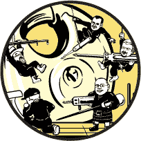
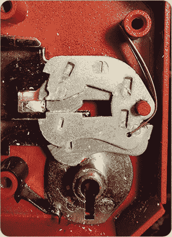
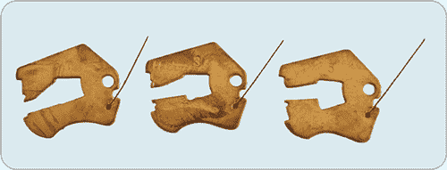
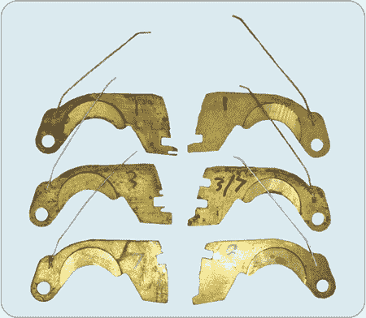
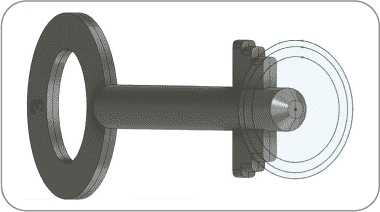
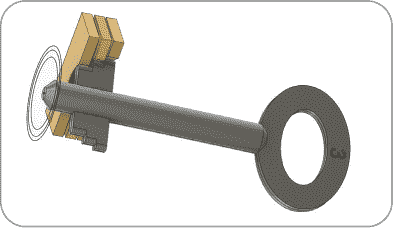
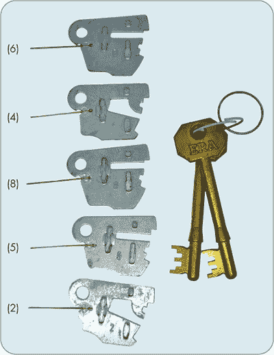
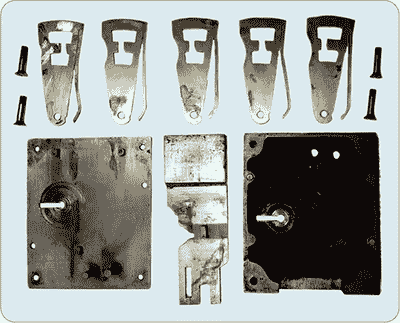
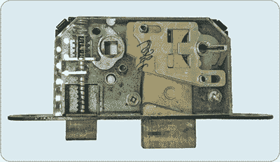
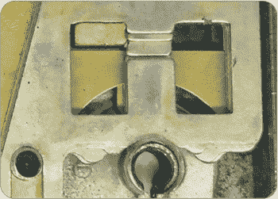

## **16

杠杆锁开锁逐步指南**

本章将带你逐步了解如何开锁双作用杠杆锁。我们将讲解张力施加与开锁、故障排除，以及在比赛中可能遇到的各种锁类型。你还将学习一些最佳练习技巧，帮助你为比赛做好准备。

### 杠杆锁开锁概述

开锁杠杆锁的原理与其他类型的锁开锁原理相似，之所以能开锁，原因是：制造公差。锁在生产时，杠杆是通过多个工具冲压出来的，因此具有不同的升降量，所以杠杆的大小不*完全*相同，且卡住的地方不能完美对齐。当你施加张力时，最长的杠杆会先被卡住。这会阻止锁栓进一步向后移动，并将杠杆固定住。当你移动那个卡住的杠杆时，下一个会卡住，依此类推，直到幸运的话，锁被打开。

目前，只有 LockCon 举办年度杠杆锁锦标赛，因此我们将研究在那里使用的开锁技巧：没有窗帘且由单一主弹簧控制杠杆。然而，对于有窗帘和单独弹簧的锁，过程大致相同。使用 2 合 1 或霍布斯开锁工具的基本步骤如下：

1.  通过将张力器的后把手旋转到开锁方向来施加锁栓的张力，通常是顺时针方向。

1.  释放张力，但保持挑锁工具在原位，然后使用挑锁臂定位杠杆包。通常，在开始之前你会知道锁内有多少个杠杆，但要确保能够找到每一个。它们是可移动的，通常可以在任一旋转方向找到。

1.  再次施加张力，并初步探查每个杠杆以确定其状态，并找到卡住的杠杆。

1.  移动卡住的杠杆，直到它不再卡住。一般来说，你只需要轻轻地将其向上推动约一毫米——一个微小的动作。

1.  重复此过程直到锁打开。

现在这个过程应该听起来很熟悉了。让我们更详细地看看每个步骤。

#### *施加锁栓张力*

张力是通过挑锁打开任何锁的隐喻钥匙；具体来说，它是张力器旋转力和施加在杠杆上的持力之间的平衡。这个概念类似于销钉锁开锁：如果没有施加足够的张力，杠杆就不会卡住，锁会一直复位，你永远也打不开它。如果施加的张力太大，一切都会卡住，导致无法操作各个工作部件。然而，适当的张力下，某个杠杆应该会卡住到足够让你注意到并能够固定住它的位置，同时将挑锁工具移到另一个位置。

总结来说，你的目标是找到一种平衡，使你既能将杠杆轻轻推到正确位置，又能探测它们以获得反馈。轻推杠杆，不要用力猛推——如果杠杆卡得太紧，你会失去对它们的控制。

使用 2 合 1 工具时，始终保持工具垂直于锁体。如果你不这样做，至少会得到来自锁体的错误读数，挑锁尖端会碰到多个杠杆——在极端情况下，你可能会弯曲或弄坏工具。

#### *定位杠杆包*

目前为止，竞赛锁总是只有一个杠杆包，确定其位置是需要经验的。杠杆包的位置可以是任何地方，但通常它位于螺栓旁边，在钥匙孔内。你要感受到的是螺栓的坚实接触以及杠杆的弹性或“碰撞”运动。

如果你听到*锁面朝左*或仅仅是*朝左*，这意味着螺栓朝左，杠杆在钥匙孔上方，并且位于螺栓前面，如本节中的照片所示。请记住，如果螺栓是*朝右*的，那么杠杆就位于螺栓后面。在这种情况下，你需要反转工具：使用挑锁工具反向旋转施加张力，并使用张力器进行挑锁。

通常，螺栓朝左的那一面更容易。我不完全确定为什么；螺栓的横条将杠杆稍微推远了几毫米，应该不会产生太大影响。可能是因为大多数人更常练习这种方式。在我所知道的所有杠杆挂锁中，你也需要像螺栓朝左那样进行挑锁，因为从内部来说，它确实是朝左的。同样，在 95%的保险柜锁中，尽管它们可以被安装成螺栓朝上（我怀疑有一些老式的也是朝右）。如果你愿意，你可以反转任何双面锁，挑战“朝右”的挑锁方式。

就在昨天，我遇到了一个五杠杆锁，我认定它是 Henderson 品牌。我不记得在书外见过类似的锁。虽然反应相对灵敏，但这个锁从“外部”只会移动到一定位置——也就是，螺栓朝右。是的，它有些磨损，但它也非常“粗糙”，很难转动帘布以重置锁。经过近一个小时，我放弃了，走到门的另一侧尝试“朝左”。不到几分钟，它就放弃了抵抗。

—NIGEL

#### *探查杠杆以确定其状态*

即使你已经知道锁中杠杆的数量，计数也是一种很好的练习。几乎所有英国标准的帘式杠杆锁都有五个杠杆。确保在杠杆包下方有自由和充分的移动空间；也就是说，确保你能从锁体前部到达后部，触及每个杠杆，因为有些锁故意设计得杠杆位置很低，以妨碍你。

如果你无法做到这一点，那么可能是出了什么问题，或者你需要稍微抬起每个杠杆，以便为取锁工具腾出空间。使用 2 合 1/Hobbs 型挑锁工具时，你无需这么做，因为它们像钥匙一样旋转。只要你将这些挑锁工具旋转到足够远的位置，朝向钥匙孔，你就能清除杠杆包和/或螺栓，并能自由地重新进入你选择的杠杆下方。

使用挑选工具的尖端，检查杠杆的肚子（它们的弯曲底边）是否都一样。如果不一样，通常杠杆的肚子较长则需要较高的提拉力，而肚子较短的则需要较低的提拉力，反之亦然——这里有信息，你只需要确定到底是哪种情况！（在许多高安全等级的锁中，所有杠杆的肚子都是相同的，以防止你使用这个技巧。实际上，一些标准要求这样做。）

杠杆有四种可能的状态：

**自由移动**  杠杆在重力或弹簧压力下自由移动。

**卡住**  杠杆卡在突起上。

**栅栏（又称 *真栅栏*）**  杠杆位于真栅栏中；也就是说，它的位置使得突起可以越过栅栏（参见图 16-1）。

**假栅栏**  杠杆位于假栅栏中；也就是说，它被放置在一个位置，使得杠杆的突起被卡住在假栅栏中，导致杠杆无法自由移动。

假栅栏状态是栅栏状态的一个子集。同样，卡住的程度也有所不同。杠杆卡住的越严重，使用挑选工具移动起来就越困难，但也不太可能受到其他杠杆、重力或弹簧的干扰。

*图 16-1：此 UNION StrongBOLT 中最上面的杠杆位于真栅栏中，而后面的杠杆尚未被扰动*。

要确定杠杆的状态，你需要用一根钢丝或其他挑选工具进行探测。轻推杠杆，看看它是否能自由移动，并在弹簧压力下返回（如果适用——如果你使用的工具去除了弹簧压力，直到你重置锁具时，这个检查不适用）。还要检查杠杆是否在重力作用下松动返回，或者是否能在反方向驱动时返回。像钉子被卡住的杠杆一样，不会自由移动。

如果杠杆被紧紧卡住，突起的过度压力意味着你也无法轻松地移动它。当你施加足够的挑选力量克服卡住的力量时，挑选工具自然弹簧中存储的能量会将杠杆“弹”向上，就像橡皮筋被弹射一样。这通常会将杠杆推过栅栏，达到最大高度，但你无法知道是否已经*过度提拉*（过头并且卡住了突起）。如果确实如此，那就完了；你永远无法故意在单排钥匙锁上重置选择的杠杆。

**注**

*双排钥匙锁相对容易挑选，因为你可以在大多数锁具上逆向操作挑选工具，如果杠杆过高，能将其推回下来。然而，这通常会移动其他杠杆，因为如果它们是自由的，唯一保持它们位置的因素是与相邻杠杆的摩擦*。

#### *移动卡住的杠杆*

一如既往，记住元素卡住顺序原理：只移动卡住的杠杆。轻轻推动它，直到它不再卡住并且与基座“颤动”或“拍打”。当你轻敲杠杆时，它应该能够自由地移动一小段距离，正好在卡槽的上下之间，被基座卡住。

此时，你可能已经遇到真正的卡槽或假卡槽，或者杠杆的角度可能导致其根本没有卡住。（一些锁具，如带有反向杠杆的联合锁——支点位于锁舌一侧——需要微小的、重复的提拉，因为它们会卡住，然后在稍微提起时停止卡住。见图 15-21。）释放时，杠杆会几乎精确地回到原位，而锁舌几乎没有任何移动。再提起下一个卡住的杠杆，锁舌再次几乎没有移动，那个杠杆也几乎回到原来的位置。

#### *重复这个过程来打开锁*

你将重复上述步骤，直到其中一个杠杆卡住，锁舌稍微移动。继续操作其他杠杆，不久后，另一个杠杆也会进入卡槽。最终，由于你为得到哪怕是轻微的移动而施加了巨大的张力，你的最后一个杠杆会严重卡住——这时你已经得到了警告！——然后你会把那个杠杆直接过栓——结果是锁没有打开。

请记住，当你逐渐通过每个杠杆时，每个未设置的杠杆所承受的压力会增加（以前分布在四个杠杆上的压力，现在都集中在一个杠杆上）。因此，你会发现，比如在一个五杠杆锁中，所有杠杆几乎同时卡住时，压力会增加五倍。故事的寓意是：当可以轻松操作时，要保持轻松！轻轻地将最后一个杠杆推入位置！

恭喜——你已经打开了一个杠杆锁！在比赛中，你现在可以大声喊出“开锁！”，并随着时间的读出和记录，脸上洋溢着自豪感。当然，如果这是一个多次抛出锁，你可能还有三次抛出，才能真正完成这一轮，但不要让这些影响你打开第一个锁的满足感！

### 故障排除

有时候杠杆根本无法卡住。你可以增加张力，但仅限于一定范围，因为弄坏工具真的不是好主意——不仅更换工具非常昂贵，而且在比赛中还会导致被取消资格。在本节中，我们将探讨一些更好的技巧和解决方法，以帮助你在遇到卡住的情况时应对。

#### *压缩打包*

如果你无法让任何一个杠杆保持在你想要的位置，你可以通过*压缩打包*来“作弊”：将所有杠杆聚集在一起，用张力器夹住它们，并有效地将它们卡在锁壳和相邻的杠杆之间。如果你压得太紧，整个杠杆组可能会作为一个整体移动，或者只有目标杠杆和相邻的杠杆会移动。如果你拉得太轻，整个杠杆组或单个杠杆可能会掉落并在减小张力时重新设置。

与更常见的张力调整方法一样，这种技巧也需要保持平衡。不仅如此，它在所有锁具上并不完全相同。在一些没有间隔垫片的冲压钢杠杆锁中，例如图 16-1 中显示的 StrongBOLT，压缩锁包可能会导致杠杆移动到它们之间的空隙中，或者卡在两个冲压凸起的交界处，导致杠杆互相卡住。对于两侧都有杠杆的中心螺栓锁，压缩锁包会产生不同的效果。

真正的门槛通常比假门槛大。因此，在压缩锁包时，即使你还不能完全让杠杆停留在你想要的位置，你也可能通过反馈感知到假门槛和真门槛的位置，例如杠杆撞击或杠杆在树桩上摩擦时缺乏阻力。请在后续的挑锁过程中心理记下这些门槛的位置。

对于双面钥匙的单弹簧锁，即使不压缩锁包，也根本无法可靠地仅移动一个杠杆。这些杠杆非常轻且可以自由转动，因此它们会在邻近杠杆受到干扰时发生移动。幸运的是，在双面钥匙锁中，你总是可以向上或向下推动杠杆，所以记住或记录下你的杠杆位置，然后将它们调回到正确的位置，你就能离开锁更近一步了。

最后，请注意，倾斜张力器的效果与压缩锁包几乎相同。如果你是有意为之，这没问题，但如果不是的话，你会让任务变得更加困难，因为你得到的反馈会被改变。记得把拨动工具放在正确的位置——垂直于锁芯。

#### *抗挑锁*

到目前为止，我们假设杠杆只有一个真门槛，但对于更高安全性的杠杆锁或锁止器，这通常不是事实。广义上来说，抗挑锁具有两类：一种是可以逃脱的，另一种是无法逃脱的。V 型缺口和类似的机械凹槽属于前者，而方形假门槛则属于后者。

##### **V 型缺口和机械凹槽**

*V 型缺口*是杠杆前缘的浅 V 形切口。当杠杆处于假门槛状态时，树桩会撞击杠杆的前缘，然后稍微滑回到 V 型缺口中，杠杆将停止卡住。当你找到其他卡住的杠杆并将其设置好时，这个杠杆会开始再次卡住，因为树桩会进一步进入 V 型缺口，导致你速度变慢。当你将这个提前卡住的杠杆抬得更高时，V 型缺口会迫使树桩、螺栓和张力器向后移动，可能会同时释放一些未知的其他杠杆。真是令人烦恼！这当然就是抗挑锁的作用：让锁匠感到挫败并减缓进度。

好消息是，就像使用螺线销一样，你可以稍微放松张力，增加提升力，然后将杠杆推过 V 槽，通常不会掉得太多。当你推动错误设置的杠杆时，它会对抗你的张力，就像销钉弹簧那样反应。

图 16-2 展示了一个带有两个 V 槽的定时器。平衡张力和挑锁力非常需要技巧，避免将定时器推进真门之后被误推进更高的假门。

*图 16-2：一把带有 V 槽的 UAP Tradelocks MAX6MUM 六杠杆英国标准锁定定时器*

一如既往，只有进入之后，你才能判断一个门是否为真门。当活塞回退时，假门中的杠杆运动将变得更加受限或完全卡住，而真门杠杆的行为不会发生变化。对于更高质量的锁，你需要培养一种对锁内部结构的心理图像，以确定哪些杠杆需要更高或更低地提升才能正确设置。

##### **方形假门**

*方形门*的反挑通常非常明显。当你推动一个卡住得很紧的杠杆时，你会撞到它，张力器会转动，短暂的时刻你甚至可能会庆祝。但不——你掉进了一个方形陷阱。无论你对挑锁线施加多少压力，或者将张力器的张力减轻，都不会引起任何反转。

一旦完全进入方形假门，你就无法跳过它，你必须记住自己在锁中的位置，在重新设置并尝试时。下次你提升那个杠杆时，必须比之前提升得更高，才能越过假门进入真门，或者至少会在其上方卡住。

很多时候，你会发现挑锁顺序是一样的，而你又回到了陷入方形假门的位置。这时，你需要尽量减轻张力，快速将杠杆移至真门。如果你在此过程中尝试压缩杠杆包（通过将张力器拉回你这边），可能会有所帮助，这样可以减缓或停滞其他杠杆恢复的动作。只是不要把杠杆抛得太高，否则你可能又会被卡住。

回顾本节中各种杠杆的照片，包括图 16-3 中的定时器，并对比反挑。

*图 16-3：Chubb 110 定时器，从左下角开始顺时针：1960 年代的 7 号提升，没有额外的趾部来防止过度提升攻击；80 年代的 3 号提升，具有更深的假门；70 年代的 1 号提升；新的 1 号提升，前缘轻微刻槽；一个已掌握的定时器，具有 3 号和 7 号提升的门以及刻槽的前缘；新的 9 号提升，具有刻槽的前缘*。

请注意图 16-3 中，左栏所有旧款定制锁上方和下方都有明显的防挑齿槽；你可以看到防挑齿槽总是恰好与提升一格的预定模式相符合，这是在需要进行 NDE 开锁时常常被利用的一个事实。新款（右栏）移除了这一弱点：注意脚部、腹部，甚至是枢轴点都是相同的，防止了所有简单的解码攻击。

**CHUBB 定制锁**

并非所有锁具都是一样的。有些锁具的容错性比其他锁具高得多（它们的制造标准更高，通常也更难被锁匠利用）；Chubb（现为 UNION C 系列）锁具通常属于高端产品。此外，Chubb 的工程师在锁具操作方面是专家，他们为防止开锁者的攻击添加了一些功能。

他们创造了定制锁：与传统锁具中杠杆上的 H 形口不同，这种锁具的门栓是一个切割在杠杆前端的缺口，门栓滑入其中。这样可以提供更多的钥匙空间，因为微小的钥匙提升差异会因动作的放大效应而转化为非常大的移动距离。这一变化还将有效的钻孔点远离了钥匙孔，位于门框的边缘后方。任何仅仅通过钥匙孔使用钻头的操作员都会感到失望，而现在即便是使用孔锯的人也会同样失望！定制锁的另一个优点是它支持主钥匙系统；请注意图 16-3 中标记为 3/7 的杠杆，具有两个真正的门栓。其缺点包括对钥匙的更高精度要求，以及检查机制的额外复杂性。

真正的定制锁套件实际上是在钥匙之后制造的，门栓会在工厂根据预先切割的钥匙进行铣削，以匹配钥匙。

Chubb 110 被认为一般很难直接开锁，因此图 16-3 中所示的方形门栓防护实际上并不必要。然而，事实是，使用更先进的工具可以轻松解码这些方形门栓，使其表现不尽如人意，因此引入了更复杂的“凹边”前缘图案。当你遇到方形门栓需要完全重置时，带来的挫败感被“凹边”带来的不确定性所取代。

### 解码锁具

与任何其他锁具一样，开启杠杆锁需要通过锁具元件——杠杆——的反馈来确定它们的状态。对五个杠杆进行所有可能的提升检查可能非常耗时。了解制造商用来抵抗攻击的技巧可以帮助你*解码*，或者说学习锁具的配置。

钥匙的转动以及钥匙上的每个齿都会画出一个圆圈（见 图 16-4）。杠杆的腹部形成一个半圆。在测试钥匙的点上，齿的弯曲路径（或 *弧线*）与其对应的杠杆必须在正确的位置重叠，以保持螺栓和钥匙在整个行程中的真正门控。否则，螺栓的树桩会卡住杠杆，导致磨损，或者如果路径偏离并迫使杠杆向上推到树桩上，锁会卡住，部分打开，直到钥匙转回。

*图 16-4：每个不同高度的齿都会画出不同大小的圆圈。杠杆的弧线必须与此弧线匹配；否则，杠杆将上下滑动并卡住树桩。*

螺栓的投掷距离越长，保持真正门控的难度越大。换句话说，树桩必须进入或穿过杠杆的距离越远，这些弧线必须保持重叠的时间越长。

低安全锁通过几种方式避免了这个难题。它们要么改变腹部的曲线，使其与钥匙的曲线匹配，从而在锁的公差范围内重叠足够长的时间，允许树桩通过门控，要么简单地将门控做得更宽。（记住，树桩必须足够厚，以抵挡暴力攻击，并且要足够强大，以避免在有人压下螺栓末端或试图插入错误钥匙时发生弯曲，因此门控通常已经相当大，以便与其匹配。）

正如前面所提到的，一个更好的解决方案是使所有的腹部相同。这使得挑锁者无法看到或探测腹部来解码钥匙。然而，这在技术上是非常困难的（见 图 16-5）；在带窗帘的锁中，只有一些保险箱锁和前面提到的 Chubb 110 系列隔锁门锁具有相同的腹部、脚趾和脚跟。

*图 16-5：这个锁如果没有弯曲的门控，是不可能有几乎完全相同的腹部的，但无论如何，只需一起提升所有杠杆的脚趾或脚跟，或许用 J 型金属丝，就能打开它！*

第三种腹部修改选项是前两种的结合：将杠杆腹部分组。也就是说，1 和 2（X 组）会有相同的腹部，3、4 和 5（Y 组）以及 6、7 和 8（Z 组）也会有相同的腹部。这仍然可以解码，但不再是完美信息；正确操作时，仍然有很多钥匙需要尝试。

挑锁者当然可以利用这些信息，通过使用金属丝解码，然后直接提升到感兴趣的区域。在 ABACD 锁的情况下，你可能会以高、中、高、中、低的顺序提升，而不是单纯依靠反馈挑锁，这样可以帮助你避免反向挑锁并通过触感绘制出锁的地图。

在图 16-6 中，注意杠杆腹部和脚部，以及位于真门之上的防撬设计，并与位于真门之下的防撬设计进行比较。可以看到一个分组，1 至 4 组为一组，5 至 8 组为另一组（并非所有的都在图中）。

*图 16-6：ERA Invincible，现已停产数十年*

现在来看图 16-7 中的 Ratner Safes 锁。你可以看到杠杆腹部如何暴露提升位置；低提升的半径小于高提升。为了增加撬锁难度并提供不同的钥匙，杠杆门的前缘较窄，而后缘则加宽以防止卡住。

*图 16-7：这把 Ratner Safes 锁是极简设计的典范；此处展示的是锁壳的两个半部分、锁栓、五个杠杆和四个螺钉来将其固定。图片由 autom8on (@a8n_pub)提供，© 2021 年 Stephen Wilson 版权所有*。

制造商还使用其他技巧。他们可以切割杠杆的前后部，以抵制这种简单的解码方法，从而使得破解更加困难。见图 16-8 中的 Asec/Legge 带垂直滑动杠杆的锁；Mauer 76000 系列和 S&G FAS 69x0 系列也是其他示例。制造商还可能限制窗帘的旋转，以防止轻松接触杠杆，令杠杆的前部保持一致，唯一的变化是在窗帘中以陡角呈现（例如 UNION StrongBOLT 和 ERA Fortress）。在这种情况下，锁的杠杆有时可以从脚跟进行解码。

*图 16-8：一个带有垂直滑动杠杆的 Legge 窗锁*

仔细观察图 16-9 中的这把 Legge 锁，你会看到减少的接触杠杆腹部，这些腹部垂直滑动。标准长度的撬锁工具会错过解码所需的细节，从而使任务更加困难。早期的型号拥有全宽的腹部，使用撬锁工具很容易解读。

*图 16-9：杠杆的细节，移除间隔件并排列以展示各种腹部半径以及可能的情况*

还请注意细微的防撬设计。解锁这些锁的主要问题是撬锁工具的线会在杠杆旋转时被切割掉的前缘卡住。

**其他类型的解码方法**

其他解码方法，包括*光学*（使用相机、内窥镜或粘在杆上的小镜子）、*电线*（将一根或多根电线插入并判断旋转情况）或替代印模技术（使用橡皮泥或腻子印模钥匙）在比赛环境中可能允许也可能不允许。你需要询问，并应该预计会被拒绝。你通常可以通过使用相同的双弯挑选线或 2 合 1 工具解码杠杆的脚趾或脚跟，就像你用来实际挑锁的工具一样。如果你想要精确的结果，你需要事先在几个目标锁上进行练习。

然而，仅仅知道第一个杠杆是高举的，因为当挑棒旋转很远才接触到杠杆——与测试的第二个杠杆几乎没有旋转相比——就给了你一个很大的线索，甚至在你开始挑锁之前就能发现。你需要提前了解你的锁；正如前面所说，有些锁的方向是相反的，其他的锁则是整个部分相同的。

对于像大师级锁匠协会（MLA）考试或“开放”竞赛之类的情况，解码工具包和内窥镜可能是可以接受的，因为它们是锁匠已经拥有的设备，而且目标是整洁地打开锁，而不是争夺最佳时间。可以使用许多其他解码技术，但我们已经偏离了本章的主题！

### 总结

在这一章中，你已经了解了实际操作杠杆锁挑选的过程。希望你已经看到，一旦你有了一些经验，这个过程并不像最初看起来那么令人生畏。获取锁和硬件可能是你最大的挑战（你的第一个选择应该是友好的锁匠或二手店和古董店寻找锁具，爱好商店则可以找到钢琴线）。

仅仅了解杠杆锁理论已经让你领先于大部分竞争者。说到这个，在下一章，我们将展示如何为杠杆锁比赛做准备以及你在比赛中可以期待什么。
