## 杠杆锁挑选比赛

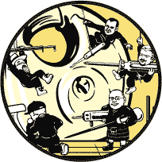

本章我们将介绍杠杆锁挑选比赛的一般设置、您可能会看到的工具和锁，以及准备赢得比赛的建议。我们还将为您提供在杠杆锁比赛中运行和参赛的技巧，以及一些有用的注意事项。

### 比赛设置

由于工具的成本和锁具的可获得性，比赛中通常没有足够的资源供每位参赛者使用。解决这一问题的唯一公平方式是进行资格赛，例如，使用单一且简单的杠杆锁，并设置短时间限制。最快解锁者可以进入下一轮，接下来的比赛将以常规的对决形式进行。一般来说，会进行若干轮初赛，每轮四名选手，然后进行较大的决赛。

赛前已解释的时间限制是每把锁之间的五到九分钟。在每个时间段结束时，锁会被重置，整个赛场按轮流赛制进行，直到所有参赛者都挑选完所有的锁。参赛者越多，每轮的时间通常越短。

锁通常已经被夹在台钳中。通常，工具也已放好，您看不到锁的操作部分。比赛开始前，您可能无法触碰工具，所以请事先确认是否安排了资格赛或测试期。

您可能会站着操作，挑锁工具位于腰部高度。从一把锁走到另一把锁是既简单又快速的做法，且无需移动设置。比赛节奏可能相当快；在 2019 年，LockCon 的杠杆挑锁比赛每轮只有五分钟，锁上有四次尝试次数。诚然，您不会像在百米赛跑中以 10 秒内完成，但比赛前不通宵玩乐可能有助于保持体力。

您会被告知必须挑锁的次数，最多是四次，最少是一次。有时每次挑锁会转动整圈，有时则是半圈。完成解锁可能需要多达五次半圈，也可能只需一次。

得分根据解锁次数决定，解锁次数最多的选手赢得该轮。如果解锁次数相同，则以最快时间获胜。

如前所述，杠杆锁比赛相对较少，荷兰的 LockCon（沃尔特在图 17-1 中参赛的比赛）是主要的比赛之一。有关其他比赛的信息，请参考第一章列出的团体。

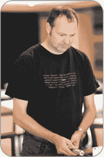

*图 17-1：沃尔特在 2014 年 LockCon 比赛中的表现*

### 比赛工具

正如我们在前面的章节中提到的，比赛的组织者几乎总是提供锁和开锁工具。（不过一定要问清楚！）无窗锁的撬棒将是 2 合 1 工具，而有窗锁的撬棒将是线型撬棒和单独的扭力器。还会提供安装支架和虎钳。

**注意**

*你可以用线型撬棒和扭力器手持小型杠杆锁，并通过在锁中保持扭力器位置来开锁，但这种方法比将锁安装好后的操作要难得多，而且在比赛中不能这样做，或者当锁栓朝向另一边时也无法使用。如果用 2 合 1 工具来做这件事几乎是不可能的，除非你有三只手——因此，需要一个虎钳和支架*。

然而，如果你需要钢笔和纸，或者个人计时设备，你需要自己带来这些。

### 比赛锁

正如你现在肯定知道的那样，练习是比赛准备中最重要的部分。然而，除非你知道将使用的锁的类型、品牌和型号，否则不可能在特定的锁上进行专门练习，这种情况不太可能发生。锁的位置可以给你一些线索，因此，在本节中，我们将回顾一些你将在欧洲和英国比赛中遇到的锁。

首先，然而，让我们简要谈一下你*不会*在那里遇到的锁。某些杠杆锁不适合比赛。例如，Chubb 114 就是一个糟糕的选择（见图 17-2 中的 3G114）。

当 Chubb 114 是全新的（未被开锁时），它非常容易开锁。然而，它的刀刃形状的黄铜底座很容易磨损，并且它的杠杆很快会适应制造上的小瑕疵所带来的轻微松动。因此，开锁变得更加困难，尤其是在承受过大量压力后。一旦经过这种磨损并“定型”，这个锁几乎变得无法打开。显然，这将有利于第一个比赛选手，即使每一轮使用的是相同的锁（通常是这种情况）。

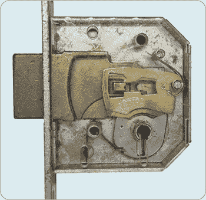

*图 17-2：带有防撬缺口的 Chubb 3G114 底座后部*

图 17-3 展示了 114 的杠杆。防撬装置共同工作，阻碍开锁并通过稍微抬起杠杆来帮助抵抗压印攻击。注意，标记为 B（中下）的杠杆没有防撬装置。每个锁都有一个 A、B 或 C 杠杆没有防撬装置，以确保在任何情况下都能平稳操作，就像许多插销锁一样。

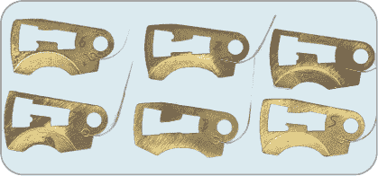

*图 17-3：Chubb 114 杠杆*

比赛中使用的锁应当具有圆角钢制底座，最好使用钢制杠杆。

**探测器机制和防压力装置**

探测机制和防压装置只是锁具设计师为防止开锁和其他攻击而发明的一些常见且富有创意和先进的方法。例如，百年之前，Chubb 公司在一次英国海军船坞被开锁盗窃后，发明了探测器。当使用错误的钥匙或开锁工具过度抬起触发杠杆时，探测器会使锁保持卡住状态，从而表明锁已经被篡改。唯一重置它并恢复正常锁定的方法是用正确的钥匙朝*错误*的方向转动。防压装置的设计旨在通过例如在锁舌张力过大时使所有杠杆卡住来阻止开锁。

然而，在任何比赛中你都不会遇到这些锁，主要是因为在没有大量准备的情况下，几分钟内打开这些锁实在太困难了。若五十个参赛者都打不开，那可就没有什么乐趣了！

#### *欧洲比赛锁*

在欧洲大陆的比赛中，双面刀杠杆锁最为常见。通常作为边缘锁安装在门的背面，配有非常长的钥匙，这些锁还常常具有与保险柜相当的锁舌机制：锁舌可以向三个方向运动，需要多次转动钥匙才能打开。钥匙旋转两次将会推动锁舌四次，给物理破坏提供了很高的抵抗力，并且杠杆上有四组在不同时间接合的开口。

好消息是，如果你有专用工具，这些锁相对容易开锁。坏消息是你没有那个工具，而且锁舌距离你只有 100 毫米，且通过一个小钥匙孔。

与单面刀锁不同，双面刀锁通常只有一个杠杆弹簧用于复位锁。图中所示的 BODA 锁图 17-4 与单面刀锁类似，除了具有一次转动双重抛出的操作外，且无法将杠杆重新推回去。

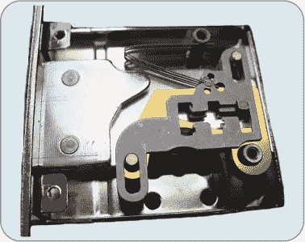

*图 17-4：BODA（芬兰）42 倍双面刀、八杠锁*

你可以在图 17-5 中看到 Mauer 71111 锁中的单杠杆弹簧。在这些锁中，你可以使用钥匙的下半部分防止杠杆抬得过高。解锁的主要区别在于，如果你抬得过高，你只需通过推压杠杆底部将其重新推回去即可。

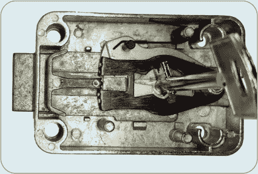

*图 17-5：Mauer 71111*

请注意，Mauer 71111 的杠杆被轻微卡住在真正的开口内，不能上下移动（尽管 Hobbs 型开锁工具的开锁臂可以自由推升或降低杠杆）。防开锁装置相当强力，但如果你足够减少张力，它们可以跳过，而且由于没有独立的弹簧，整个锁通常不会复位。

与单面锁的另一个区别是，由于缺少独立弹簧，在双面锁中，邻近杠杆之间的摩擦力通常会在你移动相邻杠杆时稍微影响它们的动作。你经常需要将不受束缚的杠杆推回原位，因为它们会随着受束缚的杠杆一起自由上升。你也需要较少的力量来移动它们，而且它们可能会或可能不会在重力作用下落下。

#### *英国竞赛锁*

英国杠杆锁几乎都是单面切割的钥匙和窗帘锁，但我们也有几百年的安全锁、容器锁和挂锁历史，因此你在比赛中更有可能遇到各种类型的锁。锁可能是从两到七个杠杆的无窗帘锁，难度范围非常大，或者可能是从三个到七个杠杆的带窗帘杠杆锁（通常是五个）。

尽管你可以像打开无窗帘锁一样打开带窗帘的锁，但你会发现所需的工具明显不同。精美的车床加工、精准配合的 2 合 1 工具不见了；你将使用弯曲的钢丝和可能被削减的钥匙！你甚至可能会看到像精密弯曲钢丝和 CNC 电火花加工张力器这样的工具。

不过别担心：钢丝将像之前一样有效地提起杠杆，张力也会同样起作用。掌握不同的工具使用方式可能需要一些时间。记住，任何带有窗帘的门锁都是单次扭动的，而且杠杆是单独上弹的（唯一的例外是 APECS LX5）。

你最有可能遇到的锁是 UNION StrongBOLT 和 ERA Fortress 2。就挑锁的实际操作而言，这些锁是相同的，它们是最常见的英国标准杠杆锁。

如果你真的想知道，UNION 有八个钥匙切割深度，而 ERA 有七个。这是使用钢丝窗帘挑锁时唯一值得注意的区别。在我看来，StrongBOLT 通常稍微难一些。

—NIGEL

### 提高成功打开锁的机会

现在我们将讨论一些其他步骤，它们可以提高你在竞争环境中打开锁的机会。

#### *控制你的紧张情绪*

在比赛和测试中保持冷静。肾上腺素的激增会麻痹你手指的感觉，所以你可能会不自觉地使用比必要更多的力量。你会感觉时间变得慢下来，但又好像过得更快。当然你想赢，但不要让当下的紧张情绪影响你——这就是你最终弄坏工具或打不开锁的原因。

在压力下练习可以帮助你适应这种情况；经过几场比赛后，你会发现你的紧张情绪会逐渐平复。（不过，一旦你有了开锁的名气，你可能会因为*相反*的原因而感到压力，所以也不要给自己太大压力！）

在各种锁具上练习，这样你在面对陌生的锁具时就不会感到迷茫。同样，找出最适合自己的技术，以便快速开启。你会专注于听杠杆发出的声音吗？你会数击打次数并追踪挑锁臂在杠杆堆中的移动吗？你是否有效地握住了张力器，从微小的动作中获得最佳反馈，随着栓体的移动？记住，比赛通常会很嘈杂！

#### *获取锁具情报*

迄今为止，LockCon 还没有透露他们比赛中使用的锁具（组织者故意隐藏锁具的品牌和型号）。这是因为更换成其他类型的锁具成本太高。在 MLA 杠杆开启测试中，你必须告诉考官锁具是什么（多款英国标准五杠锁会被随机分配，锁匠需要通过钥匙孔识别锁具，然后在一小时内以正确的方向打开它）。由于组织者不太可能泄露太多信息，你应该问问自己已经掌握了哪些关于锁具的信息。你可以从外部学到什么？

当你有足够的时间接触锁具时，可以尝试多种开锁方法。在比赛中，你希望尽快找到正确的方法。我们来看看如何做到这一点。

##### **握住锁具**

*推钉法*（对锁栓端施加直接压力以卡住杠杆）是不允许的，而且即使可以，也无法从任何优质的锁具中得到足够的反馈。大多数比赛都将*挡板*（打击板）固定在栓上，或采用其他防护措施来防止这种情况发生。此外，带帘锁可能会导致顺序错乱——这意味着帘子的位置不对，无法推动栓体——需要在下一轮之前拆解锁具。

##### **检查锁具**

如前所述，比赛的组织者故意隐藏锁具的型号甚至品牌，以避免透露有关锁具特殊性的关键信息。不过，你可以通过查看钥匙孔判断它是单螺栓还是双螺栓锁。你还可以检查是否有帘子。虽然帘子对挑锁过程影响不大，但你不会感到惊讶，如果看到的是一根钢丝挑锁工具，而不是 2 合 1 工具或霍布斯工具。

##### **感知锁具**

组织者不会允许你提前摆弄锁具和挑锁工具——那样是作弊！但当你被允许触碰锁具时，你能学到什么呢？

首先，工具是否顺畅转动，还是需要维护？挑锁工具的两个部分必须独立移动，不得卡住或摩擦，可以前后移动，也能旋转。不要把这个和击打杠杆弄混了！组织者通常会在每轮之间检查工具，但如果工具有问题，要及时提出。如果挑锁工具只是空转——如果某个部分断裂了，你需要立刻报告。

接下来，找出杠杆的位置，更重要的是，找出锁舌的位置。它通常位于锁的远端，但也可能位于杠杆包的中间，或者如果锁的另一面朝向你（锁舌朝右），它可能位于前端。几乎所有当前的杠杆锁（锁舌朝左）都有杠杆位于锁舌的两侧，或者在你和锁盖之间的前面。无论杠杆位于锁舌两侧还是前面，工具都能够设计得接触到所有杠杆，但你必须确保施加的张力是*作用于锁舌*，而不是随机的杠杆。

比赛开始后，如果你知道杠杆的数量，你可以通过一次计数来确认。如果你不知道，就需要寻找并计数，可能需要计数两次，或者直到你得到相同的结果为止。然后检查弹簧压力：

+   在使用单一主弹簧的锁具上，你会在加压时感觉到弹簧，杠杆随后会“漂浮”自如。你可以几乎不费力地用撬锁工具上下推动它们。

+   在采用独立弹簧杠杆的锁具上，你总是能感觉到弹簧压力试图将杠杆恢复到原位，除非它卡住并无法恢复，或被卡住在（虚假或真实的）门栓中。

通常，杠杆位于钥匙孔上方，但也可以位于旁边（见图 17-6）。当你遇到弯曲不同的杠杆肚时，有些杠杆会较早碰到底部，其他则较晚。在某些锁具中，这是解码的依据，但你需要在杠杆包下面有足够的自由移动空间。要么你的工具必须允许这一点，要么你将使用线帘撬锁工具，而不是 2 合 1 工具，这种工具可以在特定角度下“勺取”杠杆肚。这样做需要练习，以避免干扰杠杆或过度抬升它们，可能会超过真实门栓的高度。

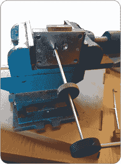

*图 17-6：一种七杆安全锁，配有三向钥匙孔，允许以不同方式安装：锁舌朝上（如图所示）、左侧或朝下。当锁定如图所示位置时，杠杆包会位于钥匙孔的右侧，而不是上方*。

最后，防撬保护如何呢？锁可能没有防撬保护，或者防撬保护可能会被撬锁工具禁用。你需要尽快弄清楚这一点并记在心里。你的撬锁工具会避开幕帘或卡条，主弹簧将通过张力器被禁用，以避免重置杠杆。（在高端锁具中，可能会有防压的挡块和探测机制，但在常规锁具中，你不会看到这些，更不会在比赛中遇到。）还需要记住，如果双面杠杆被抬得过高，你可以将其向下压回。

##### **关于锁的提问**

你将由组织者简要介绍锁具的情况。与第八章中描述的销子式插销锁的开锁比赛不同，询问他人关于杠杆锁的信息是非常棘手的。询问锁内的情况而不是自己去探索被视为不合适的行为，主要是因为知道某个杠杆应该立刻被举起，会让你比那些不得不通过抗开锁工具才能到达的人占有巨大的优势。此外，*试钥*——那些大致与真正钥匙相似的钥匙，你只需尝试直到锁打开——可能是完全合法的，所以如果有人告诉你，钥匙组中的第 12 把钥匙能打开锁，那么你将比任何人都快！

我们建议将锁内部的具体信息保密，直到比赛结束后再透露。如果不确定，请向竞赛组织者咨询有关锁具讨论的规定。

### 竞赛的注意事项

现在我们来总结一些最后的注意事项，以提高成功的几率。首先，记得将工具垂直于锁体（见图 17-7）。在竞赛过程中很容易因激动而不小心倾斜工具的方向，无论是上下左右，然而这样会使你的操作更加困难，因为它会以不受控制的方式压缩锁芯组。

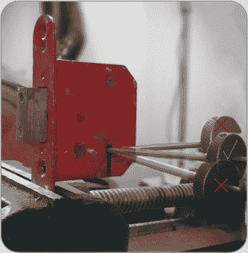

*图 17-7：保持你的工具与锁面平行。如果你压缩了锁芯组，请注意将张力器垂直拉出，而不是倾斜，否则拨动臂会撞到多个杠杆*。

小心接近锁。先测试一下锁内部的感觉，然后得出关于它工作原理的结论。你能看到钥匙孔，这会揭示出钥匙是单面齿还是双面齿。你已经知道，大多数单面齿锁使用的是单独弹簧杠杆，而大多数双面齿锁使用的是单一主弹簧。找到杠杆组时，请确认这一点。

保持冷静，不要紧张、僵硬或使用过多的力量。这条建议适用于任何开锁环境。

改变张力，使旋转方向从顺时针变为逆时针，或反之，或者改变锁的侧面将不是一个选项。然而，可能会允许更换工具，具体取决于你是否有备用工具。如果你没有使用自己的工具，那么你必须使用比赛提供的工具。对你的工具要有信心！

**注意**

*例如，如果你在最后几秒钟感到绝望，你可以在单面齿锁上换用 J 型线工具——但即使工具就在眼前，你最好至少有 45 秒的时间来进行更换。不过，改变工具的机会不大*。

考虑到您面对的是一个更难的锁且有更多的时间，您可能会考虑对最终一轮（或多轮）的操作方法进行调整，而不是第一轮的做法。然而，作为经验法则，请坚持之前有效的方式！卡住并轻推，卡住并轻推。找出反向挑锁的位置，重置并提起杠杆，然后继续卡住并轻推，卡住并轻推……如果您能绕过反向挑锁的位置，记住您在早些轮次中的做法——放松张力，保持轻压在目标杠杆上，将其弹起并越过虚假闸口，然后重复直到锁开！

如果您完全卡住了，您始终可以重置锁具，将其恢复到已知状态。不过，请确保完全重置锁具。对于一些带有方形反向挑锁的锁，完全释放张力并不会从反向挑锁中重置锁具，在极端情况下，您可能需要将螺栓完全驱动回锁定位置才能重置。同样，对于单主簧锁，您可能需要将张力旋转回较远的位置，才能完全重置杠杆组件。

请记住，您可能需要多次转动锁具才能打开它。您*绝对不能*像在插销锁中使用插销旋转器一样旋转撬锁工具来“翻转”锁具。杠杆的设计使得它们在允许第一个动作时，已经阻止了下一个动作。如果强行操作，您可能会弯曲或损坏工具，并被淘汰。相反，您需要重新挑锁。

回顾并应用您在第十六章中学到的内容。记住，对于许多双面锁，钥匙是对称的，这意味着低提升和高提升是反转的，因此在挑选第二个抛投时，最好从这里开始。然而，最佳的多次抛投双面锁则不同，两个切口集合是独立的。即便是最好的双重抛投锁，第一和第三、第二和第四的杠杆排列也必须相同，因此第一组高/低组合将在第三次旋转时同样有效，以此类推。

### 运行您自己的杠杆锁挑选竞赛

如果您决定举办自己的竞赛，请为预算做好准备。典型的设备会让每位参赛者花费几百美元（或英镑）。您还需要额外的一套锁具工具，以及所有其他工具的备件。因此，四位参赛者需要五套锁具工具。

您需要准备各种难度的锁。一些锁可能过于简单，而另一些则太难。您需要跟踪这一点，随着比赛的进行，可能会考虑将简单的锁从最终轮中移除。您可能还想在半决赛中加入一把没有被人破解的锁，作为区分技巧的有效考验。不过，不要过度使用这个想法——最终轮没有可破解的锁可能会让比赛变得无聊和令人沮丧！最好挑选一些较为简单的锁。您需要在设定的时间范围内确保有些锁能被打开。

让我们看看几个 LockCon 比赛的设置，看看可能涉及的设备和成本。

#### *2014 LockCon*

2014 年由 Jord Knaap 举办的 LockCon 比赛使用了低端二手锁，尽管没有进行修改。这些锁是由一家保险柜公司生产，型号和品牌相同，来自多个生产年份，且用于内部隔间。这些锁有四个杠杆，且几十年来的制造质量几乎没有变化。这些锁只是简单地夹在台钳中，螺栓可见，且参赛者被禁止触碰锁本身（参见图 17-8）。

然而，除了专业的保险柜技师外，几乎不可能有人有机会收集到 16 把或 20 把相同品牌和型号的锁来参加比赛。Knaap 是一名熟练的机械师和工具制造师，他自己制作了这些开锁工具。

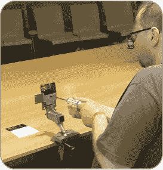

*图 17-8：LockCon 2014 比赛锁*

#### *2019 LockCon*

2019 年 LockCon 杠杆开锁比赛由 Ivo Poletto 组织并由意大利 Parmakey 的创始人兼老板赞助。主办比赛的意大利团队使用了一种意大利制造的双面四跳保险柜锁（也就是，旋转两圈可以移动螺栓四次），并在其上增加了*电子指示*螺栓位置开关，即每把锁上都有一个灯，指示螺栓的当前状态（参见图 17-9）。第一次开锁会转动 180°，第二次转动 360°，第三次转动 540°，最后一次转动 720°，每次旋转都会通过灯光进行跟踪，这样裁判和观众就能看到每个参赛者的进度，计时员也能准确记录时间。

这些锁的品牌和型号至今没有公布，因为主办方希望在未来的比赛中继续使用这些锁，并且不想给任何可能购买和研究这些特定锁的人带来战术优势。所使用的锁已经被修改，使它们更容易被开启（可能去除了某些杠杆或防开锁功能），并且由于它们属于相对高端产品，它们没有遵循常见的“下次跳跃会变得更难”的模式，从开锁的角度来看，这些锁就像是两把独立的锁。

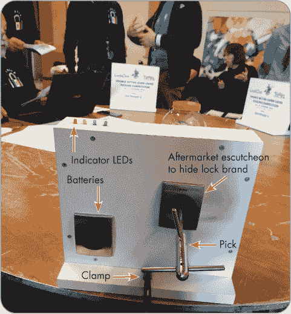

*图 17-9：LockCon 2019 比赛锁*

这些定制的、相同的比赛设备显然并不便宜！每把锁本身的价格超过 60 美元（50 欧元）。这些工具是根据锁的特点定制的，价格超过了锁本身的两倍。Parmakey 制作了 10 个开锁工具并带来了 10 把锁，电子安装块遮住了整个锁具。（例如，如果能看到一组三个圆形螺栓或面板，会给熟悉这些锁的人带来优势。）

#### *2022 LockCon*

Nigel 在 2022 年活动中举办了一个小型杠杆锁开锁比赛，使用的是单次扔投、带帘、五杠杆 Kibb 死锁（见图 17-10）。四个锁经过改装，使得锁栓无法完全缩回，而是触发一个微动开关，进而停止电子计时器。这避免了需要使用钥匙重置锁的情况。比赛还提供了十套帘状开锁工具。

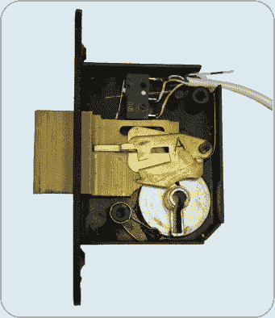

*图 17-10：2022 年 LockCon 大会上使用的单次扔投、带帘、五杠杆 Kibb 死锁*

你可以在图 17-11 中看到一些典型的杠杆修改。顶部的杠杆未经过修改，带有方形门限防挑装置。杠杆 A 中的防挑装置几乎完全被打磨掉，这意味着这个杠杆在开锁顺序中会非常晚才卡住，并且容易正确设置。通过打磨杠杆 B 中方形门限的下缘，使得将杠杆从防挑装置中挑出来比完全重置要容易得多。还有一个杠杆被完全拆解，仅剩下一个华丽的间隔垫圈，除非杠杆被抬得过高，否则基座根本不会接触到它。

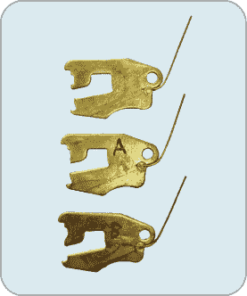

*图 17-11：杠杆修改*

图 17-12 展示了这个系统的使用。重型虎钳将锁牢牢固定住。红色和黑色电线为计时器提供电力，而白色电线则连接到锁壳内的微动开关。这个帘状挑锁工具是 Nigel 自己设计的。

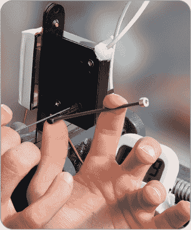

*图 17-12：在 2022 年 LockCon 大会上挑开修改版 Kibb 死锁*

**注意**

*MLA 考试中的一个巧妙技巧是将保持器直接拧到锁座的面板上。这可以防止有人通过窥视面板来接触到锁栓或识别锁。在图 17-12 中，保持器直接与锁座螺栓固定，剩余的空隙则用胶带覆盖。*

本次活动的计划是为前四名选手更换另一套未修改的杠杆作为决赛环节。然而，尽管杠杆已修改，门限已加宽，防挑装置已移除，这个实际上是四杠杆的“资格赛”锁仍然过于困难，即使是多次尝试后，仍然很少有人能在 10 分钟内打开它。

#### *其他托管考虑事项*

如你所见，举办这样的比赛要求很高。时间和资金的投入非常大。工具的最低价格大约在 87 美元（70 英镑）左右，虽然这些锁可能相对便宜，但它们需要修改，以确保能够在七分钟的时间限制内打开。例如，你需要有一种快速的方式来重置多次扔投的锁，特别是当它们没有完全扔动时。你还需要修改标准钥匙，以适应锁本来设计用来防止的这种情况；对于某些型号来说，这种修改比其他型号更容易。

所有杠杆锁应该是全新或较新的，并且你需要确保它们经过维护，并尽可能做到一致。再加上一把台钳，可能还需要一个定制的支架来固定锁具，每个工作站的成本就很容易超过$125（£100）。

### 总结

这里列出的技巧和流程应该能让你在竞争对手中占据明显优势。试着获取一些通用的杠杆锁和锁挑工具，进行实际的挑锁练习，咱们很快就会在领奖台上见面！

如果你决定举办自己的活动，至少现在你已经了解了这项任务的潜在规模。但不要因此而气馁。如果你能发挥创意，可能会找到解决挑战的方法。如果你真的举办了活动，我们希望你能邀请我们！
