## 第七章：**A

其他锁具运动游戏**


恭喜，你现在已经掌握了应对全球锁具运动赛事主要比赛所需的所有技巧！在本附录中，我们将讨论一些在会议上或由锁具运动组织举办的常见锁具游戏，但它们并不属于主要比赛内容。我们将涵盖计时正面对抗挑战；一种锁具运动版的井字棋；逃脱挑战；自行车锁解码；以及以间谍为主题的比赛“房间”。最后，我们将介绍 Reddit 的等级系统，这是一种挑战自我并获得在线锁具运动社区公开赞誉的方式。

### 计时正面对抗挑战

在像 ShmooCon、DEF CON 和各种 BSides 事件等会议中，经常出现的一项比赛是计时的*正面对抗死锁挑选挑战*（图 A-1）。参赛者坐在木制支架前，每个支架上都安装有一个针式死锁。每把死锁都是相同品牌，所有锁的钥匙都是一样的（内部结构相同）。每个支架都有一个内建开关，直到锁被打开时，这个开关才会被压下。这些开关连接到电路板或小型计算机，通常是 Arduino 或 Raspberry Pi，连接到计时器显示屏，显示触发开关时的开启时间。


*图 A-1：信息安全会议上的正面对抗计时挑战*

当比赛组织者宣布开始时，参赛者尽可能快速地开锁。有时，每组中最快打开锁的人会被称为赢家，但更多时候，每个参赛者的时间都会在一天内被记录下来，最终最快的时间会赢得奖品。

在美国至少使用了四种支架设计：其中两个由印第安纳州锁具运动兄弟会（FOOLS）俱乐部的 Dosman（@dossman33）设计（图 A-2），一个是 TOOOL US 在大型会议上使用的（图 A-3），还有一个是 Matt 和他的朋友兼黑客同伴 volty 为西雅图周边的活动设计的。这些设计中，三个功能上对参赛者而言是相同的，尽管 Dosman 设计的其中一个还加入了震动马达，使锁具晃动，增加了难度。这个支架被称为震动挑战。

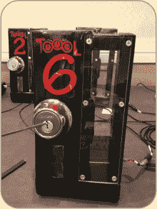

*图 A-2：Dosman 在 ShmooCon 上的非震动支架之一*

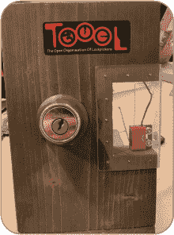

*图 A-3：TOOOL US 其中一个支架*

#### *计时挑战技巧*

初看之下，计时挑战似乎非常简单：你只需要开锁一把，而且通常这把锁也不是高安全性的型号。然而，有几个因素让这个挑战与众不同。

第一项是支架本身。将锁具固定在板子上可能会让那些通常手持锁具或将锁具固定在符合自己角度的虎钳中的锁匠感到惊讶。由于这种姿势可能会让你感到不适，建议你在参加比赛前练习使用固定在垂直表面的锁具。你也可以向裁判询问比赛前是否可以移动支架；将支架放在腿上可能会更舒适。

第二，与大多数锁匠竞技比赛不同，在这个赛事中，插头转动的方向非常重要。解锁死锁需要回缩锁舌，这意味着插头需要朝锁舌的相反方向旋转。你需要顺时针还是逆时针转动插头，取决于锁具的安装方式。对于图 A-2 中的支架，你需要逆时针转动插头才能解锁。许多参赛者会错过这个细节，浪费宝贵的时间错误地转动插头。

第三，关于开始撬锁前是否可以放置张力扳手的规则在不同的比赛中可能有所不同。提前放置扳手可以节省宝贵的时间，因此比赛开始前一定要向裁判询问是否允许这样做。如果不允许，询问是否可以至少先测试各种转动工具，看看哪个最合适。

第四，与他人正面交锋可能会让人感到紧张，尤其是当计时器启动时。尽量集中精力在撬锁上，而不是计时器或其他人的进展。也要尽量忽略旁观者，因为这种比赛具有很强的视觉效果，有时会吸引人群。如果你容易被其他人分心，可以考虑在比赛过程中找个空隙时段再参加。在大型活动中的锁匠村，午餐时间和演讲之间的休息时间通常很忙碌，最好避开那些容易承受压力的人。

最后，检查是否允许重新挑战。一些比赛只允许你重新挑战一定次数（如果允许的话）。其他比赛可能会根据你在比赛中的最佳成绩来评定，或者可能会将所有的时间取平均值。根据规则决定是否值得多次尝试比赛以提高成绩。然而，请考虑到其他参赛者和裁判的时间。即使重赛次数没有限制，如果有一名参赛者在整个活动期间不断尝试比赛，这也可能会让人觉得烦躁，尤其是在裁判需要监督多个赛事的情况下。

#### *DIY 套件说明*

自制定时器可能会很耗时，但相对容易。Matt 已在 GitHub 上发布了运行定时器所需的代码，地址是* [`github.com/mburrough/locktimer`](https://github.com/mburrough/locktimer)*，因此制作定时器套件主要是木工项目。在这里，我们列出制作四个支架所需的材料，但根据需要可以适当增加或减少。如果你使用的是美国式的死锁，我们也指定了材料的英制单位。使用公制单位的材料也应该同样适用。如果你只想为家用练习制作一套，只需按四分之一量购买材料。

+   四个双面死锁，钥匙相同

+   四英尺的 2"×4"木材

+   七英尺的 2"×6"木材

+   树莓派，型号 3 或更高（包含电源线和 microSD 卡）

+   USB 鼠标和键盘

+   HDMI 电缆

+   MicroSD 卡读卡器

+   四个微动开关，类似于街机游戏中使用的开关，每个锁一个（例如，*[`www.adafruit.com/product/819`](https://www.adafruit.com/product/819)*的带滚轮杆的微动开关）

+   一个带 HDMI 输入的显示器或电视，足够大让所有参赛者都能看到

+   漆（喷漆效果很好）

+   八个 6 英寸螺丝

+   十二个 3 英寸螺丝

+   十六个 0.75 英寸带托架（宽头）的螺丝

+   八个 0.5 英寸螺丝，用于固定微动开关

+   五根以太网电缆（第五根电缆会被剥皮以供焊接到开关上）

+   八个以太网/RJ45 端口插座

+   四个表面安装的端口插座盒（类似* [`www.monoprice.com/product?p_id=7089`](https://www.monoprice.com/product?p_id=7089)*的表面安装 2 端口盒）

+   焊锡

+   十六个粘性橡胶脚垫

+   一个插座盒

+   一个四端口的网络插座面板

+   四片透明有机玻璃，切割成大约 4"×6"

除了这些零件，你还需要一些工具：

+   电钻

+   电钻钻头

+   锯子

+   电钻螺丝刀头

+   焊接铁

+   电线剪/剥线器

+   门锁安装工具包（在五金店销售；包括两个孔锯和一个塑料模板，帮助钻孔）

+   砂纸

+   木工路由器和刀具

##### **制作支架**

按照以下步骤组装支架：

1.  将 2"×6"的木板切割成四段 12 英寸和四段 9 英寸，并将 2"×4"的木板切割成四段 12 英寸。较长的 2"×6"木条将作为门，用于安装死锁。2"×4"木条将作为门框，锁舌穿过的地方。最后，较短的 2"×6"木条将作为支架的底座。

1.  在 2"×6"的 12 英寸部分钻一个大孔来安装锁。死锁的中心应距木板顶部约 4.5 英寸。使用门锁安装工具包中提供的模板，在 2"×6"的侧面钻一个小孔，让锁舌通过。

1.  一旦孔洞钻好，按照随锁附带的说明安装死锁。确保所有孔洞对齐，锁工作正常。请注意，门的厚度略大于 2"×6" 的木材，因此如果锁无法顺畅工作，可能需要调整螺钉的紧固度。使用钥匙扩展（锁住）螺栓。

1.  接下来，将 2"×4" 与 2"×6" 对齐。标记螺栓需要进入 2"×4" 的位置及其深度，并用铅笔将此位置标记在 2"×4" 上。同时，在 2"×4" 上放置一个微开关，确定当螺栓启动时，开关会被压下的位置，并同样进行标记。

1.  使用木工路由器，在 2"×4" 上开凿出一个足够大的口袋，使螺栓能够完全伸展，并为开关提供足够空间（参见图 A-4）。螺栓下方的部分可能需要比开关下方的部分更深，以便开关的触臂能够击中螺栓的中心。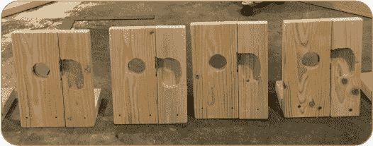

    *图 A-4：一批已钻好锁孔、并为螺栓和开关切割了口袋的支架*

    **注意**

    *此时，你可以从 2"×6" 上拆下锁，并打磨和涂漆所有木质部件。然而，我们更倾向于先建造整个支架，以确保一切正常工作，然后再拆解并最后涂漆*。

1.  重新对齐 2"×4" 和 2"×6" 木板，并确认锁仍然有效。如果有效，使用 6" 螺钉通过 2"×4" 的边缘钻入两个导孔，一个靠近顶部，另一个靠近底部，然后用螺钉将两块木板连接在一起（参见图 A-5 查看已完成支架的示例）。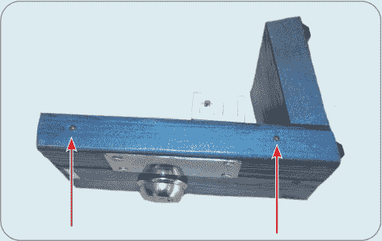

    *图 A-5：两颗 6" 螺钉将 2"×4" 木板固定在完成支架上的 2"×6" 木板上*

1.  确定开关需要放置在口袋中的位置，并为安装开关钻两个导孔。同时，在微开关下方的 2"×4" 木板上钻一个孔，完全穿过木板以供电线通过。

1.  将一根以太网电缆剪成 6" 长度。从电缆外皮中取出单根电线。从两根电线的一端剥去 0.75" 的绝缘层。用电烙铁将两根电线焊接到开关的端子上。如果开关有三个端子，使用常闭端子（NC）和公共端子（com）。

1.  等待焊料冷却后，将开关放入口袋中，并将电线推过孔洞，穿到支架背面。拧紧开关，并确认螺栓能够完全伸展，并且开关被螺栓压下。

    在支架的背面，将接线盒安装到电线突出的位置。RJ45 接线盒应附带一个打线工具；使用该工具将电线插入插座的任意两个位置。（图 A-6 中示例使用了橙色和白色橙色电缆，但只要保持一致，使用其他颜色也没关系。）修剪掉多余的电线。将插座插入接线盒并关闭盒子。

    

    *图 A-6：完成的支架背面，带有开放式接线盒（左）以及电线进入 RJ45 插座的特写*

1.  在其中一块有机玻璃的每个角落钻一个孔。为了避免有机玻璃裂开，钻孔时离边缘不要小于半英寸，如果可能的话，使用专为有机玻璃设计的钻头（我们推荐*TAP Plastics*的钻头，网址是*[`www.tapplastics.com`](https://www.tapplastics.com)*）。使用桁架头螺钉，将有机玻璃固定在 2"×4"板的口袋上（见图 A-7）。这样可以让参赛者看到螺栓，但无法触碰开关或电线。

1.  最后，在 2"×6"板的前面距离底部三分之四英寸的地方钻两个引导孔，在 2"×4"板的底部再钻一个。小心不要打到连接板的 6"螺丝。使用这些引导孔，用 3"螺丝将 9 英寸的 2"×6"固定，如图 A-7 所示。

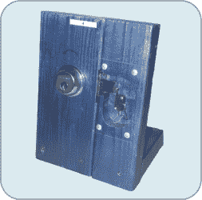

*图 A-7：完成的支架*

现在，你应该已经完成了一个能够独立站立的支架。如果一切看起来正常，重复整个过程三次。如果你还没有给它们上漆，现在可以将它们拆开，打磨掉任何粗糙的边缘，涂漆并晾干。漆干后，重新组装并将橡胶脚固定到底部。

##### **设置树莓派**

在搭建好支架后，你需要连接树莓派。使用更多的废弃 Cat5 电缆，将两根 8 英寸的线穿入剩余的四个 RJ45 插座。确保在插座上使用和支架上选择的相同位置。将这些电线通过插座盒上的孔穿出，将插座插入四孔接线板，并用附带的螺丝将接线板固定到盒子上。

确保树莓派已经断电；然后将每个插座的一根电线焊接到树莓派的接地引脚位置。对于你想在第一个支架上使用的插座，将剩下的一根电线焊接到树莓派的 GPIO 4 引脚。将第二个支架的剩余电线焊接到 GPIO 17，引脚 27 连接到第三个支架，GPIO 22 连接到第四个支架。

将每根以太网电缆的一端插入每个支架上的插座，另一端插入现在连接到树莓派的插座。将 USB 键盘和鼠标连接到树莓派，使用 HDMI 端口连接显示器。

在计算机上，按照*[`www.raspberrypi.org/software/`](https://www.raspberrypi.org/software/)*上的说明，安装 Raspberry Pi OS 到 Pi 的 SD 卡中。将 SD 卡插入 Pi，启动并登录。接下来，你需要下载 locktimer 程序。将 Pi 连接到互联网，然后打开终端窗口，输入以下命令：

```
sudo pip install guizero
git clone https://github.com/mburrough/locktimer/
cd locktimer
python timer.py
```

这将安装 guizero，这是 locktimer 使用的一个 Python 库，接着是安装 locktimer 本身。然后，你需要进入 locktimer 目录来运行它。

现在你应该能看到 locktimer 界面。如果程序无法适应屏幕大小，可以在最后一步运行 timer-720.py。

##### **进行比赛**

现在是时候设置一场比赛了！首先，确保所有的锁都已经上锁，并且所有的立柱已经插入到 Pi 中。点击**重置+开始**按钮以启动计时器。你应该看到四个独立的位置显示为`LOCKED`，以及一个更大的整体计时器。一旦某个锁被打开，该位置的时间将取代`LOCKED`，但其他位置的计时器仍将继续运行。所有锁都打开后，整体计时器也会停止。

**注意**

*定时器代码是为四个玩家的四立柱设置编写的。如果你想增加或减少立柱数量，你需要编辑代码*。

如果你想随时停止计时器，点击**停止**。点击重置+开始将所有计时器重置为 0，并重新开始计时。

确保手边有钥匙，以便重置锁具，这样你就不必再次开锁再上锁。考虑使用双面死锁，而不是背部带有旋钮的单面螺栓，以帮助防止作弊。

### PicTacToe

另一场面对面的开锁比赛是*PicTacToe*™（参见图 A-8），由 FoxPick 创建。在这个锁具版井字棋游戏中，两位玩家争先恐后地在一个发光的 3×3 网格中连成三锁。


*图 A-8：FoxPick 的 Jenee Rogers 准备开始一场 PicTacToe 游戏*

游戏玩法非常简单：每个玩家都获得一个包含九把锁的电子游戏板，并且有张力工具和开锁工具。禁止使用梳子。所有的锁最初都以蓝色发光，如图 A-8 所示。当玩家打开一把锁时，它会在他们的游戏板上变为绿色。对方的游戏板上相应的锁会变为红色，表示那个位置已被占用。第一个在垂直、水平或对角线方向上连续打开三把绿色锁的玩家获胜，并且获胜的连线会闪烁。如果是平局（如图 A-9 所示），双方的游戏板都会闪烁。游戏结束后，组织者按下两个重置按钮，这会清除游戏板并重新上锁所有锁具。

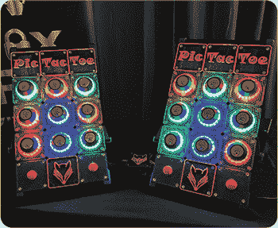

*图 A-9：一场以平局结束的 PicTacToe 游戏*

#### *PicTacToe 提示*

由于这是一款相对较新的游戏，我们至今还没有机会尝试 PicTacToe。幸运的是，FoxPick 的友好人士为参赛者提供了一些建议。首先，和一对一挑战一样，玩家应该练习在板子上开锁。由于 PicTacToe 的棋盘比一对一锁具支架要大，玩家将无法对锁的位置或角度进行显著调整。

第二，PicTacToe 中的锁并不完全相同。中心锁是最难的，角落锁的难度适中，剩下的四个锁是最容易的。在比赛开始之前，制定一个锁定目标的策略，确定先选择哪个锁，计划好选取哪一行/列/对角线，将在比赛中节省时间。

第三，既然不允许使用起子，练习使用标准钩子开锁。你可能还想用与平时不同的开锁工具进行练习。因为提供了工具，所以最好能熟练使用一个你不太喜欢的工具。

最后，这是一个玩家对玩家的竞赛，因此，练习在压力下与他人对战开锁是个好主意。还可以考虑，你是仅仅为了打开需要的锁，还是通过锁定对方选择的行中的某个锁来阻止对手。

### 逃脱挑战

*逃脱挑战*是一种游戏，曾经在各种会议中定期举行，现在偶尔还会出现。其前提是参赛者被非法拘禁，必须设法从囚禁者手中逃脱。在最初的版本中，由 Deviant Ollam 创建，假设的场景是参赛者被腐败警察拘禁在一个外国，他们的护照和钱包被没收并锁在文件柜中，但他们藏匿的开锁工具被忽略了。

参赛者开始时被戴上手铐，五分钟内需要解开手铐，开锁自己的牢房或审讯室的锁，开文件柜锁取回护照，制服一名守卫，开储物柜锁获取守卫制服伪装，开通往外面的门的锁，最后可以选择开车锁作为逃逸工具。

**警告**

*虽然想象逃脱抓捕者或扮演秘密特工可能很有趣，但不要将你的开锁技巧用于实际抗拒逮捕或试图逃脱警察的追捕。这样做是非法且危险的，更重要的是，它违反了第一章中描述的规则。*

当然，整个监狱无法被运输到全球所有比赛现场，因此使用了合适的替代品。一副手铐、几个插销锁、一把薄片柜锁、一把挂锁和一个点火锁代表了场景中描述的锁具。为了让这场游戏对专业和新手锁匠都能既具可玩性又充满乐趣，游戏组织者为挑战的每个阶段提供了几种不同难度的锁。得分是根据每个阶段开锁的难度来决定的，对于更快速的逃脱会额外加分。

原版的这个挑战在 ShmooCon、Ekoparty 和 DEF CON 等会议上举办了好几年，但它在 2011 年正式退休。然而，这个游戏的变种依然存在，每隔几年会在信息安全会议上出现。例如，在 2017 年的 ShmooCon 上就有一个间谍主题的挑战。在这个变种中，两个参赛者进行了对决，他们必须从手铐中逃脱，开一个插销锁才能脱离房间，再开一个旋转电话拨号锁（薄片锁）来呼叫支援，最后开一个挂锁，拿到一个装有 Nerf 枪的旅行包，并用它射击最终目标进行逃脱（见图 A-10）。

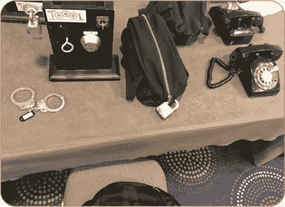

*图 A-10：在 2017 年 ShmooCon 上的一个模拟监狱逃脱风格的比赛中，参赛者需要克服的各种锁具*

#### *逃脱挑战提示*

这些比赛中的大多数锁具，如插销锁和挂锁，是大多数锁匠都曾经开锁过的——即使他们没有在手机或旅行包上见过它们。就像定时开锁挑战一样，唯一真正的难题是以一个可能不太舒服的角度开锁，并确保你转动插销的方向正确。然而，逃脱挑战中的其他锁具可能对你来说是新的。我们将从手铐开始，然后再看看薄片锁。

##### **手铐**

手铐已经存在了几个世纪，并且在其历史中使用了多种款式和锁定机制。也就是说，在许多国家，最常见的手铐是有棘齿的腕部手铐，通过几根链条连接，像图 A-11 中那样的。这些手铐由 Peerless 手铐公司、ASP 和史密斯威森公司等制造。

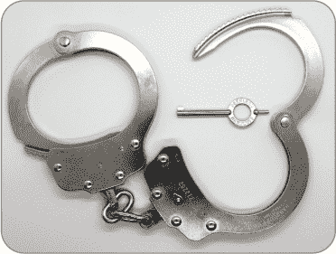

*图 A-11：一副标准的手铐*

这些手铐的工作原理都是相同的：每只手腕的手铐一半通过铆接铰链点打开，末端有一系列齿轮。这个部分，称为*单股线*，功能上等同于挂锁的锁链。这些单股线的齿轮与手铐外壳内的*棘爪*相互作用，棘爪是一个带有几个齿轮的弹簧加载金属片，类似于挂锁中的锁舌（见图 A-12）。这些手铐的锁定机制本质上是一个有挡板的锁。钥匙上的一个小凸起压下棘爪的尖端，使其从单股线的齿轮中退回，从而解锁手铐。

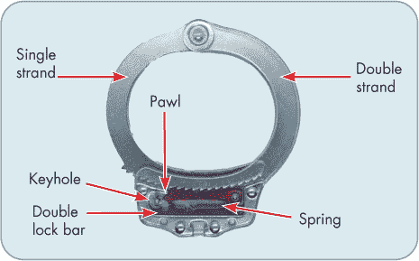

*图 A-12：标准手铐的剖视图*

由于手铐是棘轮式的，因此它们容易受到类似于带有锁舌的挂锁的垫片攻击。通过将一块薄金属片滑入单股线和棘爪之间，你可以压下棘爪，解开齿轮，并拉动单股线使其打开。图 A-13 显示了 Matt 在比赛中使用一根薄的扭力扳手来实现这一目的。市面上也有更薄的商业化手铐垫片，它们也能很好地工作，并可以从像 Serepick (*[`www.serepick.com`](https://www.serepick.com)*) 或 Handcuff Warehouse (*[`www.handcuffwarehouse.com`](https://www.handcuffwarehouse.com)*) 等零售商那里购买。

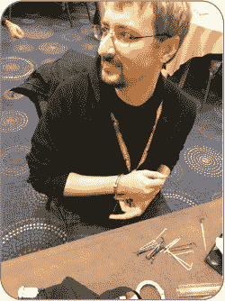

*图 A-13：Matt 在 ShmooCon 上用垫片解开手铐*

**注意**

*将一块金属片放入单股线的齿轮和棘爪之间可能需要相当大的力，可能需要你将手铐撞击在硬物表面上。小心，这很容易导致手腕淤伤，正如 Matt 在这张照片拍摄后不久所证明的那样。*

使用垫片非常简单：将金属尖端插入单股线下方的外壳中，施加压力在垫片上，然后将单股线拧紧一档。当单股线的齿轮压下棘爪时，垫片应该会在棘爪和齿轮之间滑动，从而使你能够拉回单股线以释放它。

意识到设计中的这一问题，手铐制造商已经使大多数现代手铐具备了*双重锁定*功能：在手铐施加后，棘爪下方的第二块金属片可以推动到位，阻止棘爪下移。这不仅防止了垫片攻击，也作为手铐佩戴者的安全功能；当手铐处于双重锁定状态时，无法进一步紧缩，因此不会意外地勒紧佩戴者的手腕。要解开双重锁定的手铐，必须先将手铐钥匙朝一个方向旋转以释放双重锁定，再朝相反方向旋转以降低棘爪。

在比赛中，双重锁定很少被应用。通常，唯一的额外难度是手铐的放置：在背后。如果你很灵活，可能可以通过尝试像跳绳一样跨越自己的手臂，或者将手臂举过头顶来克服这一点。

如果手铐是双重锁定的，你将无法撬开它们，因此只能挑锁或使用手铐钥匙。我们建议从标准的开锁工具套件中选择短钩或半钻形工具，但如果你有任何凹形锁挑锁工具，可能会更有效。将工具垂直插入手铐的钥匙孔，如图 A-14 所示。

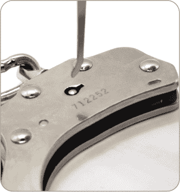

*图 A-14：打开手铐时挑锁工具的正确方向*

尝试推开双重锁定杆，然后用挑锁工具的尖端卡住棘爪。锁杆位于手铐底部，靠近链条，而棘爪则更靠近手腕，如图 A-15 所示。

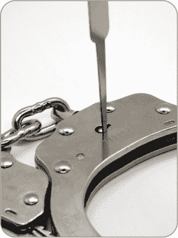

*图 A-15：顺时针旋转取锁工具以释放双重锁，逆时针旋转以收回棘爪*

使用挑锁工具打开手铐可能很棘手，尤其是当手铐的钥匙孔面朝外时。另一种选择是自带手铐钥匙（参见图 A-16 的示例）。绝大多数手铐都可以使用通用手铐钥匙打开，你可以在线购买几美元一把。有些通用钥匙做成拉链拉头、纽扣、硬币和袖扣的样式，以便易于隐藏。务必与比赛组织者确认这些是否被允许。在一些比赛中，它们是完全禁止的，而在另一些比赛中使用它们可能会扣分。它们也可能是非法的，因此请检查当地法律！

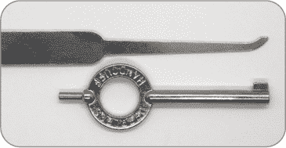

*图 A-16：标准的钩形挑锁配置（上）和手铐钥匙（下）。钥匙背面的“尖刺”（弯头左侧）用于一些手铐型号的双重锁*。

为了准备这样的比赛，你可能想要自己购买一副手铐。同样，请检查当地法律确保拥有它们是合法的。如果合法，我们建议避免使用像图 A-12 中示例的透明或开窗式手铐。这些手铐的亚克力材料较脆弱，尝试撬锁或挑锁时可能会破裂。考虑购买颜色不同于流行的金属银色或黑色的手铐，这样可以方便跟踪它们。如果你已经有了一副银色手铐，你可以添加一些装饰使它们更加显眼。

最后，*最重要的是*：在玩手铐时，始终备有几把备用钥匙，并且与朋友一起练习。你不想掉落钥匙后无法取回它！

##### **栅格锁**

从锁具运动的角度来看，文件柜、电话拨号锁甚至车辆上的瓦片锁可能对你来说是陌生的。瓦片锁与插销锁类似，它们包含多个阻挡元件，需要将这些元件提升到正确的高度才能让插芯旋转，因此可以像对待插销锁一样对待瓦片锁。然而，当你处理瓦片时，你应该了解一些技巧和注意事项。

首先，瓦片是平板状的，而不像插销那样是圆柱形的。它们没有剪切线，但如果你将它们抬得太高，它们会在插芯顶部卡住，而不是在底部卡住。特别锋利或使用过于激烈的刷子可能会卡住瓦片，可能会损坏瓦片本身、用来固定它们的小弹簧，甚至损坏刷子本身。

其次，瓦片可以从钥匙槽的顶部和底部出来，因此在某些锁具上，你需要将一些瓦片向上移动，一些瓦片向下移动。由于这个原因，*球头*和*双球头*拨片（也叫*雪人*拨片），如图 A-17 所示，是瓦片锁常见的选择。虽然这些拨片在插销锁的拨动中常常不被看好，但它们的柔和曲线和双面设计在瓦片锁上表现良好。话虽如此，普通的钩子和刷子同样可以用在瓦片锁上。

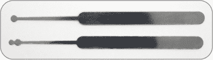

*图 A-17：单球头和双球头拨片*

接下来，大多数瓦片锁只包含少量的瓦片。对于文件柜类型的锁，通常有三到五片瓦片。此外，它们的公差通常较差，这意味着瓦片的高度并未精确设置到正确的标准高度。结合起来，这两个特征意味着钥匙形状的物品可能就能打开这样的锁。进入*瓦片拨动器*套件：薄金属片被切割成看起来有些像钥匙的形状，如图 A-18 所示。通过将这些拨动器（一次插入一片）插入锁中，并使用摆动、刷动或拨动的动作，你有很大机会打开锁。你可以从许多和常规锁拨片一样的卖家处购买这些拨动器。

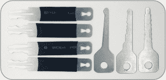

*图 A-18：两套瓦片拨动器*

打开瓦片锁的另一种方法是使用一块平金属片，比如拨片的把手或一把合适的未切割钥匙。将物体完全插入钥匙槽，既用它来提升所有瓦片，又施加轻微的旋转压力在插芯上。然后，在持续施加转动压力的同时，慢慢拉出物体。由于横向压力，瓦片在下落时可能会卡在锁壳上，从而使插芯得以旋转。这可能需要一些练习，并且在高质量的锁上可能不奏效。

如果所有这些方法都失败了，可以尝试用单钩挑选片或使用最不具攻击性的梳子进行扫锁。最后提醒一句：有些片式插销是通过锁内最靠后的片式组件固定在外壳中的，这个片与其他片通常距离较远。如果你挑到这个片（特别是当你在用梳子扫锁时），整个插销会从锁中脱落。这一特点使得特殊的钥匙可以将插销移除，从而便于重新设置锁芯。如果发生这种情况，你可能仍然能通过将工具伸入外壳的后部，旋转凸轮或直接操作锁舌来打开锁。要重新安装插销，只需压下片式插销使其与插销平齐，然后将插销滑回外壳中。

### 直接输入链条和电缆锁

在锁具竞赛的非正式比赛中，你会经常遇到*直接输入*的组合密码锁和便宜的自行车链条，它们有太多不同的变种和制造商，无法一一列举。通常这些锁有三、四个，偶尔也有五个密码轮，像图 A-19 中显示的那样。每个密码轮上都有一个门口，齿轮可以通过门口，所以当所有门口对齐时，所有齿轮都能通过，锁就会打开。更好的锁具会包括一个或两个较小的假门口，齿轮无法通过，从而增加找到真正门口的难度。

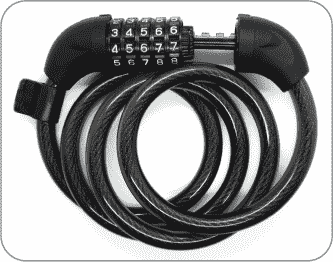

*图 A-19：一个部分打开的五轮直接输入电缆锁*

和往常一样，你需要给锁施加张力并寻找卡住的元素。拉动栓会导致一个或多个轮子倾斜或卡住齿轮（见图 A-20）。只需找到卡住的轮子（它是最难转动的轮子），旋转它直到它松动，或者变得松弛或摇晃。通常栓也会稍微滑出一点。现在定位下一个卡住的轮子，并重复这个过程直到锁打开。

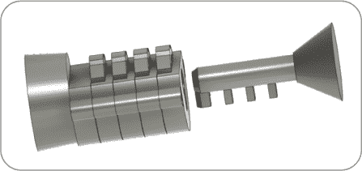

*图 A-20：直接输入组合锁的轮子（左）和栓（右）*

图 A-21 显示了锁的横截面。你可以看到蓝色的栓直接与黄色的轮子互动。外壳是红色的。左边的两个轮子仍然阻挡着栓，防止它被移除，右边的两个轮子处于真正的门口状态。在大强度的张力下，右侧的两个轮子会松动晃动，另两个则会被卡住。

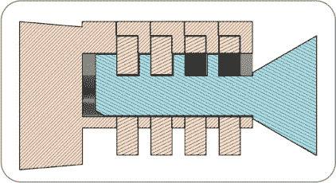

*图 A-21：与轮子互动的栓的横截面*

当你遇到反操控假门时，你通常会发现它们较小。通过练习，你可以通过触感区分真假门；真假门的锁链会有不同的松动度，真假门的锁链会稍微多一些松动。即使你还没有完全掌握区分真假门的方法，一旦所有位置都设定好，你也能轻易识别出哪个轮子处于假门位置，因为它会再次卡住。通常每个轮子上只有一个假门，通常位于真门的正对面。然而，有时也会在整个锁链上等间隔地分布两个或四个假门。

一些更好的设计配有释放按钮，用于解开链条，你可能需要按下它来张紧锁。通过练习，你将能够让朋友们惊讶于你打开这些锁的速度。

### 房间

在 2019 年荷兰举行的 HackerHotel 大会上，来自 TOOOL NL 的锁匠 Jos、Jan-Willem Markus 和 Rob Wiegertjes 介绍了一项名为“The Room”的新比赛。这是一项以间谍/侦探为主题的情景挑战。参赛队伍被分配七分钟的时间进入一个布置好的酒店房间，尽可能收集关于房间住客的信息，同时不留下他们进入房间的任何痕迹。有关 2019 年活动的视频，请参见*[`blackbag.toool.nl/?p=2772`](https://blackbag.toool.nl/?p=2772)*。

虽然这项挑战并非完全以锁匠运动为重点，但它具有一些有趣的锁相关方面。首先，参赛队伍必须找到进入房间的方法。你将会获得一个*门下工具*：一根大约 100 厘米（40 英寸）长的坚硬金属线，一端弯曲成手柄，另一端弯曲成钩形，如图 A-22 所示。一个稍长于刚性金属线的柔性金属线连接在钩端。你将工具插入门底和地板之间的缝隙，旋转工具使其钩住门把手。拉动柔性金属线时，刚性金属线会弯曲，从而拉下门把手。

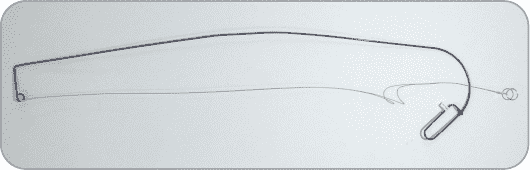

*图 A-22：一款门下工具*

在图 A-23 中，你可以看到沃尔特使用门下工具打开一扇玻璃门。由于大多数商业门在拉动内侧把手时会自动解锁，这个工具让你无需钥匙即可打开门。

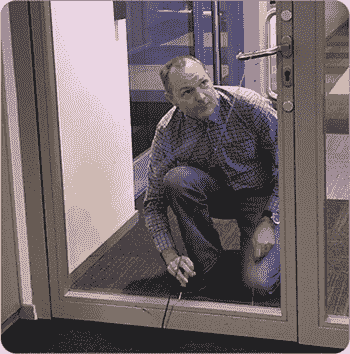

*图 A-23：沃尔特使用门下工具*

一旦进入房间，队伍必须从几个上锁的物品中获取证据。这些上锁的物品每年都会有所变化，但过去的例子包括现金盒上的薄片锁（图 A-24），带有电子密码键盘的酒店房间保险箱，三轮组合锁的公文包，以及锁箱上的高安全性挂锁。你可以通过多种方式接近这些锁，但请记住，你的任务之一是不留下痕迹，所以完成后必须将它们恢复到上锁状态。

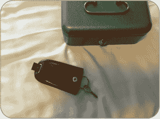

*图 A-24：来自《密室》的钥匙锁盒*

有时你可以像解锁直入式自行车锁那样解码公文包的轮式锁——按下公文包上的释放按钮，同时旋转轮子。如果这样不起作用，你可以尝试把一片薄金属片插入轮子和锁壳之间，旋转轮子，尝试感觉轮子上是否有任何凹槽或平坦部分；然后对其他轮子重复这一过程。如果你在每个轮子上找到了平坦部分或凹槽，但公文包仍然打不开，那就把所有的轮子朝同一方向旋转，重新尝试。例如，如果你在 3-7-2 处找到了凹槽，试试 4-8-3，再试 5-9-4，依此类推。许多轮式组合锁，如在图 A-25 中展示的锁，可以通过这种方式解码。

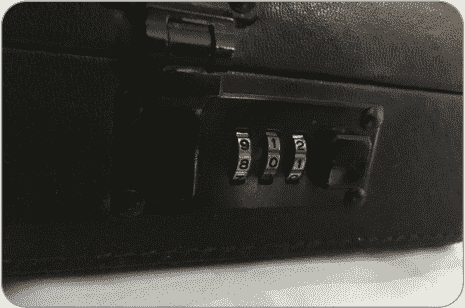

*图 A-25：在《密室》中使用的公文包密码锁*

对于其他锁具，比如在图 A-26 中展示的电子保险箱锁，你需要在房间里寻找线索。你可能会发现写着三位或四位数字的地方，这些数字可能会解开组合锁，或者你可能会找到隐藏的钥匙，用来打开那些在有限时间内不现实用工具开启的钥匙锁。

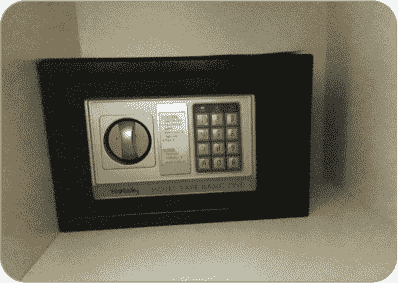

*图 A-26：在《密室》中使用的电子保险箱*

开锁最多，甚至获取最多证据，并不能保证在这场游戏中获胜。更重要的是留下没有任何你存在的痕迹。2019 年比赛中的获胜队伍给出的建议是：拍大量的照片。照片不仅可以作为证据的副本，还可以用来参考物品在房间中的原始位置，从而确保你能准确地把所有东西放回原位。该队在七分钟的比赛中拍摄了超过 850 张照片。

第二，记得戴手套。接触房间里的物品会留下指纹，这会对你不利。你可以更进一步，戴上面具，以避免在隐藏的摄像头中被识别。更极端一点，你还可以考虑给鞋子穿上保护罩，以避免带入泥土。

第三，假设调查对象非常注重细节。这意味着仅仅把物品放回你找到的地方是不够的；你还必须按照你找到时的方式把它们放回。例如，如果一支笔放在笔记本的边缘，并指向门口，在离开之前一定要确保它保持相同的朝向。

第四，切勿带走房间中的物品。即使某些东西看起来像是没人会注意到的垃圾，或者只是一张纸片从一大堆纸中取出，调查对象很可能会注意到它。同样，带进房间的任何物品也不要丢弃或遗留。

最后，记得尽可能地查看每个地方。物品可能藏在不寻常的地方，比如床垫下、枕套里、垃圾袋里或者贴在抽屉底部。仅仅找到显而易见的物品并不足以赢得比赛。

### 皮带系统

受到武术启发，Reddit 开锁社区的组织者在 *[`www.reddit.com/r/lockpicking/`](https://www.reddit.com/r/lockpicking/)* 上开发了一种基于颜色的腰带排名系统，用于分类不同品牌和型号锁具的开锁难度。能够证明自己已开锁并且满足与特定腰带颜色相关的其他要求的子版块成员，将获得该腰带作为其 Reddit 个人资料和 Lockpickers United Discord 服务器的荣誉标志（参见图 A-27）。

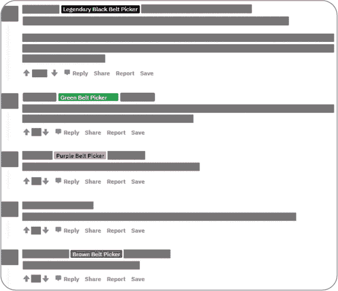

*图 A-27：一段已编辑的 Reddit 线程，展示了用户的腰带荣誉标志*

对于初级段位，你只需提交一张已开锁的照片即可获得该段位。中级段位要求你提交一段视频，展示开锁和拆解过程，证明该锁没有经过修改以便于开启，并且这一切必须在一次拍摄中完成。对于最高级的段位——包括紫色、棕色、红色和黑色——成员必须在视频中从接受的锁具列表中开锁多个难度较高的锁，并且还必须通过其他方式与社区互动，例如频繁发帖、创建并分享自定义挑战锁，以及制作自定义工具。

举些例子，开任何锁都会让你获得入门级白带；打开并拆解 ABUS 72/40 将获得绿色腰带；Fichet 666 属于棕色腰带级别；ABLOY Protec² 则值得获得黑色腰带。请注意，锁具的具体腰带排名可能会随着时间变化（例如，如果发现了新的开锁方法），因此在尝试获得腰带之前，始终检查子版块中最新的锁具列表。获得腰带的完整标准描述，以及每个腰带段位所对应的锁具列表，可以在 *[`www.reddit.com/r/lockpicking/wiki/beltranking/`](https://www.reddit.com/r/lockpicking/wiki/beltranking/)* 上找到。

该腰带系统是一个有趣的分类方式，对于初学者来说，它可以帮助确定相对而言，打开某个锁具的难度。然而，该系统也有一些反对者。批评的意见包括要求在绿色腰带级别及以上只能使用单销开锁技巧，要求提交视频以证明开锁过程的橙色及以上段位锁具，以及该系统没有考虑锁具的咬合等因素。

如果你喜欢拍摄开锁尝试的过程，享受在 Reddit 或关联的 Discord 服务器上社交，并且喜欢荣誉标志的概念，那么就去试试吧！如果不是，也不要觉得这让你变得不那么厉害。许多高技能的开锁者并不在乎腰带！
