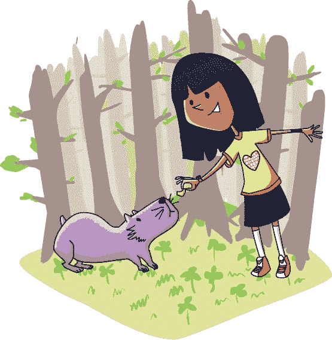

# 第零章 大部分迷路

劳伦·伊普森整整一个上午都在森林里迷路。可怜的女孩不知道自己身在何处，也不知道该往哪里走。

一切始于一次争吵。她妈妈希望她去上暑期学校，而劳里自然不想去。“其他国家的孩子全年上学，”她妈妈说。“我们又不在其他国家，”劳里回答。“额外的课程有助于领先，”妈妈说。“夏天是用来玩乐的，”劳里坚持说。争论持续不断，到最后甚至有些激烈。为了冷静下来，劳里决定去森林里散步。

当人们面临自己不愿做的事情时，他们往往会去做一些自己本不该做的事情。不久，劳里便走得比以前更远，进入了从未涉足的森林深处。

迷路其实有点好玩。在这里，劳里可以做任何她想做的事，没有人能告诉她不行。

她是一个秘密忍者，像幽灵一样穿梭在古老的森林中。光与影在树叶下跳跃，她也与它们一起舞动。没有人能听到她悄无声息的忍者脚步。没有人会看到她靠近，直到为时已晚——

“*奇古里！*”前面传来一个声音。一道身影从黑暗中向她走来。那是一个愤怒的灵魂吗？还是一只恐怖的野兽？

“*阿戈特！*”那生物说道。它像是一只老鼠狗，或者是一只狗老鼠。也就是说，它的体型像狗，但看起来更像老鼠。它直接走到劳里面前，开始用一种非常不像野兽的方式蹭她的手。

“哦，你真友好！”劳里说，语气有点不像个忍者。

“*瑞普！*”它说，边把一只有蹼的脚搭在她的膝盖上。

“你长得真奇怪，不是吗？你叫什么名字，嗯？我应该怎么称呼你？”

“*阿戈特！*”

“好吧，我就叫你阿戈特了。你饿吗？像你这样的……东西吃什么？”她递给它一些花生。

“*斯纳弗尔！*”它发出声音，一边吃着她手里的东西。

“嘿，小家伙，”她说，轻轻地挠了挠它的下巴，“你不知道怎么回哈密尔顿吗？”

“*哈密尔顿！*”它兴奋地说。

“你知道路吗？”

“*拉尔！*”它发出“拉尔”的声音，舌头垂了下来。

“那它在哪儿？”

“*伊斯特！*”它说。

“我是说，我怎么才能到达那里？”

“*给它！*”它回答。

“你就是在重复我说的话，对吧？”

“*你不是吗！*”它说。

“我就知道。动物是不能说话的。”

*所以我现在迷路了*，劳里心里想着，*我该怎么才能不迷路？* 她记得关于苔藓长在树木北侧的事情。可这里没有苔藓，所以这条方法不行。*太阳从东边升起，从西边落下。* 已经是上午晚些时候，太阳几乎在头顶。这个也帮不上忙。

她东张西望，翻动着她幸运的红色扑克筹码。如果筹码正面朝上，她就往左走一段时间。如果背面朝上，她就往右走一段时间。

“*泡泡*……”阿戈特在她后面摇摇晃晃地走，发出一些无意义的声音。

“不，别跟着我，阿戈特。去开！” 

“*比特布利特？*”

“我喜欢你，但我不能养狗。也不能养老鼠，或者养老鼠狗，或者你是什么都行。快走吧——回家去！”

无论她说什么，那只丑陋的小东西都不肯放弃。它似乎愿意一直跟着劳里，直到……她去哪里都行。

*也许等星星出来时，*她在心里想着。*不，那太傻了。我根本不知道哪颗星星是哪颗！*

“*弗罗比特!*”另一只像阿尔戈特的生物，体型更大，从灌木丛中走了出来。它试图舔她的脸。

“呃，你的呼吸好臭！”

“*颤动!*”第三只生物从她身后出现，用头顶撞了她。

“哎呀！你好呀。”

“*坦斯塔夫!*”

“*佐克!*”

更多的生物从四面八方涌来。噪音越来越大。

“呃，”劳里呃了一声。

“*秒差距!*”

“*沃尔夫!*”

“*莉萝!*”

阿尔戈特的朋友们不再只是亲昵地蹭她了。它们挤满了她的周围，推搡着大喊着。她被围攻了。

劳里惊慌失措地跑了起来。那群生物嚎叫着追了上来。

“*奈奎斯特!*”

“*夸克!*”

“*费佛!*”

她几乎站不住，穿过错综复杂的灌木丛，但她太害怕，无法停下来。

她的逃跑被一片高高的绿篱挡住了，这片篱笆延伸向两侧。曾经它可能是花园的一部分，但现在已经变得野性和凌乱。劳里挤过篱笆中的一条缝隙，继续跑，直到她认为自己安全了。那些生物已经远远落在后面。

在篱笆的另一边，森林看起来截然不同。树木有红色和黑色的条纹。黑色的树干分成了两条红色的树枝。那两条再分成四条黑色的树枝，依此类推，直到这些树枝的末端是成千上万的细小黑叶。事实上……

“*福!*”

“*酒吧!*”

“*巴兹!*”

这些生物还在追她！劳里再次试图逃跑，但她跑得很慢。她的喉咙很痛，腿也开始发抖。

“*所见即所得!*”

“救命！停下来！”她喊道，希望有人能听见。“让他们停下来！”

一个背着大包的小个子男子站到了劳里的面前，挡住了人群。锅碗瓢盆和牛铃在他身后碰撞发出响声。那些生物停下了几步远，发出可怕的愤怒声响。

“你没事吧，小姐？”他说。

“这些——这些*老鼠狗*不肯离开我！”

“*埃普西龙!*”

“*欧拉普!*”

“‘这只是一些行话，’他说。‘站住，保持冷静。’他把手捧到嘴边。”

“STANI！”他朝它们喊道。

所有的行话都停了下来，它们的耳朵不停地抖动。

“CEPAT! AFVIGE! *SCHNELL! SCHNELL!*”

就这样，他们消失了，跑进了森林的阴暗处。

劳里靠在一棵树上倒下了。“谢谢，”她说道。

“没问题，小姐。就在这里休息一会儿，”那人说道。他重重地把背包放下，然后坐在了背包上。

“‘什么是行话？’她问道，稍微喘了口气后。”

“行话生物生活在沼泽地里。它们以注意力为食。如果得不到注意力，它们就会满足于恐惧和困惑。”

“但是第一个还挺友好的！我跟它聊了会儿，它就开始跟着我了。”

“这就是开始的样子，”他说。“一点点术语看起来没什么大不了的。有些人甚至把它们当作宠物。但它们会组成群体，而且非常危险。”

“太可怕了！”

他耸耸肩。“能怎么办？站稳脚跟，装作自信。如果你表现出任何害怕，野生术语群就会把你踩过去。”

“你说了什么让它们离开？”

“我也不知道。听起来不错吧？”他说。“那么小姐，你叫什么名字？”

“我叫 Laurie。我想我迷路了。”

“太棒了！”那人说。“我也迷路了。”

“哦不！你是说你不知道自己在哪里？”

“不，我知道我到底在哪里。”

“所以你不知道自己要去哪？”

“我知道自己要去哪。我正在回家的路上。”

Laurie 几乎困惑到不再感到困惑。“但是如果你知道你*在哪里*，”她说，“而且你知道你要*去哪*，那怎么会迷路呢？”

“因为我不知道怎么到那儿，”那人笑了笑。“我是一个流浪销售员。”

“一个流浪销售员？那是什么？”

“我们从一个小镇游荡到另一个小镇，买卖商品。这里有两个规则：你必须去每个小镇，才能回家，而且你不能重复访问任何小镇。每条路都是回家的路，除了我身后的那条路。”

“所以你总是去你从未去过的下一个地方吗？”她问。

“没错！你最终肯定会回家的，”他说。“这很合逻辑。一路上我看到了日出映照在汉诺塔上，还爬上了上界。我坐在查找表旁，漂浮在溢出河上。这是美好的一生。迷路也能很有趣！”

“对我来说已经不好玩了，”Laurie 说。“我真的不知道自己在哪里，也不知道该去哪，*或者*怎么到达那里。”

“嗯，大部分迷路其实挺有趣的，但完全迷路就很严重。你也要回家吧？”

“是的，我想回家！”她说。

“你住在哪里？”

“我和妈妈住在汉密尔顿。你知道那是哪里吗？”

“一点也不清楚，根本没听说过！”他愉快地说。“不过不管怎么说，这是三分之一的进展。你有了明确的目标。”

“嗯，我想是的。”

“而我知道我自己在哪里，既然我们在同一个地方，那就意味着我知道你在哪里。你在红黑森林，靠近零英里。”

*什么在谁附近？* 她在心里想，但那人仍在说话。

“. . . 现在你知道自己在哪里和去哪儿了！”销售员说。“你现在只是*大部分*迷路。”

“但我还是不知道怎么到达那里！”

“嗯，”他哼了一声，沉思了一下。“我知道一个你应该去聊聊的人：一个叫做 Eponymous Bach 的聪明女士。”

“她在哪里？”

“她住在巴赫路尽头的巴赫屋，在——”

“巴赫？”

“你怎么猜到的？巴赫是个出色的作曲家。至少，她能指出你的问题。”

听起来比等着苔藓长出来要好得多！

“好的，我会做的。你会跟我一起去吗？”

“我很愿意，Laurie。但是我刚从拜访巴赫回来，”销售员说。

“哦。这意味着你不能回去了，对吧？”

“没错。我可以带你到路边，但从那里你就得自己走了。”

漂泊的推销员带她走到森林的边缘。过了最后一棵树后，有一个路标。“啊，我们到了，”他说。“一号公路，零英里。”

“我从没见过零英里，”劳里说。

“一切都得从某个地方开始。可能看起来不起眼，但这里是一个非常特别的地方。你甚至可以说这是整个系统的起点。”

“零英里之后是什么？”

“当然是第一英里。紧接着就是巴赫镇。准备好了吗？”

“是的，我想是的。谢谢！”

“不客气，劳里。祝你好运！也许我们的路还会再交叉。”漂泊的推销员带着牛铃和锅碗声，朝着一个他从未去过的地方走去。

劳里也照做了。
