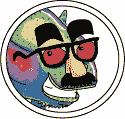
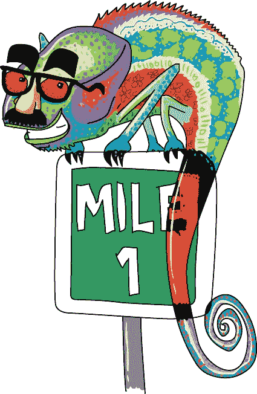

# 第一章 隐藏的盟友

“那还算*不*太糟，”劳里对自己说，当她走到一号英里标志时。“一英里听起来走起来很远，但如果把它分成小段走，就容易多了。”她记得在汉密尔顿，一英里有八个街区，所以她告诉自己，一次走一个街区。

“*哦，看，另一个*，”一个声音说道。

“你好？”劳里转过身来，但几乎什么也看不见：一些奇怪的作物田、空旷的道路，还有那个标志。

“*她有点矮，不是吗？*”

就在这时，她注意到一个小蜥蜴正紧紧地附着在标志上。它的颜色非常奇怪：标志是绿色的地方，蜥蜴是红色的；标志是白色的地方，蜥蜴是黑色的。

“你好，你是谁？”她问道。

“我是 Xor，”那只蜥蜴尖叫着说。它的尾巴从黄色变成了蓝色。“等一下，你能*看见*我吗？”

“当然我能看见你！”劳里说。

“哦。”Xor 看起来非常难过，脸红得像紫色一样。

“你*是*我遇见的第一个会说话的蜥蜴，”劳里说。“你是怎么学会说话的？”

“真是个傻问题！”那只生物说。“我像其他人一样小时候也学会了。”

“你做到了？”

“当然。为什么，你是怎么学会说话的？”

“嗯……”她一直都能说话，不是吗？“我想我小时候也学会了。”

“这很合逻辑。先学会说话，然后学会思考。真遗憾不是反过来。”

“你在标志上做什么？”劳里问道。

“又是个傻问题！看起来我在做什么？我正在融入背景，”Xor 说。就在那时，他变成了粉红色和紫色。“你说了什么？”

她摇了摇头。

“我刚刚说到哪儿了？哦，对了。融入背景是一门光荣而古老的艺术。它需要多年的练习。你得有相当敏锐的眼力才能发现我。”Xor 一边说，一边绕着标志走，身体变成了白色，身上有大大的橙色圆点。

劳里咬了咬舌头，尽量不笑出声。

“不，你可不是每天都能看到像我这样的蜥蜴！”他变成了桃色和矢车菊蓝。“但有时候——在你我之间，当然——有时候……”他又显得很难过，沉默了。

“有时候什么？”

“有时候，我担心自己做得不对。”

“如果你想*隐藏*的话，才不行！”劳里说道，忍不住笑了出来。“你的颜色一直在变。”

“我当时相当确定这次我搞明白了，”Xor 说，一边转动头部以便更好地看看自己。

“我的左腿是绿色的——”他说。

“绿色？不，应该是红色。”

“真的吗？”

“真的。现在是紫色了。”

Xor 叹了口气。“融入环境比看起来要难得多。我很高兴是你看见了我，而不是一只饥饿的鸟。你看，我有点色盲。”

“你到底是什么样的蜥蜴？”她问。

“我大多数时候是变色龙。我妈妈那边有部分恐龙血统。”

“部分*恐龙*？那不可能。”

“是真的！”Xor 骄傲地挺起小身体。“比如，我的阿姨瓦娜是一只 Steganosaurus。她能藏在任何地方，甚至是在邮票的背面。”

劳里不确定她是否相信 Xor，但她不想伤害这只蜥蜴的感情。

“也许你阿姨可以教你如何更好地隐藏自己。”

“我会很喜欢的。但是我不知道她在哪。上次我看到她时，我甚至没有看到她！”他说。

“但是—”

“*嘿*，”Xor 说，“为什么我不跟*你*一起去呢？如果你能看到我，也许你也能看到她。”

“我想—”

“没问题！我对这个地方很了解。我可以带你四处看看。”

“好吧。我要把你放进我的口袋里，”劳里说，“你听说过汉密尔顿吗？”

“我不知道。你能吃掉它吗？”

“没关系。走吧。”
