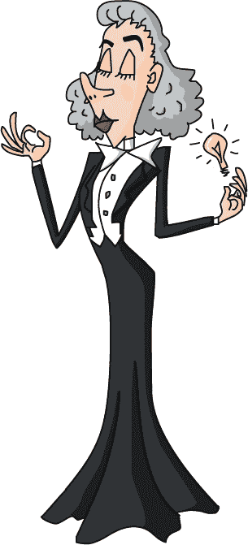

# 第二章：理智与明智

劳里和 Xor 很快来到了巴赫小镇。刚开始有些困惑，因为“巴赫”这个名字出现在了所有东西上：巴赫街、巴赫大道、巴赫广场——连人行道上也标注着*sidebach*。他们最终在巴赫路找到了巴赫之家。

劳里敲响了巨大的前门。一位高挑的女士，蓬乱的白发和优雅的外套走了过来。她问：“你好，有什么我可以帮忙的吗？”

“你是巴赫命名者吗？我是劳里。有人告诉我你能帮我。”

“如果我不能帮你解决问题，至少我可以给它起个名字。快进来喝点茶吧。”

房子外面很气派，但里面却一团糟！奇怪的机器被挤在墙边，角落里挂满了蜘蛛网，工具散落在地板上，纸堆上写满了涂鸦似的笔记，到处都是。一把小提琴被塞进了花盆。Xor 从劳里的口袋里跳出来去捕虫。

“呃，所以你是个作曲家？”劳里问。

“没错，”命名者说。

“你创作什么样的音乐？”

“哦，我不作曲，”命名者说。“我创作的是想法！”

“你创作…想法？怎么做？”

“我把小想法组合起来，做出更大的想法。然后我再把*那些*想法组合起来，做出越来越大的想法！最后，我把我的名字放上去。你不应该让任何一个想法逃脱没有名字，”她说。“这就是巴赫的第一条命名法则。我自己发明的，你看。”

“这就是所有街道都以你名字命名的原因吗？”劳里问。

“是的，我以前会把名字写在物品上。但把名字放在一个想法上要好得多。这就是我所说的第二条命名法则。”

“但为什么想法更好？”劳里问。“你不能看到一个想法。”

“因为好的想法永远不会过时！你把名字放在生日蛋糕上，但它不会持久，不是吗？”

“不，马上吃掉，”劳里说道。生日蛋糕根本不能放太久！

“你也可以把你的名字放在一座山上，”命名者说。“但即使是山，最终也会倒塌。它会发出可怕的噪音！不，最好的方式是去除所有的东西，只留下想法。”她指着一幅有着卷发和奇怪外套的男子画像。“看那边，”她说。

“那是我的朋友安迪·安培。一天，他注意到当电流通过两根电线时，它们会稍微互相弯曲。所以他叫它安迪的神奇电线弯曲器，并开始向做回形针的人们推销。”

“这真酷！”劳里说。

“是的，但我告诉安迪继续前进，把所有的物品都去掉，直到他有一个值得命名的想法。他意识到他可以用他的机器通过观察电线弯曲的程度来测量电流。这才是真正的创新——一种新的自然法则。现在没人再用安迪的神奇电线弯曲器了，但安培定律永远会存在。”

“但你为什么把名字写在所有东西上？”

“名字非常重要！没有名字的东西就像没有把手的锅。试试看不使用*turtle*这个词讲一个关于乌龟的故事。”

“嗯，”Laurie 说道，总是准备辩论一个观点，“你可以说*绿色圆形的带壳动物*来代替*turtle*。”

“哼，”Eponymous 哼了一声，“那可不是什么容易的名字，不过我想也可以接受。那么，我怎么能帮你，孩子？”

“我在找一条回 Hamilton 的路。流浪商人说我只需要去我从未去过的地方，最终我就能找到回家的路。但是……”

“但是，亲爱的，什么？”

“我不知道，他说的某些事情不太合理。”

“它或许有*道理*，但可能并不*合理*，”Eponymous 说道。

“那不就是一样的吗？”Laurie 问。

“许多事情看起来有道理，但实际上一点都不合理！你可以从前门走到后门，对吧？”

“当然。”

“你也可以绕着房子的外面走，甚至绕行整个星球来做同样的事。许多方式有道理，但只有部分是合理的。”

“那我想找到一种合理的方式，”Laurie 说道。“我不想绕行整个星球！”

“所以，”Eponymous 说道，“我们已经命名并定义了你的问题：Laurie 的任务是找到回家的最短路径。”

“但我该怎么做？”Laurie 问。“这很难吗？”

“除非你尝试，否则你永远不会知道。前面的下一个城镇叫做 Symbol。你去过那里吗？”

“不，我甚至没听说过。”

“那听起来完美。只需沿着 Bach 大道出城，在 Recursion Junction 左转。”

“太好了！”Laurie 说道。“Xor，我们走吧。哦，对了，”她突然想起。“你知道如何找到 Steganosaurus 吗？”

Eponymous 微笑着。“是谁告诉你这种故事的，亲爱的？Steganosaurus 是不存在的。”
