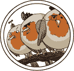
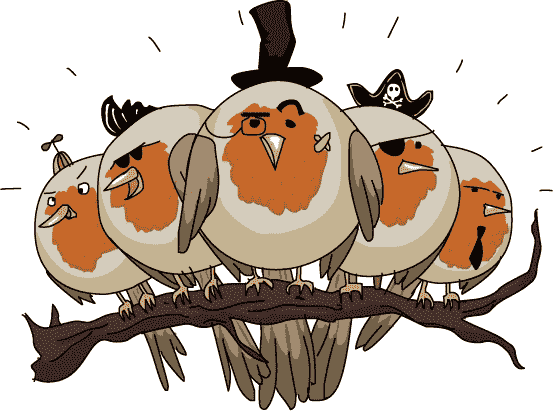

# 第三章：舍入误差

当他们离开巴赫的时候，劳里忍不住稍微戏弄了一下 Xor。“恐龙蜥蜴是不存在的吧？”

“那个女士根本不知道她在说什么。不过，她家的虫子确实很好吃。”

“也许她说得对。”

“她说恐龙蜥蜴不存在，因为她从没见过。但这正好证明了我的观点！恐龙蜥蜴非常擅长藏匿，所以人们才觉得它们是虚构的。”

“那一点都不合理，Xor。”

“你相信谁，信我还是相信你自己的眼睛？” *嘎嘎！*劳里感到有什么东西刷过她的肩膀。在她还没反应过来之前，一只胖鸟就用爪子抓着 Xor 飞走了。

“*嘿！*”劳里追着那只鸟跑去，它慢慢飞到了一根附近的树枝上。它胖得几乎是球形的，大小和形状像一个椰子树。树上还有两只和它一模一样的鸟。

劳里扑向抓着 Xor 的那只鸟，但它把蜥蜴扔给了另一只鸟，后者用喙接住了它。她又扑向那只鸟，但 Xor 又被扔给了另外一只。

这些鸟很喜欢玩藏猫猫游戏。当它们嘴巴里没满是蜥蜴时，它们跳来跳去，还唱着一个傻乎乎的儿歌：

“越来越快——”

“——太快了，跟不上——”

“——圆环鹦鹉飞得更快——”

“——比没有载重的燕子还快！”

“把他还给我！”劳里大喊。“他是我的朋友！”圆环鹦鹉们只是在嘲笑她。

“把他还给我！”

“把他还给我！”

“我们认为他会变成——”

“——下午的小点心！”

“救命！”Xor 惊恐地 squeaked。“它们想吃我！”

“以为他藏起来了——”

“——但鸟的眼睛可以看到——”

“——一个均匀分配——”

“——三个人的美餐！”

“不！”劳里捡起一块石头，朝最近的圆环鹦鹉扔去。令她完全惊讶的是，那只鸟并没有飞走。那只肥胖、恶心的鸟竟然*接住了石头*。

“一块石头！”

“真粗鲁！”

“几乎不算是宝藏。”

“我们会愉快地杂耍——”

“——为了你的乐趣！”

它们拿石头和 Xor 玩抛接游戏。劳里又扔了一块石头，然后又扔了一块，但这些鸟也都接住了。现在，圆环鹦鹉们正玩着接三个石头和 Xor 的杂耍。这一点也没帮劳里什么忙。她停下来思考，手里还拿着一块石头。

“这么快就放弃了？”

“我们喜欢玩球！”

“再扔给我们更多玩具——”

“——我们会抓住它们全部！”

劳里没有再扔那一块石头，而是捧起一大把石头，开始轻松地一个接一个地扔出去。每只鸟都接住了一块石头并开始杂耍。如果它们不是在试图吃掉她的朋友，劳里本来会很佩服它们的。

“你在干什么？救救我！”Xor 说道。

很快，三只圆环鹦鹉开始难以同时保持这么多东西在空中。劳里用力又快地扔石头，试图让这些鸟失去平衡。它们开始唱起了呼叫增援的歌。

“更多的翅膀，我的兄弟们！”

“更多的喙和爪子！”

“我们需要更多的圆环鹦鹉——”

“——均匀平衡！”

另外五只鸟扑扑翅膀飞来，加入了它们这些凶猛同胞的队伍。它们平衡了石头的负担，嘲笑劳里越来越大声。

“你不能那样打败我们！”

“我们要吃饭啦！”

“每只会吃得少——”

“——不过一言为定！”

现在，鸟儿们已经在抛接 15、20、25 块石头了。它们能接住 Laurie 扔向它们的任何东西，还有一打更多的鸟等着加入。她该如何把 Xor 从它们手中救走？

“聪明的圆头鸽子，” 

“太多了，打不过！”

“你无法阻止圆头鸽子——”

“——当有晚餐可吃时！”

虽然鸟儿在唱歌，Xor 在尖叫，集中注意力有些困难，但 Laurie 再次耐心等待，试图找出规律。圆头鸽子可以抓住任何东西……

“它绕圈走！”

“它会停在哪里？”

“石头都在抛接，” 

“但是那只蜥蜴不会——*嗯！*”

就在其中一只鸟要抓住 Xor 的时候，Laurie 用一块大土块打中了它的喙。圆头鸽子可以抓住任何东西，但它抓不住*两*样东西！

当 Xor 摔下时，她接住了他，并尽可能快地跑开。石头和愤怒的圆头鸽子四处飞散，整个鸟群失去了节奏。有些鸟试图追赶她，但它们太胖了，跟不上，也太生气了，根本没有节奏。

“不公平！”

“不公平！”

“你偷了我们的零食！”

“回来！”

“不公平！”

“你偷了……”

“你没事吧？”Laurie 问。

“不……是……也许吧。”Xor 喘着气。他们俩都在喘。那只小蜥蜴看起来没有受伤，但它吓得快要疯了。“鸟！”

“这就是为什么你必须融入其中，不是吗？”她问。“鸟儿想吃掉你。”

“我讨厌鸟。”
