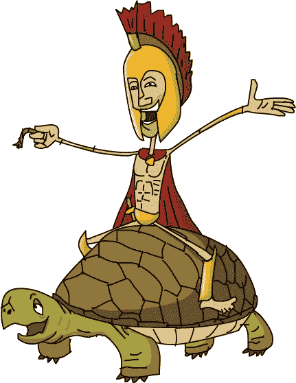

# 第四章：乌龟对劳里的话

劳里在标有“递归交汇点”的路标处左转。翻过一座小山后，她来到了……递归交汇点！

“这是同一个地方吗，Xor？”劳里问。“看起来像是。”

“试试右转，”他说。

她确实试过了，但过了一会儿，他们又回到了原点。当她尝试第二次、第三次，甚至第二十七次时，他们总是回到递归交汇点。

“看起来我好像要去别的地方，但我们总是回到同一个地方。到底怎么回事？”劳里在心里琢磨。

他们绕了 . . .

. . . 然后又绕了 . . .

. . . 然后又绕了 . . .

. . . 和绕了那么多次，劳里都已经数不清了。

就在她快要放弃的时候，突然传来一声巨大的撞击声，像是一堆盘子掉到地板上的声音。

他们俩吓得跳了起来，刹那间，Xor 不小心变成了和劳里衬衫相同的颜色。他们环顾四周寻找噪音的来源，却找不到。令他们吃惊的是，接下来的转弯让他们进入了一条不同的道路。

这条路既整洁又笔直，看起来似乎延伸到了无尽的远方。前方，一位戴着希腊头盔的男子骑在一只大圆绿色的带壳动物上。(Eponymous 可能会称这种生物为*乌龟*，尽管她这样称呼并不完全准确。) 那两者慢慢地稳步前行。

“嘿！等一下！”劳里喊道，跑向他们。

“终于，有人追上我们了！”动物说道。

“我觉得那是*不可能*的，”那位男子说道。

“你好！”动物对劳里说道。“我是乌龟，一个谦虚的乌龟。”它太大了，不可能只是个*乌龟*。“这是我尊敬的伙伴，逻辑学家阿基琉斯。”

“为您效劳，小姐！”阿基琉斯说，向她从乌龟背上行了个礼。

“嗯，您好。我叫劳伦·伊普苏姆。”她试图行了个礼。

“你是怎么到这儿的，伊普苏姆小姐？”乌龟问道。

“我真的不知道，”劳里说。“我们本来是在跟随通往符号的道路，但在递归交汇点迷失了方向。”

“这种事经常发生。我猜你花了相当多的时间在原地打转吧。”

“但我没有尾巴，”她说。

“所以它逃脱了，是吗？”

“什么？”劳里问。“不，我不—”

“或者它可能已经被优化掉了，”乌龟说。“没关系。大多数人都通过了，这才是最重要的。你可以帮助我们解决一个问题。”

“嗯，我可以试试，”劳里说，心里不确定她和乌龟是否在进行同样的对话。

“太好了！”乌龟说道。“我和我亲爱的朋友阿基琉斯正在思考的问题是：一根无限长的绳子有多长？”

“一根无限长的绳子？无限意味着它真的、真的、真的、真的、真的、*真的*很长。真的，”劳里说道。真的。

“啊！所以你同意*我的*观点了，”阿基琉斯说。“那就意味着举证责任必须由对方承担。”

“阿基琉斯在我 *背* 上的重担已经够多了！”乌龟抱怨道。

“乌龟朋友对许多事情都很聪明，”阿基琉斯说。“但这次他显然错了。他说一根无限长的绳子可以恰好是 *两英寸* 长！”

“但是一根无限长的绳子怎么可能是两英寸长呢？”劳里问。

“他的说法荒谬且不谨慎，”阿基琉斯说。“我们对这个问题持续争论不休。”

“我从不反对，”乌龟说。“我只是讨论，尤其是与你这样的聪明人，阿基琉斯。你的理解是无极限的。”

“你太客气了，亲爱的乌龟。”

“我说的每一个字都是真心的，”乌龟说。“让我提议一种通过实验来解决这个问题的方法。”

“请随便提议，”阿基琉斯说。

“让我们来构建—当然是理论上的！—一根无限长的绳子，然后来测量它。伊普苏姆小姐可以作为我们的公正裁判。”

“我接受。实验总比单纯的理论要好，”阿基琉斯说。“而且一个公正的裁判听起来真是太好了，尤其是她已经同意了我的观点！”

“很好，”乌龟说。“伊普苏姆小姐，假设你有无数根绳子。如果你把它们一根接一根地排成一条线，那会是无限长的吗？假设一下？”

“是的，一定是的，”劳里说。

“无穷大就是无穷大，”阿基琉斯说。“这只是合乎逻辑的。”

“我在想。假设我们从一根长 *一* 英寸的绳子开始，”乌龟说。“然后再加上一根 *半* 英寸长的绳子。它们加在一起有多长？”

“一又三分之一英寸，”劳里说。

“那比两英寸短吗？”乌龟问。

“少了半英寸，毫无疑问，”阿基琉斯说。

“到目前为止我们都同意，”乌龟说。“也许我们最终会得出相同的结论。”

“我对此表示怀疑！”阿基琉斯说。劳里不太明白乌龟到底在说什么，但她也对此表示怀疑。

“阿基琉斯，你能帮忙记录我们假设的绳子长度吗？我想再加一根 *四分之一* 英寸长的绳子，”乌龟说。“我们的绳子现在是不是一又三分之三英寸长？”

阿基琉斯从头盔下拿出一本用得很旧的笔记本，迅速写下几个数字。“看起来是这样，”他说。

“还剩下四分之一英寸？”乌龟问。

“好，”阿基琉斯回答。“只剩下 *四分之一* 英寸！你离失败只有一个手指的距离了！”

“再加一根 *八分之一* 英寸长的绳子，”乌龟说。“我还有空余的空间吗？”

“是的，但我很快就会打败你！”希腊逻辑学家得意洋洋地说。“你的绳子距离极限还差八分之一英寸，而你才做了 *四* 根！”

“你的算术一如既往地正确，阿基琉斯。但是为了科学的缘故，我们继续下去直到最后，”乌龟说。

“不会很久了，”阿基琉斯说。“你接下来的动作是什么？”

“我想再加一根绳子，这次是 *十六分之一* 英寸长。”

“完成！”阿基琉斯快速写下。“只剩下 *十六分之一* 英寸了，老朋友！”

“就这么一点？”乌龟说。“那么下一根，我想加一根 *三十二分之一* 英寸长的绳子。”

“如你所愿，可怜的乌龟。加上三十二分之一英寸。只剩下三十二分之一英寸，还有无数段绳子！剩下的绳子足够让你自己绊倒！”阿基琉斯说。

“请加上一段六十四分之一英寸的绳子，”乌龟说，“然后是一段一百二十八分之一英寸的绳子，再加一段二百五十六分之一英寸的绳子，然后是一段五百一十二分之一英寸的绳子，然后——”

“慢点，乌龟！你走得太快了，”阿基琉斯说。“那些是非常大的——不，是非常*小*的数字。”他算了一会儿，继续在纸上写。“只剩下五百一十二分之一英寸了。可惜我们不是在分*发丝*，否则你可能还能走得更远！你现在放弃吗？”

“*哦*。我明白了！”劳里惊呼。“阿基琉斯，乌龟是对的。”

“什么？当我们快要胜利时，*现在*不要改变主意！”阿基琉斯喊道。

“不，我确定乌龟是对的，”劳里说。“你看到了吗？他每加上的一段都只有之前一段长度的*一半*。这就刚好剩下足够的空间。即使他加上无数段，绳子也*永远*不会达到两英寸。”

“嗯，几乎从不这样，”乌龟说。

阿基琉斯皱起了眉头。“看起来你又一次证明了不可能的事情，乌龟。但为了确认，我会*自己*检查一下算式。”他继续在笔记本上乱写：

+ 1/512 英寸

+ 1/1,024 英寸

+ 1/2,048 英寸

+ 1/4,096 英寸

+ 1/8,192 英寸

+ 1/16,384 英寸

+ 1/32,768 英寸

+ 1/65,536 英寸

+ 1/131,072 英寸

+ 1/262,144 英寸……

“*那*应该能让他忙碌一段时间。如果有人有耐心真的数到无限，那一定是阿基琉斯。感谢你的帮助，伊普苏姆小姐。”

“不客气，乌龟先生，”劳里说。“我没想到这么大的东西居然可以这么小。”

“那就是二的力量，”乌龟说。“如果你把一个数字切成两半，再切两次，以此类推，很快它会变得小到无法看见。但总会剩下点什么。”

“乌龟先生，你知道这条路有多长吗？感觉它永无止境。我正试着走到符号那里。”

“这条路真的很长，”他回答。“事实上，它是无限长的。”

“哦，不！我怎么才能到达终点？”

“你可以通过两步简单的操作来做到。”

“怎么做？”

“你怎么认为？先用右脚迈一步，再用左脚迈一步，”乌龟说。“你的视角才是关键。它是积分的。”

当然！如果一根无限长的绳子可以小于两英寸，那么一条无限长的路当然也可以少于两步，如果你换个角度来看。劳里闭上眼睛，深吸一口气。她试图想象一条无限长的路。那有点难以想象，所以她想象了一条非常非常非常非常长的路。然后她想象将它对折。接着她又将它对折，再对折，再对折，再对折……

当劳丽睁开眼睛时，阿基琉斯和乌龟已经不见了。那条无尽的道路现在变成了一条微小、短小的东西，几乎不过是一个垫脚石。她右脚迈了出去，然后又用左脚踏了上去。她面前是一个路标，上面写着……
