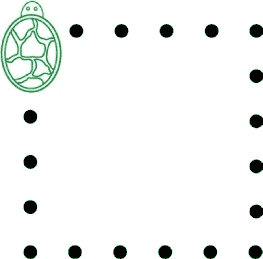
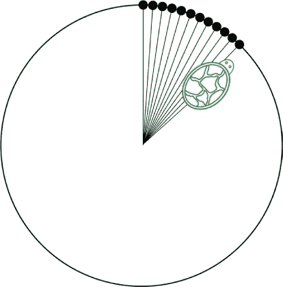
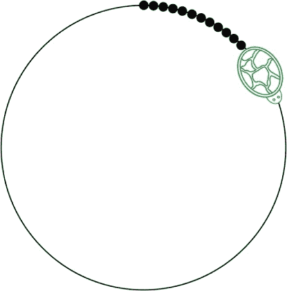

# 第六章 一个工匠的交易

当 Laurie 和 Xor 安全地进入城墙内时，那只小蜥蜴从 Laurie 的口袋里探出头来。

“明白我的意思吗？希望他们不会弄清楚你是怎么进来的，”Xor 说。“那么，我们为什么在这里？”

“我们在找能帮助我回家的信息。也许我们能找到一张地图之类的东西。”

“哦，”Xor 说道，“我还希望你说的是食物。我们试试这个地方怎么样？”

在他们面前是一家商店，橱窗上画着非常精美的招牌：

“*算法*。听起来像是一种水果。”

“你*总是*饿吗，Xor？”

“时间飞逝如箭，果蝇则喜欢香蕉。看看是否有果蝇问题，我能帮他们解决。”

当 Laurie 推开门时，铃铛响了。店主说：“你好，你好！欢迎光临我的店。我是 Tinker，你是来找精心制作的算法，对吧？”

Laurie 看了看黑板上列出的项目，但它们没有任何意义。

“我不确定。什么是算法？你可以吃吗？”Laurie 问道。

“什么？不，这只是‘如何做某事’的一种花哨说法。但*算法*在招牌上看起来更有吸引力，”Tinker 说道。

Xor 因失望而变得橙色。

“怎么做某事，”Laurie 重复道，“既然如此，我想找一种合理的方法来访问每个城镇。”

“听起来像是个有趣的问题。到目前为止你都做了些什么？”

Laurie 告诉 Tinker 她在红黑森林的冒险以及她与 Eponymous Bach 的会面。

“一个哈密尔顿路径，嗯？”Tinker 说道。“那是个难题。我不想说，因为他听起来是个好人，但流浪推销员可能需要很长时间才能完成他的所有城镇之旅。”

“哦，不！为什么？”

“如果你总是去最近的一个你还没访问过的城镇，你可能会错过一个稍微远一点的城镇。然后你再去另一个离你更近但仍然比你错过的那个远的城镇，依此类推。你最终可能会遍布全国，才能到达最后几个城镇。”

“听起来好累，”Laurie 说道。原来流浪推销员并不是那么理智！“那我该怎么找到最短路径呢？”

“我看看我有什么库存。不过可能会很贵。”

“我身上没多少钱，”Laurie 说道。她从口袋里拿出几枚 25 分硬币，展示给 Tinker 看。

他惊讶地看着他们。“四分之一美元？我不知道美元是什么，更不用说四分之一了。你们那儿的钱是这个吗？”

“当然是钱！那是七十五分，”她说道。

“分币？我们这里用的是公平硬币。”

“什么是公平硬币？”

“嗯，它们比你的 25 分硬币大一些，但可没那么漂亮！你可以通过它们总是 50-50 的正反面来辨别真正的公平硬币。”

“但是你也可以掷 25 分硬币，50-50 的概率！”

“那也许是真的，但我不能仅凭*你的*话就相信，对吧？这里，所有的公平硬币都必须经过认证。”

劳里垂头丧气。

“别那么难过！我确实想帮助你，”廷克说。“也许我们可以做个交易。正巧我在找一种特定的算法。”

“不过我也没有任何算法，”劳里说。

“这不是问题，”廷克说。“你可以随时创造新的点子，只要稍微思考一下。”

“我能吗？怎么做？”

“嗯，每个人都有自己的风格。你可以把小点子组合起来做大点子。或者把两个点子并排放一起进行比较。或者你从大点子开始，拆开它们。”

“你是说像 Eponymous 那样做吗？”

“是的，就像她那样。她是个伟大的创作者。”

劳里从来没想过*她*自己也能做这些事情。但廷克似乎认为这很正常。

“那我该做什么？”

“我在找的算法是怎么画一个圆，”廷克说。“这很难，所以你得动动脑筋。我已经问过所有的大人，甚至问过 Ponens 和 Tollens 了，但他们只会嘀咕‘*x*的平方加上*y*的平方’，结果始终没有进展。”

“看看这个。”他把一个发条小动物递给劳里。它有一个壳，是圆形的，绿色的。“这个乌龟可以做三件事：它可以前进或后退，它可以转弯，还可以在纸上画一个小点。”

“嘿，这挺酷的！”

“是的，但问题是，它不知道怎么做其他事情。这就是算法的作用。”廷克拿出一张纸，写下了看起来像小诗的东西：

> 前进一英寸，
> 
> 画一个标记，
> 
> 重复五次。

然后他上紧发条，把乌龟放在诗上。它*嗡嗡嗡，嘶嘶*，然后开始画一条点线，就像诗里说的那样：

“你看到了吗？如果你把小的点子组合在一起，你就可以做出更大的点子，”廷克说道。“然后你可以把*这些*点子组合成更大、更大的点子。”

“你怎么做的？”劳里问。

“通过给它们起个名字。你可以像拿着锅把一样，拿着名字：你可以通过写下一个名字来移动整个点子。这里，我们就叫第一个点子为*线*。然后你可以把四条线组合在一起，做出一个正方形。”

> **线**：
> 
> **前进一英寸，**
> 
> **画一个标记，**
> 
> **重复五次。**
> 
> **正方形**：
> 
> **画一条线，**
> 
> **右转，**
> 
> **重复四次。**
> 
> **画一个正方形。**

小乌龟*嗡嗡*地响着，*嘶嘶*地叫着，然后画出了这个：

劳里感到震惊。这就像魔法，但每一步都有道理。

“那么，知道了乌龟能做什么，你能教它画个圆吗？”廷克问。

“我不知道，”劳里说，“但我想试试！”

“对我来说，这就足够了。来，你可以在我的桌子上工作。这里有足够的纸和圆规，类似的东西。”

劳里坐在丁克的桌子旁。她用圆规乱画了会儿，并玩了一会儿海龟，试图回想起她关于圆圈的知识。

*圆圈是圆的。不， not 只是圆——是完美的圆。你把针放在中心，铅笔围着它转。要画一个更大的，你打开圆规；要画一个更小的，你收紧圆规。如果你在它旋转时改变圆规的宽度，那就不是圆了...*

突然，一个想法，或者说也许是记忆，涌入她的脑海：*圆圈是距离中心恰好相同的所有点。嗯，如果你...*

> **向前进一英寸，**
> 
> **做一个标记，**
> 
> **倒退一英寸，**
> 
> **稍微向右转，**
> 
> **然后重复！**

在劳里写完她的诗之后，她再次启动了小海龟，并将其放到纸上。海龟嗡嗡作响、咕噜咕噜地动了一会儿，然后画出了这个：

“有效了！”她对丁克喊道，“嘿，它没有停下来。”海龟正在重复之前画过的点。

“我想是因为你让它重复了，但是没告诉它重复多少次，”丁克说。

“嗯，它应该在画完圆圈后停下来，”劳里说。

“它其实并不理解圆形，”丁克说，“它只是一个玩具海龟，记住吗？你得教它。”

劳里想了一会儿，然后重写了她的诗：

> **圆圈：**
> 
> **向前进一英寸，**
> 
> **做一个标记，**
> 
> **倒退一英寸，**
> 
> **向右转一度，**
> 
> **重复三百六十次。**

然后她意识到，她可以让海龟画出任何大小的圆圈。就像把圆规打开一样。

> **两个圆圈：**
> 
> **向前进两英寸，**
> 
> **做一个标记，**
> 
> **倒退两英寸，**
> 
> **向右转一度，**
> 
> **重复三百六十次。**

“这很有趣。你工作得真努力！”丁克抓了抓头。“但目前来看，这样不行。”

“为什么？”

“人们想画很多不同的圆圈，”他说，“我得保存很多不同尺寸的算法，以防有人想要三又九分之三英寸或者四又四分之三英寸。”

“那如果你告诉海龟圆圈该有多大呢？”她说，“可能像这样。”

> **任何圆圈（多大？）：**
> 
> **向前进多大？英寸，**
> 
> **做一个标记，**
> 
> **倒退多大？英寸，**
> 
> **向右转一度，**
> 
> **重复三百六十次。**

“然后，”她说，“你可以说 ANY-CIRCLE（一），或者（二），甚至（一又十一又七分之一）！”

“好主意，劳里。这样简单多了，”丁克说，“我还担心你会把我的店铺填满圆圈呢！”

“你知道吗，海龟画得真慢。不像它画方形的时候那样，”她说。

这是真的。海龟会一直爬到圆圈的边缘，然后做个标记，再爬回到中心，一共做 360 次。小圆圈还好，但大圆圈需要很长时间。

“嗯，”Tinker 说，“它花费的时间在来回奔跑上远远多于在做标记上。你觉得可以减少跑动时间吗？”

*这有道理，但却不合乎常理。* 劳里思考着并涂涂画画，画画思考着，但她就是搞不懂如何让它更合乎常理。海龟必须回到中心，不是吗？否则它怎么知道圆的边缘在哪里呢？

劳里让眼睛在房间里游移。Xor 正盯着一只飞蛾，它在灯泡周围懒洋洋地绕圈飞。他的皮肤慢慢从红色变为黄色，再变回红色。飞蛾绕着圈飞。那景象催眠一般。绕啊绕啊绕啊……

*哦！如果飞蛾不需要去灯泡的中心绕圈飞，那么为什么海龟需要回到中心去画一个圈呢？*

劳里拿起一张新纸，生怕想法一闪而过。*不要让一个新想法在没有命名的情况下从你眼前溜走。*

> **飞蛾圈（多大？）：**
> 
> **前进多大？英寸，**
> 
> **做一个标记，**
> 
> **向右转一个度，**
> 
> **重复三百六十次。**
> 
> **做一个飞蛾圈（一个）。**

海龟发出*嗡嗡*、*嗞嗞*、*嗡嗡嗖*的声音，然后开始画画。它移动了一英寸，做了一个点，然后转了一个小角度，再移动了一英寸，做了另一个点……

“哎呀。它在画一个*巨大的*圈！让我试试一个小的数字。”劳里手边没有小数字，所以她借用了一个她从海龟那里听来的：三十二分之一英寸。

“这样更好了，”劳里说。

“让我看看，”Tinker 说，“哇，看看那个小家伙跑得多快！”

“挺有趣的，”劳里说，“我没想到你可以自己发明新的做事方式。”

“当然可以。很多时候你不是第一个想到某件事的人，但如果有效，谁在乎呢？现在，轮到我处理交易了。”

“你找到最短路径了吗？”劳里问。

“不完全是。坏消息是你试图做的事是不可能的。”

“这不可能？”

“嗯，非常不可能。有很多不同的方式可以访问所有的城镇。看起来你可以为海龟写个算法，让它尝试每一种方式，找到最短的，对吧？”

“当然，为什么不呢？”劳里说。

“Userland 有二十一座城镇。你觉得有多少条路径？”Tinker 说。

“我不知道，”劳里说，“一百？”

“多得多。”

“嗯，一百万？”劳里说。

“更像是一百万亿次！”Tinker 说。

“但是怎么可能呢？”

“假设只有三个城镇：A、B、C，”Tinker 说，“你已经站在 A，所以只需要担心 B 和 C。你能走几种路径？”

“嗯，”她说，“我可以从 B 到 C，或者先去 C 再到 B。这是两种方式。”

“没错！但是 BC 和 CB 是一样的，只是反过来。每一条路径都有一个镜像，所以对于三个城镇来说，实际上只有一条可以访问所有城镇的路径。如果有四个城镇，A、B、C 和 D 呢？”

劳里用手指算着。“我可以走 BCD，或者 BDC，或者 CBD，或者 CDB，或者 DCB，或者……DBC。六条！不，三条。”

“这就是三倍的数量。再加一个小镇，就有十二倍的数量，”丁克说。“再加一个第六个小镇，总共有*六十*条不同的路径。七个小镇就有*三百六十条路径*。随着小镇数量的增加，路径的数量变得非常庞大！”

> 3 个小镇：2 ÷ 2 = 1
> 
> 4 个小镇：2 × 3 ÷ 2 = 3
> 
> 5 个小镇：2 × 3 × 4 ÷ 2 = 12
> 
> 6 个小镇：2 × 3 × 4 × 5 ÷ 2 = 60
> 
> 7 个小镇：2 × 3 × 4 × 5 × 6 ÷ 2 = 360
> 
> 8 个小镇：2 × 3 × 4 × 5 × 6 × 7 ÷ 2 = 2,520
> 
> 9 个小镇：2 × 3 × 4 × 5 × 6 × 7 × 8 ÷ 2 = 20,160

“对于二十一个小镇，你需要把一乘二乘三乘四，一直到二十。这个数字会变得*极其庞大*！”

> 2 × 3 × 4 × 5 × 6 × 7 × 8 × 9 × 10 × 11 × 12 × 13 × 14 × 15 × 16 × 17 × 18 × 19 × 20 ÷ 2 =
> 
> **1,216,451,004,088,320,000**

“！”劳里说道。

“确实！”丁克说，“所有那种‘一乘二乘三’的东西写起来太慢了。所以你可以用感叹号作为简写。”

> **20! ÷ 2 = 1,216,451,004,088,320,000**

“但是那是……”劳里说，一边数着逗号，“超过一百万百万*百万*条路径！”

“其中一条成千上万条路径是最短的，”丁克说，“我不知道有什么方法可以快速找到它。”

“我们检查所有路径要到老才行！没有更好的方法吗？”

“啊，这就是好消息！”丁克说。“我只处理确切的答案。但有一位聪明的作曲家住在排列城，名叫休·鲁斯蒂克。他处理‘足够好’的答案。我把我所有最难的问题都交给他。我会写一张欠条，你可以带去找他。”
