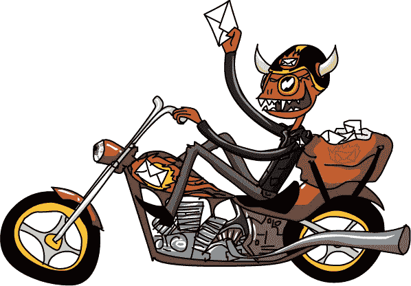

# 第七章：阅读我

劳里和 Xor 正朝着 Permute 走去时，一只红皮肤、带着角、穿着黑色皮夹克的生物骑着红色摩托车停了下来。摩托车后座上背着一个装满包裹和信封的大袋子。

“你好，你是谁？”劳里问。

“我是一个妖灵。还能是谁？等一下，这里好像有给你的信息。”他在包里翻找，然后递给劳里一个普通的信封。当她打开它时，里面只有一些最奇怪的胡言乱语：

> LOREM IPSUM, ESXIHU! SIT AMET, CONSECTETUR ADIPISICING ELIT, SED DO EIUSMOD TEMPOR INCIDIDUNT UT LABORE ET DOLORE MAGNA ALIQUA. UT ENIM AD MINIM VENIAM, QUIS NOSTRUD EXERCITATION . . .

“你确定这是给我的吗？”

“你确定你是你自己吗？”

“嗯……是的。”

“那是你的事，”妖灵说。“我从不搞错身份。”

“但你怎么能确定呢？”

“你怎么能确定你是你自己？”

“因为我就在这里！”

“看到了吧？这完全是合逻辑的。”

“但是我*不能*读它，”劳里说道，“它写了什么？”

“你几岁了，居然不能读？”妖灵说，“真是太可惜了。”

“但是——”

“你知道有些国家的孩子在 12 个月大时就开始学会阅读了吗？”

“我*能*读——我只是不知道*这个*是什么意思。这是胡言乱语！”

“那，”妖灵说着，戴上了骑行手套，“听起来完全是*不是我的问题*。”

“但是——”

“你接受投递吗？还是我得把它退回去？”

“嗯，是的，但是——”

“看啊，‘嗯好吧’小姐。我是一个邮件递送妖灵。我为上校工作。我的工作是递送信息。信息写了什么，*不是我的问题*。祝你有个愉快的一天！”妖灵飞速离开，轮胎把灰尘和碎石洒得她满身都是。

“*哇！*”劳里气得跳脚。“那个小家伙——”

“怎么了，劳里？”Xor 问道，他刚才还在她的口袋里打盹。

“我觉得这是给我的一条信息，”她说，“但我一点都不懂。”

“一条秘密信息！”Xor 说，摩擦着他的小爪子。“你真幸运，我妈妈的同父异母的哥哥是个加密恐龙。”

“一个什么恐龙？”

“一个*加密*恐龙。我们知道所有关于秘密信息的事情。让我看看这里有什么。”Xor 爬到信息上面仔细查看。纸是白色的，所以当然他的皮肤变成了黑色。

“嗯，这是个难题。我根本认不出这些字母。”

“你为什么倒着看它？”劳里问他。

“当然，嗯，呃，有时候你可以通过这种方式看到秘密信息中的模式。”他调整了方向。

“现在，嗯，让我们慢慢地读一遍，找找线索。Con-sec-te-tour a-dee-peace-ick-ing el . . .”Xor 的皮肤随着他在字母上移动而起伏。“. . . dew-is ow-tay . . .”

“嘿，Xor，等一下。”劳里注意到了一些奇怪的东西。“稍微倒退一点。”

“像这样吗？”

“是的。现在，认真思考一下如何融入其中。”

“好吧。你看到了什么？”他说。

“你的皮肤。我想我能读懂它。”

当 Xor 恰好排列好时，黑底白字的 LOREM IPSUM ESXIHU 变成了白底黑字的 LAUREN IPSUM GREETINGS。

“你正在解开信息！”

“真的吗？我是说，能看到？我就说我能做到。”

“你真了不起，Xor！能不能靠近点纸张？”

“如果我再靠近点，我就得在它后面了！”

他们一个字一个字地解开了信息。但即便如此，信息还是不太能理解：

> LAUREN IPSUM，问候！毫无疑问，你是很长一段时间以来访问 USERLAND 的最有趣的访客。但如果你继续做现在的事，你将面临许多艰难的任务和挫折。记住，地图不是领土！
> 
> 你的谦卑仆人，
> 
> COLONEL TRAPP

“艰难的任务和挫折？地图不是领土？这到底是什么意思？”Laurie 问。

“我曾听说过一个国王，他想做一张完美的领土地图，”Xor 说道。

“他为什么要这么做？”

“国王们总是想要一些愚蠢的东西，比如一本关于一切的书，或者一辆没有任何弱点的战车，”他说。“这个国王决定他想要一张和他的王国一样大的完美地图。这样，皇家制图师就能把*一切*都画进去，连最后一颗小石子和花朵都不放过。花了整整七年的时间才完成。但结果是一场灾难！”

“为什么？发生了什么？”Laurie 问。

“作为一张地图，它效果不好。为了测量两个地方之间的距离，你必须走完那个距离，”蜥蜴解释道。“等你走到那里时，你已经到达目的地了。”

“他们到底把这么大一张地图放在哪里了？”

“那是另外一回事。博尔赫斯国王只有一个王国，所以除了把地图放在那儿，别无选择。地图堆在人们的房子上，成了一大麻烦，甚至没有地方让农作物生长。人们最终推翻了国王，把地图撕碎了。据说你现在还能在沙漠里看到巨大的一片片纸张在风中飘荡。”
