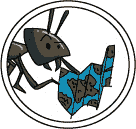
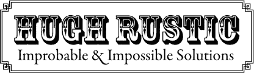
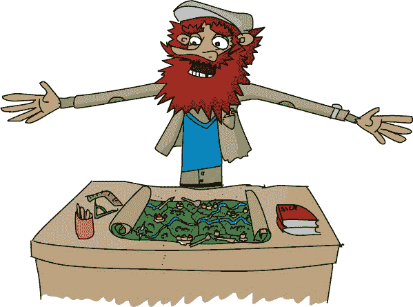
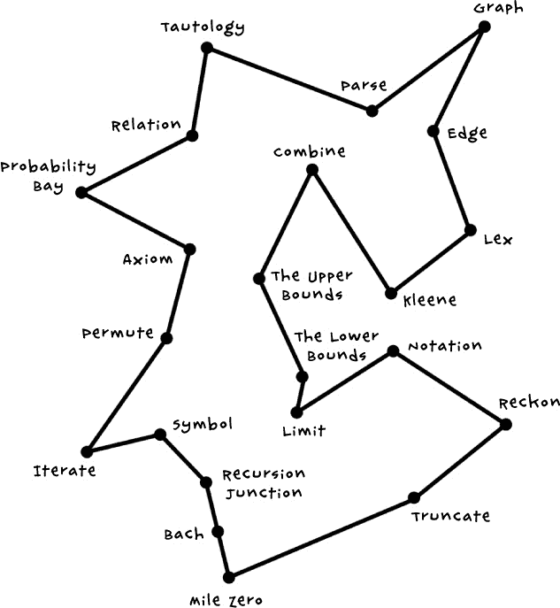

# 第八章：有多种方法可以做到

Permute 是一个离 Symbol 不远的小村庄。Hugh Rustic 的店很容易找到，它的招牌比 Tinker 的还大还花哨。

“你好，Rustic 先生？”Laurie 走进商店时叫道，“Symbol 的 Mister Tinker 欠我一个算法，他说我应该来找你谈。”

Rustic 是一个高大、声音大、看起来有些邋遢的男人，留着一大把红胡子。他看起来完全不像优雅的 Eponymous 或者整洁得体的 Tinker。

他看起来完全不像 Laurie 认为的作曲家应该的样子！不过 Tinker 推荐了他，所以 Laurie 把欠条交给了他。

“我，我是想找一条穿过所有城镇的最短路径。你能帮我吗？”

“太棒了！有趣！”Rustic 说道，“Tinker 把你送到对的地方了，小姐。*不可能*我们立刻就做完。*不可能*，最迟到周二。”

“但是如果是*不可能*的话——”Laurie 开口道。

“只能说是*不可能*，”Rustic 纠正道。

“如果是*不可能*，那你怎么做呢？”

“通过改变你的视角，”Rustic 说道，“不是去寻找一个适合你问题的答案，而是先想一个*答案*，然后去寻找一个适合它的问题。”

“但你不能随便改变问题，对吧？”

“当然可以！担心问题是在浪费时间！你真正想要的是答案，对吧？”

“也许吧，但我不明白怎么做，”Laurie 说道。

“怎么买到最好的西红柿？”他说道。

“嗯，我……什么？”

“假设你在市场上。你想要最好的、最完美的西红柿。但是为了找到*最好的*西红柿，你必须比较它们，对吧？你得看看每一个，把它转过来，可能还得捏一捏。每一个西红柿都得这么做。”

“没有人这么做！”Laurie 说，“嗯，Harris 老太太*确实*这么做。但我妈妈说她有点疯狂。我只是挑个好的。”

“看吧？你已经知道怎么用 Hugh Rustic 的方法做事了。当有很多‘足够好’的西红柿时，你就不浪费时间去找*最好的*西红柿。”

“所以，我们不是试图找出穿过所有 Userland 城镇的*最短*路径，”Laurie 说道，“而是找一个*足够短*的路径？”

“为什么不呢？”Rustic 问，“在所有那些快得不得了的路径中，我敢打赌，有很多路径是相当短的。你只需要找到*一个*就行了，这要容易得多。”

Rustic 拿出一张大地图，放在柜台上。

“这里就是我们的位置，”他说着，指向 Permute，“这就是你出发的地方，对吧？让我们在这里放上几根铅笔，代表 Upper Bound 山，而那边放个小勺子代表 Lower Bound Valley。”地图上还有 Bach 和 Recursion Junction 的标记，以及 Laurie 还没去过的很多地方。

“现在是有趣的部分，”Rustic 说道，“让我们去问蚂蚁。”

“让*蚂蚁*来做？你在说什么呢？蚂蚁不能读地图！”Laurie 说。提到昆虫，Xor 突然警觉起来。

“谁说它们做不到？接下来你是不是要告诉我乌龟也不会画圆圈？”Rustic 说道。

“所以你是教蚂蚁读地图？”

“不完全是。蚂蚁本来就擅长找到回家的路。关键是让它们为我们工作。”他打开一瓶蜂蜜，在每个小镇上涂上一点甜蜜的蜂蜜。

一分钟过去了。什么也没发生。然后，一只小蚂蚁爬上了桌子。它闻到了蜂蜜的气味，沿着地图蜿蜒而行。它从一块蜂蜜上舔了一点，然后四处游荡，直到走到了另一块蜂蜜上。

“当一只蚂蚁找到食物时，它会留下一个小小的气味信息，供后来的蚂蚁跟随，”Rustic 说。“蚂蚁会跟随食物的气味，也会跟随其他蚂蚁的气味。很多蚂蚁可以同时尝试多条不同的路径，最终它们会找到一条快速的路线，带着食物回到巢穴。”

第一只蚂蚁继续前进，走向巴赫（Bach）。另一只蚂蚁出现了，直接走向递归交汇点（Recursion Junction）。还有一些蚂蚁穿越到概率湾（Probability Bay）、排列（Permute）、符号（Notation）以及其他小镇。很快，地图上就有数十只蚂蚁四处走动，收集蜂蜜并留下气味供它们的姐妹们跟随。

几分钟后，很明显有些路径比其他的更受欢迎。蚂蚁的队伍越来越宽，直到最后只剩下一条蚂蚁超级高速公路，绕着地图一圈又一圈，回到了巢穴。Hugh Rustic 在蜂蜜消失之前，将这条路径画了下来。

“啊，就是这个！”他说着，把他的草图递给了 Laurie。

“谢谢你，Rustic 先生！这真的是最短的路吗？”

“这是一条*短*路。那是我能保证的最大承诺。”
