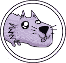
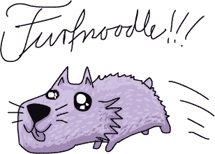

# 第九章。不要重复自己

Laurie 和 Xor 带着新地图从 Permute 出发。他们终于知道了自己在哪里，要去哪里，*以及*怎么到达那里。所有的信息都清楚地写在纸上。

“这张地图上的地方名字很有趣，”Laurie 说道。“*截断*。那是什么？”

“截断就是通过切掉部分内容让某物变短。截断镇有非常精确的边界，”Xor 说。

“哦。那么*公理*是什么？”Laurie 问。

“公理是你假装它为真的规则，尽管你不知道它为什么是真的，”Xor 说道。

“真的吗？”

“当然了。我表妹 Nand 教过我这些。她是一个 Euclidosaurus。”

“你又在编故事了，Xor。”

“不，事情就是那样，”蜥蜴耸了耸肩，变成了灰绿色。“要么你相信公理，要么你不信。”

“哦，是吗？我打赌你不知道 Furfnoodle 是什么，”Laurie 说道。

“那是……我意思是，呃。我放弃了。它是什么？”

“Furfnoodle 是一种鸟，”她说。“有着长长的蓝色羽毛！而且它喜欢吃小蜥蜴。”

“真的吗？”Xor 看起来有些担忧，抬头看了看天空，寻找蓝色的羽毛。

“没有。不过如果我真的看到一只喜欢吃蜥蜴的大蓝鸟，我会叫它 Furfnoodle。”

“你真的不该随便造词，”Xor 说道。

“如果你能造词，我也能，”Laurie 说。

“我说的是真的，Laurie。”

“说出来都很有趣！”她说。“Furfnoodle。”

“但是——”

“Furfnooooodle！”她唱道。

“看，这不安全——”

“Furfnoodle。Furfnoodlefurfnoodle。Furf。Nood。Ull！”

有一个*咕噜*的声音，一个看起来像小鼠的生物出现在他们前方的路上。

“*Furfnoodle!*”它用小鼠的声音说。它绕着他们跑了几圈，然后飞快地冲进了杂草中，仍然在尖叫。“*Furfnoodle! Furfnoodle!*”

“那到底是什么？！”Laurie 说。

“那，”Xor 说，“是一个初级术语。”

“它是从哪里来的？它只是从空气中冒出来的。”

“你是用……那个词造出来的。”

“我*造*的？”

“我曾试图警告你，”Xor 说。“你以为术语是从哪里来的？”

“Furf——那个词有什么特别的？”

“这是一个只对你有意义的名字。那就是术语*的定义*，”Xor 说道。“是你创造的。它是你的。”

“但是为什么？”

“没人知道，”他说。“它是那种公理类的东西。你得小心对待名字。它们有自己独特的力量。”
