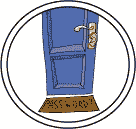

# 第十章。恰到好处的登场

Probability 是一个位于海边的小镇。它周围只有一圈粗糙的木栅栏，和 Symbol 的高大石墙完全不同，主要入口似乎没有守卫。劳里正穿过大门时——

“抱歉，亲爱的！你好，在你左边。”一位老妇人坐在里面的阴凉处。她的膝上放着一本大书。她的名牌上写着*Jane Hecate，边境安全*。

“哦！我没看到你在这里，”劳里说。

“没关系，亲爱的。但是在你进来之前，我得确保你在名单上。”

劳里之前玩过这个游戏。“我的名字是 Eponymous Bach，我的密码是——”

“等一下，亲爱的，等一下！一件事一件事来。首先让我们查查你的名字。”她打开那本厚重的书，开始用手指一个字母一个字母地扫描页面。

“E . . . E . . . 啊，E！来了。”

一切进展得异常缓慢。

“P . . . P . . . E-P! . . . E-P-O . . . E-P-O . . . 不。”

简合上书，发出一声沉闷的响声。

“抱歉，不在名单上。”

“什么？”

“亲爱的，你不在名单上。这里有 Es 和 E-Ps，但没有以 E-P-O 开头的名字。如果你名字的*开头*不在名单上，那就没必要再找*剩下*的部分了，对吧？这很合逻辑。”

“但是她——*我的*名字一定在名单上！她是个了不起的——我是说，我是——”劳里结结巴巴地说道。

“你是外国人吗？我敢打赌你名字的拼写在你们那儿不一样。那是有可能的，特别是对于外国人来说。我们再试试怎么样？”

也许她确实有一个账户。“是不是‘Laurie Ipsum’？”

“让我看看。”*Fllliiiip!* “L . . . L . . . L! A . . . U . . . R . . . I . . . 不在这里，但我确信我们能找到它。”

“可能拼写成 Laur*en* Ipsum。”

“L . . . A . . . U . . . R . . . E . . . 不，不是这样。” “呃，Hugh . . . Rustic？”

“H . . . H . . . H! H-U-G-H R-U-S-T-I-C。啊，*找到了*。”

“太好了！”

“真高兴我们能找到你！”简说。“你的名字拼写方式好像有好多种，对吧？”

“是啊，我想确实是。谢谢！”劳里转身准备进屋。

简出乎意料地用力抓住了她的背。

“你的*密码*，亲爱的？”

“哦！是‘Rustic’吗？”

“不。”

“Turtle？”

“不。”

“算法？”

“A . . . L . . . 不。”

“足够好？”

“不。”

劳里愣住了。“现在怎么办？”她低声对 Xor 说。“她根本不在乎我尝试字典里的每个单词。但我们得在这里待一个月！”

“我有个主意。”Xor 低声说道。“试试‘Abstraction’。”

“那是什么？我完全——”

“我的第三个表亲是个词典。相信我！”

“是 Ab-stract-tion 吗？”劳里问简。

“A . . . B . . . S . . . 不，亲爱的。”

“‘相信我’，是吗？”劳里对 Xor 说道。

“想想看，我以前从来不喜欢那个表亲。”

“嘿……你注意到什么了吗？”

“已经是晚餐时间了吗？”Xor 希望地问道。

“不！当我说‘Turtle’时，她马上就说不。”劳里说。

“那又怎样？这不是密码。”Xor 说。

“但是当我说‘算法’时，她花了更长的时间才说不。而‘抽象’时，她比那时稍微慢了一点，手指在页面上划过……”劳里清了清嗓子，对简说：“密码，是，嗯，About？”

“A . . . B . . . O . . . 不对。”

“看到了吗？”她低声说道。

“好吧，但它是什么意思？”

“也许这意味着真正的密码是以 AB 开头的！所以如果我们继续猜 AB 开头的单词……”

她们一个字母一个字母地破解了 Rustic 的密码。劳里很难想出以正确字母开头的单词。她不知道 Xor 让她尝试的许多单词，但他发誓这些词都是真的，所有同义词词典的荣誉在此。她知道她们已经越来越接近了，因为简开始花更长的时间才会说不。

“Abend！”

“A . . . B . . . E . . . 不对，”简回答。

“Abdicate！”

“A . . . B . . . D . . . 不对。”

“Abrogate！”

“A . . . B . . . R . . . O . . . 不对。”

“它是以 ABR 开头的！”劳里低声对 Xor 说。“Abrupt！”

“A . . . B . . . R . . . U . . . 不对。”

“Abraid！”

“A . . . B . . . R . . . A . . . I . . . 不对。”

“我们快接近了，”Xor 在她耳边说。“什么是以 ABRA 开头的？”

“Abracadabra？”劳里大声说。

“A-B-R-A-C-A-D-A-B-R-A！”简说。“这就是密码，准确无误。欢迎来到概率学！”
