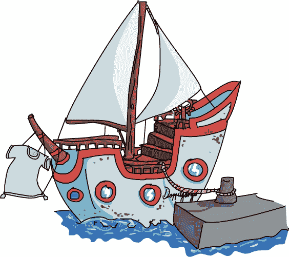

# 第十三章 游戏人生

*双生物*船驶出了概率湾，远离了劳里的麻烦。她冒险偷看了一眼船边，捕捉到了一个美丽的惊喜。

“温索姆！看那个！”

在船的尾迹中，发光的火花点亮了水面。蓝色和绿色的卷曲随着波浪扩散在它们身后跳跃。

“哦，知道了。那些叫做滑行者。漂亮吧？”

“它们真美！是什么让它们发光？”劳里问。

“当你搅动水时，它们会发光并形成图案。你只能在像这样的黑夜里看到它们。”

“哇！我从没见过这样的东西！”

“想看点*真正*酷的东西吗？”温索姆将一个浅锅浸入水中，放到长凳上。等它平静下来后，她在水面上画了一个小图案。

发光的点活了过来，在锅里扭动了几下，然后消失了。

“它们是怎么动的？”劳里问。“它们真的活着吗？”

“我不这么认为。那只是一个看起来像活着的图案。应该有一些规则来规定光点是如何移动的，但我从来没有在意过。也许你能弄明白。”

温索姆回到专心驾驶船舵。劳里玩着制造更多滑行者、漂亮的波浪和卷曲。Xor 试图咬住那些发光的蠕动物，但他捕到的只是满口的水。

劳里渐渐擅长发现那些在水中快速滑动的图案，越找越久，但最终，她变得不安了。

“温索姆，我们去哪儿？”

“我们正前往抽象岛，”温索姆回答。“我有些货物要送。我们应该能在早晨之前到达那里。”

“抽象岛？那不在我的地图上，”劳里说道。

“我敢打赌，地图上没有很多东西，姑娘。”

“你是说地图不是领土？”

“嗯？谁告诉你这个的？”温索姆问道。

“特拉普上校。他给我写了一封非常奇怪的信。”

“哦，*他*。”

“你认识特拉普上校吗？”

“他是个疯狂的老头，”温索姆说道。“总是插手别人的事情。派那些粗鲁的恶魔带着他那愚蠢的秘密信息。”

“那些秘密信息很好玩。Xor 弄明白了如何——”

“小心特拉普上校，劳里。我敢肯定是他想把你送进监狱。”

“他是谁？”劳里问。

“他是我的——他曾是我的老板，”温索姆说道。“这是他的邮件船。直到我复制了它。我们…在如何做生意上意见不合，所以我独自出发了。”

“你和他吵架了吗？”

“嗯，是的，”温索姆说道。

“你们争论了什么？”

“他希望一切都保持原样。我…不这么想。”

“哦，”劳里说道。温索姆的语气让劳里知道，不要再问她关于争斗的事情了。她们安静了一会儿，默默地看着天空和水面。

“上校在一件事上是对的，”温索姆轻声说道。

“那是什么？”

“地图只是张图纸。它不是现实。如果有人忘了在地图上标注抽象岛屿，这个岛屿依然存在。它不在乎你知道什么。”

“用户领域里没有人提到过岛屿，”Laurie 说。

“那边的人对外面的世界了解不多。那是上校喜欢的方式。用户领域就像一座岛屿。它是一个由岛屿组成的完整世界。”

Laurie 不喜欢她听到的。“但是 Winsome，我必须按照我的地图回家。”

“你做了吗？”

“是的！”

“为什么？”

“那是大家都告诉我该做的，”Laurie 说。

“这不是一个足够好的理由，”Winsome 说。

“不是吗？”人们总是告诉 Laurie 该做什么。她当然不总是照做，但她通常会为此感到内疚。

“没有！你应该时刻知道*为什么*你要做某件事，”Winsome 说，“而不仅仅是因为有人告诉你去做。保持冷静并且要灵活，女孩。否则，你就像那些小滑翔机，哪里有人让你去你就去哪。”

“但是 Tinker 说——”

“先忘了 Tinker 吧，”Winsome 说。“你是怎么迷路的？”

“我和妈妈吵架了，”Laurie 说。“妈妈想让我夏天上学，但我根本不需要！”

“也许夏季学校是件好事。我听说其他国家的孩子——”

“我不管！我不想浪费整个夏天和我根本不认识的人待在学校里！”

“好吧，这公平。那么接下来发生了什么？”

“我在树林里走了一会儿，想要冷静下来，但我太生气了，忘了看路，结果迷了路，走了很久才发现自己在原地转圈，”Laurie 说，眼里满是泪水。“然后我被那些 Jargon 怪物袭击，我一直跑啊跑，直到来到这里，可是我自己也制造了一个 Jargon，因为我不知道规则，而这里的人连 Hamilton、美元、任何东西都没听说过！我也不明白为什么需要密码，现在我要去一个连地图上都没有的岛屿——”

“嘿，慢点——”Winsome 说。

“——现在我又迷路了……然后……然后……”Laurie 开始抽泣。

“等等，不要，天啊……”

Winsome 知道如何应对你永远不想遇到的最坏的人，但一个哭泣的女孩则是另一回事。她尴尬地抱住 Laurie，直到哭声停止。

“你说完了吗？”

“是的。”Laurie 抽泣着。

“好吧。我还以为你要沉船了，”Winsome 说。“为什么不下去休息一下？在睡着之前想想一些事情。”

“想什么？”

“制作你自己的地图。”
