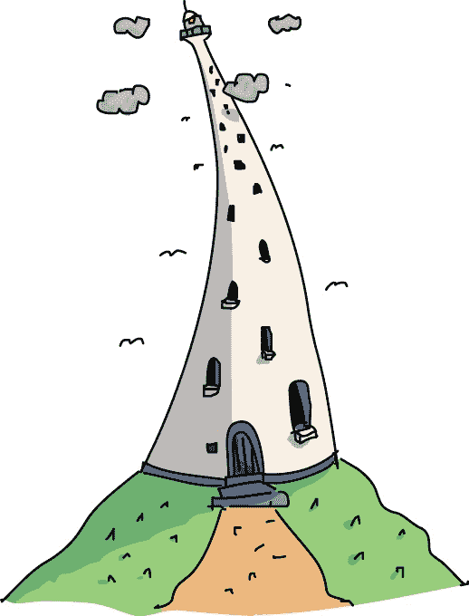

# 第十四章 在抽象之中

“Laurie，醒醒。”

“Mrfl。”Laurie 翻了个身。感觉现在起床太早了！

“来吧，醒醒。”

“妈妈？”Laurie 听到水花四溅的声音。是在洗澡吗？

“我们到了，女孩。帮我整理一下船。”

“那……船？什么船——”她睁开眼睛。墙是木头做的，是 Winsome，而不是 Laurie 的妈妈，叫她醒来的。原来——Laurie 还在*双胞胎*号船上。

Laurie 上了甲板，第一次看到了抽象岛。*双胞胎*号船停靠在主码头的尽头。小港口呈完美的半月形。码头四周，人们在钓鱼或在相同的船上忙碌着。陆地上，房屋和商店与树木和丘陵公园交错分布。

“嘿，Winsome，为什么所有的建筑看起来都一样？”Laurie 问。“连树也一样！”

“这儿的做法是这样的。他们先*不停*地讨论什么构成了一栋楼、一条街，或者一只鸽子。一旦找到了完美的抽象设计，他们就复制一堆。我们去吃早餐，然后送这些信吧。”

Winsome 举起一个巨大的邮袋，朝码头走去。Laurie 得赶紧跟上。

港口周围有许多餐馆。哲学家的餐厅挤满了穿着托加的老年人，而在 Random Slice Pizza，你永远不知道会得到什么配料。不过现在太早了，没法吃披萨。

她们在 Push & Pop 咖啡馆找了个座位，点了满满一堆煎饼。Winsome 没有从整个煎饼堆里切，而是一个一个地吃掉堆顶的煎饼。

Laurie 困惑地看着 Winsome，直到她再也忍不住好奇心。“为什么你吃煎饼的方式那么奇怪？”

“我才不是奇怪地吃它们呢，*是你*吃得奇怪。”

Laurie 没有再追问，而是换了一个问题。“我应该怎么处理我的地图？”她边吃边问。

“我也不知道，女孩。”Winsome 说。“那我们来玩一个能帮我们弄明白的游戏吧。”

“什么游戏？”

“这个游戏叫做‘五个为什么’。当你卡住了，就可以玩这个游戏。”

“怎么玩？”

“我问你一个‘为什么’的问题，你回答，然后我再问你另一个，直到我们找出你卡住的原因，”Winsome 说。

“比如说？”

“比如说，”Winsome 开始说道，停下来咽下最后一口煎饼，“你为什么要跟着那张地图走？”

“这是 Hugh Rustic 用他的蚂蚁做给我的那个，”Laurie 说。“他在所有城镇之间找到了一条足够短的路径。”

“那你为什么想找一条足够短的路径？”

“因为 Userland 里有成千上万的路径，而 Tinker 不知道怎么找到*最短*的那一条，”Laurie 说道。

“你为什么要问 Tinker 最短的路径？”

“因为 Eponymous 说流浪商人的算法——嗯，她当时没有说‘算法’，我后来才搞明白——她说他的算法不合理。”

“你为什么要使用商人的算法？”

“因为那是*他*找到回家的路的方式。”

“你为什么觉得他的算法适合你？”

“因为我……“劳里没想过这个问题。 “我不知道。”

“你那时迷路又害怕，而他看起来好像知道自己在做什么，对吧？”温索姆问道。

“嗯，我想是的。”

“亲爱的，流浪推销员是一个*推销员*，他必须走访很多地方买卖，”温索姆说道，“而说服别人是他的工作。”

“Eponymous 说它是有道理的，虽然。”

“推销员的算法对*他*来说有意义，但对你未必有用。我们很容易被第一个出现的答案诱惑。但是很多时候，它并不是最好的。这就是为什么你必须保持清醒。”

“为什么没人说什么？”劳里问。

“因为你必须问对问题，”温索姆回答说，“没有人会替你过你的人生，姑娘。”

“但是我*问*了每个人怎么回家！”

“不，你听起来是偏离了你的真正目标。等你到达 Rustic 时，你没有问如何找到汉密尔顿。你问的是如何找到一条穿越所有 Userland 城镇的最短路径。”

“哇，你说得对。”劳里低头看着自己的腿。“我现在觉得自己真的很蠢。”

“没事，别难过。每个人都会犯这种错误。”

“他们真的有吗？”

“你完全没概念，”温索姆说道，“算法不仅仅发生在乌龟、蚂蚁和硬币中。它们也发生在你脑袋里，而这些才是最难搞清楚的。”

“我还是不知道怎么回家。”

“我也不知道。但提出正确的问题是一个很好的开始。只要你在这里，不妨做点有用的事。”温索姆指着窗外的一座高耸的白色塔楼说道，“你看见那座灯塔了吗？”

“那怎么办？”

“你想上到顶层去吗？那里的景色很棒。”

“嗯……当然！听起来很有趣，”劳里说道。

“很好。拿着这个。”温索姆递给她一个沉重的木箱。“我需要你把它交给灯塔守卫。”

“那是什么？”

“它非常昂贵，而且很脆弱。”

“但是—”

“继续说，他在等着。我回船上找你。”

劳里爬上山顶非常费力，她在灯塔底部停下，稍作休息，准备找个门铃或者有人开门。地面上没有任何迹象，于是她向塔楼大声喊道。

“你好！那边有人吗？有人吗？”

一个声音飘了下来：“看见了！上来吧！门是开着的。”

劳里一边喘气，一边费力地提着那个笨重的箱子，Xor 栖息在她的肩膀上。她终于爬到了塔顶的灯塔守卫室，气喘吁吁。灯塔守卫背对着她，拿着望远镜扫描着远方。

“哦，好吧，”他低声说道，“小心放下。”

劳里把箱子扛到长椅上，环顾四周。房间几乎没有墙壁，几乎全是玻璃做的。劳里站到灯塔看守人旁边，想从窗户看到更远的地方。窗外一侧是广阔的蓝色海洋。她几乎能在地平线上看到一个小突起——也许那就是用户岛。另一侧，整个抽象岛像地图一样铺展开来。海岸边有港口和*双胞胎*。两个人穿着长袍，在哲学家餐厅前争论。俯瞰整个岛屿，景象更加整洁有序。

“哇！从这里可以看到一切！”劳里惊叫道。

“是的。”灯塔看守人依旧把目光固定在窗外的景色上。

“那么……就这样？”

“就是这样。”灯塔看守人说道。“哦，呃，谢谢。”

* * *

没有箱子的情况下，走下山坡比上坡容易多了。

“那箱子里到底*是什么*？”劳里一边走回*双胞胎*，一边好奇地问。

Xor 从她的口袋里探出头。“我猜是灯泡吧。什么无聊的东西，”他插话道，“大人们总是对无聊的事情大惊小怪。”

* * *

回到船上，温索姆准备再次出发。

“干得好，女孩。谢谢。”她对劳里登船时说道。

“不客气。他不怎么说话。”

“有些人就是这样，整天生活在塔里。”温索姆说，“其他人就开始说话*很多*。”

“它们做吗？”

“你会看到的。那么，你现在打算做什么？”

“我考虑过了。”劳里说。“用户岛只是一个岛。这座岛……还不错，但我问过了，这里没有人听说过汉密尔顿。”

“嗯，”温索姆说，“你想做我的助手吗？”

“你什么意思？”

“你是想找回家的路，对吧？*双胞胎*几乎可以去任何地方。你可以帮我做一些送货的工作，这样你就能在更多地方寻找答案，而不是只靠走路。或者游泳。”

“那不就是你告诉我该去哪儿吗？”

温索姆微笑了。“你变得越来越聪明了。但别太聪明。和我一起航行一段时间吧。我需要帮手。如果你不喜欢，我会把你放在任何你想去的地方。没关系。”

劳里想了想，咬着嘴唇。“好吧，”她说，“交易达成！”
