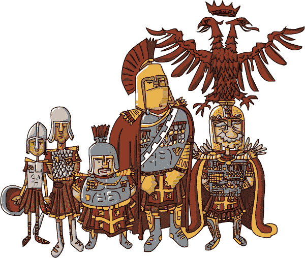
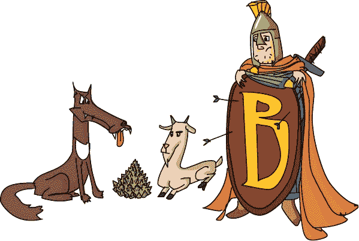
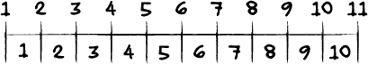

# 第十五章：关键时刻的聪明才智

和 Winsome 一起乘坐 *Doppelganger* 旅行非常有趣。Laurie 见到了许多奇怪的地方和人物，以至于有时她都忘了自己是在试图找回通往 Hamilton 的路。但她的工作并不轻松。

每当他们到达一个岛屿时，Winsome 总是会带着一大袋信件进城并分发出去。几小时后，她会带着一批新的信件返回，从那个岛屿将它们送到别的地方。

Laurie 的工作是送那些“有趣”的包裹。（Winsome 总是用这个词，Laurie 不认为它的意思是 Winsome 所认为的。）所谓的“有趣”客户住在荒无人烟的高塔里，过着摇摇欲坠、令人恐惧的桥梁上，或者在高山顶上，或者悬崖边。包裹又重（而且脆弱……又贵），而且它们的目的地指示常常是怪异且不完整的。为了安全地往返，Laurie 必须在工作中非常聪明。

不明确的指示已经够糟糕了，但这次，Laurie 要送的包裹根本没有正确的地址。上面只写着 *首先，遵循拜占庭程序*。Winsome 不知道去了哪里，Laurie 甚至不能向她寻求帮助。

“什么是拜占庭程序？我甚至不知道它是什么样子的。我怎么遵循它呢？”她在心里默默思索。

“我们现在在拜占庭岛上，” Xor 说，“所以拜占庭程序一定是指主要道路的名字，或者是一条河，或者是河边的路。这是合乎逻辑的。”

“你完全不明白，是吗，Xor？”

“当然知道！我的继姐是个 Atlasaurus！”

“什么是 Atlas……算了，我不想知道。”

至少，在哪里开始并不是个谜。拜占庭的入口被一座巨大的石质建筑物堵住了。一个标牌写着 *所有包裹在此进入*。一条长长的红地毯通向一个语义化的旋转门，门口有两名守卫，就像在 Symbol 中一样。守卫们似乎正在争论什么。

“……这没有任何意义，Anton！”

“巴兹尔，这完全有道理。如果你只——”

“对不起，”Laurie 说，“我想通过这里。”

“抱歉，小姐。为此，你必须持有由值班下级军官签署的通行证——” Anton 开始说道。

“——并由值班高级军官签字，”巴兹尔补充道。

“他们是谁？”她问。

“我们是。”

“哦，太好了。”

“中尉巴兹尔是值班下级军官，而我是值班高级军官——” Anton 说道。

“——但只有在偶数天，”巴兹尔说道，“在奇数天，我是高级军官，中尉 Anton 是下级。”

“今天是什么日子？”

“这就是我们在你打断之前讨论的事情，”Anton 说道，“昨天是 Pentember 的三十号。我想我们都同意三十是偶数，因此我是高级军官。”

“这意味着今天是 Hectember 的零号日，”巴兹尔说。

*“零的零……”？嗯，一切都得从某个地方开始*，劳里想。“那么安东今天应该是初级的，巴兹尔应该是高级的，对吧？”

“事情没那么简单，小姐！”安东说。

“有个问题是，零到底是偶数还是奇数，”巴兹尔说。

“哦。”劳里从未这样想过零。现在她很想知道。“那到底是偶数还是奇数？”

“零是偶数！”安东说。“零能被二整除。零除以二是零。”

“那没什么证明力，”巴兹尔说。“零除以*任何*数字都是零。更重要的是，如果零是偶数，那么安东就会连续两天做高级军官，我可不答应！”

“更重要的是，”安东说，“如果零是奇数，那么巴兹尔今天和明天，赫克特月的第一天，都将是高级军官。我可不愿意接受*那样*！”

“你看，小姐，关于重要问题，你站的位置取决于你坐的位置，”巴兹尔说。

“但是——”劳里开始说。

“不管怎样，你得先让你的通行批准请求表格通过审批。”

“我的通行批准请求表格？我不明白。”

“哦，当然我们这里没有通行证，”巴兹尔说。“那样就太糟糕了，安全性就会大大降低！”

“你得先让凯斯将军批准你的通行批准请求。如果他同意你可以通行，我们也同意你可以通行。”安东说。

“他就在走廊右边，”巴兹尔补充道。“现在看这里，安东：如果你把两个奇数加在一起，你得到偶数，对吧？零加零是零。所以如果零是偶数，就像你坚持的那样，那么它也必须同时是奇数……”

劳里走过一条无尽的走廊，直到她来到一扇略微敞开的门，上面写着*康斯坦丁·凯斯将军，外围安全办公室*。她轻轻敲了敲门，然后走进了房间。

“你好，将军先生？我在找一个通行证通过大门。”

“嗯。”凯斯将军从文件中抬起头来。“你有什么事？”

“我在送一个包裹。”

“嗯，我需要多少个栅栏桩来建 100 英尺长的围栏？”

“抱歉？”

“*栅栏桩*，孩子。我想在 100 英尺长的围栏每隔 10 英尺放一个栅栏桩。我需要多少个？”

“呃，10 个？”

“我也这么想，”他说，“但我们人手不足。我怀疑敌人在偷我们的人。”

劳里完全不知道他说的是什么。“抱歉打扰您，先生，关于那个通行证……”

“把这个拿给走廊里的达里乌斯将军，在后勤办公室，”凯斯说着递给她一份空白的通行批准请求表格。“如果他批准了，我也会批准。”

“谢谢！”劳里兴奋地说。

“嗯。”他转回到栅栏桩问题上，留下劳里自己去找达里乌斯将军。

* * *

达米恩·达里乌斯将军也正忙着一堆文件。劳里注意到他的桌子上有一张大河流地图，地图上布满了乱涂的线条和箭头。

“达里乌斯将军？我需要一个通行证，”劳里说，同时递给他她从凯斯那里得到的通行批准请求表格。

“你是来找曼德尔西兰花的吗？”

“呃，曼德尔西兰菜？不，先生。”

“那么你有关于狼的信息。”

“狼？”

“是的，狼，”达里乌斯说。“我的一个手下正在尝试带着一只狼、一只山羊和一堆曼德尔西兰菜穿越并行流域。那只船只能容纳他和其他一样东西。”

“他不能一次带走一个吗？”她问。

“不行。如果他带走狼，把山羊留给西兰菜，她会吃掉它。如果他带走西兰菜，把狼留给山羊，狼会吃掉*她*。”

“所以先带走那只山羊，”劳里说，一边在脑海里做着哑剧。“然后带走……哦。”

“是的。无论他接下来带走什么，他在另一边也会遇到同样的问题。”达里乌斯说。

“那真是个糟糕的消息，但我其实是来问一张通行证的，”劳里回答。

“我没时间和民间闲聊。把这个交给记录办公室的欧里比得斯将军，”达里乌斯说，一边把劳里的表格还给她。“如果他批准了，我也会批准。”

劳里沿着走廊走去。

* * *

欧里比得斯正忙着处理自己的问题。人们围着放在记录办公室桌子上的巨型记录册。有些人在试图从书中读出一串又一串的数字，另一些人则想在书中*写*新的数字。读者和写作者混乱地撞在一起，互相妨碍，似乎随时可能爆发冲突。

将军在各个桌子间踱步，听着投诉并发出命令。一群人跟在他后面，互相大声喊叫，试图引起他的注意。看起来他几乎没有时间思考。

劳里推挤着、挣扎着，终于挤到人群的前面。

“先生？欧里比得斯将军？您能帮帮我吗？”

“嗯？哦，又来一个。你是读者还是写者？”

“我既不是读者也不是写者。我需要你批准——”劳里刚开口，但将军不得不去打断一场争执。

“现在你到底想要什么？一个读者？哪本书？”欧里比得斯回来说。

“不，先生。我需要——先生？您好，先生？”

欧里比得斯又走到房间的另一个角落。劳里试图再次引起他的注意，但人群不断把她推开。

* * *

劳里坐在走廊的地板上，头埋在膝盖上，筋疲力尽、满脑子困惑。曼德尔西兰菜、篱笆柱、通行证、将军这、将军那……这一切到底会怎么结束？她依然能听到关于谁接下来能使用哪本书的争吵声。

“那些人真没礼貌，”她嘟囔着。

“为什么他们不能轮流分享呢？”

“也许没有人教过他们怎么做，”Xor 说。“我表哥雷克斯从来不喜欢分享。当然，他有四十英尺高，牙齿长得像你的胳膊那么长。”

“应该有人教教他们。这样不公平。”

“是的，”Xor 说。“嘿，你不是某个人吗？”

“我？”

“是的！我敢肯定你是某个人，否则你就是没人，那样对任何人都没有意义。”

“但我只是个孩子。没人会关注孩子。”

“那又怎样？没人关注我，”他说。

“但这不正是你想要的吗？变得隐形。”

“哦，嗯。”

“我们该怎么办，索尔？”

“我不知道。想一想，你擅长这个。”

“不，我不是，”劳里嘟囔道。

“真的吗？廷克觉得你是。温森也这么认为。”

劳里再次低下头叹了口气。“我不过是她的送货女孩。”

“不，你是她*有趣*的送货女孩，”索尔说。

“那又怎样？”

“所以你得找出一种方法，去做别人做不到的事。还记得你在符号外和波嫩斯、托伦斯争论时吗？我原以为你没办法绕过他们。但你做到了。就像那个吓人的老太太简一样。”

“他们也从没抓到我们，”劳里微微一笑。

“直到监护人抓住你。”

“然后就是温森救了——哦。”

“什么？”

“我不能回去告诉温森，我连前门都没能通过！”

“为什么不呢？”索尔问道。

“我只是……我做不到。她给了我一个任务，我必须自己完成。”

所以，劳里无所能为，且无处可去，只好开始思考。

她需要从欧里庇得斯那里获得批准，才能从达里乌斯那里获得批准。接着，她需要用*这个*去获得凯斯将军的批准，最后，表格必须由巴兹尔和安东签字并盖章。这个拜占庭式的混乱让她感到有些熟悉。那是休·鲁斯提克曾告诉她的话。*想一个答案，然后找一个匹配的问题。*

欧里庇得斯被问题压得喘不过气来。每个人都想同时做所有事。也许她该从这里开始……

* * *

半小时后，劳里回到了记录办公室。她没有大声喊叫、推搡，或者插队。她耐心地等着。最终其中一本书完全空了。劳里走过去，在地上画了一条线。

一位女士走过来写书。劳里让开了，让她工作。过了一会儿，一位男士走过来从书中阅读。

“新政策，先生，”劳里说。“你必须站在线上，直到第一个顾客完成。”

“但是我必须查找第 1728 页上的内容！”

“对不起，”她说。“这是将军的命令。但你是下一个。”

“哦，好吧。”那人小心地站在了那条线上。又有一个人走来，从第 1024 页开始阅读。

“将军的命令，”第 1728 页指着那条线说。“别担心，你在我后面。”

劳里坚持站在队伍中，直到队伍的模式看起来会自动继续下去。每一个新来的人都会被队伍中的其他人告知等待。然后她等待下本书的开放。

随着这个想法的传播，人们开始在其他书前画自己的线。很快，整个记录办公室变得平静有序。毕竟，这是将军的命令。

欧里庇得斯几乎不敢相信他所看到的。读者和写作者们遵循着一个简单的规则，轮流进行！他很高兴能休息片刻，毫不犹豫地签署了劳里的通行证。

* * *

“达里乌斯将军？”

“又是你。我不想听其他的，直到我们解决了西兰花问题。”

“我认为曼德尔布罗茨基并不重要，先生，”劳里说。

“什么？你想让羊把它全吃掉？”

“没有，我的意思是，即使你有两只狼，答案也是一样的。你不能把羊单独留在任何东西旁边。如果你换个角度看，这很容易。我想。”

“继续说，”将军说。

劳里再想了想，然后写下了她的想法。它看起来有点像当年在廷克那儿的算法：

1.  **把羊带到另一边。**

1.  **空着回来。**

1.  **把狼带过去，但然后带回羊。**

1.  **把羊留下，带着曼德尔布罗茨基过去。**

1.  **空着回来。**

1.  **最后，再带着羊过去！**

达里厄斯思索了一会儿，手在空中来回移动，思考着她的想法。

“我相信这个方法能行。羊不太喜欢来回走，但总比被吃掉好，”达里厄斯说。“那么小姐，你到底想要什么？”

* * *

最后，劳里回到了外围安全办公室。“凯斯将军，先生？达里厄斯将军签了我的通行证。”

“嗯，”凯斯咕哝着，在达里厄斯的签名下签了字。

“谢谢你，先生。”

“嗯。”

“先生？还有一件事，”劳里说。

“嗯？”

“我不认为有人在偷你的篱笆柱。只是你需要*十一根*柱子。就像这样。”

“嗯！”

* * *

“欢迎回来，小姐，”安东说。劳里把她从拜占庭将军那收集来的文件交了过去。

“看起来一切都没问题，”巴兹尔说，检查着签名列表。“这些批准一直到顶层！”

“小姐，您有要申报的吗？”安东问。

“申报？”

“安东中尉的意思是，”巴兹尔说，“我们需要知道什么吗？”

“哦。我觉得安东是对的。零是偶数。”

“没有！”巴兹尔说。

“是的，零不能是奇数，因为一是奇数，你不能有两个连续的奇数，对吧？”

“对！”安东说。

“我想不是，”巴兹尔抱怨道。“但那并不能证明它是偶数。”

“嗯，如果你把一个奇数和一个偶数加在一起，结果总是奇数，”劳里说。

“嗯，”巴兹尔犹豫了一下，思考着。“一加二是三，二加三是五……对。”

“所以我可以证明零是偶数还是奇数。把它加到一个奇数上，看看结果。零加一是一个，且一是奇数。所以零必须是偶数，”劳里说。

“我还是不信服，”巴兹尔说。

“好，”劳里说。“如果你把两个*偶数*加在一起，结果总是偶数，对吧？零加二是二，二是偶数。零又是偶数了！”

“正是！”安东说。

“哼，”巴兹尔哼了一声。“所以零是偶数。我怎么才能避免安东两天连着做高级官员？”

“那是简单的部分，”劳里说。“问题是，昨天是三十号，今天是零号，都是偶数。安东昨天是高级官员。所以巴兹尔，今天你可以是值班的高级官员。”

“等等，稍等一下——”Anton 说。

“——但只有到午餐时间为止，”Laurie 说，“今天午餐后，Anton 就是高级职员。这样才公平。”

“太棒了！”高级官员 Basil 说。“初级官员 Anton，给这位年轻女士签个通行证！”

已批准，已批准，已批准，签署并盖章。Laurie 最终通过了转门。

“我很高兴那件事终于结束了，”Xor 说，“现在，那种拜占庭流程到底在哪里？”
