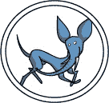
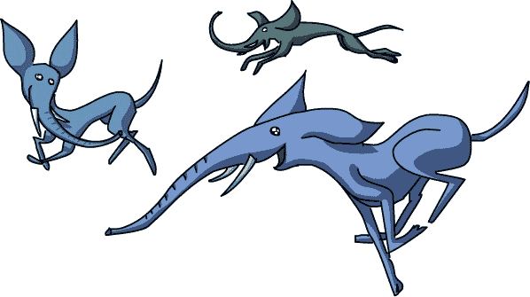

# 第十七章 追逐优雅鸟

“对，”Winsome 说道，手指在清单上勾掉了 Fuerza 的包裹。

“接下来是优雅岛。那特别的包裹在哪里？”

“哇，那是什么动物？”劳里问道。在海岸边，小灰色的动物们用长长的灰色象鼻互相玩耍，并在阳光下打盹。

“那就是优雅鸟。岛上到处都是它们。”Winsome 回答道。

“它们好小好优雅！就像在跳舞一样。”

“是啊。包裹，包裹……”Winsome 自言自语道。

“你们那儿没有优雅鸟吗？”

“没有。我们有大象，但它们都又大又笨。优雅鸟友好吗？”

“只有它们觉得有必要的时候才友好，”Winsome 说。“找到了！好了，这个包裹是给 Fresnel Goodglass 的。”

“地址上写着*红色气球下*，”劳里说。“我猜你是指他在那儿。”她指向一颗悬浮在树上方的红色气球。

但在她离开之前，劳里想和优雅鸟一起玩。她小心地接近它们，发出轻柔的“咕咕”声。

“你现在是鸟了吗？”Xor 挖苦道。

“嘘，我只是在试图引起它们的注意。”

优雅鸟似乎既不特别害怕也不特别好奇。事实上，它们的举动就像劳里根本不在似的。但它们的舞蹈总是让它们避开了她的路径。当她沿着海岸走时，那些小生物会飘向内陆。当她走向内陆时，它们就决定待在树下。很快，劳里只能看到少数几只优雅鸟，它们在她够不着的地方玩耍。*唉*，她心想。

* * *

有了气球作为指引，劳里和 Xor 很容易找到了那座山丘。但当他们到达时，那里几乎什么也没有。一只大船锚半埋在土里。一根绳索一直延伸向上，直到一个挂得很高的篮子，而篮子上方正连接着气球。几只年轻的优雅鸟在树下玩捉迷藏。那里完全没有建筑物或人。

“我们在正确的地方吗？”劳里大声问道。“灯塔在哪里？”

“嘿，劳里，看看这个。”Xor 正抓住一块写着*请按铃叫服务*的牌子，下面挂着一只小铃铛。它们互相看了看，然后耸了耸肩。Xor 用尾巴轻轻一打。

按响了铃声，声音大得出奇，完全超出了这么小一个东西该有的音量。

Xor 就在旁边。那只小蜥蜴变成了明亮的靛蓝色，然后掉到了地上。

劳里不得不捂住耳朵，直到声音消失。

当一切结束时，那些年轻的优雅鸟已经不见了。劳里把 Xor 捧在手中。他的皮肤变白了，眼睛四处乱转。

“Xor！你还好吗？”

“我想是的。那吓得我蓝色都掉出来了！”

一阵嘶嘶声从头顶传来，劳里抬头一看。一个电梯箱正缓缓降下，停在他们面前。门打开时发出礼貌的*叮！*声，她们不禁一跳。

劳里拿起她的包裹，最后环顾了一圈，走了进去。门关上了，电梯上升得足够快，让她的脚趾头有点蜷曲，肚子也开始翻滚。

当门再次打开时，他们已经在空中一百码的地方，站在篮子里。那就像一个小公寓。里面有一张桌子、一张床和几把舒适的椅子。一个面容皱巴巴的老头，留着灰色胡子和尖耳朵，正在朝她笑。

“这是……你是弗雷内尔·古德格拉斯吗？我是劳里，我有个包裹要给你。”

“是的，重要！是的，我是！是的，你是！谢谢！”那人说着，接过了包裹。“欢迎来到我的浮动灯塔。你觉得怎么样？”

“这不是*灯塔*，”劳里说道，试着用脚踩了踩编织的地板，准备下电梯。“这是一个气球！”

“当然，它是一个灯塔，气球形状的。看上面那个大灯吗？”弗雷内尔问。确实，有一个巨大的灯塔灯挂在他们上方。

“可是那长长的盘旋楼梯去哪了？”劳里问。

“这里只有电梯。对我这些老骨头来说更轻松。”

“那么，灯塔守护人的房间呢？”

“你可以直接往篮子的一边看。”

“那塔呢？”

“不需要！无关紧要！”弗雷内尔说道，“灯塔的本质部分是*光*，而不是房子。”

劳里并不信服。“你不能只是把一个灯放在气球上就叫它灯塔。”

“我不能？”

“不是！”

“为什么不呢？”

“因为……那是在作弊，”她说。

“嗯，我想我明白你的意思了，”弗雷内尔同意道，“但只要有效，名字不重要。”

“是的，它有底！”

“也许你说得对，”他再次同意道，“但我真是个糟糕的主人！走了这么久你一定口渴了。要不要喝点水？”弗雷内尔拿着一个水壶和玻璃杯在托盘上递给她。

“哦，好的，拜托。”劳里拿了个杯子，试图往里倒水。水溅到了她的鞋子上。

“*嘿！* 这个杯子没有底！”

“那不是杯子，亲爱的孩子。那是个玻璃杯，”他说道。

“这个*玻璃*没有底。我要怎么喝？”

“再想想，这不算是个杯子，”弗雷内尔说道，“它是个马克杯。看，那个把手？”

“好了，这个*马克杯*有——”

“再想想，”他说，抚摸着他的胡子，“它是玻璃做的，但也有把手。所以也许我们该叫它玻璃马克杯，或者马克玻璃杯……”

“我不在乎你*叫*它什么！”劳里喊道，“它*没有底*，水……我的意思是，嗯，你叫它杯子，但它没有……哦。”她的脸变得通红。

弗雷内尔递给劳里另一个杯子。“你说得对。事物就是它们本来的样子，不管人们给它们取什么名字。”

“但名字不重要吗？”劳里问，一边仔细检查她的新玻璃杯——杯子——马克杯有没有洞。幸运的是，这个有底。

“名字的作用是有限的。很多名字实际上只是同一件事的伪装。”

“真的吗？”

“当然。你是劳里还是劳伦？”

“嗯，都对。但是我喜欢洛丽。当妈妈生气的时候，她会叫我劳伦。”她把手叉在腰上，仰起头。“*劳伦·伊普森，马上下来！*”

费涅尔笑得像一匹马，如果那匹马听懂了笑话的话。“一个全名是很强大的东西。但无论如何，你还是同一个人。有时候，不同的东西也有相同的名字。你叫你妈妈‘妈妈’，我也叫我妈妈‘妈妈’。”

“但我可不会叫*你的*妈妈‘妈妈’！”洛丽说。“*那该有多奇怪啊？*”

“就是这样。逻辑上讲，你必须看穿名字，才能看到事物的本质。这就是费涅尔第一定律。”

“你说话的语气真像是‘名字的巴赫’，”洛丽说。

“真的吗？那我也是个作曲家，”费涅尔说。“我从大想法开始，然后把它们做小。”

“让它们更小？为什么？”

“为什么不呢？只有心胸狭窄的人才认为大问题需要大想法。”

洛丽不确定他在说什么。“怎么把一个想法变小？”

“通过*分解*。你如何不使用*灯塔*这个词来谈论一个灯塔？”

“嗯，它是一个高高的白色塔楼，靠近海边，塔顶有满是窗户的房间，顶部有一个大灯，里面有一个长而弯曲的楼梯。”

“很好，”费涅尔说。“现在看看每一部分，看看它是否必要。如果你那个‘高塔海边有窗户、大灯和楼梯’的灯塔是*粉色*的，它还能发挥同样的作用吗？”

“我想是的。我从没见过粉色的灯塔，”她说。

“我也没见过！但是如果一切都已经存在，生活就会很无聊。为什么你的灯塔那么高？”

“所以船只能看到你，”洛丽说。“一个短灯塔不太管用。而且你需要弯曲的楼梯才能到达顶部。”

“为什么是光？”

“光是为了让船只能在晚上看到你。”

“那灯塔看守的房间呢？”

“所以你能看到*他们*。”

“啊，明白了，”费涅尔说。“我的气球上面有一个非常高的灯光，远处的人能看到它。我可以从侧面看见他们。我是坐电梯上去的。颜色不重要。它完成了灯塔的所有功能。那它是灯塔吗？”

“它*像*一个灯塔，”洛丽承认道。

“你真难对付！我就认了，‘像灯塔那样’，行吗？”他说。

“所以这就是你分解的方法？”

“差不多就是这样。你把一个大想法拆开，看到每一部分背后的*原因*。然后，你要寻找更小的想法来完成同样的事情。比如，你觉得我的小铃铛怎么样？”

“你的*小*铃铛！那个东西吓得我——”

“我同意，确实需要一些调整。但这个想法是合理的，”他说。“铃铛的核心部分是声音。因为铃铛挂得很低，我需要它发出很大的声音，才能听到。”

“那为什么不使用大铃铛呢？”她问。

“如果我用大铃铛，我就得需要一个大框架来挂它，还有一个大铃锤，再加一个大牌子。所有不必要的东西都会变得更大，”费涅尔说。“当一个小巧简单的想法就能解决问题时，没必要用一个大而复杂的想法。”

“我真希望能告诉 Bruto 这些，”Laurie 说，想起那座巨大的金字塔。“但他离得太远了。”

* * *

“Winsome，我为什么要送这么多望远镜？”Laurie 问。

Winsome 的表情变得坚硬。“偷看别人邮件可不太好。”

“对不起。这些包裹真的很重，我在想，是什么东西既脆弱又昂贵，还这么重要……”

Winsome 没有回答。她装作忙着捆绑绳索和锚。

Laurie 继续追问。“为什么是望远镜？”“为了让灯塔管理员能够看得更远。”

“他们为什么需要看得更远？”

“因为其他灯塔太远了。”

“这没有道理，”Laurie 说，“为什么灯塔中的人想看到其他灯塔？”

“因为这就是我们传递信息的方式。这是灯塔网络。”

“你为什么要以这种方式传递信息？”

“现在，”Winsome 说，“如果抽象岛上的人想和数据岛上的人交谈，他们必须支付给上校和他的邮差网络。”

“那有什么不好的？为什么要建立你自己的网络？”

“因为我能。而且因为 Trapp 上校不希望我这么做。”

“他为什么不希望你建立一个网络？”Laurie 问。

“这已经是五个为什么了，孩子。准备好了吗？下一站很简单。你会喜欢 Ping 的，她住在树屋里！”
