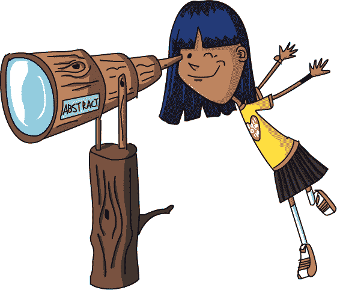

# 第十八章：众人拾柴火焰高

一旦*双重影像*到达下一个岛屿，Winsome 立刻让 Laurie 去进行另一项配送。这个望远镜是最后一个，但 Laurie 仍然在想，他们到底是怎么和 Winsome 的计划结合起来的。

“生活中有些事情，你必须亲自去看！”Winsome 说着笑了笑。

Laurie 很难反驳 Winsome 语气中的兴奋，所以她只是信任这套常见的奇怪指示，跟着走下去。不久，她和 Xor 到达了一棵巨大的树。树干上缠绕着一条长而弯曲的楼梯，一位年轻女子站在树下。

“你好，Laurie！很高兴你来了。我叫 Ping Baudot。我一直在等你。”

“你好。等等，你怎么知道我的名字？”

“哦，弗涅尔告诉我了一切关于你的事情。”

“弗涅尔？他住在优雅岛那边！”

“是的，真是太棒了！你和 Winsome 最近做了很多配送。网络现在越来越大了！我几乎跟不上所有的聊天了。”

“但是我不——”

“你应该感到非常自豪。来，让我帮你。”Ping 接过包裹，飞快地跑上楼梯，绕着树干转来转去。Laurie 尽力跟上她。

当他们到达树屋的顶端时，Laurie 吃惊地倒吸了一口气。那是一个树*灯塔*！不仅如此，灯塔守望者的房间里还满是指向各个方向的望远镜。每个望远镜上都贴有整齐的标签。

“怎么样？你觉得怎么样？”Ping 说。

“为什么需要这么多望远镜？”Laurie 问。

“你自己看吧。”

Laurie 把眼睛凑到标有“优雅”字样的望远镜上。空中挂着一个红色的圆点。那是绳子吗？

“嘿，那是弗涅尔的气球！我看见他了！他在挥手！”Laurie 喊道。

Laurie 看了看其他的望远镜。每个望远镜都指向不同的灯塔。抽象岛的望远镜显示了一个很少说话的灯塔守望者，他站在高高的白色塔楼里，透过自己的望远镜向外看。他没有挥手。拜占庭岛的望远镜则显示了半个金字塔，塔上覆盖着巨大的机械乌龟。Bruto 正忙着数砖块。

Ping 放下 Laurie 送来的沉重包裹，解开了搭扣。里面是一个矮胖的望远镜。“太好了！我一直在等这个。”

“这是为了网络，对吧？你能教我怎么用吗？”Laurie 问。

“当然，”Ping 说。“看这个。”她走到房间中央，转动一个巨大的轮子，直到一个红色箭头直接指向优雅岛。然后她迅速上下拉动一个杠杆：

> 嘭。嘭。翻。嘭。翻。
> 
> 嘭。翻。翻。嘭。嘭。

“现在再看弗涅尔。”她说。

Laurie 把眼睛凑到优雅岛的望远镜上。弗涅尔将*他的*光线照向*他们*并开始闪烁起一个信息：

> 嘭。嘭。闪。嘭。闪。
> 
> 嘭。闪。闪。嘭。嘭。

“他回复了！他说了什么？”Laurie 问。

“哦，他就说了‘嗨’。”

“就为了‘嗨’？”

“这就是 Baudot 代码的工作原理，”Ping 说。“句子是由单词组成的，单词是由字母组成的，对吧？同样地，我们用 FLIP 和 FLOP 来组成*字母*。像这样。”

> 01001 = L
> 
> 11000 = A
> 
> 10011 = U
> 
> 01010 = R
> 
> 01100 = I
> 
> 10000 = E

“这真酷！但我还是觉得光是说‘嗨’就要做这么多工作。”Laurie 说。

“也许你说得对，”Ping 笑着说，“但现在建立网络的艰苦工作完成了，我们可以做一些*真的*有趣的事情：利用网络来让它变得更好。”

“你是怎么做到的？”

“嗯，我正在研究用两种颜色的灯光。Fresnel 有一个想法，是用四个 FLIP 或 FLOP 来组成一个更简单的代码，虽然我不太确定那会怎么工作。我们用老的 Baudot 代码互相讨论新的代码的想法，然后试试看。”

“所以...你可以用网络来讨论如何使用网络吗？”

“你帮忙让这一切成为可能，Laurie，感谢你送去了那些望远镜。现在，随着我们学会如何使用它，网络会变得越来越好。我们已经可以在几分钟内将信息从网络的一端传递到另一端！就连*Doppelganger*也需要几天时间才能把邮件送到这么远的地方。一旦我们解决了问题，大家都会想用它。”

“但是...Winsome 怎么办？她是不是会失业？”Laurie 问。

“什么？不，根本不是！网络是她的主意。”

“是吗？”

“当然！我们所有人都为 Winsome 工作。她可不想整天搬邮件袋。对了，”Ping 一边从一堆纸中翻找，一边说，“Winsome 说她有一项任务要交给你。”

“哦！怎么了？”Laurie 问。

“她希望你把这封信送到花园的另一边一个人手中。”

信封上没有名字，但这比 Laurie 在*Doppelganger*上经历过的一些任务奇怪多了。如果她能快速完成，回到这里后她就可以玩网络了。“那么我该怎么去花园呢？”

“你急什么？我带你去那儿。”
