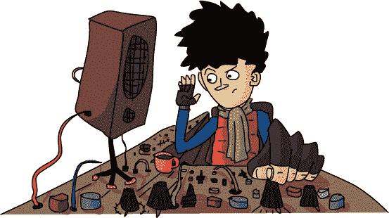

# 第二十一章。还有一件事

那是一个黑暗而雾气弥漫的夜晚，距劳伦·伊普森回到汉密尔顿已有数月。灯塔闪烁。闪烁。闪烁。闪烁。

今晚的闪光灯没有传递任何信息。浓雾太厚，无法发送信号，所以网络无法使用。强力灯光被用来执行原本的任务：警告船只远离危险的岩石。

事实是，只有一艘船在附近，它不需要任何警告。它正好在应该待的地方。

*贾格诺特号*是那艘船，凯文·凯尔文是它的船长。那艘船又大又平，外形简朴。船头有一个小舱室，凯文住在那里。船的其他部分被一台起重机和一台绞盘占据——这是一台用来卷起或放出电缆的机器。一根电缆从起重机延伸到水中，看起来像是一根巨大的钓鱼竿。船下层大多是用来存放成吨成吨的卷曲电缆的货舱。

如果说*贾格诺特号*是一艘附带绞盘的巨大船只，那样说可能不太准确。那可能会给你错觉。更准确的描述应该是：它是一台附带船只的巨大*绞盘*。它的全部目的就是放出和收回数英里的重型电缆。

在船舱里，凯文·凯尔文搓着双手以保持温暖。门附近的墙上挂着一个温度计。它显示的是冷得令人发抖的 273。*哆嗦！* 现在，273 度可能对你我来说听起来相当热，但这个温度计并不是用华氏度或摄氏度来测量的。它使用的是凯尔文温标，这是船长的众多发明之一。凯尔文温标从绝对零度开始，即任何物体可以达到的最冷温度。而 273 凯尔文则更差。它大概是冰块的温度。*哆嗦！*

这个温度计说明了凯文·凯尔文是个怎样的人。他是一个创作者，一个聪明得令人咋舌的创作者。他从不让任何好主意溜走，都会在上面加上自己的名字。

当人们问凯文在做什么时，他总是回答说他在钓鱼。他从不解释自己在夜深人静时用着一台巨大的绞盘，旁边还有一艘船，他究竟是在钓什么。每当人们开玩笑说他是在捕捉海怪时，凯文只是微笑着。没有人知道他知道的事情。怎么可能知道呢？

凯文·凯尔文正在用他的电缆钓取微小的电流。这根电缆沿着海底延伸了数英里，直到岸边的一个小建筑物，离灯塔不远。他调节着旋钮，仔细听着连接到电缆的附近扬声器，并做着记录。如果他的推测没错，他应该很快就能听到他在另一端的助手发来的信号。它的声音应该是——

> 嗶嗶。

他的皮肤因激动而颤抖，但他不敢发出任何声音。

> 嘟嘟。嗶嗶。

凯文迅速断开了一些电线，接上了其他一些电线。他打开并关闭了一个开关。

> 翻转。跳动。翻转。

电线传回了回应。

> 嘟嘟。

电线奏效了！正如凯尔文所想：他可以利用电力发送信息，甚至在数英里的海水之下。如果*Jargonaut*在两座岛屿之间铺设了一根电线，这将构成凯尔文自己网络的第一个连接。一个能够随时发送信息的网络，即使在像今晚这样糟糕的夜晚也能运作。一个将来，甚至可能拥有*多条电线*的网络。

那些高高在上的傻瓜们，闪烁着他们的小灯，永远也不会知道他们被什么击中了！
