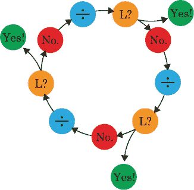
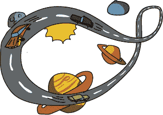
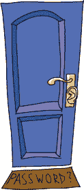
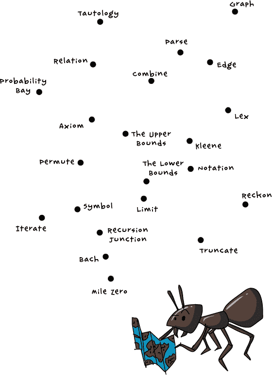
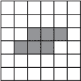
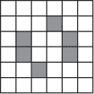
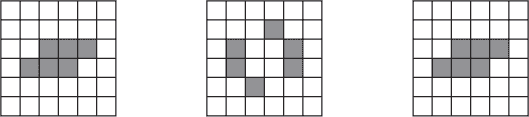
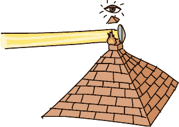
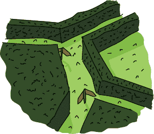
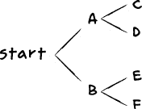

# 用户领域指南

你可能会想知道这个故事的某些部分是否真实。你真的能用不公平的硬币做一个公平的硬币吗？你真的能用蚂蚁找到更短的路径吗？是的，你能做这两件事——而且还可以做更多。在这本指南中，你将发现劳里在用户领域中遇到的一些地方、人物和事物是如何与我们自己的世界相连接的。

# 第零章：大部分迷失

## 行话

在现实世界中，行话看起来不像鼠狗，甚至不像狗鼠；它看起来就像一个普通的词！计算机科学家（实际上所有科学家）都喜欢发明新词。我们称这些专门词汇为*行话*或*术语*。行话有时是有好处的，因为它能节省和同事讨论时的时间。但它也可能是坏的，因为它会将非专家排除在对话之外。

当你刚开始学习编程时，所有的行话、术语和奇怪的新词可能会让人感到害怕，但不要让这些阻止你学习。行话可以是傻的、强大的或危险的，这取决于你如何使用它。但无论你使用什么词语，如果你总是模糊而不是清晰表达，没人会理解你！

## 流浪销售员

*旅行销售员问题*是一个经典的计算机科学问题。给定一组城市，你的目标是找到最短的*哈密尔顿路径*，这条路线让你每个城市只访问一次。如果城市数量很大，即使是计算机也需要很长时间来计算这条路径。所以流浪销售员可能会在路上呆上很久！

销售员不是计算精确的答案，而是寻找一条通过所有城镇的路径，这条路径*足够接近*最短路径。旅行销售员问题的一个非常有趣的方面是，人类在解决小规模问题时非常擅长手动计算。关于人们在头脑中使用什么算法来解决它，有很多讨论。另见*休·鲁斯蒂克*（第八章；第八章：不止一种方法）。

## 上界与下界

在用户领域，上界是一座山脉，高得无可比拟。下界是深谷，低得无可比拟。没有任何东西能比这两个界限更高，也没有什么能比这两个界限更低。

在现实世界中，找到一个问题的上限和下限可以大大简化问题。假设你必须猜测一个人的年龄。没人会超过 150 岁，也没有人能比 0 岁更小。所以，150 是*上限*，0 是*下限*。你可以通过简单的问题进一步缩小范围。这个人还在上学吗？如果是，那么他可能不到 30 岁。这个人会开车吗？如果是，那么他可能超过 15 岁。

## 零英里

你有时会看到标记高速公路上某个位置的标志，比如“ Mile 14”。现在，如果有 Mile 14，那么肯定会有 Mile 13，Mile 12，依此类推。一切都必须从某个地方开始，而零就是起点。最著名的零英里可能是在佛罗里达州的基韦斯特。它是美国 1 号公路的起点，这条公路一直延伸到加拿大。如果你仔细看并且非常幸运，你可能会在你住的地方附近找到一个零英里的标志。

# 第一章：一个隐藏的盟友

## 异或

当你说“ A 或 B”时，意味着你想要这两者之一，或者可能是两者都要！但如果你说“ A 异或 B”，那就意味着你只想要这两者中的*一个而且仅一个*，而不是两者都要。这就是为什么 Xor 会不停地变换彩虹颜色：Xor 和它目前所处的位置不能同时是蓝色。如果它坐在一个蓝色的标牌上，那么它就必须变成任何*不是*蓝色的颜色！这可不是一种很好的伪装方式，对吧？

## Steganosaurus

*隐写术* 是将信息隐藏在其他信息中的艺术，它被应用于数字世界和物理世界。例如，你可能通过使用隐形墨水在一张纸上写下秘密信息来隐藏它。使用计算机程序，你甚至可以将文字隐藏在声音和图片中。因此，Steganosaurus 是一种可以在任何地方隐藏自己的恐龙。

# 第二章：常识与理性

## 组合

Eponymous 的巴赫是一个作曲家，但她处理的是思想而非音乐。*组合* 是将小的思想结合成更大的思想，分步骤解决问题的行为。几乎每个想法都由更小的想法组成。例如，乘法并不是什么特别的事情。你可以将它看作是将一个数字加到它自身并重复：

> 2 × 3 = 6
> 
> 2 + 2 + 2 = 6 （加起来三个二）

参见 *分解* （第十七章; 第十七章：追求优雅）和 *关联* （第十七章; 关联）。组合、分解和关联是解决问题的方法，构成了所有数学、逻辑和计算机科学的根基。

## 巴赫的第一法则：命名法则

不要让任何新想法在没有给它命名的情况下溜走。一个名字就像是一个把这个想法更易于使用的把手。

## 巴赫的第二法则：命名法则

给想法命名比给物体命名要好，因为想法存在的时间更长。

## 巴赫的第三法则：命名法则

随着一个想法变得更加有用和著名，它的名字变得更短并且是小写字母。这条规律最终影响了 Eponymous 的朋友 Andy Ampère 以及他关于电的发现。

## 安培

安德烈-玛丽·安培发现，当电流流过平行电线时，电线会相互吸引或排斥，导致电线弯曲。通过测量它们弯曲的程度，你可以测量流过的电流。安培利用这个原理奠定了我们对电的基本认知，我们以他的名字来度量电流，单位为*安培*（或*安*）。（参见*巴赫的第三条命名法则*，了解 Eponymous 关于为何我们很少称单位为*安培*的理论。）

## 理性与**明智性**

程序员和数学家有时会使用一对概念，称为*解空间*和*问题空间*，来描述如何找到问题的答案。

假设你需要移动一个沉重的盒子，好让你能打开它；与移动盒子相关的任何事情都在你的问题空间中。试着想象你能做的任何一件事来试图移动这个盒子。你可以向前走，向后走，伸出舌头，唱歌，写方程式，使用杠杆，呼救，找叉车，或者做任何你能想到的事情。把你能想到的这些可能性尽可能多地写在纸上。

从那片巨大的可能性空间中，想象出那些有很大机会推动盒子的可能性。用红笔圈出它们。被圈起来的就是解空间中的内容。它们**有道理**，因为它们能够实现你的目标，其它的则没有道理。现在，再次查看所有被圈起来的可能性，思考哪一个是最好的（最快、最便宜、最简单、最可靠等等）。用绿色划出这个答案。这就是所有有道理的选项中最**明智**的答案。

这个练习的重点是避免一个非常人性化、非常常见的错误：我们倾向于抓住第一个想到的解决方案，而忘记考虑其他可能性。这就是 Eponymous 在告诉 Laurie 流浪推销员的解决方案不明智时的意思。另请参见*Hugh Rustic*（第八章；第八章：做事有多种方式）和*五个为什么*（第十四章；第十四章：抽象）。

# 第三章：舍入误差

## 循环队列算法

Robins 并不是真正邪恶的——它们只是饿了。它们在做任何事情时都会合作，轮流工作，并确保工作在它们之间平衡分配。共享工作是加快完成任务的好方法，计算机也可以共享工作！

你几乎可以在任何地方找到循环赛制方法。想象一下，一个巴士路线需要一个小时才能完成。如果你在这条路线放两辆巴士，每 30 分钟就会有一辆巴士到达每个站点。三辆巴士的话，你就会每 20 分钟看到一辆巴士，四辆巴士意味着你会每 15 分钟看到一辆巴士。五辆巴士的话，你会每 12 分钟看到一辆巴士，以此类推。只需要把 60（一个小时的分钟数）除以巴士的数量，就能知道巴士应该多频繁到达。

但你必须小心，确保巴士到达每个站点时时间间隔均匀。如果五辆巴士同时到达一个站点，那就不平衡了。而且，如果一辆巴士发生故障并延误，可能会导致所有其他巴士都发生拥堵！

# 第四章：乌龟对劳里的话

## 递归

*递归* 是一种重复相同过程，直到找到你想要的答案的方法。当你使用递归时，你执行这个过程，如果答案是你想要的，你就停下来。如果不是，你把找到的答案带入同样的过程，再次执行。

让我们来看一个递归在用户领域的实际例子。回想一下第十章，简·赫卡特有一本单独的、巨大的名字书。名字 *Lauren* 以 *L* 开头，因此简应该在书中的 *L* 部分找到它，但由于书页太多，这可能需要一段时间。如果简想要更快地找到 *Lauren*，她可以将书分成两半，看看 *L* 在前半部分还是后半部分。

> 前半部分：{A, B, C, D, E, F, G, H, I, J, K, L, M}
> 
> 后半部分：{N, O, P, Q, R, S, T, U, V, W, X, Y, Z}

由于 *L* 位于前半部分，简可以将书的前半部分再分成两半，从而将书分成两个季度来搜索。

> 第一季度：{A, B, C, D, E, F, G}
> 
> 第二季度：{H, I, J, K, L, M}

*Lauren* 应该在第二季度，所以简可以将这个季度分成两半，从而得到两个八分之一的字母表：

> 前八分之一：{H, I, J}
> 
> 第二个八分之一：{K, L, M}

简可以继续将包含 *L* 的字母组对半分，直到最终只剩下 *L* 部分。（简还需要再分多少次字母组，才能找到 *L*？）这种搜索特定信息的方法叫做 *二分查找*。

另见 *叉路花园* (第十九章; 第十九章：分支) 和 *追尾* (阿基里斯与乌龟)。

## 阿基里斯与乌龟

这两个角色是 2500 多年前由一位名叫芝诺（Zeno of Elea）的哲学家用来讨论无限的。从亚里士多德到刘易斯·卡罗尔，再到马文·明斯基和道格拉斯·霍夫施塔特，数学充满了关于他们冒险故事的描述。一路上都是乌龟。

## 追逐自己的尾巴

追逐自己的尾巴不一定是浪费时间！在计算机科学中，有一种递归类型听起来有点像绕圈子，但它非常有用。在*尾递归*中，你执行一个过程，然后在结果上再次执行该过程，重复此过程直到得到最终答案。例如，简·赫卡特在她的书中对*L*部分进行的二分查找可能是这样的：

+   检查一下我们现在手头的名字书的部分。

+   我们只有*L*部分吗？

+   如果有，那我们就完成了！

+   如果没有，那么就将书分成两半。

+   查看包含*L*部分的那一半列表，然后重复。

参见*递归*（第四章：乌龟对劳里说了什么）。

## 无限

当人们说某样东西有*无限*时，他们指的是这个东西的数量没有上限。当乌龟展示一个无限长的绳子可以小于两英寸时，他表明你可以将这根绳子分成无限多个更小的部分。

无限是*巨大*的，比你想象的还要大。但你可以通过说几句话将无限容纳进你的思维中。奇数是无限的：1、3、5、7，等等，一直到永远。偶数也是无限的：0、2、4、6、8，等等。无论你怎么看，你永远不会在偶数列表中找到奇数，或者在奇数列表中找到偶数。这意味着至少有两种无限：偶数和奇数。

也有*无限种无限大*。想想所有能被 3 整除的数字和所有*不能*被 3 整除的数字（或者是 4、5）。现在再想象一些别人从未想到过的数字。这就是另一种无限！

## 无限回溯

如果你思考自己是如何思考的，你可能会开始思考自己是如何思考自己是如何思考的，然后再思考自己是如何思考自己是如何思考自己是如何思考的，依此类推。这是一种叫做*无限回溯*的论证方式，它可以没有尽头。第一次陷入这个思维陷阱时，它可能会让人困惑甚至害怕。诀窍是不要太当真。

如果你觉得这和递归相关，你是对的！如果一直陷入递归过程，肯定会非常麻烦。在实际计算机中，永远不会发生无限递归，因为没有计算机能够存储无限的信息。当计算机在处理递归时空间不足时，你永远也不知道会发生什么。Laurie 和 Xor 在递归交汇处亲身体验了这一点。参见*追尾*（阿基里斯与乌龟）。

# 第五章：欢迎来到符号

## 语义闸机

╞ 是一个逻辑符号，指向某个真理。它有点像等号（=），不同的是它表示的是*想法*之间的关系，而不是数字。如果语义闸机左侧的所有想法都为真，那么右侧的想法也为真。

假设你有两个想法：(A) “你拥有密码” 和 (B) “你可以进入”。你可以将这些想法组合起来，形成一个*规则*：

> (A → B) “如果你拥有密码，那么你可以进入。”

这就是 Ponens 在符号的门口向 Laurie 解释的规则。（将两个想法放在小箭头的两侧是另一种表达方式，“如果 A 为真，那么 B 为真。”）

但是你怎么知道这个规则是真的呢？也许这不是你进入符号的方式。那么你必须证明规则（A → B）和第一个想法 A 都是真的。在这种情况下，我们需要确保规则（“如果你有密码，那么你可以进入”）和想法（“你有密码”）都是真的，然后我们才允许任何人通过大门。

这就是语义闸机的作用。我们将规则和第一个想法放在闸机的左侧，将第二个想法（B，即“你可以进入”）放在右侧：

(A → B), (A) ╞ (B)

这意味着“如果我们的规则为真，且如果你确实拥有密码，那么你可以进入。”

这里是更奇怪的部分：你可能注意到这个闸机看起来很像一个 IF...THEN 语句。如果左边的所有内容都为真，那么右边的想法就为真。那么我们怎么知道这个规则整体上是真的呢？我们需要给这个闸机再加一个闸机吗？

(A → B), (A) ╞ (B) ╞ (C)

. . . 然后对下一个想法再加一个闸机？

(A → B), (A) ╞ (B) ╞ (C) ╞ (D) ╞ (E) ╞ (F) ╞ (G) . . .

理论上，你必须通过无数个闸机，才能知道某件事情是否为真！真是奇迹，我们早上能顺利穿上鞋子！那么，我们怎么知道任何事情是真的呢？你怎么知道明天早餐时牛奶会从盒子里倒出来，或者你到学校时教室不会在屋顶上呢？

在实践中，我们只是相信我们所遵循的规则是正确的，因为我们曾见证过它们在过去的有效性。然而，像劳里一样探究这些规则也是既有趣又有用的。即便这些规则最终看起来是合理的，你也能从中学到它们是如何运作的。探究规则是科学本质的一部分！另见 *无限倒退*（第四章; 无穷大）和 *这只是合乎逻辑*（这只是合乎逻辑）。

## 波嫩斯

他全名是“肯定模式波嫩斯”（Modus Ponendo Ponens），代表一种逻辑推理方式。这种推理方式可能得出*合乎逻辑*的结论，但这个结论不一定是*正确*的。例如，下面是波嫩斯如何判断通往符号世界的大门是安全的：

+   如果只有拥有密码的人才能进入，那么我们的门就是安全的。

+   只有拥有密码的人才进入了。

+   因此，我们的门是安全的。

这个结论看起来似乎合乎逻辑，但不一定是正确的。逻辑的有效性取决于它所依赖的假设。像劳里那样的人可以*说*自己是“同名巴赫”，但并不*真正*是“同名巴赫”，只要她拥有正确的密码，她就能轻松进入符号世界。在这种情况下，世界上所有的逻辑都无法确保那扇门的安全！另见 *托伦斯*（下文）和 *语义转门*（第五章：欢迎来到符号）。

## 托伦斯

他全名是“否定模式托伦斯”（Modus Tollendo Tollens），就像“肯定模式”（Ponens）一样，他代表一种逻辑推理方式。事实上，托伦斯的推理方式与肯定模式非常相似，只不过是反过来的。例如，下面是托伦斯如何判断他的大门是安全的：

+   如果我们的门不安全，那么没有密码的人会进入。

+   没有密码的人没有进入。

+   因此，我们的门是安全的。

这就是托伦斯如何判断斯特加诺龙不存在的方式：

+   如果斯特加诺龙存在，你应该能看到它们。

+   你从未见过斯特加诺龙。

+   因此，它们并不存在。

就像波嫩斯一样，“否定模式托伦斯”是一种完全有效的逻辑推理，但它的有效性也仅仅取决于它所基于的假设。仅仅因为你没有证明某个事情是正确的，并不意味着它自动是错误的，正如你从未见过斯特加诺龙并不意味着它们不存在。或许它们生活在你从未去过的岛屿上，或者它们隐藏得如此之好，以至于没人能看到它们。另见 *这只是合乎逻辑*（下文）。

## 这只是合乎逻辑

即便一个想法合乎逻辑，也不一定是真的。一个想法可能简单、合乎逻辑，但却是*错误*的——如果你忘记考虑所有的事实。例如，去游泳的人结束后头发会湿。如果你看到一个头发湿透的人，是否意味着她刚从泳池里出来？不！或许外面在下雨，或者她刚洗完澡。

逻辑也很容易陷入无限循环。另见*波嫩斯*（波嫩斯）和*无限倒退*（第四章；无限）。

# 第六章：Tinker 的交易

**算法** 一个*算法*是一组具体的步骤，你可以按照这些步骤解决问题。例如，如何制作比萨饼的食谱就是一个算法：

1.  把面团摊开放入烤盘中。

1.  在面团上铺一层比萨酱。

1.  在酱料上撒上奶酪。

1.  将比萨饼在 350 华氏度下烤 20 分钟。

1.  把比萨饼从烤箱里取出来，放凉。

1.  开动吧！

就像那个食谱一样，洛丽的乌龟绘图诗也是算法。它们将画圆的过程分解成小步骤，然后乌龟按照这些指令绘制任意大小的圆。如果你真的想的话，你甚至可以为算法想出算法，也就是如何弄清楚如何弄清楚做某件事的方法。见*无限倒退*（第四章；无限）。

你会怎么告诉 Tinker 的乌龟画一个任意大小的三角形，其中三个角度相等？（提示：这三个角度的和应该是 180 度。）

## 哈密顿循环

洛丽来自汉密尔顿是非常合适的，因为她的“回到汉密尔顿的道路”将是一个*哈密顿路径*。这种路径以数学家威廉·哈密尔顿命名，是一种旅行者访问地图上每个城市恰好一次的路线。在本书中，我使用了*路径*一词，但实际上哈密顿*路径*和哈密顿*循环*之间有一点不同，哈密顿循环是指一条会返回起点的路径。

在一个有*N*个城镇的地图上，有 (*N* – 1)! ÷ 2 个周期。正如 Tinker 所说，*x*! 是 (*x* × (*x* – 1) × . . . × 2 × 1) 的简写，因此对于一个有六个城镇的地图，你会有

(6 – 1)! ÷ 2 = 5! ÷ 2 = (5 × 4 × 3 × 2 × 1) ÷ 2 = 60 个周期！

找到一个周期相对容易，因为有很多可能性；找到一个*短*的周期才是难点！另见*漫游销售员*（第零章；漫游销售员）。

## 公正的硬币

*公正的硬币* 是一种正反两面出现的几率相等的硬币。然而，真正的硬币（比如洛丽的四分之一美元硬币）并不总是完全平衡，所以在我们的世界中，根本没有完美的公正硬币。但是对于大多数硬币来说，正反两面出现的几率足够接近 50-50，以至于我们可以毫不犹豫地用硬币抛掷来选择两个选项之间的决定。

即便如此，对于像物理仿真或选择谁坐前排座位这样的重大事情，还是需要翻转两次来确保绝对的公平。另见 *公平的翻转*（第十一章; 第十一章：公平交换）。

## 圆圈

当 Laurie 使用海龟机器人画一个圆时，她发现填入 **一个** 对 **how-big?** 产生了比她预期的要大的圆。那么，你应该在 **MOTH-CIRCLE** 中输入什么数字才能画出一个直径为两英寸的圆？

> **MOTH-CIRCLE（多大？）：**
> 
> **向前走多大？英寸，**
> 
> **做个标记，**
> 
> **向右转一度，**
> 
> **重复三百六十次。**
> 
> **画一个 MOTH-CIRCLE（多大？）**

## 不太可能 vs. 不可能

无论你学习哪个学科，总会有一些没有解决方案的问题。我们称这些问题为 *不可能* 解决的问题。另一方面，一些问题是可以解决的，但只有在极不可能的条件下才能解决。那些是 *不太可能* 解决的问题。

# 第七章：读我

## 密码学

多亏了 Xor，才能解码 Trapp 上校的秘密信息！自古以来，人们就一直在将信息编码成 *密码*，供别人解码，今天，这项科学叫做 *密码学*。计算机擅长创建和破解秘密代码，但你也能做到！

编码信息的一种快速方法是使用 *替换密码*，即用其他东西替换信息中的每个字母。例如，你可以将每个字母映射到一个数字：

| A | B | C | D | E | F | G | H | I | J | K | L | M | N | O | P | Q | R | S | T | U | V | W | X | Y | Z |
| --- | --- | --- | --- | --- | --- | --- | --- | --- | --- | --- | --- | --- | --- | --- | --- | --- | --- | --- | --- | --- | --- | --- | --- | --- | --- |
| 0 | 1 | 2 | 3 | 4 | 5 | 6 | 7 | 8 | 9 | 10 | 11 | 12 | 13 | 14 | 15 | 16 | 17 | 18 | 19 | 20 | 21 | 22 | 23 | 24 | 25 |

按照这些规则，“Hello！”会变成“7 4 11 11 14！”。但你可以用任何你想要的东西替换这些字母：不同的数字、其他字母，甚至是你自己创造的符号。制作你自己的秘密信息，看看你的朋友能否破解它。或者，与你的朋友分享你的密码，这样你们就可以互相发送别人无法读取的秘密信息！

# 第八章：不止一种方法

## Hugh Rustic

如果解决一个困难问题有数百万种可能的方式，那么寻找最佳解法就变得不现实。遇到这种情况时，科学家们使用 *启发式方法*，找到一个“足够好”的答案，正如 Hugh Rustic 可能所说的那样。

启发式算法基于经验——基于我们知道有效的事物——但它们不能保证是最佳解决方案。例如，休·鲁斯蒂克的蚂蚁在地图上随机找到许多不同的路径，或者通过跟随其他蚂蚁的气味踪迹。气味踪迹最终会因为没有新蚂蚁跟随而干涸。路径越短，跟随的蚂蚁就越多，这使得气味更浓。随着时间的推移，短路径变得更加受欢迎，长路径逐渐消失。基于劳里看到蚂蚁的行为，她知道这条路径很短，尽管它可能不是最短的，所以她可以将其作为启发式方法，更快地回家。

值得思考的是：休·鲁斯蒂克的蚂蚁地图通过用户区的路径是最短的吗，还是仅仅是一条足够短的路径？你能做得更好吗？试试看！

# 第九章：不要重复自己

## 公理

正如 Xor 所说，*公理*是一个你无法证明的规则或原则，但每个人都接受它，因为它自然而然地成立。数学家、科学家以及任何想要证明某些事物的人可能会以公理为出发点。

例如，“部分总是小于整体”这一想法就是一个公理。如果你从一个派中切下一块，它不可能比整个派还要大。同样的规则也适用于数字：如果你从 5 中减去 2，你手里剩下的是 2 和 3，而它们都不大于 5。

# 第十章：恰到好处的出现

## 时序攻击

简·赫卡特逐一检查劳里的密码猜测，直到与正确密码不匹配为止。劳里连续猜对的字母越多，简发现不匹配所花的时间就越长，这也让劳里知道她的猜测有多接近正确。

计算机科学家称这种攻击为*时序攻击*，因为猜测者观察每次检查错误尝试所花费的时间，并根据此做出新的猜测。许多人本应知道更好，却像简一样犯错误，泄露了他们所保守的秘密。

# 第十一章：公平的交换

## 公平的抛掷

正如特伦特·埃斯克罗向劳里解释的那样，你可以通过抛两次不平衡的硬币，保证 50%的机会抛出正面或反面。如果你抛出的是正面-反面，那么正面就是你的答案；如果你抛出的是反面-正面，那么反面就是你的答案。至少有一半的概率你会抛出正面-正面或反面-反面；在这种情况下，重新开始即可。平均而言，你至少需要抛三次硬币才能得到公平的抛掷。试试看！另见*公平硬币*（第六章；哈密尔顿回路）。

# 第十二章：一个不太可能的转折

## 尝试的神话

. . . 在任何管辖区内其实都不算犯罪，这是件好事！否则，谁也不可以写任何故事，而*神话*不过是代代相传下来的故事。一些神话试图解释世界如何运作，而另一些则只是为了娱乐。发挥你的想象力，也许有一天，你会写出一篇成为未来神话的一部分的故事。

## *双胞胎*

*双胞胎*的故事基于一个经典的哲学问题：如果你替换掉一艘船的所有部件，您还拥有原来的船吗？温索姆认为不是。她声称她一点一点地把*双胞胎*从原主人的手中偷走，最终把他留下一艘复制品！但你怎么看呢？如果你重新组装旧的部件，哪艘船才是原始的？如果只替换一半的部件呢？

# 第十三章：生命游戏

## 滑翔机

*康威的生命游戏*是对一群生物如何随着时间变化的模拟。计算机科学家（以及许多其他科学家）利用生命游戏研究基于简单规则的图案。你可以用铅笔和纸自己试试！首先，拿些图表纸，或者像这样画一个网格：

现在填充一些网格中的方格。这里有一个例子：

填充一些方格后，你只需遵循几个简单的规则来玩游戏并改变你的图案：

1.  如果一个填充的方格有超过三个填充的邻居，那么它就会死亡。把它变成空白。

1.  如果一个填充的方格只有一个或零个填充的邻居，它就会死亡。把它变成空白。

1.  如果一个填充的方格有两个或三个填充的邻居，它就会存活！保持它涂上颜色。

1.  如果一个空白的方格有三个填充的邻居，它就会复活！把它涂上颜色。

按照这些规则来给新的网格上色。经过一轮后，我们的示例网格会变成这样：

这些图案有很多种类型。*滑翔机*会四处移动。*闪烁器*会像交通信号灯一样开关。某些图案在移动过程中甚至会生成其他图案。这个特定的网格图案会重复：

# 第十四章：抽象思维

## 五个为什么

当科学家们想要找出一个复杂问题的根本原因时，他们会不断问“为什么”，直到弄清楚实验的哪里出了错。但你不必把这种思维方式留给科学家们。

下次遇到自己需要解决的问题时，玩一下“五个为什么”。有许多心理游戏可以帮助你避免或从错误中学习。另一个好规则是：“永远不要独自担忧。”如果你感到困惑，就找个朋友一起解决问题——当你们一起合作时，任何问题都能解决！

# 第十五章：关键时刻的聪明才智

## 跟随拜占庭过程

*拜占庭*这个词可以形容任何极其复杂和漫长的过程。幸运的是，劳里通过帮助三位将军，她成功地获得了所有需要的签名，并且实际上她以类似的方式解决了每个将军非常不同的问题。

劳里用于移动狼、山羊和曼德尔花菜的算法使用了*计数论证*。计数论证的思想是，通过忽略事物之间不重要的差异，仅仅计算它们有多少个，就能解决一些问题。例如：

+   每个人都想同时使用欧里庇得斯将军的书。但无论是读者还是作者，每次只有*一个*人能够使用某本书。

+   达里乌斯将军如此专注于让曼德尔花菜、狼和山羊过河，以至于他没有想到倒数——多次将山羊带过去。但无论是曼德尔花菜还是狼，只要不让山羊和它单独待着，一切都会顺利进行。

有时情况恰恰相反：你必须以不同的方式计算相同的事物，看看它们是否加起来。总数在 100 英尺的围栏后停止了；他没考虑到最后一段的保持！计算*柱子之间的间隙*，你得到 10。计算*柱子*，你得到 11。

当廷克告诉劳里将镜像路径（比如 BCD 和 DCB）视为一条时，他也是在使用计数论证。这条规则将通过用户地带的路径数减半。但即使把路径数减半，在旅行商问题中也没什么帮助：一个非常大的数字除以一个小数字，结果还是一个非常大的数字！

## 曼德尔花菜

曼德尔花菜确实存在于我们的世界，它是我所知道的最奇特的蔬菜。在市场上，它叫做*罗马花椰菜*，看起来很像一个分形图案。*分形*是从一个形状开始，并根据一套规则无限重复，越来越小的模式。

例如，在一个等边三角形内画另一个等边三角形（一个三条边长度相等的三角形）。确保第二个三角形的每个点都触碰第一个三角形的边中点！这应该会在原始三角形内创建四个较小、但相同的三角形。

现在，在每一个这样的图案内画一个等边三角形，遵循相同的规则，并重复，直到你无法再容纳更多的三角形。你应该会得到类似这里展示的分形图案。另见*无限*（第四章; Infinity）。

*“谢尔宾斯基三角形演化。” 通过维基共享资源根据公有领域授权使用。*

# 第十六章：计划的改变

## 布鲁托·福尔萨

这个灯塔看守认为解决每个问题的方法就是更多的力量和蛮力。即使他建造的灯塔是原来失败的灯塔的两倍高、两倍宽、两倍厚，新的灯塔最终仍然会倒塌，因为他还是遵循着相同的计划。

然而，从某种程度上来说，布鲁托的决定是对的，他选择建造金字塔。金字塔更加坚固，如果你堆叠足够多的砖块，最终你可以建造一个足够高的金字塔，甚至可以成为灯塔。但布鲁托的计划也有巨大的成本：他需要更多的砖块、更大的土地来建造、以及更多的时间来完成建造。

一些程序员也会用这种方式解决问题，但把所有的资源投入到蛮力尝试中并不总是明智的。当你的算法崩溃时，不要只是堆砌更多的砖块！改变你的视角，就像劳里在拜占庭岛上对待将军们一样，你会找到更有效的解决方案。另见 *五个为什么* (第十四章; 第十四章：在抽象中)。

# 第十七章：追寻优雅

## 优雅

它们并不存在，但你不希望它们存在吗？

## 费涅尔

劳里在优雅岛上遇到的费涅尔是以一位真实的科学家奥古斯丁-让·费涅尔（Augustin-Jean Fresnel）的名字命名的，他发明了一种仅用少量玻璃就能聚焦大灯塔光源的方法。他知道，透镜不需要很大很厚才能聚焦光束，因此，费涅尔透镜并不是一块巨大的玻璃，而是由多个小块玻璃以不同角度排列组合而成。今天，灯塔仍然使用这种类型的透镜。

## 分解

*分解* 从一个大想法开始，然后将其拆分成更小、更易于理解的部分。当你知道如何解决每个小部分时，你可以将这些想法组合起来解决更大的问题。一种很好的分解方法是描述它，而不使用它的名称，就像劳里说的，你也可以称一个乌龟为“绿色圆形的带壳动物”。

即使是简单的想法，比如数字 3 和 4，也可以分解成更简单的想法。从 0 开始，然后加上 1，再加 1，依此类推：

> 0 = 0
> 
> 1 = 0 + 1
> 
> 2 = 0 + 1 + 1
> 
> 3 = 0 + 1 + 1 + 1

如果你真的想要，你可以只使用 0 和 1，抛弃其他所有的数字。我不建议这样做——你会用掉大量的纸张！——但这确实是一种完全有效的数学方法。例如，我们可以把加法问题分解成只有 0 和 1 的形式：

2 + 2 = 4

将变成

(0 + 1 + 1) + (0 + 1 + 1) = (0 + 1 + 1 + 1 + 1)

## 关联

当你*关联*两个想法时，你将它们并排放置并进行比较，就像费涅尔的气球和灯塔一样。对于数字，你使用小于符号（<）表示左边的数字小于右边的数字。你使用等号（=）表示左边的值等于右边的值。

> 2 < 3
> 
> 2 × 3 = 6

你可以将除了数字的其他事物联系起来，尽管这意味着某些关系可能不那么精确。弗涅尔的气球不是*完全*一个灯塔，但它*像*一个灯塔。我们期待灯塔有一个让人们能够爬上去的地方，一个让他们站在那里并且能看到的高台，还有一个远方的船只可以看到的大灯。弗涅尔的气球在技术上具备了这些功能：

+   弗涅尔的气球*像是*灯塔。

+   （电梯，气球，光）*像是*（楼梯，塔楼，光）。

# 第十八章：众人拾柴火焰高

## 网络

Winsome 创建了灯塔网络，让用户世界中的人们能够更快地发送信息。在计算机科学中，*网络*是指一组相互连接的计算机，它们可以共享信息。这些计算机可以通过电缆连接，甚至通过空气连接！

## 博多

1870 年，埃米尔·博多发明了一种用不同的 1 和 0 的组合来表示字母的编码。这种编码旨在通过电力让人们共享信息：如果你有一个开关，电源可以是开（1）或关（0）。自然地，博多将这种编码以自己的名字命名。参见*巴赫的命名法则*（第二章; 巴赫的命名法则第一条）。

在现实世界中，我们不常使用博多编码，但平、弗涅尔和其他灯塔网络成员用它通过他们的灯光发送消息，灯光也可以开（闪光）或关（熄灭）。

这是博多编码和每个数字所代表的字母，所以你也可以创建自己的灯塔网络。找一些朋友和手电筒，互相发送消息！

| 字母 | 博多编码 | 字母 | 博多编码 |
| --- | --- | --- | --- |
| A | 11000 | N | 00110 |
| B | 10011 | O | 00011 |
| C | 01110 | P | 01101 |
| D | 10010 | Q | 11101 |
| E | 10000 | R | 01010 |
| F | 10110 | S | 10100 |
| G | 01011 | T | 00001 |
| H | 00101 | U | 11100 |
| I | 01100 | V | 01111 |
| J | 11010 | W | 11001 |
| K | 11110 | X | 10111 |
| L | 01001 | Y | 10101 |
| M | 00111 | Z | 10001 |

# 第十九章：分支

## 岔路花园

这个花园有 16,777,216 条路径，但最终，劳里和 Xor 各自找到了一个适合他们的路径。可能的路径数量之所以迅速缩小，是因为在每个岔路口，劳里都回答了一个二选一的问题，这将可能的路径数量减半。

劳里的“岔路花园”之旅很像计算机科学家所称的*二分查找*，程序员用它来快速在一个庞大的列表中寻找一条信息。当某物是二进制时，它只有两个部分——就像花园中劳里所遇到的问题。

这个小图表有四种可能的结果。如果你回答问题“是 A 还是 B？”选择 A，你将把数字减半，剩下只有两种可能性。然后，在 A 点，你必须回答“是 C 还是 D？”无论你选择哪个选项，你都将再次将数字减半，直到只剩下一个选择。

在二分查找中，你会对你的巨大信息列表提出类似的问题；最终，你将把可能性缩小到只有一个。下次玩“二十个问题”时试试看！如果你小心选择问题（或答案），你可以在仅仅 20 或 30 步之内找出几乎任何东西。参见*递归*（第四章; 第四章: 乌龟对劳里的话）。

# 第二十一章：再说一句

## 电报

凯文·开尔文船长正在沿海铺设电线，以建立一个*电报*网络。电报系统使人们能够在不发送实物的情况下，长距离传递消息。温斯姆灯塔网络也是一种电报！

在凯文的案例中，字母是通过一系列声音来表示的，而不是通过光。不同的“哔哔声”和“嘟嘟声”代表不同的字母，这些“哔哔声”和“嘟嘟声”是在凯文的助手按下连接到电线另一端的按钮时发出的。电报只是人类历史上用于相互沟通的众多系统之一。

## 开尔文温标

开尔文勋爵是位真正的工程师，曾从事电报工作，但他最著名的是创建了用来测量温度的开尔文温标。与其他温度刻度不同，开尔文温标不使用零以下的数字，因此任何物体能达到的最低温度被称为*绝对零度*。水在 273.16 开尔文时结冰！
