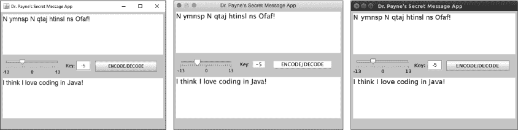
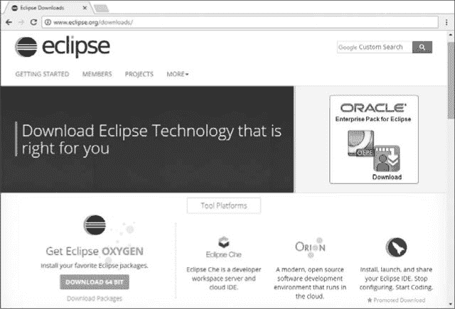
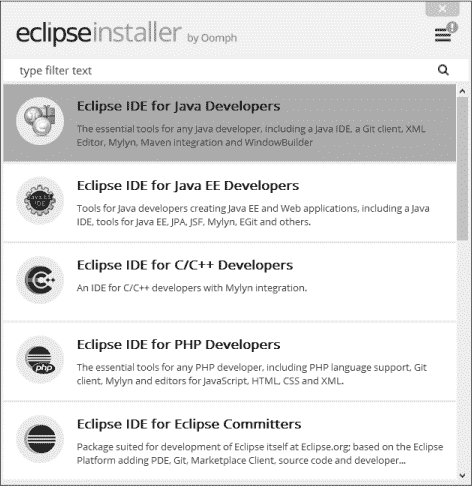
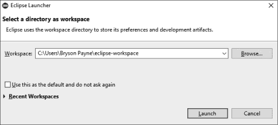
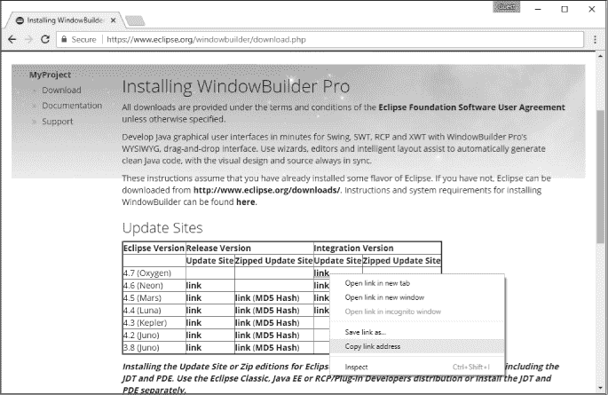
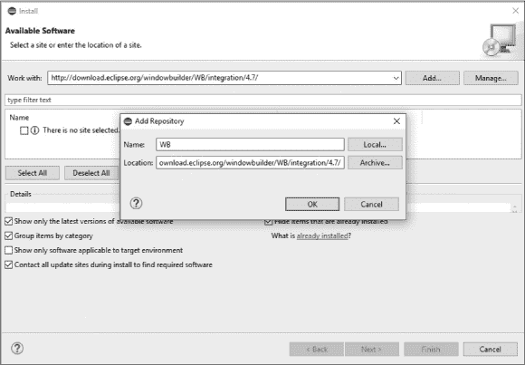
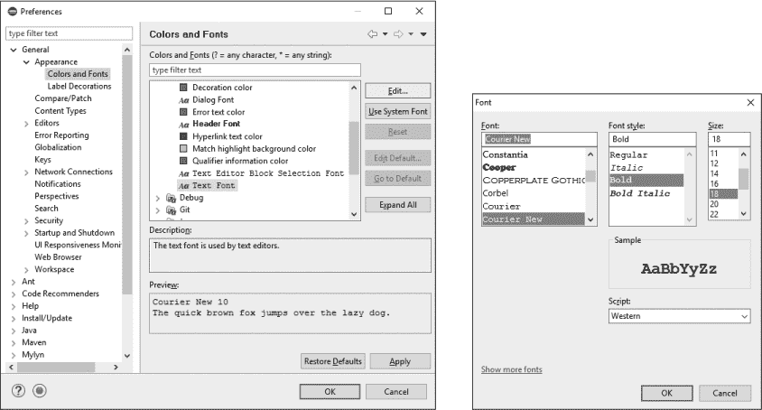
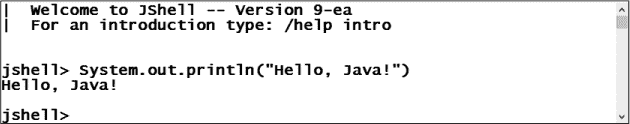
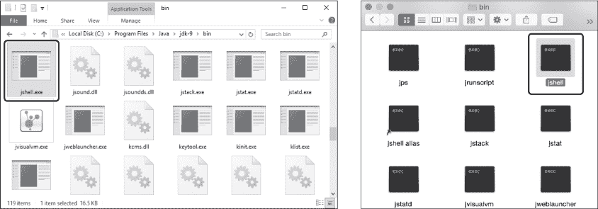

## 第一章：## 入门

在本章中，你将通过安装 Java、Eclipse 和 Android Studio 来开始你的开发旅程，并通过在交互式命令行 shell（JShell）中测试一些命令来熟悉基本的 Java 编程。

Java 是一种功能强大且跨平台的编程语言，可以免费下载并安装在 Windows、macOS 和 Linux 上。Eclipse 是业界标准的*集成开发环境（IDE）*，是快速轻松构建 Java 应用的工具包。而 Android Studio 是开发 Android 移动应用的开发环境，它让你能够为手机、平板等设备编写自己的移动游戏和应用。

### Java 在 Windows、macOS 和 Linux 上的表现

Java 的一个伟大之处在于，你编写的 Java 程序可以在*任何*安装了 Java 虚拟机（JVM）软件的其他计算机上运行（有时也叫 Java 运行时环境，或 JRE）。JVM 技术让你可以一次编写程序，并在任何操作系统（Windows、macOS、Linux、Android 等）上运行相同的代码。

这个想法看似显而易见，但大多数其他编程语言要求你为 Windows、macOS、Linux 和智能手机编写不同的代码，或者为每个操作系统编译一个独立的版本。而 JVM 是一个运行时环境，它使得这一切变得不再必要。

图 1-1 显示了同一个 Java 应用在 Windows、macOS 和 Ubuntu Linux 上运行的图像。

*图 1-1：同一段 Java 代码在三种不同操作系统上运行——Windows、macOS 和 Linux！*

这个简单而强大的概念是 Java 被全球个人和企业广泛采用的原因之一。

### 为开发者安装 Java 8 和 9

Java 开发工具包（JDK）是为开发者或程序员（像你一样）准备的 Java 版本。JDK 使你能够编写和编译自己的 Java 应用，这些应用可以与朋友共享、部署到企业中，或者在几乎任何设备上运行。

我们将安装 JDK 的 8 和 9 版本。这样，我们既能享受到版本 8 的广泛应用，也能体验版本 9 的最新功能。

安装 JDK 8：

1\. 访问*[`jdk.java.net/8/`](http://jdk.java.net/8/)*。

2\. 点击**接受许可协议**单选按钮。

3\. 在 JDK 下载列表中找到适合你操作系统的链接，并点击它。如果你的操作系统是 Windows 或 Linux，请选择 64 位版本。

4\. 打开你计算机*下载*目录中的 JDK 文件并安装 JDK。

要安装 JDK 9，请访问*[`jdk.java.net/9/`](http://jdk.java.net/9/)*，然后重复从 JDK 8 安装的步骤 2 到 4。

**注意**

*如果你需要更详细、一步步的视频教学，你可以免费预览本书相关的在线课程，网址为* [`www.udemy.com/java-the-easy-way/`](http://www.udemy.com/java-the-easy-way/)。

这就是让您的计算机准备好从基于文本的命令行或终端编译和运行 Java 程序所需要的一切，但我们还希望利用 Java 创建 *图形用户界面（GUI）* 应用程序的能力，就像 图 1-1 中所示的那样。为了利用 Java 强大的 GUI 功能，接下来我们将安装一个名为 Eclipse 的集成开发环境。

### 安装 Eclipse Java 开发者版 IDE

Eclipse 是最流行的 Java 编程 IDE 之一。它也是开源的，这意味着它对于个人和商业使用都是免费的，并且有一个蓬勃发展的开源社区不断改进和支持 Eclipse。虽然有很多其他的 Java IDE，但 Eclipse 以其在开发 Java 应用程序方面的易用性而闻名。它的安装过程也相当简单。

要在您的计算机上安装 Eclipse，请访问 *[`www.eclipse.org/downloads/`](http://www.eclipse.org/downloads/)*，下载适用于您操作系统的安装程序（如 图 1-2 所示），然后运行它。截止本文写作时，当前版本为 Eclipse Oxygen。

*图 1-2：下载适用于您操作系统的 Eclipse IDE 安装程序。*

您将看到一个像 图 1-3 中那样的菜单。选择 **Eclipse IDE for Java Developers** 并点击 **安装**。请确保选择 Eclipse IDE for Java Developers 选项，而不是其他选项（Java EE 或企业版没有本书中将使用的一些功能）。

安装可能需要几分钟才能完成。

*图 1-3：从 Eclipse 安装程序菜单中选择* ***Eclipse IDE for Java Developers*** *。*

### 设置 Eclipse

让我们配置 Eclipse 安装，使其看起来和使用起来像一个专业的开发环境，包含 WindowBuilder 编辑器、适合编码的配色方案和易于阅读的字体。

点击 Eclipse 图标启动 Eclipse。启动时，Eclipse 通常会询问您希望将 *工作区* 存储在哪里，工作区包含您的所有 Java 项目，如 图 1-4 所示。您可以使用默认位置（在 Windows 上是 *C:\Users\<YourUserName>\eclipse-workspace\*，在 macOS 上是 */Users/<YourUserName>/Documents/eclipse-workspace/*，在 Linux 上是 */home/<YourUserName>/eclipse-workspace/*），或者选择自定义位置来存放 Java 工作区文件夹。

*图 1-4：Eclipse 启动时会询问您希望将 Java 项目存储在哪里。*

如果你没有其他偏好，使用默认的*eclipse-workspace*位置。不管怎样，请记住这个文件夹的位置，因为所有的 Java 项目都会存储在这里。如果你勾选了“将此设置为默认，并且不再询问”的选项，每次启动 Eclipse 时，Eclipse 启动窗口将不会弹出。如果你计划使用多个工作区，可能希望保持复选框未勾选，这样在打开 Eclipse 时可以轻松切换工作区。

**修改 Eclipse 以支持 Java 9**

如果 Eclipse 无法启动，还需要做一个更改。截至本文撰写时，Java 9 仍然是全新的，虽然 Eclipse 版本 Oxygen 及以后的版本支持 Java 9，但某些版本需要在 *eclipse.ini* 配置文件中添加一行，以便与安装的 Java 9 一起运行。为了进行此更改，请按照以下步骤操作：

1\. 找到你的 Eclipse 安装文件夹：

• 在 Windows 上，你可以右键点击 Eclipse 快捷方式，选择 **打开文件位置**。*eclipse.ini* 文件与 *eclipse.exe* 程序文件位于同一个文件夹内。

• 在 macOS 上，在 Finder 中找到你的 Eclipse 应用程序，按 CONTROL 键点击 Eclipse 图标，选择 **显示包内容**。打开 *Contents* 文件夹，然后打开 *Eclipse* 文件夹，你会在文件列表中看到 *eclipse.ini*。

• 在 Linux 上，进入你的*home*文件夹，打开*eclipse/java-oxygen/eclipse*，找到*eclipse.ini*文件。

2\. 右键点击或按 CONTROL 键点击 *eclipse.ini* 文件。选择 **打开方式...**，然后选择记事本、TextEdit 或其他你选择的文本编辑器。

3\. 在 *eclipse.ini* 文件的底部添加以下一行：

--add-modules=ALL-SYSTEM

4\. 保存 *eclipse.ini* 文件后，再次打开 Eclipse。Eclipse 应该能够正常启动了。

第一次运行 Eclipse 时，你会看到一个欢迎界面。根据你所使用的 Eclipse 版本，屏幕上可能会包含一些有用的示例项目和教程，或者可能会更简单一些。如果你愿意，可以随意点击并探索一下，当你准备好继续时，点击欢迎页面顶部的小*X*关闭欢迎标签。

#### *安装 WindowBuilder 编辑器*

我们对 Eclipse 进行的最重要的升级是安装 WindowBuilder 编辑器，它允许我们通过拖放 GUI 元素，如按钮、标签和文本框到应用程序的图形预览上，来构建带有窗口的应用程序。

一些版本的 Eclipse 已经安装了 WindowBuilder 编辑器，但我们将介绍安装或更新它的步骤，确保你已经准备好开始构建图形用户界面应用程序，相关内容将在第三章中讨论。

首先，访问 *[`www.eclipse.org/windowbuilder/`](http://www.eclipse.org/windowbuilder/)* 并点击 **下载**。在下载页面，找到与你的 Eclipse 版本匹配的 WindowBuilder 版本（对于 Eclipse Oxygen，版本是 4.7），右键点击或按住 CONTROL 点击相应的链接，并复制链接地址，如 图 1-5 所示。

*图 1-5：查找最新的 WindowBuilder 编辑器下载链接并复制链接地址。*

接下来，返回 Eclipse 并选择 **帮助** ▸ **安装新软件**。在 **工作区：** 文本框中，粘贴 WindowBuilder 编辑器的 URL（对于 Eclipse Oxygen，链接是 *[`download.eclipse.org/windowbuilder/WB/integration/4.7/`](http://download.eclipse.org/windowbuilder/WB/integration/4.7/)*），点击 **添加...** 按钮，并在弹出的对话框中在名称字段输入 `WB`，如 图 1-6 所示。

点击 **确定**，当安装窗口出现 WindowBuilder 复选框时，点击 **全选** 安装所有需要的 WindowBuilder 组件。点击 **下一步** 直到提示你接受许可协议，最后点击 **完成**。

*图 1-6：使用 Eclipse 的“安装新软件”窗口添加 WindowBuilder 编辑器。*

安装过程可能需要几分钟——你会在 Eclipse 的右下角看到一个进度指示器。安装完成后，系统会提示你重启 Eclipse。点击 **立即重启**，WindowBuilder 安装将完成。

接下来，让我们添加一些可选的调整，使得 Eclipse 中的代码更易于阅读，通过更改背景、文字颜色和字体。

#### *自定义 Eclipse 的外观和感觉*

现在你已经安装了所需的组件，你可能还想自定义 Eclipse 的外观。在 Windows 和 Linux 上，你可以通过点击 **窗口** ▸ **首选项** 访问首选项菜单。在 macOS 上，点击菜单栏并选择 **Eclipse** ▸ **首选项**。

例如，你可能想更改文本编辑器中使用的*主题*（配色方案）和*字体大小*。根据你显示器的大小以及编程环境的不同，主题和字体大小会对可读性、舒适度，甚至生产力产生很大的影响。

在“首选项”菜单下，点击**常规** ▸ **外观**，你将看到主题选项。你可以选择经典（浅色背景，深色字体）或暗黑（黑色背景，字体更亮且更加丰富多彩）等常用主题。我个人更喜欢暗黑主题，因为在深色背景下，字体颜色更加明亮，且在显示器或投影屏上阅读更为轻松。

在 **常规** ▸ **外观** ▸ **颜色和字体** 中，您可以更改字体大小。在右侧的颜色和字体窗格中，选择 **基本** ▸ **文本字体** 并点击 **编辑** 按钮。字体菜单将弹出。选择一个您容易阅读的字体。我个人推荐 Courier New 或 Consolas。建议的字体大小为 18 至 20，字体样式为粗体。字体窗口将显示所选字体、样式和大小的示例，如 图 1-7 所示。

*图 1-7：颜色和字体偏好菜单（左）和字体偏好菜单（右）*

完成选择后点击 **确定**，您将返回到主 Eclipse 工作区。当您在 第二章 的 Java 文本编辑器中开始编写代码时，您会看到您的偏好设置已生效。

### 安装 Android Studio 进行移动应用开发

Android Studio 是官方的 Android 移动应用开发环境。它使我们能够使用 Android 原生的 Java 编程语言设计和编写移动应用。像 Java 和 Eclipse 一样，Android Studio 是免费下载、安装和使用的。由于其庞大的体积，Android Studio 可能需要几分钟到几小时不等的时间才能完成下载和安装，具体时间取决于您的网络连接。

要下载 Android Studio，请访问 *[`developer.android.com/studio/`](http://developer.android.com/studio/)* 并点击 **下载 Android Studio**，如 图 1-8 所示。阅读并同意条款和条件后，点击 **为 <操作系统> 下载 Android Studio**。

按照说明完成安装。安装过程中可能会下载额外的 *软件开发工具包（SDK）* 组件，一旦所有组件下载完毕，安装可能还需要几分钟时间。

*图 1-8：Android Studio 是官方的 Android 移动应用开发环境。*

### 通过 JShell 了解 Java

现在我们已经设置好了编程环境，让我们通过使用 JShell 来测试我们的设置。JShell 是 Java 的 *交互式解释器*，是学习 Java 工作原理的绝佳方式，因为它会立即提供代码反馈。在 Java 9 之前，Java 开发者必须编写完整的程序，进行编译并运行它来查看结果。现在，借助 JShell，我们只需要输入一行 Java 代码，如 `System.out.println(“Hello, Java!”)`，按下回车键，屏幕上就会立即显示输出，如 图 1-9 所示。

*图 1-9：Java 9 中的 JShell 使我们能够在交互式命令行 shell 中快速测试代码。*

任何有效的 Java 语句都可以在 JShell 中运行，这使得它成为学习 Java 编程基础的一个很好的工具，快来尝试吧！

#### *运行 JShell*

你应该能够从命令行运行 JShell，或者通过设置快捷方式来运行。为了防止其中一个选项对你不起作用，我们将讨论这两种方式。

首先，你必须安装 JDK 9。你可以通过从命令行运行一个命令来确认 JDK 9 是否已经安装。

以下是如何在 Windows、macOS 和 Linux 上启动命令行界面：

• 在 Windows 上，通过打开开始菜单并在搜索框中输入 `cmd` 来打开命令提示符。按下 ENTER 键或点击命令提示符图标。

• 在 macOS 上，打开 Launchpad 并在搜索框中输入 `terminal`。点击终端应用图标。

• 在 Linux 上，搜索 `terminal` 并点击终端应用程序图标。

会弹出一个命令提示符窗口。在提示符下输入 `java -version`，Java 将告诉你安装了哪个 JDK 版本。你将在 Windows 上看到类似以下的输出：

C:\Users\Payne> java -version

java 版本 "9-ea"

Java(TM) SE 运行时环境 (构建 9-ea+153)

Java HotSpot(TM) 64 位服务器虚拟机 (构建 9-ea+153，混合模式)

否则你将在 macOS 和 Linux 上看到以下输出：

Payne:~ payne$ java -version

java 版本 "1.9.0_33"

Java(TM) SE 运行时环境 (构建 1.9.0_33)...

如果 Java 的响应中包含版本 9 或版本 1.9，如此处所示，你就准备好运行 JShell 了。如果你想从命令行运行它，请继续进行下一节 “从命令行运行 JShell”。如果你得到了早期版本的 Java，比如 1.8，请返回到 “为开发者安装 Java 8 和 9” 章节，内容位于 第 2 页，并安装 JDK 9。如果在安装后命令行中没有显示版本 9，或者如果你更愿意设置桌面快捷方式，请跳到 “从快捷方式运行 JShell” 章节，内容位于 第 11 页。

##### 从命令行运行 JShell

要从命令提示符运行 JShell，键入 `jshell` 并按 ENTER 键。Java 将回应一个 JShell 欢迎消息和提示符，Windows 上的显示如下：

C:\Users\Payne> jshell

|  欢迎使用 JShell -- 版本 9-ea

|  输入帮助信息，请键入: /help intro

jshell>

在 macOS 或 Linux 上，消息和提示符看起来类似：

Payne:~ payne$ jshell

|  欢迎使用 JShell -- 版本 9-ea

|  输入帮助信息，请键入: /help intro

jshell>

如果你看到 `jshell>` 提示符，你可以继续进行 “在 JShell 中使用 Java 表达式” 章节，内容位于 第 12 页。如果在安装 JDK 9 后 `jshell` 命令在你的计算机上无法运行，请尝试按照下一节的步骤操作。

##### 从快捷方式运行 JShell

如果你遇到从命令行运行 JShell 的问题，或者如果你更愿意从桌面快捷方式运行它，按照这些说明从 JDK 9 的 *bin* 文件夹直接访问 JShell 并设置快捷方式。(文件夹名称 *bin* 是 *binaries* 的缩写，指的是用计算机语言编写的程序，这些程序只有 1 和 0。)

**注意**

*不幸的是，这种方法在 Linux 上并不总是有效，但你应该能够使用命令行方法。*

你可以在以下目录中找到 JShell：

• 在 Windows 上，使用 *C:\Program Files\Java\jdk-9\bin\jshell.exe*

• 在 macOS 上，使用 */Library/Java/JavaVirtualMachines/jdk-9.jdk/Contents/Home/bin/jshell*

你的 JDK 文件夹可能被标记为 *jdk-1.9.x* 而不是 *jdk-9*，但它们的作用是一样的。导航到计算机上的 JDK 9 *bin* 文件夹，找到 JShell 文件，如 图 1-10 所示。

你可以双击 JShell 文件的图标来运行 JShell。你也可以创建一个快捷方式，以方便从桌面直接运行 JShell：

• 在 Windows 上，右键单击 *jshell.exe* 并选择 **创建快捷方式**。Windows 会提示“Windows 无法在此创建快捷方式。你希望将快捷方式放置到桌面上吗？”点击 **是**。

• 在 macOS 上，按 CONTROL 键单击 *jshell* 文件并选择 **创建别名**。会出现一个名为 *jshell alias* 的文件。将其拖到桌面上。

现在，每当你想运行 JShell 时，只需双击桌面上的图标，就可以开始编写 Java 代码了。

*图 1-10：Windows（左）和 macOS（右）上的 JDK 9* bin *文件夹中的 JShell 程序文件*

#### *在 JShell 中使用 Java 表达式*

*表达式* 是值（如数字或文本）和运算符的任何组合，结果是另一个值。*运算符* 执行像加法、减法、乘法或除法这样的操作。在 Java 中，执行这些运算的符号分别是 `+`、`-`、`*` 和 `/`。我们来尝试一个简单的数学表达式。在 JShell 提示符下，输入 `2+2` 并按 ENTER：

jshell> 2+2

$1 ==> 4

JShell 会告诉你答案：表达式 `2+2` 的值是 `4`。`$1` 是一个 *临时变量*。JShell 创建这些变量来存储值，在这里，变量 `$1` 暂时存储值 `4`，以防你以后想使用它。如果你想知道某个变量中存储的值，可以在 JShell 中输入它。例如，如果你现在输入 `$1`，JShell 会告诉你 `$1` 存储的值是 `4`：

jshell> $1

$1 ==> 4

让我们试试另一个表达式。这一次，我们来组合两个字符串。*字符串* 是由双引号括起来的字符，用于显示单词、名称和其他文本。你可以使用 `+` 运算符来连接字符串：

jshell> "Your" + "Name"

$3 ==> "YourName"

你会看到创建了一个不同的临时变量——在这种情况下是`$3`。`$`后面的数字表示输入表达式的代码行号。这是我的第三段代码，因此 JShell 正在将 `"YourName"` 存储到变量 `$3` 中。

还需要注意的是，Java *连接*了两个字符串，并且没有添加空格。如果我们想在两个连接的字符串之间加个空格，必须在双引号中包含它，像这样：

jshell> "Your" + " " + "Name"

$4 ==> "Your Name"

任何有效的 Java 表达式都可以在 JShell 中进行求值，所以可以尝试更多的表达式。要编辑你输入的语句，按上箭头键。JShell 会显示你上一次输入的命令，你可以编辑它并按 ENTER 再次运行语句。按上箭头多次将滚动查看你输入的历史命令，直到最初的那一行。

#### *在 JShell 中声明 Java 变量*

使用简单值计算表达式很好，但通常你会想将值存储在变量中，以便以后使用。JShell 已经为我们自动创建了临时变量，比如上一节中的`$1`和`$3`，但你也可以创建或*声明*你自己的变量。

##### 数值变量

让我们创建一个名为`x`的整数（整数）变量，并将值`42`存储其中。Java 将整数存储在类型为`int`的变量中，因此在 JShell 提示符下输入`int x = 42`：

jshell> int x = 42

x ==> 42

等号（`=`）是 Java 中的*赋值运算符*，意味着它用于*将*一个值赋给变量。JShell 的回应告诉我们变量`x`包含值`42`。现在，当我们想要使用这个值时，我们只需要通过名称调用变量。让我们来看看`x * 2`（`x`乘以 2）等于多少：

jshell> x * 2

$6 ==> 84

Java 使用星号（`*`）作为乘法符号，JShell 告诉我们`x * 2`等于`84`。不过，通过获取`x`的值并将其乘以 2，我们改变了`x`的值吗？让我们通过输入`x`来找出答案：

jshell> x

x ==> 42

呼！我们的变量`x`仍然保持相同的值，`42`。这意味着我们可以在不改变变量的情况下使用存储在变量中的值。

那么，我们该如何更改存储在变量中的值呢？我们只需再次使用赋值运算符。请输入`x = x + 7`，在 JShell 提示符下执行：

jshell> x = x + 7

x ==> 49

我们通过将旧的`x`值加上`7`，*替换*了存储在`x`中的值。从现在开始，每当我们查询`x`的值时，我们将得到`49`，直到我们再次更改它。变量的值可以根据需要不断改变或*变化*——这就是为什么它们被称为变量的原因。

让我们尝试几种不同类型的变量。我们已经见过一个整数值，接下来试试一个小数或*浮动点*数。Java 将小数值存储在类型为`double`的变量中（即*双精度浮点数*），所以创建一个名为`meters`的`double`变量，并将小数值`1.83`存储其中：

jshell> double meters = 1.83

meters ==> 1.83

Java 同样可以轻松处理小数值，就像处理整数值一样。让我们做一些数学运算，把米转换成厘米：

jshell> double centimeters = meters * 100

centimeters ==> 183.0

我们通过将`meters`的值乘以`100`，将其转换为`centimeters`的值。

Java 处理其他几种类型的数字，但 `int` 和 `double` 值是你最常用的类型。每当你遇到一个新的变量类型时，可以随时打开 JShell，尝试不同的值。

##### 字符串变量

`String` 变量类型用于存储文本字符的字符串。让我们定义一个名为 `myName` 的 `String` 变量，并存储一个名字，如下所示（你可以用你的名字代替我的）：

jshell> String myName = "Bryson Payne"

myName ==> "Bryson Payne"

我们使用等号赋值运算符，就像我们处理数字变量时那样。

**注意**

*在 Java 中，变量、方法和类名是区分大小写的。全小写的 `myname` 与全大写的 `MYNAME` 不同，而这两者与 `myName` 也不同。在 Java 中的惯例是使用*驼峰命名法*——每个新单词的首字母大写，如 `myName` 或 `thisIsASillyNameButShowsCamelCase`，这样单词看起来像骆驼的驼峰。类名采用驼峰命名法，并且以大写字母开头。*

现在让我们使用存储在 `myName` 中的值。假设你添加了一个认证或获得了学位。在你的名字后面加上一些字符，如下所示：

jshell> myName + ", PhD"

$12 ==> "Bryson Payne, PhD"

注意，我们没有使用赋值运算符，所以存储在 `myName` 中的值应该仍然是你的名字，而没有额外的字符。

这一次，我们来改变存储在变量 `myName` 中的值。为你的名字加上正式的称谓或问候语，就像你在给信封或请柬写地址时那样：

jshell> myName = "Dr. " + myName

myName ==> "Dr. Bryson Payne"

JShell 显示了存储在 `myName` 中的更新值。我们将在下一节继续处理数字和文本变量，你将学习如何从 Java 程序内部将值输出到屏幕。

#### *在 Java 中打印输出*

到目前为止，我们只是在通过输入表达式到 JShell 中来评估它们的值，但在开始编写实际程序时，这种情况通常不会发生。在 Java 程序中，我们在逐行输入时不会看到任何回显到屏幕上。

当我们想要在屏幕上打印某些内容时，我们使用打印函数，比如 `System.out.println()`，它会将一行输出打印到系统控制台或屏幕上。如果你还在使用前一节中的同一个 JShell 窗口，你可以按如下方式打印我们存储在 `x` 中的值：

jshell> System.out.println(x)

49

如果你遇到错误，可以声明一个新的变量 `int x = 49`，然后再次运行 `print` 语句。

注意，这一次，JShell 没有响应 `x ==> 49`，因为你没有要求它评估一个表达式。`println()` 语句告诉 JShell 只打印括号内的内容，这就是变量 `x`，所以 JShell 只是简单地响应了 `49`。

让我们尝试使用字符串来输出。输入以下语句：

jshell> System.out.println("Hello, " + myName)

Hello, Dr. Bryson Payne

只要你在上一节中仍然有一个名为`myName`的变量，Java 就会按你的名字向你打招呼。

每当你需要将信息打印到屏幕上供用户阅读时，`System.out.println()`语句将允许你打印出你想要传达的内容。

#### *JShell 命令*

JShell 使用起来非常简单，你可能永远都不想离开它，但最终你需要继续做其他工作，比如在 Java 中构建令人兴奋的桌面和移动应用程序。让我们来看一下 JShell 提供的命令，包括退出 JShell 的命令。

在 JShell 提示符下，输入`/help`：

jshell> /help

JShell 将响应并显示它识别的所有特殊命令。我们在每个命令前加上斜杠`/`，表示我们正在直接与 JShell 程序交互，而不是与 Java 交互。以下是 JShell 识别的部分命令的简短版本：

|    /list [<name or id>|-all|-start]     -- 列出你输入的源代码

|    /edit <name or id>                   -- 编辑通过名称或 ID 引用的源条目

|    /save [-all|-history|-start] <file>  -- 将片段源代码保存到文件

|    /open <file>                         -- 打开一个文件作为源输入

|    /vars [<name or id>|-all|-start]     -- 列出已声明的变量及其值

|    /imports                             -- 列出已导入的项

|    /exit                                -- 退出 jshell

|    /reset                               -- 重置 jshell

|    /history                             -- 查看你输入的历史命令

|    /help [<command>|<subject>]          -- 获取有关 jshell 的信息

尝试一些命令，比如`/list`，查看你输入的所有源代码。你会注意到，JShell 会在需要的地方自动加上分号——分号是 Java 在程序中分隔多个语句的方式。`/history`命令会显示你输入的所有内容，包括像`/help`、`/list`，甚至是`/history`这样的命令。

当你在下一章及之后编辑常规 Java 程序时，你将处理文件，频繁保存，并在需要继续工作时重新打开文件。然而，在 JShell 中，一旦关闭 JShell 窗口，你输入的所有内容都将永久丢失——除非你保存它。幸运的是，JShell 提供了保存、打开和编辑你编写的代码片段的功能。要保存你在 JShell 中创建的代码，请使用`/save`命令并指定你希望保存文件的位置：

jshell> /save ~/Desktop/filename.txt

波浪符号（`~`）代表你计算机上的用户目录，所以这个命令会将你自打开 JShell 以来，或者自上次`/reset`以来你输入的所有代码保存到桌面上的一个文件中。查看你电脑的桌面屏幕，你应该能看到新文件。

要再次打开文件，使用`/open`命令并告诉 JShell 去哪里找到它：

jshell > /open ~/Desktop/filename.txt

JShell 将打开文件并运行代码。

每当你写下一个希望以后使用的代码片段时，使用 `/save` 和 `/open` 命令来保存你的代码，以便在不同的 JShell 会话中使用。

要开始一个新的代码片段，使用 `/reset` 命令。JShell 只会记住并保存你在 `/reset` 命令之后输入的内容，但你可以随时重新打开你保存的文件。试试以下代码，快速了解保存文件、重置和打开文件的示例：

➊ jshell> /reset

|  重置状态。

➋ jshell> System.out.println("Hello, Java!")

你好，Java！

jshell> System.out.println("我的名字是 Bryson，很高兴见到你！")

我叫 Bryson，很高兴见到你！

➌ jshell> /save ~/Desktop/myJava.txt

➍ jshell> /reset

|  重置状态。

➎ jshell > /open ~/Desktop/myJava.txt

➏ 你好，Java！

我的名字是 Bryson，很高兴见到你！

**注意**

*编号圆圈标出了重要的行，但它们并不是真正的代码的一部分。*

首先，你需要重置 JShell ➊，以便不包含你在想保存的代码之前可能编写的任何代码。完成此操作后，你可以编写程序，在这个例子中是两个 `print` 语句 ➋，然后将其保存到桌面 ➌。即使 JShell 被重置 ➍，`/open` 命令 ➎ 也会回调我们在 `/save` 命令之前输入的两行代码并运行它们 ➏。你可以使用 `/edit` 来修改代码，完成后再使用 `/save`。

JShell 可以存储并回调一个代码片段，无论它是一行还是多行代码，任凭你输入多少。

如果你完成了探索，使用 `/exit` 命令来关闭 JShell：

jshell> /exit

再见

即使你离开，JShell 也会礼貌地向你告别。

### 你学到的内容

在本章中，你不仅安装了 Java、Eclipse 和 AndroidStudio，还通过在 JShell 交互式 shell 中测试各种命令开始了 Java 学习之旅。JShell 是对已经无处不在的行业标准 Java 的一项令人兴奋的改进，它是初学者和经验丰富的开发者的绝佳工具。

对于新手编码者，JShell 鼓励探索并消除了学习基本 Java 命令的一些不必要障碍。对于有经验的程序员，JShell 提供了一种快速测试新代码并立即在屏幕上查看结果的方式。作为一名教育者和编码者，我对 JShell 对 Java 未来的意义以及数百万将从这套重要新工具中受益的程序员们充满期待。

你已经为 Java 桌面应用和移动应用设置了编程环境，并学会了如何在 JShell 中测试代码。你还掌握了一些编程概念，这些概念将在我们在接下来的章节中构建的 Java 桌面和移动应用中派上用场。下面是你到目前为止所取得的成就概览：

• 安装 Java JDK 8 和 9

• 安装 Eclipse IDE for Java Developers 和 WindowBuilder 编辑器

• 安装用于移动应用开发的 Android Studio

• 从命令行和*JDK9/bin*文件夹中运行 JShell

• 在 JShell 中评估 Java 表达式，包括数字和文本

• 在 Java 中声明整数、十进制和字符串变量

• 使用`System.out.println()`将输出打印到屏幕

• 使用 JShell 命令，如`/reset`、`/edit`、`/save`、`/open`和`/exit`

• 从 JShell 中保存和打开文件

在下一章中，我们将构建第一个完整的 Java 应用程序——Hi-Lo 猜数字游戏。在随后的章节中，我们将为每个程序创建基于文本的程序、桌面应用程序，最终是 Android 移动应用程序。

在这个过程中，我们将使用在 JShell 中学到的编程概念，包括表达式、变量、输出等等。无论你是在构建第一个应用程序还是第千个应用程序，无论是工作用的桌面应用程序还是娱乐用的移动游戏，这些相同的元素都将是你编写的每一个程序的一部分。

你已经掌握了工具，现在让我们进入第二章并开始吧！
