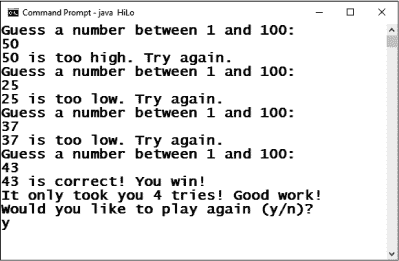
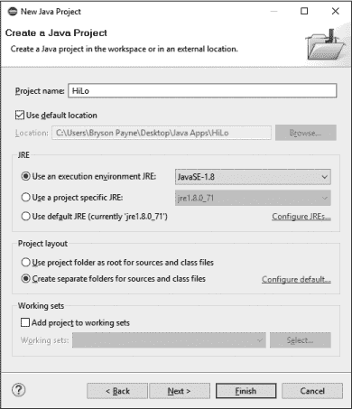
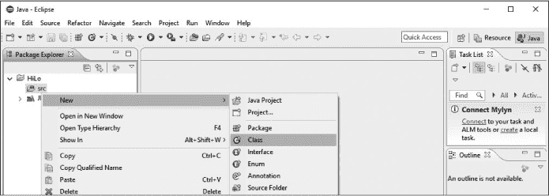
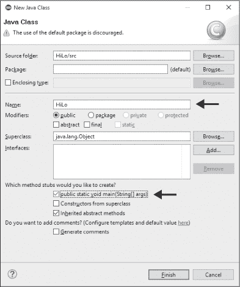
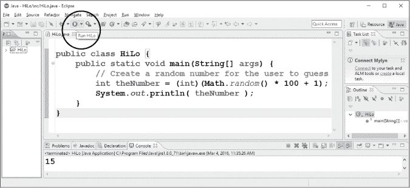
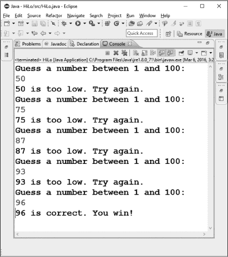
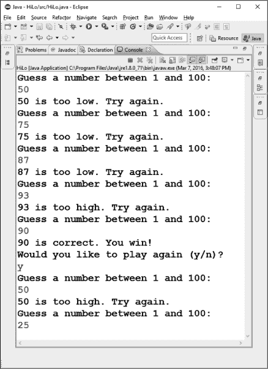

## 2

## 构建一个 HI-LO 猜数字游戏应用！

让我们开始编写一个有趣的可玩游戏：Hi-Lo 猜数字游戏。我们将把这个游戏编写成一个*命令行应用程序*，这只是一个复杂的说法，意味着它是基于文本的（见图 2-1）。当程序运行时，提示将要求用户猜测一个 1 到 100 之间的数字。每次猜测后，程序会告诉他们猜测是否太高、太低或正确。

*图 2-1：基于文本的 Hi-Lo 猜数字游戏*

现在你已经了解了游戏的基本玩法，接下来你只需要编写代码来实现这些步骤。我们将从高层次上规划应用程序，然后编写一个非常简单的游戏版本。通过一开始就设定目标并了解游戏规则，你将能够更轻松地掌握编程技能，并且在有目的的情况下学习它们。你也可以在完成编码后立刻享受游戏的乐趣。

### 逐步规划游戏

让我们思考一下为了让 Hi-Lo 猜数字游戏能够正常运行，我们需要编写哪些步骤。游戏的基本版本需要做以下几件事：

1\. 为用户生成一个 1 到 100 之间的随机数，让用户猜测。

2\. 显示一个*提示*，或一行文本，要求用户猜测这个范围内的数字。

3\. 接受用户的猜测作为输入。

4\. 将用户的猜测与计算机的数字进行比较，看看猜测是太高、太低，还是正确。

5\. 在屏幕上显示结果。

6\. 提示用户继续猜测，直到他们猜对为止。

7\. 问用户是否想再次玩这个游戏。

我们将从这个基本结构开始。在 第 40 页的编程挑战#2 中，你将尝试添加一个额外的功能，告诉用户他们猜对数字所花的尝试次数。

### 创建一个新的 Java 项目

在 Eclipse 中编写一个新的 Java 应用程序的第一步是创建一个项目。在 Eclipse 的菜单栏中，选择**文件** ▸ **新建** ▸ **Java 项目**（或者选择**文件** ▸ **新建** ▸ **项目**，然后在新建项目向导中选择**Java** ▸ **Java 项目**）。如图 2-2 所示，新建 Java 项目对话框应该会弹出。

*图 2-2：Hi-Lo 猜数字游戏应用的新建 Java 项目对话框*

在项目名称字段中输入`HiLo`。请注意，Java 中大小写字母是区分的，我们将养成使用大写字母来开始所有项目、文件和类名的习惯，这是 Java 的常见做法。而且我们将使用驼峰命名法，因为*Hi*和*Lo*是两个词：*HiLo*。保持其他设置不变，点击**完成**。根据你使用的 Eclipse 版本，可能会问你是否要用 Java 视图打开项目。Eclipse 中的*视图*是为在特定语言中编程而设置的工作空间。点击**是**，告诉 Eclipse 你希望设置一个方便进行 Java 编程的工作空间。

### 创建 HiLo 类

Java 是一种*面向对象的编程语言*。面向对象的编程语言使用*类*来设计可重用的编程代码。类就像是模板，使得创建*对象*，或者说是类的实例，更加容易。如果你把类看作饼干模具，那么对象就是饼干。而且，就像饼干模具一样，类是可重用的，所以一旦我们构建了一个有用的类，就可以重复使用它，创造出我们想要的任意多的对象。

Hi-Lo 猜数字游戏将有一个单一的类文件，它创建一个猜数字游戏对象，包含进行游戏所需的所有代码。我们将把新类命名为`HiLo`。大小写很重要，命名类为`HiLo`遵循了 Java 的几条命名约定。常见的做法是所有类名的首字母都大写，因此我们在`HiLo`中使用了大写的`H`。此外，类名中的单词之间不应有空格、连字符或特殊字符。最后，多个单词的类名应使用驼峰命名法，每个新单词的首字母大写，像`HiLo`、`GuessingGame`和`BubbleDrawApp`一样。

要创建新的`HiLo`类，首先在 Eclipse 工作区的左侧包资源管理器面板中找到你的*HiLo*项目文件夹。点击它左边的小箭头以展开文件夹。你应该能看到一个名为*src*的子文件夹，*src*是*源代码*的缩写。所有包含 Java 程序的文本文件将存放在这个*src*文件夹中。

右键点击*src*文件夹，选择**新建** ▸ **类**，如图 2-3 所示。

*图 2-3：为 Hi-Lo 猜数字游戏应用创建一个新的类文件*

“新建 Java 类”对话框将会弹出，如图 2-4 所示。在“名称”字段中输入`HiLo`。然后，在*您希望创建哪些方法存根？*下，勾选**public static void main(String[] args)**。这告诉 Eclipse 我们计划编写一个`main()`程序方法，因此 Eclipse 将包含一个*存根*，即`main()`方法的框架，我们可以在其中填入自己的代码。*方法*是对象或类中的函数。每当你想将应用程序作为独立程序运行时，`main()`方法是必需的。

*图 2-4：命名新的 Java 类* HiLo *并选择复选框以创建 main()方法*

在“新建 Java 类”对话框中点击**完成**，你应该会看到一个名为*HiLo.java*的新文件，文件中包含清单 2-1 中显示的代码。这个 Java 文件将是 Hi-Lo 猜数字游戏的框架。我们将通过编辑这个文件并在其中添加代码来编写猜数字游戏程序。

➊ public class HiLo {

➋ public static void main(String[] args) {

// TODO 自动生成的方法存根

}

}

*清单 2-1：由 Eclipse 生成的 HiLo 猜数字游戏类的存根代码*

Eclipse 会自动生成这段代码。`HiLo`类是`public` ➊，意味着我们可以通过命令行或终端来运行它。

Java 使用大括号`{`和`}`来分组语句。开括号`{`开始一个语句块，这些语句将构成`HiLo`类的主体。闭括号`}`结束这个语句块。在类内部是`main()`方法 ➋，这是类执行时将运行的方法。

在`main()`方法的开括号内有一行以两个斜杠`//`开头的注释。注释是供我们（人类）阅读的。计算机会忽略它们，所以我们可以使用注释帮助我们记住代码段的作用或留下未来使用的备注。你可以删除清单 2-1 中的`TODO`注释。

#### *生成一个随机数*

我们游戏的第一个编程任务是生成一个随机数。我们将使用`Math`类，它包含一个方法用于生成一个 0.0 到 1.0 之间的随机浮点数（小数）。然后，我们将把这个小数值转换为一个 1 到 100 之间的*整数*（一个整数）。`Math`类是一个内置类，包含许多有用的数学函数，类似于你在科学计算器上找到的那些函数。

在`main()`方法内，添加清单 2-2 中显示的注释和代码行。（新代码以黑色显示，现有代码以灰色显示。）

public class HiLo {

public static void main(String[] args) {

// 为用户生成一个随机数以供猜测

int theNumber = (int)(Math.random() * 100 + 1);

}

}

*清单 2-2：创建一个 1 到 100 之间随机数的代码*

首先，我们需要创建一个变量来保存用户在应用程序中尝试猜测的随机数。由于应用程序将要求用户猜测一个 1 到 100 之间的整数，我们将使用`int`类型，即*整数*的缩写。我们将变量命名为`theNumber`。等号`=`将一个值赋给我们新的`theNumber`变量。我们使用内置的`Math.random()`函数生成一个介于 0.0 和 1.0 之间的随机数（不包括 1.0）。由于`Math.random()`生成的数字只在这个特定范围内，我们需要将随机数乘以 100，从而将范围扩展到从 0.0 到接近 100.0（大约 99.99999）。然后，我们将 1 加到这个值上，以确保数字从 1.0（0.0 + 1）到 100.99999 之间。

`(int)`部分称为*类型转换*，简称*转换*。类型转换将数字的*类型*从小数转换为整数。在这种情况下，小数点后的部分被去除，结果是一个 1 到 100 之间的整数。然后，Java 将该数字存储在变量`theNumber`中，这是用户在游戏中尝试猜测的数字。最后，我们添加一个分号（`;`）来表示语句的结束。

现在，你可以添加一个`System.out.println()`语句来打印你生成的数字：

int theNumber = (int)(Math.random() * 100 + 1);

System.out.println( theNumber );

}

}

在我们添加了这行代码之后，就可以运行程序，查看它生成并打印一个随机数字了。点击顶部菜单栏中的绿色运行按钮来编译并运行程序，如图 2-5 所示。你也可以点击**运行**菜单并选择**运行**。

*图 2-5：将随机数字打印到屏幕上*

你的随机数字会出现在屏幕底部的小控制台窗口中，如图 2-5 所示。如果你再次运行程序，你会看到一个 1 到 100 之间的不同数字。

这是一个很好的时机来尝试一下程序。试着生成一个介于 1 到 10，或者 1 到 1,000 之间的数字——甚至 1 到 1,000,000。Java 可以接受直到十亿的数字。只需要记得写数字时不要加逗号：1,000 在 Java 中写作`1000`，而 1,000,000 则写作`1000000`。不过，第一次玩这个游戏时，你可能不想猜 1 到 1,000,000 之间的数字，所以在继续之前记得把这一行改回去。

**注意**

*记得经常保存你的代码。Eclipse 每次运行程序时会自动保存，但最好在每写完几行代码后手动保存。实际上，按 CTRL-S（或* *-S）每写完一行代码保存一下并不是一个坏习惯。我从未听过程序员说他们希望自己保存得不那么频繁，但我自己也曾几次丢失未保存的代码，这可不好受。经常保存，并且记住，如果你不小心输入错误或删除了某段代码，可以使用* ***编辑*** ▸ ***撤销*** *功能。*

#### *从键盘获取用户输入*

现在让我们添加让用户猜数字的代码。为了做到这一点，我们需要*导入*一些额外的 Java 功能。Java 带有许多我们可以在自己项目中使用的库和包。库和包是别人已经创建的一组代码。当我们导入它们时，我们能获得新的功能，这使得我们创建自己的程序变得更加容易。我们可以通过`import`语句在任何需要时访问这些包和库。

对于猜数字游戏程序，我们需要能够接受用户的键盘输入。`Scanner`类位于`java.util`实用程序包中，提供了多个用于处理键盘输入的有用功能。让我们将`Scanner`类导入到程序中。在*HiLo.java*文件的顶部，在`public class HiLo`这一行之前，添加以下语句：

import java.util.Scanner;

public class HiLo {

这一行从 Java 的主工具包中导入了`Scanner`类及其所有功能。`Scanner`类包括像`nextLine()`这样的函数，用于接受来自键盘的输入行，以及`nextInt()`，它可以将来自键盘的文本输入转换为整数，以便与其他数据进行比较或用于计算。要使用`Scanner`类进行键盘输入，我们必须告诉它将键盘作为输入源。

我们希望在程序的其他任何操作之前完成这一部分，所以请将此代码行放在`main()`方法的顶部：

public class HiLo {

public static void main(String[] args) {

Scanner scan = new Scanner(System.*in*);

// 为用户创建一个随机数进行猜测

int theNumber = (int)(Math.*random*() * 100 + 1);

这一行创建了一个名为`scan`的`Scanner`对象，它从计算机的键盘输入中获取数据，来源是`System.in`。

尽管这一新代码行设置了`scan`对象，但它尚未实际要求输入。为了让用户输入一个猜测，我们需要通过提示用户输入一个数字来引导他们。然后，我们将他们从键盘输入的数字存储在一个变量中，这样就可以与`theNumber`（计算机生成的原始随机数）进行比较。我们可以将存储用户猜测的变量命名为一个易于记住的名字，比如`guess`。接下来添加以下代码：

public static void main(String[] args) {

Scanner scan = new Scanner(System.*in*);

// 为用户创建一个随机数进行猜测

int theNumber = (int)(Math.*random*() * 100 + 1);

System.*out*.println( theNumber );

int guess = 0;

这条语句既*声明*了一个名为`guess`的`int`类型变量（Java 中的整数），又*初始化*了`guess`变量，赋初值为`0`。某些编程语言要求变量必须在不同的代码行中声明和初始化，但 Java 允许程序员在同一行中同时完成变量的声明和初始化。Java 要求每个变量都必须声明一个特定的*类型*，即它应该存储的信息种类。用户的猜测将是一个整数，所以我们将`guess`声明为`int`类型。

接下来，我们需要提示用户输入一个猜测。我们可以通过打印一行文本到控制台（或命令行）来告诉用户程序已准备好接收输入。我们通过`System`类访问这个文本屏幕，就像我们在接收键盘输入时做的那样。但这一次，我们要*输出*信息供用户阅读。让我们访问命令行控制台进行输出的对象是`System.out`。与允许我们从键盘接收文本输入的`System.in`对象类似，`System.out`使我们能够将文本输出到屏幕上。打印一行文本的具体函数是`println()`命令：

int guess = 0;

System.*out*.println("猜一个介于 1 和 100 之间的数字：");

这里我们使用*点表示法*，列出一个类或对象，后跟一个点，然后是该类或对象的方法或属性。方法需要使用点表示法调用，以告诉 Java 它们属于哪个对象或类；例如，`Math.random()`。*属性*是存储在对象或类中的值。

例如，`System`是代表您计算机系统的类。`System.out`是包含在`System`类中的命令行屏幕对象，因为您的计算机显示器是整个计算机系统的一部分。`System.out.println()`是使用`System.out`对象打印一行文本的方法。随着我们继续学习，我们会更多地练习使用点表示法。

现在用户知道程序希望他们输入什么样的输入，是时候检查键盘获取他们的猜测了。我们将使用之前创建的名为`scan`的`Scanner`对象。扫描仪有一个名为`nextInt()`的方法，用于查找用户从键盘输入的下一个`int`值。我们将用户的猜测存储在之前创建的变量`guess`中：

System.out.println("Guess a number between 1 and 100:");

guess = scan.nextInt();

此语句将等待用户在控制台窗口中键入一些内容（希望是 1 到 100 之间的整数——我们将看到如何确保用户输入有效数字的方法在第三章）。`nextInt()`方法将获取用户输入的文本字符串（例如`"50"`），将其转换为正确的数值（`50`），然后将该数字存储在变量`guess`中。请花一点时间保存您迄今为止所做的更改。

#### *使程序打印输出*

我们还可以通过添加另一个`println()`语句来检查我们的程序是否到目前为止正在工作：

guess = scan.nextInt();

System.*out*.println("You entered " + guess + ".");

此行再次使用了`System.out.println()`方法，但现在我们结合了文本和数字输出。如果用户猜测`50`，我们希望输出显示为`"You entered 50."` 为了实现这一点，我们形成一个混合文本和存储在变量`guess`中的数字的`println()`语句。

Java 允许我们使用`+`运算符连接文本字符串。我们使用双引号来指定我们想要首先输出的文本（`"You entered "`）。请注意在闭引号前的空格——这告诉程序我们希望在输出的最后一个单词后显示一个空格。Java 忽略大多数空格，但当空格包含在文本字符串的引号内时，它会成为该文本的一部分。

我们还想打印出用户猜的数字。我们将这个值存储在名为`guess`的变量中，所以我们只需要使用`println()`语句来输出该值。幸运的是，在 Java 中，当你在`println()`语句中包含一个变量时，Java 会打印出该变量中包含的值。因此，在文本`"You entered "`之后，我们添加连接运算符（`+`）并紧跟变量名`guess`。最后，我们希望句子以句号结束，所以再使用一个连接运算符，并跟上我们想要的文本，包含在双引号中，像这样`"."`。

清单 2-3 将我们目前的所有代码行结合在一起。

import java.util.Scanner;

public class HiLo {

public static void main(String[] args) {

Scanner scan = new Scanner(System.in); // 为用户生成一个随机数字以供猜测

int theNumber = (int)(Math.random() * 100 + 1);

➊ // System.out.println( theNumber );

int guess = 0;

System.out.println("猜一个介于 1 和 100 之间的数字：");

guess = scan.nextInt();

System.out.println("你输入了 " + guess + ".");

}

}

*清单 2-3：截至目前的代码生成一个随机数字，并允许用户猜一次。*

在 ➊ 处，请注意我通过在该行的开头添加一对斜杠将`System.out.println( theNumber );`变成了注释。这叫做*注释掉*，它是一个有用的*调试*技术——在程序中查找并修复错误或问题。我们在编写和测试程序时，曾使用过这个`println()`语句来显示变量`theNumber`的值。现在，我们不删除这行，而是将它转化为注释，让计算机忽略它。如果我们想再次使用那行代码，只需去掉`//`即可将它包含在程序中。

现在，让我们保存程序并运行它，看看到目前为止它是如何工作的。要运行它，按下绿色的运行按钮或前往**运行** ▸ **运行**。现在，用户只能猜一次，而且程序不会检查他们是否猜对了。所以接下来，我们将添加一些代码，让用户可以猜多次，然后我们将学习如何将每次猜测与`theNumber`进行比较。

### 循环：询问、检查、重复

为了让用户有更多机会猜测数字，我们需要学习如何构建一个循环！在猜数字游戏程序中，我们需要不断询问用户，直到他们猜对为止。*循环*使我们能够反复执行一组步骤。在本节中，我们将构建一个循环，用于提示用户输入猜测并接受键盘输入。

循环是非常强大的编程工具，它们也是计算机在我们日常生活和商业世界中如此有价值的原因之一——计算机非常擅长按可预测的方式重复同样的任务。而且，如果它们被正确编程，它们可以每天、全天候地完成这些任务，且不会出错。你我可能会厌倦告诉别人他们的猜测太高或太低，但计算机永远不会厌倦。它也永远不会忘记数字，或者在数字实际上不高或不低时，告诉玩家他们的猜测太低或太高。

让我们通过`while`循环来发挥循环的强大功能。`while`循环只要某个*条件*为真，就会重复执行一组语句。条件就是我们可以测试的内容。例如，在这个程序中，我们想知道用户是否正确猜中了秘密数字。如果他们没有猜对，我们希望给他们继续猜的机会，直到他们猜对为止。

要编写一个`while`循环，我们需要知道在每次重复循环之前想要测试的条件是什么。在猜数字游戏中，我们希望用户只要猜错了，就能继续猜，直到他们猜对为止。当用户猜对了数字时，游戏结束，因此循环应该停止。

要创建一个`while`循环，我们需要在最后三行代码之前插入一个`while`语句，然后将猜数字的三行代码用一对新的大括号括起来，如下所示：

int guess = 0;

while (guess != theNumber) {

System.out.println("猜一个介于 1 和 100 之间的数字：");

guess = scan.nextInt();

System.out.println("你输入了 " + guess + "。");

}

}

}

我们使用关键字`while`来让 Java 知道我们正在构建一个`while`循环，然后将适当的条件放在括号内。括号内的部分`guess != theNumber`表示，当`guess`的值不等于（`!=`）`theNumber`的值时，循环应该重复紧接在这行代码后的语句。`!=`运算符是一个*比较运算符*——在这种情况下，它比较`guess`和`theNumber`，并评估它们是否不同，或*不相等*。你将在下一节中学习到其他比较运算符，但这是我们在猜数字`while`循环中需要的运算符。

我们需要告诉 Java 在`while`循环中重复哪些语句，因此在`while`语句后面添加了一个左大括号`{`。就像大括号将所有语句组合在`main()`方法中一样，这些大括号将语句组合在`while`循环内部。

我们希望在循环中包括三条语句。首先，我们需要一个 `println()` 语句来提示用户猜一个数字。然后，我们需要一个语句来扫描键盘并通过 `nextInt()` 方法记录猜测。最后，我们需要一个 `println()` 语句来告诉用户他们输入的是什么。为了将这组语句转换成在 `while` 语句中反复执行的代码块，我们首先编写 `while` 语句和条件，然后加上一个左大括号，接着是所有三条语句，最后加上右大括号。不要忘记右大括号！如果缺少，程序将无法运行。

一个好的编程习惯是正确使用制表符缩进，这有助于你保持代码的组织性和可读性。选中 `while` 语句中大括号内的三条语句，然后按下 TAB 键进行缩进。

结果应该像下面的代码一样：

int guess = 0;

while (guess != theNumber) {

System.out.println("猜一个介于 1 到 100 之间的数字：");

guess = scan.nextInt();

System.out.println("你输入的数字是 " + guess + "。");

} }

}

正确的缩进将帮助你记住匹配开括号和闭括号，同时也能帮助你快速看到哪些语句在循环或其他代码块中，哪些语句在循环外。缩进不会影响程序的运行，但如果做得好，它会使你的程序更易读和易于维护。

现在保存程序并运行它，检查它是否能正常工作。游戏差不多可以玩了，但我们仍然需要告诉程序检查用户的猜测是太高、太低还是正好。是时候使用（鼓声请…）`if` 语句了！

#### *if 语句：测试正确的条件*

现在用户可以一直猜，直到猜对为止，我们需要检查猜测，以便告诉他们是否太高或太低。让我们实现这一功能的语句是 `if` 语句。

`if` 语句将根据条件或*条件表达式*选择是否运行一组语句一次或完全不运行。

我们之前在猜测循环中使用了一个条件表达式：`(guess != theNumber)`。为了检查猜测是太高还是太低，我们只需要一些额外的比较运算符：小于（`<`）、大于（`>`）和等于（`==`）。

首先，我们不只是告诉用户他们的猜测是什么，而是编写一些代码来检查他们的猜测是否太低。用以下两行 `if` 语句替换 `while` 语句的最后一行：

while (guess != theNumber) {

System.out.println("猜一个介于 1 到 100 之间的数字：");

guess = scan.nextInt();

if (guess < theNumber)

System.out.println(guess + " 太低了。请再试一次。");

}

`if`语句以关键字`if`开始，后面跟着括号中的条件表达式。在这种情况下，条件是`guess < theNumber`，这意味着用户猜测的值小于随机生成的目标数字。请注意，括号后面没有分号，因为后面的`println()`语句实际上是`if`语句的一部分。整个语句告诉程序，如果条件为真，它应该打印用户的猜测并告知他们猜测太低了。我们在用户的猜测和告诉他们猜测太低的文本字符串之间使用了连接运算符（`+`）。注意在第一个双引号后和`is`前的空格。这将用户的猜测与单词`is`分开。

如果你现在运行程序并输入一个低的猜测，比如`1`，那么`if`语句应该告诉程序输出你的猜测太低了。这是一个好的开始，但如果我们猜的数字太高怎么办呢？在这种情况下，我们需要一个`else`语句。

`else`语句给程序提供了一种选择替代路径或步骤的方式，如果`if`语句中的条件不成立。我们可以通过一对`if-else`语句来测试猜测是否太高或太低。让我们在`if`语句之后添加一个`else`语句：

➊ if (guess < theNumber)

System.out.println(guess + " 太低了。请再试一次。");

➋ else if (guess > theNumber)

System.out.println(guess + " 太高了。请再试一次。");

请注意，➋的代码与➊的代码非常相似。通常当我们使用`if-else`语句时，我们需要检查多个条件，而不仅仅是一个条件。在这里，我们需要检查猜测是否太低、太高或刚好正确。在这种情况下，我们可以通过将下一个`if`语句放入前一个`if-else`语句的`else`部分，将`if-else`条件连接起来。在➋处，我们紧接着前一个条件的`else`开始了下一个`if`语句。如果猜测高于目标数字，程序会告诉用户他们的猜测太高了。现在，程序可以告诉用户他们的猜测是太高还是太低，我们只需要告诉他们是否猜对了并赢了！

如果前面的条件都不成立——即用户的猜测既不太高也不太低——那么他们一定猜对了。所以我们添加了最后一个`else`语句：

➊ if (guess < theNumber)

System.out.println(guess + " 太低了。请再试一次。");

➋ else if (guess > theNumber)

System.out.println(guess + " 太高了。请再试一次。");

➌ else

System.out.println(guess + " 是正确的。你赢了！");

注意到我们在最后的 `else` 语句中不需要条件表达式 ➌。如果数字既不太高也不太低，那么猜对就是唯一的选项。在猜对的情况下，我们提供一条语句告诉用户他们赢了。到目前为止的完整程序显示在列表 2-4 中。保存你的 *HiLo.java* 文件并运行程序，检查它是否正常工作。它应该会提示你输入猜测，直到你猜出正确的数字。

import java.util.Scanner;

public class HiLo {

public static void main(String[] args) {

Scanner scan = new Scanner(System.in);

// 为用户创建一个随机数字来猜测

int theNumber = (int)(Math.random() * 100 + 1); // System.out.println( theNumber );

int guess = 0;

while (guess != theNumber) {

System.out.println("猜一个 1 到 100 之间的数字：");

guess = scan.nextInt();

if (guess < theNumber)

System.out.println(guess + " 太低了，再试一次。");

else if (guess > theNumber)

System.out.println(guess + " 太高了，再试一次。");

else

System.out.println(guess + " 是正确的，你赢了！");

}  // 猜数字的 while 循环结束

}

}

*列表 2-4：Hi-Lo 猜数字游戏完成了一轮完整的游戏。*

完整的程序现在已经是一个完全可玩的猜数字游戏！当用户猜对时，程序会告诉他们猜对了并且获胜，然后结束，如图 2-6 所示。

*图 2-6：Hi-Lo 猜数字游戏的一次完整游戏过程——程序在用户猜出秘密数字时结束。*

给自己鼓掌！你已经从零开始编写了一个 Java 程序，如果这是你第一次编写 Java 程序，你值得一些赞扬。玩几轮游戏，看看你是否能每次用更少的尝试猜出数字。测试你的程序，确保它按照你希望的方式工作，我们将在下一节中添加一些改进。

#### *添加一个重新开始游戏的循环*

现在，重新玩猜数字游戏的唯一方法是重新运行 Eclipse 中的程序。幸运的是，我们已经知道有一种方法可以让程序重复执行某些操作——我们需要另一个循环！

猜数字游戏程序在用户猜对数字时结束，因为 `while` 循环后没有任何代码。如果条件 `(guess != theNumber)` 不再为真，`while` 循环就会结束。一旦用户掌握了游戏，他们可能会想反复玩。为了实现这个重新玩的循环，我们将学习一个新关键字和一种新的循环方式：`do-while` 循环。

与`while`循环一样，`do-while`循环会在条件为真时重复执行一段语句块。然而与`while`循环不同的是，`do-while`循环内的代码块保证至少执行一次。有时，`while`循环顶部的条件可能在循环开始之前就已经为假，因此整个循环及其内的所有代码行都会被忽略。可以把`while`循环的条件想象成暖气的恒温器。如果房间的温度已经足够温暖，而启动暖气的条件没有被满足，暖气可能根本不会开启。

对于我们的猜数字游戏，或者一般来说，几乎任何游戏程序，我们选择使用`do-while`循环（我们有时称之为*游戏循环*），因为用户可能至少想玩一次游戏。我们通常还希望询问用户是否想再玩一次，而用户通常会回答是或否（在像这样基于文本的游戏中，也可能是`y`或`n`）。只要用户回应“是”，游戏就会继续在游戏循环中进行。

为了检查用户的回应，我们需要一个新的变量类型：`String`。字符串是一个对象，用来存储被双引号包围的文本，例如`"y"`、`"yes"`或`"My name is Bryson! I hope you like my game!"`。之前我们使用了一个整数变量，或者`int`类型，来存储用户猜的数字，但现在我们需要存储文本，所以我们将使用`String`类型。我们可以在程序的顶部，紧接着`Scanner`设置后，添加一个`String`变量：

Scanner scan = new Scanner(System.in);

String playAgain = "";

请注意，`String`类型的首字母是大写的`S`。这是因为`String`类型实际上是一个类，里面包含了许多用于处理文本字符串的有用函数。我将变量命名为`playAgain`，采用了驼峰命名法，即第二个单词的首字母大写。记住，变量名中不能有空格。而且，就像我们用`int guess = 0`给`guess`变量初始化值一样，这里我们给`playAgain`变量赋了初始值`playAgain = ""`。两个双引号之间没有空格，表示一个空字符串，或者是一个没有文本内容的`String`变量。稍后，当用户输入`y`或`n`时，我们将给这个变量赋不同的文本值。

就像我们在`while`循环中做的那样，我们需要弄清楚在`do-while`循环中哪些语句应该被重复执行。`do-while`循环将是我们的主循环，因此几乎所有的语句都将放入其中。事实上，在`Scanner`和`String playAgain`语句之后的所有剩余语句都将包含在`do-while`循环中。这些步骤描述了一轮完整的游戏过程，因此每一轮游戏都会重复这些步骤，从选择一个新的随机数到宣布正确猜测并询问用户是否再玩一次。

因此，我们可以在这两行代码后立即添加 `do` 关键字和一个开括号，并在创建秘密数字的代码之前。

Scanner scan = new Scanner(System.in);

String playAgain = "";

do {

// 为用户生成一个随机数进行猜测

int theNumber = (int)(Math.random() * 100 + 1);

// System.out.println( theNumber );

int guess = 0;

while (guess != theNumber) {

然后，在猜测的 `while` 循环的闭括号后面，以及最后一个 `else` 语句后的闭括号后，我们会询问用户是否想再次玩，并从键盘获取他们的回复。

然后，我们需要通过 `while` 条件来关闭 `do-while` 循环，以检查用户是否回复了 "yes"：

}   // 猜测的 while 循环结束

➊ System.out.println("你想再玩一次吗（y/n）？");

➋ playAgain = scan.next();

➌ } while (playAgain.equalsIgnoreCase("y"));

➍ }

➎ }

提示会询问用户 "你想再玩一次吗（y/n）？" ➊，他们可以回复一个字母，`y` 表示是，`n` 表示否。在 ➋，`scan.next()` 函数扫描键盘输入，但与 `nextInt()` 方法不同，它不是寻找下一个整数，而是寻找用户键盘上输入的下一个字符或字符组。无论用户输入什么，都将存储在变量 `playAgain` 中。

在 ➌ 这一行，代码块结束了，它包含了决定是否重新运行代码的 `while` 条件。在 `while` 条件中，你可以看到 `String` 对象的 `equals()` 方法示例。`equals()` 方法告诉你一个字符串变量是否与另一个字符串完全相同，而 `equalsIgnoreCase()` 方法则会告诉你，即使字符串的大小写不同，两个字符串是否相等。在我们的游戏中，如果用户想再次玩，他们会被要求输入 `y`。然而，如果我们只检测小写的 `y`，可能会忽略大写的 `Y` 响应。在这种情况下，我们希望通过检查字母 `y` 来提高灵活性，无论它是大写还是小写，所以我们使用了 `equalsIgnoreCase()` 字符串方法。

最后的 `while` 语句告诉 Java 只要字符串变量 `playAgain` 是大写或小写的 `y`，就继续执行游戏循环。位于 ➍ 和 ➎ 的最后两个闭括号就是程序中已经存在的那两个。 ➊ 到 ➌ 的代码应该被插入到这两个括号之间。

完整的游戏到此为止可以在列表 2-5 中查看。

import java.util.Scanner;

public class HiLo {

public static void main(String[] args) {

Scanner scan = new Scanner(System.in);

String playAgain = "";

do {

// 为用户生成一个随机数进行猜测

int theNumber = (int)(Math.random() * 100 + 1);

// System.out.println( theNumber );

int guess = 0;

while (guess != theNumber) {

System.out.println("猜一个 1 到 100 之间的数字：");

guess = scan.nextInt();

如果 (guess < theNumber)

System.out.println(guess + " 太低了。再试一次。");

否则如果 (guess > theNumber)

System.out.println(guess + " 太高了。再试一次。");

否则

System.out.println(guess + " 是正确的。你赢了！");

}   // 猜测循环结束

System.out.println("你想再玩一局吗（y/n）？");

playAgain = scan.next();

} 直到 (playAgain.equalsIgnoreCase("y"));

}

}

*清单 2-5：Hi-Lo 猜数字游戏准备好可以反复进行。*

检查你的代码，确保你已将所有内容放在正确的位置，检查大括号和分号，并花一点时间保存你的文件。我们将在下一节测试游戏。

**注意**

*你的缩进，即每行开头的制表符空格，可能看起来和最后一段代码不完全一样，因为我们在几个新位置添加了大括号。幸运的是，在 Java 中，添加新功能，包括循环和其他代码块，非常常见，Eclipse 提供了一个菜单选项可以自动整理缩进。首先，选择（高亮）屏幕上所有的* HiLo.java *文件中的文本。然后，转到* ***Source*** ▸ ***Correct Indentation***。*Eclipse 会正确地缩进每一行代码，显示哪些语句应该被归为一组。如我之前提到的，缩进对计算机来说并不重要（即使没有制表符或额外的空格，程序仍然可以正常运行），但是良好的缩进和空格有助于提高程序的可读性。*

### 测试游戏

现在，既然“再次游戏”循环已经设置好，游戏应该可以完美运行。首先，保存你的*HiLo.java*文件，并选择 **Run** ▸ **Run** 来测试程序。在你第一次正确猜出随机数后，程序应该会问你是否想再次游戏。只要你回答`y`（或`Y`）并按下 ENTER，程序应该会继续给你新的随机数进行猜测。在图 2-7 的截图中，注意到当我回答`y`时，游戏会重新开始。

*图 2-7：只要用户回答 y 或 Y，猜数字游戏就可以进行多轮游戏。* 

当用户玩完并用 `n` 或任何其他非 `y` 或 `Y` 的回答响应“再玩一次”问题时，游戏将结束。然而，我们可能想要在游戏结束后感谢他们参与。请在最后一个 `while` 语句后，最后两个闭合大括号之前添加以下行：

} 直到 (playAgain.equalsIgnoreCase("y"));

System.out.println("感谢你的参与！再见。");

}

}

最后，我们将在猜数字游戏应用中添加最后一行代码，以处理你可能在 Eclipse 中看到的警告。这个警告会以一条淡黄色的线出现在 `scan` 对象声明的下方，并且该行左侧会有一个黄色的三角形和感叹号。Eclipse 提醒我们，我们打开了一个资源，却没有关闭它。在编程中，这种情况可能会导致*资源泄漏*。如果我们只是打开一个 `Scanner` 对象来接收键盘输入，这通常没有问题，但如果我们打开了多个 `Scanner` 对象而没有关闭它们，程序可能会填满内存，从而导致性能下降甚至崩溃。我们使用 `Scanner` 类的 `close()` 方法来告诉程序关闭与键盘的连接。

在 `println()` 语句后，感谢用户参与游戏的输出语句之前，添加以下一行：

System.out.println("感谢你参与游戏！再见。");

scan.close();

}

}

你会注意到，当我们添加这行代码后，Eclipse 编辑器窗口中的黄色警告消失了。Eclipse 能帮助我们发现常见的编程错误，比如拼写错误或缺少标点符号，甚至会警告我们可能会发生的问题，如资源泄漏和未使用的变量。在你构建更大、更复杂的 Java 应用程序时，IDE 的这些功能将变得更加有价值。你可以在附录中找到更多使用 Eclipse 调试程序的信息。

完成的程序，如列表 2-6 所示，是一个完全可玩的猜数字游戏，包含了重新开始并每次都猜一个新随机数字的选项。

import java.util.Scanner;

public class HiLo {

public static void main(String[] args) {

Scanner scan = new Scanner(System.in);

String playAgain = "";

do {

// 创建一个随机数供用户猜测

int theNumber = (int)(Math.random() * 100 + 1);

// System.out.println( theNumber );

int guess = 0;

while (guess != theNumber) {

System.out.println("猜一个介于 1 到 100 之间的数字：");

guess = scan.nextInt();

if (guess < theNumber)

System.out.println(guess + " 太低了。再试一次。");

else if (guess > theNumber)

System.out.println(guess + " 太高了。再试一次。");

else

System.out.println(guess + " 正确。你赢了！");

}  // 猜测的 while 循环结束 System.out.println("你想再玩一次吗 (y/n)？");

playAgain = scan.next();

} while (playAgain.equalsIgnoreCase("y"));

System.out.println("感谢你参与游戏！再见。");

scan.close();

}

}

*列表 2-6：完成的基于文本的命令行猜数字游戏*

有几点值得注意，关于完成的 Hi-Lo 猜数字游戏程序。首先，尽管编写了很多代码，但程序代码相对简短——不到 30 行。然而，如果你愿意，你可以一直玩下去。其次，这个程序不仅展示了条件判断和循环，它还使用了循环嵌套循环。这叫做*嵌套循环*，因为猜数字的循环被包含在另一个循环内，即重新开始游戏的循环。缩进帮助我们看到`do-while`循环的开始和结束，并且可以看到更小的`while`循环及其`if`语句被缩进并嵌套在更大的`do-while`循环内。最后，我们整洁地结束了程序——既为用户感谢他们的参与，也为计算机通过关闭扫描器资源来结束。

### 你所学到的

在构建一个简单、有趣、可玩的游戏的过程中，我们学到了几个有价值的编程概念。这也是我小时候第一次学习编程的方式——我会找到一个有趣的游戏或图形应用程序，编写它，然后修改它，拆解它，尝试新的东西。玩耍和探索是学习任何新事物的重要部分，我希望你能花些时间在每个程序中尝试新事物。每章末尾的编程挑战也会给你提供一个尝试新事物的机会。

在构建这个猜数字游戏的过程中，我们发展了许多 Java 技能：

• 创建一个新的类，`HiLo`

• 导入现有的 Java 包，`java.util.Scanner`

• 使用`Scanner`对象接收键盘输入

• 声明和初始化整数和字符串变量

• 使用`Math.random()`生成随机数并将其转换为整数

• 使用`while`和`do-while`循环在条件为真时重复一组步骤

• 将文本字符串和变量值输出到命令行控制台

• 从键盘扫描整数和字符串并将其存储到变量中

• 测试`if`和`if-else`语句中的各种条件表达式

• 使用`String`方法通过`equalsIgnoreCase()`比较字符串值

• 使用`close()`方法关闭输入资源，如`Scanner`对象

• 在 Eclipse 中运行命令行程序

除了实际技能，你还掌握了 Java 中几个重要的编程概念：

**变量** `theNumber`是一个整数变量，或称`int`，`guess`也是一个`int`类型的变量。`playAgain`是一个字符串变量，或称`String`类型。我们通过输入新的数字猜测或回答`y`或`n`来改变这些变量的值，直到游戏结束。

**方法** 方法是我们在 Java 类中称为函数的东西。`Math.random()`是一个生成介于 0.0 和 1.0 之间的随机数的方法。`scan.nextInt()`方法接受用户输入的数字。`System.out.println()`是一个用于将文本显示到控制台或终端窗口的函数。

**条件语句** `if-else` 语句允许我们测试某个条件，如 `guess < theNumber`，并根据测试结果运行不同的代码块。我们还使用条件表达式来判断是否再次执行循环，例如 `while (guess != theNumber)` 语句。只要 `guess` 不等于 `theNumber`，这个语句就会继续循环。记住，测试“是否相等”的符号是双等号：`==`。

**循环语句** `while` 循环让我们在条件为真时重复执行一段代码。在猜数字游戏中，我们使用了一个 `while` 循环，持续让用户猜测，直到猜中正确的数字。`do-while` 循环至少会执行一次，我们用它来询问用户是否愿意再玩一次。

**类** 整个 HiLo 应用程序是一个 Java 类，`public class HiLo`。类是一个模板。现在我们已经为 HiLo 猜数字游戏构建了一个类模板，我们可以在不同的计算机上重用它来玩这个游戏。我们还在这个应用程序中导入了 `Scanner` 和 `Math` 类来接受用户输入并生成随机数字。我们将编写自己的类来实现新的功能，并利用 Java 中已经包含的类来处理日常任务，如输入、数学运算等。

### 编程挑战

尝试这些编程挑战来复习和实践你所学的内容，并扩展你的编程技能。如果你遇到困难，可以访问本书的网站 *[`www.nostarch.com/learnjava/`](https://www.nostarch.com/learnjava/)* 下载示例解答，或者可以在 *[`www.udemy.com/java-the-easy-way/`](http://www.udemy.com/java-the-easy-way/)* 在线视频课程中观看本课，获取逐步解决方案。第二章可以免费预览，你还可以使用优惠码 BOOKHALFOFF 在购买完整课程时节省 50%的费用。

#### *#1：扩展你的范围*

对于这个第一次编程挑战，将猜数字游戏的数字范围扩大。将范围从 1 到 100 改为从−100 到 100，让用户猜测这个范围内的数字！

**提示**

*将 Math.random() 乘以 200，然后从结果中减去 100。*

记得同时更改生成随机数字的*编程语句*和提示用户猜测范围的*提示语*。

如果你想玩一个更简单的游戏，可以将范围改为 1 到 10，并在仅用四次尝试就猜出秘密数字时，给朋友们留下深刻印象。试试其他范围，如 1 到 1,000，甚至 1 到 1,000,000，或者如果你愿意的话，使用负数范围！(记住，在 Java 中编写数字时不能使用逗号。) 你不仅能提高编程技能，还能提升你的数学能力。随心所欲地修改程序，享受其中的乐趣！

**制定你的猜测策略**

你可能会发现，玩得越多，猜数字的速度就越快。你甚至可能意识到，通过每次猜测在一个范围的中间位置进行猜测，你能最快猜到那个秘密数字。这种技巧叫做*二分查找*。每次在可能的范围中间猜一个数字，就能将可能性数量减少一半。

它是这样工作的。对于 1 到 100 之间的数字，猜 50。如果它太小，你就知道秘密数字必须在 51 到 100 之间，那么猜 75，就在这个范围的中间。如果它仍然太小，试试 76 到 100 之间的中间数字，即 87。二分查找之所以如此有价值的一个原因是，我们可以将猜测次数减少到七次（或更少），每次都能找出 1 到 100 之间的秘密数字。试试看！

当你习惯于在七次或更少的尝试中猜出一个介于 1 到 100 之间的数字时，试着在仅 10 次尝试内猜一个介于 1 到 1,000 之间的数字。如果你真的很勇敢（并且手边有一支铅笔），尝试猜一个介于 1 到 1,000,000 之间的数字。信不信由你，你只需要 20 次尝试。

#### *#2: 计算尝试次数*

我们已经构建了一个相当酷的猜数字游戏应用程序，但让我们试着为游戏添加一个新功能。你的挑战是统计并报告用户猜中秘密数字需要多少次尝试。它看起来可能是这样的：

62 是正确的！你赢了！

你只用了 7 次尝试！做得好！

为了完成这个任务，你需要创建一个新的变量（你可以添加像 `int numberOfTries = 0;` 这样的代码行），并且每次猜测循环执行时，你都需要增加尝试次数。你可以通过每次新的循环使用 `numberOfTries = numberOfTries + 1` 来增加 `numberOfTries` 的值。务必包括一些文本，让用户知道尝试的次数。

可能需要几次尝试才能将所有代码按正确的顺序和时间顺利运行，但这是值得的努力，也有助于你练习新学到的技能。在第三章，我们会将这个功能添加到猜数字游戏的另一个版本中。与此同时，我希望你能想出更多改进和修改游戏的创意。玩你的程序，拆解它们，再重新构建它们，可能是学习的最佳方式。

#### *#3: 玩疯狂填词游戏（MadLibs）*

在本章的最终挑战中，让我们编写一个全新的程序。我们已经学会了如何请求用户输入并将其存储在变量中。我们还学会了如何将文本和变量的值打印到屏幕上。掌握了这些技能，你可以构建更有趣、更好玩的程序。

你玩过 MadLibs 吗？让我们尝试用我们新学的技能构建一个相同风格的程序。MadLibs 会要求玩家提供各种单词或词性，例如颜色、过去式动词或形容词，然后将玩家选择的单词插入到模板中，通常会得到一个有趣的故事。例如，如果玩家提供的颜色是“粉红色”，过去式动词是“打嗝”，形容词是“傻乎乎”，然后将它们插入到模板“The ____ dragon ____ at the ____ knight”中，最终结果会是“The *pink* dragon *burped* at the *silly* knight”。

现在，挑战是编写一个新的程序，*MadLibs.java*，创建一个名为 `MadLibs` 的类，并且有一个 `main()` 方法，提示用户输入几个单词。这些单词应该分别存储在不同的 `String` 变量中，比如 `color`、`pastTenseVerb`、`adjective` 和 `noun`，并将它们初始化为空字符串。然后，在用户输入最后一个单词后，程序应该通过用用户提供的单词替换空字符串，来打印一个完整的句子或故事，像这样：

System.out.print("这只 " + color + " 龙 " + pastTenseVerb + " 在 " + adjective);

System.out.println(" 骑士，骑着一匹坚固的巨型 " + noun + "。");

请注意，第一个语句是 `print()` 语句，而不是 `println()`。`print()` 语句会在同一行继续打印，允许我们构建更长的段落或故事。而 `println()` 语句每次打印后总会跳到下一行，就像你按下回车键一样。你可以通过使用不同的变量名，如 `noun1`、`noun2` 和 `noun3`，来编写更长的 MadLibs 故事。试试看，准备好大笑你创作的有趣故事吧！尝试通过添加新功能来个性化每个你创建的程序，让它成为你自己的作品。
