## **3**

## 为我们的猜数字游戏创建 GUI

在本章中，我们将创建一个来自 第二章 的 Hi-Lo 猜数字游戏的 GUI 版本，如 图 3-1 所示。当这个版本的程序运行时，它将呈现一个图形化或视觉化界面，用户将与之互动。GUI 版本允许用户在一个桌面窗口中玩游戏，就像你每天使用的应用程序一样。它是一个专业的窗口化应用，包含一个供用户输入猜测的文本框，一个提交猜测的按钮，以及一个标签，告诉用户他们的猜测是过高、过低还是正确。

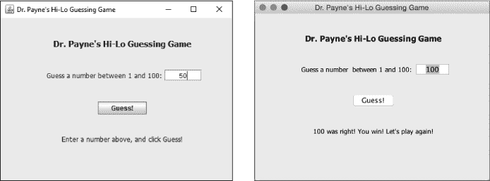

*图 3-1：在 Windows（左）和 macOS（右）上运行的 Hi-Lo 猜数字游戏的 GUI 版本*

最棒的是，完全相同的 Java 源代码生成了 图 3-1 中的两个版本的应用程序。通过本章我们编写的 GUI 代码，我们的游戏将在 Windows、macOS 和 Linux 上均可运行！

### 在 JShell 中练习

JShell 在命令行中工作，接受文本命令并通常以文本输出响应。然而，JShell 还可以访问完整的 Java 库——预编写的代码包——并且不仅限于文本输出。在开始编写我们的游戏之前，先让我们在 JShell 中创建一个简单的 GUI 作为练习。

#### *四行代码创建 GUI*

我们只需四行代码就能在 JShell 中创建一个简单的 GUI 窗口。让我们逐条分析每一行代码。首先，输入一个 `import` 语句，将 `javax.swing.JFrame` 类导入到 JShell 中：

jshell> import javax.swing.JFrame

我们刚刚导入的 `JFrame` 类使用 Java 创建一个框架或窗口。接下来，让我们使用该类创建一个框架。输入以下声明以创建一个名为 `myFrame` 的 `JFrame`：

jshell> JFrame myFrame = new JFrame("Hello!")

`new` 关键字创建一个 `JFrame` 类的新对象——在这个例子中，是一个我们将编程以在标题栏中显示 `"Hello!"` 的 GUI 窗口。JShell 会响应并显示一行长文本，告诉我们窗口将拥有的一些默认属性：

myFrame ==> javax.swing.JFrameframe1,0,0,0x0,invalid,hidden,layout=java.awt.BorderLayou ...

方括号后面显示的信息是 `myFrame` 的字符串表示以及它的属性值，如大小（`0x0`，即 0x0 像素）以及它是隐藏的还是可见的。让我们通过设置大小为大于 0x0 像素来更改其中一个属性。

第三行代码通过指定框架的宽度和高度来设置窗口的像素大小：

jshell> myFrame.setSize(300,200)

这告诉 Java 将窗口设置为 300 像素宽，200 像素高，足以让我们看到窗口和标题栏。

最后，通过调用 `setVisible()` 方法将窗口显示在屏幕上：

jshell> myFrame.setVisible(true)

我们使用 `setVisible(true)` 来显示窗口，使用 `setVisible(false)` 来隐藏窗口。由于我们调用了 `myFrame.setVisible(true)`，你应该能在屏幕上看到窗口，如[图 3-2 所示。

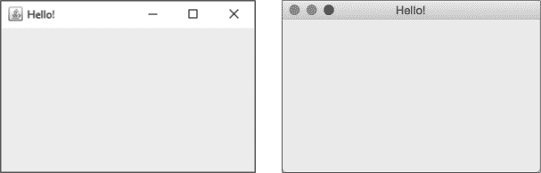

*图 3-2：我们的 GUI 窗口在 Windows（左）和 macOS（右）上的展示*

我们只通过输入四个代码片段，就在 JShell 中创建了一个 GUI 窗口！

#### *在 10 行代码中创建互动式 GUI！*

我将之前的示例展示给了大学里的学生和家里的儿子们，他们的反应都类似：“这真的很酷，不过你能让窗口 *做* 一些事情吗？”

幸运的是，答案是肯定的。只需再添加几行代码，我们就能在窗口中添加一个按钮，每次点击时打印出一些内容。

让我们从一个新的 JShell 开始。通过在 JShell 提示符下输入 `/reset` 来清除你的 JShell 历史记录：

jshell> /reset

|  重置状态。

接下来，让我们使用内置的 JShell 编辑器编写一段 10 行代码，创建一个响应点击的互动式 GUI 应用。在 JShell 提示符下，输入 `/edit` 来打开 JShell 编辑器：

jshell> /edit

JShell 编辑区对我们来说非常有用，尤其是在我们想要一次写多行代码，或者想要回去编辑之前输入的某行代码时，它会显示一个空窗口，如图 3-3 所示。

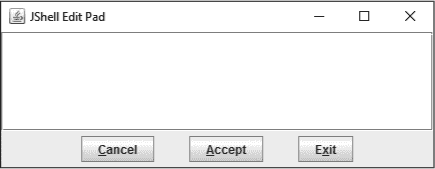

*图 3-3：JShell 编辑区是一个方便的编辑器，用于编写较长的代码片段。*

在这种情况下，我们希望输入 10 行代码，这些代码将创建一个互动式 GUI 窗口，包含一个按钮，点击时会打印出一些内容。输入以下代码时，请特别注意字母大小写，并在每条完整语句末尾加上分号，以便将多条命令分开：

import javax.swing.*;

JFrame window = new JFrame("Bryson 的窗口");

➊ JPanel panel = new JPanel();

JButton button = new JButton(➋"点击我！");

➌ panel.add(button);

➍ window.add(panel);

window.setSize(➎300,100);

➏ button.addActionListener(e ->

System.out.println("哎呀！你点击我了！"));

➐ window.setVisible(true);

首先，我们导入所有的 Swing GUI 类，包括 `JFrame`、`JPanel` 和 `JButton`。Java 库名称后面的星号（`*`）叫做 *通配符字符*，意味着“包括该包中的所有类”。然后，我们创建一个 `JFrame`，就像在前面的示例中那样。在 ➊ 处，我们在窗口内创建一个面板。这个面板将作为容器，包含其他 GUI 组件，如标签和按钮。

接下来，我们添加一个上面写着“点击我！”的按钮 ➋。在 ➌ 处，我们将按钮添加到 GUI 面板中，然后在 ➍ 处将面板添加到窗口中。然后，我们将窗口的大小设置为宽 300 像素，高 100 像素 ➎，这与前面的示例类似。

➏ 处的代码是“魔法发生”的地方：在这里，我们为“点击我！”按钮添加了一个动作监听器，使得每当用户点击按钮时，程序就会响应。每当用户点击 GUI 按钮时，动作监听器会将 `"哎呀！你点击了我！"` 打印到控制台。我们将在本书中构建的 GUI 应用程序中使用类似的监听器，让程序在用户执行操作时与用户互动。

最后，我们将窗口设置为可见 ➐，然后准备好通过点击按钮来测试程序。

当你输入完所有 10 行代码并检查无误后，点击 JShell 编辑板中的 **接受** 按钮以接受代码并在 JShell 中运行它，如图 3-4 所示。

接受代码后，点击 **退出** 关闭 JShell 编辑板。JShell 会运行代码片段，如果你输入的代码正确，你将看到一个小窗口弹出，如图 3-5 所示。

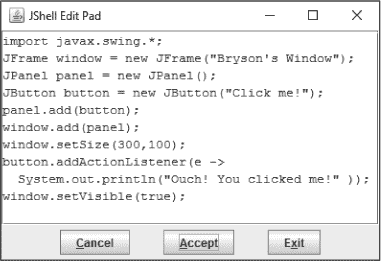

*图 3-4：在 JShell 编辑板中输入所有 10 行代码后，点击* ***接受***。

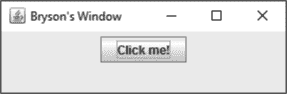

*图 3-5：一个带有可点击按钮的互动式 GUI 窗口*

用鼠标点击标有 **点击我！** 的按钮，你会在 JShell 窗口中看到 Java 的回应如下：

jshell> 哎呀！你点击了我！

哎呀！你点击了我！

哎呀！你点击了我！

哎呀！你点击了我！

如果你关闭了这个小 GUI 窗口，只需重复最后一行设置窗口可见的代码即可恢复它。点击进入 JShell 命令行窗口后按 ENTER 键几次，以便恢复提示符和光标，然后输入以下内容：

jshell> window.setVisible(true)

当我们将窗口的可见属性设置为 `true` 时，窗口会重新出现；如果你关闭窗口，窗口的可见属性会变成 `false`。

这个 10 行的代码片段很酷，但现在你将学习如何构建一个带有 GUI 的游戏！

### 在 Eclipse 中设置 GUI 应用程序

如果你仍然在 Eclipse 中打开着第二章中的 *HiLo* 项目，如图 3-6 所示，关闭或最小化你可能正在编辑的任何其他 Java 文件的编辑窗口 ➊。同时，通过点击左侧 Package Explorer 中 *HiLo* 文件夹旁的小箭头，折叠 *HiLo* 项目 ➋。这样可以使我们在一个工作区内保持项目的整洁，不会把文件搞混。

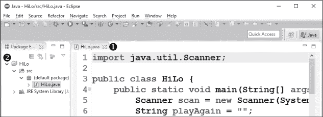

*图 3-6：关闭任何打开的文件并折叠* HiLo *项目文件夹。*

在 Eclipse 菜单栏中，选择 **文件** ▸ **新建** ▸ **Java 项目**，并将项目命名为 *GuessingGame*。输入项目名称后，点击右下角的 **完成** 按钮。这将创建一个新的项目文件夹，我们将在其中开发猜数字游戏的 GUI 版本。

展开*GuessingGame*文件夹，在 Package Explorer 窗口中找到*src*文件夹。右键点击（或在 macOS 上，CONTROL-点击）*src*文件夹并选择**New** ▸ **Class**。将新类命名为`GuessingGame`。确保使用驼峰命名法，类名以大写字母*G*开头。勾选**public static void main(String[] args)**方法的复选框。这将添加`main()`方法的骨架，使我们能够将应用程序作为独立程序运行。

在我们完成之前，我们需要做一步与我们在第二章构建的命令行应用不同的操作。我们将把父类从默认的`java.lang.Object`改为`javax.swing.JFrame`类，就像我们在本章开头的 JShell 中使用的`JFrame`一样。在 Java 中，*父类*或*超类*是我们扩展的类，以便重用已经编写的代码，在这种情况下是构建图形化窗口界面所需的代码。`javax.swing`包中的`JFrame`类是我们在自己的应用中包含 GUI 组件的一种方式，因此我们将使用`JFrame`来创建一个窗口，然后定制它以添加更多功能。由于`JFrame`类本身是`Object`超类的扩展，因此我们不需要`java.lang.Object`，因为`JFrame`将*继承*`Object`超类的代码。这意味着`JFrame`将具有`Object`类的所有功能，并且还有更多功能。我们稍后将看到扩展是如何工作的。

图 3-7 显示了我们猜数字游戏的新 Java 类对话框中的这些设置。

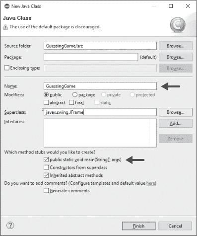

*图 3-7：确保将父类更改为 javax.swing.JFrame，为 GUI 类做准备。*

点击**Finish**以查看以下`GuessingGame.java`的源代码：

➊ import javax.swing.JFrame;

public class GuessingGame ➋extends JFrame {

public static void main(String[] args) {

// TODO 自动生成的方法存根

}

}

在第一行，Eclipse 导入了`javax.swing.JFrame`类 ➊，以允许我们的程序使用 Swing 包集的 GUI 功能。在第二行，我们使用了一个新的编程超级能力——`extends`关键字 ➋。

在面向对象编程中，父类或超类可以有*子类*，这些子类继承父类中包含的所有方法和属性。一旦我们编写了一个做某些重要事情的类，并且计划重用它，我们可以引用那个原始类并*扩展*它，以添加新的功能，而不需要更改父类中的代码。在这种情况下，`JFrame`父类具有显示文本框、标签、按钮和其他 GUI 组件的能力，我们可以为新的猜数字游戏应用自定义和排列这些组件。

我们在此应用中扩展的`JFrame`父类将使我们能够通过在 Eclipse 中的 WindowBuilder 编辑器中设计 GUI 布局，显示包含文本框、标签和按钮等 GUI 元素的窗口。接下来我们来看看 WindowBuilder 编辑器是如何工作的。

### 使用 Eclipse 的 WindowBuilder 编辑器进行 GUI 设计

最流行的 Java 集成开发环境（IDE）包括帮助程序员在设计视图中构建吸引人的 GUI 的工具，采用所见即所得（WYSIWYG）界面。所见即所得界面允许用户根据最终产品的外观定位设计元素。例如，Microsoft Word 就是一个所见即所得界面，因为它允许你编辑文本，显示最终打印形式的样子。同样，像 WindowBuilder 编辑器这样的 Java IDE 工具允许程序员将 GUI 组件（如文本框、标签和按钮）放置在最终窗口化应用程序中，看起来像它们的最终样子，从而帮助程序员交付专业外观的 GUI 应用程序。

要打开 WindowBuilder 编辑器，在左侧的包资源管理器中右键点击 *GuessingGame.java* 文件，然后选择 **打开方式** ▸ **WindowBuilder 编辑器**。一个看起来像普通文本编辑器的窗口将会打开。但如果你查看窗口的左下角，你会看到两个新的标签，源代码和设计。源代码标签是应用程序的纯文本源代码视图。如果点击设计标签，你会看到在图 3-8 中显示的设计视图。

WindowBuilder 编辑器仅适用于像 `GuessingGame` 这样的 GUI 类，这些类扩展了 `JFrame` 或其他 GUI 超类。注意，预览窗口有一个标题栏，左侧有一个 Java 图标，并且有三个按钮来最小化、最大化和关闭窗口。图 3-8 中的预览窗口在 Windows、macOS 和 Linux 上看起来略有不同。这个窗口将成为我们构建看起来和感觉像真实应用程序的 GUI 猜谜游戏的游乐场。

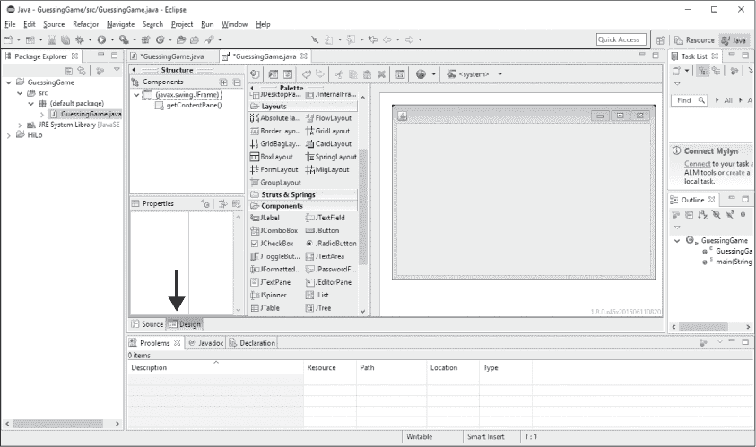

*图 3-8：WindowBuilder 编辑器的设计标签让你轻松构建 GUI 窗口化应用程序。*

### 设计用户界面

双击 WindowBuilder 编辑器顶部的 *GuessingGame.java* 标签，将 WindowBuilder 设计视图展开为全屏模式。这样可以为设计 GUI 布局提供更多空间。当你准备好返回编程时，可以再次双击标签恢复正常的 Java 视角。

#### *在属性面板中设置 GUI 属性*

我们将使用属性面板开始定制我们猜谜游戏的 GUI 窗口。属性面板位于 WindowBuilder 编辑器中设计标签的左下方。如图 3-9 所示，如果你点击组件面板（位于结构下方的左侧）中的一个组件，下面的属性面板会立即列出该组件的几个属性和值，我们可以查看和编辑这些属性。

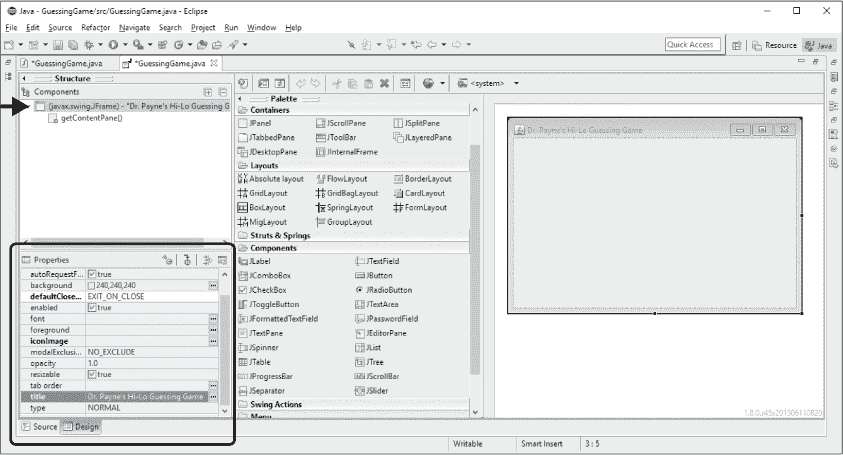

*图 3-9：属性面板帮助你定制应用程序中每个 GUI 组件的属性。*

我们将为猜数字游戏应用程序构建一个自定义的 GUI 窗口。首先，让我们更改这个`JFrame`的标题属性。在组件窗格中点击**javax.swing.JFrame**，然后在属性窗格中向下滚动，直到看到`title`属性。点击`title`右侧的空框，输入`Your Name``'s` `Hi-Lo Guessing Game`。（将斜体文本替换为你的名字；毕竟这是你的应用程序！）输入标题文本后，按回车键。右侧的 GUI 预览将自动更新，显示*Your Name*’s Hi-Lo Guessing Game 在标题栏中。

标题设置完毕后，让我们设置其他几个属性，使 GUI 看起来和行为符合猜数字游戏的需求。在属性窗格中向上滚动，找到`defaultCloseOperation`（如果窗格太窄，可能只显示部分名称，如`defaultClose...`）。点击`defaultCloseOperation`右侧的框，选择**EXIT_ON_CLOSE**从下拉菜单中。这意味着，当你点击这个`JFrame`标题栏上的关闭窗口按钮时，你将退出程序。这通常是默认设置，但有时你可能希望关闭一个窗口而不是整个应用程序——例如，在保存对话框或弹出窗口中。但对于这个单窗口的游戏，我们希望当主窗口关闭时退出应用程序。

接下来，我们将更改 GUI 组件在应用窗口中的排列方式。在组件窗格中点击**getContentPane()**条目，位于`javax.swing.JFrame`下方。*内容窗格*是`JFrame`的*内部*部分，我们将在这里构建猜数字游戏的 GUI 布局。现在，在属性窗格中找到布局（Layout），并点击字段右边缘的下拉箭头。从下拉列表中选择**Absolute Layout**；这将使我们能够以像素精确度放置 GUI 元素。

#### *自定义调色板窗格中的 GUI 组件*

让我们开始自定义我们的猜数字游戏应用程序。你可以在调色板窗格中找到几乎所有 GUI 应用所需的元素。调色板窗格位于设计标签的 WindowBuilder 编辑器中间。注意，你可以通过点击窗格标题左侧的小箭头来展开或折叠窗格。点击箭头一次以折叠窗格，再次点击箭头以展开窗格。当你需要更多空间来进行大而复杂的 GUI 布局时，这会非常方便。

在调色板中向下滚动，直到看到组件部分，如图 3-10 所示。

调色板中包含了所有你可能已经熟悉的标准组件，如标签（`JLabel`）、文本框（`JTextField`）、按钮（`JButton`）和复选框（`JCheckBox`）。你可能注意到，`javax.swing`包中的 GUI 组件名称都以大写字母 J 开头，后面跟着组件的驼峰式命名法名称。这使得记住每个 GUI 元素在使用 Swing 工具包的应用程序中的类名变得更加容易。

在 GUI 窗口的顶部放置一个标签，显示 *Your Name* 的 Hi-Lo 猜数字游戏。点击组件面板中的 **JLabel**。然后，将鼠标移动到右侧的 GUI 预览区域；你应该能看到网格线出现。默认情况下，WindowBuilder 编辑器提供了这些网格线，帮助你放置元素。现在，将鼠标悬停在灰色内容面板的顶部中心（即 `JFrame` 的内部），并点击以将一个 `JLabel` 放置在该位置。

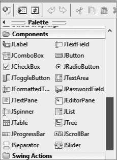

*图 3-10：组件面板中的组件部分是我们找到最常见的 GUI 组件的地方。*

当你首次放置 `JLabel` 时，可以直接在 GUI 预览中编辑标签中的文本。输入 `Your Name`'s Hi-Lo Guessing Game`，然后按 ENTER。如果你之后想更改文本，可以在属性面板的 `JLabel` 的 `text` 属性中输入新的文本。刚开始时，你可能只能看到标签中的一部分文本，因为标签太小，无法显示完整的文本。点击标签，你会看到每个角落上都有小黑色的调整框。点击标签的左下角，将其拖动到内容面板的左边缘，将标签拉伸到内容面板的左边缘。然后，点击标签的右下角并拖动，调整标签大小，直到它与内容面板的右边缘对齐。

现在，整个标签文本应该能适应放置在 GUI 预览顶部的标签内。接下来，让我们将标签文本居中并加粗。首先，在属性面板中找到标签的 `horizontalAlignment` 属性。点击其值，然后从下拉列表中选择 **CENTER**。接着，找到标签的 `font` 属性，点击 `font` 属性值右侧的三个点。会弹出一个字体选择窗口，允许你选择字体、样式和大小。我选择了 Tahoma 字体，15 磅，粗体，如 图 3-11 所示。注意，你可能需要调整标签的大小，以适应较大的字体。

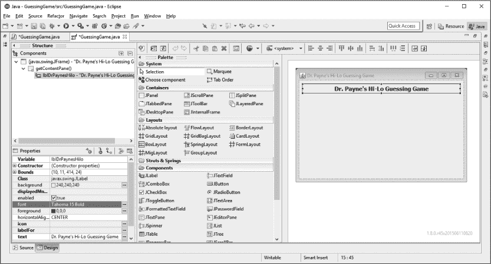

*图 3-11：第一个标签，已经自定义并放置在内容面板顶部。*

接下来，为用户在游戏中看到的第一个提示添加一个标签。点击组件面板中的 **JLabel**，然后将新标签放置在内容面板的中部上方。输入标签的文本为 `猜一个 1 到 100 之间的数字：`。你需要稍微调整标签的宽度，使其比文本宽一些，以便有更多的填充空间。

在标签的右侧，我们放置一个文本框，供用户输入他们的猜测。点击组件面板中的 **JTextField**，然后将文本框放置在你刚刚放置的标签的右侧。

调整标签的大小，使其刚好能够容纳一个三位数的数字。再次点击标签，将其 `horizontalAlignment` 属性更改为 **RIGHT**，以将文本靠近文本框，如 图 3-12 所示。

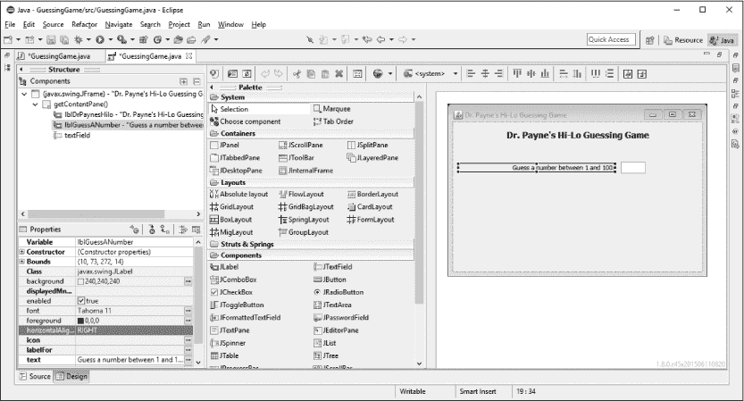

*图 3-12：现在，猜数字游戏有了一个标签和一个文本框，供用户输入猜测。*

接下来，让我们放置一个按钮，用户可以点击它来提交他们的猜测。在调色板中，找到并点击**JButton**。将鼠标移到 GUI 预览窗口的中间，然后点击放置`JButton`。将文本更改为`Guess!`。

最后，在按钮下方放置一个`JLabel`，设置文本为`Enter a number above and click Guess!`，并将标签的大小调整为`JFrame`的全宽。然后，将`horizontalAlignment`更改为**CENTER**。稍后，这个标签也将用于告知用户他们的猜测是太高、太低还是正确。各组件的对齐可能还不完美，但你的 GUI 布局应该类似于图 3-13。

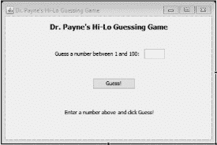

*图 3-13：GUI 布局包含了所有组件，只是尚未完全对齐。*

现在我们已经将所有 GUI 组件放置在屏幕上，准备对布局进行一些微调，以使其平衡并居中。首先，确保保存你的文件。

#### *对齐 GUI 元素*

到目前为止，我们一直在凭眼力定位 GUI 组件，尽力让它们正确间隔并尽量居中。然而，当我们运行程序时，我们期望布局是“完美的”。幸运的是，Eclipse 内置了帮助我们对齐组件的工具。

首先，让我们将四个主要元素均匀分布，垂直间隔相等。按住 SHIFT 键，点击选择三个标签和按钮。暂时不要点击用户输入猜测的文本字段。你应该会看到一排对齐工具出现在 GUI 预览窗口上方。将鼠标悬停在每个工具上，可以看到工具提示，告诉你该按钮的功能。如果一开始你没有看到所有工具，可能需要调整 Eclipse 窗口的大小。

点击看起来像是堆叠按钮的工具（图 3-14 中的最右侧图标）。此时，所有四个选中的项目应该会均匀地垂直分布。

现在，选择仅文本字段。将它移动并重新对齐，以与提示用户猜数字的标签对齐。我们最初没有包含文本字段，因为 Eclipse 会均匀分配所有五个组件，导致文本字段和其标签彼此分开，产生五行而不是四行。

*图 3-14：你可以使用 GUI 预览窗口上方的工具对组件进行对齐并均匀分布。*

**注意**

*如果你在使用 WindowBuilder 时对齐出了问题（或者做了其他任何操作），可以通过按 CTRL-Z 或* *-Z 来撤销上一个操作。这是 WindowBuilder 编辑器的一个非常实用的安全功能，可以让你尝试新的操作，而不必担心永久性破坏布局。*

最后，点击标有**Guess!**的按钮，并点击 GUI 预览上方的对齐按钮（靠右侧，工具提示为“在窗口中水平居中”）。你可以根据需要居中或调整其他组件的位置。如果你想一起移动两个或更多组件，可以按住 SHIFT 键并点击选择它们，然后点击并拖动它们。

当你对布局感到满意时，就可以准备开始编程了，首先为组件命名。花一点时间保存你所做的更改。

#### *为编程命名 GUI 组件*

猜数字游戏应用的用户界面已经为玩家准备好。然而，为了让应用更加易于操作，我们需要在 Java 源代码文件中进行一些最终调整，在那里我们将编程完成其余部分的游戏。我们需要为每个组件命名，这样在源代码中我们就可以轻松地引用它们。

这个步骤有时被称为“接线”，因为我们将连接程序中需要的每个 GUI 组件到我们可以在 Java 源代码中访问的变量名。Eclipse 在我们添加组件时已经为每个 GUI 元素命名，但我们需要修改这些名称。选择用户输入猜测的文本框。如果你查看属性面板，你会看到最顶部的属性是 `Variable`。Eclipse 默认为你第一个文本框指定的变量名可能是类似 `textField` 的名称。点击 `Variable` 属性旁边的值字段，并将该文本框的变量名更改为 `txtGuess`，如图 3-15 所示。

*图 3-15：为每个 GUI 元素重命名变量，以便我们可以在 Java 源代码中轻松使用它们。*

名称`txtGuess`将提醒我们它是一个文本框，并且它用于存储用户的猜测。你会发现，给 GUI 组件命名时保持一致性和逻辑性会帮助你更快速、高效地编码，并减少错误。

重命名文本框后，选择 GUI 窗口底部的标签，该标签显示“Enter a number above and click Guess!”。这个标签将输出供用户阅读的信息，比如 `Too high`（太高）、`Too low`（太低）或 `You win!`（你赢了！）。因此，我们将该变量重命名为 `lblOutput`。这个名称将帮助我们记住它是一个 GUI 标签（`lbl`），并且它是我们用来显示用户信息的输出标签。

在 WindowBuilder 编辑器窗口的左下角的 Source 标签中，你会看到 Eclipse 已经开始为你设计的 GUI 布局编写 Java 源代码（见图 3-16）。

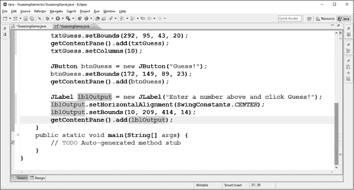

*图 3-16：点击“Source”标签页，你会看到 Eclipse 已经为我们用 Java 编写了 GUI 组件的代码。*

请注意，你为文本框（`txtGuess`）和输出标签（`lblOutput`）所命名的新变量名称在源代码中是可见的。现在是时候保存文件，保存迄今为止所做的所有更改了。

在我们开始编写猜数字游戏应用的代码之前，我们需要对源代码进行一些调整。

#### *将 GUI 连接到您的 Java 代码*

滚动到`GuessingGame`类的顶部，你会看到 Eclipse 已在`GuessingGame`类的顶部声明了`JTextField txtGuess`：

public class GuessingGame extends JFrame {

private JTextField txtGuess;

Eclipse 默认会为文本框这样做，原因是显而易见的。将文本框声明在类的顶部使得可以从类的*任何位置*访问该文本框（例如查看用户的猜测是否过高或过低）。文本框通常是这样使用的，因此 Eclipse 在`GuessingGame`类的顶部声明了一个`private JTextField txtGuess`，而不是在类的其他方法或函数中声明。`private`修饰符作为面向对象编程的*最佳实践*（推荐的做法）被使用。将某些东西设置为`private`可以防止其他类看到该部分代码。由于`txtGuess`是`private`的，除`GuessingGame`外的其他类将无法访问它或意外更改`txtGuess`变量，这是我们想要的。

在这个猜数字游戏应用中，我们希望能够访问用户输入到`txtGuess`文本框中的值，所以 Eclipse 将它声明在类的顶部是很有帮助的。我们还希望访问标签`lblOutput`，以便能够更改显示给用户的文本（当他们的猜测太高、太低或正确时）。因此，我们需要在类的顶部，再加一个声明，紧接着`txtGuess`的声明：

public class GuessingGame extends JFrame {

private JTextField txtGuess;

private JLabel lblOutput;

这一行代码声明了`lblOutput`作为一个变量，它指向应用程序 GUI 布局中的`JLabel`对象。我们选择将这个对象引用设置为`private`，以便将此数据隐藏在外部程序之外，但我们仍然可以在`GuessingGame`类中使用它。

最后一个更改是修正`lblOutput`最初声明的位置，该位置在类的底部。找到代码中类似以下的行：

JLabel lblOutput = new JLabel("请输入一个数字并点击猜测！");

并将其更改为：

lblOutput = new JLabel("请输入一个数字并点击猜测！");

注意我们已经移除了额外的`JLabel`声明。如果你在程序中保留第二个`JLabel`声明，应用程序将无法正常工作，因为你已经在类的顶部声明了`lblOutput`为`JLabel`类型。如果你保留第二个`JLabel`声明，Java 会认为你打算有两个独立的名为`lblOutput`的`JLabel`对象。通过移除第二个`JLabel`声明，你是在告诉 Java 使用你在程序顶部创建的*唯一的*`JLabel lblOutput`，并用文本值`"请输入一个数字并点击猜测！"`初始化它。

在我们声明`GuessingGame`类的顶层变量时，让我们再添加一个重要的变量：`theNumber`。记住，在基于文本的游戏版本中，这就是我们为用户要猜测的秘密随机数字命名的变量。请在`txtGuess`和`lblOutput`后面添加`theNumber`的声明，如下所示：

public class GuessingGame extends JFrame {

private JTextField txtGuess;

private JLabel lblOutput;

private int theNumber;

现在我们已经正确地在类的顶部声明了变量，准备开始编写猜数字游戏应用程序的 GUI 版本代码。在接下来的部分中，你将学到如何从 GUI 文本框获取用户的猜测，并检查它是否过高或过低。我们还将显示 GUI 标签`lblOutput`中的输出文本，帮助用户做出下一个猜测。

### 添加一个方法来检查玩家的猜测

现在，GUI 已经通过我们添加的私有变量`txtGuess`和`lblOutput`与 Java 源代码连接起来，我们将开始编写猜数字游戏的逻辑代码。

让我们在`GuessingGame`类的顶部写一个名为`checkGuess()`的方法。这个方法的签名，或者说框架，应该像这样：

public class GuessingGame extends JFrame {

private JTextField txtGuess;

private JLabel lblOutput;

private int theNumber;

public void checkGuess() {

}

请注意，方法被声明为`public`。类中的变量通常声明为`private`，但操作这些变量的方法或函数通常声明为`public`，这样其他类可以调用它们。你可以把它想象成你的支票账户。你的余额是私人信息，只有你或银行可以访问，但存款功能是公开的（其他人可以向你的账户存款）。

第二个术语`void`告诉 Java 我们不期望从这个函数返回一个*返回*值，即函数或方法输出的值。例如，一个将华氏温度转换为摄氏温度的转换计算器`convertFtoC()`可以接受一个表示华氏温度的值，并返回一个表示转换后摄氏温度的数值。在这个猜数字游戏应用程序中，`checkGuess()`方法不会将此类信息返回给程序的其他部分。相反，我们将编写程序，通过图形用户界面显示信息给用户，因此我们使用`void`返回类型，它不返回任何值。

最后，我们将方法命名为`checkGuess()`，并提供了包含代码的开闭大括号，代码将告诉程序我们如何检查用户的猜测。

#### *从 JTextField 获取文本*

让我们开始构建`checkGuess()`方法，该方法将获取用户输入的字符串，并与要猜测的数字进行比较。请在`checkGuess()`方法的两个大括号之间添加以下代码：

public void checkGuess() {

String guessText = txtGuess.getText();

}

这一行创建了一个新的`String`变量，名为`guessText`，用于保存用户在 GUI 文本框中输入的数字。为了获取用户输入的文本，我们需要使用`getText()`方法，调用`txtGuess.getText()`并将结果存储在新的字符串变量`guessText`中。

当你在`txtGuess`后添加点操作符（`.`）时，你可能会看到一个窗口弹出，显示你正在输入的内容，如图 3-17 所示。

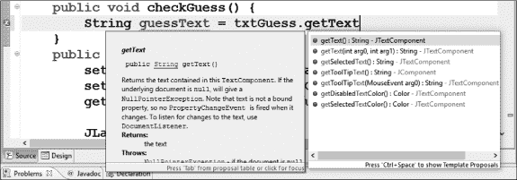

*图 3-17：在你输入`txtGuess`和点操作符（*.*）后，可能会看到一个有用的代码推荐窗口弹出。*

这被称为*内容助手*—Eclipse 正试图通过建议代码行来帮助你完成当前的语句。这种特殊类型的内容助手也叫做*代码推荐器*，因为它推荐常见的代码选项，比如当前类或对象中的方法。代码推荐是使 Eclipse 成为一个强大 IDE 的功能之一，它对专业 Java 开发者尤其有用。在大多数情况下，选择代码推荐器的建议不仅更快，而且还能帮助防止错误，提高程序员在开发复杂应用时的效率。

现在，我们需要创建一个字符串来保存告诉用户他们的猜测是过高、过低还是正确的信息。让我们再声明一个字符串：

public void checkGuess() {

String guessText = txtGuess.getText();

String message = "";

}

我们还不知道用户的猜测是过高还是过低，因此我们将`message`初始化为空字符串，使用一对双引号（`""`）。在我们将用户的猜测与随机数`theNumber`进行比较后，我们将更新这个字符串，添加更多信息，然后将其输出到 GUI 标签中。为了测试用户的猜测，我们需要将他们输入的文本（当前存储在`guessText`中）转换为数字形式，以便与`theNumber`进行比较。

#### *将字符串转换为数字*

在我们在第二章中制作的基于文本的版本的这个应用中，我们使用了一个`Scanner`对象从用户输入的键盘文本中扫描数字值。扫描器可以在 GUI 中使用，但有一种更简洁的方法可以做到这一点，适用于这个版本。

就像`Math`类有`Math.random()`可以生成随机数一样，`Integer`类也有多个函数用于处理整数，包括一个查找字符串中整数的方法`Integer.parseInt()`。在`String message = ""`下面输入以下代码行。

public void checkGuess() {

String guessText = txtGuess.getText();

String message = "";

int guess = Integer.*parseInt*(guessText);

}

首先，这一行声明了`guess`为一个整数变量。接着，它从用户输入的文本中搜索或*解析*出一个整数。例如，字符串`"50"`将变成*数字*`50`。最后，它将数字存储到变量`guess`中。我们需要用户猜测的数字版本，以便使用比较运算符`<`和`>`与`theNumber`进行比较。

有了存储在变量`guess`中的用户猜测，我们准备将其与计算机的秘密随机数字`theNumber`进行比较。我们还没有编程让`theNumber`保存一个值，但我们很快就会做这件事。比较猜测与`theNumber`的过程将与文本版本的游戏类似，只是我们不会使用`System.out.println()`打印到控制台。相反，我们会将输出存储到我们创建的字符串变量`message`中：

String guessText = txtGuess.getText();

String message = "";

int guess = Integer.*parseInt*(guessText);

if (guess < theNumber)

message = guess + " 太低了。再试一次。";

else if (guess > theNumber)

message = guess + " 太高了。再试一次。";

else

message = guess + " 正确。你赢了！";

}

请注意，三个`if-else`语句几乎与文本版游戏中的完全相同，唯一的区别是我们将输出`message`（太高、太低或正确）存储在变量中，而不是直接输出到控制台窗口。我们仍然需要将`message`展示给用户，因此我们将使用`lblOutput` GUI 标签来做到这一点。我们将使用`setText()`方法，如下所示：

else

message = guess + " 正确。你赢了！";

lblOutput.setText(message);

}

该命令将在 GUI 窗口中通过将`JLabel`名为`lblOutput`的文本属性更改为正确的`String`变量`message`来显示输出消息，基于用户的猜测。

你的完整`checkGuess()`代码应该如下所示：

public void checkGuess() {

String guessText = txtGuess.getText();

String message = "";

int guess = Integer.*parseInt*(guessText);

if (guess < theNumber)

message = guess + " 太低了。再试一次。";

else if (guess > theNumber)

message = guess + " 太高了。再试一次。";

else

message = guess + " 正确。你赢了！";

lblOutput.setText(message);

}

接下来，我们需要编写代码来为`theNumber`分配一个随机值。我们将使用`newGame()`方法，因为每次用户开始新游戏时，我们都想生成一个新的随机数。

### 开始一个新游戏

我们希望在每次新一轮猜谜游戏开始时，计算机能选择一个新的、秘密的随机数字，所以在`GuessingGame`类中使用一个方法来实现这一点是有意义的。通过这种方式，我们可以在每次用户获胜并想要开始新游戏时调用该方法。

`newGame()`方法的签名看起来与`checkGuess()`方法相似。将其放置在`checkGuess()`方法的闭合括号后面，`public GuessingGame()`前面：

lblOutput.setText(message);

}

public void newGame() {

}

public GuessingGame() {

我们将这个方法设为`public`，这样它就可以从外部类中调用。我们还需要告诉 Java，和`checkGuess()`方法一样，这个方法没有需要返回的信息，因此它的返回类型是`void`。最后，这个方法的名称是`newGame`，并且它包括一对圆括号`()`。目前方法体为空，括号之间没有内容，但我们接下来会解决这个问题。

在这个应用程序中，创建一个新游戏意味着我们告诉计算机选择一个新的随机数字。将这个随机值赋给`theNumber`的代码与文本版游戏中的代码相同，唯一的不同是现在我们将代码放入了一个独立的方法中。因此，完成后的`newGame()`方法应该如下所示：

public void newGame() {

theNumber = (int)(Math.*random*() * 100 + 1);

}

就这样！现在我们已经将所有必要的部分都准备好来构建一个功能齐全的猜数字游戏应用程序，所以我们只需要将它们连接到 GUI 界面。只要应用程序能够监听用户事件并响应用户点击“猜测！”按钮，我们就可以准备运行游戏了！

### 监听用户事件：点击进行猜测！

在运行应用程序之前，我们需要完成的最后一步是将“猜测！”按钮（`btnGuess`）与检查用户猜测的函数`checkGuess()`连接起来。通过 Java，我们可以使用*事件监听器*来完成这一任务。事件监听器只是告诉程序等待或*监听*用户交互的*事件*，如按钮点击、鼠标移动或键盘输入等。

通过点击“设计”标签，返回到应用程序的 GUI 预览界面。在 GUI 预览窗口中，找到“猜测！”按钮，如图 3-18 所示，并双击它。

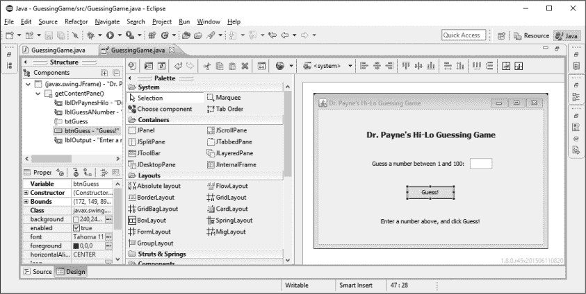

*图 3-18：在设计视图中，双击“猜测！”按钮以将事件监听器添加到代码中。*

双击“猜测！”按钮会自动打开源代码标签，在那里你会看到 Eclipse 已经添加了新的代码。这个新代码是一个事件监听器的框架——在这种情况下，是一个处理用户在`JButton btnGuess`上执行操作时触发的事件的`ActionListener()`。在这里，操作是点击按钮。

Eclipse 已经添加了除我们希望在用户点击按钮时执行的操作之外的所有内容。让我们看看 Eclipse 为我们创建的事件监听器代码。

JButton btnGuess = new JButton("Guess!");

➊ btnGuess.addActionListener(new ➋ActionListener() {

➌ public void actionPerformed(ActionEvent e) {

}

});

btnGuess.setBounds(172, 149, 89, 23);

getContentPane().add(btnGuess);

`ActionListener()`事件监听器，专门处理按钮点击事件，通过`addActionListener()`方法与`btnGuess`按钮相连接，如图➊所示。接下来的几行代码都写在`addActionListener()`函数的括号内。

在`addActionListener()`方法内部，首先看到的是关键字`new`，这让我们知道 Eclipse 正在创建一个新的`ActionListener`类的对象，位于➋处。然而，和我们以前见过的对象不同的是，这个新对象是一个*匿名内部类*，意味着它没有变量来引用它，并且完全在`GuessingGame`类内部创建。匿名内部类可以帮助我们更快地编写代码，因为我们不需要为处理像按钮点击这样的短小快速事件而创建一个完全独立的类。相反，我们可以直接在创建按钮的地方插入事件处理器代码。在这个例子中，`ActionListener`将仅监听按钮点击事件，所以它非常适合用作匿名内部类。

Eclipse 创建了匿名内部类的框架，但我们仍然需要编写按钮的行为代码。接下来的代码将放入`actionPerformed()`方法的花括号内，位于➌处。`actionPerformed()`方法是我们描述当用户点击`btnGuess`时应用程序应该做什么的地方。该方法接受一个`ActionEvent`作为参数，这是监听器监听的事件或用户操作。在此情况下，我们将`ActionEvent e`命名为变量，但你可以使用任何你喜欢的变量名。当用户输入猜测并点击“猜测！”按钮时，该操作会被赋值给`e`，我们需要使用之前创建的`checkGuess()`方法来检查他们的猜测：

btnGuess.addActionListener(new ActionListener() {

public void actionPerformed(ActionEvent e) {

checkGuess();

}

});

多亏了 Eclipse，我们唯一需要添加的是`checkGuess();`命令。自动代码补全功能帮助我们节省了时间，避免了拼写错误。

有了这一部分代码，现在我们只需要告诉应用程序在启动时应该做什么。花点时间保存到目前为止的工作。

### 设置 GUI 窗口

在第一次运行游戏之前，我们需要告诉程序如何设置 GUI 窗口。这包括构建 GUI 界面，通过调用`newGame()`方法开始一个新游戏，以及设置窗口的所需宽度和高度。

在文件底部`main()`方法的花括号内，添加以下代码行：

public static void main(String[] args) {

➊ GuessingGame theGame = new GuessingGame();

➋ theGame.newGame();

}

}

➊处的这行代码创建了一个新的`GuessingGame`，名为`theGame`。➋处的代码将启动一个带有新随机数的猜数字游戏。

现在，让我们告诉 Java 我们希望窗口的大小。对于一个 GUI 桌面应用程序，我们可以使用`setSize()`方法指定应用程序窗口的大小，输入我们希望创建的窗口的宽度和高度。

public static void main(String[] args) {

GuessingGame theGame = new GuessingGame();

theGame.newGame();

theGame.setSize(new Dimension(450,300));

`setSize()`方法需要一个`Dimension`类型的参数，该类型内置在`java.awt`库中（`.awt`是*抽象窗口工具包*的缩写）。`setSize()`括号中的`new Dimension()`告诉 Java 创建一个`Dimension`类型的对象，宽度和高度参数分别为 450 像素宽和 300 像素高。但我们还没有导入`java.awt`库，这意味着 Eclipse 不知道`Dimension`指的是什么，所以你的 Eclipse 编辑器会通过用红色下划线标出类名`Dimension`来告诉你这里有错误。如果你在编辑器中点击`Dimension`，Eclipse 会向你显示一系列快速修复选项，如图 3-19 所示。（如果你无法弹出快速修复选项，可以按 CTRL-1 或者-1，光标放在`Dimension`上后再尝试。）

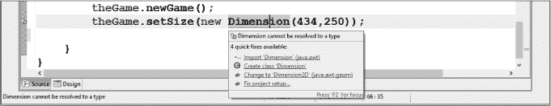

*图 3-19：Eclipse 为我们输入的新代码推荐了快速修复选项；选择顶部选项以导入正确的类。*

我们想要使用`java.awt`包中已经提供的`Dimension`类，因此最上面的快速修复选项，**导入 'Dimension' (java.awt)**，是当前情况的正确选择。点击它，Eclipse 会将`java.awt.Dimension`添加到文件顶部的导入类列表中。

import javax.swing.JFrame;

import javax.swing.JLabel;

import javax.swing.SwingConstants;

import java.awt.Dimension;

import java.awt.Font;

import javax.swing.JTextField;

最后，在`main()`方法中添加这一行代码，使应用程序在屏幕上可见：

theGame.setSize(new Dimension(450,300));

theGame.setVisible(true);

}

该命令在`GuessingGame`对象`theGame`上调用了`setVisible()`方法。记住，`GuessingGame`继承了`JFrame`类，因此`theGame`也是`JFrame`父类的*子类*。我们希望将主`JFrame`（它承载了猜数字游戏的 GUI 版本）的可见性属性设置为`true`，这是一个布尔值。

只有两个*布尔值*，`true`和`false`（都用全小写字母拼写），它们用于布尔表达式。*布尔表达式*是任何可以被评估为`true`或`false`的参数集合。我们在`checkGuess()`方法中使用的`if`语句，比如表达式`(guess < theNumber)`，就是我们已经看到的一个例子。当我们评估这个表达式并检查`guess`是否小于`theNumber`时，表达式的值要么为`true`（意味着`guess`小于`theNumber`），要么为`false`（`guess`不小于`theNumber`）。这个布尔表达式的结果决定了`if`语句后面的语句是否会执行。

`GuessingGame`类的完整`main()`方法如下：

public static void main(String[] args) {

GuessingGame theGame = new GuessingGame();

theGame.newGame();

theGame.setSize(new Dimension(450,300));

theGame.setVisible(true);

}

### 游戏时间！

在代码完成后，现在是时候保存*GuessingGame.java*文件了。保存后，点击运行按钮或从菜单中选择**Run** ▸ **Run**。游戏窗口将会出现。

尝试输入一些猜测，看看应用程序是否正常工作。在你玩游戏的时候，检查每个组件，确保它们都能正常工作。一定要测试“猜测！”按钮、底部的标签和文本框。如果发现问题，回去检查你的代码。注意错误发生的时间或位置，以便缩小问题的来源。随着你学习编码，你会更擅长发现错误。图 3-20 展示了应用程序在正常工作时的样子。

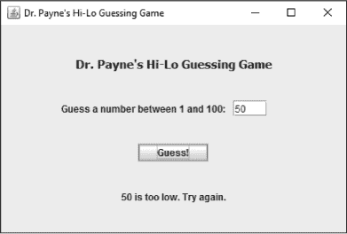

*图 3-20： “猜测！”按钮工作正常！*

当你的游戏可以顺利进行到底时，你就准备好迈向下一步了。

现在，游戏是可以玩的，但只有在你赢得一局时。当前版本的应用程序没有代码告诉 Java 在我们赢得当前游戏后开始新游戏。

首先，让我们设置一个机制，即使赢了一局，我们也可以继续玩游戏，然后我们会对用户界面进行一些调整，以提供更好的用户体验。

### 添加重新游戏功能

就像我们在第一版文字游戏中做的那样，让我们添加一个重新游戏功能。我们已经创建了一个`newGame()`方法，但我们只在应用程序的`main()`方法中调用它来设置游戏的初始显示。

我们需要修改 GUI 或改变应用程序的行为。我们可以添加一个重新游戏按钮，用户点击它来玩下一轮，或者我们可以让应用程序每次用户赢得一局时，自动开始新游戏。

添加重新游戏按钮的好处是，从用户的角度来看，它非常容易理解。然而，我们不希望重新游戏按钮在 GUI 窗口中一直可见，因为它只在用户获胜时才需要。一个选择是添加一个按钮，但在游戏进行时让它不可见，只有在用户获胜时才显示出来。为了保持游戏的简单性，我们这里不会实现这一点，但如果你有兴趣尝试，请参阅第 73 页的编程挑战#2。

我们不打算添加按钮，而是改变应用程序的行为，使得用户赢得当前回合后，系统自动选择一个新数字。这只需要修改程序中的一个部分，即处理用户猜测与随机数字匹配的`else`语句。如果用户赢得了当前回合，新的回合应该自动开始。这是合乎直觉的——不需要额外的按钮，也不需要做决定。如果玩家决定不再玩，他们可以简单地关闭窗口。我们将通过修改以下几行来实现这一行为：

else

message = guess + " 是正确的，你赢了！";

我们将调用`newGame()`来开始新游戏。为了将对`newGame()`方法的调用添加到此`else`语句中，我们将两个语句（设置`message`变量和调用`newGame()`）组合在一起，形成一个代码块，如下所示：

else {

message = guess +

" 是正确的。你赢了！再来一局！";

newGame();

}

大括号将这两条语句组合成一个代码块，以便每当`else`语句被选为正确的程序路径时一起执行。如果没有大括号，只有`else`语句后面的第一行会被执行，`newGame()`方法将在`if-else`语句评估后运行。这样会导致游戏在每次用户尝试猜测时都更改秘密数字。

另外请注意，我们在消息字符串的末尾添加了`Let's play again!`。这让用户知道，只需通过猜测就能再次开始游戏，并且可以期待计算机在每轮游戏中选择一个新数字。做出这些更改，保存程序，并重新运行它，看看游戏的新版本！

### 改进用户体验

在玩游戏时，你可能会注意到一些可以使用户界面更好的游戏元素。例如，如果我们可以让应用程序在用户点击“Guess!”按钮或按下键盘上的 ENTER 键时接受新猜测，那将提供更自然、直观的*用户体验 (UX)*。

另一个问题是，当我们想猜一个新数字时，我们必须高亮并选择旧数字（或者，按 DELETE 或 BACKSPACE 键）来清除之前的猜测。我们还需要点击回到文本框，因为焦点会切换到“Guess!”按钮。为了改进用户界面，我们可以在每次猜测后让光标返回文本框，并自动高亮或删除之前猜测的文本，这样新猜测就会替换旧的。

现在我们来解决这两个问题。

#### *允许用户按 Enter 键进行猜测*

我们将进行的第一个改进是允许用户按 ENTER 键

提交猜测。首先，转到设计标签，右击“Guess!”按钮。在弹出的菜单中，选择**添加事件处理程序** ▸ **action** ▸ **actionPerformed**。

就像我们为`btnGuess`创建事件处理程序时一样，Eclipse 会自动为`txtGuess`创建一个操作监听器，如下所示的代码片段。正如我们之前所做的，我们将在此代码的`actionPerformed()`部分的花括号内添加`checkGuess()`方法。我们通常希望在文本框内处理的唯一操作事件是用户按下 ENTER 键。

txtGuess.addActionListener(new ActionListener() {

public void actionPerformed(ActionEvent e) {

checkGuess();

}

});

添加此行后，保存文件并重新运行。现在当我们按 ENTER 键时，它会激活`checkGuess()`方法。“Guess!”按钮仍然有效，因此用户可以选择仅通过键盘或鼠标进行交互。

#### *自动移除旧的猜测*

现在，让我们解决必须重新点击文本框来删除旧猜测的问题。为了解决这个问题，我们需要学习几个新的方法来操作像 `txtGuess` 这样的 `JTextField` 对象。

首先，我们必须考虑什么时候希望文本被选中。对于这个猜数字游戏，在用户的猜测被评估之后，可能是启用用户再次猜测的最佳时机。在代码中，这将是 `checkGuess()` 方法的末尾，因为我们希望它在用户进行一次猜测并准备进行下一次猜测后发生。

所以，我们知道需要在 `checkGuess()` 方法的末尾添加代码，把光标放回到 `txtGuess` 文本框，并选中用户上次猜测的文本。那么，如何知道哪些命令可以将光标放回文本框并选中所有文本呢？这是一个非常好的时机来使用 Eclipse 的内容辅助功能。输入对象的名称 `txtGuess`，然后加上点运算符（`.`），Eclipse 会显示出可用方法的列表，如图 3-21 所示。

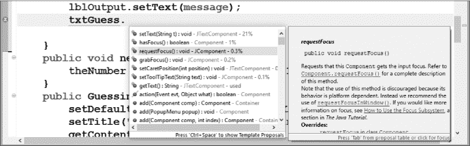

*图 3-21：内容辅助功能显示了 `JTextField` 类似 `txtGuess` 可用的所有方法*。

你会发现有许多方法可以用来操作 `JTextField` 类似 `txtGuess` 这样的组件，但我们需要的正是 `requestFocus()` 方法。这个函数的文档中写道：“请求该组件获取输入焦点。”在这种情况下，*焦点*指的是光标。这个方法正是我们需要的，每次用户再次猜测时，它会请求将光标放回到文本框中。

最后，我们希望选中用户上次猜测的所有文本，以便他们的新猜测能自动替换掉旧的猜测。要选中文本框中的所有文本，可以使用 `selectAll()` 方法，这个方法也会出现在 Eclipse 的内容辅助功能建议中。将这两行代码添加到 `checkGuess()` 方法的末尾，紧接在 `lblOutput.setText(message);` 之后，关闭大括号之前：

lblOutput.setText(message);

txtGuess.requestFocus();

txtGuess.selectAll();

}

现在是保存你的应用程序的好时机。当你再次运行游戏时，你应该会感受到更加顺畅、直观的用户体验。这个猜数字游戏终于拥有了一个优雅、易于使用的图形界面，提供了简单的用户体验。我们的游戏易于上手，但要精通却需要一些挑战。就像我们为了娱乐玩的一些游戏一样，但我们是从零开始构建这个游戏的，使用了 Java 和 Swing 工具包来实现专业的外观。

现在，我们有一个功能强大的应用程序，除了一个重要的方面：安全性。你可能会问：“什么？安全性？我以为我们只是在做一个有趣的图形界面游戏！”这没错——程序运行得很漂亮，但只有当用户正确输入他们的数字时，它才能正常工作。

如果用户的手指滑动，按下了 ENTER 键或点击了“猜测！”按钮，而他们还没有输入猜测会发生什么？如果他们输入了任何非整数的文本，比如`blah`，作为猜测会怎样？图 3-22 展示了当用户输入错误数据时，Eclipse 中发生的情况。

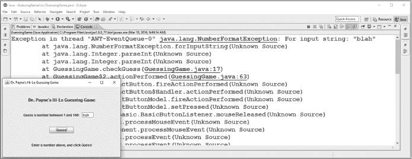

*图 3-22：当用户在文本框中输入错误数据（如 blah）时，坏事发生了。*

如你所见，我们的控制台窗口现在充满了错误。不良输入导致了一个*异常*——一个意外或有缺陷的编程情况。图 3-22 中的第一行输出告诉我们，出现了一个`NumberFormatException`，因为字符串`"blah"`没有被识别为数字。你需要学习如何在你创建的程序中处理异常。

### 处理不良用户输入

Java 提供了一种安全的方式来预见和处理异常，程序运行时可能发生的那些不良情况。除了我们刚刚讨论的不良用户输入外，异常还可能包括缺失的文件（文件被删除，或者你意外移除 USB 驱动器）或网络问题（比如缺失的连接或坏的服务器）。

我们把处理异常的代码称为*异常处理器*。异常处理器处理特殊情况。那么，我们怎么知道何时可能发生异常呢？我们必须预测程序运行时可能发生的所有坏事吗？

许多可能出现错误的情况是特定类型的事件，比如用户输入、文件输入/输出或网络访问。例如，想一想我们之前列出的异常。不良的用户输入可能发生在任何需要用户输入特定类型数据的时候。缺失的文件可能在我们读取或写入文件时成为问题；例如，在照片应用程序中查看和保存图片时。如果我们能够预测可能发生的异常，并编写异常处理器来应对这些异常，我们的代码将更安全，能更有效防止恶意黑客通过输入错误数据来崩溃程序，同时也会更加可靠。

在猜数字游戏的情况下，异常发生在我们要求用户输入一个数字时，但他们却输入了文本。具体来说，异常是在我们尝试从一个不包含整数的字符串中解析整数时触发的。用户输入是异常的常见来源，既包括意外情况，也包括故意为之。后者的一个例子是黑客试图破坏你的程序。

Java 给了我们一种干净的方式来处理异常，通过 `try-catch` 语句。`try-catch` 块的思想是，我们希望程序*尝试*做一些我们知道可能引发异常的事情，并*捕捉*，或处理，可能发生的异常，而不是让它中断程序。`catch` 块只在发生异常时执行。

`try-catch`的最后一部分是可选的`finally`块。在一个`try-catch-finally`语句中，`finally`块*总是*会执行，如果它被提供的话，无论是否有异常发生。如果没有异常，`finally`块将在`try`块结束后执行。如果发生异常，`finally`块将在`catch`块完成后执行。

`try-catch`的格式通常是这样的（不要把它输入到你的代码中；这只是格式的示例）：

try {

// 可能导致异常的事情，比如输入无效内容

} catch (Exception e) {

// 处理或恢复异常，例如要求用户输入有效的内容

} finally {

// 任何收尾代码；无论是否有异常，这部分总会最后执行

}

注意我们像处理`if-else`语句和循环语句一样，用花括号将`try-catch-finally`语句的每个部分括起来。`catch`部分需要一个`Exception`参数；这可以是一个特定的异常，比如`NumberFormatException`，或者我们也可以使用基类`Exception`。这个参数将接收关于`Exception`的信息，比如异常发生在哪一行。

为了在我们游戏的代码中正确放置`try-catch-finally`块，我们需要思考异常可能发生的位置（并将该代码包裹在`try`块中）、如果发生异常时我们想做什么（并将其放在`catch`块中），以及在`try`或`catch`块执行完毕后我们想做什么（这部分放在`finally`块中）。

因为我们在尝试从用户输入的文本中解析整数时遇到了输入问题，我们想要将这段代码包装在一个`try`块中。我们将`try`关键字和一个左花括号放在解析整数的那一行之前：

public void checkGuess() {

String guessText = txtGuess.getText();

String message = "";

try {

int guess = Integer.*parseInt*(guessText);

if (guess < theNumber)

如果用户没有输入一个数字，我们就无法测试是否过高或过低，因此`try`语句将一直延续到这对`if-else`语句的结尾。将`try`块的右花括号放在`else`语句的右花括号之后，如下所示。接下来是`catch`关键字。在这个游戏中，如果用户输入无效内容，我们只希望提示他们输入一个介于`1`和`100`之间的整数。我们可以通过稍后显示在`lblOutput`中的`message`字符串来做到这一点。因此，`catch`块应如下所示：

else {

message = guess +

" 是正确的。你赢了！再玩一次吧！";

newGame();

}

} catch (Exception e) {

message = "请输入一个介于 1 和 100 之间的整数。";

}

无论是否发生异常，我们想要执行的最后一步是显示输出信息，请求文本框获取焦点，并选择所有文本，为下次输入做准备。这三条语句会放在`finally`块中，位于我们刚才添加的`catch`语句的闭括号之后：

} finally {

lblOutput.setText(message);

txtGuess.requestFocus();

txtGuess.selectAll();

}

}

public void newGame() {

你可能会注意到，每个`try-catch-finally`块中的语句都有缩进，以便让代码更易于阅读。记住，在 Eclipse 中有一个快捷键，在你做出任何更改后会自动正确缩进所有代码。只需选择所有代码，然后进入 **Source** ▸ **Correct Indentation**。

保存你的应用并多次运行，测试用户界面。测试一些非整数，确保异常处理按预期工作。如果遇到阻止文件编译的错误，检查大括号。当我们给现有代码加上块时，大括号是最先检查的地方。一旦你的`try-catch-finally`语句到位，你的 GUI 猜谜游戏应用就变得更可靠、更可预测、更安全了。

安全编程不仅仅是一种美好的做法——它往往是编写良好软件的关键部分。对于我们的猜谜游戏来说，糟糕的代码似乎并不会带来严重后果。但想一想在医疗设备、卫星、汽车、飞机或为你家和城市提供电力的电网中运行的代码。安全的代码对我们的安全至关重要。即便是运行不安全代码的小型游戏或应用程序，也可能暴露你的数据给黑客。安全编程始终是明智的做法。

### 你学到了什么

在猜谜游戏应用的 GUI 版本中，我们通过以下方式提升了 Java 技能：

• 通过导入`javax.swing`包创建 GUI 窗口

• 在 Eclipse 中设置 GUI 应用

• 使用 WindowBuilder 编辑器设计 GUI

• 使用属性面板修改 GUI 组件的属性

• 为了便于在 Java 代码中使用，一致地命名 GUI 组件

• 将 GUI 元素连接到 Java 变量和编程代码

• 从`JTextField`获取用户输入的文本并在程序中使用

• 监听用户事件，比如按钮点击

• 通过以用户为中心测试应用程序，提升用户体验（UX）

• 使用`try-catch-finally`处理异常

### 编程挑战

通过这些挑战回顾并实践你所学到的知识，并通过尝试新事物来扩展你的编程技能。如果你遇到困难，可以访问 *[`www.nostarch.com/learnjava/`](https://www.nostarch.com/learnjava/)* 查看示例解决方案。

#### *#1：显示用户尝试了多少次*

尝试修改获胜信息，告知用户他们获胜时花了多少次尝试，如下所示：

62 是正确的！你在 7 次尝试后赢了！

为了完成这个任务，你需要创建一个新变量（例如`numberOfTries`）来存储用户猜测的次数，每次`checkGuess()`方法成功运行时增加尝试次数，并在用户获胜时显示猜测次数。

作为替代版本，你可以从七次或八次尝试开始游戏，每次用户猜测后减少一次尝试。当最后一次猜测用完时，你可以告诉用户他们输了，显示正确的数字，并开始新游戏。试试看吧！

#### *#2：显示和隐藏“重新开始”按钮*

当我们为本章的猜测游戏构建 GUI 时，我们决定不包括“重新开始”按钮，因为它在不使用时会让界面显得杂乱，并且它实际上只在游戏结束时需要。事实证明，我们可以使用`setVisible(false)`方法隐藏 GUI 组件。然后，我们可以像对待`JFrame`一样，通过`setVisible(true)`再次显示它。

首先，我们可以在 GUI 布局中添加一个“重新开始”按钮，命名为`btnPlayAgain`。在按钮创建后的代码中，我们可以调用`btnPlayAgain.setVisible(false)`来隐藏按钮。在`checkGuess()`中的获胜`else`语句里，我们可以调用`btnPlayAgain.setVisible(true)`来显示按钮，而不是开始一个新游戏。写完这些代码后，记得在 GUI 预览中双击按钮，添加事件监听器，在监听器中调用`newGame()`，然后再次隐藏按钮。

在你开始之前，有一点需要注意：与其他按钮（`btnGuess`）不同，你需要在代码的多个地方更改`visible`属性来隐藏和显示按钮。和`txtGuess`、`lblOutput`一样，你需要在类的顶部声明`private JButton btnPlayAgain`，但要确保在下面的代码中不要重新声明该按钮。

当你实现它时，游戏应该以隐藏“重新开始”按钮开始，按钮应在你赢得游戏时显示。当你点击按钮时，一个新游戏将开始，按钮再次消失。用按钮玩这个游戏，如果你想到任何可以改善用户体验的地方，尽管尝试！

#### *#3：创建一个 GUI MadLib*

回顾一下你在第二章中构建的*MadLibs.java*程序（第 41 页的编程挑战 #3），并创建一个新的*MadLibGUI.java*应用，提示用户在图形用户界面中输入几个单词，界面包含标签和文本框，如`txtColor`、`txtPastTenseVerb`、`txtAdjective`和`txtNoun`。添加一个按钮，用户可以按下它生成一个 MadLibs 风格的故事。

在 WindowBuilder 编辑器中，探索并尝试更多 GUI 元素的属性，包括背景颜色、字体、初始文本值等等。当用户点击按钮时，程序应该在`JLabel`或`JTextArea`中显示完成的 MadLibs 故事，正如 图 3-23 所示。

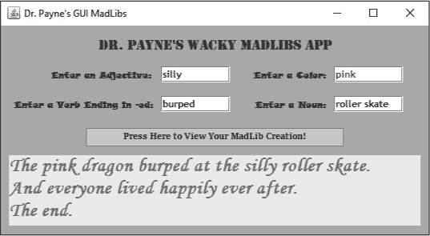

*图 3-23：一个 GUI MadLibs 应用*
