## ## 创建你的第一个 Android 应用

为了构建 Hi-Lo 猜数字游戏的移动版本，我们将使用 Android Studio。如果你没有在第一章中设置它，返回到 “为移动应用开发安装 Android Studio”（第 8 页）并进行设置。与游戏的图形界面版本一样，我们将为应用创建一个用户界面，如图 4-1 所示。到目前为止，你创建的应用只能在桌面计算机上运行，但 Android 应用可以在任何 Android 设备上运行，包括手机、平板、手表、电视等。如果你没有 Android 设备，不用担心——你仍然可以为 Android 编写代码，因为 Android Studio 附带的 Android 模拟器允许你模拟设备运行。

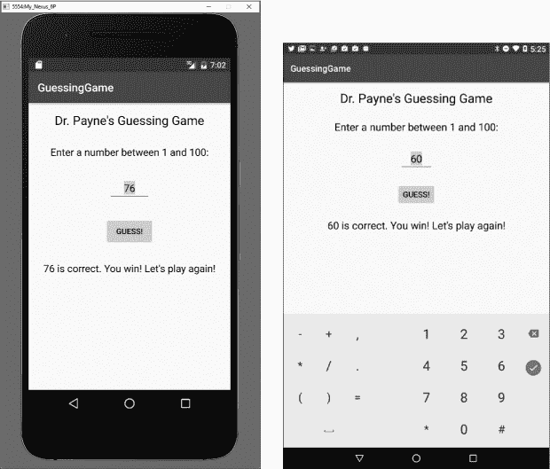

*图 4-1：这个猜数字游戏将在本章变成一个移动应用。该应用在模拟的 Android 手机（左）和实际的 Android 平板（右）上运行。*

图 4-1 显示了我们的应用在 Android 模拟器上运行，模拟应用在 Nexus 6P 上的样子，以及在 Android 平板上的样子。两个版本都在运行相同的代码——更方便的是，我们可以重用为前一个桌面版本编写的大量 Java 代码，因为 Android 是基于 Java 构建的！

请注意，模拟器和实际设备非常相似，只有一些细微的差异，以适应手机和 7 英寸平板之间的屏幕大小不同。就像你可以为 Windows 编写 Java 应用并在 macOS 或 Linux 上运行一样，你也可以用 Java 编写 Android 移动应用，并在成千上万的 Android 设备上运行。让我们开始构建你的第一个 Android 移动应用吧！

### 启动一个新的 Android Studio 应用项目

第一次启动 Android Studio 时，可能需要几分钟来更新和运行。当它启动时，你将看到如图 4-2 所示的界面。选择标有**启动一个新的 Android Studio 项目**的选项。

为你的新项目命名为*GuessingGame*，不使用空格。如果你有网站，可以在公司域名字段中输入它，如图 4-3 所示。否则，保持默认的示例域名。接下来，选择一个项目位置。我设置了一个名为*AndroidProjects*的文件夹来保持组织性，你也可以这么做。

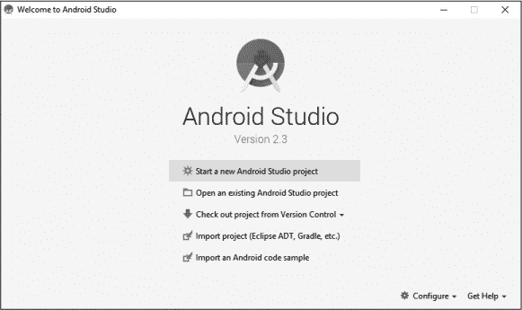

*图 4-2：一旦 Android Studio 完成设置，选择* ***启动一个新的 Android Studio 项目***。

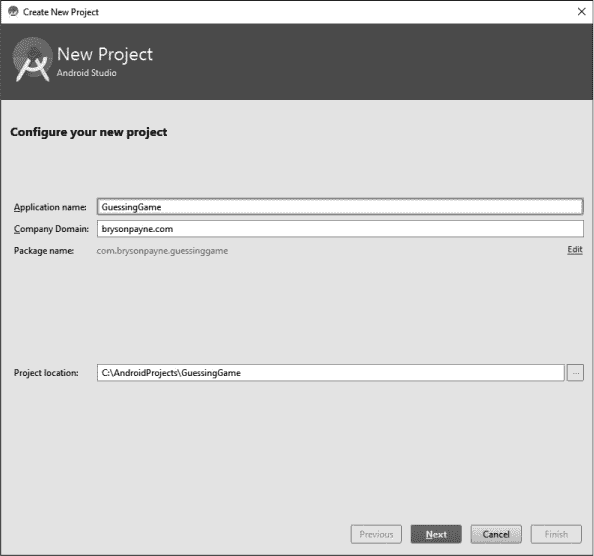

*图 4-3：为你的新 Android Studio 项目命名为* GuessingGame，*不使用空格。*

命名项目后点击**Next**。现在，你将有机会选择你的应用程序应该运行的 Android 版本号。随着新设备和功能的不断开发，Android 平台快速发展，因此我们需要选择一个目标版本。幸运的是，Android Studio 定期更新，提供最新的 Android 版本信息，以及仍在使用旧版本的设备数量。你还需要选择一个**软件开发工具包（SDK）**或**应用程序编程接口（API）**级别，选择支持的 Android 版本时。SDK 和 API 级别包括你将用来开发应用的工具，但它们与特定的 Android 版本相关联。目标 Android 设备窗口，如图 4-4 所示，允许你为每个开发的应用选择最低 SDK 或 API 级别。

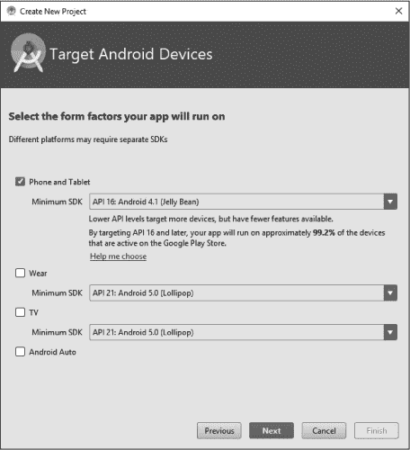

*图 4-4：选择你要开发的 Android 设备的最低 SDK 级别。*

选择**API 16 (Android 4.1, Jelly Bean)**作为猜谜游戏应用的最低 SDK 级别。Android Studio 会告诉你，这个版本支持超过 99%的活跃 Android 设备。点击**Next**。

新项目向导将询问你想要在应用中添加哪种**活动**。活动就是用户可以执行的操作。每个活动通常都有自己的屏幕布局和用户界面，就像图 4-5 所示的那样。

有很多选择可以作为应用的主要活动，比如 Google Maps、登录、设置、标签页活动等。**Basic Activity**将为我们提供一个非常好的基础，用于猜谜游戏应用，因此选择该选项并点击**Next**。

我们将在接下来的界面上使用 Android Studio 提供的默认名称（如图 4-6 所示）：**MainActivity**作为活动名称，**activity_main**作为布局名称。活动文件包含运行应用程序的 Java 源代码，布局是一个独立的文件，包含应用界面。点击**Finish**完成应用项目的设置。

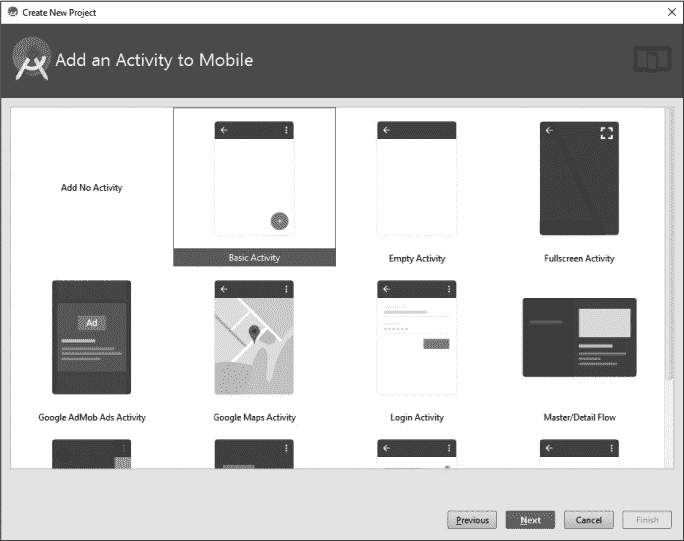

*图 4-5：选择 Basic Activity 作为你应用的基础。*

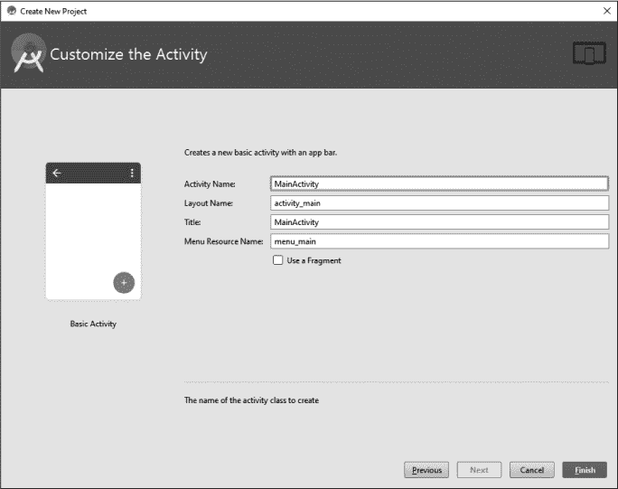

*图 4-6：保留活动名称和布局名称的默认值。*

项目可能需要一些时间来构建，因为 Android Studio 正在创建项目文件并设置**GuessingGame**应用项目。加载完成后，Android Studio 会以类似图 4-7 的默认视图打开该项目。

*图 4-7：Android Studio 中的默认项目视图，包含 GUI 移动布局视图*

如果你的项目没有以这个界面打开，请点击左上角的**Project**标签，展开**app**文件夹，展开**res**（即**resources**的缩写）文件夹，展开**layout**文件夹，然后双击**content_main.xml**文件，查看类似图 4-7 的视图。

### 在设计视图中构建 GUI 布局

Android 应用将布局与应用代码（活动）分开，因此这个应用与我们在第三章编写的桌面应用略有不同。布局不是用 Java 描述的，而是用 *可扩展标记语言（XML）* 描述的。幸运的是，尽管存在这种差异，我们仍然可以使用类似于 Eclipse 的 WindowBuilder 编辑器的拖放调色板来设计 GUI 界面。Android Studio 中的主要区别在于，组件的命名已经考虑到了移动应用的需求。

和 WindowBuilder 编辑器一样，Android Studio 也有两个标签页，一个用于设计视图，另一个用于源代码。点击主窗口左下角的设计标签，里面包含 *content_main.xml* 文件。你将看到图 4-8 中显示的设计视图。

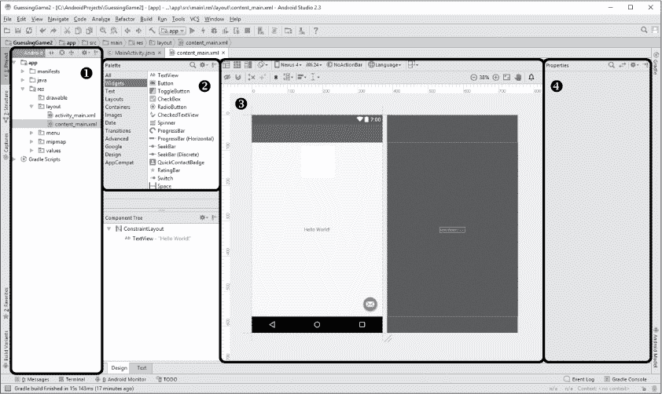

*图 4-8：Android Studio 的设计视图类似于 Eclipse 中的 WindowBuilder 编辑器。*

图 4-8 显示了我们最常使用的设计视图的四个区域：项目资源管理器窗格 ➊、调色板窗格 ➋、预览窗格 ➌ 和属性窗格 ➍。

在预览窗格的中心，你会看到一个标签——在 Android 术语中称为 `TextView`——显示 *Hello World!*。点击该标签并按 DELETE（或右键点击并从菜单中选择 **删除**）将其从预览窗格中删除。然后，在调色板窗格中点击 **Layouts** 选项，选择 **RelativeLayout**，并将其拖动到预览窗格或拖动到位于调色板窗格下方的组件树列表中的 ConstraintLayout（见图 4-8）。我们将从一个空的 RelativeLayout 开始，构建我们的猜数字游戏 GUI 界面。

在调色板窗格的 Widgets 下，选择 **TextView**。Android 中的 `TextView` 类似于 Swing 工具包中的 `JLabel`，而 *widgets* 是我们在 Android 中称大多数 GUI 组件的术语。我们将使用拖放方式将 GUI 组件放置到设计预览中。

点击 `TextView` 小部件，并将其拖动到模拟 Android 手机的白色应用背景上，放置该小部件靠近顶部，以作为你应用的标题。

放置标题 `TextView` 后，你会看到右侧属性窗格中出现选项。如果属性窗格没有出现，请点击设计标签右上角的属性按钮以展开属性窗格。找到你刚刚添加的 `TextView` 小部件的 `text` 属性。将文本更改为 `"``Your Name``'s Guessing Game"` 并将 `textAppearance` 属性更改为 **Large**。然后，将 `TextView` 拖动到屏幕顶部的中心位置，如图 4-9 所示。灰色虚线辅助线有助于定位。

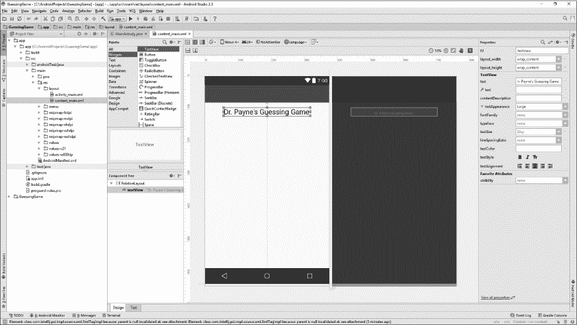

*图 4-9：在 Android Studio 中放置 GUI 小部件/组件与在 Eclipse 中的过程非常相似。*

为了添加提示用户输入 1 到 100 之间数字的标签，将另一个 `TextView` 控件放置到设计预览中，稍微低于标题。然后，在右侧的属性面板中，将 `textAppearance` 属性更改为 **Medium**。接着，在 `TextView` 的 `text` 属性中输入 `Enter a number between 1 and 100:`。

接下来，我们将放置用户输入猜测的文本字段，在 Android 中也称为 `EditText`。文本字段在 Palette 面板中的 Widget 下面列出。Android 中有许多类型的文本字段，每种根据应用的需求行为不同。例如，Plain Text 是一个简单的文本字段，Password 在输入时隐藏字符，Phone 显示数字键盘并将输入格式化为电话号码，E-mail 显示一个带有 @ 符号的修改过的键盘。

选择一个**数字**文本字段，以便用户可以通过屏幕上的数字键盘输入他们的猜测。将这个字段放置在之前标签的下方一点。然后，将一个按钮控件放置在文本字段下方相等的距离，并将其`text`属性更改为 `"Guess!"`。最后，将另一个 `TextView` 控件放在按钮下方，设置其 `text` 属性为 `"请输入一个数字，然后点击 Guess!"`。如果由于太接近屏幕的垂直中心而难以将控件放置在按钮下方相同的距离，可以在属性面板中的 Layout_Margin 下将其向下或向上调整（你可能需要点击**查看所有属性**，然后点击 Layout_Margin 旁边的灰色箭头以展开边距属性），找到 **layout_marginTop**，并将其值更改为 **30dp**。完成的 GUI 布局应该类似于图 4-10。

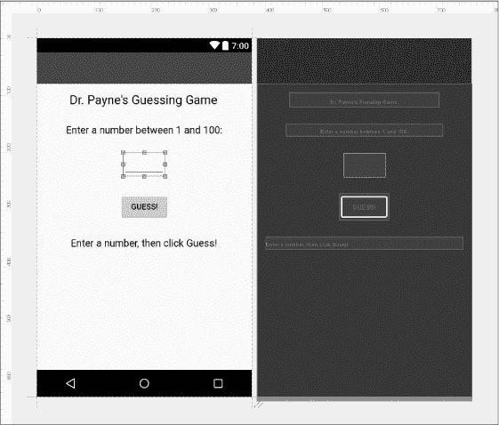

*图 4-10：Android 猜数字游戏应用程序的完成 GUI 布局（设计视图）*

在命名 GUI 组件之前，我们再做一个最终的修改。将用户输入猜测的数字文本字段的 `width` 属性更改为 **75dp**；可以通过点击属性面板中的**查看所有属性**或左右箭头图标来完成。原始的文本字段对于一个仅使用 1 到 100 之间数字的猜数字游戏来说太宽了，所以我们将它调整得更窄一些。

做了这个小改动后，我们可以开始命名我们的 GUI 组件，这样我们就可以在 Java 代码中轻松找到它们了。

### 在 Android Studio 中命名 GUI 组件

就像我们在 Eclipse 中命名 GUI 组件一样，我们也需要在 Android Studio 中命名 GUI 元素，以便能够在代码中访问它们。但在 Android Studio 中，GUI 元素的名称默认不会出现在 Java 源代码中。相反，我们需要手动将这些 XML GUI 组件连接到 Java 代码中，才能在代码中使用它们。

目前，我们只需要将数字文本框、猜测按钮和最底部标签的`id`属性分别更改为`txtGuess`、`btnGuess`和`lblOutput`。如果弹出消息提示你更新用法，点击**是**。我们将使用这些名称以保持一致性和便利性。图 4-11 展示了重命名后的文本框、按钮和标签。

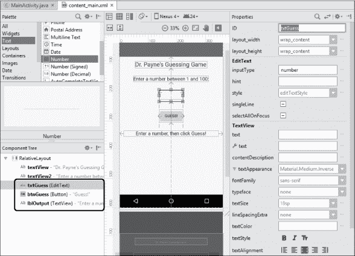

*图 4-11：通过更改 `EditText`、`Button` 和 `TextView` 组件（圈出的部分）的 id 属性，分别将其重命名为 `txtGuess`、`btnGuess` 和 `lblOutput`。*

在开始编写 Java 代码之前，我们需要做的一件事是隐藏小的*浮动操作按钮（fab）*图标，该图标显示在设计预览的右下角，图 4-12 中。你的项目可能不会显示 fab 图标，但如果显示了，双击项目资源管理器面板中的*activity_main.xml*文件 ➊。点击设计视图上方的*activity_main.xml*标签 ➋，然后点击 fab 图标 ➌。进入属性设置，将`visibility`属性设置为**不可见** ➍。

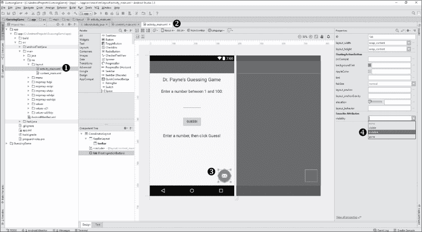

*图 4-12：通过进入* activity_main.xml *文件，点击小的信封图标，并将* `*visibility*` *属性设置为不可见来隐藏 fab 图标。*

我选择将 fab 图标设置为不可见，而不是完全删除它，因为你可能希望以后使用浮动操作按钮为应用添加新功能。浮动操作按钮可以将应用中的信息分享到 Facebook，发布一条推文到 Twitter，告诉朋友你有多喜欢这个应用，发送电子邮件告诉朋友关于这个应用的信息，等等。

接下来，我们将连接 GUI，以便我们可以在 Java 中使用它来编程应用的其余部分。

### 在 Android Studio 中将 GUI 连接到 Java

现在是时候将 GUI 连接到 Java，以便我们可以编写猜谜游戏应用程序的代码了。首先，让我们通过在项目资源管理器面板中查找，打开 Java 源代码文件，路径为*app* ▸ *src* ▸ *main* ▸ *java* ▸ *com.example.guessinggame*（或你的包名） ▸ *MainActivity*。双击*MainActivity*以打开*MainActivity.java*源代码文件。

你可能注意到，项目资源管理器中的*java*文件夹下有另一个或两个包，可能会有相同的名称，但包名后面带有*(test)*或*(androidTest)*。这些包用于更大型应用程序的测试，工程师通过测试评估应用程序的质量、安全性和功能性，以进行软件质量保证。我们不会涉及质量保证，但这是进入软件开发行业的一个很好的途径。

*MainActivity.java*文件中的 Java 源代码大致如下所示：图 4-13。

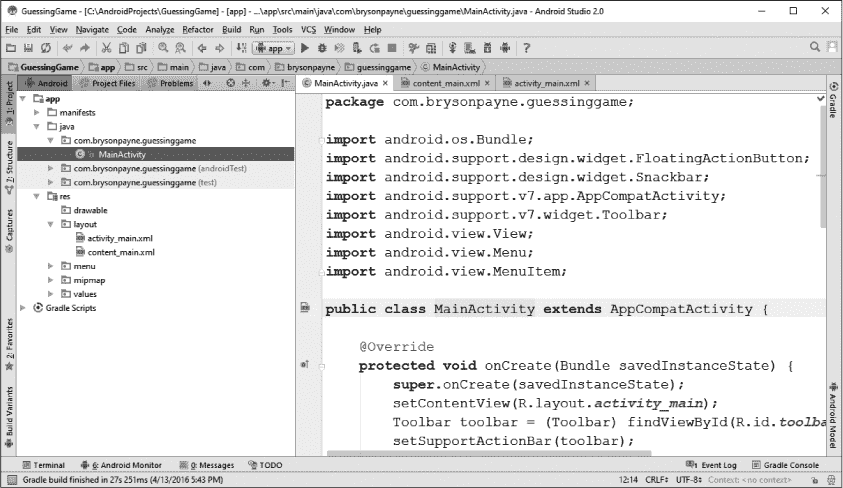

*图 4-13：应用的 Java 源代码默认命名为* MainActivity.java*。*

注意，在 Android Studio 中，包声明默认出现在文件的最顶部。包帮助我们组织在更复杂程序中所需的所有文件，比如移动应用。在这种情况下，包名是图 4-3 中创建新项目屏幕上使用的公司域名，但顺序相反——注意*com*在前。

若干 Android `import`语句紧跟在包声明后。这些语句的作用与桌面 Java 中的导入功能相同，将现有功能导入代码中。

以下`public class MainActivity`代码片段可能会根据你为应用选择的最低 API 级别有所不同，但整体代码将相似，我们编写的应用将能够跨多个 API 级别运行。首先，我们将声明连接 GUI 和程序的变量。点击类的开括号内的下一行，并添加这些行以声明文本框、按钮和输出标签的变量：

public class MainActivity extends AppCompatActivity {

private EditText txtGuess;

private Button btnGuess;

private TextView lblOutput;

当你输入每种新的变量类型时，可能会看到一个下拉菜单，提供导入它（例如`android.widget.EditText`）。如果你点击正确的小部件类型进行导入，Android Studio 会为你添加相应的`import`语句。如果你在没有点击接受自动导入的情况下输入了这三行代码，只需点击每个小部件类型，然后按 ALT-ENTER（或在 macOS 上按 OPTION-ENTER）来导入任何缺失的类，如图 4-14 所示。

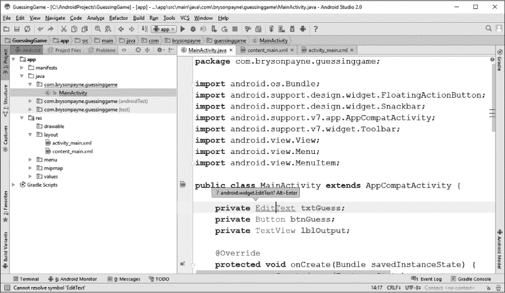

*图 4-14：Android Studio 允许你像 Eclipse 一样自动导入类，无论是在输入时还是在之后通过简单的快捷键组合（**ALT**-**ENTER**，*或者* *macOS 上的* *OPTION**-**ENTER*）。*

以下三个`import`语句现在应与文件顶部其他语句一起出现：

import android.widget.EditText;

import android.widget.Button;

import android.widget.TextView;

在声明了 GUI 小部件的三个变量后，我们需要将这些变量连接到每个小部件的 XML 组件。在`onCreate()`方法中完成这一操作，该方法在应用加载时运行，如图 4-14 底部所示。Android Studio 已经自动生成了开始这个方法的代码。

查看`onCreate()`方法的前两到三行，找到这一行：

setContentView(R.layout.activity_main);

在该行后，按几次 ENTER 键并输入以下部分代码，开始将变量`txtGuess`与 XML 布局文件中的`EditText`小部件连接：

txtGuess = (EditText) findViewById(R.id.

`findViewById()` 函数是我们将 XML 布局中的 GUI 控件与我们在源代码中使用的变量连接起来的方式。该函数中的 `R` 指的是一个名为 *R.java* 的特殊文件，它是 Android Studio 生成的，用于实现资源的连接。`R` 是 *resources*（资源）的缩写，通常存储在项目的 *res* 文件夹中。当你开始输入前述代码行时，你会看到一个弹出菜单，如 图 4-15 所示。找到并双击下拉列表中的 `txtGuess`。如果你没有看到 `txtGuess` 选项，请返回 *content_main.xml* 的设计视图，确保为文本字段指定了 `id` 属性为 `txtGuess`。

在代码行末尾加上右括号和分号，如下所示，然后设置按钮和输出标签。你在 `onCreate()` 方法中的三行代码应该像这样：

protected void onCreate(Bundle savedInstanceState) {

super.onCreate(savedInstanceState);

setContentView(R.layout.*activity_main*);

txtGuess = (EditText) findViewById(R.id.*txtGuess*);

btnGuess = (Button) findViewById(R.id.*btnGuess*);

lblOutput = (TextView) findViewById(R.id.*lblOutput*);

如果布局中的所有元素都已经正确命名，那么这些代码行应该将变量`txtGuess`、`btnGuess`和`lblOutput`与 GUI 布局中的`EditText`、`Button`和`TextView`组件连接起来。此时是停下来并保存项目的好时机，以便捕捉到目前为止所取得的进展。

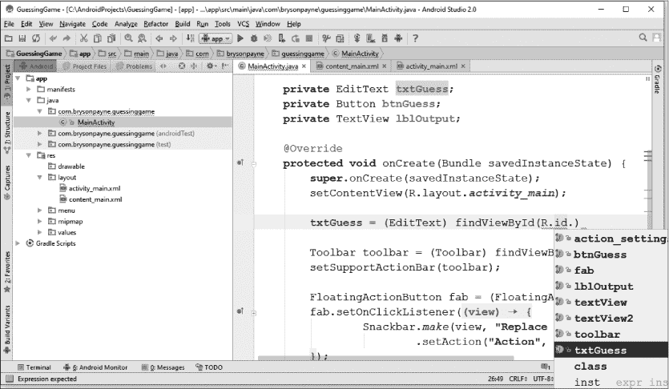

*图 4-15：Android Studio 帮助我们通过有用的下拉选项将 Java 代码与布局中的 GUI 资源“连接”起来。*

### 添加方法来检查猜测并开始新游戏

现在，让我们开始编写 `checkGuess()` 函数的代码。我们可以在 `txtGuess`、`btnGuess` 和 `lblOutput` 变量声明的下方，以及 `onCreate()` 方法的上方开始编写 `checkGuess()` 方法，如 图 4-16 所示。

首先，我们需要从 GUI 文本字段获取用户的猜测并将其存储在一个 `String` 变量中：

public class MainActivity extends AppCompatActivity {

private EditText txtGuess;

private Button btnGuess;

private TextView lblOutput;

public void checkGuess() {

String guessText = txtGuess.getText().toString();

获取用户猜测的代码与桌面版应用程序中的几乎相同，唯一的不同是额外的 `.toString()` 方法。Android 中有一个独立的 `Text` 类，文本字段中输入的文本是一个 `Text` 对象，因此我们需要将该对象转换为 `String` 对象。

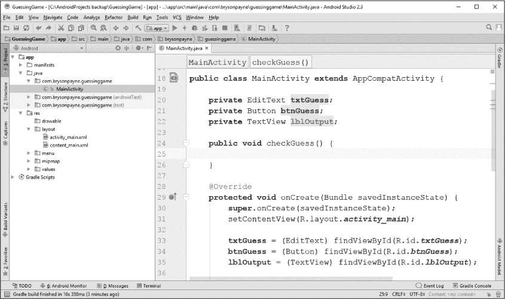

*图 4-16：开始编写 Java 中的 checkGuess() 方法*

幸运的是，`checkGuess()`方法的其余部分可以直接从 Eclipse 桌面 GUI 版本的应用程序中复制并粘贴过来，位于第三章，无需任何更改！完整的`checkGuess()`方法应如下所示：

public void checkGuess() {

➊ String guessText = txtGuess.getText().toString();

String message = "";

➋ try {

➌ int guess = Integer.*parseInt*(guessText);

if (guess < theNumber)

message = guess + " 太小了。再试一次。";

else if (guess > theNumber)

message = guess + " 太大了。再试一次。";

else {

message = guess +

" 猜对了！你赢了！再玩一次！";

newGame();

}

➍ } catch (Exception e) {

message = "请输入一个介于 1 和 100 之间的整数。";

➎ } finally {

lblOutput.setText(message);

txtGuess.requestFocus();

txtGuess.selectAll();

}

}

Java 的一个便捷功能是我们可以在不同平台之间重用代码。就像我们将命令行游戏的代码用来制作桌面游戏一样，我们也可以在 Android 版本中使用桌面版本的代码。让我们回顾一下这些代码，了解它们如何在 Android 应用中工作。

在➊处，我们从文本框获取用户的猜测并设置一个字符串作为输出信息。在➋处，我们开始一个`try-catch-finally`语句来处理用户输入错误或异常。在`try`块内，➌处，我们从用户输入的字符中解析出整数作为猜测的数字。`try`块的其余部分包含了`if-else`语句，用来判断用户猜得是太大还是太小，设置相应的消息，并开始一局新游戏。接下来是`catch`语句➍，它会提示用户输入一个介于 1 和 100 之间的整数。然后，`finally`块➎会将`lblOutput`控件的文本设置为适当的`message`，并将光标返回到文本框，突出显示文本，为用户的下一次猜测做准备。

你可能已经注意到有几个项目被红色下划线标记：`theNumber`和`newGame()`。这是因为我们在此版本的应用中还没有定义它们。

在`MainActivity`类的顶部，在三个 GUI 控件声明下方，添加一个声明用于存储秘密数字`theNumber`：

public class MainActivity extends AppCompatActivity {

private EditText txtGuess;

private Button btnGuess;

private TextView lblOutput;

private int theNumber;

这是我们在桌面游戏中使用的相同代码，因为创建整数的 Java 代码在命令行、桌面和 Android 移动版本的应用程序中是相同的。

`newGame()`方法的代码也与桌面版本相同。在`onCreate()`语句之前添加`newGame()`方法：

public void newGame() {

theNumber = (int)(Math.*random*() * 100 + 1);

}

@Override

protected void onCreate(Bundle savedInstanceState) {

在 Android 应用中创建新游戏和桌面应用一样。我们只需使用`Math.random()`函数将`theNumber`设置为 1 到 100 之间的随机整数。

我们可以在连接这三个 GUI 组件的代码后，在`onCreate()`方法内添加对`newGame()`的调用：

protected void onCreate(Bundle savedInstanceState) {

super.onCreate(savedInstanceState);

setContentView(R.layout.*activity_main*);

txtGuess = (EditText) findViewById(R.id.*txtGuess*);

btnGuess = (Button) findViewById(R.id.*btnGuess*);

lblOutput = (TextView) findViewById(R.id.*lblOutput*);

newGame();

当游戏启动时，程序会调用`newGame()`方法并随机选择一个数字供用户猜测。现在，我们只需要处理按钮点击事件，并学习如何在自己的 Android 设备或 Android 模拟器上运行应用程序。

### 在 Android 中处理事件

在 Eclipse 中，我们只需在设计视图中双击猜测按钮就能添加事件监听器。不幸的是，在 Android Studio 中就没有那么简单了，因为 GUI 布局与源代码是分开的。幸运的是，Android Studio 通过提供*代码自动完成*选项来帮助我们添加事件监听器，类似于 Eclipse 中的内容辅助功能。

要为按钮点击添加监听器，可以在调用`newGame()`后的下一行代码中输入以下部分代码：

txtGuess = (EditText) findViewById(R.id.txtGuess);

btnGuess = (Button) findViewById(R.id.*btnGuess*);

lblOutput = (TextView) findViewById(R.id.*lblOutput*);

newGame();

btnGuess.setOn

Android Studio 的代码自动完成功能会弹出一个代码推荐列表，如图 4-17 所示。从选项列表中选择`setOnClickListener()`并双击以将其添加到程序中。

在`btnGuess.setOnClickListener()`的括号内，输入`new`并开始输入`OnClickListener`。Android Studio 的代码自动完成功能会显示一个选项列表，如图 4-18 所示。

从选项列表中选择`OnClickListener`，你会看到 Android Studio 会添加一些额外的代码行。此时，`btnGuess`按钮的事件监听器代码应如下所示：

btnGuess.setOnClickListener(new View.OnClickListener() {

@Override

public void onClick(View v) {

}

});

看起来很熟悉吗？这是另一个匿名内部类的示例。桌面版本也有一个匿名内部类，但它的命名稍有不同。两者的作用几乎完全相同。你可能已经注意到 Android 在多个地方插入了`@Override`。这叫做*编译器指令*，它告诉编译器你正在实现父类方法的自定义版本。

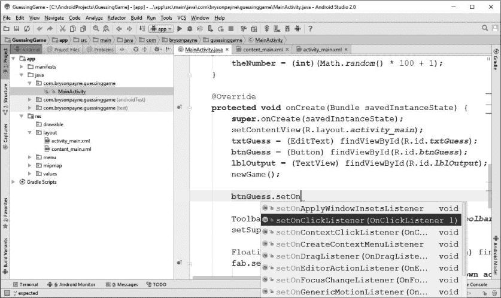

*图 4-17：Android Studio 的代码自动完成功能在我们输入时提供代码建议，类似于 Eclipse 的内容辅助功能。*

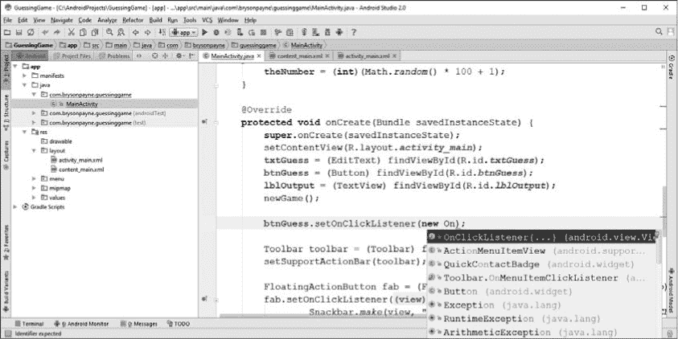

*图 4-18：使用代码自动完成功能创建一个新的 OnClickListener 并将其添加到按钮 btnGuess。*

当用户点击“Guess!”按钮时，我们需要检查他们的猜测是否与秘密数字匹配。在`onClick()`方法的花括号内添加`checkGuess();`。

public void onClick(View v) {

checkGuess();

}

现在猜数字游戏的移动应用程序已经准备好进行首次运行。这个版本的猜数字游戏的完整代码如下。你的版本可能略有不同，可能会有几个额外的方法用于处理菜单项，但由于我们没有使用菜单，这些方法已经被删除以节省空间（请参见第五章，学习如何创建选项菜单和设置）：

package com.brysonpayne.guessinggame;

import android.os.Bundle;

import android.support.design.widget.FloatingActionButton;

import android.support.design.widget.Snackbar;

import android.support.v7.app.AppCompatActivity;

import android.support.v7.widget.Toolbar;

import android.view.View;

import android.view.Menu;

import android.view.MenuItem;

import android.widget.EditText;

import android.widget.Button;

import android.widget.TextView;

import org.w3c.dom.Text;

public class MainActivity extends AppCompatActivity {

private EditText txtGuess;

private Button btnGuess;

private TextView lblOutput;

private int theNumber;

public void checkGuess() {

String guessText = txtGuess.getText().toString();

String message = "";

try {

int guess = Integer.*parseInt*(guessText);

if (guess < theNumber)

message = guess + " 过低，请再试一次。";

else if (guess > theNumber)

message = guess + " 过高，请再试一次。";

else {

message = guess +

" 是正确的，你赢了！再玩一次吧！";

newGame();

}

} catch (Exception e) {

message = "请输入一个 1 到 100 之间的整数。";

} finally {

lblOutput.setText(message);

txtGuess.requestFocus();

txtGuess.selectAll();

}

}

public void newGame() {

theNumber = (int)(Math.*random*() * 100 + 1);

}

@Override

protected void onCreate(Bundle savedInstanceState) {

super.onCreate(savedInstanceState);

setContentView(R.layout.*activity_main*);

txtGuess = (EditText) findViewById(R.id.*txtGuess*);

btnGuess = (Button) findViewById(R.id.*btnGuess*);

lblOutput = (TextView) findViewById(R.id.*lblOutput*);

newGame();

btnGuess.setOnClickListener(new View.OnClickListener() {

@Override

public void onClick(View v) {

checkGuess();

}

});

Toolbar toolbar = (Toolbar) findViewById(R.id.*toolbar*);

setSupportActionBar(toolbar);

}

}

在接下来的两节中，你将学习如何在 Android 模拟器和真实的 Android 设备上运行应用程序。

### 在 Android 模拟器上运行应用程序

现在我们有了一个可以运行应用程序的 Java 代码版本，但我们仍然需要测试它。与命令行和桌面应用程序不同，移动应用程序不能单独在 PC 上运行，因为 PC 没有 Android 操作系统。为了测试你的应用程序，你需要一个 Android 设备或一个可以在你的 PC 上模拟 Android 设备的模拟器。在这一节中，我们将创建一个 Android 虚拟设备来测试你的应用。

在查看*MainActivity.java*文件时，点击运行按钮或选择菜单项**运行** ▸ **运行‘app’**。弹出窗口会要求你选择一个*部署目标*，即你希望在其上运行应用程序的设备，如图 4-19 所示。

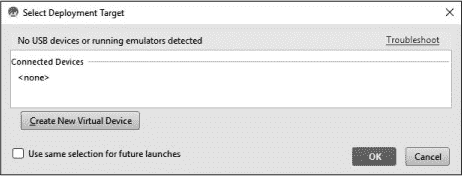

*图 4-19：要运行 Android 应用，你必须选择一个目标设备——可以是模拟器或实际设备。*

点击**创建新虚拟设备**按钮以开始配置一个新的*Android 虚拟设备 (AVD)*。首先选择设备类型，如图 4-20 所示。然后点击**下一步**。

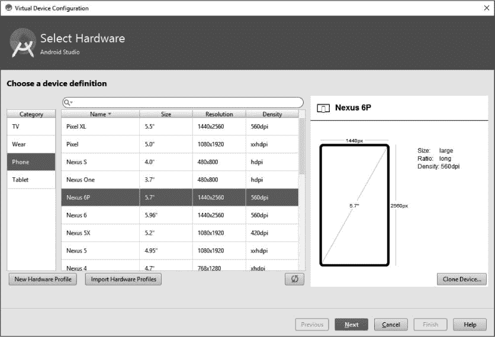

*图 4-20：选择一个设备进行模拟。*

我们将选择 Nexus 6P 开始，但也可以自由尝试其他设备。如果你决定为 Google Play 商店开发自己的应用程序，你会希望在各种屏幕尺寸和设备类型上进行测试，因此你可以尝试设置多个不同的模拟器。但现在先从一个设备开始吧。

接下来，我们需要选择系统镜像，通常是 x86 或 ARM。我们将使用 ARM 镜像，因此点击**其他镜像**标签，如图 4-21 所示。

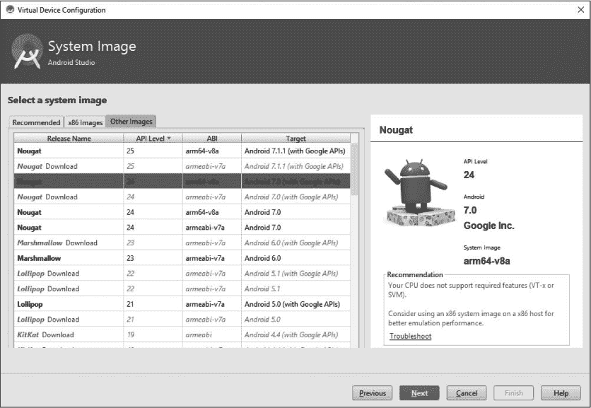

*图 4-21：你可以选择 x86 或 ARM 模拟器；ARM 较慢，但在不同类型的处理器上通常表现更稳定。*

如果你想要的 Android 版本、API 级别或模拟器以灰色字体显示，请点击你想要的版本的**下载**链接。

点击**下一步**，当你选择了想要的 Android 模拟器后。现在，我们使用 Nougat API 24 ARM Android 7.0 版本与 Google API。你将看到一个最终的屏幕，要求你验证你的配置，包括你想要进行的任何高级设置更改。我们将把你正在模拟的设备的 AVD 名称更改为*我的 Nexus 6P*，如图 4-22 所示。

如果你在较旧的计算机或内存小于 8 GB 的计算机上运行模拟器遇到问题，请点击**显示高级设置**，向下滚动到内存和存储部分，将 RAM 数量更改为**768 MB**。

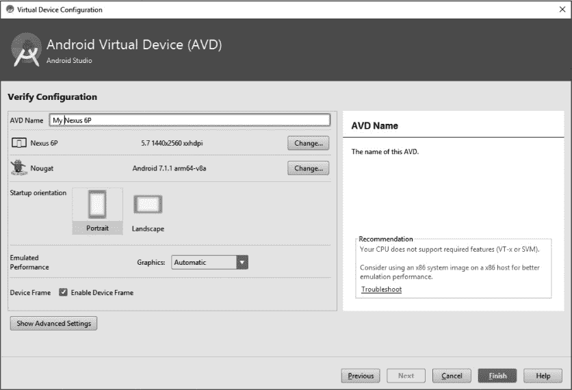

*图 4-22：为你的新 AVD 命名。*

点击**完成**，你的新设备将被创建并保存到磁盘。现在是时候启动模拟器并尝试你的设备了。你应该会再次看到“选择部署目标”窗口，但这次它会显示*我的 Nexus 6P*作为一个可用的模拟器。现在点击**确定**，如图 4-23 所示。

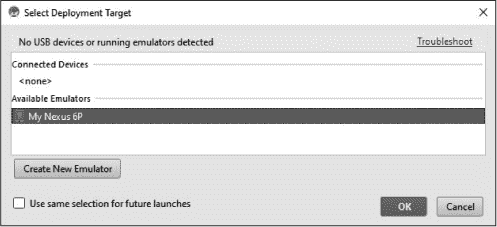

*图 4-23：选择你刚刚创建的模拟器作为部署目标。*

几秒钟后，你将看到“正在启动 AVD”的消息，随后是一个模拟器窗口，显示类似 Android 启动屏幕的界面，如图 4-24 所示。第一次运行模拟器时，这可能需要*几分钟*。当模拟器启动时，你可能会看到锁屏界面。

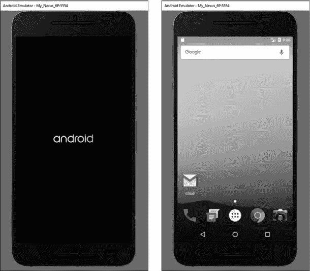

*图 4-24：Android 模拟器启动画面（左）；Android 虚拟设备的主屏幕（右）*

如果你的模拟器显示锁屏，点击屏幕底部的锁图标并向上拖动解锁虚拟设备，类似于在实际 Android 手机上向上滑动解锁。你可能会看到一个或两个欢迎界面，但可以随意点击跳过，直到你到达主屏幕，如图 4-24 所示。

现在，回到 Android Studio，再次按下运行按钮。这次，你会在“选择部署目标”对话框中看到你的 AVD（请参见图 4-25）。选择你的设备并点击**确定**。

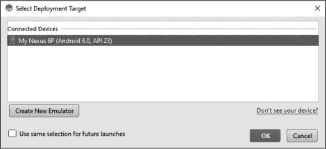

*图 4-25：运行时，模拟器会出现在连接设备的列表中。*

项目会再构建一次，然后将应用的可执行版本传输到模拟器中。（第一次运行模拟器时，可能会提示你更新 Android SDK 工具。）几分钟后，你就会看到你的猜测游戏应用在模拟器上运行了！

我们已经完成了整个应用的编码，因此你应该能立刻在模拟器上玩这个游戏。看看图 4-26，看看游戏的一轮在应用中会是什么样子。

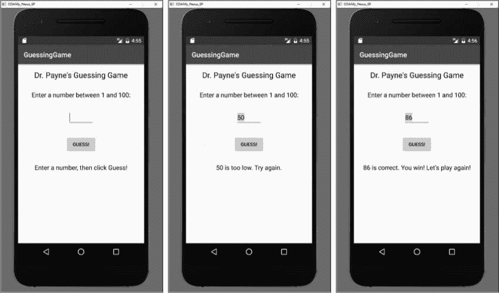

*图 4-26：猜测游戏应用在模拟器屏幕上运行（左），一次猜测后（中），以及猜对后的画面（右）。*

它的运行方式与桌面应用相同，不过是在 Android 模拟器上。使用键盘输入猜测，使用鼠标点击“猜测！”按钮。接下来，我们还会做一些改进，提升用户体验，就像我们在 GUI 桌面应用中做的那样，不过我们的 Android 移动应用已经完全功能齐全了！

在我们改善用户体验之前，我们将介绍如何在真实的 Android 设备上运行应用程序。现在，保持 Android 模拟器开启。当你不使用时可以将其最小化，但在编程时请保持它在后台运行，以避免长时间的启动过程。

**注意**

*如果你没有 Android 设备，可以跳到第 102 页的“改善用户体验”部分。*

### 在真实的 Android 设备上运行应用程序

在真实的 Android 设备上运行应用程序可能需要一些时间和准备，但如果你有 USB 数据线将设备连接到电脑，你很快就能开始运行了。

#### *准备你的设备*

在你将自己的应用部署到 Android 设备之前，必须先启用设备的开发者模式。你还需要更改几个设置，以允许你开发和调试应用。

在您的 Android 设备上，点击**设置**，然后滚动到设置菜单的底部，找到“关于平板电脑”、“关于手机”或“关于设备”部分。在关于屏幕的底部，您会看到“版本号”条目。点击版本号至少七次以启用隐藏的开发者模式。开发者模式允许您在自己的设备上测试开发的应用程序。图 4-27 展示了设置菜单（左）和关于菜单（中），以及解锁后的开发者模式。

解锁开发者模式后，点击关于屏幕左上角的返回箭头，打开**设置** ▸ **开发者选项**。确保开发者选项已**开启**，如图 4-27（右）所示。您还需要开启 USB 调试功能。

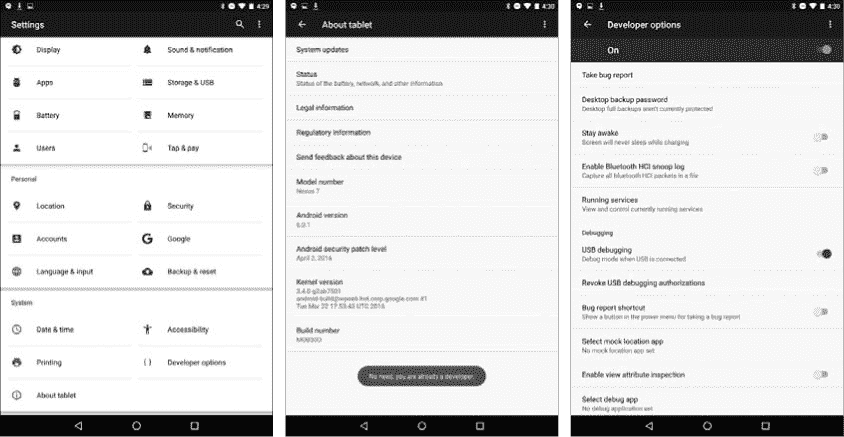

*图 4-27：Android Nexus 7 平板电脑上的设置菜单（左）、关于菜单（中）和开发者选项（右）。*

现在，您准备好将 Android 手机、平板电脑或其他设备连接到计算机，并在其上运行您的应用程序。

#### *连接您的设备*

要将 Android 设备连接到计算机，您需要一根 USB 数据线，最好是随手机或平板电脑附带的那根。它应该是 micro-USB 数据线，通常与设备的充电器一起提供。请注意，并非所有充电器数据线都具备完整的 USB 功能——如果按照以下步骤操作后您的数据线无法使用，请尝试换一根。

使用 USB 数据线将设备连接到计算机。插入后，您的手机或平板电脑屏幕上会显示一个类似于图 4-28 的窗口，询问您是否允许来自刚连接的计算机的 USB 调试。点击**确定**。您可以选择勾选**始终允许来自此计算机的连接**，这样下次连接同一台计算机时，就不会再弹出此窗口。

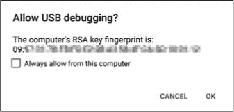

*图 4-28：第一次将 Android 设备连接到计算机时，系统会询问您是否允许 USB 调试。*

允许 USB 调试会启用几个功能。首先，我们将能够通过传输*Android 包文件（APK）*，直接将我们编写的应用程序传输到 Android 设备。这通常比在模拟器上运行应用程序要快得多，而且是一种更好的方式来测试应用程序在真实设备上的表现。此外，我们还可以通过 USB 连接调试应用程序，这意味着我们将从 Android 设备获得信息，以帮助我们进行调试。这些信息将包括错误和其他日志条目，我们可以在类似控制台的应用程序（在 Android Studio 中称为*logcat*）中查看。这与我们以前在命令行和桌面 GUI Java 应用程序中查找错误时使用的控制台输出类似。

现在，您已将真正的 Android 设备连接到计算机，让我们来看一下如何在其上运行猜数字游戏应用程序！

#### *在设备上运行应用程序*

现在我们准备在 Android 设备上尝试该应用。在 Android Studio 中，按下运行按钮或转到**运行** ▸ **运行 ‘app’**。这时，选择部署目标窗口将显示 *两个* 连接的设备供选择，如图 4-29 所示：你的模拟器（My Nexus 6P）和你的真实 Android 设备。

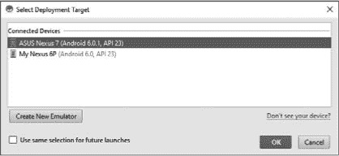

*图 4-29：如果你已解锁开发者模式、启用 USB 调试并成功连接了设备，你应该能选择 Android 设备来运行应用。*

这次选择你的真实 Android 设备并点击 **OK**。Android Studio 可能需要片刻来构建应用，但一旦将 APK 文件传输到设备，你将看到猜谜游戏应用在平板或手机上自动打开。玩几局以验证它的运行效果是否与模拟器上一样（甚至更好，或者至少更快）。真是太酷了！

你可能立刻注意到一个重要的区别：屏幕的底部被数字键盘遮挡，如图 4-30 所示。

当我们为用户的猜测放置文本框（`EditText`）时，选择了一个数字输入框，这样数字键盘就会显示出来。但由于模拟器运行在计算机上，而计算机有自己的键盘，因此你在之前运行应用时可能没有看到这一点。

现在我们已经能够在 Android 手机、平板或其他设备上运行 Android 应用了，让我们为猜谜游戏应用做一些最后的用户体验改进。

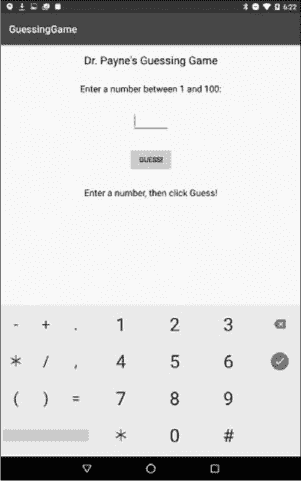

*图 4-30：应用在你的 Android 设备上运行，默认显示数字键盘。*

### 改善用户体验

猜谜游戏应用在 Android 模拟器和真实 Android 设备上都运行得非常顺利，但我们可以改进一些用户体验方面的细节。首先，我们将在数字输入框中居中显示用户的猜测。其次，我们将学习如何像处理“猜测！”按钮一样处理 ENTER 键，使应用对用户更加直观。

#### *在文本框中居中显示用户的猜测*

在 Android Studio 中，再次打开 *content_main.xml* 布局文件。通过在设计预览中点击选中名为 `txtGuess` 的文本框。在属性面板中找到 **textAlignment**。Android 中的 `textAlignment` 属性类似于桌面 GUI 中的 `horizontalAlignment` 属性——它允许我们改变用户输入文本的对齐方式。

点击居中文本对齐选项，图标看起来像是居中的文本。如果你想在设计预览中测试它，而不运行应用，滚动查找 `text` 属性并输入值 `50`。数字应该在设计预览面板中的文本框里居中显示。如果你不希望它在实际应用中显示，记得删除测试值。

#### *为 ENTER 键添加监听器*

让我们设置一个事件监听器，像处理“猜测！”按钮点击一样处理 ENTER 键，调用 `checkGuess()`。

返回到 *MainActivity.java* 源代码文件，向下滚动到 `onCreate()` 方法，找到我们为按钮 `btnGuess` 添加的 `onClickListener`。 （你可能需要通过点击 `btnGuess.setOnClickListener()` 左边边距处的 + 来 *展开* 事件监听器代码，使其显示出此处所示的代码。）在其下方，我们可以为文本字段 `txtGuess` 添加一个事件监听器，以处理按下 ENTER 键等操作事件。以下代码为 `txtGuess` 添加了一个监听器：

btnGuess.setOnClickListener(new View.OnClickListener() {

public void onClick(View v) {

checkGuess();

}

});

txtGuess.setOnEditorActionListener(new TextView.OnEditorActionListener() {

@Override

public boolean onEditorAction(TextView v, int actionId, KeyEvent event) {

checkGuess();

➊ return true;

}

});

我们正在监听的 *编辑器动作* 是当用户在文本字段中输入时按下 ENTER 键。当该事件发生时，我们希望检查用户输入的猜测。

我们将 `return` 语句更改为返回 `true` ➊，因为我们希望保持键盘在屏幕上，以便用户可以输入下一个猜测。`return` 语句告诉文本字段，我们提供的事件处理代码是否完成了事件的处理。通过返回 `true`，我们告诉 Android，已经完成了检查用户猜测所需的所有工作。如果我们在这里返回 `false`，Android 会通过移除数字键盘来结束 ENTER 键的处理——这就像你在网页表单输入完成后，默认的行为一样。我们不希望每次猜测后键盘消失，因此我们返回 `true`。

#### *再添加一个细节*

多次运行应用程序进行测试，你会发现 ENTER 键可以快速高效地输入和检查猜测。你还会看到你的猜测在文本字段中居中显示。然而，当你获胜时，根据 API 版本、屏幕大小或设备密度的不同，你可能会看到类似 图 4-31 所示的对齐问题。

问题在于名为 `lblOutput` 的 `TextView` 会根据较长的文本 “You win! Let’s play again!” 调整大小，一些较旧的 API 可能无法正确居中显示。你可以通过在设计预览中将 `lblOutput` 扩展到屏幕的全宽，并将 `textAlignment` 属性改为 `center` 来防止此问题。现在，你已经拥有了一个完整的猜数字游戏应用，可以在你的设备上玩，并与朋友分享！应用程序的最终版本 1.0 显示在 Nexus 7 上，字体设置为大号，见 图 4-32。

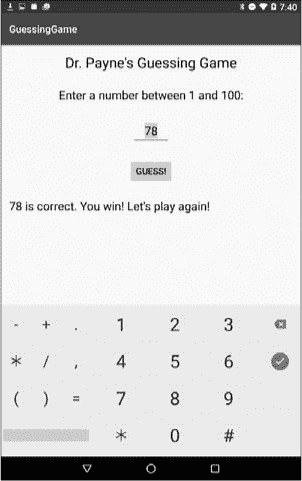

*图 4-31：如果你发现文本对齐不正确，可能需要展开并居中 `lblOutput` 的 TextView。*

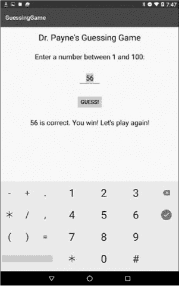

*图 4-32：你的移动应用程序版本 1.0，已完成所有用户体验改进*

哇！你已经从一个简单的基于文本的命令行数字猜谜程序，发展到了一个复杂的 GUI 桌面游戏，再到一个可以在真实 Android 设备上运行的功能齐全的移动应用程序。你是否开始看到 Java 的强大与灵活性了？在第五章，我们将通过添加设置菜单和存储用户偏好的功能，使应用更加专业！

### 你学到了什么

你已经看到，许多在文本和 GUI 桌面程序中使用的 Java 代码可以为现代移动应用打下基础，这得益于 Java 跨多个平台的可重用性。在本章中，我们还掌握了一些新的、特定于移动的技能：

• 启动一个新的 Android Studio 应用项目

• 在 Android Studio 中使用设计视图构建 GUI 布局，包括更改属性面板中各种元素的属性

• 为方便在 Java 代码中使用，为 GUI 组件命名

• 将 Android GUI 布局元素连接到你的 Java 代码

• 向 Android 应用中添加你自己的方法，比如`checkGuess()`和`newGame()`方法

• 在 Android 应用中重用 Java 代码

• 在 Android 中处理事件，包括按钮点击和按键/编辑器操作，比如按下 ENTER 键

• 通过在 Android 模拟器上运行应用程序来测试它们

• 在 Android 手机、平板电脑或其他设备上运行应用，通过启用开发者模式和 USB 调试

• 通过更改小部件属性并添加用户友好的细节来改善用户体验

### 编程挑战

尝试这些编程挑战练习，复习和实践你所学的内容，并通过尝试新事物来拓展你的编程技能。如果你卡住了，访问*[`www.nostarch.com/learnjava/`](https://www.nostarch.com/learnjava/)*下载示例解决方案。

#### *#1: “吐司”——为尝试次数干杯*

在编程挑战中

第三章，你已经更改了获胜消息，告诉用户他们获胜时尝试了多少次：

62 是正确的！你在第 7 次尝试后获胜！

让我们为 Android 版本做一些类似的事情，不过这次加点“花样”——或者，我该说是一个*吐司*？吐司是一个 Android 小部件，用于创建弹出消息窗口。吐司弹出窗口是一种方便的方式，用来显示快速通知，比如错误提示或告知用户他们赢得了游戏。请参见图 4-33 中屏幕底部附近的吐司消息。

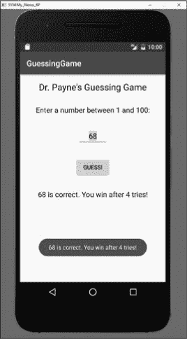

*图 4-33: 一个吐司消息会弹出在屏幕上，提醒用户重要信息。*

你可以通过`Toast.makeText()`方法创建一个吐司消息弹出窗口。这里有一个示例，帮助你将吐司弹出消息添加到`else`语句中，用于获胜提示：

else {

message = guess +

"是正确的。你在" + numberOfTries + "次尝试后获胜！";

Toast.*makeText*(MainActivity.this, message,

Toast.*LENGTH_LONG*).show();

newGame();

}

这段代码中的 Toast 消息将在`MainActivity`（我们的猜谜游戏）上方弹出，显示`String`类型的`message`，持续几秒钟，得益于`Toast.LENGTH_LONG`。还有一个`Toast.LENGTH_SHORT`，但是它出现和消失得非常快，可能难以阅读。结尾的`.show()`方法完成了关键的部分，显示了 Toast 消息。

与桌面版 GUI 相似，为了完成这个任务，你需要在类的顶部创建一个新的变量（例如`int numberOfTries = 0;`），每次`checkGuess()`方法成功运行时都增加尝试次数，并修改输出`message`，在用户获胜时通过 Toast 弹窗和`lblOutput`字段显示尝试次数。在计算完尝试次数后，添加你在第三章中学到的处理用尽尝试次数或失败的功能。给用户七次尝试，并在每次猜测后告诉他们剩余的次数。

#### *#2: 增加视觉吸引力*

探索 Android Studio 中 GUI 组件的一些美学属性，包括背景颜色、前景颜色、字体、`textSize`等。将你的猜谜游戏应用中的组件移动，令界面更加美观。你可以参考图 4-34 来定制游戏。

你甚至可以添加自定义的背景图片（将图片文件添加到*app* ▸ *res* ▸ *drawable* 文件夹中，然后将其作为布局、按钮或其他组件的`background`属性）。尽情尝试各种设置——你可以随时按 CTRL-Z 撤销！

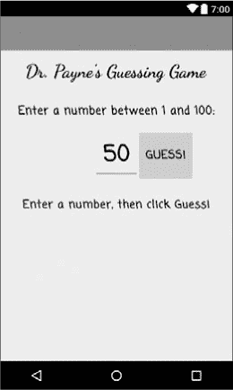

*图 4-34: 更改应用中组件的颜色、字体、文字大小和排列方式可以让它更加突出！*

#### *#3: 创建一个 MadLibs 移动应用*

回顾你在第三章（第 74 页的编程挑战#3）中构建的*MadLibGUI.java*程序。现在创建一个移动版本的 MadLibs 应用，提示用户输入多个单词，界面中包含标签和文本框，如`txtBigAnimal`、`txtPastTenseVerb`、`txtSmallContainer`和`txtFood`。添加一个按钮，用户可以按下它来生成自己的 MadLibs 风格故事。可以在每个文本框中包含一些默认或初始文本，以便给用户展示程序如何工作。

当用户点击按钮时，程序应在`TextView`或`EditText`小部件中显示完成的 MadLibs 故事——`EditText`使得用户可以复制并粘贴他们的搞笑故事，若他们想与他人分享。调整颜色、字体和布局，直到你对结果满意，然后与朋友分享你的创作！

**提示**

*要使 TextView 或 EditText 显示多行，可以使用转义字符序列 \n 在通过 setText() 方法显示的 String 消息中插入新行，例如：“从前… \n 有一位水牛公主 \n 她住在一个汤罐里。” 这个引用将跨越三行，\n 转义序列出现的地方会插入换行符。*
