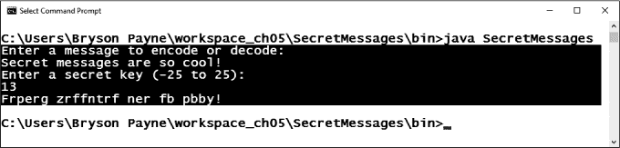
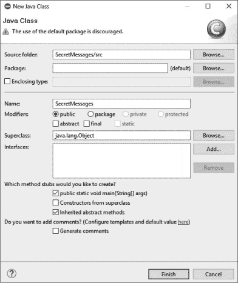
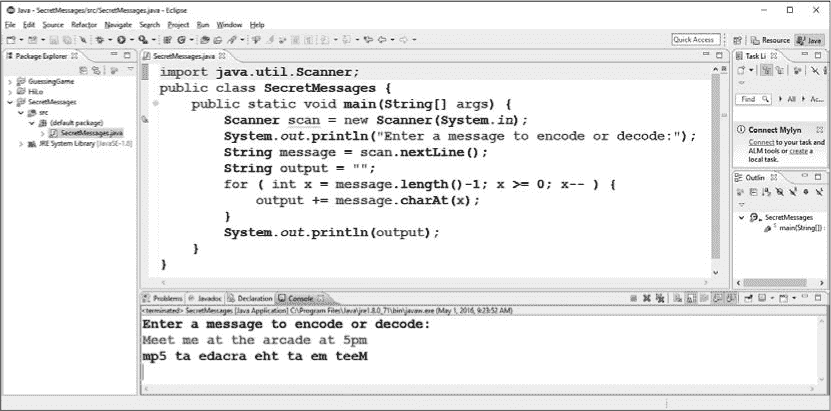
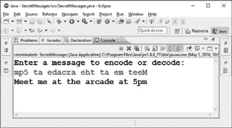
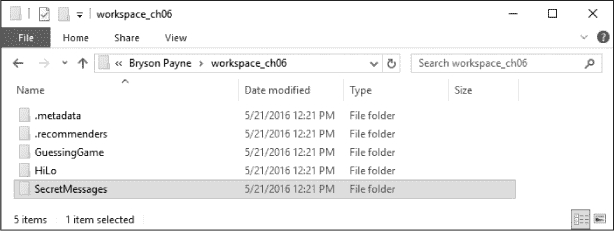
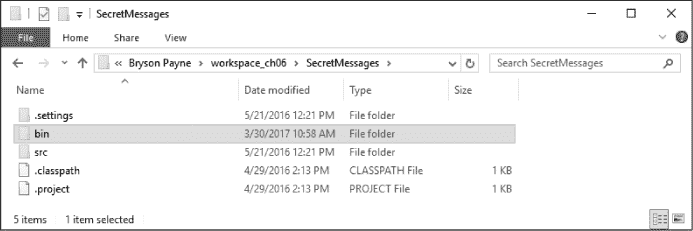
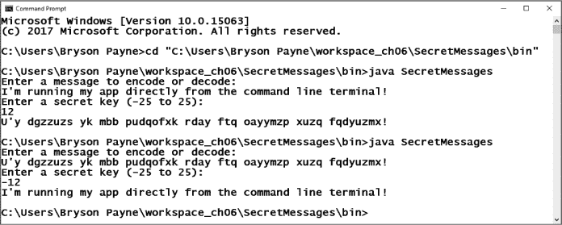

## 第六章：## 解密秘密信息

你可能曾经给朋友发送过加密的秘密便条，试图隐藏消息不被父母或老师发现。在本章中，我们将做类似的事情，创建一个秘密信息应用。

我们之前的应用，Hi-Lo 猜数字游戏，全部围绕数字展开——太高、太低或刚好。相比之下，我们的秘密信息应用将专注于文本。你将学习如何处理文本字符串，并在 Java 中操作字符值，以生成加密信息。

### 凯撒密码

我们的应用将使用*凯撒密码*来加密和解密秘密信息，凯撒密码是一种 2000 多年前开发的算法，通过字母替换来加密信息。

*图 6-1：凯撒密码盘，显示了 13 的关键值*

凯撒密码得名于罗马皇帝尤利乌斯·凯撒（公元前 100–44 年）。历史学家称凯撒喜欢通过“移动”字母表中的字母来加密他的私人信息，例如给军事将领的备忘录。例如，图 6-1 中的密码盘将字母表移动了 13 个字母。

在密码盘中，外侧字母与它们应该替换的内侧字母对齐，因此一个*A*变成*N*，一个*B*变成*O*，依此类推。这就是生成以下示例的密码：

秘密信息真酷！

Secreg messagef ar so cool!

第一行是*明文*：消息的原始可读版本。第二行是*密文*：相同消息的加密版本。

试着通过逆向替换来解码这个信息：找到每个内侧字母，并用对应的外侧字母替代。

并非所有凯撒密码都像这个一样对称。*对称*意味着相同的过程可以用来同时对消息进行编码和解码。例如，*F*通过加 13 编码变为*S*，而通过减 13 解码，*S*变为*F*，你可以使用相同的密码盘和*关键*（用于移动字母的数字）进行这两个过程。用于移动字母的数字（在此为 13）称为“密钥”，因为知道它就能“解锁”密码。我们将构建的秘密信息应用将允许我们使用任何密钥值。

### 设置秘密信息应用

我们将像制作 Hi-Lo 猜数字游戏一样制作秘密信息应用：首先，我们将创建一个命令行版本，然后是桌面 GUI，最后是 Android 移动应用。命令行版本看起来相当简单，如图 6-2 所示，但它将使我们能够快速轻松地测试秘密信息算法。

*图 6-2：秘密信息应用的命令行版本*

如图 6-2 所示，程序提示用户输入要编码或解码的消息，随后是一个密钥值。程序然后会返回编码后的消息。请注意，当我们开始编码应用程序时，整个消息都会被编码，包括空格和标点符号。在最终版本中，我们会添加一些逻辑，只对字母进行编码，如图 6-2 所示。

#### *在 Eclipse 中创建 Secret Messages 项目*

让我们首先打开 Eclipse。如果你还有之前项目的文件未关闭，现在请关闭那些文件。要创建一个新的 Java 项目，请选择 **文件** ▸ **新建** ▸ **Java 项目** 并命名项目为 *SecretMessages*。点击 **完成**。

在包资源管理器面板中，展开 *SecretMessages* 项目文件夹，查看 *src* 文件夹。右键点击 *src* 文件夹，选择 **新建** ▸ **类** 来创建一个新的 Java 源代码文件，你也将该文件命名为 *SecretMessages*。选择勾选框以创建一个 `main()` 方法，如图 6-3 所示。

*图 6-3：创建一个新的 Java 项目，并创建一个名为* SecretMessages *的新类文件，同时选择勾选框来创建一个 main() 方法的代码框架。*

点击 **完成**，你将在 Eclipse 的主窗口中看到 *SecretMessages.java* 文件。让我们开始编码 Secret Messages 应用程序吧！

#### *开始编写 SecretMessages.java 代码*

在 *SecretMessages.java* 文件的顶部，即 `public class SecretMessages` 声明之上，添加 `import` 语句引入 `java.util.Scanner`，以便我们可以请求用户输入：

import java.util.Scanner;

public class SecretMessages {

public static void main(String[] args) {

➊ Scanner scan = new Scanner(System.in);

➋ System.out.println("请输入要编码或解码的消息：");

}

}

在 `main()` 方法内，在 ➊ 处，我们设置一个名为 `scan` 的 `Scanner` 对象。然后，在 ➋ 处，我们提示用户输入要编码或解码的消息。

在用户提示后，我们将创建一个名为 `message` 的 `String` 变量，用于接受用户输入的文本：

System.out.println("请输入要编码或解码的消息：");

String message = scan.nextLine();

然后，我们使用 `scan` 对象的 `nextLine()` 方法获取用户的下一行完整输入，直到按下 ENTER 或 RETURN 键，并将其存储在字符串 `message` 中。

到目前为止，应用程序可以请求用户输入消息，并将该消息扫描到一个变量中。现在我们需要学习如何操作字符串中的字符，以便创建消息的编码版本。在继续下一部分之前，请保存你的文件。

#### *处理字符串*

到目前为止，Secret Messages 应用程序看起来与 Hi-Lo 猜数字游戏应用程序非常相似。我们设置了一个输入扫描器，提示用户输入内容，扫描控制台获取用户的响应，并将输入内容存储到一个变量中。使 Secret Messages 应用程序与众不同的是，它能够处理字符串中的字符。

凯撒密码命令行应用程序将需要很多步骤才能完成，因此我们将以*迭代*的方式构建我们的应用程序。这意味着，和一次性写出整个应用程序并希望最终代码能正常工作不同，我们将一点一点地构建应用程序，或者每次迭代一次，并在过程中进行测试，以确保每个阶段都有一个功能正常的应用程序。每次迭代可能没有我们所需的所有功能，但我们最终会得到一个完整且功能丰富的应用程序。

我们需要使用文本处理来将输入的字符串转换为输出字符串。为了开始在 Java 中处理字符串，我们将构建一个简单的消息反转器。换句话说，我们将获取用户输入的消息，并将其反向输出。举个例子，`"Meet me at the arcade at 5pm"`将变成`"mp5 ta edacra eht ta em teeM"`。

首先，我们创建一个名为`output`的变量来存储反转后的字符串，并将其初始化为空字符串：

String message = scan.nextLine();

String output = "";

我们需要一个循环来遍历消息中的字符。为了方便，我们可以选择使用`for`循环，因为我们知道消息中的字符数。（稍后，我们将使用`message.length()`方法来告诉我们消息包含多少个字符。）Java 中的`for`循环声明需要做三件事：*初始化*一个循环变量，测试*条件*以继续循环，并在下一次迭代前*更新*循环变量。我们在这三部分之间放置分号来分隔它们。语法如下所示：

for ( initialization; condition; update ) { body }

例如，打开 JShell 并输入以下代码来创建一个`for`循环：

jshell> for ( int x = 0; x < 10; x++ ) { System.out.println(x); }

这个循环将打印从`0`到`9`的数字。初始化将第一个循环变量`x`设置为`0`。条件测试确保在继续之前`x`小于`10`。最后，更新操作在每次通过循环后将`x`加 1。`x++`使用了一种快捷方式，称为*自增操作符*，因为它每次通过循环时都会将`x`加 1。`x++`等同于语句`x = x + 1`。在这个示例中，`for`循环在每次通过循环时打印`x`的值，重复执行 10 次，当`x`不再小于`10`时停止。

所以，为了反转消息字符串中的字符，我们可能会初始化一个变量，设置为字符串中最后一个字符的位置编号或*索引*，然后从最后一个字符到第一个字符（反向顺序）循环遍历字符串。在我们的示例中，这将是：

for ( int x = message.length()-1; x >= 0; x-- ) { }

Java 中字符串的字符位置从`0`（第一个字符的索引）到长度减 1。第一个字符的索引是`0`，字符串中的第*n*个字符的索引是(*n* − 1)。

在图 6-4 中，显示了我们示例消息的前 10 个字符。每个字符在字符串中的索引值显示在字符下方。第一个字母`M`的索引为`0`，第一个`e`的索引为`1`，依此类推。注意，空格也算作字符——这里有两个空格，分别位于索引`4`和`7`。消息中的第 10 个字符位于索引`9`，即字母`t`。这个过程一直持续到消息中的最后一个字符，其索引为`message.length()-1`。

*图 6-4：消息中字符的索引标记*

我们希望从字符串的末尾开始反转消息，因此我们将`x`初始化为`message.length()-1`，即消息中最后一个字符的索引。条件为`x >= 0`，因为我们希望一直执行直到消息的第一个字符，索引为`0`。最后，更新为`x--`，因为我们是从字符串末尾向前遍历。`x--`与`x++`相反，使用的是*递减运算符*，每次将`x`的值减 1。返回到 Eclipse 并开始在前一行代码下编写`for`循环：

String output = "";

for ( int x = message.length()-1; x >= 0; x-- ) {

}

要获取字符串中特定位置的字符，我们使用`charAt()`（“字符在”）方法，并给它我们想要的字符的索引位置。要将字符附加或添加到字符串中，我们使用`+`运算符。将这些结合起来，我们可以构建字符串`message`的反转版本，并将其存储在字符串`output`中：

for ( int x = message.length()-1; x >= 0; x-- ) {

output += message.charAt(x);

}

`for`循环的主体是一行代码。我们获取`message`中索引为`x`的字符，并将其添加到`output`中。记得在`for`循环的主体周围加上大括号，因为随着应用程序的增长，我们将希望在循环内添加更多行。

现在我们只需要将输出消息显示到屏幕上，可以通过`System.out.println(output)`来完成。应用程序的完整消息反转迭代展示在清单 6-1 中。

import java.util.Scanner;

public class SecretMessages {

public static void main(String[] args) {

Scanner scan = new Scanner(System.*in*);

System.*out*.println("请输入要编码或解码的消息：");

String message = scan.nextLine();

String output = "";

for ( int x = message.length()-1; x >= 0; x-- ) {

output += message.charAt(x);

}

System.*out*.println(output);

}

}

*清单 6-1：秘密消息应用的第一次迭代反转了用户消息中的字符。*

你可以在 Eclipse 中运行程序，并使用你自己的消息进行测试，如图 6-5 所示。这还不是我们完成的秘密消息应用程序，但它确实使消息变得更难读取，并且容易解码。

*图 6-5：运行程序并在屏幕底部的控制台窗口中输入您自己的消息进行反转。*

您甚至可以通过复制编码后的反转消息并将其粘贴到程序中来解码消息，如图 6-6 所示。因此，您可以输入一条消息，编码它，然后将其粘贴到发送给朋友的消息中，之后他们可以通过将编码后的消息粘贴到相同的程序中来解码。您已经构建了您的第一个秘密信息编码器！

*图 6-6：将编码后的消息复制并粘贴到正在运行的程序中进行解码。*

这个版本的应用足够简单，您可以直接阅读消息，而无需通过程序处理，因此它并不是一种非常安全的方式来向朋友发送消息。但您确实学会了如何使用`for`循环遍历字符串、如何获取字符串的`length()`、如何使用`charAt()`访问字符串中给定索引或位置的特定字符，以及如何使用`+`运算符将字符添加到字符串的末尾。在下一部分，您将学习如何改变消息中每个字符的值，使其更难阅读，但仍然容易让我们的程序解码。

### Java 中的字符和数值

构建一个更好的秘密信息编码器需要能够操作字符串中文本字符的值。对于凯撒密码，我们需要能够移动这些值——例如，将*A*变为*N*，将*N*变为*A*。为此，您需要了解字符在计算机中的存储方式。

在 Java 中，单个字符，例如`'A'`，可以存储在自己的数据类型中：`char`。注意我们使用单引号来包含字符值。字符串的`charAt()`方法返回一个`char`值，表示单个字符。Java 使用 16 位 Unicode 字符。*Unicode*是一种国际字符集，包含来自世界各地的成千上万的字符和符号，它们以数字值的形式表示。`char`类型是一种存储 Unicode 字符的方式，例如`'A'`、`'ñ'`和`'ç'`，它们按数字值存储。

我们可以像给`int`变量加值一样对 Unicode `char`值进行加法操作。在《秘密消息》应用中，我们希望将`'A'`的`char`值（`65`）加到密钥（`13`）上，以获得新的`char`值（`78`），即表示编码后的字母（`'N'`）。

在我们应用的第二个版本中，首先通过设置一个名为`key`的`char`变量，并将值`13`存储在其中，来开始编写凯撒密码。我们将在`String output`行下方添加这一行：

String output = "";

char key = 13;

我们还需要修改`for`循环，以便从字符串的开头遍历到结尾。这一次我们从索引`0`开始，并在`x`小于`message.length()`时继续遍历字符串。每次重复循环时，我们都会将 1 加到`x`，即字符位置。以下是新的`for`循环：

char key = 13;

for ( int x = 0; x < message.length(); x++ ) {

最后， instead of 将`message`字符串的原始字符添加到`output`字符串中，我们需要将密钥值添加到每个字符上，确保我们获得一个`char`值，然后可以将其添加到输出字符串中：

output += (char)(message.charAt(x) + key);

我们已经将密钥值添加到`message`字符串中的每个字符上，然后将这个和转换成了一个`char`。在表达式前加上`char`强制将其右侧的值转换为`char`数据类型，或者说是*类型转换*。我们必须将输出值转换为`(char)`，因为在 Java 中，这个等式的右侧默认会得到一个`int`值。Listing 6-2 展示了这些更改后的程序。

import java.util.Scanner;

public class SecretMessages {

public static void main(String[] args) {

Scanner scan = new Scanner(System.in);

System.out.println("请输入要编码或解码的消息：");

String message = scan.nextLine();

String output = "";

char key = 13;

for ( int x = 0; x < message.length(); x++ ) {

output += (char)(message.charAt(x) + key);

}

System.out.println(output);

}

}

*Listing 6-2: 秘密信息应用程序虽然只有 14 行，但它现在可以编码文本字符串了！*

如果此时运行程序并输入一条消息，您应该会看到类似以下的输出：

请输入要编码或解码的消息：

秘密信息真酷！

`rp□r?-zr??ntr?-n□r-?|-p||y.

消息已被编码，但它并不是我们预期的那样。首先，我们正在对所有字符进行编码，包括空格和标点符号。其次，我们还没有进行字母表的回绕，因为我们*总是*对每个字符加 13，而没有考虑到末尾的字母需要回绕到字母表的开头，这导致了输出消息中出现奇怪的符号和无法打印的字符。我们将在下一节解决这两个问题。在继续之前，请保存您的程序。

### 只编码字母

我们的第二版秘密信息应用给我们带来了一个已编码的消息，但它缺少了一些我们在最终应用中想要的功能。为了创建最终版本的应用，我们需要一些逻辑，比如`if`语句和条件，用于只对字母（而不是空格或标点符号）进行编码，并在编码时使字母表回绕。我们将在第三版中处理这些改进。

首先，我们希望对输入消息中的每个字符执行一些测试，而不是直接将字符添加到输出消息中。让我们按如下方式更改`for`循环的主体：

for ( int x = 0; x < message.length(); x++ ) {

char input = message.charAt(x);

}

存储在 `input` 中的字符将是 `message` 中的第一个字符，然后是第二个，以此类推。我们需要逐一测试每个字符，检查它是否是我们想要编码的字符。我们希望通过将密钥值加到字母上来编码字母，并在必要时将其回绕到字母表的前面。否则，如果字符是空格或标点符号，我们将保持字符不变并将其添加到输出消息中。

让我们在 `for` 循环体内添加以下 `if` 语句：

char input = message.charAt(x);

if (input >= 'A' && input <= 'Z')

在 `if` 语句内的条件中，我们可以使用 `65`（即 `'A'` 的值）或者字符字面量 `'A'` 本身。该条件测试 `input` 中存储的字符是否大于或等于 `'A'` 且小于或等于 `'Z'`——换句话说，是否 `input` 包含一个大写字母。如果此条件为 `true`，我们希望将密钥值加到 `input` 上以进行位移，从而生成凯撒密码的值来替代该字母。注意，这仅适用于大写字母——小写字母将需要另行测试。

现在，在 `if` 语句的主体中，我们将密钥值加到 `input` 字符上以编码字母。这也是我们处理回绕到字母表前面（如果密钥值使字母越过 `'Z'`）的地方。因此，`for` 循环内的代码将变为：

for ( int x = 0; x < message.length(); x++ ) {

char input = message.charAt(x);

if (input >= 'A' && input <= 'Z')

{

➊ input += key;

➋ if (input > 'Z')

➌ input -= 26;

}

➍ output += input;

}

在获取消息中的下一个字符并确保它是大写字母之后，我们通过将密钥加到字母上来对其进行编码 ➊。然后，我们检查添加密钥后，字母是否超过了`Z` ➋。如果是这样，在 ➌ 我们从编码后的`input`值中减去`26`（即英文字母的个数），以便将其回绕到字母表的前面。最后，我们可以将结果 `input` 字符添加到 `output` 字符串中 ➍。

如果你现在运行该程序，你可以像下面这样编码一个全大写字母的消息：

输入一个要编码或解码的消息：

秘密信息真是太酷了！

FRPERG  ZRFFNTRF  NER FB  PBBY!

注意，标点符号和空格保持不变，所有大写字母会被移动 13 个字符，回绕后 `S` 变为 `F`，依此类推。

对小写字母的编码在逻辑上与处理大写字母相同。你可以复制粘贴相同的 `if` 语句代码，但将 `A` 和 `Z` 更改为小写字母。不要忘记在第二个 `if` 语句前加上 `else`。自己试试看；但如果遇到困难，完整的代码在下一节的 Listing 6-3 中提供。

**编码其他语言的信息**

我们正在编写的程序版本只会对基本的拉丁字母（从 *A* 到 *Z* 和 *a* 到 *z*）始终如一地工作。然而，如果你的首选语言不是英语，你可以调整程序，只要 Unicode 中有该语言的字母或符号，并且它们按顺序排布在一个连续的集合中。你可以像处理英语编码器/解码器那样，测试你所选语言的首尾字符。如果你的语言的字符集没有提供完整的字母集，或者使用了基本拉丁字母的部分字符加上某些其他字符（例如西班牙语使用的 ñ 和法语使用的 ç 以及其他带重音符号的字符），你可以像在列表 6-2 中一样，给任何字符添加密钥。你也可以选择通过使用 `Character.isSpace()` 方法在消息中保留空格，编码除了空格以外的所有内容。你可以尝试不同的方法，针对你选择的字母表或语言，找到最适合你的编码方案。修改程序并让它做一些新事情——这是学习的最佳方式！

### 关闭 Scanner

这里有一个可以添加的细节，你可能会从第二章中回忆起。`Scanner`变量`scan`应该有一个黄色下划线，表示在 Eclipse 中出现警告，告诉你存在资源泄漏。当你将鼠标悬停在警告上时，会弹出一条信息：`'scan' is never closed`。记住，当我们使用完所有的输入/输出资源（如 `Scanner` 对象）后，需要关闭它们。为此，我们将在程序的 `main()` 方法中最后一个 `System.out.println` 后添加命令 `scan.close()`：

System.out.println(output);

scan.close();

添加这一行可以消除资源泄漏警告。参见列表 6-3，该列表展示了一个功能完善的凯撒密码编码器和解码器，密钥值为 `13`。

import java.util.Scanner;

public class SecretMessages {

public static void main(String[] args) {

Scanner scan = new Scanner(System.*in*);

System.*out*.println("请输入要编码或解码的消息：");

String message = scan.nextLine();

String output = "";

char key = 13;

for ( int x = 0; x < message.length(); x++ ) {

char input = message.charAt(x);

if (input >= 'A' && input <= 'Z')

{

input += key;

if (input > 'Z')

input -= 26;

}

else if (input >= 'a' && input <= 'z')

{

input += key;

if (input > 'z')

input -= 26;

}

output += input;

}

System.*out*.println(output);

scan.close();

}

}

*列表 6-3：此版本的应用程序是一个功能完善的凯撒密码编码器和解码器，密钥值为 13*。

尝试通过首先运行程序并编码一条消息。然后复制编码后的输出并再次运行程序；当提示时，粘贴编码后的消息并按 ENTER 键。程序将以原始的解码消息进行回应。以下是程序的两次示例运行，我已将第一次消息的编码输出复制，作为第二次运行的输入：

请输入一个消息进行编码或解码：

秘密消息真是太酷了！

Frperg zrffntrf ner fb pbby!

请输入一个消息进行编码或解码：

Frperg zrffntrf ner fb pbby!

秘密消息真是太酷了！

由于凯撒密码是对称的，运行该程序对加密后的消息进行解码，会将消息恢复到原始的明文。这意味着，你可以按照清单 6-3 中的方式运行该程序来加密消息，将加密后的版本发送给也有解码程序的朋友，并让他们立即解码你的消息。

不幸的是，这意味着*任何人*运行该程序（或任何能破解密码的人）都能像你一样迅速解码你的消息。为了下一版，我们将通过允许用户设置自己的密钥值，使代码更加有趣。这样，你就可以为不同的人选择不同的密钥，或者每次使用一个新密钥发送消息。

### 添加自定义密钥值

秘密消息编码器在`13`的密钥值下工作良好，但如果我们想用不同的密钥值来编码和解码消息，比如`3`（经典凯撒密码位移）或`5`或`25`，该怎么办呢？

我们需要提示用户输入一个密钥值，并附加在消息之前。我们可以通过在创建`char`类型的`key`变量之前添加提示来实现：

String output = "";

System.out.println("请输入一个秘密密钥（-25 到 25）：");

char key = 13;

我们允许负密钥值作为解码消息的便利。如果你使用`5`作为密钥值来编码消息并发送给朋友，你的朋友可以使用`-5`的密钥值来解码这条消息。

当用户输入他们想要的秘密密钥值时，我们可以扫描他们提供的输入行，解析出其中的整数值，并将该值存储在一个`int`类型的变量中：

String output = "";

System.out.println("请输入一个秘密密钥（-25 到 25）：");

int keyVal = Integer.parseInt(scan.nextLine());

最后，我们将不再使用`13`作为`key`变量，而是将`key`变量更改为如下：

int keyVal = Integer.parseInt(scan.nextLine());

char key = (char) keyVal;

for ( int x = 0; x < message.length(); x++ ) {

在这里，我们将输入的`keyVal`转换为`char`类型并存储到变量`key`中，因为我们不能直接将整数存储为`char`类型。

为了处理解码过程中负密钥值，我们需要对`if`语句中的逻辑做出一些调整。我们必须检查*减去*某个值（或加上一个负密钥）是否会导致字母超出字母表的开始部分（即小于`'A'`）。如果发生这种情况，我们可以通过*加上*`26`将字母重新移回`A`到`Z`的范围内。将以下代码添加到针对大写字母的`if`语句中：

if (input >= 'A' && input <= 'Z')

{

input += key;

if (input > 'Z')

input -= 26;

if (input < 'A')

input += 26;

}

如果我们输入一个负数的 `key`，我们检查是否将字符移到了 `A` 之前，并添加 `26` 来回绕到字母表的末尾。

记得对紧跟其后的 `else-if` 语句中的小写字母逻辑做相同的处理：

else if (input >= 'a' && input <= 'z')

{

input += key;

if (input > 'z')

input -= 26;

if (input < 'a')

input += 26;

}

在这些修改之后，你将能够运行程序，使用你自己的自定义密钥对消息进行编码和解码。你的程序应该像下面的示例一样工作：

输入要编码或解码的消息：

你写了一个非常酷的 Java 应用程序！

输入一个密钥（-25 到 25）：

7

Fvb'cl dypaalu h ylhssf jvvs hww pu Qhch!

输入要编码或解码的消息：

Fvb'cl dypaalu h ylhssf jvvs hww pu Qhch!

输入一个密钥（-25 到 25）：

-7

你写了一个非常酷的 Java 应用程序！

我们第一次运行程序时，使用了 `7` 作为密钥。所以，为了解码密文，我们再次运行程序，密钥值为 `-7`，从而揭示了原始的明文消息。

赶紧试试吧！

### 编码数字

现在我们已经编码了字母，但是如果我们编码像下面这样的消息，任何数字仍然保持未编码，保留原始明文：

输入要编码或解码的消息：

5 点钟在游戏厅见。

输入一个密钥（-25 到 25）：

8

Ummb um ib bpm izkilm ib 5xu.

注意 `5` 在 `5pm` 中保持为输出消息中的 `5`。如果我们想同时编码数字和字母，我们需要在 `for` 循环中再添加一个逻辑部分。我们需要检查一个字符是否落在 `0` 到 `9` 之间，然后将该字符编码为不同的数字。我们还必须记住将数字环绕回数字集的前面或后面。与字母表中的环绕不同，我们现在处理的是数字。

首先，让我们在处理小写字母的 `else-if` 后面再加一个 `else-if` 语句：

else if (input >= 'a' && input <= 'z')

{

input += key;

if (input > 'z')

input -= 26;

if (input < 'a')

input += 26;

}

else if (input >= '0' && input <= '9')

output += input;

这一部分看起来类似于之前的两个 `if` 条件，只不过我们使用的是数字 `'0'` 到 `'9'`，而不是字母 `'A'` 到 `'Z'`，作为范围。

接下来的这一行，在 `if` 语句的花括号内部，看起来有点不同：

else if (input >= '0' && input <= '9')

{

input += (keyVal % 10);

首先，我们使用了用户在程序中早些时候输入的 `keyVal` 的*整数*版本。其次，我们使用了取模运算符（`%`）来保持数字的偏移值在 `-10` 到 `+10` 之间。

我们还需要测试是否添加 `keyVal` 后将数字推过了 `9` 或者 `0`，就像我们检查编码字母是否越过了 `Z` 或者回到 `A` 一样。但是，代替减去 `26` 来让字母环绕回到字母表的开头，我们需要减去 `10` 来保持数字在 `0` 到 `9` 之间：

else if (input >= '0' && input <= '9')

{

输入 += (keyVal % 10);

如果 (输入 > '9')

输入 -= 10;

如果 (输入 < '0')

输入 += 10;

}

输出 += 输入;

如果编码一个数字导致它超过 `9`，我们就减去 `10`。而如果解码时数字低于 `0`，我们就加上 `10`。

现在，我们可以在发送的消息中同时编码数字和字母：

输入一个要编码或解码的消息：

下午 5 点在游戏机厅见我，并带上 $2 玩吃豆人 :)

输入一个秘密密钥（-25 到 25）:

7

Tlla tl ha aol hyjhkl ha 2wt huk iypun $9 av wshf Whj-Thu :)

`5` 在 `5pm` 中正确地被移动了七位，并且在编码后的消息中回绕回到了 `2wt`。`$2` 中的 `2` 被移动了七位，变成了 `$9`。你可以通过使用 `-7` 的密钥来解码上述的秘密消息，并且应该能得到原始的明文消息，包括数字。

秘密消息应用程序的完整文本版本可以在 清单 6-4 中找到。

导入 java.util.Scanner;

公共类 SecretMessages {

公共静态无效 主方法(String[] args) {

扫描仪 scan = 新扫描仪(System.in);

系统.out.println("输入一个要编码或解码的消息：");

字符串 消息 = scan.nextLine();

字符串 输出 = "";

系统.out.println("输入一个秘密密钥（-25 到 25）：");

int keyVal = Integer.parseInt(scan.nextLine());

字符 密钥 = (字符) keyVal;

对于 ( int x = 0; x < message.length(); x++ ) {

字符 输入 = 消息.charAt(x);

如果 (输入 >= 'A' && 输入 <= 'Z')

{

输入 += 密钥;

如果 (输入 > 'Z')

输入 -= 26;

如果 (输入 < 'A')

输入 += 26;

}

否则，如果 (输入 >= 'a' && 输入 <= 'z')

{

输入 += 密钥;

如果 (输入 > 'z')

输入 -= 26;

如果 (输入 < 'a')

输入 += 26;

}

否则如果 (输入 >= '0' && 输入 <= '9')

{

输入 += (keyVal % 10);

如果 (输入 > '9')

输入 -= 10;

如果 (输入 < '0')

输入 += 10;

}

输出 += 输入;

}

系统.*out*.println(输出);

scan.close();

}

}

*清单 6-4: 完成的命令行版本的秘密消息应用程序*

这个秘密消息应用程序可以是一个有趣的方式，和朋友们交换乱序的消息。但是，你的某些朋友可能没有在他们的计算机上安装 Eclipse 或 Java JDK。能不能也把这个秘密消息应用程序分享给他们呢？在接下来的部分，我们将看到如何在不打开 Eclipse 的情况下运行一个命令行 Java 应用程序。

### 在没有 Eclipse 的情况下运行命令行应用程序

到目前为止，我们已经构建了两个命令行应用程序，但我们总是从 Eclipse 内部运行它们。Eclipse 提供了一个方便的控制台模拟器，让我们可以看到命令行应用程序的样子和感觉，但是如果我们想从实际的命令行中运行这个应用程序，比如 Windows 中的命令提示符或 macOS 上的终端呢？或者如果我们想把我们的命令行应用程序发给一个没有安装 Eclipse 的朋友呢？

幸运的是，大多数人至少在他们的计算机上安装了 JRE，或者 Java 运行时环境。

#### *寻找你的工作空间文件夹*

要运行你在 Eclipse 中编写和编译的应用程序，首先要找到你的 Eclipse*workspace*文件夹。在文件资源管理器（或 Finder）中打开它，如图 6-7 所示。

*图 6-7：我的*workspace*文件夹中包含了每个项目的文件夹，以及一些 Eclipse 默认的文件夹。*

打开*SecretMessages*项目文件夹，你将看到其中有几个文件和文件夹，如图 6-8 所示。*src*文件夹包含你的源代码文件（以*.java*结尾），而*bin*文件夹包含你应用程序的已编译版本（以*.class*结尾）。

*图 6-8：在*SecretMessages*项目文件夹内找到*bin*文件夹。*

#### *打开命令行窗口*

接下来，打开命令行窗口。在 Windows 上，你可以通过按**开始**按钮，进入搜索框，输入`cmd`（*command*的缩写）并按 ENTER 来实现。在 macOS 上，使用 Spotlight 搜索栏找到终端，或者在新的 Finder 窗口中，依次进入**应用程序** ▸ **实用工具** ▸ **终端**。在 Linux 上，打开终端应用程序或使用搜索找到终端。

我们需要从命令行或终端提示符浏览到之前描述的*bin*文件夹。输入`cd`（“change directory”）后跟一个空格，然后，将*bin*文件夹从文件资源管理器或 Finder 窗口拖动并放入命令提示符或终端窗口，如图 6-9 所示。

*图 6-9：你可以将*bin*文件夹从文件资源管理器或 Finder 拖放到命令行窗口，轻松复制目录路径。*

注意，在`cd`命令之后出现完整路径，类似如下（当然，你的*workspace/SecretMessages/bin*文件夹位置与我的稍有不同）：

cd "C:\Users\Bryson Payne\workspace_ch06\SecretMessages\bin"

在 macOS 上，命令将是：

cd /Users/BrysonPayne/Desktop/workspace_ch06/SecretMessages/bin

在输入此命令后按 ENTER，终端将更改提示符，显示你现在已进入*bin*文件夹。在 Windows 上，界面如下：

C:\Users\Bryson Payne\workspace_ch06\SecretMessages\bin>_

现在我们进入了*bin*文件夹，其中*SecretMessages.class*文件已经被编译。要运行包含在*SecretMessages.class*字节码文件中的程序，请输入以下命令：

C:\Users\Bryson Payne\workspace_ch06\SecretMessages\bin>java SecretMessages

拼写、大小写和空格都很重要，因此你需要精确匹配你为 Java 类指定的名称。如果你正确输入了命令，应用程序应该会运行，并且你可以用如下的消息和密钥进行测试：

C:\Users\Bryson Payne\workspace_ch06\SecretMessages\bin>java SecretMessages

输入要编码或解码的消息：

我直接从命令行终端运行我的应用程序！

输入一个秘密密钥（-25 到 25）：

12

U'y dgzzuzs yk mbb pudqofxk rday ftq oayymzp xuzq fqdyuzmx!

您可以通过重新输入`java SecretMessages`命令或按键盘上的上箭头键并按 ENTER 键再次运行应用程序。图 6-10 展示了在 Windows 命令提示符下编码和解码消息的几次运行。

*图 6-10：现在您可以从命令行运行 Java 应用程序，您可以在任何安装了 Java 的计算机上编码和解码消息，无论是否使用 Eclipse。*

现在您知道如何在计算机上运行应用程序后，您可以与朋友共享*SecretMessages.class*文件，以交换编码的消息。如果他们的计算机安装了 Java（JDK 或 JRE），他们只需打开命令行程序，进入包含*SecretMessages.class*文件的文件夹，然后运行相同的`java SecretMessages`命令。要交换消息，只需商定一个密钥值即可。您可以选择每次使用相同的密钥，也可以与不同的朋友使用不同的密钥值！不过，请记住，这个消息应用程序仅供娱乐——任何拥有该程序的人，或者有一点空闲时间的人，都可以破解简单的凯撒密码。我们将在第七章中看到如何轻松破解凯撒密码。

### 您学到了什么

《秘密消息》应用程序提供了一种有趣的方式，深入探讨了如何在 Java 中操作字符和文本字符串。在本章中，您学到的新知识包括：

• 使用凯撒密码对简单消息进行编码和解码

• 理解用于存储单个 Unicode 字符的`char`数据类型

• 使用`charAt()`方法获取字符串中的特定字符

• 使用索引（即字符在字符串中的位置编号）访问字符串中特定位置的字符

• 使用`+`运算符将字符串和字符连接在一起

• 使用`for`循环遍历字符串，使用其`length()`函数获取字符的数量

• 理解计算机如何存储字符和其他由数字值表示的数据

• 直接从命令行运行命令行应用程序，无需 Eclipse

### 编程挑战

尝试这些编程挑战练习，复习和练习您所学的知识，同时通过尝试一些新的内容来扩展您的编程技能。访问本书的网站* [`www.nostarch.com/learnjava/`](https://www.nostarch.com/learnjava/)* 下载示例解决方案。

#### *#1: 循环循环*

我们创建了一个有趣的消息编码/解码应用程序，它允许我们发送和接收秘密文本、电子邮件、推文等。对于您的第一个编程挑战，请向《秘密消息》应用程序添加一个循环，使您能够多次进行消息编码和解码。

你可以选择每次使用相同的密钥，或者每次都询问用户输入一个新密钥。如果你让用户每次通过循环输入一个秘密密钥，他们就可以一个接一个地编码和解码消息（例如，输入`8`将消息编码给朋友，输入`-8`则解码该朋友的消息）。

一种方法是提示用户输入一个新的消息进行编码或解码，或者告诉他们按 ENTER 键退出。然后，使用 `if` 语句检查用户是输入了消息，还是只是按了 ENTER 键。

尝试一下吧！

**提示**

*message.length() 大于零表示用户输入了内容。*

#### *#2: 反转与编码*

让我们通过在编码消息之前先反转消息来让我们的消息更难解密。这个双重编码版本的应用程序将结合 Listing 6-1 中第 130 页的第一版消息反转方法和 Listing 6-4 中第 140 页的凯撒密码特性。

反转消息的顺序是另一种对称加密的例子——执行一次反转消息，执行第二次就能恢复原始消息。将字符串反转与凯撒密码的移位结合并不会让程序变得更加复杂，但可以使得你的消息对于窃听者来说更加难以理解。

确保你的应用程序能正确地编码和解码消息，并记住，你的朋友需要更新后的程序版本才能解密你新的、经过双重加密的消息！享受这个过程吧！

#### *#3: 使用 try 和 catch 安全地处理密钥*

你可以对 Secret Messages 应用程序做的最后一个改进是，当用户输入密钥值时，安全地处理错误的数字输入。还记得 `try-catch` 语句吗？

向这个应用程序添加 `try-catch` 块可能有点棘手。除了添加异常处理代码以防止用户通过输入错误数字（例如，在要求输入密钥时输入文本）导致程序崩溃之外，你还需要考虑当提供错误输入时，应用程序应该怎么做。它是应该告诉用户密钥无效，并使用预定义的密钥（比如 `13`）代替？还是应该创建一个循环，不断要求用户输入有效的密钥？

尝试两种方式进行编码，选择你最喜欢的一种！
