## 第七章：## 创建高级 GUI 和分享你的应用程序

对于 Secret Messages 应用程序的桌面版 GUI，我们将提供两个大文本区域，允许用户在 GUI 界面中复制并粘贴长消息。在本章结束时，我们将像 图 7-1 中所示，添加一个用于选择密钥的滑块，这将使破解凯撒密码变得非常简单，即使密钥未知！

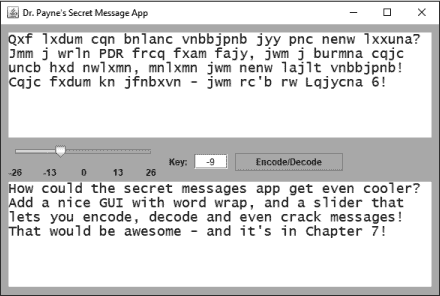

*图 7-1：我们将在本章构建的 Secret Messages 编码/解码应用程序*

这个版本的应用程序比基于控制台的应用程序更友好，我们将能够重用一些来自 第六章 的代码，因为编码和解码消息的算法是相同的。

### 设置 Secret Messages GUI 应用程序项目

打开 Eclipse，选择 **文件** ▸ **新建** ▸ **Java 项目** 创建一个新的 Java 项目。将项目命名为 `SecretMessagesGUI`，然后点击 **完成**。关闭所有打开的文件，展开包资源管理器中的 *SecretMessagesGUI* 项目文件夹，找到 *src* 文件夹。右键单击 *src* 文件夹，选择 **新建** ▸ **类** 创建一个新的 Java 源代码文件。将文件命名为 `SecretMessagesGUI`。

我们将再次使用 Swing 工具包，因此在新建 Java 类对话框中，将父类更改为 `javax.swing.JFrame`，并选中复选框以创建 `main()` 方法。

点击**完成**，你将看到一些熟悉的骨架代码，位于 *SecretMessagesGUI.java* 文件中。右键单击 *SecretMessagesGUI.java* 文件，在包资源管理器中选择 **打开方式** ▸ **WindowBuilder 编辑器**，开始为秘密消息应用程序创建 GUI 界面。

### 设计 GUI 和命名组件

打开 WindowBuilder 编辑器的设计标签。在组件面板中展开 `javax.swing.JFrame` 组件并选择 **getContentPane()**。然后，转到属性面板，将 `Layout` 属性更改为 **绝对布局**，如 图 7-2 所示。这将允许我们以像素级精度定位组件。

*图 7-2：在放置任何 GUI 组件之前，将布局属性更改为* ***绝对布局***。

接下来，在组件面板中点击 **javax.swing.JFrame**。然后，在属性面板中，将 `defaultCloseOperation` 设置为 **EXIT_ON_CLOSE**。此外，将 `title` 属性更改为 `Your Name`'s Secret Message App`，如 图 7-3 所示。

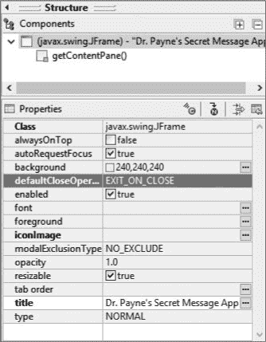

*图 7-3：更改 `defaultCloseOperation` 和 `title` 属性以自定义应用程序。*

接下来，让我们为自己腾出一些空间，构建一个稍微大的 GUI 界面，这样我们就可以编码和解码更长的消息。仍然在组件面板中选择`javax.swing.JFrame`，点击设计预览中的窗口外边框。点击窗口右下角的小黑色调整框，向下拖动并向右拖动，将框架大小调整为 600×400 像素，如图 7-4 所示。

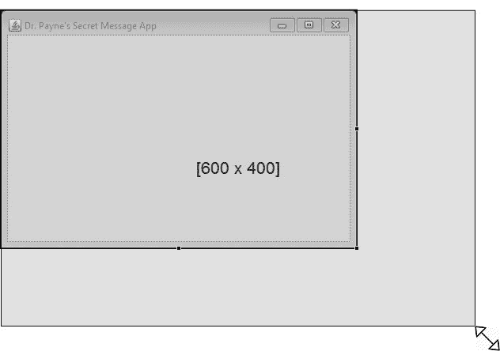

*图 7-4：调整 JFrame 大小以容纳更大的消息。*

现在，我们准备开始放置 GUI 界面组件。对于该应用程序的 GUI 版本，我们希望能够编码和解码长消息，因此我们将放置的第一个组件是`JTextArea`。与`JTextField`类似，文本区域允许你输入文本，但`JTextArea`可以容纳、显示，甚至换行显示多行文本。

要插入第一个`JTextArea`供用户输入消息，在组件面板中的 Palette 下点击**JTextArea**。然后将其放置在`JFrame`顶部附近的设计预览中。点击并拖动，绘制一个`JTextArea`，大约占据内容面板高度的三分之一，`JTextArea`与框架边缘之间留有小边距。`JTextArea`的宽度应约为 564 像素，高度为 140 像素。然后，在属性面板中，将`Variable`属性更改为`txtIn`。

要创建第二个用于输出消息的`JTextArea`，右键点击预览面板中的**txtIn**，选择**复制**，然后右键点击内容面板，选择**粘贴**。将新的`JTextArea`放置在框架的底部边缘附近。为了给新的`JTextArea`命名，将`Variable`属性更改为`txtOut`。最终你应该会得到两个`JTextArea`组件，如图 7-5 所示。

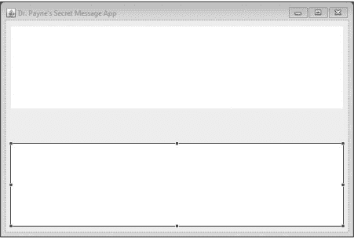

*图 7-5：复制并粘贴 txtIn 以创建第二个 JTextArea 并命名为 txtOut。*

接下来，让我们为加密密钥值添加一个文本字段。在组件面板的**JTextField**上点击，然后点击内容面板中接近中心的位置以放置`JTextField`。将`JTextField`的`Variable`属性更改为`txtKey`，并将其大小调整为原始大小的一半。

在`txtKey`左侧添加一个`JLabel`，将标签的`text`属性设置为`Key:`。将`horizontalAlignment`设置为**RIGHT**。最后，在`txtKey`右侧添加一个`JButton`，将按钮的`text`属性设置为`Encode/Decode`。扩展按钮的宽度，直到它显示完整的文本。界面应该像图 7-6 所示。要在不运行应用程序的情况下预览界面，请点击 Palette 上方的“测试 GUI”按钮，该按钮在图 7-6 中被圈出。

*图 7-6：通过点击 Palette 上方的测试 GUI 按钮来测试 GUI 界面。*

现在你已经设置好了用户界面，是时候编写程序代码了。

### 编写秘密消息 GUI 应用程序

通过点击设计视图窗口左下角的 Source 选项卡切换回源代码视图。你会看到，Eclipse 已经将所有 GUI 代码添加到了*SecretMessagesGUI.java*文件中。为了将 GUI 与我们的应用程序连接起来，我们首先需要在`SecretMessagesGUI`类的顶部添加两个`JTextArea`变量的声明。Eclipse 知道`JTextField`组件通常需要用户输入的事件处理程序，因此将`txtKey`放在了类的顶部，但我们需要对两个`JTextArea`组件，`txtIn`和`txtOut`，做相同的处理。添加以下两行代码：

public class SecretMessagesGUI extends JFrame {

private JTextField txtKey;

private JTextArea txtIn;

private JTextArea txtOut;

在文件顶部声明`JTextArea`变量后，我们需要修改`SecretMessagesGUI()`构造函数中的代码。删除以下两行开头的`JTextArea`变量类型：

public SecretMessagesGUI() {

setTitle("Dr. Payne 的秘密消息应用");

setDefaultCloseOperation(JFrame.*EXIT_ON_CLOSE*);

getContentPane().setLayout(null);

txtIn = new JTextArea(); // 删除行首的“JTextArea”

txtIn.setBounds(10, 11, 564, 140);

getContentPane().add(txtIn);

txtOut = new JTextArea(); // 删除行首的“JTextArea”

txtOut.setBounds(10, 210, 564, 140);

getContentPane().add(txtOut);

做了这些修改后，我们就可以开始编写方法来处理每次用户点击“编码/解码”按钮时的消息编码了。

#### *创建 encode() 方法*

我们将要编写的`encode()`方法类似于第三章中 Hi-Lo 猜数字游戏应用的`checkGuess()`方法。`checkGuess()`方法接收一个字符串作为用户的猜测，但该方法不需要返回任何值，所以它返回了`void`。与`checkGuess()`不同，`encode()`将接收一个消息和一个加密密钥作为参数，并且不会返回`void`，而是返回一个编码后的消息。

方法返回值是为了让程序可以使用它们。我们希望`encode()`方法接收来自用户的消息和密钥，然后对这些值进行处理以生成编码后的消息，程序将把它作为用户的输出。当声明一个返回值的方法时，我们在方法名之前指定返回值的数据类型。我们希望从`encode()`返回的值是一个`String`类型的变量。所以，`encode()`将声明为`public String encode()`。

我们需要告诉 Java 我们想要传递给`encode()`的信息是什么，这些信息被称为方法的*参数*。要声明方法的参数，我们将它们放在方法名后的圆括号内，参数的数据类型放在前面，参数的名称放在后面。多个参数用逗号分隔。`encode()`方法的声明如下：

public String encode( String message, int keyVal )

让我们为方法体添加大括号，并将`encode()`方法放在两个`JTextArea`变量的声明下面，`SecretMessagesGUI()`构造方法上面：

public class SecretMessagesGUI extends JFrame {

private JTextField txtKey;

private JTextArea txtIn;

private JTextArea txtOut;

public String encode( String message, int keyVal ) {

}

public SecretMessagesGUI() {

Eclipse 将用红色下划线标出`encode()`方法，提示你还没有返回一个值，但那是因为我们还没有在方法体内编写代码。这里我们将重用第六章中的一些代码。

声明一个名为`output`的`String`，先将其设为空字符串，并添加一行代码使用`return`语句返回`output`作为`encode()`方法的结果：

public String encode( String message, int keyVal ) {

String output = "";

return output;

}

由于`encode()`方法声明为返回一个`String`值，而我们正在返回`output`，它*确实*是一个`String`，Eclipse 将去掉红色下划线，表明我们已经解决了缺少返回值的问题。

接下来，我们将重用该应用程序基于文本的版本中的一部分代码来编码消息。请在项目资源管理器窗格中打开第六章的*SecretMessages*项目。

我们可以复制从`char key`开始，到`for`循环的闭括号结束的代码，紧接着在程序末尾的`System.out.println(output);`之前。这部分代码是用凯撒密码算法对消息进行编码的应用部分。

将从*SecretMessages.java*复制的代码粘贴到*SecretMessagesGUI.java*中的`encode()`方法内，放在我们刚刚添加的两行之间。完成的`encode()`方法如下所示：

public String encode( String message, int keyVal ) {

String output = "";

char key = (char) keyVal;

for ( int x = 0; x < message.length(); x++ ) {

char input = message.charAt(x);

if (input >= 'A' && input <= 'Z')

{

input += key;

if (input > 'Z')

input -= 26;

if (input < 'A')

input += 26;

}

else if (input >= 'a' && input <= 'z')

{

input += key;

if (input > 'z')

input -= 26;

if (input < 'a')

input += 26;

}

else if (input >= '0' && input <= '9')

{

input += (keyVal % 10);

if (input > '9')

input -= 10;

if (input < '0')

input += 10;

}

output += input;

}

return output;

}

因为我们一致地命名了变量，所以可以重用凯撒密码加密代码。一致的命名是一个好习惯，并且编写得当的 Java 代码可以跨多个平台重用。

#### *为编码/解码按钮编写事件处理程序*

我们希望用户提供输入消息和密钥值，我们将把它传递给 GUI 界面中的`encode()`方法，并希望在用户按下编码/解码按钮时返回输出消息，因此我们需要编写处理按钮点击事件的代码。

切换到*SecretMessagesGUI.java*中的设计视图，并双击**编码/解码**按钮。Eclipse 将切换回源代码视图，并插入`actionPerformed()`事件处理程序的代码，如下所示：

JButton btnEncodedecode = new JButton("编码/解码");

btnEncodedecode.addActionListener(new ActionListener() {

public void actionPerformed(ActionEvent arg0) {

}

});

这是一个匿名内部类，就像我们在第三章中首次遇到的那样。我们只需要添加`actionPerformed()`内部的代码，告诉 Java 按钮在点击时应该执行什么操作。

我们希望`Encode/Decode`按钮执行以下步骤：

1\. 从`txtIn`获取输入消息。

2\. 从`txtKey`获取密钥。

3\. 使用密钥对消息进行编码。

4\. 在`txtOut`中显示输出消息。

想想我们如何完成这些步骤。在继续阅读之前，自己尝试一下，然后阅读下面的内容，看看我的解决方案是如何比较的。

对于第一步，我们可以设置一个名为`message`的`String`，它从`txtIn`字段中获取文本。就像`JTextField`一样，`JTextArea`也有一个`getText()`方法：

public void actionPerformed(ActionEvent arg0) {

String message = txtIn.getText();

对于第二步，我们可以通过`Integer.parseInt()`方法从`txtKey`中获取用户的密钥，该方法从文本字符串中提取一个整数值。然后我们将得到的整数存储在一个变量中，我们将其命名为`key`：

String message = txtIn.getText();

int key = Integer.parseInt( txtKey.getText() );

在第三步中编码消息，我们只需调用`encode()`方法并传递两个参数。*参数*是我们传递给方法的值，作为方法的输入。记住，我们定义`encode()`需要两个参数，因此我们需要将`message`和`key`作为两个参数传递给`encode()`。

我们可以通过`encode(message, key)`语句调用`encode()`。当它执行完毕后，它将返回编码后的消息，即`output`。请注意，方法返回的是值本身，而不是存储值的变量。这意味着编码后的消息存储在`output`中，但当`encode()`返回`output`时，我们实际上只得到了编码后的字符串。除此之外，所有在`encode()`内部创建的代码和变量不会传递到程序的其他部分，因此一旦`encode()`返回，`output`变量就不存在了。如果我们希望保存它，我们需要将方法返回的值存储在一个新的变量中。为了保持命名一致性，我们也将新变量命名为`output`：

String message = txtIn.getText();

int key = Integer.parseInt( txtKey.getText() );

String output = encode( message, key );

最后，我们将使用`setText()`方法在`txtOut`中显示`output`消息：

String message = txtIn.getText();

int key = Integer.parseInt( txtKey.getText() );

String output = encode( message, key );

txtOut.setText( output );

`actionPerformed()` 方法几乎完成，唯一缺少的是一些错误处理。我们已经使用了 `Integer.parseInt()` 方法，这个方法在用户输入错误时可能会抛出异常，因此我们需要添加 `try-catch` 语句。

#### *处理错误输入和用户错误*

处理按钮点击的代码中包含了对 `Integer.parseInt()` 的调用，我们在第三章学到过，当用户输入错误时，这个方法可能会抛出异常。特别是，如果用户将 `txtKey` 输入框留空，或者在该 `JTextField` 中输入非整数内容，`Integer.parseInt()` 方法将会失败。

我们需要通过使用 `try-catch` 块来保护程序，处理异常。由于我们只希望在用户正确输入加密密钥后才对消息进行编码或解码，因此我们可以通过在第一行之前添加 `try` 关键字和一个开括号，并在第四行之后添加闭括号，将 `actionPerformed()` 中的四行代码包装在 `try` 块内，如下所示：

public void actionPerformed(ActionEvent arg0) {

try {

String message = txtIn.getText();

int key = Integer.*parseInt*( txtKey.getText() );

String output = encode( message, key );

txtOut.setText( output );

} catch (Exception ex) {

}

}

Eclipse 将用红色高亮显示闭括号，因此我们接着添加 `catch` 块，如下所示。当接收到错误输入时，我们需要告诉 Java 如何处理，并且稍后我们将把这些步骤添加到 `catch` 语句的括号内。但首先，让我们完成 `main()` 方法，以便可以测试应用程序。

#### *构建 main() 方法并运行应用程序*

就像我们在第三章创建游戏应用程序时一样，我们需要在 `main()` 方法中添加一些设置代码，来创建一个 Secret Messages 应用程序的实例，正确设置 GUI 窗口的大小，并使 GUI 对用户可见。在 *SecretMessagesGUI.java* 文件的底部，找到 Eclipse 提供的 `main()` 方法的代码框架，并添加以下三行。

public static void main(String[] args) {

➊ SecretMessagesGUI theApp = new SecretMessagesGUI();

➋ theApp.setSize(new java.awt.Dimension(600,400));

➌ theApp.setVisible(true);

}

➊ 这一行创建了一个名为 `theApp` 的 `SecretMessagesGUI` 对象。`new` 关键字后跟类名，调用构造方法 `SecretMessagesGUI()`，它会设置所有 GUI 界面组件。

接下来，我们将 `JFrame` 的大小设置为与我们在设计布局时使用的宽度和高度相匹配，即 600x400 像素 ➋。最后，我们将 `JFrame` 的 `visible` 属性设置为 `true` ➌，使用户能够看到 GUI。保存这些更改，然后运行应用程序进行测试，如图 7-7 所示。

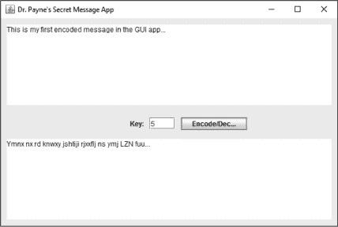

*图 7-7：Secret Messages 应用程序仍然有些简单，但它可以进行消息的编码和解码！*

以下是 *SecretMessagesGUI.java* 文件到目前为止的完整源代码：

import javax.swing.JFrame;

import javax.swing.JTextArea;

import javax.swing.JTextField;

import javax.swing.JLabel;

import javax.swing.JButton;

import java.awt.event.ActionListener;

import java.awt.Dimension;

import java.awt.event.ActionEvent;

public class SecretMessagesGUI extends JFrame {

private JTextField txtKey;

private JTextArea txtIn;

private JTextArea txtOut;

public String encode( String message, int keyVal ) {

String output = "";

char key = (char) keyVal;

for ( int x = 0; x < message.length(); x++ ) {

char input = message.charAt(x);

if (input >= 'A' && input <= 'Z')

{

input += key;

if (input > 'Z')

input -= 26;

if (input < 'A')

input += 26;

}

else if (input >= 'a' && input <= 'z')

{

input += key;

if (input > 'z')

input -= 26;

if (input < 'a')

input += 26;

}

else if (input >= '0' && input <= '9')

{

input += (keyVal % 10);

if (input > '9')

input -= 10;

if (input < '0')

input += 10;

}

output += input;

}

return output;

}

public SecretMessagesGUI() {

setTitle("Payne 博士的秘密信息应用");

setDefaultCloseOperation(JFrame.*EXIT_ON_CLOSE*);

getContentPane().setLayout(null);

txtIn = new JTextArea();

txtIn.setBounds(10, 11, 564, 140);

getContentPane().add(txtIn);

txtOut = new JTextArea();

txtOut.setBounds(10, 210, 564, 140);

getContentPane().add(txtOut);

txtKey = new JTextField();

txtKey.setBounds(258, 173, 44, 20);

getContentPane().add(txtKey);

JLabel lblKey = new JLabel("密钥：");

lblKey.setBounds(202, 176, 46, 14);

getContentPane().add(lblKey);

JButton btnEncodedecode = new JButton("编码/解码");

btnEncodedecode.addActionListener(new ActionListener() {

public void actionPerformed(ActionEvent arg0) {

try {

String message = txtIn.getText();

int key = Integer.*parseInt*( txtKey.getText() );

String output = encode( message, key );

txtOut.setText( output );

} catch (Exception ex) {

}

}

});

btnEncodedecode.setBounds(312, 172, 144, 23);

getContentPane().add(btnEncodedecode);

}

public static void main(String[] args) {

SecretMessagesGUI theApp = new SecretMessagesGUI();

theApp.setSize(new java.awt.Dimension(600,400));

theApp.setVisible(true);

}

}

这个应用的第一个版本是成功的，但在视觉效果上还有些欠缺。我们可以通过一些小调整，使得 GUI 界面看起来更加专业。

### 改善 GUI

现在，让我们切换回设计视图，修正我们在上一部分中提到的问题。首先，点击**编码/解码**按钮，并稍微加宽它。不同的计算机可能有不同的默认字体和大小，所以为了保险起见，给按钮留一点额外空间。

现在，让我们把两个`JTextArea`字段的字体大小调大一些，便于阅读。我们想改变这两个文本区域的字体属性，所以可以通过点击`txtIn`然后按住 CTRL 键点击（或-点击）来同时选择`txtIn`和`txtOut`。

选中两个文本区域后，转到属性面板中的`font`属性，点击字体大小旁边的三个点。字体选择器对话框将会出现，如图 7-8 所示。

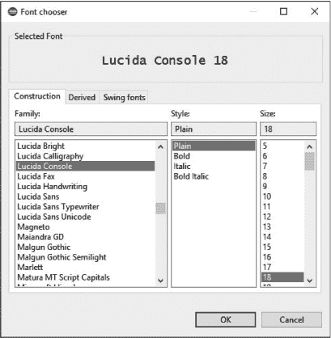

*图 7-8：我们可以同时更改两个 JTextArea 字段的字体属性。*

选择字体大小为 18 或更大，并选择你喜欢的字体。最好选择一种常见字体，这样当你在不同计算机上与朋友分享应用程序时，外观和感觉不会变化得太剧烈。我选择了 Lucida Console，18 磅。点击**确定**保存字体选择。

最后，让我们更改内容面板的背景颜色来进行个性化设置。在左上角的组件面板中点击**getContentPane()**以选择内容面板。然后，在属性面板中点击`background`属性旁边的三个点。在弹出的颜色选择器对话框中，选择**命名颜色**选项卡，如图 7-9 所示。你将看到一系列的颜色。选择你喜欢的颜色并点击**确定**。

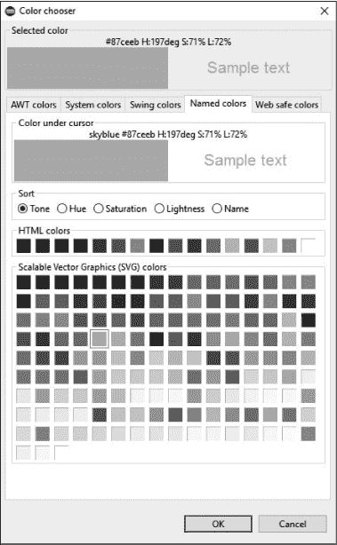

*图 7-9：更改内容面板和按钮的背景颜色，使应用程序更加时尚。*

你还可以更改编码/解码按钮的背景颜色。你可能在设计预览中看不到所有更改，但如果你运行应用程序，应该能看到你新的选择，如图 7-10 所示，并且显示你选择的任何新背景颜色。

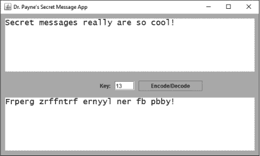

*图 7-10：更改按钮大小和字体大小后的图形用户界面（GUI）。*

你还可以根据自己的偏好自定义许多其他属性。浏览每个组件的属性面板并进行调整，直到应用程序看起来符合你的要求。记得停止并保存你的应用程序，以免更改丢失！

#### *设置自动换行和单词换行*

到目前为止，我在示例中使用的消息都比一行短。但是，如果我们输入几行文本，会发生什么呢？

让我们试着输入或粘贴一条长句子到输入文本区域。我将使用美国总统亚伯拉罕·林肯的《葛底斯堡演讲》中的第一句话：

八十七年前，我们的先祖在这片大陆上建立了一个新的国家，这个国家立足于自由，致力于所有人生而平等的理念。

你可以使用这句话或自己编造一个长句。不管怎样，当你输入它时，你会发现一个问题，如图 7-11 所示。

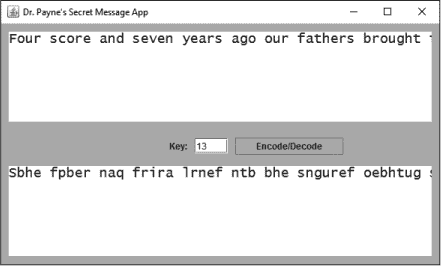

*图 7-11：应用程序中的长消息目前还不能自动换行。*

要正确地将较长的文本行按完整单词换行，您需要更改每个文本区域的*两个*属性。在设计预览中再次选择两个`JTextArea`对象，然后在属性面板中，勾选`lineWrap`和`wrapStyleWord`旁边的复选框。第一个属性`lineWrap`告诉 Java 将长于一行的文本换到下一行。将换行样式设置为`wrapStyleWord`告诉 Java 在完整单词的末尾换行，就像我们在文字处理软件中做的那样，或者像本书中所示的那样。

现在保存并再次运行应用程序。将你的长句子粘贴到第一个文本框中，你应该会注意到一个改进。现在文本被正确地换行，且每行的最后一个完整单词后面有换行符。输入一个密钥并按下**编码/解码**按钮，你会看到输出文本区域中的文本同样换行，如图 7-12 所示。

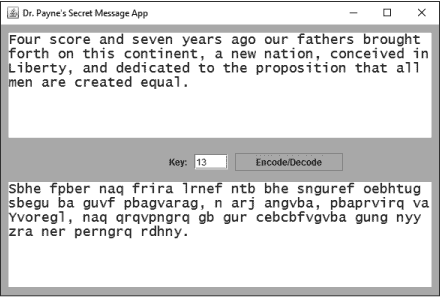

*图 7-12：将`lineWrap`和`wrapStyleWord`属性都设置为 true，结果是一个漂亮的多行界面，配有单词换行。*

这个版本的程序看起来更加专业，但如果我们在加密密钥的文本框中输入错误的内容会发生什么呢？嗯，目前还没有任何反应。我们之前添加了一个`try`语句，但并没有完成`catch`语句。现在我们来完成它。同时，我们还将学习如何创建弹出消息对话框来提醒用户错误。

#### *处理错误输入和用户错误：第二部分*

在本章之前，我们在按钮事件处理程序周围添加了一个`try`块，但我们将`catch`语句的主体留空了。现在是时候用代码填充它了。

我们的`catch`语句将处理`txtKey`文本框中的错误或缺失的用户输入。如果用户忘记输入加密密钥的值，或者他们输入的值不是数字，一种处理方式是弹出一条消息来描述问题，就像图 7-13 中显示的那样。

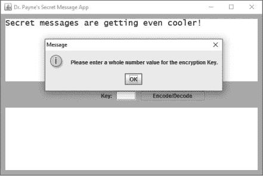

*图 7-13：弹出对话框警告用户发生错误。*

用户关闭弹出窗口后，另一个有用的细节是将光标移动到`txtKey`文本框中，并突出显示或选择那里任何文本，以便用户能够轻松输入新值，而无需手动点击和选择值。

我们一直在使用的`javax.swing`工具包为 GUI 组件，如`JFrame`和`JTextField`，也提供了处理各种类型弹出窗口的类。一些例子包括*输入对话框*，允许用户提供文本输入；*确认对话框*，允许用户选择“是/否/确定”或“取消”；以及*消息对话框*，在弹出窗口中向用户提供信息。

我们希望提供给用户的错误信息最好通过消息对话框显示。`javax.swing.JOptionPane`类有一个名为`showMessageDialog()`的方法，该方法接受两个参数，一个是父窗口，另一个是要显示的消息。如果我们正在编写一个更大的应用程序，我们可以使用父窗口参数将对话框居中显示在主文本处理窗口上。例如。但是对于这个应用程序，我们可以使用关键字`null`将对话框居中显示在桌面上，如下所示：

JOptionPane.showMessageDialog(null,

"请输入一个整数值作为加密密钥。");

当这行代码被调用时，它会弹出一个消息对话框，显示“请输入一个整数值作为加密密钥。”

要将这个弹出错误消息添加到我们之前创建的`catch`语句中，请进入设计视图，双击**Encode/Decode**按钮。这是一种快速方式，可以让 Eclipse 直接带你进入包含`catch`语句的按钮点击事件处理源代码。

在错误信息显示后，我们还希望将光标放置在`txtKey`字段中并选中当前在`txtKey`字段中的所有文本，正如我们在 Hi-Lo 猜数字游戏 GUI 应用中所做的那样。我们将在`catch`语句的花括号内添加消息对话框以及相同的`requestFocus()`和`selectAll()`语句，这些语句在 Hi-Lo 猜数字游戏应用中也用过。Encode/Decode 按钮的完成事件处理代码如下所示：

btnEncodedecode.addActionListener(new ActionListener() {

public void actionPerformed(ActionEvent arg0) {

try {

String message = txtIn.getText();

int key = Integer.parseInt( txtKey.getText() );

String output = encode( message, key );

txtOut.setText( output );

} catch (Exception ex) {

JOptionPane.*showMessageDialog*(null,

"请输入一个整数值作为加密密钥。");

txtKey.requestFocus();

txtKey.selectAll();

}

}

});

**注意**

*当你添加 JOptionPane 时，如果没有使用内容提示或看到 JOptionPane 的错误，你可能需要按 ctrl-shift-O 来正确导入 javax.swing.JOptionPane 类。*

现在运行应用程序，留空密钥字段或在密钥中输入非数字文本。消息对话框将弹出，要求你输入一个有效的密钥。它还会高亮显示密钥字段中的文本，以便在对话框关闭后，用户可以轻松输入一个整数。

首次使用者可能不知道应该在密钥字段中输入什么内容，因此添加一个默认值也许是一个有用的 UI 调整。点击设计标签，选择`txtKey`文本字段，并在属性窗格中的`text`属性中输入一个默认的密钥值。我会选择`3`作为我的默认加密密钥，但你可以选择任何数字。我们还将`txtKey`字段的`horizontalAlignment`属性改为**CENTER**。你可以根据需要改变其他属性，使`txtKey`看起来正如你所希望的那样，包括字体颜色和样式。

#### *将滑块添加到秘密消息 GUI 中*

我们将为秘密消息应用程序添加一个用户界面改进——一个数字滑块，允许用户快速滑动键值，并查看每个新键值下消息的变化。

在设计视图中，在“组件”面板下选择**JSlider**组件。将鼠标悬停在设计预览的中左侧，靠近键提示的地方，点击并将`JSlider`拖放到合适位置，如图 7-14 所示——如果需要，稍后可以调整位置。

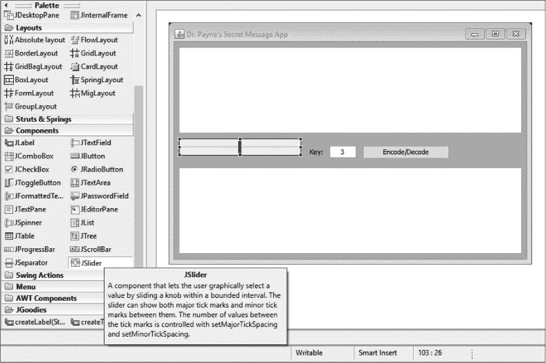

*图 7-14：将 JSlider 添加到图形用户界面，快速简便地尝试不同的键值。*

现在让我们自定义一些`JSlider`的属性。首先，将它的背景颜色更改为与应用程序其余部分相匹配。在设计预览中选中新的`JSlider`，点击属性面板中`background`属性旁边的三个点，进入颜色选择器对话框中的**命名颜色**，然后选择与其余 GUI 相同的颜色。点击**确定**以保存滑块的新背景颜色。

接下来，我们将为滑块添加自定义标签、刻度标记和默认值。首先，通过选择**true**复选框来启用`paintLabels`属性。其次，设置`maximum`值为`26`，`minimum`值为`–26`，这样可以方便地选择正确范围内的键值。

接下来，为`minorTickSpacing`属性输入值`1`——这将在滑块轨道上添加小的刻度标记，帮助用户看到可能值的范围。然后，为`majorTickSpacing`属性输入`13`——这将在滑块上显示每 13 个值（从`-26`到`26`）的标签。现在，通过选择**true**复选框来启用`paintTicks`属性。我们所做的所有更改的完整属性面板显示在图 7-15 中。

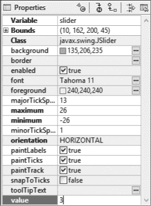

*图 7-15：自定义滑块的属性*

我们快完成了！通过修改`value`属性，将滑块的默认值更改为与键文本字段中的默认键值相匹配。我选择了`3`作为我的默认键值，因此我将在滑块的`value`属性中输入`3`。最后，你需要将滑块的高度稍微增加一些，以显示标签，如图 7-16 中显示的完成滑块。

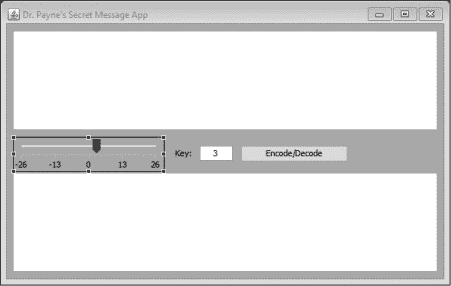

*图 7-16：秘密消息应用程序中的 GUI 滑块已就位*

现在，我们需要添加代码使滑块生效，允许用户在不同的键值之间轻松滑动，以便快速编码和解码消息。

### 使用滑块破解代码

我们希望用户能够通过点击并拖动我们在上一部分中添加的滑块来更改加密键值，因此接下来我们将添加一个事件处理程序，以监听滑块的变化。

右键点击或按住 CTRL 键点击设计预览中的滑块，然后选择**添加事件处理程序** ▸ **change** ▸ **stateChanged**，如图 7-17 所示。`stateChanged`事件处理程序的工作方式类似于编码/解码按钮的`actionPerformed`事件处理程序，但它会在用户每次更改滑块位置时运行，以更新加密密钥值。

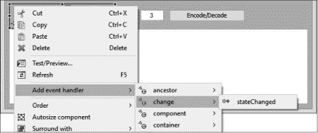

*图 7-17：为滑块添加事件处理程序，以便检测用户何时更改滑块的值*

当你点击为滑块添加`stateChanged`事件处理程序时，Eclipse 将自动生成另一个匿名内部类，类似于它为编码/解码按钮创建的类。但在查看这个匿名内部类之前，我们需要在类的顶部添加`JSlider`和`JTextArea`声明。为此，我们必须将`JSlider`声明为实例变量。将这里显示的最后一行添加到`SecretMessagesGUI`类顶部的声明中：

public class SecretMessagesGUI extends JFrame {

private JTextField txtKey;

private JTextArea txtIn;

private JTextArea txtOut;

private JSlider slider;

然后，向下滚动回到滑块代码。记住，你可以切换回设计视图，并右键点击再次添加事件处理程序，直接进入代码，每当你迷路时。现在，修改第一行，去掉`JSlider`类型声明，如下所示：

slider = new JSlider();

slider.addChangeListener(new ChangeListener() {

public void stateChanged(ChangeEvent arg0) {

我们希望滑块执行的第一个操作是更新`txtKey`文本框，显示滑块的当前位置。我们可以通过`getValue()`方法获取滑块的当前位置，并通过`setText()`方法设置`txtKey`文本框的内容。将它们结合起来，我们可以编写`stateChanged()`方法的第一行：

public void stateChanged(ChangeEvent arg0) {

txtKey.setText( "" + slider.getValue() );

`slider.getValue()`方法返回一个整数——滑块的当前位置值——因此我们将一个空字符串添加到数字后，将其转换为字符串或文本值。这将使`txtKey`文本框显示滑块的值。但它还不会自动使用新值重新编码消息。如果你现在运行应用程序，你仍然需要点击编码/解码按钮来更改消息。

让我们修改`stateChanged()`方法中的代码，使得滑块像编码/解码按钮一样更新消息。我们可以复制编码/解码按钮内部`try`语句中的代码，并将其粘贴到滑块的`stateChanged()`方法的第一行之后，只做一个更改：

slider = new JSlider();

slider.addChangeListener(new ChangeListener() {

public void stateChanged(ChangeEvent arg0) {

txtKey.setText( "" + slider.getValue() );

➊  String message = txtIn.getText();

➋  int key = slider.getValue();

➌  String output = encode( message, key );

➍  txtOut.setText( output );

}

});

➊、➌和➍的代码行直接来自于编码/解码按钮的事件处理程序，但我们在➋处做了一个小改动。我们不再从文本字段中解析出值，而是可以直接使用`getValue()`方法获取滑块的值作为整数。这意味着我们不再需要`try-catch`语句，因为我们不再依赖用户输入手动输入的值。这样对于用户来说更方便，对于程序员来说也更安全，因为使用图形用户界面滑块消除了一个潜在的错误，同时也使界面更易于使用。

保存更改并运行应用程序，你会看到你可以输入消息，然后改变滑块的位置，尝试不同的加密密钥值。为了测试解码功能，使用 CTRL-C（或-C）从底部文本区域复制编码消息，然后使用 CTRL-V（或-V）将其粘贴到顶部文本区域。然后将滑块向左或向右移动，直到再次看到原始消息。

你甚至可以通过慢慢移动滑块来“破解”没有密钥的凯撒密码加密消息，直到你能在底部文本区域读取解码后的消息。试试看！在应用程序的顶部文本区域输入以下消息：

Epdetyr esp lmtwtej ez mcplv esp Nlpdlc ntaspc htes xj Dpncpe Xpddlrp laa...

然后，将滑块移至最左侧，慢慢向右滑动，直到揭示出秘密消息。你能猜出用来编码消息的秘密密钥是什么吗？参考图 7-18 获取提示。

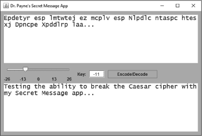

*图 7-18：你可以通过在秘密消息应用中滑动滑块左移和右移来破解凯撒密码消息，直到出现纯文本消息！*

将滑块移至`-11`会得到一条纯文本英文信息，因此密钥必须是`11`。你可能还会注意到，`15`会破坏信息（因为 15 = 26 - 11）。你总是可以找到几个有效的值来破译基本拉丁字母表中的信息。当然，你也可以使用其他语言发送消息，如图 7-19 所示。

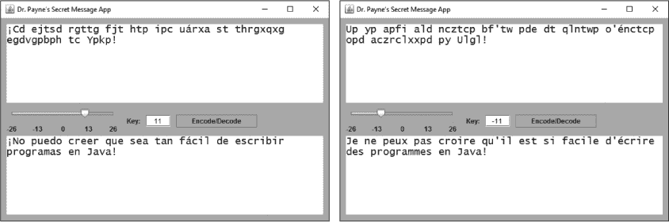

*图 7-19：任何使用基本拉丁字母的语言都可以在这个版本的秘密消息应用程序中用来发送和接收编码消息；这里展示的是西班牙语（左）和法语（右）。*

你可以通过电子邮件、Twitter 和 Facebook 与朋友来回复制并粘贴编码消息——你甚至可以发送编码的短信，尽管从手机设备上做会更方便。我们将在第八章中看到如何将这个秘密消息桌面应用程序转变为移动应用程序。

目前，为了能够轻松地与朋友们交换加密信息，你应该能够轻松地与他们分享你的 Secret Messages 应用程序。我们将在接下来的部分学习如何实现这一点。

### 奖励：将你的应用程序共享为可运行的 JAR 文件

为了使它真正有用，你需要能够将 Secret Messages 应用程序与朋友们共享——甚至可能是与那些不知道如何用 Java 编程且电脑上没有安装 Eclipse 的朋友们共享。

好消息是，Eclipse 和 Java 使得将应用程序导出为可运行文件变得非常简单，并可以与全球数百万台运行 Java 的计算机共享。你的朋友甚至不需要下载 Java JDK 开发者版；他们只需要安装了 JRE 的计算机，大多数计算机上都预装了 JRE。Eclipse 可以将应用程序导出为可运行的 Java 存档（JAR）文件，你可以通过电子邮件、USB 闪存驱动器或其他方式与朋友共享。你的朋友只需双击 JAR 文件，就能运行你的应用程序！

要从 Eclipse 导出可运行的 JAR 文件，前往 **File** ▸ **Export**。然后展开 *Java* 文件夹并点击 **Runnable JAR file**，如 图 7-20 所示。

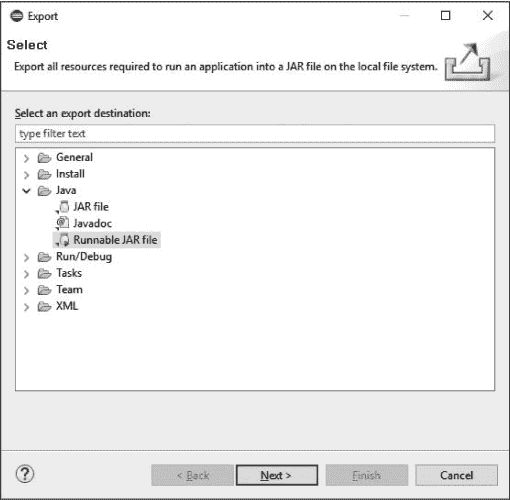

*图 7-20：通过导出可运行的 JAR 文件与他人共享你的应用程序。*

点击 **Next**，Eclipse 会要求你选择启动配置和导出目标位置。启动配置意味着你想运行哪个类或应用程序，以及它来自哪个项目。在 **Launch configuration** 下，点击下拉列表并选择 **SecretMessagesGUI – SecretMessagesGUI**。这意味着你想在 *SecretMessagesGUI* 项目中运行 *SecretMessagesGUI.class* 文件。

**注意**

*你必须至少编译并运行一次你的应用程序，以便为该应用程序生成启动配置。*

导出目标是你想用于你的可执行应用程序的存储位置和文件名。在 **Export destination** 下，点击 **Browse**，然后选择你想保存已完成应用程序的目标文件夹，例如 *Desktop* 文件夹。给你的程序文件命名，比如 *Secret Messages.jar*。你可以使用空格（或其他特殊字符）来为文件命名，让人们在打开时看到你希望他们看到的名字。当你完成选择后，如 图 7-21 所示，点击 **Save**，然后点击 **Finish**。

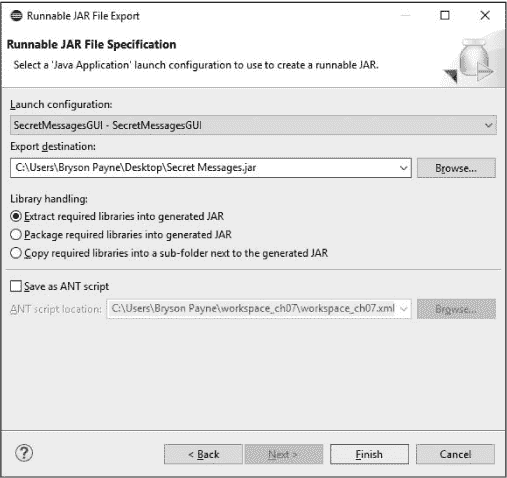

*图 7-21：为你的可运行 JAR 文件选择位置和名称。*

点击 Finish 后，你可能会看到一个警告，但可以忽略它并点击 **OK**。前往你保存 JAR 文件的位置，你应该能看到一个带有你文件名的 Java 图标，如 图 7-22 所示。现在你应该能够运行程序并发送和接收加密信息。

*图 7-22：Windows（左）和 macOS（右）上的可执行 JAR 文件桌面图标。*

**注意**

*在较新的 macOS 版本中，第一次点击应用程序时，你需要按住 CONTROL 键，然后选择 **打开**，最后在弹出的对话框中点击 **打开**，以允许该应用程序运行。*

一些电子邮件程序可能会将以 *.jar* 结尾的文件作为安全措施进行阻止，但你可以将文件上传到你喜欢的文件共享程序（例如 Dropbox、Google Drive 或 SkyDrive）并从那里分享文件。一旦你的朋友获得文件，他们只需运行它，你们就可以互相分享加密消息。

**注意**

*你还可以导出一个可运行的 JAR 文件，用于第三章中的 GUI 猜数字游戏应用程序。只需对* GuessingGame.java *文件执行相同的步骤，就可以在* GuessingGame *项目中导出。*

### 你学到了什么

你在这个应用程序中重用了来自文本版 Secret Messages 应用的代码，并大大扩展了你对 GUI 界面设计和编程的理解。以下是本章中涉及的一些技能：

• 一致地命名 GUI 组件和变量，以提高代码的可读性和可重用性

• 重用算法，例如我们从该应用的文本版本中复制的 `encode()` 方法

• 声明接受参数并返回信息的方法

• 为更多种类的 GUI 组件编写更高级的事件处理器，包括按钮、滑块和文本字段

• 在设计视图中处理 GUI 组件的属性，进一步自定义用户界面

• 为 `JTextArea` 对象设置行换行和单词换行

• 弹出 `javax.swing.JOptionPane` 对话框，包括消息对话框

• 添加并使用 `JSlider` GUI 滑块

• 使用 `stateChanged()` 事件处理器在滑块上更改文本字段的文本

• 导出一个可运行的 JAR 文件与朋友分享你的应用程序

### 编程挑战

尝试这些编程挑战，复习和练习你所学的内容，并通过尝试新事物来扩展你的编程技能。访问本书网站 *[`www.nostarch.com/learnjava/`](https://www.nostarch.com/learnjava/)* 下载示例解决方案。

#### *#1：向上走！*

Secret Messages 应用程序非常适合向朋友发送简单的编码消息，但单独使用也很有趣。有时会有一个重复的任务，就是从输出文本区域复制编码消息，然后将其粘贴到输入文本区域。你的第一个编程挑战是创建一个“向上移动 ^”按钮，它能够将编码消息向上移动并自动解码！

将“向上移动 ^”按钮放置在编码/解码按钮旁边。然后，添加一个事件处理器，它将从 `txtOut` 文本区域获取文本，并将其设置为 `txtIn` 文本区域的文本。作为额外的奖励，让“向上移动 ^”按钮的事件处理器将滑块的值反转。你还可以将按钮的背景更改为与你的应用程序其余部分相匹配。此挑战的示例解决方案见 图 7-23。

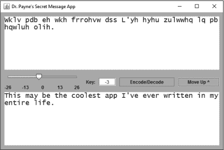

*图 7-23：添加一个“向上移动”^按钮来交换消息和滑块值，以自动解码你的消息*

#### *#2: 滚动起来！*

我们可以对应用程序做的另一个改进是处理更长的消息。在这种情况下，我们应该在一侧添加滚动条，并在用户输入的消息超出输入文本区域时自动滚动。`JTextArea`不会自动添加滚动条，但 Eclipse 让向任何文本区域添加滚动条变得又快又简单！

在设计视图中，右键点击任意一个`JTextArea`框，然后选择**环绕为** ▸ **javax.swing.JScrollPane**，如图 7-24 所示。

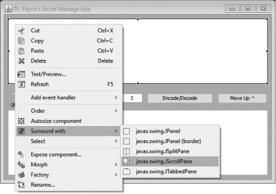

*图 7-24：向 JTextArea 添加自动滚动条*

你还需要对另一个`JTextArea`进行相同操作。完成后运行应用程序，在输入文本框中键入一段长文本，查看滚动条是否会自动出现。在图 7-25 中，我已将整个美国宪法粘贴到输入文本区域并进行了编码。

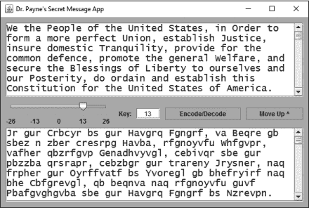

*图 7-25：通过在每个 JTextArea 周围添加 JScrollPane，你可以编码像美国宪法这样长的文本，甚至更长！*

在图 7-25 中只显示了部分文本，但现在在两个文本区域的右侧都有一个滚动条。滚动条让我们知道文本内容超出了文本区域的显示范围，我们只需向下滚动即可查看全部内容。

为了进一步定制应用程序，探索我们已添加的每个 GUI 组件的属性面板，并更改各种属性值，如背景颜色、字体等。让应用程序成为你自己的，并与朋友分享，展示你所创建的作品！

#### *#3: 更改文本以更改滑块*

对于这个挑战，让我们对用户界面做最后的调整。当用户滑动滑块时，文本框中显示的键值会变化。但是如果我们希望每当文本框中的值发生变化时，滑块也随之移动，该怎么办呢？

**提示**

*你需要为 txtKey 文本框添加一个事件处理器。右键点击 txtKey JTextField，然后选择**添加事件处理器** ▸ ***key*** ▸ ***keyReleased***。*这将创建一个事件处理器，用于监听 txtKey 文本框中的键盘输入。*

为了实现这一点，你需要为事件处理器编写代码，从文本框中获取整数值并将滑块设置为该值。记得在处理用户输入的文本时使用`try-catch`块。祝你好运！
