## 8

## 将“秘密消息”做成手机应用与朋友分享！

在本章中，我们将通过构建一个可以通过文本或电子邮件发送秘密消息并可以发布到社交媒体的移动应用版本，完成我们的秘密消息应用体验。

该应用将类似于第七章中的 GUI 版本，具有标签、文本框，并能够滑动不同的密钥值，以便快速编码和解码消息。您还可以将应用中的消息复制并粘贴到电子邮件和短信中，但在本章结束时，您将能够直接从“秘密消息”应用内发送电子邮件或短信！图 8-1 展示了该应用在真实 Android 设备上的运行效果。

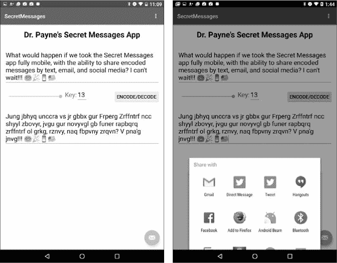

*图 8-1：秘密消息编码器/解码器应用（左）可以直接从应用内发送秘密文本和电子邮件消息，只需按一下按钮（右）。*

我们将通过保持 Android 版本中 GUI 组件的名称，并利用 Java 在多个平台上保持一致的语言和结构，重用桌面应用中的工作代码。

### 设置移动端 GUI

让我们开始使用 Android Studio 构建“秘密消息”应用。打开 Android Studio 时，程序可能会要求您进行更新，这通常是一个好主意。更新存在一定风险，因为它可能会通过移动图标或菜单项改变程序的外观和感觉，但更新也包括重要的安全修复和最新的 Android 特性。

当您第一次打开 Android Studio 时，您可能会看到您最近正在处理的项目——在我们的例子中是 Hi-Lo 猜数字游戏应用。您可以通过选择**文件** ▸ **关闭项目**来关闭它。

要开始构建新的“秘密消息”应用，您可以在 Android Studio 内部选择**文件** ▸ **新建项目**，或者从欢迎界面选择**开始一个新的 Android Studio 项目**。

将新项目命名为`SecretMessages`，保存在您首选的位置，然后点击**下一步**。

在目标 Android 设备屏幕上，选择**API 16: Android 4.1 (Jelly Bean)**作为**手机和平板最低 SDK**，就像我们在 Hi-Lo 猜数字游戏应用中所做的那样，然后点击**下一步**。在添加活动屏幕上选择**基本活动**，然后点击**下一步**。在自定义活动屏幕上，保持所有默认名称并点击**完成**。

新项目配置并打开可能需要一段时间。当新项目打开时，双击项目资源管理器左侧的*content_main.xml*文件，路径为*app* ▸ *res* ▸ *layout*。你可能需要关闭关于浮动操作按钮的弹出消息（我们稍后会用到它）。

您的屏幕应该类似于图 8-2 所示。（您可能需要点击设计标签才能查看 GUI 预览。）

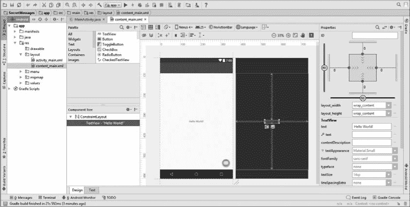

*图 8-2：应用在 Android Studio 中的初始视图*

### 设计移动端 GUI

现在我们已经设置了一个新项目，让我们开始设计应用的布局。首先，通过点击选择设计预览中的“Hello World!”文本，然后按 DELETE 键删除它。接下来，像在之前的应用中一样，我们将添加一个 RelativeLayout 来容纳我们的 GUI 元素：在“调色板”面板中，选择“布局”下的**RelativeLayout**并将其拖动到预览面板或组件树下的 ConstraintLayout 中。

接下来，让我们通过选择“调色板”中小部件下的**TextView**小部件，在应用的顶部添加一个标题。将`TextView`小部件放置在屏幕的顶部居中位置，文本更改为`Your Name``'s Secret Messages App`，然后将“属性”面板中的`textAppearance`属性更改为**Material.Large**，如我在图 8-3 中所做的那样。

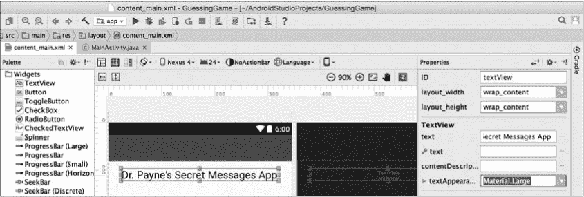

*图 8-3：为应用的顶部中心添加一个大号文本标题，使用你的名字进行自定义。*

在“属性”面板中，展开**textAppearance**以找到**textStyle**，然后勾选**bold**复选框，使标题文本更加突出。

现在，让我们放置`EditText`文本字段以接收用户的输入消息。在“调色板”中，选择“文本”下的**Multiline Text**。放大设计预览，将文本字段放置在标题下方大约 30 dp 的位置。将文本更改为`Secret messages \n are so cool, \n aren't they?`，如图 8-4 所示。`\n`转义序列将添加*换行符*；这些字符不会显示在屏幕上，但它们表示按下键盘上的 ENTER 键时获得的新行。将文本分成多行可以向用户显示他们也可以输入多行消息。

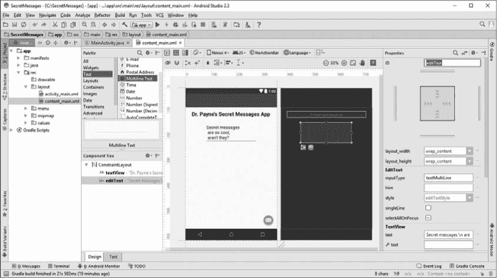

*图 8-4：为用户的输入消息添加一个多行文本字段，使用\n 转义序列跨越多行文本。*

你还可以更改用户一次可以看到的文本行数。在 Multiline Text 的扩展“属性”面板下，你可以将`lines`属性更改为`4`，例如。为了确保在所有设备上都能看到多行消息，请在`inputType`属性的下拉列表中选中**textMultiLine**复选框。

最后，让我们将输入文本字段的`id`属性更改为`txtIn`，这不仅有助于我们稍后在代码中使用它，而且还保持与 GUI 桌面版本应用的一致命名。现在，拖动文本字段的左、右边界，将其拉伸到应用的整个宽度，如图 8-5 所示。

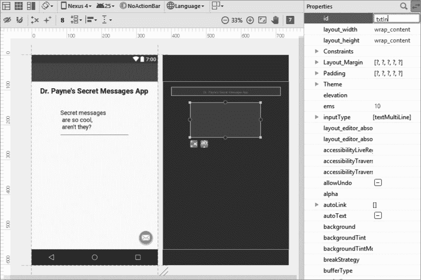

*图 8-5：将输入文本字段的 id 更改为 txtIn，以便我们稍后可以在代码中使用它。*

我们将向秘密信息应用的中间部分添加四个组件：一个`SeekBar`，让用户滑动条来查找密钥，一个标签，一个显示秘密密钥的文本字段，以及一个编码/解码按钮。`SeekBar`的功能类似于桌面版应用中的`JSlider`。如果你刚开始放置组件时它们没有完全对齐，不要担心——我们稍后会修复这个问题。

首先，在调色板面板的“Widgets”部分找到`SeekBar`。将其放置在输入文本字段下方 30dp 左右的合适间距位置，沿左边缘，如图 8-6 所示。你可以在属性面板中通过点击**查看所有属性**（属性面板顶部的左右双箭头）手动设置顶部边距。在**Layout_Margin**下，将`layout_marginTop`设置为`30dp`。

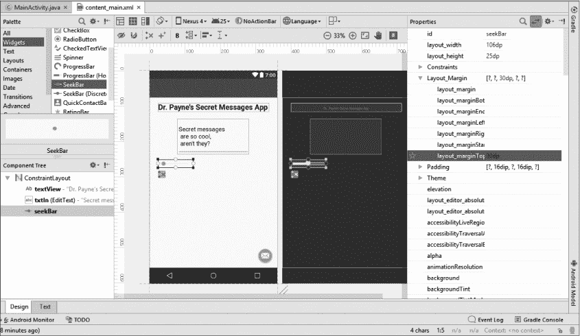

*图 8-6：SeekBar 将像应用的桌面版中的滑块一样运行，允许用户在不同的密钥值之间滑动。*

接下来，在`SeekBar`旁边添加一个`TextView`小部件，作为用户秘密密钥值文本字段的标签。在属性面板中，将`textAppearance`属性更改为**Material.Medium**，并将`text`属性更改为**Key:**。

然后，选择一个**Number**文本字段作为用户的秘密密钥值，并将其水平居中，文本属性设置为`13`或你选择的其他默认密钥值。通过更改文本字段的`width`属性（在**查看所有属性**下）大约设置为`40dp`，使其宽度适应数字，然后将`id`属性更改为`txtKey`。

将`txtKey`文本字段放置好后，你应该能够将`Key:`标签拖动到它旁边。你也应该能够拉伸`SeekBar`以填充空隙，如图 8-7 所示。

通过添加编码/解码按钮来完成布局的中间行。在调色板中的“Widgets”下选择**Button**，并将按钮插入到文本字段旁边的右边缘。将`text`属性更改为`Encode/Decode`。

最后，通过复制`txtIn`文本字段并将其粘贴到中间行小部件下方来创建输出消息的文本字段。删除文本字段中的文本，拉伸它以适应应用窗口的宽度，并将`id`属性重命名为`txtOut`。

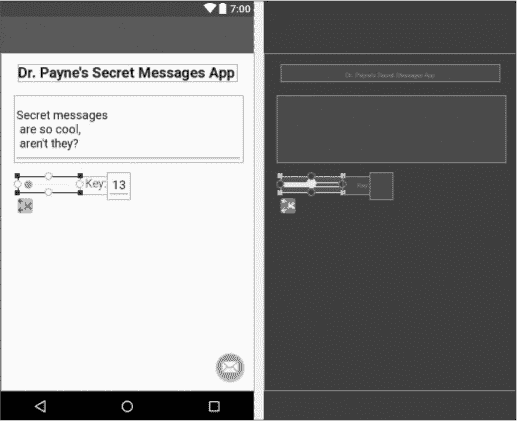

*图 8-7：放置`txtKey`文本字段后，调整`Key:`标签的位置并拉伸 SeekBar。*

就这样——完成的 GUI 布局如图 8-8 所示。

*图 8-8：完成的秘密信息移动应用布局*

在继续之前，确保你的输入文本字段的`id`为`txtIn`，输出文本字段为`txtOut`，中间的密钥文本字段为`txtKey`。为了确保代码在下一部分正常工作，我们需要正确命名这些元素。

### 将 GUI 连接到 Java 代码

现在是时候将 GUI 布局连接到 Java 源代码，开始编程秘密消息移动应用的行为了。通过点击主内容窗口左上角的标签切换到 *MainActivity.java* 文件。

将以下五行代码直接添加到 `public class` `MainActivity` 声明中：

public class MainActivity extends AppCompatActivity {

EditText txtIn;

EditText txtKey;

EditText txtOut;

SeekBar sb;

Button btn;

你可能需要在每行后按 ALT-ENTER 或 OPTION-ENTER 来导入小部件到 Java 代码中。

这五个变量指向应用视觉布局中的 GUI 组件。我们可以通过向 `onCreate()` 方法中添加五行代码，将这些变量名连接到实际的小部件，代码放在 `setSupportActionBar(toolbar);` 语句下方：

protected void onCreate(Bundle savedInstanceState) {

super.onCreate(savedInstanceState);

setContentView(R.layout.*activity_main*);

Toolbar toolbar = (Toolbar) findViewById(R.id.*toolbar*);

setSupportActionBar(toolbar);

txtIn = (EditText)findViewById(R.id.*txtIn*);

txtKey = (EditText)findViewById(R.id.*txtKey*);

txtOut = (EditText)findViewById(R.id.*txtOut*);

sb = (SeekBar)findViewById(R.id.*seekBar*);

btn = (Button)findViewById(R.id.*button*);

你可以依赖 Android Studio 的代码助手来自动完成这些输入——你只需输入前几个字符，然后从列表中点击选项，或者按 ENTER 接受代码推荐。这更快，并且能帮助你避免常见的输入错误。

#### *将 Encode 按钮连接到 encode() 方法*

现在我们已经将代码连接到 GUI 布局中的组件，可以从应用的桌面版本的 第七章 中复制 `encode()` 方法。我们将这个方法粘贴到 `public class MainActivity` 声明中，紧接在你添加的五行代码之后，这些代码用于声明指向布局中 GUI 组件的变量。

打开你在 Eclipse 中的 *SecretMessagesGUI* 桌面项目，选中整个 `encode()` 方法。复制这段代码并将其粘贴到 Android Studio 中的 `public class MainActivity` 声明部分：

public class MainActivity extends AppCompatActivity {

EditText txtIn;

EditText txtKey;

EditText txtOut;

SeekBar sb;

Button btn;

public String encode( String message, int keyVal ) {

String output = "";

char key = (char) keyVal;

for ( int x = 0; x < message.length(); x++ ) {

char input = message.charAt(x);

if (input >= 'A' && input <= 'Z')

{

input += key;

if (input > 'Z')

input -= 26;

if (input < 'A')

input += 26;

}

else if (input >= 'a' && input <= 'z')

{

input += key;

if (input > 'z')

input -= 26;

if (input < 'a')

input += 26;

}

else if (input >= '0' && input <= '9')

{

input += (keyVal % 10);

if (input > '9')

input -= 10;

if (input < '0')

input += 10;

}

output += input;

}

return output;

}

现在我们已经设置好了`encode()`方法，我们只需要在点击 Encode/Decode 按钮时调用该方法。我们将为 Encode/Decode 按钮创建一个`OnClickListener`并从那里调用`encode()`方法。

在`MainActivity.java`的`onCreate()`方法内，开始输入代码`btn.setOnCl`，直到弹出一个代码推荐列表，如图 8-9 所示。在列表中，选择`setOnClickListener()`。

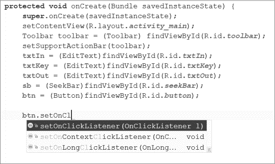

*图 8-9：你可以依靠 Android Studio 的代码推荐来自动填充代码，如这里显示的 Encode/Decode 按钮的 setOnClickListener()。*

在点击`setOnClickListener()`代码推荐后，点击该方法的括号内并开始输入`new OnClickListener`，如图 8-10 所示，双击弹出的第一个代码推荐：

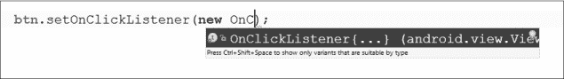

*图 8-10：再次使用代码助手来填充 OnClickListener*。*这次，Android Studio 提供了几行代码。*

你会注意到，Android Studio 为你填充了`OnClickListener()`事件处理程序的几行代码：

btn.setOnClickListener(new View.OnClickListener() {

@Override

public void onClick(View v) {

}

});

这几行代码创建了一个事件监听器，使用匿名内部类`View.OnClickListener()`，并通过`onClick()`事件处理程序来响应用户点击按钮时的操作。

接下来，我们将设置`encode()`方法。`encode()`方法并不关心我们代码的其他部分，只要我们传给它的两个参数的数据类型正确。这意味着我们不需要修改`encode()`来适应我们的新应用，但我们确实需要设置新的值并将其作为参数传给它。

要对用户输入的`txtIn`中的消息进行编码，我们首先需要获取用户输入的`txtKey`中的密钥值。然后，我们将获取用户输入的`txtIn`中的文本字符串。我们将这两个值作为参数传递给`encode()`方法，并将编码结果存储在一个名为`output`的变量中。最后，我们将`txtOut`字段的文本设置为编码后的输出字符串`output`。

在`onClick()`方法的花括号内添加以下四行代码：

btn.setOnClickListener(new View.OnClickListener() {

public void onClick(View v) {

➊ int key = Integer.parseInt(txtKey.getText().toString());

➋ String message = txtIn.getText().toString();

➌ String output = encode(message, key);

➍ txtOut.setText(output);

}

});

在 ➊，我们使用了`Integer.parseInt()`方法将用户输入的文本转换为整数值`key`。这个`parseInt()`与之前使用过的其他方法的唯一区别是，`txtKey`后面跟着两个方法：`getText()`和`toString()`。在 Android 中，`EditText`（即文本框）上的`getText()`方法并不会直接返回一个字符串，而是返回一个叫做`Editable`的灵活类型。所有的`EditText`类型，从普通文本到密码再到数字，都会返回一个`Editable`对象，因为`EditText`中的文本是可变的，并且可以由用户编辑。我们使用`toString()`方法将`EditText`中的文本转换为一个可以解析的字符串，以便找到用户输入的数字。

在 ➋ 处也是如此：我们需要`getText()`和`toString()`两个方法来获取`txtIn`中的输入消息，并将其转换为我们可以编码的字符串。在 ➌ 处，我们使用用户提供的`message`和`key`值调用`encode()`方法来对消息进行编码，然后将结果存储在`output`中。最后，在 ➍ 处，我们设置`txtOut`文本框的文本，以显示编码后的`output`消息。

现在，我们的应用程序足够功能化，进行第一次测试。让我们在 Android 模拟器中运行应用，看看编码/解码按钮的效果。

#### *测试应用*

保存到目前为止的进度。然后，点击**运行** ▸ **运行‘app’**。选择你在第四章中设置的模拟器，比如我的 Nexus 6P，如图 8-11 所示。

*图 8-11：选择一个模拟器*

模拟器第一次运行可能需要几分钟的时间——记住，你可以在 Android Studio 中让它保持运行，这样每次想运行应用时就不需要再等待长时间的启动过程。如果你愿意，也可以像我们在第四章中做的那样，直接在 Android 设备上运行应用，跳过模拟器。

当模拟器启动并加载秘密消息应用时，你会看到初始布局，如图 8-12（左）。输入一个密钥值，然后按下编码/解码按钮，你会看到 Android 将消息转换为密文，如图 8-12（右）。

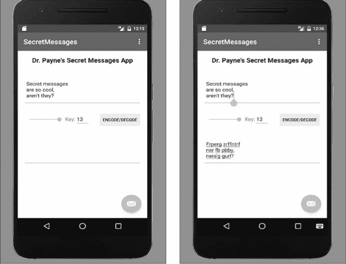

*图 8-12：秘密消息应用在 Nexus 6P Android 模拟器上运行（左）；点击编码/解码按钮后生成的编码文本（右）。*

你可以在字段之间复制和粘贴，但滑块/`SeekBar`还没有实现。右下角的浮动操作按钮——电子邮件信封图标——也暂时没有功能。别担心，我们很快会处理这些问题。

注意，还有一个用户体验问题：编码后的消息（`Frperg zrffntrf...`）被下划线标记，因为计算机认为它像是拼写错误的文本。为了关闭拼写检查，回到 *content_main.xml* 布局文件中，选择 **txtOut** 文本字段。在属性面板下，展开 `inputType` 并选择 **textNoSuggestions** 属性。如果你愿意，你也可以为 `txtIn` 文本字段关闭拼写建议，方法是单独操作，或者在布局视图中按住 SHIFT 键选择两个文本字段，然后选择 **textNoSuggestions** 属性。现在重新在模拟器上运行应用程序，不再有拼写检查了！

通过这个小调整，我们准备好了将 `SeekBar` 上线，以便我们能够轻松快速地在不同的键值之间滑动。

#### *使用 SeekBar*

我们将把 `SeekBar` 连接起来，每当用户向左或向右滑动时，改变输出信息，因此我们需要修改它的一些属性，使其准备好使用。

首先，让我们了解一下 `SeekBar` 小部件。你可能在手机上播放视频时见过 `SeekBar`。例如，在 YouTube 视频中，`SeekBar` 显示你在视频中的位置，并允许你快进或快退——这有时被称为 *查找*。

`SeekBar` 与 `JSlider` 有一些不同之处。首先，`SeekBar` 只能拥有正值。零是最小值，但我们可以将最大值设置为任意正值，例如 `26`。此外，`SeekBar` 不会在条形上显示增量标记或标签。这意味着，如果我们想允许用户使用负的键值，我们需要使用一些数学运算将正值转换为负值，这样用户就可以在例如从 `-13` 到 `+13` 的值范围内滑动键值。为了实现这一点，我们将 `SeekBar` 的范围设置为从 `0` 到 `26`。并且，我们需要更新 `txtKey` 字段，以便在用户滑动 `SeekBar` 时显示值的变化，让他们知道 `SeekBar` 的当前值。我们从修改 `SeekBar` 在 GUI 布局中的一些属性开始。

返回到 *content_main.xml* 布局文件，选择设计预览中的 `SeekBar`。在 `SeekBar` 的属性面板中，找到 `max` 和 `progress`，并将两者都改为 `26`。

`max` 属性是 `SeekBar` 显示的最大值。对于秘密消息应用程序，我们至少需要 26 个值来涵盖整个字母表。我们希望范围是 `-13` 到 `+13`，以便用户能够轻松地进行编码和解码。总共有 27 个值，所以我们选择 `26` 作为 `max`（因为当包含 0 时，总共是 27 个值）。`progress` 属性是 `SeekBar` 的当前值，类似于 `JSlider` 的 value 属性。我们将使用 `SeekBar` 的 `getProgress()` 方法来获取 `SeekBar` 当前指向的值。

保存你的更改，然后切换回*MainActivity.java*源代码文件。在`onCreate()`方法内，紧接着`btn.setOnClickListener()`代码的闭合行`});`下，开始输入`sb.set`并使用代码推荐工具查找`setOnSeekBarChangeListener()`。这将把你的`SeekBar`存储到变量`sb`中。

`SeekBar`监听器的代码与 Encode/Decode 按钮的代码不同。我们不仅仅要监听`SeekBar`的点击事件。我们还要监听所有的变化，包括用户按下`SeekBar`并左右滑动它。为此，我们需要一个`OnSeekBarChangeListener`。

与按钮代码一样，我们将使用代码推荐工具自动生成新的`OnSeekBarChangeListener`。在`sb.setOnSeekBarChangeListener()`后面的括号中，开始输入`new OnSeekBar`并使用代码推荐工具。

Android Studio 会自动填充`OnSeekBarChangeListener`代码，包括三个方法：`onProgressChanged()`、`onStartTrackingTouch()`和`onStopTrackingTouch()`。我们要使用`onProgressChanged()`，因为它会告诉我们用户何时改变了`SeekBar`的值。

我们希望在`SeekBar`事件监听器中编写的步骤与 Encode/Decode 按钮的代码类似，唯一不同的是我们需要根据`SeekBar`的值来计算密钥。我们还需要在`txtKey`字段中显示密钥。将以下代码添加到`onProgressChanged()`方法中：

sb.setOnSeekBarChangeListener(new SeekBar.OnSeekBarChangeListener() {

@Override

public void onProgressChanged(SeekBar seekBar, int progress, boolean fromUser) {

➊ int key = sb.getProgress() - 13;

String message = txtIn.getText().toString();

String output = encode(message, key);

txtOut.setText(output);

➋ txtKey.setText("" + key);

}

在➊处，我们创建了一个名为`key`的变量。我们从`SeekBar`变量`sb`中获取进度值，然后从该值中减去`13`。`SeekBar`的值范围仅限于`0`到`26`，因此减去`13`后将得到从`-13`到`+13`的范围，这非常适合用于编码和解码消息。接下来的三行代码与 Encode/Decode 按钮事件处理程序中的代码相同，它们获取消息、使用`encode()`方法对消息进行编码，然后将编码后的文本显示在`txtOut`中。

在➋处的代码是新增的。当用户移动`SeekBar`滑块时，我们希望`txtKey`的显示值发生变化。由于`key`是一个整数，我们将其与空字符串（`""`）相加，从而将结果转换为文本字符串并显示给用户。你也可以使用`Integer.toString(key)`命令，通过`Integer`类的`toString()`方法将`key`值转换为字符串，但将空字符串添加到整数`int`中是一种简便的快捷方式。

### 在模拟器和安卓设备上运行应用

保存你的更改后，再次尝试在模拟器中运行应用。现在，你可以左右滑动 `SeekBar`，并看到每个键值对应的密文立即变化，如图 8-13 所示。

自从我们连接了物理 Android 设备已经有几个章节了，接下来我们快速回顾一下。首先，通过兼容的 USB 数据线将你的 Android 设备与电脑连接。当弹出窗口询问是否允许 USB 调试时，点击**是**。

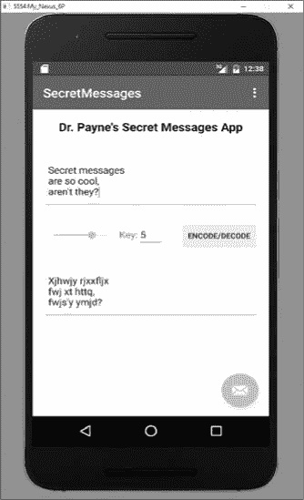

*图 8-13：SeekBar* *现在完全功能化，如在 Android 模拟器上所示，键值为 5*。

在 Android Studio 中，点击运行按钮，你将看到一个选择部署目标的对话框。（你可能需要关闭模拟器中的应用才能让对话框显示出来。）找到你连接的 Android 设备的条目，然后点击**确定**。

当你在真实的 Android 设备上运行应用时，你会发现 `SeekBar` 更加响应，并且当你点击应用的某些部分时会看到一些选项。当你点击密文并选择**全选**时，将出现一个上下文菜单，如图 8-14 所示，提供剪切、复制、共享或协助等选项。

如果你点击共享，所选文本可以通过电子邮件、短信、聊天、蓝牙、Twitter、Facebook 或任何你在设备上配置的共享应用发送，如图 8-15（左）所示。使用共享选项，你可以从应用内部向任何人发送编码的消息！你甚至可以通过电子邮件将一条秘密消息发送给拥有桌面 GUI 版本的秘密消息应用的朋友，如图 8-15（右）所示。他们只需在运行中的秘密消息 GUI 应用中将你发送给他们的电子邮件中的密文复制进去，然后使用相反的密钥解码消息：例如，`-8`将解码用键值`8`发送的消息。

*图 8-14：上下文菜单允许你剪切、复制或共享你的编码消息。*

*图 8-15：共享选项允许你通过电子邮件、短信、Twitter、Facebook 或任何其他你已配置的共享应用来分享你的消息（左）。选择电子邮件选项将自动创建一封包含已编码文本的电子邮件（右）。*

所以现在我们有了一个功能完全的秘密消息移动应用，允许我们通过电子邮件、短信或社交媒体与任何人分享我们的消息。

只剩下一个功能可以让我们的应用完整：将我们自定义的操作添加到浮动操作按钮。这将使我们能够让用户通过触摸屏幕分享他们的消息！

### 附加功能：自定义浮动操作按钮

到目前为止，我们一直忽略了浮动操作按钮（也称为*fab 图标*），它是应用程序屏幕右下角的圆形电子邮件信封符号，如图 8-16 所示。

fab 图标为我们提供了一种方式，让用户可以通过快捷方式执行特定操作，例如通过电子邮件、短信或社交媒体分享他们的信息。

*图 8-16：浮动操作按钮*

Android Studio 会自动在`onCreate()`方法中包含一些代码，用于 fab 图标显示一种新的弹出消息类型—在 Android 术语中称为“Snackbar”：

FloatingActionButton fab = (FloatingActionButton) findViewById(R.id.fab);

fab.setOnClickListener(new View.OnClickListener() {

@Override

public void onClick(View view) {

Snackbar.*make*(view, "替换为您自己的操作", Snackbar.*LENGTH_LONG*`)`

.setAction("操作", null).show();

}

});

我们需要做的就是用实现我们想要操作的代码替换`fab.setOnClickListener()`方法中的代码。

首先，删除`onClick()`方法中大括号之间的代码。接下来，将以下代码输入到`onClick()`方法中：

FloatingActionButton fab = (FloatingActionButton) findViewById(R.id.fab);

fab.setOnClickListener(new View.OnClickListener() {

@Override

public void onClick(View view) {

➊ Intent shareIntent = new Intent(Intent.*ACTION_SEND*);

➋ shareIntent.setType("text/plain");

➌ shareIntent.putExtra(Intent.*EXTRA_SUBJECT*, "秘密信息："+ 

DateFormat.*getDateTimeInstance*().format(new Date()));

➍ shareIntent.putExtra(Intent.*EXTRA_TEXT*, txtOut.getText().toString());

➎ try {

startActivity(Intent.*createChooser*(shareIntent, "分享信息..."));

finish();

}

➏ catch (android.content.ActivityNotFoundException ex) {

Toast.*makeText*(MainActivity.this, "错误：无法分享。",

Toast.*LENGTH_SHORT*).show();

}

}

});

现在让我们看看每行代码的作用。在 ➊ 处，我们创建了一个名为`shareIntent`的`Intent`。在 Android 中，`Intent`是一种我们想启动或启动的活动，例如电子邮件、Twitter 或相机。`shareIntent`使用`ACTION_SEND`，意味着我们想将一些信息发送到 Android 设备上的另一个应用。

我们将`Intent`的类型设置为`text/plain` ➋，这正是发送电子邮件、推文或社交媒体帖子所需要的类型，然后在活动中添加了主题行 ➌。如果用户选择通过电子邮件或其他使用主题行的应用分享他们的消息，主题将是“秘密信息”加上日期。`DateFormat`类将根据您的地区以文本形式格式化日期，例如`"2017 年 12 月 7 日下午 4:33:12"`。

➊ 的那行代码将从`txtOut`中编码的消息作为电子邮件、推文或帖子内容发送，具体取决于用户选择通过哪个应用分享信息。

接下来是 `try` 语句 ➎。在我们尝试从一个应用中调用另一个应用时，可能会出现很多问题。如果用户没有安装电子邮件应用怎么办？如果应用正在忙碌或无法连接到网络怎么办？`try` 语句正是为这种情况而设计的。`try` 语句中的第一行代码尝试启动用户选择的活动（例如电子邮件、短信或 Twitter），然后将信息传递给所选应用，最后在下一行结束该活动。

如果出现错误或异常，`catch`语句 ➏ 将显示一个 Toast 消息（类似弹出窗口），内容为 `"Error: Couldn't share."`。

这就是让 fab 图标正常工作的所有步骤。记得在输入代码行时，按下 ALT-ENTER（或 OPTION-ENTER）来导入新的类。记住，如果 Android Studio 将新类标记为红色，通常是因为该类没有被导入，所以按下 ALT-ENTER（或 OPTION-ENTER）会自动添加正确的`import`语句，就像我们在第四章中所做的那样。

一旦你添加了代码并导入了类，再次运行应用。

在编码完消息后，通过点击屏幕底部的下三角形来隐藏键盘。然后，点击屏幕右下角的 fab 图标，如图 8-17（左）所示。从 **共享消息...** 中选择你的电子邮件应用，应用应该会启动，电子邮件的主题行和编码后的消息会显示在邮件正文中，如图 8-17（右）所示。

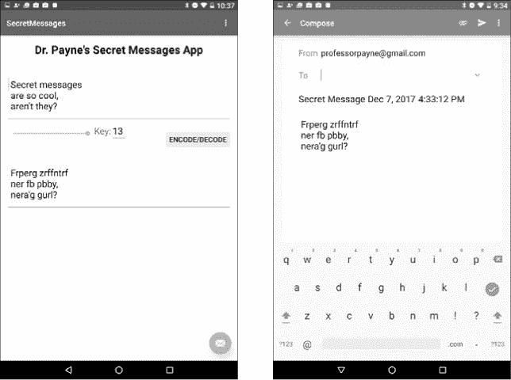

*图 8-17：按下右下角的 fab 图标会弹出一个共享菜单（左）。从共享菜单中选择电子邮件应用会自动创建一封包含秘密信息作为正文、日期和时间作为主题的电子邮件（右）。*

现在，我们只需轻触一个图标，就能通过应用发送秘密信息！但为了让这个应用真正符合 Google Play 商店的标准，我们需要让它具备从应用外部*接收*秘密信息的能力。

### 从其他应用接收秘密信息

让我们为移动版的秘密信息应用做最后一次升级。我们可以分享、发送电子邮件或推特编码后的消息，但如果我们想要*接收*来自电子邮件、推特和帖子中的文本，而不需要复制粘贴到应用中该怎么办？为了解决这个问题，我们可以将我们的应用添加到 Android 的共享列表中，这样其他应用就可以直接向秘密信息应用发送文本——而且只需要几行代码！

这是一个高级技巧，让我们一步一步地走过这个过程。首先，在项目资源管理器面板中，打开你的应用程序的*AndroidManifest.xml*文件，路径是**manifests** ▸  **AndroidManifest.xml**。清单文件存储着应用程序的“出货”信息，就像船只的货单列出了所有航行在船上的货物一样。你可以声明应用程序的属性，并包含运行该应用程序所需的 Android 设备信息，就像你可以在运输时声明货物箱或包裹的内容一样。

为了实现这一点，你需要编辑一些 XML。XML 文件包含*标签*，用于标记文件中包含的信息。通常，标签格式是将其名称放在尖括号之间，如`<tag>`。在这种情况下，我们需要修改清单文件中的`intent-filter`标签项，该项包含应用程序将接受的数据的信息。在你的*AndroidManifest.xml*文件末尾的`</activity>`标签之前，添加以下五行 XML：

<intent-filter>

<action android:name="android.intent.action.MAIN" />

<category android:name="android.intent.category.LAUNCHER" />

</intent-filter>

➊ <intent-filter>

➋ <action android:name="android.intent.action.SEND" />

➌ <category android:name="android.intent.category.DEFAULT" />

➍ <data android:mimeType="text/*" />

➎ </intent-filter>

</activity>

</application>

</manifest>

在第➊行，我们为应用程序添加了一个新的`intent-filter`。之前我们使用`Intent`对象将文本发送到另一个应用程序，如电子邮件、Twitter 或 Facebook。在这种情况下，我们创建了一个过滤器来*接收*从我们手机上的其他应用程序发送的`Intent`对象 ➋。（我们在第 191 页的 fab 图标代码中使用了`Intent.ACTION_SEND`将`Intent`消息发送到其他应用程序；在这里我们做的是相反的操作。）

第➌行使用`DEFAULT`共享类别，将“秘密消息”应用程序添加到你手机上可以共享的应用程序列表中。使用`DEFAULT`类别，你的应用程序可以接收来自任何应用的数据。（如果你想要筛选或限制能够向你的应用发送数据的应用类型，还可以使用其他类别。例如，`BROWSABLE`类别是用于仅接收来自网页浏览器数据的应用程序。）在第➍行，我们告诉 Android，“秘密消息”应用程序应该接收来自其他应用的任何文本数据。（如果你编写一个接受图片作为输入的应用程序，`mimeType`可能是`"image/*"`，或者是仅针对 PNG 图片的`"image/png"`。对于视频，`mimeType`则是`"video/mp4"`，依此类推。）

最后，我们在应用程序的清单文件中关闭`intent-filter`项 ➎。XML 标签需要被*关闭*，通常通过一个正斜杠和正在关闭的 XML 标签名称来实现，如`</intent-filter>`。这让计算机知道你已经完成了`intent-filter`的代码。保存你的*AndroidManifest.xml*文件，然后打开*MainActivity.java*文件，开始编辑 Java 源代码。

向下滚动至 *MainActivity.java* 中找到 `onCreate()` 方法。紧接着连接 GUI 组件到 `txtIn` 到 `btn` 的代码后，添加以下四个语句：

protected void onCreate(Bundle savedInstanceState) {

super.onCreate(savedInstanceState);

setContentView(R.layout.*activity_main*);

Toolbar toolbar = (Toolbar) findViewById(R.id.*toolbar*);

setSupportActionBar(toolbar);

txtIn = (EditText)findViewById(R.id.*txtIn*);

txtKey = (EditText)findViewById(R.id.*txtKey*);

txtOut = (EditText)findViewById(R.id.*txtOut*);

sb = (SeekBar)findViewById(R.id.*seekBar*);

btn = (Button)findViewById(R.id.*button*);

➊ Intent receivedIntent = getIntent();

➋ String receivedText = receivedIntent.getStringExtra(Intent.*EXTRA_TEXT*);

➌ if (receivedText != null)

➍ txtIn.setText(receivedText);

btn.setOnClickListener(new View.OnClickListener() {

在 ➊ 处，我们创建了一个名为 `receivedIntent` 的变量，用来接收从其他应用共享过来的 `Intent` 消息。然后，我们通过调用 `getStringExtra()` 方法 ➋ 获取 `Intent` 消息中的文本。`Intent` 发送的消息部分被称为 *extra* 数据。一个 `if` 语句 ➌ 用来确保 `receivedText` 变量不为 `null`，如果是，就将接收到的文本 ➍ 设置到 Secret Messages 应用顶部的 `txtIn` 文本框中。

信不信由你，这就是将来自其他应用的消息接收到 Secret Messages 应用中所需的所有工作！现在，你不仅可以从应用中发送编码的消息，还能直接从电子邮件、推文和帖子中解码消息。图 8-18 显示了如何从电子邮件共享消息到 Secret Messages 应用进行快速解码的样子。

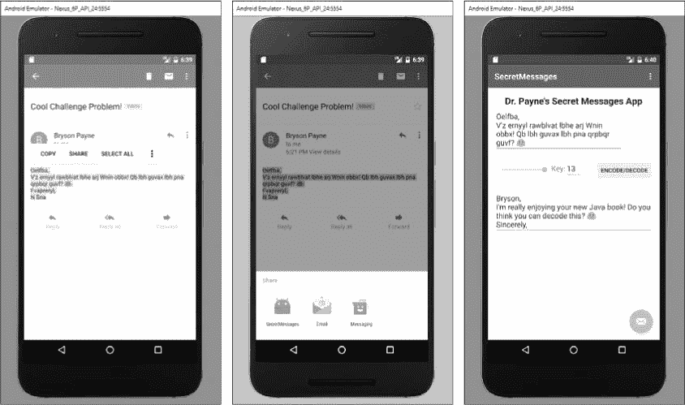

*图 8-18：现在 Secret Messages 应用可以与手机上的其他应用发送和接收消息，包括电子邮件。*

在你喜欢的电子邮件应用中，或者在 Twitter 或 Facebook 中选择文本，并按下 **Share** 按钮。Secret Messages 应用会出现在接受共享消息的应用列表中。选择 **SecretMessages** 作为共享应用，所选的文本将显示在 Secret Messages 应用的输入文本框中。你可以轻松进行编码或解码；只要记住，你可能需要根据消息的编码方式更改密钥值。

恭喜你！你已经完成了一个完整的社交版 Secret Messages 移动应用。尽情享受它，并与朋友分享吧！

让我们来看看你在本章中发展出来的技能，并尝试一些额外的编程挑战。

### 你学到了什么

我们在这个应用中复用了来自 Secret Messages 桌面版 GUI 的代码，并添加了更多功能，使其成为一个真正完整的移动应用。以下是你在本章中学到的一些新内容以及你强化的一些技能：

• 编写 Android 组件的事件处理程序，包括按钮、`SeekBar` 和浮动操作按钮

• 自定义 Android GUI 组件

• 在 Android 应用中使用多行文本输入

• 添加一个`SeekBar`并将其用作滑动条界面

• 在模拟器和真实设备上运行 Android 应用

• 自定义浮动操作按钮的动作

• 创建自定义的`Intent`对象以调用特殊的活动，包括从应用内发送数据到其他应用

• 创建自定义的`Intent`过滤器，以接收从其他应用发送的文本（或图像或视频）数据

### 编程挑战

试试这些编程挑战，以回顾和练习你所学的知识，并通过尝试新事物来扩展你的编程技能。访问本书的网站 *[`www.nostarch.com/learnjava/`](https://www.nostarch.com/learnjava/)* 获取示例解决方案。

#### *#1: 创建一个向上移动按钮*

这个编程挑战是创建一个向上移动 ^ 按钮，类似于第七章中的那个按钮（第 172 页的编程挑战 #1），它将文本从输出字段移动到输入字段。

将向上移动 ^ 按钮放置在`txtOut`文本字段的下方。然后添加一个事件处理程序，它从`txtOut`文本字段获取文本，并将其设置为`txtIn`文本字段的文本。作为额外的奖励，你可以让向上移动 ^ 按钮的事件处理程序也改变`SeekBar`的值为其相反数。加密密钥 `7` 将变为 `-7`，即解密密钥。点击按钮后，编码的消息将被交换并自动解码！

#### *#2: 改变 SeekBar 的进度*

你可以对用户体验做出的第二个改进是，当用户手动在`txtKey`字段中输入一个值时，改变`SeekBar`的进度属性。试试看！

**提示**

*你可以尝试修改 Encode/Decode 按钮的代码，而不是为 txtKey 字段创建事件处理程序，将 SeekBar 的进度值设置为 txtKey + 13 的值——记住，SeekBar 的值范围是从 0 到 26，而不是从 -13 到 +13*。*一两行代码就足够了。*
