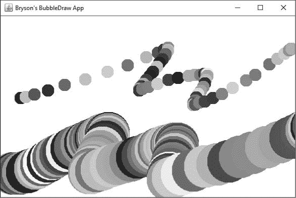
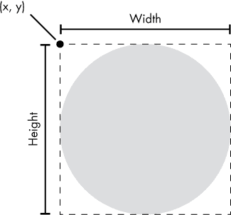
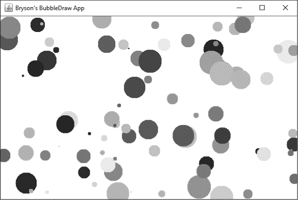
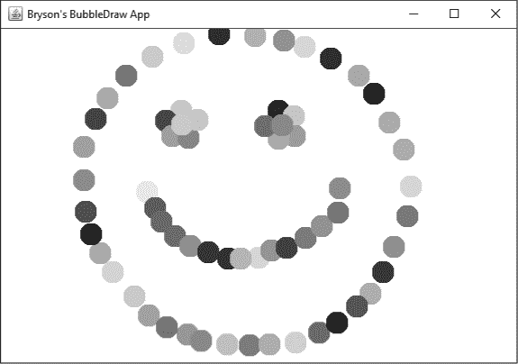
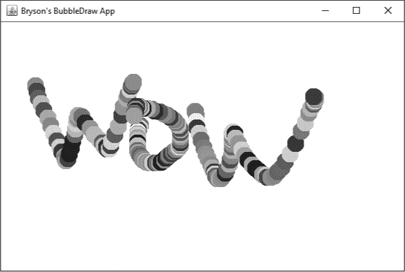
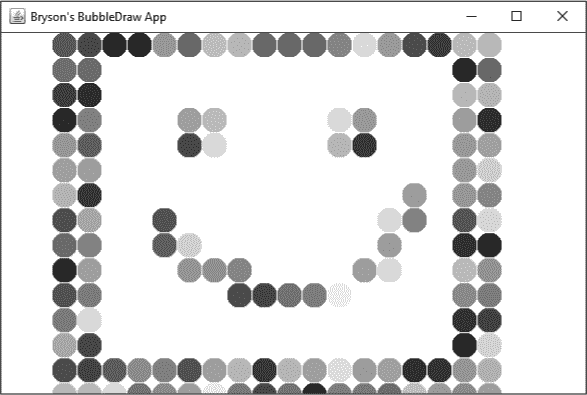
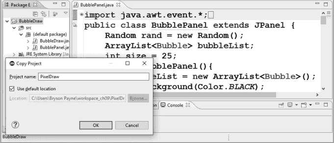

## 9

## 用鼠标绘制五颜六色的泡泡！

在接下来的三章中，我们将构建 BubbleDraw，一个交互式的动画绘图应用程序，用户可以在桌面版本中用鼠标绘制漂浮、弹跳的五彩泡泡，在移动版本中用手指绘制！

BubbleDraw 应用程序的第一个版本将如图 9-1 所示，每个泡泡都有不同的随机颜色。它将允许用户每次在应用程序窗口中点击并拖动鼠标时绘制随机颜色的泡泡。用户还可以通过上下滚动鼠标滚轮或在触摸板或触摸屏上使用滚动手势来改变泡泡的大小。

*图 9-1：BubbleDraw 应用程序允许用户使用鼠标绘制随机颜色的泡泡。*

我们将使用面向对象编程方法来构建 BubbleDraw 应用程序。到目前为止，你学到的变量、函数、循环和条件语句都属于*过程式编程*。过程式编程是按步骤线性地编写程序，类似于按照食谱做菜。面向对象编程使用了所有这些概念，但它允许我们通过将一个大型软件项目分解成更小的部分（称为*对象*）来编写更大、更复杂的应用程序。

作为一个示例，泡泡在 BubbleDraw 应用程序中是一个重要的实体，因此在我们开始编写代码时，泡泡可能会变成对象。首先，我们将解决如何定义泡泡的问题。其次，我们将找出存储大量泡泡信息并在屏幕上绘制泡泡的方法。最后，我们将添加通过点击和拖动鼠标来创建泡泡的功能。我们不会为每个泡泡编写单独的控制代码，而是编写一段适用于所有泡泡对象的代码。

我们将从两个源代码文件开始：一个是用于应用程序窗口的*BubbleDraw*，另一个是用于绘图画布的*BubblePanel*。应用程序窗口将扩展一个熟悉的类`JFrame`，而窗口框架内的绘图画布将使用一种新的 GUI 容器类型`JPanel`。通过构建两个独立的文件，我们将能够在第十章的 GUI 应用程序中重用绘图画布。让我们开始编码吧！

### 创建 BubbleDraw 项目文件

在 Eclipse 中，转到**文件** ▸ **新建** ▸ **Java 项目**，为 BubbleDraw 应用程序创建一个新的项目文件夹。将项目命名为`BubbleDraw`并点击**完成**。

在项目资源管理器面板中展开*BubbleDraw*项目文件夹，右键点击*src*文件夹，选择**新建** ▸ **类**。为应用程序窗口创建一个名为`BubbleDraw`的类，并将`javax.swing.JFrame`作为父类，在**选择方法存根 . . .**下勾选**public static void main(String[] args)**复选框。然后点击**完成**。

接下来，我们将创建 `BubblePanel` 绘图画布。右键点击 *src* 文件夹并选择 **新建** ▸ **类**。将该类命名为 `BubblePanel`，并将其父类设置为 `javax.swing.JPanel`。点击 **完成**。

使用这些类，我们将创建一个可重用的 `BubblePanel` 画布，可以将其扩展并嵌入到其他应用程序中。`BubbleDraw` 窗体将是一个容器，用于显示 `BubblePanel`。

### 构建 BubbleDraw 窗体

让我们从设置 *BubbleDraw.java* 源代码文件中的主应用程序窗口开始。点击 Eclipse 内容窗格顶部的 *BubbleDraw.java* 标签，你将看到以下代码已经填写：

import javax.swing.JFrame;

public class BubbleDraw extends JFrame {

public static void main(String[] args) {

}

}

应用程序窗口在 `JFrame` 中运行，就像我们之前的 GUI 应用程序一样。在这个应用程序中，我们需要让窗口显示绘图画布，也就是我们的 `BubblePanel`。我们不会在这个应用程序的第一个版本中添加其他 GUI 组件。

我们想要创建一个 `JFrame` 窗口，并像前几章一样为窗体添加设置代码，但我们还将向窗体中添加一个 `BubblePanel` 作为我们的绘图画布。完整的 `BubbleDraw` 类将如下所示 Listing 9-1：

import javax.swing.JFrame;

public class BubbleDraw extends JFrame {

public static void main(String[] args) {

➊ JFrame frame = new JFrame("*你的名字* 的 BubbleDraw 应用程序");

➋ frame.setDefaultCloseOperation(JFrame.*EXIT_ON_CLOSE*);

➌ frame.getContentPane().add(new BubblePanel());

➍ frame.setSize(new java.awt.Dimension(600,400));

➎ frame.setVisible(true);

}

}

*Listing 9-1: The BubbleDraw*  *class*

从创建一个带有标题栏的新的 `JFrame` 开始 ➊。在标题字符串中放入你的名字。接下来，设置默认的关闭操作，以便用户关闭窗口时应用程序退出 ➋。然后，添加代码以打开一个新的 `BubblePanel` 绘图画布，作为此窗体中的内容 ➌。最后两行代码设置窗口的大小 ➍ 并使其可见 ➎。

保存 *BubbleDraw.java* 文件并运行一次。你将看到一个灰色的 Java 窗体，标题栏中显示 `"`*你的名字*` 的 BubbleDraw 应用程序"`。接下来，我们将构建 `BubblePanel` 绘图画布的逻辑。

### 创建一个气泡类

切换到 *BubblePanel.java* 文件的标签页。该文件将包含所有绘制气泡的逻辑。我们的第一个任务是创建一个 `Bubble` 类，用来存储每个气泡的颜色、大小和在屏幕上的位置。

#### *定义一个气泡*

构建类的原因非常实际：在早期的过程式编程方法中，我们需要为每个气泡的 x 和 y 坐标、大小等创建单独的变量。例如，我们需要一个 `bubble1x` 变量来存储第一个气泡的 x 坐标，还需要 `bubble1y`、`bubble1size` 和 `bubble1color` 变量来存储该气泡的其他信息。这还不算太糟糕，但如果我们拖动鼠标几秒钟后出现了一千个气泡呢？我们就需要 4000 个变量来追踪它们！而是，我们可以在类中使用属性来存储每个气泡的这些值。

在我们开始编写代码之前，让我们定义一下什么是气泡。如前所示，在图 9-1 中，气泡是一个五彩斑斓、填充的圆形，气泡可以有不同的大小和位置。

所有这些特性都是这个应用中气泡的属性。在面向对象编程中，我们使用描述对象的名词和形容词来创建新类时的属性列表。属性存储为类变量。

除了属性外，类还可以包含方法。方法是与特定类相关的函数类型。方法使类能够执行某些操作。想想我们希望绘图应用中的气泡做什么。每当用户点击或拖动鼠标时，我们需要创建一个气泡。每次屏幕刷新时，我们也需要绘制一个气泡。像*创建*和*绘制*这样的动词将帮助我们确定在气泡类中需要哪些方法。

当我们将所有这些属性和方法封装到一个类中时，就可以描述我们想要在屏幕上显示的任何气泡。这就是程序员通过面向对象编程解决问题的方式：通过将大型应用程序拆分为更小的部分，通过提问程序包含了什么来创建类，然后通过询问每个新类的对象应该做什么以及需要什么信息来确定方法和属性。

现在让我们开始编写 `Bubble` 类。我们将在 `BubblePanel` 类内部进行此操作，因为 `BubblePanel` 是我们唯一需要绘制气泡的地方。在 `BubblePanel` 结束的右大括号前开始编写 `Bubble` 类，如下所示：

import javax.swing.JPanel;

public class BubblePanel extends JPanel {

private class Bubble {

}

}

我们通常将内部类和辅助类设为私有，以防止其他程序直接访问它们。因此，为了使`Bubble`成为只能从`BubblePanel`访问的内部类，我们将其声明为`private`。这种称为*封装*的技术意味着`BubblePanel`类对其内部工作原理对其他类隐藏。封装是面向对象编程的核心原则之一，并且是一种值得遵循的最佳实践，因为它意味着我们可以更改`Bubble`类在内部的工作方式，并且可以确定我们不会破坏代码的其他部分。由于`Bubble`被声明为`private`，因此我们知道`BubblePanel`类之外没有任何代码依赖于它。这对于包含大量类并由许多程序员处理的较大型应用程序尤其重要。

`BubblePanel`将依赖`Bubble`类来存储用户在屏幕上绘制的各个气泡的信息。一个气泡在屏幕上有一个 (x, y) 位置、一个大小和一个颜色，因此我们可以将这些属性作为`Bubble`内部的变量。气泡位置的 x 和 y 坐标以及气泡的大小都可以存储为整数值：

import javax.swing.JPanel;

public class BubblePanel extends JPanel {

private class Bubble {

private int x;

private int y;

private int size;

}

}

在这里，我们创建了两个单独的变量，分别称为`x`和`y`，用于存储气泡的坐标，以及一个`size`变量。这些属性是`private`，因此只有`Bubble`类本身才能直接更改这些值。我们将气泡应具有的所有数据封装在`Bubble`类中，并且仅使用该类中的方法与气泡进行交互。

如前所述，我们的应用程序中的每个气泡都可以有自己的颜色。`java.awt`库有一个`Color`类，用于处理 *RGB* (*红-绿-蓝*) 颜色值，以重现我们可以在显示器上显示的任何颜色。当我们实际编写代码来控制气泡颜色时，我们将在本章后面详细讨论 RGB，因此现在只需在文件顶部导入`java.awt.Color`类，并将一个名为`color`的属性添加到`Bubble`类，如下所示：

import java.awt.Color;

import javax.swing.JPanel;

public class BubblePanel extends JPanel {

private class Bubble {

private int x;

private int y;

private int size;

private Color color;

}

}

现在我们已经添加了我们希望每个气泡都具有的四个属性（`x`、`y`、`size`和`color`），我们可以开始构建气泡的行为或函数，以赋予这些属性值。我们将通过在`Bubble`类中添加方法来实现这一点。

#### *设计气泡的方法*

`Bubble`类将具有两个动作，我们将把它们变成方法：创建一个气泡并在桌面屏幕上绘制一个气泡。

创建对象的方法有一个特殊的名称：*构造方法*。构造方法通过为对象的属性赋值来设置对象。当我们在构造方法内为属性赋值时，我们是在*初始化*它们。对于`Bubble`类，我们希望初始化每个气泡的`x`、`y`、`size`和`color`属性。

##### 构造方法的构建

构造方法以关键字`public`开头，后跟类名和一对圆括号。如果你想在创建对象时传递任何参数，可以将它们放在圆括号内。我们希望在创建每个气泡时为其分配`x`、`y`和`size`值，因此`Bubble`类的构造方法如下所示：Listing 9-2。

private class Bubble {

private int x;

private int y;

private int size;

private Color color;

➊ public Bubble(int newX, int newY, int newSize) {

➋ x = newX;

➌ y = newY;

➍ size = newSize;

}

}

*Listing 9-2: 气泡类的构造方法*

每个气泡的坐标和大小将由用户确定，因此我们希望将 x 和 y 坐标以及大小作为整数值传递给`Bubble()`构造方法，在创建每个新的气泡时。这些值是我们传递给`Bubble()`方法的三个参数，分别称为`newX`、`newY`和`newSize` ➊。稍后在代码中，当我们处理用户创建气泡时，我们将处于`Bubble`类外部。那意味着我们无法直接访问气泡的属性，因此不能直接为每个气泡的`x`、`y`和`size`属性赋值。为了解决这个问题，我们通过`Bubble()`构造方法为属性赋值，该构造方法接收来自用户的输入，将输入值赋给`newX`、`newY`和`newSize`，然后在➋、➌和➍处将用户输入的值赋给气泡的属性。

我们还希望每个气泡都有一个随机的颜色。由于颜色是随机的，我们不需要通过参数将其传递给构造方法。相反，我们可以在构造方法内部创建颜色。

我们需要生成随机的 RGB 颜色值，为每个气泡创建颜色。RGB 的工作原理是通过在计算机显示器上混合不同量的红、绿和蓝光来生成不同的颜色。在编程中，这三种颜色的每一种都由一个介于 0（无颜色）和 255（最大颜色量）之间的整数表示。为了创建颜色，我们需要得到三个介于 0 到 255 之间的整数，用逗号分隔，并将它们放在圆括号内。例如，纯红色的 RGB 值是(255, 0, 0)，意味着红色满量，没有绿色和蓝色。黄色的 RGB 值是(255, 255, 0)，意味着红色和绿色满量，没有蓝色。总共有超过 1600 万种 RGB 颜色值可以通过这种方式创建。

我们之前在需要生成一个单一数值时，使用过`Math`类的`Math.random()`方法来生成随机数，但在 BubbleDraw 应用中，我们需要生成三个随机数（分别对应 RGB 的每个部分），所以我们来看一种新的生成随机值的方式。

`java.util.Random`类包含几个有用的方法，包括`nextInt()`，它可以让我们瞬间生成一个随机整数，且大小不超过指定的上限，无需做额外的数学运算或四舍五入。要使用`Random`类，我们首先需要在*BubblePanel.java*文件的顶部导入它：

import java.util.Random;

import java.awt.Color;

import javax.swing.JPanel;

因为`Random`是一个类，我们需要创建一个新的`Random`类型的对象或变量来访问它的功能。请在`BubblePanel`类的顶部添加以下行：

import java.util.Random;

import java.awt.Color;

import javax.swing.JPanel;

public class BubblePanel extends JPanel {

Random rand = new Random();

private class Bubble {

这一行创建了一个名为`rand`的随机数生成器，它将允许我们快速生成随机的整数或浮动值。我们将`rand`封装在`BubblePanel`类的顶部，这样我们就可以在绘图窗口和内部的`Bubble`类中生成随机数，但不能在`BubblePanel`外部使用它。

要在 Java 中创建一个随机颜色，我们可以使用之前导入的`java.awt.Color`类的构造函数。该构造函数接受三个整数参数，范围是`0`到`255`，分别表示红、绿、蓝三个值，以创建一个颜色。

在`Bubble()`构造方法中添加以下代码：

public Bubble(int newX, int newY, int newSize) {

x = newX;

y = newY;

size = newSize;

color = new Color( rand.nextInt(256),

rand.nextInt(256),

rand.nextInt(256) );

}

我们使用`new`关键字和`Color`类的构造函数来创建一个新的颜色，每个 RGB 颜色值将是一个在`0`和`255`之间随机生成的整数。每次调用`nextInt()`方法时，它会生成一个介于`0`和你传入的最大整数之间的新随机整数。在这里，我们希望获得从`0`到`255`的随机颜色值，因此我们传入`256`，因为`nextInt()`生成的整数小于但不包括传入的上限。

##### 编写绘制气泡的方法

现在每个气泡都有了一个(x, y)位置、大小和随机颜色，让我们添加在屏幕上绘制气泡的功能。为了在屏幕上绘制彩色图形，我们将导入`java.awt.Graphics`类。该`Graphics`类包含像`setColor()`（选择绘画颜色）、`drawRect()`（绘制矩形）和`fillOval()`（在屏幕上绘制填充椭圆）等方法。我们将使用`fillOval()`来绘制圆形，因此请在*BubblePanel.java*文件的顶部添加以下`import`语句：

import java.awt.Graphics;

import java.util.Random;

import java.awt.Color;

import javax.swing.JPanel;

接下来，让我们在`Bubble`内部类中添加一个`draw()`方法，位于`Bubble()`构造函数下方：

private class Bubble {

private int x;

private int y;

private int size;

private Color color;

public Bubble(int newX, int newY, int newSize) {

--省略--

}

public void draw(Graphics canvas) {

➊ canvas.setColor(color);

➋ canvas.fillOval(x - size/2, y - size/2, size, size);

}

}

`draw()`方法接受一个参数，即一个名为`canvas`的`Graphics`画布。在`draw()`方法内部，我们首先调用`canvas`上的`setColor()`方法➊，将绘图颜色设置为我们将要绘制的气泡的`color`变量中的颜色。在➋处，我们调用`fillOval()`方法，将一个填充的圆形绘制到屏幕上。`fillOval()`方法接受四个参数，第一个和第二个参数是我们将在其中绘制椭圆的边界框的左上角的 x 和 y 坐标，接着是该框的宽度和高度。可以将边界框看作是一个在(x, y)位置的不可见矩形，给定宽度和高度，而椭圆则像一个气球，会膨胀直到触及框的四个边（见图 9-2）。通过设置相同的宽度和高度，使得框成为正方形，我们最终得到的是一个圆形，而不是椭圆。

由于我们的椭圆实际上是圆形的，宽度和高度是相同的数值——我们在`size`属性中存储的气泡的像素大小。在➋，我们希望气泡位于用户点击的(x, y)位置的中心，因此我们通过从`x`和`y`的值中减去一半的大小(`size/2`)来调整每个气泡的左上角位置。

*图 9-2：`fillOval()`方法接受四个参数，第一个是左上角的 x 和 y 坐标，接下来是椭圆的宽度和高度。*

随着`draw()`方法的添加，我们现在有了一个完整的`Bubble`类，它可以记住气泡的位置、大小和颜色。我们所做的类方法可以用来创建新的气泡并将它们绘制到屏幕上。接下来，我们需要在`BubblePanel`类中添加逻辑，利用这些方法在用户点击和拖动屏幕时创建和绘制气泡。

### 在`ArrayList`中存储气泡

我们需要一种方式来存储用户在屏幕上点击和拖动时创建的所有气泡。Java 的库中包含了几种有用的*数据结构*，它们是用于存储对象集合的类。

`java.util.ArrayList`是一个*动态*数据结构。这意味着它不仅存储对象集合，还可以根据程序的需要动态地增长或缩小。对于 BubbleDraw 应用程序，我们无法预测用户会绘制多少个气泡，因此像`ArrayList`这样的动态数据结构是存储用户可能创建的所有气泡的完美选择。当你不知道会需要多少个项目时，`ArrayList`是一种灵活的存储方式。Java 中的常规数组具有固定的大小，但`ArrayList`可以在每次用户点击时不断添加新的气泡。

首先，在*BubblePanel.java*文件顶部导入`java.util.ArrayList`，以便我们可以访问`ArrayList`数据类型：

import java.util.ArrayList;

import java.awt.Graphics;

import java.util.Random;

import java.awt.Color;

import javax.swing.JPanel;

接下来，我们需要声明一个`ArrayList`，用于存储`Bubble`类的对象。在`BubblePanel`类中，添加以下声明：

public class BubblePanel extends JPanel {

Random rand = new Random();

ArrayList<Bubble> bubbleList;

`ArrayList`数据结构可以接受一个类型说明符，放在尖括号`<`和`>`之间，告诉 Java 该`ArrayList`将包含哪种类型的对象。`ArrayList`可以容纳任何类型的对象，但我们声明的`bubbleList`将只包含`Bubble`类的对象。

接下来，让我们处理一个额外的变量`size`，用于设置默认的气泡大小：

public class BubblePanel extends JPanel {

Random rand = new Random();

ArrayList<Bubble> bubbleList;

int size = 25;

这个`size`变量设置了气泡直径的初始大小，单位是像素。我选择了`25`像素，但如果你愿意，也可以选择更大或更小的初始大小。

#### *为 BubblePanel 类添加构造函数*

我们已将`bubbleList`声明为一个动态的`ArrayList`，它存储`Bubble`对象。因此，让我们为`BubblePanel`类添加一个构造函数，来初始化`bubbleList`并设置绘图窗口的背景颜色。

就像我们在`Bubble`内部类中看到的那样，`BubblePanel`类的构造函数采用`public`加上类名，然后是一对圆括号的格式：

public class BubblePanel extends JPanel {

Random rand = new Random();

ArrayList<Bubble> bubbleList;

int size = 25;

public BubblePanel() {

}

请注意，我们以开括号和闭括号结束构造函数，因为构造函数是一个方法。在构造函数内部，我们初始化`bubbleList`，以便它准备好存储一个灵活的`ArrayList`类型的`Bubble`对象。我们还将绘图窗口的背景颜色设置为黑色：

public BubblePanel() {

➊ bubbleList = new ArrayList<Bubble>();

➋ setBackground(Color.BLACK);

}

**注意**

*尽管我推荐为应用程序设置黑色背景，但本书中的图片为了可读性显示了白色背景。*

就像在声明`bubbleList`时一样，当我们在➊创建一个新的`ArrayList`时，我们可以通过尖括号`<Bubble>`来指定我们希望存储的对象类型。

在➋处，我们可以直接使用`setBackground()`方法，因为`BubblePanel`类继承自`JPanel`，而我们已经看到`JPanel`对象具有背景颜色。我们将背景设置为先前导入的`Color`类中的常量`Color.BLACK`。此常量的 RGB 值为(0, 0, 0)。

现在，当我们启动 BubbleDraw 应用程序并创建一个`BubblePanel`绘图画布时，我们将从一个空的气泡列表和一个黑色背景的屏幕开始。

保存到目前为止的更改。在下一节中，我们将用五颜六色的气泡填充窗口！

#### *在屏幕上绘制的方法*

接下来，我们需要添加一个方法来将`bubbleList`中的所有气泡绘制到画布上。

`javax.swing`工具包中的所有 GUI 组件，包括我们为`BubblePanel`绘图屏幕扩展的`JPanel`，都有一个`paintComponent()`方法，用来将该组件绘制到屏幕上。我们将修改，或称为*重写*，默认的`paintComponent()`方法，以使`BubblePanel`绘制`bubbleList`中的所有气泡。

首先，我们需要声明`paintComponent()`方法。因为我们正在重写`JPanel`中已经存在的`paintComponent()`方法，而`JPanel`是`BubblePanel`的父类，所以我们必须使用相同的*方法签名*，即第一行代码。这意味着我们必须完全匹配`paintComponent()`的声明方式，它是一个`public void`方法，带有一个`Graphics`类型的参数：

public class BubblePanel extends JPanel {

--snip--

}

public void paintComponent(Graphics canvas) {

}

我们将`paintComponent()`方法放在`BubblePanel()`构造函数的下方。请注意，`paintComponent()`需要一个`Graphics`对象，我们称之为`canvas`，就像我们为`Bubble`类设计的`draw()`方法一样。任何在屏幕上绘制的对象都可以使用`Graphics`对象来为计算机屏幕上的每个像素上色。

在这个方法内部，我们首先希望允许`JPanel`父类清除绘图屏幕并执行它通常会做的其他设置，之后再绘制任何内容。我们通过调用父类的`paintComponent()`方法来实现：

public void paintComponent(Graphics canvas) {

super.paintComponent(canvas);

}

关键词`super`告诉 Java 调用`JPanel`中的原始`paintComponent()`方法。这意味着原始`paintComponent()`方法中的所有代码都会被引入到我们的新方法中。这是一个有用的面向对象编程特性：因为我们扩展了`JPanel`类来创建新的`BubblePanel`类，所以我们可以利用已经内置在`JPanel`中的所有功能，例如在应用程序启动时清除窗口内的像素，以及为绘制彩色图形准备`Graphics`画布。我们说`BubblePanel` *继承*了这些功能来自`JPanel`。

一旦我们准备好画布，就该循环遍历气泡列表，并在`canvas`上绘制每一个气泡。为此，我们将以一种新的方式使用`for`循环。

你第一次看到`for`循环是在第六章，当时我们想要循环遍历字符串中的每个字符来编码秘密消息。这次，我们使用的是`for`循环的简短版本，叫做`for each`语句，它特别设计用于循环遍历列表或对象集合。

让我们先看看完整的代码，然后我将逐步讲解`for each`语句：

public void paintComponent(Graphics canvas) {

super.paintComponent(canvas);

➊ for(Bubble b : bubbleList) {

➋ b.draw(canvas);

}

}

你可以将➊处的`for each`语句理解为“对于`bubbleList`中的每个`Bubble` `b`。”你可以通过两点判断这是一个`for each`语句，而不是普通的`for`循环，首先是因为中间有冒号，其次是因为它没有我们在第六章看到的`for`循环的三个部分：*初始化，条件*，和*更新*。Java 对这两种循环使用相同的关键字`for`和括号，但`for each`语句专门为对象集合（如数组、`ArrayList`等）设计。

对于`ArrayList` `bubbleList`中的每个`Bubble` `b`，循环将调用`b.draw(canvas)` ➋，在绘图屏幕上绘制该单个气泡。第一次执行循环时，`b`将指向`bubbleList`中的第一个`Bubble`对象，每次循环重复时，`b`将指向列表中的下一个气泡。调用`b.draw(canvas)`会告诉该气泡在`canvas`上绘制自己。

这个单一的短`for each`循环将把`bubbleList`中的每个气泡绘制到屏幕上。唯一的问题是我们没有任何气泡可以测试。让我们生成一些随机气泡，在继续创建鼠标交互之前先查看应用程序的实际效果。

#### *测试 BubblePanel 类*

为了测试到目前为止我们所做的工作，在添加鼠标交互之前，我们将编写一个测试方法，在应用程序窗口中绘制 100 个随机大小的气泡。这将使我们能够确保应用程序正常工作，而无需编写最终的代码。这样，我们可以及早调试代码中的任何错误，并预览应用程序完成后的酷炫效果。

调用新方法`testBubbles()`。将其放置在`paintComponent()`方法之后，`private class Bubble`之前，如列表 9-3 所示。

public void paintComponent(Graphics canvas) {

--省略--

}

}

➊ public void testBubbles() {

➋ for(int n = 0; n < 100; n++) {

➌ int x = rand.nextInt(600);

➍ int y = rand.nextInt(400);

➎ int size = rand.nextInt(50);

➏ bubbleList.add( new Bubble(x, y, size) );

}

➐ repaint();

}

private class Bubble {

*列表 9-3：创建 testBubbles()方法*

在➊处，我们将`testBubbles()`声明为`public`，返回类型为`void`，这意味着它不会向程序返回任何信息。然后，我们使用一个常规的`for`循环➋，从`n = 0`循环到`99`，总共 100 次迭代。这意味着我们将创建 100 个气泡，并且对于每个气泡，我们需要一个(x, y)位置和一个用于宽度和高度的大小。

我们在本章开始时将 BubbleDraw 应用程序框架的像素尺寸设置为宽`600`，高`400`，因此对于气泡的位置，我们需要一个`x`值在`0`和`600`之间，`y`值在`0`和`400`之间。在`for`循环中，我们使用随机数生成器`rand`获取一个在`0`和`600`之间的随机整数，并将其存储在变量`x`中➌，作为气泡中心的 x 坐标。接着，我们生成一个在`0`和`400`之间的 y 坐标值，并将其存储在`y`中➍。然后，为了确定气泡的大小（像素），我们生成一个在`0`和`50`之间的随机数➎。循环中的最后一步是使用我们刚生成的随机`x`、`y`和`size`创建一个新的`Bubble`对象，并将这个新创建的`Bubble`添加到`ArrayList` `bubbleList`中➏。

最后，我们调用`repaint()`方法➐。通常，在绘制新的计算机图形之前，我们需要通过绘制一个空的黑色背景来清除屏幕，但这里`repaint()`方法会为我们完成这项工作。注意，我们在`paintComponent()`方法中也没有清除屏幕的背景；我们所需要做的只是从`bubbleList`中绘制气泡。`repaint()`方法负责重新绘制背景，并调用`paintComponent()`，因此每当我们想要刷新或重新绘制屏幕时，我们都会调用它。

在我们可以测试应用程序之前，还有一步需要完成——我们需要在`BubblePanel()`构造函数中调用`testBubbles()`方法。将以下代码行添加到`BubblePanel`的构造函数中：

public BubblePanel() {

bubbleList = new ArrayList<Bubble>();

setBackground(Color.BLACK);

testBubbles();

}

保存*BubblePanel.java*文件，然后切换到*BubbleDraw.java*标签页。保存该文件，并在 Eclipse 中按下运行按钮。第一次编译和运行时，你需要从*BubbleDraw.java*标签页运行该文件，因为`BubbleDraw`包含了运行程序的`main()`方法。你应该看到一个充满五颜六色、随机排列的气泡的窗口，类似于图 9-3。

*图 9-3：每次运行这个版本的 BubbleDraw 应用程序时，`testBubbles()`方法都会在屏幕上绘制 100 个气泡。*

如果你喜欢这些随机气泡的外观，可以花点时间调整`testBubbles()`方法中的数字。试试看能否绘制 200、500 甚至 1000 个气泡，而不是 100 个。通过为`size`生成一个更大的随机数，或者在生成随机数后给`size`加上一个值，来使气泡变大。调整`x`和`y`值，看看是否能让每个气泡都显示在屏幕上，而不是让一些气泡被边缘切掉。

随意修改 `testBubbles()` 方法；这是一个尝试新事物并立即看到每次更改的视觉效果的绝佳机会。在下一节中，当我们添加鼠标交互时，我们会将 `testBubbles()` 方法注释掉，所以你可以尽情尝试 `testBubbles()`，无需担心破坏程序的其他部分。

### 处理用户的鼠标事件

BubbleDraw 应用的目标是让用户能够使用鼠标绘制气泡。我们在上一节中看到，绘制气泡的部分已经能够正常工作。现在我们要做的就是添加鼠标交互功能。

我们将使用事件监听器来让应用程序处理鼠标点击、鼠标移动甚至鼠标滚轮滚动。在第三章 和 第七章 中，我们使用匿名内部类为我们的 GUI 应用添加了事件监听器，处理按钮点击、滑块和文本框更改；但是如果我们在这个应用中使用匿名内部类，我们将需要为每种事件类型分别创建三个监听器，而这将很难管理。而且，在其中的两种事件（点击和拖动鼠标）中，我们希望结果是相同的：每次用户点击屏幕时，*并且*每次用户拖动鼠标时，应用都应添加气泡。将同一段代码附加到这两种事件比为每个事件编写一个监听器并复制粘贴代码要简单得多。因此，为了使应用程序更易于管理，我们将创建一个单一的命名事件监听器，来响应所有三种类型的事件。

#### *创建可重用的事件监听器*

在创建事件监听器之前，我们需要在 *BubblePanel.java* 文件的顶部引入另一个库，`java.awt.event.*`：

import java.awt.event.*;

import java.util.ArrayList;

import java.awt.Graphics;

import java.util.Random;

import java.awt.Color;

import javax.swing.JPanel;

我们之前的`import`语句每次只引入一个类，但这条语句将引入 `java.awt.event` 库中的所有类。通配符字符星号（`*`）意味着我们要引入 `java.awt.event` 顶层的所有类，包括所有的鼠标事件和监听器，以及更多内容。我们可以在需要时单独引入每个类，但使用 `java.awt.event.*` 可以使程序更易于编写，让我们能集中精力编码，而不是每次需要使用其他事件类时都去文件顶部切换。

接下来，我们开始编写私有的、命名的内部类来监听鼠标事件。我们将它命名为`BubbleListener`，因为它将处理`BubblePanel`类中与气泡相关的所有事件。将这个类添加到`testBubbles()`方法下方，但位于私有类`Bubble`上方。Java 程序员通常将监听器类放在类文件的底部，以及其他任何辅助类——这个约定有助于我们快速找到监听器代码，便于调试或修改文件。

repaint();

}

private class BubbleListener extends MouseAdapter {

}

private class Bubble {

`BubbleListener`类继承了`MouseAdapter`，该类处理鼠标事件。就像我们使用`extends`关键字来构建一个新的`JFrame`类型，继承了父类的所有特性和功能一样，`BubbleListener`将继承`MouseAdapter`类的所有鼠标事件监听器功能。这个适配器类包括了处理`MouseListener`点击事件、`MouseMotionListener`鼠标移动事件以及`MouseWheelListener`鼠标滚轮或触控板滚动事件的能力。

我们将一步步地将这些事件处理程序添加到代码中，并在每次添加后测试应用程序，逐渐看到 BubbleDraw 应用程序的各个功能。

#### *处理点击和拖动*

当我们处理鼠标事件时，需要完成两个步骤。首先，我们必须在`BubbleListener`中添加代码来处理我们关注的具体事件，比如`mousePressed()`。然后，我们必须将监听器添加到`BubblePanel()`构造函数中，这样绘图界面就会知道去监听这种类型的事件，并在事件发生时调用`BubbleListener`来处理它。让我们以用户按下鼠标按钮绘制气泡的情况为例，来实现这两个步骤。

##### 监听鼠标按钮事件

我们可以监听三种鼠标按钮事件：

`mousePressed()` 当用户按下任何鼠标按钮时触发

`mouseReleased()` 当用户释放按钮时触发

`mouseClicked()` 当用户快速按下并释放鼠标按钮时触发

对于 BubbleDraw 应用程序，我们将使用`mousePressed()`处理程序，这样当用户按下鼠标按钮时，应用程序就会立即绘制一个气泡。`mousePressed()`事件处理程序的声明如下：

private class BubbleListener extends MouseAdapter {

public void mousePressed(MouseEvent e) {

}

}

**注意**

*拼写和大小写在编写事件处理程序时尤其重要，因为它们已经有了内建的名称和特定的大小写。确保你的 mousePressed()方法与此完全一致。*

`mousePressed()`事件处理程序位于`BubbleListener`类中，它必须声明为`public`并且返回类型为`void`，以匹配`MouseAdapter`类中的`mousePressed()`方法。注意，它还接受一个`MouseEvent`类型的参数。所有鼠标事件都会获取事件发生时鼠标指针在屏幕上的位置。鼠标事件的 x 坐标和 y 坐标保存在`MouseEvent`对象中，我们可以通过`getX()`和`getY()`方法获取这些坐标。

以下代码将一个气泡添加到`bubbleList`中，位置是用户点击鼠标的位置，然后重新绘制画面，使气泡出现。

private class BubbleListener extends MouseAdapter {

public void mousePressed(MouseEvent e) {

➊ bubbleList.add(new Bubble(e.getX(), e.getY(), size));

➋ repaint();

}

}

在➊处，我们在用户点击鼠标的位置（`e.getX()`和`e.getY()`）创建一个新的`Bubble`对象。`MouseEvent`类具有多个属性和方法用于处理鼠标事件，例如获取按下了哪个按钮以及鼠标在屏幕上的位置。正如我刚才提到的，`getX()`和`getY()`方法告诉我们鼠标事件的 x 和 y 坐标，例如点击或拖动。回到`Bubble`类，你会看到我们在那里编写的构造方法需要三个参数：`int newX`、`int newY`和`int newSize`。因此，我们必须将`e.getX()`、`e.getY()`和`size`传递给构造函数来创建一个新的`Bubble`对象。创建气泡后，我们通过`bubbleList.add()`将其添加到气泡的`ArrayList`中。

在➋处，我们调用`repaint()`方法刷新屏幕，并将更新后的`bubbleList`绘制到画布上。

这完成了`mousePressed()`事件处理程序，但我们仍然需要做一件事，让应用程序监听`mousePressed()`事件并将其发送到`BubbleListener`类。我们必须告诉`BubblePanel`类将`BubbleListener`添加为鼠标事件的监听器。

在`BubblePanel()`构造函数中，做两处修改。首先，将`testBubbles()`行注释掉，在行前加上两个斜杠。其次，调用`addMouseListener()`命令，使用`BubbleListener`来处理鼠标事件。更新后的构造函数如下所示：

public BubblePanel() {

bubbleList = new ArrayList<Bubble>();

setBackground(Color.*BLACK*);

➊ // testBubbles();

➋ addMouseListener( new BubbleListener() );

}

通过注释掉对`testBubbles()`的调用➊，我们将其保留以备以后可能再次绘制随机测试气泡，但已经阻止其运行，这样我们可以测试使用鼠标的交互式 BubbleDraw 应用。➋处的新行告诉`BubblePanel`监听鼠标事件，并在事件发生时将其发送到`BubbleListener`类。

完成这些更改后，你应该能够运行 BubbleDraw 应用程序，并使用鼠标按钮在你点击的任意位置放置气泡，如图 9-4 所示。

*图 9-4：在添加 mousePressed()处理器并将 BubbleListener 设置为应用程序中的鼠标事件监听器后，你应该能够通过点击屏幕上的任何位置来绘制气泡。*

非常酷！你可以反复点击在屏幕上绘制形状和图案，但用鼠标拖动来绘制气泡会更容易一些。接下来我们来解决这个问题。

##### 监听鼠标运动事件

鼠标运动事件与鼠标按钮按下事件是两种不同类型的事件，但它们仍然可以在扩展`MouseAdapter`的类中处理，比如`BubbleListener`。两种鼠标运动事件分别是`mouseMoved()`和`mouseDragged()`。

每当鼠标在绘图窗口上移动时，都会发生一个`mouseMoved()`事件。当鼠标在按下按钮的同时被移动时，就会发生`mouseDragged()`事件。由于我们希望只有在用户点击并拖动鼠标时才绘制气泡，我们首先会在`BubbleListener`类中实现`mouseDragged()`事件处理器，然后我们会在`BubblePanel`构造函数中添加鼠标动作监听器来激活监听器。

如下所示，向`BubbleListener`类中添加`mouseDragged()`事件处理器：

private class BubbleListener extends MouseAdapter {

public void mousePressed(MouseEvent e) {

--snip--

}

public void mouseDragged(MouseEvent e) {

bubbleList.add(new Bubble(e.getX(), e.getY(), size));

repaint();

}

}

你会注意到，代码看起来几乎和`mousePressed()`事件处理器一模一样，除了名称是`mouseDragged()`。这是因为它们都处理`MouseEvent`事件。`mousePressed()`方法处理用户按下鼠标按钮时的事件，而`mouseDragged()`在用户拖动鼠标时被调用。在这个应用程序中，这两个事件应该表现得一样，都会将气泡添加到`bubbleList`中，并调用`repaint()`函数。

接下来，使用以下语句将`BubbleListener`作为鼠标动作监听器添加到`BubblePanel()`构造函数中：

public BubblePanel() {

bubbleList = new ArrayList<Bubble>();

setBackground(Color.*BLACK*);

// testBubbles();

addMouseListener( new BubbleListener() );

addMouseMotionListener( new BubbleListener() );

}

再次运行应用程序来测试这个新的事件监听器。保存代码，点击运行按钮，然后在出现的应用程序窗口中点击并拖动，如图 9-5 所示。

*图 9-5：现在你可以点击并拖动来绘制连续的气泡流！*

印象深刻吧？仅仅通过为鼠标按钮事件和鼠标运动事件添加两个事件处理器到`BubblePanel`图形应用程序中，我们就用 Java 构建了一个交互式、多彩的绘图应用程序。

#### *附加内容：处理鼠标滚轮事件*

到目前为止，我们已经看到了两个小而强大的事件处理程序，用于处理鼠标按钮按下和鼠标点击拖动事件，但`MouseAdapter`中还有一个事件类：`MouseWheelEvent`。根据你的系统，你可能在鼠标或触摸板上有一个物理滚轮，可以用来在文档和网页中上下滚动。或者，你可能有一台带触摸板的笔记本，允许你通过手势滚动，比如 MacBook 上的双指滑动手势或大多数 Windows 笔记本触摸板的右边缘垂直滑动手势。

Java 将任何类型的滚动事件都解释为`MouseWheelEvent`。我们可以为`BubbleListener`添加一个`mouseWheelMoved()`监听器，以处理提供滚动功能的系统上的鼠标滚轮事件或触摸板手势事件，代码如下：

private class BubbleListener extends MouseAdapter {

public void mousePressed(MouseEvent e) {

--snip--

}

public void mouseDragged(MouseEvent e) {

--snip--

}

➊ public void mouseWheelMoved(MouseWheelEvent e) {

➋ size += e.getUnitsToScroll();

}

}

在➊处，`mouseWheelMoved()`方法接受一个`MouseWheelEvent`。在➋处，我们通过`e.getUnitsToScroll()`从`MouseWheelEvent` `e`中获取鼠标滚轮滚动的单位数，并将其加到`size`中。`getUnitsToScroll()`返回的数字可以是正数或负数，具体取决于你的操作系统以及滚轮是向上还是向下滚动。

**操作系统之间滚动的差异**

Windows、macOS 和 Linux 在滚动方面有所不同。在 macOS 上，向上滚动或手势上滑会返回一个正值，因此我们刚才写的代码会在用户向上滚动或上滑时增大气泡的大小，在用户向下滚动时减小大小。而在 Windows 和大多数 Linux 版本中，使用鼠标滚轮向上滚动会将网页或文档*向下*移动，返回`getUnitsToScroll()`的负数。这意味着向上滚动会导致气泡变小，而向下滚动则会使气泡增大。

如果你想让你的应用程序在所有三种操作系统上表现一致，可以将代码更改为以下内容：

public void mouseWheelMoved(MouseWheelEvent e) {

if(System.*getProperty*("os.name").startsWith("Mac"))

size += e.getUnitsToScroll();

else

size -= e.getUnitsToScroll();

}

`if`语句通过`System.getProperty("os.name")`获取操作系统名称，并检查名称是否以字符串`"Mac"`开头。如果是这样，我们将滚动的单位数加到`size`中。否则，我们从`size`中减去滚动的单位数，以便将 Windows 和 Linux 的滚动行为反向，向上滚动为正，向下滚动为负。

最后，将鼠标滚轮监听器添加到`BubblePanel()`构造函数中，就在前两个监听器下面：

public BubblePanel() {

bubbleList = new ArrayList<Bubble>();

setBackground(Color.*BLACK*);

// testBubbles();

addMouseListener( new BubbleListener() );

addMouseMotionListener( new BubbleListener() );

addMouseWheelListener( new BubbleListener() );

}

现在保存并运行应用程序，你应该能够通过滚动鼠标滚轮或在触控板上上下滑动来更改气泡的大小，如 图 9-6 所示。

*图 9-6：使用鼠标滚轮或触控板更改气泡的大小。*

BubbleDraw 应用的第一个版本已完成！你可以点击并拖动屏幕上的多彩气泡进行绘制，向上和向下滚动以改变气泡的大小，最大化窗口以全屏绘制等。

### 你学到了什么

你通过面向对象的编程方法设计了一个多彩的互动绘图应用，通过创建一个 `Bubble` 类来捕捉气泡的特性和行为。

下面是你在本章中学到的一些新知识：

• 使用多个类和多个 Java 源代码文件构建一个单一的应用程序

• 使用面向对象的编程方法将问题拆分成更小的部分

• 从头开始构建 `Bubble` 类，包括属性、方法和构造函数

• 使用 `java.util.Random` 和 `java.awt.Color` 类创建随机颜色

• 使用 `Random.nextInt(range)` 生成给定范围内的随机数

• 使用 `java.awt.Graphics` 类绘制图形

• 使用 `paintComponent()` 方法描述应用程序应绘制的内容，并使用 `repaint()` 清空屏幕并重新绘制

• 为鼠标事件编写事件处理程序，包括点击、移动和鼠标滚轮事件

• 使用 `java.util.ArrayList` 类来存储动态对象列表，如 BubbleDraw 中的气泡

• 使用自定义监听器类 `BubbleListener` 向应用程序添加多个事件监听器

### 编程挑战

尝试这些编程挑战练习来复习和实践你所学的知识，并扩展你的编程技能。访问本书的官方网站 *[`www.nostarch.com/learnjava/`](https://www.nostarch.com/learnjava/)* 获取示例解答。

#### *#1: 气泡不应太小*

如果你将鼠标滚动得足够远，气泡将会消失，因为 `size` 值下降到 `0` 以下，导致 Java 无法在屏幕上绘制圆形。实际上，`size` 值为 `2` 或更小时，气泡将仅为一个像素高，因此让我们确保 `size` 的值至少保持为 3 像素，以保持气泡的圆形。

在 *BubblePanel.java* 中的 `BubbleListener` 类的 `mouseWheelMoved()` 方法中添加一些逻辑，检查 `size` 变量是否降到 `3` 以下。如果是，设置 `size` 为 `3` 以保持气泡在屏幕上可见。将这个新的 `if` 语句添加到 `mouseWheelMoved()` 方法的末尾，以便在大小变化后检查，而不是在变化之前。

运行带有更改的应用程序，你应该能够滚动鼠标滚轮直到气泡变得仅有几个像素宽，但它们将不再消失。做得很好！

#### *#2: 像素绘图！*

在构造函数中加入一点数学运算，针对新的`Bubble()`对象，你就可以创建一个酷炫的像素化效果，如图 9-7 所示。

*图 9-7：稍微改变新气泡的位置可以创建一个酷炫的像素绘图效果。*

让我们复制*BubbleDraw*项目文件夹，在不弄乱原始应用程序的情况下在新项目中进行更改。双击你的*BubblePanel .java*标签以恢复默认视图，然后在包资源管理器中按 CTRL-C 或-C 复制*BubbleDraw*项目文件夹。按 CTRL-V 或-V 将文件夹的新副本粘贴到你的工作区。将文件夹名称更改为**PixelDraw**，如图 9-8 所示。

*图 9-8：你可以在包资源管理器中复制一个项目文件夹并粘贴它，以创建一个新副本。*

修改`Bubble`私有类中`Bubble()`构造函数的代码如下。

public Bubble(int newX, int newY, int newSize) {

x = (newX / newSize) * newSize + newSize/2;

y = (newY / newSize) * newSize + newSize/2;

size = newSize;

color = new Color( rand.nextInt(256),

rand.nextInt(256),

rand.nextInt(256) );

}

这个新的数学运算只改变每个新气泡的(x, y)位置，因为 Java 处理两个整数值的除法方式不同。Java 在除法时仅保留整数部分，即整数结果，所以当你将`newSize`除以`newSize`再乘回去时，气泡就会呈现在网格上，就像你在图 9-7 中看到的那样。例如，如果`newSize`是`10`，而`x`是`25`，那么`x`除以`newSize`会得到`25 / 10`，在 Java 中结果是`2`。然后乘以`10`得到`20`，即气泡在 10×10 像素网格中的位置。我们在每个坐标上加上`newSize/2`，这样就可以将气泡定位到想象中的网格中心。记住，滚动鼠标滚轮仍然会改变气泡的大小，所以你可以绘制粗糙的方块图像或精细的像素完美绘图。

如果你想让像素效果更具有*Minecraft*风格，你可以将气泡变成方形。为此，修改`draw()`方法，将`fillOval()`命令注释掉，改用`fillRect()`命令来填充矩形：

public void draw(Graphics canvas) {

canvas.setColor(color);

// canvas.fillOval(x - size/2, y - size/2, size, size);

canvas.fillRect(x - size/2, y - size/2, size, size);

}

现在你可以像图 9-9 所示那样以像素化风格进行绘图。

*图 9-9：用矩形代替椭圆绘制会创建像素化的绘图效果。*
