## ## 使用计时器添加动画和碰撞检测

在本章中，我们将为我们的 BubbleDraw 应用添加基于计时器的动画，创建漂浮、弹跳的气泡，并为应用增强一个用户友好的图形用户界面（GUI）。增强后的应用称为 BubbleDrawGUI，它将添加一个`JPanel`，该面板包含图 10-1 中显示的 GUI 组件，使用户能够控制气泡的动画、暂停动画、调整动画速度以及清除屏幕。

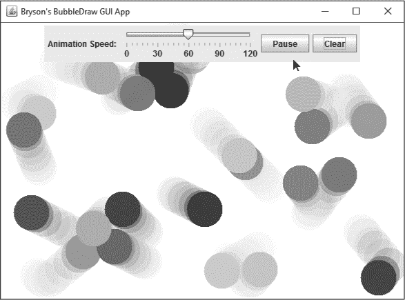

*图 10-1：增强版的 BubbleDrawGUI 应用展示了动画、弹跳的半透明气泡，并带有一个可以控制动画的 GUI 界面。*

这个版本的应用比之前更具互动性和用户友好性，用户可以在屏幕上点击和拖动鼠标时，通过漂浮、弹跳的气泡进行绘画。

### 复制 BubbleDraw Java 项目以创建 BubbleDrawGUI

新的 GUI 应用将直接建立在第九章的 BubbleDraw 项目上。因此，我们不需要从头开始创建一个新的 Java 项目，而是复制 BubbleDraw 项目并将其粘贴到同一工作空间中，并为其指定一个新名称。这是一种非常实用的方法，尤其是在你想扩展并开发程序的新版时，同时保留旧版本不变。

在 Eclipse 中，右键点击 Package Explorer 面板中的*BubbleDraw*项目文件夹，选择**复制**。然后，在 Package Explorer 面板中右键点击并选择**粘贴**。复制项目的弹出窗口将允许你为复制的项目指定新名称。输入`BubbleDrawGUI`并点击**确定**。Eclipse 将在 Package Explorer 面板中创建一个新的 BubbleDraw 项目副本，命名为 BubbleDrawGUI。

#### *重命名主类和 Java 文件*

现在，让我们重命名*BubbleDraw.java*文件。这个文件包含一个`public static void main()`方法，用于运行应用程序，重命名它有助于我们区分新应用和旧版本。在新的*BubbleDrawGUI*项目文件夹中，右键点击*BubbleDraw.java*，选择**重构** ▸ **重命名**。

*重构*意味着重新组织你的代码结构，而不是改变其功能。通常，程序员会在想出一种更好、更高效的方式来实现同样的功能时进行重构。当重命名编译单元窗口弹出时，输入新名称`BubbleDrawGUI`，然后点击**完成**。可能会弹出第二个窗口，警告你类中包含`main()`方法。你可以忽略这个警告，只需再点击一次**完成**。重构过程将同时重命名类和 Java 文件为 BubbleDrawGUI。我们暂时不会更改`BubblePanel`类。

最后，让我们修改`JFrame`窗口的标题，以匹配新的 GUI 版本的应用程序。打开*BubbleDrawGUI.java*文件。找到创建`JFrame`的那一行，并将其修改为显示*Your Name's* `BubbleDraw GUI App`，如下所示：

import javax.swing.JFrame;

public class BubbleDrawGUI extends JFrame {

public static void main(String[] args) {

JFrame frame = new JFrame("Your Name's BubbleDraw GUI App");

**注意**

*第一次运行包含多个文件的应用程序时，例如 BubblePanel 和 BubbleDrawGUI 应用程序，你需要运行包含 main()方法的文件。运行主文件会创建配置，使你以后只需点击运行按钮就能启动程序。BubblePanel 类没有 main()方法，所以我们必须运行* BubbleDrawGUI.java *文件，或者右键点击* BubbleDrawGUI *项目文件夹，选择 **Run As** ▸ ***Java Application***。

保存文件并运行它，在窗口顶部的标题栏中查看新标题，如图 10-2 所示。

*图 10-2：新的* BubbleDrawGUI.java *文件打开一个窗口，标题栏上显示* “Your Name’s *BubbleDraw GUI App*”。

现在，让我们做一个更改，让气泡看起来更逼真。

#### *添加透明度*

真实的气泡通常具有半透明的外观。想象一下吹气泡糖气泡：一旦它变得足够大，你可以透过气泡薄薄的表面看到里面的东西。我们可以在 BubbleDrawGUI 应用程序中为气泡添加透明度，使它们看起来更加逼真。

除了在第九章中学习的 RGB 颜色组件外，Java 还可以在`java.awt.Color`类中存储第四个组件。这被称为*alpha*组件，它表示当颜色绘制在其他物体前面时，颜色应显示为多透明或不透明。像 RGB 颜色值一样，alpha 组件的值范围是从`0`到`255`。alpha 值为`0`时，颜色将变为不可见，`128`会使颜色看起来像水彩颜料那样半透明，而`255`则会使它完全遮挡其后面的物体。

因为`Color`类的构造函数可以接受作为第四个参数的 alpha 值（紧跟在 RGB 颜色值之后），所以我们只需要在*BubblePanel.java*文件中修改一行来添加透明度。打开 BubbleDrawGUI 项目的*src*文件夹下的*BubblePanel.java*文件，滚动到文件底部，找到定义`Bubble`类的位置：

private class Bubble {

private int x;

--省略--

color = new Color(rand.nextInt(256),

rand.nextInt(256),

rand.nextInt(256),

rand.nextInt(256) );

}

在这里，我们通过添加一个第四个随机值来修改颜色变量的构造函数，该值的范围是从`0`到`255`。我们通过在`color`语句中的第三个`rand.nextInt(256)`后面添加逗号，并在`Color()`构造函数的右括号前添加第四个`rand.nextInt(256)`来完成此操作。请小心检查逗号和括号是否与这里显示的代码一致，否则应用程序将无法正常工作。

保存文件并运行它。点击屏幕上的任意位置绘制稍微重叠的点，如图 10-3 所示。

你现在会看到，气泡不仅有随机的颜色，还有不同程度的透明度。有些气泡是完全不透明的，完全遮挡了它们背后的屏幕，而其他一些则是透明的，几乎看不见。我们的气泡比以往更加“气泡”了！现在，让我们让它们漂浮起来，获得更加逼真的效果。

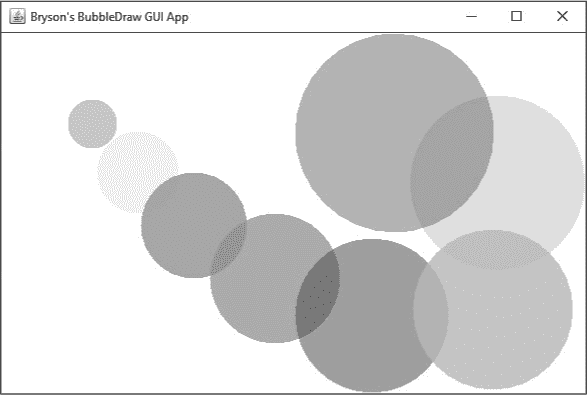

*图 10-3：给每个气泡的颜色添加一个 alpha 组件，使它们看起来既酷又透明。*

### 添加动画：气泡上升！

*动画*是通过在屏幕上展示一系列图像来创造的运动错觉。你可能在笔记本上做过翻书式的动画：每一幅画都相较前一幅略微移动，当你翻阅笔记本时，你就能看到动画活了起来。我们将添加这种效果，让气泡看起来像是在 BubbleDrawGUI 应用程序中漂浮起来。

为了实现气泡的动画，我们需要在屏幕上绘制所有气泡，稍微改变它们的位置，然后每秒重新绘制几次屏幕。我们绘制的每一帧都叫做一个 *帧*。如果我们足够快地重新绘制物体，我们的眼睛和大脑会填补帧之间的空白，让我们觉得同一个物体沿着平滑的路径移动。动画的 *帧率*，即我们重新绘制屏幕的速度，通常是每秒 30 帧左右。我们将使用一个新的类，`javax.swing.Timer`，它可以创建定时器，来告诉程序何时重新绘制气泡。我们还会使用一个事件处理器来更新气泡的位置，并在每次定时器触发时重绘屏幕。

创建动画气泡有四个步骤：添加定时器、设置定时器、准备动画和启动定时器。这些步骤和你在 Java 中为游戏或任何其他使用定时器的应用程序添加动画时会使用的步骤相同。

#### *添加定时器*

要为我们的应用程序添加定时器，我们需要导入 `javax.swing.Timer` 类。在你的 *BubblePanel.java* 文件的顶部，添加以下 `import` 语句：

import javax.swing.Timer;

import java.awt.event.*;

import java.util.ArrayList;

import java.awt.Graphics;

import java.util.Random;

import java.awt.Color;

import javax.swing.JPanel;

导入 `javax.swing` 的 `Timer` 类使我们能够创建一个 `timer` 对象，这个对象会根据我们设定的频率触发事件。注意在代码片段的第二行，我们已经导入了 `java.awt.event.*`。这行代码导入了所有的 `java.awt` 事件处理器，包括我们将用来处理定时器事件的 `ActionListener` 类。

接下来，在 `BubblePanel` 类中，添加两个变量：一个名为 `timer`，用于存储定时器对象，另一个是 `int` 类型的 `delay`，用于存储定时器等待多少毫秒后再重新绘制屏幕：

public class BubblePanel extends JPanel {

Random rand = new Random();

ArrayList<Bubble> bubbleList;

int size = 25;

Timer 定时器;

int delay = 33;

Java 中的计时器需要知道应该等待多少毫秒，或千分之一秒，才能触发计时器事件。由于毫秒非常短，因此我选择了 33 毫秒的延迟。这样屏幕大约每秒会重绘 30 次，因为 1 秒=1,000 毫秒，而 1,000 / 33 = 30 次绘制每秒。这大约和电视上的卡通动画播放速度相同。

#### *设置计时器*

现在我们准备好设置计时器了。在`BubblePanel()`构造函数内部，添加以下代码来初始化计时器并设置给定的延迟：

public BubblePanel() {

timer = new Timer(delay, new BubbleListener() );

bubbleList = new ArrayList<Bubble>();

setBackground(Color.BLACK);

// testBubbles();

addMouseListener( new BubbleListener() );

addMouseMotionListener( new BubbleListener() );

addMouseWheelListener( new BubbleListener() );

}

新的`Timer()`构造函数需要两个参数：第一个是延迟时间，以毫秒为单位，第二个是事件处理程序，用来监听计时器事件。每当计时器触发时，它会像我们在 GUI 界面中处理按钮点击时的`actionPerformed()`事件一样触发一个`actionPerformed()`事件。计时器有点像一个自动按钮，每隔几毫秒“点击”一次。我们将计时器放在构造函数的第一位，以便稍后可以根据 GUI 事件来修改它。

为了监听计时器事件，我们将修改`BubbleListener`类。在*BubblePanel.java*中向下滚动，找到我们之前创建的`BubbleListener`私有类。然后在类的开头加上`implements ActionListener`：

private class BubbleListener extends MouseAdapter implements ActionListener {

这个更改允许`BubbleListener`类通过实现`java.awt.event.*`中的`ActionListener`类来监听`actionPerformed()`事件。实现一个事件监听器类是处理用户事件的另一种方式。为了处理这些计时器事件，我们需要添加一个`actionPerformed()`事件处理程序。将以下方法添加到`BubbleListener`类的底部：

private class BubbleListener extends MouseAdapter implements ActionListener {

public void mousePressed(MouseEvent e) {

--snip--

}

public void mouseDragged(MouseEvent e) {

--snip--

}

public void mouseWheelMoved(MouseWheelEvent e) {

--snip--

}

public void actionPerformed(ActionEvent e) {

}

}

这个新的`actionPerformed()`方法是我们每次计时器触发时用来移动气泡并重绘屏幕的地方。我们接下来会添加这些语句。

#### *准备动画*

现在我们已经添加了计时器并设置了`BubbleListener`来监听计时器事件，我们需要告诉 Java，当计时器触发事件时应该做什么。

每次定时器触发事件时，都是绘制动画气泡序列中下一帧图像的时刻。首先，我们会告诉 `actionPerformed()` 事件处理器去更新气泡并重绘屏幕。然后，我们会告诉 `Bubble` 类通过向上移动气泡来更新它。程序将每秒执行约 30 次这些步骤。

在我们添加到 `BubbleListener` 类中的 `actionPerformed()` 方法内部，添加以下三行代码来更新气泡并重绘屏幕：

public void actionPerformed(ActionEvent e) {

➊ for (Bubble b : bubbleList)

➋ b.update();

➌ repaint();

}

在 ➊ 处，我们使用 `for-each` 版本的 `for` 语句遍历 `bubbleList` 中的每个 `Bubble` `b`。请记住，`bubbleList` 是包含所有气泡的 `ArrayList`，这些气泡是通过在屏幕上点击并拖动鼠标创建的。

当我们遍历 `bubbleList` 中的每个气泡时，我们会对所有气泡调用一个名为 `update()` ➋ 的新函数。Eclipse 用红色下划线标出这行代码，因为我们还没有在 `Bubble` 类中定义 `update()` 方法，但我们马上就会定义。`update()` 方法是我们将改变气泡位置的地方，使它们看起来像是在朝屏幕顶部浮动。

在 ➌ 处，我们调用 `repaint()` 方法来刷新屏幕，清空绘图窗口并以新的、更新的位置重新绘制气泡。通过每秒执行 30 次这个操作，我们就能实现想要的动画效果。

现在让我们创建 `update()` 方法，告诉 `Bubble` 类每次动画定时器触发时如何移动气泡。在 Java 的 (x, y) 坐标系中，我们需要从 `y` 值中减去一个值（屏幕顶部是 `y` 等于 `0`）。因此，为了让气泡看起来向上移动，我们可以在每次更新时从 y 坐标中减去一个小值。

向下滚动到 *BubblePanel.java* 文件的底部，我们在这里定义了 `Bubble` 类，并在 `draw()` 方法下方添加 `update()` 方法，如下所示：

public void draw(Graphics canvas) {

canvas.setColor(color);

canvas.fillOval(x - size/2, y - size/2, size, size);

}

public void update() {

y -=5;

}

}

}

更新气泡位置的函数会从该气泡的 `y` 值中减去五个像素。每次气泡在屏幕上重新绘制时，它将比之前高五个像素。

保存你的文件。在运行应用程序之前，你只需要再做一步！

#### *启动定时器*

动画化 **BubbleDrawGUI** 应用程序的最后一步是启动定时器。向上滚动到 `BubblePanel()` 构造函数，并添加以下代码行：

public BubblePanel() {

timer = new Timer(delay, new BubbleListener() );

--snip--

addMouseWheelListener( new BubbleListener() );

timer.start();

}

`timer.start()` 方法将启动定时器，以便它按照指定的时间间隔触发事件，直到调用 `timer.stop()` 方法或退出程序为止。

现在保存并运行程序。当你绘制气泡时，它们应该会向上漂浮，由定时器事件处理程序平滑地动画化。

鼠标滚轮和我们在第九章中构建的其他功能仍然适用于我们的迷人动画效果。到目前为止，气泡只向一个方向漂浮，但我们已经实现了预期的运动假象。在接下来的部分中，你将学习如何让气泡向各个方向漂浮。

### 永远吹泡泡：添加随机速度和方向

我们在上一部分创建的 `update()` 函数只改变了每个气泡的 y 位置，导致气泡每次屏幕重绘时都垂直移动。在这一部分中，我们将使气泡在随机速度下同时水平和垂直移动，这样它们看起来就像是被吹向各个方向，如图 10-4 所示。

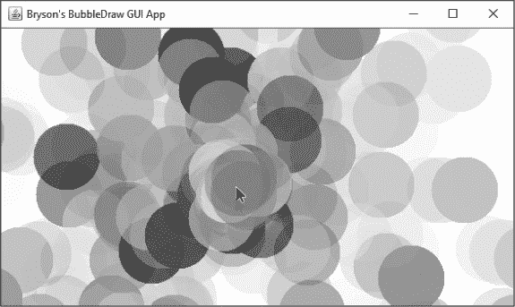

*图 10-4：同时改变每个气泡的 x 和 y 位置会让气泡看起来像是从鼠标指针处向随机方向吹动。*

气泡的水平速度是每一帧它向左或向右移动的像素数。这决定了气泡的新 x 位置。同样，气泡的垂直速度决定了它的新 y 位置。通过仅在水平和垂直方向上移动气泡，我们可以使它向任何方向移动。图 10-5 展示了水平速度和垂直速度如何结合，产生气泡斜向移动的假象。

*图 10-5：快速改变气泡在 x 和 y 方向上的位置会让气泡看起来在屏幕上对角线方向移动。*

首先，我们需要添加变量来存储每次屏幕重绘时，每个气泡在 x 和 y 方向上应该移动多少像素。将以下两行添加到 `Bubble` 类的顶部：

private class Bubble {

--snip--

private Color color;

➊ private int xspeed, yspeed;

➋ private final int MAX_SPEED = 5;

在 ➊，我们声明了两个整数变量：`xspeed` 用于每次屏幕更新时气泡在水平上移动的像素数，`yspeed` 用于气泡在垂直方向上移动的像素数。在 ➋，我们添加了一个 *常量*，名为 `MAX_SPEED`，表示气泡每次最多可以移动的像素数。常量是类似于变量的命名值，但常量在程序内部不可更改，因此我们将其声明为 `final`，告诉 Java 该常量的值是永久的。为了方便区分常量和普通变量，我们通常将常量命名为全大写字母。

我们将使用 `rand.nextInt()` 方法给每个气泡一个随机的 `x` 和 `y` 速度，正如我们为气泡的颜色所做的那样。将这两行添加到 `Bubble()` 构造函数中：

public Bubble(int newX, int newY, int newSize) {

x = newX;

y = newY;

size = newSize;

color = new Color(rand.nextInt(256),

rand.nextInt(256),

rand.nextInt(256),

rand.nextInt(256) );

xspeed = rand.nextInt(MAX_SPEED * 2 + 1) - MAX_SPEED;

yspeed = rand.nextInt(MAX_SPEED * 2 + 1) - MAX_SPEED;

}

我们需要`x`和`y`的速度值来让气泡能够朝任意方向移动，但我们只有两个变量来处理四个方向（左或右，上或下）。我们可以通过使用正值和负值来解决这个问题。当`xspeed`为负时，气泡会朝左移动，当`xspeed`为正时，气泡会朝右移动。`yspeed`则会让气泡在`yspeed`为负时向上移动，`yspeed`为正时向下移动。为了让`xspeed`和`yspeed`的范围涵盖负值和正值，我将`MAX_SPEED`乘以 2 并加上 1，这样就得到了 11（因为`5 * 2 + 1 = 11`）。这使得`rand.nextInt(MAX_SPEED * 2 + 1)`等同于`rand.nextInt(11)`，返回的值会在 0 到 10 之间。通过从这个值中减去`MAX_SPEED`，就会得到一个在-5 到+5 之间的结果，因为`0 - 5 = -5`，`10 - 5 = 5`。

最后，我们需要修改`update()`函数，使得每次屏幕重绘时，气泡能够移动到新的位置。将语句`y -= 5;`替换为以下两条语句：

public void update() {

x += xspeed;

y += yspeed;

}

现在，每次屏幕重绘时，气泡将不再每次垂直移动 5 个像素，而是根据我们为每个气泡随机生成的`xspeed`和`yspeed`值进行水平和垂直的移动。结果就是我们拖动鼠标时，气泡会在屏幕上形成五光十色的爆炸效果！

保存并运行程序，进行这些修改后，你将看到像在图 10-4 中看到的那样的动画效果。气泡在 x 和 y 方向上的移动，随着时间的推移，给每个气泡带来了既随机又具有方向性的速度效果。

你可能会注意到一个有趣的现象，就是有些气泡，比如图中图 10-6 中心的气泡，会停在原地。这是因为我们为`x`和`y`速度随机生成的值在`-5`和`+5`之间，有时气泡的`xspeed`和`yspeed`都为 0。当发生这种情况时，气泡将完全不动。

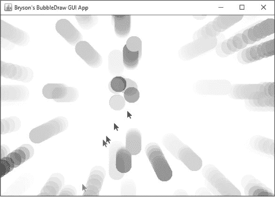

*图 10-6：由于随机速度值可能为 0，像图中靠近中心的这些气泡将保持原地不动。*

你可以通过检查`xspeed`和`yspeed`是否都为 0，并改变其中一个或两个值来避免气泡停在原地——这是第 244 页上的编程挑战#1。

现在我们的气泡在绘制时飘动起来，我们可能需要为应用添加一些功能：暂停动画和清空屏幕。是时候在我们的动画图形应用中构建一个 GUI 界面了。

### 为我们的动画绘图应用构建 GUI

BubbleDrawGUI 应用程序是图形化的，但它没有像我们其他的 GUI 应用程序那样的界面。暂停/开始按钮和清除按钮，如图 10-7 所示，会让用户更容易理解和与应用程序互动，因此接下来我们将添加这些按钮。

*图 10-7：暂停/开始和清除按钮*

#### *设置 GUI 面板和按钮*

在包资源管理器面板中，右键点击*BubblePanel.java*并选择**Open With** ▸ **WindowBuilder Editor**。点击设计选项卡，您应该能看到 GUI 设计视图。

首先，添加一个`JPanel`作为暂停/开始和清除按钮的容器，以及您以后可能想要添加的任何其他 GUI 组件。在调色板面板中，选择容器下的**JPanel**。然后，将鼠标悬停在右侧的设计预览上，点击`BubblePanel`设计预览，在黑色背景上放置一个新的`JPanel`。

或者，您可以通过在结构面板中点击**javax.swing.JPanel**条目，并在左侧的组件面板中点击来添加一个新的`JPanel`。您将看到一个非常小的灰色`JPanel`出现在黑色`BubblePanel`设计预览的顶部。

接下来，添加暂停/开始按钮和清除按钮。在调色板面板中，向下滚动到组件部分，选择**JButton**组件，然后将鼠标悬停并点击我们刚刚添加的小`JPanel`中，放置第一个`JButton`。将按钮的文本设置为`Pause`，可以直接在 GUI 预览中或者在属性面板中设置。（稍后您会明白为什么我们称之为*暂停/开始*按钮。）

按照清除按钮的相同步骤操作：在调色板面板中选择**JButton**，点击`JPanel`内以放置按钮，并将按钮的文本设置为`Clear`。

如果由于`JPanel`太小而难以放置按钮，请在调色板中选择**JButton**，然后点击左侧结构面板中的面板，将每个按钮放置在面板内，如图 10-8 中所扩展的那样。将按钮命名为`btnPause`和`btnClear`，可以在放置按钮时直接命名，或者通过在属性面板中更改`Variable`属性进行命名。

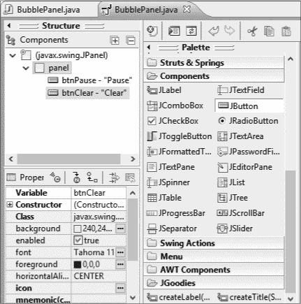

*图 10-8：在构建 GUI 时，您可以从调色板中选择组件并直接将其添加到结构面板。在这里，我们已经将 btnPause 和 btnClear 添加到我们刚创建的面板中。*

结构面板是一种在这种情况下向 GUI 添加组件的有用方法，当我们无法在设计预览中很好地看到`JPanel`，或者当我们想要更改 GUI 中组件的顺序或分组时。图 10-9 展示了完成的 GUI 中的两个按钮。

*图 10-9：完成的 GUI 中的暂停/开始和清除按钮*

现在我们已经将暂停/开始和清除按钮添加到绘图界面的顶部，是时候编写按钮的事件处理程序了。

#### *编写清除和暂停/开始按钮的代码*

让我们从**清除**按钮开始。清除屏幕上所有气泡的一种方式是将`bubbleList`变量重置为一个新的空列表——这样就没有气泡需要绘制，用户可以重新开始绘制。为了实现这一行为，双击**清除**按钮（记住，在设计标签中双击按钮会为按钮创建一个事件监听器，并将你切换回源代码标签），然后在`bubbleList`的事件监听器的花括号内添加以下两行代码：

JButton btnClear = new JButton("清除");

btnClear.addActionListener(new ActionListener() {

public void actionPerformed(ActionEvent arg0) {

➊ bubbleList = new ArrayList<Bubble>();

➋ repaint();

}

});

panel.add(btnClear);

在➊处，我们通过将`bubbleList`变量设置为一个新的`Bubble`对象的`ArrayList`来清空它。这个新列表将为空，因此我们只需重新绘制屏幕，就可以得到一个干净的黑色背景，就像我们打开应用程序时一样。在➋处，我们调用`repaint()`函数来绘制新的空屏幕。

保存并运行应用程序。然后绘制一些气泡并点击**清除**按钮以清除屏幕。

切换回设计标签并双击**暂停/开始**按钮以创建另一个事件监听器。当用户点击暂停/开始按钮时，我们不仅要通过停止计时器来暂停动画，还要将按钮的文本更改为*开始*。然后，当用户再次点击时，我们希望重新启动计时器以恢复动画，并将按钮的文本改回*暂停*。

输入以下代码到 Eclipse 为你双击暂停/开始按钮时提供的`actionPerformed()`方法中。

**注意**

*确保你的 ActionEvent 变量在 actionPerformed()方法中命名为 e，如代码中的粗体所示。*

JButton btnPause = new JButton("暂停");

btnPause.addActionListener(new ActionListener() {

public void actionPerformed(ActionEvent e) {

➊ JButton btn = (JButton)e.getSource();

➋ if (btn.getText().equals("暂停")) {

➌ timer.stop();

➍ btn.setText("开始");

}

else {

➎ timer.start();

➏ btn.setText("暂停");

}

}

});

panel.add(btnPause);

在➊处，从右到左，我们使用`e.getSource()`方法来找出哪个按钮被点击，将其强制转换为`JButton`变量类型，并将按钮的链接存储为`btn`。`getSource()`方法对于查找是否有 GUI 元素被点击或更改非常有用，特别是在你为多个元素编写事件处理器时。在这个例子中，我们可以使用`getSource()`来访问按钮的属性，比如它的`text`属性。

在➋处，我们检查按钮上的文本是否等于字符串`"暂停"`。如果是，我们停止计时器➌以暂停动画，然后将按钮上的文本更改为字符串`"开始"`➍。

如果按钮上的文字不是 `"暂停"`——换句话说，如果动画已经暂停且按钮上的文字因为之前的点击已更改为 `"开始"`——事件处理器将会跳转到 `else` 语句，启动计时器 ➎ 来恢复动画。最后，暂停/开始按钮上的文字会再次变回 `"暂停"` ➏。

保存文件并再次运行。现在你可以暂停动画，绘制一些东西，然后重新启动动画，达到图 10-10 中展示的惊人爆炸气泡效果。

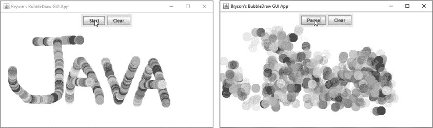

*图 10-10：暂停动画，绘制一个形状，然后重新启动动画，看到你的画作爆炸成五彩斑斓的气泡。*

BubbleDrawGUI 应用程序是一个视觉效果惊艳的动画应用，按钮让用户对绘图界面有更多的控制。但是，一旦动画开始，气泡就会从屏幕边缘漂浮出去，再也不会回来。如果我们能让气泡在窗口内反弹，这样它们就能在屏幕上停留得更长时间，怎么样？

### 碰撞检测下的墙壁反弹

动画不仅仅是翻书动画和屏幕保护程序。你经常会遇到动画的另一个地方：计算机游戏。无论是移动应用程序，还是最新的在线或主机游戏，动画是游戏开发者让用户感受到运动和动作的方式。

我们可以在 BubbleDrawGUI 应用的最终版本中加入一个有用的游戏编程概念——*碰撞检测*，它让我们检查屏幕上两个物体是否重叠或*碰撞*。你可能会用碰撞检测来告诉程序当玩家击中敌方飞船或踢足球时应该做什么。在这个应用程序中，我们想要找出气泡是否已经到达绘图屏幕的边缘，这样我们就可以改变气泡的方向，让它看起来像图 10-11 中的气泡那样，从屏幕边缘反弹回中心。

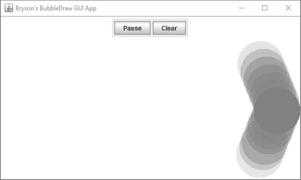

*图 10-11：气泡从窗口右边缘反弹，这是得益于碰撞检测。*

碰撞检测可以使虚拟物体（比如我们在 BubbleDrawGUI 中的气泡）看起来更加逼真。在你最喜欢的计算机游戏中，碰撞检测是防止玩家掉进地板或穿墙的机制。这些物体是虚拟的——它们全都是计算机图形，所以它们不能*真正*相互碰撞——但是碰撞检测创造了它们是坚固的幻觉。因此，如果我们让气泡在屏幕边缘轻轻反弹，它们会给我们一种更像真实物体的感觉。我们来看看这怎么实现。

#### *柔和的反弹*

首先，我们将分解一下气泡如何在碰到窗口边缘时进行碰撞检测。我们已经知道，每个气泡都有一对用于定位的 x 和 y 坐标，以及用于表示水平方向和垂直方向上每帧移动像素数的`xspeed`和`yspeed`。

要确定气泡是否与窗口边缘发生碰撞，我们需要知道屏幕边缘的 x 和 y 坐标，以便将其与气泡的 x 和 y 坐标进行比较。屏幕的左边缘是最小的 `x` 值，或者 `x==0`。屏幕的顶部是最小的 `y` 值，或者 `y==0`。那么右边缘和底部的坐标呢？

Java 中的每个 GUI 组件都继承了两个方法，用来返回组件的宽度和高度：`getWidth()` 和 `getHeight()`。我们的 BubbleDrawGUI 应用程序的绘图屏幕是`JPanel`的`BubblePanel`。因此，如果我们在`BubblePanel`中调用`getWidth()`和`getHeight()`函数，那么最大`x`值就是`getWidth()`，最大`y`值就是`getHeight()`。

我们在 `Bubble` 类的 `update()` 方法中检查气泡的 `x` 和 `y` 值是否与屏幕边缘发生碰撞。你可能还记得，`update()` 方法也是我们使用 `xspeed` 和 `yspeed` 来更新每个气泡的 `x` 和 `y` 坐标，从而实现运动效果的地方。

让我们更精确地定义一下“反弹”的含义。在图 10-11 中，气泡正朝着屏幕的右边缘移动，其中`x==getWidth()`，意味着气泡的`x`值达到了屏幕宽度的最大值（以像素为单位）。为了让气泡看起来像在反弹，我们通过反转`xspeed`来改变它的运动方向。气泡每次更新时都会按某个正数像素数移动；当它触碰到屏幕边缘后，我们可以通过改变`xspeed`的符号使气泡朝反方向移动。换句话说，我们可以将`xspeed`设置为*负值*，让气泡在反弹后朝左移动，远离屏幕右边缘。

我们可以通过设置`xspeed = -xspeed`来反转气泡的水平速度，这会让`xspeed`变成它自身的相反数。所以，原本每帧`xspeed`为 3 个像素的气泡，在碰到屏幕右边缘后，`xspeed`会变为`-3`，即反转其方向，向左移动。

我们也可以对屏幕的左边缘进行相同的操作，其中`x==0`。如果气泡的`x`值使得气泡可以触碰到左边缘，设置`xspeed = -xspeed`会使得水平运动方向发生反转：`xspeed`为`-3`时会变成`-(-3)`，即`+3`。这将使气泡重新朝右移动，远离屏幕的左边缘。

在 *BubblePanel.java* 文件中，向下滚动到底部，找到我们定义的 `Bubble` 类。找到 `update()` 方法，并添加以下用于检测左边缘和右边缘碰撞的代码：

public void update() {

x += xspeed;

y += yspeed;

if (x <= 0 || x >= getWidth())

xspeed = -xspeed;

}

如果气泡的`x`值小于`0`，或者`x`超过了屏幕的宽度，说明气泡一定碰到了屏幕的左边或右边，因此我们将`xspeed`更改为使气泡朝相反方向弹回。

对于上下边缘，我们将执行相同的操作，但这次我们会改变`yspeed`：

public void update() {

x += xspeed;

y += yspeed;

if (x <= 0 || x >= getWidth())

xspeed = -xspeed;

if (y <= 0 || y >= getHeight())

yspeed = -yspeed;

}

如果气泡的`y`值小于`0`，或者超过了屏幕的高度（以像素为单位），我们将`yspeed`更改为`-yspeed`，使气泡朝相反方向移动。

完成这些对`update()`方法的修改后，保存并重新运行文件。这一次，你会看到你创建的气泡从四个边缘轻轻反弹。然而，你可能会注意到一个小问题：气泡在任何方向上移动到屏幕的一半位置时才会反弹，如图 10-12 所示。

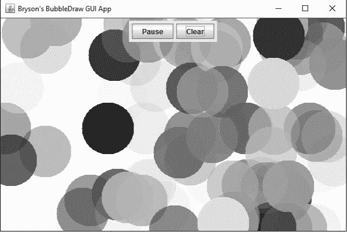

*图 10-12：在窗口的边缘，有许多气泡几乎在反弹前就已经移出了屏幕一半。*

这种“软”弹跳发生的原因是我们正在检查每个气泡的*中心*与屏幕边缘的碰撞。回想一下，在第九章中，我们将每个气泡的中心设置为用户点击的(x, y)坐标，因此每个气泡的`x`和`y`值表示该气泡中心的位置。为了让气泡完全停留在屏幕内，我们需要检测每个气泡的外边缘与绘图窗口的边缘之间的碰撞。

#### *一个硬弹跳*

为了检测每个气泡与边缘的碰撞，我们需要考虑从每个气泡中心到边缘的距离，即气泡的半径（因为每个气泡是一个完美的圆形）。半径等于每个气泡`size`值的一半，即`size/2`。修改`update()`方法中的两个`if`语句，以考虑每个气泡的大小，如下所示：

public void update() {

x += xspeed;

y += yspeed;

➊ if (x - size/2 <= 0 || x + size/2 >= getWidth())

xspeed = -xspeed;

➋ if (y - size/2 <= 0 || y + size/2 >= getHeight())

yspeed = -yspeed;

}

在➊处，我们从`x`中减去`size/2`，以查看气泡的左边缘是否已触及屏幕的左侧，如果`x - size/2`小于或等于`0`，则为真。除法在减法之前进行。因此，`size/2`会首先计算，然后从`x`中减去，所以我们不需要给`size/2`加括号。我们还将`size/2`加到`x`中，以查看气泡的右边缘是否已触及屏幕的右边缘，这意味着`x + size/2`大于或等于`getWidth()`。在➋处，我们对每个气泡的上边缘（`y - size/2`）和下边缘（`y + size/2`）做同样的修改，以查看它们是否分别触及绘图窗口的顶部或底部。

保存程序并重新运行。现在，所有你创建的气泡，无论大或小，都将在窗口的边缘坚固地反弹，如图 10-13 所示。

*图 10-13：现在我们的气泡在窗口的边缘做出了“硬”反弹，呈现出更为坚固的外观。*

点击应用程序标题栏上的最大化按钮，或双击标题栏以展开窗口。即使在应用程序全屏时，你也会看到气泡会扩展并弹跳到绘图窗口的边缘。我们使用了`getWidth()`和`getHeight()`方法来确定右边和底部的边缘，这些方法将始终返回当前的宽度和高度，因此你可以在绘制时随意调整应用程序的大小。

现在，让我们做最后一次添加，通过 GUI 给用户更多控制。

### 添加滑块来控制动画速度

此时，我们已经让用户可以控制暂停和清除屏幕的操作，并能够创建大大小小的气泡。现在，让我们通过提供一个滑块来控制动画速度，滑块改变定时器的延迟，如图 10-14 所示。

*图 10-14：添加一个滑块将允许用户加速或减慢动画速度。*

首先，切换回设计标签，并将`JLabel`和`JSlider`添加到 GUI 控制面板中。在调色板下方滚动，找到组件部分并选择**JLabel**。点击 GUI 设计预览中的暂停/开始按钮前的小面板以放置标签。将标签的文本更改为`动画速度:`。

接下来，点击调色板中的**JSlider**组件。然后，点击动画速度标签和暂停/开始按钮之间的空白处以放置滑块，如图 10-15 所示。

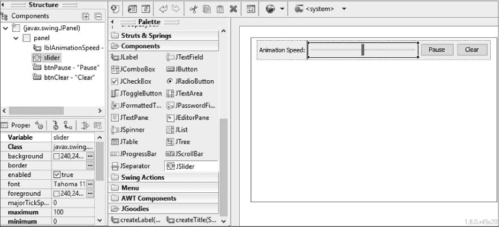

*图 10-15：在设计视图中将标签和滑块添加到应用程序的 GUI 控制面板中。*

你可能会注意到，随着我们添加元素，所有 GUI 组件的`JPanel`大小也在增长。如果你点击结构面板中的面板，你会看到`Layout`属性的默认值为`java.awt.FlowLayout`。这种布局会扩展以容纳你放置的所有 GUI 元素。我们为 Hi-Lo 猜数字游戏和秘密消息应用程序使用了`AbsoluteLayout`，因为我们希望将元素放置在特定位置。在这个绘图应用程序中，我们可以更加灵活，`FlowLayout`非常适合动态添加 GUI 组件。

#### *自定义滑块*

接下来，我们将更改一些属性来定制滑块，所以我们需要弄清楚滑块的外观。滑块应该允许用户轻松直观地调整动画速度。换句话说，如果用户将动画速度滑动到 0，动画应该几乎停下来。如果用户将动画速度滑动到最右端，动画应该非常快。

显示器通常每秒刷新 30 到 120 次，60 Hz（即*赫兹*，每秒的频率单位）是最常见的刷新率。如果我们将气泡动画的速度设置为每秒超过 120 帧，你的显示器可能无法显示所有单独的帧。因此，将滑块的最大速度值设置为每秒 120 帧是有道理的。

每秒的帧数，缩写为*fps*，通常用于衡量动画的流畅度。在你的电脑上运行 60 fps 的游戏比运行 30 fps 的游戏看起来更平滑。

在设计预览中选择滑块。在左下角的属性面板中，设置范围，通过指定**最大值**为`120`和**最小值**为`0`（默认值）。为了准备标签和刻度标记，将**majorTickSpacing**设置为`30`，将**minorTickSpacing**设置为`5`，并选中**paintLabels**、**paintTicks**和**paintTrack**旁边的复选框，将这三个值设为`true`。最后，将**value**属性设置为`30`，即每秒的默认帧数。图 10-16 展示了具有我们所有自定义值的属性面板，以及更改后的`JSlider`预览。

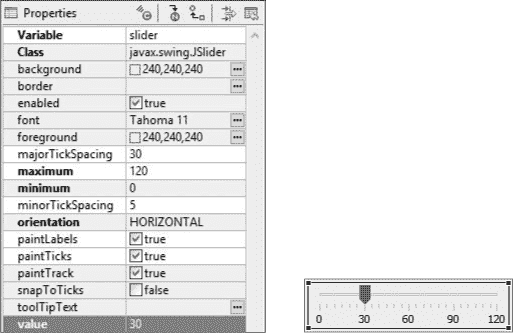

*图 10-16：动画速度滑块的属性面板，包含自定义值（左）；显示自定义设置的滑块预览（右）*

由于你勾选了`paintLabels`并将`majorTickSpacing`设置为`30`，滑块标记从 0 到 120，每隔 30 个单位。由于你设置了`minorTickSpacing`为`5`并勾选了`paintTicks`，小刻度标记将显示在这些值之间。我们已经准备好了一个自定义滑块，可以用来改变动画速度，现在让我们编辑代码让滑块开始工作。

#### *实现滑块事件处理程序*

在设计标签的设计预览中，右键点击滑块并选择**添加事件处理程序** ▸ **change** ▸ **stateChanged**。Eclipse 将添加一个带有 `stateChanged()` 方法的 `ChangeListener`，就像我们在《秘密消息》应用的滑块实现中使用的那样。代码如下所示：

JSlider slider = new JSlider();

slider.addChangeListener(new ChangeListener() {

public void stateChanged(ChangeEvent e) {

}

});

首先，我们需要在类的顶部声明 `JSlider`，这样我们就能够在 `stateChanged()` 事件处理程序的代码中访问滑块的值。向上滚动到 `BubblePanel` 类的顶部，并在 `timer` 和 `delay` 变量下面添加以下行：

public class BubblePanel extends JPanel {

Random rand = new Random();

ArrayList<Bubble> bubbleList;

int size = 25;

Timer timer;

int delay = 33;

JSlider slider;

接下来，向下滚动回到滑块代码并从第一行的开头删除 `JSlider` 类型声明：

slider = new JSlider();  // 从行首删除 "JSlider"

slider.addChangeListener(new ChangeListener() {

public void stateChanged(ChangeEvent e) {

}

});

当用户更改滑块的位置时，我们希望通过更改每个定时器事件之间的延迟时间来改变动画的速度。为此，我们需要从滑块中获取速度值，将速度转换为毫秒数，然后将定时器的延迟设置为新值。在 `stateChanged()` 方法的大括号内添加以下三行：

slider = new JSlider();

slider.addChangeListener(new ChangeListener() {

public void stateChanged(ChangeEvent arg0) {

➊ int speed = slider.getValue() + 1;

➋ int delay = 1000 / speed;

➌ timer.setDelay(delay);

}

});

在 ➊ 处，我们使用 `getValue()` 方法从滑块中获取速度值，并将其存储在名为 `speed` 的整数变量中。然而，注意我们在这里将滑块值加 1。这样做是为了防止在 ➋ 处出现除零错误，在该处我们将 `1000` 除以 `speed` 来确定每帧之间的延迟毫秒数。滑块的值可以降到 0，但通过将其值加 1，我们避免了延迟导致的错误：`1000/0` 会引发除零异常，而 `1000/1` 会给我们一个非常慢的 1,000 毫秒的延迟，导致动画几乎停止。也就是说，当用户将滑块移动到 0 时，动画不会真正停止。为了完全停止动画，他们需要点击暂停/开始按钮。

最后，我们通过设置新的延迟值（单位为毫秒）更新定时器 ➌。这将通过改变定时器事件之间的时间来减慢或加速动画。

保存文件并运行它。来回移动滑块，你会发现现在可以控制动画的速度了。

BubbleDrawGUI 应用程序是我们到目前为止最具互动性、娱乐性和视觉吸引力的应用程序——一个图形化、动画化的绘图应用程序，带有 GUI 界面，让用户对动画拥有完全的控制权。玩一会儿它，并为自己做得不错而庆祝吧！

**共享并共享快乐**

这也将是一个很适合与朋友分享的应用程序。从 Eclipse 中导出可运行的 JAR 文件，点击 **文件 ▸ 导出**。然后，展开 *Java* 文件夹并点击 **Runnable JAR 文件**。点击 **下一步**，在 **启动配置** 下，点击下拉菜单并选择 **BubbleDrawGUI – BubbleDrawGUI**。

在 **导出目标** 下，点击 **浏览**，然后选择你想保存完成的应用程序的目标文件夹，可能是 *桌面*。给你的程序文件起个名字，比如 *Bryson’s BubbleDraw.jar*。点击 **保存**，然后 **完成**。

找到你保存 JAR 文件的位置，运行它并与朋友分享。即使你的朋友没有 Eclipse，只要他们安装了 Java，他们也能运行你的 BubbleDrawGUI 应用程序。享受吧！

### 你学到了什么

我们在第九章的 BubbleDraw 应用程序基础上构建了一个带有弹跳气泡的动画 GUI 版本。以下是本章中我们添加的一些技能：

• 将图形应用程序与图形用户界面（GUI）接口结合

• 复制项目并将新版本粘贴到 Eclipse 的包资源管理器中

• 通过重构重命名类或对象

• 通过设置 RGBA 颜色中的 alpha 组件来使用透明度

• 创建、设置并启动一个 `Timer` 对象

• 处理 `Timer` 对象事件

• 通过定时器移动图形对象来创建动画

• 通过碰撞检测让虚拟对象反弹

• 使用 `getWidth()` 和 `getHeight()` 来查找窗口的边缘

• 使用滑块更改计时器的延迟

• 通过更改计时器的 `delay` 属性来改变动画的速度

### 编程挑战

通过这些编程挑战练习来复习和实践你所学的知识，同时也能扩展你的编程技能。访问本书的网站 *[`www.nostarch.com/learnjava/`](https://www.nostarch.com/learnjava/)* 查阅示例解决方案。

#### *#1：不让任何气泡落单*

我们在本章中注意到的一个问题是，有些气泡的随机速度为 `0`，导致它们看起来卡在原地，而其他气泡则漂浮离开。这发生在气泡的 `xspeed` 和 `yspeed` 都设置为 `0` 时。对于这个挑战，添加一些代码来确保没有气泡的随机速度为 `0`。为此，你将测试 `xspeed` 和 `yspeed` 的值，看看它们是否都等于 `0`。如果是，你只需要将这两个值设置为其他值，例如 `1`。

**提示**

*将 if 语句添加到 Bubble() 构造函数中，在 xspeed 和 yspeed 值创建之后。*

private class Bubble {

--snip--

public Bubble(int newX, int newY, int newSize) {

--snip--

xspeed = rand.nextInt(MAX_SPEED * 2) - MAX_SPEED;

yspeed = rand.nextInt(MAX_SPEED * 2) - MAX_SPEED;

如果  // 在此处添加你的代码

}

进行更改，保存并运行文件，瞧——没有更多孤立的气泡了！

#### *#2：Flexi-Draw！*

由于速度值是随机的，气泡会朝各个方向移动，这正是我们最初想要的效果。但是如果我们想要绘制形状并让它们保持在一起呢？

将每个气泡的速度设置为相同的固定值，会产生一种奇特、灵活、扭曲的效果，当对象从屏幕边缘反弹时，效果如同 图 10-17 所示。

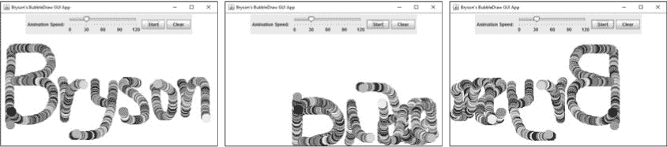

*图 10-17：将所有气泡的 xspeed 和 yspeed 设置为相同值，会产生一种灵活、弹性的效果，使形状在屏幕边缘反弹并扭曲时保持在一起。*

对于这个挑战，创建一个应用程序的新副本，以便原始版本仍然可用。在包资源管理器中复制并粘贴 BubbleDrawGUI 项目，将其重命名为 FlexiDraw 或其他你选择的名称。在 *BubblePanel* 文件中，修改 `Bubble()` 构造函数，使其不再创建随机的 `xspeed` 和 `yspeed` 变量，而是将它们设置为相同的值，可能像这样：

xspeed = yspeed = 2;

这一行代码利用了赋值运算符（`=`）的一个有趣特性。这被称为 *链式赋值*，因为 `xspeed` 和 `yspeed` 都被赋予了 `2` 的值，等号允许我们将相同的值依次赋给多个变量。

你可以为速度值选择更高或更低的数字。需要注意的重点是，我们已经用每个气泡的固定起始速度和方向替代了随机的速度。每个气泡在第一次绘制时都会向右移动两个像素并向下移动两个像素，因此当你绘制时，气泡会形成小组。

保存文件，右键单击 *FlexiDraw* 文件夹，在包资源管理器中选择 **运行方式** ▸ **Java 应用程序**。暂停动画以进行绘制，然后按 **开始** 观看你的形状在屏幕上弯曲、扭曲并反弹！你甚至可以在动画运行时绘制，获得酷炫的螺旋效果。

#### *#3：PixelDraw 2.0*

在这个挑战中，你将重用 第九章 中的 PixelDraw 代码（第 219 页的编程挑战 #2）。将像素化效果添加到动画绘图程序中，将允许你绘制方形像素图形并对其进行动画处理。将这个效果与前一个挑战中的 FlexiDraw 技巧结合，你就得到了一个像 图 10-18 中所示的、像《Minecraft》一样的弹跳、弯曲绘图应用程序。

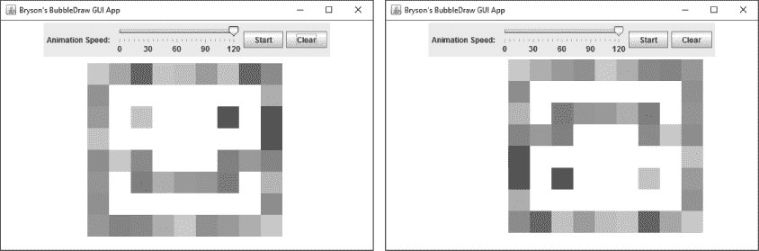

*图 10-18：PixelDraw 2.0 效果（左）；气泡在反弹并扭转上下、向后运动后形成的相同形状（右）*

暂停动画以保持方块的清晰、网格状形态，如图 10-18 中的示例。保持动画运行时绘制，以实现像图 10-19 中的示例那样的堆叠 3D 效果。

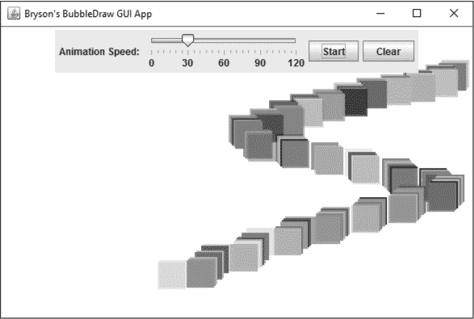

*图 10-19：如果在动画运行时拖动鼠标，PixelDraw 2.0 代码会创建一个堆叠的 3D 效果。*

这里有一个数学提示：为了实现方块风格，你需要根据每个方块的大小将屏幕划分成一个网格，然后在该网格位置绘制一个方块。此时，尝试将`x`和`y`变量在`Bubble()`构造函数顶部修改为如下内容：

x = (newX / newSize) * newSize + newSize/2;

y = (newY / newSize) * newSize + newSize/2;

公式的第一部分`(newX / newSize) * newSize`根据`newSize`（当前气泡的大小）将屏幕划分为网格块。为了将 x 和 y 坐标与`newSize` x `newSize`的网格对齐，我们需要让它们成为`newSize`的倍数。对于 x 坐标，我们通过将`newX`除以`newSize`来实现，这样得到一个没有小数点的整数，再将其乘以`newSize`，得到一个`newSize`的倍数。这将把气泡的 x 坐标放置在用户点击的网格块的边缘。例如，如果`newSize`是`10`，那么除法和乘法会将 x 坐标“对齐”到`10` x `10`的网格线，使得`x`成为`10`的倍数。如果我们仅此为止，气泡的中心会位于网格线交汇点的位置。由于我们希望气泡位于网格块的中心，第二部分（`+ newSize/2`）将气泡移到该块的中心位置。

最后，通过将`draw()`方法修改为使用`fillRect()`填充矩形，而不是椭圆，来绘制方块而非气泡。

就这样！但你可以——而且应该！——做更多更改，进一步自定义这个新应用并使其属于你自己。更改*BubbleDrawGUI.java*文件中的`JFrame`标题，或者如果你愿意，可以重构/重命名文件。天空是极限！

在做出这些更改后，你将能够绘制出美丽的、方块状的、像素化的动画作品。截图并把它发到推特上，@你的朋友们。使用#JavaTheEasyWay 标签，或者@我@brysonpayne，我也会转发给几千个朋友！
