## 第十一章：## 制作多点触控的 BubbleDraw 安卓应用

我们最终的应用将是一个多点触控的安卓版本 BubbleDraw，用户可以通过触摸屏幕绘制气泡——甚至是用所有 10 个手指！

安卓设备中的处理器通常比桌面 CPU 小且慢。如果你曾遇到“应用未响应”的错误，你就会知道当应用消耗过多设备处理能力时会发生什么。因此，这个版本的应用将采用一种名为*线程*的全新动画方法，它将使应用使用更少的处理能力。线程使得我们能够同时运行多个应用，或者说是*多任务处理*。

新的 BubbleDraw 应用也将使用*多点触控*。请查看图 11-1，图中显示了气泡从多个不同位置喷涌而出，我的小儿子 Max 将手指触摸在屏幕上。

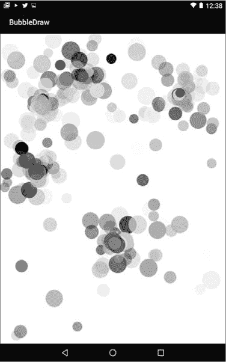

*图 11-1：BubbleDraw 应用的安卓版本将使用多点触控，用户可以在屏幕的多个位置同时绘制气泡。*

移动版 BubbleDraw 应用将重用桌面和 GUI 版本的许多功能，比如我们在第十章完成的`Bubble`类的源代码。不过，在安卓设备上绘制图形的方式有所不同，而且由于我们还将添加线程和多点触控功能，你需要学习一些新的应用构建技巧。你将通过使用 BubbleDraw 应用作为基础来掌握这些新技能。

### 设置 BubbleDraw 项目

打开 Android Studio，关闭所有打开的项目，然后点击**开始一个新的 Android Studio 项目**。在创建新项目的窗口中，输入**BubbleDraw**作为应用名称，保持公司域名不变（*example.com*或你的网站名称），然后点击**下一步**。

这一次，我们想选择一个比之前应用中使用的更新的 API 版本。Hi-Lo 猜数字游戏和秘密消息应用都使用了适用于较旧安卓设备的 GUI 界面。然而，在这个应用中，我们需要使用`drawOval()`方法来绘制气泡，这需要 API 21 或更高版本。选择**API 21: Android 5.0 (Lollipop)**作为最低 SDK 版本。

另一个不同之处是，这个应用将不再像我们在 Hi-Lo 猜数字游戏和秘密消息应用中使用的基本活动那样，而是使用一个空活动，因为我们不需要基本的 GUI 界面。我们不会使用常规的 GUI 应用布局，而是创建一个交互式的触摸绘图画布。在“向移动设备添加活动”屏幕上，选择**空活动**并点击**下一步**。

我们将保留`MainActivity`作为活动名称，正如我们在之前的应用中所做的那样，但取消勾选**向后兼容性**复选框并点击**完成**。关闭向后兼容性将使我们的代码更加简洁。

与之前的两个桌面版本的 BubbleDraw 应用一样，我们将使用两个 Java 文件来将气泡代码与主应用代码分开。一旦你的项目打开，点击屏幕左侧的“项目”标签以显示项目资源管理器窗格，如果它尚未显示的话。然后，选择项目资源管理器窗格顶部的**Android**标签。在*app* ▸ *java*下，找到*main* BubbleDraw 包（不要选择*androidTest*或*test*包）。右键点击项目资源管理器中的 BubbleDraw 包，选择**新建** ▸ **Java 类**，如图 11-2 所示。

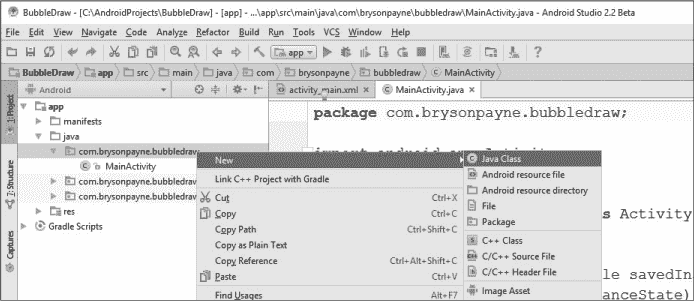

*图 11-2：为气泡代码在你的主 BubbleDraw 包中添加一个新的 Java 类。*

在“创建新类”弹出窗口中，将新类命名为`BubbleView`。在 Android 中，`View`是任何 GUI 组件。`BubbleView`类的功能与桌面应用中的`BubblePanel`类相同。我们所有的气泡绘制代码都将写在这个类中。

Android Studio 的“创建新类”窗口允许我们轻松设置超类和接口。首先，我们将使新`BubbleView`类继承轻松绘制图形的能力。在**超类**文本框中，开始输入`ImageView`，然后在自动完成下拉列表中点击**ImageView (android.widget)**，将新类的父类设置为`ImageView`。点击后，它将显示为`android.widget.ImageView`。

接下来，我们将实现`OnTouchListener`接口，以使我们的应用能够处理触摸事件，类似于我们在应用的早期版本中使用的鼠标事件。在**接口**文本框中，开始输入`OnTouchListener`，然后在自动完成下拉列表中点击**OnTouchListener (android.view.View)**。点击后，它将显示为`android.view.View.OnTouchListener`。

点击**确定**。现在，你应该能在*com.<yourdomain>.bubbledraw*包内看到`BubbleView`类。双击项目资源管理器中的`BubbleView`类，开始编辑该文件。`BubbleView`类可能会被红色下划线标记，表示缺少一些代码，但我们将在接下来的几节中填补这些必需的部分。

### 创建 BubbleView 构造函数

双击*BubbleView.java*标签，将其展开为全屏，以便更轻松地进行编辑。让我们开始构建`BubbleView`类，首先添加一些与`BubblePanel`类类似的变量。和我们在桌面版及 GUI 版本的应用中一样，我们需要一个随机数生成器和一个用于存储用户绘制的气泡的`ArrayList`，以及一些整数变量，用于设置默认气泡大小和动画延迟（毫秒）。

#### *添加动画变量*

我们需要为气泡设置随机颜色和速度，因此在`BubbleView`类的起始大括号内，开始输入`private Random`，然后在自动完成下拉列表中点击**Random (java.util)**。

每次在代码中添加一种新类型的对象时，我们都会点击自动代码补全列表中的项。记住，安卓 Studio 的代码补全功能不仅帮助你更快编写代码，还能减少因拼写错误或类名错误而导致的错误。

完成声明你的`private Random rand = new Random();`。然后，添加以下代码中显示的每个变量。检查你的`import`语句，确保它们与你这里的内容一致：

package com.yourdomain.bubbledraw;  // 注意：你的包名可能不同

import android.widget.ImageView;

import android.view.View;

import java.util.ArrayList;

import java.util.Random;

public class BubbleView extends ImageView implements View.OnTouchListener {

➊ private Random rand = new Random();

➋ private ArrayList<Bubble> bubbleList;

➌ private int size = 50;

➍ private int delay = 33;

}

这四行代码与我们在第九章和第十章中声明的变量相似，只有一些针对安卓版本的调整。➊处的随机数生成器声明与我们之前的版本相同，因为它们都使用了`java.util.Random`。同样，➋处声明了一个名为`bubbleList`的`Bubble`对象的`ArrayList`，这将是我们存储用户创建的气泡的地方。`Bubble`类型说明符应该以红色显示，提示我们还没有定义`Bubble`类。

在➌处，我们声明了一个整数变量作为默认的气泡大小，但由于移动设备的像素较小，我们将其在安卓应用中设为更大。你的手机或平板电脑的屏幕通常比桌面电脑小，而且分辨率更高，因此我们将默认的气泡大小设置为`50`，以便在应用中更容易看到这些气泡。你可以稍后编辑这一行，根据气泡在设备上显示的效果调整它的大小。

在➍处，我们通过将每帧之间的延迟设置为`33`毫秒，将动画速度保持在每秒 30 帧。记住，要计算动画速度，我们将 1,000 毫秒除以每秒的帧数 30 帧，得到每帧的毫秒数，1,000 ÷ 30 = 33。

在安卓上，图形和动画与桌面端会有所不同，因此我们需要添加两个新变量：

public class BubbleView extends ImageView implements View.OnTouchListener {

private Random rand = new Random();

private ArrayList<Bubble> bubbleList;

private int size = 50;

private int delay = 33;

➊ private Paint myPaint = new Paint();

➋ private Handler h = new Handler();

}

➊这一行声明了一个名为`myPaint`的`android.graphics.Paint`对象。可以将其视为在 Android 屏幕上绘制气泡的画笔。你必须拥有一个`Paint`对象才能在 Android 的`Canvas`上绘制图形。在键入`Paint`后按 ENTER 以接受代码完成建议，或者在键入后点击`Paint`并按 ALT-ENTER（或 OPTION-ENTER）以自动导入`android.graphics.Paint`类。

➋这一行声明了一个新的变量类型，名为`h`的`android.os.Handler`。确保你导入的是`android.os`版本的`Handler`类，因为有其他类有类似的名字。这个`Handler`对象将使我们能够使用线程来实现动画，你可以将它类比为桌面应用中的`Timer`。然而，与`Timer`不同的是，`Handler`将允许我们与一个*线程*进行通信，线程是一个在多任务环境中运行的独立进程，在该环境下我们可能同时运行多个应用程序。与`Timer`会持续占用 CPU 计算事件之间的时间不同，`Handler`将释放 CPU，允许其他任务运行，直到该重新绘制另一个动画帧的时间到来。

接下来，我们将向应用程序中添加一个构造函数并开始绘制气泡。

#### *创建 BubbleView()构造函数*

接下来的步骤是为`BubbleView`类编写构造函数。在我们刚声明的变量下面，输入如下构造函数代码：

public class BubbleView extends ImageView implements View.OnTouchListener {

private Random rand = new Random();

private ArrayList<Bubble> bubbleList;

private int size = 50;

private int delay = 33;

private Paint myPaint = new Paint();

private Handler h = new Handler();

public BubbleView(Context context, AttributeSet attributeSet) {

super(context, attributeSet);

}

}

使用自动代码完成导入`android.content.Context`和`android.util.AttributeSet`。Android 使用这两个类来存储当前应用程序的信息，我们需要导入它们才能调用`super()`方法。`super()`方法通过调用父类`ImageView`的构造函数来设置应用程序和绘制屏幕。

目前，我们将添加到构造函数中的唯一语句是初始化`bubbleList`的代码：

public BubbleView(Context context, AttributeSet attributeSet) {

super(context, attributeSet);

bubbleList = new ArrayList<Bubble>();

}

初始化`bubbleList`，通过将其设置为一个新的、空的`ArrayList`对象来存储`Bubble`，在这里的工作方式与应用程序的早期版本相同。我们可以在用户触摸屏幕时将新的气泡存储到`bubbleList`中。

#### *准备布局以使用 BubbleView*

现在我们已经开始构建`BubbleView`类，接下来是告诉我们的 GUI 布局文件在应用程序运行时显示`BubbleView`。在项目资源管理器中，打开*app* ▸ *res* ▸ *layout* ▸ *activity_main.xml*并切换到底部窗口的 Text 选项卡。

将*activity_main.xml*文件的内容替换为以下内容，并将我的包名替换为你的应用包名：

<?xml version="1.0" encoding="utf-8"?>

➊ <RelativeLayout xmlns:android="http://schemas.android.com/apk/res/android"

xmlns:tools="http://schemas.android.com/tools"

android:layout_width="match_parent"

android:layout_height="match_parent"

➋ android:background="#000000"

➌ tools:context="com.*yourdomain*.bubbledraw.BubbleView">

➍ <com.*yourdomain*.bubbledraw.BubbleView

➎ android:layout_width="match_parent"

➏ android:layout_height="match_parent"

/>

</RelativeLayout>

该应用使用默认的`RelativeLayout` ➊，这将使我们以后能够轻松地放置其他 GUI 组件。`RelativeLayout`的许多属性与默认设置相同，但我们添加了一个`background`颜色`#000000` ➋，即黑色。

当你在第➌和➊行将包名`com.`*yourdomain*`.bubbledraw`替换为你的包名时，Android 会通过在第➍行提供代码补全建议来帮助你。

➋这一行将`BubbleView`放入布局，接下来的第➎和➏行指示程序匹配*activity_main.xml*窗口的宽度和高度，该窗口是`BubbleView`的父级对象。

*activity_main.xml*文件是你的应用程序运行时加载的默认 GUI 布局视图。通过告诉*activity_main.xml*加载`BubbleView`作为布局中的唯一项目，并匹配布局的宽度和高度，最终使得`BubbleView`应用占据整个屏幕。因此，经过这些修改后，*activity_main.xml*文件现在知道调用`BubbleView`来显示我们的泡泡绘图画布。

说到泡泡，我们来重用桌面版应用中的`Bubble`类吧。

### 修改`Bubble`类

打开第十章中的*BubbleDrawGUI*项目，进入 Eclipse，访问旧版`Bubble`类。打开*BubblePanel.java*类，滚动到文件底部，找到我们定义的`Bubble`类。复制该类的完整源代码，从`private class Bubble`一直复制到倒数第二个闭括号。文件中的最后一个括号是`BubblePanel`的闭括号，因此只需确保复制`update()`和`Bubble`类的闭括号。

现在你已经复制了`Bubble`类，切换回 Android Studio，将光标放在`BubbleView()`构造函数的闭括号后面。按 ENTER 键，在文件底部的最终闭括号之前插入一个空行。

大部分来自桌面版`Bubble`的代码都可以正常工作，但我们需要做一些调整，以适应 Android 绘制图形的方式。我们从`Bubble`类的顶部开始。在 Android 图形中，颜色值是以整数形式存储的，而不是`Color`对象，因此将`private Color color`改为`private int color`，如下面所示：

private class Bubble {

private int x;

private int y;

private int size;

private int color;

private int xspeed, yspeed;

private final int MAX_SPEED = 5;

其他所有变量保持不变。

我们还需要修改`Bubble()`构造函数中的颜色条目。删除`new Color`并用`Color.argb`替换，如下所示：

public Bubble(int newX, int newY, int newSize) {

x = newX;

y = newY;

size = newSize;

color = Color.argb(rand.nextInt(256),

rand.nextInt(256),

rand.nextInt(256),

rand.nextInt(256) );

xspeed = rand.nextInt(MAX_SPEED * 2) - MAX_SPEED;

yspeed = rand.nextInt(MAX_SPEED * 2) - MAX_SPEED;

}

一定要移除`new`关键字，因为`Color.argb()`并不会创建一个新对象。相反，`Color.argb()`方法将四个*ARGB*值（*alpha, red, green* 和 *blue*）转换为一个单一的颜色整数，可以用来改变 Android 中的画笔颜色。

这是我们第一次在这个应用中使用`Color`类，因此在 Android Studio 的文本编辑器中它会显示为红色。你可以手动将`import android.graphics.Color;`添加到文件顶部的`import`语句中，或者点击**Color**并按 ALT-ENTER（或 OPTION-ENTER）让 Android Studio 为你自动导入。按 ALT-ENTER 类似于接受代码补全建议，不过你可以在输入代码后使用 ALT-ENTER 来导入类。

接下来，我们需要修改`Bubble`类中的整个`draw()`方法。用以下代码替换我们复制的`draw()`方法：

xspeed = rand.nextInt(MAX_SPEED * 2) - MAX_SPEED;

yspeed = rand.nextInt(MAX_SPEED * 2) - MAX_SPEED;

}

➊ public void draw(Canvas canvas) {

➋ myPaint.setColor(color);

➌ canvas.drawOval(x - size/2, y - size/2,

x + size/2, y + size/2, myPaint);

}

public void update() {

在➊处，`draw()`方法接受一个类型为`android.graphics .Canvas`的参数，而不是`java.awt.Graphics`。一定要在输入时或之后点击它并按 ALT-ENTER（或 OPTION-ENTER）来导入`Canvas`类。 

在➋处，我们将`myPaint`对象的颜色设置为该气泡的`color`值。

➌处的代码与桌面版有几个不同之处。首先，在 Android 的`Canvas`上绘制椭圆的命令是`drawOval()`，而不是`fillOval()`。其次，我们使用椭圆的*left, top, right, bottom*值来指定包含椭圆的边界框，而不是使用*left, top, width, height*。左边和顶部保持不变，分别是`x - size/2`和`y - size/2`。（记住，我们减去气泡的宽度和高度的一半，以便将其居中于用户触摸屏幕的`(x, y)`位置。）气泡边界框的右侧是`x + size/2`，底部是`y + size/2`，如图 11-3 所示。与桌面版使用宽度和高度计算椭圆的右下角不同，Android 要求我们指定右下角的 x 和 y 坐标，即`x + size/2, y + size/2`。最后，`drawOval()`方法需要一个`Paint`对象，因此我们传入了`myPaint`。

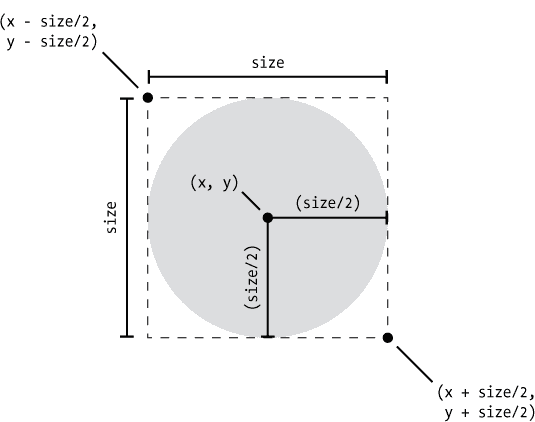

*图 11-3：Android 的 drawOval()方法使用一个虚拟边界框的左上角和右下角坐标，而不是我们在桌面 Swing 工具包中看到的顶部、左侧、宽度和高度值。*

这些是将`Bubble`类从桌面移植到 Android 所需的唯一更改。做出这些更改后，保存文件。接下来，我们将在屏幕上绘制所有气泡。

### 使用 onDraw()方法在 Android 中绘图

我们想测试应用程序在屏幕上绘制气泡的能力，因此接下来我们将向`BubbleView`类添加一个`onDraw()`方法。`View`类中的`onDraw()`方法类似于`JPanel`中的`paintComponent()`方法：它告诉 Java 在每次屏幕刷新时绘制什么内容。

我们想绘制气泡列表，因此在*BubbleView.java*中的`BubbleView()`构造函数下方和`Bubble`类上方添加以下代码：

public BubbleView(Context context, AttributeSet attributeSet) {

super(context, attributeSet);

bubbleList = new ArrayList<Bubble>();

}

➊ protected void onDraw(Canvas canvas) {

➋ for (Bubble b : bubbleList)

b.draw(canvas);

}

private class Bubble {

在➊，`onDraw()`方法必须声明为 protected 并带有一个参数，即`Canvas`对象，才能正常工作，因为它必须与我们正在重写的默认`View.onDraw()`方法完全匹配。我们需要这个方法，因为它在所有`View`子类中都是必需的，而`BubbleView`是`ImageView`的子类，后者是`View`的子类。每当包含我们`BubbleView`的屏幕需要刷新时，`onDraw()`方法将被调用。

`onDraw()`方法内部重用了➋的`for-each`循环，它调用每个气泡的`draw()`函数。➋的这一行可以这样理解：“对于`bubbleList`中的每个`Bubble` `b`，在 Android 的`Canvas`上绘制`b`。”

还有几个步骤，我们可以在测试应用程序绘制多彩气泡之前完成它们。让我们先做这些，看看 Android 版本的 BubbleDraw 应用程序的早期测试效果。

### 测试 BubbleDraw，显示 100 个气泡

在 BubbleDraw 桌面应用程序的第一个版本中，我们编写了一个名为`testBubbles()`的简短方法。它看起来像下面这样：

public void testBubbles() {

for(int n = 0; n < 100; n++) {

int x = rand.nextInt(600);

int y = rand.nextInt(400);

int size = rand.nextInt(50);

bubbleList.add( new Bubble(x, y, size) );

}

repaint();

}

`testBubbles()`的目的是在我们实现鼠标和定时器事件处理之前，查看是否能够在屏幕上绘制气泡。现在，我们为 Android 版本的应用程序做同样的事情。

#### *添加 testBubbles()*

首先，让我们在*BubbleView.java*中的`onDraw()`方法下方添加一个略微修改版的`testBubbles()`函数：

protected void onDraw(Canvas canvas) {

for (Bubble b : bubbleList)

b.draw(canvas);

}

public void testBubbles() {

for(int n = 0; n < 100; n++) {

➊ int x = rand.nextInt(600);

➋ int y = rand.nextInt(600);

➌ int s = rand.nextInt(size) + size;

➍ bubbleList.add( new Bubble(x, y, s) );

}

➎ invalidate();

}

private class Bubble {

前两行与 Eclipse 版本的 `testBubbles()` 相同。这些行声明了该函数，并设置了一个 `for` 循环，循环 100 次。在 ➊ 处，我们保持 `x` 值的范围不变，设置为 `600`，但如果你知道设备的分辨率，可以将其设置得更大。在 ➋ 处，我们将随机 `y` 值的范围更改为 `600`，用于气泡的垂直位置。

在 ➌ 处，我们通过将 `0` 和 `size` 之间的随机数添加到默认值 `size` 中来生成更大的气泡。在这种情况下，我们将有直径从 50 到 100 像素的气泡。

在 ➍ 处，我们使用刚刚创建的三个随机值创建一个新的 `Bubble` 对象，并将其添加到 `bubbleList` 中。

最后，在 ➎ 处我们使用了一个新函数 `invalidate()`，它的作用类似于桌面版 BubbleDraw 中的 `repaint()` 函数。它告诉 Java 屏幕需要更新或刷新。`invalidate()` 函数会清空屏幕并调用 `onDraw()` 方法，后者会绘制 `bubbleList` 中的所有气泡。

现在我们已经定义了 `testBubbles()` 方法，我们只需要从 `BubbleView()` 构造函数中调用该方法进行尝试：

public BubbleView(Context context, AttributeSet attributeSet) {

super(context, attributeSet);

bubbleList = new ArrayList<Bubble>();

testBubbles();

}

现在，当应用程序加载时，`testBubbles()` 方法将被调用，填充 `bubbleList`，其中包含 100 个随机气泡。

#### *修复 OnTouchListener 错误*

在我们测试应用程序之前，还有一个问题需要修复：`BubbleView` 类仍然被红色下划线标记，提示我们可能有编译错误。将鼠标悬停在 `public class BubbleView` 这一行上，你将看到一个错误，告诉我们 `OnTouchListener` 的 `onTouch()` 方法缺失。换句话说，这个错误提醒我们，尽管我们已将 `BubbleView` 类定义为实现 `OnTouchListener`，但尚未添加 `onTouch()` 方法来处理触摸事件。

要修复此错误，将鼠标悬停在其上并点击红色灯泡警告图标。在红色灯泡下拉菜单中，点击**实现方法**。会弹出一个窗口，询问你选择要实现哪些方法，如 图 11-4 所示。

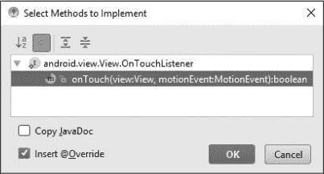

*图 11-4：Android Studio 实现了 onTouch() 方法以完成 OnTouchListener。*

点击**确定**，Android Studio 会在你的代码中插入一个 `onTouch()` 方法来清除错误：

@Override

public boolean onTouch(View view, MotionEvent motionEvent) {

return false;

}

如果 Android Studio 插入的代码与这里看到的内容不匹配，请在代码中更正参数名称，以匹配 `view` 和 `motionEvent`，如图所示。这是我们稍后将修改以处理触摸事件的方法，但现在让我们先测试一下应用程序，看看它是否能绘制 100 个气泡！

#### *运行 BubbleDraw 应用程序*

按下绿色运行按钮来测试你的应用程序。在选择部署目标窗口中，选择你的模拟器或设备，正如我们在“在 Android 模拟器上运行应用程序”中第 94 页所做的那样。我选择了我的**Nexus 6P**模拟器，见图 11-5。

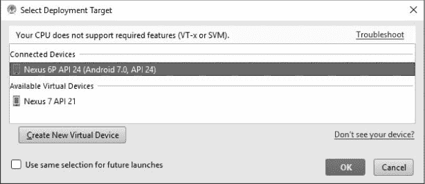

*图 11-5：按下运行按钮编译并运行你的应用程序。然后选择你的模拟器或设备并点击***确定***。*

点击**确定**以启动你的设备并部署我们迄今为止开发的 BubbleDraw 应用程序。你应该看到气泡填满屏幕的左上角，正如图 11-6 所示。气泡出现在左上角，因为我们只生成了 0 到 600 之间的 x 和 y 坐标，而大多数安卓设备可以在每个方向上显示 1000 个以上的像素。记住，在 Java 中，(0,0)坐标位于左上角。

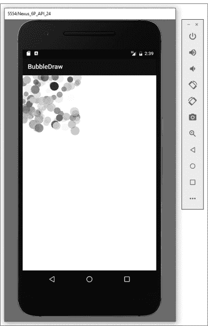

*图 11-6：到目前为止成功测试运行 BubbleDraw 应用程序；100 个气泡出现在屏幕的左上角。*

与桌面版应用程序的第一次测试运行类似，当前没有动画或触摸交互，因为我们还没有添加它们。但是我们的应用程序在模拟器上运行，并正确地在屏幕上绘制了气泡。

接下来，我们添加动画，使气泡移动。然后我们将添加最后的点睛之笔——触摸！

### 在 Java 中使用线程动画和多任务处理

我们将在 BubbleDraw 安卓应用程序中使用的线程，与在任何 Java 多任务应用程序中添加的线程类似。我们之前提到过，使用线程进行动画的一个优点是，它不会在等待每一帧重新绘制时占用处理器。但是，线程也可以在你开发的任何其他应用程序中使用，这些应用程序一次运行多个进程，例如查询数据库或在后台上传文件的应用程序。使用线程可以让你的应用程序在等待进程完成时执行后台任务，而不会冻结 GUI 界面。

线程在处理器能力有限的设备上，特别是在手机和平板电脑上，尤其重要。无响应的应用程序尤其令人烦恼，线程可以帮助防止 BubbleDraw 应用程序变得无响应。

我们在本章前面创建的`Handler h`对象可以让我们与线程进行通信。在这个应用程序中，我们将创建一个线程来执行动画，通过更新所有气泡的位置。然后，我们将使用我们的处理程序`h`来告诉线程何时运行。这将使处理程序和线程像我们在前几章中的`Timer`动画一样工作，但不会在每帧之间占用 CPU。

有两种方法可以在 Java 应用程序中添加线程：通过扩展`Thread`类或实现`Runnable`接口。我们将选择`Runnable`方法。

实现`Runnable()`的类需要一个`run()`方法，该方法告诉线程在运行时需要做什么。对于 BubbleDraw，我们希望`run()`方法通过移动气泡并重新绘制屏幕来执行动画。

让我们创建一个名为`r`的`Runnable`对象，并将其放置在`BubbleView()`构造函数的正下方：

public BubbleView(Context context, AttributeSet attributeSet) {

super(context, attributeSet);

bubbleList = new ArrayList<Bubble>();

testBubbles();

}

➊ private Runnable r = new Runnable() {

@Override

➋ public void run() {

}

➌ };

protected void onDraw(Canvas canvas) {

当你在➊处输入声明的后半部分时，代码补全建议会弹出，自动完成新的`Runnable()`对象。接受`java.lang.Runnable`的代码补全，Android Studio 会自动为你添加`public void run()`方法的存根➋。注意，在`Runnable`对象的闭括号后面的分号➌是必须的，因为我们在同一时刻既定义了`r`又将其分配给了新的`Runnable`对象。➌处的分号实际上完成了我们在➊处开始的语句。自动代码补全不会在➌处添加分号，所以确保你已经添加了它，以避免编译错误。

现在，我们需要在`run()`方法中添加代码，告诉 Java 每次调用`Runnable`线程`r`时需要执行什么操作：

private Runnable r = new Runnable() {

@Override

public void run() {

➊ for(Bubble b : bubbleList)

➋ b.update();

➌ invalidate();

}

};

protected void onDraw(Canvas canvas) {

for (Bubble b : bubbleList)

b.draw(canvas);

}

在➊处，我们再次使用`for-each`语句来循环遍历`bubbleList`中的每个`Bubble b`。在每次循环迭代中，我们调用 b.update() ➋来更新每个气泡的位置，为下一帧动画做准备。

在➌处，我们在循环完成后调用`invalidate()`函数，以清除屏幕并通过调用`onDraw()`方法告诉 Java 重新绘制视图。

添加基于线程的动画的最后一步是将`Handler` `h`与`Runnable`线程`r`连接起来。我们将在`onDraw()`方法的最后进行此操作：

protected void onDraw(Canvas canvas) {

for (Bubble b : bubbleList)

b.draw(canvas);

h.postDelayed(r, delay);

}

`postDelayed()`方法将一条消息从处理程序发送到我们的线程`r`，告诉它在延迟 33 毫秒后再次运行，延迟值为`delay`。

保存这些更改并重新运行应用程序。你将看到 100 个测试气泡缓慢扩展以填满屏幕，如图 11-7 所示。

即使在每秒 30 帧的情况下，你最快的气泡也可能看起来很慢。这是因为你的 Android 设备或模拟器上有更多的像素。你可能还记得我们在 `Bubble` 类中设置的 `MAX_SPEED` 仅为每帧 5 像素。我们正在模拟的 Nexus 6P 手机的屏幕分辨率是 1,440 × 2,560，这意味着最快的气泡需要超过 500 帧，或者超过 15 秒，才能穿越整个屏幕。

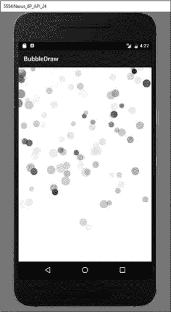

*图 11-7：我们起飞了！我们的气泡终于有了动画效果，得益于线程动画。*

让我们稍微加速一点，将 `MAX_SPEED` 改为更高的值，比如每帧 15 像素：

private class Bubble {

private int x;

private int y;

private int size;

private int color;

private int xspeed, yspeed;

private final int MAX_SPEED = 15;

保存文件并重新运行。现在，你的气泡将更加流畅地在屏幕上移动。你可以根据自己的喜好增大或减小数值。

现在我们已经实现了动画，是时候添加触摸响应，让应用程序能够响应用户操作了。

### 使用触摸手势绘制气泡

使桌面版 BubbleDraw 应用如此有趣的一个特点是我们可以点击并拖动鼠标，在任何地方绘制气泡。我们将把这种乐趣带入 Android 应用程序中，然后在添加多点触控时让它变得更有趣！

你已经看到我们需要在哪里添加触摸事件处理代码——就是我们之前添加的 `onTouch()` 函数中。

为了处理触摸事件，首先我们需要确定用户触摸的位置。然后，我们将在该位置添加一个气泡。

为了找出用户触摸的 x 和 y 坐标，我们可以使用 `motionEvent.getX()` 和 `motionEvent.getY()`。让我们添加完整的 `onTouch()` 方法，并进行拆解：

public boolean onTouch(View view, MotionEvent motionEvent) {

➊ int x = (int) motionEvent.getX();

➋ int y = (int) motionEvent.getY();

➌ int s = rand.nextInt(size) + size;

➍ bubbleList.add( new Bubble(x, y, s) );

➎ return true;

}

在 ➊ 处，我们通过 `motionEvent.getX()` 方法获取用户触摸的 x 坐标。然而，请注意，我们需要将该值转换为整数——因为 `motionEvent.getX()` 在 Android 中返回的是浮动点值，所以我们使用 `(int)` 进行转换。y 坐标 ➋ 以相同方式处理，在 ➌ 处，我们像在 `testBubbles()` 中一样生成一个随机大小并将其存储在 `s` 中。

在 ➍ 处，我们创建一个 `Bubble` 对象，并使用给定的 `x`、`y` 和 `s` 值将其添加到 `bubbleList` 中。

最后一行代码，在 ➎ 处，需要做一点解释。请注意，`onTouch()` 方法的返回类型是 `boolean`。这意味着 `onTouch()` 方法必须返回一个 `true` 或 `false` 值。在 Android 中，如果你已经完全处理了触摸事件，`onTouch()` 方法应返回 `true`。如果你希望 Android 在你的 `onTouch()` 事件处理完成后继续处理触摸事件，例如滚动或缩放，请返回 `false`。

对于绘图应用，我们不需要 Android 在用户滑动时滚动屏幕——我们通过在用户触摸的位置添加气泡，完全处理了触摸事件，因此返回值为`true`。

最后一步类似于桌面版 BubbleDraw 中鼠标监听器的步骤：我们需要在构造函数中添加监听器。向上滚动到`BubbleView()`构造函数，注释掉`testBubbles()`函数，并添加如下代码：

public BubbleView(Context context, AttributeSet attributeSet) {

super(context, attributeSet);

bubbleList = new ArrayList<Bubble>();

// testBubbles();

setOnTouchListener(this);

}

我们注释掉了对`testBubbles()`的调用，因为我们不再需要 100 个测试气泡了。我们将通过在 Android 设备上触摸屏幕或在 Android 模拟器上点击并拖动鼠标来模拟触摸。`setOnTouchListener(this)`语句添加了一个触摸事件监听器，告诉 Java `this`，即`BubbleView`类的一个对象，将处理触摸事件。

通过这些更改，我们准备好尝试我们的应用了。保存你的代码并在模拟器上运行应用。在模拟器窗口点击并拖动，以模拟手指在屏幕上的滑动。你将看到气泡从你触摸的位置流出，如图 11-8 所示。

你也可以在你的物理 Android 设备上运行此应用。我们将在下一部分中回顾如何操作，在那之前，我们需要添加处理多个触摸事件的能力。

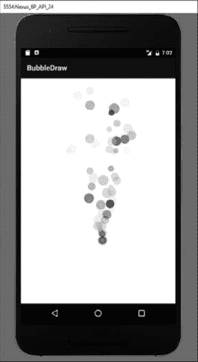

*图 11-8：点击并拖动鼠标模拟模拟器上的单指触摸，气泡会流出。*

#### *使用多点触控同时用 10 根手指绘图！*

你可能玩过使用多点触控的应用，比如一款双人游戏，其中你用一根或多根手指控制屏幕一侧的物体，而你的朋友控制屏幕另一侧的物体。如果你玩过，你就会理解多点触控给应用和游戏带来的强大功能。

好消息是，处理 Android 中的多点触控事件的代码几乎和处理单点触控事件的代码一样简单！事实上，我们只需要添加一行语句，并修改`onTouch()`中的几行代码，我们的应用就能处理多点触控事件。

告诉我们当前有多少个触摸事件正在同时发生的方法是`getPointerCount()`。它返回当前`MotionEvent`中屏幕上有多少个*指针*——触摸事件或手指。

我们可以添加一个`for`循环，为当前触摸事件中的每个指针添加气泡：

public boolean onTouch(View view, MotionEvent motionEvent) {

➊ for (int n = 0; n < motionEvent.getPointerCount(); n++) {

➋ int x = (int) motionEvent.getX(n);

➌ int y = (int) motionEvent.getY(n);

int s = rand.nextInt(size) + size;

bubbleList.add(new Bubble(x, y, s));

➍ }

return true;

}

在 ➊ 步骤中，我们添加了一个 `for` 循环，将变量 `n` 从 `0` 递增到当前触摸事件中的指针数量。函数 `motionEvent.getPointerCount()` 返回指针的数量。如果只有一个触摸事件，`getPointerCount()` 会返回 `1`，此时循环只会执行一次，`n = 0`。如果有两个触摸事件，`n` 将分别为 `0` 和 `1`，以此类推。

在 ➋ 步骤中，我们通过在 `getX()` 后的括号内插入 `n` 来修改 `motionEvent.getX()` 方法。触摸事件中的指针是有编号的，因此将变量 `n` 作为参数传递给 `motionEvent.getX()` 会获取当前触摸事件中第 *n* 个触摸指针的 x 坐标。所以，`getX(0)` 会返回第一个触摸点的 x 坐标，`getX(1)` 会返回第二个触摸点的 x 坐标，依此类推。在 ➌ 步骤中，我们用 `getY(n)` 对每个触摸点的 y 坐标做同样的操作。最后，别忘了在 ➍ 步骤中关闭 `for` 循环的括号。

就这么简单！Java 和 Android 让处理多点触控事件变得很容易。

#### *在 Android 设备上测试多点触控事件*

保存你的代码，这样我们就可以再次运行应用。这一次，我们将把应用运行在一台真实的 Android 设备上。不幸的是，我们无法在 Android 模拟器中通过单一鼠标轻松模拟多点触控事件，所以你需要在一台真实的手机或平板上运行该应用。

首先，通过 USB 数据线将你的 Android 设备连接到运行 Android Studio 的电脑上。在设备上允许 USB 调试（请参见 “在真实 Android 设备上运行应用” 在 第 100 页）。如果模拟器中正在运行 BubbleDraw 应用，关闭它。然后，点击运行按钮或选择 **Run** ▸ **Run ‘app’**。

在选择部署目标窗口中，找到并选择你的设备——我的设备是 Asus Nexus 7——然后点击 **OK**。Android Studio 会重新编译应用并将其部署到你的设备上。

当应用启动时，屏幕看起来像是一个黑色屏幕，标题栏上显示“BubbleDraw”。不过，一旦你将一根或多根手指放在屏幕上，情况就变得更有趣了，正如 图 11-9 所示。

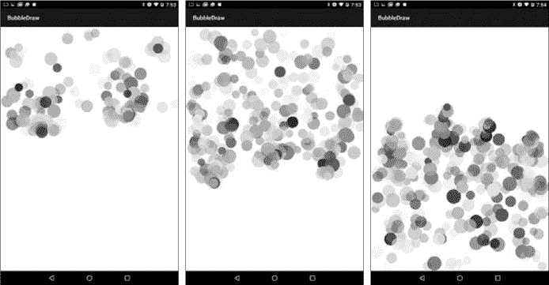

*图 11-9：用两根（左）、三根（中）或四根手指（右）触摸我的 Android 设备屏幕，会创建多个彩色、跳跃的气泡流。*

当你用手指在屏幕上拖动时，无论是用一个手指、两个手指、五个手指，还是十个手指，气泡似乎都会从你的指尖流出！

还有一个很酷的功能我们还没提到：要清除屏幕，只需将设备横向旋转（确保设备的方向锁定设置为自动旋转，而不是竖屏模式）。方向的变化会强制应用重新初始化 `BubbleView`，这将重置 `bubbleList` 并清除屏幕。这是一个酷炫的效果，它让应用感觉更加触感丰富和互动。

我们将对最终的 BubbleDraw 应用进行最后一次自定义：我们将用我们自己的图标替换默认的 Android 应用图标。

### 更改应用启动图标

到目前为止，我们的所有应用都使用了默认的 Android 应用启动图标，图标上展示了 Android 的友好绿机器人。但如果你想为 BubbleDraw 应用使用你自己的自定义图标，例如你公司的标志或像 图 11-10 所示的应用截图，该怎么办呢？

为了给你的应用程序添加自定义图标，你需要创建自己的 *ic_launcher.png* 文件，将其粘贴到 *app* ▸ *src* ▸ *main* ▸ *res* ▸ *drawable* 文件夹中，然后修改 *AndroidManifest.xml* 文件，使用你新创建的图标作为应用程序的启动图标。

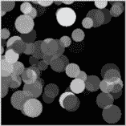

*图 11-10：从 BubbleDraw 截图中裁剪的自定义图像*

#### *创建自定义应用图标*

默认情况下，Android 会将应用的启动图标命名为 *ic_launcher.png*。如果你打开 *app* ▸ *src* ▸ *main* ▸ *res* ▸ *mipmap* 文件夹，你会看到几个不同大小的 *ic_launcher.png* 文件——这些文件存储在名为 *mipmap_mdpi, mipmap_xxhdpi* 等文件夹中——这些文件与不同手机和平板电脑的各种屏幕尺寸相对应。

我们为了方便也将新图像命名为 *ic_launcher.png*。使用你喜欢的图像编辑程序，创建一个你想用作应用启动图标的 PNG 文件。（网站 *[`www.gimp.org/`](http://www.gimp.org/)* 提供了一个很棒的免费图像编辑器，而 *[`www.pixlr.com/editor/`](https://www.pixlr.com/editor/)* 也可以在线免费使用。）最好使用正方形图像，但 Android 也可以处理不完全正方形的文件。我的图像尺寸为 156 × 156 像素，但任何介于 64 × 64 和 256 × 256 之间的尺寸都应该可以正常工作。

**注意**

*如果你想像我一样使用应用程序的截图，截屏非常简单：同时按住你的 Android 设备的休眠/唤醒按钮和音量减小按钮，直到屏幕闪烁，表示图像已保存。在你的照片应用程序中，找到“截图”文件夹，你应该能看到该图像。你可以通过给自己发送电子邮件，将图像编辑为 256 × 256 像素或更小，或者直接在 Android 设备上裁剪图像，然后将其通过电子邮件发送给自己。*

从图像编辑器中保存或导出你的文件为 *ic_launcher.png*。在下一步中，我们将复制这个图像并将其粘贴到 Android Studio 中的 BubbleDraw 项目中。

#### *将自定义图标添加到你的应用程序*

一旦你创建了自己的 *ic_launcher.png* 应用图标文件，打开你保存它的文件夹并复制该文件。

在 Android Studio 中，在你的 BubbleDraw 应用的项目资源管理器窗格下，找到 *app* ▸ *res* ▸ *drawable* 或 *app* ▸ *src* ▸ *main* ▸ *res* ▸ *drawable* 文件夹，将你的新 *ic_launcher.png* 图像粘贴到其中，如 图 11-11 所示。

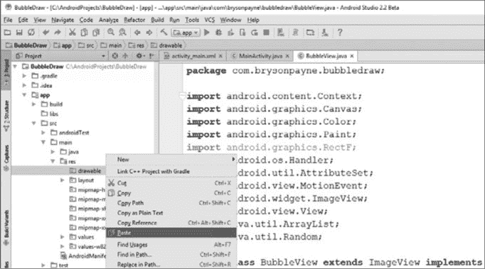

*图 11-11：将你新的自定义应用图标粘贴到* app ▸ src ▸ main ▸ res ▸ drawable *文件夹中。*

你会看到一个 Android 复制窗口，验证文件的位置。点击 **OK**。

当图标复制到你的 *drawable* 文件夹中时，你可以打开该文件夹并双击 *ic_launcher.png* 在 Android Studio 中预览它。

我们现在已经在 BubbleDraw 项目的结构中创建了新图标，因此我们可以告诉 Android 使用这个图像作为应用图标。

#### *显示你的新图标*

对于最后一步，我们将编辑你应用的 *AndroidManifest.xml* 文件。*AndroidManifest.xml* 文件描述了应用的一些基本结构、属性和功能，并将这些信息提供给 Android 操作系统。

在 *app* ▸ *src* ▸ *main*（或 *app* ▸ *manifests*）下，打开 *AndroidManifest.xml*。在文件的顶部，找到 `android:icon` 的条目，并将其更改为你刚刚放入 *drawable* 文件夹中的新文件：

<application

android:allowBackup="true"

android:icon="@drawable/ic_launcher"

我们告诉 Android 在这个项目的 *drawable* 文件夹中查找一个名为 *ic_launcher* 的图像文件。在清单文件中，我们省略了 *.png* 后缀。

现在，保存 *AndroidManifest.xml* 文件并按下运行按钮，以编译并部署带有新图标的应用程序。一旦应用程序在你的模拟器或 Android 设备上更新，你就会看到 BubbleDraw 的新图标，如图 11-12 所示。

我们创建的自定义 PNG 图像现在是 Android 应用程序的图标！

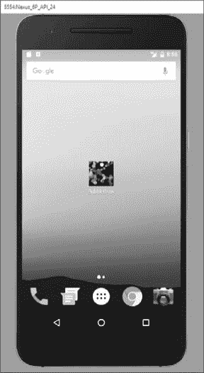

*图 11-12：我们已定制 BubbleDraw 应用程序的启动图标。*

#### *更改应用名称*

你还可以定制应用程序名称，它将出现在应用图标和应用内的标题栏中。在左侧的项目资源管理器标签中，找到 *app* ▸ *src* ▸ *main* ▸ *res* ▸ *values*，然后打开 *strings.xml*。*strings.xml* 文件存储了 `app_name` 字符串，该字符串既用于启动图标，如图 11-12 所示，也用于应用运行时的标题栏。

由于 BubbleDraw 中单词之间没有空格显得有些奇怪，我们将在定义 `app_name` 变量的 *strings.xml* 文件中的 XML 行中添加空格：

<resources>

<string name="app_name">Bubble Draw</string>

</resources>

当然，你可以将应用名称设置为任何你想要的，比如 *Your Name*`\'s Bubble Draw App`，但大约只有 11 或 12 个字符能够适应图标下方的空间，因此你会在主屏幕上看到类似 *Your Name*`'s...` 的效果。你还需要使用反斜杠字符转义应用名称中的任何特殊字符，包括单引号。

现在你知道该怎么做了，回去定制你的 Hi-Lo 猜数字游戏和秘密信息应用程序，并为它们添加自己的图标。不断优化你的应用并尝试新事物——这是在编码过程中保持学习的最佳方式。

### 你所学到的

从第一章开始，你已经走过了很长的路程。在构建了三款完整的移动和桌面应用之后，你已经获得了显著的计算技能，并且将这些新获得的能力付诸实践。也许最重要的是，你学会了如何通过一步步添加更多功能来逐步改进应用，直到每个应用都能完全按照你的需求运行。

在本章中，你巩固了几个技能，并将以下能力添加到了你的编码工具箱中：

• 在 Android 中绘制图形

• 向 Android Studio 项目中添加新类

• 设置变量并导入类

• 从头开始构建类构造函数

• 将 Java AWT 图形转换为 Android `Canvas` 图形

• 使用 `onDraw()` 方法在 `ImageView` 上绘制

• 创建一个 `Runnable` 对象来实现 Java 中的线程

• 使用 `Handler` 与 Java 中的单独线程进行通信

• 使用线程来提高动画效率

• 处理多个触摸事件，并使用 `MotionEvent` 方法来定位屏幕上的触摸事件

• 自定义应用启动器图标和应用名称

### 编程挑战

通过尝试这些编程挑战练习来回顾和实践你所学到的内容，并扩展你的编程技能。访问本书的网站 *[`www.nostarch.com/learnjava/`](https://www.nostarch.com/learnjava/)* 获取示例解决方案。

#### *#1: 结合单指和多点触控事件，v1.0*

在本章中，我们学习了如何处理单点触控事件和多点触控事件。在这个挑战中，你的任务是区分单点触控和多点触控事件。你将改变 `onTouch()` 方法中的逻辑，当一个手指触摸屏幕时绘制更大的气泡，而当多个手指触摸屏幕时绘制更小的气泡。

记住，你可以通过在 `onTouch()` 方法内的 `MotionEvent` 对象上使用 `getPointerCount()` 来获取触摸事件的数量。

为了额外练习，编写代码使得更多的手指触摸时，气泡会变得越来越小。

#### *#2: 结合单指和多点触控事件，v2.0*

当你掌握了编程挑战 #1 后，可以尝试这个。修改 `Bubble` 类和 `onTouch()` 监听器，在单指绘制时将气泡组合在一起，给它们相同的 `xspeed` 和 `yspeed` 值，但仍允许多点触控使气泡朝任意方向膨胀。

这将需要对 `onTouch()` 监听器进行类似于编程挑战 #1 中的更改。但是，为了将气泡分组，你需要一种方法来绘制一些具有固定速度的气泡，而其他气泡则具有随机速度。在单点触控事件期间绘制的气泡应该以相同的固定速度移动，以便它们看起来是组合在一起的，而多点触控绘制的气泡应继续分配随机速度值。

为了实现这一点，你可以创建第二个`Bubble()`构造函数。它将类似于我们最初为`Bubble`类创建的`Bubble(x, y, size)`构造函数，但它会有不同数量的参数。

例如，你可以创建一个第二个`Bubble()`构造函数，接受五个参数`x`、`y`、`size`、`xspeed`和`yspeed`。然后，你可以在用户只用一个手指触摸屏幕时使用这个构造函数，给所有气泡相同的速度值。当用户用两个以上的手指触摸屏幕时，你则使用原始构造函数，这样气泡就会朝随机方向流动。
