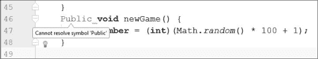
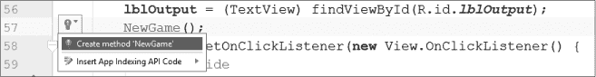
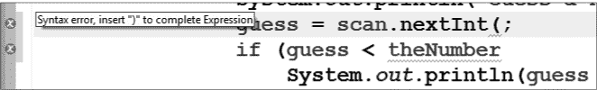
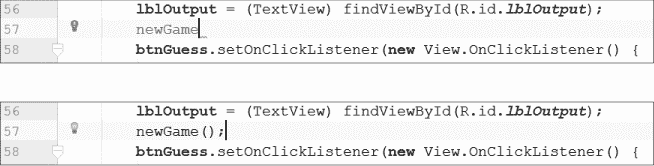

## 调试和避免 Java 中常见错误

在这本书中，你可能在某些地方犯了一些拼写错误或其他错误。在这个附录中，我将介绍一些常见的编程陷阱及如何避免。Eclipse 和 Android Studio 中的一个有用特性是*语法高亮*。类名、函数、变量类型、字符串、注释等在 IDE 中会根据它们的语法以不同的颜色显示。

语法高亮可以帮助你快速发现拼写错误和其他问题。例如，如果你忘记用第二对双引号闭合字符串，那么该行末尾的分号将与屏幕上的其他分号显示不同的颜色。当我们介绍这些常见错误时，试着在你写的应用程序中引入它们，并注意 Eclipse 和 Android Studio 给出的警告。如果你破坏了一个应用程序，也没关系——你可以随时恢复并修复它，可以通过书中的原始代码列表或者按 CTRL-Z (-Z)或点击**编辑** ▸ **撤销**来实现。

### 拼写和大小写

拼写在任何编程语言中都很重要，但在 Java 中，大小写同样很重要。例如，如果你使用小写的`s`来表示一个扫描器或字符串，Eclipse 中的文本编辑器会将类名用红色下划线标出，而 Android Studio 则会将文本标记为红色。这看起来可能有些傻，但 Java 只理解`String`，而不是`string`。

变量名也是如此，例如`playAgain`或`theNumber`。例如，如果我们不小心将`P`大写并将`a`小写，拼写为`Playagain`，Java 将无法理解我们指的是变量`playAgain`。我们来看看每个集成开发环境（IDE）如何帮助我们查找和修复这种拼写错误，首先是 Eclipse，然后是 Android Studio。

#### *在 Eclipse 中修正拼写错误*

Eclipse 会通过用红色下划线标出拼写错误的单词来提醒我们错误，而 Android 则会将文本标记为红色。图 A-1 展示了 Eclipse 如何突出显示我在第二章中的 Hi-Lo 猜数字游戏里引入的两个错误。

*图 A-1：Eclipse 帮助我们找到拼写错误和大小写错误。*

当我在`system`中使用小写字母`s`时，Eclipse 会用红色下划线标出拼写错误，并在屏幕的左侧边框添加一个错误警告，你可以将鼠标悬停在该行上查看。Java 编译器会报出错误`"system cannot be resolved"`。这意味着 Java 无法理解`system`应该是什么，因为它只理解带大写`S`的`System`。Eclipse 也对下一行的`playagain`做了同样的处理——它应该是`playAgain`。

记住，你可以在 Eclipse 中使用内容助手功能来修复这些错误。点击图 A-1 中拼写错误的单词，你会看到一个内容助手菜单，类似图 A-2 中显示的菜单。

*图 A-2：Eclipse 的内容辅助功能提供了关于错误的信息，并提供了可能的修复建议。*

对于第一个拼写错误，Eclipse 不仅告诉我们无法解析或理解`system`，还提供了几种可能的修正，包括在图 A-2 中从底部算起第四个的`Change to 'System' (java.lang)`。内容辅助功能并不总是提供正确的答案，但在这个案例中，提供的 11 个快速修复中有一个是正确的，即`System`的正确大小写。对于第二个拼写错误，Eclipse 提供的第一个快速修复是正确的，`Change to 'playAgain'`。如果 Eclipse 的内容辅助提供了正确的修复，点击正确的条目，你的拼写或大小写错误将被正确的代码替换。

#### *在 Android Studio 中修正拼写错误*

Android Studio 通过将可能存在问题的部分标红来帮助我们查找错误。在图 A-3 中所示的示例中，我将关键字`public`拼写错误，打成了大写的`Public`。

*图 A-3：Android Studio 提醒我们存在一个错误的大写关键字。*

注意，这个错误类似于我们之前在 Eclipse 中看到的错误：Java 告诉我们无法解析或理解符号`'Public'`。然而，Android Studio 可能并不会总是提供相同级别的支持来修复错误，如图 A-4 所示。

*图 A-4：在 Android Studio 中按下 ALT-ENTER（或 OPTION-ENTER）提供了一个快速修复，但这并不是这个错误的正确修复方法。*

在图 A-4 中，我错误地将`newGame()`输入为`NewGame()`，并且大写了字母`N`。Android Studio 正确地将代码标红，以提醒我存在错误，但注意当我点击代码并按下 ALT-ENTER 尝试快速修复时发生了什么。Android Studio 并没有建议`newGame`作为正确的拼写，而是提供了创建一个名为`NewGame`的方法的选项。这并不是解决拼写错误的正确方法，因此你需要找到方法`public void newGame()`定义的位置，并手动修复拼写错误。

Android Studio 和 Eclipse 都会尽力帮助你找到错误，并且它们通常会提供可能的快速修复，但了解拼写和大小写常常是常见问题，可以帮助你避免并迅速修正代码中出现的错误。

#### *避免其他常见的拼写错误*

有一种错误特别难以调试，就是事件处理器或其他重写方法的名称拼写错误。这些拼写错误可能是将`onCreate()`和`onDraw()`错误地输入为`OnCreate()`和`OnDraw()`，或者在 Java GUI 应用的`ActionListener`中错误地输入了`public void actionPerformed(ActionEvent e)`，又或者漏掉了`mousePressed()`、`mouseClicked()`或`mouseDragged()`事件处理器中的“ed”。

我们有编程规范，以避免这些类型的错误。忘记使用小写字母开头的方法或变量名，而使用大写字母开头的类名，可能不一定是错误，但在 Java 中是不规范的。如果从一开始就养成遵循 Java 规范的习惯，你将节省时间，并避免未来的挫折。

### 比较问题

请记住，双等号(`==`)是用于“等于”的比较运算符。不要将其与赋值运算符(`=`)混淆。例如，要将值`5`赋给名为`number`的变量，你应该输入：

int number = 5; // 将值 5 赋给 number

但是，要比较变量的值，你应该使用双等号：

if (number == 5) // 如果 number“等于”5

此外，请记住，我们使用`equals()`方法来检查字符串，而不是使用`==`运算符。例如，条件`if (playAgain == "y")`将始终返回`false`。正确的`if`语句应该是：

if (playAgain.equals("y"))

`String`类的`equals()`方法检查字符串的*内容*是否匹配，这通常是我们在比较字符串时所希望的。`equals()`方法也是我们每次比较两个对象时使用的方法，比如`if (bubble1.equals(bubble2))`，用于检查两个`Bubble`变量是否指向`BubbleDraw`应用中相同的`Bubble`对象。

### 分组符号

在 Java 编程时，保持括号、方括号和大括号的平衡也非常重要。我们称这些为*分组符号*，因为它们将其他编程元素组合在一起，并且你永远不应该有没有匹配的关闭符号的打开符号。Eclipse 和 Android Studio 都提供了不同的方式来发现和修复未关闭的分组符号。

#### *Eclipse 中的快速修复*

Eclipse 可以通过几种方式帮助我们处理分组符号。如果你遗漏了条件或函数中的括号，Eclipse 会在离缺失括号最近的单词下方用红色下划线标出错误，如图 A-5 所示。

*图 A-5：Eclipse 帮助查找括号错误，并有时提供修复建议。*

同样，Eclipse 会尽力帮助你在输入时发现错误。在图 A-5 中，我遗漏了两行末尾的右括号，Eclipse 通过红色错误符号标记了这些位置。点击编辑器左边距处的红色错误标记，将会提供插入右括号的建议。

如果你将光标放在某个闭合或开头的括号旁边，Eclipse 将会高亮显示与之对应的括号，这些括号用于打开或关闭这块文本。你可以通过点击任何程序中的括号旁边的光标来试试看。

同时，请记住，如果我们突出显示代码并按 CTRL-I，Eclipse 可以为我们自动调整缩进。对于短程序来说，这可能只是一个方便的小功能，但对于跨越多页的较长程序来说，正确的缩进非常有助于避免因缺失或放错位置的括号而导致的错误。

#### *Android Studio 中的代码补全*

Android Studio 提供了更多的帮助来处理缺失的分组符号。Android Studio 中的代码补全功能可以自动填写打开和关闭的圆括号、方括号或大括号。

例如，打开 第四章中的 GuessingGame 项目，在 `onCreate()` 函数中找到调用新游戏的那一行：

lblOutput = (TextView) findViewById(R.id.lblOutput);

newGame();

btnGuess.setOnClickListener(new View.OnClickListener() {

删除括号和行末的分号：

lblOutput = (TextView) findViewById(R.id.lblOutput);

newGame

btnGuess.setOnClickListener(new View.OnClickListener() {

Android Studio 会将文本标记为红色，提示你有错误，然后你可以使用代码补全来填补缺失的括号和分号。要自动完成语句，请将光标定位在 `newGame` 后面，如 图 A-6 所示，然后按 CTRL-space 执行基本的代码补全。

*图 A-6：将光标放置在缺失括号的行旁边（顶部），然后按 CTRL-space 使用 Android Studio 的代码补全来完成语句（底部）。*

注意，代码补全填补了缺失的括号和分号来结束这一行。CTRL-space 组合键只是 Android Studio 中三个代码补全快捷键中的第一个。第二个是 CTRL-SHIFT-space，称为 *智能补全*，它会在弹出窗口中显示相关选项。按下快捷键两次以展开代码补全选项列表。最后，*语句补全*（Windows 和 Linux 上是 CTRL-SHIFT-ENTER，macOS 上是 -SHIFT-ENTER）会在需要的地方添加闭合括号/方括号/大括号和分号。通过删除方法、`if` 语句或 `for` 循环中的闭合括号，然后按 CTRL-SHIFT-ENTER 来尝试语句补全。Android Studio 中的语句补全功能通常会关闭你的分组符号，并在需要的地方添加分号或大括号，让你的工作变得更轻松、更快速，同时帮助你避免编码时出现错误。

### 总结

这些并不是你在用 Java 编程时会遇到的所有错误，但你可以看到，无论是 Eclipse 还是 Android Studio 都为初学者和经验丰富的专业人士提供了非常有用的工具。你在用 Java 编程时，随着经验的积累，你会变得更擅长发现并修复错误，但你的代码可能永远不会完全没有错误。我已经编程超过 30 年了，仍然需要调试我的代码。为了避免、发现并修复代码中的错误，从一开始就学习良好的编程实践，并利用像 Eclipse 和 Android Studio 这样的专业工具内置的支持是非常重要的。
