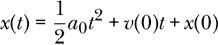
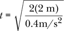
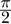
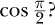
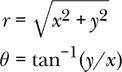
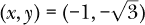
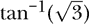
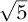

## 1

使用 Haskell 进行计算


在本章中，我们将看到如何将 Haskell 用作科学计算器。这个计算器默认提供了多个科学函数。在第二章中，我们将编写我们自己的函数，这些函数可以加载并使用。本章介绍了一些后续章节中会有用的语言特性和细节。让我们从一个运动学问题开始。

### 一个运动学问题

假设我们有一辆车在气轨上。该车的加速度为 0.4 m/s²。在时间 *t* = 0 时，车辆是静止的。那么，这辆车行驶 2 米需要多长时间？

由于加速度是恒定的，因此我们可以使用位置-时间方程。



因为车从静止开始，我们知道 *v*(0) = 0。假设这辆车从位置零（原点）开始，那么 *x*(0) = 0。我们正在寻找时间 *t*，使得 *x*(*t*) = 2 米。一点代数运算告诉我们：



我们可以使用笔和纸来解决这个问题，或者使用计算器。在本章中，我们将使用 Haskell 作为我们的计算器。

在下一部分，我们将逐步解释如何使用 Haskell 作为计算器。为了结束这一部分，我们将展示如何输入内容来计算时间。

```
Prelude > sqrt (2 * 2 / 0.4)
3.1622776601683795
```

如你所见，车行驶 2 米大约需要 3.2 秒。现在，让我们看看如何启动交互式 Haskell “计算器”。

### 交互式编译器

这个运动学例子为我们提供了一个机会，可以介绍格拉斯哥 Haskell 编译器（GHC）的交互式版本。GHC 的交互式版本叫做 GHCi，我们可以将其用作计算器。GHCi 随格拉斯哥 Haskell 编译器一起提供，Haskell 编译器可以从[*https://www.haskell.org*](https://www.haskell.org)免费下载。启动 GHCi 的方法可能取决于你计算机所使用的操作系统。通常，你可以点击一个图标，从菜单中选择 GHCi，或者在命令行中输入 `ghci`。

当 GHCi 启动时，我们会看到一个提示符，在此处可以输入表达式。GHCi 给出的第一个提示符是 `Prelude>`。Prelude 是一个包含常量、函数和运算符的集合，默认情况下可以直接使用，我们可以立即使用它来构建表达式。GHCi 通过在提示符中显示 `Prelude` 来指示 Prelude 已经为我们加载好了。现在，GHCi 正在等待我们输入表达式。如果你输入 `2/3`，然后按下 ENTER，GHCi 将评估这个表达式并打印结果。

```
Prelude> 2/3
0.6666666666666666
```

在表达式 `2/3` 中，Haskell 将 `2` 和 `3` 解释为数字，而 `/` 被当作二元运算符表示除法。GHCi 执行所请求的除法并返回结果。

### 数值函数

Haskell 在 Prelude 中提供了执行许多计算任务的函数。这里是一个例子：

```
Prelude> log(2)
0.6931471805599453
```

这是应用于数字 2 的自然对数函数。Haskell 语言在应用函数时不需要括号。*函数应用*（也叫 *函数使用* 或 *函数求值*）是 Haskell 中一个非常基础的概念，即两个表达式并列时，表示第一个表达式是一个函数，第二个是该函数的参数，函数被应用到这个参数上。因此，我们可以输入如下代码：

```
Prelude> log 2
0.6931471805599453
```

表 1-1 列出了 Prelude 中可用的常见数值函数。

**表 1-1：** 一些常见的数值函数

| **函数** | **描述** |
| --- | --- |
| `exp` | exp *x* = *e^x* |
| `sqrt` | 平方根 |
| `abs` | 绝对值 |
| `log` | 自然对数（以 *e* 为底的对数） |
| `sin` | 弧度制下的正弦函数 |
| `cos` | 弧度制下的余弦函数 |
| `tan` | 弧度制下的正切函数 |
| `asin` | 反正弦（反弧度） |
| `acos` | 反余弦 |
| `atan` | 反正切函数 |
| `sinh` | sinh *x* = (*e^x* – *e^(–x))/2* |
| `cosh` | cosh *x* = (*e^x* + *e^(–x))/2* |
| `tanh` | tanh *x* = (*e^x* – *e^(–x)*)/(*e^x* + *e^(–x)*) |
| `asinh` | 反双曲正弦函数 |
| `acosh` | 反双曲余弦函数 |
| `atanh` | 反双曲正切函数 |

Haskell 还在 Prelude 中提供了常数 *π*。

```
Prelude> pi
3.141592653589793
```

这里是一个三角函数：

```
Prelude> cos pi
-1.0
```

请注意，Haskell 中的三角函数需要以弧度作为参数。

现在，我们来计算 cos 。

```
Prelude> cos pi/2
-0.5
```

计算机没有给出我们预期的结果；cos  应该是 0，而不是 –0.5。原因在于，Haskell 中函数应用的优先级高于除法，因此 Haskell 将我们输入的内容解释为

```
Prelude> (cos pi)/2
-0.5
```

而不是先将 *π* 除以 2，再取余弦。我们可以通过加括号来得到我们想要的结果。

```
Prelude> cos (pi/2)
6.123233995736766e-17
```

计算机给出的结果是 ，对吗？不完全是。这里我们看到的是一个近似计算结果的示例。我的计算机给出的结果是某个值乘以 10^(–17)，这几乎等于零，这是计算机所能达到的最接近零的值。值得记住的是，在进行数值计算时，计算机（就像你的计算器）大多数时候不会给出精确的结果，而是给出近似值。我们必须保持警惕，确保我们通过正确解释这些结果，得到有价值的信息。我们将在 第三章 讨论 Haskell 的类型系统后，进一步说明什么时候我们可以期待计算机给出精确的结果，什么时候不能。

### 运算符

Haskell Prelude 提供了几个 *二元运算符*，如 表 1-2 所示。二元运算符作用于两个输入，或 *参数*，以产生一个结果。例如，加法运算符（+）是一个二元运算符，因为它接受两个输入并将它们相加。在计算机科学中，一般将放置在参数之前的运算符称为前缀运算符，放置在参数之后的运算符称为后缀运算符，而放置在参数之间的运算符称为中缀运算符。在 Haskell 中，术语 *运算符* 暗示的是中缀运算符，尽管在 第六章中我们将看到如何将中缀运算符转化为前缀运算符。

表 1-2 展示了常见的 Haskell 运算符，并列出了它们的优先级和结合性，接下来将对此进行解释。加法、减法、乘法和除法运算符的运作方式几乎和你预期的一样。

**表 1-2：** 常见运算符的优先级与结合性

| **操作** | **运算符** | **优先级** | **结合性** |
| --- | --- | --- | --- |
| 组合 | `.` | 9 | 右结合 |
| 指数运算 | `^, ^^, **` | 8 | 右结合 |
| 乘法、除法 | `*, /` | 7 | 左结合 |
| 加法、减法 | `+, -` | 6 | 左结合 |
| 列表运算符 | `:, ++` | 5 | 右结合 |
| 等式、不等式 | `==, /=` | 4 |  |
| 比较 | `<, >, <=, >=` | 4 |  |
| 逻辑与 | `&&` | 3 | 右结合 |
| 逻辑或 | `&#124;&#124;` | 2 | 右结合 |
| 应用 | `$` | 0 | 右结合 |

表格还展示了三种不同的指数运算符。这些差异与 Haskell 的类型系统有关，更多内容将在 第三章 和 第八章中讨论。

照 Caret 运算符（`^`）仅能处理非负整数指数。表达式 `x^n` 表示 `x` 的 `n` 次方的乘积。双 Caret 运算符（`^^`）可以处理任何整数指数。`**` 运算符可以处理任何实数指数。现在，我建议使用 `**` 进行指数运算。

等式、不等式和比较运算符可以用于数字表达式之间。

```
Prelude> pi > 3
True
```

比较的结果是一个布尔表达式，可能是 `True` 或 `False`。第五章涵盖了 表 1-2 中的列表运算符 `:` 和 `++`。

#### 优先级与结合性

如我们之前看到的，当我们尝试计算 *π*/2 的余弦值时，函数应用的优先级高于中缀运算符。此外，一些运算符的优先级高于其他运算符。在表达式中：

```
Prelude>  1 + 2 * 3
7
```

2 和 3 的乘法会先于与 1 的加法进行。这与通常的数学惯例一致。为了实现这一点，Haskell 中的二元运算符有一个与之相关的优先级，用来描述哪些操作应该先执行。二元运算符的优先级范围从 0 到 9。优先级数字越高，表示该操作会先执行。例如，加法和减法在 Haskell 中的优先级是 6，而乘法和除法的优先级是 7，指数运算的优先级是 8。布尔值之间的“或”操作 `||` 的优先级是 2，而“与”操作 `&&` 的优先级是 3。

表 1-2 的最右列列出了某些运算符的*结合性*。考虑表达式 `8 - 3 - 2`。这个表达式可能有两种解释方式。标准的数学惯例是，表达式是(8 – 3) – 2 的简写，计算结果为 3。但另一种解释是，表达式是 8 – (3 – 2)的简写，计算结果为 7。显然，我们必须理解原始表达式的正确解释是哪种，这就是结合性规则的作用。查看表 1-2，我们可以看到减法是左结合的。这意味着最左边的减法最先执行，从而得出第一个解释（结果为 3，而不是 7）。优先级和结合性帮助我们明确地确定哪些运算符首先执行。

学习优先级和结合性规则的目的是让我们尽量避免使用括号。多个嵌套的表达式会让代码难以阅读。我的建议是，尽量不要尝试使用超过两层的嵌套括号。除了了解优先级和结合性规则外，还有其他避免使用括号的方法，比如定义局部变量。我们稍后会讨论这些方法。

我们为以下表达式添加括号，以表示 Haskell 中的优先级和结合性规则将如何计算该表达式。

```
8 / 7 / 4 ** 2 ** 3 > sin pi/4
```

函数应用的优先级高于所有运算符，因此 `sin pi` 是第一个计算的部分。

```
8 / 7 / 4 ** 2 ** 3 > (sin pi)/4
```

接下来，指数运算是表 1-2 中具有最高优先级的运算符。指数运算出现了两次，由于它是右结合的，因此最右边的指数运算最先执行。

```
8 / 7 / 4 ** (2 ** 3) > (sin pi)/4
```

接下来是左侧的指数运算。

```
8 / 7 / (4 ** (2 ** 3)) > (sin pi)/4
```

接下来是除法。表达式中有三个除法。最右边的除法没有问题，但我们需要通过结合性规则解决表达式左边的两个除法。除法是左结合的。

```
(8 / 7) / (4 ** (2 ** 3)) > ((sin pi)/4)
```

注意，我们在最后一步插入了两组括号。一个是用于最右边的除法，另一个是用于最左边的除法。现在我们可以为最终的除法加上括号，它发生在比较之前。

```
((8 / 7) / (4 ** (2 ** 3))) > ((sin pi)/4)
```

最后执行的运算符是比较运算符`>`。无需将整个表达式放在括号中，因此我们完成了。完全括号化的表达式是

```
((8 / 7) / (4 ** (2 ** 3))) > ((sin pi)/4)
```

#### 应用运算符

表 1-2 中的运算符`$`称为函数应用运算符。应用函数时不需要运算符。两个表达式并列时，意味着第一个是一个函数，第二个是一个参数，且函数要应用于该参数。

函数应用运算符的作用只是将其左侧的函数应用于右侧的表达式。

```
Prelude> cos pi
-1.0
Prelude> cos $ pi
-1.0  
Prelude> cos $ pi / 2
6.123233995736766e-17
```

它使用的关键在于它的优先级为 0。这意味着运算符`$`改变了应用顺序，从*首先*要做的事情变成*最后*要做的事情。这样，`$`就充当了一种单符号括号的作用。我们不需要像上面的例子中那样将`pi / 2`放在括号中，而是可以使用这个单符号的函数应用运算符。因为它具有右结合性，函数应用运算符成为 Haskell 中的常用习惯用法，使得嵌套应用（``h `$` g `$` f x``）更容易阅读。

### 有两个参数的函数

表 1-1 中的所有函数都接受一个实数作为输入，并返回一个实数作为输出（假设输入在函数的定义域内）。还有一些有用的数值函数，它们接受两个实数作为输入。这些函数列在表 1-3 中。

**表 1-3：** 两个参数的数值函数

| **函数** | **示例** |
| --- | --- |
| `logBase` | `logBase 10 100 = 2` |
| `atan2` | `atan2 1 0 = π`/2 |

让我们看看这些函数的实际应用：

```
Prelude> logBase 10 100
2.0  
Prelude> atan2 1 0
1.5707963267948966
```

`logBase`函数接受两个参数：第一个是对数的底数，第二个是我们希望计算对数的数字。

`atan2`函数解决了一个问题，如果你曾尝试使用反正切函数从笛卡尔坐标转换到极坐标，你可能会遇到这个问题。考虑以下极坐标(*r, θ*)与笛卡尔坐标(*x, y*)之间的方程：



假设我们正在尝试找到与点  相关的极坐标。答案需要是第三象限中的一个点，因为 *x* 和 *y* 都是负数。这意味着 *θ* 应该在 *π* < *θ* < 3*π*/2（或 – *π* < *θ* < –*π*/2）范围内。但是，如果我们机械地使用上述公式计算 *θ*，我们会得到 ，而我们的计算器或计算机会告诉我们它是 *π*/3\. 问题在于反正切函数的定义域，解决方案是使用 `atan2` 函数，而不是 `atan` 函数。`atan2` *y x* 的结果将给出正确象限中的角度（以弧度表示）。

注意如何将两个参数传递给 `logBase` 和 `atan2` 函数。特别是，两个参数值之间没有逗号，这在传统的数学表示法中是必须的。

### Haskell 中的数字

关于 Haskell 中数字的一些细节对于第一次接触这门语言的人来说并不直观。在本节中，我们将指出一些与负数、小数和指数表示法相关的问题。

#### Haskell 中的负数

如果你尝试运行以下代码

```
Prelude> 5 * -1

<interactive>:15:1: error:
    Precedence parsing error
        cannot mix '*' [infixl 7] and prefix `-' [infixl 6] in the same infix
            expression
```

你将遇到一个错误，尽管表达式的含义看起来足够清楚：我们想将 5 乘以 – 1\. 问题在于，减号既充当二元运算符（如表达式 3 – 2 中），也充当一元运算符（如表达式 – 2 中）。二元运算符在 Haskell 中起着重要作用，且语言的语法支持以一致、统一的方式使用它们。而一元运算符在 Haskell 中则更多是特殊情况；事实上，减号是唯一的一个。一些 Haskell 设计者的决策（参见 *[`wiki.haskell.org/Unary_operator`](https://wiki.haskell.org/Unary_operator)*）导致负数有时不会像你期望的那样被及时识别。

解决方案是简单地将负数用括号括起来。例如，

```
Prelude> 5 * (-1)
-5
```

计算结果为 – 5。

#### Haskell 中的小数

包含小数点的数字必须在小数点前后都有数字（0 到 9）。因此，我们必须写成 `0.1`，而不能写成 `.1`；而不是 `5.`，我们必须写成 `5.0` 或 `5`（不带小数点）。原因是点字符在语言中有另一个作用（即函数组合，这在 表 1-2 的顶部行中提到，我们将在 第二章中进一步学习）。这一规则要求小数点前后有数字，帮助编译器区分点字符的含义。

#### 指数表示法

你可以使用指数表示法来描述在 Haskell 中非常大或非常小的数字。以下是一些例子：

| **数学表示法** | **Haskell 表示法** |
| --- | --- |
| 3.00 × 10⁸ | 3.00e8 |
| 6.63 × 10^(–34) | 6.63e-34 |

Haskell 还会使用指数表示法来展示那些非常大或非常小的数字。

| **表达式** |  | **计算结果** |
| --- | --- | --- |
| 8**8 | ⇝ | 1.6777216e7 |
| 8**(-8) | ⇝ | 5.960464477539063e-8 |

### 近似计算

我们做的大多数计算都不是精确计算。当我们要求计算机找到 5 的平方根时，

```
Prelude> sqrt 5
2.23606797749979
```

它给出了一个非常精确的结果，但并不是一个精确的结果。这是因为计算机使用有限的位数来表示这个数字，不能表示每一个可以想象的数字。

如果你在 GHCi 中计算`sqrt 5 ^ 2`，你可能得不到精确的 5.0 作为结果。

```
Prelude> sqrt 5 ^ 2
5.000000000000001
```

计算机并没有精确表示。我们甚至可以在 GHCi 中询问如下：

```
Prelude> sqrt 5 ^ 2 == 5
False
```

我的电脑给出`False`是因为近似计算。

计算中另一个导致不精确的来源是计算机使用二进制（基 2）内部表示数字。当我将 3 乘以 0.2 时，我得不到精确的 0.6。为什么？原因在于 0.2 虽然在十进制（基 10）中有一个漂亮的有限小数表示，但它在二进制（基 2）中有一个无限循环的表示。就像分数 1/3 在十进制中有一个无限循环的表示（0.333333...），分数 1/5 在二进制中也有一个无限循环的表示。表格 1-4 展示了一些简单分数在十进制（基 10）和二进制（基 2）中的表示。

**表格 1-4：** 十进制和二进制表示的数字

| **数字** | **十进制** | **二进制** |
| --- | --- | --- |
| 1/2 | 0.5 | 0.1 |
| 1/3 | 0.333333... | 0.01010101... |
| 1/4 | 0.25 | 0.01 |
| 1/5 | 0.2 | 0.001100110011... |

计算机将我们提供的每个数字从十进制转换为其内部的二进制形式，并只保留有限的位数（实际上是位）。大多数时候，我们不需要担心这个问题，但它解释了为什么一些看起来应该是精确可计算的计算并不是这样。这个故事的一个教训是：当某个数字经过近似计算时，永远不要进行相等性检查。

### 错误

人们会犯错误。这是正常的。当你输入电脑无法理解的内容时，它会给你错误信息。这些信息可能看起来很吓人，但它们是一个很好的学习机会，值得学会如何阅读这些错误信息。

当我们尝试将 5 乘以–1 而没有将–1 用括号括起来时，我们在“《Haskell 中的数字》”中看到一个“优先级解析错误”。另一个你迟早会遇到的错误是“No instance for Show”。

在 Haskell 中有一些完全合法、定义明确的表达式，无法很好地显示在屏幕上。函数就是最常见的例子。因为一个函数可以接受多种输入并产生多种输出，一般来说，没有一种好的方法来显示函数的“值”。如果你请求 GHCi 告诉你平方根函数“是什么”，它会抱怨没有办法显示给你看，表示它“没有 Show 实例”。

```
Prelude> sqrt

<interactive>:25:1: error:
    • No instance for (Show (Double -> Double))
        arising from a use of 'print'
        (maybe you haven't applied a function to enough arguments?)
    • In a stmt of an interactive GHCi command: print it
```

这个消息完全不是错误。`sqrt` 函数是一个完全合法的 Haskell 表达式。GHCi 只是说它不知道如何显示它。

### 获取帮助和退出

要请求 GHCi 的帮助，输入 `:help`（或 `:h`）。要退出 GHCi，输入 `:quit`（或 `:q`）。

以冒号开头的命令并不属于 Haskell 编程语言本身，而是属于 GHCi 交互式编译器，它们控制 GHCi 的操作。稍后我们会看到更多以冒号开头的命令。

### 更多信息

要了解更多关于 Haskell 编程语言（GHCi 是一个流行的实现）的信息，可以访问 [`www.haskell.org`](https://www.haskell.org) 网站。

*[haskell.org](http://haskell.org)* 网站提供了许多学习语言的在线和纸质资源的链接。其中一些特别好的资源是 *Learn You a Haskell for Great Good!* **[1**] ([`learnyouahaskell.com`](http://learnyouahaskell.com)) 和 *Real World Haskell* **[2**] ([`book.realworldhaskell.org`](http://book.realworldhaskell.org))。

### 总结

在本章中，我们学习了如何将 GHCi 用作计算器。GHCi 配备了一系列科学函数和运算符。运算符有优先级和结合性规则，决定它们执行的顺序。了解并使用这些规则可以减少表达式中的括号数量。函数应用的优先级高于任何运算符。负数有时需要括号围住才能正确解析。带小数点的数字需要在小数点前后都有数字。计算机进行的许多计算都是近似的。错误应该被看作是有用的提示；保持对错误的好奇心是一种有益的态度。面对错误时的耐心和坚持是通向理解的道路的一部分。

在下一章中，我们将展示如何定义自己的函数并将其加载到 GHCi 中。

### 练习

**练习 1.1.** 在 GHCi 中计算 `sin 30`。为什么它不等于 0.5？

**练习 1.2.** 在以下表达式中添加括号，表示 Haskell 的优先级和结合性规则将如何计算这些表达式：

(a) `2 ^ 3 ^ 4`

(b) `2 / 3 / 4`

(c) `7 - 5 / 4`

(d) `log 49/7`

**练习 1.3.** 使用 GHCi 计算 log[2] 32。

**练习 1.4.** 在 GHCi 中使用 `atan2` 函数计算与笛卡尔坐标 (*x, y*) = (–3,4) 相关的极坐标 (*r,θ*)。

**练习 1.5.** 找一个新的计算示例，其中计算机得到的结果与精确结果有一点点不同。

**练习 1.6.** 为什么在 表 1-2 中没有列出等号、不等号和比较操作符的结合性？（提示：写出你能想到的最简单的表达式，它需要结合性规则来解决比较操作符的优先级问题，然后尝试理解它。）
