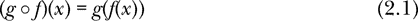
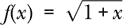
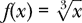
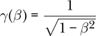
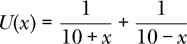
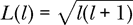
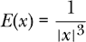
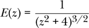
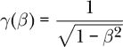

# 第二章：编写基本函数


函数是函数式编程的核心概念。在本章中，我们将学习如何定义函数和常量，以及如何在 GHCi 中使用这些函数和常量。我们将讨论用于描述函数的语言，并且我们将看到，与计算机交流通常比与人类交流要求更多的精确性。然后，我们将介绍 Haskell 的*匿名函数*系统，这些函数没有名称。在简要了解 Haskell 的类型系统后（我们将在第三章中详细描述），我们将展示如何使用函数组合运算符来组合函数。最后，我们将展示如果使用未定义的名称会出现什么样的错误。

### 常量、函数和类型

用 Haskell 编程的过程是定义函数的过程。函数向计算机表达我们想要计算的内容。Haskell 函数与数学函数非常相似：它们接受输入，并生成一个依赖于输入的输出。与数学函数类似，Haskell 函数有一个定义域，描述可以作为输入的实体类型，还有一个值域（有时称为范围），描述将会生成的输出实体类型。

与数学函数不同，Haskell 函数必须是*构造性的*。它们必须提供一个清晰、明确的构造输出的步骤，基于输入。Abelson 和 Sussman 在他们的精彩著作《*计算机程序的结构与解释*》**[3**]中提到，平方根函数的定义是一个非负数，且其平方等于输入值，这是一个完全合法的数学函数。但这个定义并没有提供如何从输入构造平方根的步骤，因此无法转化为一个 Haskell 函数。幸运的是，存在一些其他的平方根定义是构造性的，可以转化为 Haskell 函数。

有一种方法可以在 GHCi 中定义函数，但由于我们通常希望定义的函数能被多次使用，因此最好将函数定义在*源代码文件*中，也叫做*程序文件*，然后将该文件加载到 GHCi 中。

我们需要一个文本编辑器来创建这样的文件。常见的文本编辑器包括 GNU Emacs、Vim 和 gedit。

你可能用来输入信件或文档的文字处理程序并不适用于这个目的，因为它们在你输入的文本中存储了额外的信息（如字体类型和大小），这些信息对 Haskell 编译器来说是没有意义的。

使用文本编辑器，让我们创建一个名为*first.hs*的文件，来编写我们的第一个程序。（*.hs* 扩展名表示一个 Haskell 程序。）在文件中写入以下内容：

```
-- First Haskell program

-- Here we define a constant
e :: Double
e = exp 1

-- Here we define a function
square :: Double -> Double
square x = x**2
```

该程序文件定义了一个常量和一个函数。以双连字符开头的行是*注释*。Haskell 编译器会忽略任何以双连字符开头的行；事实上，它会忽略双连字符之后直到行尾的所有内容，除非双连字符是字符串或某些其他特殊环境的一部分。注释的目的是帮助人类阅读代码。

文件的前两行非注释部分定义了常量*e*，自然对数的底数。与*π*不同，*e*并不包含在 Haskell 的预置库中。

```
e :: Double
```

声明了`e`的*类型*为`Double`。*类型*是对实体如何使用的共性的描述。Haskell 中的每个表达式都有一个类型，它告诉编译器在什么情况下该表达式可以使用，在哪些情况下不能使用。例如，`Double`类型告诉编译器`e`是一个实数的近似值，通常称为浮动点数。`Double`这个名称是出于历史原因，意味着*双精度*浮动点数。这种类型的数字可以达到大约 15 位小数精度，而单精度数字大约只能达到 7 位小数精度。Haskell 中有一个类型`Float`用于单精度数字。除非有充分的理由，否则我们总是使用`Double`类型来表示我们的（实数的）近似值。

除了`Double`，我们可能还想使用其他一些类型。Haskell 有一个类型`Int`用于小整数（至少到几十亿），以及一个类型`Integer`用于任意大小的整数。第三章专门讲解类型。

让我们回到我们的*first.hs*程序文件。正如我们之前所说，文件的第一行非注释部分声明了`e`的类型为`Double`。这种类型的行，以一个名称后跟双冒号然后是类型，被称为*类型签名*。我们也可以称这样的行为*声明*，因为它声明了名称`e`具有类型`Double`。

文件的第二行非注释部分实际上是*定义*了`e`。在这里，我们使用内置函数`exp`对数字`1`进行应用，得到常数`e`。请记住，我们在应用函数到参数时不需要使用括号。

接下来，我们有了函数`square`的类型签名。`square`的类型被声明为`Double -> Double`。包含箭头的类型被称为*函数类型*。（函数类型将在下一章中更详细地探讨。）这表示`square`是一个接收`Double`作为输入并输出一个`Double`的函数。最后一行定义了函数`square`。请注意用于指数运算的`**`运算符。

要将此程序文件加载到 GHCi 中，请使用 GHCi 的`:load`命令（简称`:l`）。

```
Prelude> :l first.hs
[1 of 1] Compiling Main            ( first.hs, interpreted )
Ok, one module loaded.
*Main> square 7
49.0
*Main> square e
7.3890560989306495
```

加载*first.hs*文件后，GHCi 提示符会从`Prelude>`变为`*Main>`。这表明我们的程序文件已成功加载，并且被赋予了默认名称`Main`。我们现在可以访问文件中定义的常量和函数。

文件*first.hs*中定义的`e`和`square`是 Haskell 中的*变量标识符*的示例。变量标识符必须以小写字母开头，后跟零个或多个大写字母、小写字母、数字、下划线和单引号。以大写字母开头的名称保留给类型、类型类（我们将在第八章中讨论）和模块名称。

如果你忘记了某个东西的类型，或者不知道它的类型，可以通过 GHCi 的`:type`命令（简写为`:t`）询问类型。

```
*Main> :t square
square :: Double -> Double
```

在 Haskell 中定义函数的符号在某些方面与数学符号类似，在其他方面则有所不同。让我们来讨论这些不同之处。表 2-1 展示了一些示例。

**表 2-1：** 传统数学符号定义的函数与 Haskell 定义的函数对比

| **数学定义** | **Haskell 定义** |
| --- | --- |
| *f*(*x*) = *x*³ | `f x = x**3` |
| *f*(*x*) = 3*x*² – 4*x* + 5 | `f x = 3 * x**2 - 4 * x + 5` |
| *g*(*x*) = cos 2*x* | `g x = cos (2 * x)` |
| *v*(*t*) = 10*t* + 20 | `v t = 10 * t + 20` |
| *h*(*x*) = *e*^(*–x*) | `h x = exp (-x)` |

首先，请注意传统的数学符号（以及某些计算机代数系统）使用相邻符号表示乘法。例如，2*x*表示 2 乘以*x*，仅仅因为这些符号放在一起。Haskell 需要使用乘法运算符`*`。在 Haskell 中，相邻符号表示的是函数应用。

接下来，请注意传统数学符号要求函数参数必须放在函数名后面的小括号内。这对于函数定义（比较*f* (*x*) = *x*³与 Haskell 的`f x = x**3`）以及函数应用（比较*f* (2)与 Haskell 的`f 2`）都是如此。而 Haskell 在函数定义和应用中并不需要括号。Haskell 使用括号来表示运算顺序。

最后，传统的数学符号通常使用单个字母的函数名，例如*f*。Haskell 允许使用单个字母的函数名，但更常见的是使用多个字母组成的函数名（例如上面的`square`），尤其是当这个词能很好地描述函数的功能时。

### 如何讨论函数

假设我们定义一个函数 *f* 为 *f* (*x*) = *x*² – 3*x* + 2。在数学和物理中，常常会说“函数 *f* (*x*)”。Haskell 鼓励我们更仔细、更准确地思考这一常见的习惯。（实际上，它要求我们更仔细地思考这一点，但总是更好的是被邀请，而不是被要求，不是吗？）与其说“函数 *f* (*x*)”，我们应该根据具体含义说出以下之一：

+   函数 *f*

+   值 *f* (*x*)

+   给定一个数字 *x*，函数 *f* 在 *x* 处的值

第二点和第三点是两种表达相同意思的方式。第一点则与第二点和第三点表达的含义不同。

说“函数 *f* (*x*)”有什么问题？在数学和物理中，通常将“函数 *f*”与“函数 *f* (*x*)”互换使用，后者只是明确地表示 *f* 依赖于 *x*。我们通常认为数学符号是某个概念的精确表示，但在这种情况下，常用的符号并不精确。

避免使用“函数 *f* (*x*)”这个表述的一个原因是，如果 *f* (*x*) = *x*² – 3*x* + 2，那么 *f* (*y*) = ^(*y*²) – 3*y* + 2。字母 *x* 与函数 *f* 实际上没有任何关系。当然，我们需要*某个*字母来定义，但其实哪个字母都无所谓。当 *x* 用于定义其他内容时，我们称其为*虚拟变量*。

在 Haskell 中，当我们想要通过输入 *x* 来求值函数 *f* 时，我们说 *f* (*x*)。当我们想谈论函数本身，而不是求值时（即不给它任何输入），我们说 *f*。那除了给函数输入，我们还能做什么呢？嗯，你可以在给定的区间内*积分*该函数。你也可以*求导*该函数得到另一个函数。在某些情况下，你还可以将该函数应用两次。简而言之，除了简单地求值外，我们可能还想对一个函数做很多其他事情。

Haskell 的类型系统帮助我们理解 *f* 和 *f* (*x*) 之间的关键区别。变量 *x* 是一个数字，因此它具有类似 `Double` 的类型。而 *f* 是一个函数，因此它的类型是 `Double -> Double`。最后，*f* (*x*) 表示函数 *f* 在数字 *x* 处的值，所以 *f* (*x*) 的类型是 `Double`。类型为 `Double -> Double` 的是函数，类型为 `Double` 的是数字。下表总结了这些区别。

| **数学符号** | **Haskell 符号** | **Haskell 类型** |
| --- | --- | --- |
| *f* | `f` | `Double -> Double` |
| *f* (3) | `f 3` | `Double` |
| *f* (*x*) | `f x` | `Double` |

计算机在理解人类的意思方面因其不灵活性而臭名昭著。计算机会精确地检查你所说的内容，如果你的输入不符合它们的格式和解释要求，它们会给出警告和错误。大多数时候，这让人非常头疼。我们希望能有一个理解我们意思并按照我们希望去做的助手。

然而，在类型和函数的情况下，Haskell 的严格性是一个很好的教学辅助工具。Haskell 帮助我们组织思维，以便我们能够以结构化和有序的方式准备进行更复杂的操作。在第六章中，我们将看到关于类型和函数的精心思考如何使我们能够简单而轻松地编码更复杂的思想。

当我们使用 Haskell 时，我们做出了一个权衡。我们同意以一种精确而谨慎的方式使用语言（编译器会检查我们），作为交换，我们可以在语言中表达一些在容忍不精确的语言中难以表达的复杂内容。因此，我们能够揭示像牛顿力学这样的物理理论的基本结构。

### 匿名函数

Haskell 提供了一种无需命名即可指定函数的方式。例如，平方其参数的函数可以写作`\x -> x**2`。

以这种方式指定的函数称为*匿名函数*或*λ函数*，其名称来源于 20 世纪 30 年代阿隆佐·丘奇（Alonzo Church）发展出的λ演算。（丘奇是艾伦·图灵（Alan Turing）的博士导师。）Haskell 的创作者认为反斜杠字符（`\`）看起来有点像希腊字母小写 lambda（*λ*）。

表 2-2 展示了以λ函数形式书写的数学函数示例。这是表 2-1 中函数定义的另一种方式。

**表 2-2：** 传统数学符号函数定义与在 Haskell 中定义的λ函数的对比

| **数学函数** | **Haskell λ函数** |
| --- | --- |
| *f* (*x*) = *x*³ | `f = \x -> x**3` |
| *f* (*x*) = 3*x*² – 4*x* + 5 | `f = \x -> 3 * x**2 - 4 * x + 5` |
| *g*(*x*) = cos 2*x* | `g = \x -> cos (2 * x)` |
| *v*(*t*) = 10*t* + 20 | `v = \t -> 10 * t + 20` |
| *h*(*x*) = *e*^(*–x*) | `h = \x -> exp (-x)` |

λ函数的真正优势在于，我们可以在需要一个函数但又不想花费精力（即不想声明和定义）来命名新函数的地方使用它们。我们将在第六章中看到如何利用这一点，在该章中我们讨论了接受其他函数作为输入的高阶函数。这些其他函数有时可以方便地表示为匿名函数。

我们可以通过在 GHCi 提示符下写`(\x -> x**2) 3`来将匿名平方函数`\x -> x**2`应用于参数 3。

```
*Main> (\x -> x**2) 3
9.0
```

注意，当我们写 `\x -> x**2` 时，我们*并没有*定义`x`是什么。相反，我们是在说，如果我们暂时允许`x`代表函数的参数（如上面的`3`），我们就有一个规则来确定应用该函数于该参数时的结果。对于（命名的）数学函数也有类似的说法；当我们定义 *f* (*x*) = *x*² 时，这是对 *f* 的定义，而不是对 *x* 的定义。函数 `\x -> x**2` 与函数 `\y -> y**2` 是相同的；我们用来命名参数的变量并不重要。两者都是将其参数平方的函数。

表 2-3 展示了匿名函数应用于一个参数的例子。

**表 2-3：** 应用匿名函数于参数的例子

| **表达式** |  | **求值结果** |
| --- | --- | --- |
| `(\x -> x**2) 3` | ⇝ | 9.0 |
| `(\y -> y**2) 3` | ⇝ | 9.0 |
| `(\x -> x**3) 3` | ⇝ | 27.0 |
| `(\x -> 3 * x**2 - 4 * x + 5) 3` | ⇝ | 20.0 |
| `(\x -> cos (2 * x)) pi` | ⇝ | 1.0 |
| `(\t -> 10 * t + 20) 3` | ⇝ | 50 |
| `(\x -> exp (-x)) (log 2)` | ⇝ | 0.5 |

这些例子可以在 GHCi 提示符下进行求值。

### 组合函数

写 cos² *x* 是 (cos *x*)² 的简写，意思是“先取 *x* 的余弦值，再对结果平方。”当我们将一个函数 *f* 的输出作为另一个函数 *g* 的输入时，我们是在*组合*这两个函数来生成一个新函数。我们写 *g* ∘*f*，称为*g after f*，表示先将 *f* 应用于其输入，再将 *g* 应用于结果。



来自表 1-2 的*函数组合运算符* (`.`) 扮演着数学符号中∘的角色。以下四个函数是定义余弦平方函数的等价方式：

```
cosSq :: Double -> Double
cosSq x = square (cos x)

cosSq' :: Double -> Double
cosSq' x = square $ cos x

cosSq'' :: Double -> Double
cosSq'' x = (square . cos) x

cosSq''' :: Double -> Double
cosSq''' = square . cos
```

第一个函数`cosSq`以最直接的方式定义了一个数字的余弦平方。从括号中可以清楚地看出，余弦首先作用于`x`，然后应用函数`square`。第二个函数`cosSq'`做了同样的事情，但它使用了函数应用操作符`$`而不是括号（参见第一章中的“函数应用操作符”）。第三个函数`cosSq''`展示了如何使用组合操作符将函数`square`和`cos`组合起来。表达式`square . cos`就像方程 2.1 左侧的*g* ∘*f*，其中`square`充当*g*的角色，`cos`充当*f*的角色。第四个函数`cosSq'''`展示了 Haskell 如何让我们定义一个不提及其应用参数的函数。这种定义方式称为*无点风格*。如果*h*是由*h*(*x*) = *g*(*f* (*x*))定义的函数，那么数学符号允许我们将*h*定义为*h* = *g* ∘*f*。函数`cosSq''`表达了前一种定义，而函数`cosSq'''`表达了后一种定义。如果你需要定义一个余弦平方函数，四个函数中的任何一个都是完全可接受的。选择只是风格问题。最后一个定义是我最喜欢的，因为它简洁。

上面显示的定义是 Haskell 一个令人愉快的特性——允许在标识符中使用撇号（单引号）的示例。这很棒，因为它支持我们在数学中使用简洁的“*x* prime”表示与*x*相关的事物。

函数组合操作符可以用于任何两个函数，其中第一个函数的输出类型与第二个函数的输入类型匹配。在实践中，函数组合操作符通常作为一种避免命名新函数的方式。如果`square`和`cos`这两个函数可用，那么实际上没有必要做出任何四个定义中的任何一个，因为`square . cos`是一个完全有效的函数，可以在任何需要`cosSq`的地方使用。

### 变量不在作用域错误

最简单的一种错误类型是使用了一个未定义的名称。如果我们请求 GHCi 输出`x`的值而没有定义`x`，我们将得到一个“变量不在作用域”错误。

```
*Main> x

<interactive>:6:1: error: Variable not in scope: x
```

一个名称的*作用域*是指可以使用该名称并且编译器能够正确理解的情况集合。 “变量不在作用域”错误可能更适合称为“名称无法识别”。任何编译器预期能识别但无法识别的名称都会产生此错误。该错误源于使用了一个我们未定义的名称，或者没有告诉编译器在哪里可以找到该名称。这适用于函数、常量和局部变量（我们稍后会介绍）——基本上是任何可以拥有名称的实体。常见标识符，例如`x`，可以重复使用，而且有办法在程序的特定位置明确控制我们指的是哪个`x`。

### 摘要

在本章中，我们学习了如何在源代码文件中定义函数并将其加载到 GHCi 中使用。我们展示了如何在需要函数但又不想命名它的地方使用匿名函数。匿名函数的需求和实用性将在第六章中更加明确。函数组合运算符可以用于组合任意两个函数，其中第一个函数的输出类型与第二个函数的输入类型匹配。我们看到，当计算机认为应该知道一个名字的含义但又没有时，可能会出现“变量不在作用域”错误。在下一章中，我们将更深入地了解 Haskell 的类型系统，它为我们组织思维并在写作中反映这种组织提供了强大的工具。

### 练习

**练习 2.1.** 在一个 Haskell 程序文件中（一个新的文件，文件名以*.hs*结尾），定义函数 。就像我们为函数`square`做的那样，给出类型签名和函数定义。然后将该文件加载到 GHCi 中，检查 *f* (0) 是否等于 1，*f* (1) 是否约等于 1.414，以及 *f* (3) 是否等于 2。

**练习 2.2.** 假设从地面将一块石头以 30 米/秒的速度直线上抛。忽略空气阻力，找到石头的高度 *y*(*t*) 作为时间的函数。

在你的程序文件*first.hs*中添加一个函数

```
yRock30 :: Double -> Double
```

该函数接受时间（从抛出石头开始的秒数）作为输入，输出石头的高度（单位：米）。

**练习 2.3.** 继续使用石头的例子，编写一个函数

```
vRock30 :: Double -> Double
```

该函数接受时间（从抛出石头开始的秒数）作为输入，输出石头的上升速度（单位：米/秒）。（向下的速度应该返回负数。）

**练习 2.4.** 定义一个函数`sinDeg`，计算给定角度（单位：度）的正弦值。通过计算`sinDeg 30`来测试你的函数。

**练习 2.5.** 编写 Haskell 函数定义，表示以下数学函数。在每种情况下，写出类型签名（每个函数的类型应为`Double -> Double`）和函数定义。你需要为这些函数选择其他名称，因为 Haskell 函数必须以小写字母开头。不要使用超过两个括号嵌套的函数。



(b) *g*(*y*) = *e^y* + 8^(*y*)












**练习 2.6.**

(a) 将表示为匿名函数。

(b) 写一个表达式，将部分（a）中的匿名函数应用于参数 0.8。你从 GHCi 得到什么结果？
