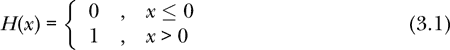
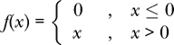
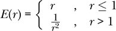

# 第三章：类型与实体


每个表达式都有一个类型的这一理念是 Haskell 的核心。Haskell 提供了多个预定义的基本类型，并且有一套用于定义我们自己的类型的系统。在本章中，我们将讨论一些内建的类型，而在 第十章 中，我们将看到如何创建我们自己的类型。

### 基本类型

类型反映了信息的性质。例如，在物理学中，我们需要知道某物是标量还是向量。这是两种不同的类型。将标量与向量相加是没有意义的，如果我们使用一个好的类型系统，计算机可以防止我们犯这个错误。

表 3-1 显示了 Haskell 最重要的基本类型。

**表 3-1：** Haskell 的基本类型

| **类型** | **描述** | **示例** |
| --- | --- | --- |
| `Bool` | 布尔值 | `False, True` |
| `Char` | 字符 | `'h', '7'` |
| `String` | 字符串 | `"101 N. College Ave."` |
| `Int` | 小型（机器精度）整数 | `42` |
| `Integer` | 任意大小的整数 | `18446744073709551616` |
| `Float` | 单精度浮点数 | `0.33333334` |
| `Double` | 双精度浮点数 | `0.3333333333333333` |

`Bool` 类型用于表示真或假的值，比如比较的结果。例如，`3 > 4` 的结果是 `False`。

```
Prelude> 3 > 4
False
```

`Char` 类型用于单个字符。`String` 类型用于一系列字符。`Int`、`Integer`、`Float` 和 `Double` 类型用于表示数字。

让我们更仔细地看看这些类型。

#### 布尔类型

`Bool` 类型只有两个可能的值：`False` 和 `True`。该类型用于表示可能为真或假的声明。

Haskell 有一个 `if-then-else` 表达式，它的值取决于布尔值。表达式的形式是 `if` `b` `then` `c` `else` `a`。这里 `b` 是一个布尔类型的表达式，称为 *条件*，`c` 是 *结果*，`a` 是 *替代结果*。Haskell 的类型系统要求不仅 `b` 的类型必须是 `Bool`，而且结果 `c` 和替代结果 `a` 必须具有相同的类型（可以是任意类型，`Bool` 或其他类型）。如果条件 `b` 计算结果为 `True`，整个 `if-then-else` 表达式的结果为 `c`；如果条件 `b` 计算结果为 `False`，整个 `if-then-else` 表达式的结果为 `a`。

如果你熟悉像 Python 或 C 这样的命令式语言，可能会发现，Haskell 的`if-then-else`结构是一个*表达式*，而不是一个语句。表达式会计算出一个值。在命令式语言中，`if-then`结构通常是语句，当条件为真时执行，否则被忽略。在命令式语言中，`else`子句是可选的；也就是说，只有在条件为假时需要执行某些语句时，才会使用`else`子句。因为在函数式语言中，`if-then-else`结构是一个表达式，所以`else`子句是强制性的，而不是可选的。无论条件为真还是为假，都必须返回*某个*值。

作为`if-then-else`表达式的一个示例，考虑以下函数（有时称为*Heaviside 阶跃函数*或*单位阶跃函数*）：



我们可以使用`if-then-else`结构在 Haskell 中为这个函数编写定义。在 Haskell 中，我们不允许常量或函数名以大写字母开头（回忆一下上一章对变量标识符的讨论），所以我们将这个函数命名为`stepFunction`。

```
stepFunction :: Double -> Double
stepFunction x = if x <= 0
                 then 0
                 else 1
```

函数`stepFunction`接受一个`Double`类型的输入（在定义中叫做`x`），并返回一个`Double`类型的输出。表达式`x <= 0`是条件，表达式`0`是结果，表达式`1`是替代。

Prelude 提供了一些与布尔值一起使用的函数。第一个是`not`，它的类型是`Bool -> Bool`，意味着它接受一个布尔值作为输入并返回另一个布尔值作为输出。函数`not`如果输入为`False`，返回`True`，如果输入为`True`，返回`False`。你可以在 GHCi 中自己验证这一点，只需输入：

```
Prelude> not False
True
```

或者

```
Prelude> not True
False
```

在 GHCi 提示符下。

正如你在第二章中看到的，GHCi 有一个`:type`命令（简写为`:t`），用于询问某个东西的类型。你可以通过输入以下命令来询问 GHCi `not`的类型：

```
Prelude> :t not
not :: Bool -> Bool
```

在 GHCi 提示符下，GHCi 命令以冒号开头的命令不是 Haskell 语言的一部分。你不能在 Haskell 程序文件中使用冒号命令。

布尔与操作符`&&`接受两个布尔值作为输入，并返回一个布尔值作为输出。当两个输入都为`True`时，输出为`True`，否则输出为`False`。表 3-2 描述了`&&`操作符的行为。

**表 3-2：** 与操作符定义

| *x* | *y* | *x* `&&` *y* |
| --- | --- | --- |
| `False` | `False` | `False` |
| `False` | `True` | `False` |
| `True` | `False` | `False` |
| `True` | `True` | `True` |

布尔或操作符`||`接受两个布尔值作为输入，并返回一个布尔值作为输出。当两个输入都为`False`时，输出为`False`，否则输出为`True`。表 3-3 描述了`||`操作符的行为。

**表 3-3：** 或操作符定义

| *x* | *y* | *x* `&#124;&#124;` *y* |
| --- | --- | --- |
| `False` | `False` | `False` |
| `False` | `True` | `True` |
| `True` | `False` | `True` |
| `True` | `True` | `True` |

这些运算符在表 1-2 中列出了它们的优先级和结合性。你可以在 GHCi 中试验它们，评估像这样的表达式：

```
Prelude> True || False && True
True
```

在 GHCi 提示符下。

#### 字符类型

`Char`类型用于单个字符，包括大写和小写字母、数字以及一些特殊字符（比如换行符，它会产生一个新的文本行）。以下是一些字符定义的示例：

```
ticTacToeMarker :: Char
ticTacToeMarker = 'X'

newLine :: Char
newLine = '\n'
```

很少有理由做这些定义，因为我们可以在任何需要使用`newLine`的地方，轻松使用`'\n'`，它占用的空间更小。我们这里这样做仅仅是为了展示术语`'X'`与类型`Char`之间的关系。如上面的示例所示，字符可以通过将单个字母或数字用单引号括起来来形成。

#### 字符串类型

字符串是一个字符序列。（在第五章中，我们将了解到字符串是一个*字符列表*，其中列表有明确的含义。）以下是一些示例：

```
hello :: String
hello = "Hello, world!"

errorMessage :: String
errorMessage = "Can't take the square root of a Boolean!"
```

这些定义不像之前提到的字符定义那样没用，因为虽然`"Hello, world!"`和`hello`完全等价，但名字`hello`至少比它所表示的字符串更短且更容易输入。如果在程序中的多个不同位置需要这样的字符串，那么定义像`hello`这样的名字是有意义的。要从一系列字符形成一个字符串，我们将字符序列用双引号括起来。

#### 数值类型

基本的数值类型有`Int`、`Integer`、`Float`和`Double`。`Int`类型用于小整数。32 位机器会用 32 位表示一个`Int`，这可以表示最多几十亿的数字。64 位机器会用 64 位表示一个`Int`，这可以表示大约 10¹⁸的数字。`Integer`类型用于任意大小的整数。计算机会根据需要使用足够的位数来精确表示`Integer`。在我的 64 位机器上，得到以下结果：

```
Prelude> 10¹⁸ :: Int
1000000000000000000
Prelude> 10¹⁸ :: Integer
1000000000000000000
Prelude> 10¹⁹ :: Int
-8446744073709551616
Prelude> 10¹⁹ :: Integer
10000000000000000000
```

请注意，我并没有收到关于`Int`类型过高的错误信息；我只得到错误的结果。`Int`类型适用于几乎任何你要求计算机执行的计数任务。计算机无法计数到 10¹⁸，因为它需要太长时间。

`Float`类型用于对实数的近似表示，精度大约为 7 位小数。`Double`类型用于对实数的近似表示，精度大约为 15 位小数。除非使用别人写的库，并且该库使用`Float`，否则我总是选择`Double`来表示实数。

表 3-1 最右列中的数值示例*可以是*所示类型的表达式，但单独一个表达式，如`42`，*不一定*具有`Int`类型。具体来说，`False`和`True`必须是`Bool`类型，`'h'`和`'7'`必须是`Char`类型，`"101 N. College Ave."`必须是`String`类型。另一方面，`42`可以是`Int`、`Integer`、`Float`或`Double`类型。明确这种歧义的原因之一是，在 Haskell 程序中给每个定义的名称提供类型签名。如果没有类型签名，编译器无法确定像`18446744073709551616`这样的数字应使用哪种类型。任何四种数字类型都可以表示这个数字，但只有`Integer`可以准确地表示这个数字。Haskell 中的数字类型的复杂性与一种更高级的语言特性——*类型类*相关，我们将在第八章中讨论。

表 3-1 中的四种数字类型并不是 Prelude 中唯一的数字类型。Prelude 中还包括一个`Rational`类型，用于有理数，在本书中我们不会使用它，但如果你感兴趣，可以自行探索。有一个名为`Data.Complex`的库模块提供了复数类型，我们在本书中不会使用复数。

### 函数类型

Haskell 提供了几种方法来从现有类型中构造新类型。给定任意两个类型`a`和`b`，就有一个类型`a -> b`，用于表示接受类型`a`的表达式作为输入并产生类型`b`的表达式作为输出的函数。这里是一个例子：

```
isX :: Char -> Bool
isX c = c == 'X'
```

函数`isX`接受一个字符作为输入，并返回一个布尔值作为输出。如果输入字符是`'X'`，则函数返回`True`，否则返回`False`。加上括号有助于阅读函数定义。这个定义等价于

```
isX c = (c == 'X')
```

一般来说，在定义中，等号（`=`）左边的名称是正在定义的名称（在本例中是`isX`），等号右边的表达式是定义的主体。表达式`c == 'X'`使用来自表 1-2 的等式运算符`==`，用于检查输入字符`c`是否与`'X'`相同。

如果我们将这个函数定义放入 Haskell 程序文件（例如，*FunctionType.hs*）并加载到 GHCi 中，

```
Prelude> :l FunctionType.hs
[1 of 1] Compiling Main            ( FunctionType.hs, interpreted )
Ok, one module loaded.
```

我们可以询问事物的类型。如果我们询问`isX`的类型，

```
*Main> :t isX
isX :: Char -> Bool
```

我们看到了我们在类型签名中写的内容。在 GHCi 中，我们也可以查询`isX 't'`的类型：

```
*Main> :t isX 't'
isX 't' :: Bool
```

这是合理的，因为表达式`isX 't'`表示将函数 isX 应用于字符参数`'t'`。因此，类型表示的是`isX`的输出类型，即`Bool`。

我们还可以询问 GHCi 关于`isX 't'`的*值*（与表达式的类型不同）。如果我们在 GHCi 提示符下输入`isX 't'`，

```
*Main> isX 't'
False
```

我们看到`isX 't'`的值是`False`，因为`'t'`不等于`'X'`。

这是一个类型为`Bool -> String`的函数示例：

```
bagFeeMessage :: Bool -> String
bagFeeMessage checkingBags = if checkingBags
                             then "There is a $100 fee."
                             else "There is no fee."
```

函数 `bagFeeMessage` 以布尔值作为输入，并返回一个字符串作为输出。输入的布尔值（称为 `checkingBags`）表示一个答案（`True` 或 `False`），用于回答乘客是否托运行李。将多个单词连接在一起且每个单词首字母大写的命名方式，在 Haskell 编程中很常见。

还有一种替代方式可以编写 `bagFeeMessage` 函数，它使用了 Haskell 中的一个功能叫做 *模式匹配*。一些数据类型具有一个或多个模式，值会符合其中的某个模式。对于 `Bool` 类型的模式匹配的思想是，唯一可能的值是 `False` 和 `True`，那么为何不为每个可能的输入给出输出呢？实现模式匹配的基本方式是使用 `case`-`of` 构造。下面是使用模式匹配的函数样式：

```
bagFeeMessage2 :: Bool -> String
bagFeeMessage2 checkingBags = case checkingBags of
                                False -> "There is no fee."
                                True  -> "There is a $100 fee."
```

这看起来与 `if`-`then`-`else` 构造没有什么不同，但 `case`-`of` 构造更为通用，因为它不仅可以与 `Bool` 类型一起使用，还可以与其他数据类型一起使用。例如，在第五章中，我们将看到每个列表都属于两种模式之一，可以通过 `case`-`of` 构造来区分。

尽管 `case`-`of` 构造是进行模式匹配的基本方式，Haskell 还为特殊情况提供了一些语法糖，在这种情况下我们希望对函数的输入进行模式匹配。

```
bagFeeMessage3 :: Bool -> String
bagFeeMessage3 False = "There is no fee."
bagFeeMessage3 True  = "There is a $100 fee."
```

通过对输入进行模式匹配，我们避免了使用 `if`-`then`-`else` 构造。而且，我们不再需要变量 `checkingBags`，它用于保存输入值。

### 总结

Haskell 内置了类型和工具来创建我们自己的类型。类型的目的是描述数据的含义。本章介绍了七种最常见的内置类型：`Bool`、`Char`、`String`、`Int`、`Integer`、`Float` 和 `Double`。它还涉及了函数类型，这对语言来说非常重要，因为函数在其中扮演着核心角色。我们初步接触了模式匹配，包括使用 `case`-`of` 构造和通过对输入进行模式匹配。在下一章中，我们将开始我们的物理学工作，从一维运动开始。

### 练习

**练习 3.1.** 为以下表达式添加括号，以指示 Haskell 的优先级和结合性规则（表 1-2）如何评估这些表达式。有些表达式是格式正确的，并且具有明确的类型。对于这些表达式，给出（整个）表达式的类型。还要识别格式不正确的表达式（因此没有明确类型），并说明其错误所在。

(a) `False || True && False || True`

(b) `2 / 3 / 4 == 4 / 3 / 2`

(c) `7 - 5 / 4 > 6 || 2 ^ 5 - 1 == 31`

(d) `2 < 3 < 4`

(e) `2 < 3 && 3 < 4`

(f) `2 && 3 < 4`

**练习 3.2.** 为以下数学函数编写 Haskell 函数定义。对于每个函数，编写类型签名（每个函数的类型应为`Double -> Double`）和函数定义。

(a) 

(b) 

**练习 3.3.** 定义一个函数`isXorY`，并提供类型签名

```
isXorY :: Char -> Bool
```

如果输入字符是`'X'`或`'Y'`（大写的 X 或 Y），则返回`True`，否则返回`False`。通过将其加载到 GHCi 中并给定`'X'`、`'Y'`、`'Z'`等输入来测试你的函数。

**练习 3.4.** 定义一个函数`bagFee`，并提供类型签名

```
bagFee :: Bool -> Int
```

该函数将返回整数`100`，如果此人正在检查行李，则返回整数`0`，如果没有。对于此函数，使用`if`-`then`-`else`结构。然后定义第二个函数`bagFee2`，具有相同的类型签名，使用模式匹配输入而不是`if`-`then`-`else`结构。

**练习 3.5.** 定义一个函数`greaterThan50`，并提供类型签名

```
greaterThan50 :: Integer -> Bool
```

如果给定的整数大于 50，则返回`True`，否则返回`False`。

**练习 3.6.** 定义一个函数`amazingCurve`，并提供类型签名

```
amazingCurve :: Int -> Int
```

该函数将学生考试分数翻倍。如果翻倍后的新分数大于 100，函数应输出`100`。

**练习 3.7.** 使用你在练习 3.4 中编写的`bagFee`定义，表达式`bagFee False`的*类型*是什么？使用该`bagFee`定义，表达式`bagFee False`的*值*是什么？

**练习 3.8.** “为每个函数添加类型签名。” 在 Haskell 中，良好的实践是为程序文件中定义的每个函数添加类型签名。我们一直在这样做。类型签名作为一种文档形式，供程序读者（包括你自己）使用。

为下面代码中的每个定义添加类型签名：

```
circleRadius = 3.5

cot x = 1 / tan x

fe epsilon = epsilon * tan (epsilon * pi / 2)

fo epsilon = -epsilon * cot (epsilon * pi / 2)

g nu epsilon = sqrt (nu**2 - epsilon**2)
```

**练习 3.9.** 具有类型`Bool -> Bool`的函数只有有限个。它们有多少个？这些函数的名字应该是什么？具有类型`Bool -> Bool -> Bool`的函数有多少个？

**练习 3.10.** 构造一个表达式，使用`True`、`False`、`&&`和`||`，如果`||`的优先级高于`&&`，其结果会有所不同。
