# 描述运动


通过位置、速度和加速度来描述物体的运动被称为*运动学*。在本章中，我们将简要回顾一维运动学，并展示 Haskell 语言如何自然地编码其思想和方程。我们将使用在第二章中介绍的 Haskell 函数，以及在第三章中介绍的类型。由于运动学方程大多是定义性的，它们几乎与 Haskell 函数一一对应。

### 空气轨道上的位置和速度

你见过空气轨道吗？空气轨道是一个有趣的玩具，或者，如果你更严肃一些，它也是一件实验设备。它由一条长水平轨道（大约 2 或 3 米长）组成，轨道上有小孔，可以让空气从轨道中喷出。一个没有轮子的小车（大约 5 厘米宽、10 厘米长）沿着这条空气轨道滑行。空气减少了小车与轨道之间的摩擦，使得小车可以在空气轨道上自由滑动。轨道的横截面设计使得小车只能沿轨道的长度来回滑动；小车不能横向滑动或上下移动。

我们可以在空气轨道上做标记，以便讨论小车的*位置*。假设我们有一条已经用米标记过的空气轨道。对于小车在空气轨道上的特定运动，我们定义*x*为一个函数，将每个时间*t*与该时刻小车的位置关联起来。我们说*x*(*t*)是小车在时刻*t*的位置。

*速度*被定义为位置变化的速率。某个时间区间内的*平均速度*，该时间区间从时间*t*[0]开始，到时间*t*[1]结束，为：

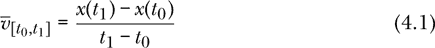

平均速度是位置变化除以时间变化。

使用 Haskell 编程语言的一个优点是，物理方程与我们用来描述它们的代码几乎可以一一对应。在 Haskell 中，以下几行代码出现在源文件中，它们的意义与方程 4.1 相同：

```
averageVelocity :: Time -> Time -> PositionFunction -> Velocity
averageVelocity t0 t1 x = (x t1 - x t0) / (t1 - t0)
```

第一行 Haskell 代码是一个类型签名，表示`averageVelocity`是一个函数，它接受两个时间和一个位置函数作为输入，并输出一个速度。我们可以使用箭头（`->`）将输入连接起来。最后一个术语是输出类型，其他所有术语都是输入类型。这个符号表示法有一个更深层的原因，我们将在第六章和第九章中进行探讨。

上面 Haskell 代码的第二行是函数 `averageVelocity` 的定义。该定义表明，如果我们将 `t0` 作为第一个时间，`t1` 作为第二个时间，`x` 作为位置函数，则速度由等号右边的表达式给出。输入 `t0` 和 `t1` 是数字，而输入 `x` 是一个函数。在 Haskell 中，将函数作为输入传递给其他函数是一种常见做法；我们将在 第六章 中详细讨论这一点。

表 4-1 显示了数学符号和 Haskell 符号的对比。

**表 4-1：** 数学符号与 Haskell 符号的对比

| **数学符号** | **Haskell 符号** |
| --- | --- |
| *t*[0] | `t0` |
| *t*[1] | `t1` |
| *x* | `x` |
| *x*(*t*[0]) | `x t0` |
| *x*(*t*[1]) | `x t1` |
|  | `averageVelocity` |

正如我们在 第一章 中看到的，应用函数到参数时不需要括号。代码中的 `x` 是一个函数，就像方程 4.1 中的 *x* 一样。当我们写 *x*(*t*[0]) 时，我们的意思是将函数 *x* 应用到时间 *t*[0]（或在 *t*[0] 处求值）。类似地，当我们写 `x t0` 时，我们的意思是将函数 `x` 应用到时间 `t0`（或在 `t0` 处求值）。函数在 Haskell 中扮演着如此核心的角色，以至于名称的并列意味着第一个是函数，第二个是参数，而该函数将应用于这个参数。

该符号 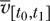 明确表示平均速度依赖于时间间隔的初始时间 *t*[0] 和最终时间 *t*[1]，但对位置函数的依赖是隐含的，并未在方程 4.1 中显示。Haskell 代码显式地展示了所有依赖关系。

### 物理量的类型

如果我们可以在某一时刻讨论速度，而不是在时间间隔内讨论速度，这将使我们的思维更简洁。我们可以通过使用时间间隔中心的时间和间隔长度来标记平均速度，而不是使用开始和结束时间，从而朝着这个方向迈出一步。

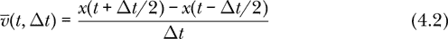

在 Haskell 中，方程 4.2 看起来如下：

```
averageVelocity2 :: Time -> TimeInterval -> PositionFunction
                 -> Velocity
averageVelocity2 t dt x = (x (t + dt/2) - x (t - dt/2)) / dt
```

在这里，我们确实需要将 `t + dt/2` 括起来，以便在应用函数 `x` 之前先进行 `t` 和 `dt/2` 的加法运算。

请注意，在上面的代码中，类型签名中的类型与定义中的参数按相同顺序匹配，如 表 4-2 中所强调。

**表 4-2：** 函数 `average Velocity2` 的参数与类型匹配

| **参数** | **类型** |
| --- | --- |
| `t` | `时间` |
| `dt` | `时间间隔` |
| `x` | `位置函数` |

到这一步，我们只处理一维运动，因此时间、位置和速度都由数字表示。我们通过以下几行告诉 Haskell 编译器这一点，这些行被称为 *类型同义词*。

```
type R = Double

type Time         = R
type TimeInterval = R
type Position     = R
type Velocity     = R

type PositionFunction = Time -> Position
type VelocityFunction = Time -> Velocity
```

上面几行中 Haskell 默认能理解的唯一类型是`Double`。我更倾向于把它看作实数类型（并非每个实数都能用`Double`表示，但我们愿意进行近似计算），因此我更喜欢使用`R`而不是`Double`这个名称。

第一行表示，每当我使用类型`R`时，它和`Double`的含义是相同的。接下来的四行表示时间、时间间隔、位置和速度在这一点上都只是实数。最后的两行定义了函数类型。类型`PositionFunction`是一个函数类型，它接受时间作为输入并返回位置作为输出。回忆一下，上面的参数`x`是一个具有此类型的函数。由于`Time`和`R`是相同的，`Position`和`R`也是相同的，因此`PositionFunction`类型等同于`R -> R`，它接受一个实数作为输入并输出一个实数。出于类似的原因，`VelocityFunction`类型也与函数类型`R -> R`相同。

类型同义词只是为现有类型提供了一个额外的名称。编译器会把`Double`、`R`、`Position`和`Velocity`视为相同，并且在我们尝试在需要`Position`的地方使用`Velocity`时，不会发出警告。在第十章中，我们将介绍一种定义新类型的方法，这种新类型与所有现有类型不同，并允许编译器检查我们是否混淆了不同的类型。此外，还有一个 Haskell 包叫做`units`（[*https://hackage.haskell.org/package/units*](https://hackage.haskell.org/package/units)），专门用于将物理单位（如米每秒）附加到数值量上。

### 引入导数

如果在使时间间隔Δ*t*变得越来越短时，我们发现平均速度趋向于某个特定值，那么我们就称这个值为*瞬时速度*。

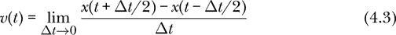

差商的极限出现得很频繁，以至于它被赋予了*导数*这个名称。给定一个一元函数*x*，它的导数，记作*Dx*、*x*'或 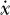，是一个一元函数，定义如下：

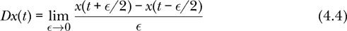

**处理连续时间**

极限和导数的数学定义要求实数的连续性，而这种连续性在物理世界中可能并不存在。当我们假设时间是连续的时候，实际上有些理想化的成分。时间确实看起来是连续的，没有任何直接的测量结果表明时间是离散的，但基于量子理论，有理由相信在某些极短的尺度上，时间可能并不像完美的连续体那样表现。

为了推测量子效应可能干扰时间连续性的时间尺度，我们可以使用*维度分析*，即将与情况相关的参数结合，构造出具有时间维度的量。我们还没有提到任何关于情况的内容，因此我们唯一能用的就是物理学中的基本常数，即牛顿引力常数*G*，普朗克常数，以及真空中的光速*c*。只有一种方法可以将这些基本常数的幂相乘，得出一个具有时间维度的结果。得到的时间被称为*普朗克时间*，其表达式如下：

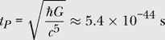

普朗克时间比目前可以探测到的最小时间尺度小得多，数量级上相差很多。对于今天实验上可探测的物理，时间表现为连续的，导数也没有过时的危险。

我们可以说，瞬时速度是位置的导数。

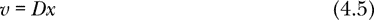

请注意，方程式 4.5 是一个函数的等式：瞬时速度函数位于等式左边，位置函数的导数位于右边。当两个函数相等时，对于相等的输入，它们会给出相等的结果，因此我们也可以写成

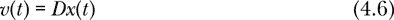

对于任意时刻*t*，右侧是函数*Dx*在时刻*t*的值。我们可以将导数算子视为接受整个位置函数作为输入并返回速度函数作为输出。

更常见的表示法是

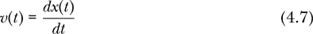

用以定义速度。方程式 4.5 更加简洁，但方程式 4.5、4.6 和 4.7 的含义是相同的。我们说*v*(*t*)是时刻*t*的车速。请注意，空气轨道上车速可以是负的（意味着位置在减少）或正的（意味着位置在增加）。

### Haskell 中的导数

导数将一个函数作为输入，并返回一个函数作为输出。换句话说，导数是从函数到函数的映射。一个接受另一个函数作为输入或返回一个函数作为输出的函数被称为*高阶函数*。如果函数作为其他函数的输入和输出这一概念对你来说是新的，需要通过一些练习和示例来适应，但我向你保证，这是值得的。在物理学中，有许多概念，导数只是其中之一，它们自然地表现为高阶函数。第六章完全讲解了这种高阶函数。

导数的一种可能的类型同义词如下所示：

```
type Derivative = (R -> R) -> R -> R
```

由于箭头是右结合的，最右边的箭头具有最高优先级，类型`(R -> R) -> R -> R`与`(R -> R) -> (R -> R)`是等价的。

我们可以像这样在 Haskell 中编写数值导数：

```
derivative :: R -> Derivative
derivative dt x t = (x (t + dt/2) - x (t - dt/2)) / dt
```

这种数值导数并不采用极限，而是使用由用户提供的小间隔`dt`。如果间隔足够小，结果应该是导数的良好近似值。

让我们像处理函数`averageVelocity2`一样，通过参数和类型来玩匹配游戏，看看`derivative`函数。乍一看，似乎`dt`的类型是`R`，`x`的类型是`Derivative`，而`t`则没有类型。这是没有意义的；问题在于我们需要展开`Derivative`类型。展开后，`derivative`具有以下类型：

```
derivative :: R -> (R -> R) -> R -> R
```

现在，`dt`的类型是`R`，`x`的类型是`R -> R`，`t`的类型是`R`，最终的`R`是返回类型。

在进行匹配游戏时，我们认为`derivative`是一个具有三个输入和一个输出的函数。箭头符号可能看起来是指定一个具有三个输入的函数的一种奇怪方式。这个符号有更深的含义，我们将在这里简要讨论，并在第六章中进行更详细的阐述。

由于箭头右结合，编译器认为以下三种类型是相同的：

+   `R -> (R -> R) -> R -> R`

+   `R -> (R -> R) -> (R -> R)`

+   `R -> ((R -> R) -> (R -> R))`

使用匹配游戏中的思维方式，似乎第一个类型需要三个输入，第二个类型需要两个输入，第三个类型需要一个输入。

有三种方式来思考`derivative`函数：

+   `derivative`接受三个输入，类型分别为`R`、`R -> R`和`R`，并产生一个类型为`R`的输出。通过这种思维方式，`derivative`接受一个时间间隔、一个位置函数和一个时间，然后返回该时刻的数值速度。这是我们在匹配游戏中的思维方式。

+   `derivative`接受两个输入，类型分别为`R`和`R -> R`，并产生一个类型为`R -> R`的输出。通过这种思维方式，`derivative`接受一个时间间隔和一个位置函数，并返回一个速度函数。

+   `derivative`接受一个类型为`R`的输入（即`dt`），并生成一个类型为`(R -> R) -> R -> R`（或者类型为`Derivative`）的输出。这是编译器的理解方式。

这三种思维方式在数学上是等价的，但它们在大脑中的感觉方式不同。第二种思维方式是我最喜欢的，因为我喜欢将导数看作是一个接受函数作为输入并返回函数作为输出的过程。

将一个具有两个输入的函数转换为一个具有一个输入的函数，并且其输出为另一个函数，这种方式被称为*柯里化*，以逻辑学家哈斯凯尔·柯里（他将自己的名字赠予了我们所使用的编程语言）命名。柯里化在第六章和第九章中有更详细的讨论。柯里化允许编译器将所有函数视为只有一个输入和一个输出，前提是输入和/或输出可能是一个函数。

### 模拟汽车的位置和速度

假设我们有一个汽车位置函数


其中 *t* 以秒为单位，*x[C]* 以米为单位。相应的 Haskell 代码如下：

```
carPosition :: Time -> Position
carPosition t = cos t
```

使用方程 4.5，我们可以找到汽车的速度函数。

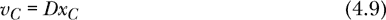

相应的 Haskell 代码可能如下所示：

```
carVelocity :: Time -> Velocity
carVelocity = derivative 0.01 carPosition
```

在 Haskell 代码中，`derivative 0.01`扮演着数学表达式中导数算符*D*的角色。这两者不完全相同，因为*D*是真正的数学导数，而`derivative 0.01`只是一个数值导数，但通过使用它，我们可以得到不错的近似结果，而且我们可以通过使用小于`0.01`的数字来提高结果的精度。此外，`derivative 0.01 sin`是一个完全有效的函数，其类型为`R -> R`，在 Haskell 语言中与函数`cos`（同样类型为`R -> R`）一样合法。它可以被求值、绘制图形、求导、积分，或者在任何需要类型为`R -> R`的函数的地方使用。

方程 4.9 是函数的等式，相应的 Haskell 代码定义了函数`carVelocity`，且不使用任何函数参数。这就是在第二章中介绍的点自由风格。

基于方程 4.6 编写 Haskell 代码也是有效的。此时，数学方程看起来会像下面这样：

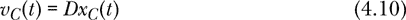

相应的 Haskell 代码如下所示：

```
carVelocity' :: Time -> Velocity
carVelocity' t = derivative 0.01 carPosition t
```

我们使用撇号来表示写函数的另一种方式。对计算机而言，`carVelocity`和`carVelocity'`表示相同的含义。区别只在于符号的偏好。在代码中，我们经常使用撇号来表示另一种写法。这个撇号与导数无关。

汽车的位置函数是通过解析给出的，因此我们可以通过解析求导，并写出汽车速度的显式方程。

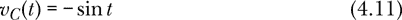

我们也可以用 Haskell 编写如下代码：

```
carVelocityAnalytic :: Time -> Velocity
carVelocityAnalytic t = -sin t
```

但在本书中，我们并不要求计算机做符号代数运算或解析求导。函数`carVelocityAnalytic`*并不是*与`carVelocity`或`carVelocity'`相同的函数。`carVelocity 2`的数值接近但不完全等于`carVelocityAnalytic` `2`的数值。在本书中，我们仅要求计算机完成科学计算器能做的任务。然而，我们会发现，Haskell 的符号会通过关注表达式的类型、高阶函数带来的简洁性以及避免可变状态的简洁语言帮助我们进行思考。

还有一种更好的方式来用 Haskell 表达方程 4.5。函数`velFromPos`接受任何位置函数作为输入，并提供相应的速度函数作为输出。

```
velFromPos :: R                   -- dt
           -> (Time -> Position)  -- position function
           -> (Time -> Velocity)  -- velocity function
velFromPos dt x = derivative dt x
```

我们可以看到，求取速度从位置的函数实际上就是我们之前定义的导数函数。还需要注意的是，我们可以将类型签名分布在多行上。这通常是一个好习惯，它给了代码编写者一个机会，在签名的每个类型旁边添加简短的注释，以解释其含义。

如果速度恰好是恒定的，比如*v*[0]，我们可以对方程 4.5 或 4.7 的两边进行积分，得到：

*v*[0]*t* = *x*(*t*) – *x*(0)

如果速度恒定，则位置是时间的线性函数。

*x*(*t*) = *v*[0]*t* + *x*(0)

这是对应的 Haskell 代码：

```
positionCV :: Position -> Velocity -> Time -> Position
positionCV x0 v0 t = v0 * t + x0
```

名字末尾的`CV`是“恒定速度”（constant velocity）的缩写。再次注意，我们可以有不同的方式来理解类型：我们可以将`positionCV`看作一个接受三个参数并返回`Position`的函数，也可以看作一个接受两个参数并返回一个函数`Time -> Position`，或者看作一个接受一个参数并返回一个函数`Velocity -> Time -> Position`。表达式`positionCV 5 10 2`表示一个物体在时间 2 秒时的位置，如果它以 10 米/秒的恒定速度移动，且在时间为 0 时的位置为 5 米。表达式`positionCV 5 10`表示描述一个物体以 10 米/秒的恒定速度移动、且在时间为 0 时位置为 5 米的`PositionFunction`。

在日常语言中，我们经常将*速度*和*速率*这两个术语互换使用。物理学语言对这两个术语做了技术性的区分。*速率*是速度的大小（绝对值）。速率永远不会是负数。虽然速率（即物体的移动速度）是一个更容易理解的概念，但速度在运动理论中要重要得多。速度包含了比速率更多的信息，因为它不仅告诉我们物体的移动速度，还能提供物体的运动方向。一个被垂直向上抛的石头，其速度会在向上运动和向下运动时都发生规律性的变化。而速率则在向上运动时减小，在向下运动时增大，这使得我们不必要地将其看作两个独立的过程。有时候，讨论速率是方便的，并且为其定义一个概念和一个术语是非常值得的。当我们讨论多维运动时，速度需要用一个向量来描述，而速率则依然只是一个数值。

### 建模加速度

*加速度*被定义为速度变化的速率。我们定义*a*为一个函数，它将每个时间*t*与该时刻的速度变化速率相联系。用微积分的语言，我们可以写出：

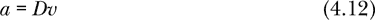

或者

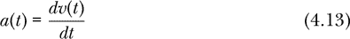

定义加速度。方程 4.12 更简洁，但这两个方程的含义是相同的。我们说* a *(*t*)是汽车在时间*t*时的加速度。

本章只处理一维运动，因此我们用一个数字表示加速度。

```
type Acceleration = R
```

方程式 4.12 可以通过一个名为 `accFromVel` 的函数进行编码，该函数根据速度函数生成加速度函数。

```
accFromVel :: R                       -- dt
           -> (Time -> Velocity)      -- velocity function
           -> (Time -> Acceleration)  -- acceleration function
accFromVel = derivative
```

再次强调，这个函数只是导数。在这里，我们使用无点风格来强调这两个函数的相等性。

如果加速度恰好是常数，比如 *a*[0]，我们可以对方程 4.12 或 4.13 的两边进行积分，得到：

*a*[0]*t* = *v*(*t*) – *v*(0)

如果加速度是常数，则速度是时间的线性函数。

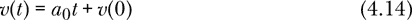

这是方程式 4.14 的 Haskell 代码：

```
velocityCA :: Velocity -> Acceleration -> Time -> Velocity
velocityCA v0 a0 t = a0 * t + v0
```

名称末尾的 `CA` 是“恒定加速度”的缩写。

为了相信我们真正了解一个运动物体的情况，我们需要一个表达式来给出物体的位置随时间变化的关系。由于位置是速度的反导数或积分，我们可以通过对方程式 4.14 两边进行积分，得到这种关系：

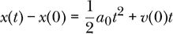

如果加速度是常数，则位置是时间的二次函数。

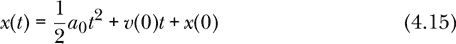

这是方程式 4.15 的 Haskell 代码：

```
positionCA :: Position -> Velocity -> Acceleration
           -> Time -> Position
positionCA x0 v0 a0 t = a0 * t**2 / 2 + v0 * t + x0
```

方程式 4.14 和 4.15 被称为*恒定加速度方程*。它们在典型的入门物理课程中反复使用。稍后我们将学习一些技术来处理加速度不是常数的情况。

时间、位置、速度和加速度之间的关系被称为*运动学*，即运动的描述。这些是描述气轨上汽车运动所需的量。在我们有一个能解释运动原因的理论之前，我们需要引入其他概念，如力和质量。

### 近似算法和有限精度

在数学中，导数由方程 4.4 中的极限定义。在许多情况下，可以精确地计算出一个显式指定函数的数学导数。本章中定义的数值`derivative`并不采用极限，而是依赖于一个小但有限的*ϵ*。因此，数值导数计算的是函数导数的近似值。我们将从有限的*ϵ*值计算导数的规则称为*近似算法*。

近似算法的使用是我们计算中不精确性的第二个来源。在第一章中，我们看到`R`类型或`Double`类型的数字通常不能被计算机精确表示。有些数字可以精确表示，但即使是看似无害的数字 0.1 在计算机中也不能精确表示为`R`。这是因为像表 1-4 中的数字 0.2 一样，0.1 需要无限的二进制扩展（0.0001100110011...），而计算机会在某个点截断它。这通常不会成为问题，因为`R`提供大约 15 位有效数字的精度，足以满足我们的需求，但仍然是*有限精度*。如果我们将一个非常小的数加到一个非常大的数中，

```
Prelude> 1e9 + 1e-9
1.0e9
```

计算机直接丢弃了这个非常小的数字。

即使计算机没有极端地丢弃一个小数，当它被加到一个大数时，小数的相对精度也会变差。例如，表 4-3 中的每个数字，从 1/3 到 1/3 × 10¹⁸，都有大约 15 位小数的精度，这通过它的表达式中的三的个数得以指示。

**表 4-3：** 分数精确到约 15 位小数的计算结果

| **表达式** |  | **计算结果** |
| --- | --- | --- |
| `1/3` | ⇝ | `0.3333333333333333` |
| `1/3000` | ⇝ | `3.333333333333333e-4` |
| `1/3e6` | ⇝ | `3.3333333333333335e-7` |
| `1/3e9` | ⇝ | `3.333333333333333e-10` |
| `1/3e12` | ⇝ | `3.3333333333333334e-13` |
| `1/3e15` | ⇝ | `3.333333333333333e-16` |
| `1/3e18` | ⇝ | `3.3333333333333334e-19` |

然而，当这些数值与相对较大的数字 1 相加时，保留的三的个数会有所不同，如表 4-4 所示，这取决于被加的两个数的相对大小。例如，当加上 1/3 × 10⁹时，只有它的 15 个三位数中的 6 个被保留。

**表 4-4：** 将小数加到相对较大的数字上时，如何减少小数的相对精度

| **表达式** |  | **计算结果** |
| --- | --- | --- |
| `1 + 1/3` | ⇝ | `1.3333333333333333` |
| `1 + 1/3000` | ⇝ | `1.0003333333333333` |
| `1 + 1/3e6` | ⇝ | `1.0000003333333334` |
| `1 + 1/3e9` | ⇝ | `1.0000000003333334` |
| `1 + 1/3e12` | ⇝ | `1.0000000000003333` |
| `1 + 1/3e15` | ⇝ | `1.0000000000000004` |
| `1 + 1/3e18` | ⇝ | `1.0` |

将一个小数加到一个大数上的过程是导数概念的核心。我们希望*ϵ*很小，但`R`仅是一个近似值，意味着我们不希望它太小。

表 4-5 展示了函数*f*的数值导数的相对误差，其中*f*(*x*) = *x*⁴/4。精确的导数是*Df*(*x*) = *x*³。导数在*x* = 1 时求值，因此精确结果是 1。表中的每一行显示了*ϵ*的相对误差，其范围从 1 到 10^(–18)。

**表 4-5：** 数值导数的相对误差，随着*ϵ*变小而减小，随着*ϵ*进一步减小而增大

| **表达式** |  | **计算结果** |
| --- | --- | --- |
| `derivative 1 (\x -> x**4 / 4) 1 - 1` | ⇝ | `0.25` |
| `derivative 1e-3 (\x -> x**4 / 4) 1 - 1` | ⇝ | `2.499998827953931e-7` |
| `derivative 1e-6 (\x -> x**4 / 4) 1 - 1` | ⇝ | `1.000088900582341e-12` |
| `derivative 1e-9 (\x -> x**4 / 4) 1 - 1` | ⇝ | `8.274037099909037e-8` |
| `derivative 1e-12 (\x -> x**4 / 4) 1 - 1` | ⇝ | `8.890058234101161e-5` |
| `derivative 1e-15 (\x -> x**4 / 4) 1 - 1` | ⇝ | `-7.992778373592246e-4` |
| `derivative 1e-18 (\x -> x**4 / 4) 1 - 1` | ⇝ | `-1.0` |

随着*ϵ*从 1 下降到 10^(–6)，误差变小。在这些*ϵ*值下，导数算法的近似性质对误差的贡献大于计算机使用的有限精度。但随着*ϵ*继续减小，表中的误差变大。在这些*ϵ*值下，计算和表示数字时使用的有限精度对误差的贡献大于计算导数的近似算法。

在数值导数的情况下，有限精度希望*ϵ*较大，以保持其相对精度，但算法希望*ϵ*较小，以逼近真实的导数。最佳结果出现在中间值附近，对于表 4-5 中的情况，*ϵ* = 10^(–6)。

这两种不准确来源——有限精度和近似算法——将在我们计算物理学的旅程中一直伴随我们。稍后我们介绍的求解微分方程的算法也是近似算法，它依赖于小但有限的步骤来求解连续的微分方程。我们将介绍一些经验法则来选择这些小的有限参数。本书的态度并非深入研究数值分析这一有趣的学科，也不是对不准确性采取警惕的立场，而是简单地意识到近似计算的本质，以便我们能够得出有意义的结果。

### 小结

本章介绍了位置、速度、加速度和时间的概念，以及它们之间的关系，这些关系通过导数的数学概念来表述。我们看到如何将各种运动学方程编码为 Haskell 语言。在下一章，我们将介绍列表，它们在函数式编程中的作用几乎与函数同等重要，因为它们是大多数迭代的基础。

### 习题

**习题 4.1：** 考虑以下函数：

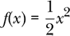

该函数的导数是*Df*(*x*) = *x*。在这种情况下，*Df*是实数上的恒等函数。因为

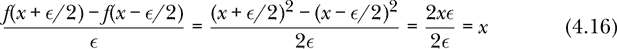

即使在我们取极限之前，我们的数值 `derivative` 应该对我们使用的任何 *ϵ* 都给出精确的结果。编写 Haskell 代码，使用 `derivative 10`、`derivative 1` 和 `derivative 0.1` 来计算 *f* 的导数。你应该会发现，`derivative 10` 和 `derivative 1` 会准确地得到恒等函数，而 `derivative 0.1` 接近但并不完全准确。为什么 `derivative 0.1` 在实数上无法精确产生恒等函数？

**练习 4.2.** 考虑以下函数：

*f*(*x*) = *x*³

该函数的导数为 *Df* (*x*) = 3*x*²。在特定的 *x* 值下，由数值导数引入的误差是数值导数在 *x* 处的计算值与精确导数在 *x* 处的计算值之间的绝对差。编写 Haskell 代码，使用 `derivative 1` 计算 *f* 的导数。通过在不同的 *x* 值下计算导数，看看你能否找到数值导数引入误差的规律。在你找到这种误差的规律后，扩展你的探索，考虑对不同的 `a` 值使用 `derivative a`。你能给出一个关于误差的表达式，涉及 `a` 吗？

当 *x* = 4 时，*Df* (4) = 48。什么值的 `a` 会在 *x* = 4 时产生 1% 的误差？当 *x* = 0.1 时，*Df* (0.1) = 0.03。什么值的 `a` 会在 *x* = 0.1 时产生 1% 的误差？

**练习 4.3.** 找一个函数和其自变量的一个值，使得使用`derivative 0.01`时与精确导数相比产生至少 10% 的误差。

**练习 4.4.** 考虑余弦函数 `cos` 及其数值导数 `derivative a cos`。对于哪些自变量值（我们称之为 `t`）数值导数对 `a` 的值最为敏感？对于哪些值最不敏感？你应该能够找到一些 `t` 值，使得 `a` 可以非常大，而数值导数仍然是一个很好的近似值。

**练习 4.5.** 考虑以下位置函数：

```
pos1 :: Time -> Position
pos1 t = if t < 0
         then 0
         else 5 * t**2
```

编写函数

```
vel1Analytic :: Time -> Velocity
vel1Analytic t = undefined
```

并且

```
acc1Analytic :: Time -> Acceleration
acc1Analytic t = undefined
```

通过对位置函数进行解析导数，得到对应的速度和加速度函数。

`undefined` 函数可以用作尚未编写的代码的占位符。编译器会接受`undefined`并愉快地编译代码，但如果你尝试使用基于`undefined`的函数，你将会遇到运行时错误。

编写函数

```
vel1Numerical :: Time -> Velocity
vel1Numerical t = undefined
```

并且

```
acc1Numerical :: Time -> Acceleration
acc1Numerical t = undefined
```

通过对位置函数使用`derivative 0.01`进行数值导数，可以得到对应的速度和加速度函数。你能找到`vel1Analytic t`和`vel1Numerical t`显著不同的`t`值吗？你能找到`acc1Analytic t`和`acc1Numerical t`显著不同的`t`值吗？
