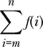
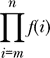
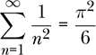
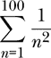
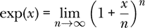
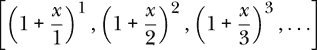
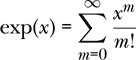
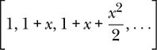
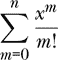

# 第五章：处理列表


人们天生就会列出清单。无论是愿望清单、购物清单，还是最喜欢的十本书清单，所有有共同点的项按顺序排列都容易被大脑处理。函数式编程的历史与列表紧密相连。早期的函数式语言 Lisp 甚至有一个名字，Lisp 是“list processor”的缩写。在 Haskell 中，列表同样重要，因为我们在函数式编程中思考迭代的方式，通常是构建一个列表，然后使用它来产生我们想要的结果。

在本章中，我们将学习关于列表及其相关函数的内容。我们将从列表基础开始，例如如何构造列表，如何选择列表中的特定元素，以及如何连接列表。然后我们将学习如何为列表指定类型。数字列表有特殊的作用。对于算术序列有特殊的语法，而且有多个 Prelude 函数用于操作数字列表。接下来，我们将介绍类型变量的概念。我们将稍微偏离话题讨论类型转换，然后介绍列表推导式，这是一种非常有用的从旧列表形成新列表的方式。最后，我们将通过模式匹配结束本章，了解列表类型的数据构造器。

### 列表基础

在 Haskell 中，*列表*是一个有序的数据序列，所有元素类型相同。以下是一个列表的示例：

```
physicists :: [String]
physicists = ["Einstein","Newton","Maxwell"]
```

类型`[String]`表示`physicists`是一个`String`类型的列表。

类型周围的方括号表示一个列表。一个类型为`[String]`的列表可以有任意数量的项（包括零），但每个项必须是`String`类型。在第二行，我们通过将物理学家元素用方括号括起来，并用逗号分隔元素来定义物理学家。空列表用[]表示。

使用类型同义词

```
type R = Double
```

这是一个实数列表：

```
velocities :: [R]
velocities = [0,-9.8,-19.6,-29.4]
```

#### 从列表中选择一个元素

列表元素操作符`!!`可以用来获取列表中单个元素的值。我们在列表和元素的位置（或*索引*）之间使用该操作符。列表的第一个元素被视为第 0 个元素。

```
Prelude> :l Lists.hs
[1 of 1] Compiling Main            ( Lists.hs, interpreted )
Ok, one module loaded.
*Main> velocities !! 0
0.0
*Main> velocities !! 1
-9.8
*Main> velocities !! 3
-29.4
```

第一个命令加载文件*Lists.hs*，该文件包含本章的代码。此文件以及其他章节的代码文件可以在[`lpfp.io`](https://lpfp.io)找到。加载文件后，我们可以引用`velocities`，这个名字在加载文件之前对 GHCi 是未知的。

#### 连接列表

相同类型的列表可以使用`++`操作符进行连接，如表 1-2 所示。例如，如果我们有另一个类型为`[R]`的列表，

```
moreVelocities :: [R]
moreVelocities = [-39.2,-49.0]
```

我们可以将`velocities`与这个列表连接起来：

```
*Main> velocities ++ moreVelocities
[0.0,-9.8,-19.6,-29.4,-39.2,-49.0]
*Main> :t velocities ++ moreVelocities
velocities ++ moreVelocities :: [R]
```

请注意，连接后的列表类型与每个组成列表的类型相同，在这个例子中是`[R]`。

尝试连接不同底层类型的列表会产生错误。例如，`physicists ++ velocities`会报错。

```
   *Main> physicists ++ velocities

➊ <interactive>:7:15: error:
   ➋ • Couldn't match type Double with [Char]
     ➌ Expected type: [String]
       ➍ Actual type: [R]
   ➎ • In the second argument of (++), namely velocities
        In the expression: physicists ++ velocities
        In an equation for it: it = physicists ++ velocities
```

这种错误被称为 *类型错误*。虽然 `physicists` 有明确的类型，即 `[String]`，而 `velocities` 有明确的类型，即 `[R]`，但是表达式 `physicists ++ velocities` 无法得到一个明确的类型。类型错误发生在我们试图对一个期望某种类型输入的函数（在这种情况下是连接操作符 `++`）应用一个实际上具有不同类型的值时。连接操作符期望它的第二个参数类型是 `[String]`，因为 `physicists` 的类型是 `[String]`。然而，我们给了一个第二个参数 `velocities`，它的类型是 `[R]`，因此与 `[String]` 不匹配。在 第六章 中，我们将讨论连接操作符的类型。

让我们试着理解错误信息。单词“interactive” ➊ 表示错误发生在 GHCi 提示符下，而不是在源代码文件中。数字 ➊ 是错误发生的行号和列号。这对于源代码文件中的错误是有用的信息，但对于 GHCi 提示符下的错误来说其实并不需要。“Couldn’t match type” ➋ 表示类型错误。类型不匹配的是 `Double` 和 `[Char]` ➋。由于 `R` 是 `Double` 的类型别名，而 `String` 是 `[Char]` 的类型别名，正如我们在本章稍后会看到的，编译器告诉我们 `R` 和 `String` 不匹配。

接下来，编译器告诉我们一个函数期望一个类型为 `[String]` 的表达式（“预期类型”） ➌，但实际上给定了一个类型为 `[R]` 的表达式（“实际类型”） ➍。错误信息接着告诉我们，这个不匹配的地方是在 `++` 操作符的第二个参数 ➎。能够阅读像这样的类型错误是非常有用的。犯这样的错误并不丢脸。编译器通过检查我们的代码来帮助我们确保它的合理性。在物理学中，我们可以通过为不同的概念实体分配不同的类型，充分利用 Haskell 的类型系统。例如，我们知道把一个数字加到一个向量上是没有意义的。通过给数字和向量不同的类型，我们利用 Haskell 的类型系统来确保我们编写的代码不会试图将数字加到向量上。

任何类型相同的多个列表都可以通过 `concat` 函数进行连接。如果我们定义一个字符串列表，

```
shortWords :: [String]
shortWords = ["am","I","to"]
```

然后我们可以进行如下的连接：

```
*Main> concat [shortWords,physicists,shortWords]
["am","I","to","Einstein","Newton","Maxwell","am","I","to"]
```

#### 算术序列

*算术序列* 是一个由两个点（..）形成的列表，像这样：

```
ns :: [Int]
ns = [0..10]
```

列表 ns 包含从 0 到 10 的整数。我选择了名称 ns，因为它看起来像是 n 的复数形式，而 n 似乎是一个整数的好名字。在 Haskell 程序中，使用以 s 结尾的名字来表示列表是一种常见的风格，但这并不是必须的。

如果我们输入一个列表到 GHCi，GHCi 将会评估每个元素并返回评估后的元素列表：

```
*Main>  [0,2,5+3]
[0,2,8]
```

如果我们给 GHCi 输入一个算术序列，GHCi 会为我们展开这个序列：

```
*Main>  [0..10]
[0,1,2,3,4,5,6,7,8,9,10]
```

第二种算术数列形式允许我们通过一个不同于 1 的值从一个项递增到下一个项：

```
*Main>  [-2,-1.5..1]
[-2.0,-1.5,-1.0,-0.5,0.0,0.5,1.0]
```

在第二种形式中，我们指定所需列表的第一个、第二个和最后一个条目。我们甚至可以做一个递减的列表：

```
*Main>  [10,9.5..8]
[10.0,9.5,9.0,8.5,8.0]
```

#### 列表类型

*列表类型* 是从现有类型形成新类型的第二种方式（第一种方式是函数类型，正如我们在第三章中的“函数类型”部分所看到的）。给定任何类型 `a`（如 `Int`、`Integer`、`Double` 等），都有一个类型 `[a]` 用于表示元素类型为 `a` 的列表。

例如，你可以制作一个函数列表。回想一下我们在第二章中定义的平方函数。

```
square :: R -> R
square x = x**2
```

我们可以定义以下列表，其中 `cos` 和 `sin` 是在 Haskell Prelude 中定义的函数：

```
funcs :: [R -> R]
funcs = [cos,square,sin]
```

为什么我们需要一个函数列表呢？其中一个原因会在第十一章中出现，当我们遇到一个接受函数列表并将它们绘制在同一坐标轴上的函数时。第二个原因出现在第十四章，当作用于物体的力是时间或速度的函数时。我们用于求解牛顿第二定律的函数将接受这些力函数的列表，以描述作用于物体的力。

#### 数字列表的函数

Haskell 提供了几个可以与数字列表一起使用的 Prelude 函数。前两个是 `sum` 和 `product`，如表 5-1 所示。正如你从名称中可能猜到的那样，`sum` 返回列表中项的和，对于空列表返回 `0`。`product` 函数返回列表中项的积，对于空列表返回 `1`。`maximum` 和 `minimum` 函数分别返回列表中的最大值和最小值，如果给它们传递空列表，则会产生错误。

**表 5-1：** 数字列表的函数

| **表达式** |  | **计算结果** |
| --- | --- | --- |
| `sum [3,4,5]` | ⇝ | `12` |
| `sum []` | ⇝ | `0` |
| `product [3,4,5]` | ⇝ | `60` |
| `product []` | ⇝ | `1` |
| `maximum [4,5,-2,1]` | ⇝ | `5` |
| `minimum [4,5,-2,1]` | ⇝ | `-2` |

#### 何时不使用列表

有时你可能需要将不同类型的表达式“捆绑在一起”。例如，我们可能希望组成一对一对的项，其中包括一个人的姓名（`String`）和年龄（`Int`）。列表不是适合这种情况的结构。列表中的所有元素必须具有相同的类型。在第九章中，我们将学习*元组*，它是将不同类型的项捆绑在一起的好方法。

### 类型变量

在上一节中，我们看到列表元素运算符 `!!` 返回指定的列表元素。列表元素运算符不关心列表中包含的元素类型。我们会写 `physicists !! 2` 来获取 `physicists` 列表中的第二个元素，就像我们写 `velocities !! 2` 来获取 `velocities` 列表中的第二个元素一样，尽管前者的列表类型是 `[String]`，而后者的列表类型是 `[R]`。

还有其他一些函数也不关心列表元素的类型。表 5-2 展示了预定义函数中的几个这样的函数。这些函数的类型是通过*类型变量*（这里是`a`）表示的。类型变量必须以小写字母开头，并且可以代表任何类型。

**表 5-2：** 用于处理列表的一些预定义函数

| **函数** |  | **类型** | **描述** |
| --- | --- | --- | --- |
| `head` | `::` | `[a] -> a` | 返回列表的第一个元素 |
| `tail` | `::` | `[a] -> [a]` | 返回列表中除了第一个元素的所有元素 |
| `last` | `::` | `[a] -> a` | 返回列表的最后一个元素 |
| `init` | `::` | `[a] -> [a]` | 返回列表中除了最后一个元素的所有元素 |
| `reverse` | `::` | `[a] -> [a]` | 反转列表的顺序 |
| `repeat` | `::` | `a` `-> [a]` | 无限重复单一项的列表 |
| `cycle` | `::` | `[a] -> [a]` | 无限循环给定列表 |

`head`函数返回列表中的第一个元素。你可以在表 5-3 中看到一些`head`的使用示例，以及其他列表函数的使用示例。

**表 5-3：** 列表函数的使用

| **表达式** |  | **计算结果** |
| --- | --- | --- |
| `head ["Gal","Jo","Isaac","Mike"]` | ⇝ | `"Gal"` |
| `head [1, 2, 4, 8, 16]` | ⇝ | `1` |
| `tail ["Gal","Jo","Isaac","Mike"]` | ⇝ | `["Jo","Isaac","Mike"]` |
| `tail [1, 2, 4, 8, 16]` | ⇝ | `[2,4,8,16]` |
| `last ["Gal","Jo","Isaac","Mike"]` | ⇝ | `"Mike"` |
| `last [1, 2, 4, 8, 16]` | ⇝ | `16` |
| `init ["Gal","Jo","Isaac","Mike"]` | ⇝ | `["Gal","Jo","Isaac"]` |
| `init [1, 2, 4, 8, 16]` | ⇝ | `[1,2,4,8]` |
| `length ["Gal","Jo","Isaac","Mike"]` | ⇝ | `4` |
| `length [1, 2, 4, 8, 16]` | ⇝ | `5` |

`head`函数可以接受类型为`[Double]`的列表、类型为`[Char]`的列表或类型为`[Int]`的列表。因为`head`不关心负载的类型，最好的方式是通过使用类型变量`a`来表达`head`接受`[a]`类型的输入。相同的类型变量`a`也出现在输出中；`head`的返回类型是`a`。

如果你查询 GHCi 空列表的类型，你会看到类型变量。

```
*Main> :t []
[] :: [a]
```

让我们再看一下表 5-2 中的一些函数。`tail`函数返回列表中的所有元素，但不包括第一个元素。`last`函数返回列表中的最后一个元素。`init`函数返回列表中除了最后一个元素的所有元素。书籍《*Learn You a Haskell for Great Good!*》有一张可爱的毛毛虫图片（[`learnyouahaskell.com/starting-out#an-intro-to-lists`](http://learnyouahaskell.com/starting-out#an-intro-to-lists)），它形象地解释了这些列表函数。表 5-2 给出了这些函数的类型，表 5-3 展示了如何使用它们的一些示例。

既然我们已经介绍了类型变量，现在正是一个短暂探讨类型转换的好时机。

### 类型转换

GHCi 似乎允许`Double`与`Int`进行除法运算：

```
*Main> 0.4 / 4
0.1
```

然而，这并不是这里发生的情况。数字 `0.4` 可以是 `Float` 或 `Double`。数字 `4` 可以是 `Int`、`Integer`、`Float` 或 `Double`。除法运算符要求被除的两个数字的类型相同。在这种情况下，两个数字必须都解释为 `Float` 或都解释为 `Double`。加法、减法、乘法和除法要求参与操作的两个表达式具有相同的类型。就我们之前介绍的类型变量而言，加法、减法、乘法和除法的类型都是 `a -> a -> a`，意味着两个参与运算的数字必须具有相同的类型 `a`，然后运算的结果也将是类型 `a`。 （关于加法等算术运算类型的完整故事更为复杂。你不能将两个 `String` 相加，但一个类型为 `a -> a -> a` 的函数必须能够接受两个 `String` 作为输入并产生一个 `String` 作为输出。缺少的部分涉及类型类的概念，我们将在 第八章 讨论。）

Haskell 编译器会拒绝将 `Double` 除以 `Int`。如果我们给一些数字明确指定类型，

```
oneDouble :: Double
oneDouble = 1

twoInt :: Int
twoInt = 2
```

我们可以看到编译器生成的错误：

```
*Main> oneDouble / twoInt

<interactive>:42:13: error:
    • Couldn't match expected type Double with actual type Int
    • In the second argument of (/), namely twoInt
      In the expression: oneDouble / twoInt
      In an equation for it: it = oneDouble / twoInt
```

这是另一个类型错误的示例。除法的第一个输入是 `Double`，因此除法的第二个参数的“期望类型”也是 `Double`。我们提供的“实际类型”是 `Int`，这不匹配。编译器同样会拒绝将 `Float` 加到 `Double` 上。

除法操作只能发生在相同类型的数字之间，这可能会令人烦恼，尤其是当我们期望编译器自动将一种类型转换为另一种类型时。解决方案是使用一个类型转换函数，比如将一个 `Int` 转换为 `Double`。

有两个重要的类型转换函数，你可能需要不时使用。第一个是 `fromIntegral`，它将一个 `Int` 或 `Integer` 转换成其他类型的数字。编译器通常能够推断出应该转换成哪种类型，但它需要通过这个函数获得你的明确许可。第二个转换函数是 `realToFrac`，它将一个 `Float` 转换为 `Double`，或者将一个 `Double` 转换为 `Float`。同样，你通常不需要明确指定要转换成的类型；你只需要允许进行转换。以下是一个示例：

```
*Main> oneDouble / fromIntegral twoInt
0.5
```

转换要求背后的理由是，在 Haskell 中，大多数错误是类型错误。类型错误通常意味着我们没有完全考虑过自己编写的代码。举例来说，将一个 `Double` 除以一个 `Int` 可能不是我们所期望的，我们感谢类型检查器生成了错误，而不是悄悄地将 `Int` 转换成 `Double`。

这就是我们对类型转换的简要讨论。现在我们可以回到我们正常的程序，具体来说是列表。

### 列表的长度

Prelude 提供了一个 `length` 函数，用于返回列表中项目的数量。

```
*Main> length velocities
4
*Main> length ns
11

*Main> length funcs
3
```

在 Haskell 的早期，`length`是一个简单的函数，具有简单的类型。`length`的类型是`[a] -> Int`，意味着你可以给`length`传递一个任意类型的列表，它会返回一个整数。这很简单。如果我们今天在 GHCi 中查询`length`的类型，

```
*Main> :t length
length :: Foldable t => t a -> Int
```

我们看到一个更复杂的类型。这个类型涉及到*类型类*的概念，我们将在第八章中进行探讨。但目前，我们可以用简单的类型`[a] -> Int`定义自己的`length`函数：

```
len :: [a] -> Int
len = length
```

如果我们在 GHCi 中查看`len`的类型，

```
*Main> :t len
len :: [a] -> Int
```

我们看到了我们所需要的简单类型。

定义我们自己的`length`函数并没有太大好处，因为我们可以自由地使用`length`，即使它有一个复杂的类型，但是理解我们使用的函数的类型能让我们真正了解我们在做什么。我们希望理解我们编写和使用的函数的类型，并希望它们尽可能简单。当然，简洁性与功能之间会有权衡。Haskell 设计者决定让`length`函数具有更复杂的类型，这意味着它可以在更广泛的场景中使用。在这种情况下，设计者做出了更偏向功能而非简洁性的决定。我们通常会偏向于简洁性而非功能性。

### 字符串就是字符的列表

现在我已经介绍了列表，可以告诉你，在 Haskell 中，字符串不过是一个字符的列表。换句话说，`String`类型与`[Char]`类型完全相同；事实上，`String`在 Haskell 预定义模块中被定义为`[Char]`的类型同义词，正如我们将`R`定义为`Double`的类型同义词一样。Haskell 为字符串提供了一些特殊的语法，特别是能将一串字符用双引号括起来，从而形成一个`String`。显然，这比要求显式列出字符列表（如`['W','h','y','?']`）要更加方便。你可以在 GHCi 中检查这是否与"Why?"相同：

```
*Main>  ['W','h','y','?'] == "Why?"
True
```

GHCi 返回 True，表示它认为这两个表达式是相同的。

`String`和`[Char]`这两种类型的身份也意味着字符串可以在任何期望接收某种类型列表的函数中使用。例如，我们可以在一个字符串上使用`length`函数来告诉我们它包含多少个字符。

有一些编程经验的读者可能会担心将字符串表示为字符列表的效率问题。请放心，Haskell 还有一些更高效的选项，适用于那些需要处理大量字符串的程序员。然而，就我们目前的需求而言，我们不需要处理大量字符串，因此基本的`String`类型完全足够了。

### 列表推导式

Haskell 提供了一种强大的方法，用新的列表从旧的列表中生成。假设你有一个时间列表（单位为秒），

```
ts :: [R]
ts = [0,0.1..6]
```

你可能希望得到一个位置列表，表示你以 30 米/秒的速度将一块石头抛向空中，每个位置对应时间列表中的某个时间点。在练习 2.2 中，你编写了一个`yRock30`函数来计算给定时间的石头位置。也许你的函数看起来像下面这样：

```
yRock30 :: R -> R
yRock30 t = 30 * t - 0.5 * 9.8 * t**2
```

以下代码生成所需的位置列表：

```
xs :: [R]
xs = [yRock30 t | t <- ts]
```

`xs`的定义是一个*列表推导式*的例子。列表推导式的语法包括方括号、竖线和左箭头，如下所示：

[ 函数 *item* | *item* >- *list* ]

这意味着，给定一个函数和一个列表，Haskell 会对列表中的每个元素计算该函数，然后形成一个包含计算结果值的列表。在我们上面的例子中，对于`ts`中的每个`t`，Haskell 会计算`yRock30 t`并形成这些值的列表。位置列表`xs`将与原始的时间列表`ts`具有相同的长度。

列表推导式与`sum`和`product`函数结合使用，使我们能够编写优雅的 Haskell 表达式，模拟数学中的求和和求积符号（sigma 和 pi 表示法）。表 5-4 展示了数学表示法与 Haskell 表示法之间的对应关系。

**表 5-4：** Haskell 中的求和和积符号

| **数学表示法** | **Haskell 表示法** |
| --- | --- |
|  | `sum [f(i) &#124; i <- [m..n]]` |
|  | `product [f(i) &#124; i <- [m..n]]` |

### 无穷列表

Haskell 是一种懒惰语言，这意味着它并不总是按照你预期的顺序计算所有内容。相反，它会等待查看是否需要某些值，然后才会实际执行工作。Haskell 的懒惰特性使得无穷列表成为可能。当然，Haskell 并不会实际创建一个无穷列表，但你可以把这个列表当作无穷列表，因为 Haskell 愿意根据需要继续计算列表中的元素。列表[1..]就是一个无穷列表的例子。如果你请求 GHCi 显示这个列表，它将不断打印下去。你可以按 CTRL-C 或类似的操作来停止无休止的数字打印。

当你不知道事先需要多少列表元素时，无穷列表非常方便。例如，我们可能想要计算一个粒子在每 0.01 秒增量下的位置列表。我们可能无法预先知道我们需要获取这一信息的时间长度。如果我们编写函数返回一个无穷列表的位置，那么该函数会更简单，因为它不需要知道计算位置的总数。

查看无穷列表的前几个元素的一个好方法是使用`take`函数。在 GHCi 中尝试以下操作：

```
*Main> take 10 [3..]
[3,4,5,6,7,8,9,10,11,12]
```

GHCi 显示了无穷列表[3..]的前 10 个元素。

来自 表 5-2 的两个 Prelude 函数可以创建无限列表。函数 repeat 接受一个表达式，并返回一个由该表达式重复无限次构成的无限列表。单独使用时，这个函数似乎没有太大用处，但结合我们稍后将学到的其他函数和技巧，它可以变得非常有用。

Prelude 函数 cycle 接受一个（有限）列表，并返回一个无限列表，该列表是通过反复循环有限列表中的元素得到的。你可以通过让 GHCi 显示这个列表的前几个元素，来了解 cycle 是如何工作的，如下所示：

```
*Main> take 10 (cycle [4,7,8])
[4,7,8,4,7,8,4,7,8,4]
```

### 列表构造器与模式匹配

`:` 运算符（由于早期函数式编程语言 Lisp 的历史原因，它被称为 *cons*）来自于 表 1-2，可以用于将类型为 `a` 的单个元素附加到类型为 `[a]` 的列表中。例如，3:[4,5] 与 [3,4,5] 是等价的，而 3:[] 与 [3] 也是等价的。

在 第三章 中，我们看到了如何对 `Bool` 类型进行模式匹配。`Bool` 类型有两个模式，`False` 和 `True`。列表类型也有两个模式。一个列表要么是空列表 []，要么是带有一个项 x 和列表 xs 的 cons x:xs。每个列表都恰好是这两种互斥且穷尽的可能之一。事实上，Haskell 内部将列表视为由两个 *构造器*（也叫 *数据构造器*）[] 和 : 组成的。Haskell 中的每个类型都有一个或多个数据构造器，用于构造该类型的表达式。因此，数据构造器是一种构造特定类型表达式的方法。当我们在 第十章 中定义我们自己的类型时，我们将看到数据构造器是类型定义中不可或缺的一部分。

我们所认为的列表 [13,6,4] 在内部表示为 13:6:4:[]，这意味着 13:(6:(4:[]))，考虑到 `:` 的右结合性时如此表示。表 5-5 显示了布尔型和列表类型的数据构造器。

**表 5-5：** 布尔型和列表类型的数据构造器

| **类型** | **数据构造器** |
| --- | --- |
| `Bool` | `False`, `True` |
| `[a]` | `[]`, `:` |

Haskell 中用于模式匹配的基本机制是 `case`-`of` 结构。如果我们对 `Bool` 类型进行模式匹配，则会有两个对应的情况，分别是 `False` 和 `True`，它们是构造 `Bool` 类型的两个数据构造器。如果我们对列表进行模式匹配，则会有两个对应的情况，分别是 `[]` 和 `:`，它们是构造所有列表的两个数据构造器。

我们来看一个使用模式匹配定义函数的例子。我们来定义一个函数` sndItem`，它返回列表的第二个元素，如果列表少于两个元素则返回错误。我们的想法是，` sndItem [8,6,7,5]`应该返回 6。我们第一个定义使用了`case-of`构造：

```
sndItem :: [a] -> a
sndItem ys = case ys of
               []     -> error "Empty list has no second element."
               (x:xs) -> if null xs
                         then error "1-item list has no 2nd item."
                         else head xs
```

在`ys`为空列表的情况下，我们使用错误函数，该函数的类型是`[Char] -> a`，意味着它接受一个字符串作为输入，并且可以作为任何类型。错误函数会终止执行并返回给定的字符串作为消息。

如果输入是`cons`一个元素和一个列表的形式，那么表示法`(x:xs)`表示该元素将被赋值给名称`x`，而列表将被赋值给名称`xs`，以便在定义的主体中使用（主体是箭头右侧的表达式）。例如，如果`ys`是列表`[1879,3,14]`，那么`x`将被赋值为`1879`，而`xs`将被赋值为`[3,14]`。这种`x`和`xs`的赋值是*局部的*，意味着它只在定义的主体内有效。在定义主体之外，`x`和`xs`可能有其他含义，甚至没有任何含义。

表达式`null xs`如果`xs`为空则返回`True`，否则返回`False`。如果`xs`为空，则原始列表`x:xs`只有一个元素，因此我们返回该单一元素的错误。如果`xs`不为空，则其第一个元素（`head`）就是原始列表的第二个元素，因此我们应该返回该值。

如果我们正在进行模式匹配的值（之前的`ys`）也是某个函数的输入，我们可以直接在输入上进行模式匹配，而不是使用`case-of`构造。

```
sndItem2 :: [a] -> a
sndItem2 []     = error "Empty list has no second element."
sndItem2 (x:xs) = if null xs
                  then error "1-item list has no 2nd item."
                  else head xs
```

请注意，我们在` sndItem2`中不再需要局部变量` ys`。

在对输入进行模式匹配时，定义被分成几个部分，每个部分对应输入类型的一个数据构造器。在这个例子中，输入类型是一个列表，而列表的构造器有空列表和`cons`，所以定义的第一部分为空列表定义了` sndItem2`，第二部分为`cons`一个元素和一个列表定义了函数。

我们可以通过进一步的改进，使用额外的模式匹配来改进函数定义，特别是在` sndItem`中的`xs`列表。我们来定义一个函数` sndItem3`，它与` sndItem`做相同的事情，但使用了更多的模式匹配：

```
sndItem3 :: [a] -> a
sndItem3 ys = case ys of
                []      -> error "Empty list has no second element."
                (x:[])  -> error "1-item list has no 2nd item."
                (x:z:_) -> z
```

` sndItem`的第一个案例保持不变。` sndItem`的第二个案例分为两个子案例，取决于` sndItem`中的` xs`是空列表还是`cons`一个元素和一个列表。

注意最后一行中的下划线字符（`_`）。在 Haskell 中，以下划线开头的名字是我们永远不打算引用的名字。我们本可以用`(x:z:zs)`来替代`(x:z:_)`。下划线表示我们懒得给这个列表起一个真实的名字，因为我们没有打算再次使用它或引用它。在定义体中我们没有引用这个列表，所以没有必要给它一个合适的名字。有时候，给一个永远不会被使用的东西起个名字，对代码阅读者（可能是你）是有帮助的。如果你想给某个东西起个名字，并且表明它永远不会被使用，你可以使用一个以下划线开头的名字，比如`_zs`。最后需要注意的是，`cons`操作符（`:`）是右结合的，因此表达式`x:z:_`应当理解为`x:(z:_)`。

因为我们进行模式匹配的值是传递给函数的输入，所以我们可以对输入进行模式匹配，而不必使用`case-of`结构。

```
sndItem4 :: [a] -> a
sndItem4 []      = error "Empty list has no second element."
sndItem4 (x:[])  = error "1-item list has no 2nd item."
sndItem4 (x:z:_) = z
```

### 概述

本章介绍了列表。列表中的每个成员必须具有相同的类型。方括号在列表中有两个作用：方括号中包含的类型表示列表类型，而方括号中包含并用逗号分隔的项则形成一个列表。类型变量作为任何类型的占位符。许多列表函数的类型中有类型变量，因为它们不关心列表的底层类型。由于加法、减法、乘法和除法仅在 Haskell 中的相同类型的数字之间有效，因此我们引入了两个类型转换函数，用于需要转换的情况。列表推导是一种从现有列表形成新列表的方法。由于 Haskell 是懒惰语言，它支持无限列表。列表由两个构造器构成：空列表和 `cons` 操作符。可以使用模式匹配来定义一个以列表为输入的函数。列表可能具有两种模式：它要么是空列表，要么是某个元素和另一个列表的 `cons`。

### 练习

**练习 5.1.** 使用双点（`..`）表示法给以下列表提供一个缩写。使用 GHCi 检查你的表达式是否正确。

```
numbers :: [R]
numbers = [-2.0,-1.2,-0.4,0.4,1.2,2.0]
```

**练习 5.2.** 编写一个函数`sndItem0 :: [a] -> a`，它与`sndItem`的功能相同，但不使用任何模式匹配。

**练习 5.3.** 以下表达式的类型是什么？

```
length "Hello, world!"
```

这个表达式的值是多少？

**练习 5.4.** 编写一个类型为`Int -> [Int]`的函数，并用文字描述它的功能。

**练习 5.5.** 编写一个函数`null'`，它与 Prelude 中的 `null` 函数功能相同。在定义 `null'` 时使用 Prelude 函数 `length`，但不要使用 `null` 函数。

**练习 5.6.** 编写一个函数`last'`，它与 Prelude 中的 `last` 函数功能相同。在定义 `last'` 时使用 Prelude 函数 `head` 和 `reverse`，但不要使用 `last` 函数。

**练习 5.7.** 编写一个函数 `palindrome :: String -> Bool`，如果输入字符串是回文（例如 *radar*，正读和倒读都相同），则返回 True，否则返回 False。

**练习 5.8.** 无限列表 [9,1..] 的前五个元素是什么？

**练习 5.9.** 编写一个函数 `cycle'`，实现与 Prelude 中的函数 cycle 相同的功能。在定义 `cycle'` 时使用 Prelude 中的函数 repeat 和 concat，但不要使用 cycle 函数。

**练习 5.10.** 以下哪些是有效的 Haskell 表达式？如果一个表达式有效，请给出其类型。如果表达式无效，请说明哪里出错了。

(a) `["hello",42]`

(b) `['h',"ello"]`

(c) `['a','b','c']`

(d) `length ['w','h','o']`

(e) `length "hello"`

(f) `reverse`（提示：这是一个有效的 Haskell 表达式，并且它有一个明确定义的类型，尽管 GHCi 无法打印该表达式。）

**练习 5.11.** 在一个算术序列中，如果指定的最后一个元素没有出现在序列中，

```
*Main>  [0,3..8]
[0,3,6]
*Main>  [0,3..8.0]
[0.0,3.0,6.0,9.0]
```

结果似乎取决于你是否使用整数。探讨这一点，并尝试找到一个通用规则，说明算术序列将在哪里结束。

**练习 5.12.** 在 1730 年代，莱昂哈德·欧拉证明了：



编写一个 Haskell 表达式来求值



**练习 5.13.** 数字 *n*!，称为 "*n* 阶乘"，是小于或等于 *n* 的所有正整数的乘积：

*n*! = *n*(*n* – 1) . . . 1

这是一个例子：

5! = 5 × 4 × 3 × 2 × 1 = 120

使用 `product` 函数编写一个阶乘函数。

```
fact :: Integer -> Integer
fact n = undefined
```

**练习 5.14.** 指数函数等于以下极限：



编写一个函数

```
expList :: R -> [R]
expList x = undefined
```

它接受一个实数 *x* 作为输入，并生成一个无限长的列表，包含对 exp(*x*) 的连续逼近：



使得 *x* = 1 时的值与正确值的误差在 1% 以内需要多大 *n*？对于 *x* = 10，*n* 需要多大才能使得误差在 1% 以内？

**练习 5.15.** 指数函数等于以下无限级数：



编写一个函数

```
expSeries :: R -> [R]
expSeries x = undefined
```

它接受一个实数 *x* 作为输入，并生成一个无限长的列表，包含对 exp(*x*) 的连续逼近：



对于以下情况，*n* 需要多大：



使得 *x* = 1 时的值与正确值的误差在 1% 以内需要多大 *n*？对于 *x* = 10，*n* 需要多大才能使得误差在 1% 以内？你可能需要在这里使用函数 `fromIntegral`。
