# 高阶函数


高阶函数是函数式编程的核心，它自然地源自于函数应该是语言中的“第一类对象”的思想，拥有数字或列表的所有权利和特权。*高阶函数*是接受一个函数作为输入和/或返回一个函数作为输出的函数。许多我们希望计算机为我们做的事情可以自然地表达为高阶函数。

在这一章中，我们将首先讨论产生函数作为输出的高阶函数。我们将看到，这些高阶函数可以被视为具有一个输入，或者作为具有多个输入。接着，我们将讨论映射，即将一个函数应用于列表的每个元素并生成结果列表的概念。然后，我们将展示如何使用高阶函数`iterate`，另一个接受函数作为输入的函数，来进行迭代。查看匿名高阶函数和操作符之后，我们将讨论基于谓词的高阶函数。最后，我们将详细探讨数值积分，这是物理学中的一个核心工具，它作为高阶函数有着自然的表达。

### 如何理解具有参数的函数

考虑一个线性弹簧的力，弹簧常数为*k*。我们通常将其表示为

*F*[spring] = –*kx*

其中负号表示力的方向与位移方向相反。

假设我们希望编写一个 Haskell 函数，计算一个弹簧常数为 5500 N/m 的弹簧产生的牛顿力。我们可以写如下代码：

```
springForce5500 :: R -> R
springForce5500 x = -5500 * x
```

这是一个不错的函数，但它仅处理具有 5500 N/m 弹簧常数的弹簧产生的力。最好有一个能够处理任何弹簧常数的函数。

请注意，和往常一样，我们使用了类型同义词

```
type R = Double
```

因为我们喜欢将这些数字看作是实数。

现在考虑以下函数：

```
springForce :: R -> R -> R
springForce k x = -k * x
```

因为类型之间的箭头是向右关联的，`springForce`的类型`R -> R -> R`等价于`R -> (R -> R)`，意味着如果我们将`spring`的`Force`函数传递给一个`R`（弹簧常数），它将返回给我们一个类型为`R -> R`的*函数*。这个后续函数希望输入一个`R`（位移），并将输出一个`R`（力）。

我们可以使用 GHCi 的:type 命令（缩写为`t`）来查看这些函数的类型：

```
Prelude> :l HigherOrder.lhs
[1 of 1] Compiling Main            ( HigherOrder.lhs, interpreted )
Ok, one module loaded.
*Main> :t springForce
springForce :: R -> R -> R
```

接下来，我们来看`springForce 2200`函数：

```
*Main> :t springForce 2200
springForce 2200 :: R -> R
```

函数`springForce 2200`表示一个弹簧力函数（输入：位移，输出：力），用于具有 2200 N/m 弹簧常数的弹簧。它与上面的 springForce5500 函数具有相同的类型并发挥相同的作用。然而，它看起来有些奇怪，因为它是由两个部分组成的：springForce 部分和 2200 部分。

最后，看看`springForce 2200 0.4`的类型：

```
*Main> :t springForce 2200 0.4
springForce 2200 0.4 :: R
```

这不是一个函数，而只是一个数字，表示当弹簧常数为 2200 N/m 时，弹簧被拉伸 0.4 米所施加的力。

一个接受另一个函数作为输入或返回另一个函数作为结果的函数被称为高阶函数。函数`springForce`是一个高阶函数，因为它返回一个函数作为结果。图 6-1 显示了`springForce`函数接受一个数字作为输入（弹簧常数`k :: R`），并返回一个函数作为输出（`springForce k :: R -> R`）。然后，函数`springForce k`接受一个数字作为输入（位移`x :: R`），并返回一个数字作为输出（力`springForce k x :: R`）。

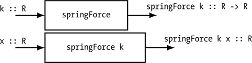

*图 6-1：* 高阶函数`springForce`接受一个数字作为输入，并返回函数`springForce k`作为输出。函数`springForce k`然后接受一个数字作为输入并返回一个数字作为输出。

高阶函数为我们提供了一种方便的方式来定义一个函数，它除了“实际”输入（如位移）外，还接受一个或多个参数（如弹簧常数）作为输入。表 6-1 展示了 Prelude 中一些返回函数作为输出的高阶函数。

**表 6-1：** Prelude 中一些返回函数作为输出的高阶函数

| **函数** |  | **类型** |
| --- | --- | --- |
| `take` | `::` | `Int -> [a] -> [a]` |
| `drop` | `::` | `Int -> [a] -> [a]` |
| `replicate` | `::` | `Int -> a -> [a]` |

考虑高阶函数`take`。`take`函数通过从给定列表中取出指定数量的元素来生成一个新列表。表 6-2 展示了它的一些使用示例。

**表 6-2：** `take` 使用示例

| **表达式** |  | **求值结果** |
| --- | --- | --- |
| `take 3 [9,7,5,3,17]` | ⇝ | `[9,7,5]` |
| `take 3 [3,2]` | ⇝ | `[3,2]` |
| `take 4 [1..]` | ⇝ | `[1,2,3,4]` |
| `take 4 [-10.0,-9.5..10]` | ⇝ | `[-10.0,-9.5,-9.0,-8.5]` |

让我们来看一下`take`的类型：

```
*Main> :t take
take :: Int -> [a] -> [a]
```

根据`take`的类型，当传入一个`Int`时，它应该返回一个类型为`[a] -> [a]`的函数。那么`take`应该返回什么样的函数呢？如果我们将整数*n*传给`take`，返回的函数将接受一个列表作为输入，并返回输入列表的前*n*个元素。

有两种方式来理解高阶函数`take`（以及其他类似的返回函数作为输出的函数），如表 6-3 所示。

**表 6-3：** 理解高阶函数`take`的两种思维方式

| **思考方式** | **传给 `take` 的输入** | **`take` 的输出** |
| --- | --- | --- |
| 单输入思维 | `Int` | `[a] -> [a]` |
| 双输入思维 | `Int 和 [a]` | `[a]` |

我们已经通过`springForce`描述了“单输入思维”，即将`take`的类型签名理解为期望一个`Int`作为输入，并产生一个`[a] -> [a]`（可以读作“a 类型的列表到 a 类型的列表”）作为输出。图 6-2 展示了`take`的单输入图。

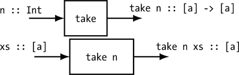

*图 6-2：* 以单个输入的方式理解高阶函数 `take`

另一种理解类型签名`Int -> [a] -> [a]`的方法是，函数期望接收两个输入，第一个是类型为`Int`，第二个是类型为`[a]`，并返回一个类型为`[a]`的输出。图 6-3 展示了`take`的两个输入图。

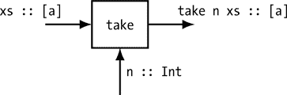

*图 6-3：* 以两个输入的方式理解高阶函数 `take`

作为高阶函数的读者和编写者，我们可以选择不同的方式来理解它们。有时，将高阶函数理解为接受多个输入会很方便，但同样，考虑每个函数（包括高阶函数）只接受一个输入也是非常有用的。Haskell 编译器将每个函数视为具有一个输入。

像`take`一样，`drop`这个高阶函数是操作列表的另一种常用工具。`drop`函数通过丢弃给定列表中的若干个元素来生成一个新的列表。表 6-4 展示了它的一些使用示例。

**表 6-4：** `drop`函数使用示例

| **表达式** |  | **计算结果** |
| --- | --- | --- |
| `drop 3 [9,7,5,10,17]` | ⇝ | `[10,17]` |
| `drop 3 [4,2]` | ⇝ | `[]` |
| `drop 37 [-10.0,-9.5..10]` | ⇝ | `[8.5,9.0,9.5,10.0]` |

`replicate`函数通过重复某一项若干次来生成一个列表。表 6-5 展示了它的一些使用示例。

**表 6-5：** `replicate`函数使用示例

| **表达式** |  | **计算结果** |
| --- | --- | --- |
| `replicate 2 False` | ⇝ | `[False,False]` |
| `replicate 3 "ho"` | ⇝ | `["ho","ho","ho"]` |
| `replicate 4 5` | ⇝ | `[5,5,5,5]` |
| `replicate 3 'x'` | ⇝ | `"xxx"` |

在本节中，我们关注的是返回函数作为输出的高阶函数。接下来，我们将介绍一个接受函数作为输入的高阶函数。

### 对列表应用函数

表 6-6 展示了一些接受其他函数作为输入的高阶 Prelude 函数。

**表 6-6：** 一些接受函数作为输入的 Prelude 高阶函数

| **函数** |  | **类型** |
| --- | --- | --- |
| `map` | `::` | `(a -> b) -> [a] -> [b]` |
| `iterate` | `::` | `(a -> a) -> a -> [a]` |
| `flip` | `::` | `(a -> b -> c) -> b -> a -> c` |

Prelude 中的`map`函数是一个很好的高阶函数示例，它接受另一个函数作为输入。`map`函数会将你提供的函数应用于你提供的列表中的每个元素。表 6-7 展示了`map`的一些使用示例。

**表 6-7：** `map`函数使用示例

| **表达式** |  | **计算结果** |
| --- | --- | --- |
| `map sqrt [1,4,9]` | ⇝ | `[1.0,2.0,3.0]` |
| `map length ["Four","score","and"]` | ⇝ | `[4,5,3]` |
| `map (logBase 2) [1,64,1024]` | ⇝ | `[0.0,6.0,10.0]` |
| `map reverse ["Four","score"]` | ⇝ | `["ruoF","erocs"]` |

在表 6-7 中列出的第一个示例中，我们说函数 `sqrt` 被“映射”到列表上，这意味着它会应用于列表中的每个元素。

请注意，函数类型 `a -> b` 在 `map` 的类型签名中的括号是至关重要的。类型 `a -> b -> [a] -> [b]`（其中没有括号）是完全不同的类型。这个类型将输入一个类型为 `a` 的值，一个类型为 `b` 的值，以及一个类型为 `[a]` 的列表，输出一个类型为 `[b]` 的列表。后者类型是 `a -> (b -> ([a] -> [b]))` 的简写，因为箭头是从右向左关联的。

列表推导可以完成 `map` 的工作。选择 `map` 还是列表推导，取决于个人风格。

```
*Main> map sqrt [1,4,9]
[1.0,2.0,3.0]
*Main> [sqrt x | x <- [1,4,9]]
[1.0,2.0,3.0]
```

将函数映射到结构上的概念实际上不仅限于列表结构，还可以扩展到树等其他结构。Haskell 有一个 `fmap` 函数可以实现这一点，尽管在本书中我们不会使用它。

### 迭代与递归

迭代是任何编程语言中的一个基本特性。能够反复执行某些操作是计算机强大功能的主要来源之一。那么人们如何在编程语言中表达迭代的概念呢？

命令式编程语言提供了编写*循环*的方式，循环指令用于反复执行某些操作，循环的次数可以是固定的，也可以是直到满足某个条件为止。

函数式编程语言有不同的方式来表达迭代。函数式程序员最常用的迭代方法是编写*递归函数*，即调用自身的函数。递归函数非常强大，但对于初次接触递归函数的人来说，理解如何编写递归函数需要一些时间和精力。

Haskell Prelude 中有许多内建的递归函数，我们可以直接使用，而无需显式编写自己的递归函数。在本书中，我们将避免编写*显式的*递归函数，意味着你可以从函数定义中看出该函数会调用自身。我们将使用 Prelude 中的内建递归函数编写函数，这些我们编写的函数可以被称为递归的，因为它们的行为是递归的，即在底层某个地方会调用自身。然而，我们编写的函数不是*显式的*递归函数，因为它们不会直接调用自身。

我们可以通过示例来理解和解释 Prelude 中大多数递归函数的行为，而无需了解它们是如何通过递归的力量实现这一行为的。递归确实非常有趣，如果你有时间，我鼓励你深入了解。我从《The Little Schemer》一书中学到了递归，推荐这本使用 Scheme 语言的书。**[4**]。书籍《Learn You a Haskell for Great Good!》**[1**]在第四章中讨论了递归，展示了如何编写像 `take`、`reverse`、`replicate` 和 `repeat` 这样的 Prelude 函数。

我们如何在 Haskell 中实现迭代，而不写显式的递归函数呢？我们将使用 Prelude 函数`iterate`。我们不会以命令式的方式思考我们希望计算机*做*什么，而是以函数式的方式思考我们希望*拥有*什么，并安排这些内容以列表的形式出现。在这里，我们可以使用“列表代替循环”作为函数式编程的口号。

Prelude 函数`iterate`，其类型在表 6-6 中给出，是一个高阶函数，接受一个函数作为输入。迭代和`iterate`函数在我们解决第二部分中的牛顿第二定律时非常重要。函数`iterate`生成一个无限列表，如下所示：如果 `f :: a -> a` 且 `x :: a`（读作 "`f` 的类型是 `a` 到 `a`" 和 "`x` 的类型是 `a`"），那么`iterate f x` 会生成这个无限列表：

```
[x, f x, f (f x), f (f (f x)), ...]
```

换句话说，结果是一个列表，其中 `f` 被应用零次、一次、两次、三次，依此类推。表 6-8 展示了 `iterate` 的一些使用示例。

**表 6-8：** 使用 iterate 的示例

| **表达式** |  | **计算结果** |
| --- | --- | --- |
| `iterate (\n -> 2*n) 1` | ⇝ | `[1,2,4,8,...]` |
| `iterate (\n -> n*n) 1` | ⇝ | `[1,1,1,1,...]` |
| `iterate (\n -> n*n) 2` | ⇝ | `[2,4,16,256,...]` |
| `iterate (\v -> v - 9.8*0.1) 4` | ⇝ | `[4.0,3.02,2.04,1.06,...]` |

图 6-4 展示了 iterate f 如何将函数 f 应用到它的输入零次、一次、两次，依此类推，并将结果收集在一个列表中。

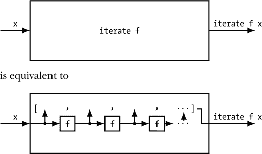

*图 6-4：函数 iterate f 将函数 f 应用到输入的零次、一次、两次、三次及更多次，并将结果收集在一个无限列表中。*

### 匿名高阶函数

在第二章中，我们讨论了匿名函数，作为描述一个没有名字的函数的方式。我们也可以对高阶函数做同样的事情，不给它们命名，而是直接描述它们。

让我们回到之前讨论的函数 `springForce`。我们如何在不命名它的情况下编写 `springForce` 呢？实际上，有两种方式可以将此函数编写为匿名函数，对应我们在《如何思考带有参数的函数》中描述的单输入思维和双输入思维。在单输入思维中，我们把 `springForce` 的输入看作一个数字（`R`），输出则是一个函数 `R -> R`。单输入思维的匿名函数在表 6-9 的第一行中显示。从该函数的形式来看，它返回的是一个函数，即 `\x -> -k*x`。

**表 6-9：** 以匿名函数形式编写 springForce 函数的两种方式

| **思考方式** | **匿名函数** |
| --- | --- |
| 单输入思维 | `\k -> \x -> -k*x` |
| 双输入思维 | `\k x -> -k*x` |

在双输入思维中，我们将 `springForce` 的输入视为弹簧常数 `R` 和第二个 `R` 作为位置，输出则是一个简单的 `R`。双输入思维的匿名函数在表 6-9 的第二行中显示。该匿名函数的形式表明它返回的是一个数字。无论哪种形式都是完全合法的，事实上，这两种形式描述的是相同的函数。

### 运算符作为高阶函数

在第一章中，我们介绍了表 1-2 中的几个中缀运算符。任何中缀运算符都可以通过将其用括号包围转化为高阶函数。表 6-10 展示了如何将中缀运算符写成高阶函数的例子。

**表 6-10：** 通过括号包围将中缀运算符转化为前缀函数

| **中缀表达式** | **等效前缀表达式** |
| --- | --- |
| `f . g` | `(.) f g` |
| `'A':"moral"` | `(:) 'A' "moral"` |
| `[3,9] ++ [6,7]` | `(++) [3,9] [6,7]` |
| `True && False` | `(&&) True False` |
| `log . sqrt $ 10` | `($) (log . sqrt) 10` |

表 6-11 展示了通过运算符得到的某些高阶函数类型。如果你想查询一个运算符的类型，必须在使用 GHCi 的 `:t` 命令时，将运算符用括号括起来。

**表 6-11：** 将中缀运算符视为高阶函数

| **函数** |  | **类型** |
| --- | --- | --- |
| `(.)` | `::` | `(b -> c) -> (a -> b) -> a -> c` |
| `(:)` | `::` | `a -> [a] -> [a]` |
| `(++)` | `::` | `[a] -> [a] -> [a]` |
| `(&&)` | `::` | `Bool -> Bool -> Bool` |
| `(&#124;&#124;)` | `::` | `Bool -> Bool -> Bool` |
| `($)` | `::` | `(a -> b) -> a -> b` |

在第五章中，我们讨论了尝试连接不同类型的列表时发生的类型错误。现在，我们已经知道了`(++)`的类型，更容易一般性地理解类型错误。类型错误来自于尝试将一个期望特定类型输入的函数应用于一个实际上具有不同类型的表达式。当我们将连接函数`(++)`应用于表达式`physicists`时，

```
physicists :: [String]
physicists = ["Einstein","Newton","Maxwell"]
```

我们得到一个函数`(++) physicists`，其类型是`[String] -> [String]`：

```
*Main> :t (++)
(++) :: [a] -> [a] -> [a]
*Main> :t physicists

physicists :: [String]
*Main> :t (++) physicists
(++) physicists :: [String] -> [String]
```

连接函数接受任何类型`a`的列表。当给定一个字符串列表时，具体类型`String`会替代所有出现的类型变量`a`，使得函数`(++) physicists`的类型变为`[String] -> [String]`。这个函数`(++) physicists`期望的输入类型是`[String]`，因此如果我们给它一个不同类型的输入，就会得到类型错误。

```
velocities :: [R]
velocities = [0,-9.8,-19.6,-29.4]
```

在 GHCi 中，我们得到：

```
*Main> :t (++) physicists velocities

<interactive>:1:17: error:
    • Couldn't match type Double with [Char]
      Expected type: [String]
        Actual type: [R]
    • In the second argument of (++), namely velocities
      In the expression: (++) physicists velocities
```

“预期类型”`[String]`是函数`(++) physicists`期望的输入类型，而“实际类型”`[R]`是列表`velocities`的类型。

一类被称为*组合子*的函数和运算符，可以被视为标准连接器，它们可以使得使用高阶函数变得更容易。我们接下来将讨论这些。

### 组合子

组合子，从广义上讲，是将事物组合起来的函数。它们通常是具有非常广泛适用性的函数，且它们的类型通过充满类型变量来展示这一点。它们往往不特定于数字、列表、布尔值或任何特定的基本类型。它们是标准的连接组件，使得处理和连接高阶函数变得更容易。表 6-12 列出了一些被认为是组合子的 Haskell 函数。

**表 6-12：** 一些被认为是组合子的 Haskell 函数

| **函数** |  | **类型** |
| --- | --- | --- |
| `id` | `::` | `a -> a` |
| `const` | `::` | `a -> b -> a` |
| `flip` | `::` | `(a -> b -> c) -> b -> a -> c` |
| `(.)` | `::` | `(b -> c) -> (a -> b) -> a -> c` |
| `($)` | `::` | `(a -> b) -> a -> b` |

身份函数`id`乍一看似乎是一个无意义的函数，因为当我将其应用于某个值时，我得到的还是那个值。那么，身份函数有什么用呢？身份函数的意义，就像我们在第二章中研究的匿名函数一样，体现在它作为高阶函数的输入。在第二十二章中，我们将编写一个高阶函数来展示向量场。该函数的一个输入将是一个接受一个数字并返回另一个数字的缩放函数。最简单的缩放可以通过使用身份函数实现，它不改变任何输入。高阶函数要求提供*某种*缩放函数，当不需要缩放时，可以提供身份函数`id`。

`const`组合子将一个值转化为一个常量函数，该函数返回该值。例如，`const 3`是一个无论输入是什么都会返回`3`的函数。所以，`const 3 7`的结果是`3`，`const 3 5`的结果是`3`，`const 3 "Hi"`的结果也是`3`。在第十四章中，我们将编写一个函数来解决力学问题，该函数接受一个力的列表作为输入。力是依赖于速度等输入的函数，因此，如果我们想指定一个常量力，可以使用`const`组合子。在第二十三章中，我们将编写半球体和球体等表面。我们的表面将通过两个参数来指定，这些参数的取值范围可以是函数，因此我们可以写出例如一个三角形表面。如果我们想要一个常量函数，再次可以使用`const`。

`flip`组合子接受一个高阶函数，并交换其输入的位置。它通常与点自由风格一起使用。例如，指数函数`(**)`接受两个输入：底数和指数。如果我们提供第一个输入而不提供第二个输入，如`(**) 2`，我们得到“二的幂”函数。假设我们想要一个将输入值立方的函数，我们需要将`(**)`的第二个输入固定为`3`，同时将第一个输入留空，作为立方函数的输入。我们可以用匿名函数` \x -> x ** 3`来实现这一点，也可以使用`flip`，如`flip (**) 3`。这两种方式都是立方函数的表达式。

组合子`composition`已在表 1-2 中列出，并在第二章中讨论过。我们将在第十六章中使用它来通过一系列函数传递信息来解决力学问题。最终的解决方案是将这些函数按顺序组合起来的结果。

函数应用组合子已在表 1-2 中列出，并在第一章中讨论过。它看起来是一个无用的操作符，直到我们意识到它的优先级允许它像括号一样作用。

下一节讨论了一类用于分类数据的高阶函数。

### 基于谓词的高阶函数

*谓词*是一个类型为`a -> Bool`的函数，其中`a`是任何有效的 Haskell 类型。（例如，`a`可以是像`Int`或`R -> R`这样的具体类型，也可以是像`a`这样的类型变量，或者是包含类型变量的类型，如`[a]`，甚至是`a -> [b]`。）谓词表达了类型`a`的元素可能具有或不具有的某个属性。例如，整数大于或等于 7 的属性就是一个谓词。我们可以在 Haskell 中定义这样的谓词。

```
greaterThanOrEq7 :: Int -> Bool
greaterThanOrEq7 n = if n >= 7 then True else False
```

表 6-13 展示了几个将谓词作为第一个参数的高阶函数。

**表 6-13：** 一些基于谓词的高阶函数来自 Prelude

| **函数** |  | **类型** |
| --- | --- | --- |
| `filter` | `::` | `(a -> Bool) -> [a] -> [a]` |
| `takeWhile` | `::` | `(a -> Bool) -> [a] -> [a]` |
| `dropWhile` | `::` | `(a -> Bool) -> [a] -> [a]` |

让我们来看看这些函数的使用。假设我们定义了以下的“小于 10”谓词：

```
lt10 :: Int -> Bool
lt10 n = n < 10
```

表 6-14 显示了如何使用表 6-13 中的高阶函数的示例。

**表 6-14：** 一些基于谓词的高阶函数的使用示例

| **表达式** |  | **计算结果** |
| --- | --- | --- |
| `filter lt10 [6,4,8,13,7]` | ⇝ | `[6,4,8,7]` |
| `takeWhile lt10 [6,4,8,13,7]` | ⇝ | `[6,4,8]` |
| `dropWhile lt10 [6,4,8,13,7]` | ⇝ | `[13,7]` |
| `any lt10 [6,4,8,13,7]` | ⇝ | `True` |
| `all lt10 [6,4,8,13,7]` | ⇝ | `False` |

让我们逐一讲解表格中的函数。`filter` 函数返回列表中所有满足谓词的元素，无论它们在列表中的位置如何。`takeWhile` 函数返回满足谓词的元素，*直到*它找到一个不满足谓词的元素为止，并返回满足谓词的元素的初始列表。在输入列表中，第一次遇到不满足谓词的元素之后的元素将不会被考虑在结果列表中。`dropWhile` 函数返回一个列表，该列表从输入列表中的第一个不满足谓词的元素开始，并包含从该点起的每个元素，无论它是否满足谓词。`any` 函数如果输入列表中有一个或多个元素满足谓词，则返回 `True`，否则返回 `False`。`all` 函数如果输入列表中的所有元素都满足谓词，则返回 `True`，否则返回 `False`。

列表推导也可以完成 `filter` 的工作。

```
*Main> filter lt10 [6,4,8,13,7]
[6,4,8,7]
*Main>  [x | x <- [6,4,8,13,7], x < 10]
[6,4,8,7]
```

要使用列表推导来过滤列表，可以在列表推导的右侧的逗号后面包含一个布尔表达式（例如上面的 `x < 10`）。这样的表达式被称为 *guard*（保护条件）。只有满足该布尔保护条件的项才会被包括在结果列表中。

### 数值积分

加速度是速度变化的速率。如果我们知道速度如何依赖于时间，我们可以使用导数来求得加速度，就像我们在第四章中做的那样。那么反过来怎么办呢？如果我们知道加速度如何依赖于时间，并且我们想知道速度，应该怎么做呢？这正是微积分中积分的目的。积分是求导的逆操作；这个命题是微积分基本定理的内容。

#### 引入积分器

如果 *a*(*t*) 是物体在时间 *t* 时的加速度，物体的速度 *v*(*t*) 可以通过积分来求得：

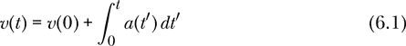

其中 *v*(0) 是物体在时间 0 时的速度。

如果我们正在进行积分，并且积分变量是时间，我们可以想象一个设备，它以时间*t*的加速度值为输入，输出时间*t*的速度值。我们可以将这样的设备称为*积分器*，并可以像在图 6-5 中所示那样进行想象。

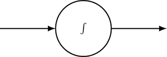

*图 6-5：积分器是连续的且有状态的。右侧持续变化的输出依赖于左侧持续变化的输入以及某些存储的状态。*

积分器的输入描述了输出变化的速率。例如，输入可以是水龙头向水箱中流入的水流量（以加仑/分钟为单位）。输出是水箱中的水量（以加仑为单位）。或者，输入可以是流入电容器的电流，输出则是电容器板上的电荷。流入电容器的电流描述了电荷在电容器板上积累的速率。表 6-15 展示了通过积分关联的物理量。

**表 6-15：** 通过积分关联的物理量

| **积分器的输入** | **积分器的输出** |
| --- | --- |
| 加速度 | 速度 |
| 速度 | 位置 |
| 流量 | 体积 |
| 电容器电流 | 电容器电荷 |

积分器是连续的和有状态的。这里的*连续*是指输入始终存在，输出持续变化。*有状态*意味着积分器必须保持一些内部信息；也就是说，输出不是输入的纯函数。为了让积分器根据流量输出水箱中的水量，它需要保持一个水量的数值，并且这个数值会根据流量不断更新。类似地，为了让积分器根据电流输出电容器的电荷量，它需要保持一个电荷值，并且这个值会根据输入电流不断更新。

#### 数字积分

我们希望能够教 Haskell 进行积分。不幸的是，虽然自然界提供了许多适合做积分器的好例子，但数字计算却没有。积分器是一个模拟的连续设备。为了建模积分器，我们将从连续转为离散，并在小于我们问题中任何时间尺度的时间步长下进行工作。

图 6-6 展示了我们如何建模一个积分器。

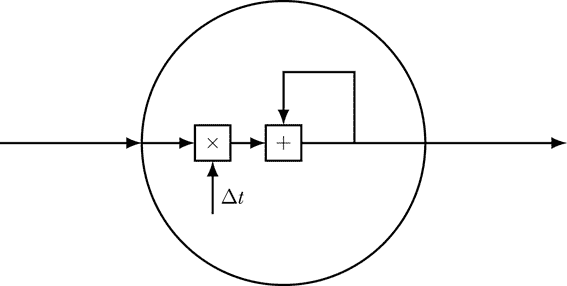

*图 6-6：离散且有状态的积分器模型*

该模型旨在以离散方式使用。在由Δ*t*隔开的时间瞬间，我们对输入进行采样，将其乘以Δ*t*，然后将结果加到当前输出值中以生成新的输出。如果Δ*t*相对于输入变化的时间尺度非常小，这个离散模型将能够很好地模拟连续积分器。

图 6-6 中的模型构成了数值积分方法的基础。为了积分一个函数，选择一个小的时间步长Δ*t*，在离散时间点上采样函数的值，将每个函数输出乘以Δ*t*，然后将结果求和。

如果我们展开图 6-6 中的有状态积分器，就会得到图 6-7 中的无状态积分器，如图所示，这里我们是通过积分加速度来得到速度。

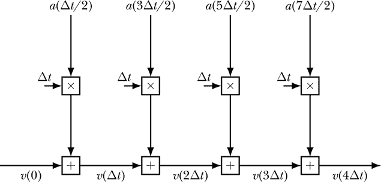

*图 6-7：一个离散且无状态的积分器的功能模型。这个积分器使用中点法则。*

所有的矩形都是纯粹的功能性操作（加法和乘法）；现在，圆形积分器中包含的状态仅存在于纯函数之间的线路中。为了逼近在时间Δ*t*时的速度，我们在时间Δ*t*/2 时采样加速度，将其乘以Δ*t*，然后将结果加到时间 0 时的速度上。时间Δ*t*/2 的采样被称为数值积分的*中点法则*。如果Δ*t*相较于该情境下的重要时间尺度很小，那么我们可以从这种方法中获得一个良好的近似值。图 6-7 展示了加速度函数的四个样本；通常我们会要求计算机做更多的采样。

我们希望能够做的是，给计算机一个函数*f*，给计算机提供上下限*a*和*b*，然后让它计算这个数字：

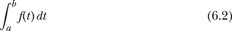

从这个角度来看，`Integration`是一个接受一个函数`R -> R`作为输入，并接受两个上下限，最终输出一个数字的函数。

```
type Integration = (R -> R)  -- function
                 -> R        -- lower limit
                 -> R        -- upper limit
                 -> R        -- result
```

积分通常被认为是求曲线下的面积。数值积分的中点法则在自变量的每个区间的中点处对函数进行采样，如图 6-8 所示。

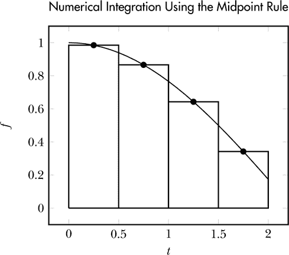

*图 6-8：使用中点法则的数值积分，* Δ*t = 0.5*

这是一个使用中点法则的数值积分器的 Haskell 代码：

```
integral :: R -> Integration
integral dt f a b
    = sum [f t * dt | t <- [a+dt/2, a+3*dt/2 .. b - dt/2]]
```

传递给函数的第一个参数是用于数值积分的步长。我们之前假设自变量是时间，但在数学中它可以是任何东西。`integral`函数的第二个参数是需要积分的函数。注意，我们使用单一标识符（`f`）来命名传递给`integral`的函数。此外，我们不需要定义函数`f`；我们在这里做的是*命名*用户传递给`integral`的函数。

我们使用算术序列来指定采样函数的时间点。我们使用列表推导式返回一个相同大小的列表，包含函数返回值与步长的乘积。这些乘积就是图 6-8 中矩形的面积。剩下的就是使用`sum`函数将这些面积加起来。

让我们来测试一下我们的积分函数。

```
*Main> integral 0.01 (\x -> x**2) 0 1
0.33332499999999987
```

在这里，我们使用匿名函数来指定一个将输入平方的函数，因为它比写一个函数定义来命名该函数更方便。在第二章中，我们提到过匿名函数将在作为高阶函数的输入时非常有用，现在我们看到一个实例。这个定积分的确切值是 1/3，如此处所示：

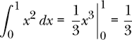

#### 实现反导数

类型同义词`Integration`对应于定积分的概念，其中有一个函数和两个极限，并且期望得到一个数字作为输出，正如在表达式 6.2 中所示。然而，还有第二种思考积分的方式，即将一个函数积分得到另一个函数。例如，在方程 6.1 中，我们将加速度函数积分得到速度函数。

在微积分中，通常会区分定积分和不定积分，或者称为*反导数*。反导数想要成为导数的反函数，但这里有一个问题，因为像`sin`和`\x -> sin x + 7`这样的函数具有相同的导数，即`cos`。因此，导数作为从函数到函数的高阶函数，并没有一个明确的反函数。一个函数*f*的反导数是任何一个其导数为*f*的函数*F*。换句话说，当*DF* = *f*时，*F*是*f*的反导数。如果*F*是*f*的反导数，我们写作

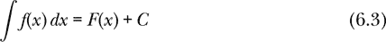

使用没有限制的积分符号和积分常数*C*。例如，我们写作

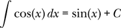

其中，*C*是一个未确定的积分常数。定积分与不定积分之间存在关系。微积分的基本定理声称，如果*F*是*f*的任何一个反导数，那么

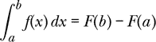

通过重命名变量和重新排列项，我们得到一个表达式，使我们能够将积分常数与*F*的初始值相关联。

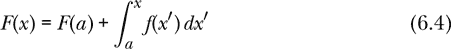

对于任何实数*a*，反导数*F*是一个函数，其值*F*(*x*)在*x*处是它在*a*处的“初始”值*F*(*a*)和*f*从*a*到*x*的定积分之和。如果我们将方程 6.3 中的不定积分*∫ f* (*x*)*dx*与方程 6.4 中的定积分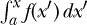关联起来，我们可以将方程 6.4 中的初始值*F*(*a*)与–*C*相关联，其中*C*是方程 6.3 中的积分常数。从这个意义上讲，积分常数与初始值是相关的。

一个典型的函数有很多可以作为其反导数的函数。我们如何选择其中一个特定的函数呢？有两种方法：我们可以指定一个下限，或者指定一个初始值。指定下限对应于我们之前探索的定积分`Integration`，指定初始值则导致我们下面要探讨的`AntiDerivative`。

我们称反导数为一个函数，它接受一个初始值（例如方程式 6.1 中的*v*(0)）和一个函数（例如*a*），并返回一个函数（例如*v*）。

```
type AntiDerivative =   R        -- initial value
                    -> (R -> R)  -- function
                    -> (R -> R)  -- antiderivative of function
```

反导数的概念与积分的概念密切相关。我们可以通过我们已经定义的`integral`来定义一个`antiDerivative`函数。

```
antiDerivative :: R -> AntiDerivative
antiDerivative dt v0 a t = v0 + integral dt a 0 t
```

第四章展示了如何将方程式 4.5 和 4.12 实现为`velFromPos`和`accFromVel`函数。现在让我们在 Haskell 中实现方程式 6.1。

```
velFromAcc :: R                       -- dt
           -> Velocity                -- initial velocity
           -> (Time -> Acceleration)  -- acceleration function
           -> (Time -> Velocity)      -- velocity function
velFromAcc dt v0 a t = antiDerivative dt v0 a t
```

我们看到，从加速度函数中求得速度函数其实就是反导数。

从速度函数中求得位置函数怎么样？

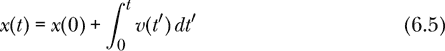

在 Haskell 中，这样表示：

```
posFromVel :: R                   -- dt
           -> Position            -- initial position
           -> (Time -> Velocity)  -- velocity function
           -> (Time -> Position)  -- position function
posFromVel = antiDerivative
```

仍然是反导数。这里我们使用无点风格来展示另一种编写函数的方式，并强调这两个函数的等价性。之前的`velFromAcc`和`posFromVel`函数是相同的，每一个都等同于`antiDerivative`。它们都从 0 到*t*对给定函数进行积分，并加上初始值。

类型同义词表明时间、速度和加速度都被视为数字。

```
type Time         = R
type Position     = R
type Velocity     = R
type Acceleration = R
```

也许你宁愿为你的数值积分器提供从下限到上限的步数，而不是步长。这并不难实现。

```
integralN :: Int -> Integration
integralN n f a b
    = let dt = (b - a) / fromIntegral n
      in integral dt f a b
```

`let`关键字引入了局部变量和/或函数，这些变量和函数可以在`in`关键字之后的主体中使用。变量`dt`是一个局部变量，在函数`integralN`内部定义。这个`dt`在`integralN`的定义外部不可见。我们在函数外部使用的任何`dt`都有一个独立的意义，和这个函数内部的`dt`不同。局部变量尤其在它们在定义的其余部分中使用多次时非常有用。在这种情况下，我们只使用一次`dt`，因此我们本可以直接在最后一行插入`dt`的定义。

```
integralN' :: Int -> Integration
integralN' n f a b
    = integral ((b - a) / fromIntegral n) f a b
```

使用局部变量`dt`节省了一组括号，并且使代码更易于阅读，因为`dt`这个名字在我们看来是有意义的，表示步长。每当你能想到有意义的名字时，我鼓励你使用`let`定义局部变量。这将有助于代码的读者，包括编写者。

除法运算符（`/`）只能在相同类型的数字之间使用。由于`b - a`的类型是`R`而`n`的类型是`Int`，我们不能直接进行除法运算。解决方法是将`n`转换为`R`类型，`fromIntegral`可以完成这个转换。

### 总结

高阶函数接受另一个函数作为输入和/或产生一个函数作为输出。产生函数作为输出的高阶函数可以看作是接受多个输入的函数。数值积分是一个典型的高阶函数示例，它接受一个函数作为输入。用于编写匿名函数的λ符号也可以用于高阶函数。将一个函数映射到一个列表上是一个高阶函数的例子，它接受另一个函数作为输入，并且类似于列表推导。我们可以通过将二元中缀操作符括起来，来将其转化为高阶函数。Haskell 通过高阶函数`iterate`实现迭代，该函数接受一个函数和一个起始值，并重复应用该函数来生成一个无限列表。一些高阶函数，如`filter`，接受一个谓词作为输入。我们也可以通过列表推导来实现过滤功能。在下一章中，我们将介绍一个允许我们绘制函数的库。

### 习题

**习题 6.1.** 让我们回到投掷石块向上的例子。也许我们不希望以 30 米每秒的速度向上投掷，而是希望能够根据我们选择的初速度投掷。编写一个函数

```
yRock :: R -> R -> R
```

它接受一个初速度作为输入，并返回一个以时间为输入、高度为输出的函数。同时，编写一个函数

```
vRock :: R -> R -> R
```

它接受一个初速度作为输入，并返回一个以时间为输入、速度为输出的函数。

**习题 6.2.** 给出`take 4`的类型。

**习题 6.3.** 函数`map`的类型是`(a -> b) -> [a] -> [b]`。这意味着`map`期望第一个参数是类型为`a -> b`的函数。函数`not`的类型是`Bool -> Bool`。`not`能作为`map`的第一个参数吗？如果可以，`map not`的类型是什么？请展示如何从`map`和`not`的类型出发，推导出`map not`的类型。

**习题 6.4.** 编写一个函数

```
greaterThanOrEq7' :: Int -> Bool
greaterThanOrEq7' n = undefined
```

它完成与`greaterThanOrEq7`相同的功能，但不使用`if-then-else`结构。（提示：查看函数`lt10`。）

**习题 6.5.** 编写一个类型为`Int -> String -> Bool`的函数，并用文字描述它的功能。

**习题 6.6.** 编写一个谓词表达式，用于表示“元素超过六个”的属性，该谓词接受一个列表作为输入。请在谓词定义中包含类型签名。

**习题 6.7.** 表 6-5 展示了`replicate`函数的使用示例。在前三个示例中，创建了一个具有请求长度的请求项的列表。在最后一个示例中，创建了一个字符串。这似乎有所不同。解释这里发生了什么。

**习题 6.8.** 创建一个包含前 1,000 个平方数的列表。不要打印列表，只打印你的定义。你可以先打印前 10 个平方数来检查你的方法是否有效。

**练习 6.9.** 使用`iterate`定义一个函数`repeat'`，它与 Prelude 中的`repeat`函数执行相同的操作。

**练习 6.10.** 使用`take`和`repeat`定义一个函数`replicate'`，它与 Prelude 中的`replicate`函数执行相同的操作。

**练习 6.11.** 一辆汽车从静止开始，在一条平坦的高速公路上以 5 m/s² 的加速度加速。使用`iterate`生成一个包含该车每秒速度的无限列表。（该列表应类似于[0,5,10,15,...]。使用`take`函数查看无限列表中的前几个元素。）

**练习 6.12.** 列表推导式可以作为`map`函数的替代。为了证明这一点，编写一个函数。

```
  map' :: (a -> b) -> [a] -> [b]
```

它的功能与`map`相同。使用列表推导式编写你的定义。

**练习 6.13.** 列表推导式可以作为`filter`函数的替代。为了证明这一点，编写一个函数。

```
  filter' :: (a -> Bool) -> [a] -> [a]
```

它的功能与`filter`相同。使用列表推导式编写你的定义。

**练习 6.14.** 编写一个函数。

```
average :: [R] -> R
average xs = undefined
```

计算一个数字列表的平均值。你可以假设列表至少包含一个数字。你可能需要使用`fromIntegral`函数。

**练习 6.15.** 生成一输入和二输入的图形，类似于图 6-2 和 6-3，用于高阶函数`drop`。对高阶函数`replicate`做同样的操作。

**练习 6.16.** 作为数值积分的中点法的替代规则，梯形规则也可以使用。在梯形规则中，我们通过一系列梯形的面积之和来近似曲线下的面积，如图 6-9 所示。

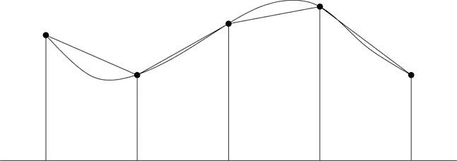

*图 6-9：梯形规则*

对于例子，参见图 6-9，第一个梯形的面积是：

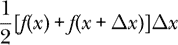

图中所有四个梯形的面积之和是：

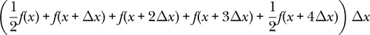

为函数编写定义。

```
trapIntegrate :: Int       -- # of trapezoids n
              -> (R -> R)  -- function f
              -> R         -- lower limit a
              -> R         -- upper limit b
              -> R         -- result
trapIntegrate n f a b = undefined
```

它接受若干个梯形数、一个函数和两个限制作为参数，并返回（近似）定积分的值，使用梯形规则。测试你的积分器在以下积分上的表现，并查看它能接近正确值多少：

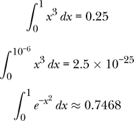
