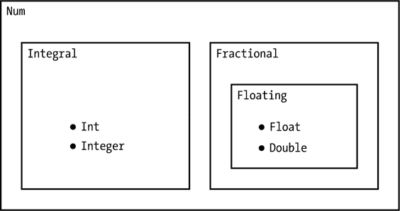

# 第八章：类型类


我们见过具有具体类型的函数，例如`not`，它接受一个`Bool`类型作为输入，并返回一个`Bool`类型作为输出。我们也见过使用类型变量来表示它们可以处理所有类型的函数，例如`head`，它接受任何类型的列表并返回第一个元素。使用类型变量表示了所有类型之间的共性。

在处理单一类型的函数和处理所有类型的函数之间，我们需要表达一个更有限的类型间共性，这种共性并不适用于所有类型。例如，我们希望加法操作适用于像`Int`、`Integer`和`Double`这样的数值类型，而无需为*所有*类型定义加法。术语*参数多态性*用于表示所有类型之间的共性。之前提到的`head`函数就是对输入列表的基础类型进行参数多态性的。术语*临时多态性*则用于表示更有限的共性。类型类是 Haskell 提供的处理临时多态性的机制。它们表达的是类型之间的共性，而这种共性并不适用于所有类型。

在本章中，我们将介绍类型类的概念，并介绍 Prelude 中一些常见的类型类。我们将描述哪些基本类型是这些类型类的成员，以及为什么这样设计。Haskell 中有三个不同的指数运算符的解释也基于类型类。*Section*是基于一个运算符和它的一个参数构造的函数，许多 section 的类型涉及类型类。虽然类型类提供了一种表达共性的好方法，但它们也允许编译器在需要时无法确定值的具体类型，我们将给出一个示例，说明代码编写者必须提供额外的类型信息给编译器。

### 类型类与数字

让我们首先在 GHCi 中询问数字`4`的类型。

```
Prelude> :t 4
4 :: Num p => p
```

期望数字`4`的类型是`Int`或`Integer`是完全合理的。但 Haskell 语言的设计者希望像`4`这样的数字能够根据程序员的需要，既可以是`Int`，也可以是`Integer`，`Double`，甚至其他一些类型。正因如此（以及其他更有说服力的原因），他们发明了类型类的概念。

类型类就像一个俱乐部，类型可以加入该俱乐部，这样类型就可以使用该俱乐部中的某些函数。`Int`、`Integer`和`Double`这些类型都属于类型类`Num`（数字类型的缩写）。这些类型都可以使用加法、减法和乘法操作，因为这些函数是由`Num`类型类提供的。当一个类型属于某个类型类时，我们称它是该类型类的*实例*。

类型签名 `4 :: Num p => p` 可以理解为 “`4` 的类型是 `p`，前提是 `p` 属于类型类 `Num`。” 字母 `p` 是这个类型签名中的类型变量，代表任何类型。双箭头 (`=>`) 左边的条件是 *类型类约束*。在上面的类型签名中，存在一个类型类约束 `Num p`，它表示 `p` 必须属于类型类 `Num`。

类型类是一种表示类型之间共性的方式。类型 `Int`、`Integer`、`Float` 和 `Double` 之间有很多相似之处；也就是说，我们希望对它们执行相同类型的操作。我们希望能够对这些类型的数字进行加、减、乘等操作。通过让类型类 `Num` 负责加法、减法和乘法，我们允许与 `Int` 类型配合使用的加法运算符同样适用于 `Double` 类型。

在类型签名 `4 :: Num p => p` 中，GHCi 尚未为数字 4 确定具体类型。但这种对 4 类型的非承诺态度不能永远持续下去。最终，Haskell 编译器将要求每个值都具有具体类型。编译器无法为值分配具体类型可能会带来麻烦。然而，GHCi 有一些类型默认规则可以让我们的生活更轻松。例如，如果你输入以下这一行

```
x = 4
```

将其写入程序文件（如 *typetest.hs*），不给 `x` 添加类型签名，加载到 GHCi 中，然后询问 `x` 的类型，

```
Prelude> :l typetest.hs
[1 of 1] Compiling Main            ( typetest.hs, interpreted )
Ok, one module loaded.
*Main> :t x
x :: Integer
```

GHCi 会告诉你 `x` 的类型是 `Integer`。在这里，GHCi 在没有我们指定类型的情况下，已经为其确定了具体的类型。

还有其他情况，比如在本章末尾的“类型类与绘图示例”中，GHCi 无法分配具体类型，在这种情况下，你需要通过为代码添加类型签名来帮助它。

### Prelude 中的类型类

表 8-1 显示了 Prelude 提供的几个类型类。该表还显示了哪些基本类型是每个类型类的实例。

**表 8-1：** 各种类型类的实例基本类型

| **类型类** | `Bool` | `Char` | `Int` | `Integer` | `Float` | `Double` |
| --- | --- | --- | --- | --- | --- | --- |
| `Eq` | X | X | X | X | X | X |
| `Ord` | X | X | X | X | X | X |
| `Show` | X | X | X | X | X | X |
| `Num` |  |  | X | X | X | X |
| `Integral` |  |  | X | X |  |  |
| `Fractional` |  |  |  |  | X | X |
| `Floating` |  |  |  |  | X | X |

以下部分将讨论 表 8-1 中列出的类型类的用途和使用方法。

#### Eq 类型类

我们希望能够询问计算机两个事物是否相等。这就是 `==`（相等）运算符（首次出现在 表 1-2）的作用。但是，如果我们认真的考虑函数的类型，`(==)` 的类型应该是什么呢？

一个接受两个字符串作为输入并输出一个布尔值（true 或 false），表示这两个字符串是否相等的函数，应该具有类型`String -> String -> Bool`。一个接受两个整数作为输入并输出一个布尔值，表示这两个整数是否相等的函数，应该具有类型`Integer -> Integer -> Bool`。如果我们需要为每种类型（`String`、`Integer`等）分别编写一个函数来检查相等性，那将是一个不幸的局面。也许一个类型变量可以解决这个问题，`(==)`的类型可以是`a -> a -> Bool`。这几乎是正确的，但类型`a -> a -> Bool`暗示每个类型`a`都可以检查相等性，而实际上有些类型是无法检查相等性的（比如函数类型）。

类型类`Eq`用于具有相等概念的类型。换句话说，对于那些相等性检查有意义的类型，将会是`Eq`的实例。这些类型定义了操作符`==`和`/=`。你可以在表格 8-1 中看到，所有六种基本类型（`Bool`、`Char`、`Int`、`Integer`、`Float`和`Double`）都是`Eq`的实例。

函数`(==)`的类型是

```
*Main> :t (==)
(==) :: Eq a => a -> a -> Bool
```

这意味着我们可以在任何两个相同类型`a`的表达式之间使用`==`操作符，只要`a`是`Eq`的实例。哪些类型不会是`Eq`的实例呢？通常，函数类型不是`Eq`的实例。例如，类型`R -> R`不是`Eq`的实例。

这是因为通常很难或不可能检查两个函数是否相等。（有一个严格的数学结果叫做理查森定理，它给出了充分的条件，这些条件相当宽松，说明了在何种情况下函数相等性是不可判定的。）

从计算物理的角度来看，`Float`和`Double`作为`Eq`的实例是一个坏主意。因为这两种类型用于近似计算，你不应该测试`Float`和`Double`是否相等。（这个规则的一个例外是你可能需要在尝试除以它们之前检查`Float`或`Double`是否为零。）从计算机的角度来看，这些类型由有限数量的位表示，计算机会愉快地检查一个`Double`的每一位是否与另一个`Double`对应的位相同。但正如我们在第一章中看到的，`sqrt 5 ^ 2`的位与`5`的位不相同。它们非常接近，但不完全相同。如果你想更深入了解，关于浮点计算的一个很好的介绍是**[5**]。计算物理的关键消息是，避免对近似类型如`Double`使用`==`。浮点数的相等性检查问题并不仅仅是 Haskell 或函数式编程中的问题。任何语言中，近似计算结果都不应进行相等性测试。

#### Show 类型类

`Show` 类型类用于那些可以用文本显示其值的类型。如 表 8-1 中所示，所有基本类型（`Bool`、`Char`、`Int`、`Integer`、`Float` 和 `Double`）都是 `Show` 的实例。

函数类型通常不是 `Show` 的实例。如果我在 GHCi 提示符下输入一个函数的名字，我会得到一条消息，抱怨没有 `Show` 实例来显示 `sqrt`：

```
*Main> sqrt

<interactive>:5:1: error:
    • No instance for (Show (Double -> Double))
        arising from a use of print
        (maybe you haven't applied a function to enough arguments?)
    • In a stmt of an interactive GHCi command: print it
```

GHCi 知道如何将 `sqrt` 函数应用于数字并显示结果，但它不知道如何显示 `sqrt` 函数本身。这背后的原因是设计决策：任何属于 `Show` 类型类的成员也应当是 `Read` 类型类的成员。这意味着从其内部形式渲染为 `String`（`Show` 实例）能够被从 `String` 转换回其内部形式（`Read` 实例）。如果一个函数的 `Show` 实例返回函数的名称，甚至是其源代码定义，它通常无法转换回其内部表示，因为缺少源文件的上下文。需要注意的是，`sqrt` 是一个完全合法的 Haskell 表达式，具有明确的类型，尽管它无法被显示。

#### `Num` 类型类

如我们之前所见，`Num` 类型类用于数值类型。从 表 8-1 中可以看到，`Int`、`Integer`、`Float` 和 `Double` 是 `Num` 的实例，而 `Bool` 和 `Char` 不是。`(+)`（加法）、`(-)`（减法）和 `(*)`（乘法）是 `Num` 所拥有的函数。`(+)` 函数的类型是

```
*Main> :t (+)
(+) :: Num a => a -> a -> a
```

这意味着我们可以在任何两个相同类型 `a` 的表达式之间使用运算符 `+`，只要 `a` 是 `Num` 的实例，结果将是一个类型为 `a` 的表达式。`Num` 类型类允许加法函数 `(+)` 的类型表现得像 `Int -> Int -> Int`、`Integer -> Integer -> Integer`、`Float -> Float -> Float` 或 `Double -> Double -> Double`。

我们可以使用 GHCi 的 `:info`（或 `:i`）命令来查询关于 `Num` 类型类的信息：

```
*Main> :i Num
class Num a where
  (+) :: a -> a -> a
  (-) :: a -> a -> a
  (*) :: a -> a -> a
  negate :: a -> a
  abs :: a -> a
  signum :: a -> a
  fromInteger :: Integer -> a
  {-# MINIMAL (+), (*), abs, signum, fromInteger, (negate | (-)) #-}
   -- Defined in 'GHC.Num'
instance Num Word -- Defined in 'GHC.Num'
instance Num Integer -- Defined in 'GHC.Num'
instance Num Int -- Defined in 'GHC.Num'
instance Num Float -- Defined in 'GHC.Float'
instance Num Double -- Defined in 'GHC.Float'
```

在这里我们看到，`Num` 拥有加法、减法、乘法和其他几个函数。我们还看到了作为 `Num` 实例的一些具体类型。

#### `Integral` 类型类

`Integral` 类型类用于像整数一样表现的类型。一个类型必须先是 `Num` 的实例，才能成为 `Integral` 的实例。从 表 8-1 中可以看到，`Int` 和 `Integer` 是 `Integral` 的实例，而 `Float` 和 `Double` 不是。函数 `rem` 的类型是，`rem` 计算一个整数除以另一个整数的余数。

```
*Main> :t rem
rem :: Integral a => a -> a -> a
```

这意味着我们可以在任何两个相同类型 `a` 的表达式之间使用 `rem` 函数，只要 `a` 是 `Integral` 的实例，结果将是一个类型为 `a` 的表达式。

#### `Ord` 类型类

我们希望能够进行比较，大多数人会同意

```
"kitchen" > 4
```

是没有意义的。Haskell 语言的设计者决定，这样的表达式不应该求值为 `True` 或 `False`，而应该被视为类型错误。为了使用比较运算符（`<`，`<=`，`>`，或 `>=`），必须满足两个要求：

+   被比较的两个对象必须具有相同的类型。我们将这种类型称为 `a`。

+   类型 `a` 必须属于 `Ord` 类型类。

`Ord` 类型类用于具有顺序概念的类型。一个类型必须首先是 `Eq` 的实例，才能成为 `Ord` 的实例。`(<)` 函数的类型是

```
*Main> :t (<)
(<) :: Ord a => a -> a -> Bool
```

这意味着我们可以在任何两个相同类型 `a` 的表达式之间使用运算符 `<`，前提是 `a` 是 `Ord` 的实例。`(<)` 的类型表达了我们上面列出的两个要求。

有些类型没有明显的比较概念。例如，三维向量，我们将在第十章中定义 `Vec` 类型，并且三维向量没有明显的顺序概念。这并不是说向量无法定义比较。我们可以比较它们的大小或它们的 x 分量。例如。关键点是，比较的含义没有单一的、明显的候选项。由于向量没有明显的比较概念，`Vec` 不属于 `Ord`。

那么表达式如何呢

```
x > y
```

如果 `x` 的值是 `4.2`，而 `y` 的值是 `4`，怎么办？大多数人会同意，这个表达式应该求值为 `True`。但是如果 `x` 的类型是 `Double`，而 `y` 的类型是 `Int`，Haskell 会将该表达式视为错误，因为 `Double` 和 `Int` 不是相同的类型。为了比较两个事物，我们必须显式地将其中一个的类型转换为另一个的类型。为了避免四舍五入错误，我们希望将 `y`（即 `Int`）转换为 `Double`。为此，我们可以使用 Prelude 函数 `fromIntegral`，将原始表达式 `x > y` 替换为

```
x > fromIntegral y
```

`fromIntegral` 的类型是

```
*Main> :t fromIntegral
fromIntegral :: (Integral a, Num b) => a -> b
```

表示 `fromIntegral` 将会把 `Integral` 中的任何类型转换为 `Num` 中的任何类型。类型检查器会推导出，在这种情况下，既然 `x` 的类型是 `Double`，那么 `y` 需要转换成 `Double`。

一些其他编程语言有 *类型强制转换* 的过程，它会改变一个值的类型，以便与另一个值进行比较或使用。例如，整数在比较时会自动转换为浮动点数。Haskell 没有自动类型转换，这一决定是经过深思熟虑的。语言设计者认为，许多或大多数类型强制转换实际上是程序员无意中犯的错误，而不是编译器可以提供的自动帮助。

#### 分数类型类

`Fractional` 类型类用于支持除法的数值类型。一个类型必须是 `Num` 的实例，才能成为 `Fractional` 的实例。我们在 表 8-1 中看到，`Float` 和 `Double` 是 `Fractional` 的实例，而 `Int` 和 `Integer` 不是。函数 `(/)` 的类型是

```
*Main> :t (/)
(/) :: Fractional a => a -> a -> a
```

这意味着我们可以在任何两个类型为 `a` 的表达式之间使用 `/` 运算符，只要 `a` 是 `Fractional` 类型类的实例。结果将是一个类型为 `a` 的表达式。

#### 浮动类型类

`Floating` 类型类用于存储为浮点数的数值类型，即存储为不精确的近似值。在一个类型成为 `Floating` 的实例之前，它必须先是 `Fractional` 的实例。你可以在 表 8-1 中看到，`Float` 和 `Double` 是 `Floating` 的实例，而 `Int` 和 `Integer` 不是。函数 `cos` 的类型是

```
*Main> :t cos
cos :: Floating a => a -> a
```

这意味着我们可以在任何类型为 `a` 的表达式上使用 `cos` 函数，只要 `a` 是 `Floating` 类型类的实例。结果将是一个类型为 `a` 的表达式。

图 8-1 显示了我们刚才讨论的数值类型类之间的关系。



*图 8-1: 数值类型类 `Num, Integral, Fractional` 和 `Floating` 之间的关系*

在 图 8-1 中，类型前面有一个符号，而类型类没有。如你所见，类型 `Int` 和 `Integer` 是类型类 `Integral` 和 `Num` 的实例。类型 `Float` 和 `Double` 是类型类 `Floating`、`Fractional` 和 `Num` 的实例。

### 指数运算和类型类

Haskell 提供了三种指数运算符，如 表 8-2 所示。这些运算符的区别在于它们所依赖的类型类约束以及实现方式。单个插入符号运算符 (`^`) 要求指数是一个非负整数。`^` 运算符通过重复将 `Num` 自乘来进行指数运算。双插入符号运算符 (`^^`) 要求指数是一个整数，这一约束由 `Integral b` 类型类强制。`^^` 运算符可以通过重复乘法和取倒数来实现，并且可以接受负指数。双星号运算符 (`**`) 要求基数和指数具有相同的类型，并且该类型必须是 `Floating` 类型类的实例。此运算符需要更复杂的实现，通过对数运算和指数函数来完成。

**表 8-2:** Haskell 的三种指数运算函数

| **函数** |  | **类型** |
| --- | --- | --- |
| `(^)` | `::` | `(Integral b, Num a) => a -> b -> a` |
| `(^^)` | `::` | `(Fractional a, Integral b) => a -> b -> a` |
| `(**)` | `::` | `Floating a => a -> a -> a` |

由于 `Float` 和 `Double` 是 `Floating` 类型类的成员，因此它们表示的是近似的数字，`**` 运算符通常会进行近似计算。对于非整数指数，这是我们想要的行为。在适当的情况下，插入符号和双插入符号运算符可以进行精确计算。

表 8-3 显示了表达式 `x ^^ y` 中基数 `x` 和指数 `y` 的类型（`Int`、`Integer`、`Float` 和 `Double`）的允许情况。

**表 8-3：** 使用双插入符号指数运算符的 `x` 和 `y` 的可能类型

|  | **`y :: Int`** | **`y :: Integer`** | **`y :: Float`** | **`y :: Double`** |
| --- | --- | --- | --- | --- |
| `x :: Int` |  |  |  |  |
| `x :: Integer` |  |  |  |  |
| `x :: Float` | `^^` | `^^` |  |  |
| `x :: Double` | `^^` | `^^` |  |  |

由于基数必须具有 `Fractional` 实例类型，只有 `Float` 和 `Double` 可以作为基数的类型。由于指数必须具有 `Integral` 实例类型，只有 `Int` 和 `Integer` 可以作为指数的类型。

### 区段

中缀运算符期望其左侧和右侧都有一个参数。如果只给定其中一个参数，结果表达式可以被看作是一个等待另一个参数的函数。Haskell 允许我们通过将运算符和其中一个参数括在括号中来创建这样的函数。通过将运算符和一个参数括在括号中形成的函数被称为*区段*。

表 8-4 显示了区段示例及其类型。许多有用的区段具有带有类型类约束的类型。

**表 8-4：** 区段示例

| **函数** |  | **类型** |
| --- | --- | --- |
| `(+1)` | `::` | `Num a => a -> a` |
| `(2*)` | `::` | `Num a => a -> a` |
| `(²)` | `::` | `Num a => a -> a` |
| `(2^)` | `::` | `(Integral b, Num a) => b -> a` |
| `('A':)` | `::` | `[Char] -> [Char]` |
| `(:"end")` | `::` | `Char -> [Char]` |
| `("I won't " ++)` | `::` | `[Char] -> [Char]` |
| `($ True)` | `::` | `(Bool -> b) -> b` |

例如，`(+1)`，也可以写作 `(1+)`，是一个将 1 加到其参数上的函数，`(2*)`，也可以写作 `(*2)`，是一个将其参数乘以 2 的函数。然而，区段 `(²)` 和 `(2^)` 不是同一个函数；前者是平方函数，后者是“2 的幂次”函数。

区段的用法类似于匿名函数的用法：它们提供了一种快速指定函数的方式，而不需要为函数命名，通常作为高阶函数的输入。

让我们使用区段来对平方函数进行积分。使用 第六章 中的 `integral` 函数，

```
type R = Double

integral :: R -> (R -> R) -> R -> R -> R
integral dt f a b
    = sum [f t * dt | t <- [a+dt/2, a+3*dt/2 .. b - dt/2]]
```

我们可以如下使用区段来表示平方函数：

```
*Main> :l TypeClasses
[1 of 1] Compiling Main            ( TypeClasses.lhs, interpreted )
Ok, one module loaded.
*Main> integral 0.01 (²) 0 1
0.33332499999999987
```

就像匿名函数一样，区段（sections）为程序员提供了在不命名函数的情况下“动态”创建函数的工具。像匿名函数一样，使用区段需要小心，因为很容易忘记你定义某个特定区段的原因。这是因为简洁的语法并没有提供关于你当时意图的任何线索。如果一个区段的含义不立即显现，定义一个简短的带有描述性名称的函数可能是更好的选择。

### 类型类和绘图的示例

在本章开始时，我们提到过，如果 Haskell 类型检查器无法确定它需要处理的每个表达式的具体类型，它有时会报错。解决方法是给代码添加类型签名或类型注解。作为示例，创建一个新的程序文件叫做*typeTrouble.hs*，并包含以下代码：

```
import Graphics.Gnuplot.Simple

plot1 = plotFunc [] [0,0.01..10] cos
```

当我尝试将这个文件加载到 GHCi 时，我得到这个看起来很可怕的错误信息：

```
typeTrouble.hs:3:9: error:
    • Ambiguous type variable 'a0' arising from a use of 'plotFunc'
      prevents the constraint '(Graphics.Gnuplot.Value.Atom.C
                                  a0)' from being solved.
      Probable fix: use a type annotation to specify what 'a0' should be.
      These potential instances exist:
        instance [safe] Graphics.Gnuplot.Value.Atom.C Integer
          -- Defined in 'Graphics.Gnuplot.Value.Atom'
        instance [safe] Graphics.Gnuplot.Value.Atom.C Double
          -- Defined in 'Graphics.Gnuplot.Value.Atom'
        instance [safe] Graphics.Gnuplot.Value.Atom.C Float
          -- Defined in 'Graphics.Gnuplot.Value.Atom'
        ...plus one other
        ...plus 11 instances involving out-of-scope types
        (use -fprint-potential-instances to see them all)
    • In the expression: plotFunc [] [0, 0.01 .. 10] cos
      In an equation for 'plot1': plot1 = plotFunc [] [0, 0.01 .. 10] cos
   |
3  | plot1 = plotFunc [] [0,0.01..10] cos
   |         ^^^^^^^^^^^^^^^^^^^^^^^^^^^^
```

别慌。这个错误信息包含了比我们解决问题所需更多的信息。最有用的部分是信息的第一行，它告诉我们代码中问题所在的位置（第 3 行，第 9 列）。在我们代码的第 3 行，第 9 列是`plotFunc`函数。让我们来看一下`plotFunc`的类型。

```
*Main> :t plotFunc

<interactive>:1:1: error: Variable not in scope: plotFunc
```

嗯，生活变得更糟了。但这个错误其实很容易解决。“Variable not in scope”表示 GHCi 不知道这个函数。其实这很有道理，因为它没有包含在 Prelude 中（Prelude 是 GHCi 启动时自动加载的内建函数集合），而且 GHCi 拒绝加载我们的*typeTrouble.hs*文件，因为它遇到了问题。目前，GHCi 对`plotFunc`一无所知。`plotFunc`函数是在`Graphics.Gnuplot.Simple`模块中定义的。我们可以通过手动加载绘图模块来访问`plotFunc`，就像我们最初为了快速绘制图形所做的那样。

```
*Main> :m Graphics.Gnuplot.Simple
```

现在，让我们再次查询`plotFunc`的类型。

```
Prelude Graphics.Gnuplot.Simple> :t plotFunc
plotFunc
  :: (Graphics.Gnuplot.Value.Atom.C a,
      Graphics.Gnuplot.Value.Tuple.C a) =>
     [Attribute] -> [a] -> (a -> a) -> IO ()
```

在`=>`的左边有几个类型类约束。我不清楚这些类型类的具体细节，但只要`a`（一个类型变量）属于这两个类型类，`plotFunc`的类型就是以下内容：

```
[Attribute] -> [a] -> (a -> a) -> IO ()
```

换句话说，`plotFunc`需要一个`Attribute`列表（到目前为止我们在示例中给出了一个空列表）、一个`a`的列表，以及一个接受`a`作为输入并返回`a`作为输出的函数。如果我们把这些都给`plotFunc`，它会返回一个`IO ()`，这意味着它会实际*做*一些事情（绘制图形）。

解决“模糊类型变量”错误的关键在于错误信息第五行中的建议。给代码添加类型签名。Haskell 类型检查器希望得到更多帮助，以便弄清楚事物的类型。特别是，它无法确定`[0,0.01..10]`和`cos`的类型。让我们询问 GHCi 这两个的类型。

```
Prelude Graphics.Gnuplot.Simple> :t [0,0.01..10]
[0,0.01..10] :: (Fractional a, Enum a) => [a]
Prelude Graphics.Gnuplot.Simple> :t cos
cos :: Floating a => a -> a
```

这两个表达式都包含了类型类约束。

解决这个问题的一种方法是给列表`[0,0.01..10]`一个名称和类型签名。我们可以创建一个名为*typeTrouble2.hs*的程序文件，内容如下：

```
import Graphics.Gnuplot.Simple

xRange :: [Double]
xRange = [0,0.01..10]

plot2 = plotFunc [] xRange cos
```

这个程序文件应该能正常加载，并且当你输入`plot2`时，能够给出一个不错的图形。试试看吧。

第二种解决方案是在线使用列表`[0,0.01..10]`的地方指定其类型。我们可以创建一个名为*typeTrouble3.hs*的程序文件，内容如下：

```
import Graphics.Gnuplot.Simple

plot3 = plotFunc [] ([0,0.01..10] :: [Double]) cos
```

第三种解决方案是我最喜欢的，因为它涉及的按键最少，就是告诉编译器列表的最后一个元素`10`的类型是`Double`。这意味着列表中的所有元素都是`Double`类型。

```
import Graphics.Gnuplot.Simple

plot4 = plotFunc [] [0,0.01..10 :: Double] cos
```

这个故事的寓意是你应该为你定义的所有函数包含类型签名，并且如果类型检查器提示错误，你应该准备好添加更多的类型签名。

### 总结

本章介绍了类型类的概念，类型类包含类型并拥有特定的函数。我们讨论了 Prelude 中的几个标准类型类，以及具有类型类约束的函数。我们还看到，区段是没有名称的函数，通过将运算符与其参数结合形成。许多区段具有带类型类约束的类型。最后，我们举了一个例子，说明在代码中添加类型注解是如何满足 Haskell 类型检查器的要求的。

随着类型类的引入，我们几乎描述了 Haskell 的整个类型系统。它包括基本类型、函数类型、列表类型、类型变量和类型类。一旦我们在下一章中讲解元组类型，我们就会完整描述 Haskell 的类型系统。

### 练习

**练习 8.1.** 是否有可能一个类型属于多个类型类？如果可以，请举个例子。如果不行，为什么不行？

**练习 8.2.** 本章中我们提到函数类型通常不是`Eq`的实例，因为检查两个函数是否相等太困难。

(a) 数学上，两个函数相等意味着什么？

(b) 为什么计算机通常很难或者不可能检查两个函数是否相等？

(c) 请举一个容易检查相等性的函数类型的具体例子。

**练习 8.3.** 函数`(*2)`与函数`(2*)`是一样的。函数`(/2)`与函数`(2/)`是一样的吗？解释这些函数的作用。

**练习 8.4.** 在第二章中，我们定义了一个函数`square`。现在我们知道 Haskell 有区段（sections）后，可以看出我们其实不需要定义`square`。请展示如何使用区段来编写一个平方其参数的函数。对于一个立方其参数的函数，如何使用区段表示？

**练习 8.5.** 你可以通过使用 GHCi 命令 `:info`（缩写为 `:i`）来获取关于类型或类型类的信息，后面跟上你想查询的类型或类型类的名称。如果你查询的是类型，GHCi 会告诉你该类型属于哪些类型类的实例（例如，`instance Num Double` 表示类型 `Double` 是类型类 `Num` 的实例）。如果你查询的是类型类，GHCi 会告诉你哪些类型是该类型类的实例。

(a) 我们在 表 8-1 中展示了类型 `Integer` 是类型类 `Eq`、`Ord`、`Show`、`Num` 和 `Integral` 的实例。还有一些我们没有讨论的类型类，`Integer` 也是这些类型类的实例。找出这些类型类。

(b) 类型类 `Enum` 适用于可以被枚举或列出的类型。哪些 Prelude 类型是 `Enum` 的实例？

**练习 8.6.** 找出以下 Prelude Haskell 表达式的类型（其中一些是函数，有些不是）：

(a) `42`

(b) `42.0`

(c) `42.5`

(d) `pi`

(e) `[3,1,4]`

(f) `[3,3.5,4]`

(g) `[3,3.1,pi]`

(h) `(==)`

(i) `(/=)`

(j) `(<)`

(k) `(<=)`

(l) `(+)`

(m) `(-)`

(n) `(*)`

(o) `(/)`

(p) `(^)`

(q) `(**)`

(r) `8/4`

(s) `sqrt`

(t) `cos`

(u) `show`

(v) `(2/)`

**练习 8.7.** 如果 8/4 = 2，并且 `2 :: Num a => a`（2 对于每个类型类 `Num` 中的类型 `a` 都是类型 `a`），那么为什么 `8/4 :: Fractional a => a`？

**练习 8.8.** 函数 `quot`、`rem`、`div` 和 `mod` 都与整数除法和余数有关。所有这些函数都适用于类型类 `Integral` 的实例，具体如下表所示：

| **函数** |  | **类型** |
| --- | --- | --- |
| `quot` | `::` | `Integral a => a -> a -> a` |
| `rem` | `::` | `Integral a => a -> a -> a` |
| `div` | `::` | `Integral a => a -> a -> a` |
| `mod` | `::` | `Integral a => a -> a -> a` |

通过操作这些函数，尝试用语言解释每个函数的作用。`quot` 和 `div` 有什么区别？`rem` 和 `mod` 有什么区别？

**练习 8.9.** 制作一张类似于 表 8-3 的表格，展示哪些类型 `Int`、`Integer`、`Float` 和 `Double` 可以作为表达式 `x ^ y` 中的底数 `x` 和指数 `y`。同样地，做一张表格展示哪些类型可以作为 `x ** y` 中的底数和指数。最后，找出一对类型 `a` 和 `b`，对于这对类型，没有任何指数运算符允许底数为 `a` 类型，指数为 `b` 类型。
