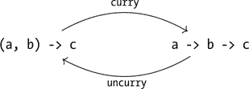

## 9

元组与类型构造器


元组是有序值的集合。对于有序对、有序三元组、有序四元组等，均有对应的元组类型。元组中值的类型通常是不同的，但也可以相同。

在这一章中，我们将讨论元组及其推广：类型构造器。函数类型、列表类型和元组类型都是类型构造器的例子。我们将介绍一种统一的方式来思考这些类型构造器，表面上看它们似乎不同，但它们都有共同的特征。最后，我们将重新审视数值积分，展示如何结合元组和迭代，给出一种执行数值积分的方法，稍后我们将推广这一方法来求解微分方程。

### 对

最简单的元组是对。一个对类型通过给出一个有序对`(a,b)`来指定，其中`a`和`b`是两种类型，并用逗号分隔并用括号括起来。如果`x :: a`且`y :: b`，那么`(x,y) :: (a,b)`。值`(x,y)`的类型是`(a,b)`。逗号和括号有两个作用：它们构成了类型`(a,b)`，也构成了该类型的值`(x,y)`。

例如，这里有一个元组，由描述一个人姓名的`String`和表示该人考试成绩的`Int`组成：

```
nameScore :: (String,Int)
nameScore = ("Albert Einstein", 79)
```

在这个例子中，元组类型是`(String,Int)`，元组值是`("Albert" ` `Einstein", 79)`。

为了更好地理解元组，让我们编写一个函数`pythag`，计算直角三角形的斜边长，已知它的两个直角边的长度。我们将通过一个元组将这两个边长传递给函数。以下是编写这个函数的一种方式：

```
pythag :: (R,R) -> R
pythag (x,y) = sqrt (x**2 + y**2)
```

这个类型签名表明，`pythag`期望一个由两个`R`类型组成的对作为输入，并产生一个`R`类型作为输出。第二行中我们将输入称为`(x,y)`（而不是像`p`这样的简单变量），意味着这个定义在输入上使用了模式匹配。这类似于我们之前看到的`Bool`和列表的模式匹配。对于对的模式匹配很简单，因为只有一个模式：每个对都有形式`(x,y)`。回想一下，`Bool`有两个模式（`True`和`False`），列表有两个模式（空列表`[]`和包含一个元素及列表的`x:xs`）。

有几个 Prelude 函数用于处理对。`fst`函数接受一个对作为输入，返回对的第一个元素作为输出。`snd`函数接受一个对作为输入，返回对的第二个元素作为输出。我们可以在 GHCi 中测试这个行为：

```
Prelude> fst ("Albert Einstein", 79)
"Albert Einstein"
```

`fst`和`snd`这两个函数的类型完全由类型变量给出，表明这些函数与载荷的类型无关。

```
Prelude> :t fst
fst :: (a, b) -> a
Prelude> :t snd
snd :: (a, b) -> b
```

通常，有两种方式可以从像包含多个数据项的对这样的类型中获取数据。一种方式是模式匹配，另一种是使用像`fst`和`snd`这样的函数，通常被称为*消解器*。虽然理论上可以写出只使用模式匹配而不使用消解器的代码，但有时消解器更简单，所以能够同时使用两者是很方便的。如果你处理的数据结果是一个对，并且你只需要其中的一部分，那么消解器`fst`和`snd`就特别有用。一个例子是本章最后一节中的`integral'`函数。

### 对二元函数进行柯里化

在第六章中，我们讨论了柯里化，作为一种将函数视为接受多个参数的方式。通过使用高阶函数，我们可以将斜边函数写成如下形式：

```
pythagCurried :: R -> R -> R
pythagCurried x y = sqrt (x**2 + y**2)
```

元组提供了另一种写二元函数的方式。虽然`pythag`和`pythagCurried`是不同的 Haskell 函数，具有不同的类型，但它们在数学上做的是同样的事情：它们都表示寻找斜边的数学函数。我们将`pythag`称为斜边函数的*元组形式*，将`pythagCurried`称为斜边函数的*柯里化形式*。

这两种编码二元函数的方式是互斥的。你必须为一个特定的函数选择其中一种方式；不能同时使用这两者。请注意，元组形式的`pythag`需要使用括号和逗号来包围两个参数。这是因为你需要一个元组作为输入！请注意，柯里化形式的`pythagCurried`没有括号也没有逗号。并不是逗号是可选的，而是逗号不能出现。

有时你可能会使用一种形式，但后来意识到你希望使用另一种形式。Haskell 提供了两个函数让你在这两种形式之间转换。为了从元组形式转换为柯里化形式，Haskell 提供了函数`curry`。函数`curry pythag`与我们之前定义的`pythagCurried`完全相同。函数`uncurry pythagCurried`与函数`pythag`相同。然而，写`curry pythagCurried`或`uncurry pythag`是没有意义的；当编译器尝试读取它们时，这些构造会产生类型错误。

如果我们将这些函数加载到 GHCi 中（代码文件可以在[*https://lpfp.io*](https://lpfp.io)找到），

```
Prelude> :l Tuples
[1 of 1] Compiling Main            ( Tuples.lhs, interpreted )
Ok, one module loaded.
```

我们可以看到，`pythagCurried`和`curry pythag`的类型是相同的：

```
*Main> :t pythagCurried
pythagCurried :: R -> R -> R
*Main> :t curry pythag
curry pythag :: R -> R -> R
```

我们还可以看到，`pythag`和`uncurry pythagCurried`的类型是相同的：

```
*Main> :t pythag
pythag :: (R, R) -> R

*Main> :t uncurry pythagCurried
uncurry pythagCurried :: (R, R) -> R
```

看一下`curry`和`uncurry`的类型：

```
*Main> :t curry
curry :: ((a, b) -> c) -> a -> b -> c
*Main> :t uncurry
uncurry :: (a -> b -> c) -> (a, b) -> c
```

图 9-1 试图解释这些复杂的类型。图中显示的两种类型是编码一个二元函数的不同方式。高阶函数`curry`和`uncurry`将一种二元函数类型转换成另一种。



*图 9-1：两变量函数的两种类型。高阶函数 `curry` 和 `uncurry` 将一种类型的两变量函数转换为另一种类型的函数。*

### 三元组

除了配对之外，你还可以创建三元组，或者具有更多组成部分的元组。然而，`fst` 和 `snd` 函数仅适用于配对。要访问三元组和更大元组的元素，标准方法是使用模式匹配。例如，可以按如下方式定义提取三元组组件的函数：

```
fst3 :: (a,b,c) -> a
fst3 (x,y,z) = x

snd3 :: (a,b,c) -> b
snd3 (_,y,_) = y

thd3 :: (a,b,c) -> c
thd3 (_x,_y,z) = z
```

`fst3`、`snd3` 和 `thd3` 的定义使用模式匹配为三元组中的元素分配名称。这些名称随后可以在定义的右侧用于表示我们希望函数返回的值。在 `fst3` 函数中，`y` 和 `z` 的值没有被使用。因为它们没有被使用，从某种意义上说，给它们命名是多余的。在 `snd3` 的定义中，`_`（下划线）字符被用作占位符，表示在后续表达式中不使用该量。在 `snd3` 的定义中，我们在三元组的第一和第三个位置使用下划线。这表明给这些元素命名是多余的，因为在定义中没有使用这些名称。在 `thd3` 的定义中，我们展示了下划线的另一种用法。这里我们以一个下划线开始变量名称，表明它不会被使用，但我们仍然为自己命名，可能是为了提醒我们该变量的用途。对于那些不被使用的量，使用下划线是最佳实践，因为编译器会生成关于未使用变量的警告，这通常是错误。为了将这些真正的错误（通常是拼写错误）与那些你不想使用的项区分开来，可以使用下划线。

### 比较列表和元组

元组与列表不同，列表中的每个元素必须具有相同的类型。另一方面，与列表不同，元组的类型明确表示元组包含多少个元素。例如，如果一个表达式的类型是 `[Int]`，它可以是一个包含零个、一个、两个或更多 `Int` 的列表。然而，如果一个表达式的类型是 `(String, Int)`，它就是一个包含一个 `String` 和一个 `Int` 的配对。如果你想要组合正好两个或正好三个元素，元组就是你需要的。超过三个元素后，元组会迅速变得难以操作。另一方面，列表通常很长。一个列表可以包含成千上万个元素。

在我们讨论配对列表之前，我们将绕开一点，简要介绍一种对于该讨论有帮助的类型类别。

### 可能的类型

我们在第五章中看到，对于任何类型 `a`，都有另一种类型 `[a]`，它由每个元素类型为 `a` 的列表组成。这样的列表可以包含零个、一个、两个或更多类型为 `a` 的元素。

同样，对于任何类型`a`，都有一个新的类型`Maybe a`，它由零个或一个类型为`a`的元素组成。为了说明这个新数据类型的动机，假设我们正在编写一个函数`findFirst`，它将在列表中查找第一个符合某些条件的元素。我们可能希望这个函数具有如下类型：

```
findFirst :: (b -> Bool) -> [b] -> b
```

该类型表示我们希望函数`findFirst`接受一个谓词和一个类型为`b`的元素列表作为输入，并返回一个类型为`b`的单个元素作为输出。但如果列表中没有符合我们条件的元素怎么办？在这种情况下，问题就来了，因为函数`findFirst`无法提供一个类型为`b`的元素，而该类型却*要求*函数返回一个类型为`b`的元素。一个可能的做法是，如果没有找到合适的元素，`findFirst`可以使用`error`函数，但这是一个极端的做法，会终止程序，使得后续无法恢复。

更好的解决方案是使用不同的类型签名，像这样：

```
findFirstMaybe :: (b -> Bool) -> [b] -> Maybe b
```

如果`findFirstMaybe`找到一个符合条件的元素`x :: b`，它将返回`Just x`。如果没有找到符合条件的`b`类型元素，`findFirstMaybe`将返回`Nothing`。我们来看一下函数定义是怎样的：

```
findFirstMaybe p xs = case dropWhile (not . p) xs of
                        []    -> Nothing
                        (x:_) -> Just x
```

表达式`dropWhile (not . p) xs`是对列表`xs`进行处理后，移除掉前面最长的一段不满足谓词`p`的元素后剩下的部分。`case`结构允许我们对表达式`dropWhile (not . p) xs`进行模式匹配，检查该表达式匹配的是哪种列表模式，并在每种情况下返回适当的结果。

类型`Maybe a`有两个模式。（回忆一下，`Bool`有两个模式，列表有两个模式，元组有一个模式。）`Maybe a`的值要么是`Nothing`，要么是`Just x`，其中`x :: a`。`Nothing`表示没有类型为`a`的元素，而`Just x`表示一个类型为`a`的元素（即`x`）。表 9-1 展示了涉及`Maybe`的一些表达式及其类型。

**表 9-1：** 涉及 Maybe 的表达式及其类型

| **表达式** |  | **类型** |
| --- | --- | --- |
| `Nothing` | `::` | `Maybe a` |
| `Just "我"` | `::` | `Maybe [Char]` |
| `Just 'X'` | `::` | `Maybe Char` |
| `Just False` | `::` | `Maybe Bool` |
| `Just 4` | `::` | `Num a => Maybe a` |

表 9-2 展示了`Maybe`类型表达式与基础类型表达式的比较。

**表 9-2：** Maybe 类型与基础类型表达式的比较

| **类型** | **具有此类型的表达式** |
| --- | --- |
| `Bool` | `False`, `True` |
| `Maybe Bool` | `Just False`, `Just True`, `Nothing` |
| `Char` | `'h'`, `'7'` |
| `Maybe Char` | `Just 'h'`, `Just '7'`, `Nothing` |
| `String` | `"星期一"`, `"星期二"` |
| `Maybe String` | `Just "星期一"`, `Just "星期二"`, `Nothing` |
| `Int` | `3`, `7`, `-13` |
| `Maybe Int` | `Just 3`，`Just 7`，`Just (-13)`，`Nothing` |

表 9-2 展示了四个内容：对于每种类型 `a`，都有一个类型 `Maybe a`；一个类型为 `Maybe String` 的表达式，除非它是 `Nothing`，否则持有一个类型为 `String` 的值；一个类型为 `String` 的表达式可以通过前缀构造函数 `Just` 转换成类型为 `Maybe String` 的表达式；这些关于 `String` 类型的观察对于 `Bool`、`Char` 或任何其他类型也适用。

现在我们已经掌握了 `Maybe` 类型，让我们来看一下配对列表。

### 配对列表

就像我们可以形成列表的列表一样，我们也可以生成成对的对、配对的列表、列表的对以及更复杂的结构。配对列表可能是这些结构中最有用的一种（虽然列表的列表也非常有用），原因我们接下来会看到。

为了形成一对对的列表，我们可以使用 Prelude 函数 `zip`：

```
*Main> :t zip
zip :: [a] -> [b] -> [(a, b)]
```

`zip` 函数接受两个列表，并将它们的第一个元素、第二个元素等配对，直到较短列表的末尾。 表 9-3 显示了如何使用 `zip` 的一些示例。

**表 9-3：** `zip` 和 `zipWith` 的示例

| **表达式** |  | **计算结果** |
| --- | --- | --- |
| `zip [1,2,3] [4,5,6]` | ⇝ | `[(1,4),(2,5),(3,6)]` |
| `zip [1,2] [4,5,6]` | ⇝ | `[(1,4),(2,5)]` |
| `zip [5..7] "who"` | ⇝ | `[(5,'w'),(6,'h'),(7,'o')]` |
| `zipWith (+) [1,2,3] [4,5,6]` | ⇝ | `[5,7,9]` |
| `zipWith (-) [1,2,3] [4,5,6]` | ⇝ | `[-3,-3,-3]` |
| `zipWith (*) [1,2,3] [4,5,6]` | ⇝ | `[4,10,18]` |

Prelude 函数 `zipWith` 是 `zip` 的高效变体，它更进一步，并将一个函数应用于 `zip` 本会生成的每一对值。

```
*Main> :t zipWith
zipWith :: (a -> b -> c) -> [a] -> [b] -> [c]
```

`zipWith` 的第一个参数是一个高阶函数，描述如何处理类型为 `a` 的元素（来自第一个列表）和类型为 `b` 的元素（来自第二个列表）。`zipWith` 的第二个参数是第一个列表，第三个参数是第二个列表。

Prelude 函数 `unzip` 接受一对对的列表，并将其转换为一对列表。

```
*Main> :t unzip
unzip :: [(a, b)] -> ([a], [b])
```

配对列表的一个用途是查找表。在查找表中，每对中的第一个元素充当 *键*，第二个元素充当 *值*。这样的对称被称为 *键值对*。以下是一个包含三位著名科学家所修“西方文明史”课程最终成绩的查找表。每个人的名字作为键，成绩作为值。

```
grades :: [(String, Int)]
grades = [ ("Albert Einstein", 89)
         , ("Isaac Newton"   , 95)
         , ("Alan Turing"    , 91)
         ]
```

Prelude 函数 `lookup` 接受一个键和一个查找表，并返回相应的值（如果有的话）。函数 `lookup` 返回一个 `Maybe` 类型，以允许键在查找表中未找到的情况。

```
*Main> :t lookup
lookup :: Eq a => a -> [(a, b)] -> Maybe b
*Main> lookup "Isaac Newton" grades
Just 95
*Main> lookup "Richard Feynman" grades
Nothing
```

### 元组和列表推导

以后，我们会希望使用列表推导式来形成我们想要绘制的对（*x*,*y*）的列表。例如，在第十一章中，我们会遇到一个绘图函数`plotPath`，它接受一个由数字对组成的列表作为输入，通常是`[(R,R)]`，并生成一个图表。我们可以使用列表推导式将数据转换为适合绘图的形式。如果我们想要绘制位置随时间变化的图像，可以按照以下方式形成一个时间-位置对的列表：

```
txPairs :: [(R,R)]
txPairs = [(t,yRock30 t) | t <- [0,0.1..6]]

type R = Double
```

相同的对列表可以通过`map`生成：

```
txPairs' :: [(R,R)]
txPairs' = map (\t -> (t,yRock30 t)) [0,0.1..6]

yRock30 :: R -> R
yRock30 t = 30 * t - 0.5 * 9.8 * t**2
```

除了映射，列表推导式还可以基于布尔表达式过滤数据。让我们继续用`yRock30`形成时间-位置对的例子。假设我们只希望在岩石在空中时（*y* > 0）保留对。

```
txPairsInAir :: [(R,R)]
txPairsInAir
   = [(t,yRock30 t) | t <- [0,0.1..20], yRock30 t > 0]
```

在给出`t`值来源的列表后，我们添加一个逗号，然后是用于过滤的布尔表达式。计算机会像以前一样生成一个列表，但现在只保留布尔表达式返回`True`的值。

我们可以通过`map`和`filter`的组合实现相同的效果。我们可以先进行过滤，

```
txPairsInAir' :: [(R,R)]
txPairsInAir'
   = map (\t -> (t,yRock30 t)) $
     filter (\t -> yRock30 t > 0) [0,0.1..20]
```

或者我们可以先进行映射：

```
txPairsInAir'' :: [(R,R)]
txPairsInAir''
    = filter (\(_t,y) -> y > 0) $
      map (\t -> (t,yRock30 t)) [0,0.1..20]
```

表 1-2 中的应用操作符`$`的优先级为 0，因此它两侧的表达式会在合并之前先被计算。通过这种方式，应用操作符充当了一种单符号的括号。通过将整个`map`行用括号括起来，也能达到相同的效果。

注意在刚才展示的匿名函数中使用了`_`（下划线）字符。由于条件表达式仅依赖于对中的第二项，因此没有必要给对中的第一项命名。

一对的类型是由两个现有类型组成的。三元组的类型是由三个现有类型组成的。*类型构造器*的概念（我们将在下一节探讨）提供了一个统一的框架，用于从旧的类型构建新的类型。

### 类型构造器与种类

`Maybe Int`是一个类型，`Maybe Bool`是一个类型，`Maybe R`是一个类型，但`Maybe`本身不是一个类型。它是一个*类型构造器*。类型构造器是一个接受零个或多个类型作为输入并生成一个类型作为输出的对象。`Maybe`是一个一元类型构造器，它接受类型`Int`作为输入并生成类型`Maybe Int`作为输出。换句话说，`Maybe`是一个类型层面的函数。一个零元类型构造器与一个类型相同。为了跟踪这种复杂性，Haskell 为每个类型和类型构造器分配了一个*种类*。例如，`R`具有种类`*`。GHCi 有一个命令`:kind`（简写为`:k`），用于查询某个对象的种类。

```
*Main> :k R
R :: *
```

一个一元类型构造器，例如`Maybe`，具有种类`* -> *`。

```
*Main> :k Maybe
Maybe :: * -> *
```

一旦我们将`Maybe`应用于`R`，得到的`Maybe R`再次是一个类型，具有种类`*`。

```
*Main> :k Maybe R
Maybe R :: *
```

类型的种类为 `*`，单位置类型构造器的种类为 `* -> *`，而且还有一些种类更为复杂的对象。值得注意的是，你可以询问 GHCi 一个类型类的种类。

```
*Main> :k Num
Num :: * -> Constraint
```

这种种类意味着，当提供一个类型时，类型类 `Num` 会生成一个约束。

函数类型、列表类型和元组类型都是由类型构造器构造的特殊类型。Haskell 为函数类型、列表类型和元组类型提供了特殊语法，因此我们可以通过为生成函数、列表和元组的类型构造器命名，来帮助理解它们。`type` 关键字，在第四章中用于将 `R` 作为 `Double` 的同义词，也可以用于参数化类型。

```
type List a = [a]
type Function a b = a -> b
type Pair a b = (a,b)
type Triple a b c = (a,b,c)
```

`List`（列表），像 `Maybe`（可能），是一个单一位置的类型构造器。它接受一个类型作为输入，并生成一个类型作为输出。`Function`（函数）和 `Pair`（对）是双位置的类型构造器。它们接受两个类型作为输入，并生成一个类型作为输出。`Triple`（三元组）是一个三位置的类型构造器。它接受三个类型作为输入，并生成一个类型作为输出。

表 9-4 展示了某些类型构造器和类型类的种类。

**表 9-4：** 各种类型构造器和类型类的种类

| **类型构造器/类** |  | **种类** |
| --- | --- | --- |
| `Integer` | `::` | `*` |
| `R -> R` | `::` | `*` |
| `[String]` | `::` | `*` |
| `(Int,String)` | `::` | `*` |
| `Maybe Int` | `::` | `*` |
| `()` | `::` | `*` |
| `List` | `::` | `* -> *` |
| `[]` | `::` | `* -> *` |
| `Maybe` | `::` | `* -> *` |
| `IO` | `::` | `* -> *` |
| `Function` | `::` | `* -> * -> *` |
| `(->)` | `::` | `* -> * -> *` |
| `Pair` | `::` | `* -> * -> *` |
| `(,)` | `::` | `* -> * -> *` |
| `Either` | `::` | `* -> * -> *` |
| `Triple` | `::` | `* -> * -> * -> *` |
| `(,,)` | `::` | `* -> * -> * -> *` |
| `Num` | `::` | `* -> Constraint` |
| `Foldable` | `::` | `(* -> *) -> Constraint` |

基本类型、函数类型、列表类型、元组类型、`Maybe` 类型和单位类型的种类都是 `*`。单位置类型构造器，如 `List`、`Maybe` 和 `IO`，具有 `* -> *` 的种类，这意味着它们接受一个类型作为输入并生成一个类型作为输出。请注意，符号 `[]`，它是空列表，因此是列表类型的数据构造器，同时也作为列表类型的类型构造器发挥作用。在这个角色中，它的作用与我们上面定义的 `List` 类型构造器相同。`IO` 是一个类型构造器，它将一个纯粹的类型转换为带有副作用的类型；我们将在第十一章中讨论它。

二元类型构造器，如 `Function`、`Pair` 和 `Either`，具有 kind `* -> * -> *`，表示它们接受两个类型作为输入并产生一个类型作为输出。符号 `(->)` 与我们之前定义的 `Function` 类型构造器相同，`(,)` 与 `Pair` 相同。三元类型构造器，如 `Triple`，具有 kind `* -> * -> * -> *`，表示它接受三个类型作为输入并产生一个类型作为输出。符号 `(,,)` 与 `Triple` 相同。

表 9-5 显示了 Haskell 中各种 kind 的含义。

**表 9-5：** Kinds 的含义

| **Kind** | **含义** |
| --- | --- |
| `*` | 类型 |
| `* -> *` | 一元类型构造器 |
| `* -> * -> *` | 二元类型构造器 |
| `* -> * -> * -> *` | 三元类型构造器 |
| `* -> Constraint` | 类型的类型类 |
| `(* -> *) -> Constraint` | 类型构造器的类型类 |

每个类型类也有一个 kind。类型类接受一个类型或类型构造器作为输入，并产生一个约束作为输出。我们在第八章讨论的基本类型类具有 kind `* -> Constraint`，意味着它们接受一个类型作为输入，并产生一个类型类约束作为输出。类型类 `Foldable` 的 kind 是 `(* -> *) -> Constraint`，意味着它接受一个类型构造器（如 `List` 或 `Maybe`）作为输入，并产生一个类型类约束作为输出。`List` 和 `Maybe` 是 `Foldable` 的实例，但 `IO` 不是。

本章中我们对元组的最终使用是在数值积分中。通过将元组与 `iterate` 一起使用，我们获得了一种数值积分的方法，稍后我们可以将其推广为解决微分方程的方法。

### 数值积分 Redux

我们在第六章中讨论了数值积分，在那里我们使用了列表推导来计算曲线下方矩形的面积。现在我们有了元组，我们可以提出一种数值积分的替代方法，这种方法更接近我们后来用来解决微分方程的方法。这个思想是，如果我们将当前积分变量的值（假设为时间）与当前积分值配对，我们就可以一步步地得到整个积分。为了向前推进一步，我们将时间增加一个时间步长，并通过曲线下一个矩形的面积来增加最终得到的积分的累积值。

推进一步的函数如下所示：

```
oneStep :: R         -- time step
        -> (R -> R)  -- function to integrate
        -> (R,R)     -- current (t,y)
        -> (R,R)     -- updated (t,y)
oneStep dt f (t,y) = let t' = t + dt
                         y' = y + f t * dt
                     in (t',y')
```

函数 `oneStep` 将传入的时间步长命名为 `dt`，被积分的函数命名为 `f`，当前积分变量的值命名为 `t`，当前积分值的累积值命名为 `y`。然后它返回一个元组，包含增加了时间步长的积分变量值和通过函数 `f` 下一个矩形面积 `f t * dt` 增加的当前积分值。

为了计算积分，我们在自变量小于上限时反复执行单步操作。

```
integral' :: R -> Integration
integral' dt f a b
    = snd $ head $ dropWhile (\(t,_) -> t < b) $
      iterate (oneStep dt f) (a + dt/2,0)
```

表达式 `oneStep dt f :: (R,R) -> (R,R)` 是一个通过一个时间步长更新当前时间积分对的函数。由于该函数的类型是 `a -> a`，它可以与 `iterate` 一起迭代。表达式 `iterate (oneStep dt f) (a + dt/2,0)` 会生成一个无限的时间积分对列表，起始时间是 `a + dt/2`，即第一个时间区间的中间值，初始积分值为 0，随着迭代积累。

通过对无限列表应用 `dropWhile (\(t,_) -> t < b)`，我们丢弃了时间小于上限 `b` 的初始对，以获得一个无限列表，其第一个对的时间非常接近上限 `b`。然后，应用 `head` 对这个无限列表进行操作，返回时间非常接近上限的对。最后，对该对应用 `snd`，返回积分的值。

为方便起见，这里是 第六章 中我们之前在 `integral'` 的类型签名中使用的 `Integration` 类型：

```
type Integration = (R -> R)  -- function
                 -> R        -- lower limit
                 -> R        -- upper limit
                 -> R        -- result
```

### 总结

本章介绍了元组，它是一种将两个或更多值组合成一个单一值的方式。接着我们讨论了类型构造函数，它是在类型层面上的函数，用来从输入类型形成输出类型。我们通过使用元组介绍了一种使用 `iterate` 来实现数值积分的替代方法，结束了这一章。

在下一章中，我们将回到物理学，研究三维运动学，并开发我们将用于向量的数据类型。

### 练习题

**练习 9.1.** 编写一个函数

```
polarToCart :: (R,R) -> (R,R)
```

它接受极坐标 (*r*, *θ*)，其中 *θ* 是弧度表示，并返回一对笛卡尔坐标 (x, y) 作为输出。

**练习 9.2.** 用语言解释 `curry` 和 `uncurry` 的类型含义。

**练习 9.3.** Prelude 函数

```
head :: [a] -> a
```

存在一些问题，因为如果传入一个空列表，它会导致运行时错误。编写一个函数

```
headSafe :: [a] -> Maybe a
headSafe = undefined
```

如果传入空列表，它返回 `Nothing`，否则返回 `Just x`，其中 `x` 是给定列表的第一个元素（头部）。用你自己的代码替换 `undefined`。（如果你希望在代码未写完之前加载代码，可以在自己的函数中使用 `undefined` 作为占位符。）

**练习 9.4.** 我们之前提到，类型 `Maybe a` 有点像类型 `[a]`，不同之处在于 `Maybe a` 的元素只能有零个或一个。为了使这个类比更加精确，编写一个函数

```
maybeToList :: Maybe a -> [a]
maybeToList = undefined
```

它将一个 `Maybe` 类型转换为一个列表。`Nothing` 应该映射到哪个列表？`Just x` 应该映射到哪个列表？

**练习 9.5.** 查明并解释当 `zip` 与两个长度不相同的列表一起使用时会发生什么。

**练习 9.6.** 定义一个函数

```
zip' :: ([a], [b]) -> [(a, b)]
zip' = undefined
```

它将一对列表转换为一对元素的列表。（提示：可以考虑使用 `curry` 或 `uncurry`。）

**练习 9.7.** 点操作符 (`.`) 用于函数组合。如果我们先做 `unzip` 再做 `zip'`，我们会得到一个具有以下类型签名的函数：

```
   zip' . unzip :: [(a, b)] -> [(a, b)]
```

这是恒等函数吗？（换句话说，它是否总是返回给定的表达式？）如果是，你怎么知道？如果不是，请给出反例。

如果我们先使用 `zip'` 再使用 `unzip`，我们会得到一个具有以下类型签名的函数：

```
   unzip . zip' :: ([a], [b]) -> ([a], [b])
```

这是恒等函数吗？

**练习 9.8.** 使用之前的 `grades` 查找表，展示如何使用 `lookup` 函数来生成值 `Just 89`。还要展示如何使用 `lookup` 函数生成值 `Nothing`。

**练习 9.9.** 将以下数学函数翻译成 Haskell：

*x*(*r*, *θ*, *ϕ*) = *r* sin *θ* cos *ϕ*

使用三元组作为函数 `x` 的输入。同时给出类型签名以及函数定义。

**练习 9.10.** 一辆汽车从静止开始，在一条平直的公路上以 5 m/s² 的加速度行驶。我们想要为这辆车生成一个无限长的时间-速度对 `tvPairs` 列表，每秒一个。以下是 `tvPairs` 的代码：

```
tvPairs :: [(R,R)]
tvPairs = iterate tvUpdate (0,0)
```

为 `tvUpdate` 编写类型签名和函数定义。

```
tvUpdate = undefined
```

列表 `tvPairs` 应该看起来像 [(0,0),(1,5),(2,10),(3,15),...]。在编写 `tvUpdate` 函数后，使用 `take` 函数查看 `tvPairs` 的前几个元素。

**练习 9.11.** 斐波那契数列是这样的序列：每一项是前两项的和。前几个项是 1, 1, 2, 3, 5, 8, 13, 21, 34, 55。编写一个序列

```
fibonacci :: [Int]
fibonacci = undefined
```

用于（无限）斐波那契数列。

建议编写一个辅助序列

```
fibHelper :: [(Int,Int)]
fibHelper = undefined
```

使用函数 `iterate`。`fibHelper` 的前几个项应为 [(0,1),(1,1),(1,2),(2,3),(3,5),...]。然后使用 `fibHelper` 编写 `fibonacci` 序列。

**练习 9.12.** 阶乘函数接受一个非负整数并返回从 1 到该整数的所有正整数的积。通常用感叹号表示。例如，5! = 5 × 4 × 3 × 2 × 1 = 120。我们定义 0! = 1。本练习的目的是编写一个阶乘函数

```
fact :: Int -> Int
```

使用 `iterate`。练习 9.11 中的建议在这里也有用（编写一个序列 `factHelper :: [(Int,Int)]`，使用 `iterate`，然后定义 `fact` 来通过 `!!` 运算符从该序列中获取值）。

**练习 9.13.** 使用列表推导式编写以下函数，而不是使用 map：

```
pick13 :: [(R,R,R)] -> [(R,R)]
pick13 triples = map (\(x1,_,x3) -> (x1,x3)) triples
```

**练习 9.14.** 假设我们以 15 m/s 的速度将一块石头垂直抛向空中。使用列表推导式生成一个 (时间, 位置, 速度) 三元组的列表（类型为 `[(R,R,R)]`），记录石头在空中的时间间隔。你的列表应该包含足够的三元组，以便如果绘制数据，图形看起来会比较平滑。

**练习 9.15.** 元组可以嵌套，比如 `((3,4),5)`。尽管这个对包含三个数字，但它与三元组不同。编写一个函数

```
toTriple :: ((a,b),c) -> (a,b,c)
toTriple = undefined
```

它将一个第一个分量是对的对转换为三元组。
